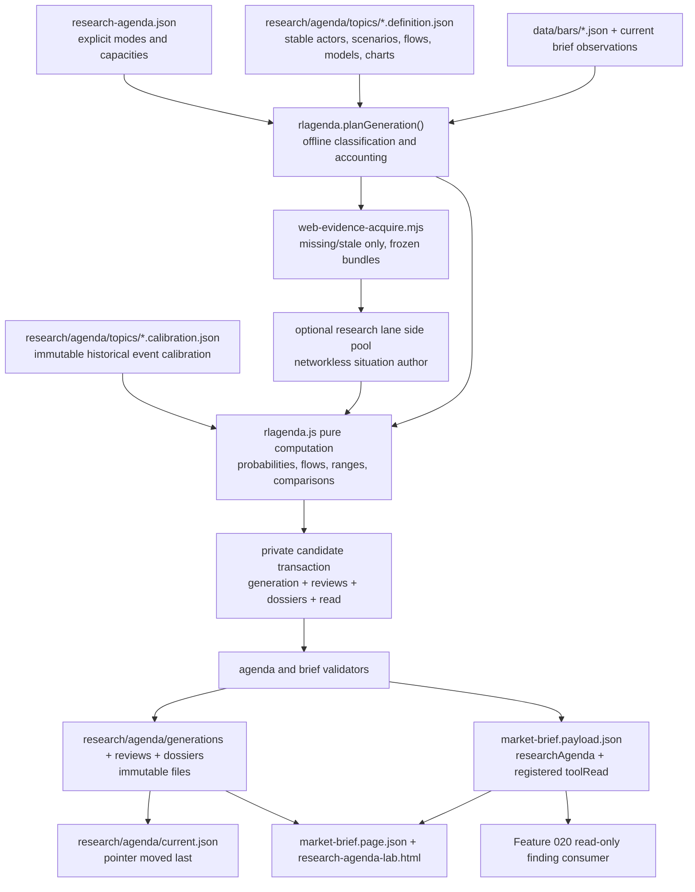

# Feature 019 - Custom Recurring Research Agenda - Design

Owner: `bubbles.design`. This document owns the technical architecture,
contracts, model boundaries, reader surfaces, and validation strategy. It does
not own business requirements (`spec.md`), scenario and scope planning
(`scenario-manifest.json` and `scopes/`), implementation, tests, or
certification.

**Design language.** No named design language is configured. The tool follows
the repository's existing build-free static Pages, UMD module, shared data,
ordinary four-view, and Simple/Power conventions.

**Delivery truth.** The registry, UMD foundation, recurring refresh runtime,
immutable agenda store, owning tool, brief read, and public page projection are
committed and reachable. This design describes those surfaces as delivered and
identifies contract corrections that remain required. Repository presence is
not certification. `state.json.status` and `state.json.certification.status`
remain `not_started` until the full-delivery quality chain certifies them.

## Design Brief

**Current State.** `scripts/brief-refresh-scheduled.sh` runs each publication in
a disposable single-branch clone, so unattended generation reads committed
state only. `research-agenda.json`, `rlagenda.js`, and
`scripts/research-agenda-refresh.mjs` now own standing topics, recurring
reviews, dossiers, and agenda history. `research-agenda-lab.html` and the brief
page expose the committed read. Full-delivery certification remains pending.

The delivered runtime uses existing repository primitives. `data/bars/` contains
same-origin history for the primary topic's initial U.S.-listed proxies,
including `BNO`, `USO`, `XLE`, `MPC`, `PSX`, `XOM`, `CVX`, `COP`, `DBC`, `DBA`,
`XLB`, and `XLI`. `scripts/web-evidence-acquire.mjs` already defines a bounded,
fail-closed, injected acquisition boundary that produces frozen
`web-evidence-bundle/v1` artifacts. The dated geopolitical source material is
in `notes/us-iran-oil-market-intervention-patterns.md`; it is historical input,
not a live dossier.

**Target State.** Keep the delivered architecture and close the contract gaps
without weakening its requirements. The committed registry remains the only
source for lifecycle, review modes, freshness, and runtime capacity.
`rlagenda.js` remains the single owner of validation, selection, evidence
weighting, deterministic models, immutable records, chart projections, and
reader sentences. The runtime must consume every validated policy value and
must refuse missing model, finding, publication, or budget input.

Every brief generation creates an immutable generation manifest. Every active
every-generation topic also receives either a complete current-generation
review record or a named `unavailable` record. A quiet pass writes a new review
record with `outcome: "unchanged"` while leaving the prior substantive dossier
current. Prior outputs are comparison evidence only; they never seed, smooth,
or constrain current probabilities or direction.

**Patterns To Follow.** The delivered `rlagenda.js` follows the frozen UMD and
closed-refusal style of current `rlattention.js` and `rlcausal.js`. Node loads
the same UMD module used by the browser. Evidence acquisition extends the
current `web-evidence-acquisition/v1` policy and reuses
`scripts/web-evidence-acquire.mjs`; it does not create a second fetcher. The
publisher keeps the current scoped-staging rule in
`scripts/brief-refresh-and-push.sh` and the root-page registry parity enforced by
`scripts/selftest.mjs` and `scripts/build-pages-site.mjs`.

**Patterns To Avoid.** Do not infer a missing mode, cadence, freshness window,
mandatory-topic maximum, cadence budget, lane timeout, or lane capacity. Do not
let the agent emit final probabilities, shock ranges, proxy ranges, chart
points, or change classifications. Do not update from prior probabilities. Do
not sum chokepoint losses across overlapping routes. Do not browse outside the
governed acquisition stage. Do not publish a prior dossier as the current
every-generation result. Do not write actions, attention items, anomaly seeds,
or alerts; Feature 020 owns those destinations.

**Resolved Decisions.** The committed registry and config policy objects are
the only numeric policy sources. Runtime code consumes the validated objects
without restating their values. Reviews and dossiers stay distinct. Each
attempted generation creates a review, while a dossier versions substantive
analytical state. The networkless research author remains a soft-failing side
pool beside the four critical lanes. The five visible controls are the complete
user-lever surface. A whole-publication transaction validates immutable data,
history, payload, and page projections before moving the current pointer last.
The registered `research-agenda-lab.html` remains Simple by default with Power
as the detailed research surface.

**Open Questions.** None blocking. Policy changes require a reviewed edit to
`research-agenda.json` or `market-brief.config.json`. Code literals and fallback
values cannot change runtime capacity.

## 1. Purpose And Change Boundary

The capability turns a small committed set of public research questions into
current, versioned, reproducible analysis. It preserves stable topic and model
definitions while replacing the fluid situation assessment on each selected
generation. It exposes both the current-generation review and all predecessor
evidence without converting findings into destination actions.

In scope:

- the committed agenda registry and topic-specific definition/calibration data;
- explicit every-generation and cadence selection;
- governed public evidence acquisition and evidence-graph validation;
- immutable generation, review, dossier, model-output, and source records;
- deterministic scenario, flow, commodity, proxy, comparison, and chart math;
- the registered agenda tool, brief summary, and tool-read integration;
- append-only history, atomic publication, failures, and validation.

Excluded surfaces remain unchanged:

- Feature 019 reads no holdings, size, cost basis, P&L, account, or mandate;
- it does not write `nextSession.actions`, decision attention, alert seeds,
  candidates, or publication state;
- it does not expand the committed instrument universe or add credentials;
- it does not add a server, database, browser module loader, or build step;
- it does not alter Feature 020 destination thresholds or eligibility rules.

## 2. Architecture Overview



The architecture has six load-bearing invariants.

1. **Selection is offline.** Network availability cannot decide whether an
   active every-generation topic is mandatory or a cadence topic is due.
2. **Situation authorship is replaceable.** The agent writes bounded evidence,
   actor/channel assessments, and interpretation. It never writes model output.
3. **Models are stable and deterministic.** Both Node and the browser call the
   same pure UMD functions over explicit inputs.
4. **Prior state cannot smooth current state.** Current models start from the
   topic definition's declared priors and current-generation evidence. Prior
   outputs enter only the comparison functions after current outputs exist.
5. **Every mandatory topic is accounted for.** Each generation contains one
   current review or named unavailable record for every active
   every-generation topic.
6. **Publication is pointer-last and one commit.** Immutable assets are created
  first. Mutable candidates are built and validated in private same-filesystem
  paths. `current.json` becomes reachable only after history, payload, and all
  page projections are ready.

## Capability Foundation

### 3.1 Foundation Contract

The root UMD module `rlagenda.js` is the single owner of these concepts:

| Contract | Responsibility | Consumers |
| --- | --- | --- |
| `research-agenda/v1` | Registry validation, explicit modes, capacities, lifecycle | planner, validator, browser |
| `research-topic-definition/v1` | Stable sections, actors, scenarios, flows, transmission, models, charts | planner, model engine, tool |
| `research-evidence-record/v1` | Direct/indirect/inference semantics, provenance, conflicts, causal impacts | acquisition adapter, agent validator, model engine, UI |
| `research-generation/v1` | One immutable classification record for every declared topic in one brief generation | publisher, brief, tool |
| `research-review/v1` | One attempted current-generation pass or named `unavailable` result | publisher, charts, comparison UI |
| `research-dossier/v1` | One immutable substantive analytical version | tool, Feature 020 read boundary |
| `research-agenda-read/v1` | Compact brief and tool-read projection | payload validator, brief, tool |

`rlagenda.js` exports closed vocabularies, pure validators, deterministic model
functions, candidate composition, refusal records, and reader-facing status
sentences. Node loads it with `createRequire`, matching current UMD consumption;
the browser loads it with a normal `<script>` tag. No consumer duplicates enum,
formula, weighting, or outcome logic.

### 3.2 Extension Points

Extension is closed and data-driven, not a plugin system.

- `reviewPolicy.mode`: exactly `every-generation | cadence`.
- `analyticalSection.kind`: a closed set owned by `rlagenda.js`; topic
  definitions choose and configure members.
- `evidenceRole`: exactly `direct | indirect | model-inference`.
- `modelFunctionId`: a closed dispatch table naming pure exported functions.
- `chartKind`: a closed renderer projection with an adjacent table contract.
- `triggerKind`: a closed offline evaluator over committed evidence.

Adding a new kind requires one foundation change, one adversarial test, and at
least one production consumer. Adding another topic using existing kinds is a
committed registry and definition edit only.

### 3.3 Foundation-Owned Behavior

- exact-shape validation and named refusal;
- lifecycle preservation and operator-only transitions;
- every-generation first selection and cadence budget accounting;
- immutable identity, supersession, and question-byte checks;
- evidence freshness, quality, corroboration, conflict, and impact caps;
- deterministic calculations and chart-series construction;
- private-field and unsafe-source rejection;
- complete section accounting and current-generation enforcement;
- reader sentences that keep machine codes out of prose.

## Concrete Implementations

### 4.1 Geopolitical Supply Shock - Every Generation

The topic id is `geopolitical-supply-shock`. Its review mode is
`every-generation`. It supplies topic-specific actor, scenario, flow,
transmission, proxy, calibration, source-requirement, trigger, invalidation, and
chart definitions while relying on the foundation for all lifecycle,
evidence, model, storage, and publication behavior.

Its declared sections are:

1. actor reaction functions;
2. escalation scenario tree and probabilities;
3. Hormuz, Bab el-Mandeb, and Red Sea physical/insured flow state;
4. oil, refined products, LNG, fertilizer, aluminum, and shipping transmission;
5. U.S.-listed proxy sensitivity and historical event calibration;
6. triggers and invalidations;
7. source ledger;
8. predecessor change assessment.

All eight are evaluated on every generation. A section may be `changed`,
`unchanged`, `stale`, or `unavailable`; omission is invalid.

### 4.2 Defense Earnings Acceleration - Cadence

The `defense-earnings-acceleration` topic uses an explicit seven-day
cadence and a declared material-change trigger over committed earnings and bar
observations. Its topic definition supplies consensus-revision and production
capacity sections. It does not inherit geopolitical sections.

### 4.3 Food Inputs - Cadence

The `food-inputs-outlook` topic uses an explicit seven-day cadence and
a declared trigger over current public commodity observations. Its definition
supplies grains, fertilizer, catalysts, move ranges, and invalidations. It does
not inherit the primary topic's actors or chokepoints.

### Variation Axes

| Axis | Variants | Foundation Ownership |
| --- | --- | --- |
| Review policy | every generation; cadence plus triggers | validation, selection, accounting |
| Analytical shape | geopolitical reaction/flow tree; earnings acceleration; food inputs | section contract and complete-pass rule only |
| Evidence mix | public web, official observations, committed bars, deterministic inference | common evidence graph and quality policy |
| Model family | probability tree, flow network, shock range, proxy sensitivity | pure dispatch and output validation |
| UI composition | compact brief read; Simple tool; Power drill-down; version comparison | shared read and chart/table contracts |
| Failure state | `unchanged`, `stale`, `unavailable`, `paused`, `deferred`, `refused` | closed outcomes and reader vocabulary |

## 5. Delivered Artifact And Consumer Inventory

| Artifact | Role | Mutation rule | Production consumers |
| --- | --- | --- | --- |
| `research-agenda.json` | operator-owned registry and required review/runtime capacities | ordinary visible commit | planner, validator, tool |
| `rlagenda.js` | UMD foundation and all deterministic math | source change | Node publisher, validators, browser |
| `research/agenda/topics/geopolitical-supply-shock.definition.json` | stable primary topic model | reviewed versioned edit | planner, model, tool |
| `research/agenda/topics/geopolitical-supply-shock.calibration.json` | historical event calibration | append new events or supersede by version | model, tool |
| `research/agenda/generations/<generationId>.json` | all-topic generation accounting | create-only | brief, tool, audit |
| `research/agenda/reviews/<topicId>/<generationId>.json` | current-generation pass result | create-only | current pointer, charts, tool |
| `research/agenda/dossiers/<topicId>/<dossierId>.json` | substantive analytical version | create-only | tool, Feature 020 |
| `research/agenda/history.jsonl` | compact append-only review/lifecycle ledger | append candidate then replace whole file | tool, audit |
| `research/agenda/current.json` | current generation/review/dossier pointers | atomic rename, moved last | brief, tool |
| `research-agenda-lab.html` | usable owning tool | source change | reader |
| `rlexperience-adapters/research-agenda.js` | thin ordinary-view bridge to `rlagenda.js` | no copied math | shared experience runtime |
| `notes/research-agenda-lab.md` | methodology and operator-facing checks | source change | reader/developer |

`research/` is part of the `PUBLIC_DIRECTORIES` allowlist in
`scripts/build-pages-site.mjs`. Root artifacts follow the existing root-file
packaging rule. Every path is public by design and must pass the current PII
scan.

## 6. Registry And Topic Definition Contracts

### 6.1 Root Registry

The committed `research-agenda.json` file is the runtime policy source. This
design does not duplicate its numeric values. `rlagenda.validateAgenda()` must
validate and deep-freeze the exact `reviewPolicy` object before any planner,
acquirer, or author receives it.

| Registry member | Runtime obligation |
| --- | --- |
| `maxActiveEveryGenerationTopics` | Bound mandatory selection and reject count plus one before authoring. |
| `cadenceTopicReviewBudget` | Bound due cadence selection after mandatory work. |
| `cadenceSelectionOrder` | Drive the exact deterministic comparator. |
| `maxConcurrentTopicAcquisitions` | Bound the topic-acquisition worker queue. It is distinct from per-lane HTTP concurrency. |
| `researchAuthoring.timeoutSeconds` | Bound each author attempt through the timer boundary. |
| `researchAuthoring.attempts` | Bound actual author invocations per topic. |
| `researchAuthoring.concurrency` | Bound the author worker queue and reported peak concurrency. |
| `researchAuthoring.maxInputBytes` | Bound canonical UTF-8 request bytes before invocation. |
| `researchAuthoring.maxOutputBytes` | Bound canonical UTF-8 response bytes before parsing or publication. |

The planner passes one frozen policy value and its canonical digest through
`research-author-input/v1`, acquisition scheduling, side-pool scheduling, and
telemetry validation. Equality to a copied literal is forbidden. Every
validated member must affect scheduling or admission. Telemetry must prove that
attempt count, peak author concurrency, peak topic-acquisition concurrency,
elapsed author time, input bytes, and output bytes stayed within that same
policy object.

Mode validation is discriminated and exact:

- `every-generation` requires `freshnessWindowHours` and rejects
  `cadenceDays`;
- `cadence` requires positive `cadenceDays` and positive
  `freshnessWindowDays`;
- a missing/unknown mode is a named topic refusal;
- active every-generation count above the declared maximum refuses the
  generation before authoring; it is never converted to `cadence` or
  `deferred`;
- cadence capacity applies only after all mandatory topics are selected.

`maxConcurrentTopicAcquisitions` limits selected topics being acquired at one
time. The `research-agenda` lane's `maxConcurrentFetches` limits HTTP requests
inside one topic acquisition. Both limits apply. Neither can replace the other.

### 6.2 Topic Definition

Each definition is independent and versioned. It contains:

- `topicId`, `definitionVersion`, and `declaredQuestionSha256`;
- the exact eight primary section ids or the topic's own section set;
- stable actors, channels, claims, causal paths, scenario tree, flow network,
  transmission coefficients, proxy definitions, and chart definitions;
- explicit evidence-quality weights, impact caps, freshness rules, and change
  thresholds;
- explicit source requirements and safe query templates;
- trigger and invalidation definitions;
- a calibration reference and the required committed bar references.

The agent cannot edit a definition during generation. A definition change is a
visible operator/reviewer commit with a new `definitionVersion`; a review binds
the exact definition digest it used.

### 6.3 Closed Refusal Families

`rlagenda.js` exposes closed `RLAGENDA-*` families for contract, id, duplicate,
question, boundary, mode, cadence, freshness, capacity, lifecycle, section,
source, evidence, impact, model, flow, calibration, private data, supersession,
current-generation, and publication failures. Structured artifacts carry the
codes. Reader prose uses `readerSentence()` and specific plain-language reasons,
never a raw code.

## 7. Durable State And Fluid Situation Analysis

### 7.1 Stable, Deterministic State

The stable layer consists of registry questions and policies, topic definition
versions, calibration versions, immutable dossiers, immutable review records,
and deterministic chart points. Stable does not mean unchangeable. It means a
change is a new explicit version with a digest and provenance rather than an
agent mutation hidden inside a run.

Stable state owns:

- actor ids and reaction-function dimensions;
- scenario ids, tree edges, priors, and direction values;
- flow ids, route edges, baseline units, alternate routes, and overlap groups;
- transmission model ids and coefficients;
- proxy ids, U.S.-listed tickers, sensitivity definitions, and calibration
  events;
- evidence-quality weights, caps, freshness, and conflict rules;
- chart definitions, series keys, units, and axis domains;
- triggers, invalidations, and comparison thresholds.

### 7.2 Per-Generation Situation Layer

The agent authors one candidate `research-situation/v1` for each successfully
acquired selected topic. It contains only:

- evidence records and links between them;
- actor-state observations against stable dimensions;
- channel-state observations against stable channels;
- bounded proposed model impacts with causal explanations;
- section-by-section interpretation and explicit gaps;
- candidate findings whose claims remain inside the declared boundary.

It contains no scenario probability, commodity range, proxy return range,
chart point, or change assessment. The collector rejects those output fields so
the agent cannot smuggle a black-box number into the deterministic layer.

The current situation layer may strengthen, weaken, or reverse sharply. The
prior dossier is passed separately as `comparisonEvidence`. It is excluded from
`updateEscalationProbabilities`, `computeFlowState`,
`computeCommodityShockRanges`, and `computeEquityProxyRanges`. Only
`compareScenarioOutputs` and `classifyChangeDirection` may read prior output,
and they run after current output is frozen.

### 7.3 Review Versus Dossier

Every attempted selected topic receives one immutable `research-review/v1`.
The validator requires this exact active field set:

| Field group | Required fields |
| --- | --- |
| Identity | `contractVersion`, `reviewId`, `generationId`, `topicId`, `attemptedAt`, `validationState`, `historicalOnly` |
| Selection | `mode`, `selectionReason`, `completePass` |
| Result | `outcome`, `reason`, `newestEvidenceAgeHours`, `changeAssessment`, `sectionStates`, `evidenceIds` |
| Sustained state | `modelSnapshotRef`, `chartState`, `triggerStates`, `invalidationStates` |
| Lineage | `dossierRef`, `predecessorDossierRef` |

`outcome` is exactly `updated`, `unchanged`, `stale`, or `unavailable`. The
generation classification row separately carries `state` from the FR-019-026
classification vocabulary. `reason` is required for `unavailable` and every
non-reviewed classification. `changeAssessment` is exactly `strengthened`,
`weakened`, `reversed`, `unchanged`, or `insufficient-evidence` when a
predecessor exists. It is `insufficient-evidence` when no comparison can be
supported.

Each generation classification row is exactly `topicId`, `state`, `reason`,
`reviewRef`, and `dossierRef`. `state` is exactly `reviewed`, `unavailable`,
`paused`, `retired`, `not-due`, `deferred`, or `refused`. A `reviewed` or
`unavailable` row resolves a same-generation review. Every other state has no
review and repeats its classification token as the read `outcome`.

`modelSnapshotRef` is either `null` or an exact immutable reference containing
`dossierRef`, `modelInputsSha256`, `modelOutputsSha256`, and
`chartSeriesSha256`. An `updated` review references its new dossier. An
`unchanged` review references the reused current dossier. A complete `stale`
review may reference that dossier but must preserve the stale label. An
`unavailable` review cannot invent a snapshot.

Every non-historical `research-dossier/v1` requires exactly
`contractVersion`, `dossierId`, `topicId`, `generationId`, `reviewId`, `mode`,
`selectionReason`, `historicalOnly`, `validationState`, `observedThrough`,
`outcome`, `changeAssessment`, `declaredQuestionSha256`, `sectionStates`,
`findings`, `evidenceRecords`, `sourceLedger`, `modelInputs`, `modelOutputs`,
`chartStates`, `triggerStates`, `invalidationStates`,
`predecessorDossierRef`, and `supersedesDossierRef`. A chart state is exactly
`chartId`, `state`, `series`, and `annotations`. A trigger or invalidation state
is exactly its definition id, current state, observed-at time, and evidence
refs. A new dossier is written only when substantive state changes. No active
field may be omitted because its value is unchanged.

A quiet pass writes a new same-generation review with `outcome: "unchanged"`,
`completePass: true`, and the prior immutable dossier and model snapshot refs.
It does not manufacture a dossier version. The current substantive dossier
stays readable and drives the current sustained model without becoming new
evidence.

### 7.4 Generation Manifest And History

Each `research-generation/v1` accounts for every registry row exactly once as
`reviewed`, `unavailable`, `not-due`, `paused`, `retired`, `deferred`, or
`refused`. The invariant is:

`classifiedTopicCount + refusalCount === declaredTopicCount`.

For every active every-generation topic, status must be `reviewed` or
`unavailable`, and its `reviewRef` must name this generation. `not-due` and
`deferred` are invalid for that mode.

`history.jsonl` appends compact generation, review, lifecycle, and correction
events. Corrections are new events with `correctsEventId`; no prior line,
review, dossier, model output, or chart point is edited.

Lifecycle detection compares each current registry topic with the latest
validated lifecycle event for that topic. A topic with no event emits one
baseline lifecycle event with `fromState: null`. A changed topic emits exactly
one event with `fromState`, `toState`, `topicId`, `occurredAt`,
`registryTopicSha256`, and `supersedesEventId`. An unchanged topic emits
none. The event id hashes those transition fields and the generation identity.
Retries of one generation therefore derive the same id, and append validation
rejects a duplicate. Later generations see the latest `toState` and do not
repeat `paused` or `retired` events. A later transition back to `active` creates
a new linked event. No transition deletes history.

## 8. Evidence Graph And Model Impact Contract

### 8.1 Evidence Record

Every evidence record has this exact semantic content:

```jsonc
{
  "contractVersion": "research-evidence-record/v1",
  "evidenceId": "geo-20260813-e017",
  "observedAt": "2026-08-13T15:20:00Z",
  "availableAt": "2026-08-13T15:24:00Z",
  "source": {
    "sourceId": "wire-article-digest",
    "canonicalUrl": "https://www.reuters.com/...",
    "publisher": "Reuters",
    "sourceClass": "wire",
    "independentOriginGroup": "wire:reuters",
    "contentSha256": "sha256:..."
  },
  "provenanceClass": "observed-fact",
  "evidenceRole": "indirect",
  "claim": "War-risk insurance widened while reported transit remained flat.",
  "actorIds": ["shipping-insurers"],
  "channelIds": ["hormuz-insured-flow"],
  "claimIds": ["insured-flow-normalization"],
  "confidence": {
    "grade": "moderate",
    "basis": "one wire source plus one current owner observation"
  },
  "corroboration": {
    "state": "corroborated",
    "supportingEvidenceIds": ["geo-20260813-e009"],
    "independentOriginCount": 2
  },
  "conflicts": {
    "state": "unresolved",
    "evidenceIds": ["geo-20260813-e012"],
    "effect": "reduce-weight"
  },
  "causalPath": ["war-risk-premium", "insured-capacity", "effective-throughput"],
  "freshness": {
    "state": "current",
    "ageHours": 3,
    "policyRef": "geopolitical-supply-shock.definition.json#evidencePolicy"
  },
  "modelImpacts": [
    {
      "targetKind": "scenario-weight",
      "targetId": "managed-coercion",
      "direction": "increase",
      "rawMagnitude": 0.35,
      "causalPathRef": "insured-flow-path",
      "rationale": "Insurance tightening impairs effective flow without proving physical loss."
    }
  ],
  "refutedBy": ["insured capacity and transit normalize for three consecutive observations"]
}
```

`confidence` is evidence quality only. It is never displayed or consumed as a
scenario probability, price probability, or chance of success.

### 8.2 Published Finding And Feature 020 Seam

Every published finding uses this exact required field set:

```text
findingId, observedAt, claim, publicSubjects, horizon, source,
statedConfidence, provenanceClass, evidenceRole, evidenceRefs,
triggerRefs, invalidationRefs, causalPath, refutedBy, limitations
```

`observedAt` is a canonical instant at or before the generation cutoff.
`claim` and `statedConfidence.basis` are non-empty. `source` is exactly
`{ sourceIds: string[] }` with at least one unique id that resolves through the
dossier source ledger. `statedConfidence` is exactly `{ grade, basis }`, and
`grade` uses the declared confidence vocabulary. `provenanceClass` and
`evidenceRole` use their closed vocabularies. `publicSubjects`, `evidenceRefs`,
`triggerRefs`, and `invalidationRefs` are non-empty unique arrays. Every ref
must resolve inside the same validated dossier or topic definition. Each public
subject is exactly `{ kind, value }` and must remain inside the topic's public
scope. A seam-capable finding's `horizon` is exactly `structural | swing |
tactical`; Feature 020 must copy it without reclassification.

The `research-finding-reference-seam/v1` object contains only
`contractVersion`, `topicId`, `dossierId`, `definitionVersion`,
`declaredQuestionSha256`, and `findings`. Its finding projection contains
`findingId`, `observedAt`, `claim`, `publicSubjects`, `horizon`,
`statedConfidence`, `provenanceClass`, `evidenceRole`, `evidenceRefs`,
`sourceRefs`, `triggerRefs`, `invalidationRefs`, `topicId`, and `dossierId`.

The seam may derive `topicId`, `dossierId`, `definitionVersion`, and
`declaredQuestionSha256` from validated parent artifacts. It may derive
`sourceRefs` only by exact copy from the finding's required
`source.sourceIds`. The finding itself must supply every other member. The seam
must not fall back to every dossier evidence id or every definition trigger and
invalidation. It deep-copies without filtering, validates, and freezes the
projection. It rejects an empty or unresolved member. It carries no
`destination`, `eligibility`, action, attention, anomaly, alert, score, or
routing field.

### 8.3 Direct Evidence

`direct` evidence observes the claim or channel itself: a verified official
statement, independently confirmed incident, measured transit/loadings, current
bar, spread, inventory, or published policy action. Direct does not mean
infallible. Source class, corroboration, conflicts, and freshness still apply.

Direct evidence may update an observed channel and scenario weight. It may not
skip the impact declaration or causal rationale.

### 8.4 Indirect Evidence

`indirect` evidence observes a precursor or consequence rather than the target
claim. It is valid only when it supplies:

- a stable causal path of at least two named nodes;
- the actor, channel, or claim affected;
- at least one explicit `refutedBy` condition;
- a bounded model impact no larger than the definition's indirect cap;
- source, confidence basis, corroboration, conflict, and freshness.

Indirect evidence cannot set physical supply loss, transit count, or a final
model direction. It can alter scenario weight or a transmission input only
through the declared causal path and cap. In the UI it is labeled "indirect",
shows the path and exact weighted impact, and places the refutation condition
beside it. If a refuter fires, its model impact becomes zero and the conflict is
shown; the record is not deleted.

### 8.5 Model Inference

`model-inference` evidence must name the pure `modelFunctionId`, all input
evidence ids, and the generated output field. It cannot cite itself, carry a web
source as proof, or exceed the lower inference cap. The UI labels it
"model inference" and links to the input records and formula.

### 8.6 Initial Explicit Quality Policy

The primary topic definition requires these initial values; no function embeds
them as defaults:

| Dimension | Required weights/caps |
| --- | --- |
| Confidence | low `0.35`, moderate `0.65`, high `1.00` |
| Provenance | observed fact `1.00`, user assumption `0.55`, model estimate `0.40`, unavailable `0.00` |
| Evidence role | direct `1.00`, indirect `0.60`, model inference `0.40` |
| Corroboration | corroborated `1.00`, uncorroborated `0.50`, conflicted `0.25` |
| Freshness | current `1.00`, stale `0.00`, later than cutoff `0.00` |
| Per-record impact cap | direct `0.45`, indirect `0.25`, model inference `0.15` log-weight units |

The validator rejects an unknown label, missing weight, non-finite value, or
impact beyond the applicable cap.

## 9. Primary Geopolitical Topic Definition

### 9.1 Actor Reaction Functions

Stable actor ids are `united-states`, `iran`, `oman-mediators`,
`gulf-exporters`, `houthis`, `shipping-insurers`, and `opec-buffer-producers`.
Each actor definition has observable dimensions rather than prose-only intent:

| Actor | Stable dimensions | Current situation may state |
| --- | --- | --- |
| United States | military pressure, blockade enforcement, inventory response, escort/reinsurance, negotiation posture | observed level and evidence, never secret intent |
| Iran | transit control, selective enforcement, concession demand, proxy activation, technical/political separation | observed level and evidence |
| Oman mediators | technical route progress, political agreement progress, verification mechanism | observed state and gaps |
| Gulf exporters | bypass use, loadings, storage, alternate capacity | current measured/estimated state |
| Houthis | Bab el-Mandeb threat and incident state | direct incident evidence or explicit absence |
| Shipping insurers | cover availability, exclusions, war-risk premium | observed/indirect evidence and refuters |
| OPEC buffer producers | production, export realization, spare/bypass contribution | current public evidence |

Reaction functions are rules such as "if a defined trigger is observed, this
actor historically moved along these dimensions." They are not predictions of
unobserved intent. Every current actor assessment cites evidence and names what
would falsify it.

### 9.2 Escalation Scenario Tree

The initial definition carries explicit assumption priors sourced from the
historical note, clearly labeled as model assumptions:

- `staged-reopening`: root prior `0.30`, shock direction `-1.00`;
- `managed-coercion`: root prior `0.50`, shock direction `0.20`;
- `escalation`: root prior `0.20`, with conditional children
  `single-route-disruption` at `0.60` and
  `dual-route-or-infrastructure-shock` at `0.40`.

The unconditional child priors are therefore `0.12` and `0.08`. Current
probabilities are recomputed from these definition priors and current evidence,
not copied from the note or predecessor. Each node names entry triggers,
invalidation conditions, affected actors/channels, and the evidence ids that
changed its current weight.

### 9.3 Physical Flow And Chokepoints

The flow network uses unique `flowId` records. A flow declares commodity,
baseline volume/unit, origin, destination class, ordered route edges, and any
alternate route with capacity and distance. Chokepoint state declares physical
pass fraction, insured pass fraction, delay, and reroute availability as
low/base/high intervals.

Hormuz, Bab el-Mandeb, and the Red Sea are not additive buckets. A cargo that
crosses two edges is one flow. For each route, delivered fraction is the product
of its ordered edge pass fractions. Physical loss is counted once as
`baselineVolume * (1 - deliveredFraction - reroutedDeliveredFraction)`.
Rerouted delivered volume is not physical supply loss. It contributes to
incremental ton-miles, delay, freight, and working-capital effects instead.

`computeFlowState` returns separate ranges for:

- physically unavailable volume;
- delayed but still deliverable volume;
- rerouted delivered volume;
- incremental ton-miles;
- insured effective throughput;
- unallocated/unknown flow.

The UI never adds the physical-loss and rerouting columns into one "disruption"
number. Each chart and table labels the unit and mechanism.

### 9.4 Transmission Channels

The stable model contains separate paths for oil, refined products, LNG,
fertilizer, aluminum, and shipping. Each path identifies physical input,
rerouting input, inventory/buffer input, policy response, range coefficients,
lag, public proxies, and invalidation. No commodity silently inherits oil's
coefficients.

- Oil distinguishes seaborne loss, bypass, inventories, SPR/IEA response, and
  Brent-versus-WTI exposure.
- Refined products adds refinery/logistics state and product-crack effects.
- LNG tracks Qatar-linked flow and destination substitution separately.
- Fertilizer separates energy/feedstock cost, production outage, and shipping.
- Aluminum separates energy/smelter exposure and shipping from crude supply.
- Shipping uses rerouted ton-miles, insured capacity, delay, and rates; it does
  not label rerouting as destroyed supply.

### 9.5 U.S.-Listed Proxy Sensitivity

The initial proxy set is limited to committed same-origin bars verified in
`data/bars/`: `BNO`, `USO`, `XLE`, `MPC`, `PSX`, `XOM`, `CVX`, `COP`, `DBC`,
`DBA`, `XLB`, and `XLI`. Each proxy definition names what it represents and its
limitations. A missing channel-specific proxy renders `unavailable`; the model
does not substitute a vaguely related ticker.

Tickers link to the current owning tool when one exists, such as the real-assets
or sector tool. The agenda owns sensitivity math for this topic, not the owning
tool's price model, and deep-links rather than duplicating that model.

### 9.6 Historical Event Calibration

The calibration file is immutable by event id and version. Each event
stores event/cutoff times, source refs, scenario label, affected channels,
pre/post bar windows, bar file digests, benchmark, proxy returns, maximum
adverse/favorable excursion, and confound/limitation notes. New calibration
adds an event or a superseding version; it never edits a published observation.

Current bars are loaded from `data/bars/` once per generation and referenced by
digest. The browser consumes the same same-origin files and uses the stored
cutoff to reproduce event windows. It does not fetch bars merely because a
lever moved.

### 9.7 Triggers, Invalidations, Source Ledger, Change Assessment

Every scenario and transmission path has trigger and invalidation ids.
Evidence records link to those ids. The source ledger is the union of frozen web
bundle sources, committed owner observations, and calibration sources, with
freshness and conflict state preserved.

The predecessor assessment is generated only after current outputs. It shows
prior/current dominant scenario, probability deltas, flow deltas, range deltas,
new/removed/conflicted evidence, fired triggers/refuters, and the deterministic
change classification. It may state `reversed` even when the change is sharp;
there is no continuity penalty.

## 10. Deterministic Model And Chart Contract

All model functions are top-level `function name(...)` declarations in
`rlagenda.js`, matching the extraction convention used by
`scripts/selftest.mjs`. They are pure: no DOM, clock, fetch, storage, or file
access.

| Function | Inputs | Output |
| --- | --- | --- |
| `computeEvidenceWeight` | evidence record, explicit quality policy, generation cutoff | bounded weight, each multiplicative factor, exclusion reason |
| `updateEscalationProbabilities` | stable scenario tree, current evidence impacts, explicit caps | conditional/unconditional probabilities summing to one, contribution ledger |
| `computeFlowState` | stable flow network, current chokepoint intervals, scenario id | physical loss, delay, reroute, ton-mile, insured-throughput ranges |
| `computeCommodityShockRanges` | scenario probabilities, per-scenario flow states, transmission definitions, current bars, exact inventory/policy and demand offsets | low/base/high channel ranges with component attribution |
| `computeEquityProxyRanges` | commodity/shipping ranges, proxy definitions, calibration events, current bars | low/base/high proxy ranges and sensitivity attribution |
| `compareScenarioOutputs` | frozen current output, frozen predecessor output or null | deltas, rank changes, evidence additions/removals/conflicts |
| `classifyChangeDirection` | current output, comparison, explicit thresholds and evidence coverage | `strengthened`, `weakened`, `reversed`, `unchanged`, or `insufficient-evidence` |
| `buildAgendaChartSeries` | ordered immutable reviews, chart definitions | SVG/canvas series plus identical table rows |

### 10.1 Evidence Weight

`computeEvidenceWeight` multiplies the explicitly configured confidence,
provenance, role, corroboration, and freshness factors, then clamps the proposed
impact to the role cap. It returns every factor so the UI can explain the
result. Stale, later-than-cutoff, unavailable, or fired-refuter evidence has
zero impact but remains visible.

### 10.2 Escalation Probabilities

For each sibling set, the function computes:

`score = log(definitionPrior) + sum(weightedCurrentEvidenceImpacts)`

and applies softmax across that sibling set. Child unconditional probability is
parent unconditional probability times child conditional probability. The
function rejects missing priors, non-positive priors, sibling priors that do not
sum to one within the declared tolerance, unknown targets, and non-finite
impacts.

No predecessor probability enters this equation. The prior is the stable,
explicit model assumption in the topic definition.

### 10.3 Commodity Shock Ranges

For each scenario/channel/range endpoint, the function combines explicit
components:

`physicalSensitivity * physicalLossShare`

`+ rerouteSensitivity * incrementalTonMileShare`

`+ inventorySensitivity * inventoryGapShare`

`+ policyResponseOffset + demandOffset`.

All sensitivities, offsets, baseline denominators, bounds, and lags live in the
definition or a visible user lever. Interval arithmetic preserves low/base/high
ordering. A missing required component returns `unavailable`; it does not become
zero.

### 10.4 Equity Proxy Ranges

Each proxy range combines only declared components: channel sensitivity,
freight sensitivity, historical event residual range, operating-exposure
offset, and current price/bar state. Calibration weights and minimum event
count are explicit. Below the minimum, the proxy is `insufficient-evidence`
rather than a fabricated range.

### 10.5 Scenario Comparison And Direction

The model computes a current direction score as the probability-weighted sum of
stable scenario direction values. `reversed` is returned when the current and
prior scores cross opposite sides of the explicit reversal threshold or when
the dominant scenario moves across an explicitly opposite direction class.
`strengthened` and `weakened` require the declared delta threshold;
`unchanged` requires every material delta to remain inside all thresholds;
insufficient evidence coverage wins over every directional label.

Comparison never feeds the current model. It describes a completed current
model.

### 10.6 Published Model Input And Five-Lever Contract

Every reviewable model snapshot persists one exact
`research-model-input/v1` object with these required members:

```text
contractVersion, chokepointState, inventoryGapByChannel, levers,
currentBars, calibrationEvents, evidenceImpacts
```

`levers` has exactly five finite numeric members. No sixth member is accepted.

| Lever id | Range | Meaning |
| --- | ---: | --- |
| `hormuzPhysicalPassFraction` | `0..1` | Published base physical pass fraction for Hormuz. |
| `babElMandebPhysicalPassFraction` | `0..1` | Published base physical pass fraction for Bab el-Mandeb. |
| `reroutedShare` | `0..1` | Share delivered through declared alternate routes. |
| `inventoryPolicyResponseOffset` | `-1..1` | Visible decimal-return offset for inventory and policy response. |
| `demandOffset` | `-1..1` | Visible decimal-return offset for demand. |

The two pass values must equal the matching validated interval bases in
`chokepointState`. Every declared channel needs an exact interval in
`inventoryGapByChannel`. Every bar, calibration event, and evidence impact must
resolve to the topic definition and generation cutoff. Exact-shape validation
runs before any arithmetic. A missing member, unknown member, unresolved ref,
non-finite value, range breach, or interval mismatch refuses the model input.
No required value becomes `0`, `1`, an empty object, or an empty array.

`proxyAdjustment` is removed from the user-lever and published-input surfaces.
It is an unknown-member refusal and cannot affect proxy ranges outside
`changedLeverIds`. Proxy computation uses the declared channel sensitivity,
calibration residual, and the definition's source-qualified
`operatingExposureOffset`. A new proxy component requires a versioned topic
definition field with provenance and tests. It cannot enter through a hidden
lever. `computeEquityProxyRanges` therefore receives no user-lever object.

### 10.7 Browser Recalculation And Chart Consistency

The dossier model snapshot stores inputs and expected deterministic outputs.
The review carries the validated `modelSnapshotRef`. The publish gate resolves
that ref, recomputes, and requires canonical equality. The browser loads the
same `rlagenda.js`, resolves the same immutable dossier, recomputes from its
stored inputs, and renders only when its canonical result matches the stored
output. A mismatch is a named unavailable model state, not a best-effort chart.

Every chart series comes from `buildAgendaChartSeries`. The adjacent accessible
table consumes the same returned rows. SVG paths/canvas pixels are projections
only; they never run separate math.

## 11. Refresh, Lane, And Publication Architecture

### 11.1 Offline Generation Plan

Before network or model work, the collector:

1. derives `generationId` from the snapshot digest, registry digest, window,
   and generation cutoff so narrative retries share one identity;
2. validates the registry and every referenced topic definition;
3. classifies every topic by lifecycle and explicit mode;
4. selects every active every-generation topic;
5. refuses if mandatory count exceeds `maxActiveEveryGenerationTopics`;
6. evaluates cadence first-review, elapsed-cadence, and declared triggers from
   committed evidence;
7. orders due cadence topics by the exact registry order and selects at most
   `cadenceTopicReviewBudget`;
8. records all unselected, invalid, paused, and retired states.

A prior unchanged outcome, quiet market, authoring cost, cadence pressure, or
not-due check cannot remove an active every-generation topic.

The collector receives the frozen validated `reviewPolicy` object from section
6.1. It does not construct another policy object. Selection, acquisition, and
author telemetry carry the same policy digest.

### 11.2 Reuse Before Acquisition

For every selected topic and source requirement, the planner checks current
owner observations, bars, the generation snapshot, frozen evidence bundles,
and the current dossier's source ledger. A prior-ledger row participates only
when it carries `requirementId`, `sourceId`, `contentSha256`, `observedAt`,
`availableAt`, `claimCoverage`, and `freshnessPolicyRef`. Its source identity,
digest, timestamps, required claim coverage, and policy must validate at the
current cutoff.

The planner chooses at most one reusable row per requirement. It orders valid
candidates by newest `observedAt`, then `availableAt`, then `sourceId`. The
acquisition plan marks the winning row `reused` and retains its original source
and observation times. Only requirements without a valid winner become
`missing-or-stale` query entries. A reused requirement cannot also be queried
in the same generation.

Zero missing requirements means zero web requests, not zero analysis. The
author still receives every reused observation, reevaluates every declared
section, and emits a complete pass or a named failure. The new dossier source
ledger records `reuseState: "reused"` for carried observations and
`reuseState: "acquired"` for new ones. Neither label changes provenance.

### 11.3 Governed Web Acquisition

The committed `market-brief.config.json` member
`web-evidence-acquisition/v1.lanes.research-agenda` is the only source for
query, URL, origin, excerpt, response, bundle, request-time, total-time, fetch
concurrency, redirect, scheme, and port limits. The runtime resolves and
validates that exact lane object. It does not restate values in source or this
design.

Topic query templates may name only hosts and path prefixes drawn from the
committed shared allowlist in `scripts/web-evidence-policy.mjs`. The agenda
planner and the existing lanes consume that one list. A canary asserts that the
existing lane arguments remain byte-equivalent.

`scripts/web-evidence-acquire.mjs` remains the only transform from query plan to
frozen evidence bundle. Its robots, HTTPS, no-redirect, byte, instruction,
private-field, freshness, corroboration, and raw-body-discard behavior remains
unchanged. No credential or licensed source is added.

The topic worker queue uses the registry's
`maxConcurrentTopicAcquisitions`. Each worker uses the resolved lane's
`maxConcurrentFetches`. Telemetry validates both observed peaks. Capacity plus
one fails before a request starts.

### 11.4 Research Author As An Optional Side Pool

The four critical lanes retain their pool and failure behavior. The `research`
lane owns exactly one fragment file
`.brief-work/research.json`, has no shell and no web, and consumes only:

- the validated selected-topic plan;
- current committed owner evidence and bars;
- frozen governed evidence bundles;
- stable topic definitions and calibration extracts;
- predecessor material in a separately labeled comparison-only field.

It writes one exact-shape `research-situation/v1` per authorable selected topic.
It cannot write the payload, registry, definitions, review, dossier, history,
or current pointer.

The research lane runs in a separate optional side pool with the validated
`researchAuthoring` policy from the registry. The scheduler honors its
`attempts`, `concurrency`, and `timeoutSeconds` values directly. Canonical input
and output bytes are checked against the same object. The lane executes once
per `generationId`, not once per outer narrative retry. A retry reuses the
validated candidate only when every input digest and the policy digest match.

This is preferred to placing research inside `signals` or `coverage`. Those
alternatives couple a topic failure to actions/events or registry coverage. A
single fifth critical-pool lane would add a third queue wave on the scheduler's
current concurrency of two. The side pool gives per-feature soft failure,
bounded incremental resource use, and no critical-lane write overlap.

### 11.5 Soft Failure Isolation

Acquisition, authoring, or validation failure becomes a named unavailable
review only for the affected selected topic. The collector still composes the
generation manifest and brief. If the whole optional lane fails, each authorable
selected topic receives the same lane-level named reason; topics already marked
unavailable by acquisition retain their more specific reason. The four critical
lanes, cadence accounting, and prior immutable history are unaffected.

An `unavailable` review does not promote a prior dossier as current-generation
evidence. Its brief row points to the same-generation unavailable review and
may offer the prior dossier only as clearly dated history. An `unchanged`
review may retain that dossier as the current substantive model through its
validated snapshot ref, while preserving the dossier's original evidence date.

### 11.6 Whole-Publication Transaction And Atomic Publication

The narrative collector writes one private candidate keyed by `generationId`.
`rlagenda.js` recomputes models, validates sections, and builds the compact
read. The wrapper then executes one logical publication transaction:

1. Capture exact bytes and existence for every mutable target in a private
  baseline directory.
2. Build generation, review, dossier, source, lifecycle, and correction
  immutable bytes. Validate identities, refs, model parity, and budgets.
3. Create immutable final paths with exclusive no-overwrite semantics. They
  remain unreachable because the current pointer still names the prior graph.
4. Write agenda history, brief payload, agenda read, tool read, and the page
  candidates to private same-filesystem paths.
5. Build and validate `market-brief.page.json`,
  `market-brief.config.page.json`, `market-brief.snapshot.page.json`,
  `market-brief.tools.page.json`, and `market-brief.experimental.json` from the
  private candidates before any mutable target changes.
6. Create and validate a private `current.json` candidate against the immutable
  files and every private mutable candidate.
7. Rename history, payload, and page candidates over their targets using
  same-filesystem atomic rename. No mutable target is written in place.
8. Rename `research/agenda/current.json` last. This is the only reachability
  switch for the new agenda graph.
9. Stage the exact enumerated paths and commit the complete publication graph.

Any failure before commit restores each mutable target from its exact baseline
bytes, removes targets that were absent at baseline, removes only immutable
files created by this transaction, and verifies byte equality. Rollback never
regenerates a baseline. A push failure retains the complete local commit for
the next push.

### 11.7 Artifact Budget Binding

Every Feature 019 artifact resolves `artifact-budget/v1` through
`market-brief.config.json`. The applicable byte authority is
`maxNormalizedObservationBytes: 262144`. No larger Feature 019 artifact ceiling
is authorized by that policy.

| Artifact family | Exact admission ceiling |
| --- | ---: |
| Registry, definitions, calibrations, UMD module, adapter, tool page, and tool note | `262144` UTF-8 bytes per file |
| Generation, review, dossier, source, lifecycle, correction, current, and Feature 020 seam JSON | `262144` canonical UTF-8 bytes per file |
| `research/agenda/history.jsonl` | `262144` UTF-8 bytes for the whole candidate ledger |
| Feature 019 `researchAgenda` and tool-read projections | `262144` canonical UTF-8 bytes each |
| Resulting `market-brief.payload.json` and each page candidate | `262144` UTF-8 bytes for the whole candidate file |

The same policy limits model inputs to at most `48` symbols and each consumed
bar artifact to at most `200` rows per symbol and trading date. The web lane's
bundle and response caps and the registry's author envelope caps remain
separate, additive authorities. A generated public artifact must satisfy the
strictest applicable cap.

Admission computes byte length after canonical serialization and before the
first immutable create or mutable rename. Exactly `262144` bytes passes.
`262145` bytes refuses the whole transaction. The publisher cannot truncate a
finding, omit a topic, split a dossier, or delete history to fit. Raising the
ceiling requires a reviewed config-policy version change.

## 12. Reader Surface And Component Specification

### 12.1 Surface Ownership

`research-agenda-lab.html` is a real tool, not a landing page. The first
viewport is the current research cockpit. It uses the ordinary view set with
Simple as the default and Power as the drill-down. `market-brief.html` receives
a compact agenda section and deep-links to the owning tool; it does not
reimplement models or detailed charts.

No section is styled as a floating page card, and no card is nested inside
another card. Repeated evidence/source rows may use compact bordered items with
radius at or below 8px. Page sections remain unframed bands.

### 12.2 Shared Single Compute

Both modes call one
`computeAgendaViewState(definition, review, resolvedDossier, leverState)`
function from `rlagenda.js`. The loader resolves `review.modelSnapshotRef` to an
immutable dossier, verifies the dossier and snapshot digests, and passes that
resolved object explicitly. The function never searches history or substitutes
an arbitrary prior dossier.

For `updated`, `unchanged`, or reusable `stale` reviews, the function recomputes
from `resolvedDossier.modelInputs`, compares with
`resolvedDossier.modelOutputs`, and builds charts from its persisted chart
state. An `unchanged` same-generation review therefore keeps Simple and Power
models available through the reused current dossier. The review is current;
the reused evidence and model snapshot keep their original dates. An absent,
unresolved, or mismatched snapshot returns `modelAvailable: false` with a named
reason. It never invents evidence.

Simple and Power consume the same returned object. A lever update runs
synchronously, updates both projections, and does not fetch, mutate history, or
change the published review.

The complete steerable lever surface is:

- Hormuz physical pass fraction;
- Bab el-Mandeb physical pass fraction;
- rerouted share;
- inventory/policy response offset;
- demand offset.

Each control displays its published value, allowed range, unit, and the label
"your assumption" when changed. A Reset control restores published inputs. No
lever changes evidence, source truth, or saved dossier state.

The UI builds controls from the exact five-field contract in section 10.6.
`changedLeverIds` is a subset of those five ids and includes every changed
value. Unknown controls are refused. A missing published value disables model
rendering instead of supplying `0` or `1`.

### 12.3 Simple Default

Simple shows, in this order:

1. current posture and current-generation status;
2. scenario probability bars that sum to 100%;
3. top transmission exposures with physical-loss and rerouting effects separate;
4. evidence changes since the predecessor, including direct/indirect labels;
5. active triggers and invalidations;
6. the five steerable levers and recalculated ranges;
7. source/freshness summary and link to Power detail.

The content answers "what changed and what would reverse it" before presenting
the full dossier. Display type is compact tool-scale type, not hero typography.

### 12.4 Power Detail

Power shows:

- actor reaction matrix with evidence and falsifiers;
- flow/chokepoint chart separating physical loss, delay, rerouting, and
  incremental ton-miles;
- scenario probability fan and contribution ledger;
- commodity transmission heatmap for all six named channels;
- U.S.-listed ticker sensitivity table with current bar date, calibration count,
  range, limitations, and owning-tool links;
- evidence graph and chronology with direct/indirect/inference filters;
- source ledger with observation, publication, fetch, freshness, corroboration,
  and conflict state;
- side-by-side current/predecessor comparison with deterministic change label;
- immutable version and review history.

Indirect evidence rows show the causal path, exact weighted impact, and
`refutedBy` condition inline. Conflicting evidence is never collapsed into a
single sentence.

### 12.5 Component Tree And Data Flow

```text
ResearchAgendaApp
  GenerationStatus
  TopicSelector
  SimpleCockpit
    PostureSummary
    ScenarioProbabilityStrip
    TransmissionExposureList
    EvidenceDeltaList
    TriggerInvalidationList
    LeverPanel
  PowerWorkspace
    ActorReactionMatrix
    ChokepointFlowFigure + ChokepointFlowTable
    ScenarioFanFigure + ScenarioFanTable
    TransmissionHeatmap + TransmissionTable
    ProxySensitivityTable
    EvidenceGraph + EvidenceChronology
    SourceLedger
    VersionComparison
    ReviewHistory
```

The page loads `research-agenda.json`, `research/agenda/current.json`, referenced
definition/calibration/review/dossier files, and required same-origin bars. It
does not fetch external data. State is one in-memory object containing selected
topic, mode, published inputs, lever overrides, loaded versions, and computed
view state. Only mode, selected topic, and non-sensitive lever preferences may
use the existing browser preference mechanisms; they never drive unattended
generation.

### 12.6 Stable Layout And Accessibility

- Probability and heatmap figures use fixed aspect ratios and minimum/maximum
  heights; controls, labels, and dynamic values cannot resize the page grid.
- SVG is preferred for the scenario fan, flow network, and evidence graph.
  Canvas is permitted only for dense series and is drawn synchronously from
  `render()`, never `requestAnimationFrame`.
- Every figure has an adjacent semantic table generated from the same rows.
  Canvas includes an `aria-label` and fallback text.
- Tables become stacked label/value blocks below 560px. No page-level horizontal
  scroll is required at 320px or 130% text scaling.
- State uses word + symbol + color. Tooltips name the metric, current value,
  evidence basis, unit, and limitation.
- Icon controls use the repository icon system where available and have
  accessible names. Numeric levers use sliders plus keyboard-operable numeric
  inputs.
- Native links are used for tickers, sources, dossier versions, and owning
  tools. Focus moves to a deep-linked topic heading after render.
- Reduced-motion mode disables transitions; no information depends on motion.

## 13. Brief, Registry, Experience, And Feature 020 Integration

### 13.1 Brief Payload And Page

The payload key `researchAgenda` carries the compact
`research-agenda-read/v1`. Its exact top-level fields are `contractVersion`,
`generationId`, `asOf`, `topics`, and `readFingerprint`.

Each topic row contains exactly `topicId`, `mode`, `state`, `reason`,
`selectionReason`, `reviewId`, `dossierId`, `outcome`, `changeAssessment`,
`newestEvidenceAgeHours`, `modelState`, `chartState`,
`predecessorDossierId`, and `supersedesDossierId`. `modelState` and
`chartState` are compact availability tokens, not embedded model or series
data. Full inputs, outputs, chart series, triggers, and invalidations stay in
the immutable review/dossier graph. The brief therefore shows topic mode and
change assessment without becoming a second dossier.

`scripts/build-brief-page-artifacts.mjs` adds the same compact read to
`market-brief.page.json`. `market-brief.html` renders it in a standing-research
section. This is required because the current evidence drawer renders snapshot
tool reads, while the agenda read is Tier B. A payload-only tool read would not
be visible.

`payload.toolReads['research-agenda-lab']` remains separately required for
registered source identity and Feature 020 deep-link resolution. It is composed
by `rlagenda.js` after the current `coverage` lane output is assigned.

### 13.2 Tool And Site Parity

The delivered tool is registered across `tools.json`, the `index.html` tool
array, the `rlnav.js` tool array, `README.md`, `notes/README.md`, and its tool
note/page/data references. The compact tools page artifact is regenerated.
`scripts/build-pages-site.mjs` includes the `research` public directory and
refuses a registered page that is absent or excluded.

The tool uses `ordinary-four-view/v1`. Delivered experience declarations are:

- `simple-model/research-agenda-posture/v1` in `simple-models.json`;
- `simple-adapter/research-agenda-posture/v1` in the thin
  `rlexperience-adapters/research-agenda.js` module;
- that module in `tool-experience.config.json` `moduleAllowlist`;
- `journey/research-agenda-lab/reversal-review/v1` and
  `journey/research-agenda-lab/chokepoint-transmission/v1` in `journeys.json`.

The adapter delegates all calculations to `rlagenda.js`; it only maps frozen
owner state into the shared experience contract.

### 13.3 Durable Topic Links

The agenda page and brief publish topic ids through the existing
`publicTargetIds` registration seam so links such as
`research-agenda-lab.html#power/geopolitical-supply-shock` survive reload and
focus the topic heading. Topic ids already use the public target grammar. A
missing target is normalized by the existing routing policy and must not be
presented as a successful deep link.

### 13.4 Feature 020 Boundary

Feature 019 exposes only the exact validated seam in section 8.2. It preserves
immutable finding identity, claim, public subjects, horizon, evidence refs,
source refs, trigger refs, invalidation refs, topic id, and dossier id. It does
not emit a `destination`, `eligibility`, action family, attention envelope,
anomaly seed, alert candidate, routing decision, verb, proposed action, or
score.

Feature 020 may read only a validated dossier/finding reference and apply its
own destination contracts. It cannot mutate Feature 019 history or promote an
unavailable/indirect claim by rewriting its evidence role. This keeps Feature
019's public research capability independently useful and keeps destination
routing out of the agenda lane.

## 14. Security, Privacy, And Compliance

- All registry, review, dossier, source, model, chart, and payload artifacts are
  public. Exact-shape validation recursively refuses private field names,
  including position, size, quantity, cost basis, P&L, account, mandate, token,
  key, password, or secret.
- Query-plan facts pass the existing private-fact and instruction-shape checks
  in `web-evidence-acquire.mjs`.
- No new credential, endpoint, source class, redirect policy, or raw-body
  retention is introduced.
- Evidence later than the generation cutoff cannot affect that generation.
- Model-authored text is escaped at every DOM sink. Source excerpts remain data,
  never executable markup.
- Public tickers are identifiers, not portfolio disclosure. The tool never asks
  for or stores holdings.
- Educational-model and not-investment-advice copy remains visible near model
  ranges. Confidence is always described as evidence quality.

## 15. Failure And Degraded Modes

| Failure | Structural behavior | Reader behavior |
| --- | --- | --- |
| Registry absent/unreadable | named registry state; no synthesized topics | no topics defined / list could not be read |
| Topic missing mode/policy/definition | topic refusal; other topics continue | named topic reason |
| Mandatory count over capacity | generation refuses before model work | no partial current agenda publication |
| Cadence count over budget | mandatory selected; deterministic cadence subset; rest accounted | named not reached state |
| Current evidence complete | zero web queries; full model pass still runs | current `reviewed` or `unchanged` result |
| Required evidence missing/stale and acquisition fails | affected review `unavailable` | prior dossier shown only as dated history |
| Research lane timeout/non-zero/incomplete output | affected selected topics `unavailable`; critical lanes continue | named research-step failure |
| Evidence conflict | both records retained; configured conflict factor and explicit model impact | conflict and refuters visible |
| Definition/calibration/bar digest mismatch | model unavailable; no chart | named integrity failure |
| Model/browser recomputation mismatch | publish gate refuses; browser does not render discrepant numbers | unavailable if encountered on old artifact |
| Quiet complete pass | new immutable review, no invented finding/dossier | reviewed, nothing new |
| Attempted overwrite | create-only write refuses | prior history remains readable |
| Page/registry parity failure | scoped transaction refuses before commit | previous complete site remains public |

## 16. Testing And Validation Strategy

### 16.1 Test Surfaces

Test surfaces are named without file extensions because the current spec
path validator rejects nonexistent literal test paths in planning artifacts.

| Surface | Category | Purpose |
| --- | --- | --- |
| `research-agenda.contract` | unit | registry, mode discrimination, capacities, definitions, refusals |
| `research-agenda.evidence` | unit/adversarial | direct/indirect/inference semantics, conflicts, refuters, quality/caps |
| `research-agenda.models` | unit | all pure functions, interval math, non-additive flows, prior exclusion |
| `research-agenda.selection` | unit/functional | every-generation priority, cadence due/order/budget, complete accounting |
| `research-agenda.acquisition` | functional/security | reuse plan, missing/stale-only queries, allowlist, timeout/byte/query bounds |
| `research-agenda.publisher` | integration/adversarial | optional side pool, retry reuse, candidate validation, pointer-last rollback |
| `research-agenda.payload` | integration | brief read, page projection, toolRead merge order, Feature 020 boundary |
| `research-agenda-lab` | e2e-ui | real static server, Simple/Power, levers, charts/tables, deep links, responsive/a11y |

### 16.2 Scenario-To-Test Mapping

| Scenario | Primary category | Required assertion |
| --- | --- | --- |
| SCN-019-001 | integration | disposable clone reads committed registry and no browser/local file |
| SCN-019-002 | functional/adversarial | absent registry is named and no default topics appear |
| SCN-019-003 | unit | missing mode refuses only that topic |
| SCN-019-004 | functional | new every-generation topic is mandatory; new cadence topic is due |
| SCN-019-005 | functional | `paused` topic is not researched and immutable history survives |
| SCN-019-006 | adversarial | retirement adds a lifecycle event and cannot delete history |
| SCN-019-007 | contract | three initial topics validate through one foundation; primary has all eight sections |
| SCN-019-008 | unit | explicit cadence distinguishes due from not due without network |
| SCN-019-009 | integration/adversarial | active every-generation topic always has this-generation review/unavailable and all sections accounted |
| SCN-019-010 | unit | declared committed-evidence trigger re-arms cadence and is named |
| SCN-019-011 | unit/stress | mandatory work precedes cadence; both capacity limits fail at boundary + 1 |
| SCN-019-012 | functional | dossier carries evidence graph, deterministic outputs, models, charts, and provenance |
| SCN-019-013 | integration | quiet run creates current-generation `unchanged` review, no invented finding, same dossier ref |
| SCN-019-014 | unit/e2e-ui | `stale` evidence has zero impact and age is visibly labeled |
| SCN-019-015 | integration | one acquisition/lane failure yields named `unavailable` and leaves critical lanes/topics intact |
| SCN-019-016 | adversarial | existing review/dossier path cannot be overwritten; predecessor bytes stay equal |
| SCN-019-017 | unit/functional/e2e-ui | current evidence can sharply reverse without prior smoothing; causal evidence/invalidation is visible |
| SCN-019-018 | unit/adversarial | out-of-boundary refinement is refused and question bytes remain equal |
| SCN-019-019 | security/e2e-ui | recursive private-field corpus is rejected and no private text reaches DOM/artifact |
| SCN-019-020 | integration/e2e-ui | registry parity, same-origin artifacts, brief section, tool read, current/prior models/charts all resolve |

### 16.3 Required Cross-Cutting Adversarial Cases

| Gap | Adversarial discriminator |
| --- | --- |
| GAP-01 | Change each committed registry policy value away from its current value and prove scheduler behavior and telemetry change with it. Delete each member and require refusal. Drive observed attempts or either concurrency peak to policy plus one and require pre-work refusal. |
| GAP-02 | Delete each `research-model-input/v1` member in turn. Supply an unknown member. Require a named refusal before arithmetic and prove no missing value becomes `0` or `1`. |
| GAP-03 | Delete each of the five levers, add `proxyAdjustment`, and change each visible lever once. Require exact-shape refusal for the first two cases and exact `changedLeverIds` membership for each valid change. |
| GAP-04 | Blank or remove observation date, source id, confidence grade or basis, provenance, evidence role, subjects, horizon, or any seam ref. Require finding and seam refusal. Prove no dossier-wide or definition-wide refs are substituted. |
| GAP-05 | Publish a same-generation `unchanged` review with a valid reused snapshot ref and require identical Simple/Power model and chart availability. Remove or tamper with one ref digest and require a named unavailable model state. |
| GAP-06 | Put one fresh, claim-complete prior-ledger row beside a stale row for one requirement. Require one `reused` winner, zero request for that requirement, and a full section pass. Remove claim coverage and require exactly one missing-or-stale query. |
| GAP-07 | Inject failure after each immutable create and mutable rename. Require exact baseline bytes, absence restoration, removal of only transaction-created immutables, and the old current pointer until every payload/page/history target is ready. |
| GAP-08 | Generate the same `paused` or `retired` registry state twice and require one lifecycle event. Transition back to `active` and require one new linked event with no deleted history. |
| GAP-09 | Remove each required review, dossier, or read member. Require exact-shape refusal. Assert that the compact brief still renders `mode` and `changeAssessment` while full models, chart series, triggers, and invalidations resolve only through the dossier graph. |
| GAP-10 | Serialize every artifact family at exactly `262144` and `262145` bytes. Require the first to pass and the second to fail before publication, with no truncation, topic omission, or history deletion. |
| GAP-11 | Attempt `updated` as a classification and `paused` as a review outcome. Require vocabulary refusal. Scan active design prose so classification and review tokens appear as code, not deferral claims. |
| GAP-12 | Scan active design sections for greenfield absence claims. Require committed-surface truth plus the explicit pending-certification statement. |
| GAP-15 | Resolve the installed scanner path independently from Feature 019 checks. A framework path mismatch must not suppress artifact lint, traceability, design, reference, or Feature 019 adversarial validation. |

- Delete current-generation review for the mandatory topic: publication fails.
- Feed prior probabilities into the current update: canonical output differs and
  the prior-exclusion test fails.
- Present strong indirect evidence without a causal path or refuter: refused.
- Supply direct and indirect evidence with unresolved opposing directions:
  both remain visible and conflict weighting is applied exactly once.
- Make one flow traverse Hormuz and Bab el-Mandeb: physical loss is counted once
  while reroute ton-miles remain separate.
- Alter a stored model output or chart point: Node/browser recomputation fails.
- Write a second file at an existing immutable path: no-overwrite guard fails.
- Put one private field at each nested contract location: recursive safety guard
  rejects every fixture.
- Force the optional research lane to timeout while critical lanes succeed: the
  brief publishes a named unavailable agenda review.
- Exceed each query, URL, byte, acquisition-time, topic-capacity, author-input,
  and author-output budget by one: the applicable guard rejects.

### 16.4 Browser E2E Contract

Playwright starts the repository's real ephemeral static server and loads real
checked-in HTML, UMD modules, registry, agenda, current pointer, review,
dossier, calibration, and bar files. Request interception, route fulfillment,
inline response injection, and page-content substitution are forbidden. Test
fixtures are static server files that pass through the same fetch and parse path
as production artifacts.

Browser tests verify:

- Simple is default and Power reveals the detailed sections;
- lever changes recompute Simple and Power identically with no network request;
- scenario probabilities sum to 100 and chart/table values match canonical
  function output;
- physical loss and rerouting remain visually distinct;
- direct/indirect/conflicted evidence, causal paths, and refuters are readable;
- reversal and predecessor comparison render without editing history;
- unavailable current generation cannot masquerade as a current prior dossier;
- ticker/source/version links resolve on the real static server;
- keyboard, focus, accessible names, adjacent tables, 320px layout, 130% text,
  and reduced motion pass;
- no private corpus sentinel appears in DOM, network request, URL, storage, or
  published JSON.

## 17. Configuration, Migration, And Certification Boundary

There is no database migration. Delivery is additive and static.

| Surface | Current committed truth | Admission boundary |
| --- | --- | --- |
| Foundation and registry | `rlagenda.js`, `research-agenda.json`, topic definitions, and calibration are committed. | Corrected exact-shape and policy-consumption tests must pass. |
| Runtime and history | Refresh, generation, immutable records, current pointer, and historical seed are committed. | Whole-publication, lifecycle, reuse, and budget discriminators must pass. |
| Reader exposure | Tool registration, Simple/Power UI, brief read, page projection, and experience adapter are committed. | Dossier-backed unchanged models and compact read parity must pass. |
| Feature 020 seam | Feature 019 owns a destination-free seam only. | Missing required refs fail loud; no routing field enters Feature 019. |

No feature flag is introduced. Any contract-shape migration is additive through
a reviewed version and keeps prior immutable artifacts readable. Committed and
reachable does not mean certified. Top-level and certification status remain
`not_started` until independent validation completes the full-delivery chain.

## 18. Product Principle Alignment And Current Truth

| Principle | Design enforcement |
| --- | --- |
| P1 provenance | every evidence/model/chart value links to source/input/digest |
| P2 missing is missing | `unavailable`/`stale`/conflict states; no retained prior as current evidence |
| P3 confidence meaning | confidence is evidence quality and has no probability consumer |
| P6 age | observed/available/fetched times and freshness shown |
| P7 no black-box numbers | pure functions, explicit inputs, Node/browser equality |
| P9 works with nothing | public allowlisted sources only; named `unavailable` with no credential |
| P10 UMD/file operation | `rlagenda.js` UMD, no build, ordinary scripts and same-origin JSON |
| P11 reuse | current bars/observations/evidence reused; only missing/stale requirements queried |
| P12 cache-first | current pointer and committed reviews paint before any interaction |
| P13 public tickers only | recursive private-field refusal and public proxy set |
| P14 Simple/Power | Simple default decision view; Power detailed workspace |
| P15 explanation | tooltips, contribution ledger, causal path, refuter, limitation |
| P16 deep-link | brief links to owning agenda tool; ticker math links to owning tools |
| P17/P18 reachability | registered page, brief section, payload toolRead, production consumers |
| P19 one definition | `rlagenda.js` owns all agenda contracts and models |
| P20 scoreability truth | 019 makes no call; 020 alone decides destination eligibility |
| P21 append-only | create-only reviews/dossiers and correction events |
| P22 budgets | every capacity and numeric budget is explicit and boundary-tested |
| P23 adversarial guards | each guard has a case that fails when removed |
| P25 scope boundary | dossier/tool/read only; Feature 020 destination routing remains separate |

Current truth is committed but uncertified. The repository has the agenda
registry, `rlagenda.js`, recurring refresh path, immutable agenda tree, owning
tool, brief read, page projection, and historical source note. The gap contracts
in this reconciliation remain admission requirements. Their presence in this
design does not assert implementation conformance or certification.

## 19. Alternatives And Tradeoffs

| Decision | Alternative | Reason rejected |
| --- | --- | --- |
| Separate review and dossier | new dossier every generation | quiet runs would duplicate state or encourage invented change |
| Stable priors plus current evidence | update from predecessor probability | creates continuity bias and suppresses sharp reversal |
| Governed acquisition then networkless author | give the model direct browser access | cannot structurally prove missing/stale-only fetch, source policy, or bounded cost |
| Optional side-pool lane | fifth lane in critical pool | adds a third queue wave at current concurrency two |
| Optional side-pool lane | add research to signals/coverage | couples research failure to critical action/events or registry coverage |
| One UMD math owner | Node model plus browser approximation | chart/output drift and black-box stored numbers |
| Unique flow network | sum chokepoint impacts | double-counts cargo crossing multiple route edges |
| Pointer-last immutable publication | edit current dossier/history in place | partial state and destroyed auditability |
| Dedicated agenda tool | brief-only accordion | cannot carry the required models, charts, evidence graph, and version comparison ergonomically |

## Complexity Tracking

| Deviation from simplest viable approach | Simpler approach | Why complexity is necessary |
| --- | --- | --- |
| Stable topic definitions plus fluid situation layer | one agent-authored dossier JSON | prevents model drift, preserves reproducibility, permits sharp evidence-driven reversal |
| Review records distinct from dossiers | one artifact per run | satisfies current-generation proof without fabricating substantive change |
| Evidence graph with direct/indirect/inference roles | flat findings list | indirect evidence needs causal path, refuter, conflict, and bounded model impact |
| Flow network and interval model | additive chokepoint percentages | distinguishes physical loss from rerouting and prevents double counting |
| Governed acquisition stage | model web tools | enforces allowlist, robots, freshness, safety, and cost mechanically |
| Optional concurrent side pool | sequential fifth lane | preserves critical lane queue waves and isolates soft failure |
| Candidate transaction and pointer-last publish | write files as each step finishes | makes generation, history, payload, and page one coherent public state |
| Thin experience adapter plus `rlagenda.js` | duplicate formulas in adapter/page | tool-experience registration requires an adapter, while P19 forbids copied math |

## 21. Open Questions And Risks

**Open questions:** None blocking.

Risks and their decision paths:

- **Peak model concurrency rises from two to three.** The explicit side-pool
  capacity is one. A stress test measures runtime/resource behavior before the
  publisher is admitted; failure keeps the tool unregistered.
- **Public-source availability can be poor.** The current generation publishes
  named unavailable rather than reusing history as current.
- **Historical event calibration is confounded.** Every event carries
  limitations and minimum-sample rules. Below the minimum, sensitivity is
  insufficient evidence.
- **Topic definitions can grow.** The explicit maximum mandatory count,
  cadence budget, author input/output bytes, and artifact budget bound growth.
- **Deep-link registration touches shared routing.** A focused canary verifies
  all existing page routes plus the new topic route before broad browser tests.
- **Installed reality-scan path mismatch is framework-owned.** This checkout
  installs the scanner at
  `.github/bubbles/scripts/implementation-reality-scan.sh`; the framework
  source-layout command omits the downstream `.github/` prefix. Treat that
  mismatch as a routed framework observation. It does not weaken or skip any
  Feature 019 validation, and it is not an unresolved design decision.

## 22. Requirement Traceability

| Requirement | Active design element |
| --- | --- |
| FR-019-001..003 | §§ 5-6 committed versioned registry |
| FR-019-004..009 | §§ 3, 6 stable ids/questions/boundaries, explicit modes, one UMD owner |
| FR-019-010..015 | §§ 4, 7 registry-only topic add, seeded instances, lifecycle/history/refusals |
| FR-019-016..019 | § 11 offline mode classification, mandatory pass, cadence triggers, named reason |
| FR-019-020..023 | §§ 6.1, 11.1 separate required capacities, deterministic order, no every-generation not-due |
| FR-019-024..025 | §§ 7-8 review/dossier and complete evidence graph |
| FR-019-026..029 | §§ 7.3-7.4, 15 closed outcomes and honest `unchanged`/`stale`/`unavailable` |
| FR-019-030..031 | §§ 5, 7, 10.7, 11.6 immutable versions, sustained models/charts, pointer-last |
| FR-019-032..035 | §§ 7.2, 8, 10.5 current-only model, sharp reversal, bounded refinement, operator lifecycle |
| FR-019-036..037 | §§ 11.2-11.3, 14 public-only safety, reuse, governed allowlisted acquisition |
| FR-019-038 | §§ 12-13 registered usable tool, payload toolRead, page artifact, rendered brief section |
| NFR-019-001 | § 11.1 offline plan |
| NFR-019-002 | §§ 6.1, 11.3-11.4 explicit topic/acquisition/author capacities |
| NFR-019-003 | §§ 5, 11.3, 11.7, 16 boundary-tested artifact/web budgets |
| NFR-019-004 | § 16.3 adversarial case for every guard |

### Gap Ledger Traceability

| Finding | Design contract | Adversarial discriminator |
| --- | --- | --- |
| GAP-01 | §§ 6.1, 11.1, 11.3-11.4 | § 16.3 GAP-01 |
| GAP-02/GAP-03 | §§ 10.6-10.7, 12.2 | § 16.3 GAP-02 and GAP-03 |
| GAP-04 | §§ 7.3, 8.2, 13.4 | § 16.3 GAP-04 |
| GAP-05 | §§ 7.3, 10.7, 12.2 | § 16.3 GAP-05 |
| GAP-06 | §§ 11.1-11.2 | § 16.3 GAP-06 |
| GAP-07 | § 11.6 | § 16.3 GAP-07 |
| GAP-08 | § 7.4 | § 16.3 GAP-08 |
| GAP-09 | §§ 7.3, 13.1 | § 16.3 GAP-09 |
| GAP-10 | § 11.7 | § 16.3 GAP-10 |
| GAP-11 | §§ 7.3-7.4, 15 | § 16.3 GAP-11 |
| GAP-12 | Design Brief, §§ 17-18 | § 16.3 GAP-12 |
| GAP-15 | § 21 | § 16.3 GAP-15 |

## 23. Archive Of Superseded Design Decisions (Non-Authoritative)

The prior design is no longer active. These decisions were removed rather than
left mixed into current sections:

- one `reviewCadenceDays` field on every topic;
- one shared `reviewBudget` applied to all due work;
- conditional research with a common case of zero added lane waves;
- a fifth lane with direct model web access;
- findings without required `evidenceRole`, causal path, conflict, refuter, and
  explicit model impact;
- a dossier shape without sustained topic definitions, immutable review records,
  deterministic model outputs, or chart history;
- agent-authored analytical numbers rather than browser/Node recomputation;
- additive chokepoint treatment that did not separate physical loss and
  rerouting/ton-mile effects;
- a compact dossier accordion instead of the required full Simple/Power tool;
- publication of a payload tool read without a current-generation agenda page
  artifact and rendered brief section.

These superseded choices must not be used by implementation or scope planning.

---

*Educational models only - not investment advice. Model ranges are deterministic
outputs from explicit assumptions and evidence, not forecasts. Do your own due
diligence and size positions yourself.*
