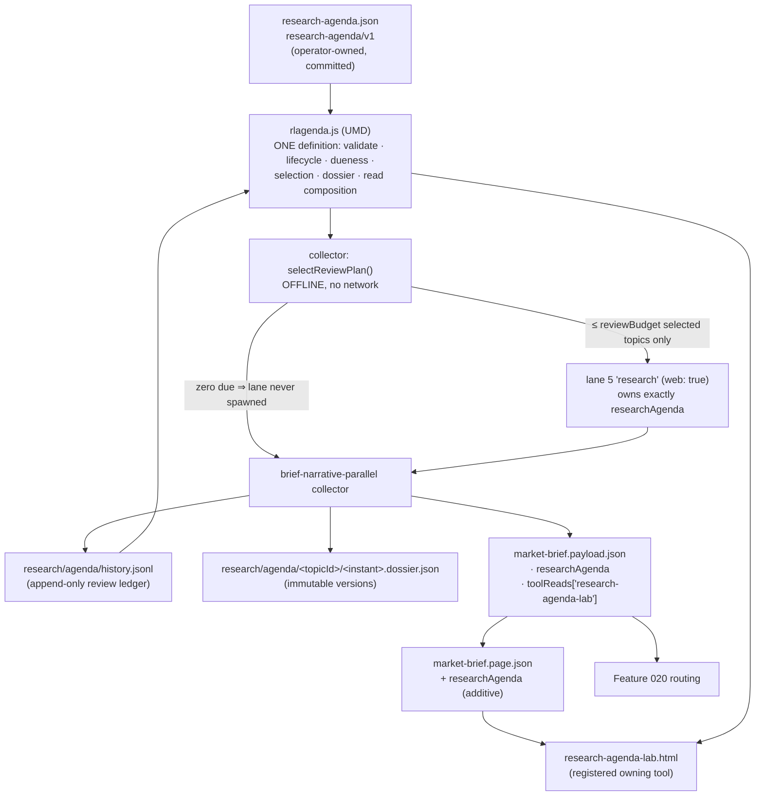
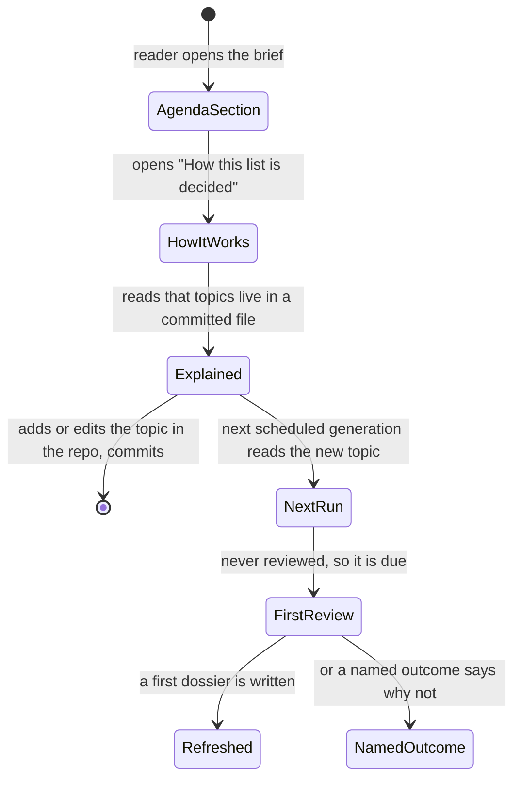
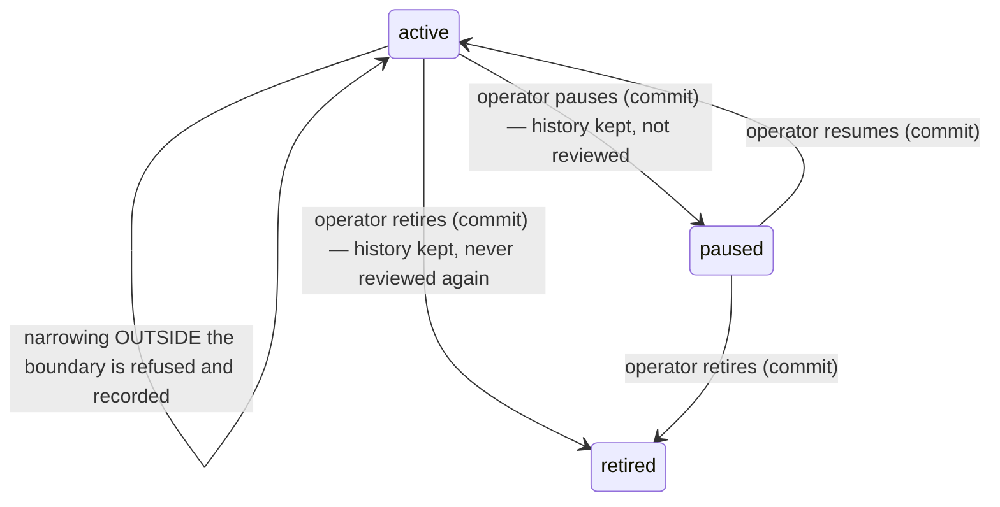

# Feature 019 — Custom Recurring Research Agenda — Design

Owner: `bubbles.design`. This document owns architecture, contracts, the reader
surface, and the validation strategy. It does not own business requirements
(`spec.md`, `bubbles.analyst`) or the scope breakdown (`scopes.md`,
`bubbles.plan`).

**Design language.** None is configured. `.github/bubbles-project.yaml` declares
no `designLanguages` block, so this design specifies against the repository's own
committed conventions.

**This document absorbs the retired `ux.md` sidecar.** The reader surface,
wireframes, state catalogue, interaction flows, accessibility contract and reader
vocabulary that previously lived in `specs/019-custom-recurring-research-agenda/ux.md`
are now §§ 8–13 below. That sidecar is deleted:
`.github/bubbles/scripts/artifact-lint.sh` refuses it
(*"Forbidden sidecar artifact present: ux.md"*). Where the folded content asserted
a repository fact that re-verification contradicted, the correction is recorded in
§ 15.2 rather than carried forward.

**Nothing in this document is built.** Every path introduced below is a design
target. Every fact read out of a committed file during authoring is cited with a
path and a symbol or key.

---

## Design Brief

**Current state.** The pipeline re-derives its market reads four times a day and
keeps none of the operator's standing questions. `scripts/brief-refresh-scheduled.sh:338-345`
creates a `mktemp -d` parent and runs `git clone --quiet --origin … --branch … --single-branch`
into it, so an unattended generation can read only what is committed. Standing
narrative material already lives in a committed config —
`market-brief.config.json` carries `globalBackdrop` (8 entries) and `macroEvents`
(8 entries) — but both are agent-maintained. `scripts/brief-narrative-parallel.mjs:40-81`
runs exactly four write-disjoint Copilot lanes (`core`, `signals`, `groups`,
`coverage`); only `core` and `signals` declare `web: true`, and their fetches are
bounded by the 15-host `webAllow` list at `:83-88`. Nothing in the repository
lets the operator declare a question and have it re-asked.

**Target state.** A committed operator-owned registry (`research-agenda.json`,
`research-agenda/v1`) declares topics. One UMD module (`rlagenda.js`) owns the
topic contract, the lifecycle vocabulary, the dueness decision and the dossier
shape, and both consumers — the headless publisher and the browser — read it from
there. A fifth, conditionally-spawned, write-disjoint lane researches only the
topics the module has already selected offline. Dossiers are immutable dated
files under `research/agenda/`, with one append-only ledger. The generation
publishes a `research-agenda-read/v1` read that reaches the brief page, and files
a `payload.toolReads['research-agenda-lab']` entry under a newly **registered**
tool id so Feature 020's routing has a legitimate owning source and deep link.

**Patterns to follow.**

- `rlattention.js` — a frozen UMD contract module with a closed `REFUSAL_CODES`
  list (`:158-172`), closed state vocabularies, and `refuse(code, field, message)`
  returning `{ ok:false, … }` rather than throwing. `rlagenda.js` copies this
  shape exactly.
- `scripts/build-attention-items.mjs:47` — `createRequire(import.meta.url)(…)`
  loads the UMD module in Node so the validator, the build step and the browser
  hold the identical frozen module. This is how `rlagenda.js` is consumed
  server-side, and it is what makes P19 mechanical rather than aspirational.
- `scripts/build-attention-items.mjs:284-286` — the balancing accounting
  assertion `built + excluded === declared`. The agenda read reuses it as
  `topics + refusals === registry topics`.
- `payload.attentionExclusions[]` validated at
  `scripts/validate-brief-payload.mjs:428-446`: an array of
  `{ index, subject, code, field, reason }` where `code` must be a member of the
  owning module's own closed list. Per-topic refusals copy this shape.
- `brief-history.jsonl` — one JSON object per line, append-only, re-sharded by
  `scripts/shard-brief-history.mjs`. The agenda ledger is the same shape.
- `market-brief.experimental.json` — a small committed artifact carrying a
  top-level `contractVersion` (`market-brief-experimental/v1`) and nothing else.
  The registry follows it.
- `root.__rlOwnerStateProvider[toolId]` consumed at `rlapp.js:333` — the shipped
  precedent for a page-supplied global that `rlapp.js` folds into
  `__rlviewsRegistration`. The `publicTargetIds` seam in § 12.3 uses it verbatim.

**Patterns to avoid.**

- **Do not put the registry in `market-brief.config.json`.** `globalBackdrop` and
  `macroEvents` are agent-maintained, and the lanes are handed
  `config.macroEvents` directly (`scripts/brief-narrative-parallel.mjs:182`).
  Putting an operator-owned artifact inside the file the agent's own instructions
  read invites exactly the silent rewrite FR-019-033 forbids. It also sits inside
  the byte-baseline that `:441-450` restores when a lane misbehaves, which would
  make an operator registry edit indistinguishable from a lane's protected-file
  violation.
- **Do not add `researchAgenda` to the `signals` lane's key set.**
  `readCompleteFragment` (`:117-128`) accepts a fragment only when its key set is
  byte-equal to the lane's declared `keys`. Widening `signals` would mean a topic
  failure invalidates the whole fragment and takes `attention`,
  `recommendations` and `events` down with it — the opposite of BS-019-015.
- **Do not make the agenda read visible through the evidence drawer.**
  `rlbrief.js:1220-1225` `renderToolReads()` iterates the `tools.json` registry
  *and* reads `SNAP.toolReads` — the snapshot, not the payload
  (`market-brief.html:1553`). A Tier-B read published only into
  `payload.toolReads` is invisible there even when its id **is** registered. See
  § 7.3; this corrects the folded conflict C-019-03.
- **Do not synthesise a default topic set, ever.** BS-019-002 and P2. An absent
  registry is a named absence with the rest of the brief unaffected.
- **Do not write a literal `tests/<name>.mjs` path into any file under `specs/`.**
  `scripts/validate-spec-test-paths.mjs:59` scans every artifact under `specs/**`
  for a repo-root-relative test path token and fails on any path absent from disk
  and from `scripts/validate-spec-test-paths.baseline`. § 14 therefore names test
  files without their extension.

**Resolved decisions.**

- The registry is a standalone committed root artifact, `research-agenda.json`
  (§ 4.1).
- One owning module, `rlagenda.js`, UMD, root-level, never ESM (§ 3, § 5).
- Research runs in a **fifth, conditionally-spawned, soft-failing** lane owning
  exactly one key, `researchAgenda` (§ 6).
- Dueness, selection, deferral, refusal and every non-researched outcome are
  computed **offline in Node before any lane is spawned**, so token and
  wall-clock cost scale with the review budget, not the topic count (§ 6.2).
- The agenda registers as a tool, `research-agenda-lab` / `research-agenda-lab.html`,
  because that is the only way a purely web-sourced finding can ever earn a
  resolvable attention deep link (§ 7, and Feature 020 § 4).
- `unchanged` keeps its place in the closed outcome vocabulary and is
  disambiguated by a required sibling boolean `reviewed`, not by a seventh
  outcome value (§ 4.4, resolving folded conflict C-019-04).
- Per-topic links become durable through the existing `__rlviewsRegistration`
  seam plus a page-supplied `publicTargetIds` array (§ 12.3, resolving folded
  conflict C-019-02).

**Open questions.** Three remain, all non-blocking, all with named settling
evidence — see § 16.

---

## 1. Purpose And Scope

Give the operator a committed registry of standing research topics that a
disposable clone can read, review each due topic on a declared cadence, publish a
dated append-only dossier and an honest per-topic outcome, and get that outcome
onto the brief page.

In scope: the registry contract and its owning module; the lifecycle and its
append-only event log; the offline dueness, trigger, budget and deferral policy;
the dossier and its supersession; the bounded refinement rule; the public-scope
enforcement; the published read, the page artifact key that renders it, and the
tool registration that gives it an owning source.

Out of scope, and routed rather than absorbed: routing a finding into the action
list, the attention tier or the alert pipeline (Feature 020); expanding the
committed instrument universe (Feature 020 Non-Goal 5); the private
portfolio-derived research queue owned by
`specs/008-portfolio-survival-and-brief-lab` (`spec.md` Non-Goal 2).

---

## 2. Architecture Overview



Three properties carry the whole design.

1. **Every decision that does not need the web is made without it.** Dueness,
   trigger evaluation, budget, deterministic ordering, deferral, per-topic
   refusal and the `paused` / `deferred` / `not-due` outcomes are pure functions
   of committed state (NFR-019-001, FR-019-022).
2. **The lane is the only network-dependent step, and it is optional.** It is
   spawned only when the offline plan selects at least one topic, and its failure
   degrades to per-topic `unavailable` instead of failing the generation (§ 6.3).
3. **One module defines the contract; three runtimes consume it** — the collector
   (Node), the publish-time validator (Node), and the browser. All three load the
   identical frozen UMD object, so no consumer can hold a second, divergent copy
   (P19, FR-019-009).

---

## 3. Capability Foundation

The topic contract is a reusable capability with more than one implementation on
two independent axes, so it is modelled foundation-first.

**Foundation — `rlagenda.js` (`research-agenda/v1`).** Owns, and is the only
place that owns:

- the closed lifecycle vocabulary `active | paused | retired`;
- the closed outcome vocabulary `updated | unchanged | stale | unavailable | paused | deferred`;
- the closed refusal-code list `RLAGENDA-*` (§ 4.6);
- topic and registry validation (`validateTopic`, `validateAgenda`);
- the dueness decision (`isDue`) and the review plan (`selectReviewPlan`);
- the trigger-evaluator dispatch table (below);
- dossier validation and supersession (`validateDossier`, `supersedes`);
- refinement admission (`admitRefinement`);
- read composition (`buildAgendaRead`, `buildAgendaToolRead`).

**Extension points.** Exactly two, both closed sets rather than open plugin
surfaces, because an open surface here would let a topic declare a trigger the
publish gate cannot evaluate offline:

- `TRIGGER_EVALUATORS` — a frozen map from `trigger.kind` to a pure
  `(trigger, evidence) => { fired, because }` function, where `evidence` is the
  committed snapshot/config/history bundle assembled by the caller.
- `RENDER_TARGETS` — the projection functions `buildAgendaRead` (payload) and
  `buildAgendaToolRead` (the `toolReads` entry), so a consumer never hand-shapes
  either.

## 4. Concrete Implementations

### Variation axes

| Axis | Variants | Why the foundation must absorb the difference |
| --- | --- | --- |
| **Trigger kind** | `snapshot-name-move`, `regime-band-change`, `vix-level`, `macro-event-within-days` | Four different committed evidence sources, one `{ fired, because }` answer. A fifth kind must be added to the frozen map, never expressed as free text in the registry, or `RLAGENDA-TRIGGER` refuses it. |
| **Runtime environment** | Node collector, Node publish gate, browser page | The browser must render exactly the states the collector wrote. Two copies of the vocabulary would drift within one release, which is the failure `scripts/build-attention-items.mjs:143-152` already documents for `RLATTN-PRIVACY`. |
| **Outcome provenance** | lane-produced (`updated`/`unchanged`/`stale`/`unavailable`) versus collector-produced (`paused`/`deferred`/not-due) | Both must satisfy the same read contract and the same balancing assertion, so composition belongs to the foundation, not to either producer. |
| **Consumer surface** | the brief's agenda section, the owning tool page, Feature 020's router | Three readers of one dossier. Feature 020 consumes `findings[]` through the seam in § 4.3 and defines its own `routable-finding/v1` projection on top; it never redefines a finding. |

### 4.1 Registry — `research-agenda.json` (`research-agenda/v1`)

Root-level, committed, published to Pages by the ordinary root-file rule in
`scripts/build-pages-site.mjs:52-55` (it is public by construction under P13, so
shipping it is intended and needs no `site-exclusions.json` entry).

```jsonc
{
  "contractVersion": "research-agenda/v1",
  "reviewBudget": 2,                 // positive integer. REQUIRED. No default.
  "topics": [
    {
      "topicId": "defense-earnings-acceleration",   // ^[a-z0-9]([a-z0-9-]*[a-z0-9])?$
      "title": "Defense production and earnings acceleration",
      "declaredQuestion": "Which listed defense manufacturers are accelerating versus consensus?",
      "scopeBoundary": {
        "subjects": ["listed defense manufacturers"],
        "geographies": ["US"],
        "instruments": ["LMT", "RTX"],
        "horizons": ["3m", "6m", "12m"]
      },
      "reviewCadenceDays": 7,        // REQUIRED. No default.
      "freshnessWindowDays": 30,     // REQUIRED. No default.
      "lifecycleState": "active",    // active | paused | retired
      "declaredAt": "2026-08-10T20:55:00Z",
      "triggers": [
        { "kind": "snapshot-name-move", "ticker": "LMT", "field": "mom5", "absAtLeast": 4 }
      ]
    }
  ]
}
```

Field rules, each mapped to a refusal in § 4.6:

- `topicId` is stable for life (FR-019-004) and matches
  `^[a-z0-9]([a-z0-9-]*[a-z0-9])?$` — the exact pattern
  `rlexperience.js:2492` requires of a public route target, so a topic id is
  usable as a durable link target without a second identifier (§ 12.3).
- `declaredQuestion` is the operator's own words and is compared **byte for byte**
  across generations (FR-019-033).
- `reviewCadenceDays` and `freshnessWindowDays` are both required and neither may
  be inferred (FR-019-007).
- `scopeBoundary.instruments[]` holds public tickers only; a private field name
  from the frozen list `["size","quantity","costBasis","pnl"]` — the same list
  `rlattention.js:188` freezes — anywhere in a topic is `RLAGENDA-PRIVATE`.
- `triggers[]` is optional; every entry's `kind` must be in `TRIGGER_EVALUATORS`.

### 4.2 Trigger vocabulary — offline by construction

Every operand resolves from a committed artifact the generation already has, so
FR-019-018 and NFR-019-001 hold with the network down.

| `kind` | Operands | Evidence source (verified) |
| --- | --- | --- |
| `snapshot-name-move` | `ticker`, `field` ∈ `px, mom5, mom21, mom63, maStack, ma50Dist, ma200Dist, pctFrom52wHigh`, `absAtLeast` | `market-brief.snapshot.json` `names[ticker]`, projected at `scripts/brief-narrative-parallel.mjs:151` |
| `regime-band-change` | none | `brief-history.recent.jsonl` row `regimeBand` (present in the committed rows) compared against the row current at `lastReviewedAt` |
| `vix-level` | `above` or `below`, numeric | `brief-history.recent.jsonl` row `vix` |
| `macro-event-within-days` | `days` | `market-brief.config.json` `macroEvents[]` |

A fired trigger returns `because` — a plain sentence naming the trigger — which
is carried into the read and rendered verbatim (FR-019-019).

### 4.3 Dossier — `research-dossier/v1`

One immutable file per version:
`research/agenda/<topicId>/<YYYY-MM-DDTHHMMSSZ>.dossier.json`. Colons are
stripped from the instant because they are a hostile filename character on
non-POSIX checkouts.

```jsonc
{
  "contractVersion": "research-dossier/v1",
  "topicId": "hormuz-oil",
  "generatedAt": "2026-08-10T20:55:57Z",
  "window": "after-hours",
  "outcome": "stale",
  "reviewed": true,
  "supersedes": "research/agenda/hormuz-oil/2026-07-29T204410Z.dossier.json",
  "declaredQuestionSha256": "…",     // byte-identity proof for FR-019-033
  "newestEvidenceObservedAt": "2026-06-08",
  "newestEvidenceAgeDays": 63,
  "findings": [
    {
      "findingId": "hormuz-oil/2026-08-10T205557Z/1",
      "claim": "Transit volumes through the strait fell for a third consecutive month.",
      "observedAt": "2026-06-08",
      "source": { "kind": "web", "host": "www.reuters.com", "ref": "…" },
      "confidence": "moderate",       // low | moderate | high — evidence quality
      "provenanceLabel": "observed-fact",
      "subjects": ["XLE", "USO"],
      "horizon": "structural",
      "invalidation": null
    }
  ],
  "refinements": [
    { "at": "2026-07-29", "by": "agent", "admitted": true,
      "text": "…and specifically tanker insurance rates" }
  ],
  "unavailableReason": null
}
```

- A finding missing `observedAt`, `source` or `confidence` is refused
  `RLAGENDA-FINDING` and **is not published** (FR-019-025, P1). It never renders
  as a blank.
- `provenanceLabel` is one of the four repo-wide labels
  `observed-fact | user-assumption | model-estimate | unavailable`.
- `subjects[]` and `invalidation` are the seam Feature 020 reads. They are
  descriptive here; 019 makes no eligibility claim about them (`spec.md`
  Non-Goal 7).
- A dossier body must be at most `maxNormalizedObservationBytes` (262144) from
  the committed `artifact-budget/v1` block in `market-brief.config.json`. The
  figure is reused, never re-invented (NFR-019-003, P22).

### 4.4 Outcome model — and the `unchanged` split

`outcome` stays exactly the closed vocabulary FR-019-026 declares. The ambiguity
the folded conflict C-019-04 identified is resolved by a **required sibling
boolean**, not by a seventh value:

| `lifecycleState` | `outcome` | `reviewed` | Meaning |
| --- | --- | --- | --- |
| `active` | `updated` | `true` | Researched; new evidence |
| `active` | `unchanged` | `true` | Researched; nothing new (FR-019-027) |
| `active` | `unchanged` | `false` | Not due; the prior dossier stays current (FR-019-023, BS-019-008) |
| `active` | `stale` | `true` | Researched; newest evidence older than `freshnessWindowDays` (FR-019-028) |
| `active` | `unavailable` | `true` | Attempted; lane failed or returned nothing usable (FR-019-029) |
| `active` | `deferred` | `false` | Due but over budget (FR-019-021) |
| `paused` | `paused` | `false` | Not researched; history retained (FR-019-012) |
| `retired` | `null` | `false` | Never researched again; history retained (FR-019-013) |

`reviewed` is what makes "we looked and found nothing" distinguishable from "we
did not look" — the exact distinction P2 exists to protect. The pair, not the
word alone, drives the reader sentence in § 10.1.

### 4.5 Ledger and the published read

`research/agenda/history.jsonl` — append-only, one row per (topic, generation)
review event, `research-agenda-history-row/v1`, carrying `topicId`,
`generatedAt`, `window`, `lifecycleState`, `outcome`, `reviewed`, `dossierRef`,
`supersedes`, `triggerBecause`, `refusalCode`. Lifecycle changes append a row
with `event: "lifecycle"` and the old and new states (FR-019-014). Nothing in
this file is ever edited; a correction is a new row referencing the old
`findingId` (FR-019-031).

`payload.researchAgenda` — `research-agenda-read/v1`:

```jsonc
{
  "contractVersion": "research-agenda-read/v1",
  "generatedAt": "2026-08-10T20:55:57Z",
  "registryState": "read",          // read | absent | unreadable
  "declaredTopicCount": 4,
  "reviewBudget": 2,
  "selectionOrder": "trigger-fired first, then least-recently-reviewed, then declaration order, then topicId",
  "topics": [ { "topicId": "...", "title": "...", "declaredQuestion": "...",
                "lifecycleState": "...", "outcome": "...", "reviewed": false,
                "nextDueAt": "...", "findingCount": 3, "dossierRef": "...",
                "newestEvidenceAgeDays": 63, "triggerBecause": null,
                "deferredBecause": null, "unavailableReason": null } ],
  "refusals": [ { "index": 2, "topicId": "shipping-chokepoints",
                  "code": "RLAGENDA-QUESTION", "field": "declaredQuestion",
                  "reason": "topic declares no question" } ]
}
```

**Balancing assertion (FR-019-015, FR-019-016).**
`topics.length + refusals.length === declaredTopicCount`. This is the same
accounting `scripts/build-attention-items.mjs:284-286` already enforces for
attention, and it is what makes "one bad topic does not sink the agenda"
mechanical rather than hoped for.

### 4.6 Closed refusal vocabulary — `RLAGENDA-*`

| Code | Refused when | FR |
| --- | --- | --- |
| `RLAGENDA-CONTRACT` | `contractVersion` absent or unknown | 019-003 |
| `RLAGENDA-ID` | `topicId` absent, malformed, or not matching the public-target pattern | 019-004 |
| `RLAGENDA-DUPLICATE` | two topics share a `topicId` | 019-004 |
| `RLAGENDA-QUESTION` | `declaredQuestion` absent or empty | 019-005 |
| `RLAGENDA-BOUNDARY` | `scopeBoundary` absent or names no subject | 019-006 |
| `RLAGENDA-CADENCE` | `reviewCadenceDays` or `freshnessWindowDays` absent or not a positive integer | 019-007 |
| `RLAGENDA-LIFECYCLE` | `lifecycleState` outside `active/paused/retired`; or an agent-attempted transition | 019-008, 019-035 |
| `RLAGENDA-TRIGGER` | unknown `kind`, or an operand no committed artifact can resolve | 019-018 |
| `RLAGENDA-BUDGET` | `reviewBudget` absent or not a positive integer; or a dossier body over the artifact byte budget | 019-020, NFR-019-003 |
| `RLAGENDA-PRIVATE` | a private field name anywhere in a topic, dossier or read | 019-036 |
| `RLAGENDA-SUBJECT` | a subject that is not a public market object or public ticker | 019-036 |
| `RLAGENDA-FINDING` | a finding missing `observedAt`, `source` or `confidence` | 019-025 |
| `RLAGENDA-SUPERSEDE` | a new version that does not reference its predecessor, or a write that would overwrite an existing version file | 019-030, 019-031 |
| `RLAGENDA-REFINEMENT` | a refinement outside the declared boundary, or one whose application changes `declaredQuestion` | 019-034, 019-033 |

Every code is refused **by name with its field**, never defaulted — the same hard
cutover `scripts/build-attention-items.mjs:26-31` documents for attention.

---

## 5. The Owning Module — `rlagenda.js`

UMD dual module at the repository root, beside `rlattention.js` and
`rlmarketaction.js`. Never ESM; works from `file://`; no build step (P10, `spec.md`
Non-Goal 6).

| Export | Kind | Consumers |
| --- | --- | --- |
| `CONTRACT_VERSION`, `DOSSIER_CONTRACT_VERSION`, `READ_CONTRACT_VERSION` | frozen strings | all three |
| `LIFECYCLE_STATES`, `OUTCOME_STATES`, `REFUSAL_CODES`, `TRIGGER_KINDS`, `PRIVATE_FIELDS`, `CONFIDENCE_LEVELS` | frozen arrays | all three |
| `validateTopic(topic)` → `{ ok, code, field, message }` | pure | collector, publish gate |
| `validateAgenda(registry)` → `{ topics, refusals }` | pure | collector, publish gate |
| `isDue(topic, ledgerState, evidence, nowIso)` → `{ due, because }` | pure, offline | collector |
| `selectReviewPlan(registry, ledgerState, evidence, nowIso)` → `{ selected[], deferred[], notDue[], paused[], retired[], refusals[] }` | pure, offline | collector |
| `validateDossier(dossier, topic)` | pure | collector, publish gate |
| `admitRefinement(topic, proposal)` → `{ admitted, code, reason }` | pure | collector |
| `buildAgendaRead(plan, dossiers)` → `research-agenda-read/v1` | pure | collector |
| `buildAgendaToolRead(read)` → the `toolReads` entry | pure | collector |
| `readerSentence(row)` → the plain-words state sentence | pure | browser, and § 10.1 |

`readerSentence` lives in the module deliberately: the reader vocabulary in § 10
is a contract, and a copy in page markup is exactly the drift that
`scripts/reader-vocabulary.mjs` exists to catch after the fact rather than
prevent.

**P18 — wired or not shipped.** The module's production consumers are the
collector in `scripts/brief-narrative-parallel.mjs`, the publish gate in
`scripts/validate-brief-payload.mjs`, and both registered pages. It is not
test-only. Were it unwired it would have to be listed in `site-exclusions.json`,
which is what `rlcausal.js` and `rlportfolio.js` do today.

---

## 6. Publisher Integration

### 6.1 Decision: a fifth write-disjoint lane, conditionally spawned

`scripts/brief-narrative-parallel.mjs` gains one lane descriptor:

```js
{
  id: 'research',
  keys: ['researchAgenda'],
  web: true,
  optional: true,
  instructions: '…'
}
```

**Why not extend `signals`.** `readCompleteFragment(path, keys)` (`:117-128`)
returns a fragment only when `Object.keys(fragment).sort()` equals the lane's
declared `keys` sorted. Adding `researchAgenda` to `signals` therefore makes a
research failure invalidate the whole `signals` fragment, taking `attention`,
`recommendations` and `events` with it. `spec.md` BS-019-015 requires the
opposite: an unavailable topic must leave the rest of the brief untouched.
Write-disjointness is not merely preserved by a separate lane — it is the only
arrangement in which the failure semantics the spec demands are expressible.

**Why not `coverage`.** `coverage` declares `web: false` (`:76`). Research needs
the allowlisted web (FR-019-037).

**Why not `core`.** `core` owns `nextSession`, which is the single most
consequential key in the payload and already the lane the D16 gate acts on. Any
research failure attributable to `core` would be a failure of the action list.

**Wall-clock cost, stated honestly (P22).** The scheduler runs
`BRIEF_LANE_CONCURRENCY=2` and `BRIEF_LANE_ATTEMPTS=2`
(`scripts/brief-refresh-scheduled.sh:65-66`) with
`BRIEF_NARRATIVE_TIMEOUT=2700` per lane (`:64`). Four lanes at concurrency two is
two pool waves. A fifth lane makes the worst case three waves, so on a run where
a topic is due the narrative stage can grow by up to one wave. Two things bound
that: the lane is spawned **only** when the offline plan selects at least one
topic (§ 6.2), and its own work is bounded by `reviewBudget`, not by the number
of declared topics (NFR-019-002). With the three real topics on weekly cadences
and four generations a day, the common case is zero due topics and therefore
**zero added waves**. The measured contribution is the settling evidence for open
question 3 in § 16.

### 6.2 Skipping a not-due topic cheaply

The collector runs `rlagenda.selectReviewPlan(...)` **before** building the lane
list, using only committed state. Consequences:

- A topic that is not due, paused, retired, deferred or refused **never enters a
  prompt**. Its outcome is composed deterministically in Node. Token cost is zero
  for it.
- `laneInput({id:'research'})` carries only the selected topics — for each, the
  `declaredQuestion`, the `scopeBoundary`, `freshnessWindowDays`, the prior
  dossier's `findings[]` and `newestEvidenceObservedAt`, and the `because` of any
  fired trigger. It carries no other topic.
- If `plan.selected.length === 0`, the lane is **not added to the pool at all**.
  The collector composes the entire `researchAgenda` read itself, and the
  generation's wall clock is unchanged from today.

### 6.3 Soft failure — an `optional` lane

`loadFragment(result)` (`:399-402`) currently rethrows any lane error, which
fails the whole narrative attempt. That is correct for the four existing lanes
and wrong for research: a failed topic must publish `unavailable`, not cost the
brief. The additive change:

```js
function loadFragment(result) {
  if (result.laneError) {
    if (!result.lane.optional) throw result.laneError;
    return { researchAgenda: agendaUnavailableFragment(plan, result.laneError) };
  }
  return result.fragment;
}
```

`agendaUnavailableFragment` is `rlagenda.buildAgendaRead` over the same offline
plan with every selected topic carried at `outcome: "unavailable"`,
`reviewed: true` and a named `unavailableReason`. It fabricates no finding
(FR-019-029, P2). `optional` is absent on `core`, `signals`, `groups` and
`coverage`, so their fail-closed behaviour is byte-identical to today.

### 6.4 Collector ordering (load-bearing)

The `coverage` lane owns `toolReads` and replaces it wholesale during
`Object.assign(payload, fragment)` (`:451`). The agenda's `toolReads` entry must
therefore be merged **after** every fragment is assigned:

```js
for (const result of results) Object.assign(payload, loadFragment(result));
payload.toolReads['research-agenda-lab'] = RLAGENDA.buildAgendaToolRead(payload.researchAgenda);
```

This is the collector writing, not a lane writing, so no lane's write-disjoint
key ownership is widened. The protected-file byte check at `:441-450` is
untouched.

Dossier files and the ledger are written by the collector after the payload is
accepted, so a failed or reverted narrative attempt never leaves an orphan
dossier claiming a generation that did not publish.

---

## 7. Registration — Why It Is Required, And Everything It Touches

### 7.1 Why

`scripts/build-attention-items.mjs:129-139` `resolvedDeepLink()` resolves an
attention item's link from the item's **first figure's** `provenance.sourceId`,
looked up in `payload.toolReads`, and leaves it absent otherwise. The composer
then refuses the item `RLATTN-DEEPLINK`. A geopolitical or commodity finding
sourced from the web owns no tool read, so without a registered owning source the
attention tier is closed to exactly the topics this feature exists to serve —
every time, not occasionally. Publishing `toolReads['research-agenda-lab']` with
`deepLink: "research-agenda-lab.html"` gives such a finding a legitimate owning
source, and the id must be **registered** because the publish-time allowlist is
`toolDeepLinksFrom(registry)` — the registry's own `tool.file` values
(`scripts/validate-brief-payload.mjs:83-85`).

This is a Feature 019 obligation (FR-019-038 requires the read to reach the
brief) that Feature 020 depends on. It is named as a capability, not as a spec
status, in Feature 020 § *Dependencies*.

### 7.2 The full registration consequence

The six surfaces `spec.md` open question 5 names, all verified:

| # | Surface | Change |
| --- | --- | --- |
| 1 | `tools.json` | a 25th entry: `id: "research-agenda-lab"`, `file: "research-agenda-lab.html"`, `notes`, `data: "research-agenda.json"`, `status`, `blurb`, `tags`, `briefing`, `experience` |
| 2 | `index.html` `TOOLS` array (`:540`) | one entry, group-consistent |
| 3 | `rlnav.js` `TOOLS` array (`:45`) | one entry; the file's own header says to keep it in sync with `index.html` and `tools.json` (`:7-8`) |
| 4 | `README.md` | one row |
| 5 | `notes/README.md` | one row, plus `notes/research-agenda-lab.md` as the tool's `notes` target |
| 6 | `toolCoverage` in `market-brief.payload.json` **and** `market-brief.snapshot.json` | `scripts/validate-brief-payload.mjs:373-384` refuses a payload whose `toolCoverage` is missing any registered id or carries an unregistered one; the `coverage` lane derives its list from `tools.json`, so this follows automatically once the registry entry lands |

Plus the regeneration and the binary rule the task names:

| # | Surface | Change |
|---|---|---|
| 7 | `market-brief.tools.page.json` | regenerated by `scripts/build-brief-page-artifacts.mjs`, which projects `tools.tools.map(({id,title,file}))` (`:65-68`). It runs in `scripts/brief-refresh-and-push.sh:533-536` and in the Tier-A workflow. |
| 8 | `scripts/build-pages-site.mjs` | **binary and atomic.** `:41-43` asserts every registered page exists *and* is not excluded; `:47-49` asserts every unregistered root `.html` is listed in `site-exclusions.json`. So `research-agenda-lab.html` must exist and ship in the same change that registers it — the same atomic-release boundary `site-exclusions.json` records for Feature 008's portfolio page. |

And three further consequences re-verification found, which `spec.md` open
question 5 does not list:

| # | Surface | Change | Evidence |
| --- | --- | --- | --- |
| 9 | `scripts/build-pages-site.mjs` `PUBLIC_DIRECTORIES` | add `'research'`, or the dossier directory is never published | `:12` — the directory list is a frozen allowlist |
| 10 | `tool-experience.config.json` registries | the new `experience` block must name a `simpleModelDefinitionId` present in `simple-models.json`, a `simpleAdapterId` whose module is in the seven-entry `adapterPolicy.moduleAllowlist`, and `journeyDefinitionIds` present in `journeys.json` | every one of the 24 registered tools carries an `experience` block; `viewSetId` is one of exactly two |
| 11 | `market-brief.page.json` | one additive key, `researchAgenda` | § 7.3 |

### 7.3 Registration alone does not make the read visible

`rlbrief.js:1220-1225` `renderToolReads()` skips `market-brief` and iterates the
registry — the folded conflict C-019-03 said this, and it is true. It is also
incomplete. `market-brief.html:1553` calls it with `SNAP.toolReads`, which comes
from `market-brief.snapshot.page.json` (`scripts/build-brief-page-artifacts.mjs:63`),
and `market-brief.page.json` carries **no** `toolReads` key at all
(`:29-42`). A Tier-B read published into `payload.toolReads` is therefore
invisible in the evidence drawer even when its id is registered.

Resolution, and it is two independent things for two independent reasons:

- **For Feature 020's routing:** `payload.toolReads['research-agenda-lab']` under
  a registered id. Consumed by the build step, never rendered by the drawer.
- **For FR-019-038's reader visibility:** one additive key `researchAgenda` in
  `market-brief.page.json`, rendered by the agenda section (§ 11.1). This is the
  renderer the folded conflict asked design to choose.

Both are required. Neither substitutes for the other.

---

## 8. Reader Surface — Ownership

| Surface | Owner | May render | Must not render |
| --- | --- | --- | --- |
| Agenda section inside the brief's `brief` view | this feature | title, `declaredQuestion` verbatim, lifecycle state, outcome sentence, freshness, next-due | any market figure a tool owns; any position, size, cost basis or P&L |
| `research-agenda-lab.html` (owning tool page) | this feature | the same, plus full dossiers, version history and the review record | a recomputed price, level or metric |
| "Where these findings went" block inside a dossier | Feature 020 supplies the data; this surface links only | one line per finding plus a link | the action's trigger, invalidation or confidence — the action list owns those |
| `#nextSession` | the existing brief contract | — | the agenda never writes here; that is Feature 020 |
| `#decisionAttention` | `rlattention.js` | — | the agenda never composes an attention item |
| Red-alert area | `rlmarketaction.js` | — | the agenda never asserts alert state |

**The one-sentence rule.** The agenda owns the question, its schedule, and the
honest outcome of asking it. It owns no number any tool owns.

---

## 9. Host Facts The Reader Surface Is Built On

Verified during this authoring pass, not assumed.

| Fact | Evidence |
| --- | --- |
| Four views, and a fifth top-level view is structurally refused | `tool-experience.config.json` declares exactly two view sets; `rlmarketaction.js:690` refuses anything but `brief\|portfolio\|red-alert\|journey` |
| `market-brief.html` has no Simple/Power axis; its density axis is `<details class="drawer">` | `market-brief.html:937, :962, :970, :976` |
| An **ordinary** registered tool does have a real Simple/Power axis | `tool-experience.config.json` `ordinary-four-view/v1` = `simple, power, brief, journey`, default `simple` |
| The view control is a real roving tablist with `aria-selected` and Arrow/Home/End/Enter/Space | `rlviews.js` `buildControl()` |
| Live regions already exist on the brief | `market-brief.html:920` (`aria-live="polite"`), `:925` (`role="status"`) |
| Mobile touch targets are already 44px under 560px | `rlviews.js:55` |
| Machine codes may ride a `data-*` attribute while visible text stays plain | `market-brief.html:1767` renders plain words with `data-mac-gate="dependency-pending:feature-002"` |
| `dependency-pending`, `feature-0NN`, `not-integrated`, `coverage-only` in reader prose **block publication** | `scripts/reader-vocabulary.mjs:29, :36` (`blocksPublication: true`), enforced at `scripts/validate-brief-payload.mjs:459` |
| A named per-item absence with a reason is an established published shape | `toolCoverage[].reason`; `attentionExclusions[]` at `scripts/validate-brief-payload.mjs:428-446` |
| Canvas must be drawn synchronously from `render()` | `requestAnimationFrame` does not fire in a hidden or background tab, which is the headless publisher's condition |

### 9.1 The Simple/Power mapping, stated once

The folded conflict C-019-01 is real and is resolved by *where* the surface
lives, not by inventing an axis:

| Composition | On `research-agenda-lab.html` (ordinary view set) | On `market-brief.html` (four-view set) |
| --- | --- | --- |
| **Simple** | default view `simple`; `.pw` nodes hidden by the shipped `body:not(.power) .pw` rule | the agenda section visible with every `<details class="drawer">` closed — the default paint |
| **Power** | `body.power`; `.pw` nodes revealed | the same section with its drawer open |

No new class, no new view, no new toggle is proposed on either page. Registering
the agenda as an ordinary tool (§ 7) makes the requested Simple/Power axis
literally real on the owning page, and the drawer mapping covers the brief.

---

## 10. Reader Vocabulary — Machine State To Plain Words

Contract status codes are never rendered as reader prose. Two classes block
publication outright, and `contract-version` (`\b[a-z-]+\/v\d\b`,
`scripts/reader-vocabulary.mjs:35`) would fire on a rendered
`research-agenda/v1`. The machine value travels in a `data-*` attribute exactly
as `market-brief.html:1767` already does; only the right-hand column is visible.

### 10.1 Outcome and lifecycle

`data-agenda-outcome` carries the machine value; `readerSentence()` (§ 5)
produces the text.

| `outcome` + `reviewed` | Reader text | Glyph | Pill |
| --- | --- | --- | --- |
| `updated` / `true` | "Refreshed today — new evidence since the last review" | `●` | `pill live` |
| `unchanged` / `true` | "Reviewed — nothing new since the last read" | `=` | `pill` |
| `unchanged` / `false` | "Not due — next review after \<date>" | `·` | `pill` |
| `stale` / `true` | "Newest evidence is 63 days old — older than this topic asks for" | `~` | `pill warn` |
| `unavailable` / `true` | "Could not be researched this run — \<plain reason>" | `!` | `pill bad` |
| `deferred` / `false` | "Not reached this run — the review list was full" | `»` | `pill warn` |
| `paused` / `false` | "Paused by you — not reviewed; everything already written is kept" | `‖` | `pill` |
| `retired` (lifecycle) | "Retired — kept as a record, no longer reviewed" | `×` | `pill` |
| a refused topic | "This topic could not be read — \<plain reason>. The other topics were still reviewed." | `!` | `pill bad` |
| `registryState: "absent"` | "No topics are defined yet." | — | — |

### 10.2 Reasons, in plain words

A reason is always specific. "An error occurred" is not a reason.

| Machine reason | Reader text |
| --- | --- |
| `RLAGENDA-QUESTION` | "no question was written for it" |
| `RLAGENDA-BOUNDARY` | "no scope boundary was written for it" |
| `RLAGENDA-CADENCE` | "no review schedule was written for it" |
| lane failed | "the research step did not complete" |
| lane returned nothing usable | "the research step returned nothing that could be used" |
| every source outside the allowlist | "no source it needed is one this project is allowed to read" |
| budget overflow | "the review list was full this run" |
| `RLAGENDA-REFINEMENT` | "the suggested narrowing was outside the boundary you set, so it was not applied" |

### 10.3 Provenance on a finding

Each finding renders exactly one of the four repo-wide labels as reader words:
**"observed"**, **"your assumption"**, **"estimated"**, **"not available"**.
Confidence is always followed by its meaning — *evidence quality, never a win
probability* (P3). That sentence is not optional.

### 10.4 Banned in reader prose

`dependency-pending`, `feature-0NN`, `not-integrated`, `coverage-only`, any
`RLATTN-*` / `RLMKT-*` / `RLAGENDA-*` / `E0NN-*` code, `sha256:…`, any
`…/vN` contract slug, "Scope N", "Withheld:", "Acceptance gate:". A raw
`updated` / `unchanged` / `stale` / `unavailable` token is likewise banned — it
is a contract enum, and § 10.1 gives its sentence.

---

## 11. Wireframes

Box-drawing only. The shared dark theme injected by `rlnav.js:10-34` is assumed
everywhere; no light surface is authored. Placeholders are in `[brackets]`.

### 11.1 Agenda section — Simple, desktop

Placed after `#nextSession` (`market-brief.html:935`) and before
`#decisionAttention` (`:949`), as a peer `h2.sec` section inside the existing
`brief` view. Rendered from the additive `researchAgenda` key in
`market-brief.page.json` (§ 7.3).

```
┌────────────────────────────────────────────────────────────────────────┐
│ Standing research — your topics, reviewed on their own schedule    (?) │
│ 3 topics · 2 reviewed this run · 1 not due · reviewed 2026-08-10 20:55 │
├────────────────────────────────────────────────────────────────────────┤
│ ● Defense production and earnings acceleration          [Refreshed]    │
│   "Which listed defense manufacturers are accelerating vs consensus?"  │
│   Reviewed today · 3 findings · next review in 7 days                  │
│   ⌄ Open dossier                                                       │
├────────────────────────────────────────────────────────────────────────┤
│ ~ U.S.–Iran oil and the Strait of Hormuz                 [Older read]  │
│   "How would a Hormuz disruption transmit into oil and energy equity?" │
│   Newest evidence is 63 days old — older than this topic asks for.     │
│   Read what follows as history, not as today. · next review in 2 days  │
│   ⌄ Open dossier                                                       │
├────────────────────────────────────────────────────────────────────────┤
│ · Food, grains and fertilizer                            [Not due]     │
│   "What is the 3–12 month outlook for grains and fertilizer inputs?"   │
│   Last reviewed 2026-08-07 · nothing new was looked for this run       │
│   ⌄ Open dossier                                                       │
├────────────────────────────────────────────────────────────────────────┤
│ ⌄ How this list is decided and what was skipped           (drawer)     │
└────────────────────────────────────────────────────────────────────────┘
```

- The `declaredQuestion` is quoted **verbatim** and is visually a quotation. The
  operator's words are never paraphrased on screen (FR-019-005, FR-019-033).
- `(?)` is the shipped in-place explanation affordance (P15). Every status word,
  count and date carries a tooltip saying both what it is and what this value
  means here.
- No colour carries meaning alone: glyph + word + pill.

### 11.2 Agenda section — Power (drawer open), desktop

```
├────────────────────────────────────────────────────────────────────────┤
│ ⌃ How this list is decided and what was skipped                        │
│                                                                        │
│   Reviewed this run: 2 of 3 topics. The run reviews at most 2.         │
│   Order: brought-forward first, then longest overdue, then the order   │
│   you declared them.                                                   │
│                                                                        │
│   » Food, grains and fertilizer — not reached this run                 │
│     The review list was full. It stays first in line for the next run. │
│                                                                        │
│   ! Shipping chokepoints (draft) — could not be read                   │
│     No question was written for it, so it was skipped by name.         │
│     The other topics were still reviewed.                              │
│                                                                        │
│   Registry read from the published branch at 2026-08-10 20:55 UTC.     │
│   Topic definitions live in a committed file, so an unattended run     │
│   sees exactly what you committed — nothing from this browser.         │
│                                                                        │
│   Review record (chart-equivalent table — this is the primary form)    │
│   ┌────────────────────┬───────┬───────────┬─────────┬──────────────┐  │
│   │ Topic              │ Runs  │ Refreshed │ Nothing │ Could not be │  │
│   │                    │ due   │           │ new     │ researched   │  │
│   ├────────────────────┼───────┼───────────┼─────────┼──────────────┤  │
│   │ Defense earnings   │  12   │     7     │    4    │      1       │  │
│   │ Hormuz oil         │   9   │     3     │    5    │      1       │  │
│   │ Grains/fertilizer  │   6   │     2     │    4    │      0       │  │
│   └────────────────────┴───────┴───────────┴─────────┴──────────────┘  │
└────────────────────────────────────────────────────────────────────────┘
```

The review record is a **table first**, derived from `research/agenda/history.jsonl`.
If a sparkline of the same series is ever added it is decoration on top of this
table, carries an `aria-label` naming the same figures, and is drawn
**synchronously from `render()`** — never inside `requestAnimationFrame`, which
does not fire in a hidden or background tab.

### 11.3 Agenda section — 320px, Simple

```
┌──────────────────────────────────────┐
│ Standing research                 (?)│
│ 3 topics · 2 reviewed this run       │
│ · 1 not due                          │
├──────────────────────────────────────┤
│ ● Defense production and             │
│   earnings acceleration              │
│   [Refreshed]                        │
│   "Which listed defense              │
│    manufacturers are accelerating    │
│    vs consensus?"                    │
│   Reviewed today · 3 findings        │
│   Next review in 7 days              │
│   ⌄ Open dossier                     │
├──────────────────────────────────────┤
│ ~ U.S.–Iran oil and the Strait       │
│   of Hormuz                          │
│   [Older read]                       │
│   Newest evidence is 63 days old —   │
│   older than this topic asks for.    │
│   ⌄ Open dossier                     │
├──────────────────────────────────────┤
│ · Food, grains and fertilizer        │
│   [Not due]                          │
│   Last reviewed 2026-08-07           │
│   ⌄ Open dossier                     │
├──────────────────────────────────────┤
│ ⌄ How this list is decided           │
└──────────────────────────────────────┘
```

At 320px the § 11.2 table becomes a stacked definition list, one topic per block,
label above value — never a horizontally scrolling table inside the page body.
`html,body{overflow-x:clip}` already ships via `rlviews.js`; this design must not
defeat it with a fixed-width child.

### 11.4 Topic dossier — Simple, desktop

The dossier is the **expanded state of one agenda row on the same page**. Not a
page, not a fifth view, not a modal.

```
┌────────────────────────────────────────────────────────────────────────┐
│ ⌃ U.S.–Iran oil and the Strait of Hormuz                  [Older read] │
│                                                                        │
│  Your question, in your words                                          │
│  "How would a Hormuz disruption transmit into oil and energy equity?"  │
│                                                                        │
│  Boundary you set: oil and energy equity; 3–12 months; public listed   │
│  instruments and public benchmarks only.                               │
│                                                                        │
│  This review: newest evidence is 63 days old — older than this topic   │
│  asks for. Read the findings as history, not as today.                 │
│  Reviewed 2026-08-10 · supersedes the version of 2026-07-29 (open ⌄)   │
│                                                                        │
│  ── Findings ────────────────────────────────────────────────────────  │
│  1. [observed]  Transit volumes through the strait fell for a third    │
│     consecutive month.                                                 │
│     Seen 2026-06-08 · source: [publisher name] · confidence: moderate  │
│     — evidence quality, not a probability of being right.              │
│     Owning tool for the price read: [Energy sector →]                  │
│                                                                        │
│  2. [estimated] A sustained closure scenario is modelled as a supply   │
│     shock of the kind described in the note, not as a forecast.        │
│     Seen 2026-06-02 · source: notes/us-iran-oil-market-intervention-   │
│     patterns.md · confidence: low                                      │
│                                                                        │
│  3. [not available] Freight-rate confirmation for the same window      │
│     could not be researched this run — no source it needed is one      │
│     this project is allowed to read. Nothing was inferred in its       │
│     place.                                                             │
│                                                                        │
│  ── Where these findings went ───────────────────────────────────────  │
│  Supplied by the routing surface (Feature 020). One line per finding,  │
│  each linking to the item it became. Nothing is restated.              │
│                                                                        │
│  ⌄ Evidence, history and how this topic is scheduled       (drawer)    │
└────────────────────────────────────────────────────────────────────────┘
```

Finding 3 is the P2 shape: the gap is named, dated and reasoned. Never a blank
row, never a zero, never a plausible-sounding sentence. The deep link on finding 1
points at the tool that owns the price math; the dossier prints no level of its
own.

### 11.5 Topic dossier — Power (drawer open), desktop

```
│  ⌃ Evidence, history and how this topic is scheduled                   │
│                                                                        │
│   Schedule: reviewed every 3 days; evidence is called old after 30     │
│   days. Both were set by you; neither is a default.                    │
│   Made due this run by: the schedule elapsing. (When a declared        │
│   trigger brings it forward, that trigger is named here instead.)      │
│                                                                        │
│   Version history — append-only. Nothing here is ever edited.          │
│   ┌────────────┬───────────┬──────────┬───────────────────────────┐    │
│   │ Reviewed   │ Outcome   │ Findings │ Version                   │    │
│   ├────────────┼───────────┼──────────┼───────────────────────────┤    │
│   │ 2026-08-10 │ Older read│    3     │ current                   │    │
│   │ 2026-07-29 │ Refreshed │    4     │ open ⌄ (still readable)   │    │
│   │ 2026-07-20 │ Nothing   │    4     │ open ⌄ (still readable)   │    │
│   │            │ new       │          │                           │    │
│   └────────────┴───────────┴──────────┴───────────────────────────┘    │
│                                                                        │
│   Narrowings suggested by the agent, inside your boundary:             │
│   + 2026-07-29 — "…and specifically tanker insurance rates"            │
│     added as a sub-question. Your question above is unchanged.         │
│   + 2026-08-10 — a narrowing to European refiner margins was NOT       │
│     applied: it was outside the boundary you set. Your question and    │
│     boundary are unchanged.                                            │
│                                                                        │
│   Provenance: registry entry for this topic, reviewed in the           │
│   generation published at 2026-08-10T20:55Z.                           │
```

There is **no edit affordance anywhere in the UI**, because history is
append-only (FR-019-031). A correction appears as a new dated line referencing
the old one.

### 11.6 Topic dossier — 320px

```
┌──────────────────────────────────────┐
│ ⌃ U.S.–Iran oil and the Strait       │
│   of Hormuz          [Older read]    │
│                                      │
│ Your question, in your words         │
│ "How would a Hormuz disruption       │
│  transmit into oil and energy        │
│  equity?"                            │
│                                      │
│ Boundary you set:                    │
│ oil and energy equity; 3–12 months;  │
│ public instruments only.             │
│                                      │
│ This review: newest evidence is      │
│ 63 days old — older than this topic  │
│ asks for.                            │
│                                      │
│ ── Findings ───────────────────────  │
│ 1. [observed]                        │
│    Transit volumes fell for a third  │
│    consecutive month.                │
│    Seen 2026-06-08                   │
│    Source: [publisher name]          │
│    Confidence: moderate — evidence   │
│    quality, not a win probability.   │
│    [Energy sector →]                 │
│                                      │
│ 3. [not available]                   │
│    Freight-rate confirmation could   │
│    not be researched this run — no   │
│    source it needed is one this      │
│    project is allowed to read.       │
│                                      │
│ ⌄ Where these findings went          │
│ ⌄ Evidence, history and schedule     │
└──────────────────────────────────────┘
```

Each finding becomes a stacked block: label, claim, then one metadata line per
row. Nothing is truncated with an ellipsis that hides a source or a date.

### 11.7 Empty and degraded states

**No topics defined at all** (`registryState: "absent"`, BS-019-002):

```
┌────────────────────────────────────────────────────────────────────────┐
│ Standing research                                                  (?) │
│                                                                        │
│ No topics are defined yet, so nothing was reviewed. This space stays   │
│ empty rather than showing example topics you did not ask for.          │
│                                                                        │
│ Topics live in a committed file in this repository, so an unattended   │
│ run can read them. Adding one is a commit, not a setting in this page. │
└────────────────────────────────────────────────────────────────────────┘
```

**Topics defined, none due this run:**

```
│ 3 topics · none due this run · nothing new was looked for.             │
│ Each topic keeps its most recent read, shown below with its own date.  │
```

**All topics paused:**

```
│ 3 topics · all paused by you · none reviewed. Everything already       │
│ written is still readable below.                                       │
```

**The agenda itself could not be read** (`registryState: "unreadable"`):

```
│ The standing-research list could not be read this run, so nothing here │
│ was checked. An empty list would read as "nothing changed", which is   │
│ not what happened. The rest of the brief is unaffected.                │
```

This mirrors the shipped precedent at `market-brief.html:1382-1389`, where a
module that fails to load says so rather than rendering an empty tier.

---

## 12. State Catalogue And Interaction Flows

### 12.1 Every state, and what renders

| # | State | Trigger | Agenda row renders | Dossier renders |
| --- | --- | --- | --- | --- |
| S1 | Refreshed | research completed with new evidence | `●` "Refreshed today", finding count, next-due | full findings; link to the superseded version |
| S2 | Reviewed, nothing new | research completed, no new evidence | `=` "Reviewed — nothing new since the last read" | the **prior** dossier, clearly dated as the prior read; no invented finding |
| S3 | Being reviewed | selected in this run, lane in flight | `»` "Being reviewed in this run" — transient; never persists into a published payload | prior dossier |
| S4 | Not due | inside cadence, no trigger fired | `·` "Not due — next review after \<date>" | prior dossier, with its own date |
| S5 | Older read | newest evidence older than `freshnessWindowDays` | `~` + the age sentence | findings prefixed by the age sentence, explicitly "history, not today" |
| S6 | Could not be researched | lane failed or returned nothing usable | `!` + plain reason | no findings for this run; prior version still linked |
| S7 | Refused by name | malformed topic entry | `!` + plain reason + "the other topics were still reviewed" | not opened; the row is the whole record |
| S8 | Not reached | more due topics than `reviewBudget` | `»` + position in line | prior dossier |
| S9 | Paused | operator paused it | `‖` | full history readable; no current read claimed |
| S10 | Retired | operator retired it | `×` | full history readable; sorted below active topics, never deleted |
| S11 | Brought forward | declared trigger fired | `●`/`»` plus "Brought forward because \<trigger, in plain words>" | the trigger named in the schedule block |
| S12 | Refinement applied | agent narrowed inside the boundary | no change to the row | `+` dated attributed addition; `declaredQuestion` byte-identical |
| S13 | Refinement refused | proposal outside the boundary | no change to the row | `+` dated line stating it was **not** applied, and why |
| S14 | Registry absent | no committed registry | § 11.7 empty copy | n/a |
| S15 | Registry unreadable | read failed | § 11.7 "could not be read" copy | n/a |

**Invariant for every row:** state is carried by glyph + word + pill. Never by
colour alone. Never by position alone. Never by absence.

### 12.2 Flows

**Define a topic.** Definitions are a committed file, because the scheduler runs
in a disposable clone. There is therefore **no "add topic" control in the page**,
and the UI must not imply one.



**Refine, pause, retire.** Only the operator moves a topic between lifecycle
states (FR-019-035). The UI shows the state and its date and offers no control
implying the agent may pause or retire a topic.



**Read a refreshed dossier.** The section paints from the published page artifact
with the rest of the page (cache-first, P12). The header sentence answers "did
anything happen?" before any expansion. Opening a row expands the dossier in
place, moves focus to the dossier heading, and announces once. "Supersedes the
version of \<date>" opens the prior version **below** the current one, both
readable at once, so "what changed" is a reading task rather than a memory task.

### 12.3 Durable per-topic links — resolving folded conflict C-019-02

The conflict is real and re-verified. `rlviews.js:220-221` `resolveCurrentRoute`
builds `var options = { publicTargetIds: [] };`, and
`rlexperience.js:2536-2541` returns a recovery route with
`historyAction: "replace"` and `recovery: "view-link-not-available"` for any
`#<mode>/<target>` whose target is not in that set. So
`market-brief.html#brief/hormuz-oil` normalises to `#brief` on load today, and a
bare `#hormuz-oil` fragment normalises to the default view. Every "From your
standing topic →" link in Feature 020 depends on this.

**Resolution — use the seam that already exists.** `rlapp.js:321-336` composes
`root.__rlviewsRegistration` and already folds in a page-supplied global,
`root.__rlOwnerStateProvider[toolId]`, to decide `ownerModes`. The change is the
same shape and purely additive:

1. A page that owns public route targets sets `root.__rlPublicTargetIds` to an
   array of ids. The agenda page and `market-brief.html` set it to the published
   `topics[].topicId` values.
2. `rlapp.js` copies it onto the registration as `publicTargetIds`, filtering to
   the `^[a-z0-9]([a-z0-9-]*[a-z0-9])?$` pattern `rlexperience.js:2492` already
   enforces, defaulting to `[]`.
3. `rlviews.js:221` passes `registration.publicTargetIds || []`.

Twenty-three pages set nothing and keep byte-identical behaviour. Topic ids are
already constrained to that pattern by § 4.1, so no second identifier is needed.
The selftest assertion at `scripts/selftest.mjs:4778`, which matches the literal
`root.__rlviewsRegistration = {`, is unaffected.

**Declared degraded mode.** If this seam is judged out of scope by
`bubbles.plan`, the honest fallback is the one the folded conflict named as
option (b): the link lands on the brief view without the topic expanded, and the
**link text says so**. Producing a link that quietly does not arrive is not an
option under P16.

---

## 13. Accessibility Specification

**Keyboard.**

- The agenda introduces **no new tablist**. The only tablist on the page is the
  shared view control, which already implements roving focus with
  `aria-selected`, `tabIndex` 0/-1 and Arrow/Home/End/Enter/Space
  (`rlviews.js` `buildControl()`). A second roving context on one page is out of
  scope.
- Each row's expander is a native `<details>/<summary>`: Enter and Space toggle
  it, Tab moves between rows, and it works with no script. This is the shipped
  `.drawer` pattern and the attention tier's own item shape.
- If a topic filter or sort control is ever added it must follow the explicit
  Home / End / ArrowUp / ArrowDown / ArrowLeft / ArrowRight handling
  `rlexperience.js` already owns for registry choice controls, because native
  `<select>` key handling proved unreliable in headless Chromium.
- Visible focus everywhere: `outline: 2px solid #2dd4bf; outline-offset: 2px`,
  matching `rlviews.js:45`.
- No keyboard trap: expanding a dossier never moves focus into a region that
  cannot be left with Tab or Shift+Tab.

**Screen reader.**

- The section is a landmark: `<section aria-label="Standing research topics">`.
- Each `<summary>` announces title, state sentence, then finding count — state
  before detail.
- The state pill is text, not an icon font and not a colour swatch. The glyph is
  `aria-hidden="true"` because the word beside it already carries the meaning.
- Expansion announces through the page's existing **polite** live region
  (`market-brief.html:920`). One sentence per user action; a run that refreshes
  three topics announces "3 topics reviewed", not three messages.
- A finding's provenance label is part of its accessible name, so "observed" or
  "not available" is heard with the claim, never inferred from styling.

**Charts.** The agenda ships **no canvas by default**; its review record is a
real table (§ 11.2), which is the primary representation and not a fallback. Any
future chart carries an `aria-label` naming the same figures, keeps the table
adjacent, and is drawn synchronously from `render()`.

**320px reflow.** Single column; no horizontal page scroll; tables become stacked
label-above-value blocks; touch targets at least 44px (already the rule at
`rlviews.js:55`); long tickers, sources and questions wrap with
`overflow-wrap: anywhere`. Nothing visible at desktop is hidden at 320px.

**Colour and motion.** Every state is glyph + word + pill; colour is redundant
reinforcement only. The shared dark theme is authoritative. Under
`prefers-reduced-motion: reduce` every transition is disabled, matching
`rlviews.js:56`.

**Text scaling.** At 130% text the section must not clip or overlap.

---

## 14. Failure Modes, Guards And Test Strategy

### 14.1 Failure and degraded modes

| Condition | Behaviour | Reader sees |
| --- | --- | --- |
| `research-agenda.json` absent | `registryState: "absent"`; no default set is synthesised; rest of the brief unaffected | § 11.7 empty copy |
| Registry unparseable or wrong `contractVersion` | `registryState: "unreadable"` + `RLAGENDA-CONTRACT`; rest of the brief unaffected | § 11.7 "could not be read" copy |
| One topic malformed | that topic in `refusals[]`; the others reviewed; balancing assertion still holds | S7 row |
| Research lane crashes, times out, or writes an incomplete fragment | `optional` path in § 6.3: every selected topic at `unavailable` with a named reason; generation still publishes | S6 rows |
| More due topics than `reviewBudget` | deterministic selection; every unplaced topic at `deferred` with its position | S8 rows |
| Network down entirely | dueness, selection and every non-researched outcome still computed; selected topics resolve `unavailable` | S4/S6/S8 rows |
| Dossier body over the artifact byte budget | `RLAGENDA-BUDGET`; the version is not written and the topic resolves `unavailable` | S6 row |
| A prior version file already exists at the target path | `RLAGENDA-SUPERSEDE`; nothing is overwritten | S6 row |

### 14.2 Guards, each with an adversarial case that can actually fail (P23, NFR-019-004)

| Guard | Adversarial case | What fails when the guard is removed |
| --- | --- | --- |
| Balancing assertion `topics + refusals === declaredTopicCount` | a registry of three topics, one missing `declaredQuestion` | the malformed topic silently disappears and the count still looks plausible |
| Byte-identity of `declaredQuestion` | a refinement whose application rewrites the question text | the agent silently rewrites the operator's words (FR-019-033) |
| Refinement boundary admission | a proposal naming a subject outside `scopeBoundary` | an out-of-boundary narrowing is applied and recorded as if legitimate |
| Append-only supersession | a second dossier write targeting an existing version path | history is overwritten instead of superseded |
| Offline dueness | `selectReviewPlan` run with global `fetch` stubbed to throw | dueness silently depends on the network, so a failed run forgets what is due |
| `optional` lane degradation | force the research lane to a non-zero exit after writing nothing | the whole generation fails and the brief is lost over one topic |
| Review-budget assertion (P22) | a registry with `reviewBudget: 2` and four due topics | more than two topics are researched and the wall-clock budget is unbounded |
| Artifact byte budget (P22) | a dossier body one byte over `maxNormalizedObservationBytes` | an unbounded artifact enters the committed tree |
| Private-field refusal | a topic carrying `size` inside `scopeBoundary` | a position field reaches a public committed artifact (P13) |
| Closed outcome vocabulary | a payload carrying `outcome: "in-progress"` | the enum stops being closed and the reader sentence table silently loses coverage |
| Reader-vocabulary cleanliness | a read whose `unavailableReason` contains a `RLAGENDA-` code | a contract code reaches reader prose |
| `reviewed` discriminator present | a read row with `outcome: "unchanged"` and no `reviewed` member | "we looked and found nothing" becomes indistinguishable from "we did not look" |

### 14.3 Test surfaces (named without extensions, per `scripts/validate-spec-test-paths.mjs`)

| Surface | Type | Covers |
| --- | --- | --- |
| `research-agenda.contract` | unit | registry and topic validation, every `RLAGENDA-*` code, closed vocabularies (SCN-019-002, -003, -007) |
| `research-agenda.dueness` | unit | cadence, all four trigger kinds, budget, deterministic order, deferral, offline-only (SCN-019-008 … -011) |
| `research-agenda.dossier` | unit | dossier validation, the four outcome states, supersession, correction-as-new-entry (SCN-019-012 … -016) |
| `research-agenda.refinement` | unit | admission inside the boundary, refusal outside it, byte-identity of the question (SCN-019-017, -018) |
| `research-agenda.publisher` | integration | lane spawn/skip, `optional` degradation, collector ordering, `toolReads` merge, balancing assertion (SCN-019-001, -015, -020) |
| `research-agenda.payload-contract` | integration | publish-gate acceptance of `researchAgenda`, reader-vocabulary cleanliness, private-field refusal (SCN-019-019, -020) |
| `research-agenda-lab` | browser spec | Simple/Power composition, state catalogue rendering, `<details>` keyboard operation, live-region announcement, 320px reflow, durable topic target |

`scripts/selftest.mjs` is the GitHub Pages verify gate and runs
`scripts/pii-scan.mjs` across `git ls-files`. Every artifact this feature commits
— registry, dossiers, ledger — is inside that scan, and P13 keeps them clear of
it by construction: subjects are public tickers and public market objects only.

---

## 15. Resolved Conflicts And Corrections

### 15.1 The five conflicts the folded UX raised

| Id | Conflict | Resolution |
| --- | --- | --- |
| C-019-01 | "Simple and Power composition" does not exist on `market-brief.html` | § 9.1. Registering the agenda as an **ordinary** tool makes the axis literally real on the owning page; on the brief the axis maps to the default paint versus the opened `<details class="drawer">`. No new class, view or toggle. |
| C-019-02 | A per-topic deep link does not survive a reload | § 12.3. Extend the existing `__rlviewsRegistration` seam with a page-supplied `publicTargetIds`, defaulting to `[]`. Declared degraded mode if descoped: the link text says where it lands. |
| C-019-03 | FR-019-038's read will not render itself | § 7.3. Registration fixes the *routing* half; an additive `researchAgenda` key in `market-brief.page.json`, rendered by the agenda section, fixes the *visibility* half. Both are required. |
| C-019-04 | `unchanged` has two honest readings | § 4.4. The closed outcome vocabulary is unchanged; a required sibling boolean `reviewed` splits the two readings, and the reader sentence is chosen by the pair. |
| C-019-05 | The three topics differ in how far they can travel | Adopted. The agenda row stays **silent about destinations**; per-finding truth lives in the routing block Feature 020 owns. Verified: `data/bars/` contains `LMT`, `RTX`, `USO`, `BNO`, `CL`, `XLE`, `DBA`; `watchlist.json` is 12 tickers and contains `XLE` and `GLD` but no defense or agricultural name. |

### 15.2 Corrections to the folded UX content

Two assertions in the retired sidecar did not survive re-verification and are
**not** carried forward:

1. **"Opt-out live at `msft-july-print-model.html:778`."** That page contains no
   `rlviews` meta tag; it carries only `<meta name="rlbrief-enabled" content="1" />`
   at `:775`. The opt-out mechanism itself is real and documented at
   `rlnav.js:281`, but it has no live consumer. This design does not use it, and
   no claim of a shipped precedent is made.
2. **"An unregistered `toolReads` id is not rendered by the evidence drawer."**
   True but incomplete, and incompleteness here would have produced a wrong
   design. `renderToolReads` renders `SNAP.toolReads`, so even a *registered* id
   published only into `payload.toolReads` is invisible there. § 7.3 carries the
   corrected version.

---

## 16. Complexity Tracking

| Deviation from the simplest viable approach | Simpler alternative considered | Why it was rejected |
| --- | --- | --- |
| A fifth lane rather than extending `signals` | add `researchAgenda` to `signals.keys` | `readCompleteFragment` requires an exact key-set match, so a research failure would invalidate `attention`, `recommendations` and `events` together — the opposite of BS-019-015 |
| An `optional` lane flag in the launcher | let a research failure fail the attempt like every other lane | FR-019-029 requires `unavailable` to publish while the rest of the brief is unaffected; a hard failure loses the whole brief over one topic |
| Registering a new tool page | publish the read under the existing `market-brief` id | `rlbrief.js:1225` skips `market-brief`, and pointing a finding's deep link at the brief itself gives the reader nowhere to go for the math (P16) |
| A new `research/` directory plus one `PUBLIC_DIRECTORIES` entry | put dossiers under `briefs/` or `data/` | `briefs/` is exclusively owned by `scripts/brief-distributed-publish.mjs`; `data/` is the market-data cache. Colliding with either owner breaks P19 |
| A sibling `reviewed` boolean | add a seventh outcome value `not-due` | FR-019-026 closes the outcome vocabulary at six; a boolean keeps the contract verbatim and still satisfies P2 |
| Extending `rlviews`/`rlapp` with `publicTargetIds` | accept non-durable topic links | P16 forbids shipping a link that does not arrive; the alternative is retained as the declared degraded mode |

## 17. Open Questions Remaining

1. **The `experience` block's Simple model, adapter and journeys.** § 7.2 row 10
   requires a `simpleModelDefinitionId` in `simple-models.json`, a
   `simpleAdapterId` whose module is in the seven-entry `moduleAllowlist`, and
   `journeyDefinitionIds` in `journeys.json`. Whether the agenda reuses an
   existing adapter module or needs an eighth allowlist entry is settled by
   reading the closest existing adapter during Scope 5, not by guessing now.
2. **Registry shape against a fourth topic.** `spec.md` assumption 4 asks for the
   contract to be re-checked against a topic beyond the three real ones before it
   is frozen. Settled by drafting a fourth topic during Scope 1.
3. **Measured narrative-stage cost.** § 6.1 argues the added wall clock is at
   most one pool wave and usually zero. Settled by the first scheduled run that
   has a due topic, which is also the assertion NFR-019-002 requires.

---

## 18. Traceability — Requirement To Design Element

| FR | Design element |
| --- | --- |
| FR-019-001 | § 4.1 committed root artifact, read by Node with no network and no browser |
| FR-019-002 | § 2, § 6.2 — every input is a committed file; no browser or uncommitted state is read |
| FR-019-003 | § 4.1 `contractVersion: "research-agenda/v1"`, following `market-brief-experimental/v1` |
| FR-019-004 | § 4.1 `topicId`, stable, pattern-constrained; `RLAGENDA-ID`, `RLAGENDA-DUPLICATE` |
| FR-019-005 | § 4.1 `declaredQuestion`; § 11.1 rendered verbatim as a quotation |
| FR-019-006 | § 4.1 `scopeBoundary`; `RLAGENDA-BOUNDARY` |
| FR-019-007 | § 4.1 `reviewCadenceDays`, `freshnessWindowDays`, both required; `RLAGENDA-CADENCE` |
| FR-019-008 | § 3 `LIFECYCLE_STATES`; `RLAGENDA-LIFECYCLE` |
| FR-019-009 | § 3, § 5 — `rlagenda.js`, one UMD module, three consumers via `createRequire` and `<script>` |
| FR-019-010 | § 4.1 — adding a topic is a registry edit; no code change, no migration |
| FR-019-011 | § 5 `isDue` treats an absent `lastReviewedAt` as due |
| FR-019-012 | § 4.4 `paused` row; § 12.1 S9 |
| FR-019-013 | § 4.4 `retired` row; § 4.5 — no version file is deleted or rewritten |
| FR-019-014 | § 4.5 ledger `event: "lifecycle"` rows |
| FR-019-015 | § 4.5 `refusals[]` + the balancing assertion; § 12.1 S7 |
| FR-019-016 | § 6.2 — the plan evaluates every `active` topic every generation |
| FR-019-017 | § 4.2, § 5 `isDue` cadence branch |
| FR-019-018 | § 4.2 four-kind closed trigger vocabulary, offline operands |
| FR-019-019 | § 4.2 `because`; § 4.5 `triggerBecause`; § 12.1 S11 |
| FR-019-020 | § 4.1 `reviewBudget`; `RLAGENDA-BUDGET` |
| FR-019-021 | § 4.5 `selectionOrder` + `deferredBecause`; § 12.1 S8; § 14.2 budget case |
| FR-019-022 | § 6.2, § 14.2 offline-dueness adversarial case |
| FR-019-023 | § 4.4 `unchanged` / `reviewed: false` row |
| FR-019-024 | § 4.3 `topicId`, `generatedAt`, `outcome` |
| FR-019-025 | § 4.3 `observedAt` + `source` + `confidence`; `RLAGENDA-FINDING` |
| FR-019-026 | § 3 `OUTCOME_STATES`; § 4.4 table |
| FR-019-027 | § 4.4 `unchanged` / `reviewed: true`; § 12.1 S2 — no invented finding |
| FR-019-028 | § 4.3 `newestEvidenceAgeDays`; § 4.4 `stale`; § 11.4 age sentence |
| FR-019-029 | § 4.3 `unavailableReason`; § 6.3 `optional` degradation |
| FR-019-030 | § 4.3 `supersedes`; immutable version files; `RLAGENDA-SUPERSEDE` |
| FR-019-031 | § 4.5 correction-as-new-row; § 11.5 no edit affordance anywhere |
| FR-019-032 | § 5 `admitRefinement`; § 4.3 `refinements[]` |
| FR-019-033 | § 4.3 `declaredQuestionSha256`; § 14.2 byte-identity case |
| FR-019-034 | `RLAGENDA-REFINEMENT`; § 12.1 S13 |
| FR-019-035 | `RLAGENDA-LIFECYCLE` on an agent-attempted transition; § 12.2 — no lifecycle control in the UI |
| FR-019-036 | `RLAGENDA-PRIVATE`, `RLAGENDA-SUBJECT`; § 8 ownership table; § 14.3 PII scan coverage |
| FR-019-037 | § 6.1 — research runs in a `web: true` lane bounded by the committed `webAllow`; no new credential or endpoint |
| FR-019-038 | § 7 registration + `toolReads['research-agenda-lab']`; § 7.3 the `researchAgenda` page key; § 11.1 the rendering section |
| NFR-019-001 | § 2 property 1; § 6.2; § 14.2 offline case |
| NFR-019-002 | § 6.1, § 6.2 — cost bounded by `reviewBudget`, not topic count |
| NFR-019-003 | § 4.3 reuse of `maxNormalizedObservationBytes`; § 14.2 byte-budget case |
| NFR-019-004 | § 14.2 — every guard has a case that fails when the guard is removed |

---

*Educational models — not investment advice. Every figure in these tools is a
hypothetical output from editable assumptions, not a forecast. Do your own due
diligence and size positions yourself.*
