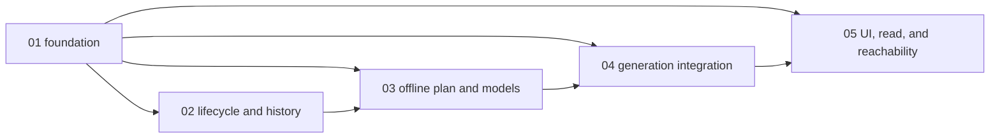

# Scopes Index - Custom Recurring Research Agenda

Feature directory: `specs/019-custom-recurring-research-agenda`
Repository: `research-lab`

Feature 019 delivers a public, committed, recurring research capability. It
ends at immutable dossiers, the owning research tool, and the brief read.
Feature 019 never writes actions, attention items, anomaly seeds, candidates,
or alerts. Feature 020 may consume validated findings through the read-only
dossier seam.

Exactly five sequential `runtime-behavior` scopes implement the reconciled
specification and design. Scope 1 retains the reusable foundation role through
`state.foundation` and the dependency graph. Every later scope depends on it
directly or transitively. No scope may begin until all listed dependencies are
complete and validated.

## Execution Outline

### Phase Order

1. **Agenda Foundation And Topic Definitions** - add the committed
   `research-agenda.json`, the UMD `rlagenda.js` owner, explicit modes and
   capacities, stable topic definitions/calibration, and all three initial
   topics. This scope performs no runtime research.
2. **Immutable Lifecycle And Historical Seed** - add immutable generation,
   review, dossier, and lifecycle identities; append-only history and
   pointer-last semantics; and the dated Iran note as historical seed without
   relabelling it current.
3. **Offline Plan And Deterministic Models** - select mandatory and cadence
   work offline, enforce triggers and both capacities, compute evidence weights,
   non-additive flows, scenario probabilities, commodity/proxy ranges, charts,
   and current-only predecessor comparison.
4. **Governed Generation And Atomic Publication** - acquire only missing or
   stale evidence, run the bounded networkless research side lane, compose and
   account for every section/topic, and atomically publish agenda, payload, page,
   immutable artifacts, ledger, and current pointer without coupling failures
   to the four critical lanes.
5. **Owning Tool, Brief Read, And Reachability** - ship the real
   `research-agenda-lab.html` Simple/Power tool, compact market-brief read,
   registered tool/page artifacts, site and experience parity, shared
   ticker/chart/table/tooltips, public-safety enforcement, the Feature 020
   read-only seam, and real-static-server browser coverage.

### New Types And Signatures

```text
research-agenda/v1
research-topic-definition/v1
research-evidence-record/v1
research-generation/v1
research-review/v1
research-dossier/v1
research-agenda-read/v1

function validateAgenda(registry)
function validateTopicDefinition(definition, registryTopic)
function planGeneration(registry, history, committedEvidence, generationCutoff)
function computeEvidenceWeight(evidence, qualityPolicy, generationCutoff)
function updateEscalationProbabilities(scenarioTree, currentEvidenceImpacts, caps)
function computeFlowState(flowNetwork, chokepointIntervals, scenarioId)
function validateModelInput(modelInput, definition, generationCutoff)
function computeCommodityShockRanges(probabilities, flows, definitions, bars, modelInput)
function computeEquityProxyRanges(channelRanges, proxyDefinitions, calibration, bars)
function compareScenarioOutputs(currentOutput, predecessorOutput)
function classifyChangeDirection(currentOutput, comparison, thresholds, coverage)
function buildAgendaChartSeries(reviews, chartDefinitions)
function composeAgendaCandidate(plan, situations, deterministicOutputs, priorState)
function validateAgendaTransaction(candidate)
function buildAgendaRead(candidate)
function computeAgendaViewState(definition, review, resolvedDossier, leverState)
```

### Validation Checkpoints

| After | Required checkpoint before the next scope | Primary failure caught |
| --- | --- | --- |
| Scope 1 | contract, path-policy, selftest, foundation, and scenario parity checks | duplicated or defaulted contract; malformed initial topic; missing explicit capacity |
| Scope 2 | immutable identity, append-only ledger, historical seed, and overwrite adversarial checks | rewritten history, mutable identity, or dated evidence presented as current |
| Scope 3 | unit/functional model, capacity+1, stale/refuter, double-count, and prior-exclusion checks | network-dependent selection, continuity bias, additive flow loss, or unexplained model output |
| Scope 4 | integration, lane-timeout isolation, all-topic accounting, payload, rollback, and atomicity checks | partial publication, missing section, stale-as-current output, or critical-lane coupling |
| Scope 5 | real-static-server E2E, registry/site/experience/journey parity, PII, responsive, and accessibility checks | unreachable tool/read, model-chart-table drift, private disclosure, or lever-triggered refetch |

## Scope Inventory

| # | Scope ID | Scope Dir | Scope Kind | Depends On | Stable scenarios | Status |
| --- | --- | --- | --- | --- | --- | --- |
| 1 | `01-agenda-registry-contract` | `scopes/01-agenda-registry-contract` | `runtime-behavior` | none | SCN-019-001, SCN-019-002, SCN-019-003, SCN-019-007 | Done |
| 2 | `02-topic-lifecycle` | `scopes/02-topic-lifecycle` | `runtime-behavior` | `01-agenda-registry-contract` | SCN-019-005, SCN-019-006, SCN-019-016 | Done |
| 3 | `03-per-generation-review-policy` | `scopes/03-per-generation-review-policy` | `runtime-behavior` | `01-agenda-registry-contract`, `02-topic-lifecycle` | SCN-019-008, SCN-019-009, SCN-019-010, SCN-019-011, SCN-019-017 | Done |
| 4 | `04-dossier-and-outcome-states` | `scopes/04-dossier-and-outcome-states` | `runtime-behavior` | `01-agenda-registry-contract`, `03-per-generation-review-policy` | SCN-019-004, SCN-019-012, SCN-019-013, SCN-019-014, SCN-019-015 | Done |
| 5 | `05-refinement-public-safety-and-brief-read` | `scopes/05-refinement-public-safety-and-brief-read` | `runtime-behavior` | `01-agenda-registry-contract`, `04-dossier-and-outcome-states` | SCN-019-018, SCN-019-019, SCN-019-020 | Done |

## Dependency Graph

| # | Scope | Exact dependency | Unblocks | Contract carried forward |
| --- | --- | --- | --- | --- |
| 01 | `01-agenda-registry-contract` | none | 02 | one UMD owner, explicit policies, stable definitions, calibration, initial topics |
| 02 | `02-topic-lifecycle` | 01 | 03 | immutable identities, append-only ledger, no-overwrite, pointer semantics |
| 03 | `03-per-generation-review-policy` | 01, 02 | 04 | offline plan, deterministic current-only models, chart rows, reversal comparison |
| 04 | `04-dossier-and-outcome-states` | 01, 03 | 05 | governed evidence, bounded side lane, complete candidate, atomic publication |
| 05 | `05-refinement-public-safety-and-brief-read` | 01, 04 | implementation completion | owning tool, visible brief read, parity, public safety, read-only consumer seam |



## Change Boundary

Planning owns only this index, the five `scope.md` files, per-scope `report.md`
structure and provenance labels, `scenario-manifest.json`, `test-plan.json`,
and execution-scope metadata in `state.json`. `spec.md`, `design.md`, product
source, tests, certification state, and Feature 020 destination behavior are
excluded from planning edits.

Existing per-scope `report.md` evidence predates the gaps reconciliation. It
remains historical. It may support an unaffected checked Test Plan row only
when the raw output directly proves that narrower row and the DoD item carries
explicit provenance. It cannot satisfy any new or invalidated row.
Implementation must execute the repair Test Plan and capture fresh evidence
against the current contract before checking those items or restoring a scope
completion claim.

All planned runtime paths are additive. Exact planned test paths and titles are
declared in the per-scope Test Plan tables and mirrored in `test-plan.json`.
E2E UI coverage must use the real repository static server and checked-in files;
request interception, response substitution, and `page.route` are forbidden.

## Gaps Repair Packet

The `bubbles.gaps` repair cycle reopened three existing rows whose fixtures did
not reach their intended discriminators. Fresh item-local remediation has
reclosed all three while historical evidence remains intact. Scope closure does
not decide the gaps phase: `bubbles.gaps` must revalidate the full GAP-01 through
GAP-10 set before any phase transition.

| Gap | Scope | Scenarios | Implementation files | Test rows | DoD state |
| --- | --- | --- | --- | --- | --- |
| GAP-01 | 1 and runtime integration in 4 | SCN-019-001, SCN-019-003, SCN-019-007, SCN-019-011, SCN-019-012, SCN-019-015 | `research-agenda.json`, `rlagenda.js`, `scripts/research-agenda-generation.mjs`, `scripts/research-agenda-refresh.mjs`, `scripts/brief-narrative-parallel.mjs` | TP-01-08, TP-04-18 | Closed: policy mutations change the corresponding runtime behavior and telemetry, and observed policy plus one refuses before work. |
| GAP-02 | 3 | SCN-019-009, SCN-019-017 | `rlagenda.js`, `scripts/research-agenda-generation.mjs`, `research/agenda/dossiers/**` | TP-03-14 | Closed: exact model-input shape refuses each missing or unknown member before arithmetic. |
| GAP-03 | 3 and UI parity in 5 | SCN-019-017, SCN-019-020 | `research-agenda.json`, `rlagenda.js`, `research-agenda-lab.html` | TP-03-15, TP-05-18 | Closed at scope level: Scope 3 proves the exact five-lever contract, and Scope 5 proves exact changed ids plus identical Simple/Power output with no hidden proxy adjustment. |
| GAP-04 | 5 | SCN-019-019 | `rlagenda.js`, `scripts/research-agenda-generation.mjs`, `scripts/validate-brief-payload.mjs`, `research/agenda/dossiers/**` | TP-05-15 | Closed at scope level: every required finding/seam field and ref fails loud without broad-reference substitution. |
| GAP-05 | 5 | SCN-019-013, SCN-019-020 | `rlagenda.js`, `research-agenda-lab.html`, `research/agenda/reviews/**`, `research/agenda/dossiers/**` | TP-05-16 | Closed at scope level: a valid unchanged review preserves both modes, and missing or tampered snapshot refs render named unavailable without borrowing history. |
| GAP-06 | 4 | SCN-019-012 | `scripts/research-agenda-generation.mjs`, `scripts/research-agenda-refresh.mjs`, `scripts/web-evidence-acquire.mjs`, `research/agenda/dossiers/**` | TP-04-14 | Closed: one valid prior-ledger winner suppresses its query, while missing claim coverage creates exactly one query. |
| GAP-07 | 4 | SCN-019-012, SCN-019-015 | `scripts/research-agenda-refresh.mjs`, `scripts/brief-refresh-and-push.sh`, `research/agenda/history.jsonl`, `research/agenda/current.json`, `market-brief.payload.json`, `market-brief.page.json` | TP-04-15 | Closed with fresh item-local evidence: the repaired fixture first proves the exact missing-`publicSubjects` refusal, then its valid form executes TP-04-15 at 1/1 and the full atomicity file at 34/34 with zero failures or skips. |
| GAP-08 | 2 | SCN-019-006 | `rlagenda.js`, `scripts/research-agenda-generation.mjs`, `research/agenda/history.jsonl`, `research/agenda/current.json` | TP-02-08 | Closed with fresh item-local evidence: TP-02-07 and TP-02-08 each pass 1/1 after adversarial named-refusal probes, the full history E2E passes 4/4 with zero failed or skipped tests, and the project selftest passes 2,095/0. |
| GAP-09 | 3, 4, and compact UI in 5 | SCN-019-009, SCN-019-012, SCN-019-017, SCN-019-020 | `rlagenda.js`, `scripts/research-agenda-generation.mjs`, `scripts/validate-brief-payload.mjs`, `research/agenda/reviews/**`, `research/agenda/dossiers/**`, `rlbrief.js`, `market-brief.html`, `market-brief.page.json` | TP-03-16, TP-04-16, TP-05-17 | Closed at scope level: the integrated change assessment, exact artifact shapes, and compact/full-field separation all pass current evidence. |
| GAP-10 | 4 | SCN-019-012, SCN-019-015 | `market-brief.config.json`, `scripts/research-agenda-generation.mjs`, `scripts/research-agenda-refresh.mjs`, `scripts/brief-refresh-and-push.sh` | TP-04-17 | Closed with fresh item-local evidence: the repaired fixture first proves the exact missing-`publicSubjects` refusal, then its valid form executes TP-04-17 at 1/1 and the full budget stress file at 6/6 with zero failures or skips. |
| GAP-14 | all planning artifacts | all directly invalidated scenarios | `scopes/_index.md`, `scopes/*/scope.md`, `scopes/*/report.md`, `test-plan.json`, `scenario-manifest.json`, `state.json` execution fields | Markdown/JSON/parity/provenance validation | Reconciled through Scope 5 by exact row parity, mandatory provenance, mapped scenario status, and execution-scope status. |

## Routed Observation

GAP-15 is a non-blocking framework observation outside this feature's
`workBoundary`. The installed downstream scanner path differs from the
framework source-layout command. Route that observation to the framework owner;
do not edit `.github/bubbles/**` here and do not let the mismatch suppress
Feature 019 artifact lint, traceability, test-path, capability, dependency,
JSON, fence, provenance, or diff-boundary checks.

## Carried Unresolved Findings And Observations

This reconciliation does not resolve, suppress, or reclassify the existing
non-row findings below.

| Finding | Current disposition | Owner or boundary |
| --- | --- | --- |
| `S4-FRAMEWORK-001` | Unresolved. The installed implementation-reality scanner omits `.mjs` discovery; explicit product scans do not close the framework defect. | Canonical Bubbles framework owner; downstream `.github/bubbles/**` remains read-only. |
| `S5-FRAMEWORK-EVIDENCE-001` | Unresolved. The evidence helper reported arithmetic syntax errors for empty `git diff --check` output even though the wrapped command exited zero. | Canonical Bubbles framework owner; direct product diff checks remain the controlling local result. |
| `G022`, `G053`, `G040`, `G097` | Unresolved guard findings carried from the Scope 2 post-transition ledger. They are not reclassified as fixture defects. | Owning Bubbles workflow and framework governance. |
| `S5-BOUNDARY-001` | Routed and unresolved. The dirty `scripts/build-attention-items.mjs` path belongs to Feature 020 and remains excluded from Feature 019. | Feature 020 owning workflow. |
| `S5-TESTPATH-OBS-001` | Observation retained; no resolution claim. | Repository maintenance owner. |
| `S5-EDITOR-OBS-001` | Observation retained; historical MD010 appears only in preserved raw evidence. | Preserve report bytes and add no new diagnostic class. |
| `S5-ENV-OBS-001` | Observation retained exactly as named in `state.json`; no additional evidence or resolution is inferred here. | Remains outside the three fixture repairs. |

## Gaps Revalidation Handoff

The workflow remains `gaps/in_progress` with `bubbles.gaps` as active owner.
All five scopes and all twenty stable scenarios are Done again. Scope 4 is
reclosed only on the fresh TP-04-15 and TP-04-17 remediation evidence. Scope 5
returns to Done because its own eighteen checked rows and evidence were never
invalidated. The next target is the Feature 019 root for full GAP-01 through
GAP-10 revalidation. This planning reconciliation does not advance to harden or
validate.

---

*Educational models only - not investment advice.*
