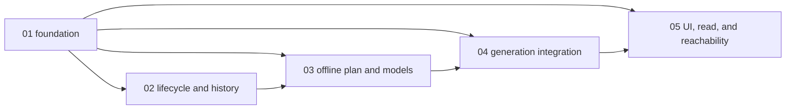

# Scopes Index - Custom Recurring Research Agenda

Feature directory: `specs/019-custom-recurring-research-agenda`
Repository: `research-lab`

Feature 019 delivers a public, committed, recurring research capability. It
ends at immutable dossiers, the owning research tool, and the brief read.
Feature 019 never writes actions, attention items, anomaly seeds, candidates,
or alerts. Feature 020 may consume validated findings through the read-only
dossier seam.

Exactly five sequential `runtime-behavior` scopes implement the reconciled
specification and design. Scope 1 retains the reusable foundation role through
`state.foundation` and the dependency graph. Every later scope depends on it
directly or transitively. No scope may begin until all listed dependencies are
complete and validated.

## Execution Outline

### Phase Order

1. **Agenda Foundation And Topic Definitions** - add the committed
   `research-agenda.json`, the UMD `rlagenda.js` owner, explicit modes and
   capacities, stable topic definitions/calibration, and all three initial
   topics. This scope performs no runtime research.
2. **Immutable Lifecycle And Historical Seed** - add immutable generation,
   review, dossier, and lifecycle identities; append-only history and
   pointer-last semantics; and the dated Iran note as historical seed without
   relabelling it current.
3. **Offline Plan And Deterministic Models** - select mandatory and cadence
   work offline, enforce triggers and both capacities, compute evidence weights,
   non-additive flows, scenario probabilities, commodity/proxy ranges, charts,
   and current-only predecessor comparison.
4. **Governed Generation And Atomic Publication** - acquire only missing or
   stale evidence, run the bounded networkless research side lane, compose and
   account for every section/topic, and atomically publish agenda, payload, page,
   immutable artifacts, ledger, and current pointer without coupling failures
   to the four critical lanes.
5. **Owning Tool, Brief Read, And Reachability** - ship the real
   `research-agenda-lab.html` Simple/Power tool, compact market-brief read,
   registered tool/page artifacts, site and experience parity, shared
   ticker/chart/table/tooltips, public-safety enforcement, the Feature 020
   read-only seam, and real-static-server browser coverage.

### New Types And Signatures

```text
research-agenda/v1
research-topic-definition/v1
research-evidence-record/v1
research-generation/v1
research-review/v1
research-dossier/v1
research-agenda-read/v1

function validateAgenda(registry)
function validateTopicDefinition(definition, registryTopic)
function planGeneration(registry, history, committedEvidence, generationCutoff)
function computeEvidenceWeight(evidence, qualityPolicy, generationCutoff)
function updateEscalationProbabilities(scenarioTree, currentEvidenceImpacts, caps)
function computeFlowState(flowNetwork, chokepointIntervals, scenarioId)
function computeCommodityShockRanges(probabilities, flows, definitions, bars, levers)
function computeEquityProxyRanges(channelRanges, proxyDefinitions, calibration, bars, levers)
function compareScenarioOutputs(currentOutput, predecessorOutput)
function classifyChangeDirection(currentOutput, comparison, thresholds, coverage)
function buildAgendaChartSeries(reviews, chartDefinitions)
function composeAgendaCandidate(plan, situations, deterministicOutputs, priorState)
function validateAgendaTransaction(candidate)
function buildAgendaRead(candidate)
```

### Validation Checkpoints

| After | Required checkpoint before the next scope | Primary failure caught |
| --- | --- | --- |
| Scope 1 | contract, path-policy, selftest, foundation, and scenario parity checks | duplicated or defaulted contract; malformed initial topic; missing explicit capacity |
| Scope 2 | immutable identity, append-only ledger, historical seed, and overwrite adversarial checks | rewritten history, mutable identity, or dated evidence presented as current |
| Scope 3 | unit/functional model, capacity+1, stale/refuter, double-count, and prior-exclusion checks | network-dependent selection, continuity bias, additive flow loss, or unexplained model output |
| Scope 4 | integration, lane-timeout isolation, all-topic accounting, payload, rollback, and atomicity checks | partial publication, missing section, stale-as-current output, or critical-lane coupling |
| Scope 5 | real-static-server E2E, registry/site/experience/journey parity, PII, responsive, and accessibility checks | unreachable tool/read, model-chart-table drift, private disclosure, or lever-triggered refetch |

## Scope Inventory

| # | Scope ID | Scope Dir | Scope Kind | Depends On | Stable scenarios | Status |
| --- | --- | --- | --- | --- | --- | --- |
| 1 | `01-agenda-registry-contract` | `scopes/01-agenda-registry-contract` | `runtime-behavior` | none | SCN-019-001, SCN-019-002, SCN-019-003, SCN-019-007 | Done |
| 2 | `02-topic-lifecycle` | `scopes/02-topic-lifecycle` | `runtime-behavior` | `01-agenda-registry-contract` | SCN-019-005, SCN-019-006, SCN-019-016 | Done |
| 3 | `03-per-generation-review-policy` | `scopes/03-per-generation-review-policy` | `runtime-behavior` | `01-agenda-registry-contract`, `02-topic-lifecycle` | SCN-019-008, SCN-019-009, SCN-019-010, SCN-019-011, SCN-019-017 | Done |
| 4 | `04-dossier-and-outcome-states` | `scopes/04-dossier-and-outcome-states` | `runtime-behavior` | `01-agenda-registry-contract`, `03-per-generation-review-policy` | SCN-019-004, SCN-019-012, SCN-019-013, SCN-019-014, SCN-019-015 | Done |
| 5 | `05-refinement-public-safety-and-brief-read` | `scopes/05-refinement-public-safety-and-brief-read` | `runtime-behavior` | `01-agenda-registry-contract`, `04-dossier-and-outcome-states` | SCN-019-018, SCN-019-019, SCN-019-020 | Done |

## Dependency Graph

| # | Scope | Exact dependency | Unblocks | Contract carried forward |
| --- | --- | --- | --- | --- |
| 01 | `01-agenda-registry-contract` | none | 02 | one UMD owner, explicit policies, stable definitions, calibration, initial topics |
| 02 | `02-topic-lifecycle` | 01 | 03 | immutable identities, append-only ledger, no-overwrite, pointer semantics |
| 03 | `03-per-generation-review-policy` | 01, 02 | 04 | offline plan, deterministic current-only models, chart rows, reversal comparison |
| 04 | `04-dossier-and-outcome-states` | 01, 03 | 05 | governed evidence, bounded side lane, complete candidate, atomic publication |
| 05 | `05-refinement-public-safety-and-brief-read` | 01, 04 | implementation completion | owning tool, visible brief read, parity, public safety, read-only consumer seam |



## Change Boundary

Planning owns only this index, the five `scope.md` files,
`scenario-manifest.json`, `test-plan.json`, and execution-scope metadata in
`state.json`. `spec.md`, `design.md`, product source, tests, certification
state, and Feature 020 destination behavior are excluded from planning edits.

Existing root and per-scope `report.md` evidence belongs to the superseded
implementation contract. It remains historical and must not satisfy any
replanned DoD item. Implementation must execute the replanned Test Plan and
capture fresh evidence against the current contract before checking any item.

All planned runtime paths are additive. Exact planned test paths and titles are
declared in the per-scope Test Plan tables and mirrored in `test-plan.json`.
E2E UI coverage must use the real repository static server and checked-in files;
request interception, response substitution, and `page.route` are forbidden.

---

*Educational models only - not investment advice.*
