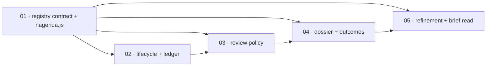

# Scopes Index — Custom Recurring Research Agenda

Feature directory: `specs/019-custom-recurring-research-agenda`
Repository: `research-lab`

The operator declares standing research topics in a committed registry. On every
brief generation the pipeline decides offline which topics are due, researches at
most the declared budget of them through the existing allowlisted web lanes,
writes an immutable dated dossier per reviewed topic, appends one ledger row per
review event, and publishes an honest per-topic outcome that reaches a brief
surface the reader actually opens. Nothing is defaulted, nothing is overwritten,
and a topic that could not be researched says so by name.

Five scopes, matching the intended decomposition recorded in `spec.md`
*Intended Scope Decomposition* and the `scopeId` values already carried in
`scenario-manifest.json` and `state.json`. Thirty-eight functional requirements
and twenty scenarios, inside the P25 cap.

## Scope Ordering Rationale

**The contract lands first** because every other scope is a producer or a
consumer of one shape. The lifecycle mutates a topic the contract defines; the
review policy reads the cadence fields the contract declares; the dossier
references the `topicId` the contract freezes; the refinement rule compares
against the `declaredQuestion` the contract makes byte-stable. Building any of
those before `rlagenda.js` exists would mean five definitions of one record,
which is precisely the failure FR-019-009 and P19 exist to prevent. Scope 1 is
therefore the only root and carries `foundation:true`.

**Lifecycle is second and deliberately not folded into the contract.** Validation
is a pure function of one topic; lifecycle is a function of a topic *and* the
committed ledger. Separating them keeps the ledger — the append-only surface that
FR-019-014, FR-019-030 and FR-019-031 all depend on — introduced once, with its
own adversarial case, before any writer touches it.

**The review policy is third** because dueness is a function of `(registry,
ledger, evidence, now)`. It cannot be written before the ledger exists (scope 2)
and it must exist before any research runs, because the whole cost argument of
this feature is that a not-due topic never enters a prompt. Selecting offline is
what makes NFR-019-002 true rather than hoped for.

**The dossier and its outcome states are fourth** because they are the first
scope in which a topic is actually researched. The lane, its `optional`
degradation and the four honest outcome states can only be exercised once the
plan that selects a topic exists. Placing this before scope 3 would mean
researching every topic every generation to test the writer, which is the
behaviour the feature exists to remove.

**Refinement, public-scope enforcement and the brief read are last** because the
read composes over everything the first four scopes produce, and because tool
registration is atomic with the page it registers: `scripts/build-pages-site.mjs`
asserts at `:41-49` that every registered page exists and is not excluded, and
that every unregistered root `.html` is listed in `site-exclusions.json`. That
change cannot be staged across scopes without leaving the site build red in
between.

## Scope Inventory

| # | Scope | Artifact | Depends On | Scenarios | Status |
| --- | --- | --- | --- | --- | --- |
| 1 | Agenda Registry Contract And Owning Module | [`01-agenda-registry-contract/scope.md`](01-agenda-registry-contract/scope.md) | none | SCN-019-001 … -003 | Not started |
| 2 | Topic Lifecycle And Append-Only Ledger | [`02-topic-lifecycle/scope.md`](02-topic-lifecycle/scope.md) | 1 | SCN-019-004 … -007 | Not started |
| 3 | Per-Generation Review Policy | [`03-per-generation-review-policy/scope.md`](03-per-generation-review-policy/scope.md) | 1, 2 | SCN-019-008 … -011 | Not started |
| 4 | Dossier And Honest Outcome States | [`04-dossier-and-outcome-states/scope.md`](04-dossier-and-outcome-states/scope.md) | 1, 3 | SCN-019-012 … -016 | Not started |
| 5 | Refinement, Public Safety And The Brief Read | [`05-refinement-public-safety-and-brief-read/scope.md`](05-refinement-public-safety-and-brief-read/scope.md) | 1, 4 | SCN-019-017 … -020 | Not started |

---

## Dependency Graph

| ## | Scope Directory | Depends On | Unblocks | Why the edge exists |
| --- | --- | --- | --- | --- |
| 01 | `01-agenda-registry-contract` | none | 02, 03, 04, 05 | The foundation. One module owns the topic shape, the closed vocabularies and the refusal codes; every later scope consumes them and none may restate them. |
| 02 | `02-topic-lifecycle` | 01 | 03, 04, 05 | Lifecycle transitions are recorded against the `topicId` scope 1 freezes, in the append-only ledger this scope introduces. |
| 03 | `03-per-generation-review-policy` | 01, 02 | 04, 05 | Dueness reads the cadence fields from scope 1 and the last-reviewed state from the ledger scope 2 writes. |
| 04 | `04-dossier-and-outcome-states` | 01, 03 | 05 | A dossier is written only for a topic the offline plan selected, and it is validated by the contract scope 1 owns. |
| 05 | `05-refinement-public-safety-and-brief-read` | 01, 04 | none | The published read projects the plan and the dossiers; refinement compares against the `declaredQuestion` scope 1 froze and is recorded inside the dossier scope 4 writes. |



Two properties this graph makes explicit. **Scope 1 is the only root** and is the
single definition of the topic contract — no downstream scope may hold a second
copy of the lifecycle vocabulary, the outcome vocabulary or the refusal codes.
**Scope 5 is the only leaf**, because the admission-test corollary in `spec.md`
*Hard constraints* — a read that does not reach the brief does not ship — is
asserted against the finished path rather than against a stage of it.

---

## Named Missing Capabilities

Per P25 this feature blocks on capabilities, never on another spec's status.

| Missing capability | Effect inside these five scopes |
| --- | --- |
| **A committed user-owned topic registry** | Created by scope 1. Nothing else in the repository supplies one. |
| **Per-topic routing into the action list, the attention tier and the alert pipeline** | Absent throughout. A dossier's action material stays inside the dossier and inside the published read. No scope here writes `payload.nextSession`, composes an attention item, or asserts alert state. |
| **Live Red Alert publication** | Neither needed nor claimed by any scope here. |

---

## Execution Outline

### Phase Order

1. **Agenda Registry Contract And Owning Module** — commit `research-agenda.json`
   (`research-agenda/v1`) and author `rlagenda.js`, the single UMD module owning
   validation, the closed vocabularies, the `RLAGENDA-*` refusal codes and the
   balancing assertion. Nothing is researched and nothing is published yet.
2. **Topic Lifecycle And Append-Only Ledger** — `active | paused | retired`
   behaviour, the never-reviewed-is-due rule, per-topic refusal that does not sink
   the agenda, and `research/agenda/history.jsonl` as an append-only event log.
   The three real topics are committed and validated.
3. **Per-Generation Review Policy** — `isDue` and `selectReviewPlan` computed
   entirely offline: cadence, the four-kind closed trigger vocabulary, the
   `reviewBudget`, the declared deterministic selection order and named deferral.
4. **Dossier And Honest Outcome States** — the fifth conditionally-spawned
   `research` lane owning exactly `researchAgenda`, its `optional` soft failure,
   immutable dated dossier files, the `updated | unchanged | stale | unavailable`
   outcomes with their `reviewed` discriminator, and supersession.
5. **Refinement, Public Safety And The Brief Read** — bounded refinement,
   private-field and public-subject refusal, tool registration for
   `research-agenda-lab`, the `payload.researchAgenda` read, the additive
   `market-brief.page.json` key, and the reader-facing agenda section.

### New Types And Signatures

Introduced in scope 1 and consumed unchanged thereafter. Authored as top-level
`function name(...)` declarations, because `extractFn` in `scripts/selftest.mjs:46`
matches `function\s+<name>\s*\(` and cannot see an arrow constant.

```
research-agenda/v1            registry: { contractVersion, reviewBudget, topics[] }
research-dossier/v1           dossier:  { contractVersion, topicId, generatedAt, window,
                                          outcome, reviewed, supersedes,
                                          declaredQuestionSha256,
                                          newestEvidenceObservedAt,
                                          newestEvidenceAgeDays, findings[],
                                          refinements[], unavailableReason }
research-agenda-read/v1       read:     { contractVersion, generatedAt, registryState,
                                          declaredTopicCount, reviewBudget,
                                          selectionOrder, topics[], refusals[] }
research-agenda-history-row/v1 ledger row per (topic, generation) review event

LIFECYCLE_STATES   = ['active','paused','retired']
OUTCOME_STATES     = ['updated','unchanged','stale','unavailable','paused','deferred']
TRIGGER_KINDS      = ['snapshot-name-move','regime-band-change','vix-level','macro-event-within-days']
CONFIDENCE_LEVELS  = ['low','moderate','high']
PRIVATE_FIELDS     = ['size','quantity','costBasis','pnl']
REFUSAL_CODES      = 14 frozen RLAGENDA-* codes

function validateTopic(topic)                                  -> { ok, code, field, message }
function validateAgenda(registry)                              -> { topics, refusals }
function isDue(topic, ledgerState, evidence, nowIso)           -> { due, because }
function selectReviewPlan(registry, ledgerState, evidence, nowIso)
                                                               -> { selected, deferred, notDue,
                                                                    paused, retired, refusals }
function validateDossier(dossier, topic)                       -> { ok, code, field, message }
function supersedes(previousRef, nextDossier)                  -> { ok, code, field, message }
function admitRefinement(topic, proposal)                      -> { admitted, code, reason }
function buildAgendaRead(plan, dossiers)                       -> research-agenda-read/v1
function buildAgendaToolRead(read)                             -> a payload.toolReads entry
function readerSentence(row)                                   -> plain-words state sentence
```

Additive changes to existing surfaces, each named in the owning scope's Change
Boundary: one lane descriptor and one `optional` branch in
`scripts/brief-narrative-parallel.mjs` (scope 4); a `researchAgenda` acceptance
branch in `scripts/validate-brief-payload.mjs`, a 25th `tools.json` entry with
its eleven registration surfaces, and one additive `researchAgenda` key in
`market-brief.page.json` (scope 5).

### Validation Checkpoints

Each checkpoint is `node scripts/selftest.mjs` — the deterministic repository
gate and the GitHub Pages verify job — plus the named additional command. A
scope does not close until its checkpoint is green, so no later scope starts on a
red tree.

| After scope | Checkpoint | What it catches before the next scope starts |
| --- | --- | --- |
| 1 | `node scripts/selftest.mjs` · `node scripts/validate-spec-test-paths.mjs` | A contract that accepts a malformed topic, a vocabulary that is not closed, or a balancing assertion that does not balance — before any consumer is written against it. |
| 2 | `node scripts/selftest.mjs` | A lifecycle transition that rewrites history in place, or one invalid topic disabling the rest of the agenda. |
| 3 | `node scripts/selftest.mjs` with `fetch` stubbed to throw | Dueness that silently depends on the network, and a budget that does not bound the selection. |
| 4 | `node scripts/selftest.mjs` · `node scripts/validate-brief-payload.mjs` | A lane failure taking the whole brief down, a fabricated finding standing in for `unchanged`, and a dossier write that overwrites its predecessor. |
| 5 | `node scripts/selftest.mjs` · `node scripts/validate-brief-payload.mjs` · `node scripts/build-pages-site.mjs` · `node scripts/pii-scan.mjs` · Playwright `--project=system-chrome` | A read that never reaches the reader, a registration that leaves the site build red, a contract code leaking into reader prose, and a private field reaching a committed public artifact. |

---

*Educational models — not investment advice.*
