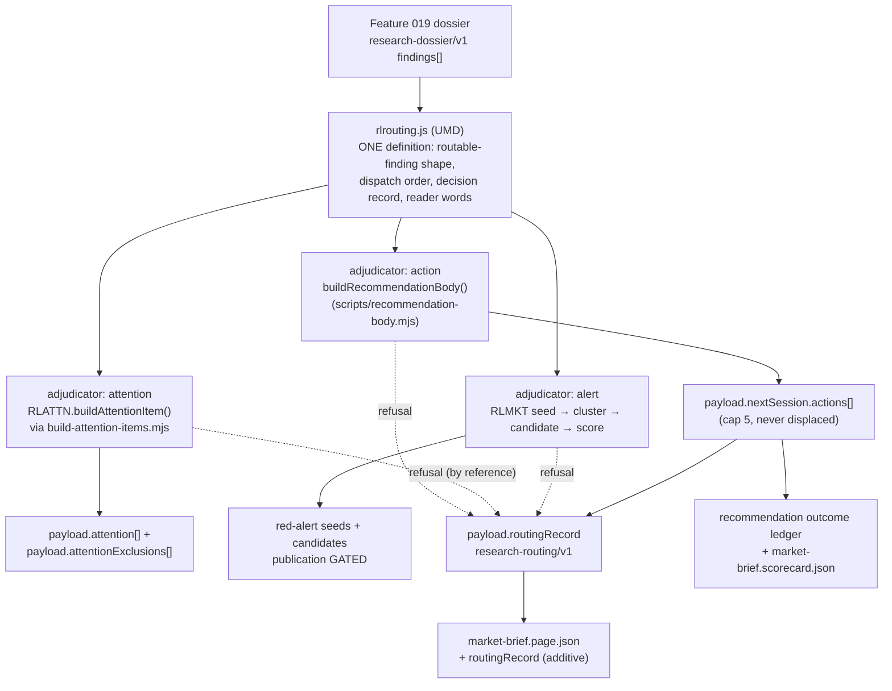
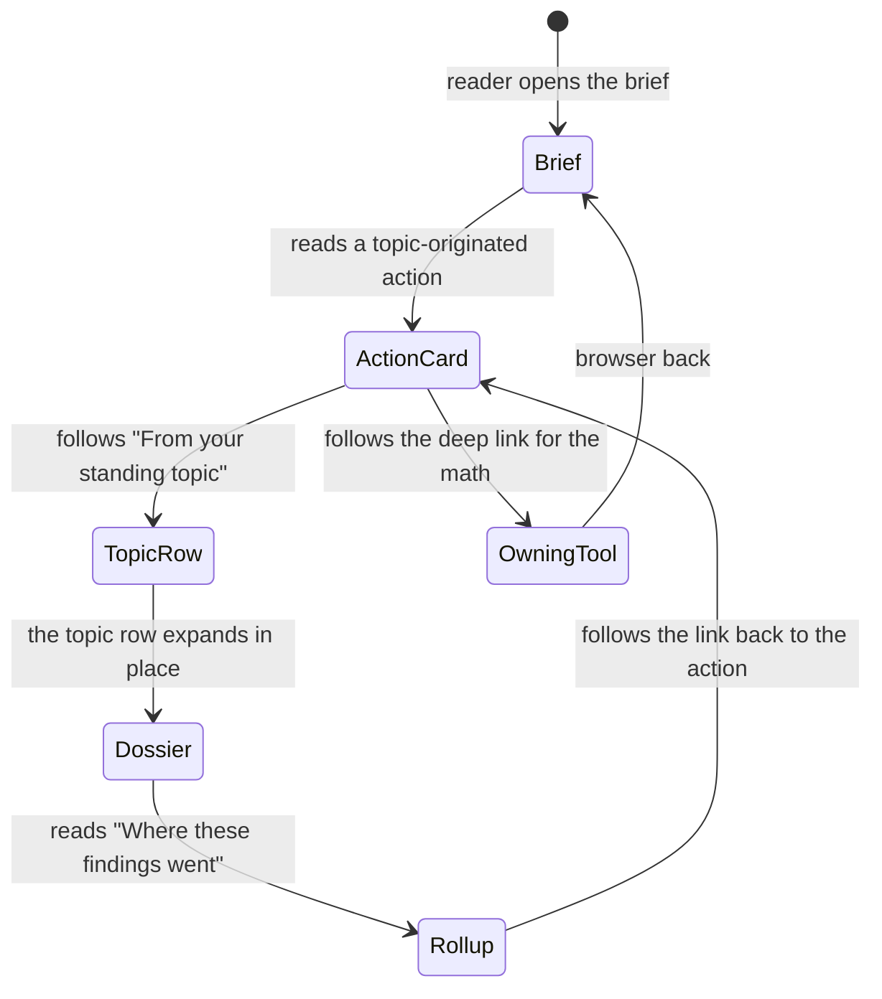
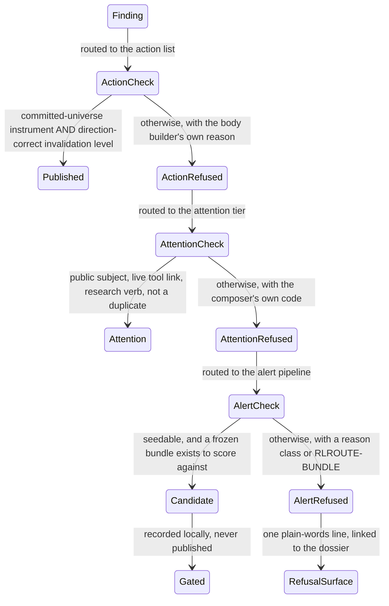

# Feature 020 — Research Action Routing And Alerts — Design

Owner: `bubbles.design`. This document owns architecture, contracts, the reader
surface, and the validation strategy. It does not own business requirements
(`spec.md`, `bubbles.analyst`) or the scope breakdown (`scopes.md`,
`bubbles.plan`).

**Design language.** None is configured. `.github/bubbles-project.yaml` declares
no `designLanguages` block.

**This document absorbs the retired `ux.md` sidecar.** The reader surface,
wireframes, state catalogue, interaction flows, accessibility contract and reader
vocabulary that previously lived in
`specs/020-research-action-routing-and-alerts/ux.md` are now §§ 8–13.
`.github/bubbles/scripts/artifact-lint.sh` refuses that sidecar
(*"Forbidden sidecar artifact present: ux.md"*), so it is deleted. Corrections to
folded assertions that re-verification contradicted are in § 15.2.

**Nothing in this document is built.** Every path below is a design target. Every
repository fact is cited with a path and a symbol or key.

---

## Design Brief

**Current state.** Three destinations exist and each refuses for a different
reason, all verified.

- **The action list.** `payload.nextSession.actions` is capped by
  `config.thresholds.nextSessionMaxActions` (5, `market-brief.config.json`), and
  each entry needs `subject`, `rationale`, `structuralAnchor`, `trigger`,
  `invalidation`, `deepLink`, a `horizon` from `structural|swing|tactical`, a
  family from `hold|trim|add|hedge|rotate` and a `confidence`
  (`scripts/validate-brief-payload.mjs:363-368`). D16 then applies to
  `tactical` and `swing` only (`D16_SCORED_HORIZONS`, `:128`): an action whose
  own prose resolves `not-evaluable` under `buildRecommendationBody` is withheld,
  and `--drop-unscoreable` drops the claim and publishes the rest (`:487-512`).
  `scripts/recommendation-body.mjs:250-263` resolves **three** reasons —
  `no-instrument-in-committed-universe`, `no-attributable-price-level`,
  `no-attributable-invalidation-level`. The universe is `data/bars/*.json` +
  `data/options/*.json` + `watchlist.json` tickers (`:58-82`).
- **The attention tier.** `rlattention.js` refuses from a closed 13-code
  `REFUSAL_CODES` list (`:158-172`) and never defaults.
  `scripts/build-attention-items.mjs:206-243` records each refusal as
  `{ index, subject, code, field, reason }` in `payload.attentionExclusions[]`,
  validated at `scripts/validate-brief-payload.mjs:428-446`, and asserts
  `built + excluded === declared` (`:284-286`).
- **The alert pipeline.** `rlmarketaction.js:656` refuses `published === true`
  with `RLMKT-GATE`, and the projection carries `GATE.redAlertPublication`
  unchanged. Everything upstream exists and is usable: `anomaly-seed/v1`
  (`:889-914`), `clusterAnomalySeeds` (`:921-…`), `buildQueryPlanInput`,
  `buildCandidate` (`:1013`), `red-alert-policy/v1` with `scoreThreshold` 75,
  `visibleCap` 5, `minSeverity` 4, `minIndependentOrigins` 2,
  `minOwnerEvidence` 1 (`:835-859`), the eight `TRANSMISSION_CHANNELS`
  (`:793-797`), the closed `REJECTION_REASON_CLASSES` (`:822-827`),
  `RESEARCH_VERBS` (`:829-831`), append-only `LIFECYCLE_STATES` /
  `LIFECYCLE_TRANSITIONS` (`:799-819`), `FORBIDDEN_ALARMIST_TERMS` (`:865-868`)
  and `RED_ALERT_EMPTY_STATEMENT` (`:861`).

Nothing routes a research finding into any of them, and nothing publishes a
refusal a reader can see when none of them accepts it.

**Target state.** One UMD module, `rlrouting.js`, owns the routable-finding shape
and the routing dispatch. Each destination still adjudicates itself, through
**injected adjudicators** rather than a re-implementation. Every decision —
accept or refuse — is recorded in one additive payload key, `routingRecord`, and
that key reaches the page. Topic actions are composed deterministically by the
collector, never suggested to a lane in prose. Topic findings become anomaly seeds
and, where a frozen evidence bundle exists, scored candidates; publication stays
gated and nothing is faked.

**Patterns to follow.**

- `scripts/build-attention-items.mjs` header (`:1-33`) — the load-bearing
  precedent for this whole feature: *"a prose instruction to a language model is
  advisory; it is not a mechanical guarantee."* Three consecutive publishes
  emitted zero conforming items while the instruction was intact and the gate was
  armed. Everything structural in § 6 follows from that.
- `scripts/build-attention-items.mjs:143-166` — anchor a code to the owning
  module's frozen list and refuse to compose if the anchor disappears, rather
  than restating a literal.
- `scripts/build-attention-items.mjs:171-185` `recordableSubject` — a refusal
  record must not republish the value the refusal just withheld.
- `payload.attentionExclusions[]` — a named per-item refusal carrying the
  refusing gate's own `code`, `field` and `reason`.
- `scripts/recommendation-body.mjs` header — *"Contracts are ADDITIVE: v1 rows
  stay readable; v2 rows carry the same keys plus the body."* Origin attribution
  follows this exactly.
- `market-brief.html:1767` — plain reader words with the machine slug on
  `data-mac-gate`.

**Patterns to avoid.**

- **Do not put an action-evaluability refusal into `attentionExclusions[]`.**
  `scripts/validate-brief-payload.mjs:438-440` refuses any exclusion whose `code`
  is not a member of `RLATTN.REFUSAL_CODES`. `no-instrument-in-committed-universe`
  is not one, so the publish gate would reject the payload. This is the
  mechanical reason the folded conflict C-020-01 resolves to a separate key
  (§ 4.3).
- **Do not ask the `core` lane to adopt topic material.** Same reason as the
  build-step header above. § 6.1.
- **Do not re-implement any destination's eligibility check** to predict an
  outcome, not even "for the UI". FR-020-004, FR-020-006. § 5.2.
- **Do not let a topic action be relabelled `structural` to escape D16.**
  `D16_SCORED_HORIZONS` is `['tactical','swing']` and structural is genuinely out
  of scope, which makes self-labelling a real, currently-open loophole. § 6.3.
- **Do not treat the alert `published` flag as reachable.** Any path that sets it
  is refused `RLMKT-GATE`, and faking one locally is forbidden by `spec.md`.
- **Do not write a literal `tests/<name>.mjs` path into any file under `specs/`.**
  `scripts/validate-spec-test-paths.mjs:59` scans `specs/**` and fails on a path
  absent from disk and from the committed baseline. § 14.3 names tests without
  their extension.

**Resolved decisions.**

- One owning module `rlrouting.js`; destination adjudication is **injected**, so
  the module holds the dispatch and none of the rules (§ 5).
- Cross-destination refusals live in a new additive payload key `routingRecord`
  (`research-routing/v1`), not in `attentionExclusions[]` (§ 4.3, resolving
  C-020-01 with a mechanical reason).
- Topic actions are composed by the collector after the lanes, capped, and
  **never displace** an existing action (§ 6.1, § 6.2).
- Born-evaluable is enforced **before emission**, so `--drop-unscoreable` never
  has to drop a topic action (§ 6.2).
- The structural loophole is closed by two independent guards — horizon fidelity
  against the immutable dossier, and a refusal of structural calls carrying a
  scored directional level pair (§ 6.3).
- Seeds are always reachable; scored candidacy additionally requires a frozen
  `web-evidence-bundle/v1`, and that limit is published rather than hidden
  (§ 7.2).
- The scorecard publishes the single aggregate rate plus a per-topic **count**;
  a per-topic rate is withheld below the committed `minResolvedSample` of 20
  (§ 7.4, resolving C-020-05).

**Open questions.** Two remain, both non-blocking — § 16.

---

## 1. Purpose And Scope

Carry a research finding to whichever of the three existing destinations its
evidence actually qualifies for, and publish a named refusal — carrying the
refusing gate's own code — for every finding that reaches none.

In scope: the routable-finding contract and its owning module; the routing
dispatch and its recorded decisions; action-list emission under the full action
contract and the born-evaluable rule; attention submission through the existing
composer; anomaly seeds, clustering and candidate scoring under the unchanged
policy; the degraded alert disclosure; ledger participation and origin
attribution; the reader-visible refusal surface.

Out of scope, and routed rather than absorbed: the registry, lifecycle, dossier
and review policy (Feature 019); expanding the committed instrument universe
(`spec.md` Non-Goal 5); live Red Alert publication (a named missing capability,
§ 7.3).

---

## 2. Architecture Overview



Three properties carry the design.

1. **The module dispatches; the destinations decide.** `rlrouting.js` contains no
   threshold, no cap, no vocabulary belonging to a destination. It receives
   adjudicator functions and records their verdicts verbatim (FR-020-004,
   FR-020-006).
2. **Every finding lands exactly once.** Either at a destination or in
   `routingRecord`. The balancing assertion in § 4.3 makes that mechanical, and
   § 12.1's reader invariant states it in plain words.
3. **Nothing is advisory.** No step in this feature depends on a lane obeying a
   prose instruction. That is the lesson `scripts/build-attention-items.mjs:1-33`
   paid for with three silent publishes.

---

## 3. Capability Foundation

Routing is a reusable capability with three concrete destinations that share one
contract and differ on every rule, so it is modelled foundation-first.

**Foundation — `rlrouting.js` (`routable-finding/v1`).** Owns, and is the only
place that owns:

- the routable-finding shape and its validation (`validateRoutableFinding`);
- the closed destination vocabulary `action | attention | alert`;
- the declared dispatch order and the deterministic selection order;
- the decision record shape (`research-routing/v1`);
- the closed `RLROUTE-*` refusal codes this feature itself raises (§ 4.4) —
  distinct from, and never a restatement of, any destination's codes;
- the reader-word mapping from every recorded code to plain English (§ 10).

**Extension point — one, closed.** `ADJUDICATORS`: a caller-supplied map from
destination id to `(finding, context) => { accepted, code, field, reason, payload }`.
The module refuses to route a destination for which no adjudicator was supplied
(`RLROUTE-ADJUDICATOR`), rather than approximating the answer. This is what makes
FR-020-004 structural: there is no code path in which the module could decide
eligibility itself.

## 4. Concrete Implementations

### Variation axes

| Axis | Variants | Why the foundation must absorb the difference |
| --- | --- | --- |
| **Destination contract** | action (`recommendation-body` + the action field contract), attention (`decision-attention/v1`), alert (`anomaly-seed/v1` → `red-alert-candidate/v1`) | Three unrelated rule sets, three unrelated code namespaces, one uniform decision record |
| **Refusal channel** | action refusals → the new `routingRecord`; attention refusals → the composer's own `attentionExclusions[]`, referenced not copied; alert refusals → reason-class counts | `attentionExclusions[].code` is validated against `RLATTN.REFUSAL_CODES`, so an action reason placed there fails the publish gate |
| **Runtime environment** | Node collector (routes and records), browser (renders the record only) | The browser must never re-decide eligibility; it holds the same module but is supplied no adjudicators |
| **Terminal state** | published at a destination, refused with a named code, or gated (alert) | A gated candidate is neither an acceptance nor a refusal, and needs its own recorded state so it is not lost |

### 4.1 Routable finding — `routable-finding/v1`

Projected from a Feature 019 `research-dossier/v1` finding. Feature 019 owns the
finding as written; this feature owns the projection and the eligibility
dispatch. Neither redefines the other (P19).

```jsonc
{
  "contractVersion": "routable-finding/v1",
  "findingId": "hormuz-oil/2026-08-10T205557Z/1",
  "originTopicId": "hormuz-oil",
  "originTopicTitle": "U.S.–Iran oil and the Strait of Hormuz",
  "originDossierRef": "research/agenda/hormuz-oil/2026-08-10T205557Z.dossier.json",
  "subject": "XLE",
  "claim": "Transit volumes through the strait fell for a third consecutive month.",
  "evidence": [ { "observedAt": "2026-06-08", "source": { "kind": "web", "host": "www.reuters.com", "ref": "…" } } ],
  "horizon": "swing",                    // structural | swing | tactical — copied from the dossier, never re-chosen
  "verb": "verify",                      // must be a RESEARCH_VERBS member
  "proposedAction": { "family": "hold", "trigger": "…", "invalidation": "…", "structuralAnchor": "…", "confidence": 58 },
  "transmissionChannels": ["commodities-energy", "geopolitical-supply-chain"],
  "severity": 4,
  "independentOriginGroups": 3,
  "ownerEvidenceRefs": ["research-agenda-lab:hormuz-oil/2026-08-10T205557Z/1"]
}
```

- A finding missing `subject`, `claim`, `evidence[].observedAt`,
  `evidence[].source`, `horizon`, `originTopicId` or `originDossierRef` is
  refused `RLROUTE-INCOMPLETE`. No member is defaulted, inferred or synthesised
  (FR-020-003).
- `horizon` is **copied** from the immutable dossier finding and is the anchor the
  structural guard in § 6.3 compares against.
- `verb` must be one of `monitor, verify, investigate, scenario-test,
  review-hedge-research, trace-claims` — read from `RLMKT.RESEARCH_VERBS`, never
  restated (FR-020-021).

### 4.2 Dispatch

Declared order: **action → attention → alert**. The order is not arbitrary:

1. Action first, because a subject already carried by an action is an
   `RLATTN-OVERLAP` refusal at the attention tier. Deciding attention first would
   make the overlap check depend on evaluation order rather than on published
   truth.
2. Attention second, because it is the only destination that can refuse for a
   reason the reader can act on directly (bring the subject onto the watchlist).
3. Alert last, because it is the only destination whose terminal state is
   *gated* rather than published, so a finding should exhaust the publishable
   destinations first.

A finding may be accepted by more than one destination, but **never for the same
subject in the same generation** (FR-020-005) — which is exactly what the
attention composer's own `RLATTN-OVERLAP` already enforces once action runs
first. This feature adds no second duplicate check and no way around the existing
one (FR-020-022).

### 4.3 The routing record — `research-routing/v1`

One additive top-level payload key, `payload.routingRecord`.

```jsonc
{
  "contractVersion": "research-routing/v1",
  "generatedAt": "2026-08-10T20:55:57Z",
  "declaredFindingCount": 7,
  "selectionOrder": "evidence recency, then severity, then originTopicId, then findingId",
  "decisions": [
    { "findingId": "…", "originTopicId": "hormuz-oil", "subject": "XLE",
      "destination": "action", "state": "published",
      "actionIndex": 0, "code": null, "field": null, "reason": null },

    { "findingId": "…", "originTopicId": "defense-earnings-acceleration", "subject": "Rheinmetall",
      "destination": "action", "state": "refused",
      "code": "no-instrument-in-committed-universe",
      "field": "subject",
      "reason": "the committed instrument universe holds no bars or options for this subject",
      "raisedBy": "scripts/recommendation-body.mjs" },

    { "findingId": "…", "subject": "DBA",
      "destination": "attention", "state": "refused",
      "code": "RLATTN-PRIVACY", "field": "subject",
      "reason": "…", "raisedBy": "rlattention.js",
      "attentionExclusionIndex": 2 },

    { "findingId": "…", "destination": "alert", "state": "gated",
      "candidateId": "candidate/cluster-0/…", "admissionScore": 81,
      "code": null, "reason": null }
  ],
  "unreachedFindings": 3
}
```

Three rules make the record trustworthy.

- **Codes are never restated.** An action decision carries the exact
  `evaluabilityReason` string `buildRecommendationBody` resolved; an attention
  decision carries the composer's own `RLATTN-*` code and a pointer
  (`attentionExclusionIndex`) into `payload.attentionExclusions[]` rather than a
  copy of it. `attentionExclusions[]` stays the composer's channel, unchanged, and
  its own balancing assertion (FR-020-024) remains the composer's
  (`scripts/build-attention-items.mjs:284-286`).
- **Why a separate key, and not `attentionExclusions[]`.**
  `scripts/validate-brief-payload.mjs:438-440` refuses any exclusion whose `code`
  is not in `RLATTN.REFUSAL_CODES`. `no-instrument-in-committed-universe` is not,
  so putting an action refusal there would make the publish gate reject the whole
  payload. This is the mechanical answer to `spec.md` open question 1 and to the
  folded conflict C-020-01.
- **Balancing assertion (FR-020-007, FR-020-037).** Every routable finding has at
  least one decision, and
  `distinct(decisions.findingId).length === declaredFindingCount`. A finding with
  no decision is a silent discard, which is the one failure this feature exists
  to remove.
- **Withholding mirrors the shipped rule.** A refusal whose own subject is what
  the guard withheld records the marked placeholder, exactly as
  `scripts/build-attention-items.mjs:171-185` does for `RLATTN-PRIVACY`. No other
  code withholds its subject.

**Page reach.** `market-brief.page.json` carries no `attentionExclusions` and no
`toolReads` today (`scripts/build-brief-page-artifacts.mjs:29-42`), so the
refusal surface would be invisible without one additive key: `routingRecord` is
added to that projection. This is the same mechanism Feature 019 uses for
`researchAgenda`, and it is why FR-020-037 needs a design decision rather than a
render.

### 4.4 Closed refusal vocabulary — `RLROUTE-*`

These are the refusals **this feature itself** raises. They never shadow,
restate or replace a destination's own code; a destination's verdict is always
recorded with that destination's code.

| Code | Refused when | FR |
| --- | --- | --- |
| `RLROUTE-CONTRACT` | `contractVersion` absent or unknown | 020-001 |
| `RLROUTE-INCOMPLETE` | a required member is absent; nothing is defaulted | 020-003 |
| `RLROUTE-ADJUDICATOR` | no adjudicator was supplied for a destination the module was asked to route | 020-004 |
| `RLROUTE-VERB` | `verb` outside `RLMKT.RESEARCH_VERBS` before any submission | 020-021 |
| `RLROUTE-HORIZON` | the emitted action's `horizon` differs from the originating dossier finding's | 020-015 |
| `RLROUTE-STRUCTURAL-SCORED` | a `structural` topic action whose own prose resolves a scored directional level pair | 020-015 |
| `RLROUTE-CAP` | a qualifying finding with no remaining action slot | 020-012, 020-013 |
| `RLROUTE-DISPLACE` | routing would remove or overwrite a non-topic action | 020-014 |
| `RLROUTE-ALARMIST` | text carrying a `FORBIDDEN_ALARMIST_TERMS` member, checked before any surface | 020-032 |
| `RLROUTE-BUNDLE` | candidate assembly attempted with no frozen `web-evidence-bundle/v1` | § 7.2 |
| `RLROUTE-PUBLISHED` | any attempt to set the alert projection to published | 020-031 |
| `RLROUTE-ORIGIN-PRIVILEGE` | a scoring input that varies with the origin fields | 020-034 |

---

## 5. The Owning Module — `rlrouting.js`

UMD dual module at the repository root, beside `rlattention.js`,
`rlmarketaction.js` and `rlagenda.js`. Never ESM; works from `file://`
(P10). Loaded in Node with `createRequire`, exactly as
`scripts/build-attention-items.mjs:47` loads `rlattention.js`, so the collector,
the publish gate and the browser hold the identical frozen object.

### 5.1 Exported surface

| Export | Kind | Consumers |
| --- | --- | --- |
| `CONTRACT_VERSION`, `RECORD_CONTRACT_VERSION` | frozen strings | all |
| `DESTINATIONS`, `REFUSAL_CODES`, `DECISION_STATES` | frozen arrays | all |
| `validateRoutableFinding(finding)` | pure | collector, publish gate |
| `fromDossierFinding(dossier, finding)` → `routable-finding/v1` | pure | collector |
| `routeFinding(finding, adjudicators, context)` → decision[] | pure dispatch | collector |
| `selectForCap(findings, remainingSlots)` | pure, deterministic | collector |
| `buildRoutingRecord(decisions, declaredCount)` | pure | collector |
| `readerSentence(decision)` | pure | browser, § 10 |

### 5.2 Why adjudicators are injected

FR-020-004 forbids re-implementing or approximating a destination's contract, and
FR-020-006 forbids shadowing its thresholds. An injected adjudicator makes both
structural rather than reviewed: the module has no threshold to shadow because it
holds none, and no rule to approximate because it calls the owner. The Node
collector supplies:

| Destination | Adjudicator | Source of truth |
| --- | --- | --- |
| `action` | `buildRecommendationBody(candidateAction, { universe })` and the action field contract | `scripts/recommendation-body.mjs`, `scripts/validate-brief-payload.mjs:363-368` |
| `attention` | `RLATTN.buildAttentionItem(gateResult, authored, ctx)` through `scripts/build-attention-items.mjs` | `rlattention.js` |
| `alert` | `RLMKT.validateAnomalySeed` → `clusterAnomalySeeds` → `assembleCandidate` → `scoreCandidate` → qualification | `rlmarketaction.js` |

The browser is supplied **no** adjudicators. It renders `routingRecord` and
nothing else, so it cannot re-decide an outcome (§ 8, folded rule 4).

---

## 6. Routing Into The Action List

### 6.1 Where topic actions are composed, and why not in a lane

`core` owns `nextSession` (`scripts/brief-narrative-parallel.mjs:41-45`), and
`readCompleteFragment` requires an exact key-set match, so a lane cannot be
widened without changing its failure semantics.

Two options existed. Supplying the material to `core` as lane input and asking it
to adopt qualifying findings is **advisory** — and the repository has already
paid for that assumption: `scripts/build-attention-items.mjs:1-19` records three
consecutive cron publishes emitting zero conforming items while a prose
instruction naming every required field was intact and the gate was armed. The
fix that worked was structural: the lane stopped emitting the envelope.

So topic actions are composed **deterministically by the collector**, after every
fragment is assigned, using `rlrouting.js` plus the action adjudicator. This is a
collector write, not a lane write, so no lane's key ownership is widened — the
same arrangement Feature 019 uses to merge its `toolReads` entry, and it sits
after the protected-file byte check at `scripts/brief-narrative-parallel.mjs:441-450`,
which is untouched.

### 6.2 Born evaluable, cap, and never displacing

Emission order inside the collector:

1. Compute `remainingSlots = nextSessionMaxActions − payload.nextSession.actions.length`.
2. For each routable finding in the declared deterministic order — evidence
   recency, then severity, then `originTopicId`, then `findingId` — build the
   candidate action under the full field contract (FR-020-008) with
   `originTopicId` attached (FR-020-016).
3. Run the action adjudicator. For a `swing` or `tactical` candidate, emit only
   when `evaluability === 'machine-checkable'`. Otherwise record a refusal
   carrying the exact reason `buildRecommendationBody` resolved — one of the
   three verified values (FR-020-009, FR-020-010, FR-020-011).
4. Append while `remainingSlots > 0`; every further qualifying finding is
   `RLROUTE-CAP` (FR-020-012, FR-020-013).
5. **Never displace.** A topic action only fills a free slot. `RLROUTE-DISPLACE`
   is raised, and the collector refuses, if the post-routing action list is not a
   superset of the pre-routing one (FR-020-014). The record channel for a
   displacement exists so that a future policy permitting one cannot be silent,
   but no current path produces one.

Because step 3 refuses **before** emission, `--drop-unscoreable` never has to drop
a topic action; an unscoreable topic claim was never in the payload
(FR-020-017). The whole-brief publication is therefore never at risk from
routing.

**Verified reach of the three real topics.** Per-finding, never per-topic:

| Finding subject | Action list | Attention tier | Alert pipeline |
| --- | --- | --- | --- |
| `LMT`, `RTX` | can publish — both are in `data/bars/` | refused `RLATTN-PRIVACY` — neither is in `watchlist.json` | seed, and candidate where a bundle exists |
| A European defense listing | refused `no-instrument-in-committed-universe` | refused `RLATTN-PRIVACY` | seed still reachable |
| `XLE`, `USO`, `BNO` | can publish — all three are in `data/bars/` | `XLE` can publish — it is in `watchlist.json` | `geopolitical-supply-chain`, `commodities-energy` |
| `DBA` | can publish — `DBA` is in `data/bars/` | refused `RLATTN-PRIVACY` | seed |
| urea, potash | refused `no-instrument-in-committed-universe` | refused `RLATTN-PRIVACY` | seed |

`watchlist.json` is twelve tickers — `MSFT, QQQ, SPMO, FMTM, XLK, VGT, SOXX,
SPCX, FBTC, FETH, GLD, XLE` — so the privacy refusal is the **common** outcome
for these topics. It is normal and correct, and § 10.2 gives it copy that does
not read like an error.

### 6.3 Closing the D16 structural loophole

`D16_SCORED_HORIZONS` is `['tactical','swing']`
(`scripts/validate-brief-payload.mjs:128`) and `findUnscoreableActions` returns
early for any other horizon (`:147`). Structural is genuinely out of D16's scope,
which means a topic call could dodge evaluability entirely by carrying
`horizon: "structural"`. FR-020-015 forbids that; nothing currently detects it.

Two independent guards, both mechanical:

**G1 — horizon fidelity (`RLROUTE-HORIZON`).** The emitted action's `horizon`
must equal the originating dossier finding's `horizon`. The dossier is an
immutable committed file (Feature 019 § 4.3), so the comparison is against a
value that cannot be edited to match after the fact. Relabelling a swing finding
as a structural action is refused by name.

**G2 — no scored structural call (`RLROUTE-STRUCTURAL-SCORED`).** A topic action
carrying `horizon: "structural"` is refused when its own prose resolves **both** a
trigger level and a direction-correct invalidation level under
`buildRecommendationBody` — that is, when it would have been `machine-checkable`
had it been labelled `swing`. A structural read that carries a full scored
directional level pair is a tactical call wearing a structural label.

G2 alone would be enough to make the loophole unprofitable; G1 alone would be
enough to make it detectable. Both are kept because they fail on different
mutations, and a guard that only one adversarial case can reach is a guard with
one blind spot.

**Adversarial case that can actually fail (P23).** Take a dossier finding on
`LMT` with `horizon: "swing"` and an invalidation carrying a direction-correct
numeric level — verified reachable, since `LMT.json` is in `data/bars/`. Emit it
as an action relabelled `structural`. With the guards, it is refused
`RLROUTE-HORIZON` (and `RLROUTE-STRUCTURAL-SCORED` when the label is the only
change). Remove either guard and it publishes, `findUnscoreableActions` returns
early on the horizon, and an unscoreable directional call reaches the
append-only ledger — permanently, because the ledger cannot be retro-scored.
That is the exact failure BUG-006 already cost this repository once, per the
comment at `scripts/validate-brief-payload.mjs:112-127`.

**Reader consequence.** A structural topic action renders on its own terms with
no scored-call framing and no trigger/invalidation theatre (§ 12.1, T15).

---

## 7. Attention, Alerts, Ledger

### 7.1 Attention

Composition goes through `scripts/build-attention-items.mjs` and therefore
through `RLATTN.buildAttentionItem` — never a parallel path (FR-020-018). The
routing module supplies a candidate in the shape that step already accepts: an
`observed` gate result plus the authored judgement keys
(`AUTHORED_JUDGEMENT_KEYS`, `:52-55`). It authors no envelope field and no
`decisionWindow`.

**The deep link is the load-bearing part.** `resolvedDeepLink()`
(`scripts/build-attention-items.mjs:129-139`) resolves the link from the item's
**first figure's** `provenance.sourceId`, looked up in `payload.toolReads`, and
leaves it absent otherwise — so the composer refuses `RLATTN-DEEPLINK`. A
web-sourced geopolitical finding owns no tool read, so without an owning source
the attention destination is closed to exactly the topics this feature serves,
every time. The resolution is Feature 019's registered `research-agenda-lab` tool
read (Feature 019 § 7): a topic finding's figures carry
`provenance.sourceId: "research-agenda-lab"`, the read's `deepLink` is
`research-agenda-lab.html`, and that value is in `toolDeepLinksFrom(registry)`
at publish time (`scripts/validate-brief-payload.mjs:83-85`). This design does
not create that capability; it depends on it, and § 15.3 states the degraded
behaviour when it is absent.

Every refusal is the composer's own, recorded by the composer in
`attentionExclusions[]` with its `code`, `field` and `reason` (FR-020-019 …
FR-020-023). `routingRecord` points at the index; it copies nothing. An empty
tier stays a valid outcome and is never padded (FR-020-025).

### 7.2 Anomaly seeds and candidacy

A routable finding becomes an `anomaly-seed/v1` through
`RLMKT.validateAnomalySeed`, which requires `seedId`, `ownerToolId`,
at least one `evidenceRefs` entry, `observedCondition`, at least one
`normalizedEntities` entry, at least one `transmissionChannels` member from the
closed eight, and an ISO `cutoffAt` (`rlmarketaction.js:889-914`). All are
available from a dossier finding, and `ownerToolId` is `research-agenda-lab` —
another reason the registration in Feature 019 is load-bearing rather than
cosmetic.

`geopolitical-supply-chain` covers Hormuz and `commodities-energy` covers oil and
fertilizer, as `spec.md` assumes. **Defense earnings acceleration does not map
cleanly to any of the eight**, which `spec.md` assumption 4 asked design to
check. The honest resolution is not to add a ninth channel — the vocabulary is
closed and a channel is a classification label, not a threat: a defense
earnings-acceleration finding names its channel only when its own transmission is
one of the eight (a supply-chain constraint is `geopolitical-supply-chain`; an
input-cost move is `commodities-energy`). A finding whose transmission is
genuinely an earnings-revision path names none, fails
`normalizeAnomalySeed`'s channel requirement, and is recorded as a refusal with
the composer's own code. It still reaches the reader as an action or an attention
item; it simply does not become an alert seed. That is a correct outcome, not a
gap to paper over.

Seeds are clustered by `clusterAnomalySeeds` and assembled by `buildCandidate`,
scored by `scoreCandidate` against the unchanged `red-alert-policy/v1`, and
rejected candidates carry a reason from the closed `REJECTION_REASON_CLASSES`
(FR-020-028 … FR-020-030). No threshold is touched.

**A limit the spec does not state, and this design will not hide.**
`buildCandidate` refuses unless it is handed a frozen `web-evidence-bundle/v1`
with claims (`rlmarketaction.js:1016`). So a topic finding is **always** able to
become a seed, but becomes a scored candidate only when its evidence came through
the committed acquisition path that produces such a bundle —
`scripts/web-evidence-acquire.mjs:54`, whose `web-evidence-acquisition/v1` policy
already declares a `red-alert` lane. A finding with no bundle is recorded
`RLROUTE-BUNDLE` and rendered as "recorded as an observation; it did not go
through the source check an alert candidate needs". It is not silently dropped
and it is not promoted.

### 7.3 The publication gate, and its degraded mode

`composeRedAlertView` refuses `published === true` with `RLMKT-GATE`
(`rlmarketaction.js:656`) and the projection must carry
`GATE.redAlertPublication` unchanged (`:742-743`). No path in this feature sets
it; `RLROUTE-PUBLISHED` refuses any attempt (FR-020-031). A qualifying candidate
is **recorded** so it is not lost, and the surface says publication is
unavailable every time (FR-020-036).

Expressed as `spec.md` requires — as a **named missing capability**, never as
another spec's status:

| Missing capability | Degraded behaviour while absent |
| --- | --- |
| **Live Red Alert publication** | Seeds and scored candidates are produced and recorded; the reader is told the qualification is local and nothing was published; nothing is faked |
| **A registered research surface filing a tool read** | Attention routing refuses `RLATTN-DEEPLINK` every time and each refusal is recorded; the action list and the alert pipeline are unaffected |
| **A frozen web-evidence bundle for a finding** | The finding stops at seed; `RLROUTE-BUNDLE` is recorded; no candidate is assembled |
| **Committed market data for a subject** | `no-instrument-in-committed-universe` is recorded; the finding stays readable research |

The machine slug never enters reader prose: `dependency-pending` and
`feature-0NN` are publication-blocking leak classes
(`scripts/reader-vocabulary.mjs:29`, enforced at
`scripts/validate-brief-payload.mjs:459`). It rides `data-mac-gate`, exactly as
`market-brief.html:1767` already does.

### 7.4 Ledger participation and origin attribution

`scripts/recommendation-body.mjs` states its own rule — *"Contracts are ADDITIVE:
v1 rows stay readable"* — so origin attribution is two **optional additive**
members on the existing body, `originTopicId` and `originDossierRef`, with no
version bump (FR-020-034, P21). A published topic action enters the same ledger
as every other call through `scripts/brief-distributed-publish.mjs` and is scored
by `scripts/evaluate-recommendations.mjs` on identical terms (FR-020-033).
Corrections are new entries referencing the original; nothing is edited or
removed (FR-020-035).

**Origin must change no scoring rule.** `RLROUTE-ORIGIN-PRIVILEGE` guards it, and
the adversarial case is concrete: score one call twice, once with the origin
members present and once absent, and assert byte-identical outcomes. Remove the
guard and a future weighting keyed on origin passes unnoticed.

**Presentation (resolving folded conflict C-020-05).** The scorecard publishes
the single aggregate rate plus a per-topic **count of resolved calls**. A
per-topic *rate* is withheld until that topic's sample clears the committed
`minResolvedSample` of 20 (`scorecard-policy/v1` in `market-brief.config.json`,
whose own note says a rate over a handful of calls is *"noise dressed as
evidence"*). Publishing a per-topic rate below that sample would break P5 while
appearing to honour P4, and is exactly the presentation that becomes a
differential scoring rule by accident.

---

## 8. Reader Surface — Ownership

| Surface | Owner | This feature may | This feature must not |
| --- | --- | --- | --- |
| `#nextSession` | the existing action contract | contribute an action satisfying the full contract, carrying its origin | add a field, relax the cap, or bypass evaluability |
| `#decisionAttention` | `rlattention.js` | submit a candidate through the existing composer | compose by a parallel path, rename a subject to dodge overlap, or invent a deep link |
| Red-alert area | `rlmarketaction.js` | contribute seeds and scored candidates | set published, fake an alert, or lower a threshold |
| Scorecard / outcome ledger | the existing ledger | record the originating topic and dossier version | let origin change any scoring rule, threshold or weighting |
| "What your research did not reach" | this feature, inside an existing drawer | one line per refused finding, in plain words | become a new tier, a new view, or a second attention feed |
| The dossier's routing rollup | Feature 019's dossier surface | link forward to each destination | restate an action's trigger, invalidation or confidence |

**The one-sentence rule.** Each destination keeps its own words for its own item;
this feature adds only *where it came from* and *why it did not arrive*.

---

## 9. Host Facts The Reader Surface Is Built On

| Fact | Evidence |
| --- | --- |
| An action renders as the `.rec` card: action badge, subject, horizon and confidence pills, rationale, `⚓` anchor, `▸ trigger:` / `✕ invalidation:`, then the deep link | `rlbrief.js` `renderRecs()` / `renderNextSession()` |
| The action cap is 5; the attention card cap is 7 | `market-brief.config.json` `thresholds` |
| Evaluability has three named reasons, not two | `scripts/recommendation-body.mjs:250-263` |
| The attention composer refuses from a closed 13-code list and records `code`, `field`, `reason` | `rlattention.js:158-172`; `scripts/validate-brief-payload.mjs:428-446` |
| An attention deep link is composer-resolved from the figure's `provenance.sourceId`, never authored | `scripts/build-attention-items.mjs:129-139` |
| The publish-time deep-link allowlist is the registry's own `tool.file` values | `scripts/validate-brief-payload.mjs:83-85` |
| A subject already carried by an action is refused as an overlap | `rlattention.js` `RLATTN-OVERLAP`; `publishedActionSubjects` in `scripts/build-attention-items.mjs:104` |
| Research verbs are exactly six | `rlmarketaction.js:829-831` |
| Red-alert policy: score 75, visible cap 5, min severity 4, min independent origins 2, min owner evidence 1 | `rlmarketaction.js:835-859` |
| The exact empty statement is *"No current candidate cleared the Red Alert evidence bar for this window."* | `rlmarketaction.js:861` |
| `published === true` is refused; the projection carries the gate unchanged | `rlmarketaction.js:656-662`, `:742-743` |
| A rejected candidate is represented by reason-class counts, never by its title | `rlmarketaction.js:822-827` and the block comment at `:770-780` |
| `FORBIDDEN_ALARMIST_TERMS` blocks eleven terms | `rlmarketaction.js:865-868` |
| An empty attention tier is a valid designed outcome and is never padded | `rlattention.js:717` `emptyStatement` |
| `dependency-pending` / `feature-0NN` in reader prose block publication | `scripts/reader-vocabulary.mjs:29`, enforced at `scripts/validate-brief-payload.mjs:459` |
| The shipped red-alert copy already puts the machine slug on `data-mac-gate` | `market-brief.html:1767` |

**Composition mapping.** `market-brief.html` has no Simple/Power axis; its
density axis is `<details class="drawer">` (`:937, :962, :970, :976`). "Simple"
is the default paint with drawers closed; "Power" is the same section with its
drawer open. Feature 019 § 9.1 states the mapping once, and this feature adopts
it unchanged.

---

## 10. Reader Vocabulary — Machine Code To Plain Words

Machine codes travel in `data-*` attributes; only the right column is visible.

### 10.1 Action-list evaluability

| Machine reason | Reader text |
| --- | --- |
| `no-instrument-in-committed-universe` | "This project holds no price history for [subject], so a call on it could never be scored later. It is kept as research, not published as a call." |
| `no-attributable-price-level` | "No price level was written that a later check could read, so this could not be published as a call." |
| `no-attributable-invalidation-level` | "No level was written that would prove this wrong, so it could not be published as a call. A call that can only be right is not a call." |
| `RLROUTE-CAP` | "Five actions is the limit for one session and this one did not make the cut. It is listed here so it is not lost." |
| `RLROUTE-HORIZON` / `RLROUTE-STRUCTURAL-SCORED` | "This was written as a longer-term read but carried the levels of a short-term call, so it was not published as either." |

### 10.2 Attention-tier refusals (13 closed codes)

| Machine code | Reader text |
| --- | --- |
| `RLATTN-PRIVACY` | "[subject] is not on the public watchlist, so it cannot appear in the decision list. This is a scope rule, not a fault in the research." |
| `RLATTN-DEEPLINK` | "No tool on this site published a read that owns this figure in this run, so there is nowhere to send you for the underlying math." |
| `RLATTN-VERB` | "This asked for an action rather than a piece of research, and the decision list only ever asks you to research." |
| `RLATTN-OVERLAP` | "[subject] is already in the action list above, so it is not repeated here." |
| `RLATTN-FALSIFIABILITY` | "This had nothing written that would prove it wrong, or no point at which it stops counting." |
| `RLATTN-WINDOW` | "No decision window was set, so nothing forces a decision on any particular session." |
| `RLATTN-TRANSMISSION` | "No route was identified by which this would reach prices." |
| `RLATTN-CONFIRMATION` | "Nothing in the market has confirmed this yet, and it did not say so." |
| `RLATTN-PROVENANCE` | "A figure arrived without a source or an as-of date, so it was not shown." |
| `RLATTN-HEADLINE` | "No single clear claim was written." |
| `RLATTN-DISPOSITION` | "This arrived as a settled conclusion rather than something still open." |
| `RLATTN-LIFECYCLE` / `RLATTN-LIFECYCLE-DRIFT` | "This item's status could not be read against the published vocabulary." |

### 10.3 Alert pipeline

| Machine state | Reader text |
| --- | --- |
| `publicationState` is the pending gate | "Publishing alerts is not available yet. What follows is a local check only — nothing was published as an alert." |
| candidate cleared the local bar | "This cleared the local evidence bar. It is recorded, and it was not published." |
| `score-below-threshold` | "It did not reach the evidence score the bar requires." |
| `low-severity` | "It is below the severity the bar requires." |
| `insufficient-corroboration` | "Fewer independent sources than the bar requires." |
| `no-observable-market-evidence` | "Nothing observable in the market supported it." |
| `incomplete-fields` | "Required detail was missing." |
| `source-conflict` | "Its sources disagreed with each other." |
| `stale-or-cutoff-mismatch` | "Its evidence is outside the window this run covers." |
| `RLROUTE-BUNDLE` | "Recorded as an observation. It did not go through the source check an alert candidate needs, so it was not scored." |
| nothing qualified | The exact committed sentence, unchanged: "No current candidate cleared the Red Alert evidence bar for this window." |

### 10.4 Banned in reader prose

`dependency-pending`, `feature-0NN`, `not-integrated`, `coverage-only`, any
`RLATTN-*` / `RLMKT-*` / `RLROUTE-*` / `E0NN-*` code, `sha256:…`, any `…/vN`
contract slug, "Scope N". Also banned by the alert composer itself: "guaranteed",
"inevitable", "certain to", "will definitely", "act now", "panic", "sure thing",
"zero-risk", "cannot fail", "imminent crash", "catastrophic collapse". A refusal
is written in calm, ordinary language; a refused finding is a normal outcome.

---

## 11. Wireframes

### 11.1 A topic-originated action — Simple, desktop

The existing `.rec` card. The only addition is one origin line.

```
┌────────────────────────────────────────────────────────────────────────┐
│ Next trading session — actions only                                    │
│ 2026-08-11   ·  thesis: [one line, unchanged]                          │
├────────────────────────────────────────────────────────────────────────┤
│ ┌──────────────────────────────┐  ┌──────────────────────────────────┐ │
│ │ [HOLD] XLE      swing  62%   │  │ [ADD] LMT       swing   58%      │ │
│ │ [rationale, one or two       │  │ [rationale, one or two           │ │
│ │  sentences, unchanged]       │  │  sentences, unchanged]           │ │
│ │ ⚓ [structural anchor]        │  │ ⚓ [structural anchor]            │ │
│ │ ▸ trigger: [level]           │  │ ▸ trigger: [level]               │ │
│ │ ✕ invalidation: [level]      │  │ ✕ invalidation: [level]          │ │
│ │ From your standing topic:    │  │ From your standing topic:        │ │
│ │   U.S.–Iran oil and Hormuz → │  │   Defense earnings acceleration →│ │
│ │ [Energy sector →]            │  │ [Owning tool →]                  │ │
│ └──────────────────────────────┘  └──────────────────────────────────┘ │
└────────────────────────────────────────────────────────────────────────┘
```

- The origin line is **one line**, names the topic in the operator's own title,
  and links back. It is not a badge, not a colour, and carries no claim about
  quality. Origin is recorded, never privileged (FR-020-034).
- Nothing about the card's contract changes: the same fields, the same cap, the
  same confidence semantics — evidence quality, never a win probability.
- A topic action and a non-topic action are visual peers. A reader must not be
  able to tell from styling that one came from a standing topic.

### 11.2 Same card, 320px

```
┌──────────────────────────────────────┐
│ [ADD] LMT                            │
│ swing · 58%                          │
│ [rationale, wrapping freely across   │
│  as many lines as it needs]          │
│ ⚓ [structural anchor]                │
│ ▸ trigger: [level]                   │
│ ✕ invalidation: [level]              │
│ From your standing topic:            │
│   Defense earnings acceleration →    │
│ [Owning tool →]                      │
└──────────────────────────────────────┘
```

### 11.3 A topic-originated attention item — Simple, desktop

The existing `<details class="attn-item">` shape, unchanged, plus one origin
line in the body. The summary is untouched so the tier keeps one visual grammar.

```
┌────────────────────────────────────────────────────────────────────────┐
│ Needs a decision — and when it stops counting                          │
│ 2 items are asking for a decision · written 2026-08-10 20:55 UTC       │
├────────────────────────────────────────────────────────────────────────┤
│ ⌄ [headline — the single claim, verbatim]                              │
│   [Arriving soon] [Pre-market] [Still live]                            │
│   Next step: verify                                                    │
│   ────────────────────────────────────────────────────────────────     │
│   [rationale, verbatim]                                                │
│   Escalates if: [condition]                                            │
│   Wrong if: [invalidation]                                             │
│   Figures: [label] [value] — source [id], as of [date]                 │
│   From your standing topic: U.S.–Iran oil and Hormuz →                 │
└────────────────────────────────────────────────────────────────────────┘
```

At 320px the tags stack one per line above "Next step", and the figures list
becomes label-above-value blocks. Nothing is dropped.

### 11.4 The red-alert area while publication is unavailable

```
┌────────────────────────────────────────────────────────────────────────┐
│ Red Alert — latent risk                                                │
│                                                                        │
│ No current candidate cleared the Red Alert evidence bar for this       │
│ window.                                                                │
│                                                                        │
│ Reviewed 4 candidates from your standing topics; 0 cleared the bar.    │
│                                                                        │
│ Publishing alerts is not available yet. This area shows only the       │
│ honest local check; it never publishes a fabricated alert.             │
└────────────────────────────────────────────────────────────────────────┘
```

And when a topic-derived candidate **does** clear the local bar:

```
┌────────────────────────────────────────────────────────────────────────┐
│ Red Alert — latent risk                                                │
│                                                                        │
│ One candidate from your standing topics cleared the local evidence     │
│ bar. It was recorded. It was not published as an alert, because        │
│ publishing alerts is not available yet.                                │
│                                                                        │
│ ⌄ What cleared, and what that means                        (drawer)    │
└────────────────────────────────────────────────────────────────────────┘
```

Power composition of the same block:

```
│ ⌃ What cleared, and what that means                                    │
│                                                                        │
│   Subject: [normalised entity]                                         │
│   From your standing topic: U.S.–Iran oil and Hormuz →                 │
│   Route to prices: energy and commodities; supply chain                │
│   Severity: high (4 of 5)  ·  Local score: 81 of the 75 required       │
│   Independent sources: 3 (2 required) · Tool evidence: 1 (1 required)  │
│   Evidence window: [dates]                                             │
│                                                                        │
│   Status: recorded locally. Not published. Publishing alerts is not    │
│   available yet, so nothing here went anywhere.                        │
│                                                                        │
│   Candidates reviewed this window and why they did not clear:          │
│   ┌───────────────────────────────┬───────┐                            │
│   │ Reason                        │ Count │                            │
│   ├───────────────────────────────┼───────┤                            │
│   │ Fewer independent sources     │   2   │                            │
│   │ Below the severity required   │   1   │                            │
│   │ Evidence outside this window  │   1   │                            │
│   └───────────────────────────────┴───────┘                            │
```

- Rejected candidates are represented **by counts against reason classes only**,
  never by their titles. That is the composer's own rule, and it exists so the
  page cannot become a feed of dramatic rejected headlines.
- The words "not published" appear in the visible sentence every time; the
  machine slug stays on `data-mac-gate`.
- No forbidden alarmist term appears anywhere in this block, including inside a
  quoted thesis.

### 11.5 "What your research did not reach" — the refusal surface

Rendered from `routingRecord` (§ 4.3) inside the existing evidence drawer
(`market-brief.html:970`), as a drawer section rather than a new tier. Simple
paint shows one count line; the detail is in Power.

Simple:

```
│ 3 findings from your standing topics did not reach a destination this  │
│ run. ⌄ See which, and why                                              │
```

Power (drawer open), desktop:

```
┌────────────────────────────────────────────────────────────────────────┐
│ ⌃ What your research did not reach, and why                            │
│                                                                        │
│  Rheinmetall — production capacity finding                             │
│  From: Defense earnings acceleration →                                 │
│  This project holds no price history for it, so a call on it could     │
│  never be scored later. It is kept as research, not published as a     │
│  call. It also is not on the public watchlist, so it cannot appear in  │
│  the decision list.                                                    │
│  Read it in the dossier →                                              │
│                                                                        │
│  LMT — earnings-revision finding                                       │
│  From: Defense earnings acceleration →                                 │
│  Published as an action above. Not repeated in the decision list,      │
│  because you should not be told the same thing twice.                  │
│                                                                        │
│  Urea benchmark — price-trend finding                                  │
│  From: Food, grains and fertilizer →                                   │
│  This project holds no price history for it, and it is not on the      │
│  public watchlist. It is kept as research only.                        │
│  Read it in the dossier →                                              │
│                                                                        │
│  Every refusal above is the destination's own rule, applied unchanged. │
│  Nothing was dropped quietly.                                          │
└────────────────────────────────────────────────────────────────────────┘
```

At 320px each entry becomes a stacked block with the reason wrapping freely. The
list is **never truncated**, because a truncated refusal list reintroduces exactly
the silent discard this feature exists to remove (NFR-020-004).

### 11.6 The routing rollup inside the dossier

Lives in the Feature 019 dossier and is the **return** end of every link. It
states where each finding went and links; it restates nothing.

```
│  ── Where these findings went ───────────────────────────────────────── │
│  1. Transit volumes finding                                            │
│     → Published as an action for the next session: XLE →               │
│  2. Supply-shock scenario finding                                      │
│     → In the decision list, asking you to verify it: open →            │
│  3. Freight-rate finding                                               │
│     → Nowhere yet. It could not be researched this run, so there was   │
│       nothing to route.                                                │
│  4. Regional refiner finding                                           │
│     → Kept as research only. This project holds no price history for   │
│       it, so a call on it could never be scored later. Why →           │
```

320px:

```
│ ── Where these findings went ───────  │
│ 1. Transit volumes finding            │
│    → Published as an action for the   │
│      next session: XLE →              │
│ 2. Supply-shock scenario finding      │
│    → In the decision list, asking     │
│      you to verify it: open →         │
│ 3. Freight-rate finding               │
│    → Nowhere yet. It could not be     │
│      researched this run.             │
│ 4. Regional refiner finding           │
│    → Kept as research only.           │
│      No price history here, so a      │
│      call could never be scored.      │
│      Why →                            │
```

### 11.7 Empty states — all valid, none padded

```
│ No finding from your standing topics reached a destination this run,   │
│ and none was refused, because no topic produced a finding this run.    │
```

```
│ Nothing requires attention in this window.                             │
```

(the composer's own empty statement, unchanged)

```
│ No current candidate cleared the Red Alert evidence bar for this       │
│ window.                                                                │
```

(the exact committed sentence, unchanged)

```
│ No recommendation clears the immediate-action bar for [date]. Keep the │
│ current plan; use the owning tools for watch-only setups.              │
```

(the existing action-list empty copy, unchanged)

---

## 12. State Catalogue And Interaction Flows

### 12.1 Every state, and what renders

| # | State | Where it shows | Reader sees |
| --- | --- | --- | --- |
| T1 | Published as an action | `#nextSession` | normal `.rec` card + one origin line (§ 11.1) |
| T2 | Published as an attention item | `#decisionAttention` | normal item + one origin line (§ 11.3) |
| T3 | Recorded as a seed / scored candidate | red-alert area | "Cleared the local bar. Recorded. Not published." (§ 11.4) |
| T4 | Not yet scoreable — no committed price history | refusal surface + dossier rollup | "Kept as research, not published as a call" + the reason |
| T5 | Not yet scoreable — no invalidation level | refusal surface + dossier rollup | "A call that can only be right is not a call" |
| T6 | Not yet scoreable — no readable price level | refusal surface + dossier rollup | "No price level a later check could read" |
| T7 | Refused: outside the public watchlist | refusal surface | "A scope rule, not a fault in the research" |
| T8 | Refused: no owning tool read to link to | refusal surface | "Nowhere to send you for the underlying math" |
| T9 | Refused: already in the action list | refusal surface | "Not repeated — you should not be told the same thing twice" |
| T10 | Refused: asked for an action, not research | refusal surface | "The decision list only ever asks you to research" |
| T11 | Refused: alarmist language | refusal surface | "The wording did not meet the restraint this surface requires" |
| T12 | Not placed under the five-action cap | refusal surface | "Five actions is the limit for one session; listed here so it is not lost" |
| T13 | Publication gated | red-alert area | "Publishing alerts is not available yet" — every time, no exception |
| T14 | Candidate rejected by the policy | red-alert Power table | a count against a reason class; never the candidate's title |
| T15 | Structural horizon | action card | published on its own terms, with no scored-call framing and no trigger/invalidation theatre |
| T16 | Resolved later | scorecard / ledger | counted with every other call; a miss shown as prominently as a hit (P4) |
| T17 | Correction | ledger | a new dated entry referencing the original; the original still readable |
| T18 | Nothing produced | all four surfaces | the four unchanged empty statements (§ 11.7) |
| T19 | Upstream produced nothing to route | dossier rollup line | "Nothing to route this run", with Feature 019's own state sentence |
| T20 | No frozen evidence bundle | refusal surface | "Recorded as an observation. It did not go through the source check an alert candidate needs." |

**The invariant a reader can rely on:** every finding appears exactly once —
either at a destination or in the refusal surface. Never twice. Never nowhere.
§ 4.3's balancing assertion is what makes that a fact rather than an intention.

### 12.2 Flows

**Follow an action to the owning topic and back.**



The forward link expands the topic in place on the same page. The return link
scrolls to the action and moves focus to it. The deep link to the owning tool is
the only link that leaves the brief, and it exists because the brief never
recomputes a tool's math (P16). Durability of the forward link is Feature 019
§ 12.3; the declared degraded mode there applies here unchanged.

**A finding that reaches nothing.**



The reader-facing promise attached to this flow, stated in the refusal surface
itself: *"Every refusal above is the destination's own rule, applied unchanged.
Nothing was dropped quietly."*

**A useful finding that cannot be scored** — the single most important copy in
this feature, because it is the case where an honest product looks like a broken
one:

1. The finding is fully readable in the dossier, with its date, source and stated
   confidence. Its usefulness is not diminished anywhere.
2. Its rollup line says it was **kept as research**, not that it failed.
3. The reason is concrete and about the repository, not about the research: this
   project holds no price history for that instrument.
4. It never appears as a call, so it can never inflate the hit rate.
5. It is not silently absent, so the operator can decide whether to bring that
   instrument into the committed data. That decision is explicitly out of scope
   (`spec.md` Non-Goal 5) and the copy promises nothing about it.

---

## 13. Accessibility Specification

- **No new tablist.** The page already has exactly one — the shared view control
  with roving focus, `aria-selected` and Arrow/Home/End/Enter/Space
  (`rlviews.js` `buildControl()`). Everything this feature adds is a line inside
  an existing card or a `<details>` section, both operable with Tab, Enter and
  Space and both working with no script.
- **Origin lines are links with meaningful text** — "From your standing topic:
  U.S.–Iran oil and Hormuz", never "here", never an icon alone. The accessible
  name includes the topic title.
- **Live-region announcements are polite and singular**, reusing
  `market-brief.html:920` (`aria-live="polite"`) and `:925` (`role="status"`).
  One sentence per user action: opening the refusal drawer announces "3 findings
  did not reach a destination", not three messages.
- **Status is never colour alone.** The action badge carries its word; refusal
  entries carry their reason as a sentence; the red-alert block carries "not
  published" as text. A reader with no colour perception loses nothing.
- **Chart-equivalent tables.** This feature adds no canvas. Its only tabular
  figure is the rejection-reason count table (§ 11.4), which is a real table and
  the primary representation. Any future score or severity chart carries an
  `aria-label` naming the same figures, keeps this table adjacent, and is drawn
  **synchronously from `render()`** — `requestAnimationFrame` does not fire in a
  hidden or background tab and would leave the canvas blank in the headless
  publisher.
- **320px reflow.** Action cards go single column; attention tags stack; the
  refusal list becomes stacked blocks; no horizontal page scroll; touch targets
  at least 44px (`rlviews.js:55`). Nothing visible at desktop is hidden at 320px
  — in particular the refusal list is never collapsed away on small screens,
  because that would make a miss less prominent than a hit on the smallest
  screen (P4).
- **Reduced motion.** No transition on any state change under
  `prefers-reduced-motion: reduce`, matching `rlviews.js:56`.
- **Text scaling.** At 130% text the refusal list and the red-alert block must
  not clip or overlap.

---

## 14. Failure Modes, Guards And Test Strategy

### 14.1 Failure and degraded modes

| Condition | Behaviour | Reader sees |
| --- | --- | --- |
| No routable finding this run | `routingRecord` with `declaredFindingCount: 0`; legitimately empty | § 11.7 first empty statement |
| A finding missing a required member | `RLROUTE-INCOMPLETE`; recorded; other findings unaffected | refusal-surface line |
| Action adjudicator resolves `not-evaluable` | no action emitted; the exact reason recorded; the rest of the brief publishes | T4 / T5 / T6 |
| Action cap already full | `RLROUTE-CAP`; nothing displaced | T12 |
| Attention composer refuses | the composer records in `attentionExclusions[]`; `routingRecord` points at the index | T7 … T10 |
| No registered research tool read | every attention submission refuses `RLATTN-DEEPLINK`; action and alert paths unaffected | T8 |
| No frozen evidence bundle | seed recorded; `RLROUTE-BUNDLE`; no candidate assembled | T20 |
| Candidate below the admission bar | rejection reason class + count; never the title | T14 |
| Live publication unavailable | projection carries the gate unchanged; the candidate is still recorded | T13 |
| Alarmist term present | `RLROUTE-ALARMIST` before any surface | T11 |
| Routing itself throws | the collector refuses the narrative attempt and the baseline is restored by the existing `scripts/brief-narrative-parallel.mjs:465-470` path; no partial routing is published | unchanged prior brief |

### 14.2 Guards, each with an adversarial case that can actually fail (FR-020-038, P23)

| Guard | Adversarial case | What fails when the guard is removed |
| --- | --- | --- |
| Balancing assertion (finding → decision) | a finding for which no adjudicator is invoked | a finding is silently discarded and the record still looks complete |
| Born-evaluable before emission | a swing topic call on a subject outside the committed universe | an unscoreable call reaches the payload and relies on `--drop-unscoreable` after the fact |
| Horizon fidelity `RLROUTE-HORIZON` | a swing dossier finding emitted as a `structural` action | the call escapes D16 entirely and enters the ledger unscoreable |
| `RLROUTE-STRUCTURAL-SCORED` | a `structural` action carrying a trigger and a direction-correct invalidation level | a scored directional call publishes under a structural label |
| Never-displace invariant | a routing pass that drops one pre-existing non-topic action | an authored action disappears with no record |
| Cap assertion (P22) | six qualifying findings with five slots and zero occupied | the published action count exceeds the configured maximum |
| Exclusion-code namespace | an action reason written into `attentionExclusions[]` | the publish gate rejects the whole payload, taking the brief down |
| No-threshold-mutation | a routing pass that lowers `scoreThreshold`, `minSeverity`, `minIndependentOrigins`, `minOwnerEvidence`, `attentionMaxCards` or `nextSessionMaxActions` | a topic origin buys an exemption, which is the failure condition `spec.md` names first |
| `RLROUTE-PUBLISHED` | any path setting the alert projection to published | a fabricated live alert is rendered |
| `RLROUTE-ALARMIST` | a thesis containing a `FORBIDDEN_ALARMIST_TERMS` member | alarmist language reaches a published surface |
| Origin non-privilege `RLROUTE-ORIGIN-PRIVILEGE` | score one call twice, with and without the origin members | a future weighting keyed on origin passes unnoticed |
| Per-topic rate withholding (P5) | a topic with 19 resolved calls | a rate over a handful of calls publishes as evidence |
| Refusal-list completeness (NFR-020-004) | a run with more refusals than fit one screen | truncation reintroduces the silent discard |
| Determinism (NFR-020-001) | route the same findings twice against the same generation state | routing becomes order-dependent and the record stops being reproducible |

### 14.3 Test surfaces (named without extensions, per `scripts/validate-spec-test-paths.mjs`)

| Surface | Type | Covers |
| --- | --- | --- |
| `research-routing.contract` | unit | routable-finding validation, every `RLROUTE-*` code, adjudicator injection, dispatch order (SCN-020-001, -002) |
| `research-routing.action` | unit | born-evaluable across all three evaluability reasons, cap, deterministic selection, never-displace, structural guards (SCN-020-003 … -007) |
| `research-routing.attention` | integration | composition through the existing composer, every refusal path, exclusion-index pointer, balancing (SCN-020-008 … -013) |
| `research-routing.alert` | unit | seed shape, channel vocabulary, clustering, candidate scoring, rejection classes, the publication gate, alarmist refusal, the exact empty statement (SCN-020-014 … -018) |
| `research-routing.ledger` | integration | ledger participation, origin attribution without privilege, append-only correction, per-topic rate withholding (SCN-020-019 … -021) |
| `research-routing.payload-contract` | integration | publish-gate acceptance of `routingRecord`, reader-vocabulary cleanliness, no-threshold-mutation (SCN-020-022, -023) |
| `research-routing.browser` | browser spec | origin lines, refusal surface rendering, red-alert degraded copy, `<details>` keyboard operation, live-region announcement, 320px reflow |

`scripts/selftest.mjs` is the GitHub Pages verify gate and runs
`scripts/pii-scan.mjs` across `git ls-files`. Everything this feature commits is
inside that scan; subjects are public tickers and public market objects only
(FR-020-019, P13).

---

## 15. Resolved Conflicts, Corrections, And What Design Could Not Resolve

### 15.1 The six conflicts the folded UX raised

| Id | Conflict | Resolution |
| --- | --- | --- |
| C-020-01 | FR-020-037 needs a reader-visible refusal channel; Non-Goal 3 forbids a new destination | § 4.3. Refusals live in a new **payload key** `routingRecord`, rendered inside the **existing** evidence drawer. Not a tier, not a view, not a second feed. The underlying record cannot join `attentionExclusions[]`, because `scripts/validate-brief-payload.mjs:438-440` validates that array's `code` against `RLATTN.REFUSAL_CODES` and would reject the payload. |
| C-020-02 | A web-sourced finding may be structurally unable to earn an attention deep link | § 7.1. Resolved by Feature 019's registered `research-agenda-lab` tool read; this feature depends on that capability and § 7.3 names the degraded behaviour when it is absent. |
| C-020-03 | "Several of the three real topics cannot produce a scoreable call today at all" is stronger than the data supports | Adopted. The design and every piece of copy use **per-finding** phrasing. Re-verified: `data/bars/` contains `LMT`, `RTX`, `USO`, `BNO`, `CL`, `XLE`, `DBA`, `XOM`, `CVX`, `CTVA`, `DE`; it contains no European defense listing, no urea and no potash. No spec edit is proposed. |
| C-020-04 | The origin link to a topic does not survive a reload | Feature 019 § 12.3 — the additive `publicTargetIds` seam, with the honest link-text fallback as the declared degraded mode. |
| C-020-05 | Origin attribution and per-topic error rates | § 7.4. Single aggregate rate plus a per-topic **count**; a per-topic rate is withheld below the committed `minResolvedSample` of 20. |
| C-020-06 | The not-yet-scoreable case has three reasons, not two | Adopted throughout: § 4.3, § 6.2 and § 10.1 carry all three, so the middle case cannot fall through to a generic message. |

### 15.2 Corrections to the folded UX content

- The sidecar's claim that the attention card cap is 7 and the action cap 5 is
  confirmed (`market-brief.config.json` `thresholds.attentionMaxCards: 7`,
  `nextSessionMaxActions: 5`).
- The sidecar listed twelve `RLATTN-*` rows for a thirteen-code list;
  `rlattention.js:158-172` declares thirteen, with `RLATTN-LIFECYCLE` and
  `RLATTN-LIFECYCLE-DRIFT` as separate codes. § 10.2 keeps them on one row for
  the reader while treating them as two codes in the record.
- The sidecar's statement that the deep-link allowlist "at build time is the set
  of `toolReads[*].deepLink`; at publish time the `tools.json` registry files" is
  confirmed at `scripts/build-attention-items.mjs:118-125` and
  `scripts/validate-brief-payload.mjs:83-85`.

### 15.3 Spec-level tensions design could not fully resolve

1. **`spec.md` assumption 4 does not hold as written.** The eight transmission
   channels do **not** cleanly cover defense earnings acceleration. § 7.2 takes
   the honest position — such a finding simply does not become an alert seed —
   but the spec's assumption should be corrected by its owner before FR-020-027
   is frozen. Design cannot amend `spec.md`.
2. **Candidate assembly requires a frozen evidence bundle, and `spec.md` does not
   say so.** `rlmarketaction.js:1016` refuses `buildCandidate` without a
   `web-evidence-bundle/v1`. FR-020-026 and FR-020-028 read as though seeding and
   candidate assembly are equally available; they are not. § 7.2 and the
   `RLROUTE-BUNDLE` code make the difference visible, but the requirement text
   still overstates the reach.
3. **FR-020-014 is satisfied more strongly than it is written.** It asks that a
   displacement be *recorded*; this design forbids displacement outright and
   asserts the invariant. If the operator genuinely wants topic actions able to
   displace authored ones, that is a spec change, not a design choice.

---

## 16. Complexity Tracking

| Deviation from the simplest viable approach | Simpler alternative considered | Why it was rejected |
| --- | --- | --- |
| Injected adjudicators rather than direct calls inside the module | have `rlrouting.js` import each destination's rules | `rlrouting.js` is UMD and browser-loadable; `scripts/recommendation-body.mjs` is Node ESM. More importantly, a module that could reach a threshold could shadow one, and FR-020-006 forbids that |
| A new `routingRecord` payload key | reuse `attentionExclusions[]` | `scripts/validate-brief-payload.mjs:438-440` validates that array's `code` against `RLATTN.REFUSAL_CODES`; an action reason there fails the publish gate |
| Collector-composed topic actions | supply the material to the `core` lane as input | advisory, and the repository has already measured that failure — three consecutive publishes with an intact instruction and an armed gate |
| Two structural guards instead of one | keep only the horizon-fidelity check | the two fail on different mutations; a single guard leaves a blind spot on the mutation it does not observe |
| Never-displace as an asserted invariant | record a displacement when it happens | an invariant that is asserted cannot be forgotten; a record that is written can be written wrongly |
| Per-topic count without a rate | publish a per-topic rate | below the committed `minResolvedSample` of 20 a rate is noise dressed as evidence (P5), and a per-topic rate is how origin becomes a differential scoring rule by accident |

## 17. Open Questions Remaining

1. **Deterministic selection order under the cap.** § 4.3 declares evidence
   recency → severity → `originTopicId` → `findingId`. It is deterministic and
   fair across topics, but the fairness consequence is only observable once more
   qualifying findings than slots actually occur. Settled by the first generation
   in which that happens, which is also the assertion NFR-020-001 requires.
2. **Whether the alert-lane acquisition budget suits topic findings.**
   `web-evidence-acquisition/v1` declares a `red-alert` lane with its own query
   and byte budgets. Whether a topic-derived cluster fits inside them is settled
   by the first acquisition run for a topic cluster, not by guessing now.

---

## 18. Traceability — Requirement To Design Element

| FR | Design element |
| --- | --- |
| FR-020-001 | § 4.1 `routable-finding/v1` required members |
| FR-020-002 | § 3, § 5 — one UMD module, `createRequire`-loaded, three consumers |
| FR-020-003 | § 4.1 `RLROUTE-INCOMPLETE`; nothing defaulted |
| FR-020-004 | § 3 `ADJUDICATORS`, § 5.2 — `RLROUTE-ADJUDICATOR` rather than an approximation |
| FR-020-005 | § 4.2 dispatch order; the composer's own `RLATTN-OVERLAP` |
| FR-020-006 | § 5.2 — the module holds no threshold; § 14.2 no-threshold-mutation guard |
| FR-020-007 | § 4.3 `decisions[]` + the balancing assertion |
| FR-020-008 | § 6.2 step 2 — the full action field contract |
| FR-020-009 | § 6.2 step 3 — `no-instrument-in-committed-universe` |
| FR-020-010 | § 6.2 step 3 — `no-attributable-invalidation-level` |
| FR-020-011 | § 6.2 step 3 — refusal before emission, carrying the body builder's own reason |
| FR-020-012 | § 6.2 step 4 — `remainingSlots` from `nextSessionMaxActions`; § 14.2 cap assertion |
| FR-020-013 | § 4.3 `selectionOrder`; `RLROUTE-CAP` |
| FR-020-014 | § 6.2 step 5 — never displace, asserted; `RLROUTE-DISPLACE` |
| FR-020-015 | § 6.3 — `RLROUTE-HORIZON` and `RLROUTE-STRUCTURAL-SCORED`; § 12.1 T15 |
| FR-020-016 | § 4.1 `originTopicId`; § 6.2 step 2 |
| FR-020-017 | § 6.2 — refusal before emission, so `--drop-unscoreable` never drops a topic action |
| FR-020-018 | § 7.1 — composition through `scripts/build-attention-items.mjs` only |
| FR-020-019 | § 7.1 — the composer's `RLATTN-PRIVACY`; § 4.3 subject withholding |
| FR-020-020 | § 7.1 — `resolvedDeepLink` and the registered owning tool read |
| FR-020-021 | § 4.1 `verb`; `RLROUTE-VERB` before submission |
| FR-020-022 | § 4.2 — no rename, no re-key; the existing overlap check is authoritative |
| FR-020-023 | § 7.1, § 4.3 — the composer records; `routingRecord` points |
| FR-020-024 | § 4.3 — the composer's own assertion at `scripts/build-attention-items.mjs:284-286` is unchanged |
| FR-020-025 | § 7.1, § 11.7 — the composer's empty statement, unchanged |
| FR-020-026 | § 7.2 — `RLMKT.validateAnomalySeed` |
| FR-020-027 | § 7.2 — closed eight-channel vocabulary, and the honest defense-channel finding |
| FR-020-028 | § 7.2 — `clusterAnomalySeeds` → `assembleCandidate` |
| FR-020-029 | § 7.2 — `scoreCandidate` against the unchanged policy |
| FR-020-030 | § 7.2, § 11.4 — closed `REJECTION_REASON_CLASSES`, counts only |
| FR-020-031 | § 7.3 — `RLROUTE-PUBLISHED`; the projection carries the gate unchanged |
| FR-020-032 | § 4.4 `RLROUTE-ALARMIST`, checked before any surface |
| FR-020-033 | § 7.4 — the same ledger, no exemption |
| FR-020-034 | § 7.4 — additive `originTopicId` / `originDossierRef`; `RLROUTE-ORIGIN-PRIVILEGE` |
| FR-020-035 | § 7.4 — corrections are new entries referencing the original |
| FR-020-036 | § 7.3, § 11.4 — the degraded disclosure; the candidate is still recorded |
| FR-020-037 | § 4.3 `routingRecord` + the page-artifact key; § 11.5 the refusal surface |
| FR-020-038 | § 14.2 — no destination value modified, and every guard has a case that fails when it is removed |
| NFR-020-001 | § 4.3 `selectionOrder`; § 14.2 determinism case |
| NFR-020-002 | § 5.2 — every adjudicator decides from committed state; no network |
| NFR-020-003 | § 14.2 cap assertion and per-topic rate withholding |
| NFR-020-004 | § 11.5, § 14.2 — the refusal list is never truncated |

---

*Educational models — not investment advice. Every figure in these tools is a
hypothetical output from editable assumptions, not a forecast. Do your own due
diligence and size positions yourself.*
