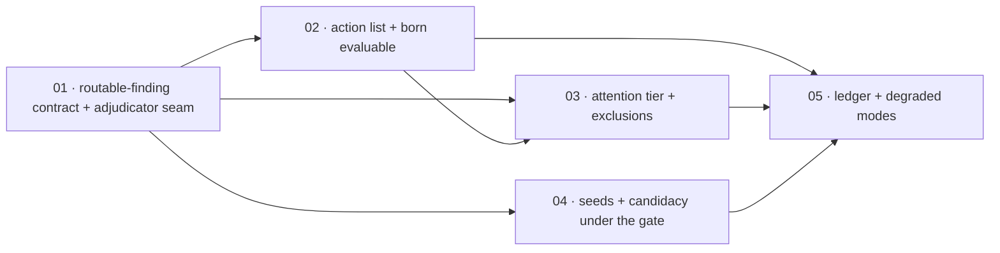

# Scopes Index — Research Action Routing And Alerts

Feature directory: `specs/020-research-action-routing-and-alerts`
Repository: `research-lab`

A research finding reaches whichever of the three existing destinations its
evidence actually qualifies for — the brief action list, the decision-attention
tier, or the anomaly-seed and red-alert candidate pipeline — and when it qualifies
for none, the operator is told which gate refused it and why, carrying that gate's
own code. No threshold moves. No destination is re-implemented. Nothing is
silently discarded, and nothing is published as an alert.

Five scopes, matching the intended decomposition recorded in `spec.md`
*Intended Scope Decomposition* and the `scopeId` values already carried in
`scenario-manifest.json` and `state.json`. Thirty-eight functional requirements
and twenty-five scenarios, inside the P25 cap.

## Scope Ordering Rationale

**The routable-finding contract lands first** because all three destinations
consume one shape and none of them may redefine it. Scope 1 also fixes the
property that makes FR-020-004 and FR-020-006 structural rather than reviewed:
adjudicators are *injected*, so the routing module holds no threshold it could
shadow and no rule it could approximate. Building any destination before that seam
exists would mean the module reaching into a destination's internals, which is the
exact coupling the spec forbids. Scope 1 is the only root and carries
`foundation:true`.

**Action-list routing is second** because the attention tier's own overlap
refusal keys on subjects already published as actions. Deciding attention before
actions would make that refusal depend on evaluation order rather than on
published truth. Scope 2 also lands the born-evaluable rule before emission, which
is what keeps an unscoreable topic call out of the payload entirely rather than
relying on a post-hoc drop.

**Attention routing is third** and therefore depends on scope 2 as well as scope
1 — not for code reuse, but because its overlap check reads the action list scope
2 produced.

**The alert lane is fourth and deliberately depends only on scope 1.** It shares
no state with the action list or the attention tier, so it can proceed in parallel
with scopes 2 and 3 rather than queueing behind them. This is the ordering the
sequencing guidance asks for: the work that does not need the upstream research
surface is not held up by the work that does.

**Scoring, ledger participation and the degraded-mode disclosure are last**
because they observe what the first four scopes produced. The refusal surface
cannot be asserted complete until every destination that can refuse has been
wired, and origin non-privilege cannot be asserted until a topic-originated call
can actually publish.

## Scope Inventory

| # | Scope | Artifact | Depends On | Scenarios | Status |
| --- | --- | --- | --- | --- | --- |
| 1 | Routable Finding Contract And Injected Adjudication | [`01-routable-finding-contract/scope.md`](01-routable-finding-contract/scope.md) | none | SCN-020-001, -002 | Not started |
| 2 | Action-List Routing And Born-Evaluable Emission | [`02-action-list-routing-and-evaluability/scope.md`](02-action-list-routing-and-evaluability/scope.md) | 1 | SCN-020-003 … -007 | Not started |
| 3 | Attention-Tier Routing And The Exclusion Ledger | [`03-attention-tier-routing-and-exclusions/scope.md`](03-attention-tier-routing-and-exclusions/scope.md) | 1, 2 | SCN-020-008 … -013 | Not started |
| 4 | Anomaly Seeds And Red-Alert Candidacy Under The Gate | [`04-anomaly-seed-and-alert-candidacy/scope.md`](04-anomaly-seed-and-alert-candidacy/scope.md) | 1 | SCN-020-014 … -018, -024, -025 | Not started |
| 5 | Scoring, Ledger Participation And Degraded Modes | [`05-scoring-ledger-and-degraded-modes/scope.md`](05-scoring-ledger-and-degraded-modes/scope.md) | 2, 3, 4 | SCN-020-019 … -023 | Not started |

---

## Dependency Graph

| ## | Scope Directory | Depends On | Unblocks | Why the edge exists |
| --- | --- | --- | --- | --- |
| 01 | `01-routable-finding-contract` | none | 02, 03, 04, 05 | The foundation. One module owns the finding shape, the dispatch order, the decision record and the `RLROUTE-*` codes; the adjudicator seam is what keeps every destination's rules with their owner. |
| 02 | `02-action-list-routing-and-evaluability` | 01 | 03, 05 | The action adjudicator is injected through the seam scope 1 defines, and the emitted actions are the input to the attention tier's overlap check. |
| 03 | `03-attention-tier-routing-and-exclusions` | 01, 02 | 05 | Composition goes through the existing attention composer, and its overlap refusal reads the subjects scope 2 published as actions. |
| 04 | `04-anomaly-seed-and-alert-candidacy` | 01 | 05 | Seeds and candidates share no state with the other two destinations, so this scope needs only the finding contract and can run alongside 02 and 03. |
| 05 | `05-scoring-ledger-and-degraded-modes` | 02, 03, 04 | none | Ledger participation observes published actions; the refusal surface can only be asserted complete once every refusing destination is wired. |



Two properties this graph makes explicit. **Scope 1 is the only root** and is the
single definition of the routable finding and the decision record; no destination
scope may restate a shape or a code it owns. **Scope 4 hangs off the root
directly**, so the alert-lane work that needs nothing from the action or attention
paths is not queued behind them.

---

## Named Missing Capabilities

Per P25 this feature blocks on capabilities, never on another spec's status. Each
row below is a capability with a specified degraded behaviour, and every scope
below is written to be executable while the capability is absent.

| Missing capability | Where it bites | Degraded behaviour while absent |
| --- | --- | --- |
| **A routable topic finding** | Scopes 1–5 | The routing module has nothing live to route and the decision record is legitimately empty. Every scope is proven against committed fixtures shaped to the finding contract, so no scope is blocked. |
| **A registered research surface filing a tool read** | Scope 3 | The attention composer resolves an item's link from its first figure's source id, looked up in the generation's tool reads, and refuses when it resolves nothing. Without an owning registered read, **every** topic attention submission refuses on the deep-link code and each refusal is recorded. Scopes 2, 4 and 5 are unaffected. This is a capability, not a status: scope 3 ships its refusal path and its recorded exclusions either way. |
| **A frozen web-evidence bundle for a finding** | Scope 4 | Seeding is unaffected. Candidate assembly refuses without a frozen bundle carrying claims, so the finding stops at the seed stage, the seed stays recorded, and the missing bundle is named. SCN-020-025 is the scenario for exactly this. |
| **Committed market data for a subject** | Scope 2 | A swing or tactical call on a subject with no committed price history is refused before emission, carrying the body builder's own evaluability reason, and stays readable research. Expanding the universe is Non-Goal 5. |
| **Live Red Alert publication** | Scope 4, disclosed in scope 5 | Seeds and scored candidates are produced and recorded; the surface states publication is unavailable every time; no path sets the projection to published and nothing is faked. Fully specified, not blocking. |

---

## Execution Outline

### Phase Order

1. **Routable Finding Contract And Injected Adjudication** — author `rlrouting.js`,
   the single UMD module owning `routable-finding/v1`, the closed destination
   vocabulary, the declared dispatch order, the decision record and the twelve
   `RLROUTE-*` codes, with adjudicators supplied by the caller and a named refusal
   when one is absent. Nothing is routed into a live destination yet.
2. **Action-List Routing And Born-Evaluable Emission** — collector-composed topic
   actions under the full existing action field contract, refused **before**
   emission when not machine-checkable, capped by the configured maximum, selected
   in one declared deterministic order, never displacing an authored action, and
   guarded against the structural relabelling loophole.
3. **Attention-Tier Routing And The Exclusion Ledger** — submission through the
   existing attention build step and composer only, every refusal recorded by the
   composer in its own exclusions channel with its own code, the decision record
   pointing at the index rather than copying it, and the empty tier left empty.
4. **Anomaly Seeds And Red-Alert Candidacy Under The Gate** — seeds through the
   existing seed validator with a channel from the closed eight, clustering and
   candidate assembly through the existing path, scoring against the unchanged
   policy, the two honest non-outcomes (no certified channel; no frozen bundle),
   the alarmist refusal, the exact committed empty statement, and the publication
   gate carried unchanged.
5. **Scoring, Ledger Participation And Degraded Modes** — topic-originated calls in
   the same outcome ledger on identical terms, origin recorded as additive members
   that change no scoring input, append-only corrections, the per-topic count with
   the rate withheld below the committed minimum sample, and the reader-visible
   refusal surface that makes research distinguishable from silence.

### New Types And Signatures

Introduced in scope 1 and consumed unchanged thereafter. Authored as top-level
`function name(...)` declarations, because `extractFn` in `scripts/selftest.mjs:46`
matches `function\s+<name>\s*\(` and cannot see an arrow constant.

```
routable-finding/v1   { contractVersion, findingId, originTopicId, originTopicTitle,
                        originDossierRef, subject, claim, evidence[], horizon, verb,
                        proposedAction, transmissionChannels[], severity,
                        independentOriginGroups, ownerEvidenceRefs[] }
research-routing/v1   { contractVersion, generatedAt, declaredFindingCount,
                        selectionOrder, decisions[], unreachedFindings }

DESTINATIONS     = ['action','attention','alert']
DECISION_STATES  = ['published','refused','gated']
REFUSAL_CODES    = 12 frozen RLROUTE-* codes, none of which shadows a destination's own code

function validateRoutableFinding(finding)                 -> { ok, code, field, message }
function fromDossierFinding(dossier, finding)             -> routable-finding/v1
function routeFinding(finding, adjudicators, context)     -> decision[]
function selectForCap(findings, remainingSlots)           -> { placed, overflow }
function buildRoutingRecord(decisions, declaredCount)     -> research-routing/v1
function readerSentence(decision)                         -> plain-words refusal sentence
```

Adjudicators are injected, never imported: the action adjudicator is the existing
recommendation body builder plus the existing action field contract; the attention
adjudicator is the existing attention build step and composer; the alert
adjudicator is the existing seed validator, clustering, candidate assembly and
scoring path. The browser is supplied none, so it can render the record and cannot
re-decide an outcome.

Additive changes to existing surfaces, each named in the owning scope's Change
Boundary: a collector composition step and a `routingRecord` merge in
`scripts/brief-narrative-parallel.mjs` (scopes 2–4); a `routingRecord` acceptance
branch in `scripts/validate-brief-payload.mjs` and an additive page-artifact key in
`scripts/build-brief-page-artifacts.mjs` (scope 5); two optional additive members
on the existing recommendation body (scope 5); and a refusal-surface renderer
inside the brief's existing evidence drawer (scope 5).

### Validation Checkpoints

Each checkpoint is `node scripts/selftest.mjs` — the deterministic repository gate
and the GitHub Pages verify job — plus the named additional command. A scope does
not close until its checkpoint is green, so no later scope starts on a red tree.

| After scope | Checkpoint | What it catches before the next scope starts |
| --- | --- | --- |
| 1 | `node scripts/selftest.mjs` · `node scripts/validate-spec-test-paths.mjs` | A module that decides eligibility itself, a defaulted required member, or a finding with no decision — before any destination is wired to it. |
| 2 | `node scripts/selftest.mjs` · `node scripts/validate-brief-payload.mjs` | An unscoreable call reaching the payload, a displaced authored action, an exceeded cap, and a swing call relabelled structural to escape the evaluability rule. |
| 3 | `node scripts/selftest.mjs` · `node scripts/validate-brief-payload.mjs` | An action-side reason written into the attention exclusions channel, which fails the publish gate and takes the whole brief down; a padded tier; a renamed subject evading the overlap check. |
| 4 | `node scripts/selftest.mjs` · `node scripts/validate-market-action.mjs` | A ninth transmission channel, a lowered admission threshold, a synthesised evidence bundle, a published alert projection, and an alarmist term reaching a surface. |
| 5 | `node scripts/selftest.mjs` · `node scripts/validate-brief-payload.mjs` · `node scripts/pii-scan.mjs` · Playwright `--project=system-chrome` | A scoring input that varies with origin, a per-topic rate published below the committed minimum sample, a truncated refusal list, and a finding with no decision at all. |

---

*Educational models — not investment advice.*
