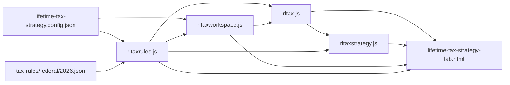

# Design: 021 Lifetime Tax Strategy Lab (Federal Slice 1)

Feature directory: `specs/021-lifetime-tax-strategy-lab`
Repository: `research-lab`
Design owner: `bubbles.design`
Upstream: [`spec.md`](spec.md) (`bubbles.analyst`), [`scopes/_index.md`](scopes/_index.md) and the five `scopes/*/scope.md` files (`bubbles.plan`), [`scenario-manifest.json`](scenario-manifest.json).

This document fixes the five things the plan and the specification deliberately
left open: the module boundaries and file surface, the exact `TaxRulePack/v1`
JSON schema, the closed `RLTAX-*` refusal enum, the calculation order, and the
Simple/Power component tree. It also answers the three design questions in
[`spec.md`](spec.md) `## Open Questions` and closes `BI-4` and `BI-5` from
`## Blocking Implementation Inputs`.

It does not restate the requirements, the deferral register, or the scope
ordering. Those are owned upstream and are read, not copied.

---

## Design Brief

### Current State

The repository has no tax module, no rule-pack contract, and no household tax
workspace. The closest existing thing is Feature 008's portfolio workspace in
`rlportfolio.js`, which is a closed exact-key contract with a frozen error-code
map, a versioned storage namespace, and a UMD dual export. Feature 008 is
`status: blocked` and every artifact under
`specs/008-portfolio-survival-and-brief-lab/` must remain byte-identical, so its
contract is a **style reference only**. Every page in the repository is a
single-file build-free HTML tool carrying one identical Content-Security-Policy
meta, and `scripts/selftest.mjs` extracts pure functions by brace-matching a
`function <name>(` signature.

### Target State

Four new UMD modules, one mandatory config, one dated federal rule pack, and one
unregistered root page. A household supplies filing status, one declared tax
year, at least one supported income amount, and a deduction mode. The route
resolves one source-qualified rule pack, settles the federal year under it,
prices the next dollar as a curve, compares exactly two Roth conversion policies,
and names every figure it cannot produce. Every household value stays in a local
namespace this feature owns alone, and the page's only runtime transport is a
bounded set of same-origin reads of its own declared policy and rule-pack
documents.

### Patterns To Follow

| Pattern | Where it already exists | How this feature uses it |
| --- | --- | --- |
| UMD dual module: `module.exports` plus a global attach, never ESM | `rlportfolio.js` tail, `rlcontracts.js`, `rlrental.js` | All four new `rltax*.js` modules |
| Frozen closed code map | `ERROR_CODES` in `rlportfolio.js` | `RLTAX_CODES` in `rltaxrules.js` |
| Exact-key closed contracts with a version string per record | `WORKSPACE_FIELDS`, `HOLDING_FIELDS`, `POLICY_SECTION_VERSIONS` in `rlportfolio.js` | Every new contract carries `contractVersion` and an exact-key field list |
| Versioned storage namespace declared in config, never in code | `storage.workspaceNamespace` in `portfolio-survival-allocation.config.json` | `storage.namespace` in `lifetime-tax-strategy.config.json` |
| Top-level `function name(...) {}` for every pure analytic function | Every module the selftest exercises | Mandatory; see [Harness Constraints](#harness-constraints) |
| One identical CSP meta per page, copied verbatim | `portfolio-survival-allocation-lab.html` line 6 | Copied byte-identical into the new page |
| Deploy decision for an unregistered root artifact | `site-exclusions.json` | Six new entries; see [Deploy Decision](#deploy-decision-site-exclusionsjson) |

### Patterns To Avoid

| Anti-pattern present in the repository or in the source proposal | Why it is wrong here |
| --- | --- |
| Extending `rlportfolio.js` or reusing `rlReturnContextV1` / `rlPortfolioWorkspaceV1` keys | `NFR-021-001` requires an independent contract and a disjoint namespace. Feature 008 is blocked and its contracts are closed. |
| A const-arrow export such as `const computeTax = (a) => {...}` | `scripts/selftest.mjs::extractFn` matches `function <name>(` and balances braces. An arrow const is structurally unreachable to the harness, so the math would be untestable there. |
| Global `isFinite(x)` | Coerces its argument. `Number.isFinite(x)` does not. The repository convention is `Number.isFinite`. |
| A numeric tax constant anywhere in an engine module | `NFR-021-023` and the domain model put every rule value in the pack. A constant in an engine is a threshold that silently survives a pack change. |
| A "publishes its own error rate", track-record, or accuracy claim | Rejected in `spec.md` `## Rejected Claim` and prohibited by `NFR-021-036`. The mechanism that would produce such a figure does not exist for this tool. |
| A probability, a lifetime total, a break-even year, or a ranking | `FR-021-030`. No path cohort exists, so no frequency exists. |
| Filling an unsourced figure by interpolation, derivation, or a national average | The failure mode the whole feature is built to prevent. See [The First Pack Is Intentionally Incomplete](#the-first-pack-is-intentionally-incomplete). |
| A central difference over the marginal curve | A central difference straddles a discontinuity and averages across it, which is exactly the smoothing `FR-021-021` forbids. |
| Rendering pack-authored strings through `innerHTML` | P8. Pack strings are data. They reach the DOM through `textContent` only. |

### Resolved Decisions

- Four modules, one config, one pack directory, one page. Fixed file surface in [Module Boundaries](#module-boundaries-and-file-surface).
- The `RLTAX-*` enum is closed at **twelve** members. No later scope adds one.
- An unsourced figure is represented by a present `AbsentFigure/v1` record, never by a missing key, a `null`, or a zero.
- The calculation order is a fixed ten-stage list, `CO-1` through `CO-10`, declared in the pack and asserted equal to the engine's list.
- Long-term capital gains and qualified dividends are pooled into one preferential amount and taxed in the bands **above** ordinary taxable income. The standard or itemized deduction is applied to **total** income before the preferential amount is carved out of the top.
- The curve uses a **forward** difference with a config-declared probe, and inserts an exact sample pair around every crossing the settlement reports.
- `effectiveMarginalRate` and `averageRate` are separate fields on separate records and may never share a table row or a label.
- The conversion comparison recomputes both policies in full. It never adds a marginal-rate product to a baseline tax.
- The pack's `contentSha256` is verified against bytes in Node by the selftest, and compared as a string in the browser. The page performs no hashing.

### Open Questions

None blocking this document. Two implementation inputs remain open upstream and
are named, not assumed, in
[Unsourced Figures And Their Consequences](#unsourced-figures-and-their-consequences):
`BI-1` (retrieve Rev. Proc. 2025-32) and `BI-2` / `BI-3` (the figures that
retrieval must yield). `BI-4` and `BI-5` are closed by this document.

---

## Purpose And Scope Of This Design

In scope: contracts, module boundaries, the pack schema, the refusal vocabulary,
the calculation order, the curve derivation, the comparison derivation, the
component tree, the privacy boundary, the config contract, the deploy decision,
and the testing strategy.

Out of scope: requirement text, scope sequencing, evidence capture, and any tax
figure. This document asserts no dollar amount, no rate, and no threshold.

---

## Module Boundaries And File Surface

Six new files at the repository root, one new directory, and three existing
files edited.

### New files

| File | Owns | Must NOT own |
| --- | --- | --- |
| `rltaxrules.js` | `TaxRulePack/v1`, `SourceRecord/v1`, `AbsentFigure/v1`, `TaxUnavailable/v1`, the `RuleStatus` enum, the `RLTAX_CODES` enum, the supported income-kind and filing-status vocabularies, `validateRulePack`, `resolveRulePack`, `ruleStatusFor`, `unavailable`, `sourceForFigure` | Any arithmetic. Any household value. Any storage access. Any DOM access. The resolver holds no math, so there is no code path that can index, interpolate, or carry a threshold into an unsupported year. |
| `rltaxworkspace.js` | `TaxWorkspace/v1`, `validateWorkspace`, `minimumViableInput`, `declaredUnavailableDomains`, the storage read/write path, `privacyInventory`, `clearAllPrivateData`, `sanitizeForExport`, `exportManifest` | Any rule value. Any tax arithmetic. Any refusal code of its own; it imports `RLTAX_CODES` from `rltaxrules.js`. Any key outside its declared namespace. |
| `rltax.js` | `computeTaxableIncome`, `selectDeduction`, `stackPreferentialIncome`, `computeAnnualFederalTax`, `reconcileAnnualFederalTax`, `computeEffectiveMarginalCurve`, `AnnualFederalTaxResult/v1`, `EffectiveMarginalCurve/v1` | Any bracket, rate, edge, deduction amount, or threshold. Any storage access. Any DOM access. Any second definition of tax; the curve calls `computeAnnualFederalTax` and never re-derives it. |
| `rltaxstrategy.js` | `ConversionComparison/v1`, `fillToBracketConversion`, `compareConversionPolicies`, the closed `notModeled[]` membership | Any tax arithmetic. Both policies call `computeAnnualFederalTax`. Any bracket edge of its own. Any probability, lifetime, break-even, rank, or accuracy member. |
| `lifetime-tax-strategy.config.json` | The storage namespace and key set, the pack pointer, the sweep policy, the display policy | Any tax figure. Any fallback or default. |
| `lifetime-tax-strategy-lab.html` | The Simple and Power views, tooltips, text-equivalent tables, the unavailable-state surfaces, the educational framing, the export action, the view switch | Any computation. Any rule value. Any refusal it constructs itself. It renders records the modules produced. |

New directory: `tax-rules/federal/2026.json`. One file, one program, one declared
tax year. `tax-rules/` is deliberately absent from `PUBLIC_DIRECTORIES` in
`scripts/build-pages-site.mjs`, so the pack is reachable from a checkout and from
`file://` but is not packaged into the Pages site. Finding F-5 records that a
later registration feature must add it to that allowlist in the same change that
registers the page, or the registered page will resolve a 404 pack.

Fixtures live under the repository fixture directory, one subdirectory per
feature area. Playwright specs are `lifetime-tax-foundation.spec.mjs` (Scope 01),
`lifetime-tax-settlement.spec.mjs` (Scopes 02 and 03),
`lifetime-tax-conversion.spec.mjs` (Scope 04), and `lifetime-tax-route.spec.mjs`
(Scope 05).

### Existing files edited

| File | Edit | Constraint |
| --- | --- | --- |
| `site-exclusions.json` | Six appended entries | Each entry's `reason` must be at least 40 characters; `planPagesSite()` asserts it. Entries land in the scope that creates the file they name. |
| `scripts/selftest.mjs` | One appended assertion group per scope, five in total | Append-only. No existing assertion is edited, relaxed, or removed. The pre-existing pass count must not fall. |
| `scripts/validate-spec-test-paths.baseline` | Untouched | The guard is a ratchet. Its baseline shrinks, never grows. |

### Dependency direction



The graph is acyclic and one-directional. `rltaxrules.js` depends on nothing but
the pack. Nothing depends on the page. A later state pack enters at `PACK` and
touches no engine.

### Harness constraints

Every function named above is a top-level `function name(...) {}` declaration in
its module, because `scripts/selftest.mjs::extractFn` builds a sandbox from
source text by matching `function\s+<name>\s*\(` and balancing braces. Helper
closures inside a function body are fine. A module-level `const fn = (...) => {}`
is not, because the harness cannot reach it and the math would be provable only
through the browser.

Numeric guards use `Number.isFinite(x)`. Global `isFinite` appears in no new
file, and a scan asserts it.

---

## Capability Foundation

The capability is **source-qualified tax rule resolution and single-year
settlement**, stated provider-neutrally in `spec.md` `## Domain Capability
Model`. This design fixes its seams.

### Foundation contracts (owned by `rltaxrules.js`)

- `TaxRulePack/v1` is the provider artifact. A jurisdiction, a program, and a set
  of effective years are pack fields, never engine fields.
- `SourceRecord/v1` is how a pack proves where a figure came from.
- `AbsentFigure/v1` is how a pack states, in place, that it does not carry a
  figure it is otherwise shaped to carry.
- `TaxUnavailable/v1` is how any layer refuses. It never carries a value.
- `RuleStatus` is the legal standing of a field, not a confidence.

### Extension points

| Seam | What may be added later without touching an engine |
| --- | --- |
| `tax-rules/<jurisdiction>/<program>/<year>.json` | A new year, a new state, a new program pack |
| `TaxRulePack.unsupportedFeatures[].movesMarginalRate` | A newly supported threshold moves from an unavailable contributor to a contributing threshold by a pack edit |
| `TaxRulePack.rateTables.<kind>` | A preferential table, a phase-out table, or a cliff table appears by pack edit |
| `RuleStatus` member `user-hypothetical-law` | A future rule editor sets it; no engine branch changes |

### Concrete implementations in this slice

Exactly one: the federal income-tax pack for tax year 2026. It is the first
instance of the contract, not the definition of it. Nothing in `rltaxrules.js`,
`rltax.js`, or `rltaxstrategy.js` names the United States, the IRS, or a year.

### Variation axes

The foundation is shaped by four axes that a second pack will actually vary.

1. **Jurisdiction and program.** Federal income tax today. A state income tax, an
   IRMAA band table, and a premium-tax-credit table are the named next
   instances. They differ in which rate tables exist, not in the contract.
2. **Coverage completeness.** A pack may carry a table, or may carry an
   `AbsentFigure/v1` in its place. Both are valid packs. The first federal pack
   exercises both branches on day one.
3. **Threshold shape.** A rate band produces a discontinuous marginal rate with a
   continuous total. A cliff produces a discontinuous total. A phase-in produces
   a continuous, sloped marginal rate. `segmentKind` is a closed enum over these
   so a later pack can introduce a cliff without a curve change.
4. **Rounding regime.** `roundingPolicy.calculationStages[]` lets a program that
   rounds at an intermediate step declare it, without the engine inventing one.

### Single-implementation justification

Not required. Two axes are exercised inside the single federal pack itself
(coverage completeness and threshold shape), and the remaining two are the
declared seams for the deferred state, IRMAA, and premium-tax-credit packs named
in the deferral register.

---

## Contracts

Every record is exact-key. An unknown key is a refusal, not an ignored field.
Every record carries `contractVersion`. Field lists below are complete.

### `TaxRulePack/v1`

```json
{
  "contractVersion": "TaxRulePack/v1",
  "id": "federal-income-tax-2026",
  "program": "income-tax",
  "jurisdiction": "federal",
  "version": "1.0.0",
  "effectiveTaxYears": [2026],
  "publishedAt": "YYYY-MM-DD",
  "retrievedAt": "YYYY-MM-DDTHH:MM:SS.sssZ",
  "sourceRecords": [ /* SourceRecord/v1 */ ],
  "supportedFeatures": [ /* SupportedFeature/v1 */ ],
  "unsupportedFeatures": [ /* UnsupportedFeature/v1 */ ],
  "indexingRules": [],
  "calculationOrder": ["CO-1", "CO-2", "CO-3", "CO-4", "CO-5", "CO-6", "CO-7", "CO-8", "CO-9", "CO-10"],
  "roundingPolicy": { /* TaxRoundingPolicy/v1 */ },
  "expiryPolicy": { /* TaxPackExpiry/v1 */ },
  "contentSha256": "sha256:<64 lowercase hex>",
  "filingStatuses": ["single", "married-filing-jointly", "married-filing-separately", "head-of-household"],
  "incomeKinds": ["ordinary", "qualified-dividend", "long-term-capital-gain", "tax-exempt-interest"],
  "standardDeductions": { /* per filing status: DeductionAmount/v1 | AbsentFigure/v1 */ },
  "ordinaryRateTables": { /* per filing status: RateTable/v1 | AbsentFigure/v1 */ },
  "preferentialRateTables": { /* per filing status: RateTable/v1 | AbsentFigure/v1 */ }
}
```

Types and rules:

| Member | Type | Rule |
| --- | --- | --- |
| `id` | string, `^[a-z0-9][a-z0-9-]*$` | Unique across packs |
| `program` | string, closed to `income-tax` in this slice | A program the engine does not know is `RLTAX-FEATURE-UNSUPPORTED` |
| `jurisdiction` | string | Anything other than `federal` resolves `RLTAX-JURISDICTION-UNSUPPORTED` |
| `version` | string, `^\d+\.\d+\.\d+$` | Bumped whenever any figure or coverage changes |
| `effectiveTaxYears` | array of integers, non-empty, ascending, no duplicates | Membership is exact. There is no range expansion and no adjacency rule. |
| `publishedAt` | `YYYY-MM-DD` | The authority's publication date |
| `retrievedAt` | ISO-8601 with milliseconds and `Z` | When the pack author retrieved the authority |
| `sourceRecords` | array of `SourceRecord/v1`, non-empty | Every `sourceRef` in the pack must name one of these `sourceId` values |
| `supportedFeatures` | array of `SupportedFeature/v1`, non-empty | Coverage is stated, never inferred from the absence of a refusal |
| `unsupportedFeatures` | array of `UnsupportedFeature/v1`, non-empty | Required membership in [Unsupported Feature Membership](#unsupported-feature-membership-bi-4) |
| `indexingRules` | array, may be empty | An empty array means **no indexing rule is declared**, which means no year outside `effectiveTaxYears` resolves. It never means "index freely". |
| `calculationOrder` | array of stage ids | Must equal the engine's closed ordered list exactly, element for element. A mismatch is `RLTAX-PACK-INVALID`. |
| `roundingPolicy` | `TaxRoundingPolicy/v1` | See [Rounding](#rounding-two-separately-testable-stages) |
| `expiryPolicy` | `TaxPackExpiry/v1` | `{ contractVersion, expiresAt: "YYYY-MM-DD", reason, onExpiry: "refuse" }`. `onExpiry` is closed to `refuse`. There is no fallback to an earlier pack. |
| `contentSha256` | `^sha256:[a-f0-9]{64}$` | See [Integrity Binding](#integrity-binding-without-in-browser-hashing) |
| `filingStatuses` | array, closed set above | A workspace status outside it is `RLTAX-FILING-STATUS-UNSUPPORTED` |
| `incomeKinds` | array, closed set above | A kind outside it is `RLTAX-INCOME-KIND-UNSUPPORTED` |
| `standardDeductions` | object keyed by **every** member of `filingStatuses` | Each value is a `DeductionAmount/v1` or an `AbsentFigure/v1`. A missing key is `RLTAX-PACK-INVALID`. |
| `ordinaryRateTables` | object keyed by **every** member of `filingStatuses` | Same rule |
| `preferentialRateTables` | object keyed by **every** member of `filingStatuses` | Same rule |

A pack missing any member above is refused `RLTAX-PACK-INVALID`, once per
missing member, with the member named. No branch supplies a default for any
member.

### `SourceRecord/v1`

```json
{
  "contractVersion": "SourceRecord/v1",
  "sourceId": "rp-2025-32",
  "title": "<the authority's own title>",
  "url": "https://...",
  "publisher": "<publisher name>",
  "documentKind": "revenue-procedure | publication | form-instructions | newsroom-release",
  "publishedAt": "YYYY-MM-DD",
  "retrievedAt": "YYYY-MM-DDTHH:MM:SS.sssZ",
  "retrievalOutcome": "retrieved | not-retrieved",
  "retrievalNote": "<free text, required when retrievalOutcome is not-retrieved>"
}
```

Two rules make this load-bearing rather than decorative:

1. **A figure may reference only a `retrieved` source.** If any figure's
   `sourceRef` names a `SourceRecord` whose `retrievalOutcome` is
   `not-retrieved`, the pack is refused `RLTAX-PACK-INVALID`. This is the
   mechanical form of the specification's transcription rule: a value cannot come
   from a document nobody opened.
2. **`documentKind: newsroom-release` may not be the `sourceRef` of any figure.**
   It may appear in `sourceRecords[]` for traceability and may be named as the
   `missingSource` discovery pointer of an `AbsentFigure`. A summary aids
   discovery and never supplies a value.

### Per-figure citation

Every figure-bearing object carries its own citation. The pair
`{ sourceRef, locator }` is required on `DeductionAmount/v1`, `RateTable/v1`, and
each `RoundingStage/v1`.

```json
{ "sourceRef": "rp-2025-32", "locator": "section 2.01, table 3" }
```

`sourceForFigure(pack, figure)` in `rltaxrules.js` expands `sourceRef` into the
displayable triple `{ title, url, retrievedAt }` plus the figure's `locator`. The
title and URL are stored once in `sourceRecords[]` and referenced, so two
citations of the same authority cannot drift into two different titles. A
`sourceRef` that names no record in `sourceRecords[]` is `RLTAX-PACK-INVALID`.

### `RateTable/v1` and `DeductionAmount/v1`

```json
{
  "contractVersion": "RateTable/v1",
  "tableId": "ordinary-2026-single",
  "kind": "ordinary | preferential",
  "filingStatus": "single",
  "bands": [
    { "bandId": "b1", "lowerInclusive": 0, "upperExclusive": 1234, "rate": 0.10, "thresholdKind": "rate-step" }
  ],
  "sourceRef": "rp-2025-32",
  "locator": "<section and table>"
}
```

```json
{
  "contractVersion": "DeductionAmount/v1",
  "filingStatus": "single",
  "amount": 1234,
  "sourceRef": "rp-2025-32",
  "locator": "<section>"
}
```

Band rules, all validated:

- `bands` is non-empty and ordered ascending by `lowerInclusive`.
- The first band has `lowerInclusive: 0`.
- Bands are contiguous: each band's `lowerInclusive` equals the previous band's
  `upperExclusive`. A gap or an overlap is `RLTAX-PACK-INVALID`.
- The last band has `upperExclusive: null`, meaning unbounded above. `null` is
  legal **only** in this position and nowhere else in the schema.
- `rate` is a number in `[0, 1]`.
- `thresholdKind` is closed to `rate-step | cliff | phase-in`. Every band in an
  ordinary or preferential rate table is `rate-step`. The other two members exist
  so a later pack can declare a cliff or a phase-in without a curve change.
- Edge semantics are inclusive-lower and exclusive-upper. An income exactly equal
  to an edge `E` sits in the band whose `lowerInclusive` is `E`, and contributes
  zero dollars to it. This is the semantic `SCN-021-004` tests at, below, and
  above the edge, and it is stated here so the fixture author and the engine
  author cannot disagree about it.

### `AbsentFigure/v1`

The single most important shape in this design. It is how the pack says "I am
shaped to carry this figure and I do not carry it", in the exact position where
the figure would have been.

```json
{
  "contractVersion": "AbsentFigure/v1",
  "code": "RLTAX-THRESHOLD-UNAVAILABLE",
  "domain": "preferential-rate-table:single",
  "reason": "<why the figure is not present>",
  "whatWouldMakeItAvailable": "<the retrieval or authority that would supply it>",
  "missingSource": {
    "title": "<the authority expected to carry it>",
    "url": "https://...",
    "documentKind": "revenue-procedure",
    "locator": "<where in that authority it is expected>"
  }
}
```

Rules:

- An `AbsentFigure` carrying any of `value`, `amount`, `rate`, `bands`, or
  `default` is `RLTAX-PACK-INVALID`. The record cannot smuggle a number.
- The key is **always present**. A missing key, a `null` value, and a `0` are all
  refused, because each is indistinguishable from a transcription mistake and
  none carries a reason. Absence is stated, never implied.
- `code` is closed to `RLTAX-THRESHOLD-UNAVAILABLE` for a figure inside the
  pack's declared program, and `RLTAX-FEATURE-UNSUPPORTED` for a figure belonging
  to a feature the pack lists as unsupported.
- `missingSource` names the authority that would supply the figure. This is what
  turns "unavailable" into an actionable work item rather than a shrug.

### `TaxUnavailable/v1`

```json
{
  "contractVersion": "TaxUnavailable/v1",
  "code": "RLTAX-...",
  "domain": "<the affected domain>",
  "reason": "<why>",
  "whatWouldMakeItAvailable": "<what would change this>"
}
```

`unavailable(code, domain, reason, whatWouldMakeItAvailable)` is the only
constructor. It refuses an unknown code. The record has no numeric member and no
optional value member, so no construction path can return a number. That is the
structural form of `FR-021-005`.

### `TaxWorkspace/v1`

```json
{
  "contractVersion": "TaxWorkspace/v1",
  "filingStatus": "single | married-filing-jointly | married-filing-separately | head-of-household | null",
  "declaredTaxYear": 2026,
  "income": {
    "ordinary": 0,
    "qualifiedDividend": 0,
    "longTermCapitalGain": 0,
    "taxExemptInterest": 0
  },
  "deductionMode": "standard | itemized | null",
  "itemizedAmount": 0,
  "conversionFundingSource": "outside-funds | withheld | null",
  "selectedBracketId": "b3 | null",
  "declaredUnavailableDomains": [],
  "generation": 1,
  "updatedAt": "YYYY-MM-DDTHH:MM:SS.sssZ"
}
```

- Every income member is present as a number. An amount the user has not supplied
  is `0` **as an input**, and the domains the user did not supply are recorded in
  `declaredUnavailableDomains[]` so a zero input and an unsupplied domain are
  distinguishable. A zero income amount is a real declaration; an unsupplied
  domain is not.
- `null` in `filingStatus`, `deductionMode`, or `conversionFundingSource` means
  "not declared" and is the trigger for `RLTAX-INPUT-INCOMPLETE`. It is never
  replaced by a default.
- `updatedAt` is written from the browser clock on user edit only. It never
  enters a computation, which is what keeps `NFR-021-011` determinism intact.
- The workspace holds no result. Results are recomputed, so a stale result cannot
  outlive the pack that produced it.

`minimumViableInput(workspace)` returns `true` only when `filingStatus` is
non-null, `declaredTaxYear` is an integer, at least one of the four income
members is a finite number greater than zero, and `deductionMode` is non-null.
Anything less returns `RLTAX-INPUT-INCOMPLETE` naming each missing member.

### `AnnualFederalTaxResult/v1`

```json
{
  "contractVersion": "AnnualFederalTaxResult/v1",
  "packRef": { "id": "...", "version": "...", "contentSha256": "sha256:..." },
  "declaredTaxYear": 2026,
  "filingStatus": "single",
  "calculationOrder": ["CO-1", "..."],
  "stages": { "CO-1": { "value": 0, "ruleStatus": "enacted-current-law", "sourceRef": null }, "...": {} },
  "grossSupportedIncome": { "value": 0, "ruleStatus": "..." },
  "taxExemptInterestRecorded": { "value": 0, "ruleStatus": "..." },
  "appliedDeduction": { "value": 0, "mode": "standard", "ruleStatus": "...", "sourceRef": "rp-2025-32" },
  "totalTaxableIncome": { "value": 0, "ruleStatus": "..." },
  "preferentialTaxableIncome": { "value": 0, "ruleStatus": "..." },
  "ordinaryTaxableIncome": { "value": 0, "ruleStatus": "..." },
  "ordinaryTax": { "value": 0, "ruleStatus": "...", "bandDetail": [] },
  "preferentialTax": { "value": 0, "ruleStatus": "...", "bandDetail": [] },
  "totalFederalTax": { "value": 0, "ruleStatus": "..." },
  "averageRate": { "value": 0, "ruleStatus": "..." },
  "marginalContext": {
    "activeOrdinaryBandId": "b3",
    "distanceToNextOrdinaryEdge": 0,
    "activePreferentialBandId": null,
    "distanceToNextPreferentialEdge": null,
    "ruleStatus": "..."
  },
  "unsupportedFeatureNotices": [],
  "reconciliation": { "legs": [], "balanced": true, "toleranceUsed": 0 },
  "roundingDisclosure": { "calculationStagesApplied": [], "displayStage": null },
  "completeFederalTax": false
}
```

Two members carry more weight than their size suggests.

- **Any field may be a `TaxUnavailable/v1` in place of its value object.** A field
  is either a valued record with a `ruleStatus`, or a refusal. It is never a
  number with no status and never a blank.
- **`completeFederalTax` is always `false` in this slice** and is a structural
  member rather than page copy, so a rendering change cannot drop the caveat.
  `unsupportedFeatureNotices[]` is rendered beside the result, which is the
  visible form of `FR-021-018`.

`marginalContext` exists so the curve can place exact sample points without
performing threshold arithmetic of its own. See
[Sampling Policy](#sampling-policy).

### `EffectiveMarginalCurve/v1`

```json
{
  "contractVersion": "EffectiveMarginalCurve/v1",
  "packRef": { "id": "...", "version": "...", "contentSha256": "sha256:..." },
  "kind": "ordinary | long-term-gain",
  "sweep": { "start": 0, "end": 0, "step": 0, "probe": 0, "maxPoints": 0 },
  "points": [
    {
      "level": 0,
      "taxAtLevel": 0,
      "effectiveMarginalRate": 0,
      "statutoryBandRate": 0,
      "statutoryBandId": "b3",
      "ruleStatus": "enacted-current-law"
    }
  ],
  "segments": [
    {
      "fromLevel": 0,
      "toLevel": 0,
      "segmentKind": "flat | rate-step | cliff | phase-in",
      "cliff": true,
      "contributingThresholds": [
        { "name": "...", "tableId": "...", "bandId": "...", "sourceRef": "...", "locator": "..." }
      ]
    }
  ],
  "unavailableContributors": [ /* TaxUnavailable/v1 */ ],
  "incomplete": true,
  "unavailableContributorCount": 0
}
```

The record has **no** `averageRate` member and no scalar summary rate. The UI
cannot read an average off the curve, because the curve does not carry one.

### `ConversionComparison/v1`

```json
{
  "contractVersion": "ConversionComparison/v1",
  "packRef": { "id": "...", "version": "...", "contentSha256": "sha256:..." },
  "selectedBracketId": "b3",
  "bracketEdge": { "value": 0, "sourceRef": "...", "locator": "...", "ruleStatus": "..." },
  "conversionAmount": { "value": 0, "atOrAboveEdge": false, "ruleStatus": "..." },
  "heldConstant": ["filingStatus", "declaredTaxYear", "packContentSha256", "deductionMode", "itemizedAmount", "qualifiedDividend", "longTermCapitalGain", "taxExemptInterest", "conversionFundingSource"],
  "policies": [
    { "policyId": "no-conversion", "settlement": { /* AnnualFederalTaxResult/v1 */ } },
    { "policyId": "fill-to-bracket", "settlement": { /* AnnualFederalTaxResult/v1 */ } }
  ],
  "federalTaxDifference": { "value": 0, "ruleStatus": "..." },
  "effectiveMarginalRateAtEdge": { "value": 0, "inheritedIncomplete": true, "ruleStatus": "..." },
  "fundingSource": "outside-funds | withheld | <TaxUnavailable/v1>",
  "notModeled": [ { "id": "...", "label": "...", "reason": "...", "deferralCode": "RLTAX-..." } ],
  "resultKindStatement": "single-year federal tax difference",
  "isRecommendation": false
}
```

The forbidden-member list is enumerated in a test rather than in prose: the
record's key set is asserted equal to the list above, so a member named
`probability`, `lifetimeTotal`, `breakEvenYear`, `rank`, `recommended`, `score`,
`successRate`, or `accuracy` fails immediately. That is the code-level form of
`FR-021-030`.

---

## The Closed `RLTAX-*` Refusal Enum

Twelve members. `RLTAX_CODES` is a frozen map in `rltaxrules.js`. It is the only
declaration of the vocabulary in the repository, and a selftest scan asserts
exactly one declaration exists. Later scopes consume it and add nothing to it.

| Code | Meaning (one, and only one) | Raised by |
| --- | --- | --- |
| `RLTAX-CONFIG-INVALID` | The mandatory configuration is missing, malformed, carries an unknown `contractVersion`, or carries an unknown key. | Config load in `rltaxworkspace.js`; the sweep-policy read in `rltax.js`. |
| `RLTAX-PACK-INVALID` | The resolved pack is structurally wrong: a missing required member, a non-contiguous band table, a `sourceRef` naming no record, a figure citing a `not-retrieved` or newsroom source, an `AbsentFigure` carrying a value, a `calculationOrder` that does not equal the engine's list, or a `contentSha256` that does not match the config pointer. Once per offending member, with the member named. | `validateRulePack` |
| `RLTAX-PACK-EXPIRED` | The pack's `expiryPolicy.expiresAt` has passed. No earlier pack is substituted. | `resolveRulePack` |
| `RLTAX-YEAR-UNSUPPORTED` | The declared tax year is not a member of `effectiveTaxYears`. No threshold is extended and no indexing is applied. | `resolveRulePack` |
| `RLTAX-JURISDICTION-UNSUPPORTED` | The requested jurisdiction is not `federal`. Also the deferral code for the state-tax entry in `notModeled[]`. | `resolveRulePack`; `rltaxstrategy.js` |
| `RLTAX-INCOME-KIND-UNSUPPORTED` | An income kind outside the four supported kinds was supplied. | `validateWorkspace` |
| `RLTAX-FILING-STATUS-UNSUPPORTED` | A filing status outside the pack's `filingStatuses` was supplied. Reachable through a restored or imported workspace carrying a status a newer pack knows and this one does not. | `validateWorkspace`, `resolveRulePack` |
| `RLTAX-INPUT-INCOMPLETE` | A required workspace member is not declared: filing status, declared year, at least one income amount, a deduction mode, or the conversion funding source. Naming the missing member is required. No default is applied. | `minimumViableInput`, `selectDeduction`, `compareConversionPolicies` |
| `RLTAX-FEATURE-UNSUPPORTED` | A federal feature the pack lists in `unsupportedFeatures[]` was reached. Also the deferral code for Medicare, IRMAA, premium-tax-credit, and net-investment-income-tax entries in `notModeled[]`. | `ruleStatusFor`, the settlement's notice pass, `rltaxstrategy.js` |
| `RLTAX-THRESHOLD-UNAVAILABLE` | A figure inside the pack's declared program is not carried by the pack, so a stage that needs it cannot run. This is the code every `AbsentFigure` inside `standardDeductions`, `ordinaryRateTables`, or `preferentialRateTables` raises when reached. It is also raised when a curve segment's rate changes with no attributable threshold. | `rltax.js` stages `CO-2`, `CO-6`, `CO-7`; `computeEffectiveMarginalCurve` |
| `RLTAX-RECONCILE` | The reconciliation identity does not balance within the pack's declared tolerance. The result is refused, not displayed as a tax figure. | `reconcileAnnualFederalTax` |
| `RLTAX-SCOPE-DEFERRED` | A capability is outside slice 1 by plan, not by pack coverage: the Roth five-year clocks, later-year distribution and required-distribution pressure, survivor effects, lost growth on taxes paid, any multi-year ledger. Used as the deferral code in `notModeled[]`. | `rltaxstrategy.js`; the route's deferred-domain surfaces |

### Why no thirteenth code

Three near-misses are deliberately folded into an existing member rather than
given their own, because a code whose meaning overlaps another code makes the
refusal vocabulary less legible, not more.

- **An unsourced MFS or head-of-household bracket table** is
  `RLTAX-THRESHOLD-UNAVAILABLE`, not `RLTAX-FILING-STATUS-UNSUPPORTED`. The
  filing status is a valid member of the closed set; the figure for it is what is
  missing. Conflating the two would tell a head-of-household user that their
  filing status is unsupported, which is false and would hide the real work item.
- **A missing conversion funding source** is `RLTAX-INPUT-INCOMPLETE`, not a new
  code. It is an undeclared workspace member like any other.
- **An export failure** has no code, because the export path constructs a file
  from already-validated state and has no failure mode of its own that is not
  already `RLTAX-CONFIG-INVALID`.

---

## Unsourced Figures And Their Consequences

This section is the honest core of the design. It is written so that no
implementer can read it and conclude that a missing figure may be filled.

### What is actually known

`spec.md` records that IRS release IR-2025-103 was retrieved in the authoring
session and that Revenue Procedure 2025-32, the detail authority for the same
adjustments, failed retrieval twice. The retrieved release establishes **which
figures the detail authority is known to contain**, not the figures themselves:
the transcription rule in `spec.md` makes Rev. Proc. 2025-32 the only permitted
transcription source, and a newsroom release may never supply a pack value.

### The first pack's coverage boundary

Given that, the first pack is scoped to carry at most the figures below. Whatever
the implementer cannot transcribe from Rev. Proc. 2025-32 ships as an
`AbsentFigure/v1`.

| Figure | Confirmed present in the detail authority by IR-2025-103 | First-pack shape |
| --- | --- | --- |
| Standard deduction, married filing jointly | Yes | `DeductionAmount/v1` |
| Standard deduction, single | Yes | `DeductionAmount/v1` |
| Standard deduction, married filing separately | Yes | `DeductionAmount/v1` |
| Standard deduction, head of household | Yes | `DeductionAmount/v1` |
| Ordinary rate table, single | Yes | `RateTable/v1` |
| Ordinary rate table, married filing jointly | Yes | `RateTable/v1` |
| **Ordinary rate table, married filing separately** | **No** | **`AbsentFigure/v1`** |
| **Ordinary rate table, head of household** | **No** | **`AbsentFigure/v1`** |
| **Preferential rate table, all four filing statuses** | **No** | **`AbsentFigure/v1`** |

The preferential table is the long-term capital gain and qualified dividend rate
threshold table. It is absent for **every** filing status, because the retrieved
release carries no capital-gain thresholds at all.

### What the tool therefore does

| Household | Result |
| --- | --- |
| Single or married filing jointly, `qualifiedDividend + longTermCapitalGain == 0` | A **complete ordinary-only settlement**: taxable income, applied deduction, ordinary tax, total federal tax, reconciliation identity, ordinary marginal curve. `completeFederalTax` is still `false`, because `unsupportedFeatures[]` is non-empty. |
| Single or married filing jointly, with any preferential income | Ordinary stages settle. `preferentialTax` is `RLTAX-THRESHOLD-UNAVAILABLE`. **`totalFederalTax` is therefore also `RLTAX-THRESHOLD-UNAVAILABLE`**, because a total that silently omits an unavailable leg is precisely the substitution this feature exists to prevent. |
| Married filing separately or head of household | The standard deduction resolves and is displayed. `ordinaryTax` is `RLTAX-THRESHOLD-UNAVAILABLE` naming Rev. Proc. 2025-32 as the missing source. Everything downstream inherits the refusal. |
| Any household, long-term-gain curve | `RLTAX-THRESHOLD-UNAVAILABLE`, because the curve is a finite difference over a settlement whose preferential leg cannot run. |

This is not a degraded first release. It is the strongest available exercise of
the refusal semantics the entire feature is built on: on day one, four of the
five refusal surfaces are live against the real shipped pack rather than against
a fixture, and the tool is honest about a gap that every competitor in the
specification's comparison table would have papered over with a plausible number.

### The pack states its own incompleteness

`spec.md` requires the pack to state its coverage. The first pack therefore also
carries, in `supportedFeatures[]` and `unsupportedFeatures[]`, entries that make
the gap readable without inspecting the tables. Every `AbsentFigure` is surfaced
in the Power rule ledger with its `missingSource`, so a skeptical reader sees
exactly which document must be retrieved to complete the pack.

### What a later pack must retrieve

A `version` bump to `1.1.0` requires exactly one thing: Revenue Procedure 2025-32
retrieved directly, and from it the married-filing-separately ordinary table, the
head-of-household ordinary table, and the long-term capital gain and qualified
dividend rate thresholds for all four filing statuses. Flipping an `AbsentFigure`
to a `RateTable/v1` is a pack edit. No engine, curve, comparison, or view changes.

### Scope acceptance that depends on an unsourced figure

Named here rather than assumed:

- **`SCN-021-005` / `BS-021-005` stacking, against the shipped pack, depends on
  `BI-2`.** Until the preferential table is transcribed, the route-level
  assertion for the real pack asserts the refusal, not a stacked figure.
- **`SCN-021-004` bracket-boundary exactness for married filing separately and
  head of household depends on `BI-3`.** For single and married filing jointly it
  is satisfiable by the first pack.
- **`SCN-021-007` long-term-gain curve, against the shipped pack, depends on
  `BI-2`.** The ordinary curve is satisfiable by the first pack.

### How `CO-7` is still tested

The stacking arithmetic must be proven even while the real table is absent, or
the defect it exists to prevent ships untested. The design uses a **fixture
pack** that is structurally identical and deliberately unresolvable for real use:

- `jurisdiction: "fixture"`, so `resolveRulePack` refuses it
  `RLTAX-JURISDICTION-UNSUPPORTED` if it is ever pointed at from config.
- `effectiveTaxYears: [9999]`, so no real declared year can select it.
- It lives under the repository fixture directory, never under `tax-rules/`.
- Its `sourceRecords[]` carries a single record with
  `documentKind: "form-instructions"`, `retrievalOutcome: "retrieved"`,
  `title: "synthetic stacking fixture, not a tax authority"`, so a reader cannot
  mistake it for a source.

A fixture that exercises arithmetic is not an assertion about the law. The guard
that keeps it honest is structural: the fixture cannot resolve for any real
jurisdiction or year, and a selftest asserts that no file under `tax-rules/`
carries a fixture marker.

---

## Calculation Order

Ten stages, fixed order, no branch reorders them. `calculationOrder` in the pack
must equal this list exactly, so the order a reader is told about and the order
the code applied are one string rather than two descriptions that can drift.

Notation: `o` ordinary income, `qd` qualified dividends, `ltcg` long-term capital
gains, `tei` tax-exempt interest, `D` applied deduction, `TI` total taxable
income, `P` preferential taxable income, `OTI` ordinary taxable income.

| Stage | Name | Definition | Refusal when it cannot run |
| --- | --- | --- | --- |
| `CO-1` | Gross supported income | `gross = o + qd + ltcg`. `tei` is recorded in `taxExemptInterestRecorded` and is **excluded** from `gross`. It is retained, not discarded. | An income kind outside the four: `RLTAX-INCOME-KIND-UNSUPPORTED` |
| `CO-2` | Applied deduction | `D` is the pack's `standardDeductions[filingStatus].amount` when `deductionMode == "standard"`, or `workspace.itemizedAmount` when `deductionMode == "itemized"`. The applied amount **and** the mode that produced it are both published. | `deductionMode == null`: `RLTAX-INPUT-INCOMPLETE`. Standard mode with an `AbsentFigure` deduction: `RLTAX-THRESHOLD-UNAVAILABLE` |
| `CO-3` | Total taxable income | `TI = max(0, gross - D)`. The deduction is applied to **total** income, not to ordinary income alone. | Inherits `CO-1` or `CO-2` |
| `CO-4` | Preferential taxable income | `P = min(qd + ltcg, TI)`. The cap is what prevents a deduction larger than ordinary income from reducing taxable income below zero and double-counting. | Inherits `CO-3` |
| `CO-5` | Ordinary taxable income | `OTI = TI - P`. Because `P` is capped at `TI`, `OTI >= 0` always. | Inherits `CO-4` |
| `CO-6` | Ordinary tax | Walk `ordinaryRateTables[filingStatus].bands`. For each band `[lo, hi)` at rate `r`: `taxed = max(0, min(OTI, hi) - lo)`, `ordinaryTax += r * taxed`. `hi == null` means unbounded. Per-band detail is retained in `bandDetail[]`. | `AbsentFigure` table: `RLTAX-THRESHOLD-UNAVAILABLE` |
| `CO-7` | Preferential tax (stacking) | Walk `preferentialRateTables[filingStatus].bands`. For each band `[clo, chi)` at rate `rc`: `slice = max(0, min(OTI + P, chi) - max(OTI, clo))`, `preferentialTax += rc * slice`. | `AbsentFigure` table: `RLTAX-THRESHOLD-UNAVAILABLE`. **This is the slice-1 state for every filing status.** |
| `CO-8` | Total federal tax | `total = ordinaryTax + preferentialTax`. If either leg is a refusal, `total` is that refusal. No leg is treated as zero. | Inherits either leg |
| `CO-9` | Reconciliation | Assert the four legs below. | Any leg out of tolerance: `RLTAX-RECONCILE` |
| `CO-10` | Display rounding | A separate stage owned by the view, never by the engine. | Not applicable |

### Why `CO-4` and `CO-5` are written this way

The classic defect in a federal tax engine is computing
`OTI = max(0, o - D)` and taxing `qd + ltcg` in isolation. That is wrong twice.
It applies the deduction only to ordinary income, and it prices the preferential
amount without reference to where ordinary income left off.

The design's form is a single carve-out from the top. The deduction reduces total
taxable income; the preferential amount is then the smaller of the preferential
income and the whole of taxable income; ordinary taxable income is what is left
underneath. Equivalently and more usefully for a reader: **the deduction is
absorbed by ordinary income first, and reaches preferential income only once
ordinary income is exhausted.** Both statements produce the same `OTI` because
`P` is capped at `TI`, and the equivalence is asserted as a test.

### Why `CO-7` is the stacking formula

`CO-7` intersects the window `[OTI, OTI + P)` with each preferential band. The
window starts at `OTI`, so the preferential amount sits **on top of** ordinary
taxable income rather than starting from zero. Three consequences fall out
structurally rather than by convention, and each is a required test:

1. Raising `o` alone raises `OTI`, which slides the window upward, which can move
   preferential dollars into a higher band. The tax on an **unchanged** gain
   changes. This is `BS-021-005`.
2. A gain taxed in isolation, `slice = max(0, min(P, chi) - clo)`, drops the
   `OTI` term. That mutation is the adversarial case Scope 02 must demonstrate
   failing.
3. `qd` and `ltcg` are pooled into one `P`. They share one band schedule, so
   ordering inside the pool cannot change the total. Pooling is therefore safe,
   and it is preferred over a per-kind split because any split would be a
   presentation choice with no statutory basis. The result reports the pooled
   preferential tax and states that the two kinds are taxed identically.

### `CO-9` reconciliation identity

Four legs, all displayed in Power rather than asserted in prose:

| Leg | Identity |
| --- | --- |
| L1 | `o + qd + ltcg == grossSupportedIncome` |
| L2 | `grossSupportedIncome - appliedDeduction == totalTaxableIncome` when `gross >= D`, else `totalTaxableIncome == 0` |
| L3 | `ordinaryTaxableIncome + preferentialTaxableIncome == totalTaxableIncome` |
| L4 | `ordinaryTax + preferentialTax == totalFederalTax` |
| L5 | `taxExemptInterestRecorded` is present and is a member of no other leg |

`toleranceUsed` comes from the pack's `roundingPolicy`, not from a constant in
the engine. A leg that cannot be evaluated because an input is a refusal is
reported as `not-evaluable` for that leg and does not silently pass. L5 is the
leg that proves `FR-021-015`: tax-exempt interest is retained and excluded, not
dropped.

### Rounding: two separately testable stages

This answers `spec.md` open question 3.

```json
{
  "contractVersion": "TaxRoundingPolicy/v1",
  "calculationStages": [
    { "stageId": "CO-6", "mode": "none | nearest-dollar | nearest-cent", "sourceRef": "rp-2025-32", "locator": "..." }
  ],
  "displayStageIsSeparate": true,
  "reconciliationTolerance": 0.005
}
```

- A `calculationStages[]` entry with no `sourceRef` is `RLTAX-PACK-INVALID`. The
  pack author must cite the instruction that establishes the rounding, exactly as
  for any other figure. This design asserts no rounding behavior for tax year
  2026; it requires the pack to state it with a citation.
- A stage id not present in `calculationStages[]` applies **no** rounding and
  preserves full internal precision. The engine never invents a rounding step.
- `roundingDisclosure.calculationStagesApplied[]` in the result records which
  stages actually rounded, so a unit test can assert an unrounded value at a
  stage the pack left undeclared.
- `CO-10` display rounding is applied by the view only, through
  `formatForDisplay(valueRecord, displayPolicy)` returning
  `{ raw, displayed, policy }`. The Power reconciliation panel shows `raw` and
  `displayed` side by side, so the two stages are separately visible as well as
  separately testable.

---

## Effective Marginal Rate Curve

### What is varied, and what is held constant

One input at a time. `computeEffectiveMarginalCurve(workspace, pack, kind, sweep)`
with `kind` from the closed pair `ordinary | long-term-gain`.

| `kind` | Varied member | Held constant |
| --- | --- | --- |
| `ordinary` | `workspace.income.ordinary` | Filing status, declared year, resolved pack, deduction mode and amount, `qualifiedDividend`, `longTermCapitalGain`, `taxExemptInterest` |
| `long-term-gain` | `workspace.income.longTermCapitalGain` | Everything else, including `qualifiedDividend` |

The varied member is the **input level**, not taxable income. That is the
quantity a household actually controls, and it is the quantity the conversion
comparison later moves.

### Domain and step

All four come from `lifetime-tax-strategy.config.json` `sweep`. A missing or
malformed sweep policy is `RLTAX-CONFIG-INVALID`, never a fallback.

| Config member | Meaning |
| --- | --- |
| `start` | First sampled input level, in dollars of the varied kind |
| `end` | Last sampled input level |
| `step` | Grid spacing between samples |
| `probe` | The finite-difference increment used to price the next dollar |
| `maxPoints` | A budget. A sweep that would exceed it is `RLTAX-CONFIG-INVALID`, not a silently truncated curve. |

`maxPoints` is a P22 budget and carries a failing test: a config whose
`(end - start) / step` exceeds it must be shown to refuse.

### The rate itself

`effectiveMarginalRate(L) = (T(L + probe) - T(L)) / probe`

where `T(x)` is the **full** `computeAnnualFederalTax` settlement at input level
`x`. Three deliberate choices:

- **Forward, not central.** A central difference `(T(L + p) - T(L - p)) / 2p`
  averages across a discontinuity and turns a step into a ramp. That is exactly
  the smoothing `FR-021-021` forbids. Forward differencing prices the next dollar
  from where the household actually stands.
- **Full settlement, not a band lookup.** The curve calls the function Scope 02
  owns. It declares no band, rate, or edge. This is `NFR-021-023` made structural.
  A selftest scans `computeEffectiveMarginalCurve` for any numeric literal
  outside the sweep members and fails on one.
- **`probe` is a declared contract member, not a magic constant.** It appears in
  the curve record's `sweep` block, so the reader knows what "the next dollar"
  meant.

### Sampling policy

This answers `spec.md` open question 2. The sample set is the union of two
sources, sorted ascending and de-duplicated:

1. **The grid.** `start, start + step, start + 2*step, ..., end`.
2. **Crossing pairs.** For each consecutive grid pair `(a, b)`, read
   `marginalContext.distanceToNextOrdinaryEdge` (or
   `distanceToNextPreferentialEdge` for the gain curve) from the settlement at
   `a`. If `d = a + distance` satisfies `a < d <= b`, insert **two** samples:
   `d - probe` and `d`. Repeat from `d` until the next crossing exceeds `b`, so
   several edges inside one grid interval each get their own pair.

The crossing distance is computed by the settlement from data it already holds,
so the curve performs no threshold arithmetic and holds no edge. That is what
keeps single-definition intact while still guaranteeing the step lands exactly on
the edge rather than wherever the grid happened to fall.

A step is therefore never an artifact of sampling: the pair `(d - probe, d)`
brackets the edge at the finest resolution the probe allows, and **no point is
synthesized between them**. A rendering that draws a line between the two is
drawing the two real samples, not an interpolated third.

### Segments, steps, and cliffs

`segmentKind` is closed to four members, and `cliff` is a derived boolean.

| `segmentKind` | Marginal rate | Total tax | Occurs in slice 1 |
| --- | --- | --- | --- |
| `flat` | Unchanged across the segment | Continuous | Yes |
| `rate-step` | Changes discontinuously at a band edge | Continuous | Yes, at every ordinary band edge |
| `cliff` | Changes discontinuously; one probe dollar can cost more than a dollar | **Discontinuous** | No. Every cliff-producing threshold in this domain (IRMAA bands, the premium tax credit) is an unsupported feature. |
| `phase-in` | Changes continuously with a slope | Continuous | No pack in this slice declares one |

`cliff: true` when `segmentKind` is `rate-step` or `cliff`. `FR-021-021` uses
"cliff" for the user-facing property "the marginal cost changes discontinuously
and must render as a step, never as a gradient", and both members have that
property. `segmentKind` keeps the sharper engineering distinction available in
Power, so a later IRMAA pack can introduce a true total-tax discontinuity without
redefining anything. There is no code path that averages, interpolates, or fills
across a segment whose `cliff` is `true`.

A segment whose rate changes with **no** attributable pack threshold is a defect,
not a data point. It is refused `RLTAX-THRESHOLD-UNAVAILABLE` rather than
rendered as an unexplained move.

### Unavailable contributors

`unavailableContributors[]` is populated from the resolved pack's
`unsupportedFeatures[]`, filtered by the pack-declared field
`movesMarginalRate: true`. The filter is a pack field precisely so the curve does
not carry a hardcoded list of which deferred features would have mattered.

`incomplete` is `true` whenever the list is non-empty, and
`unavailableContributorCount` carries the count. Both are record members, not
page copy, so a rendering change cannot drop the label. For the slice-1 pack the
list is necessarily non-empty, and an empty list is a defect that Scope 03 tests
as one.

### Marginal is not average

The two are structurally separated so the UI cannot conflate them.

| Quantity | Where it lives | What it answers | Label the UI must use |
| --- | --- | --- | --- |
| `effectiveMarginalRate` | `EffectiveMarginalCurve/v1.points[]` only | What does the **next** dollar cost, including every threshold effect the pack carries | "effective marginal rate on the next dollar" |
| `statutoryBandRate` | `EffectiveMarginalCurve/v1.points[]` only | What rate does the **bracket table** name at this level | "statutory bracket rate" |
| `averageRate` | `AnnualFederalTaxResult/v1` only | What share of **all** supported income is tax | "average federal rate across all income" |

Three enforced rules:

1. The curve record carries no `averageRate` member, so it cannot be read from
   the curve.
2. The settlement record carries no `effectiveMarginalRate` member, so it cannot
   be read from the settlement.
3. No rendered table row and no chart series may carry both an average and a
   marginal figure, and every one of the three carries its own tooltip naming the
   question it answers. A route test enumerates rendered labels against this
   table.

`effectiveMarginalRate` and `statutoryBandRate` appearing side by side is the
point of the tool: the specification's problem statement is that the statutory
rate is not the cost of the next dollar, and showing both in the same row with
different labels is how a reader sees the gap. That is the one intentional
pairing, and it pairs marginal with marginal.

---

## Bracket-Fill Roth Conversion Comparison

### The two states

| `policyId` | The workspace it settles |
| --- | --- |
| `no-conversion` | The declared workspace, unmodified |
| `fill-to-bracket` | The identical workspace with `income.ordinary` increased by `conversionAmount`, and **nothing else changed** |

`heldConstant[]` is a literal record member listing what was not varied, so a
reader sees the comparison's fairness rather than trusting it. Both policies
resolve the same pack and the comparison asserts that both settlements carry the
same `packRef.contentSha256` before reporting a difference.

### The fill amount

`conversionAmount = max(0, bracketEdge - ordinaryTaxableIncome_baseline)`

`bracketEdge` is the `upperExclusive` of the band named by `selectedBracketId`,
read through `resolveRulePack`. `rltaxstrategy.js` declares no edge. Changing the
pack's edge changes the amount, which `BS-021-010` tests.

`conversionAmount == 0` with `atOrAboveEdge: true` is a **labeled zero**, not a
refusal and not a hidden row. A household already at or above the edge learns
that the bracket is already full, which is a real answer.

Selecting the top, unbounded band (`upperExclusive: null`) has no finite edge and
is refused `RLTAX-INPUT-INCOMPLETE` naming the missing edge, because a fill
target must be a finite number.

### Both policies recompute in full

`fill-to-bracket` runs `CO-1` through `CO-9` again from the modified workspace.
It never adds `effectiveMarginalRate * conversionAmount` to the baseline tax.
Adding a marginal-rate product would understate the effect, because the added
ordinary income raises `OTI`, which slides the `CO-7` window upward and can move
preferential dollars into a higher band. That interaction is invisible to a
marginal-rate product, and it is exactly the defect this rule prevents.

### What is reported

`conversionAmount`, the two full settlements, `federalTaxDifference` (filled
minus none, a single-year dollar cost), `effectiveMarginalRateAtEdge` taken from
the curve, `fundingSource`, and the closed `notModeled[]`. Nothing else. No
probability, no lifetime total, no break-even year, no rank, no recommendation,
no lifetime projection. `resultKindStatement` and `isRecommendation: false` are
record members rather than page copy.

`effectiveMarginalRateAtEdge` carries `inheritedIncomplete` copied from the
curve's `incomplete`. Where the curve labels itself incomplete, the comparison
inherits the label and states it rather than presenting the marginal cost as
settled. Citing a statutory bracket rate here is forbidden.

### Funding source

`conversionFundingSource` is `outside-funds`, `withheld`, or `null`. When it is
`null` the `fundingSource` member is a `TaxUnavailable/v1` carrying
`RLTAX-INPUT-INCOMPLETE`. There is no assumed default, because the two cases
differ materially and a silent assumption would decide the answer for the user.

### `notModeled[]` closed membership

Eight required entries. The list is a structural member with an asserted minimum
membership, so a rendering change or a later scope cannot quietly shrink it.

| `id` | `deferralCode` |
| --- | --- |
| `state-tax` | `RLTAX-JURISDICTION-UNSUPPORTED` |
| `medicare-and-irmaa` | `RLTAX-FEATURE-UNSUPPORTED` |
| `premium-tax-credit` | `RLTAX-FEATURE-UNSUPPORTED` |
| `roth-five-year-clocks` | `RLTAX-SCOPE-DEFERRED` |
| `later-year-distribution-pressure` | `RLTAX-SCOPE-DEFERRED` |
| `required-distribution-pressure` | `RLTAX-SCOPE-DEFERRED` |
| `survivor-effects` | `RLTAX-SCOPE-DEFERRED` |
| `lost-growth-on-taxes-paid` | `RLTAX-SCOPE-DEFERRED` |

### Slice-1 reachability

Because `CO-7` cannot run while the preferential table is an `AbsentFigure`, the
comparison produces a dollar difference only for a single or
married-filing-jointly household whose `qualifiedDividend + longTermCapitalGain`
is zero. Every other household receives `RLTAX-THRESHOLD-UNAVAILABLE` on
`federalTaxDifference` with the missing source named. That is stated here so no
scope treats a refused difference as a failing test.

---

## Simple And Power Component Tree

Simple is the default view and opens first without user action. Both views render
from one already-computed envelope
`{ workspace, pack, settlement, curves, comparison, unavailable[] }`. Neither
computes. That is what keeps the answer the user sees and the answer the engine
produced one object rather than two descriptions that can drift.

```
lifetime-tax-strategy-lab.html
├── #privacy-region                       (rendered FIRST, independent of computation)
│   ├── StorageInventoryPanel             every written key, its purpose, its size
│   ├── ClearAllPrivateDataButton
│   └── ExportPrivateFileButton           explicit action, warning shown before the file exists
├── #config-blocked-banner                only when RLTAX-CONFIG-INVALID
├── #view-switch                          Simple | Power, keyboard operable
├── #simple                               DEFAULT
│   ├── PackIdentityStrip                 id, version, jurisdiction, program, declared year, ruleStatus badge, retrievedAt
│   ├── IncompleteStateNotice             only when minimum viable input is absent
│   ├── HeadlineFederalTax                totalFederalTax OR its TaxUnavailable
│   ├── ConversionOutcomeCard             conversionAmount, federalTaxDifference, resultKindStatement
│   ├── StrongestTradeoffLine             the single largest named contributor to the difference
│   ├── UnavailableDomainList             one focusable row per TaxUnavailable: code, domain, reason, remediation
│   ├── NotModeledSummary                 the eight closed entries, equal prominence, not behind a tab
│   ├── PowerLinkRow[]                    one deep link per withheld detail → the owning Power section id
│   └── EducationalFramingFooter
└── #power                                DRILL-DOWN
    ├── #power-rule-ledger                every pack member, supportedFeatures[], unsupportedFeatures[],
    │                                     indexingRules[], expiryPolicy, contentSha256,
    │                                     every SourceRecord, every AbsentFigure with its missingSource
    ├── #power-settlement                 CO-1 … CO-9 line by line, each with its ruleStatus
    ├── #power-bracket-detail             per band: bandId, statutory rate, lower, upper, dollars taxed, tax
    ├── #power-reconciliation             L1 … L5 with computed values, toleranceUsed,
    │                                     and the raw vs displayed rounding disclosure
    ├── #power-curve
    │   ├── CurveChart                    ordinary curve; gain curve or its TaxUnavailable
    │   ├── CurveTextEquivalentTable      SAME record as the chart
    │   └── UnavailableContributorList    with incomplete label and count
    ├── #power-conversion                 both settlements side by side, heldConstant[], notModeled[], fundingSource
    └── #power-source-records             every SourceRecord as a labelled external link
```

### Which figures appear where

| Figure | Simple | Power |
| --- | --- | --- |
| Pack identity, version, declared year, rule status | Yes | Yes, with every member |
| Total federal tax for the year, or its refusal | Yes | Yes |
| Applied deduction and the mode that produced it | No | Yes |
| Taxable income, `OTI`, `P` | No | Yes |
| Per-band detail | No | Yes |
| Reconciliation identity legs | No | Yes |
| Rounding disclosure, raw vs displayed | No | Yes |
| Conversion amount and dollar difference | Yes | Yes |
| Effective marginal rate at the fill edge | Yes, one figure with its incompleteness label | Yes, with the full curve |
| Statutory bracket rate | No | Yes, beside the effective marginal rate |
| Average federal rate | No | Yes |
| Curve points, segments, contributing thresholds | No | Yes, chart plus text-equivalent table |
| Unavailable domains with code, reason, remediation | Yes | Yes |
| `notModeled[]` | Yes, all eight | Yes, with reasons |
| Source records and locators | No, a link to `#power-source-records` | Yes |
| `AbsentFigure` inventory with `missingSource` | No, surfaced as an unavailable row | Yes |

Simple's rendered field set is enumerated by a test against this table, so the
restriction is structural rather than a review convention. Every withheld detail
carries a `PowerLinkRow` naming the Power section id that owns it, so nothing is
hidden without a route to it.

### First paint on an empty or partial workspace

`IncompleteStateNotice` replaces `HeadlineFederalTax` and
`ConversionOutcomeCard`. It names exactly which members are missing and what
supplying them would produce. It never renders a placeholder figure, a zero, an
empty shell, or a skeleton that resembles an answer. `PackIdentityStrip`,
`UnavailableDomainList`, and the whole `#privacy-region` still render, because a
user must be able to see which rules apply and manage their data before any
number exists.

### `StrongestTradeoffLine` is deterministic

A "strongest tradeoff" must be computed, not narrated. It is the crossed curve
segment maximizing `effectiveMarginalRate * dollarsOfConversionInThatSegment`,
reported as the segment's name, its rate, and its dollars. Ties break by the
lower `fromLevel`, so the line is deterministic. When the curve is unavailable,
the line is a `TaxUnavailable/v1`, not a sentence.

### Accessibility and rendering rules

- Every displayed value carries a contextual tooltip sourced from the field's own
  record, stating what the value is and what the current value means. A value
  with no tooltip fails an enumeration test. There is no separate copy table that
  could drift from the fields.
- Every chart has a text-equivalent table emitted from the **same** record the
  chart reads. Keyboard focus reaches the table without traversing the chart, so
  the table is a real equivalent rather than a hidden duplicate.
- Every `TaxUnavailable` renders as a focusable element carrying code, reason,
  and remediation. A blank, a bare dash, and a zero are each a failure.
- No table is horizontally trapped at the repository's mobile viewport, and no
  stable control resizes because a label grew.
- Pack-authored and config-authored strings reach the DOM through `textContent`
  only. No `innerHTML` receives a pack string, escaped or otherwise, which keeps
  the new files clear of the selftest's model-sink detector by construction.
- Source URLs render as anchors with `rel="noreferrer noopener"` and
  `target="_blank"`. A user-initiated navigation is not a page request, so it
  does not violate the zero-network guarantee; `noreferrer` makes the referrer
  absence structural rather than incidental.

---

## Privacy Boundary

### Storage keys

The namespace is declared in config, never in code. Exactly three keys, a closed
set asserted by test.

| Key | Contents | Contains household values |
| --- | --- | --- |
| `rlLifetimeTaxV1.workspace` | One `TaxWorkspace/v1` | Yes |
| `rlLifetimeTaxV1.pointer` | `{ contractVersion, workspaceContractVersion, generation }` | No |
| `rlLifetimeTaxV1.probe` | The constant `lifetime-tax-storage-capability/v1` | No |

No session key and no return-context key. `rlReturnContextV1` belongs to Feature
008 and reusing it would violate `NFR-021-001`. `forbiddenKeyPrefixes[]` in
config lists `rlPortfolio`, `rlReturnContext`, and `rlPortfolioWorkspace`; the
storage writer refuses any key matching one, and the test enumerates every
written key against both the allowed closed set and the forbidden prefixes.

### What may and may not be persisted

| May persist | May not persist |
| --- | --- |
| Filing status, declared tax year, the four income amounts, deduction mode, itemized amount, funding source, selected bracket id, view mode, generation, `updatedAt` | Any name, address, account number, tax identifier, or credential. None is ever collected, so none exists to store. |
| | Any computed result. Results are recomputed from the workspace and the pack, so a stale figure cannot outlive the pack that produced it. |
| | Any pack content. The pack is read from disk each load. |
| | Any value under a key outside the closed set above. |

### What may never reach a URL, request, referrer, or console

- **URL.** The location hash carries the view mode only, restricted to the two
  literals `#simple` and `#power`. No query string is ever written. A route test
  asserts `location.search === ''` and that the hash matches `^#(simple|power)$`
  after a full entry pass.
- **Request.** A bounded set of same-origin reads at runtime, and nothing else.
  The page has exactly one network primitive — a single `window.fetch` inside
  `loadJson` — reached from seven call sites that read nine documents: the
  configuration and the eight rule packs that configuration declares. Fourteen
  same-origin `<script src>` module loads complete before that. The page has no
  `XMLHttpRequest`, no `navigator.sendBeacon`, no `EventSource`, no
  `WebSocket`, no dynamic `<script>`, no `` with a remote `src`, no
  webfont, and no service worker. A source scan asserts each absence, and the
  Playwright run asserts a request ledger holding only declared same-origin
  reads, that those declared reads resolved, and that nothing at all is
  requested after first paint — which is the assertion that actually proves it.
  Nothing here is conditional on the household-value guarantee, which is
  unconditional: no household value may be carried by any request.
- **Referrer.** Every outbound anchor carries `rel="noreferrer noopener"`, and
  the page URL carries no household value in the first place.
- **Console.** Error paths log the `RLTAX-*` code and the domain only. No module
  passes a workspace member, an income amount, or a derived figure to any
  `console.*`. A source scan plus a browser console-message capture assert it.
- **Committed artifact.** No household value enters any repository file. A
  path-scoped `git status` after the browser run is part of the evidence.

### The proof

`SCN-021-003` and `SCN-021-015` are proven with a sentinel: a distinctive numeric
value entered into the workspace, then searched for in the request ledger, the
URL, the referrer, every captured console message, and the repository working
tree. The sentinel legitimately appears in the DOM and in local storage, which is
the point. It must appear nowhere else.

The zero-request assertion runs against the real route through the repository's
`system-chrome` Playwright project with no request interception, no service
worker, and no external provider, because an intercepted run would prove the
interception rather than the boundary.

### The CSP is inherited verbatim, and that is deliberate

`scripts/selftest.mjs` asserts one identical Content-Security-Policy across every
page, so the new page copies the existing policy byte for byte, including its
`connect-src` provider allowlist that this tool will never use. The zero-network
guarantee is enforced by the code and proven by the request ledger, not by a
narrower policy. Narrowing the policy for this page alone would fail the
existing parity assertion for every page at once, which is a shared-surface
regression rather than a privacy improvement.

### Export and clear

- **Export.** No file is produced before an explicit user action. The action
  shows the sensitivity warning **before** the file exists. The file is a
  `LifetimeTaxExport/v1` document built by `sanitizeForExport(workspace)`,
  delivered through an object URL that is revoked immediately after download. It
  carries `omittedFields[]` naming every workspace and storage member
  deliberately withheld, and `neverCollected[]` naming the five identifier
  categories the tool never asks for, so a reader sees the check rather than
  inferring it from an absence.
- **Clear.** `clearAllPrivateData()` removes exactly the three declared keys and
  nothing else. The test seeds a portfolio-prefixed key before the call and
  asserts it is still present after, which proves the clear is scoped rather
  than broad.
- Both actions live in `#privacy-region`, which renders before and independently
  of computation, so they stay reachable when `RLTAX-CONFIG-INVALID` blocks
  everything else. That is `FR-021-010`.

---

## Configuration Contract

`lifetime-tax-strategy.config.json`, `contractVersion:
"lifetime-tax-strategy-policy/v1"`. Exact-key and closed at every level. An
unknown key, a missing key, or an unknown version is `RLTAX-CONFIG-INVALID`.
There is no fallback branch anywhere in the load path.

| Section | Members |
| --- | --- |
| `storage` | `contractVersion`, `namespace`, `workspaceKey`, `pointerKey`, `probeKey`, `probeValue`, `workspaceContractVersion`, `forbiddenKeyPrefixes` |
| `rules` | `contractVersion`, `packPath`, `jurisdiction`, `program`, `declaredTaxYear`, `packContentSha256` |
| `sweep` | `contractVersion`, `kinds`, `start`, `end`, `step`, `probe`, `maxPoints` |
| `display` | `contractVersion`, `defaultView`, `displayRounding`, `privateExportWarning`, `educationalFraming`, `localNetworkPolicy` |

`display.defaultView` is `simple`. `display.localNetworkPolicy` records the
zero-network posture as a readable statement so the privacy panel renders it from
config rather than from hardcoded copy.

### Integrity binding without in-browser hashing

`rules.packContentSha256` and the pack's own `contentSha256` must be equal. The
browser compares two strings; it computes no digest. `scripts/selftest.mjs`
computes the digest over the pack bytes in Node and asserts it equals both
strings. This keeps the tamper check real while avoiding `crypto.subtle`, whose
availability under `file://` is not something this design will assume. A mismatch
in the browser is `RLTAX-PACK-INVALID`; a mismatch against the bytes fails the
suite.

---

## Unsupported Feature Membership (BI-4)

`unsupportedFeatures[]` required minimum membership for the slice-1 federal pack.
Each entry is
`{ id, label, reason, code, movesMarginalRate }`. `movesMarginalRate` is the field
Scope 03 filters on to build `unavailableContributors[]`.

| `id` | `code` | `movesMarginalRate` |
| --- | --- | --- |
| `payroll-tax` | `RLTAX-FEATURE-UNSUPPORTED` | `true` |
| `self-employment-tax` | `RLTAX-FEATURE-UNSUPPORTED` | `true` |
| `qualified-business-income-deduction` | `RLTAX-FEATURE-UNSUPPORTED` | `true` |
| `net-investment-income-tax` | `RLTAX-FEATURE-UNSUPPORTED` | `true` |
| `additional-medicare-tax` | `RLTAX-FEATURE-UNSUPPORTED` | `true` |
| `alternative-minimum-tax` | `RLTAX-FEATURE-UNSUPPORTED` | `true` |
| `tax-credits` | `RLTAX-FEATURE-UNSUPPORTED` | `true` |
| `taxable-social-security-benefits` | `RLTAX-FEATURE-UNSUPPORTED` | `true` |
| `irmaa-bands` | `RLTAX-FEATURE-UNSUPPORTED` | `true` |
| `premium-tax-credit` | `RLTAX-FEATURE-UNSUPPORTED` | `true` |
| `capital-loss-limitation-and-carryforward` | `RLTAX-FEATURE-UNSUPPORTED` | `true` |
| **`itemized-deduction-benefit-limitation-top-band`** | `RLTAX-FEATURE-UNSUPPORTED` | `true` |
| **`senior-deduction`** | `RLTAX-FEATURE-UNSUPPORTED` | `true` |
| `state-and-local-tax` | `RLTAX-JURISDICTION-UNSUPPORTED` | `true` |
| `estate-gift-and-trust-tax` | `RLTAX-SCOPE-DEFERRED` | `false` |
| `required-minimum-distributions` | `RLTAX-SCOPE-DEFERRED` | `false` |
| `qualified-charitable-distributions` | `RLTAX-SCOPE-DEFERRED` | `false` |
| `roth-five-year-clocks` | `RLTAX-SCOPE-DEFERRED` | `false` |

The two bold entries close finding F-3 and `BI-4`. Both are real tax-year-2026
federal provisions named by the retrieved release, both interact with `FR-021-014`
deduction selection, and neither is in scope. Naming them in
`unsupportedFeatures[]` is what makes `FR-021-018` render them instead of
silently omitting them.

The pack author may add entries. The author may not remove one, and a test
asserts the eighteen ids above are all present.

---

## Deploy Decision: `site-exclusions.json`

`scripts/build-pages-site.mjs` refuses an unregistered root `.html` with no
deploy decision, and that refusal breaks the live Pages deploy. It does **not**
refuse an unaccounted root `.js` or `.json`; those are simply packaged. So the
page entry is a deploy-breaker and the module entries are a P17 and P18 hygiene
requirement, which is finding F-4 stated precisely. Both are mandatory here.

Six entries, each landing in the scope that creates the file it names, each with
a reason of at least 40 characters as `planPagesSite()` asserts.

| Path | Lands in | Why it is excluded |
| --- | --- | --- |
| `lifetime-tax-strategy-lab.html` | Scope 01 | Unregistered in-progress route; registration is a later feature by explicit operator instruction |
| `rltaxrules.js` | Scope 01 | Its only production consumer is the excluded route |
| `rltaxworkspace.js` | Scope 01 | Same |
| `lifetime-tax-strategy.config.json` | Scope 01 | Same |
| `rltax.js` | Scope 02 | Same |
| `rltaxstrategy.js` | Scope 04 | Same |

`tax-rules/` needs no entry, because `PUBLIC_DIRECTORIES` is a closed allowlist
that does not contain it, so it is never packaged.

Registration later removes all six entries in the same change that adds the
`tools.json` entry, because `planPagesSite()` refuses a registered page that is
still excluded. That change must also add `tax-rules/` to `PUBLIC_DIRECTORIES`,
or the registered page will resolve a 404 pack. This closes `BI-5`.

---

## Testing And Validation Strategy

Each scenario is validated at two levels where its behavior spans both: the
contract level in `scripts/selftest.mjs`, which is where the math and the
refusals are provable, and the route level in Playwright, which is where the
rendering and the privacy boundary are provable. The owning scope's Test Plan is
authoritative for row ids and commands; the table below records **which design
element each scenario tests** so an implementer can see the target rather than
infer it.

| Scenario | Design element under test | Owning module | Level |
| --- | --- | --- | --- |
| `SCN-021-001` | `TaxRulePack/v1` full member set; `minimumViableInput`; `declaredUnavailableDomains` | `rltaxrules.js`, `rltaxworkspace.js` | Contract (`TP-01-01`, `TP-01-05`, `TP-01-06`) plus route (`TP-01-12`) |
| `SCN-021-002` | `resolveRulePack` refusals; `validateRulePack` per-member refusal; the adversarial threshold-carry and zero-substitution mutations | `rltaxrules.js` | Contract (`TP-01-02`, `TP-01-03`, `TP-01-04`) plus route (`TP-01-13`) |
| `SCN-021-003` | Closed storage key set; forbidden prefixes; zero request ledger; sentinel scan | `rltaxworkspace.js`, route | Contract (`TP-01-08`) plus route (`TP-01-14`) |
| `SCN-021-004` | `CO-6` band walk at, below, and above every edge; inclusive-lower exclusive-upper semantics; determinism with `fetch` stubbed to throw; no numeric tax constant in `rltax.js` | `rltax.js` | Contract (`TP-02-01`, `TP-02-06`, `TP-02-07`, `TP-02-09`) |
| `SCN-021-005` | `CO-4`, `CO-5`, `CO-7` against the fixture pack; the ordinary-income-alone case; the isolation mutation failing; `L5` tax-exempt retention | `rltax.js` | Contract (`TP-02-02`, `TP-02-03`, `TP-02-08`, `TP-02-12`) |
| `SCN-021-006` | `CO-2` mode disclosure; `RLTAX-INPUT-INCOMPLETE` on a cleared mode; the five reconciliation legs | `rltax.js` | Contract plus route |
| `SCN-021-007` | Forward difference; two curves; `contributingThresholds[]` with `sourceRef` and `locator`; absence of any scalar rate member | `rltax.js` | Contract plus route |
| `SCN-021-008` | Crossing-pair insertion; `cliff: true` on a `rate-step`; no synthesized point between the pair | `rltax.js` | Contract |
| `SCN-021-009` | `unavailableContributors[]` from `movesMarginalRate`; `incomplete`; the count; the empty-list defect | `rltax.js` | Contract plus route |
| `SCN-021-010` | Exactly two policies; identical `packRef.contentSha256`; edge-derived amount; pack-edge mutation changing the amount | `rltaxstrategy.js` | Contract |
| `SCN-021-011` | The eight `notModeled[]` ids with reasons and deferral codes; `isRecommendation: false` | `rltaxstrategy.js` | Contract plus route |
| `SCN-021-012` | Record key-set enumeration proving no forbidden member exists; funding-source refusal | `rltaxstrategy.js` | Contract plus route |
| `SCN-021-013` | Simple's rendered field set against the Simple/Power table; `PowerLinkRow` per withheld detail; first paint without user action | route | Route |
| `SCN-021-014` | Tooltip presence per rendered value; text-equivalent table per chart; focusable unavailable states; mobile viewport | route | Route |
| `SCN-021-015` | No file before the action; the warning; `omittedFields[]`; the sentinel absent from request, URL, referrer, and console | `rltaxworkspace.js`, route | Route |

### Guards that must be demonstrated to fail

P23 requires each guard to carry an adversarial case. The design names the exact
mutation for each, so a reviewer can check that the mutation was actually run.

| Guard | Mutation that must fail the assertion |
| --- | --- |
| Year refusal | A resolver that returns the pack for a year outside `effectiveTaxYears` |
| Zero substitution | An `unavailable()` variant that returns `0` instead of a record |
| Stacking | `CO-7` with the `OTI` term dropped from the window |
| Cliff | A curve that inserts an interpolated point between a crossing pair |
| Unavailable contributors | A pack whose `movesMarginalRate` is `false` everywhere, producing an empty list |
| Single definition of tax | A comparison that computes `baseline + rate * amount` instead of re-settling |
| Export manifest | A `sanitizeForExport` that drops a field without listing it in `omittedFields[]` |
| Deploy decision | Removing the `site-exclusions.json` page entry, which must make the pages-site build refuse |
| Absent figure | An `AbsentFigure` carrying a `value` key, which must be refused `RLTAX-PACK-INVALID` |
| Source integrity | A figure whose `sourceRef` names a `not-retrieved` record, which must be refused |

### Repository gates

`node scripts/selftest.mjs` runs at the end of every scope and the pre-existing
pass count must not fall. `node scripts/validate-spec-test-paths.mjs` reports
zero new missing paths. `node scripts/build-pages-site.mjs` accepts the new root
page in Scope 01 and again in Scope 05. New selftest assertion groups are
appended only; no existing assertion is edited, relaxed, or removed.

---

## Principle Enforcement Points In This Design

`spec.md` `## Product Principle Alignment` maps principles to requirements. This
table maps them to the **structure** in this document that makes each one hold,
so a reviewer can find the mechanism rather than trust the claim.

| Principle | Structural mechanism |
| --- | --- |
| P1 provenance | `sourceRef` plus `locator` on every figure; `sourceForFigure` expansion; a figure may not cite a `not-retrieved` or newsroom source |
| P2 missing renders as missing | `AbsentFigure/v1` present in place; `TaxUnavailable/v1` with no numeric member; `CO-8` refuses a total with a refused leg |
| P3 confidence is evidence quality | `RuleStatus` has four legal-standing members and no probabilistic member; `ConversionComparison/v1` key set excludes every probability member |
| P6 say when the read is old | `publishedAt`, `retrievedAt`, `expiryPolicy.onExpiry: "refuse"` |
| P7 no blackbox numbers | `stages{}` and `bandDetail[]` on the result; the five reconciliation legs displayed in `#power-reconciliation` |
| P8 model text is data | Pack strings reach the DOM through `textContent` only |
| P9 works with nothing | Same-origin reads of its own declared documents only; no key, proxy, account, or remote service; a local static origin is required because those reads are `fetch` calls |
| P10 UMD never ESM | Four UMD dual modules; the file surface table |
| P12 cache-first automatic first paint | Simple paints from local state without user action; `IncompleteStateNotice` when there is no answer yet |
| P13 tickers only | Closed three-key namespace; nothing committed; export explicit and manifested |
| P14 Simple default, Power drill-down | The component tree and the figure-placement table, enumerated by test |
| P15 explained in place | Tooltips sourced from each field's own record; text-equivalent table per chart |
| P16 deep-link never duplicate | `PowerLinkRow` per withheld detail; the curve calls the settlement; the comparison calls both |
| P17 reachable or removed | Six `site-exclusions.json` entries keep the page out of the packaged site entirely |
| P18 wired or not shipped | Each module's production consumer is the route from the scope that introduces it |
| P19 one definition per concept | Tax defined once in `CO-1` … `CO-8`; the curve differences it; the comparison re-settles it; no engine holds a rule value |
| P21 additive, append-only | All contracts new; selftest groups appended; the spec-test-path baseline untouched |
| P22 budgets are assertions | `sweep.maxPoints` refuses rather than truncating, with a failing test |
| P23 a guard that cannot fail is not a guard | The ten named mutations above |

---

## Alternatives Considered

| Alternative | Why it was rejected |
| --- | --- |
| Extend `rlportfolio.js` with a tax section | Feature 008 is blocked, its contracts are closed and exact-key, and `NFR-021-001` requires an independent contract with a disjoint namespace. A shared module would also make the byte-identity canary impossible. |
| One module instead of four | The foundation must be resolvable before any engine exists. A single module lets a later scope add a threshold beside the resolver, which is precisely the failure the scope ordering exists to prevent. |
| Omit an unsourced figure's key from the pack | An omitted key is indistinguishable from a transcription mistake, carries no reason, and cannot name the authority that would supply it. `AbsentFigure/v1` carries all three. |
| Represent an absent figure as `null` | `null` is a value the JSON parser will happily hand to arithmetic. A record with no numeric member cannot be. |
| Derive the capital-gain thresholds from the ordinary bracket edges | The two tables do not share boundaries. Deriving one from the other invents a threshold, which is the specification's `FR-021-013` amendment stated as a prohibition. |
| Ship the first pack only after Rev. Proc. 2025-32 is retrieved in full | Would leave the refusal semantics untested against a real pack and would block Scope 01 on an input that is not resolvable from this document. Shipping a pack that states its own gaps exercises the contract harder. |
| Central difference for the marginal rate | Averages across a discontinuity and turns a step into a ramp, which `FR-021-021` forbids. |
| Compute the marginal rate from the bracket table directly | Faster, and a second definition of tax. It would drift the moment a pack value moves, and it would report the statutory rate rather than the effective one, which is the confusion the tool exists to remove. |
| Split preferential tax between qualified dividends and long-term gains for display | The two share one band schedule, so any split is a presentation choice with no statutory basis. The pooled figure is reported instead, with a note that the two are taxed identically. |
| Approximate the converted case as `baseline + rate * amount` | Understates the effect, because the added ordinary income slides the `CO-7` window and can move preferential dollars into a higher band. |
| Hash the pack in the browser with `crypto.subtle` | Availability under `file://` is not something this design will assume. String comparison in the browser plus a byte-level digest assertion in Node gives a real check with no runtime dependency. |
| Narrow the CSP for this page since it makes no requests | `scripts/selftest.mjs` asserts one identical CSP across every page; a narrower policy fails that assertion for every page at once. |

---

## Complexity Tracking

| Deviation from the simplest viable approach | Simpler alternative | Why the simpler alternative was rejected |
| --- | --- | --- |
| Four modules rather than one `rltax.js` | One module holding contracts, workspace, engine, and strategy | The foundation-first scope order requires the pack contract and the refusal vocabulary to exist and be enforceable before any arithmetic. One module would let a later scope place a threshold beside the resolver, and the "exactly one declaration of the enum" test would lose its meaning. |
| `AbsentFigure/v1` as a present record | Omit the key, or set it to `null` | Both are indistinguishable from a transcription mistake, neither carries a reason or a remediation, and `null` can flow into arithmetic. The record cannot, because it has no numeric member. |
| A synthetic fixture pack for `CO-7` | Leave stacking untested until `BI-2` lands | Leaves the single most defect-prone function in the feature unproven at ship time. The fixture is made safe by being unresolvable for any real jurisdiction or year. |
| Crossing-pair sample insertion in the curve | A uniform grid only | A uniform grid places the step wherever the grid happened to fall, which makes the rendered discontinuity an artifact of sampling rather than a property of the pack. |
| `segmentKind` with four members plus a derived `cliff` boolean | A single `cliff: true|false` | A bracket edge and an IRMAA cliff are different objects: one is discontinuous in the marginal rate, the other in the total. Collapsing them would make a later IRMAA pack a curve change instead of a pack change. |
| `marginalContext` on the settlement record | Let the curve compute crossing distances | The curve would have to hold threshold arithmetic, which breaks `NFR-021-023`. Returning the distance from the settlement keeps one definition. |
| `roundingPolicy.calculationStages[]` requiring a `sourceRef` per stage | Assume no intermediate rounding | This design must assert no tax behavior. Requiring a citation pushes the assertion to the pack author, where it belongs, and keeps "no value without a retrieved source" universal. |
| String comparison of `contentSha256` in the browser | Hash the pack bytes in the browser | `crypto.subtle` availability under `file://` is not assumable. The Node-side digest assertion supplies the real integrity check. |
| Six `site-exclusions.json` entries rather than one | Only the `.html` entry, which is the one the build actually refuses | Without the module and config entries the packaged site ships four modules and a config whose only consumer is not shipped. That is the dead-weight condition P17 and P18 exist to prevent, and it is finding F-4. |

---

## Open Questions And Routed Items

### Answered by this document

| Source | Question | Answer |
| --- | --- | --- |
| `spec.md` OQ-1 | Exact closed membership of the `RLTAX-*` enum | Twelve members, [table above](#the-closed-rltax--refusal-enum), with the three near-misses explained |
| `spec.md` OQ-2 | The curve's sampling policy | [Sampling Policy](#sampling-policy): config-declared grid plus crossing pairs at `d - probe` and `d`, forward difference, no synthesized point between a pair |
| `spec.md` OQ-3 | How the settlement exposes the rounding boundary | `roundingPolicy.calculationStages[]` with a required `sourceRef`, `roundingDisclosure.calculationStagesApplied[]` on the result, and `formatForDisplay` returning `{ raw, displayed, policy }` |
| `BI-4` | Where the OBBB itemized-deduction benefit limitation and senior deduction appear | Two named entries in [Unsupported Feature Membership](#unsupported-feature-membership-bi-4) |
| `BI-5` | Deploy decisions for the new root `.js` and `.json` artifacts | Six entries in [Deploy Decision](#deploy-decision-site-exclusionsjson), each landing with the file it names |
| `BI-6` | Pack schema, calculation order, refusal enum, component tree | This document |

### Still open, routed to the implementer

| Item | Blocks | What must happen |
| --- | --- | --- |
| `BI-1` | Scope 01 acceptance | Revenue Procedure 2025-32 must be retrieved directly and its tax-year-2026 tables transcribed, with the implementer's own `retrievedAt` recorded in the pack. Nothing in this document supplies a figure. |
| `BI-2` | `SCN-021-005` and `SCN-021-007` against the shipped pack | The long-term capital gain and qualified dividend rate thresholds. Until then `preferentialRateTables` is an `AbsentFigure` for all four filing statuses and the route asserts the refusal. |
| `BI-3` | `SCN-021-004` for married filing separately and head of household | Those two ordinary bracket tables. Until then `ordinaryRateTables` is an `AbsentFigure` for both. |

### Routed to a later feature

Registration, `tax-rules/` in `PUBLIC_DIRECTORIES`, and the first state pack.
Recorded in `spec.md` `## Exposure Contract` and finding F-5, unchanged by this
document.

---

*Educational models, not investment advice and not tax advice. This design
document asserts no tax figure. Every rate, threshold, and deduction amount is a
pack value transcribed by a pack author from a retrieved primary source.*
