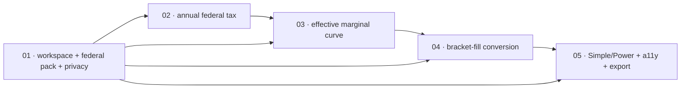

# Scopes Index — Lifetime Tax Strategy Lab (Federal Slice 1)

Feature directory: `specs/021-lifetime-tax-strategy-lab`
Repository: `research-lab`
Planning owner: `bubbles.plan`
Planning status: **provisional — `spec.md` and `design.md` are not yet authored**

## Planning Authority And What Is Missing

This index, the five scope files, `scenario-manifest.json`, `uservalidation.md`
and `state.json` are the artifacts `bubbles.plan` owns. Two prerequisite
artifacts are owned by other specialists and were deliberately **not** written
here:

| Missing artifact | Owner | What it must supply before Scope 01 starts |
| --- | --- | --- |
| `spec.md` | `bubbles.analyst` | Ratify or supersede the Planned Requirement Anchors (`PRA-021-001` … `PRA-021-038`) below as numbered `FR-021-*` / `NFR-021-*` requirements, and record the deferral register verbatim. |
| `design.md` | `bubbles.design` | Fix the module boundaries, the exact rule-pack JSON schema, the closed `RLTAX-*` refusal enum, the calculation order, and the Simple/Power component tree. |

Until both land, every requirement citation in the scope files reads
`PRA-021-*`. A `PRA` is a planning-owned anchor, not a specification claim. When
`spec.md` is authored, each `PRA` is either adopted under an `FR-021-*` number
or explicitly rejected, and these scope files are repointed in one edit.

## Planning Input Basis

The domain was **not** re-derived. It was consumed from:

1. `notes/lifetime-tax-strategy-lab.md` — a ~1330-line design proposal covering
   actors, capability sections, contracts, scenarios, a validation plan, a
   proposed file surface and a proposed five-scope split. That note is the
   primary input.
2. The operator's slice constraint, which narrows the proposal to a single
   federal vertical slice because the note's own handoff (its *Open Decisions
   Before Specification* section) lists roughly thirteen unresolved owner
   decisions, and its *Split This Into Two Features* section states the full
   proposal is larger than five scopes can carry.

**None of the note's open decisions is resolved, and this plan requires none of
them.** Every item that depends on an open decision — which state ships first,
which property jurisdiction, which rental mode, which Medicare cases, which
mortality source, which return-component source — is in the deferral register
below and is unreachable from any scope here.

## The Slice

One self-contained household tax workspace, one source-qualified **federal**
rule pack for **one declared tax year**, deterministic annual federal tax, an
effective marginal rate curve, and exactly one Roth conversion comparison
(no-conversion versus fill-to-a-selected-ordinary-bracket).

Supported income kinds are exactly four: **ordinary income**, **qualified
dividends**, **long-term capital gains**, **tax-exempt interest**. Every other
income kind renders `Unavailable`.

Every result carries a rule status drawn from a closed enum:
`enacted-current-law` · `enacted-scheduled-law` · `user-hypothetical-law` ·
`unavailable`.

An unsupported year, an unsupported jurisdiction or an unsupported income kind
renders an explicit `Unavailable` state. It never substitutes an average, a
national default, a carried-forward threshold or a zero.

## Deferral Register — Recorded, Not Omitted

`spec.md` must carry this table verbatim. A reader must be able to see what the
tool cannot do without inferring it from silence.

| Deferred capability | Why it is deferred from slice 1 | Earliest reachable point |
| --- | --- | --- |
| Every state tax pack | The note's open decision 1 (which state ships first) is unresolved. A generic effective-rate fallback is explicitly not a state tax calculation. | A later feature, after the owner names the first state |
| Property tax, primary home, long-term rental, vacation rental | The note's open decisions 2 and 3 (jurisdiction, rental mode) are unresolved | A later feature |
| Medicare premiums, IRMAA bands and adjustment scenarios | The note's open decision 6 is unresolved; IRMAA is a cliff whose band table is a dated rule pack this slice does not carry | A later feature |
| Social Security claim-age search, spousal and survivor paths | Requires a benefit adapter, a claim-month candidate set and the note's open decision 13 (earnings history versus entered estimate) | A later feature |
| Premium tax credit before Medicare | The note's open decision 14 (which year the pack targets) is unresolved, and the eligibility boundary has moved by legislation | A later feature |
| Payroll and self-employment tax, QBI, NIIT, AMT, credits | Outside the four supported income kinds; each is a named `unsupportedFeatures` entry in the slice-1 federal pack | A later feature |
| Monte Carlo, bootstrap, regime paths, any market simulation | Slice 1 has no path engine and no multi-year ledger | A later feature |
| Any success, shortfall or survival **probability** | With no path cohort there is no frequency to report, and a probability with no cohort behind it is a fabricated statistic | A later feature |
| Multi-year lifetime ledger, RMDs, QCDs, withdrawal order, reserve policy | Slice 1 settles exactly one tax year | A later feature |
| Roth five-year clocks, 72(t) periodic payment series, accumulation and deferral policy | Multi-year commitments with no single-year expression | A later feature |
| Estate, gift, 1031 exchange, trusts, inherited-account windows | The note places these behind separate rule contracts | A later feature |
| Registration in `tools.json`, `index.html`, `rlnav.js`, `README.md`, `notes/README.md`, market-brief coverage | A separate later scope by explicit operator instruction | A later feature |

## Hard Prohibitions Carried Into Every Scope

These are blocking constraints from a completed four-pass review. Each scope
repeats the ones it could plausibly violate; all five are listed here so no
scope can be read in isolation and miss one.

1. **Feature 008 is untouchable.** `rlportfolio.js`, `rlportfolioanalytics.js`,
   `portfolio-survival-allocation.config.json` and everything under
   `specs/008-portfolio-survival-and-brief-lab/` must remain byte-identical.
   Feature 008 is `status: blocked` and its contracts are closed and exact-key;
   extending them is a rejected approach. This feature defines an **independent**
   workspace contract and shares no storage namespace with it.
2. **No registration.** `tools.json`, `index.html`, `rlnav.js`, `README.md`,
   `notes/README.md` and market-brief coverage are excluded from every scope
   here.
3. **The new root HTML must be registered in `site-exclusions.json`.**
   `scripts/build-pages-site.mjs` refuses an unregistered root HTML that is not
   listed there, and that refusal breaks the live Pages deploy. This edit lands
   in the same scope that creates the page (Scope 01), never later.
4. **No published error rate.** No spec text, no scope text and no UI copy may
   claim a published error rate, a self-invalidation statistic or any
   track-record figure. The mechanism that would produce one does not exist.
   (The source note's competitive table lists this as a differentiator; that
   claim is rejected for this slice.)
5. **No plan success probability** anywhere in slice 1.
6. **No brief or data-plane contact.** `briefs/`, `data/`, `market-brief.*` and
   every scheduled-publication artifact are excluded from every scope.
7. **`scripts/selftest.mjs` assertions are never weakened.** New groups are
   appended. No existing assertion is edited, relaxed or deleted to make
   anything pass.

## Repo Conventions Every Scope Inherits

- Single-file, build-free HTML tool. No bundler, no build step, works from
  `file://`.
- Shared JS is UMD (`module.exports` plus a global attach), never ESM.
- Every page carries the repository's single standard Content-Security-Policy
  meta. `scripts/selftest.mjs` asserts one identical CSP across all pages, so a
  new page with a drifting policy fails the suite.
- Every pure analytic function is a top-level `function name(...) {}`
  declaration, because `scripts/selftest.mjs::extractFn` extracts by balancing
  braces from a `function <name>(` signature. A const-arrow export is
  unreachable to the harness and therefore untestable there.
- Null-safe numerics use `Number.isFinite(x)`. Global `isFinite` is forbidden.
- Every displayed value carries a contextual tooltip. Every chart carries a
  text-equivalent table.
- `node scripts/selftest.mjs` stays green at the end of every scope.
- Test files are named without a repository-relative path in these artifacts on
  purpose: `scripts/validate-spec-test-paths.mjs` is a ratchet that fails on a
  new spec-referenced test path that does not exist on disk, and its baseline
  must shrink rather than grow. Browser rows therefore select by `--grep` on the
  persistent title rather than by file argument.

---

## Execution Outline

### Phase Order

1. **01 Tax Workspace, Federal Rule Pack, And Privacy Boundary** creates the
   independent workspace and rule-pack contracts, the mandatory config, the
   one-year source-qualified federal pack, the minimum-viable-input contract,
   the closed `RLTAX-*` refusal vocabulary, the unregistered route shell, its
   `site-exclusions.json` entry, and the local-only privacy boundary. It answers
   *which rules apply, from which source, and what is unavailable* before any
   number is computed.
2. **02 Deterministic Annual Federal Tax** turns a minimum viable input into one
   reconciled federal tax result for the declared year: taxable income,
   long-term gain stacking on ordinary income, standard versus itemized
   deduction selection, and a rule status on every field.
3. **03 Effective Marginal Rate Curve** adds the per-year curve for the next
   dollar of ordinary income and the next dollar of realized long-term gain,
   with every contributing threshold named and sourced, cliffs rendered as
   steps, and every threshold the pack does not support named as an unavailable
   contributor rather than silently omitted.
4. **04 Bracket-Fill Roth Conversion Comparison** compares exactly two policies
   on identical inputs — no conversion, and fill to a selected ordinary bracket
   — and discloses in full what the comparison did not model.
5. **05 Simple/Power Route, Accessibility, And Local Export** completes the
   decision-first Simple view, the Power drill-down, tooltips, text-equivalent
   tables, keyboard and mobile operation, the unavailable-state surfaces, and
   the explicit-action private local export. It does **not** register the tool.

Each scope delivers one user-visible outcome across contract, engine and route
in the same slice. No scope is a layer.

### New Types And Signatures

Contracts (all new, none extending Feature 008):

- `TaxWorkspace/v1` — filing status, declared tax year, supported income-kind
  amounts, deduction mode, and a declared-unavailable domain list.
- `TaxRulePack/v1` — `id`, `program`, `jurisdiction`, `version`,
  `effectiveTaxYears`, `publishedAt`, `retrievedAt`, `sourceRecords[]`,
  `supportedFeatures[]`, `unsupportedFeatures[]`, `indexingRules[]`,
  `calculationOrder`, `roundingPolicy`, `expiryPolicy`, `contentSha256`.
- `RuleStatus` — closed enum: `enacted-current-law`, `enacted-scheduled-law`,
  `user-hypothetical-law`, `unavailable`.
- `TaxUnavailable/v1` — `code` (closed `RLTAX-*`), `domain`, `reason`,
  `whatWouldMakeItAvailable`. Never a number.
- `AnnualFederalTaxResult/v1` — per-field value plus `ruleStatus` plus
  `packRef`, with an explicit reconciliation identity.
- `EffectiveMarginalCurve/v1` — ordered points, `contributingThresholds[]` each
  naming its rule-pack source, `cliff: true|false` per segment, and
  `unavailableContributors[]`.
- `ConversionComparison/v1` — exactly two policies, per-policy federal cost, the
  bracket edge selected, and a closed `notModeled[]` disclosure list.

Modules (all new UMD, none ESM):

- `rltaxrules.js` — `validateRulePack(pack)`, `resolveRulePack(jurisdiction,
  program, year)`, `ruleStatusFor(pack, year)`, `unavailable(code, domain,
  reason)`; owns the closed `RLTAX-*` enum.
- `rltaxworkspace.js` — `validateWorkspace(input)`,
  `minimumViableInput(input)`, `declaredUnavailableDomains(workspace)`,
  `privacyInventory()`, `clearAllPrivateData()`, `sanitizeForExport(workspace)`.
- `rltax.js` — `computeTaxableIncome(...)`, `selectDeduction(...)`,
  `stackLongTermGain(...)`, `computeAnnualFederalTax(...)`,
  `reconcileAnnualFederalTax(...)`, `computeEffectiveMarginalCurve(...)`.
- `rltaxstrategy.js` — `fillToBracketConversion(...)`,
  `compareConversionPolicies(...)`.

Data and configuration:

- `lifetime-tax-strategy.config.json` — mandatory. Missing, malformed or
  unknown-version configuration blocks dependent computation visibly while the
  privacy inventory and clear actions stay reachable.
- `tax-rules/federal/<declared-year>.json` — one file, one year, populated from
  a primary IRS source with `publishedAt` and `retrievedAt` recorded. The year
  is an implementation input chosen from that source; the engine assumes no
  year and extends no threshold into any other year.

Route:

- `lifetime-tax-strategy-lab.html` — unregistered root page, standard CSP meta,
  listed in `site-exclusions.json` from Scope 01 onward.

### Validation Checkpoints

- Every scope opens with a named intended-RED assertion and closes with the
  identical command green. RED is valid only when the intended contract
  assertion fails; a syntax error, a missing browser or an absent test does not
  satisfy RED.
- `node scripts/selftest.mjs` runs at the end of every scope and must stay
  green. New assertion groups are appended only.
- `node scripts/validate-spec-test-paths.mjs` runs at the end of every scope and
  must report zero new missing paths.
- Scope 01 is `foundation:true`. Scopes 02 through 05 may not start until 01 is
  Done and its three boundary canaries pass: the Feature 008 byte-identity
  canary, the storage-namespace isolation canary, and the zero-network canary.
- Scope 01 additionally runs `node scripts/build-pages-site.mjs` (or the repo's
  equivalent invocation) to prove the new root page carries a deploy decision.
  A green selftest without that proof is insufficient, because the Pages refusal
  is what breaks the live deploy.
- Browser rows run against the real route through the repository's Playwright
  `system-chrome` project with no request interception, no service worker and no
  external provider.
- Scope 05 runs the cumulative browser suite plus the request-ledger privacy
  assertion before it is accepted, and explicitly asserts that the tool is still
  absent from every registry.

---

## Scope Ordering Rationale

**The foundation lands first and is genuinely a foundation.** Scope 01 owns the
question every later scope asks: *which rule pack applies to this year and this
jurisdiction, and what is unavailable*. If any later scope could resolve a rule
itself, the `Unavailable` guarantee stops being structural and becomes a
convention. Scope 01 also owns the privacy boundary, because a page that can
compute before it can prove it sends nothing is a page that has already leaked.

**Computation is second and not first.** Building the federal engine before the
pack contract exists would put thresholds in code, which is exactly the failure
the note names: an engine that carries current-law numbers extends them into
future years without a declared indexing rule.

**The marginal curve is third and depends on the computation.** The curve is a
finite difference over the annual result. It cannot be authored against an
engine that does not yet exist without re-implementing that engine inside it,
which would break one-definition-per-concept.

**The conversion comparison is fourth.** A bracket-fill conversion is defined by
the bracket edge, and the honest cost of the marginal dollar it adds is the
curve. Comparing conversions before the curve exists means citing a statutory
bracket, which the source note identifies as an incomplete recommendation.

**The route completes last** because Simple must summarize a result that
already exists. A Simple view built first would define the answer shape and then
force the engine to fill it, which is how a plausible-looking number replaces a
refusal.

## Scope Inventory

| # | Scope | Artifact | Tags | Depends On | Scenarios | Status |
| --- | --- | --- | --- | --- | --- | --- |
| 01 | Tax Workspace, Federal Rule Pack, And Privacy Foundation | [`01-tax-workspace-rule-pack-and-privacy-foundation/scope.md`](01-tax-workspace-rule-pack-and-privacy-foundation/scope.md) | `foundation:true`, `privacy-critical:true`, `deploy-gate:true` | none | SCN-021-001 … -003 | Not started |
| 02 | Deterministic Annual Federal Tax | [`02-deterministic-annual-federal-tax/scope.md`](02-deterministic-annual-federal-tax/scope.md) | `engine:federal` | 01 | SCN-021-004 … -006 | Not started |
| 03 | Effective Marginal Rate Curve | [`03-effective-marginal-rate-curve/scope.md`](03-effective-marginal-rate-curve/scope.md) | `engine:federal` | 01, 02 | SCN-021-007 … -009 | Not started |
| 04 | Bracket-Fill Roth Conversion Comparison | [`04-bracket-fill-roth-conversion-comparison/scope.md`](04-bracket-fill-roth-conversion-comparison/scope.md) | `strategy:single-year` | 01, 02, 03 | SCN-021-010 … -012 | Not started |
| 05 | Simple/Power Route, Accessibility, And Local Export | [`05-simple-power-route-accessibility-and-local-export/scope.md`](05-simple-power-route-accessibility-and-local-export/scope.md) | `route:integrated`, `no-registration:true` | 01, 02, 03, 04 | SCN-021-013 … -015 | Not started |

## Dependency Graph

| ## | Scope Directory | Depends On | Unblocks | Why the edge exists |
| --- | --- | --- | --- | --- |
| 01 | `01-tax-workspace-rule-pack-and-privacy-foundation` | none | 02, 03, 04, 05 | Owns the workspace contract, the pack contract, the closed refusal enum and the privacy boundary. Nothing may resolve a rule or hold a household value outside it. |
| 02 | `02-deterministic-annual-federal-tax` | 01 | 03, 04, 05 | Reads a validated pack through Scope 01's resolver and a validated workspace through Scope 01's contract. |
| 03 | `03-effective-marginal-rate-curve` | 01, 02 | 04, 05 | The curve is a finite difference over Scope 02's annual result; re-deriving the result inside the curve would duplicate the definition. |
| 04 | `04-bracket-fill-roth-conversion-comparison` | 01, 02, 03 | 05 | The fill target is a bracket edge from Scope 01's pack, the cost is Scope 02's result, and the honest marginal cost is Scope 03's curve. |
| 05 | `05-simple-power-route-accessibility-and-local-export` | 01, 02, 03, 04 | none | Simple renders a decision-level summary of results that already exist; Power drills into all four. |

## Scenario Distribution

Every scenario has exactly one owning scope.

| Scope | Count | Scenario IDs |
| --- | --- | --- |
| 01 | 3 | SCN-021-001, SCN-021-002, SCN-021-003 |
| 02 | 3 | SCN-021-004, SCN-021-005, SCN-021-006 |
| 03 | 3 | SCN-021-007, SCN-021-008, SCN-021-009 |
| 04 | 3 | SCN-021-010, SCN-021-011, SCN-021-012 |
| 05 | 3 | SCN-021-013, SCN-021-014, SCN-021-015 |
| **Total** | **15** | SCN-021-001 … SCN-021-015 |

## Planned Requirement Anchors

`bubbles.analyst` adopts or rejects each of these in `spec.md`. Thirty-eight
anchors across five scopes stays inside the roughly-forty / five-scope cap.

### Scope 01 — Foundation

| Anchor | Statement |
| --- | --- |
| PRA-021-001 | The household tax workspace is an independent contract. It shares no module, no storage namespace and no key with the Feature 008 portfolio workspace. |
| PRA-021-002 | A rule pack declares `id`, `program`, `jurisdiction`, `version`, `effectiveTaxYears`, `publishedAt`, `retrievedAt`, `sourceRecords[]`, `supportedFeatures[]`, `unsupportedFeatures[]`, `indexingRules[]`, `calculationOrder`, `roundingPolicy`, `expiryPolicy` and `contentSha256`. A pack missing any member is refused by name and never defaulted. |
| PRA-021-003 | Rule resolution is by jurisdiction, program and effective tax year. A year outside `effectiveTaxYears` is refused `RLTAX-YEAR-UNSUPPORTED`. No threshold is extended into an unsupported year under any indexing assumption the pack does not declare. |
| PRA-021-004 | Every result field carries a `RuleStatus` from the closed enum `enacted-current-law` · `enacted-scheduled-law` · `user-hypothetical-law` · `unavailable`. |
| PRA-021-005 | An unsupported year, jurisdiction, income kind, filing status or feature produces a `TaxUnavailable/v1` record carrying a closed `RLTAX-*` code, the affected domain, the reason, and what would make it available. It never produces a number, a zero, a national average or a silent omission. |
| PRA-021-006 | Exactly four income kinds are supported: ordinary income, qualified dividends, long-term capital gains, tax-exempt interest. Every other kind is `RLTAX-INCOME-KIND-UNSUPPORTED`. |
| PRA-021-007 | Every jurisdiction other than the federal pack renders `RLTAX-JURISDICTION-UNSUPPORTED`. No state result is computed, estimated or approximated. |
| PRA-021-008 | The minimum viable input is filing status, declared tax year, at least one supported income-kind amount, and a deduction mode. Every unsupplied domain returns `Unavailable` rather than blocking computation of the domains that were supplied. |
| PRA-021-009 | No household value leaves the local namespace. It appears in no network request, no URL, no referrer, no console output and no committed artifact. The page performs zero network requests. |
| PRA-021-010 | Configuration is mandatory. A missing, malformed or unknown-version `lifetime-tax-strategy.config.json` blocks dependent computation visibly, while the privacy inventory and the clear action stay reachable. |

### Scope 02 — Annual Federal Tax

| Anchor | Statement |
| --- | --- |
| PRA-021-011 | Annual federal tax for the declared year is deterministic: identical input produces a byte-identical result. |
| PRA-021-012 | Ordinary-income tax is computed across the resolved pack's bracket table in the pack's declared `calculationOrder`. |
| PRA-021-013 | Long-term capital gains and qualified dividends stack on top of ordinary taxable income rather than being taxed in isolation. |
| PRA-021-014 | Deduction selection between standard and itemized is explicit, visible, and never silently chosen for the user without disclosure of which was applied. |
| PRA-021-015 | Tax-exempt interest is tracked, is excluded from taxable income, and is visibly recorded as an input the model retains rather than discards. Its downstream uses (taxable-benefit and Medicare income definitions) are named `Unavailable` in this slice. |
| PRA-021-016 | Every annual result satisfies a stated reconciliation identity between income components, deductions, taxable income and tax, and the identity is displayed rather than asserted in prose. |
| PRA-021-017 | Internal precision is preserved in full. Display rounding is disclosed and is applied only at the display boundary. |
| PRA-021-018 | A federal feature the pack lists in `unsupportedFeatures[]` is named and rendered unavailable. It is never silently omitted from a total, and no result is labeled a complete federal tax. |

### Scope 03 — Effective Marginal Rate Curve

| Anchor | Statement |
| --- | --- |
| PRA-021-019 | The engine emits a per-year curve of the marginal cost of the next dollar of ordinary income and the next dollar of realized long-term gain. The output is a curve, never a single rate. |
| PRA-021-020 | Every contributing threshold on the curve is named and carries its rule-pack source. |
| PRA-021-021 | A cliff renders as a step. Smoothing a step into a gradient is forbidden, because the step is the quantity the user is steering around. |
| PRA-021-022 | A threshold the pack does not support in this slice is listed as an `unavailableContributor` with its code, rather than omitted. The curve is labeled incomplete accordingly. |
| PRA-021-023 | The curve is derived from the Scope 02 annual result. No bracket table, rate or threshold is re-declared inside the curve implementation. |
| PRA-021-024 | The curve has a text-equivalent table carrying every point, every threshold name and every unavailable contributor. |

### Scope 04 — Bracket-Fill Roth Conversion Comparison

| Anchor | Statement |
| --- | --- |
| PRA-021-025 | The comparison contains exactly two policies: no conversion, and fill to a user-selected ordinary bracket. Both run on identical inputs and the identical resolved pack. |
| PRA-021-026 | The conversion amount is derived from the selected bracket edge in the resolved pack, never from a hard-coded threshold. |
| PRA-021-027 | The comparison reports the conversion amount, the federal tax under each policy, the difference, and the effective marginal rate at the fill edge from the Scope 03 curve. |
| PRA-021-028 | The comparison carries a closed `notModeled[]` disclosure naming at minimum: state tax, Medicare and IRMAA effects, the premium tax credit, the Roth five-year clocks, later-year distribution and RMD pressure, survivor effects, and lost growth on taxes paid. |
| PRA-021-029 | The comparison distinguishes taxes paid from outside funds from taxes withheld from the converted amount, or names that distinction unavailable if the input does not declare it. |
| PRA-021-030 | The comparison emits no probability, no lifetime outcome, no break-even year, no ranking and no recommendation. It is a single-year federal cost difference and says so. |

### Scope 05 — Route, Accessibility, Export

| Anchor | Statement |
| --- | --- |
| PRA-021-031 | Simple is the default view and opens first with a decision-level answer, the strongest tradeoff, and what is unavailable. |
| PRA-021-032 | Power is the drill-down and exposes the rule ledger, the per-bracket detail, the curve table, the reconciliation identity, and every pack source record. |
| PRA-021-033 | Every displayed value carries a contextual tooltip. Every chart carries a text-equivalent table. |
| PRA-021-034 | Unavailable states are visible, keyboard reachable, and readable on mobile. An unavailable domain never renders as a blank, a dash without explanation, or a zero. |
| PRA-021-035 | Copy is educational-only and states plainly that the tool is not tax advice, does not prepare or file a return, and does not recommend an action. |
| PRA-021-036 | No copy claims a published error rate, a self-invalidation statistic, a track record, or an accuracy figure. |
| PRA-021-037 | A private local export happens only after explicit user action, warns that the file carries sensitive financial information, contains no name, address, account number, tax identifier or credential, and lists every omitted field. |
| PRA-021-038 | The tool remains absent from `tools.json`, `index.html`, `rlnav.js`, `README.md`, `notes/README.md` and market-brief coverage at the end of this feature, and its root page carries a `site-exclusions.json` deploy decision. |
