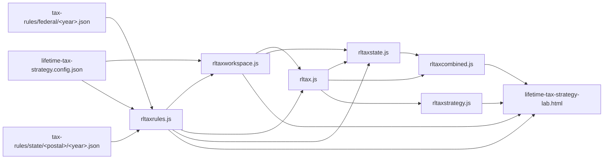

# Design: 022 Federal Preferential Completion And State Income Tax (Slice 2)

Feature directory: `specs/022-federal-preferential-and-state-income-tax`
Repository: `research-lab`
Design owner: `bubbles.design`
Specification: [`spec.md`](spec.md)
Scope plan: [`scopes/_index.md`](scopes/_index.md)
Predecessor design: [`specs/021-lifetime-tax-strategy-lab/design.md`](../021-lifetime-tax-strategy-lab/design.md)

This document fixes the module boundaries, the contract shapes, the extended
closed refusal enum, the extended calculation order, and the component tree for
the capability `spec.md` states provider-neutrally. It asserts no dollar amount,
no rate and no threshold.

It extends Feature 021's design. Where a Feature 021 contract is unchanged this
document says so and does not restate it; where a contract changes, the change is
stated as a versioned successor with an explicit compatibility rule.

---

## Design Brief

### Current State

Feature 021 shipped six files and one pack directory. `rltaxrules.js` owns the
pack contracts, the twelve-member `RLTAX_CODES` enum and the resolver.
`rltaxworkspace.js` owns the workspace, storage and privacy surface. `rltax.js`
owns the arithmetic — `computeAnnualFederalTax`, the ten-stage calculation order
and `computeEffectiveMarginalCurve`. `rltaxstrategy.js` owns the conversion
comparison. `lifetime-tax-strategy-lab.html` renders records the modules produced.

Three properties of that shipped state constrain everything below.

1. `RateTable/v1` binds one table to one `{ sourceRef, locator }` pair. A table
   whose components come from two authorities cannot be expressed.
2. `TaxRulePack/v1.calculationOrder` must equal the engine's closed ordered stage
   list element for element, or the pack is refused. Adding a stage is therefore
   a coordinated engine-and-pack change, not a pack edit.
3. `resolveRulePack` refuses any jurisdiction other than `federal`. The
   jurisdiction axis is a resolver constant rather than a pack seam.

### Target State

Per-component provenance, a declared tax-leg set, a pack-declared preferential
policy, a pack-declared relief application point, an open jurisdiction axis with
a residency declaration, two state packs, a combined settlement whose two halves
never touch, and a combined curve that tags every threshold with its owner.

### Patterns To Follow

- Feature 021's `AbsentFigure/v1` in the exact position the figure would occupy.
- Feature 021's refusal constructor with no numeric member.
- Feature 021's pack-states-its-own-coverage rule.
- Feature 021's forward finite difference with exact crossing pairs.
- Feature 021's append-first selftest discipline, bounded by the
  [Assertion Supersession Mechanics](#assertion-supersession-mechanics) below for
  the twenty-one assertions this feature deliberately changes.

### Patterns To Avoid

- A jurisdiction name, state postal code, year or authority name inside any
  engine. The federal-only resolver constant is exactly the shape this feature
  removes; reintroducing it one level down as `if (jurisdiction === "state:CA")`
  would be the same defect wearing a state's clothes.
- A second definition of tax. The combined settlement calls the same
  per-jurisdiction settlement twice; it does not re-derive either.
- Solving the state-and-local-deduction circularity by iteration.
- Renumbering a calculation stage. Stage ids are names cited in packs, results
  and prose; the ordered array is the order.

### Resolved Decisions

| ID | Decision |
| --- | --- |
| D-1 | `RateTable/v2` adds a `componentSources[]` override list beside the existing default citation. `v1` remains valid and is accepted unchanged. |
| D-2 | The pack declares `taxLegs[]`. `CO-8` sums the declared legs rather than two hardcoded ones. |
| D-3 | New stages are appended as `CO-11` … `CO-14` and placed in the pack's ordered array at their execution position. Stage ids are not renumbered and the array is not required to be numerically ascending. |
| D-4 | The jurisdiction axis is `federal` or `state:<postal>`, resolved from a workspace residency declaration. |
| D-5 | A pack declares `preferentialPolicy` and `reliefMechanisms[].applicationPoint`. The engine reads both; it never branches on jurisdiction. |
| D-6 | A no-tax jurisdiction carries `imposesIndividualIncomeTax: false` plus a `noTaxAuthority` citation and produces `SourcedZero/v1`. |
| D-7 | The combined settlement is a pure pairing with no data flow between halves, proven by an order-swap equality assertion. |
| D-8 | Two new refusal codes: `RLTAX-RESIDENCY-UNSUPPORTED` and `RLTAX-PACK-YEAR-MISMATCH`. Fourteen members total. |

### Open Questions Answered Here

`OQ-022-001` in [Partial California Coverage](#partial-california-coverage).
`OQ-022-002` in [The Combined Curve](#the-combined-curve).
`OQ-022-003` in [Rendering A Sourced Zero](#rendering-a-sourced-zero).

---

## Module Boundaries And File Surface

Two new files, one new directory tree, five existing files edited. No new root
HTML, therefore no `site-exclusions.json` edit.

### New files

| File | Owns | Must NOT own |
| --- | --- | --- |
| `rltaxstate.js` | `StateResidency/v1`, `residencyPattern`, `resolveStatePack`, `StateSettlement/v1`, `computeAnnualStateTax`, `SourcedZero/v1` construction | Any bracket, rate, edge or threshold. Any state name. Any jurisdiction-specific branch. Any federal stage. Any storage access. Any DOM access. |
| `rltaxcombined.js` | `CombinedSettlement/v1`, `combineSettlements`, `CombinedMarginalCurve/v1`, `computeCombinedMarginalCurve` | Any arithmetic that is not addition of two already-computed jurisdiction totals and one finite difference over them. Any pack read. Any second definition of either settlement. |

New directory: `tax-rules/state/<postal>/<year>.json`. `tax-rules/` remains absent
from `PUBLIC_DIRECTORIES` in `scripts/build-pages-site.mjs`; Feature 026 adds it
in the same change that registers the page.

Playwright specs, named without a repository-relative path so the spec-test-path
ratchet's baseline does not grow: `lifetime-tax-preferential.spec.mjs` (Scope 01),
`lifetime-tax-surtax.spec.mjs` (Scope 02), `lifetime-tax-state-contract.spec.mjs`
(Scope 03), `lifetime-tax-california.spec.mjs` (Scope 04),
`lifetime-tax-combined.spec.mjs` (Scope 05). Browser rows select by `--grep` on a
persistent title.

### Existing files edited

| File | Edit | Constraint |
| --- | --- | --- |
| `rltaxrules.js` | `RateTable/v2`, `ComponentSource/v1`, `componentKindOf`, `SourceRecord/v2` and per-component-kind year containment, `componentSources[]` validation, `taxLegs[]`, `preferentialPolicy`, `reliefMechanisms[]`, `staticThresholds`, the open jurisdiction axis, two new enum members | The enum is extended additively. No existing member's meaning changes. A selftest asserts exactly one declaration of the vocabulary in the repository. |
| `rltax.js` | Stages `CO-11` … `CO-14`, leg-set summation in `CO-8`, two new reconciliation legs | No numeric literal outside the sweep members. No stage renumbered. |
| `rltaxworkspace.js` | `residencyJurisdiction`, `residencyPattern`, `investmentIncomeBasis`, `wageBasis`, each initialized `null`; privacy inventory and export sanitization extended to cover all four | No new storage key outside the declared namespace. No basis member is initialized to a value. |
| `tax-rules/federal/2026.json` | Version bump; preferential tables become `RateTable/v2` where retrieved; two surtax legs added | Every figure re-cited per component. Any unretrieved figure stays absent. |
| `lifetime-tax-strategy-lab.html` | Residency input, two basis inputs, per-component source detail, state panel, combined panel, combined curve and its text-equivalent table | No computation. No rule value. No refusal it constructs itself. No `<canvas>` or `<table>` inside Simple. |
| `scripts/selftest.mjs` | One appended assertion group per scope, five in total, plus the ten `SUP-022-*` replacements Scope 01 and Scope 02 own there | Append-first. The pre-existing pass count must not fall. An assertion is edited only under a ledger entry, with its `SUP-022-NN` marker beside the replacement. |
| `tests/lifetime-tax-federal.spec.mjs` · `tests/lifetime-tax-marginal.spec.mjs` · `tests/lifetime-tax-foundation.spec.mjs` · `tests/lifetime-tax-route.spec.mjs` | The nine `SUP-022-*` browser replacements, distributed by the [per-file marker table](#per-file-marker-distribution) | Test titles stay byte-identical, because they are the `--grep` contract. Only the expectations named in the ledger change. `tests/lifetime-tax-conversion.spec.mjs` is not opened by any scope. |
| `tests/lifetime-tax.support.mjs` | Scope 02 only: the two basis declarations added to `declareOrdinaryHousehold` | Fixture input completion under FIC-1 … FIC-6. No assertion, no other input member, no helper signature change. |

### Dependency direction



The graph is acyclic and one-directional. `rltaxstate.js` depends on `rltax.js`
because a state settlement reuses the same stage machinery with a different pack;
it does not depend on `rltaxcombined.js`. A third state pack enters at `SPACK`
and touches no module.

### Harness constraints

Every named function is a top-level `function name(...) {}` declaration, because
the selftest extractor builds a sandbox from source text by matching a function
signature and balancing braces. A module-level arrow constant is unreachable to
the harness. Numeric guards use `Number.isFinite(x)`; global `isFinite` appears in
no new file and a scan asserts it. No canvas drawing is wrapped in a
`requestAnimationFrame` callback. Both new modules are UMD: a global attach plus
`module.exports` guarded by `typeof module !== 'undefined'`. Never ESM.

---

## Capability Foundation

The capability is **multi-jurisdiction, source-qualified tax rule resolution and
single-year combined settlement**. Feature 021 fixed the seams for one
jurisdiction. This design widens three of them and adds one.

### Foundation contracts

| Contract | Owner | Status |
| --- | --- | --- |
| `TaxRulePack/v2` | `rltaxrules.js` | Successor to `v1`, additive |
| `RateTable/v2` | `rltaxrules.js` | Successor to `v1`, additive |
| `ComponentSource/v1` | `rltaxrules.js` | New |
| `SourceRecord/v2` | `rltaxrules.js` | Successor to `v1`, additive |
| `SourcedZero/v1` | `rltaxrules.js` | New |
| `TaxLeg/v1` | `rltaxrules.js` | New |
| `ReliefMechanism/v1` | `rltaxrules.js` | New |
| `StateResidency/v1` | `rltaxstate.js` | New |
| `StateSettlement/v1` | `rltaxstate.js` | New |
| `CombinedSettlement/v1` | `rltaxcombined.js` | New |
| `CombinedMarginalCurve/v1` | `rltaxcombined.js` | New |
| `SourceRecord/v1`, `AbsentFigure/v1`, `TaxUnavailable/v1`, `DeductionAmount/v1`, `TaxWorkspace/v1` | Feature 021 | Unchanged; `SourceRecord/v1` is superseded additively by `v2` and remains valid wherever no per-component citation names it |

### Extension points

| Seam | What may be added later without touching an engine |
| --- | --- |
| `tax-rules/<jurisdiction>/<program>/<year>.json` | A new state, a new year, a new program |
| `TaxRulePack.taxLegs[]` | A new tax leg with its own rate table and threshold set |
| `TaxRulePack.reliefMechanisms[]` | A credit, an exemption, a phase-out, at a declared application point |
| `TaxRulePack.preferentialPolicy` | A jurisdiction that partially conforms, by pack edit |
| `RateTable.componentSources[]` | A figure whose components split across three authorities |

### Variation axes exercised by the two shipped state packs

1. **Existence of the tax.** California imposes one; Florida does not. The second
   is the axis Feature 021 could not exercise at all, and it is the reason a
   sourced zero is a contract shape rather than a rendering convention.
2. **Preferential treatment.** The federal pack applies preferential bands;
   California declares none. The engine reads `preferentialPolicy` and does not
   know which jurisdiction it is serving.
3. **Relief mechanism and its application point.** The federal pack reduces
   income by a deduction; California reduces income by its own deduction *and*
   reduces tax by a credit. The application point is a pack field.
4. **Threshold variation by filing status.** Every federal threshold in this
   feature varies by filing status; California's surcharge threshold does not.
   `varyByFilingStatus: false` is a pack field so the engine never assumes.

Four axes, each exercised by a shipped pack rather than by a fixture. No
single-implementation justification is required.

---

## Contracts

Every record is exact-key. An unknown key is a refusal, not an ignored field.
Every record carries `contractVersion`. Field lists are complete.

### `ComponentSource/v1`

The shape that resolves the preferential gap and generalizes it.

```json
{
  "contractVersion": "ComponentSource/v1",
  "component": "band:b3:rate",
  "sourceRef": "irs-tc409",
  "locator": "<section and heading inside the cited authority>"
}
```

| Member | Rule |
| --- | --- |
| `component` | A dotted-colon path naming exactly one component of the enclosing figure. Closed grammar below. A path naming no component of the enclosing object is `RLTAX-PACK-INVALID`. |
| `sourceRef` | Must name a `SourceRecord` in the pack whose `retrievalOutcome` is `retrieved` and whose `documentKind` is not `newsroom-release`. Any other case is `RLTAX-PACK-INVALID`. |
| `locator` | Required, non-empty. A `sourceRef` without a locator is not a citation. |

Closed `component` grammar, per enclosing contract:

| Enclosing contract | Legal component paths |
| --- | --- |
| `RateTable/v2` | `band:<bandId>:rate`, `band:<bandId>:lowerInclusive`, `band:<bandId>:upperExclusive` |
| `ThresholdSet/v1` | `threshold:<filingStatus>`, `rate`, `indexing` |
| `DeductionAmount/v1` | `amount` |
| `ReliefMechanism/v1` | `amount:<filingStatus>`, `applicationPoint` |

`effectiveSourceFor(figure, componentPath)` in `rltaxrules.js` returns the
override when one exists and the figure's default `{ sourceRef, locator }`
otherwise, then expands it into the displayable triple `{ title, url,
retrievedAt }` plus the locator. It refuses rather than returning a default when
no default exists.

**Why an override list rather than a required citation on every component.** A
table whose every component came from one section would otherwise repeat the same
citation dozens of times, and a reader could not see at a glance which component
is the unusual one. The override list makes the split-authority case *visible* —
the preferential table's `componentSources[]` contains exactly the entries that
differ, so opening it shows precisely the fact that Feature 021 could not express.

### Component kinds

Every legal `component` path maps to exactly one **component kind**. The map is
total and closed, and it is derived mechanically from the path grammar rather than
declared per pack, so a pack author cannot choose a component's kind.

| Component path | Component kind |
| --- | --- |
| `band:<bandId>:rate`, `rate` | `rate` |
| `band:<bandId>:lowerInclusive`, `band:<bandId>:upperExclusive` | `breakpoint` |
| `threshold:<filingStatus>`, `amount`, `amount:<filingStatus>` | `amount` |
| `indexing`, `applicationPoint` | `qualifier` |

`componentKindOf(componentPath)` in `rltaxrules.js` returns the kind. A path that
matches no row is `RLTAX-PACK-INVALID`; the function never returns a default.

### `SourceRecord/v2`

`SourceRecord/v1` plus one member, and the member is the reason `v2` exists.

```json
{
  "contractVersion": "SourceRecord/v2",
  "…": "every SourceRecord/v1 member, unchanged",
  "declaredApplicableYearsByComponentKind": {
    "rate": "year-invariant",
    "breakpoint": [0],
    "amount": [0],
    "qualifier": []
  },
  "yearInvarianceBasis": { "rate": "<what in the retrieved text establishes the absence of a year qualifier>" }
}
```

| Member | Rule |
| --- | --- |
| `declaredApplicableYearsByComponentKind` | A **total** map over the four component kinds. Every kind is present. Each value is either an array of integer years or the literal string `"year-invariant"`. A missing key, a value that is neither, or a non-integer year is `RLTAX-PACK-INVALID`. |
| An empty array | Means the retrieved document establishes **nothing** for that kind. It is a legal and expected value, and it makes every component of that kind citing this record a refusal. It is never a permissive default. |
| `"year-invariant"` | Means the retrieved document states components of that kind **without a year qualifier**. It is admissible only when `yearInvarianceBasis[kind]` is a non-empty string naming what in the retrieved text establishes the absence. A `"year-invariant"` value with no basis is `RLTAX-PACK-INVALID`, so the value is a positive cited claim about a document rather than an escape hatch. |

### Per-component-kind year containment

For a component `c` of a figure, let `k = componentKindOf(c)` and let `s` be the
`SourceRecord` that `effectiveSourceFor(figure, c)` resolves to. Containment holds
when, and only when, one of these is true:

1. `s.declaredApplicableYearsByComponentKind[k]` is `"year-invariant"`; or
2. the pack's `declaredTaxYear` is a member of
   `s.declaredApplicableYearsByComponentKind[k]`.

Anything else — an empty array, an array that omits the declared year, or a `v1`
record with no map at all — refuses `RLTAX-THRESHOLD-UNAVAILABLE` naming the
component, the kind, the record and the declared year. There is no third outcome
and no permissive default at any level.

**Why the rule is per kind and not per record.** With one flat year list per
record, the two things the feature must both do are mutually exclusive. Topic 409
states the top-band **rate** without a year qualifier and states dollar **amounts**
labelled for tax year 2025. A flat list containing 2026 lets `TP-01-07`'s
breakpoint-substitution adversarial case pass, so the guard can never fire; a flat
list containing only 2025 makes the legitimate `band:b3:rate` override fail
SUP-022-02's containment clause, so the feature's central mechanism is refused.
Splitting containment by kind is what lets one document be authoritative for one
kind of component and non-authoritative for another kind in the same document,
which is the general form of the problem `RD-1` identified.

Worked, using the two records Scope 01 carries:

| Record | `rate` | `breakpoint` | `amount` | `qualifier` |
| --- | --- | --- | --- | --- |
| Rev. Proc. 2025-32 §4.03 | `"year-invariant"`, basis: the section states its two rates through the names *maximum zero rate amount* and *maximum 15-percent rate amount*, neither of which carries a year qualifier | `[<declared year>]` | `[<declared year>]` | `[]` |
| Topic no. 409 | `"year-invariant"`, basis: the page states the rate above the 15-percent thresholds with no year qualifier, in contrast to its own dollar amounts, which it labels explicitly | `[2025]` | `[2025]` | `[]` |

Under that pair, all four required outcomes hold simultaneously:

- The `band:b3:rate` override to Topic 409 passes containment, because its kind is
  `rate` and Topic 409 is year-invariant for rates. SUP-022-02 is satisfiable.
- Overriding any `band:*:lowerInclusive` or `band:*:upperExclusive` to Topic 409
  refuses, because its kind is `breakpoint` and 2026 is not in `[2025]`.
  `TP-01-07`'s adversarial case can fire. **Both were unsatisfiable together
  before this rule.**
- The `b1` and `b2` rates, which inherit the Rev. Proc. default, pass, because that
  section states those two rates through its own amount names.
- Every breakpoint, inheriting the Rev. Proc. default, passes for the declared
  year and would refuse for any other, which is the mechanical form of `F-2`.

**Compatibility with `SourceRecord/v1`.** A `v1` record stays valid and is accepted
unchanged wherever Feature 021 uses it, because a `RateTable/v1` carries no
per-component citation and therefore has nothing to contain. A `v1` record named
by any component of a `RateTable/v2` or a `ThresholdSet/v1` is
`RLTAX-PACK-INVALID` naming the record. That refusal is deliberate: it forces the
pack author to state the map rather than inherit a silent permissive default,
which would reopen exactly the hole this rule closes. `TP-01-02`'s assertion that
the unmodified Feature 021 pack validates unchanged is preserved, because every
table in it is `v1`.


### `RateTable/v2`

`RateTable/v1` plus one member. A `v1` table is accepted unchanged.

```json
{
  "contractVersion": "RateTable/v2",
  "tableId": "preferential-<year>-<filingStatus>",
  "kind": "ordinary | preferential",
  "filingStatus": "single",
  "bands": [
    { "bandId": "b1", "lowerInclusive": 0, "upperExclusive": 0, "rate": 0, "thresholdKind": "rate-step" }
  ],
  "sourceRef": "<the default authority for this table>",
  "locator": "<the default locator>",
  "componentSources": [ /* ComponentSource/v1, may be empty */ ]
}
```

Every `v1` band rule is retained: non-empty, ascending, first band's lower bound
zero, contiguous, last band's upper bound `null` and `null` legal nowhere else,
rate in the unit interval, `thresholdKind` closed to `rate-step | cliff |
phase-in`, and inclusive-lower / exclusive-upper edge semantics.

Two new validations:

1. Every `componentSources[].component` resolves to a component that exists in
   this table. A path naming an absent band is `RLTAX-PACK-INVALID`.
2. No two entries name the same component. A duplicate is `RLTAX-PACK-INVALID`,
   because a component with two authorities has no single answer to the question
   the citation exists to answer.

**The federal preferential table's expected shape.** Three bands. The lower two
band rates and all breakpoints inherit the table default, which is the Revenue
Procedure section that names its amounts the maximum zero rate amount and the
maximum 15-percent rate amount. Exactly one `componentSources[]` entry overrides
`band:b3:rate` to the IRS authority that states the rate above the maximum
15-percent amount. If `BI-1` fails for a filing status, that status's table is an
`AbsentFigure/v1` and no partial table ships.

### `ThresholdSet/v1`

The shape both surtaxes use, and the shape a later Medicare or premium-credit
pack will reuse.

```json
{
  "contractVersion": "ThresholdSet/v1",
  "thresholdSetId": "<id>",
  "rate": 0,
  "varyByFilingStatus": true,
  "thresholds": { "single": 0, "married-filing-jointly": 0, "married-filing-separately": 0, "head-of-household": 0 },
  "indexing": { "indexed": false, "declaredFor": [0] },
  "appliesTo": "modified-adjusted-gross-income-excess-capped-by | declared-basis-excess",
  "basisMember": "<the workspace member supplying the basis>",
  "capMember": "<the workspace-derived quantity capping the excess, or null>",
  "sourceRef": "<default authority>",
  "locator": "<default locator>",
  "componentSources": [ /* ComponentSource/v1 */ ]
}
```

| Member | Rule |
| --- | --- |
| `varyByFilingStatus` | When `false`, `thresholds` carries exactly one key `all` and the engine uses it for every status. This is the member California's surcharge sets, and it is why no engine needs to know that a surcharge threshold behaves unusually. |
| `indexing.declaredFor` | The tax years for which the retrieved authority states these thresholds apply. **The declared tax year must be a member.** If it is not, the whole `ThresholdSet` is refused rather than applied, which is the mechanical form of `BI-4`. |
| `appliesTo` | Closed to two members. The first is the net-investment-income shape: the excess over the threshold, capped by a separate quantity. The second is the additional-Medicare shape: the excess of a declared basis, uncapped. |
| `capMember` | Required and non-null for the first `appliesTo` member; required and `null` for the second. |

`indexing.declaredFor` is the single most load-bearing member in this contract.
It converts "the retrieved page did not say which year these apply to" from a
judgement call into a refusal the validator produces. A pack author who cannot
establish the year cannot populate the array, and an empty array refuses.

### `TaxLeg/v1`

```json
{
  "contractVersion": "TaxLeg/v1",
  "legId": "ordinary | preferential | net-investment-income | additional-medicare | state-ordinary | state-surcharge",
  "stageId": "CO-6",
  "figureRef": "ordinaryRateTables | preferentialRateTables | thresholdSets.<id>",
  "includedInTotal": true
}
```

`TaxRulePack.taxLegs[]` is non-empty and its `legId` values are unique. `CO-8`
sums exactly the legs whose `includedInTotal` is `true`. A leg whose figure is an
`AbsentFigure/v1` produces a refusal, and `CO-8` inherits it. `includedInTotal:
false` exists so a later pack can carry a leg for display without changing the
total — it is not a mechanism for excluding a refusal from a total, and the
validator refuses a pack that sets it `false` on a leg whose figure is absent.

### `ReliefMechanism/v1`

```json
{
  "contractVersion": "ReliefMechanism/v1",
  "mechanismId": "<id>",
  "kind": "deduction-from-income | credit-against-tax",
  "applicationPoint": "before-rate-application | after-rate-application",
  "varyByFilingStatus": true,
  "amounts": { "<filingStatus>": 0 },
  "appliesToLegs": ["state-ordinary"],
  "sourceRef": "<default authority>",
  "locator": "<default locator>",
  "componentSources": []
}
```

`appliesToLegs[]` is the member that keeps California's surcharge outside the
exemption credit. It is a pack field, so the engine applies relief to exactly the
named legs and to no others. A relief mechanism naming a leg the pack does not
declare is `RLTAX-PACK-INVALID`.

`kind` and `applicationPoint` are separate on purpose. A credit applied before
rate application is incoherent and is refused; a deduction applied after rate
application is likewise refused. Keeping them separate makes the coherence rule
explicit rather than implied by a single conflated enum.

### `SourcedZero/v1`

The contract Florida exists to prove.

```json
{
  "contractVersion": "SourcedZero/v1",
  "value": 0,
  "ruleStatus": "enacted-current-law",
  "domain": "state-income-tax:<postal>",
  "reason": "<why the authority establishes that nothing is owed>",
  "sourceRef": "<the authority establishing the absence>",
  "locator": "<section or heading>"
}
```

Three rules make this a real object rather than a decorated zero:

1. `value` is the literal `0` and no other value validates. A `SourcedZero`
   carrying a non-zero value is `RLTAX-PACK-INVALID`.
2. `sourceRef` and `locator` are required. A zero with no citation is an
   `AbsentFigure`, not a `SourcedZero`.
3. `contractVersion` is the discriminator every consumer branches on. A renderer
   that tested `value === 0` would collapse this back into the failure mode the
   feature exists to prevent, so the route reads the contract version and a route
   test asserts it does.

### `TaxRulePack/v2`

`v1` plus six members. Every `v1` member and rule is retained.

```json
{
  "contractVersion": "TaxRulePack/v2",
  "…": "every TaxRulePack/v1 member, unchanged",
  "imposesIndividualIncomeTax": true,
  "noTaxAuthority": null,
  "preferentialPolicy": "own-schedule | none",
  "taxLegs": [ /* TaxLeg/v1 */ ],
  "thresholdSets": { "<id>": { /* ThresholdSet/v1 | AbsentFigure/v1 */ } },
  "reliefMechanisms": [ /* ReliefMechanism/v1 */ ]
}
```

| Member | Rule |
| --- | --- |
| `imposesIndividualIncomeTax` | Boolean or `AbsentFigure/v1`. When `false`, `noTaxAuthority` is required, `taxLegs[]` is empty, and every rate-table member is absent. When `true`, `noTaxAuthority` is `null`. Any other combination is `RLTAX-PACK-INVALID`. |
| `noTaxAuthority` | `{ sourceRef, locator, reason }` or `null`. Supplies the `SourcedZero`'s citation. |
| `preferentialPolicy` | `own-schedule` means the pack carries `preferentialRateTables`. `none` means it does not, and the pack's ordinary schedule prices all supported income kinds. A pack declaring `none` while carrying a preferential table is `RLTAX-PACK-INVALID`. |
| `jurisdiction` | Grammar widened to `federal` or `state:<two-letter-postal-code>`. Anything else is `RLTAX-JURISDICTION-UNSUPPORTED`. |
| `calculationOrder` | Must equal the engine's ordered stage array for the pack's `program` and `preferentialPolicy` exactly, element for element. |

A `TaxRulePack/v1` is still accepted by `validateRulePack` and behaves as a `v2`
whose `imposesIndividualIncomeTax` is `true`, `preferentialPolicy` is
`own-schedule`, `taxLegs[]` is the two Feature 021 legs, `thresholdSets` is empty
and `reliefMechanisms[]` is empty. That defaulting is a **version-compatibility
rule, not a value fallback**: it supplies structure that `v1`'s shape already
implies, and it supplies no figure. Every one of those defaults is asserted by a
test against the unmodified Feature 021 pack.

### `TaxWorkspace/v2`

`v1` plus four members.

```json
{
  "contractVersion": "TaxWorkspace/v2",
  "…": "every TaxWorkspace/v1 member, unchanged",
  "residencyJurisdiction": "state:CA | state:FL | state:<other> | null",
  "residencyPattern": "full-year-resident | part-year | multi-state | non-resident-source | null",
  "investmentIncomeBasis": { "otherOrdinaryNetInvestmentIncome": 0 },
  "wageBasis": { "medicareWagesAndSelfEmploymentIncome": 0 }
}
```

- `residencyJurisdiction: null` means undeclared and produces
  `RLTAX-INPUT-INCOMPLETE`. It never means "no state tax".
- `residencyPattern` other than `full-year-resident` produces
  `RLTAX-RESIDENCY-UNSUPPORTED`. `null` produces `RLTAX-INPUT-INCOMPLETE`.
- Each basis member is a number or `null`. `null` is undeclared and refuses; `0`
  is a real declaration and computes. The distinction is carried in
  `declaredUnavailableDomains[]` exactly as Feature 021 carries it for income.
- `minimumViableInput` is unchanged. Neither basis nor the residency declaration
  is required to resolve the ordinary leg, the preferential leg or the marginal
  curve, so a Feature 021 household still receives every Feature 021 **per-leg**
  answer unchanged. It does **not** still receive a valued federal total: with
  either basis undeclared, that leg refuses and `CO-8` inherits the refusal under
  `FR-022-008`. See
  [Undeclared surtax bases and leg reachability](#undeclared-surtax-bases-and-leg-reachability),
  which fixes that rule and its consequences for every pre-existing fixture.

### `StateSettlement/v1`

```json
{
  "contractVersion": "StateSettlement/v1",
  "packRef": { "id": "…", "version": "…", "contentSha256": "sha256:…" },
  "jurisdiction": "state:CA",
  "declaredTaxYear": 0,
  "filingStatus": "single",
  "imposesIndividualIncomeTax": true,
  "calculationOrder": [],
  "stages": {},
  "stateTaxableIncome": { "value": 0, "ruleStatus": "…" },
  "legs": [ { "legId": "…", "value": 0, "ruleStatus": "…", "bandDetail": [] } ],
  "reliefApplied": [ { "mechanismId": "…", "value": 0, "appliedAtStage": "CO-13", "appliesToLegs": [] } ],
  "totalStateTax": { "value": 0, "ruleStatus": "…" },
  "unsupportedFeatureNotices": [],
  "reconciliation": { "legs": [], "balanced": true, "toleranceUsed": 0 },
  "completeStateTax": false
}
```

`totalStateTax` is a valued record, a `SourcedZero/v1`, or a `TaxUnavailable/v1`.
Those three are the complete set and a route test enumerates the rendering of
each.

### `CombinedSettlement/v1`

```json
{
  "contractVersion": "CombinedSettlement/v1",
  "declaredTaxYear": 0,
  "federal": { /* AnnualFederalTaxResult/v1 */ },
  "state": { /* StateSettlement/v1 | TaxUnavailable/v1 */ },
  "packYearAgreement": { "federalYears": [], "stateYears": [], "agrees": true },
  "combinedTotalTax": { "value": 0, "ruleStatus": "…" },
  "combinedAverageRate": { "value": 0, "ruleStatus": "…" },
  "orderIndependence": { "asserted": true, "method": "settle-both-orders-and-compare" },
  "crossJurisdictionCoupling": {
    "modeled": [],
    "notModeled": [ { "id": "federal-itemized-salt-deduction", "deferralCode": "RLTAX-FEATURE-UNSUPPORTED", "reason": "…" } ],
    "itemizedNotice": null
  },
  "completeCombinedTax": false
}
```

`crossJurisdictionCoupling.modeled` is an empty array in this feature and is a
required member rather than an omission, so a later feature that models a
coupling adds to a list a reader is already looking at.

`itemizedNotice` is populated only when the workspace's deduction mode is
itemized. It states that the declared amount was used exactly as declared, that
the computed state tax was not added to it, and that the tool did not check
whether the household already had. It is a structural member, so a rendering
change cannot drop it.

### `CombinedMarginalCurve/v1`

```json
{
  "contractVersion": "CombinedMarginalCurve/v1",
  "kind": "ordinary | long-term-gain",
  "sweep": { "start": 0, "end": 0, "step": 0, "probe": 0, "maxPoints": 0 },
  "packRefs": { "federal": {}, "state": {} },
  "points": [
    {
      "level": 0,
      "federalTaxAtLevel": 0,
      "stateTaxAtLevel": 0,
      "combinedTaxAtLevel": 0,
      "federalMarginalRate": 0,
      "stateMarginalRate": 0,
      "combinedMarginalRate": 0,
      "ruleStatus": "…"
    }
  ],
  "segments": [
    {
      "fromLevel": 0,
      "toLevel": 0,
      "segmentKind": "flat | rate-step | cliff | phase-in",
      "cliff": false,
      "contributingThresholds": [
        { "jurisdiction": "state:CA", "packId": "…", "name": "…", "tableId": "…", "bandId": "…", "sourceRef": "…", "locator": "…" }
      ]
    }
  ],
  "unavailableContributors": [],
  "incomplete": true,
  "unavailableContributorCount": 0
}
```

The record carries no scalar average and no single summary rate, for the same
reason Feature 021's curve does not: a reader must not be able to read an average
off a marginal object.

`contributingThresholds[].jurisdiction` is required and non-empty. A threshold
with no jurisdiction is `RLTAX-PACK-INVALID`, because the entire value of a
combined curve is knowing which government moved the rate.

---

## The Closed `RLTAX-*` Refusal Enum

Fourteen members. Feature 021's twelve are unchanged in meaning and in raising
site. Two are added, each for a condition none of the twelve covers.

| New code | Meaning (one, and only one) | Raised by |
| --- | --- | --- |
| `RLTAX-RESIDENCY-UNSUPPORTED` | The declared residency **pattern** is outside single-full-year residency: part-year, multi-state, or non-resident source income. The jurisdiction itself may be fully supported. | `rltaxstate.js::residencyPattern` |
| `RLTAX-PACK-YEAR-MISMATCH` | Two packs resolved for one combined settlement do not both declare the requested tax year effective. Neither pack is individually invalid. | `rltaxcombined.js::combineSettlements` |

### Why each is a new member rather than a reuse

**`RLTAX-RESIDENCY-UNSUPPORTED` is not `RLTAX-JURISDICTION-UNSUPPORTED`.** A
part-year California resident is refused while California is fully supported.
Reusing the jurisdiction code would tell that household California is
unsupported, which is false, and would hide the real work item — an apportionment
model — behind the wrong remediation. It is also not `RLTAX-INPUT-INCOMPLETE`: the
household declared its pattern completely, and the tool does not model it.

**`RLTAX-PACK-YEAR-MISMATCH` is not `RLTAX-YEAR-UNSUPPORTED`.**
`RLTAX-YEAR-UNSUPPORTED` names a single pack that does not cover a requested
year, and its remediation is to obtain that year's pack. A mismatch names two
packs that are each individually valid, and its remediation is to align the pair.
Collapsing them would produce a refusal naming one pack when the defect is in the
relationship between two.

### Why no fifteenth code

Four near-misses are folded into existing members on purpose.

- **A preferential category the pack does not carry** is
  `RLTAX-FEATURE-UNSUPPORTED`. It is a named `unsupportedFeatures[]` entry like
  every other unsupported federal feature.
- **A `ThresholdSet` whose `indexing.declaredFor` omits the declared year** is
  `RLTAX-THRESHOLD-UNAVAILABLE`. The threshold exists; the pack cannot establish
  it for this year, which is exactly what that code means.
- **A California figure that was not retrieved** is
  `RLTAX-THRESHOLD-UNAVAILABLE`, raised through the same `AbsentFigure` path as
  every federal gap.
- **An undeclared surtax basis** is `RLTAX-INPUT-INCOMPLETE`. It is an undeclared
  workspace member like any other.

---

## Calculation Order

Four stages are added. No existing stage is renumbered, because stage ids are
cited in the shipped pack, in Feature 021's result records and in its prose. The
pack's `calculationOrder` is an **ordered array**, and the array — not the numeric
value of the ids — states the order.

### Federal ordered array

```
CO-1, CO-2, CO-3, CO-4, CO-5, CO-6, CO-7, CO-11, CO-12, CO-8, CO-9, CO-10
```

### State ordered array, `preferentialPolicy: "none"`

```
CO-1, CO-2, CO-3, CO-5, CO-6, CO-14, CO-8, CO-13, CO-9, CO-10
```

`CO-4` and `CO-7` are absent from the second array because a jurisdiction with no
preferential treatment has no preferential carve-out and no stacking stage.
`CO-5` reduces to `OTI = TI`. The engine derives the expected array from the
pack's `program` and `preferentialPolicy` and compares it element for element; a
pack whose array differs is `RLTAX-PACK-INVALID`.

### The four new stages

| Stage | Name | Definition | Refusal when it cannot run |
| --- | --- | --- | --- |
| `CO-11` | Net investment income tax | `nii = qd + ltcg + otherOrdinaryNetInvestmentIncome`. `magi = o + qd + ltcg`. `tax = rate × min(nii, max(0, magi − threshold))`. Tax-exempt interest enters neither quantity. | Undeclared basis: `RLTAX-INPUT-INCOMPLETE`. Absent or year-undeclared `ThresholdSet`: `RLTAX-THRESHOLD-UNAVAILABLE`. |
| `CO-12` | Additional Medicare tax | `tax = rate × max(0, medicareWagesAndSelfEmploymentIncome − threshold)`. No other income member enters. | Same two refusals, on its own basis and its own threshold set. |
| `CO-13` | Relief applied after rate application | For each `ReliefMechanism` whose `applicationPoint` is `after-rate-application`, subtract its amount from the sum of the legs named in `appliesToLegs[]`, floored at zero per named leg. | An absent amount: `RLTAX-THRESHOLD-UNAVAILABLE`. |
| `CO-14` | Surcharge leg | A `ThresholdSet` leg evaluated exactly like `CO-12` but against the jurisdiction's taxable income rather than a declared basis, and honouring `varyByFilingStatus`. | Same two refusals. |

### Redefinition of `CO-8`

`CO-8` was "ordinary tax plus preferential tax". It becomes:

> `total = Σ { leg.value : leg ∈ pack.taxLegs, leg.includedInTotal }`, and is the
> refusal of the first refusing leg in declared order when any leg refuses.

For the unmodified Feature 021 pack the declared leg set is exactly the two
Feature 021 legs, so the sum is identical. That equivalence is asserted by a test
against the unmodified pack rather than argued here.

### `CO-9` reconciliation, extended

Feature 021's five legs are retained verbatim. `L4` generalizes with `CO-8`. Two
legs are added.

| Leg | Identity |
| --- | --- |
| L1 … L3, L5 | Unchanged from Feature 021 |
| L4 | `Σ includedInTotal legs == totalTax` |
| L6 | `netInvestmentIncomeBase` excludes `taxExemptInterestRecorded` and excludes `medicareWagesAndSelfEmploymentIncome` unless that amount is also declared as net investment income |
| L7 | For a state settlement, `stateTaxableIncome` is derived from the state pack's own deduction and never from the federal `totalTaxableIncome` |

`L7` is the reconciliation leg that makes the independence commitment checkable
rather than asserted. A leg that cannot be evaluated because an input is a refusal
reports `not-evaluable` and does not silently pass.

### Why the surtaxes precede the total rather than following it

`CO-11` and `CO-12` are placed before `CO-8` in the array because `CO-8` is now a
sum over the declared leg set, and a leg computed after the sum could not be in
it. Placing them after `CO-8` and adding them separately would create a second
definition of the total, which is the defect Feature 021's single-definition rule
exists to prevent.

---

## Undeclared Surtax Bases And Leg Reachability

Two rules stated elsewhere in this design are individually correct and were
producing an unexecutable plan when read together, in the same way SUP-022-02's
containment clause and `TP-01-07` were before the
[per-component-kind rule](#per-component-kind-year-containment). This section
fixes the interaction.

### The collision

`FR-022-012` makes an undeclared surtax basis `RLTAX-INPUT-INCOMPLETE` on its leg.
`FR-022-008` makes a jurisdiction total the refusal of its first refusing declared
leg. Together, a household that has not declared both bases receives a refused
`totalFederalTax`. Every pre-existing Feature 021 fixture and every pre-existing
Feature 021 browser household was built before these members existed, so none
declares either. Left unresolved, the two rules would refuse a total that dozens
of Feature 021 assertions read as a value — a breakage far too wide for a ledger,
and one that no ledger should absorb, because the assertions are not wrong.

### The rule

1. **The tool never declares a basis on the household's behalf.**
   `createEmptyWorkspace()` initializes
   `investmentIncomeBasis.otherOrdinaryNetInvestmentIncome` and
   `wageBasis.medicareWagesAndSelfEmploymentIncome` to `null`. A zero default is
   forbidden. It would let a wage earner far above the threshold read a
   confident-looking additional Medicare tax of `$0`, which is the *plausible
   number in place of a refusal* failure `spec.md`'s Problem Statement names
   first, and it would be a fabricated declaration attributed to the household.
2. **An undeclared basis refuses its leg, and `CO-8` inherits.** There is no
   immateriality shortcut, no threshold-dependent exemption and no partial
   evaluation. The leg refuses `RLTAX-INPUT-INCOMPLETE` naming the member whenever
   its basis is `null`, and the federal total refuses with it under `FR-022-008`.
   A simpler rule is chosen deliberately over a cleverer one: any rule that
   resolves *some* undeclared cases requires a reader to know which, and a refusal
   a household cannot predict is worse than one it can.
3. **The per-leg answers survive.** `minimumViableInput` is unchanged, so the
   ordinary leg, the preferential leg, the deduction stages, the reconciliation
   legs that do not depend on a surtax, and the marginal curve all still resolve
   and still display. What refuses is the total, and it refuses by name.
4. **The page states the two questions.** The declared-basis inputs are ordinary
   workspace inputs with the same privacy treatment as every income amount, and
   the refusal names the missing member, exactly as an undeclared deduction mode
   does today.

### Consequence: fixture input completion

A pre-existing test household is not a product default. A fixture author declaring
"this test household's Medicare wage basis is zero" is making a real, visible,
auditable declaration about a household it owns — which is precisely what rule 1
forbids the *product* from doing on a real household's behalf. Scope 02 therefore
completes the pre-existing fixtures rather than weakening the rule.

This is an **input** change, not an assertion change, and the two must not be
confused, because a fixture edit is the other way a green suite can be made to
lie. It is governed by its own rules:

| Rule | Statement |
| --- | --- |
| FIC-1 | Every fixture helper edited is named individually in Scope 02's Fixture Input Completion Register, with the members added and the values declared. A group or a file is not a name. |
| FIC-2 | The only permitted edit is adding the two basis declarations. No income amount, filing status, deduction mode, year, bracket selection or funding source may change in the same edit. |
| FIC-3 | No assertion may be edited to accommodate a fixture-input change. If an assertion fails after the declaration is added, the declaration is wrong or the behaviour is wrong; either way the scope stops. |
| FIC-4 | Both declarations are `0` — a real declaration of no net investment income portion and no Medicare wage basis — so both surtax legs compute a real zero and no pre-existing value moves. A non-zero declaration would change a settled figure and is forbidden here. |
| FIC-5 | At least one fixture household keeps both bases `null`, and Scope 02 asserts that it receives `RLTAX-INPUT-INCOMPLETE` on each leg and on the total. Completing every fixture would leave the refusal path unexercised, which is the ASC-7 failure in a different costume. |
| FIC-6 | The register is closed at the end of Scope 02. A later scope that needs a further fixture-input change returns the finding to planning. |

The helpers this reaches are the workspace builders in `scripts/selftest.mjs`
that feed a settled total — the Feature 021 Scope 02 settlement helpers, the Scope
03 `curveWorkspace`, and the Scope 04 `strategyWorkspace` — and
`tests/lifetime-tax.support.mjs::declareOrdinaryHousehold`, which builds every
Feature 021 browser household. That last file therefore leaves Scope 02's excluded
list and enters its allowed-modified list, bounded to the two declarations.

### Why this preserves the shipped-pack assertions the sweep cleared

With both bases declared `0`, the investment-income base is `qd + ltcg + 0` and
the wage base is `0`, so both surtax legs compute zero at every level any existing
fixture or sweep reaches. No pre-existing total moves, no new crossing enters the
ordinary curve, and the step-level lists in `TP-03-05` and in
`Regression: SCN-021-008` are unchanged. That is the reasoning behind two rows of
`spec.md`'s
[assertions considered and not superseded](spec.md#assertions-considered-and-not-superseded)
table, and if it turns out to be false the scope stops rather than editing either
list.

---

## The Combined Settlement

### Independence by construction

```
combineSettlements(workspace, federalPack, statePack, config):
  assertPackYearAgreement(federalPack, statePack, workspace.declaredTaxYear)
  f := computeAnnualFederalTax(workspace, federalPack)
  s := computeAnnualStateTax(workspace, statePack)
  combined := add(f.totalFederalTax, s.totalStateTax)
```

`computeAnnualStateTax` receives the workspace and the state pack. It does not
receive `f`. There is no parameter through which a federal figure could reach it,
which is what makes the independence structural rather than conventional.

### The order-independence assertion

`orderIndependence.asserted` is set by actually settling both orders and
comparing, not by a constant. The comparison is over the serialized result, so a
difference anywhere in either settlement fails it. The adversarial test mutates
`computeAnnualStateTax` to subtract the federal total from state taxable income
and demonstrates the assertion failing — proving the guard can fail rather than
being a boolean nobody has seen go false.

### Pack-year agreement

`assertPackYearAgreement` refuses `RLTAX-PACK-YEAR-MISMATCH` when the declared
year is not a member of both packs' `effectiveTaxYears`. The refusal carries both
pack ids and both year arrays, because a refusal naming one side of a mismatch
sends the operator to the wrong pack.

### Rendering a sourced zero

This answers `OQ-022-003`. The three terminal shapes of `totalStateTax` render
differently in structure, not only in text:

| Shape | Renders as |
| --- | --- |
| Valued record | A figure with its rule status and its per-component sources reachable |
| `SourcedZero/v1` | A figure of zero, its rule status, the phrase naming the authority, and the citation reachable in the same place a computed figure's citation is reachable |
| `TaxUnavailable/v1` | The refusal surface: code, domain, reason, and what would make it available. No numeral appears. |

The route branches on `contractVersion`, never on `value === 0`. A route test
enumerates all three against the live page and asserts that the refusal surface
renders no numeral and that the sourced zero renders a reachable citation. A bare
dash, an empty cell and a bare `0` are each asserted absent.

---

## The Combined Curve

### What is varied, and what is held constant

This answers `OQ-022-002`. The swept quantity is the **input level of the varied
income kind**, not taxable income. That is the quantity the household controls
and the quantity Feature 021 already sweeps, and it is the only choice under
which one sweep is meaningful for two jurisdictions whose taxable-income
definitions differ. Each jurisdiction's settlement converts the same input level
into its own taxable income using its own pack.

| `kind` | Varied member | Held constant |
| --- | --- | --- |
| `ordinary` | `income.ordinary` | Filing status, declared year, both packs, deduction mode and amount, the other three income members, both basis declarations, residency |
| `long-term-gain` | `income.longTermCapitalGain` | Everything else |

### The rate

```
federalMarginalRate(L) = (Tf(L + probe) − Tf(L)) / probe
stateMarginalRate(L)   = (Ts(L + probe) − Ts(L)) / probe
combinedMarginalRate(L) = federalMarginalRate(L) + stateMarginalRate(L)
```

Each `T` is a full settlement at that level, not a band lookup. The combined rate
is the sum of the two component rates rather than a separate finite difference
over the combined total; the two are identical because the difference operator is
linear and the two settlements are independent, and that identity is asserted as a
test. Asserting it is what would catch an accidental coupling introduced later.

Forward differencing, not central, for Feature 021's reason: a central difference
averages across a discontinuity and turns a step into a ramp.

### Sampling

The sample set is the union of three sources, sorted ascending and de-duplicated:

1. The grid from the config sweep policy.
2. Federal crossing pairs, derived from the federal settlement's
   `marginalContext` distances exactly as Feature 021 derives them.
3. **State crossing pairs, derived the same way from the state settlement's own
   `marginalContext`.**

Each crossing contributes the pair `(d − probe, d)` so the step lands exactly on
the edge. No point is synthesized between a pair. A California bracket edge and a
federal bracket edge inside the same grid interval each get their own pair, which
is what makes the curve readable at all in a high-bracket-count state.

`maxPoints` remains a config budget and a sweep that would exceed it is
`RLTAX-CONFIG-INVALID`, never a silently truncated curve. The budget now has to
absorb two jurisdictions' crossings, and a config whose budget is too small for
the union refuses rather than dropping the state's edges — which would produce a
curve that looks federal-only and says nothing about it.

### Segments and attribution

`segmentKind` membership is unchanged. Every segment's
`contributingThresholds[]` entry carries its jurisdiction and pack id. A segment
whose rate changes with no attributable threshold in either pack is refused
`RLTAX-THRESHOLD-UNAVAILABLE` rather than rendered as an unexplained move.

Florida's state component is a flat, sourced zero across the whole domain. That is
a cheap and valuable assertion: the state series exists, is zero everywhere, is
attributable to the no-tax authority, and is not simply absent.

### Unavailable contributors

Populated from both packs' `unsupportedFeatures[]` filtered by the pack-declared
`movesMarginalRate: true`, with the jurisdiction tagged. `incomplete` is `true`
whenever the list is non-empty. For both shipped state packs and the federal pack
the list is necessarily non-empty, and an empty list is a defect tested as one.

---

## Partial California Coverage

This answers `OQ-022-001`.

**Decision: a California pack whose calculation order cannot be established
refuses in full.** A pack that carried three of four stages would produce a number
whose derivation no retrieved source supports, which is the failure this feature
exists to prevent. `BI-7` is therefore a whole-pack blocker rather than a per-leg
one.

Individual **figures** behave differently and degrade per leg, exactly as the
federal pack does:

| Unretrieved figure | Consequence |
| --- | --- |
| One filing status's rate schedule | That status's ordinary leg refuses; other statuses resolve |
| The standard deduction for one status | `CO-2` refuses for that status; everything downstream inherits |
| The exemption credit amounts | `CO-13` refuses; the pre-credit legs still resolve and are displayed as such |
| The surcharge threshold's applicability to the declared year | `CO-14` refuses; `CO-8` inherits, because the surcharge is an `includedInTotal` leg |
| The calculation order itself | The whole pack is `RLTAX-PACK-INVALID` |

The asymmetry is deliberate and stated so no implementer treats a refused order
as a per-leg gap: a missing figure is a hole in a known shape, while a missing
order means the shape itself is unknown.

---

## Component Tree

The Simple and Power split from Feature 021 is retained. New surfaces are placed
so that Simple stays a decision-level answer.

| Surface | View | Contents |
| --- | --- | --- |
| `CombinedTotalLine` | Simple | The combined total, the two jurisdiction totals beside it, each with its rule status |
| `StateStatusChip` | Simple | Which of the three terminal shapes the state settlement produced, in words |
| `SurtaxSummaryLines` | Simple | Each surtax leg with its own figure and a one-line statement of its basis |
| `ConversionAsymmetryLine` | Simple | The statement that added ordinary income can move one surtax and not the other |
| `CombinedCurveChart` | **Power** | Three series: federal, state, combined |
| `CombinedCurveTable` | **Power** | The chart's text equivalent with an accessible label, same numbers, same rows |
| `ComponentSourceLedger` | Power | Per figure, per component: the effective source title, URL, retrieval date and locator, with overrides visually distinguished from inherited defaults |
| `TaxLegLedger` | Power | Every declared leg, its stage, its figure reference and whether it is in the total |
| `ReliefLedger` | Power | Every relief mechanism, its kind, its application point and the legs it touched |
| `StateStageLedger` | Power | The state calculation order actually applied, stage by stage |
| `CouplingPanel` | Power | The modeled and not-modeled coupling lists, and the itemized notice when present |
| `PackYearPanel` | Power | Both packs' effective years and the agreement verdict |

### Where the combined curve lives, and why it is not in Simple

The combined curve chart and its text equivalent sit in **Power**, beside Feature
021's own curve, not in Simple. Feature 021 ratified that Simple carries a
decision-level answer and nothing else, and it enforced that mechanically in three
places: `TP-05-01` asserts the Simple markup contains no `<canvas>`, no
`curveTextEquivalent` and no field id matching `band|curve|ledger|trace|reconcil|average`,
and `Regression: SCN-021-013` asserts zero `<canvas>` and zero `<table>` elements
inside `#simple`. Placing the chart in Simple would have required superseding
those clauses, and they pin a product invariant no scope of this feature was
approved to change — which makes them ineligible under the
[contract's own limits](spec.md#what-this-contract-does-not-permit). Power is
also where the curve belongs on the merits: a three-series marginal chart is
detail, and the decision-level statement of the same fact is `CombinedTotalLine`
and `StateStatusChip`, which are in Simple.

**The rule this fixes for every later scope.** Every Simple surface any scope adds
renders as a `data-rl-value` field carried in `SIMPLE_FIELDS`, never as a
`<canvas>` and never as a `<table>`, and its field id must not match the
`band|curve|ledger|trace|reconcil|average` token exclusion. A surface that cannot
meet that shape belongs in Power. SUP-022-18's replacement retains every one of
those clauses verbatim while allowing the closed set to grow, so the set may gain
a decision-level figure and can never gain a chart.

`ComponentSourceLedger` is the surface `SCN-022-001` and `UC-022-006` are about.
An override renders differently from an inherited default, because the whole point
of the contract is that a reader can see *which* component came from somewhere
else.

### Accessibility and rendering rules

Every displayed value carries a contextual tooltip naming the question it answers.
Every chart carries a text-equivalent table with an accessible label. Every
refusal surface, every sourced zero and every unavailable contributor is reachable
by keyboard and reads its full text to a screen reader. No unavailable state
renders as an empty box, a bare dash or a zero. On a narrow viewport the state and
combined tables reflow rather than requiring horizontal scrolling.

---

## Privacy Boundary

Inherited from Feature 021 verbatim, extended by exactly four values:
`residencyJurisdiction`, `residencyPattern`,
`investmentIncomeBasis.otherOrdinaryNetInvestmentIncome` and
`wageBasis.medicareWagesAndSelfEmploymentIncome`.

- All four live in the existing declared storage namespace. No new key prefix.
- All four appear in `privacyInventory()` and are removed by
  `clearAllPrivateData()`.
- `sanitizeForExport()` applies to all four the identical rule it applies to
  every income amount. `investmentIncomeBasis.otherOrdinaryNetInvestmentIncome`
  and `wageBasis.medicareWagesAndSelfEmploymentIncome` are kept in the export the
  user explicitly asked for, exactly as the four income amounts are.
  `residencyJurisdiction` and `residencyPattern` are withheld. The export
  manifest names every member it withholds in `omittedFields[]`.
- None may reach a URL, query string, hash, request, referrer or console message.
  The residency state is a location signal and is treated as at least as sensitive
  as an income amount, not less.
- The zero-network request-ledger assertion is re-run cumulatively in every scope.
  Two new pack files are now read, and a pack load that reached the network would
  silently regress Feature 021's central guarantee.
- The Content-Security-Policy meta on the page is inherited byte-identical. A
  selftest already asserts one identical policy across all pages, so a drifting
  policy fails the suite.

---

## Assertion Supersession Mechanics

`spec.md` admits twenty-one named supersessions under its
[Assertion Supersession Contract](spec.md#assertion-supersession-contract) and
records what each one trades. This section fixes **how** a replacement is built,
marked and checked, so the contract is mechanical rather than a judgement made at
the keyboard under a red suite.

### The four shapes a replacement may take

Every replacement in the ledger reduces to one of four shapes. An implementer who
cannot express a replacement in one of them has probably found a weakening rather
than a supersession, and returns the finding to planning.

| Shape | When it applies | Construction |
| --- | --- | --- |
| **Derive** | The original pinned a literal the new behaviour moves — a count, a length, a rendered number | Compute the expected value from the artifact under test, then assert equality against it. The literal disappears and the relationship it stood for becomes explicit. |
| **Partition** | The original asserted one branch of behaviour that now has two | Assert the new branch for the states that changed and retain the original clause **verbatim** for the states that did not. Per ASC-7 the retained branch runs against a fixture, never against a possibly-empty pack state. |
| **Relocate** | The original proved a rule against a pack state that is about to disappear | Move the original clause unchanged onto a fixture the implementer controls, then add the new behaviour's assertion against the shipped pack. The rule becomes permanent rather than incidental. |
| **Account** | The original pinned membership of a hand-maintained list | Replace membership with a two-sided accounting identity: every id is in exactly one of two sets, the sets are disjoint, and neither set may silently lose a member. |

`Derive` covers SUP-022-01, SUP-022-04, SUP-022-08, SUP-022-09, SUP-022-10,
SUP-022-14, SUP-022-15, SUP-022-16, SUP-022-17, SUP-022-18, SUP-022-19,
SUP-022-20 and SUP-022-21. `Partition` covers SUP-022-02 and SUP-022-12.
`Relocate` covers SUP-022-05, SUP-022-06, SUP-022-11 and SUP-022-13. `Account`
covers SUP-022-03. SUP-022-07 combines `Derive` with a new quantitative
relationship.

No fifth shape exists. Every entry admitted after the first nine reduced to one of
the four without strain, which is evidence the shape set is the right one rather
than an accident of the first nine.

### Marker convention

Each replacement carries a single-line marker immediately above it:

```js
/* SUP-022-01: supersedes `citedFigures.length === 8`; shape=derive. Pack-derived
   count plus full ComponentSource validity on every figure and every override.
   Ledger: spec.md#supersession-ledger. */
```

The marker is the grep handle binding the ledger to the code. It states the
superseded clause and the shape. It is not a justification, and it never explains
why an assertion was easier to change than to satisfy.

### The marker check

An appended selftest assertion enforces `NFR-022-011` directly:

1. Scan `scripts/selftest.mjs` and the four named Feature 021 Playwright specs
   for `SUP-022-` markers.
2. Collect the distinct ids and assert each matches `SUP-022-(0[1-9]|1[0-9]|2[0-2])`.
3. Assert no id appears that the ledger does not carry.
4. Assert the delivered id set equals the set the completed scopes own. **Scope 01
   owns 01, 02, 04, 05, 06, 07, 09, 11, 12, 13, 17 and 21 — twelve. Scope 02 owns
   03, 08, 10, 14, 15, 16, 18, 19 and 20 — nine, and additionally amends 04 and
   09. Scope 03 owns 22 — one.** Scopes 04 and 05 own none and amend none. Twelve
   plus nine plus one is twenty-two, and that total must equal the row count of
   `spec.md`'s
   [supersession ledger](spec.md#supersession-ledger) and the count its opening
   paragraph states. A disagreement between the three is a planning defect and
   stops the scope that finds it.
5. Assert every marked region names its shape, so a replacement that silently
   became a fifth, unreviewed shape is visible.

The check is itself append-only and pins no behaviour any scope changes, so it is
never a candidate for supersession.

### Per-file marker distribution

The marker check is a set comparison, but an implementer needs to know which file
each marker lands in before it opens one. This table is that map, and it is also
what each scope's Change Boundary is derived from — a scope may open a Feature 021
test file only if this table places one of its owned markers there.

| File | Scope 01 markers | Scope 02 markers | Scope 03 markers |
| --- | --- | --- | --- |
| `scripts/selftest.mjs` | 01, 02, 04, 05, 06, 11 | 03, 10, 14, 18, 20, and the 04 amendment | 22 |
| `tests/lifetime-tax-federal.spec.mjs` | 07, 21 | 15 | — |
| `tests/lifetime-tax-foundation.spec.mjs` | 09, 12 | the 09 amendment | — |
| `tests/lifetime-tax-marginal.spec.mjs` | 13 | 08 | — |
| `tests/lifetime-tax-route.spec.mjs` | 17 | 16, 19 | — |

`tests/lifetime-tax-conversion.spec.mjs` carries no marker and is opened by no
scope. It stays in every scope's excluded list.

### Interaction with the pass count

A supersession replaces assertions one for one or upward. `Derive` and `Account`
replace one clause with several. `Partition` and `Relocate` split one assertion
into two. No shape lowers the count. The "pre-existing pass count must not fall"
gate therefore survives this contract unchanged, and a falling count is evidence
that something was deleted rather than superseded.

### Ordering constraint

Scope 02's amendments to SUP-022-04 and SUP-022-09 apply to assertions Scope 01
has already replaced, so Scope 02 edits a Scope 01 replacement rather than a
Feature 021 original. That is ordinary in-feature iteration, not a second
supersession, and it carries no new ledger entry. The ledger's `Amending scope`
column records it so an auditor is not surprised by a second edit to the same
line.

### Change-boundary consequence

Eleven of the twenty-one targets live in `scripts/selftest.mjs` and ten live in four of
Feature 021's five Playwright specs. Each of those four spec files is therefore
named individually in the allowed-modified list of every scope that owns a marker
in it, per the [per-file marker distribution](#per-file-marker-distribution) above,
and is removed from that scope's excluded list in the same edit. The blanket
`specs/021-*/**` byte-identity exclusion is unaffected — it covers Feature 021's
**planning artifacts**, which no scope of this feature touches. A scope that finds
itself editing a Feature 021 test file not named in its own boundary has left the
ledger and stops.

**The boundary and the ledger must not contradict each other.** A scope whose
ledger entry requires an edit its own Change Boundary forbids is unexecutable, and
the contradiction is invisible until an implementer hits it. Two rules close that:

1. A file appears in a scope's excluded list only if the marker distribution above
   places **no** marker owned by that scope in it.
2. When an entry's owning scope is chosen, the deciding question is which scope's
   change first makes the assertion false — not which scope is most convenient.
   ASC-3 requires the replacement in the **same** change, so deferring an entry to
   a later scope to avoid widening a boundary would leave a red suite at the end
   of the earlier scope, which is forbidden. SUP-022-13 is the worked case: the
   gain curve becomes computable in Scope 01, so Scope 01 owns it and Scope 01's
   boundary widens to name `tests/lifetime-tax-marginal.spec.mjs` for that clause,
   even though Scope 02 also opens the same file for SUP-022-08.

Where two scopes open the same file, each names only its own clauses, and neither
may touch the other's. Every test title in every one of those files stays
byte-identical, because titles are the `--grep` contract.

---

## Testing And Validation Strategy

### Known-value coverage

Every transcribed bracket edge in every shipped pack receives three known-value
checks — immediately below, exactly at, and immediately above — for every filing
status the pack carries. That includes:

- Every federal preferential breakpoint.
- Both federal surtax thresholds, for all four filing statuses.
- Every California ordinary bracket edge, for every status the pack carries.
- The California surcharge threshold, for all four statuses, which is the case
  where all four must cross at the *same* value.

Each fixture names the source edition and year it was derived from. A fixture
whose figure is an `AbsentFigure` asserts the refusal, not a number.

### Adversarial mutations that must be demonstrated to fail

A guard that has never been seen to fail is not a guard. Each of these is
executed against a deliberately mutated implementation and shown to break.

| Mutation | Guard it must break |
| --- | --- |
| Take the preferential breakpoints from the same authority that supplies the top rate | The per-component citation assertion, because that authority's amounts carry a different tax year |
| Fold an unsupported preferential category into a carried band | The unsupported-feature enumeration |
| Treat an undeclared surtax basis as zero | The `RLTAX-INPUT-INCOMPLETE` assertion |
| Include tax-exempt interest in the net investment income base | Reconciliation leg `L6` |
| Increase the additional Medicare tax when ordinary income rises | The conversion-asymmetry assertion |
| Return a bare `0` instead of a `SourcedZero/v1` for a no-tax jurisdiction | The contract-version discriminator assertion and the route's three-shape enumeration |
| Apply the exemption credit to the surcharge leg | The `appliesToLegs[]` assertion |
| Apply the exemption credit as a reduction of income | The application-point assertion |
| Double the surcharge threshold for married filing jointly | The identical-threshold-across-statuses assertion |
| **Feed the state total into federal taxable income** | **The order-independence assertion** |
| Feed the federal total into state taxable income | Reconciliation leg `L7` and order-independence |
| Compute the combined rate as its own finite difference over a coupled total | The component-sum identity assertion |
| Drop the state's crossing points from the combined sample set | The exact-crossing assertion at a state bracket edge |
| Emit a curve segment whose rate moves with no attributable threshold | The attribution refusal |
| Embed a bracket edge or a state name in an engine module | The no-shadow scan |
| Replace a superseded assertion with a looser one — an inequality where the original had an equality, or a truthiness check where it had a value | The supersession replacement's own adversarial case, plus the falling pass count |
| Delete a superseded assertion and defer its replacement to a later scope | The marker check, which finds a ledger entry with no delivered marker |
| Edit an assertion with no `SUP-022-NN` marker and no ledger entry | The marker check clause asserting no unmarked assertion changed |
| Retain a `Partition` branch only against the shipped pack, where the branch is empty and passes vacuously | The ASC-7 clause asserting the retained branch was exercised at least once against a fixture |
| Delete `net-investment-income-tax` from the contributor list without adding the computed leg | SUP-022-08's moved-versus-deleted clause and SUP-022-10's engine-side twin |
| Override a preferential breakpoint to an authority that is year-invariant only for **rates** | The per-component-kind containment rule, which reads the `breakpoint` entry rather than a whole-record year list |
| Declare a source `year-invariant` for a kind with no `yearInvarianceBasis` | The `SourceRecord/v2` validation, which refuses the record rather than accepting a bare claim |
| Name a `SourceRecord/v1` from a `RateTable/v2` component, so containment silently has nothing to check | The `v1`-named-by-`v2` refusal, which exists precisely to stop a permissive default reopening the hole |
| Initialize either surtax basis to `0` so a pre-existing household keeps a valued total | Rule 1 of [leg reachability](#undeclared-surtax-bases-and-leg-reachability); the additional Medicare tax would read `$0` for a wage earner above the threshold |
| Complete every fixture's bases so the undeclared path is never exercised | FIC-5, which requires at least one fixture household to keep both bases `null` and to be asserted refusing |
| Change an income amount in the same edit that adds a basis declaration | FIC-2, and the known-value assertion whose figure would move |
| Place the combined curve chart or its text equivalent in Simple | `TP-05-01`'s no-`<canvas>` clause and `Regression: SCN-021-013`'s zero-`<canvas>`, zero-`<table>` clauses, all retained verbatim by SUP-022-18 |
| Select a withheld-detail link by ordinal after inserting a new one | SUP-022-19's selection-by-declared-target clause |

### Repository gates run at the end of every scope

- `node scripts/selftest.mjs` green, with no fall in the pre-existing pass count
  and no assertion edited outside a `SUP-022-*` ledger entry.
- The supersession marker check: the count of distinct `SUP-022-NN` markers in the
  repository equals the count of ledger entries the scopes delivered so far.
- `node scripts/validate-spec-test-paths.mjs` reporting zero new missing paths.
- `node scripts/build-pages-site.mjs --dry-run` succeeding, proving no new root
  HTML was introduced without a deploy decision.
- A path-scoped status check over the excluded list, proving Feature 008's files,
  the registries and every brief or data artifact are byte-identical.

### Browser rows

Run against the real route through the repository's Playwright `system-chrome`
project, with no request interception, no service worker and no external provider.
The bundled chromium binary is not installed on this machine, so `system-chrome`
is the only project any row may name. Rows select by `--grep` on a persistent
title rather than by file argument.

---

## Alternatives Considered

| Alternative | Why rejected |
| --- | --- |
| Add the missing preferential rate from the statute directly, citing the statute section | The statute was not retrieved in the authoring session. Citing a document nobody opened is precisely the failure the source model exists to prevent. The retrieved IRS authority that states the rate is the honest source, and `BI-1` remains open for the breakpoints. |
| Keep one citation per table and split the preferential table into two tables | Produces a table whose bands are not contiguous, breaking the band contract, and hides the split from the reader instead of showing it. |
| Require an explicit citation on every component of every figure | Repeats one citation dozens of times and makes the unusual component invisible among the routine ones. |
| Model the state as a rate applied to federal taxable income | Wrong for California, whose deduction and taxable-income definition differ, and would bake the federal shape into the state contract permanently. |
| Represent a no-tax state by omitting the pack | Indistinguishable from a state whose pack has not been written, which is the exact distinction Florida exists to prove. |
| Solve the state-and-local-deduction circularity by iterating to a fixed point | Produces a number no retrieved source supports. |
| Ship the new preferential figures in a second pack file and leave `tax-rules/federal/2026.json` untouched, so Feature 021's assertions keep passing | Does not work, and was verified not to work rather than assumed. `TP-01-01`'s digest assertion re-derives `contentSha256` from the pack bytes and requires it to equal `lifetime-tax-strategy.config.json`'s `rules.packContentSha256` pointer, so the configuration resolves exactly one federal pack. A second file is either unreachable or forces the pointer to move, which changes the pack Feature 021's assertions read. The contradiction is structural, and the [Assertion Supersession Contract](spec.md#assertion-supersession-contract) is the only honest resolution. |
| Leave Feature 021's assertions in place and mark Scope 01 blocked | Ships the feature's central hole permanently. The assertions pin an absence the operator approved removing; refusing to touch them is refusing the feature. |
| Edit the failing assertions with no ledger, on the grounds that the behaviour changed on purpose | Indistinguishable in the diff from weakening a test so broken code passes. The ledger exists precisely because the two look identical after the fact. |
| Renumber the calculation stages so the array is ascending | Breaks every existing citation in the shipped pack, in Feature 021's results and in its prose, for a cosmetic property. |
| Ship California alone and defer Florida | A one-state architecture is not an architecture. The contract would be validated only by the pack it was shaped around. |

---

## Complexity Tracking

| Added complexity | Justification |
| --- | --- |
| `RateTable/v2` and `ComponentSource/v1` | The split-authority case is not an edge case; it is the first case encountered and it recurs in every pack that follows. |
| `taxLegs[]` replacing two hardcoded legs | Two surtaxes now, a Medicare leg and a premium-credit leg in Feature 023. A hardcoded sum would be rewritten each time. |
| `ReliefMechanism/v1` with an application point | California's credit is applied at a different point than the federal deduction. Encoding the point as a pack field is the only way the engine avoids a jurisdiction branch. |
| `SourcedZero/v1` | Without it, Florida's real answer and an unwritten pack render identically. |
| A second settlement module rather than a jurisdiction parameter | Keeps the federal settlement's shipped behaviour untouched and makes the independence commitment structural: there is no parameter through which a federal figure can reach the state settlement. |
| Two new refusal codes | Each names a condition none of the twelve covers, and each has a different remediation. |

---

## Open Questions And Routed Items

### Answered by this document

- `OQ-022-001` — a California pack with no establishable calculation order refuses
  in full; individual figures degrade per leg.
- `OQ-022-002` — the combined curve sweeps the input level, and each jurisdiction
  converts it with its own pack.
- `OQ-022-003` — the three terminal shapes are discriminated by `contractVersion`,
  not by value, and the route is tested against all three.

### Still open, routed to the implementer

- Whether the California pack's ordinary schedule can be transcribed for all four
  filing statuses or only some. `BI-6`.
- Whether either surtax threshold set can be established for the declared tax
  year. `BI-4` is **closed** as a planning blocker — IRS Publication 505 (2026),
  "For use in 2026", is the named accepted authority for both threshold sets. The
  implementer still opens it and records its own `retrievedAt`, and a threshold it
  cannot read still ships absent.
- Whether Florida's absence can be stated directly by a departmental source.
  `BI-5`.
- Whether the federal preferential breakpoints can be transcribed for all four
  filing statuses. `BI-1`.

### Routed to a later feature

- `OQ-022-004` — a sub-state jurisdiction axis. Feature 024.
- `OQ-022-005` — promoting the modified adjusted gross income measure to its own
  contract once a second consumer exists. Feature 023.
