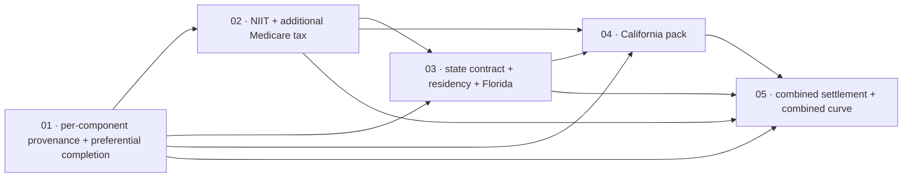

# Scopes Index — Federal Preferential Completion And State Income Tax (Slice 2)

Feature directory: `specs/022-federal-preferential-and-state-income-tax`
Repository: `research-lab`
Planning owner: `bubbles.plan`
Specification: [`spec.md`](../spec.md) · Design: [`design.md`](../design.md)
Predecessor: [`specs/021-lifetime-tax-strategy-lab`](../../021-lifetime-tax-strategy-lab/scopes/_index.md)

Both prerequisite artifacts exist and are authoritative. Every requirement
citation in the five scope files is a ratified `FR-022-*` or `NFR-022-*` number
from `spec.md`. There are no planning-owned anchors in this feature.

## The Slice

Feature 021 shipped a federal engine with the preferential rate table absent for
every filing status, no threshold surtaxes and no jurisdiction axis. This slice
closes the preferential gap through a per-component provenance model, adds the two
federal threshold surtaxes, opens the jurisdiction axis with a generic state pack
contract, ships two deliberately maximally different state packs, and settles both
jurisdictions into a combined result with a combined marginal rate curve.

Fifteen scenarios `SCN-022-001` … `SCN-022-015`, three per scope, each owned by
exactly one scope.

## Hard Prohibitions Carried Into Every Scope

Each scope repeats the ones it could plausibly violate; all are listed here so no
scope can be read in isolation and miss one.

1. **Sourcing is absolute.** Every rate, bracket, threshold, deduction, credit and
   exemption is transcribed from a primary source actually retrieved by the
   implementer, cited inline with title, URL and `retrievedAt`, and located to a
   section. No figure comes from memory, a secondary site, interpolation,
   derivation, or another tax year. Whatever a retrieval genuinely fails to
   establish becomes an `AbsentFigure/v1`. That discipline is never weakened to
   improve coverage.
2. **Feature 008 is untouchable.** `rlportfolio.js`, `rlportfolioanalytics.js`,
   `portfolio-survival-allocation.config.json` and everything under
   `specs/008-portfolio-survival-and-brief-lab/` remain byte-identical.
3. **No registration.** `tools.json`, `index.html`, `rlnav.js`, `README.md`,
   `notes/README.md` and market-brief coverage are excluded from every scope.
   Registration is Feature 026.
4. **No new root HTML.** This feature extends `lifetime-tax-strategy-lab.html`.
   `site-exclusions.json` is unchanged and a check asserts it. Had a new root page
   been created it would have required a `site-exclusions.json` entry in the same
   scope, or `scripts/build-pages-site.mjs` refuses it and the Pages deploy breaks.
5. **No published error rate**, self-invalidation statistic, track record or
   accuracy figure in any spec text, scope text or user-facing copy.
6. **No plan success probability**, no market simulation, no lifetime projection,
   no break-even year, no ranking, no recommendation.
7. **No brief or data-plane contact.** `briefs/`, `data/`, `market-brief.*` and
   every scheduled-publication artifact are excluded from every scope.
8. **`scripts/selftest.mjs` assertions are never weakened, and are superseded only
   under the ledger.** New groups are appended. No existing assertion is edited,
   relaxed or deleted to make anything pass, and the pre-existing pass count must
   not fall. Exactly twenty-one assertions — eleven in `scripts/selftest.mjs` and ten
   across four of Feature 021's five Playwright specs — pin behaviour this feature
   deliberately changes. Each is named in `spec.md`'s
   [Assertion Supersession Contract](../spec.md#assertion-supersession-contract),
   is owned by exactly one scope, and may be replaced only by the stronger
   assertion that entry names, in the same change, with its adversarial case and
   its `SUP-022-NN` marker. See
   [Assertion Supersession Procedure](#assertion-supersession-procedure) below.
   An assertion outside those twenty-one that fails is a defect in the change. The
   [assertions considered and not superseded](../spec.md#assertions-considered-and-not-superseded)
   table records the literals the planning sweep examined and cleared, so a scope
   can tell a cleared assertion from an unexamined one before it stops.
9. **The refusal enum is extended additively only.** Two new members, each for a
   genuinely new condition. No existing member's meaning changes.
10. **No engine names a jurisdiction.** No module carries a bracket, rate, edge,
    threshold, state name, year or authority name. A scan asserts it and is
    demonstrated to fail on a module that does.
11. **Local-only.** Zero network requests at runtime including pack loading. No
    household value — including the residency state and both new basis
    declarations — in any URL, query string, hash, request, referrer, console
    message or committed artifact.

## Assertion Supersession Procedure

Feature 021 is green, and part of what its suite pins is the **absence** of the
federal preferential rate tables. Scope 01 exists to remove that absence, so a
literal reading of prohibition 8 forbids the work this feature was approved to do.
`spec.md`'s [Assertion Supersession Contract](../spec.md#assertion-supersession-contract)
resolves that, and `design.md`'s
[Assertion Supersession Mechanics](../design.md#assertion-supersession-mechanics)
fix the construction. This section is the per-scope operating procedure.

### Ownership

| Scope | Owns | Amends |
| --- | --- | --- |
| 01 | SUP-022-01, -02, -04, -05, -06, -07, -09, -11, -12, -13, -17, -21 (twelve) | — |
| 02 | SUP-022-03, -08, -10, -14, -15, -16, -18, -19, -20 (nine) | SUP-022-04, SUP-022-09 |
| 03 | none | — |
| 04 | none | — |
| 05 | none | — |

Twelve plus nine is twenty-one, which must equal the row count of the
[supersession ledger](../spec.md#supersession-ledger), the total its opening
paragraph states, and step 4 of `design.md`'s
[marker check](../design.md#the-marker-check). A disagreement between the four is
a planning defect and stops the scope that finds it.

Which file each marker lands in is fixed by the
[per-file marker distribution](../design.md#per-file-marker-distribution), and
every scope's Change Boundary is derived from it: a scope may open a Feature 021
test file only if that table places one of its owned markers there, and a file
that carries no marker owned by a scope stays in that scope's excluded list.

Scopes 04 and 05 supersede nothing, and Scope 03 owns exactly one entry,
SUP-022-22. Each states its position explicitly in its own Definition of Done,
because "this scope changed no pre-existing assertion" is an auditable claim and
silence is not. Scope 03 and Scope 05 both add a Simple field without that
becoming a supersession, because the expected Simple values are derived from the
page rather than pinned to a length. The derivation they rely on is **not** this
feature's: SUP-022-18's and SUP-022-19's count clauses were displaced first by
Feature 023 under `SUP-023-04`, `SUP-023-05` and `SUP-023-06`, and SUP-022-18 is
recorded superseded-in-substance in
[Scope 02's ledger disposition](02-net-investment-income-and-additional-medicare-tax/scope.md#assertion-supersession-owned-by-this-scope).
What SUP-022-19 still owns is the narrowed clause — selecting a withheld-detail
link by its declared target rather than by ordinal — which changes no length
either way.

### Per-scope steps

1. Before writing an implementation line, read the ledger entries this scope owns.
   Confirm each names a requirement in this scope's requirement coverage.
2. Write the replacement **first**, with its marker, and run the exact command.
   The replacement must fail against the unchanged implementation — that is the
   intended RED for the supersession. A replacement that passes before the
   behaviour changed is not asserting the new behaviour.
3. Implement the behaviour change. Rerun the identical command.
4. Run the adversarial cases the entry names and record that each was seen to
   fail before it was seen to pass.
5. Record in `report.md`, per entry: the superseded clause verbatim, the
   replacement, the shape, the intended-RED output, the green output, and the
   adversarial evidence.

### Stop conditions

A scope stops and returns the finding to planning when any of these holds.

- An assertion fails that the ledger does not name. It is a defect in the change,
  never an unrecorded supersession.
- A ledger entry's replacement cannot be made at least as strong as what it
  supersedes.
- A replacement cannot be expressed in one of the four shapes in `design.md`.
- The pre-existing pass count would fall.
- A Feature 021 test file needs editing that this scope's Change Boundary does not
  name individually.

### What no scope may do under this procedure

Relax a sourcing rule, loosen a tolerance, widen a range, convert an equality to
an inequality, delete an adversarial case, delete a determinism, privacy,
zero-network or Feature 008 byte-identity assertion, rename a persistent test
title, or change a `--grep` selector. None of those pins behaviour any scope of
this feature changes, so none is ever eligible.

---

## Repo Conventions Every Scope Inherits

- Single-file, build-free HTML tool. No bundler, no build step, works from
  `file://`.
- Shared JS is UMD — a global attach plus `module.exports` guarded by
  `typeof module !== 'undefined'` — never ESM in a runtime module.
- Every pure analytic function is a top-level `function name(...) {}` declaration,
  because `scripts/selftest.mjs` extracts by balancing braces from a function
  signature. A module-level arrow constant is unreachable to the harness.
- Null-safe numerics use `Number.isFinite(x)`. Global `isFinite` is forbidden.
- No `requestAnimationFrame` wrapper around canvas drawing.
- Every page carries the repository's single standard Content-Security-Policy
  meta; a selftest asserts one identical policy across all pages.
- Every displayed value carries a contextual tooltip. Every chart carries a
  text-equivalent table with an accessible label.
- `node scripts/selftest.mjs` stays green at the end of every scope.
- Playwright specs are `*.spec.mjs` and run with `--project=system-chrome`. The
  bundled chromium binary is **not** installed on this machine, so no row may name
  another project.
- Test files are named without a repository-relative path on purpose:
  `scripts/validate-spec-test-paths.mjs` is a ratchet that fails on a new
  spec-referenced `tests/…​.mjs` path that does not exist on disk, and its baseline
  must shrink rather than grow. Browser rows therefore select by `--grep` on the
  persistent title rather than by file argument.

---

## Execution Outline

### Phase Order

1. **01 Federal Preferential Rate Completion** introduces per-component
   provenance — `ComponentSource/v1` and `RateTable/v2` — and uses it to carry the
   federal preferential rate table, whose breakpoints and top-band rate come from
   two different primary authorities. A household with a long-term gain or a
   qualified dividend stops receiving a refusal and starts receiving a total.
2. **02 Net Investment Income And Additional Medicare Tax** adds
   `ThresholdSet/v1`, the pack-declared `taxLegs[]` set, stages `CO-11` and
   `CO-12`, and the two new workspace basis declarations. It makes visible that
   added ordinary income can move one surtax and cannot move the other.
3. **03 State Rule-Pack Contract, Jurisdiction Resolution, And Florida** opens the
   jurisdiction axis, adds residency declaration and its two refusals, adds
   `SourcedZero/v1`, and ships the Florida pack — the cheapest possible proof that
   the contract handles a regime with no individual income tax at all.
4. **04 California Pack** ships the hard case: many brackets, capital gains taxed
   as ordinary income, its own standard deduction, exemption relief applied as a
   credit after the rate, and a surcharge whose threshold does not vary by filing
   status.
5. **05 Combined Federal And State Settlement And Combined Marginal Curve**
   pairs the two independent settlements, proves the pairing is order-independent
   by adversarial mutation, and delivers one curve whose every step is attributed
   to a named threshold in a named jurisdiction.

Each scope delivers one user-visible outcome across contract, engine and route in
the same slice. No scope is a layer.

### New Types And Signatures

Contracts:

- `ComponentSource/v1` — `{ component, sourceRef, locator }`. Binds one named
  component of one figure to one retrieved authority.
- `RateTable/v2` — `RateTable/v1` plus `componentSources[]`. `v1` stays valid.
- `ThresholdSet/v1` — `{ rate, varyByFilingStatus, thresholds, indexing,
  appliesTo, basisMember, capMember }` plus citations.
- `TaxLeg/v1` — `{ legId, stageId, figureRef, includedInTotal }`.
- `ReliefMechanism/v1` — `{ kind, applicationPoint, varyByFilingStatus, amounts,
  appliesToLegs }` plus citations.
- `SourcedZero/v1` — `{ value: 0, ruleStatus, domain, reason, sourceRef, locator }`.
- `TaxRulePack/v2` — `v1` plus `imposesIndividualIncomeTax`, `noTaxAuthority`,
  `preferentialPolicy`, `taxLegs[]`, `thresholdSets`, `reliefMechanisms[]`.
- `TaxWorkspace/v2` — `v1` plus `residencyJurisdiction`, `residencyPattern`,
  `investmentIncomeBasis`, `wageBasis`.
- `StateSettlement/v1`, `CombinedSettlement/v1`, `CombinedMarginalCurve/v1`.

Modules:

- `rltaxrules.js` extended — `effectiveSourceFor`, `validateComponentSources`,
  `validateThresholdSet`, `validateTaxLegs`, `validateReliefMechanisms`,
  `sourcedZero`, widened jurisdiction grammar, two new `RLTAX_CODES` members.
- `rltax.js` extended — `computeNetInvestmentIncomeTax`,
  `computeAdditionalMedicareTax`, `applyReliefMechanisms`,
  `computeSurchargeLeg`, leg-set summation in `CO-8`, reconciliation legs `L6`
  and `L7`.
- `rltaxstate.js` new — `residencyPattern`, `resolveStatePack`,
  `computeAnnualStateTax`, `stateMarginalContext`.
- `rltaxcombined.js` new — `assertPackYearAgreement`, `combineSettlements`,
  `computeCombinedMarginalCurve`, `combinedCurveTextRows`.

Data:

- `tax-rules/federal/<year>.json` — version bump, preferential tables promoted to
  `RateTable/v2`, two surtax threshold sets, declared leg set.
- `tax-rules/state/FL/<year>.json` — a pack that imposes no individual income tax.
- `tax-rules/state/CA/<year>.json` — the hard case.

Refusal codes added: `RLTAX-RESIDENCY-UNSUPPORTED`, `RLTAX-PACK-YEAR-MISMATCH`.

### Validation Checkpoints

- Every scope opens with a named intended-RED assertion and closes with the
  identical command green. RED is valid only when the intended contract assertion
  fails; a syntax error, a missing browser or an absent test does not satisfy RED.
- `node scripts/selftest.mjs` runs at the end of every scope and must stay green
  with no fall in the pre-existing pass count. New groups are appended. The only
  assertions that may change are the twenty-one the supersession ledger names, each
  replaced by the stronger assertion that entry specifies.
- The supersession marker check runs at the end of every scope: the distinct
  `SUP-022-NN` markers present in the repository must equal the ledger entries the
  completed scopes own, and no assertion may change without one.
- `node scripts/validate-spec-test-paths.mjs` runs at the end of every scope and
  must report zero new missing paths.
- `node scripts/build-pages-site.mjs --dry-run` runs at the end of every scope and
  must succeed, proving no new root HTML entered without a deploy decision and
  that `site-exclusions.json` remains correct.
- Scope 01 is `foundation:true`. Scopes 02 through 05 may not start until 01 is
  Done and its three boundary canaries pass: the Feature 008 byte-identity canary,
  the Feature 021 non-regression canary, and the zero-network canary.
- Scope 03 additionally gates Scope 04: California may not be written until the
  contract has been proven against Florida, so that California cannot silently
  become the definition of the contract.
- Browser rows run against the real route through the Playwright `system-chrome`
  project with no request interception, no service worker and no external
  provider.
- Scope 05 runs the cumulative browser suite plus the request-ledger privacy
  assertion before it is accepted, and explicitly asserts the tool is still absent
  from every registry.

---

## Scope Ordering Rationale

**The provenance model lands first because every later figure needs it.** Scope 01
is not "the preferential table"; it is the contract that lets any figure cite two
authorities. California's surcharge rate and its indexed schedule will need it,
and so will Feature 023's Medicare bands. Building the state packs first would
mean building them against a provenance model already known to be insufficient,
then migrating them.

**The surtaxes are second because they generalize the pack's leg set.** `CO-8` in
Feature 021 sums two hardcoded legs. Both surtaxes and California's surcharge are
additional legs, so the leg set must be pack-declared before a third jurisdiction
tries to add one. Doing this in Scope 02 against the federal pack means the
generalization is proven against a pack whose behaviour is already known before
any state pack depends on it.

**The generic contract and Florida are third, together.** A contract validated
only by the pack it was shaped around is not validated. Florida is small, its
regime is genuinely different, and it exercises the sourced-zero path that no
other pack in this feature touches. Shipping it beside the contract means the
contract survives a second regime **before** California is written.

**California is fourth because it is the stress case, not the definition.** By the
time it is written the contract has already been proven against a no-tax regime,
so any place California does not fit is a real finding about the contract rather
than a place to widen it toward California.

**The combined settlement is last because it composes two things that must
already be correct.** A combined total built before either half is trustworthy
would hide which half is wrong, and the order-independence assertion is only
meaningful once both settlements exist independently.

## Scope Inventory

| # | Scope | Artifact | Tags | Depends On | Scenarios | Status |
| --- | --- | --- | --- | --- | --- | --- |
| 01 | Federal Preferential Rate Completion | [`01-federal-preferential-rate-completion/scope.md`](01-federal-preferential-rate-completion/scope.md) | `foundation:true`, `provenance-critical:true`, `sourcing-gated:true` | none | SCN-022-001 … -003 | In Progress |
| 02 | Net Investment Income And Additional Medicare Tax | [`02-net-investment-income-and-additional-medicare-tax/scope.md`](02-net-investment-income-and-additional-medicare-tax/scope.md) | `engine:federal`, `sourcing-gated:true` | 01 | SCN-022-004 … -006 | In Progress |
| 03 | State Rule-Pack Contract, Jurisdiction Resolution, And Florida | [`03-state-rule-pack-contract-and-jurisdiction-resolution/scope.md`](03-state-rule-pack-contract-and-jurisdiction-resolution/scope.md) | `capability:jurisdiction-axis`, `sourced-zero:true` | 01, 02 | SCN-022-007 … -009 | In Progress |
| 04 | California Pack | [`04-california-pack/scope.md`](04-california-pack/scope.md) | `pack:state`, `sourcing-gated:true`, `stress-case:true` | 01, 02, 03 | SCN-022-010 … -012 | In Progress |
| 05 | Combined Settlement And Combined Marginal Curve | [`05-combined-settlement-and-marginal-curve/scope.md`](05-combined-settlement-and-marginal-curve/scope.md) | `route:integrated`, `adversarial-ordering:true`, `no-registration:true` | 01, 02, 03, 04 | SCN-022-013 … -015 | In Progress |

## Dependency Graph

| ## | Scope Directory | Depends On | Unblocks | Why the edge exists |
| --- | --- | --- | --- | --- |
| 01 | `01-federal-preferential-rate-completion` | none | 02, 03, 04, 05 | Owns `ComponentSource/v1` and `RateTable/v2`. Every figure in every later pack cites through this model. |
| 02 | `02-net-investment-income-and-additional-medicare-tax` | 01 | 03, 04, 05 | Owns `ThresholdSet/v1`, `TaxLeg/v1` and the pack-declared leg set. California's surcharge is a `ThresholdSet` leg and cannot be written before the shape exists. |
| 03 | `03-state-rule-pack-contract-and-jurisdiction-resolution` | 01, 02 | 04, 05 | Owns the jurisdiction axis, residency resolution, `SourcedZero/v1` and `StateSettlement/v1`. Proven against Florida so California cannot define the contract. |
| 04 | `04-california-pack` | 01, 02, 03 | 05 | Consumes the contract from 03, the leg and threshold shapes from 02, and the provenance model from 01. Adds no contract of its own. |
| 05 | `05-combined-settlement-and-marginal-curve` | 01, 02, 03, 04 | none | Pairs two settlements that must already be independently correct, and sweeps a curve over both. |

## Scenario Distribution

Every scenario has exactly one owning scope.

| Scope | Count | Scenario IDs |
| --- | --- | --- |
| 01 | 3 | SCN-022-001, SCN-022-002, SCN-022-003 |
| 02 | 3 | SCN-022-004, SCN-022-005, SCN-022-006 |
| 03 | 3 | SCN-022-007, SCN-022-008, SCN-022-009 |
| 04 | 3 | SCN-022-010, SCN-022-011, SCN-022-012 |
| 05 | 3 | SCN-022-013, SCN-022-014, SCN-022-015 |
| **Total** | **15** | SCN-022-001 … SCN-022-015 |

## Requirement Distribution

| Scope | Requirements |
| --- | --- |
| 01 | FR-022-001 … FR-022-007 |
| 02 | FR-022-008 … FR-022-014 |
| 03 | FR-022-015 … FR-022-021 |
| 04 | FR-022-022 … FR-022-027 |
| 05 | FR-022-028 … FR-022-034 |
| Every scope | NFR-022-001 … NFR-022-010 |

## Blocking Implementation Inputs By Scope

Every one of these must be closed by a retrieval performed at implementation
time. None may be closed by derivation, recall or a secondary source. An input
that cannot be retrieved ships as an `AbsentFigure/v1` and its dependent leg
refuses.

| Scope | Inputs | Consequence if a retrieval fails |
| --- | --- | --- |
| 01 | `BI-1` preferential breakpoints, `BI-3` unsupported preferential categories | The affected status's preferential table stays absent; the federal total continues to refuse for households with preferential income in that status |
| 02 | `BI-4` surtax threshold applicability to the declared tax year | The affected `ThresholdSet` is absent and its leg refuses; `CO-8` inherits |
| 03 | `BI-5` Florida imposes no individual income tax | `imposesIndividualIncomeTax` is absent, Florida resolves `RLTAX-THRESHOLD-UNAVAILABLE`, and the sourced-zero path is proven by a fixture pack instead of by the shipped one |
| 04 | `BI-6` every California dollar figure, `BI-7` the California calculation order | Each unretrieved figure is absent and its leg refuses; an unestablished calculation order refuses the whole pack |
| 05 | none of its own | Inherits every upstream refusal and must present it rather than settling around it |

Scope 03's failure mode deserves naming: if `BI-5` fails, the shipped Florida pack
cannot prove the sourced-zero path, and the scope must prove it with a fixture
pack that cannot resolve for any real jurisdiction or year — the same technique
Feature 021 used to test stacking against an absent table. The scope is not
allowed to assert Florida's zero without the retrieval.

## Deferral Register

Carried from [`spec.md`](../spec.md), which is authoritative. Feature 021's
register said "a later feature" for everything; this feature names the successors:
Feature 023 for Social Security, Medicare, IRMAA and the premium tax credit;
Feature 024 for additional states, local tax, property tax, non-standard residency
and the state-and-local deduction coupling; Feature 025 for the multi-year ledger,
required distributions and any market simulation; Feature 026 for registration and
for adding `tax-rules/` to the Pages allowlist.
