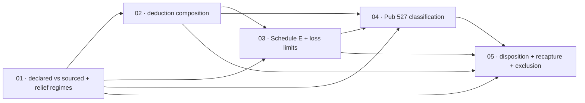

# Scopes Index — Property Tax And Rental Income (Slice 3)

Feature directory: `specs/023-property-tax-and-rental-income`
Repository: `research-lab`
Planning owner: `bubbles.plan`
Specification: [`spec.md`](../spec.md) · Design: [`design.md`](../design.md)
Predecessor: [`specs/022-federal-preferential-and-state-income-tax`](../../022-federal-preferential-and-state-income-tax/scopes/_index.md)

Both prerequisite artifacts exist and are authoritative. Every requirement
citation in the five scope files is a ratified `FR-023-*` or `NFR-023-*` number
from `spec.md`. There are no planning-owned anchors in this feature.

## The Slice

Feature 022 can settle income tax across two jurisdictions and knows nothing about
what a household owns. This slice opens the housing axis: property tax from
declared local facts under a sourced statutory relief regime, the capped deduction
competition that decides itemizing, a long-term rental after depreciation and loss
limits, the Publication 527 classification that decides which arithmetic a
vacation property gets, and a disposition including the recapture component that
is usually omitted.

Fifteen scenarios `SCN-023-001` … `SCN-023-015`, three per scope, each owned by
exactly one scope.

## Hard Prohibitions Carried Into Every Scope

1. **Sourcing is absolute.** Every rate, threshold, cap, limit, recovery period,
   convention, day figure and exclusion amount is transcribed from a primary
   source actually retrieved by the implementer, cited inline with title, URL and
   `retrievedAt`, and located to a section. No figure comes from memory, a
   secondary site, interpolation, derivation, or another tax year. Whatever a
   retrieval fails to establish becomes an `AbsentFigure/v1` and its leg refuses.
2. **Declared is not sourced.** A household declaration carries no `sourceRef`, is
   labelled as the household's own input, and refuses `RLTAX-INPUT-INCOMPLETE`
   when missing. A sourced rule refuses `RLTAX-THRESHOLD-UNAVAILABLE`. The two are
   never rendered the same way.
3. **Unavailable is never a zero.** Not `0`, not `null`, not a missing key, not a
   dropped leg. `SourcedZero/v1` remains distinct from every unavailable shape.
4. **Every computed leg is surfaced.** Headline, comparison, marginal curve and
   export. Proven by a set identity in both directions against a fixture in which
   every leg is non-zero and mutually distinct.
5. **The refusal vocabulary is not extended.** Every condition folds into an
   existing member, and a DoD item asserts the member count is unchanged.
6. **Feature 008 is untouchable.** `rlportfolio.js`, `rlportfolioanalytics.js`,
   `portfolio-survival-allocation.config.json` and everything under
   `specs/008-portfolio-survival-and-brief-lab/` remain byte-identical.
7. **No registration.** `tools.json`, `index.html`, `rlnav.js`, `README.md`,
   `notes/README.md` and market-brief coverage are excluded from every scope.
   Registration is Feature 026. Any new root HTML requires a `site-exclusions.json`
   entry in the same scope that creates it, or
   `node scripts/build-pages-site.mjs --dry-run` refuses and the Pages deploy
   breaks.
8. **No brief or data-plane contact.** `briefs/`, `data/`, `market-brief.*` and
   every scheduled-publication artifact are excluded from every scope.
9. **No probability**, no market simulation, no lifetime projection, no
   appreciation assumption, no break-even year, no ranking, no recommendation.
10. **No published error rate**, self-invalidation statistic, track record or
    accuracy figure in any spec text, scope text or user-facing copy.
11. **No module names a jurisdiction, a regime or a figure.** No bracket, rate,
    cap, ceiling, recovery period, convention, day figure, state name, county name
    or authority name in any module. A scan asserts it and is demonstrated to fail
    on a module that does.
12. **Local-only.** Zero network requests at runtime including regime pack
    loading. No household value — including assessed value, acquisition value,
    rental days, personal-use days, basis and proceeds — in any URL, query string,
    hash, request, referrer, console message or committed artifact.
13. **`scripts/selftest.mjs` assertions are never weakened, and are superseded
    only under the ledger.** New groups are appended. The pre-existing pass count
    must not fall.

## Assertion Supersession Procedure

`spec.md`'s [Assertion Supersession Contract](../spec.md#assertion-supersession-contract)
governs. `design.md`'s [mechanics](../design.md#assertion-supersession-mechanics)
fix the construction. This section is the per-scope operating procedure.

### Ownership

| Scope | Owns | Count |
| --- | --- | --- |
| 01 | SUP-023-05, SUP-023-06, SUP-023-07, SUP-023-08, SUP-023-10 | 5 |
| 02 | SUP-023-01, SUP-023-02, SUP-023-03, SUP-023-04, SUP-023-11 | 5 |
| 03 | SUP-023-12 | 1 |
| 04 | SUP-023-13, SUP-023-14 | 2 |
| 05 | SUP-023-09 | 1 |

Five plus five plus one plus two plus one is fourteen, which must equal the row
count of the
[supersession ledger](../spec.md#supersession-ledger), the total its opening
paragraph states, and step 4 of `design.md`'s
[marker check](../design.md#the-marker-check). A disagreement between the four is
a planning defect and stops the scope that finds it — **except** where ASC-8
admitted an entry in flight, in which case all four are updated in the same
change and no stop occurs. SUP-023-12, SUP-023-13 and SUP-023-14 are such
entries, admitted during Scope 03's and Scope 04's implementations and booked
across all four surfaces in the same change.

### Per-scope steps

1. Before writing an implementation line, read the ledger entries this scope owns
   and confirm each names a requirement in this scope's requirement coverage.
2. Re-resolve each target's line number against the current tree. Feature 022
   lands between this plan and this implementation and will move them. A target
   whose clause no longer exists in any form stops the scope; a target that moved
   is simply re-located.
3. Write the replacement **first**, with its marker, and run the exact command.
   The replacement must fail against the unchanged implementation.
4. Implement the behaviour change. Rerun the identical command.
5. Run the adversarial cases the entry names and record that each was seen to fail
   before it was seen to pass.
6. Record in `report.md`, per entry: the superseded clause verbatim, the
   replacement, the shape, the intended-RED output, the green output, and the
   adversarial evidence.

### ASC-8 in-flight admission

If a pre-existing assertion fails for an ASC-1 cause that is not already in the
ledger, the implementer appends a row to the ledger with the next free
`SUP-023-NN`, updates the ownership table above and the per-file marker
distribution in `design.md`, and proceeds under ASC-2 through ASC-7. No planning
round trip is required and none may be requested. What is forbidden is editing the
assertion without an entry, or leaving the entry unrecorded until the end of the
scope.

### What no scope may do under this procedure

- Relax a sourcing rule, a tolerance, an equality or a numeric range.
- Delete an adversarial case, a determinism assertion, a privacy assertion, a
  zero-network assertion, or a Feature 008 canary.
- Remove a Playwright test, rename a persistent title, or change a `--grep`
  selector.
- Open a prior-feature test file that the per-file marker distribution does not
  place one of its owned markers in.

## Repo Conventions Every Scope Inherits

- Modules are UMD, browser and Node compatible, and work from `file://`.
- Packs are JSON under `tax-rules/`, loaded locally, never fetched.
- Selftest groups are appended with a `lifetime-tax — <topic>` label.
- Playwright rows run through the `system-chrome` project with a persistent title.
- Evidence anchors are `report.md#tp-NN-MM` within the owning scope directory.

## Execution Outline

### Phase Order

1. **01 Property Assessment Mechanics And The Two Relief Regimes** introduces the
   declared-versus-sourced split, the regime contract, the cap-basis axis and the
   property-tax leg.
2. **02 Primary Residence Federal Interaction** converts the itemized deduction
   into a composition, applies the sourced cap, computes the disallowed amounts,
   and recomputes the itemized-versus-standard decision.
3. **03 Long-Term Rental** adds Schedule E, sourced cost recovery, the at-risk and
   passive-activity limits in a proven order, and the declared-year suspended-loss
   figures.
4. **04 Short-Term And Vacation Rental** adds the published Publication 527
   classification, the fewer-than-15-days exception and the day-based allocation.
5. **05 Disposition** splits the gain, prices the recapture component at its own
   sourced maximum rate, and applies the primary-residence exclusion.

Each scope delivers one user-visible outcome across contract, engine and route in
the same slice. No scope is a layer.

### New Types And Signatures

Contracts:

- `PropertyAssessment/v1` — declared members only, no `sourceRef`.
- `PropertyReliefRegime/v1` — sourced members only, with `assessmentCap.capBasis`
  from the closed set `prior-assessed-value` · `acquisition-value`.
- `DeductionComponent/v1` — `{ componentId, label, amount, origin, cappedWith[],
  allowedAmount, disallowedAmount }`.
- `ItemizedComposition/v1` — components, cap, cap binding, both totals, the chosen
  side and its reason.
- `UseClassification/v1` — category, both day counts, sourced test parameters, and
  the comparisons actually performed.
- `CostRecovery/v1` — declared basis and month, sourced recovery period and
  convention.
- `LossLimitation/v1` — `appliedOrder`, before, allowed, disallowed, disposition.
- `Disposition/v1` and `GainComponent/v1` — components with `pricingRule` of
  `own-maximum-rate` or `preferential-stacking`.

Modules:

- `rltaxproperty.js` new — `resolvePropertyRegime`, `computePropertyTax`,
  `propertyMarginalContext`.
- `rltaxuse.js` new — `classifyDwellingUse`, `allocateByUseDays`.
- `rltaxrental.js` new — `computeRentalSettlement`, `applyAtRiskLimit`,
  `applyPassiveActivityLimit`.
- `rltaxdisposition.js` new — `computeDisposition`, `applyResidenceExclusion`.
- `rltax.js` extended — stages `CO-15` … `CO-19`, `composeItemizedDeduction`,
  reconciliation legs `L8` … `L11`.
- `rltaxrules.js` extended — the six new contracts and their validators.
- `rltaxworkspace.js` extended — property, rental, use and disposition
  declarations plus their privacy surface.

Data:

- `tax-rules/property/FL/<year>.json`, `tax-rules/property/CA/<year>.json`, plus
  fixture regimes exercising both cap bases independently of any real jurisdiction.
- `tax-rules/federal/<year>.json` — the deduction cap, the mortgage debt limit, the
  recovery period and convention, the loss-limit parameters, the classification
  parameters, the exclusion amounts and the recapture maximum rate.

Refusal codes added: **none.**

### Validation Checkpoints

- Every scope opens with a named intended-RED assertion and closes with the
  identical command green. RED is valid only when the intended contract assertion
  fails; a syntax error, a missing browser or an absent test does not satisfy RED.
- `node scripts/selftest.mjs` runs at the end of every scope and must stay green
  with no fall in the pre-existing pass count.
- The `SUP-023-NN` marker check runs at the end of every scope.
- `node scripts/validate-spec-test-paths.mjs` runs at the end of every scope and
  must report zero new missing paths.
- `node scripts/build-pages-site.mjs --dry-run` runs at the end of every scope.
- The refusal-vocabulary member count is asserted unchanged at the end of every
  scope.
- The leg-visibility set identity runs at the end of every scope that added a leg,
  against the all-non-zero fixture.
- Scope 01 is `foundation:true`. Scopes 02 through 05 may not start until 01 is
  Done and its three boundary canaries pass: the Feature 008 byte-identity canary,
  the Feature 021 and 022 non-regression canary, and the zero-network canary.
- Scope 04 gates nothing in Scope 03, but Scope 03 gates Scope 04: the Schedule E
  settlement must exist before a classification can route to it.

---

## Scope Ordering Rationale

**The declared-versus-sourced split lands first because it is the feature's whole
epistemology.** Every later scope produces figures that are one or the other, and
a scope that shipped before the split existed would have to be migrated onto it.
Scope 01 also introduces the first leg, which forces the leg-visibility machinery
into existence before four more legs arrive.

**The deduction composition is second because it is the highest-risk conversion
and everything downstream reads through it.** Converting a declared lump sum into
a composed record touches the assertion most other assertions depend on. Doing it
immediately after the foundation means Scopes 03, 04 and 05 build on the composed
shape rather than migrating to it, and the personal portion of an allocated
expense in Scope 04 has a component to land in.

**The long-term rental is third because it is the simple case of a hard family.**
Schedule E, cost recovery and the limit ladder are needed by both rental
categories. Building them against the unambiguous category first means Scope 04
adds a classification to a settlement that already works, rather than building
both at once and being unable to tell which is wrong.

**The classification is fourth because it selects among settlements that must
already exist.** A classification that routes to an unbuilt path proves nothing.
By Scope 04 the Schedule E path is proven and the exception path is a genuine
alternative rather than the only path.

**The disposition is last because it composes the most.** It needs the basis the
rental scope's cost recovery adjusts, the preferential model Feature 022 shipped,
and the leg-visibility machinery Scope 01 built. It is also the scope that removes
a Feature 022 deferral, which is only safe once that deferral's neighbours are
proven still refused.

## Scope Inventory

| # | Scope | Artifact | Tags | Depends On | Scenarios | Status |
| --- | --- | --- | --- | --- | --- | --- |
| 01 | Property Assessment Mechanics And Statutory Relief Regimes | [`01-property-assessment-mechanics/scope.md`](01-property-assessment-mechanics/scope.md) | `foundation:true`, `declared-vs-sourced:true`, `sourcing-gated:true` | none | SCN-023-001 … -003 | In Progress |
| 02 | Primary Residence Federal Interaction | [`02-primary-residence-federal-interaction/scope.md`](02-primary-residence-federal-interaction/scope.md) | `engine:federal`, `supersession-heavy:true`, `sourcing-gated:true` | 01 | SCN-023-004 … -006 | In Progress |
| 03 | Long-Term Rental | [`03-long-term-rental/scope.md`](03-long-term-rental/scope.md) | `engine:rental`, `loss-limits:true`, `sourcing-gated:true` | 01, 02 | SCN-023-007 … -009 | In Progress |
| 04 | Short-Term And Vacation Rental | [`04-short-term-and-vacation-rental/scope.md`](04-short-term-and-vacation-rental/scope.md) | `classification:pub-527`, `boundary-adversarial:true`, `sourcing-gated:true` | 01, 02, 03 | SCN-023-010 … -013 | In Progress |
| 05 | Disposition | [`05-disposition/scope.md`](05-disposition/scope.md) | `engine:disposition`, `recapture:true`, `sourcing-gated:true` | 01, 02, 03, 04 | SCN-023-014 … -015 | In Progress |

## Dependency Graph

| # | Scope Directory | Depends On | Unblocks | Why the edge exists |
| --- | --- | --- | --- | --- |
| 01 | `01-property-assessment-mechanics` | none | 02, 03, 04, 05 | Owns the declared-versus-sourced split, the regime contract and the leg-visibility machinery every later leg is checked by. |
| 02 | `02-primary-residence-federal-interaction` | 01 | 03, 04, 05 | Owns `ItemizedComposition/v1`. Scope 04's personal expense portion needs a component to land in, and Scope 05's decision reads the composed total. |
| 03 | `03-long-term-rental` | 01, 02 | 04, 05 | Owns the Schedule E settlement, cost recovery and the limit ladder. Scope 04 routes to it; Scope 05 needs the basis its cost recovery adjusts. |
| 04 | `04-short-term-and-vacation-rental` | 01, 02, 03 | 05 | Owns the classification that selects among settlements Scope 03 built. |
| 05 | `05-disposition` | 01, 02, 03, 04 | none | Composes the adjusted basis, the preferential model and the leg-visibility machinery, and removes one Feature 022 deferral. |

## Scenario Distribution

Every scenario has exactly one owning scope.

| Scope | Count | Scenario IDs |
| --- | --- | --- |
| 01 | 3 | SCN-023-001, SCN-023-002, SCN-023-003 |
| 02 | 3 | SCN-023-004, SCN-023-005, SCN-023-006 |
| 03 | 3 | SCN-023-007, SCN-023-008, SCN-023-009 |
| 04 | 4 | SCN-023-010, SCN-023-011, SCN-023-012, SCN-023-013 |
| 05 | 2 | SCN-023-014, SCN-023-015 |
| **Total** | **15** | SCN-023-001 … SCN-023-015 |

Scope 04 carries four and Scope 05 carries two because the Publication 527
boundaries need their own scenario separate from the exception path and the
allocation path, while the disposition's two scenarios each cover a full
settlement rather than a single rule.

## Requirement Distribution

| Scope | Requirements |
| --- | --- |
| 01 | FR-023-001 … FR-023-007 |
| 02 | FR-023-008 … FR-023-014 |
| 03 | FR-023-015 … FR-023-021 |
| 04 | FR-023-022 … FR-023-028 |
| 05 | FR-023-029 … FR-023-035 |
| Every scope | NFR-023-001 … NFR-023-010 |

## Blocking Implementation Inputs By Scope

Every one of these must be closed by a retrieval performed at implementation time.
None may be closed by derivation, recall or a secondary source.

| Scope | Inputs | Consequence if a retrieval fails |
| --- | --- | --- |
| 01 | `BI-1` Florida homestead and Save Our Homes cap, `BI-2` California acquisition-value basis, cap and rate ceiling | The affected regime member ships absent, its settlement refuses `RLTAX-THRESHOLD-UNAVAILABLE`, and the relief path is proven by a fixture regime that cannot resolve for any real jurisdiction |
| 02 | `BI-3` deduction cap, `BI-4` mortgage acquisition-debt limit | The composition's cap or the interest component ships absent and the itemized total refuses; the standard deduction is not silently chosen |
| 03 | `BI-5` recovery period and convention, `BI-6` special allowance and phase-out, `BI-7` at-risk ordering | Depreciation or a limit refuses and the rental leg refuses; no default period, allowance or ordering is assumed |
| 04 | `BI-8` personal-use day figure, percentage figure and rental-days threshold | The classification refuses; no category is assigned and no rental figure is produced |
| 05 | `BI-9` exclusion amounts and period figures, `BI-10` recapture maximum rate | The exclusion or the recapture component refuses; the disposition does not price the whole gain under one rule |

## Deferral Register

| Deferred | Owner | How it is surfaced |
| --- | --- | --- |
| Multi-year depreciation and suspended-loss ledgers | Feature 025 | `unsupportedFeatures[]` entry with `RLTAX-SCOPE-DEFERRED` |
| Additional property regimes | Feature 024 | `RLTAX-JURISDICTION-UNSUPPORTED` naming the state |
| Local and municipal income tax inside the cap | Feature 024 | `unsupportedFeatures[]` entry |
| Like-kind exchanges, installment sales, involuntary conversions | Not scheduled | `unsupportedFeatures[]` entry |
| Reduced primary-residence exclusion | Not scheduled | `RLTAX-SCOPE-DEFERRED` |
| Commercial and non-residential rental | Not scheduled | `unsupportedFeatures[]` entry |
| Second and subsequent properties | Not scheduled | `RLTAX-SCOPE-DEFERRED` |
| Registration in the index, navigation and brief | Feature 026 | Asserted absent by every scope |
