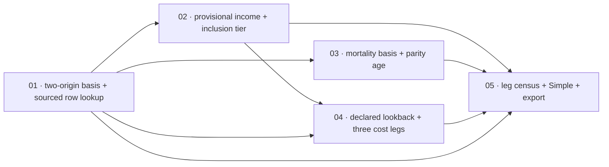

# Scopes Index — Social Security And Medicare (Slice 4)

Feature directory: `specs/024-social-security-and-medicare`
Repository: `research-lab`
Planning owner: `bubbles.plan`
Specification: [`spec.md`](../spec.md) · Design: [`design.md`](../design.md)
Predecessor: [`specs/023-property-tax-and-rental-income`](../../023-property-tax-and-rental-income/scopes/_index.md)

Both prerequisite artifacts exist and are authoritative. Every requirement
citation in the five scope files is a ratified `FR-024-*` or `NFR-024-*` number
from `spec.md`. There are no planning-owned anchors in this feature.

## The Slice

Feature 023 can settle income tax across two jurisdictions and price a house. It
knows nothing about the benefit coming in or the premium going out, and the
federal pack says so: `taxable-social-security-benefits` and `irmaa-bands` both
sit in its `unsupportedFeatures[]` ledger, both flagged as moving the marginal
rate. This slice removes both by modelling them — the benefit from either of the
two things a household actually has, the taxable portion as a published tier
decision, the claim-age question as arithmetic rather than a prediction, and the
Medicare cost from an income year the settlement is deliberately not settling.

Fifteen scenarios `SCN-024-001` … `SCN-024-015`, three per scope, each owned by
exactly one scope.

## Hard Prohibitions Carried Into Every Scope

1. **Sourcing is absolute.** Every rate, bend point, percentage, factor, age, base
   amount, life-expectancy figure, premium and bracket boundary is transcribed
   from a primary source actually retrieved by the implementer in the implementing
   session, cited inline with title, URL and `retrievedAt`, and located to a
   section, table, line or column. No figure comes from memory, a secondary site,
   interpolation, derivation, or another year. Whatever a retrieval fails to
   establish becomes an `AbsentFigure/v1` and its leg refuses.
2. **Edition year is judged per component kind, per publication.** A figure from an
   edition other than the declared tax year is carried only with a written
   `yearInvarianceBasis` quoting the publication's own dating contrast for that
   component kind. Category is not a basis. Plausibility is not a basis. A prior
   feature's finding about a different publication is not a basis. A retrieval can
   succeed and its basis still fail, and the correct outcome is a refusal on a
   figure the implementer is holding.
3. **Declared is not sourced.** A household declaration carries no `sourceRef`, is
   labelled as the household's own input, and refuses `RLTAX-INPUT-INCOMPLETE`
   when missing. A sourced rule refuses `RLTAX-THRESHOLD-UNAVAILABLE`. The two are
   never rendered the same way.
4. **Unavailable is never a zero.** Not `0`, not `null`, not a missing key, not a
   dropped leg. `SourcedZero/v1` remains distinct from every unavailable shape.
5. **Every computed leg is surfaced.** Headline, comparison, marginal curve and
   export. Proven by a set identity in both directions against a fixture in which
   every leg is non-zero and mutually distinct, reported by naming both the missing
   leg and the failing surface.
6. **A cost is surfaced and summed nowhere.** The three premium legs appear on all
   four surfaces and in no tax total. `includedInTotal: false` is a display
   mechanism and is never used to carry an absent figure past a refusal.
7. **The refusal vocabulary is not extended and no income kind is added.** Every
   condition folds into an existing member, and DoD items assert both counts are
   unchanged.
8. **No probability of any kind.** No plan success figure, no Monte Carlo, no
   market simulation, no appreciation assumption, no discount rate, no ranking, no
   recommendation, no future-year figure. The mortality source is used for its
   life-expectancy column alone and a pack offering a probability member is
   refused.
9. **Renaming to pass a detector is forbidden.** ASC-9 governs. A member, attribute
   or string in the neighbourhood of a forbidden token is either made a genuinely
   weaker claim than the one the detector forbids, or the detector is superseded
   under the ledger. A synonym that lets the same claim pass the same scan is a
   weakening and is not admissible.
10. **Feature 008 is untouchable.** `rlportfolio.js`, `rlportfolioanalytics.js`,
    `portfolio-survival-allocation.config.json` and everything under
    `specs/008-portfolio-survival-and-brief-lab/` remain byte-identical.
11. **No registration.** `tools.json`, `index.html`, `rlnav.js`, `README.md`,
    `notes/README.md` and market-brief coverage are excluded from every scope.
    Registration is Feature 026. Any new root HTML requires a
    `site-exclusions.json` entry in the same scope that creates it, or
    `node scripts/build-pages-site.mjs --dry-run` refuses and the Pages deploy
    breaks.
12. **No brief or data-plane contact.** `briefs/`, `data/`, `market-brief.*` and
    every scheduled-publication artifact are excluded from every scope.
13. **No published error rate**, self-invalidation statistic, track record or
    accuracy figure in any spec text, scope text or user-facing copy.
14. **No module names a figure or an authority.** No bend point, percentage,
    factor, age, base amount, premium, bracket boundary, life-expectancy figure,
    agency name or publication name in any module. A scan asserts it and is
    demonstrated to fail on a module that does.
15. **Local-only.** Zero network requests at runtime including benefit, mortality
    and medicare pack loading. No household value — including the earnings record,
    the birth year, the claim age and the lookback modified adjusted gross income
    — in any URL, query string, hash, request, referrer, console message or
    committed artifact.
16. **`scripts/selftest.mjs` assertions are never weakened, and are superseded only
    under the ledger.** New groups are appended. The pre-existing pass count must
    not fall.

## Honesty Rules Every Scope Operates Under

These are the rules the Definition of Done is read by. They are stated here once
and inherited by all five scopes.

- **A row is checked only when it is genuinely satisfied and was observed to be
  satisfied.** Not when it is believed to be, not when the code looks right, not
  when a neighbouring row passed.
- **A row that is not satisfied stays `[ ]` and carries a stated reason.** The
  reason names what is missing and what closing it would take. An unchecked row
  with a reason is an honest result; a checked row without observation is a
  fabrication, and the two are not close.
- **If delivery makes a row's claim false, the row is corrected rather than
  checked.** A DoD row is a claim like any other. When the delivered behaviour
  makes the claim untrue, the correct action is to rewrite the row to say what is
  true and to record in `report.md` that it was rewritten and why. Checking a
  false claim because the work behind it was done is the failure this rule exists
  to prevent.
- **The same rule governs prose the delivery falsifies.** Scope 04's correction of
  the `medicare-and-irmaa` reason is an instance of it, not an exception to it.

## Assertion Supersession Procedure

`spec.md`'s [Assertion Supersession Contract](../spec.md#assertion-supersession-contract)
governs. `design.md`'s [mechanics](../design.md#assertion-supersession-mechanics)
fix the construction. This section is the per-scope operating procedure.

### Ownership

| Scope | Owns | Count |
| --- | --- | --- |
| 01 | SUP-024-01, SUP-024-09 | 2 |
| 02 | SUP-024-02, SUP-024-03, SUP-024-04, SUP-024-05, SUP-024-08 | 5 |
| 03 | none | 0 |
| 04 | SUP-024-06, SUP-024-07, SUP-024-10, SUP-024-11, SUP-024-12 | 5 |
| 05 | none | 0 |

Two plus five plus zero plus five plus zero is twelve, which must equal the row
count of the [supersession ledger](../spec.md#supersession-ledger), the total its
opening paragraph states, and step 4 of `design.md`'s
[marker check](../design.md#the-marker-check). A disagreement between the four is
a planning defect and stops the scope that finds it — **except** where ASC-8
admitted an entry in flight, in which case all four are updated in the same change
and no stop occurs. SUP-024-09 is exactly such an admission, made during Scope 01.
SUP-024-10, SUP-024-11 and SUP-024-12 are three more, made during Scope 04;
SUP-024-10's marker preceded its ledger row, and the four surfaces were brought
back into agreement in the same change that added the other two.

Scope 03 and Scope 05 own none. That is a finding, not an omission: Scope 03's
whole break-even neighbourhood was examined and cleared under RD-5 and ASC-9, and
every count Scope 05 grows — the Simple field set, the withheld-detail links, the
reconciliation rows, the source-record list, the leg surface census and the
request allow-list — was already converted to a derived form by Features 022 and
023 and absorbs this feature's growth without an edit. Both findings are recorded
in [Assertions considered and not superseded](../spec.md#assertions-considered-and-not-superseded).

### Per-scope steps

1. Before writing an implementation line, read the ledger entries this scope owns
   and confirm each names a requirement in this scope's requirement coverage.
2. Re-resolve each target's line number against the current tree. Feature 023
   lands between this plan and this implementation and will move them. A target
   whose clause no longer exists in any form stops the scope; a target that moved
   is simply re-located.
3. Write the replacement **first**, with its marker, and run the exact command.
   The replacement must fail against the unchanged implementation.
4. Implement the behaviour change. Rerun the identical command.
5. Run the adversarial cases the entry names and record that each was seen to fail
   before it was seen to pass.
6. Record in `report.md`, per entry: the superseded clause verbatim, the
   replacement, the shape, the intended-RED output, the green output, and the
   adversarial evidence.

### ASC-8 in-flight admission

If a pre-existing assertion fails for an ASC-1 cause that is not already in the
ledger, the implementer appends a row to the ledger with the next free
`SUP-024-NN` and updates **all four surfaces in the same change** — the ledger
row, the ledger's opening count paragraph, the ownership table above, and the
per-file marker distribution in `design.md` — then proceeds under ASC-2 through
ASC-7. No planning round trip is required and none may be requested. What is
forbidden is editing the assertion without an entry, or leaving the entry
unrecorded until the end of the scope.

### ASC-9 in-flight naming decision

If a delivered member name, attribute value or string would be caught by a
pre-existing forbidden-token scan, the scope records in `report.md` which of the
two permitted responses it took — making the claim genuinely weaker, or
superseding the scan under the ledger — and why. A synonym chosen so the same
claim passes the same scan is not one of the two and is not admissible.

### What no scope may do under this procedure

- Relax a sourcing rule, a tolerance, an equality or a numeric range, or the
  per-component-kind edition-year judgement.
- Delete an adversarial case, a determinism assertion, a privacy assertion, a
  zero-network assertion, a claim-boundary assertion, or a Feature 008 canary.
- Remove a Playwright test, rename a persistent title, or change a `--grep`
  selector.
- Open a prior-feature test file that the per-file marker distribution does not
  place one of its owned markers in.

## Repo Conventions Every Scope Inherits

- Modules are UMD — a global attach plus `module.exports` — browser and Node
  compatible, and work from `file://`. The `.spec.mjs` browser files are
  legitimately ESM and are the only ESM this feature adds.
- Every pure analytic function is a top-level `function name(...) {}` declaration,
  because the selftest extractor lifts them by brace-matching and an arrow const
  is silently never extracted and therefore silently never tested.
- `Number.isFinite` is used rather than the bare global `isFinite`.
- No canvas drawing is wrapped in `requestAnimationFrame`, which does not fire in
  a background tab.
- Packs are JSON under `tax-rules/`, loaded locally, never fetched.
- Selftest groups are appended with a `lifetime-tax — <topic>` label.
- Playwright rows run through the `system-chrome` project with a persistent title.
- Evidence anchors are `report.md#tp-NN-MM` within the owning scope directory.

## Execution Outline

### Phase Order

1. **01 Benefit Computation** introduces the two-origin basis, the sourced row
   lookup, the bend-point formula, the full retirement age, the early reduction
   and the delayed credit, and the first leg.
2. **02 Taxation Of Benefits** composes provisional income, selects the inclusion
   tier at its exact sourced base amounts, applies the ceiling, establishes the
   invariance basis that decides whether the base amounts may be carried at all,
   and moves the first id out of the not-modeled ledger.
3. **03 Claim-Age Comparison** adds the mortality basis, the per-age cumulative
   totals and the parity age, deterministic and free of every probability,
   ranking and recommendation member.
4. **04 Medicare Premiums And The Income-Related Adjustment** adds the declared
   lookback, the structurally independent bracket resolver, three cost legs, the
   annual Medicare cost, and moves the second id out of the not-modeled ledger.
5. **05 Route, Accessibility And Integration** runs the leg census across all four
   surfaces, adds the three Simple fields, wires the export sanitizer, and proves
   the two cross-stage interactions.

Each scope delivers one user-visible outcome across contract, engine and route in
the same slice. No scope is a layer.

### New Types And Signatures

Contracts:

- `BenefitBasis/v1` — `basisOrigin` from the closed set `declared-statement-pia` ·
  `computed-from-earnings`; no precedence between them.
- `ClaimAgeAdjustment/v1` — birth year, full retirement age, claim age, months
  counted, factors applied, adjusted annual benefit, comparisons performed.
- `ProvisionalIncome/v1` — named parts, total, and `distinctFrom[]` naming the
  measures it is not.
- `BenefitInclusion/v1` — base amounts with their invariance bases, the tier, the
  comparisons performed, the included amount and the ceiling binding.
- `MortalityBasis/v1` — life-expectancy by age and nothing else; a
  probability-bearing member is refused.
- `ClaimAgeComparison/v1` — per-age entries in declared order, parity ages, and the
  record's own result-kind and selects-nothing statements.
- `LookbackMagi/v1` — declared year and declared amount, no `sourceRef`, no
  settlement handle.
- `AdjustmentBracket/v1` — bounds, a sourced `boundaryOperator`, and both part
  adjustments.
- `PremiumRecord/v1` — `partId` from `part-b` · `part-d`, `includedInTotal`
  structurally false.

Modules:

- `rltaxsocialsecurity.js` new — `resolveBenefitBasis`,
  `computePrimaryInsuranceAmount`, `resolveFullRetirementAge`,
  `applyClaimAgeAdjustment`.
- `rltaxinclusion.js` new — `composeProvisionalIncome`, `selectInclusionTier`,
  `computeIncludedBenefit`.
- `rltaxclaimage.js` new — `resolveMortalityBasis`, `cumulativeBenefitTotal`,
  `cumulativeParityAge`.
- `rltaxmedicare.js` new — `resolveAdjustmentBracket`, `computePremiumLegs`,
  `annualMedicareCost`.
- `rltax.js` extended — stages `CO-20` … `CO-24`, the ordinary-taxable-income
  contributor, reconciliation legs `L12` … `L15`, the annual Medicare cost.
- `rltaxrules.js` extended — the nine new contracts and their validators.
- `rltaxworkspace.js` extended — benefit, inclusion, claim-age and lookback
  declarations plus their privacy surface.
- `rltaxstrategy.js` extended — the corrected `medicare-and-irmaa` reason only.

Data:

- `tax-rules/benefit/<year>.json`, `tax-rules/mortality/<year>.json`,
  `tax-rules/medicare/<year>.json`, plus fixture packs exercising both basis
  origins, every boundary, an absent figure in each family, and a mortality pack
  carrying a probability member that must be refused.
- `tax-rules/federal/<year>.json` — the inclusion policy, the medicare policy, and
  the two `unsupportedFeatures[]` removals.

Refusal codes added: **none.** Income kinds added: **none.**

### Validation Checkpoints

- Every scope opens with a named intended-RED assertion and closes with the
  identical command green. RED is valid only when the intended contract assertion
  fails; a syntax error, a missing browser or an absent test does not satisfy RED.
- `node scripts/selftest.mjs` runs at the end of every scope and must stay green
  with no fall in the pre-existing pass count.
- The `SUP-024-NN` marker check runs at the end of every scope.
- `node scripts/validate-spec-test-paths.mjs` runs at the end of every scope and
  must report zero new missing paths.
- `node scripts/build-pages-site.mjs --dry-run` runs at the end of every scope.
- The refusal-vocabulary member count and the supported income-kind count are
  asserted unchanged at the end of every scope.
- The leg-visibility set identity runs at the end of every scope that added a leg,
  against the all-non-zero fixture.
- Scope 01 is `foundation:true`. Scopes 02 through 05 may not start until 01 is
  Done and its three boundary canaries pass: the Feature 008 byte-identity canary,
  the Features 021 through 023 non-regression canary, and the zero-network canary.
- Scope 03 gates nothing in Scope 04, and Scope 04 gates nothing in Scope 03. Both
  gate Scope 05, because a census cannot run before the legs exist.

---

## Scope Ordering Rationale

**The benefit basis lands first because every later figure is a function of it.**
The inclusion needs a settled benefit, the comparison needs an adjusted benefit at
each claim age, and even the Medicare scope needs the page structure the benefit
panel establishes. Scope 01 also introduces the sourced row lookup — a table keyed
by a declared value that refuses rather than using an adjacent row — which Scopes
03 and 04 both consume unchanged, and the first leg, which forces the leg-census
machinery into existence before three cost legs arrive.

**The taxation is second because it is where the epistemology is decided.**
Whether the base amounts may be carried across an edition year is the single
judgement this feature turns on, and it is better made early against one figure
family than late against four. Scope 02 also carries five of the eight ledger
entries, so the not-modeled accounting is converted to its final derived shape
before Scope 04 needs to move a second id through it.

**The comparison is third because it needs a settled benefit and nothing else.**
It reads the adjusted annual benefit at each claim age and a life-expectancy
figure, and it touches no tax total. Placing it before the Medicare scope means
the claim-boundary work — the exhaustive member enumeration, the declared-order
rendering, the two record statements — is done while the record is small enough to
enumerate exhaustively by hand.

**The Medicare scope is fourth because its risk is confusion, and confusion needs
something to confuse with.** The structural independence of the adjustment
resolver is only meaningfully proven against a settlement that genuinely holds a
current-year modified adjusted gross measure. By Scope 04 that measure exists, is
non-zero, and is one identifier away from the correct input — which is exactly the
condition the assertion has to hold under.

**The route scope is last because a census cannot run before the legs exist.**
Every leg, every Power section and every declaration is in place by the end of
Scope 04, so Scope 05 asserts the whole set at once rather than four partial sets
in sequence, and the export sanitizer is written against a complete declaration
inventory rather than being extended four times.

## Scope Inventory

| # | Scope | Artifact | Tags | Depends On | Scenarios | Status |
| --- | --- | --- | --- | --- | --- | --- |
| 01 | Benefit Computation | [`01-benefit-computation/scope.md`](01-benefit-computation/scope.md) | `foundation:true`, `two-origin-declaration:true`, `sourcing-gated:true` | none | SCN-024-001 … -003 | In Progress |
| 02 | Taxation Of Benefits | [`02-benefit-taxation/scope.md`](02-benefit-taxation/scope.md) | `engine:federal`, `supersession-heavy:true`, `year-invariance-gated:true`, `sourcing-gated:true` | 01 | SCN-024-004 … -006 | In Progress |
| 03 | Claim-Age Comparison | [`03-claim-age-comparison/scope.md`](03-claim-age-comparison/scope.md) | `deterministic:true`, `no-probability:true`, `claim-boundary:true`, `sourcing-gated:true` | 01 | SCN-024-007 … -009 | In Progress |
| 04 | Medicare Premiums And The Income-Related Adjustment | [`04-medicare-premiums-and-irmaa/scope.md`](04-medicare-premiums-and-irmaa/scope.md) | `engine:medicare`, `structural-independence:true`, `cost-leg:true`, `sourcing-gated:true` | 01, 02 | SCN-024-010 … -012 | In Progress |
| 05 | Route, Accessibility And Integration | [`05-route-and-integration/scope.md`](05-route-and-integration/scope.md) | `route:true`, `accessibility:true`, `leg-census:true` | 01, 02, 03, 04 | SCN-024-013 … -015 | In Progress |

## Dependency Graph

| # | Scope Directory | Depends On | Unblocks | Why the edge exists |
| --- | --- | --- | --- | --- |
| 01 | `01-benefit-computation` | none | 02, 03, 04, 05 | Owns the two-origin basis, the sourced row lookup, the exact-boundary comparison record and the leg-census machinery every later leg is checked by. |
| 02 | `02-benefit-taxation` | 01 | 04, 05 | Owns `BenefitInclusion/v1`, the invariance basis and the derived not-modeled accounting Scope 04 moves a second id through. |
| 03 | `03-claim-age-comparison` | 01 | 05 | Owns the mortality basis and the comparison record. Needs an adjusted benefit at each claim age and nothing else. |
| 04 | `04-medicare-premiums-and-irmaa` | 01, 02 | 05 | Owns the three cost legs. Needs Scope 02's derived accounting, and needs a settlement carrying a current-year modified adjusted gross measure for its independence assertion to be non-vacuous. |
| 05 | `05-route-and-integration` | 01, 02, 03, 04 | none | Runs the census over the complete leg set, adds the Simple fields and writes the export sanitizer against a complete declaration inventory. |

## Scenario Distribution

Every scenario has exactly one owning scope.

| Scope | Count | Scenario IDs |
| --- | --- | --- |
| 01 | 3 | SCN-024-001, SCN-024-002, SCN-024-003 |
| 02 | 3 | SCN-024-004, SCN-024-005, SCN-024-006 |
| 03 | 3 | SCN-024-007, SCN-024-008, SCN-024-009 |
| 04 | 3 | SCN-024-010, SCN-024-011, SCN-024-012 |
| 05 | 3 | SCN-024-013, SCN-024-014, SCN-024-015 |
| **Total** | **15** | SCN-024-001 … SCN-024-015 |

## Requirement Distribution

| Scope | Requirements |
| --- | --- |
| 01 | FR-024-001 … FR-024-007 |
| 02 | FR-024-008 … FR-024-014 |
| 03 | FR-024-015 … FR-024-021 |
| 04 | FR-024-022 … FR-024-028 |
| 05 | FR-024-029 … FR-024-035 |
| Every scope | NFR-024-001 … NFR-024-011 |

## Blocking Implementation Inputs By Scope

Every one of these must be closed by a retrieval performed at implementation time.
None may be closed by derivation, recall or a secondary source.

| Scope | Inputs | Consequence if a retrieval fails |
| --- | --- | --- |
| 01 | `BI-1` bend points and formula percentages, `BI-2` wage indexing series, `BI-3` full retirement age table, `BI-4` early reduction factors, `BI-5` delayed credit rate and stopping age | The affected parameter ships absent and its path refuses `RLTAX-THRESHOLD-UNAVAILABLE`. `BI-1` or `BI-2` failing refuses the computed origin only and the declared origin stays available with the panel saying which path is unavailable and why. `BI-3` failing refuses every claim age |
| 02 | `BI-6` provisional income composition, `BI-7` base amounts and tier arithmetic, `BI-8` the invariance contrast for each component kind | The inclusion refuses. `BI-8` failing refuses the inclusion **even when `BI-7` succeeded**, because a retrieved figure with no established invariance for the declared year is not a usable figure |
| 03 | `BI-9` the period life table's life-expectancy figure by age and its own table year | The cumulative totals and the parity age are withheld; no default horizon and no substitute table is used, and the per-age adjusted benefits still render |
| 04 | `BI-10` standard Part B and Part D premiums, `BI-11` bracket boundaries, both part adjustments per filing status, and the declared lookback offset | The affected premium leg refuses. `BI-11` failing refuses the whole Medicare settlement, because without the pack's declared offset the lookback-year assertion has nothing to check against and an unchecked lookback year is the defect this scope exists to prevent |
| 05 | none — Scope 05 retrieves nothing and authors no figure | Not applicable. A scope that needed a retrieval here would mean a figure escaped its owning scope |

## Deferral Register

| Deferred | Owner | How it is surfaced |
| --- | --- | --- |
| Plan success probability, market simulation and multi-year projection | Feature 025 | `unsupportedFeatures[]` entry with `RLTAX-SCOPE-DEFERRED` |
| Spousal, survivor, divorced-spouse, child and disability benefits | Not scheduled | `RLTAX-SCOPE-DEFERRED` |
| The retirement earnings test, windfall elimination and government pension offset | Not scheduled | `unsupportedFeatures[]` entry |
| Railroad retirement benefits | Not scheduled | Retained by name in the completeness record under SUP-024-08 |
| State taxation of Social Security benefits | Not scheduled | `RLTAX-JURISDICTION-UNSUPPORTED` |
| Part A premiums, late-enrolment penalties, Medicare Advantage and Medigap | Not scheduled | `unsupportedFeatures[]` entry |
| A conversion's effect on a later premium year's adjustment | Not scheduled | Keeps its `medicare-and-irmaa` entry with the reason corrected in Scope 04 |
| Additional state regimes and local income tax | Open question routed to the owner | Feature 023's register routes these to this number; this feature does not deliver them and does not edit another feature's artifact |
| Registration in the index, navigation and brief | Feature 026 | Asserted absent by every scope |
