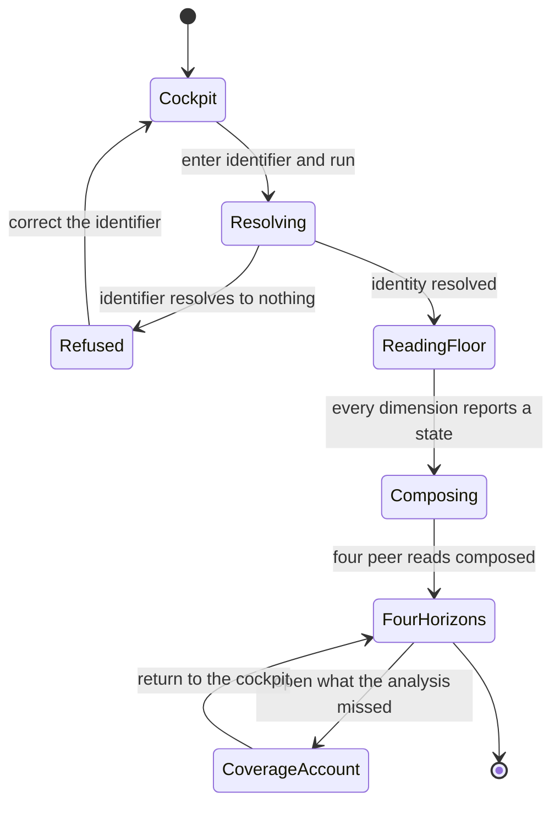
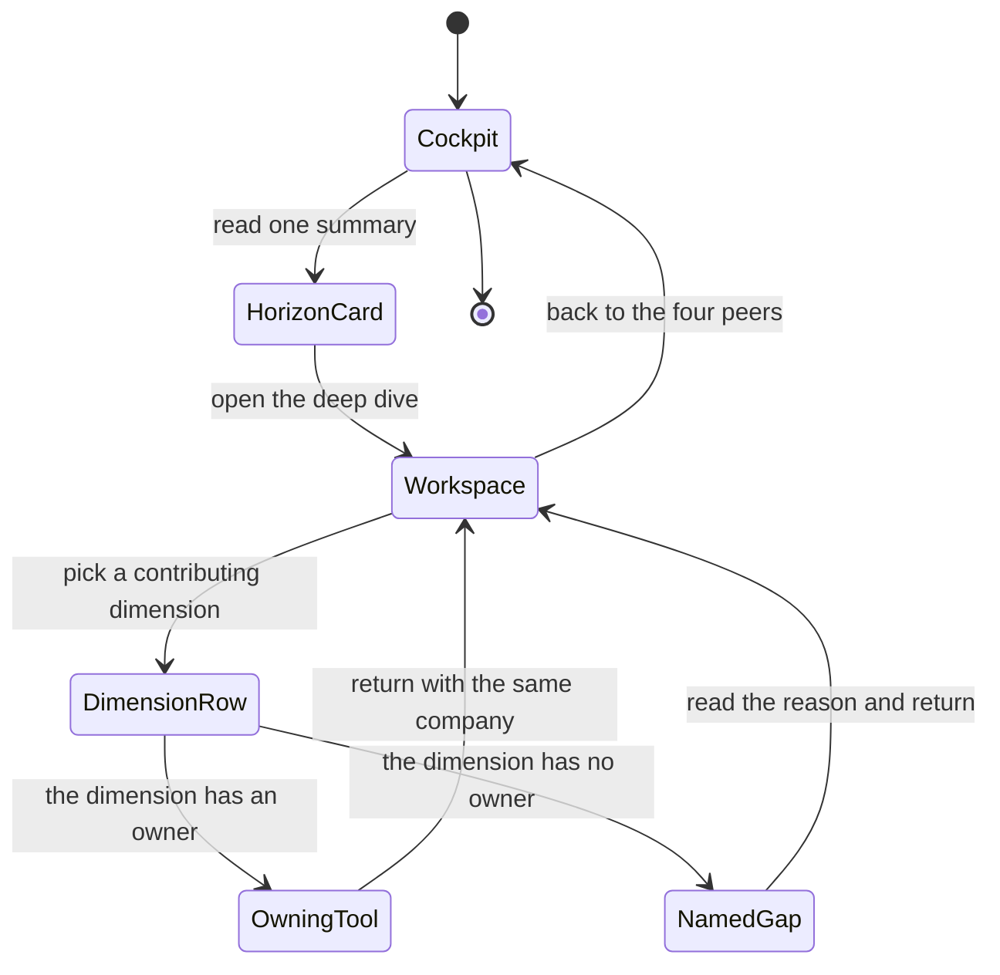
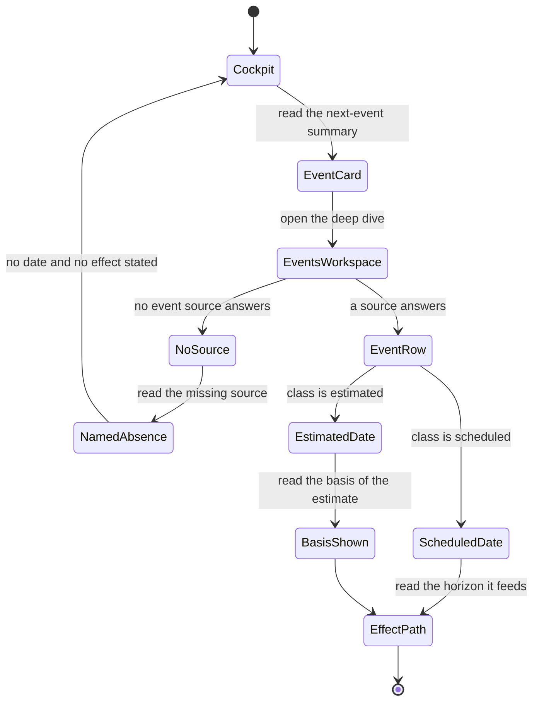
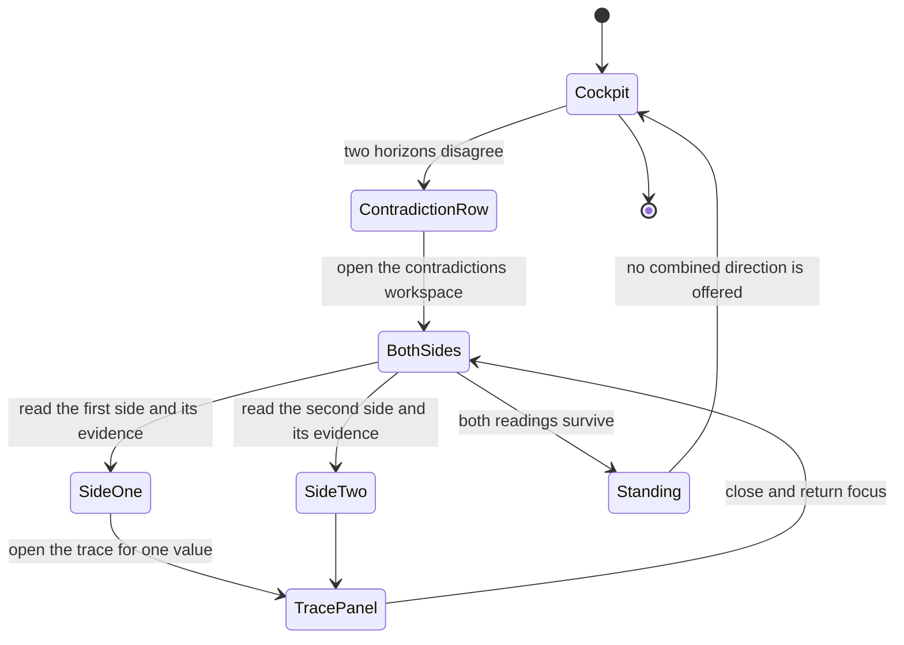
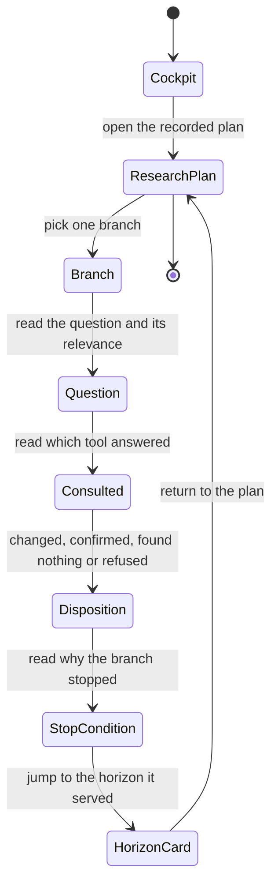
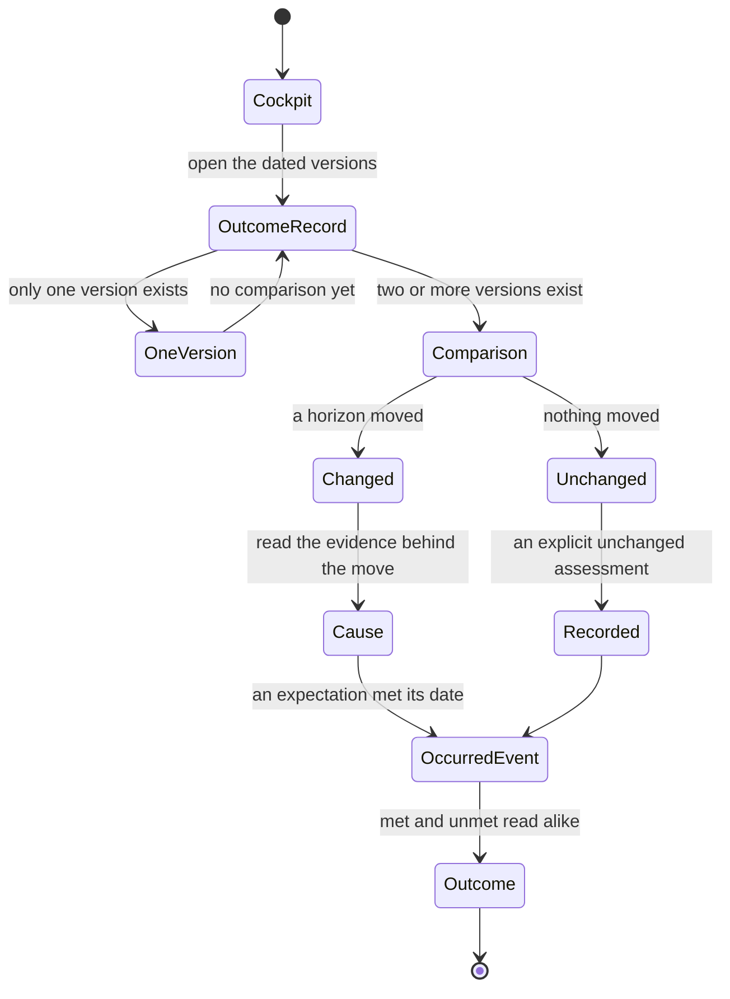

# Feature 025 — Company Multi-Horizon Intelligence Lab

**Status:** Top-level delivery and certification remain `not_started`. This
document is the analyst-owned business specification only.
**Host surface:** one registered, company-scoped research tool. It composes
reads from the tools that already own each dimension. It performs its own
sourced research only where nothing owns the dimension.
**Educational only — not investment advice.**

---

## Problem Statement

The operator can already research one company here. The operator cannot research
one company **in one place, to a decision, across four time horizons**.

Twenty-eight tools are registered in `tools.json`. Company-relevant work is
spread across at least eleven of them. `company-fundamentals-lab.html` holds SEC
facts. `technical-analysis-decision-lab.html` and `swing-structure-lab.html`
hold price structure. `trend-dynamics-cycle-lab.html` holds trend, turning
points and seasonality. `options-structure-lab.html`, `gamma-trading-lab.html`
and `options-flow-feed-lab.html` hold the derivative picture.
`volatility-sizing-lab.html` holds the volatility regime.
`smart-money-flow-lab.html` holds flow proxies. `research-agenda-lab.html` holds
standing geopolitical research. `market-brief.html` holds the market-wide read.

Each answers its own question well. None answers the operator's question. The
operator's question is a single company and four different clocks.

1. What do I do about this company today?
2. What happens to it at its next event?
3. How should I be positioned over the coming quarters?
4. What is the multi-year case, and what would break it?

Answering that today means opening nine tools, holding nine partial reads in
working memory, and reconciling them by hand. That reconciliation is the
analysis, and the product does not do it. Nothing records that it was done.
Nothing records what was checked and found irrelevant.

Three gaps make the manual path worse than tedious.

**Company events have no producer**. `market-brief.config.json` line 185
declares that events come from "per-ticker earnings/ex-div from yahoo
(rlData.events)". `rldata.js` does expose `getEvents` and `putEvents`. No
production file calls `putEvents`. The only other references are the packaged
copy under `_site/` and one API-shape assertion in `scripts/selftest.mjs`. The
declared source is a documented intention over an empty cache slot.

**Non-financial company events have nothing at all**. Conferences, product
launches and regulatory decisions have no contract and no cache slot. Analyst
days and litigation dates have no fetcher and no committed file. This is the
widest gap in the coverage floor, and the spec must not paper over it.

**A regime composer exists with no consumer and no surface**. `rlregime.js` is
667 lines and calls itself "Tier 2 sole composer RLREGIME". It defines
`composeRegime`, `matchArchetype`, `fingerprintOf`, `confirmationRatio`,
`extractContradictions`, `applyPersistence`, `ownerRead`, `readPublishedContext`,
`projectCompatibility`, `sleeveFits` and `validateFacet`. It carries four
contracts, including `combined-regime/v1` and `regime-owner-read/v1`. Its only
callers are itself and `scripts/selftest.mjs`. `market-regime-lab.html` does not
exist, and `market-regime-lab` is absent from `tools.json`, `index.html` and
`rlnav.js`. Under P18 a module whose only caller is a test has never been used.

A company workstation is the first consumer that genuinely needs a composed
regime read, a composed valuation read and a composed event read together. That
is why it is worth building. It is also why it must not pretend those reads
exist before they do.

---

## Outcome Contract

**Intent.** The operator names one public company. The tool answers four horizon
questions about that company. Each horizon carries a short summary the operator
can read in seconds and a deep dive that shows the whole derivation. Every
mandatory dimension of the coverage floor reports a state, including an honest
unavailable state. Beyond the floor, the Research Agent may pursue any registered
tool and any additional public, sourced question the current decision materially
needs. The agent must record what it pursued and why.

**Success signal.** For a covered company the tool renders four horizon reads.
Each read carries a summary and a deep dive. Every mandatory dimension shows
`current`, `partial`, `stale`, `conflicted` or `unavailable` with a named reason.
Every displayed figure names its source, its as-of date and its provenance class.
Every dimension owned by another tool deep-links to that tool instead of
recomputing its math. Every discretionary research branch records its question,
its relevance, its result, its disposition and its stop condition. A company with
no committed data still renders four honest unavailable horizons.

**Hard constraints.**

- **The coverage floor is mandatory, and it is a floor.** All fifteen dimensions
  report a state on every run. Silence is not a state. The floor never becomes a
  fixed script that forbids further work. *(P2)*
- **Research freedom is bounded, never unbounded.** The Research Agent may open
  any registered tool and ask any additional public question. It may not bypass
  provenance, owner contracts, identity resolution, privacy, source rights,
  action gates or unavailable states. *(P1, P13)*
- **Deep-link, never duplicate.** Where a registered tool owns a dimension's
  math, this tool consumes that tool's read and links to it. It does not
  reimplement the metric. *(P16, P19)*
- **One definition per concept.** Any metric this feature needs and no module
  owns becomes one new owning module with a production consumer. It never
  becomes a second private copy inside the page. *(P18, P19)*
- **Absence is a first-class outcome.** A dimension with no source publishes
  `unavailable` with a reason. It never publishes an estimate dressed as an
  observation. It never carries a stale read forward as current. *(P2, P6)*
- **Confidence describes evidence, never odds.** A horizon read states evidence
  quality. It never states a probability of the trade working. *(P3)*
- **Tickers only, forever.** The tool accepts a public company identifier. It
  never accepts or stores a position, a size, a cost basis or a profit figure.
  *(P13)*
- **Model text is data.** Any agent-authored narrative renders as escaped text at
  every sink. *(P8)*
- **Works with nothing.** The tool opens with no key, no account and no server,
  and paints first from committed and cached data. *(P9, P12)*
- **UMD, never ESM.** No build step and no browser ES modules. *(P10)*
- **Reuse, never refetch.** The tool reads existing committed bars, options,
  fundamentals and tool reads first. It retrieves only missing or stale deltas.
  *(P11)*
- **Append-only history.** A refreshed company read is a new dated version that
  references its predecessor. A correction is a new entry. *(P21)*
- **No action authority.** The tool produces research. It does not place, size,
  approve or route an order, and it does not write an alert destination.
- **Reachable or excluded on purpose.** The route ships registered, or it ships
  listed in `site-exclusions.json` with a substantive reason. It never ships
  unregistered and unlisted. *(P17)*

**Failure condition.** The feature has failed, even with every test green, if any
of the following is true. A dimension of the coverage floor renders blank rather
than unavailable. A horizon summary asserts a conclusion the deep dive cannot
derive. A figure appears without a source or an as-of date. The tool recomputes a
metric another module already owns. An event read presents an inferred date as a
scheduled one. A discretionary branch changes the conclusion without appearing in
the record. The tool stores a position or a profit figure. A confidence label
reads as a win probability. The route ships to the site root without a registry
entry or a recorded exclusion.

---

## Goals

1. Give the operator one company-scoped surface that reaches a decision instead
   of a data dump.
2. Answer four horizon questions for the same company from one composed evidence
   base.
3. Pair every horizon with a short summary and a complete deep dive.
4. Enforce a fifteen-dimension coverage floor where every dimension reports an
   explicit state.
5. Let the Research Agent extend beyond the floor and record every extension.
6. Consume owner reads from the tools that already own each dimension.
7. Name the dimensions that have no source today, honestly and by name.
8. Give the committed regime composer its first production consumer.

## Non-Goals

1. **No order routing, sizing authority or execution.** The tool researches. It
   never acts.
2. **No portfolio input.** Holdings, cost basis and profit stay outside this
   feature forever. *(P13)*
3. **No replacement of any owning tool.** Fundamentals, options, gamma, trend,
   volatility and agenda tools keep their surfaces and their math. *(P16)*
4. **No new licensed data provider.** The feature works inside the existing free
   and public source posture. *(P9)*
5. **No paid non-financial event feed.** The non-financial event gap is
   reported, not purchased.
6. **No build step and no browser ES modules.** *(P10)*
7. **No scorecard replacement.** Recommendation scoring and outcome tracking stay
   with the features that own them.
8. **No universe expansion in this feature.** Coverage follows the committed
   corpus and degrades honestly outside it.
9. **No rewrite of Feature 013.** This spec observes that feature's drift and
   changes none of its artifacts.

## Release Train

This repository has no release-train model. `config/` holds only
`domain-model.yaml`. No release-train configuration and no per-train
feature-flag bundle exists anywhere in the tree. The product ships as a static,
build-free site assembled by `scripts/build-pages-site.mjs`.

This feature therefore declares no train and no flag. Its in-progress
reachability control is the established repository pattern. The route stays out
of `tools.json` and stays listed in `site-exclusions.json` until it is complete.
The build refuses an unregistered root page that is not listed, and it refuses a
listed file once that file becomes registered. That pair is this repository's
real substitute for a flag.

---

## Current Capability Map

Derived from `tools.json`, the shared modules, `data/`,
`market-brief.config.json` and the relevant state files. Where a note and the
code disagree, the code wins and the drift is recorded.

| # | Coverage dimension | Owner today | Composed read available today | State for a company consumer |
| --- | --- | --- | --- | --- |
| 1 | Price and total-return performance | `rldata.js` bar series plus `data/bars/` with 293 committed symbols | No company-scoped published read | Partial |
| 2 | Relative performance versus benchmark and peers | `rlratio.js` with `ratioSeries`, `windowStats`, `trailingChange`, `checkComparability`, `checkAdjustmentParity`, `groupByFamily` and `validatePairRegistry` | Consumed by `global-rotation-lab.html` and `real-assets-lab.html` | Reusable, not company-scoped |
| 3 | Fundamentals | `rlcompany.js` plus `company-fundamentals-lab.html` | `fundamentals-tool-read/v1` and `company-dossier/v1` exist | Available for 3 committed CIKs only |
| 4 | Valuation | `rlcompany.js` derived metrics under `company-derived-metric/v1` | No dedicated valuation read | Partial |
| 5 | Technicals and price structure | `technical-analysis-decision-lab.html` and `swing-structure-lab.html` | None, because the math is page-local | Unavailable headlessly |
| 6 | Trend, dynamics, cycles and seasonality | `trend-dynamics-cycle-lab.html`, registered and live | None, because the math is page-local | Unavailable headlessly |
| 7 | Options structure | `options-structure-lab.html` plus `data/options/` with 23 symbols | None, because the math is page-local | Unavailable headlessly |
| 8 | Gamma and dealer positioning | `gamma-trading-lab.html` | None, because the math is page-local | Unavailable headlessly |
| 9 | Options flow | `options-flow-feed-lab.html` | None, because the math is page-local | Unavailable headlessly |
| 10 | Volatility regime and sizing | `rlvol.js` | `rlvol-decision-read/v1`, `rlvol-tool-read/v1` and `rl-tool-read/v1` | Available |
| 11 | Financial company events | Declared in `market-brief.config.json` line 185 | `putEvents` has zero production callers | Absent |
| 12 | Non-financial company events | Nothing | Nothing | Absent |
| 13 | Geopolitics and supply shock | `rlagenda.js` plus `research-agenda-lab.html` | `research-agenda-read/v1` and `research-agenda-tool-read/v1` | Available, market-scoped |
| 14 | Market regime | `rlregime.js` | `combined-regime/v1` and `regime-owner-read/v1` | Composed, unconsumed, no surface |
| 15 | Sentiment and positioning | `rlg.js` fear and greed plus `smart-money-flow-lab.html` | None composed | Proxy only, page-local |
| 16 | Company-specific risks | Nothing company-scoped | Nothing | Absent |

Row 2 is a supporting dimension rather than a floor member, which is why the
floor counts fifteen mandatory dimensions across sixteen rows.

Cross-cutting foundations this feature consumes rather than rebuilds.

| Foundation | Module | What it already owns |
| --- | --- | --- |
| Source provenance and evidence references | `rlcontracts.js` | `source-provenance/v1`, `evidence-reference/v1`, `evidence-interpretation/v1` |
| Tool briefs and recommendation keys | `rlcontracts.js` | `tool-brief/v1`, `recommendation-event/v1`, `low-noise-gate/v1` |
| Company identity and rights class | `rlcompany.js` | `company-identity/v1`, evidence classes, evidence states, rights classes |
| Shared tool-read channel | `rldata.js` | `rl-tool-read/v1`, `tool-model-read/v1`, `putToolRead`, `validateToolModelRead` |
| Shared risk and return metrics | `rlmetrics.js` | the single definition of the shared metrics |
| Four-view shell and drill-down | `rlexperience.js` and `rlviews.js` | the registry-driven Simple and Power shell |
| Attention and action projection | `rlattention.js` and `rlmarketaction.js` | `DecisionAttention/v1` and the Market Action Center projection |
| Ticker linking and disclosure | `rlticker.js` | every ticker renders as a linked, described token |
| Chart interaction and same-data tables | `rlchart.js` and `rlcontext.js` | pointer, keyboard and table access rails |

---

## Honest Findings

These findings most change what this feature can promise. Each was read from the
working tree during this analysis.

**F1 — The registry is the truth, and one note is stale**.
`trend-dynamics-cycle-lab` is registered in `tools.json` with a live status and
an updated date of 2026-08-12. Line 190 of `notes/trend-dynamics-cycle-lab.md`
still states that the route is intentionally not registered. The registry and the
note disagree. The registry wins. Registration completed and the note was never
reconciled. This spec plans against the registry.

**F2 — RLREGIME is composed but unconsumed**.
`rlregime.js` exists at 667 lines with four contracts. Its only two callers in
the tree are itself and `scripts/selftest.mjs`. Under P18 that is a module with
no production consumer. `market-regime-lab.html` does not exist. The regime
dimension therefore has a composer, no surface and no consumer.

**F3 — RLRATIO does have real production consumers**.
`rlratio.js` at 430 lines is loaded by `global-rotation-lab.html` and
`real-assets-lab.html`. Its comparability and adjustment-parity checks are exactly
what a company-versus-benchmark ratio needs. It is reusable here immediately.

**F4 — Feature 013 code and Feature 013 state disagree**.
That feature's state file carries an `in_progress` top-level status and records
all fourteen scopes as `not_started`. The modules those scopes describe are
committed. This is an artifact-freshness observation about that feature. This
spec reports it and changes nothing inside Feature 013. Reconciling it belongs to
that feature's owner.

**F5 — The financial-event source is documented, not implemented**.
The configuration names Yahoo per-ticker earnings and ex-dividend data through
the shared data layer. No production file writes that cache. A company
workstation that assumed the event feed existed would ship a fabricated horizon.

**F6 — Non-financial events are a total gap**.
There is no contract and no cache slot for conferences or product
announcements. There is no fetcher and no committed file for regulatory
decisions or litigation dates. This feature must model the gap explicitly,
because the operator named non-financial events in the goal.

**F7 — Fundamentals coverage is three companies**.
The committed fundamentals corpus holds three SEC CIK folders. Bars cover 293
symbols. Options cover 23 symbols. A company outside a corpus must degrade
honestly rather than silently.

**F8 — Most company-relevant math is page-local**.
`technical-analysis-decision-lab.html`, `gamma-trading-lab.html` and
`options-structure-lab.html` load no dimension-owning shared module. Their
analysis lives inside the page. A composed consumer cannot read it without a new
owning module. That is the single largest design cost of this feature.

**F9 — The in-progress route pattern is established and enforced**.
`site-exclusions.json` uses the `pages-site-exclusions/v1` contract.
`scripts/build-pages-site.mjs` asserts that contract version. It refuses an
unregistered root page that is not listed. It refuses a registered page that is
still excluded. It refuses a stale exclusion whose file no longer exists. This
feature uses that pattern and nothing else.

**F10 — Concurrent unrelated work is in the tree**.
Uncommitted work for a Lifetime Tax Strategy Lab spans four spec folders and
thirteen tax modules. It also carries a modified selftest and a modified
exclusions file. That work belongs to another owner. This feature touches none
of it and must not assume its selftest or exclusion edits.

---

## Domain Capability Model

### Capability

**Company-scoped, multi-horizon decision synthesis over a mandatory coverage
floor with bounded research discretion**.

The capability turns one public company identifier into four horizon-specific
decisions supported by one shared, provenance-carrying evidence base. Concrete
dimensions supply their own math, their own owners and their own availability.
The capability owns composition, horizon framing, coverage accounting and
research accountability. It owns no dimension's math.

### Domain Primitives

| Primitive | Purpose | Lifecycle |
| --- | --- | --- |
| Company subject | Binds the analysis to one resolved public identity and its eligible source classes | Resolved, then reused across every run for that company |
| Coverage dimension | One named member of the mandatory floor with a declared owner | Declared in the coverage registry, never inferred |
| Dimension read | One dimension's current state, value set, provenance and as-of stamp | `current`, `partial`, `stale`, `conflicted` or `unavailable` |
| Horizon read | One of the four horizon answers, carrying a summary and a deep dive | Composed per run, superseded by the next run, never overwritten |
| Horizon summary | The short answer a reader can act on without scrolling | Derived only from the deep dive it accompanies |
| Horizon deep dive | The full derivation with contributing reads, contradictions and invalidations | Always reconstructible from the recorded reads |
| Adaptive research branch | One discretionary question the agent chose to pursue beyond the floor | Opened, then closed with a disposition and a stop condition |
| Adaptive research plan | The ordered record of every branch opened during one run | Append-only within the run, published with the run |
| Company event | One dated financial or non-financial company occurrence with a source class | `scheduled`, `estimated`, `occurred`, `revised` or `unavailable` |
| Company read version | The dated composition of all four horizons for one company | Current when published, superseded but permanently readable |

### Relationships

- A company subject owns exactly one coverage registry instance per run.
- Each coverage dimension resolves to exactly one dimension read per run.
- Each horizon read cites the dimension reads that contributed to it.
- A horizon summary derives only from its own deep dive, never from another
  horizon.
- A company event belongs to one company subject. It feeds the event horizon
  first and the other horizons second.
- An adaptive research branch cites the decision it was meant to change and the
  reads it consulted.
- The adaptive research plan belongs to exactly one company read version.
- A company read version references its predecessor when one exists.

### Business Policies

- Report a state for every mandatory dimension on every run. Never omit a
  dimension because it looks uninteresting.
- Treat the floor as a minimum. Never treat it as a permitted maximum, and never
  treat it as a required order of work.
- Consume the owning tool's read where an owner exists. Never recompute an owned
  metric inside this surface.
- Create one new owning module when a needed metric has no owner. Never create a
  second private copy.
- Publish `unavailable` with a named reason when a source is missing. Never
  substitute an estimate, a peer value or a prior value.
- Separate a scheduled event date from an estimated one. Never present an
  inference as a calendar fact.
- Record every discretionary branch, including branches that changed nothing. A
  branch that found nothing proves the question was asked.
- Stop a branch on its declared stop condition. Never let discretion become an
  unbounded crawl.
- Keep confidence a statement about evidence quality. Never let it read as a
  probability of profit.
- Accept public identifiers only. Never accept a position, a size or a profit
  figure.

---

## Actors

| Actor | Role in this feature |
| --- | --- |
| Operator | Names the company, reads the four horizons, opens deep dives, judges the research |
| Research Agent | Runs the coverage floor, chooses discretionary branches, composes horizons, records the plan |
| Owner tool | Any registered Research Lab tool that owns a dimension's math and publishes or could publish its read |
| Shared data layer | `rldata.js` and the committed corpus that supply bars, options, fundamentals and tool reads |
| Publication gate | `scripts/selftest.mjs` and `scripts/validate-brief-payload.mjs`, which refuse a malformed or unreachable publication |
| Site build gate | `scripts/build-pages-site.mjs`, which refuses an unregistered and unlisted root page |
| Reader | Anyone reading the published company read later, including the operator |

---

## Use Cases

### UC-025-001: Open a company and get four answers

- **Actor:** Operator
- **Preconditions:** The operator can name a public company identifier.
- **Main flow:** The operator enters the identifier. The tool resolves identity.
  The tool runs the coverage floor. The tool composes four horizon reads. The
  tool renders four summaries.
- **Alternative flows:** The identifier does not resolve, so the tool refuses by
  name. The company has no committed data, so all four horizons render
  unavailable with reasons.
- **Postconditions:** A dated company read version exists with four horizons and
  a coverage account.

### UC-025-002: Drill from a summary into its derivation

- **Actor:** Operator
- **Preconditions:** A horizon summary is on screen.
- **Main flow:** The operator opens the deep dive. The deep dive lists every
  contributing dimension read, its state, its source and its as-of date.
- **Alternative flows:** A contributing dimension is unavailable, so the deep
  dive shows the gap and its effect on the summary.
- **Postconditions:** The operator can reconstruct the summary without leaving
  the page.

### UC-025-003: Follow a dimension to the tool that owns it

- **Actor:** Operator
- **Preconditions:** A dimension read is displayed and its owner is registered.
- **Main flow:** The operator follows the deep link. The owning tool opens on the
  same company.
- **Alternative flows:** The dimension has no registered owner, so the tool says
  so and names the gap instead of offering a broken link.
- **Postconditions:** The owning tool remains the single place its math lives.

### UC-025-004: Read the coverage account

- **Actor:** Operator
- **Preconditions:** A company read version exists.
- **Main flow:** The operator opens the coverage account. Every mandatory
  dimension appears with its state and its reason.
- **Alternative flows:** Several dimensions are unavailable, so the account
  reports the count and the effect on each horizon.
- **Postconditions:** The operator knows exactly what the analysis did not see.

### UC-025-005: Understand the next company event

- **Actor:** Operator
- **Preconditions:** The event horizon has been composed.
- **Main flow:** The operator opens the event horizon. The tool shows each known
  event, its date class and its expected effect path.
- **Alternative flows:** No event source is available, so the horizon reads
  unavailable and names the missing source rather than guessing a date.
- **Postconditions:** The operator never mistakes an inference for a schedule.

### UC-025-006: Follow the agent beyond the floor

- **Actor:** Operator
- **Preconditions:** The run opened at least one discretionary branch.
- **Main flow:** The operator opens the adaptive research plan. Each branch shows
  its question, relevance, result, disposition and stop condition.
- **Alternative flows:** No branch was opened, so the plan states that the floor
  was sufficient for this decision.
- **Postconditions:** Discretion is visible and reviewable, not hidden.

### UC-025-007: Compare this run with the previous run

- **Actor:** Operator
- **Preconditions:** At least two company read versions exist.
- **Main flow:** The operator opens the history. The tool shows what changed per
  horizon and which evidence caused each change.
- **Alternative flows:** Nothing changed, so the tool records an explicit
  unchanged assessment.
- **Postconditions:** No prior version is rewritten or deleted.

### UC-025-008: Research a company outside the committed corpus

- **Actor:** Operator
- **Preconditions:** The company has no committed bars, options or fundamentals.
- **Main flow:** The tool resolves identity, reports every dimension as
  unavailable with a reason, and still renders four honest horizons.
- **Alternative flows:** Partial data exists, so covered dimensions compose and
  uncovered dimensions read unavailable.
- **Postconditions:** Thin coverage never becomes a confident conclusion.

### UC-025-009: Publish a company read the reader can reach

- **Actor:** Research Agent
- **Preconditions:** A company read version is complete.
- **Main flow:** The agent files a company tool read into the shared tool-read
  channel. The read carries the four horizon summaries and the coverage account.
- **Alternative flows:** The read fails validation, so publication is refused by
  name and nothing partial is published.
- **Postconditions:** The company read is reachable from a surface the reader
  already opens.

---

## Business Scenarios

Each scenario is independently testable and maps one-to-one onto a stable
`SCN-025-NNN` identifier that the plan phase records.

### Cluster 1 — Identity, coverage floor and honest absence

#### BS-025-001: Every mandatory dimension reports a state

```gherkin
Scenario: The coverage floor is complete on every run
  Given the operator opens a company that has committed bars and options
  When the run completes
  Then every mandatory coverage dimension carries an explicit state
  And no mandatory dimension is omitted from the coverage account
  And each state is one of current, partial, stale, conflicted or unavailable
```

#### BS-025-002: A dimension with no source reads unavailable with a reason

```gherkin
Scenario: Absence is named, never blank
  Given the non-financial company event dimension has no committed source
  When the run composes the coverage account
  Then that dimension reads unavailable
  And the account names the missing source
  And no estimated or inferred value is shown in its place
```

#### BS-025-003: An unresolvable identifier is refused by name

```gherkin
Scenario: Identity resolution fails loudly
  Given the operator enters an identifier that resolves to no public company
  When the tool attempts identity resolution
  Then the tool refuses with a named reason
  And no horizon is composed from an unresolved subject
```

#### BS-025-004: A company outside the corpus still renders four honest horizons

```gherkin
Scenario: Thin coverage degrades honestly
  Given the company has no committed bars, options or fundamentals
  When the run completes
  Then all four horizons render
  And each horizon states that its evidence base is unavailable
  And no horizon states a directional conclusion
```

### Cluster 2 — Four horizons, summary and deep dive

#### BS-025-005: Four horizons are always present

```gherkin
Scenario: The four clocks are answered together
  Given a company read version has been composed
  When the operator opens the tool
  Then an immediate horizon and an event horizon are both present
  And a medium-term horizon and a long-term horizon are both present
  And each horizon carries its own summary and its own deep dive
```

#### BS-025-006: A summary never exceeds its deep dive

```gherkin
Scenario: The short answer is derived, never invented
  Given a horizon summary asserts a directional conclusion
  When the operator opens that horizon's deep dive
  Then every element of the conclusion traces to a recorded dimension read
  And no element of the conclusion lacks a supporting read
```

#### BS-025-007: A horizon reports the dimensions it could not see

```gherkin
Scenario: Missing evidence changes the stated confidence
  Given four contributing dimensions are unavailable for the medium-term horizon
  When that horizon is composed
  Then the deep dive lists the four unavailable dimensions
  And the summary states that the evidence base is incomplete
  And the confidence label describes evidence quality rather than a probability of profit
```

#### BS-025-008: Horizons may disagree and the disagreement survives

```gherkin
Scenario: A contradiction is carried, never averaged
  Given the immediate horizon reads negative and the long-term horizon reads positive
  When the run composes the company read version
  Then both horizons keep their own direction
  And the contradiction is recorded as its own item
  And no blended single direction replaces the two horizons
```

### Cluster 3 — Owner contracts and deep-linking

#### BS-025-009: An owned metric is consumed, never recomputed

```gherkin
Scenario: The owning module stays the single definition
  Given the volatility regime dimension is owned by a shared module
  When the run composes the immediate horizon
  Then the run consumes that module's published read
  And this feature contains no second implementation of that metric
```

#### BS-025-010: A dimension read deep-links to its owning tool

```gherkin
Scenario: The reader can reach the math
  Given a dimension is owned by a registered tool
  When the operator opens that dimension in a deep dive
  Then a deep link to the owning tool is present
  And the link resolves to a registered route
```

#### BS-025-011: A dimension with no owner is named as a gap

```gherkin
Scenario: An unowned dimension does not fake a link
  Given the company risk dimension has no registered owning tool
  When the operator opens that dimension
  Then the tool states that no owner exists
  And the tool offers no deep link
  And the dimension state remains unavailable or partial
```

#### BS-025-012: A newly needed metric becomes one owning module

```gherkin
Scenario: A new metric does not land inside the page
  Given this feature needs a metric that no existing module defines
  When that metric is introduced
  Then it is defined in exactly one module
  And that module has a production consumer
  And no copy of the metric exists inside the company route
```

### Cluster 4 — Company events, financial and non-financial

#### BS-025-013: A scheduled event and an estimated date are distinguishable

```gherkin
Scenario: An inference never becomes a calendar fact
  Given one event date comes from a published schedule
  And another event date comes from a historical pattern
  When the event horizon renders both
  Then the scheduled date is labelled scheduled
  And the estimated date is labelled estimated
  And the estimated date states the basis of the estimate
```

#### BS-025-014: An absent event source blocks the event horizon honestly

```gherkin
Scenario: No event source means no event conclusion
  Given no financial event source is available for the company
  When the event horizon is composed
  Then the horizon reads unavailable
  And it names the missing source
  And it states no expected effect
```

#### BS-025-015: A non-financial event is carried with its own source class

```gherkin
Scenario: Conferences and announcements are first-class or absent
  Given a non-financial company event has been sourced publicly
  When the event horizon renders it
  Then the event carries its type, its date class, its source and its as-of date
  And an unsourced non-financial event is not displayed at all
```

#### BS-025-016: A past event becomes an outcome rather than a forecast

```gherkin
Scenario: The event horizon reclassifies after the date passes
  Given an event date has passed and its outcome is known
  When the next run composes the event horizon
  Then that event is recorded as occurred with its observed outcome
  And it is no longer presented as an upcoming catalyst
```

### Cluster 5 — Adaptive research freedom, recorded and bounded

#### BS-025-017: A discretionary branch is recorded in full

```gherkin
Scenario: Freedom is visible
  Given the agent opened a discretionary research branch beyond the coverage floor
  When the run publishes its adaptive research plan
  Then the branch records its question
  And it records its relevance to a named horizon decision
  And it records its result, its disposition and its stop condition
```

#### BS-025-018: A branch that changed nothing is still recorded

```gherkin
Scenario: A negative result is evidence
  Given a discretionary branch found nothing that changed a horizon
  When the run publishes its adaptive research plan
  Then the branch still appears
  And its disposition states that it did not change the conclusion
```

#### BS-025-019: Freedom never bypasses a contract

```gherkin
Scenario: Discretion stops at the guardrails
  Given a discretionary branch would require an unsourced claim
  When the agent evaluates the branch
  Then the branch is closed without publishing the claim
  And the plan records the refusal and its reason
  And no horizon cites the unpublished claim
```

#### BS-025-020: A branch may use any registered tool

```gherkin
Scenario: The whole registry is available to the agent
  Given a material question is better answered by a tool outside the coverage floor mapping
  When the agent opens a branch against that registered tool
  Then the branch is permitted
  And the plan records which tool was consulted and why
```

### Cluster 6 — Provenance, history, safety and reachability

#### BS-025-021: Every displayed figure carries provenance

```gherkin
Scenario: No blackbox number reaches the reader
  Given any numeric value is displayed in a horizon or a dimension read
  When the operator inspects that value
  Then its source, its as-of date and its provenance class are all present
```

#### BS-025-022: History is appended, never rewritten

```gherkin
Scenario: A correction is a new version
  Given a prior company read version exists
  When a new run corrects an earlier conclusion
  Then a new dated version is created referencing the predecessor
  And the prior version remains readable and unmodified
```

#### BS-025-023: The tool refuses portfolio input

```gherkin
Scenario: Tickers only, forever
  Given the operator attempts to enter a position size or a cost basis
  When the tool processes the input
  Then the input is refused
  And no position, size, cost basis or profit value is stored anywhere
```

#### BS-025-024: The route ships registered or explicitly excluded

```gherkin
Scenario: Nothing ships unreachable and unlisted
  Given the company route exists at the site root
  When the site build runs
  Then the route is either registered in the tool registry and navigation
  Or it is listed in the site exclusions with a substantive reason
  And the build refuses any other combination
```

---

## Functional Requirements

Forty functional requirements across five intended scopes. This sits at the P25
cap of roughly forty requirements and five scopes. The split seam appears in the
Change Magnitude Decision below.

### Company subject, coverage registry and states

- **FR-025-001** The tool MUST resolve a public company identifier to one company
  subject before composing any horizon.
- **FR-025-002** The tool MUST refuse an unresolvable identifier by name and MUST
  NOT compose a horizon from an unresolved subject.
- **FR-025-003** The mandatory coverage floor MUST be declared in exactly one
  committed registry that names every dimension and its owner.
- **FR-025-004** The coverage floor MUST include performance, fundamentals,
  valuation, technicals, and trend and cycles. It MUST also include options
  structure, gamma, options flow, volatility, financial events, non-financial
  events, geopolitics, market regime, sentiment and company risk.
- **FR-025-005** Every mandatory dimension MUST report exactly one state per run
  from the closed vocabulary `current`, `partial`, `stale`, `conflicted` or
  `unavailable`.
- **FR-025-006** An `unavailable` or `partial` dimension MUST carry a named reason
  drawn from a closed vocabulary.
- **FR-025-007** The coverage floor MUST NOT constrain the order of work and MUST
  NOT be treated as a maximum.
- **FR-025-008** The tool MUST accept only public identifiers and MUST reject any
  position, size, cost basis or profit input.

### Dimension reads, owner contracts and provenance

- **FR-025-009** Where a registered tool owns a dimension, the run MUST consume
  that tool's read rather than recomputing its math.
- **FR-025-010** Where a needed metric has no owning module, exactly one new
  owning module MUST define it, and that module MUST have a production consumer.
- **FR-025-011** Every dimension read MUST carry its source, its as-of date and
  its provenance class.
- **FR-025-012** Every displayed numeric value MUST be traceable to a dimension
  read that carries provenance.
- **FR-025-013** A dimension read MUST NOT substitute a peer value, a sector
  value or a prior value when its own source is missing.
- **FR-025-014** A stale dimension read MUST be labelled stale with its age and
  MUST NOT be presented as current.
- **FR-025-015** Each dimension owned by a registered tool MUST expose a deep
  link that resolves to that tool's registered route.
- **FR-025-016** A dimension with no registered owner MUST state that no owner
  exists and MUST NOT render a deep link.
- **FR-025-017** The run MUST reuse committed and cached observations first and
  MUST retrieve only missing or stale deltas.
- **FR-025-018** The run MUST complete a coverage account even when every
  dimension is unavailable.

### Four horizons, summaries and deep dives

- **FR-025-019** Every company read version MUST contain exactly four horizon
  reads covering immediate action, the next company event, medium-term
  positioning and long-term positioning.
- **FR-025-020** Each horizon read MUST carry one short summary and one deep
  dive.
- **FR-025-021** Each horizon summary MUST derive only from its own deep dive.
- **FR-025-022** Each deep dive MUST list every contributing dimension read with
  that read's state, source and as-of date.
- **FR-025-023** Each deep dive MUST list the mandatory dimensions that were
  unavailable and state their effect on the summary.
- **FR-025-024** Each horizon MUST carry a confidence statement describing
  evidence quality, and it MUST NOT express a probability of profit.
- **FR-025-025** Contradictions between horizons MUST be recorded as their own
  items and MUST NOT be blended into a single direction.
- **FR-025-026** Each horizon MUST carry the conditions that would invalidate its
  own read.

### Company events

- **FR-025-027** Every company event MUST carry a type, a date, a date class and a
  source class.
- **FR-025-028** The date class MUST distinguish a `scheduled` date from an
  `estimated` date, and an estimated date MUST state the basis of the estimate.
- **FR-025-029** The event horizon MUST read `unavailable` with a named missing
  source when no event source exists, and it MUST state no expected effect.
- **FR-025-030** A non-financial company event MUST NOT be displayed unless it
  carries a public source and an as-of date.
- **FR-025-031** An event whose date has passed MUST be reclassified as `occurred`
  with its observed outcome on the next run.

### Adaptive research plan

- **FR-025-032** The Research Agent MUST be free to consult any registered
  Research Lab tool. The agent MUST also be free to open any additional public,
  sourced research question the current decision materially needs.
- **FR-025-033** Every discretionary branch MUST record its question, its
  relevance to a named horizon decision, its result, its disposition and its stop
  condition.
- **FR-025-034** A branch that changed no conclusion MUST still be recorded with
  an explicit no-change disposition.
- **FR-025-035** A branch MUST NOT bypass provenance, owner contracts, identity
  resolution, privacy, source rights, action gates or unavailable states. A
  refused branch MUST record the refusal reason.
- **FR-025-036** The adaptive research plan MUST be published with the company
  read version it belongs to.

### Publication, history, surface and safety

- **FR-025-037** Each run MUST create a new dated company read version that
  references its predecessor, and MUST NOT modify or delete any prior version.
- **FR-025-038** The tool MUST paint first from committed and cached data with no
  key, no account and no server.
- **FR-025-039** The tool MUST publish a company tool read into the shared
  tool-read channel. That read MUST carry the four horizon summaries and the
  coverage account. A read that fails validation MUST be refused by name
  without partial publication.
- **FR-025-040** The route MUST ship either registered in the tool registry and
  navigation, or listed in the site exclusions with a substantive reason. The
  site build MUST refuse any other combination.

---

## Non-Functional Requirements

- **NFR-025-001** The four horizon summaries MUST be readable without horizontal
  scrolling on a narrow viewport.
- **NFR-025-002** The first paint MUST come from cached or committed data and
  MUST NOT wait on a network call.
- **NFR-025-003** Every agent-authored narrative MUST render as escaped text at
  every sink.
- **NFR-025-004** Every chart MUST expose the same data through an accessible
  table and a keyboard rail.
- **NFR-025-005** Every ticker MUST render as a linked, described token through
  the shared ticker module.
- **NFR-025-006** The tool MUST operate in the browser and in Node without a build
  step and without browser ES modules.
- **NFR-025-007** Any budget this feature introduces MUST have a test that can
  actually fail.
- **NFR-025-008** Any guard this feature introduces MUST carry an adversarial case
  that fails when the guard is removed.
- **NFR-025-009** The run cost MUST be bounded by the declared coverage floor plus
  a declared maximum discretionary branch count.
- **NFR-025-010** Identical complete inputs with an identical decision time MUST
  produce identical composed output.
- **NFR-025-011** The tool MUST NOT persist any user-identifying value beyond the
  public company identifiers the operator entered.
- **NFR-025-012** Every published artifact MUST stay inside the repository's
  existing artifact-budget contract.

---

## Product Principle Alignment

The admission test asks whether a change improves decision quality or the
measurement of decision quality. This feature improves decision quality directly.
The operator currently reconciles nine tools by hand for one company, and the
product records nothing about that work. It also improves measurement, because
every run records what was seen, what was missing and what was asked.

| Principle | How this spec honours it |
| --- | --- |
| **P1 — provenance on every figure** | FR-025-011, FR-025-012, BS-025-021 |
| **P2 — missing renders as missing** | FR-025-005, FR-025-006, FR-025-013, BS-025-002 |
| **P3 — confidence is evidence quality** | FR-025-024, BS-025-007 |
| **P4 — misses have equal prominence** | FR-025-031 records an occurred event with its observed outcome, favourable or not |
| **P5 — a rate is withheld below its sample** | FR-025-024 forbids a stated probability, so no undersampled rate is published |
| **P6 — say when the read is old** | FR-025-014, FR-025-011 |
| **P7 — no blackbox numbers** | FR-025-022, FR-025-023 |
| **P8 — model text is data** | NFR-025-003 |
| **P9 — works with nothing** | FR-025-038, Non-Goal 4 |
| **P10 — UMD, never ESM** | NFR-025-006, Non-Goal 6 |
| **P11 — reuse, never refetch** | FR-025-017 |
| **P12 — cache-first first paint** | FR-025-038, NFR-025-002 |
| **P13 — tickers only, forever** | FR-025-008, BS-025-023, Non-Goal 2 |
| **P14 — Simple default, Power drill-down** | FR-025-020 pairs a summary with a deep dive on every horizon |
| **P15 — explained in place** | FR-025-022, FR-025-023, FR-025-026 |
| **P16 — deep-link, never duplicate** | FR-025-009, FR-025-015, Non-Goal 3 |
| **P17 — reachable or removed** | FR-025-040, BS-025-024 |
| **P18 — wired or not shipped** | FR-025-010 requires a production consumer for any new module, which also answers finding F2 |
| **P19 — one definition per concept** | FR-025-009, FR-025-010, BS-025-012 |
| **P20 — every claim is scoreable** | FR-025-026 requires an invalidation per horizon, which is the scoreable half this feature owns |
| **P21 — additive, append-only** | FR-025-037, BS-025-022 |
| **P22 — budgets are assertions** | NFR-025-007, NFR-025-009 |
| **P23 — a guard that cannot fail is not a guard** | NFR-025-008 |
| **P24 — superseding closes the superseded** | This spec supersedes no committed contract, so nothing needs closing here |
| **P25 — capped, never status-blocked** | 40 requirements and 5 intended scopes, with named capability dependencies rather than spec statuses |

On the second half of P25, this spec blocks on no other spec's status. Feature
013 is in progress, and this feature does not wait for that value to change. It
depends only on the named capability "a composed regime read with a production
consumer", which the current tree does not have.

---

## Competitive Analysis

Fetched during this analysis. Claims below are limited to what the fetched page
actually showed. Anything the page did not show is marked not established.

| Capability | Research Lab today | Unusual Whales | TIKR | StockAnalysis.com | Koyfin |
| --- | --- | --- | --- | --- | --- |
| Company fundamentals depth | 3 committed CIKs from SEC facts | Not established from the fetched page | Financial data on 100,000+ stocks across 92 countries, powered by S&P Global CapitalIQ | Decades of financials on 130,000+ global stocks, ETFs and funds | Not established from the fetched page |
| Screening | Not a product goal here | Stock and options screener | Global screener with thousands of filters | Screener with hundreds of filters | Not established from the fetched page |
| Options flow and dealer exposure | Page-local gamma and flow tools | Real-time flow feed, market maker exposure, GEX heatmap for all US tickers | Not established from the fetched page | Not established from the fetched page | Not established from the fetched page |
| Company events | No producer for financial events, nothing for non-financial | Not established from the fetched page | Watchlist news feed highlighting upcoming events, news, earnings and conference transcripts, and filings | IPO calendar and market news | Not established from the fetched page |
| Valuation modelling | Derived metrics only | Not established from the fetched page | Custom valuation model builder with saved templates | Analyst ratings, price targets and forecasts | Not established from the fetched page |
| Agent-assisted synthesis | Agent-authored and provenance-bound | An AI analyst with chat, alerts and a daily brief | Not established from the fetched page | Not established from the fetched page | Not established from the fetched page |
| Programmatic access | Static committed data, no API product | 60+ API endpoints over REST, WebSocket and MCP, plus bulk datasets | Not established from the fetched page | Not established from the fetched page | Not established from the fetched page |
| Published data-source disclosure | Provenance on every figure by principle | Not established from the fetched page | Names S&P Global CapitalIQ as the data source | Publishes a dedicated data-sources page | Not established from the fetched page |
| Cost to use | Free, no key, no account | $50 to $120 per month on the retail tiers shown | Free tier plus paid plans | Free with a paid Pro tier | Free sign-up plus paid plans |
| Multi-horizon single-company synthesis | Absent today, and this is the gap | Not established from the fetched page | Not established from the fetched page | Not established from the fetched page | Not established from the fetched page |
| Explicit unavailable states | Enforced by principle | Not established from the fetched page | Not established from the fetched page | Not established from the fetched page | Not established from the fetched page |

The Koyfin feature and investor pages returned navigation and segment links only.
No feature list rendered, so every Koyfin cell stays not established.

Four observations follow from the fetched evidence.

**Gap 1 — event coverage**. TIKR surfaces upcoming events, earnings and
conference transcripts on a watchlist feed. This repository has no producer for
either class of company event. That is the widest verified competitive gap.

**Gap 2 — fundamentals breadth**. TIKR states 100,000+ stocks and
StockAnalysis.com states 130,000+. This repository holds three committed CIKs.
Breadth is not this product's competitive axis, and the spec must not pretend
otherwise.

**Gap 3 — dealer positioning**. Unusual Whales advertises real-time market maker
exposure and a GEX heatmap across all US tickers. This repository has a gamma
tool with page-local math and 23 committed options symbols.

**Edge 1 — honest state and provenance**. None of the fetched pages advertised
explicit unavailable states or per-figure provenance. None published a record of
what the analysis did not see. Every fetched competitor advertises breadth. This
product's differentiator is the opposite claim. It says less, and it says exactly
where the evidence stops. A four-horizon single-company synthesis with a recorded
coverage account and a recorded research plan is not established as existing on
any fetched competitor page.

---

## Improvement Proposals

Ranked by decision-quality impact, then feasibility.

### IP-025-001: Company event capability with an explicit date class ⭐ Competitive edge

- **Impact:** High
- **Effort:** M
- **Competitive advantage:** TIKR shows events. Nothing fetched showed a
  scheduled-versus-estimated date class. That distinction is exactly what stops
  an event horizon from fabricating a catalyst.
- **Actors affected:** Operator, Research Agent.
- **Business scenarios:** BS-025-013, BS-025-014, BS-025-016.

### IP-025-002: Give the regime composer its first production consumer ⭐ Competitive edge

- **Impact:** High
- **Effort:** M
- **Competitive advantage:** A composed, contradiction-preserving regime read is
  already built here and used nowhere. Consuming it closes a P18 violation and
  gives the medium-term horizon a real backbone.
- **Actors affected:** Research Agent, Owner tool.
- **Business scenarios:** BS-025-008, BS-025-009, BS-025-012.

### IP-025-003: The recorded adaptive research plan ⭐ Competitive edge

- **Impact:** High
- **Effort:** S
- **Competitive advantage:** Unusual Whales ships an AI analyst. Nothing fetched
  showed a published record of which questions the agent asked, which it dropped
  and why. Auditable discretion is a durable differentiator.
- **Actors affected:** Operator, Research Agent.
- **Business scenarios:** BS-025-017, BS-025-018, BS-025-019, BS-025-020.

### IP-025-004: Company-versus-benchmark ratio reads through the existing module

- **Impact:** Medium
- **Effort:** S
- **Competitive advantage:** The ratio module already enforces comparability and
  adjustment parity and already has two production consumers. Relative
  performance becomes available immediately with no new math.
- **Actors affected:** Research Agent.
- **Business scenarios:** BS-025-009, BS-025-010.

### IP-025-005: Headless owner reads for the page-local company tools

- **Impact:** Medium
- **Effort:** L
- **Competitive advantage:** Technicals, options structure, gamma and flow all
  live inside their pages today. Extracting one owning module per dimension is
  the durable fix for finding F8 and unlocks every future composed consumer.
- **Actors affected:** Owner tool, Research Agent.
- **Business scenarios:** BS-025-011, BS-025-012.

### IP-025-006: Coverage account as a first-class reader artifact

- **Impact:** Medium
- **Effort:** S
- **Competitive advantage:** Every fetched competitor advertises what it has. A
  visible account of what the analysis could not see is a trust asset none of
  them offered.
- **Actors affected:** Operator, Reader.
- **Business scenarios:** BS-025-001, BS-025-002, BS-025-007.

---

## Change Magnitude Decision

**Decision: sizable. A new spec folder is correct**.

The work introduces a new actor role, a new registered route and a new composed
contract family. It also introduces four new horizon reads and a new
research-accountability record. It requires at least one new owning module. None
of that fits inside the existing company fundamentals feature or any other
existing feature, because none of them owns cross-dimension composition.

**The split seam, stated in advance**. This spec sits at the P25 cap. If the plan
phase cannot fit forty requirements into five scopes, the seam is IP-025-005.
Extracting headless owner reads from the page-local technical, options, gamma and
flow tools is a separable feature that other consumers also need. Splitting it out
would leave this feature composing the reads that already exist. The extracted
dimensions would read `unavailable` until the sibling feature lands. That
degradation is honest, and the coverage floor already models it.

The seam is not the four horizons, and it is not the adaptive research plan.
Splitting either of those would produce a feature that cannot answer the
operator's question.

---

## UI Scenario Matrix

| Scenario | Actor | Entry point | Steps | Expected outcome | Screens |
| --- | --- | --- | --- | --- | --- |
| BS-025-001 | Operator | Company entry field | Enter an identifier and run the analysis | Every mandatory dimension shows a state in the coverage account | Company route, Simple view |
| BS-025-005 | Operator | Company route on open | Read the four horizon summaries | Four horizons render with four summaries and four deep-dive entry points | Company route, Simple view |
| BS-025-006 | Operator | A horizon summary card | Open the deep dive and trace the conclusion | Every element of the summary maps to a recorded dimension read | Company route, Power view |
| BS-025-010 | Operator | A dimension row in a deep dive | Follow the owning tool link | The registered owning tool opens for the same company | Company route, then the owning tool route |
| BS-025-014 | Operator | The event horizon card | Open the event horizon with no event source available | The horizon reads unavailable and names the missing source | Company route, event horizon |
| BS-025-017 | Operator | The adaptive research plan panel | Open a recorded discretionary branch | Question, relevance, result, disposition and stop condition are all present | Company route, Power view |
| BS-025-022 | Operator | The version history panel | Compare the current version with its predecessor | Changes and their causes are visible, and the prior version is unmodified | Company route, history view |
| BS-025-024 | Site build gate | Site build run | Build the site with the route present | The build accepts a registered route or a listed exclusion and refuses anything else | No product UI, build output |

---

## UI Wireframes

This feature ships one registered route inside the existing Research Lab shell.
The page loads the shared scripts in the house order. `rldata.js` runs first and
`rlapp.js` runs next. `rlnav.js` runs last. The page therefore joins the shared
navigation and the shared data-status control instead of holding a private copy.

The repository project file declares no design language. These wireframes follow
Research Lab's own conventions only. A dark analytical canvas carries a hero
heading, a pill meta row, a Simple and Power segment, and stacked panels. Every
number renders in a tabular figure face. Long lists scroll inside their own
panel. The document body never scrolls sideways.

No credential field appears anywhere on this page. Provider access stays on the
home page under the data-settings anchor.

### Reader Status Vocabulary

Every status word a reader sees comes from one of the four closed lists below.
No other status word reaches the screen. No internal identifier, no contract
name, no content digest and no scope number appears in reader copy.

**Evidence state.** One state per coverage dimension, on every run.

| Word | What the reader learns |
| --- | --- |
| Current | The source answered, and the answer is fresh enough to act on |
| Partial | The source answered for part of the question only |
| Stale | The source answered earlier, and the answer has aged past its window |
| Conflicted | Two sources answered, and they disagree |
| Unavailable | No source answered, and the reason is named |

**Evidence quality.** One label per horizon. It describes the evidence base and
never a chance of profit.

| Word | What the reader learns |
| --- | --- |
| Broad | Most contributing dimensions answered, and they agree |
| Narrow | Enough dimensions answered to read, but several stayed silent |
| Thin | Few dimensions answered, so the read carries little weight |
| Absent | Nothing answered, so this horizon states no direction |

**Event date class.** One class per company event.

| Word | What the reader learns |
| --- | --- |
| Scheduled | A published calendar names this date |
| Estimated | A pattern suggests this date, and the basis is shown |
| Occurred | The date passed, and the observed outcome is recorded |
| Revised | A later publication moved this date |
| Unavailable | No source names a date for this event class |

**Provenance class.** One class per displayed value.

| Word | What the reader learns |
| --- | --- |
| Observed | A source published this exact value |
| Derived | This value comes from published values through a named formula |
| Proxy | This value stands in for a quantity the sources do not publish |
| Modelled | An assumption produced this value, and the assumption is shown |

### Screen Inventory

| Screen | Actor | Mode | Status | Scenarios served |
| --- | --- | --- | --- | --- |
| Company cockpit | Operator | Simple, default | New | BS-025-001, BS-025-004, BS-025-005, BS-025-008 |
| Performance workspace | Operator | Power | New | BS-025-009, BS-025-010 |
| Fundamentals workspace | Operator | Power | New | BS-025-006, BS-025-010 |
| Events workspace | Operator | Power | New | BS-025-013, BS-025-014, BS-025-015, BS-025-016 |
| Geopolitics and exposures workspace | Operator | Power | New | BS-025-009, BS-025-011 |
| Regime and cross-asset workspace | Operator | Power | New | BS-025-008, BS-025-009 |
| Cycles workspace | Operator | Power | New | BS-025-007, BS-025-010 |
| Valuation and risks workspace | Operator | Power | New | BS-025-006, BS-025-011 |
| Sources and contradictions workspace | Operator | Power | New | BS-025-008, BS-025-021 |
| Research plan workspace | Operator | Power | New | BS-025-017, BS-025-018, BS-025-019, BS-025-020 |
| Outcome record workspace | Operator, Reader | Power | New | BS-025-016, BS-025-022 |

### UI Primitives

Every workspace below composes from this one primitive set. A workspace never
defines a private variant of a listed primitive. Each primitive owns its own
keyboard behaviour, its own narrow-viewport behaviour and its own tooltip rule.

| Primitive | Consumers | Composition rule | Accessibility and responsive rule |
| --- | --- | --- | --- |
| Company selector | Cockpit and every workspace header | One text field plus one run button. It accepts a public identifier only. It refuses any position, size, cost or profit input by name | Labelled field, visible focus ring, refusal announced in a live region, full width below 700 CSS px |
| Simple and Power segment | Page header, one instance | Two buttons in one tab list. Switching changes display only and triggers no fetch and no recompute | Arrow keys move between tabs, the active tab reports itself, targets stay at least 44 px |
| Horizon card | Cockpit, and one repeat inside each workspace | Title, direction line, evidence-quality chip, one-line reason, invalidation line, deep-dive control. Four cards are peers and never merge | Card is one landmark region, heading level 3, stacks to one column below 700 CSS px |
| Evidence-state chip | Coverage grid, dimension rows, workspace headers | Carries one word from the evidence-state list, plus a shape marker. Never carries a number | Meaning comes from the word and the shape, never from colour alone, tooltip names the state and its effect |
| Provenance chip | Every displayed value | Carries one provenance word, the source name and the as-of date. A value without a chip never renders | Chip is reachable by keyboard, its tooltip is also its accessible description |
| Clock and truth strip | Page header, one instance | Names each clock separately. Price clock, filing clock, event clock, regime clock and composed-read clock never merge into one date | Reads as a definition list, wraps to two lines below 700 CSS px, stays above the fold |
| Dimension coverage grid | Cockpit and the sources workspace | One row per mandatory dimension. Columns hold the dimension, its state, its reason, its owner and its link | Renders as a real table with row and column headers, becomes a stacked list below 600 CSS px |
| Contradiction row | Cockpit summary and the contradictions workspace | Names both sides, the horizon each side belongs to and the evidence behind each side. It never shows a blended direction | Each side is its own cell, the row reads in order under a screen reader, the row wraps rather than scrolls |
| Event row | Cockpit event card and the events workspace | Type, date, date class, source, as-of date and expected effect path. An unsourced event never renders | Date class renders as a word, the row exposes its own tooltip, the table scrolls inside its panel only |
| Research-plan branch row | Research plan workspace | Question, relevance, tool consulted, result, disposition and stop condition. All six fields render or the row is refused | Row expands with the keyboard, the expanded body is a named region, focus returns to the row on close |
| Deep-link trace control | Every dimension row and every horizon card | Opens the owning tool on the same company, or states that no owner exists. It never renders a link without an owner | Control is a button when it opens a panel and a link when it leaves the page, focus returns on close |
| Unavailable and named-absence line | Every panel that can hold nothing | States the dimension, the missing source and the effect on the read. It never renders a blank, a dash or a zero | Line sits inside the panel it explains, reads as text, and needs no colour to be understood |
| Chart and accessible-table pair | Performance, cycles, regime and valuation workspaces | Every canvas ships with a table holding the same values. The table is a disclosure, never a separate page | Canvas carries a text alternative, the table is reachable by keyboard, the pair collapses to the table alone below 600 CSS px |

**Tooltip rule.** Every value on this page carries a contextual tooltip. The
tooltip states what the value is and what the current reading means. A tooltip
never states a chance of profit and never suggests an action.

### Screen: Company cockpit

**Actor:** Operator. **Mode:** Simple, and the page default. **Status:** New.

```text
┌──────────────────────────────────────────────────────────────────────┐
│ 🏢 Company Multi-Horizon Intelligence Lab                            │
│ One company, four clocks. Every dimension states what it saw.        │
│ [● live-capable] [MSFT · resolved] [coverage 9 of 15] [read 08-18]   │
├──────────────────────────────────────────────────────────────────────┤
│ View [ ● Simple ][ ⚙ Power ]                                         │
│ Company [ MSFT________ ] [ ▸ Run analysis ]   tickers only           │
├──────────────────────────────────────────────────────────────────────┤
│ CLOCKS   Prices to 2026-08-15 · Filings to 2026-07-30                │
│          Events unavailable · Regime unavailable                     │
│          Read composed 2026-08-18 · Painted from cache, no key       │
├──────────────────────────────────────────────────────────────────────┤
│ Educational only — not investment advice.                            │
└──────────────────────────────────────────────────────────────────────┘

FOUR PEER HORIZONS — each keeps its own answer
┌────────────────────────┐ ┌────────────────────────┐
│ IMMEDIATE              │ │ NEXT EVENT             │
│ Pressure to the downside│ │ No event conclusion    │
│ [Narrow] evidence       │ │ [Absent] evidence      │
│ Price sits under the    │ │ No event source answers│
│ 50-day shelf.           │ │ for this company.      │
│ Changes if price holds  │ │ Changes when an event  │
│ the shelf for 3 days.   │ │ source is wired.       │
│ [ Open deep dive ]      │ │ [ Open deep dive ]     │
└────────────────────────┘ └────────────────────────┘
┌────────────────────────┐ ┌────────────────────────┐
│ MEDIUM TERM            │ │ LONG TERM              │
│ Constructive            │ │ Constructive           │
│ [Narrow] evidence       │ │ [Thin] evidence        │
│ Margin trend rises on   │ │ Reinvestment holds, and│
│ three reported periods. │ │ the moat read is thin. │
│ Changes if margin falls │ │ Changes if reinvestment│
│ for two periods.        │ │ falls two years.       │
│ [ Open deep dive ]      │ │ [ Open deep dive ]     │
└────────────────────────┘ └────────────────────────┘

┌──────────────────────────────────────────────────────────────────────┐
│ HORIZONS THAT DISAGREE                        2 standing             │
│ ─────────────────────────────────────────────────────────────────    │
│ Immediate says down   ·   Long term says constructive                │
│   Immediate rests on price under its 50-day shelf.                   │
│   Long term rests on three periods of rising margin.                 │
│   Both readings stand. This page states no combined direction.       │
│   [ See the evidence on each side ]                                  │
│ ─────────────────────────────────────────────────────────────────    │
│ Event says unavailable   ·   Medium term says constructive           │
│   [ See the evidence on each side ]                                  │
└──────────────────────────────────────────────────────────────────────┘

┌──────────────────────────────────────────────────────────────────────┐
│ WHAT THE ANALYSIS COULD NOT SEE                                      │
│ Dimension              State         Reason              Owner       │
│ ───────────────────────────────────────────────────────────────────  │
│ Performance            Current       —                   [ open ]    │
│ Fundamentals           Current       —                   [ open ]    │
│ Valuation              Partial       Two ratios only     [ open ]    │
│ Technicals             Unavailable   No shared read yet  no owner    │
│ Trend and cycles       Unavailable   No shared read yet  no owner    │
│ Options structure      Unavailable   Symbol not covered  no owner    │
│ Gamma                  Unavailable   Symbol not covered  no owner    │
│ Options flow           Unavailable   Symbol not covered  no owner    │
│ Volatility             Current       —                   [ open ]    │
│ Financial events       Unavailable   No source wired     no owner    │
│ Non-financial events   Unavailable   No source exists    no owner    │
│ Geopolitics            Partial       Market scope only   [ open ]    │
│ Market regime          Unavailable   No consumed read    no owner    │
│ Sentiment              Partial       Proxy only          [ open ]    │
│ Company risk           Unavailable   Nothing owns it     no owner    │
│ ───────────────────────────────────────────────────────────────────  │
│ 4 current · 4 partial · 7 unavailable · 0 stale · 0 conflicted       │
└──────────────────────────────────────────────────────────────────────┘

┌────────────────────────────────┐ ┌─────────────────────────────────┐
│ RESEARCH THE AGENT CHOSE       │ │ LATEST OUTCOME                  │
│ 3 branches beyond the floor    │ │ Previous read 2026-08-11        │
│ 1 changed a read               │ │ Immediate flipped to downside   │
│ 1 confirmed a read             │ │ Cause: price lost the shelf     │
│ 1 found nothing                │ │ Long term unchanged             │
│ [ Read the research plan ]     │ │ [ Open the outcome record ]     │
└────────────────────────────────┘ └─────────────────────────────────┘
```

**Interactions:**

- Company field, then Run analysis → the run resolves identity, reads the floor
  and composes four horizons.
- Company field with a position, size or cost value → the field refuses by name
  and stores nothing.
- Simple and Power segment → the workspace strip appears and the cockpit hides.
  No fetch runs and no value recomputes.
- Any horizon card, Open deep dive → the matching Power workspace opens with
  that horizon in focus.
- Any contradiction row, See the evidence on each side → the contradictions
  workspace opens with both sides expanded.
- Any coverage row with an owner → the owning tool opens on the same company.
- Any coverage row without an owner → the row states that no owner exists and
  renders no link.
- Any value, hover or focus → the tooltip names the value and its current
  meaning.

**States:**

- Empty: no company entered, so the cockpit shows the entry field and one line
  that names what a run will produce. No horizon card renders.
- Loading: four horizon cards render as skeletons that keep their final height.
  The clock strip already shows the cached clocks.
- Degraded: a horizon with no answering dimension reads Absent and states no
  direction. Its card stays in place beside the other three.
- Refused: an unresolvable identifier produces one named refusal above the
  entry field. No horizon renders.

**Responsive:**

- Below 900 CSS px the four horizon cards become two columns.
- Below 700 CSS px the four horizon cards become one column, and the header
  meta pills wrap to two rows.
- Below 600 CSS px the coverage grid becomes a stacked list of labelled rows.
- At 360 CSS px nothing scrolls sideways at the body level. The coverage grid
  and the contradiction list scroll inside their own panels only.

**Accessibility:**

- The four horizon cards are four regions with heading level 3 titles. Reading
  order matches the visual order.
- Evidence quality carries a word and a shape. Direction carries a word. No
  meaning depends on colour.
- The mode segment is one tab list. Arrow keys move between the two tabs.
- Run analysis announces completion through one polite live region that names
  the company and the coverage count.
- Every control shows a visible focus ring at a contrast the shell already
  meets.
- Interactive targets stay at least 44 px on the shorter side.

### Screen: Performance workspace

**Actor:** Operator. **Mode:** Power. **Status:** New.

```text
┌──────────────────────────────────────────────────────────────────────┐
│ View [ Simple ][ ● Power ]     Company [ MSFT ] [ ▸ Run analysis ]   │
│ [Performance][Fundamentals][Events][Geopolitics][Regime][Cycles]     │
│ [Valuation][Sources][Research plan][Outcome record]                  │
└──────────────────────────────────────────────────────────────────────┘
┌──────────────────────────────────────────────────────────────────────┐
│ PERFORMANCE                              [Current]  Owner: bars read │
│ Feeds: Immediate · Medium term                                       │
├──────────────────────────────────────────────────────────────────────┤
│  price and benchmark ratio, 12 months                                │
│   ▁▂▄▅▇▆▅▄▅▆▇█▇▆▅▄▃▄▅▆▇█                                             │
│  [ ▾ Same data as a table ]     [ ⇥ Step the series with arrow keys ]│
├──────────────────────────────────────────────────────────────────────┤
│ Value            Reading      Provenance   Source         As of      │
│ ───────────────────────────────────────────────────────────────────  │
│ 1-month return   -4.10%       Observed     daily bars     2026-08-15 │
│ 12-month return  +18.30%      Observed     daily bars     2026-08-15 │
│ Ratio vs SPY     +6.20%       Derived      ratio module   2026-08-15 │
│ Drawdown         -11.40%      Derived      shared metrics 2026-08-15 │
│ ───────────────────────────────────────────────────────────────────  │
│ Comparability checked. Adjustment parity checked. Both passed.       │
├──────────────────────────────────────────────────────────────────────┤
│ HORIZON IN FOCUS — IMMEDIATE                                         │
│ Pressure to the downside · [Narrow] evidence                         │
│ Contributing: performance Current, volatility Current,               │
│               technicals Unavailable, options flow Unavailable       │
│ Effect of the gaps: no confirmation from structure or flow.          │
│ Invalidation: price holds the 50-day shelf for three sessions.       │
├──────────────────────────────────────────────────────────────────────┤
│ [ Open the bars and ratio tool for MSFT ]                            │
└──────────────────────────────────────────────────────────────────────┘
```

**Interactions:**

- Workspace strip → moves between the ten workspaces without a refetch.
- Same data as a table → expands a table holding the plotted values. The
  disclosure keeps its state for the session.
- Step the series → arrow keys move a read-out cursor along the plotted series
  and announce each point.
- Open the owning tool → the bars and ratio tool opens on the same company.
- Any value → the tooltip names the value and states what this reading means.

**States:**

- Empty: no committed bars, so the chart area holds one named-absence line and
  the table renders no rows.
- Partial: fewer sessions than the window needs, so the panel states the count
  it used and labels the state Partial.
- Stale: bars older than the window, so every value carries the Stale state and
  its age in days.

**Responsive:**

- Below 900 CSS px the workspace strip becomes a horizontally scrollable tab
  row inside its own container.
- Below 700 CSS px the chart height shrinks and the value table keeps four
  columns.
- Below 600 CSS px the chart hides and the table renders alone.
- At 360 CSS px the body never scrolls sideways.

**Accessibility:**

- The chart carries a text alternative naming the series, the window and the
  direction of travel.
- The table is the accessible equal of the chart and holds the same values.
- The keyboard rail reads each point as a date and a value.
- The workspace strip is one tab list with arrow-key movement and a named
  current tab.
- Every state word appears as text beside its chip.

### Screen: Fundamentals workspace

**Actor:** Operator. **Mode:** Power. **Status:** New.

```text
┌──────────────────────────────────────────────────────────────────────┐
│ FUNDAMENTALS                        [Current]  Owner: fundamentals   │
│ Feeds: Medium term · Long term                                       │
├──────────────────────────────────────────────────────────────────────┤
│ Statement clock 2026-07-30 · Retrieval clock 2026-08-14              │
│ These two clocks stay separate and never merge into one date.        │
├──────────────────────────────────────────────────────────────────────┤
│ Concept          Latest       Prior       Provenance    As of        │
│ ───────────────────────────────────────────────────────────────────  │
│ Revenue          64,730 m     62,020 m    Observed      2026-07-30   │
│ Operating margin 44.10%       43.20%      Derived       2026-07-30   │
│ Free cash flow   23,400 m     21,900 m    Derived       2026-07-30   │
│ Share count      7,430 m      7,460 m     Observed      2026-07-30   │
│ Segment detail   Unavailable  —           —             —            │
│   Reason: the retained filing carries no segment breakdown.          │
├──────────────────────────────────────────────────────────────────────┤
│ HORIZON IN FOCUS — LONG TERM                                         │
│ Constructive · [Thin] evidence                                       │
│ Contributing: fundamentals Current, valuation Partial,               │
│               company risk Unavailable, regime Unavailable           │
│ Effect of the gaps: no risk register and no regime backdrop.         │
│ Invalidation: reinvestment falls for two reported years.             │
├──────────────────────────────────────────────────────────────────────┤
│ [ Open the fundamentals tool for MSFT ]                              │
└──────────────────────────────────────────────────────────────────────┘
```

**Interactions:**

- Any concept row → expands the derivation, the formula and the exact filing
  the value came from.
- Any Unavailable row → expands the named reason. It offers no link, because no
  owner answers.
- Open the fundamentals tool → the owning tool opens on the same company.
- Any value → the tooltip names the concept and states what this reading means.

**States:**

- Empty: the company sits outside the committed filing corpus, so every concept
  reads Unavailable with one shared reason.
- Partial: some concepts answered, so the panel states the answered count.
- Conflicted: two filings disagree on one concept, so both values render side
  by side under the Conflicted state. Neither value wins.

**Responsive:**

- Below 700 CSS px the prior column hides behind a per-row disclosure.
- Below 600 CSS px each concept becomes a stacked block with labelled fields.
- At 360 CSS px the table scrolls inside its own panel only.

**Accessibility:**

- The concept table carries row headers and column headers.
- Expanded derivations are named regions, and focus returns to the row on close.
- The two clocks read as a definition list with distinct labels.
- Conflicted values render as two labelled cells, never as one merged cell.

### Screen: Events workspace

**Actor:** Operator. **Mode:** Power. **Status:** New.

```text
┌──────────────────────────────────────────────────────────────────────┐
│ COMPANY EVENTS                    [Unavailable]  Owner: none yet     │
│ Feeds: Next event                                                    │
├──────────────────────────────────────────────────────────────────────┤
│ FINANCIAL EVENTS                                                     │
│ No financial event source answers for this company.                  │
│ The configured source names a per-ticker earnings and dividend feed. │
│ Nothing writes that cache today, so this page shows no date.         │
│ Effect: the next-event horizon states no direction at all.           │
├──────────────────────────────────────────────────────────────────────┤
│ NON-FINANCIAL EVENTS                                                 │
│ No source exists for conferences, launches or regulatory decisions.  │
│ This page will not guess a date from a pattern.                      │
├──────────────────────────────────────────────────────────────────────┤
│ WHEN A SOURCE ANSWERS, EACH EVENT RENDERS LIKE THIS                  │
│ Type        Date        Class      Source        As of    Effect     │
│ ───────────────────────────────────────────────────────────────────  │
│ Earnings    2026-10-24  Scheduled  issuer page   08-14    Immediate  │
│ Ex-dividend 2026-09-11  Estimated  prior 8 dates 08-14    Medium     │
│   Basis: the last eight ex-dividend dates fell in the same week.     │
│ Analyst day Unavailable  —         —             —        —          │
│ Earnings    2026-07-25  Occurred   issuer page   07-26    Recorded   │
│   Observed outcome: revenue above the prior period, margin flat.     │
├──────────────────────────────────────────────────────────────────────┤
│ HORIZON IN FOCUS — NEXT EVENT                                        │
│ No event conclusion · [Absent] evidence                              │
│ Contributing: financial events Unavailable,                          │
│               non-financial events Unavailable                       │
│ Effect of the gaps: this horizon states no expected effect.          │
│ Invalidation: an event source answers for this company.              │
└──────────────────────────────────────────────────────────────────────┘
```

**Interactions:**

- Any event row → expands the source, the exact retrieval time and the effect
  path into a named horizon.
- Any Estimated row → the basis line stays visible without an extra action.
- Any Occurred row → expands the observed outcome, favourable or not.
- Any date class word → the tooltip states what that class means and what it
  does not promise.

**States:**

- Empty: no source answers, so the workspace holds two named-absence blocks and
  no event table. This is the shipped state today.
- Partial: financial events answer and non-financial events do not, so the
  table renders the answered class and names the missing class.
- Revised: a later publication moved a date, so the row reads Revised and keeps
  the earlier date beside the new one.

**Responsive:**

- Below 700 CSS px the effect column moves into a per-row disclosure.
- Below 600 CSS px each event becomes a stacked block with labelled fields.
- At 360 CSS px the event table scrolls inside its own panel only.

**Accessibility:**

- Date class renders as a word in its own cell, never as a colour or an icon
  alone.
- The two absence blocks read as prose and need no interaction.
- The estimated basis line is part of the row's accessible name, so a reader
  never meets an estimated date without its basis.

### Screen: Geopolitics and exposures workspace

**Actor:** Operator. **Mode:** Power. **Status:** New.

```text
┌──────────────────────────────────────────────────────────────────────┐
│ GEOPOLITICS AND EXPOSURES              [Partial]  Owner: agenda tool │
│ Feeds: Medium term · Long term                                       │
├──────────────────────────────────────────────────────────────────────┤
│ WHAT THE AGENDA TOOL ANSWERS                                         │
│ The standing agenda answers at market scope, not at company scope.   │
│ This page carries that limit rather than hiding it.                  │
│ ───────────────────────────────────────────────────────────────────  │
│ Theme               Reading          Provenance  Source      As of   │
│ Export controls     Tightening       Observed    agenda read 08-16   │
│ Energy supply       Stable           Observed    agenda read 08-16   │
│ Tariff schedule     Widening         Observed    agenda read 08-16   │
├──────────────────────────────────────────────────────────────────────┤
│ COMPANY EXPOSURE TO THOSE THEMES                                     │
│ Unavailable. No source maps this company to a geography, a supply    │
│ chain or a customer concentration. The themes above therefore stay   │
│ market-wide and reach no company conclusion here.                    │
├──────────────────────────────────────────────────────────────────────┤
│ HORIZON IN FOCUS — MEDIUM TERM                                       │
│ Constructive · [Narrow] evidence                                     │
│ Contributing: geopolitics Partial, fundamentals Current,             │
│               regime Unavailable, company risk Unavailable           │
│ Effect of the gaps: no company-level exposure and no regime read.    │
│ Invalidation: operating margin falls for two reported periods.       │
├──────────────────────────────────────────────────────────────────────┤
│ [ Open the research agenda tool ]                                    │
└──────────────────────────────────────────────────────────────────────┘
```

**Interactions:**

- Any theme row → expands the agenda entry, its source and its retrieval time.
- Open the research agenda tool → the owning tool opens at market scope, and
  the control says so before it leaves the page.
- The exposure block offers no link, because no owner answers company exposure.

**States:**

- Empty: the agenda holds no current entry, so the theme table renders one
  named-absence line.
- Partial: the shipped state today, because themes answer and exposure does
  not.
- Stale: agenda entries older than their window carry the Stale state and their
  age in days.

**Responsive:**

- Below 700 CSS px the provenance and source columns move into a disclosure.
- Below 600 CSS px each theme becomes a stacked block.
- At 360 CSS px the theme table scrolls inside its own panel only.

**Accessibility:**

- The scope limit reads as prose above the table, so a screen reader meets it
  before the values.
- The exposure absence block is a named region with its own heading.
- The outgoing link states its scope in its accessible name.

### Screen: Regime and cross-asset workspace

**Actor:** Operator. **Mode:** Power. **Status:** New.

```text
┌──────────────────────────────────────────────────────────────────────┐
│ REGIME AND CROSS-ASSET             [Unavailable]  Owner: composer    │
│ Feeds: Medium term · Long term                                       │
├──────────────────────────────────────────────────────────────────────┤
│ COMBINED REGIME                                                      │
│ Unavailable. A regime composer exists in this repository and no      │
│ surface consumes it yet. This page will not invent a regime word     │
│ from the parts below.                                                │
│ Effect: the medium-term and long-term reads lose their backdrop.     │
│ Changes when this page becomes the composer's first consumer.        │
├──────────────────────────────────────────────────────────────────────┤
│ PARTS THAT DO ANSWER TODAY                                           │
│ Facet            Reading      Provenance   Source          As of     │
│ ───────────────────────────────────────────────────────────────────  │
│ Volatility       Calm         Derived      volatility read 08-15     │
│ Sentiment proxy  Neutral      Proxy        fear and greed  08-15     │
│ Breadth          Unavailable  —            —               —         │
│ Credit           Unavailable  —            —               —         │
│ ───────────────────────────────────────────────────────────────────  │
│ Two of four facets answer. A combined word needs all four.           │
├──────────────────────────────────────────────────────────────────────┤
│  volatility percentile, 12 months                                    │
│   ▂▂▃▃▄▅▄▃▂▂▁▂▃▄▄▃▂▂▃▄                                               │
│  [ ▾ Same data as a table ]     [ ⇥ Step the series with arrow keys ]│
├──────────────────────────────────────────────────────────────────────┤
│ [ Open the volatility tool ]   Breadth and credit have no owner.     │
└──────────────────────────────────────────────────────────────────────┘
```

**Interactions:**

- Any facet row → expands the facet definition and the exact read it consumed.
- Same data as a table → expands the plotted values as a table.
- Open the volatility tool → the owning tool opens on the same company.
- The combined regime block offers no link and no word, because nothing answers
  it yet.

**States:**

- Empty: no facet answers, so the parts table renders one named-absence line
  and the chart hides.
- Partial: the shipped state today, with two facets answering.
- Conflicted: two facets disagree, so both readings render and the combined
  block still refuses a single word.

**Responsive:**

- Below 700 CSS px the chart shrinks and the facet table keeps four columns.
- Below 600 CSS px the chart hides and the table renders alone.
- At 360 CSS px the body never scrolls sideways.

**Accessibility:**

- The combined-regime absence block sits first in reading order.
- The chart carries a text alternative and an equal table.
- Facet state words render as text beside every chip.

### Screen: Cycles workspace

**Actor:** Operator. **Mode:** Power. **Status:** New.

```text
┌──────────────────────────────────────────────────────────────────────┐
│ TREND, CYCLES AND SEASONALITY      [Unavailable]  Owner: cycle tool  │
│ Feeds: Medium term                                                   │
├──────────────────────────────────────────────────────────────────────┤
│ The trend and cycle tool is registered and live. Its analysis lives  │
│ inside its own page today, so this page cannot read it headlessly.   │
│ Effect: the medium-term read carries no cycle confirmation.          │
│ Changes when that tool publishes a shared read.                      │
│ [ Open the trend and cycle tool for MSFT ]                           │
├──────────────────────────────────────────────────────────────────────┤
│ WHAT THIS PAGE CAN SHOW FROM COMMITTED BARS                          │
│  price with a 200-day mean, 24 months                                │
│   ▃▄▅▆▇█▇▆▅▄▃▄▅▆▇█▇▆▅▄▃▄                                             │
│  [ ▾ Same data as a table ]     [ ⇥ Step the series with arrow keys ]│
│ ───────────────────────────────────────────────────────────────────  │
│ Value             Reading    Provenance   Source        As of        │
│ Distance to mean  +4.60%     Derived      daily bars    2026-08-15   │
│ Sessions above    118        Derived      daily bars    2026-08-15   │
│ ───────────────────────────────────────────────────────────────────  │
│ These two values describe price only. They are not a cycle read.     │
├──────────────────────────────────────────────────────────────────────┤
│ HORIZON IN FOCUS — MEDIUM TERM                                       │
│ Constructive · [Narrow] evidence                                     │
│ Contributing: trend and cycles Unavailable, performance Current,     │
│               fundamentals Current, regime Unavailable               │
│ Effect of the gaps: no turning-point view and no seasonal view.      │
│ Invalidation: operating margin falls for two reported periods.       │
└──────────────────────────────────────────────────────────────────────┘
```

**Interactions:**

- Open the trend and cycle tool → the registered owning tool opens on the same
  company.
- Same data as a table → expands the plotted values as a table.
- Any value → the tooltip states that the value describes price and not a
  cycle.

**States:**

- Empty: no committed bars, so the chart hides and one named-absence line
  renders.
- Unavailable: the shipped state today for the cycle dimension itself.
- Stale: bars past their window carry the Stale state and their age in days.

**Responsive:**

- Below 700 CSS px the chart shrinks and the value table keeps four columns.
- Below 600 CSS px the chart hides and the table renders alone.
- At 360 CSS px the body never scrolls sideways.

**Accessibility:**

- The limit statement sits above the chart in reading order.
- The chart carries a text alternative and an equal table.
- The disclaimer that these values are not a cycle read is plain text, not a
  tooltip alone.

### Screen: Valuation and risks workspace

**Actor:** Operator. **Mode:** Power. **Status:** New.

```text
┌──────────────────────────────────────────────────────────────────────┐
│ VALUATION AND RISKS                     [Partial]  Owner: split      │
│ Feeds: Long term                                                     │
├──────────────────────────────────────────────────────────────────────┤
│ VALUATION                                              [Partial]     │
│ Measure           Reading   Provenance  Source          As of        │
│ ───────────────────────────────────────────────────────────────────  │
│ Price to earnings 34.20     Derived     filing + bars   2026-08-15   │
│ Free cash yield   2.80%     Derived     filing + bars   2026-08-15   │
│ Multiple vs peers Unavailable  —        —               —            │
│   Reason: the committed filing corpus holds three companies.         │
│ ───────────────────────────────────────────────────────────────────  │
│ Two measures answer. A valuation conclusion needs a peer set.        │
├──────────────────────────────────────────────────────────────────────┤
│ COMPANY RISKS                                       [Unavailable]    │
│ Nothing in this repository owns a company risk register.             │
│ This page shows no risk list rather than a generic one.              │
│ Effect: the long-term read states no named threat.                   │
│ Changes when a risk owner publishes a shared read.                   │
├──────────────────────────────────────────────────────────────────────┤
│ HORIZON IN FOCUS — LONG TERM                                         │
│ Constructive · [Thin] evidence                                       │
│ Contributing: valuation Partial, fundamentals Current,               │
│               company risk Unavailable, regime Unavailable           │
│ Effect of the gaps: no peer context and no named threat.             │
│ Invalidation: reinvestment falls for two reported years.             │
├──────────────────────────────────────────────────────────────────────┤
│ [ Open the fundamentals tool for MSFT ]  Risks have no owner.        │
└──────────────────────────────────────────────────────────────────────┘
```

**Interactions:**

- Any measure row → expands the formula, both inputs and both clocks.
- Any Unavailable row → expands the named reason and offers no link.
- Open the fundamentals tool → the owning tool opens on the same company.
- Any value → the tooltip names the measure and states what this reading means.

**States:**

- Empty: no filing and no bars, so every measure reads Unavailable under one
  shared reason.
- Partial: the shipped state today, with two measures answering.
- Stale: an aged filing makes every derived measure Stale, and the panel states
  the filing date.

**Responsive:**

- Below 700 CSS px the provenance column moves into a per-row disclosure.
- Below 600 CSS px each measure becomes a stacked block.
- At 360 CSS px each table scrolls inside its own panel only.

**Accessibility:**

- The risk absence block is a named region with its own heading and no control.
- Every derived measure names both source clocks in its expanded body.
- The panel never renders a risk placeholder row.

### Screen: Sources and contradictions workspace

**Actor:** Operator. **Mode:** Power. **Status:** New.

```text
┌──────────────────────────────────────────────────────────────────────┐
│ SOURCES AND CONTRADICTIONS                                           │
│ Every number on this page traces to a row below.                     │
├──────────────────────────────────────────────────────────────────────┤
│ COVERAGE ACCOUNT                          4 current · 4 partial      │
│                                           7 unavailable · 0 stale    │
│ Dimension           State        Reason            Owner   Trace     │
│ ───────────────────────────────────────────────────────────────────  │
│ Performance         Current      —                 bars    [ open ]  │
│ Fundamentals        Current      —                 filings [ open ]  │
│ Valuation           Partial      No peer set       filings [ open ]  │
│ Technicals          Unavailable  No shared read    none    —         │
│ Financial events    Unavailable  No source wired   none    —         │
│ Market regime       Unavailable  No consumed read  none    —         │
│ … 9 more rows, scrolling inside this panel …                         │
├──────────────────────────────────────────────────────────────────────┤
│ TRACE — free cash yield                                    [ close ] │
│ Required inputs   free cash flow, share count, price                 │
│ Sources           retained filing 2026-07-30, daily bars 2026-08-15  │
│ Formula           free cash flow per share divided by price          │
│ Provenance        Derived                                            │
│ Consumers         Valuation workspace, long-term horizon             │
│ Limits            The filing carries no segment split.               │
│ Missing links     No peer set, so no relative reading follows.       │
├──────────────────────────────────────────────────────────────────────┤
│ CONTRADICTIONS                                        2 standing     │
│ ───────────────────────────────────────────────────────────────────  │
│ Standing · Immediate says down · Long term says constructive         │
│   Immediate side   price under the 50-day shelf, bars to 08-15       │
│   Long term side   margin rose over three periods, filing to 07-30   │
│   Both sides stand. This page states no combined direction.          │
│   Retires when     price regains the shelf, or margin falls          │
│ ───────────────────────────────────────────────────────────────────  │
│ Standing · Event says unavailable · Medium term says constructive    │
│   Event side       no event source answers                           │
│   Medium side      margin and performance both answer                │
│   Retires when     an event source answers for this company          │
└──────────────────────────────────────────────────────────────────────┘
```

**Interactions:**

- Any coverage row, open the trace → the trace panel fills with that value's
  chain, and focus moves to the trace heading.
- Trace close → the panel collapses and focus returns to the originating row.
- Any contradiction row → expands both sides together. Neither side collapses
  on its own.
- Any owner cell with a tool → the owning tool opens on the same company.

**States:**

- Empty: no run yet, so the account renders one line naming what a run will
  produce.
- All unavailable: every row reads Unavailable, and the count line reports
  fifteen unavailable. The account still renders in full.
- No contradictions: the contradictions block states that the horizons agree
  and names the agreement.
- Retired: a contradiction the latest run no longer sees moves to a retired
  list under the standing list. It stays readable.

**Responsive:**

- Below 700 CSS px the reason column moves into a per-row disclosure.
- Below 600 CSS px the coverage account becomes a stacked list, and each
  contradiction becomes two labelled blocks.
- At 360 CSS px the account scrolls inside its own panel only.

**Accessibility:**

- The trace panel is a named region, and focus returns to the row on close.
- Each contradiction side is its own cell with its own label, so a screen
  reader never hears one blended direction.
- The count line is a live region that announces the coverage totals after a
  run.

### Screen: Research plan workspace

**Actor:** Operator. **Mode:** Power. **Status:** New.

```text
┌──────────────────────────────────────────────────────────────────────┐
│ ADAPTIVE RESEARCH PLAN                              3 of 5 branches  │
│ The floor is the minimum. These branches went past it.               │
├──────────────────────────────────────────────────────────────────────┤
│ Branch 1                                    Changed a read  [ open ] │
│  Question    Does the rising margin survive a currency move?         │
│  Relevance   Long-term horizon, reinvestment claim                   │
│  Consulted   Fundamentals tool, then committed bars                  │
│  Result      Two of three periods hold after the currency adjustment │
│  Disposition Long-term evidence quality moved from Narrow to Thin    │
│  Stopped     Three periods checked, which was the declared limit     │
├──────────────────────────────────────────────────────────────────────┤
│ Branch 2                                  Confirmed a read  [ open ] │
│  Question    Does a benchmark ratio agree with the price read?       │
│  Relevance   Immediate horizon, direction claim                      │
│  Consulted   Ratio module through the performance workspace          │
│  Result      The ratio fell over the same window                     │
│  Disposition Immediate direction unchanged, evidence unchanged       │
│  Stopped     One benchmark checked, which answered the question      │
├──────────────────────────────────────────────────────────────────────┤
│ Branch 3                                     Found nothing  [ open ] │
│  Question    Is there a public conference date for this company?     │
│  Relevance   Next-event horizon, catalyst claim                      │
│  Consulted   No registered tool owns non-financial events            │
│  Result      No public source answered inside the declared limit     │
│  Disposition No read changed. The gap stays named.                   │
│  Stopped     Declared limit reached with no source found             │
├──────────────────────────────────────────────────────────────────────┤
│ Branch 4                                          Refused   [ open ] │
│  Question    Can a peer multiple stand in for the missing peer set?  │
│  Relevance   Long-term horizon, valuation claim                      │
│  Refused     A peer value may never replace a missing own value      │
│  Disposition Nothing published. Valuation stays Partial.             │
├──────────────────────────────────────────────────────────────────────┤
│ Budget   4 branches opened of 5 allowed. 1 remains.                  │
│ Nothing here bypassed a source rule, an owner rule or a gap.         │
└──────────────────────────────────────────────────────────────────────┘
```

**Interactions:**

- Any branch header → expands or collapses that branch. The plan keeps every
  other branch state.
- Any branch relevance line → moves to the horizon card the branch served.
- Any consulted tool → opens that registered tool on the same company.
- Refused branch → expands the refusal reason and shows no claim.

**States:**

- Empty: no branch opened, so the plan states that the floor answered the
  decision and names that as the outcome.
- Budget reached: the plan states that the declared limit stopped further work,
  and it names the last branch.
- Refused only: every branch reads Refused, and the plan still renders each
  question and each reason.

**Responsive:**

- Below 700 CSS px each branch field becomes a stacked label and value pair.
- Below 600 CSS px the branch header wraps to two lines and keeps its
  disposition word.
- At 360 CSS px the plan scrolls inside its own panel only.

**Accessibility:**

- Each branch is a disclosure button followed by a named region.
- Disposition renders as a word inside the header, so it is audible before the
  branch expands.
- Focus returns to the branch header when a branch collapses.
- The budget line is a live region that announces the remaining count.

### Screen: Outcome record workspace

**Actor:** Operator and Reader. **Mode:** Power. **Status:** New.

```text
┌──────────────────────────────────────────────────────────────────────┐
│ OUTCOME RECORD                             MSFT · 4 dated versions   │
│ Nothing here is edited. A correction arrives as a new version.       │
├──────────────────────────────────────────────────────────────────────┤
│ Version      Composed      Immediate  Event     Medium    Long       │
│ ───────────────────────────────────────────────────────────────────  │
│ Current      2026-08-18    Down       Absent    Up        Up         │
│ Previous     2026-08-11    Up         Absent    Up        Up         │
│              2026-08-04    Up         Absent    Up        Up         │
│              2026-07-28    Up         Absent    Flat      Up         │
├──────────────────────────────────────────────────────────────────────┤
│ WHAT CHANGED SINCE 2026-08-11                                        │
│ Immediate   Up → Down                                                │
│   Cause     price lost the 50-day shelf on 2026-08-14                │
│   Evidence  daily bars to 2026-08-15                                 │
│ Event       unchanged, still Absent                                  │
│   Cause     no event source answered in either run                   │
│ Medium      unchanged, evidence quality Narrow in both runs          │
│ Long        unchanged, evidence quality moved Narrow → Thin          │
│   Cause     a research branch narrowed the reinvestment claim        │
├──────────────────────────────────────────────────────────────────────┤
│ EVENTS THAT HAVE NOW OCCURRED                                        │
│ 2026-07-25  Earnings  Observed outcome: revenue up, margin flat      │
│   The 2026-07-21 read expected margin expansion. That did not occur. │
├──────────────────────────────────────────────────────────────────────┤
│ [ Open the 2026-08-11 version ]   Prior versions stay unchanged.     │
└──────────────────────────────────────────────────────────────────────┘
```

**Interactions:**

- Any version row → opens that dated version in a read-only view. The current
  version stays reachable from the same panel.
- Any change row → moves to the workspace that owns the changed dimension.
- Any occurred event → expands the earlier expectation beside the observed
  outcome.
- No control on this screen edits or deletes a version.

**States:**

- Empty: one version only, so the panel states that no comparison exists yet.
- Unchanged: the latest run changed nothing, so the panel records an explicit
  unchanged assessment rather than an empty block.
- Missed expectation: an earlier expectation the outcome did not meet renders
  with the same prominence as a met one.

**Responsive:**

- Below 700 CSS px the version table keeps the composed date and the four
  horizon columns. The version label moves into the date cell.
- Below 600 CSS px each version becomes a stacked block with four labelled
  horizon rows.
- At 360 CSS px the version table scrolls inside its own panel only.

**Accessibility:**

- The version table carries row headers and column headers.
- Every change reads as an origin word and a destination word, never as an
  arrow alone.
- Met and unmet expectations use the same heading level and the same type size.

### Degraded and empty states

These four states ship today. Each one renders as a first-class outcome.

```text
1 — UNAVAILABLE DIMENSION
┌──────────────────────────────────────────────────────────────────────┐
│ Technicals                                          [Unavailable]    │
│ No shared read answers this dimension yet.                           │
│ The owning tool computes inside its own page today.                  │
│ Effect: the immediate read carries no structure confirmation.        │
│ No link, because no owner answers this question headlessly.          │
└──────────────────────────────────────────────────────────────────────┘

2 — ABSENT EVENT SOURCE
┌──────────────────────────────────────────────────────────────────────┐
│ NEXT EVENT                                              [Absent]     │
│ No event conclusion.                                                 │
│ No financial event source answers for this company.                  │
│ No source exists for conferences, launches or regulatory decisions.  │
│ This card states no date, no direction and no expected effect.       │
│ Changes when an event source answers.                                │
└──────────────────────────────────────────────────────────────────────┘

3 — MISSING COMBINED REGIME
┌──────────────────────────────────────────────────────────────────────┐
│ Combined regime                                     [Unavailable]    │
│ Two of four facets answer. A combined word needs all four.           │
│ Volatility answers Calm. Sentiment answers Neutral.                  │
│ Breadth and credit answer nothing.                                   │
│ This page shows the two answers and refuses a combined word.         │
└──────────────────────────────────────────────────────────────────────┘

4 — SPARSE COMPANY
┌──────────────────────────────────────────────────────────────────────┐
│ ACME · resolved · coverage 0 of 15                                   │
│ This company sits outside every committed corpus.                    │
│ No bars, no filings and no option chain answer.                      │
│                                                                      │
│ IMMEDIATE   No read · [Absent]   NEXT EVENT  No read · [Absent]      │
│ MEDIUM      No read · [Absent]   LONG TERM   No read · [Absent]      │
│                                                                      │
│ All four horizons render. None states a direction.                   │
│ The coverage account lists fifteen rows, each Unavailable with a     │
│ named reason.                                                        │
└──────────────────────────────────────────────────────────────────────┘
```

**Interactions:**

- Every degraded block offers the same controls a healthy block offers, minus
  any link that would resolve to no owner.
- The sparse-company cockpit still opens all four deep dives. Each deep dive
  lists what it could not see.
- No degraded block offers a control that would produce an estimate.

**States:**

- These four blocks are themselves states. Each one replaces a value area and
  never sits beside a partial value for the same question.

**Responsive:**

- Every block wraps its prose and never scrolls sideways.
- Below 600 CSS px each block keeps its heading, its state word and its reason
  line.
- At 360 CSS px each block fits the viewport width.

**Accessibility:**

- Each block is a named region with a heading that matches its healthy twin.
- The state word renders as text, so no reader depends on a colour or an icon.
- The effect line and the change line are plain prose inside the same region.

---

## User Flows

### Flow 1 — Run a full company analysis



### Flow 2 — Read one horizon then drill down



### Flow 3 — Prepare for an upcoming event



### Flow 4 — Inspect a disagreement between horizons



### Flow 5 — Follow an adaptive research branch



### Flow 6 — Read the outcome record



---

## Exposure Contract

| Capability | Surface class | Surface id | Status | Plan |
| --- | --- | --- | --- | --- |
| Company multi-horizon research surface | uiRoute | company route at the site root | planned | Registered in `tools.json`, `index.html` and `rlnav.js` at completion, and listed in `site-exclusions.json` until then |
| Coverage floor registry | internal | committed coverage registry file | planned | Consumed by the company composer module in this feature |
| Company composition contracts | internal | new owning module for horizon composition | planned | Consumed by the company route, which is its production consumer |
| Company tool read on a shared surface | internal | shared tool-read channel in `rldata.js` | planned | Published through `putToolRead` and rendered by a surface the reader already opens |
| Company event capability | internal | new event contract and source | planned | Owned by this feature per IP-025-001, because no producer exists today |
| Regime read consumption | internal | `rlregime.js` | planned | This feature becomes the first production consumer per IP-025-002 |
| Relative performance reads | internal | `rlratio.js` | delivered | Already consumed in production by `global-rotation-lab.html` and `real-assets-lab.html` |
| Volatility regime reads | internal | `rlvol.js` | delivered | Already publishes `rlvol-tool-read/v1` and `rl-tool-read/v1` |
| Fundamentals reads | internal | `rlcompany.js` | delivered | Already publishes `fundamentals-tool-read/v1`, limited to the committed corpus |
| Headless technical, options, gamma and flow reads | internal | one owning module per dimension | planned | IP-025-005, and the declared split seam if the plan exceeds five scopes |

Every planned row names a target inside this feature or a named sibling proposal.
No row claims a delivery this analysis did not verify. The three delivered rows
were each confirmed by reading the module and its consumers.

---

## Acceptance Criteria

This specification is complete when all of the following hold.

1. Every mandatory coverage dimension appears in the coverage registry with a
   named owner or an explicit no-owner marker.
2. Every one of the four horizons is defined with a summary requirement and a
   deep-dive requirement.
3. Every functional requirement traces to at least one business scenario.
4. Every business scenario carries a stable identifier and a valid Gherkin block.
5. The financial and non-financial event gaps read as gaps, not as planned
   deliveries of an existing source.
6. Every principle from P1 to P25 has an alignment row or a stated reason for
   non-application.
7. The exposure contract distinguishes verified delivered rows from planned rows.
8. The requirement count stays at or below the P25 cap, and the split seam is
   named.
9. No artifact outside this feature folder is modified by this analysis.

---

## Open Questions

These are recorded for the design and plan owners. None blocks this analysis.

1. **Which public source supplies financial company events?** The declared Yahoo
   path has no implementation. The design owner must choose a source inside the
   existing free and public posture, or accept a permanently unavailable
   dimension.
2. **Can non-financial events be sourced without a paid feed**? If the answer is
   no, the honest outcome is a permanently unavailable dimension with a named
   reason. Removing the dimension from the floor is not an option.
3. **Does the regime dimension need a surface before this feature can consume
   it?** The regime module publishes an owner read today. Consuming that read may
   be possible without waiting for a regime route.
4. **How many discretionary branches should one run allow?** NFR-025-009 requires
   a declared maximum. The value needs an owner decision and a failing test.
5. **Should the company read reach the market brief?** The admission-test
   corollary favours it. The design owner must decide whether a company-scoped
   read belongs on a market-wide surface.
6. **Which dimension gets the first extracted owner module?** IP-025-005 covers
   four page-local tools. The plan owner should sequence them by horizon impact.
7. **What identity scheme covers companies with no SEC CIK?** The company module
   uses a ten-digit CIK pattern. Foreign issuers need a decision.

---

## Evidence Sources

Every claim in this document was read from the working tree or from a fetched
page during this analysis. The list below records where.

| Claim | Source read |
| --- | --- |
| 28 registered tool ids, including `trend-dynamics-cycle-lab` | `tools.json` |
| That tool is registered with a live status and a 2026-08-12 update date | `tools.json` |
| The stale unregistered claim | `notes/trend-dynamics-cycle-lab.md` line 190 |
| `rlregime.js` is 667 lines and names itself the Tier 2 sole composer | `rlregime.js` header and line count |
| The regime contracts and exported API | `rlregime.js` lines 29 to 32 and the returned API object |
| The regime module has no production consumer | Repository-wide search returning only `rlregime.js` and `scripts/selftest.mjs` |
| `rlratio.js` is 430 lines with the named helpers | `rlratio.js` function definitions |
| The ratio module's production consumers | `global-rotation-lab.html` and `real-assets-lab.html` |
| `market-regime-lab.html` does not exist | Root directory listing |
| The regime route is absent from registry and navigation | `tools.json`, `index.html`, `rlnav.js` |
| Feature 013 records an in-progress status with fourteen not-started scopes | That feature's state file |
| `putEvents` has no production caller | Repository-wide search returning only the packaged copy and the selftest |
| The declared event source | `market-brief.config.json` line 185 |
| Committed corpus sizes | 293 bar files, 23 options files, 3 fundamentals CIK folders |
| The site-exclusion contract and its refusals | `site-exclusions.json` and `scripts/build-pages-site.mjs` |
| Product principles P1 to P25 and the admission test | [docs/Product-Principles.md](../../docs/Product-Principles.md) |
| House analyst spec shape | [specs/019-custom-recurring-research-agenda/spec.md](../019-custom-recurring-research-agenda/spec.md) |
| No release-train configuration exists | `config/` contains only `domain-model.yaml` |
| Concurrent unrelated tax work | Working-tree status showing four tax spec folders and thirteen tax modules |
| Unusual Whales capabilities and pricing | `https://unusualwhales.com/` |
| TIKR capabilities and data source | `https://www.tikr.com/` |
| StockAnalysis.com capabilities | `https://stockanalysis.com/` |
| Koyfin pages returned navigation only | `https://www.koyfin.com/features/` and `https://www.koyfin.com/for-investors/` |

**Educational research only. Not investment advice.**
