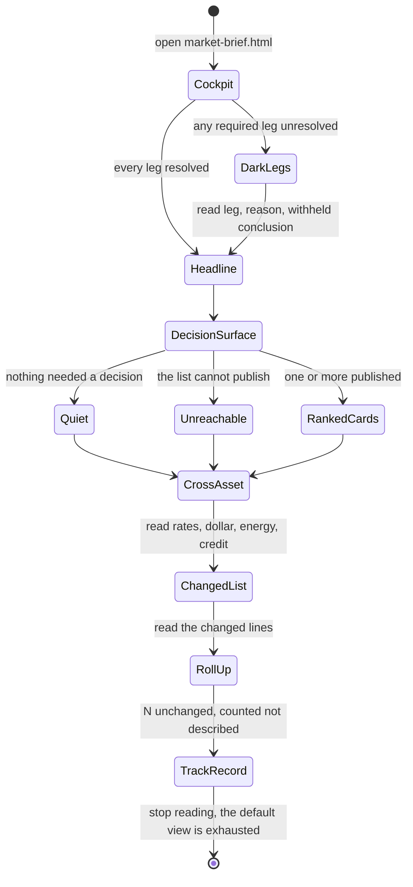
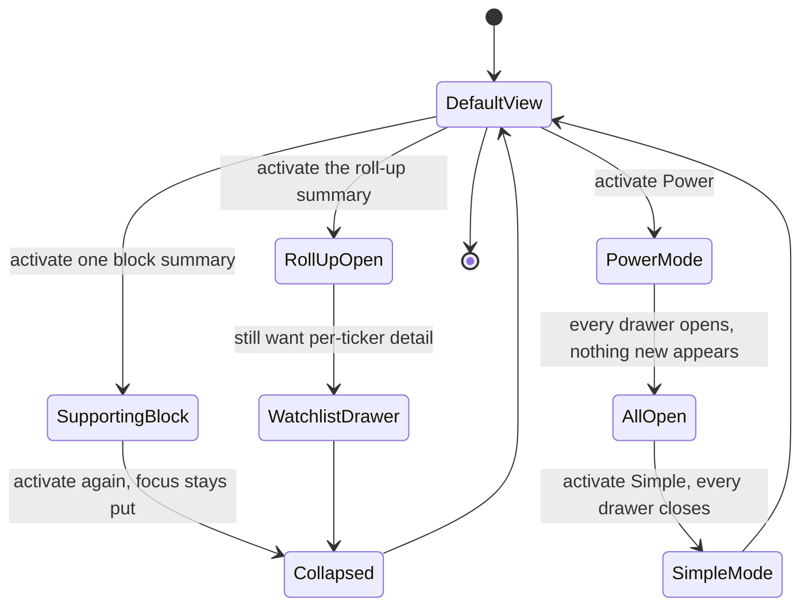
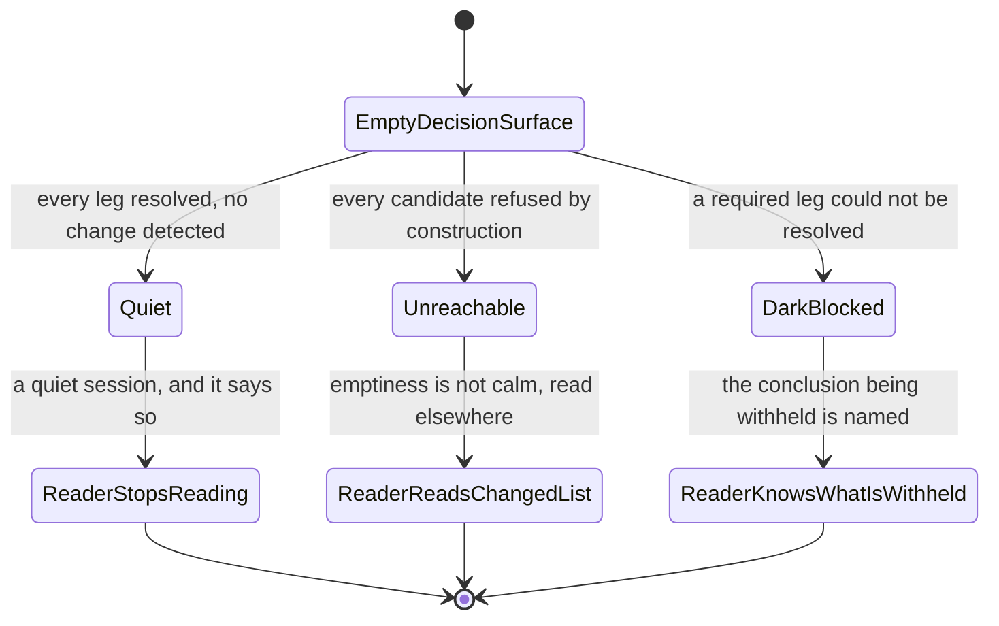
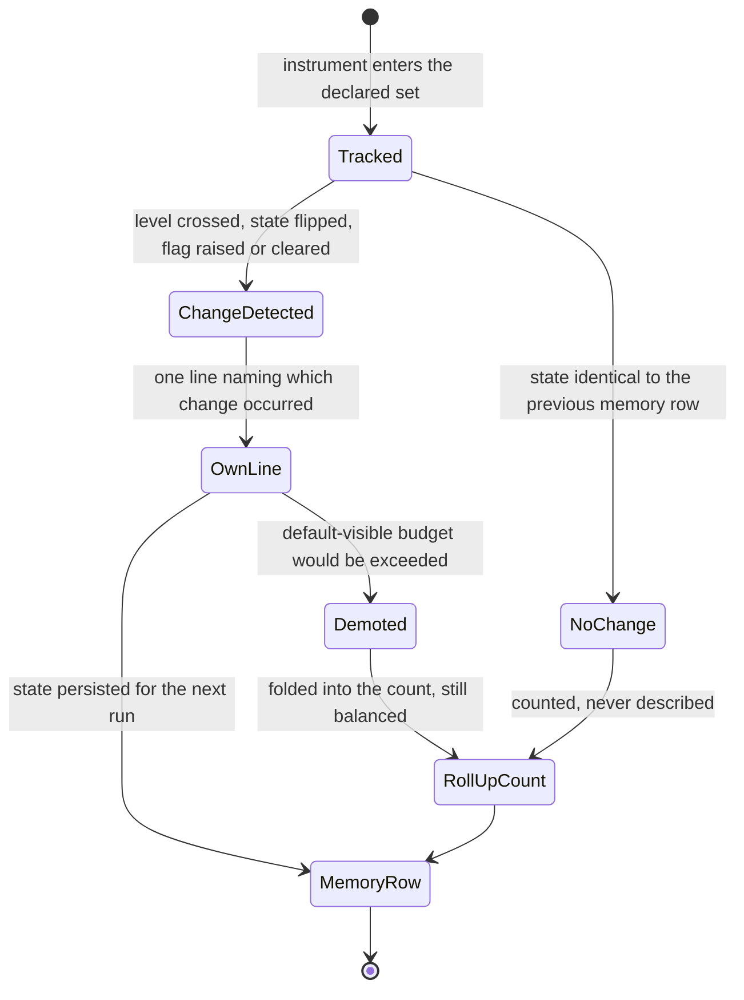

# Feature 026 — Actionable Brief Brevity and Cross-Asset Coverage

**Status:** Top-level delivery and certification remain `not_started`. This
document is the analyst-owned business specification only.
**Host surface:** the existing Market Brief cockpit (`market-brief.html`), its
committed payload, its publication validator and its persisted run memory. **Not**
a new tool. **Not** a new top-level view.
**Educational only — not investment advice.**

---

## Problem Statement

The product publishes a market cockpit four times a day. The owner reads it and
reports that it is not usable: too much text, nothing to act on, the same content
every day, and no way to see the detail only when wanted.

The specification the owner is asking for already exists. `notes/market-brief.md`
§0 opens with it verbatim: *"The brief is a **cockpit**, not another analysis
tool. It answers exactly one question — 'what changed that I should act on, and
what's coming?'"* The same section says the brief **owns** *"the ranked attention
feed (≤ 7 cards)"* and states the golden rule *"keep it actionable and
low-noise"*.

**This is not a missing specification. It is an unenforced one.** Nothing on the
publication path measures the distance between the word *cockpit* and the
committed payload, so the distance grew without opposition. The committed payload
currently carries **127,740 characters** of narrative and **zero** attention
cards. Every part of the machinery below confirms the same root cause at a
different point, and each was re-derived from the working tree during this
analysis.

**The actionable surface is structurally dead, not merely empty.** The committed
`market-brief.payload.json` carries `attention: []`. That is not a quiet window.
`scripts/brief-refresh.mjs` is the 150,594-byte scheduled Tier-A pipeline, and it
contains **zero** occurrences of the string `attention`. The builder
`scripts/build-attention-items.mjs` is therefore not reachable from the scheduled
run. An automated window can only ever emit an empty feed. The three candidates
in the current run were each refused with code `RLATTN-PROVENANCE` on field
`gateResult`, because `rlattention.js` line 487 requires that *"an attention item
is built from an observed gate result"* and no gate result is produced. The
history shows the shape of a hand-maintained roster rather than per-run
detection: pinned at 7 for roughly three weeks, then 5, then 3, then 0 from
2026-08-10 onward across every committed run.

**The call is frozen while the prose churns.** Across the 13 committed runs from
2026-08-14 through 2026-08-17 the recommendation slate is `hold`, `rotate`,
`hedge` — identical every time. Slot 1 has read `hold` on every committed run for
a month. The slate itself mutated roughly six times in that month. The text,
however, is not copy-pasted. Sentence-level identical-sentence overlap between
consecutive days is `backdrop.macroCycle` 6 of 40, `backdrop.pricedIn` 1 of 19,
`backdrop.primaryTrend` 0 of 19 and `nextSession.thesis` 1 of 79. **The prose is
fully regenerated each run around an invariant skeleton and an invariant
conclusion.** That is the precise defect. It is not repetition, which a reader
could learn to skip. It is fresh wording carrying an unchanged decision, which a
reader must read to discover carries nothing. Alongside it,
`payload.watchlistNotes` re-emits 14,905 characters across 12 tickers on every
run whether or not any of those tickers changed state.

**Rates, the dollar and energy are structurally invisible.**
`market-brief.config.json` `track.macroGauges` is `["^VIX", "^VIX9D", "^VIX3M"]`.
There is no yield instrument, no dollar instrument and no currency pair in it.
The bond tool read states *"The bond regime is unresolved… the credit call cannot
be made"*, and no yield level appears anywhere in the payload. The FX tool read
carries the correct subject `JPY` in its metrics and simultaneously states that
*"No FX evidence source is approved for use"*. The research-agenda read reports
that the outcome for `geopolitical-supply-shock` is unavailable. The
configuration carries a standing instruction inside the 2026-07-14 macro event —
*"By 2026-08-10, Hormuz is an active physical supply shock. Re-verify crude,
transit, and insurance each run"* — and the current `events[]` carries three
items about gamma and breadth, monthly expiration and a distant labour-market
revision. No oil. No geopolitics. The standing instruction is not honoured on any
run.

The mechanical cause is that the payload contract has no slot to honour it into.
`scripts/validate-brief-payload.mjs` contains **zero** occurrences of any of
`macroGauge`, `crossAsset`, `rates`, `duration`, `dollar` or `fx`. A field that no
contract requires is a field no run is refused for omitting.

**The data already exists and is discarded.** `scripts/brief-refresh.mjs` line
1288 computes a driver bundle — `uup63`, `tlt63`, `tip63`, `qqq63`, `xle63`,
`xli63`, `gld63`, `btc63`, `dbc63`, `goldSilverRatio63` and `breadth` — and
consumes it only as scoring input to real-asset model scores on the four lines
that follow. None of it is published. The only horizon computed is `ret63`, a
63-day trailing return defined on line 1285. **A 63-day trailing return cannot
detect a three-day yield or currency build**, which is exactly the move a reader
needs a cockpit to catch. The instruments are already committed: `JPY=X` and
`DX-Y` in `fx-regime-universe.json`, `TLT`, `IEF` and `SHY` in
`bond-regime-universe.json`, and `USO` and `BNO` already inside
`market-brief.config.json` `track.realAssets`.

**Checking history returns nothing.** `market-brief.attention-outcomes.jsonl` is
0 bytes. `market-brief.attention-scorecard.json` reports `closedSample: 0`
against `minClosedSample: 20` and was generated on 2026-08-07, because the
scorecard builder is a manual command and not on the scheduled path.
`market-brief.scorecard.json` reports **109 open calls** against three resolved
ones, and all three resolved calls are `hedge` at `tactical` horizon and
confidence 55, all invalidated by the same 2026-08-13 close. A backlog of 109 open
claims against 3 closed ones is a track record that cannot be read.

The persisted memory row makes that permanent. `brief-history.recent.jsonl` rows
carry `ts`, `window`, `marketClosed`, `nextSessionDate`, `regimeBand`,
`regimeScore`, `vix`, `fearGreed` and a benchmark block, plus a contract version.
It is a single-benchmark snapshot. There are no yields, no currencies, no crude,
no breadth, no dealer positioning, **and no record of what the brief itself
said**. A run therefore cannot see a multi-day macro build, and cannot open with
*"here is what changed since I last told you"*, because it has no memory of what
it last told anyone.

**There is no output budget, and almost no progressive disclosure.**
`notes/market-brief.md` is 54,898 bytes and contains no character cap and no word
cap anywhere. The only committed budget, `artifact-budget/v1`, caps **data
fetch** — 48 symbols per run, 200 bars per symbol per trading date. It never caps
prose. On the rendering side, `market-brief.html` carries **4** disclosure drawers
across the **14** render sections in `rlbrief.js`, and two of those four are the
evidence drawer and the experimental drawer. The backdrop, the recommendations,
the watchlist, the tool reads, the events and the groups are permanently
expanded. Every one of the 127,740 characters is in the reader's face on load.

**The feature's job is therefore narrow and mechanical.** It does not invent a
new cockpit doctrine. It makes the doctrine already written in `notes/market-
brief.md` §0 into something the publication path can refuse a run for violating.

---

## Outcome Contract

**Intent.** A reader opens the brief and sees, in seconds, only what changed and
what it means for a decision. Anything that did not change is a counted line, not
a paragraph. Rates, the dollar and energy are read on a horizon short enough to
catch a multi-session build. Anything the brief genuinely cannot see is stated at
the top as a first-class blind spot rather than buried in prose. Every supporting
paragraph is one control away, never on screen by default. Every claim the brief
makes is recorded and later resolved, so the reader can ask what it said last
time and whether it was right.

**Success signal.** A published run fits inside a declared default-visible
narrative budget, and a run that does not fit is refused rather than published.
Each tracked instrument earns narrative only when its own state changed, and the
unchanged remainder appears as one counted roll-up line. A rates reading, a
dollar or currency reading and an energy reading each appear on every run, each
carrying a measured change over a stated number of recent sessions. Any required
leg the run cannot resolve appears at the top of the default view naming itself
and naming what it prevents the brief concluding. Every supporting block is
collapsed on load, opens by keyboard alone, and works from a local file with no
build step and no credentials. The open-claim backlog is published on every run
alongside the count resolved in that run, and it stops growing without bound.

**Hard constraints.**

- **The budget is fail-closed, never advisory.** A run over budget does not
  publish with a warning. It does not publish. *(P22)*
- **Regenerated prose around an unchanged conclusion is the defect.** Novel
  wording is not evidence of a changed state, and it never earns a slot. *(§1)*
- **Absence is a state, never a silence.** An unresolvable leg publishes a dark
  state naming itself and its reason. It is never omitted and never softened into
  a clause. *(P2)*
- **Confidence describes evidence, never odds.** A cross-asset reading states
  what was measured over how many sessions. It never states a probability of a
  trade working. *(P3)*
- **Misses stay visible.** A resolved claim that went against the brief renders
  at the same prominence as one that went for it, and no rate publishes below its
  declared minimum sample. *(P4, P5)*
- **Progressive disclosure never hides a negative.** A dark state, a miss or an
  invalidation is never placed behind a collapsed control. *(P2, P4, P14)*
- **Deep-link, never duplicate.** A cross-asset reading links to the tool that
  owns the underlying math and does not recompute it. *(P16, P19)*
- **Reuse what is already fetched.** A cross-asset reading derives from an
  instrument already in the committed universe wherever one exists. *(P11)*
- **Tickers only, forever.** No position, size, cost basis, profit figure or
  credential enters any artifact this feature touches. *(P13)*
- **Model text is data.** Every authored string renders escaped at every sink.
  *(P8)*
- **Works with nothing.** The brief opens and discloses with no key, no account
  and no server, painting first from committed data. *(P9, P12)*
- **No build step and no browser ES modules.** *(P10)*
- **Append-only memory.** A memory row or an outcome record is appended. A
  correction is a new entry referencing the original. *(P21)*
- **A budget is never raised to make a red check green.** *(P22)*

**Failure condition.** The feature has failed, even with every test green, if any
of the following is true. A run publishes over its declared budget. An unchanged
instrument still receives its own paragraph. A required leg is unresolvable and
the reader cannot tell from the default view. A cross-asset reading is published
on a 63-day horizon only, so a three-day build stays invisible. A collapsed
control hides a dark state, a miss or an invalidation. The open-claim backlog
keeps growing because resolution stays a manual command. The memory row still
cannot answer what the brief said last run. Or the budget cap is raised inside
the same change that would otherwise have failed against it.

---

## Goals

1. Give the default view a mechanically enforced size, so *cockpit* becomes a
   checkable property rather than an aspiration.
2. Make narrative earn its place by state change, and collapse the unchanged
   remainder to a counted line.
3. Publish rates, dollar and energy readings on a horizon short enough to see a
   multi-session build.
4. Turn an unresolvable leg into a visible, named blind spot at the top of the
   brief.
5. Move every supporting block behind an accessible, build-free disclosure
   control.
6. Close the claim loop on the publication path, so the open backlog stops
   growing and the track record becomes readable.
7. Give the persisted run memory enough state to detect change and to remember
   what the brief itself claimed.

## Non-Goals

1. **No new external paid data provider.** The feature works inside the existing
   free and public source posture. *(P9)*
2. **No build step, no bundler and no browser ES modules.** The repository stays
   build-free, UMD and `file://` compatible. *(P10)*
3. **No change to the four-times-a-day schedule.** The generation windows and
   their publication targets are unchanged.
4. **No position size, cost basis, profit figure or credential in any committed
   artifact.** Tickers only. *(P13)*
5. **No new top-level view and no new registered tool.** The work lands inside
   the existing cockpit.
6. **No lowering of any existing admission bar.** Alert severity thresholds,
   action-contract fields and the low-noise gate keep their current values.
7. **No replacement of any owning tool's math.** Rates, currency and energy math
   stay with the tools that own them, and this feature consumes and links.
8. **No rewrite of the recommendation ledger's scoring rules.** This feature
   changes when resolution runs, not how a call is scored.

---

## Release Train

This repository has no release-train model. `config/` holds only
`domain-model.yaml`. No release-train configuration and no per-train feature-flag
bundle exists anywhere in the tree. The product ships as a static, build-free
site assembled by `scripts/build-pages-site.mjs`.

This feature therefore declares no train and no flag. It also adds no new root
page, so the registry-or-exclusion control that governs a new route does not
apply. Its reachability control is the existing cockpit route, which is already
registered.

---

## Current Capability Map

Derived from the committed payload, configuration, scripts, notes and state files
during this analysis. Where a note and the code disagree, the code wins and the
drift is recorded.

| # | Capability | Owner today | Available today | State for this feature |
| --- | --- | --- | --- | --- |
| 1 | Default-visible narrative budget | nothing | none | **Absent.** `notes/market-brief.md` carries no character or word cap. |
| 2 | Data-fetch budget | `artifact-budget/v1` in `market-brief.config.json` | 48 symbols per run, 200 bars per symbol per trading date | Existing, and it caps input rather than output. |
| 3 | Payload field validation | `scripts/validate-brief-payload.mjs` | per-action field contract | Existing, and it is the natural fail-closed seam. |
| 4 | Attention feed contract | `rlattention.js` | refusal codes including `RLATTN-PROVENANCE` | Existing and unreachable from the scheduled run. |
| 5 | Attention item builder | `scripts/build-attention-items.mjs` | runs every window; refuses every candidate on absent `gateResult` provenance | **Unreachable.** |
| 6 | Scheduled Tier-A pipeline | `scripts/brief-refresh.mjs` | full payload composition | Existing, and it contains no reference to attention. |
| 7 | Cross-asset driver computation | `scripts/brief-refresh.mjs` line 1288 | 10 driver values plus breadth | **Computed and discarded.** Consumed only as scoring input. |
| 8 | Short-horizon change measurement | nothing | only `ret63`, a 63-day trailing return | **Absent.** |
| 9 | Rates instruments | `bond-regime-universe.json` | `TLT`, `IEF`, `SHY` | Committed and absent from `track.macroGauges`. |
| 10 | Currency instruments | `fx-regime-universe.json` | `JPY=X`, `DX-Y` | Committed and absent from `track.macroGauges`. |
| 11 | Energy instruments | `market-brief.config.json` `track.realAssets` | `USO`, `BNO` | Committed and never surfaced as a cross-asset reading. |
| 12 | Cross-asset payload slot | nothing | none | **Absent.** The validator names no cross-asset field. |
| 13 | Progressive disclosure | `market-brief.html` | 4 drawers across 14 render sections | Partial, and two of the four are evidence and experimental. |
| 14 | Recommendation outcome ledger | `market-brief.scorecard.json` | 109 open, 3 resolved | Existing and unbalanced. |
| 15 | Attention outcome record | `market-brief.attention-outcomes.jsonl` | 0 bytes | **Empty.** |
| 16 | Attention interruption rate | `market-brief.attention-scorecard.json` | `closedSample: 0`, `minClosedSample: 20` | Contract exists, sample is zero, builder is manual. |
| 17 | Persisted run memory | `brief-history.recent.jsonl` | benchmark, regime, VIX, fear-greed | Existing and single-benchmark. No cross-asset, no self-record. |
| 18 | Cockpit doctrine | `notes/market-brief.md` §0 | written, unenforced | **The contract this feature makes mechanical.** |

---

## Honest Findings

Each finding was re-derived from the working tree during this analysis. Where a
prior review's figure did not reproduce, the re-derived figure is recorded and
the difference is stated rather than absorbed.

**F-026-1 — The attention path cannot fire, because no producer of observed gate
results exists.** `scripts/build-attention-items.mjs` *does* run on the
publication path — `scripts/brief-refresh-and-push.sh` line 514 invokes it
`--recompose --write` every window — and it refuses every candidate with
`RLATTN-PROVENANCE` on `gateResult`. Refusal counts vary run to run (2 to 7),
which is positive proof the builder executes against live candidates. The
`decision-attention/v1` contract composes an item from an observed `gateResult`,
an `authored` judgement and a deterministic `ctx`; only the latter two have a
producer anywhere in the repository. Every automated window therefore publishes
an empty feed by construction. This is the finding with the widest consequence,
because the feed is the surface the cockpit doctrine says the brief owns.

> An earlier framing of this finding — repeated from the originating review —
> asserted that the builder had *no scheduled caller*, inferred from
> `scripts/brief-refresh.mjs` containing zero occurrences of `attention`. That
> inference was wrong: the caller lives in the shell orchestrator
> `scripts/brief-refresh-and-push.sh`, not in the Node Tier-A script. The
> refutation is recorded in `specs/_bugs/BUG-009-decision-attention-gate-result-producer-absent/`
> as `DISC-009-003`. Wiring is not the remedy and would change nothing.

**F-026-2 — Regenerated prose around an invariant conclusion is the real
defect.** The recommendation slate has been identical across 13 consecutive
committed runs, while sentence-level overlap between consecutive days runs from
0 of 19 to 6 of 40 depending on the field. Any requirement written against
*repetition* would miss this entirely. The requirement has to be written against
*unchanged state*.

**F-026-3 — The payload schema has no cross-asset slot at all.**
`scripts/validate-brief-payload.mjs` names none of `macroGauge`, `crossAsset`,
`rates`, `duration`, `dollar` or `fx`. The absence is upstream of the missing
data. Adding instruments without adding a required slot would leave the omission
unrefusable.

**F-026-4 — The drivers are already computed and thrown away.** Line 1288 of the
pipeline builds ten driver values plus breadth and uses them only to score
real-asset models. Closing the cross-asset gap is largely a publication problem,
not an acquisition problem. That materially lowers the cost of this feature and
must not be overstated into "no new work".

**F-026-5 — 63 days is the only horizon the pipeline computes.** Line 1285
defines `ret63` and every driver derives from it. No short-horizon measurement
exists anywhere in the composition path. A short horizon is genuinely new work.

**F-026-6 — A standing research instruction has no mechanical consequence.** The
configuration carries a re-verify-each-run instruction for crude, transit and
insurance. The current `events[]` honours none of it. An instruction that no
check reads is a comment.

**F-026-7 — Resolution is manual, so the backlog is structural.** 109 open calls
against 3 resolved ones, and a 0-byte attention outcome file with a scorecard
generated on 2026-08-07, all follow from the same cause. The scorecard builder is
a manual command. Until resolution runs on the publication path, the backlog
grows by construction.

**F-026-8 — The memory row cannot support change detection.** The persisted row
is a single-benchmark snapshot with no cross-asset values and no record of the
run's own claims. Both delta-only publishing and the persistence gate need state
the row does not carry.

**F-026-9 — Four of the reviewed figures did not reproduce exactly. They are
corrected here rather than repeated.** The direction of each finding is
unchanged, and in one case the re-derived evidence is stronger than the claim it
replaces.

| Reviewed claim | Re-derived value | Effect |
| --- | --- | --- |
| `watchlistNotes` is 15,229 characters | **14,905** characters across 12 tickers | The re-derived total narrative of **127,740** characters matches the review exactly. Two sub-line items differ, so the breakdown is restated from this analysis. `backdrop` re-derives as **11,956** characters rather than roughly 7,770. `nextSession` (17,277), `toolReads` (8,258) and `recommendations` (10,881) reproduce. |
| `closedSample: 0` and `minClosedSample: 20` are top-level fields | Both are nested under `.overall` of `attention-scorecard/v1` | The values are confirmed. The path is corrected, because a requirement written against the wrong path would not be checkable. |
| `attention` is `[]` on every committed run since 2026-08-10 | **Reproduced as stated.** All three committed 2026-08-10 runs carry `[]`; the last non-empty run is 2026-08-09 after-hours | An earlier draft of this table asserted a 2026-08-11 boundary with a mixed 2026-08-10. That was wrong and is withdrawn. The reviewed claim stands unchanged. |
| The slate is identical on 2026-08-16 and 2026-08-17 | Identical across **13 consecutive committed runs**, 2026-08-14 through 2026-08-17 | The evidence is **stronger** than the claim it replaces. |

One further correction of the same kind: `market-brief.scorecard.json`
`recentMisses` is an array of three resolved entries rather than the scalar `3`.
The count of three is confirmed.

---

## Domain Capability Model

### Capability

**Decision-surface budgeting and change-gated publication for a periodic
cockpit.** Given a composed run, determine which material has earned a place in
the default view by having changed state, measure the resulting default-visible
output against a declared budget, refuse the run if it does not fit, publish
everything else behind disclosure, name every leg the run could not resolve, and
record what the run claimed so a later run can resolve it.

The capability is reusable by construction. It has more than one governed
material class (a decision card, a per-instrument line, a cross-asset reading, a
dark state), more than one disposition per item (published, rolled up, disclosed,
refused), and more than one plausible consuming surface (the market cockpit
today, and any per-tool brief that later publishes a periodic read). It is
therefore specified as a capability with a surface-neutral vocabulary rather than
as a rendering change to one page.

### Domain Primitives

**Output Budget** — a declared triple of caps covering one headline, one decision
card and the total default-visible narrative of a run. *Lifecycle:* declared in
one committed policy, measured on every publication attempt, changed only by a
recorded owner decision.

**Tracked Instrument** — a ticker or driver the brief follows across runs.
*Lifecycle:* enters the tracked set, carries a state on each run, leaves the
tracked set.

**State Change** — the event that entitles a tracked instrument to narrative in
the default view, drawn from a closed vocabulary: a level crossed, a state flip,
a flag raised or a flag cleared. *Lifecycle:* detected against the prior run's
persisted state, consumed by the current run, persisted for the next.

**Roll-Up Line** — the single counted line that stands for every tracked
instrument with no state change this run. *Lifecycle:* recomputed each run, never
expanded into per-instrument prose in the default view.

**Cross-Asset Reading** — a named driver, a measured change and the number of
recent sessions over which it was measured, for one of rates, dollar or currency,
and energy. *Lifecycle:* computed from committed instruments, published, and
persisted into the memory row.

**Required Leg** — a member of the declared set the brief asserts it needs in
order to reach a conclusion: rates, dollar or currency, energy, and credit.
*Lifecycle:* resolved, or dark with a named reason.

**Dark State** — the first-class published statement that a required leg could
not be resolved, naming the leg, the reason, and what it prevents the brief
concluding. *Lifecycle:* raised when a leg fails to resolve, cleared when it
resolves, never silently omitted.

**Published Claim** — anything the run asserts that a later run could check,
carrying the observation that would resolve it. *Lifecycle:* open → resolved as
supported, resolved as contradicted, or recorded not-evaluable.

**Run Memory Row** — the persisted per-run state carrying the cross-asset
readings, the tracked-instrument states and the run's own published claims and
dark legs. *Lifecycle:* append-only, versioned, extended additively.

### Relationships

- One **Run** has exactly one **Output Budget** measurement and either publishes
  or is refused. There is no partial publication.
- One **Tracked Instrument** yields at most one narrative item per run, and yields
  it only when it has a **State Change**. Every tracked instrument without one is
  counted into exactly one **Roll-Up Line**.
- One **Required Leg** resolves to a **Cross-Asset Reading** or raises a **Dark
  State**. It never does neither, and it never does both.
- One **Run** produces zero or more **Published Claims** and attempts to resolve
  every open claim from prior runs.
- One **Run** appends exactly one **Run Memory Row**, and that row is the sole
  input to the next run's **State Change** detection.

### Business Policies

1. **The budget governs the default view only.** Narrative behind a disclosure
   control is measured separately and reported separately. Collapsing text is not
   the same as deleting it, and the spec must not let one masquerade as the other.
2. **State change, never novelty, earns a slot.** Regenerated wording around an
   unchanged conclusion is explicitly not a state change.
3. **The roll-up balances.** Instruments with narrative plus instruments in the
   roll-up equals the tracked set. A discarded instrument is a defect, not a
   simplification.
4. **A required leg is declared, not inferred.** The set is committed, so a leg
   cannot be quietly dropped to avoid raising a dark state.
5. **A dark state outranks narrative.** It renders above supporting material in
   the default view.
6. **Resolution runs where publication runs.** A resolution step that only a
   human can trigger is the defect this feature exists to remove.
7. **Every cap and every threshold has a test that can fail.** *(P22, P23)*
8. **One definition per concept.** The change vocabulary, the required-leg set,
   the budget triple and the memory-row contract are each defined once and read
   by every consumer. *(P19)*
9. **Nothing here lowers an existing bar.** Where this feature meets an existing
   contract, it adds a requirement or a slot. It never relaxes one.

### Behaviour Vocabulary

| Term | Meaning | Source of truth |
| --- | --- | --- |
| `defaultVisible` | narrative on screen before any control is operated | this capability |
| `disclosed` | narrative reachable behind exactly one disclosure control | this capability |
| `stateChange` | level crossed, state flip, flag raised, flag cleared | this capability, one closed vocabulary |
| `rollUp` | the counted line standing for unchanged instruments | this capability |
| `crossAssetReading` | driver, measured change, session count | this capability |
| `requiredLeg` | rates, dollar or currency, energy, credit | this capability, one committed set |
| `dark` | a required leg that could not be resolved, with a reason | this capability |
| `openClaim` | a published assertion awaiting resolution | the existing outcome ledger |
| `notEvaluable` | a claim no observation can resolve | the existing outcome ledger |
| `window` | one of the four daily generation windows | `market-brief-config-page/v1` |

---

## Actors

| Actor | Description | Goals | Boundaries |
| --- | --- | --- | --- |
| **A-1 · The operator** | The single reader of the cockpit, running a small public book with limited attention | See what changed and what it means in seconds, open detail only on demand, and later check whether the brief was right | Reads only. Enters no order through this product. No private position data reaches any artifact. |
| **A-2 · The research agent** | The agent authoring narrative into each generation window | Write only what a changed state justifies, and state plainly what it could not resolve | Cannot raise a budget cap. Cannot suppress a dark state. Its text is data, never markup. |
| **A-3 · The scheduled pipeline** | The Tier-A process composing the payload four times a day | Compose, measure against the budget, detect change, resolve prior claims, and publish atomically or not at all | Deterministic. No wall clock and no randomness in selection or ordering. |
| **A-4 · The publication validator** | The contract check that stands between a composed run and a published one | Refuse a run that violates any declared cap, slot or field requirement, naming the violation | Has no advisory mode. Has no bypass flag. |
| **A-5 · The maintainer** | The single operator tuning declared thresholds | Judge whether the budget and the required-leg set are right from published evidence | May change a declared cap as a recorded decision. May not raise a cap inside the change that would otherwise fail against it. |

---

## Use Cases

### UC-026-001: Read the brief in seconds

**Actor:** A-1 · The operator
**Preconditions:** A generation window has published.
**Main flow:**
1. The operator opens the cockpit.
2. Any dark legs appear first, each naming itself and what it blocks.
3. The decision surface shows the calls and the instruments that changed state.
4. A single counted line stands for everything that did not change.
5. The operator stops reading, having seen everything the default view holds.
**Alternative flows:** Nothing changed and no leg is dark. The default view says so and shows the roll-up count alone.
**Postconditions:** The operator knows what changed, what is blind, and what is unchanged, without opening anything.

### UC-026-002: Open the detail behind one item

**Actor:** A-1
**Preconditions:** A published run with at least one supporting block.
**Main flow:**
1. The operator activates the disclosure control on one block.
2. The supporting narrative for that block appears.
3. The operator reads it and collapses it again.
**Alternative flows:** The operator navigates by keyboard alone and reaches the same result.
**Postconditions:** Detail was available on demand and absent by default.

### UC-026-003: See a multi-session rates or currency build

**Actor:** A-1
**Preconditions:** A required leg resolved this run.
**Main flow:**
1. The operator reads the cross-asset block in the default view.
2. Each reading names its driver, its measured change and the session count.
3. The operator follows the deep link into the tool that owns that math.
**Alternative flows:** The change is small and the reading still publishes with its measured value.
**Postconditions:** A three-session build is visible without opening another tool first.

### UC-026-004: Learn what the brief cannot see

**Actor:** A-1
**Preconditions:** At least one required leg failed to resolve.
**Main flow:**
1. The operator opens the cockpit.
2. The dark state appears at the top naming the leg and the reason.
3. It states what conclusion the brief is therefore withholding.
**Alternative flows:** Every leg resolved and no dark state renders.
**Postconditions:** The operator is not left inferring a blind spot from a missing paragraph.

### UC-026-005: Check what the brief said last time

**Actor:** A-1
**Preconditions:** Prior runs published claims.
**Main flow:**
1. The operator reads the outcome summary in the default view.
2. It shows the count of claims resolved this run and the open backlog.
3. Contradicted claims render at the same prominence as supported ones.
**Alternative flows:** The closed sample is below its declared minimum. No rate is stated and the sample size is shown instead.
**Postconditions:** The track record is readable, including its unfinished part.

### UC-026-006: Author a window without padding it

**Actor:** A-2 · The research agent
**Preconditions:** A composed run with several unchanged instruments.
**Main flow:**
1. The agent writes narrative only for instruments that changed state.
2. It writes one roll-up line for the remainder.
3. It records a dark state for each unresolved required leg.
**Alternative flows:** The agent's draft exceeds a cap. It shortens the draft rather than requesting a cap change.
**Postconditions:** The published run carries no restatement of an unchanged position.

### UC-026-007: Refuse an over-budget run

**Actor:** A-4 · The publication validator
**Preconditions:** A composed run exceeding a declared cap.
**Main flow:**
1. The validator measures default-visible narrative against every cap.
2. It names the exceeding field and reports the measured value against the cap.
3. It refuses the run and nothing publishes.
**Alternative flows:** The run also omits a required cross-asset slot. Every violation is named, not just the first.
**Postconditions:** No over-budget payload reaches the reader.

### UC-026-008: Judge whether the budget is right

**Actor:** A-5 · The maintainer
**Preconditions:** Several published runs.
**Main flow:**
1. The maintainer reads the published default-visible and disclosed measurements.
2. The maintainer decides whether a cap needs changing.
3. The change is recorded as its own decision, separate from any run it would have refused.
**Alternative flows:** The evidence says the cap is right and nothing changes.
**Postconditions:** A cap changes only on evidence, never to turn a red check green.

---

## Business Scenarios

Each scenario is independently testable and maps one-to-one to a stable
`SCN-026-NNN` identifier at planning time.

### Cluster 1 — Enforced output budget

#### BS-026-001: An over-budget run is refused rather than published

```gherkin
Scenario: The budget is fail-closed
  Given a composed run whose default-visible narrative exceeds the declared total cap
  When the run is validated for publication
  Then validation fails naming the exceeding measurement and the cap
  And no part of the run is published
```

#### BS-026-002: An over-length headline is refused

```gherkin
Scenario: The headline cap is enforced per item
  Given a composed run containing one headline longer than the declared headline cap
  When the run is validated for publication
  Then validation fails naming that headline
  And no part of the run is published
```

#### BS-026-003: An over-length decision card is refused

```gherkin
Scenario: The per-card cap is enforced independently of the total
  Given a composed run whose total default-visible narrative is within the total cap
  And one decision card exceeds the declared per-card cap
  When the run is validated for publication
  Then validation fails naming that card
```

#### BS-026-004: Disclosed narrative is measured separately

```gherkin
Scenario: Collapsing text is not the same as removing it
  Given a composed run with narrative behind disclosure controls
  When the run is measured
  Then the default-visible measurement excludes the disclosed narrative
  And the disclosed narrative is measured and reported as its own figure
```

#### BS-026-005: A cap is not raised to rescue a failing run

```gherkin
Scenario: A budget is an assertion, not a negotiation
  Given a run that fails against a declared cap
  When the cap value is inspected
  Then it is unchanged by that run
  And any change to it is a separate recorded decision
```

### Cluster 2 — Delta-only publishing

#### BS-026-006: An unchanged instrument receives no narrative

```gherkin
Scenario: A hold is not restated
  Given a tracked instrument whose state is identical to the previous published run
  When the run is composed
  Then no per-instrument narrative is published for it in the default view
```

#### BS-026-007: A changed instrument earns narrative

```gherkin
Scenario: A state change is what buys a slot
  Given a tracked instrument that crossed a declared level since the previous published run
  When the run is composed
  Then per-instrument narrative is published for it
  And the narrative names which change occurred
```

#### BS-026-008: Rewritten prose is not a state change

```gherkin
Scenario: Novel wording around an unchanged conclusion earns nothing
  Given a tracked instrument whose state is unchanged
  And whose authored narrative differs entirely from the previous run
  When the run is composed
  Then it is treated as unchanged
  And it receives no per-instrument narrative in the default view
```

#### BS-026-009: The unchanged remainder collapses to one counted line

```gherkin
Scenario: Unchanged instruments are counted, not described
  Given several tracked instruments with no state change
  When the run is composed
  Then exactly one roll-up line is published for them
  And it states how many instruments it stands for
```

#### BS-026-010: The roll-up balances against the tracked set

```gherkin
Scenario: No instrument is silently dropped
  Given a tracked instrument set of a known size
  When the run is composed
  Then the count with published narrative plus the count in the roll-up equals that size
```

### Cluster 3 — Cross-asset coverage

#### BS-026-011: Every run publishes a rates, a dollar and an energy reading

```gherkin
Scenario: The three legs are present on every run
  Given any published run
  Then it carries a rates reading
  And it carries a dollar or currency reading
  And it carries an energy reading
```

#### BS-026-012: A reading carries a short multi-session horizon

```gherkin
Scenario: A three-day build is detectable
  Given a cross-asset reading
  Then it states a measured change over a stated number of recent sessions
  And that session count is shorter than the long trailing horizon
```

#### BS-026-013: A reading names its driver and its measurement

```gherkin
Scenario: The reading is expressible as driver, change and sessions
  Given a cross-asset reading
  Then it names the driver
  And it states the measured change
  And it states the number of sessions measured
```

#### BS-026-014: A missing cross-asset slot refuses the run

```gherkin
Scenario: The schema makes the omission refusable
  Given a composed run with no cross-asset block
  When the run is validated for publication
  Then validation fails naming the missing block
```

#### BS-026-015: An already-committed instrument is reused rather than refetched

```gherkin
Scenario: Coverage comes from data already on hand
  Given a required leg with an instrument already in the committed universe
  When its reading is composed
  Then that committed instrument is used
  And no new external provider is introduced
```

#### BS-026-016: A standing configuration instruction produces an outcome

```gherkin
Scenario: A re-verify-each-run instruction cannot be silently ignored
  Given a standing research instruction recorded in the brief configuration
  When a run is composed
  Then the run publishes either a reading that honours it or a named unresolved state for it
```

### Cluster 4 — Explicit blindness

#### BS-026-017: An unresolvable required leg publishes a dark state

```gherkin
Scenario: Unresolvable is not omitted
  Given a required leg that cannot be resolved this run
  When the run is composed
  Then a dark state is published naming that leg
  And it states the reason the leg could not be resolved
```

#### BS-026-018: A dark state renders at the top of the default view

```gherkin
Scenario: Blindness outranks narrative
  Given a run carrying at least one dark state
  When the reader opens the brief
  Then the dark state appears in the default view above the supporting blocks
```

#### BS-026-019: A dark state states what it blocks

```gherkin
Scenario: The reader learns the consequence, not just the gap
  Given a published dark state
  Then it names the conclusion the brief is withholding because of it
```

#### BS-026-020: A dark state is never expressed only inside a paragraph

```gherkin
Scenario: The blind spot is structured, not buried
  Given a required leg that could not be resolved
  When the run is composed
  Then the dark state is a distinct published item
  And it is not represented solely as a clause inside supporting narrative
```

### Cluster 5 — Progressive disclosure

#### BS-026-021: Every supporting block is collapsed by default

```gherkin
Scenario: The default view is the decision surface only
  Given a published run
  When the reader opens the brief and operates no control
  Then only the decision surface, the dark states and the roll-up are visible
  And every supporting block is collapsed
```

#### BS-026-022: Disclosure works by keyboard alone

```gherkin
Scenario: The detail is reachable without a pointer
  Given a collapsed supporting block
  When the reader reaches it and activates it using the keyboard only
  Then the block expands
  And its expanded state is exposed to assistive technology
```

#### BS-026-023: Disclosure works with no build step and from a local file

```gherkin
Scenario: The cockpit stays build-free
  Given the brief opened directly from a local file with no server and no credentials
  When the reader expands a block
  Then the block expands using committed data only
```

#### BS-026-024: A negative is never hidden behind a control

```gherkin
Scenario: Disclosure does not become concealment
  Given a run carrying a dark state, a resolved miss and an invalidation
  When the reader opens the brief
  Then none of them is placed behind a collapsed control
```

### Cluster 6 — Closed loop and self-scoring

#### BS-026-025: A run records what it claimed

```gherkin
Scenario: Every claim carries its resolution condition
  Given a published claim
  Then it is recorded with the observation that would resolve it
```

#### BS-026-026: Resolution runs on the publication path

```gherkin
Scenario: The backlog stops depending on a manual command
  Given open claims from prior runs
  When a run publishes
  Then it has attempted to resolve each of them against observed data
  And it publishes how many it resolved and how many remain open
```

#### BS-026-027: An unresolvable claim is recorded, not dropped

```gherkin
Scenario: The denominator stays honest
  Given a published claim that no observation can resolve
  When resolution runs
  Then it is recorded as not-evaluable
  And it is not removed from the published totals
```

#### BS-026-028: Misses publish at equal prominence and thin rates are withheld

```gherkin
Scenario: The track record shows its failures and its sample
  Given resolved claims including contradicted ones
  When the outcome summary renders
  Then contradicted claims appear at the same prominence as supported ones
  And any rate below its declared minimum closed sample is withheld with the sample size shown
```

### Cluster 7 — Run-specific memory

#### BS-026-029: The memory row carries the cross-asset readings and the run's own claims

```gherkin
Scenario: The run remembers what it saw and what it said
  Given a published run
  Then its persisted memory row carries that run's cross-asset readings
  And it carries the claims and the dark states that run published
```

#### BS-026-030: The memory row is sufficient for change detection

```gherkin
Scenario: The next run can detect change without refetching
  Given the persisted memory row of the previous published run
  When the next run detects state changes
  Then every change is determined from that row and the current run's own readings
```

#### BS-026-031: Memory is appended, never rewritten

```gherkin
Scenario: A correction is a new row
  Given a memory row that was wrong
  When it is corrected
  Then a new row is appended referencing the original
  And no prior row is modified or removed
```

---

## Functional Requirements

Forty functional requirements across an intended five scopes. This sits at the
**P25** cap of roughly forty requirements and five scopes. The split seam appears
in the Change Magnitude Decision below.

### Enforced output budget

- **FR-026-001** The brief MUST declare its output budget in exactly one
  committed policy, covering a per-headline cap, a per-decision-card cap and a
  total default-visible cap.
- **FR-026-002** The publication path MUST measure a composed run's
  default-visible narrative against every declared cap before publication.
- **FR-026-003** A run exceeding any declared cap MUST be refused, and a refused
  run MUST NOT publish any part of itself.
- **FR-026-004** The budget MUST apply to default-visible narrative only.
  Disclosed narrative MUST be measured separately and MUST be published as its
  own reported figure.
- **FR-026-005** A budget failure MUST name the exceeding field and MUST state
  the measured value against the cap it exceeded.
- **FR-026-006** A cap value MUST NOT change inside a change that would otherwise
  fail against it. Changing a cap MUST be a separately recorded owner decision.

### Delta-only publishing

- **FR-026-007** The set of instruments the brief tracks MUST be declared, and
  every tracked instrument MUST carry a state on every run.
- **FR-026-008** The change vocabulary MUST be closed and declared, covering a
  level crossed, a state flip, a flag raised and a flag cleared.
- **FR-026-009** A tracked instrument MUST receive per-instrument narrative in
  the default view only when its own state changed since the previous published
  run.
- **FR-026-010** A difference in authored wording alone MUST NOT be treated as a
  state change.
- **FR-026-011** Every tracked instrument with no state change MUST be counted
  into exactly one roll-up line that states the count and the unchanged state.
- **FR-026-012** The count of instruments with published narrative plus the count
  in the roll-up MUST equal the declared tracked set size.

### Cross-asset coverage

- **FR-026-013** Every published run MUST carry a rates reading, a dollar or
  currency reading, and an energy reading.
- **FR-026-014** Every cross-asset reading MUST carry at least one short
  multi-session horizon in addition to any long trailing horizon it reports.
- **FR-026-015** Every cross-asset reading MUST name its driver, state its
  measured change, and state the number of recent sessions the change was
  measured over.
- **FR-026-016** A cross-asset reading MUST derive from an instrument already
  present in the committed universe wherever such an instrument exists, and MUST
  NOT introduce a new external provider.
- **FR-026-017** The payload contract MUST declare a required cross-asset slot,
  and the publication validator MUST refuse a run that omits it.
- **FR-026-018** A cross-asset driver the composition path already computes MUST
  be published rather than consumed only as an internal scoring input.
- **FR-026-019** A standing research instruction recorded in the brief
  configuration MUST produce, on every run, either a published reading honouring
  it or a named unresolved state for it.

### Explicit blindness

- **FR-026-020** The required-leg set MUST be declared in one committed location
  and MUST cover rates, dollar or currency, energy and credit.
- **FR-026-021** A required leg that cannot be resolved MUST publish a dark state
  naming the leg and naming the reason it could not be resolved.
- **FR-026-022** Every dark state MUST render in the default view above the
  supporting blocks.
- **FR-026-023** A dark state MUST be a distinct published item and MUST NOT be
  represented solely as a clause inside supporting narrative.
- **FR-026-024** Every dark state MUST name the conclusion the brief is
  withholding because of it.

### Progressive disclosure

- **FR-026-025** The default view MUST contain only the decision surface, the
  dark states, the changed-instrument narrative and the roll-up line.
- **FR-026-026** Every supporting block MUST be collapsed on load and MUST be
  expandable on demand through exactly one control.
- **FR-026-027** Every disclosure control MUST be operable by keyboard alone and
  MUST expose its expanded and collapsed state to assistive technology.
- **FR-026-028** Expanding a block MUST NOT require a network call, a credential,
  an account or a build step, and MUST work from a local file origin.
- **FR-026-029** A dark state, a resolved miss and an invalidation MUST NOT be
  placed behind a collapsed control.
- **FR-026-030** Every rendered value in the default view MUST carry an in-place
  explanation of what it is and what the current value implies.

### Closed loop and self-scoring

- **FR-026-031** Every published claim MUST be recorded with the observation that
  would resolve it.
- **FR-026-032** Every run MUST attempt to resolve every open claim from prior
  runs against observed data on the publication path.
- **FR-026-033** A resolved claim MUST be appended to the outcome record with its
  outcome and the observation that closed it, and records MUST be append-only.
- **FR-026-034** A claim no observation can resolve MUST be recorded as
  not-evaluable and MUST remain in the published totals.
- **FR-026-035** Every run MUST publish the count of claims resolved that run and
  the remaining open count, MUST show contradicted claims at the same prominence
  as supported ones, and MUST withhold any rate below its declared minimum closed
  sample while showing that sample size.

### Run-specific memory

- **FR-026-036** The persisted per-run memory row MUST carry that run's
  cross-asset readings.
- **FR-026-037** The persisted per-run memory row MUST carry the claims and the
  dark states that run published.
- **FR-026-038** The persisted per-run memory row MUST carry every tracked
  instrument's state, sufficient to determine the change vocabulary of FR-026-008
  on the next run without refetching.
- **FR-026-039** The persisted memory MUST be sufficient to detect a
  multi-session build in any required leg across consecutive runs.
- **FR-026-040** Memory rows MUST be appended and never rewritten, the row
  contract MUST be versioned, and any change to it MUST be additive so existing
  consumers keep working.

---

## Non-Functional Requirements

- **NFR-026-001** Composition, change detection, selection and ordering MUST be
  deterministic functions of the composed run and the previous memory row, with
  no wall clock and no randomness.
- **NFR-026-002** The default view MUST paint from committed data on load with no
  click, no credential and no network call.
- **NFR-026-003** Every cap this feature introduces MUST have a test that can
  actually fail. *(P22)*
- **NFR-026-004** Every guard this feature introduces MUST carry an adversarial
  case that fails when the guard is removed. *(P23)*
- **NFR-026-005** Every authored narrative string MUST render as escaped text at
  every sink. *(P8)*
- **NFR-026-006** The brief MUST operate in the browser and in Node without a
  build step and without browser ES modules. *(P10)*
- **NFR-026-007** All payload, configuration and memory-row changes MUST be
  additive, and no existing consumer of the current payload may break. *(P21)*
- **NFR-026-008** No framework vocabulary, contract identifier, gate code, spec
  number or content digest may render in the reader-facing brief.
- **NFR-026-009** No artifact this feature touches may carry a position size, a
  cost basis, a profit figure or a credential. *(P13)*
- **NFR-026-010** The published artifacts MUST stay inside the repository's
  existing `artifact-budget/v1` contract, which this feature extends rather than
  replaces.

---

## Product Principle Alignment

The admission test asks whether a change improves decision quality or the
measurement of decision quality. **This feature does both, and the measurement
half is the stronger justification.** Decision quality improves because a reader
who currently faces 127,740 characters and an empty actionable feed would instead
see only changed state, named blind spots and a short cross-asset read.
Measurement improves because FR-026-031 through FR-026-035 move claim resolution
onto the publication path, which is the only way the open backlog of 109 calls
against 3 resolved ones stops growing.

### Current measured capability versus planned work

Every figure in the left column was measured from the working tree during this
analysis. Every entry in the right column is planned and is not delivered.

| Dimension | Current measured capability | Planned by this feature |
| --- | --- | --- |
| Default-visible narrative | 127,740 characters, no cap declared anywhere | A declared triple of caps, measured and fail-closed on the publication path |
| Actionable feed | `attention: []` on every committed run from 2026-08-10 onward | Not re-opened by this feature. See Non-Goal 6 and Open Question 1 |
| Per-instrument narrative | 14,905 characters across 12 tickers re-emitted every run | Narrative on state change only, plus one counted roll-up line |
| Rates, dollar and energy | absent from `track.macroGauges`, absent from the payload schema | A required, validated cross-asset slot with a short multi-session horizon |
| Blind spots | expressed as clauses inside tool-read prose | A first-class dark state at the top of the default view |
| Progressive disclosure | 4 drawers across 14 render sections | Every supporting block collapsed by default and keyboard-operable |
| Claim resolution | manual command, 109 open against 3 resolved | Resolution on the publication path, with the backlog published each run |
| Run memory | single-benchmark snapshot, no self-record | Cross-asset readings, tracked-instrument states and the run's own claims |

### Principle-by-principle alignment

| Principle | How this spec honours it |
| --- | --- |
| **P1 — Every displayed figure carries provenance** | FR-026-015 requires driver, measured change and session count on every cross-asset reading, so no figure appears without its measurement basis |
| **P2 — Missing data renders as missing** | FR-026-021, FR-026-023, FR-026-024, BS-026-017, BS-026-020 |
| **P3 — Confidence is evidence quality, never a win probability** | FR-026-015 states what was measured over how many sessions and states no probability |
| **P4 — Misses are published with equal prominence to hits** | FR-026-035, FR-026-029, BS-026-028 |
| **P5 — A rate is withheld below its minimum sample** | FR-026-035 |
| **P6 — Say when the read is old** | FR-026-019 forces a named unresolved state rather than a silently carried stale instruction |
| **P7 — No blackbox numbers** | NFR-026-001 requires deterministic selection, and FR-026-012 requires the roll-up to balance |
| **P8 — Model-authored text is data, never markup** | NFR-026-005 |
| **P9 — Works with nothing** | FR-026-028, NFR-026-002, Non-Goal 1 |
| **P10 — UMD, never ESM** | NFR-026-006, Non-Goal 2 |
| **P11 — Reuse, never refetch** | FR-026-016, FR-026-018, FR-026-038 |
| **P12 — Cache-first, automatic first paint** | NFR-026-002 |
| **P13 — Tickers only, forever** | NFR-026-009, Non-Goal 4 |
| **P14 — Simple is the default, Power is the drill-down** | FR-026-025, FR-026-026, and FR-026-029 which stops disclosure becoming concealment |
| **P15 — Everything is explained in place** | FR-026-030 |
| **P16 — Deep-link, never duplicate** | Non-Goal 7, and the Outcome Contract constraint that a cross-asset reading links to the tool owning the math |
| **P17 — Reachable or removed** | This feature adds no new root page. It lands on the already-registered cockpit route, so the registry-or-exclusion control does not apply. See Release Train |
| **P18 — Wired or not shipped** | FR-026-002 and FR-026-032 both place new behaviour on the publication path, which is the production consumer. Finding F-026-1 is exactly the failure this principle names, so this feature must not repeat it |
| **P19 — One definition per concept** | FR-026-001, FR-026-007, FR-026-008, FR-026-020, FR-026-040 each require one committed definition |
| **P20 — Every claim is scoreable** | FR-026-031, FR-026-034 |
| **P21 — Additive contracts, append-only history** | FR-026-033, FR-026-040, NFR-026-007 |
| **P22 — Budgets are assertions** | FR-026-003, FR-026-006, NFR-026-003 |
| **P23 — A guard that cannot fail is not a guard** | NFR-026-004 |
| **P24 — Superseding closes the superseded** | This spec supersedes no committed contract. It extends the payload contract, the validator and the memory row additively, so nothing needs closing here |
| **P25 — Specs are capped, and never block on status** | Forty requirements and five intended scopes, with the split seam named in the Change Magnitude Decision. This spec depends on no other spec's status |

On the second half of **P25**, this spec blocks on no other spec's status. Its
dependencies are named capabilities that exist in committed code today: a
publication validator, a composition pipeline, a committed instrument universe,
an outcome ledger and a persisted memory row. Feature 017 is a neighbouring
attention-tier spec and this spec waits for no value in it to change.

---

## Competitive Analysis

**No competitor web research was performed in this pass.** The assessment below
rests on the repository's own recorded competitive position in
`docs/Product-Principles.md` §0 and the analysis already committed in Feature 017
and Feature 025. It is marked accordingly rather than presented as fresh
measurement, and no cell asserts a competitor capability this analysis did not
read.

| Capability | Research Lab today | Recorded competitor position |
| --- | --- | --- |
| Periodic market brief | 4 windows a day, 127,740 characters, `attention: []` | Every recorded competitor ships a daily brief or note surface |
| Enforced brevity on the publication path | absent | Not established from any source read in this pass |
| Published blind-spot declaration | expressed as clauses inside prose | Not established from any source read in this pass |
| Cross-asset short-horizon read | absent from the payload schema | Not established from any source read in this pass |
| Published own error rate | contract exists, sample is 0, resolution is manual | Recorded in `docs/Product-Principles.md` §0 as the product's single defensible edge, and not published by any recorded competitor |

**The differentiating position, restated for this feature.**
`docs/Product-Principles.md` §0 records the defensible edge as a posture rather
than a feature: a brief that publishes its own error rate. That claim is
currently **not true in practice**, because 109 calls sit open against 3 resolved
and the attention outcome file is empty. FR-026-032 is therefore not an accessory
to this feature. It is the requirement that makes the product's stated
differentiator real rather than aspirational. The brevity and cross-asset
requirements make the brief worth reading. The closed loop is what a competitor
cannot copy without publishing its own misses.

---

## Improvement Proposals

Ranked by decision-quality impact, then feasibility.

### IP-026-001: Fail-closed output budget on the publication path ⭐ Competitive edge

- **Impact:** High
- **Effort:** S
- **Competitive advantage:** Every recorded competitor optimises for volume. A
  brief that refuses to publish itself when it grows past a declared size is the
  opposite claim, and it is only credible because it is mechanical.
- **Actors affected:** A-1, A-2, A-4.
- **Business scenarios:** BS-026-001, BS-026-002, BS-026-003, BS-026-005.

### IP-026-002: Change-gated narrative with a counted roll-up ⭐ Competitive edge

- **Impact:** High
- **Effort:** M
- **Competitive advantage:** Addresses the exact defect the owner named. A daily
  read whose length tracks how much actually changed is structurally different
  from one whose length is constant.
- **Actors affected:** A-1, A-2, A-3.
- **Business scenarios:** BS-026-006, BS-026-008, BS-026-009, BS-026-010.

### IP-026-003: Publish the cross-asset drivers the pipeline already computes

- **Impact:** High
- **Effort:** S for publication, M for the short horizon
- **Competitive advantage:** Finding F-026-4 shows ten driver values are computed
  and discarded each run. The publication half is cheap. The short-horizon half
  is genuinely new and must not be described as free.
- **Actors affected:** A-1, A-3.
- **Business scenarios:** BS-026-011, BS-026-012, BS-026-013, BS-026-015.

### IP-026-004: Dark state as a first-class top-of-brief item ⭐ Competitive edge

- **Impact:** High
- **Effort:** S
- **Competitive advantage:** No recorded competitor opens with what it cannot
  see. A named blind spot at the top is a stronger honesty signal than any
  confidence label.
- **Actors affected:** A-1, A-2.
- **Business scenarios:** BS-026-017, BS-026-018, BS-026-019, BS-026-020.

### IP-026-005: Move claim resolution onto the publication path

- **Impact:** High
- **Effort:** M
- **Competitive advantage:** Converts the product's stated differentiator from a
  contract with a zero sample into a published figure.
- **Actors affected:** A-1, A-3, A-5.
- **Business scenarios:** BS-026-025, BS-026-026, BS-026-027, BS-026-028.

### IP-026-006: Extend the memory row to carry drivers and the run's own claims

- **Impact:** Medium, and it is a prerequisite for IP-026-002 and IP-026-003
- **Effort:** S
- **Competitive advantage:** Enables the brief to open with what changed since it
  last spoke, which requires remembering what it said.
- **Actors affected:** A-3.
- **Business scenarios:** BS-026-029, BS-026-030, BS-026-031.

---

## Change Magnitude Decision

**Sizable. A new spec folder is correct, and this is it.**

The change is sizable rather than minor on four independent counts. It changes
the committed payload schema by adding a required cross-asset slot and a dark
state. It changes the publication validator from a per-action field check into a
budgeted, fail-closed gate. It changes the persisted memory-row contract. And it
changes the default rendering of the cockpit from permanently expanded to
disclosure-first. Any one of those would be a spec. Together they are clearly not
an edit to an existing one.

**The split seam, if planning finds five scopes insufficient.** The natural seam
runs between the **publication contract** — the budget, delta-only publishing,
the cross-asset slot, the dark state and disclosure, FR-026-001 through
FR-026-030 — and the **closed loop and memory** — FR-026-031 through FR-026-040.
The first half is readable on its own and delivers the owner's stated complaint.
The second half is what makes the product's honesty claim true. If the plan
exceeds five scopes, splitting there is the honest resolution rather than adding
a forty-first requirement.

**What this feature deliberately does not reopen.** Finding F-026-1 shows the
attention path is unreachable from the scheduled run. Fixing that is a wiring
change to a builder this spec does not own, and it interacts with Feature 017's
tier contract. This spec records the finding, declares the consequence honestly
in the capability map, and routes the wiring decision to Open Question 1 rather
than absorbing it.

---

## UI Scenario Matrix

Analyst-owned scenario-to-surface mapping. Wireframes and flows are owned by
`bubbles.ux` and are deliberately absent here.

| Scenario | Actor | Entry point | Steps | Expected outcome | Surface |
| --- | --- | --- | --- | --- | --- |
| Scan the default view | A-1 | Cockpit, on load | Open the brief | Dark states first, then the decision surface, changed instruments and one roll-up line | Market Brief cockpit, default view |
| Read a cross-asset build | A-1 | Cross-asset block | Read the three readings | Each names its driver, its measured change and its session count | Cockpit, default view |
| Learn a blind spot | A-1 | Top of the brief | Read the dark states | Each names the leg, the reason and the withheld conclusion | Cockpit, default view |
| Open supporting detail | A-1 | Any supporting block | Activate one disclosure control | The block expands from committed data | Cockpit, disclosed block |
| Open detail by keyboard | A-1 | Any supporting block | Reach and activate the control by keyboard alone | The block expands and its state is announced | Cockpit, disclosed block |
| Read the track record | A-1, A-5 | Outcome summary | Read resolved and open counts | Contradicted claims at equal prominence, or the sample size when a rate is withheld | Cockpit, default view |
| Read a quiet run | A-1 | Cockpit, on load | Open the brief when nothing changed | The roll-up count alone, with no padded narrative | Cockpit, default view |
| Read with no credentials | A-1 | Cockpit, from a local file | Open with no key, no server, no account | The default view paints and every block still discloses | Cockpit, default view |
| Hover or focus any value | A-1 | Any rendered value | Hover or focus it | An in-place explanation of what it is and what the value implies | Cockpit, default view |

---

## UI Wireframes

This feature ships no new route. It re-scopes the default rendering of the
already-registered cockpit `market-brief.html`. The page keeps its current script
order and its current shared components. `rlbrief.js` keeps its fourteen render
functions and `rlattention.js` keeps its composer and its selection helper.

The repository project file declares no design language. These wireframes follow
Research Lab's own conventions only, and every element below names the committed
pattern it reuses.

### What Each Element Reuses

Nothing in this design introduces a new interaction mechanism. Each row names the
committed pattern and the file that was read to confirm it exists.

| Design element | Reused pattern | Confirmed in |
| --- | --- | --- |
| Every supporting-block disclosure | `<details class="drawer">` with a `<summary>` row | `market-brief.html` — the `.drawer` rule set and its four existing instances |
| Per-decision-card disclosure | `<details class="attn-item">` with a field-bearing summary | `market-brief.html` — the `.attn-item > summary` rule set and the card builder that appends `headline`, tags and next-step into the summary |
| Simple and Power axis | `#modeSeg` segmented control setting `body.power`, mode persisted in the tool's own storage key | `options-flow-feed-lab.html`, `technical-analysis-decision-lab.html`, `trend-dynamics-cycle-lab.html`, `lifetime-tax-strategy-lab.html` |
| Drawer nested inside a Power-labelled block | already present, and this design only formalises it | `market-brief.html` — the evidence drawer whose summary is labelled as the Power view |
| Dark-state card geometry | the bond card's one-geometry, three-state pattern: glyph plus word, a reason line beside the token, nothing internal painted, nothing substituted | `notes/market-brief.md` §12c |
| Held-back count when a ceiling bites | the existing selection result of published items, suppressed items and the cap, already rendered as a count line | `market-brief.html` — the attention head builder that reads the published, suppressed and cap fields |
| Seven-card ceiling | already declared, unchanged by this feature | `notes/market-brief.md` §0 and §10a |
| Every ticker is a tooltipped Yahoo link; every value carries a contextual tooltip | the shared ticker tagger and the house tooltip standard | `notes/market-brief.md` §12b, `.github/copilot-instructions.md` |
| Deep-link to the owning tool rather than recomputing | the existing no-duplication deep-link map | `notes/market-brief.md` §4 |
| Roll-up line for a tracked set | the existing watchlist roll-up the brief already owns | `notes/market-brief.md` §0 item 4 |
| Canvas text alternative, if a chart is ever added | `role="img"` plus `aria-label` plus fallback text inside the element | `options-structure-lab.html`, `strategy-validation-lab.html`, `causal-rotation-lab.html` |

**The one place two axes meet, and how the tension is resolved.** FR-026-026
requires every supporting block to be reachable through *exactly one* control. The
house Simple and Power paradigm hides Power-only panels outright. If a supporting
block were both hidden by Simple and collapsed inside a drawer, reaching it would
cost two controls and FR-026-026 would be violated. This design therefore assigns
the two axes different jobs rather than stacking them:

- **The drawer is the only gate.** Every supporting block exists in the DOM in
  Simple, collapsed, reachable by its own single `<summary>`. No supporting block
  is `display:none` in Simple.
- **Power is a bulk convenience, never a gate.** Activating Power opens every
  drawer at once. It reveals nothing a Simple reader could not already reach, and
  it never triggers a fetch. A block whose content would require a fetch is
  excluded from the bulk open and its summary says so.

That is the honest reading of *Simple is the default decision-first view and Power
holds the drill-down*: Simple is the collapsed cockpit, Power is every drawer open.
It adds no third mode system.

### Reader Status Vocabulary

Every status word a reader sees comes from one of the three closed lists below. No
other status word reaches the screen, and no contract name, field name, refusal
code, spec number or digest appears in reader copy. Each token is a **glyph plus a
word**, so removing all colour or zooming to 200 percent leaves the state fully
readable. This is the §12c rule applied to every new token, not only to the bond
card.

**Required-leg state.** Exactly one per leg, on every run.

| Token | What the reader learns |
| --- | --- |
| `● Resolved` | The leg was measured this run, over the stated number of sessions |
| `◐ Partial` | The leg was measured, but over fewer sessions than the declared horizon, and the shorter count is shown |
| `○ Dark` | The leg could not be resolved, the reason is named, and nothing was substituted |

**Change kind.** Exactly one per tracked instrument that earned a line. The closed
vocabulary of FR-026-008 rendered as words.

| Token | What the reader learns |
| --- | --- |
| `▲ Level crossed` | The instrument moved through a declared level since the last published run |
| `⇄ State flipped` | The instrument's own state changed from one declared state to another |
| `⚑ Flag raised` | A declared condition became true that was false last run |
| `⚐ Flag cleared` | A declared condition became false that was true last run |
| `= Unchanged` | Roll-up only. It never appears on a per-instrument line, because an unchanged instrument has no per-instrument line |

**Provenance class.** Exactly one per displayed figure, per P1.

| Token | What the reader learns |
| --- | --- |
| `Observed` | A source published this exact value |
| `Derived` | This value comes from published values through a named formula |
| `Proxy` | This value stands in for a quantity no source on file publishes, and the stand-in is named |

### Screen Inventory

The cockpit is one route. What changes is which blocks are default-visible and
which are disclosed. No block is deleted.

| Block | Actor | Default state | Status | Scenarios served |
| --- | --- | --- | --- | --- |
| Dark-leg banner | A-1 | Visible, first, never collapsible | New | BS-026-017, BS-026-018, BS-026-019, BS-026-020, BS-026-024 |
| Headline | A-1 | Visible | New | BS-026-002 |
| Decision surface | A-1 | Visible, cards collapsed to their summaries | Modify | BS-026-003, BS-026-021, BS-026-024 |
| Cross-asset strip | A-1 | Visible | New | BS-026-011, BS-026-012, BS-026-013, BS-026-014, BS-026-015, BS-026-016 |
| Changed-this-run list and roll-up | A-1 | Visible | New | BS-026-006, BS-026-007, BS-026-008, BS-026-009, BS-026-010 |
| Track record line | A-1, A-5 | Visible, never collapsible | Modify | BS-026-026, BS-026-027, BS-026-028 |
| Structural backdrop | A-1 | Collapsed | Modify | BS-026-021 |
| Watchlist detail | A-1 | Collapsed | Modify | BS-026-009, BS-026-021 |
| Owning-tool reads | A-1 | Collapsed | Existing, already a drawer | BS-026-021 |
| Events | A-1 | Collapsed | Modify | BS-026-016, BS-026-021 |
| Groups | A-1 | Collapsed | Modify | BS-026-021 |
| Next-session thesis | A-1 | Collapsed | Modify | BS-026-021 |
| Standing research agenda | A-1 | Collapsed, unless it carries an unresolved instruction | Modify | BS-026-016 |
| Experimental | A-1 | Collapsed | Existing, already a drawer | BS-026-021 |

### UI Primitives

Every block above composes from this one set. A block never defines a private
variant of a listed primitive.

| Primitive | Consumers | Composition rule | Accessibility and responsive rule |
| --- | --- | --- | --- |
| **Dark-leg card** | Dark-leg banner | Token, leg name, reason sentence, withheld-conclusion sentence, substitution-refusal sentence. All four sentences render or the card is refused | Never inside a `<details>`. Heading level 3. Token is glyph plus word. Stacks to one column below 700 CSS px |
| **Disclosure drawer** | Every supporting block | `<details>` plus one informative `<summary>`. The summary carries a count and a state. A bare noun summary is a defect | Native keyboard and assistive-technology behaviour. Summary row is at least 44 CSS px tall at every width |
| **Decision card** | Decision surface | `<details>` whose summary carries headline, change kind, and the next step. Body carries what would prove it wrong and when it stops counting | Summary is the focusable control. Body is a named region. Focus stays on the summary when it collapses |
| **Cross-asset reading row** | Cross-asset strip | Leg token, leg name, driver ticker, measured change, session count, provenance class, deep link to the owning tool. Seven fields render or the row is refused | Renders as a real table row with row and column headers. Becomes a stacked definition list below 600 CSS px |
| **Changed line** | Changed-this-run list | Change-kind token, ticker, the level or state that changed, and the value on both sides of the change | One line per instrument. Wraps rather than scrolls. Ticker is a tooltipped link |
| **Roll-up line** | Changed-this-run list | `= N unchanged` plus a disclosure holding the membership list. It never restates any member's position | The count is the accessible name. Membership list is the drawer body |
| **Track-record line** | Track record | Resolved-this-run count, open count, and either the rate or the withheld statement with its sample size | Never inside a `<details>`. Contradicted claims render in the same type size and weight as supported ones |
| **Empty-decision statement** | Decision surface | One of exactly three published statements: quiet, unreachable, or blocked by a dark leg. Never a blank, a dash or a zero | Rendered as a paragraph, not a badge. Reads fully under a screen reader without visual context |

**Tooltip rule.** Every value in the default view carries a contextual tooltip
saying both what it is and what the current reading implies, per §12b. A bare
ticker or an un-tooltipped value is a defect. This is FR-026-030 and it is not
relaxed for the compressed default view; it is the reason a compressed view is
still readable.

### Screen: Default view — mobile, 375 CSS px

**Actor:** A-1. **Mode:** Simple, and the page default. **Status:** Modify.

The run drawn below is the honest current state of the product: one dark leg, an
unreachable decision list, one changed instrument out of twelve.

```text
┌───────────────────────────────────────┐  375
│ Market Action Center                  │
│ 17:00 ET · after-hours · 2026-08-18   │
│ [Pre] [Morning] [Pre-close] [After ●] │
│ View  (● Simple)( Power )   [🔗 Ext ▾]│
├───────────────────────────────────────┤
│ ○ DARK — 1 of 4 required legs         │
│   could not be resolved this run      │
│ ┌───────────────────────────────────┐ │
│ │ ○ Dark · Credit                   │ │
│ │ No free public source on file     │ │
│ │ publishes an independent credit-  │ │
│ │ spread reading, so nothing was    │ │
│ │ measured this run.                │ │
│ │ Withheld: whether credit is       │ │
│ │ confirming or contradicting the   │ │
│ │ equity trend.                     │ │
│ │ Nothing was substituted — no      │ │
│ │ zero, no neutral placeholder, no  │ │
│ │ value carried from an earlier run.│ │
│ └───────────────────────────────────┘ │
├───────────────────────────────────────┤
│ WHAT CHANGED                          │
│ The dollar built for a third straight │
│ session while breadth narrowed; rates │
│ and energy did not move.        (96)  │
├───────────────────────────────────────┤
│ NEEDS A DECISION — 0 items            │
│ ┌───────────────────────────────────┐ │
│ │ ⚠ The decision list cannot        │ │
│ │   publish. This is not a quiet    │ │
│ │   session. …full copy below…      │ │
│ └───────────────────────────────────┘ │
├───────────────────────────────────────┤
│ CROSS-ASSET · last 5 sessions         │
│ ● Rates   TLT   −1.8%  5s  Observed → │
│ ● Dollar  DX-Y  +1.1%  5s  Observed → │
│ ● Energy  USO   +0.4%  5s  Observed → │
│ ○ Credit  —     Dark   —   see above  │
├───────────────────────────────────────┤
│ CHANGED THIS RUN — 1 of 12            │
│ ▲ NVDA crossed below its 50-day line  │
│   (168.40 → 164.10)          Observed │
│ ⌄ = 11 unchanged                      │
├───────────────────────────────────────┤
│ TRACK RECORD                          │
│ 2 resolved this run · 107 still open  │
│ No rate stated — 5 closed of the 20   │
│ this ledger requires.                 │
├───────────────────────────────────────┤
│ ⌄ Backdrop — bull-stack held, breadth │
│   26.1% (narrow)                      │
│ ⌄ Watchlist — 12 tickers, 1 changed   │
│ ⌄ Tool reads — 9 tools, 2 unavailable │
│ ⌄ Events — 3 dated, 0 today           │
│ ⌄ Groups — Mag 7 breadth 43%, semis   │
│   71%                                 │
│ ⌄ Next session — thesis unchanged     │
│   from the prior window               │
│ ⌄ Standing research — 1 instruction,  │
│   0 unresolved                        │
│ ⌄ Experimental — 2 items              │
├───────────────────────────────────────┤
│ Educational only — not investment     │
│ advice.                               │
└───────────────────────────────────────┘
```

**Interactions**

- `⌄` summary → activate → the block expands in place; focus stays on the summary.
- `→` on a cross-asset row → follow → the owning tool opens on the same driver.
- ticker → follow → Yahoo Finance, per §12b.
- `(Power)` → activate → every drawer opens at once; the default-visible blocks do
  not move and nothing new appears above them.

**States**

- Quiet run: the decision surface carries the quiet statement, the changed list
  carries only `= 12 unchanged`, and no dark card renders.
- Unreachable run: the decision surface carries the unreachable statement, drawn
  above.
- Fully dark run: four dark cards render before the headline. The headline still
  renders, because a dark leg withholds a conclusion and does not withhold the
  observation.

**Responsive**

- The document body never scrolls sideways at any width.
- Below 600 CSS px the cross-asset table becomes a stacked definition list, one
  reading per group, matching the primitive rule.

### Screen: Default view — tablet, 768 CSS px

```text
┌───────────────────────────────────────────────────────────────────────┐  768
│ Market Action Center        17:00 ET · after-hours · 2026-08-18       │
│ [Pre-market] [Morning] [Pre-close] [After-hours ●]   View (● Simple)( Power ) │
├───────────────────────────────────────────────────────────────────────┤
│ ○ DARK — 1 of 4 required legs could not be resolved this run          │
│ ┌───────────────────────────────────────────────────────────────────┐ │
│ │ ○ Dark · Credit — No free public source on file publishes an      │ │
│ │ independent credit-spread reading, so nothing was measured this   │ │
│ │ run.  Withheld: whether credit is confirming or contradicting the │ │
│ │ equity trend.  Nothing was substituted.                           │ │
│ └───────────────────────────────────────────────────────────────────┘ │
├───────────────────────────────────────────────────────────────────────┤
│ WHAT CHANGED                                                          │
│ The dollar built for a third straight session while breadth narrowed; │
│ rates and energy did not move.                                  (96)  │
├───────────────────────────────────────────────────────────────────────┤
│ NEEDS A DECISION — 0 items                                            │
│ ┌───────────────────────────────────────────────────────────────────┐ │
│ │ ⚠ The decision list cannot publish. This is not a quiet session…  │ │
│ └───────────────────────────────────────────────────────────────────┘ │
├───────────────────────────────────────────┬───────────────────────────┤
│ CROSS-ASSET · last 5 sessions             │ CHANGED THIS RUN — 1 of 12│
│ ● Rates   TLT   −1.8%  5s  Observed  →    │ ▲ NVDA crossed below its  │
│ ● Dollar  DX-Y  +1.1%  5s  Observed  →    │   50-day line             │
│ ● Energy  USO   +0.4%  5s  Observed  →    │   (168.40 → 164.10)       │
│ ○ Credit  —     Dark   —   see above      │ ⌄ = 11 unchanged          │
├───────────────────────────────────────────┴───────────────────────────┤
│ TRACK RECORD  2 resolved this run · 107 still open · no rate stated —  │
│ 5 closed of the 20 this ledger requires.                              │
├───────────────────────────────────────────────────────────────────────┤
│ ⌄ Backdrop — bull-stack held, breadth 26.1% (narrow)                  │
│ ⌄ Watchlist — 12 tickers, 1 changed      ⌄ Tool reads — 9, 2 unavail. │
│ ⌄ Events — 3 dated, 0 today              ⌄ Groups — Mag 7 43%, semis 71%│
│ ⌄ Next session — unchanged               ⌄ Standing research — 1, 0 open│
│ ⌄ Experimental — 2 items                                              │
└───────────────────────────────────────────────────────────────────────┘
```

The two-column pairing of cross-asset and changed-this-run is the only layout
change from mobile. Neither column is a Power panel and neither is collapsible.
DOM order is unchanged; the columns are produced by wrapping, not by reordering.

### Screen: Default view — desktop, 1180 CSS px

```text
┌─────────────────────────────────────────────────────────────────────────────────────────┐ 1180
│ Market Action Center   17:00 ET · after-hours · 2026-08-18   [windows]  View (●Simple)(Power)│
├─────────────────────────────────────────────────────────────────────────────────────────┤
│ ○ DARK — 1 of 4 required legs could not be resolved this run                            │
│ ┌─────────────────────────────────────────────────────────────────────────────────────┐ │
│ │ ○ Dark · Credit — no free public source on file publishes an independent credit-     │ │
│ │ spread reading, so nothing was measured this run.  Withheld: whether credit is       │ │
│ │ confirming or contradicting the equity trend.  Nothing was substituted.              │ │
│ └─────────────────────────────────────────────────────────────────────────────────────┘ │
├─────────────────────────────────────────────────────────────────────────────────────────┤
│ WHAT CHANGED   The dollar built for a third straight session while breadth narrowed;    │
│                rates and energy did not move.                                     (96)  │
├──────────────────────────────────────────┬──────────────────────────────────────────────┤
│ NEEDS A DECISION — 0 items               │ CROSS-ASSET · last 5 sessions                │
│ ┌──────────────────────────────────────┐ │ ● Rates   TLT   −1.8%  5 sessions  Observed →│
│ │ ⚠ The decision list cannot publish.  │ │ ● Dollar  DX-Y  +1.1%  5 sessions  Observed →│
│ │   This is not a quiet session. …     │ │ ● Energy  USO   +0.4%  5 sessions  Observed →│
│ └──────────────────────────────────────┘ │ ○ Credit  —     Dark    —          see above │
│                                          ├──────────────────────────────────────────────┤
│                                          │ CHANGED THIS RUN — 1 of 12                   │
│                                          │ ▲ NVDA crossed below its 50-day line         │
│                                          │   (168.40 → 164.10)                 Observed │
│                                          │ ⌄ = 11 unchanged                             │
├──────────────────────────────────────────┴──────────────────────────────────────────────┤
│ TRACK RECORD  2 resolved this run · 107 still open · no rate stated — 5 closed of the 20 │
│ this ledger requires.                                                                   │
├─────────────────────────────────────────────────────────────────────────────────────────┤
│ ⌄ Backdrop — bull-stack held, breadth 26.1% (narrow)                                    │
│ ⌄ Watchlist — 12 tickers, 1 changed        ⌄ Tool reads — 9 tools, 2 unavailable        │
│ ⌄ Events — 3 dated, 0 today                ⌄ Groups — Mag 7 breadth 43%, semis 71%      │
│ ⌄ Next session — thesis unchanged          ⌄ Standing research — 1 instruction, 0 open  │
│ ⌄ Experimental — 2 items                                                                │
└─────────────────────────────────────────────────────────────────────────────────────────┘
```

At every width the priority order is identical and it is the DOM order: dark legs,
headline, decision surface, cross-asset, changed and roll-up, track record, then
the collapsed remainder. **No CSS reordering is permitted anywhere in the default
view.** No `order`, no `flex-direction: column-reverse`, no absolute positioning to
lift a block. That rule exists so the no-stylesheet rendering, the screen-reader
reading order and the printed page all carry the same priority the sighted reader
sees, and so a stylesheet change can never quietly demote a dark state below a
paragraph.

### Screen: Power — every drawer open

**Actor:** A-1. **Mode:** Power. **Status:** Modify.

```text
┌──────────────────────────────────────────────────────┐
│ View  ( Simple )(● Power )                           │
│ Power opens every section below. It reveals nothing  │
│ Simple hides, and it fetches nothing.                │
├──────────────────────────────────────────────────────┤
│ …the default view, unchanged and in the same order…  │
├──────────────────────────────────────────────────────┤
│ ⌃ Backdrop — bull-stack held, breadth 26.1% (narrow) │
│   ┌────────────────────────────────────────────────┐ │
│   │ …structural backdrop body…                     │ │
│   └────────────────────────────────────────────────┘ │
│ ⌃ Watchlist — 12 tickers, 1 changed                  │
│   ┌────────────────────────────────────────────────┐ │
│   │ …per-ticker detail…                            │ │
│   └────────────────────────────────────────────────┘ │
│ …every remaining drawer, open…                       │
└──────────────────────────────────────────────────────┘
```

Power changes the `open` attribute of the drawers and nothing else. The
default-visible blocks are byte-identical between the two modes, which is what
makes the budget measurement mode-independent and therefore checkable.

---

### The Disclosure Interaction Contract

**Mechanism: native `<details>` and `<summary>`, no JavaScript alternative.**

The four constraints decide this outright and the repo already made the same
choice four times in this very page.

| Constraint | Native `<details>` | A JavaScript-driven alternative |
| --- | --- | --- |
| Build-free | Zero bytes of script | Needs a script the page must load and the selftest must extract |
| Works from `file://` | Yes, no origin involved | Yes, but only if the script parses; one syntax error silently loses every supporting block |
| Survives with no JavaScript | Fully — the browser owns the toggle | Fails closed to either everything-hidden or everything-shown; both are wrong |
| Keyboard and assistive technology | Free and correct: the summary is focusable, `Enter` and `Space` toggle it, expanded state is exposed by the user agent | Must be hand-built with `aria-expanded`, `aria-controls`, roving focus, and it will drift |

No JavaScript alternative is proposed. Power's bulk open is a progressive
enhancement on top of the native control: with JavaScript disabled the mode
segment is absent and every drawer still opens individually.

**Summary informativeness is a contract, not a style note.** Every `<summary>`
carries a **count** and a **state** so the reader can decide, while collapsed,
whether opening is worth it.

| Rejected | Accepted |
| --- | --- |
| `Backdrop` | `Backdrop — bull-stack held, breadth 26.1% (narrow)` |
| `Watchlist detail` | `Watchlist — 12 tickers, 1 changed` |
| `Tool reads` | `Tool reads — 9 tools, 2 unavailable` |
| `Events` | `Events — 3 dated, 0 today` |
| `Groups` | `Groups — Mag 7 breadth 43%, semis 71%` |
| `Next session` | `Next session — thesis unchanged from the prior window` |
| `Unchanged instruments` | `= 11 unchanged` |

The checkable form: every `<summary>` in the default view matches a shape carrying
at least one integer and at least one state word from a closed list. A summary of
fewer than three words, or one carrying no digit and no state word, is refused.

**Focus order.** One linear tab sequence, matching DOM order exactly.

1. Skip link to the decision surface.
2. Window buttons.
3. Mode segment, as a single tab stop with left and right arrows moving between
   Simple and Power.
4. Any link inside a dark-leg card.
5. Each decision-card `<summary>`, in rank order.
6. Each cross-asset row's deep link, in leg order.
7. Each changed line's ticker link.
8. The roll-up `<summary>`.
9. Any link in the track-record line.
10. Each supporting-block `<summary>`, in DOM order.
11. Footer links.

The headline, the dark-card prose and the track-record counts are text, not
controls, and are not tab stops. They are reached by screen-reader browse mode and
by reading.

**Focus-visible treatment.** A 2 CSS px solid outline in the accent colour with a
2 px offset, plus a 1 px inner ring in the page background so the ring is visible
against both the panel and the card fills. `:focus-visible` is the selector, with a
plain `:focus` fallback for user agents that do not support it. `outline: none`
appears nowhere. An open drawer's summary keeps the same treatment as a closed one,
so focus is never lost at the moment of toggling.

**What persists and what resets.**

| State | Persisted | Where | Why |
| --- | --- | --- | --- |
| Simple or Power | Yes | the cockpit's own storage key, matching the per-tool convention already used by the other Simple and Power tools | It is a reader preference about how much they want at once |
| Selected window | Yes, as today | unchanged | Existing behaviour, untouched |
| Any individual drawer's open state | **No. It resets to collapsed on every load** | nowhere | FR-026-025 says the default view is the decision surface. A drawer that remembered it was open would silently defeat the budget on the second visit, and the budget would then only be true for a first-time reader |
| Scroll position | No | nowhere | The reader should re-enter at the dark legs |

That asymmetry is deliberate and is stated so it is not later mistaken for an
oversight. Power is remembered because it is an explicit, whole-page choice the
reader made once. An individual drawer is not, because forgetting it is what keeps
the cockpit a cockpit.

**200 percent zoom.** At 200 percent a 375 CSS px viewport behaves as roughly 187
CSS px of layout width. The contract at that width: one column throughout, no
horizontal scrolling of the document, no clipped or truncated text, no fixed-height
container that scrolls its own text, every `<summary>` still at least 44 CSS px
tall, and every state still legible because it is a glyph plus a word rather than a
colour or a bare glyph. The cross-asset table is already a stacked definition list
below 600 CSS px, so it is a list at this zoom.

**Print and no-stylesheet fallback.**

- **No stylesheet.** The page degrades to the user agent's own rendering. Because
  DOM order equals priority order and no CSS reordering is permitted, the dark legs
  still come first, the drawers still collapse under the user agent's own
  `<details>` styling, and every state token still reads because it carries its
  word. The no-stylesheet rendering is therefore a correct, plain rendering of this
  design rather than a broken one.
- **Print.** With no JavaScript, a collapsed `<details>` prints collapsed. That is
  the guaranteed behaviour and this design accepts it rather than claiming
  otherwise, because every `<summary>` is required to be informative when
  collapsed. The printed page is therefore the full default view plus one
  informative line per supporting block — an abbreviated but complete and honest
  record. As a progressive enhancement only, a `beforeprint` handler may open every
  drawer and an `afterprint` handler restore them; if that script is absent the
  printed page is still correct. A print stylesheet MUST NOT hide a dark card, the
  track-record line, or any changed line.

---

### The Three Empty and Dark States, as Copy

These are the published words, not a description of them. Each is a distinct
sentence set with a distinct opening clause, so a reader who has seen one can tell
the other two apart without reading to the end. Conflating them is the defect the
owner named, and the first clause of each is the discriminator.

**1 — Quiet.** The run genuinely found nothing worth interrupting for.

> **Nothing needs a decision today.** Every required leg resolved and nothing
> crossed a level, flipped state, raised a flag or cleared one since the last
> published run. All 12 tracked instruments are unchanged. This is a quiet
> session, and the list is empty because there was nothing to put in it.

**2 — Unreachable.** The feed cannot produce items at all. This is the product's
real state today.

> **The decision list cannot publish, and this is not a quiet session.** Every
> candidate this run was refused for the same reason: an item on this list has to
> be built from a recorded check of the condition it names, and nothing in the
> pipeline records one. 3 candidates were refused this run on that ground. Until
> that recording exists, this list will read empty on every run whether or not
> anything is happening, so do not read the emptiness as calm. Everything else on
> this page is unaffected — the changed-instrument list below is the live surface
> for this window.

**3 — Dark leg.** A required input could not be resolved this run. One card per
dark leg. Two worked examples, one per reason class, mirroring §12c's rule that
the reason line is what differs while the token and the geometry do not.

> **○ Dark · Credit.** No free public source on file publishes an independent
> credit-spread reading, so nothing was measured this run. **Withheld:** the brief
> is not stating whether credit is confirming or contradicting the equity trend.
> Nothing was substituted — no zero, no neutral placeholder, and no value carried
> over from an earlier run.

> **○ Dark · Rates.** The rates driver returned no usable close for the last 3
> sessions, so no change could be measured over the 5-session horizon this reading
> requires. **Withheld:** the brief is not stating whether a duration move is
> building. Nothing was substituted — no zero, no neutral placeholder, and no
> value carried over from an earlier run.

**The banner above the cards**, when at least one leg is dark:

> **○ DARK — 1 of 4 required legs could not be resolved this run.**

**Why these three are unmistakable.** The quiet statement opens on *nothing needs*,
the unreachable statement opens on *cannot publish* and immediately denies the
quiet reading in the same sentence, and the dark statement opens on the token and
the leg name. None of the three renders a zero, a dash, a neutral placeholder or an
inferred value anywhere, which is the product principle that an unavailable value
renders as unavailable. None of the three is placed behind a collapsed control,
which is FR-026-029.

---

### Delta-Only Presentation Rules

**What earns a line.** A tracked instrument earns exactly one line in the default
view if and only if its change kind is non-null, where the change kind is a pure
function of the previous run's memory row and this run's own readings, and of
nothing else.

| Change kind | Earned when |
| --- | --- |
| `▲ Level crossed` | A declared level for that instrument lay between the previous value and the current value |
| `⇄ State flipped` | The instrument's declared state token differs from the previous run's token |
| `⚑ Flag raised` | A declared boolean condition is true now and was false in the previous row |
| `⚐ Flag cleared` | A declared boolean condition is false now and was true in the previous row |

A call opening or closing is expressed inside this same vocabulary rather than
beside it: opening a call is `⚑ Flag raised` on that instrument's call flag,
closing it is `⚐ Flag cleared`. That keeps the vocabulary closed, per FR-026-008.

**What does not earn a line.** New wording, a re-ranked list position, a re-stated
rationale, a fresh paragraph reaching the same conclusion, a value that moved
without crossing a declared level, or an unchanged `hold`. None of these is a
change kind, so none of them produces a line.

**The collapsed roll-up form.** Every instrument with a null change kind is counted
into exactly one line:

> `= 11 unchanged`

The line's tooltip names the eleven and states that none of them changed state
since the last published run. The line is a `<summary>`; opening it lists the
eleven tickers with their unchanged state token and nothing else — no rationale, no
paragraph, no re-stated position.

**Drilling from the roll-up to the full list.** Two steps, and no more.

1. Open the roll-up `<summary>` → the eleven tickers, each with its state token.
2. Open `Watchlist — 12 tickers, 1 changed` → the full per-ticker detail, which is
   disclosed narrative and therefore outside the default-visible budget.

The roll-up membership list and the watchlist drawer are the same underlying set
rendered at two densities. Neither restates a position in the default view.

**The rule expressed so a validator can check it.** Four mechanical assertions over
the composed run, the previous memory row and the declared tracked set. Each can
fail, per NFR-026-003.

| # | Assertion |
| --- | --- |
| D1 | For every tracked instrument, `hasDefaultVisibleNarrative(t)` equals `changeKind(t) !== null`. Both directions: a changed instrument without a line fails, and an unchanged instrument with a line fails |
| D2 | `count(instruments with a line) + rollUp.count === trackedSet.length`, and the roll-up's membership list is exactly the complement. This is FR-026-012 |
| D3 | For every instrument with a null change kind, its symbol appears as a standalone token in **no** default-visible string except the roll-up's own membership list. This is the mechanical form of *no per-item restatement of an unchanged hold* |
| D4 | The validator recomputes `changeKind` itself from the two memory rows and compares it to the composer's claim. A composer-asserted change the validator cannot reproduce refuses the run |

**The adversarial case that proves D4 and FR-026-010 have teeth.** Take a composed
run, replace every narrative string on an unchanged instrument with entirely
different text, and leave every state field identical. `changeKind` must stay null,
the instrument must stay in the roll-up, and D1 must still pass. If the change
detector reads any narrative field, this case turns green when it should stay red,
and it is the adversarial case NFR-026-004 requires.

---

### Budget Allocation

The three numbers are derived from the mobile wireframe above, not chosen. The
derivation is stated so the maintainer can check the arithmetic rather than accept
the figures, and so a later change to the wireframe forces a visible change to the
numbers.

**The measuring stick.** At 375 CSS px the content column is 343 px. At the page's
14 px body type with a 20 px line box, a wrapped line holds approximately **45
characters** and costs **20 px** of height. One mobile screenful on a 667 px-tall
device is **667 px**.

**The scan budget.** *Scannable in about 15 seconds* is three thumb-flicks, not a
word-by-word read of the whole view. The default view is therefore allowed **three
mobile screenfuls**, or 2,001 px of scroll:

- Screenful 1 — dark legs, headline, and the first decision card.
- Screenful 2 — the remaining decision cards and the cross-asset strip.
- Screenful 3 — changed lines, roll-up, track record, and the collapsed summaries.

**Non-narrative chrome inside those three screenfuls.** Header, meta row and window
bar 168 px. Eight collapsed summary rows at 44 px, 352 px. Section rules, card
borders and inter-block spacing, approximately 120 px. Total **640 px**.

**Therefore the narrative allowance is** 2,001 − 640 = **1,361 px**, which is 68
line boxes, which is 68 × 45 = **3,060 characters**.

#### Cap 1 — total default-visible narrative: **3,000 characters**

Rounded down from the 3,060 the wireframe yields, so the figure is a round number
that is strictly inside its own derivation rather than exactly at it. Against the
committed 127,740 characters this is a reduction of roughly 97.7 percent, and it is
a reduction to *what fits on the screen the owner reads it on* rather than to a
number picked for its shape.

#### Cap 2 — per headline: **140 characters**

The headline is one sentence and it must sit above the fold together with the
worst-case dark banner. Worst case above the fold: header 168 px, plus a four-leg
dark banner at 40 px of banner heading and four cards of 52 px each, 248 px — 416 px
consumed of 667 px. Of the remaining 251 px, 130 px is reserved so the first
decision card is visibly begun rather than merely implied, leaving 121 px. Three
line boxes cost 60 px and three lines hold 135 characters. **140** adds a five-character
tolerance so a word-boundary wrap does not silently force a fourth line. A fourth
line pushes the first decision card entirely below the fold on a fully dark run,
which is exactly the run where the reader most needs to see that a decision surface
still exists.

#### Cap 3 — per decision card: **300 characters**

This one falls out of Cap 1 by subtraction rather than by measurement, which is why
it is stated third. The seven-card ceiling is already declared in §0 and this
feature does not change it. At that ceiling, the cards must share whatever Cap 1
leaves after every other default-visible element is at its own maximum:

| Default-visible element | At its maximum |
| --- | --- |
| Headline | 140 |
| Cross-asset strip, four legs at roughly 120 characters each | 480 |
| Roll-up line | 90 |
| Track-record line | 140 |
| Dark cards | 0 in this arithmetic, because a dark leg replaces that leg's reading rather than adding to it, and a dark card is longer than the reading it replaces by roughly 60 characters per leg |
| **Remaining for the decision surface** | **2,150** |

2,150 ÷ 7 = 307. Declared as **300**, a round number strictly inside the
derivation. 300 characters is 7 line boxes, or 140 px plus card chrome — under a
quarter of a mobile screenful — so two consecutive cards are always comparable
inside a reader's short-term memory rather than one card per screen.

#### Allocation, demotion, and refusal are three different things

The caps must not become a reason to refuse a genuinely busy market, and they must
not become a licence to cut a sentence in half. The three are separated:

1. **Allocation happens in composition.** When the composed material would exceed
   Cap 1, the composer **demotes whole items** to disclosure in a declared,
   deterministic order — never a partial string, never a truncated sentence. The
   demotion ladder is: changed-instrument lines fold into the roll-up count first,
   then decision cards below the lowest published rank move into the held-back
   list. Both are existing published forms, and the held-back count is already
   rendered by the cockpit today, so a demoted item is still published, still
   counted, and still named.
2. **Nothing negative is ever demoted.** A dark card, a resolved miss, an
   invalidation and the track-record line are outside the demotion ladder entirely,
   per FR-026-029. If the irreducible core alone exceeded Cap 1, the run would be
   refused rather than a negative demoted. It cannot: the worst-case core is
   headline 140 + four dark cards at 180 = 720 + roll-up 90 + track record 140 +
   one decision card 300 = **1,390**, less than half of Cap 1. Refusal therefore
   always signals authoring bloat and never signals a busy market, which is what
   makes the cap a fair assertion.
3. **Refusal happens in validation, after allocation.** The validator measures the
   composed run. If any single headline exceeds 140, or any single card exceeds
   300, or the total default-visible measurement exceeds 3,000, the run is refused,
   the exceeding field is named, the measured value is reported against the cap it
   exceeded, and **no part of the run publishes**. There is no truncation, no
   ellipsis, no advisory mode and no bypass flag. This is FR-026-003 and FR-026-005.

Disclosed narrative is measured and reported as its own separate figure and is not
subject to any of the three caps, per FR-026-004 and BS-026-004. Collapsing text is
not deleting it, and this design does not let one masquerade as the other.

**Raising a cap.** Not inside a change that would otherwise fail against it, per
FR-026-006. If a cap is later found wrong, the correct move is to change the
wireframe first — because every number above is derived from it — and let the new
numbers fall out of the new layout.

---

### Accessibility

**Canvas.** This design ships **no** `<canvas>`. The cockpit carries none today and
the cross-asset strip is a table of measured values rather than a chart, which also
keeps the reading available to a screen reader without a parallel data table. If a
sparkline is ever added, the binding rule is the house one already used elsewhere
in the repository: `role="img"` plus an `aria-label` naming what the chart shows,
plus fallback text inside the element, plus a hover tooltip, plus an accessible
table carrying the same values.

**State is glyph plus word, never colour.** Every token in the three closed
vocabularies renders its shape glyph and its state word together. Removing all
colour, printing in greyscale, or zooming to 200 percent leaves every state fully
readable. This is asserted in the browser suite rather than assumed, matching the
§12c rule.

**Keyboard-only path through the whole default view.** No pointer is required at
any step, and no step depends on hover.

1. `Tab` → skip link → `Enter` → focus lands on the decision surface.
2. `Shift+Tab` back to the window buttons; arrows move between windows.
3. `Tab` to the mode segment; `←` and `→` move between Simple and Power; the active
   tab reports itself as selected.
4. `Tab` through dark-card links, if any. The dark prose itself needs no control.
5. `Tab` to each decision card summary; `Enter` or `Space` expands; `Enter` again
   collapses; focus never leaves the summary.
6. `Tab` through the cross-asset deep links, in leg order.
7. `Tab` through the changed lines' ticker links.
8. `Tab` to the roll-up summary; `Enter` expands the membership list.
9. `Tab` through the supporting-block summaries in DOM order; each expands in place.
10. `Tab` to the footer.

Every contextual tooltip required by FR-026-030 is reachable on focus and not on
hover alone, so the explanation obligation is met on the keyboard path too.

**Screen-reader reading order.** Reading order equals DOM order equals priority
order, guaranteed by the no-CSS-reordering rule above.

1. Page heading, then the run's window and timestamp.
2. The dark-leg region, announced by its heading, then one card per dark leg. Each
   card reads leg, reason, withheld conclusion, and the substitution refusal, in
   that order, so the consequence is heard before the reader moves on.
3. The headline.
4. The decision-surface heading with its item count, then either the empty
   statement as a paragraph or each card's summary in rank order.
5. The cross-asset table, announced as a table, with row and column headers, so
   each cell is heard as *Rates, driver TLT, change minus 1.8 percent, 5 sessions,
   observed*.
6. The changed-this-run heading with its count, then each changed line, then the
   roll-up count.
7. The track record, with the resolved count, the open count, and either the rate
   or the withheld statement with its sample size.
8. Each collapsed supporting block as a collapsed disclosure, announcing its
   informative summary and its collapsed state.
9. The footer disclaimer.

An empty decision surface is never announced as a silent or zero-length region; it
always reads one of the three published statements, so a screen-reader user learns
the same distinction between quiet and unreachable that a sighted reader does.

**Targets and motion.** Every `<summary>` is at least 44 CSS px tall at every
width. No expansion is animated in a way that could not be interrupted, and the
design introduces no motion that would need a reduced-motion opt-out.

---

## User Flows

Complementary visualisation of the wireframes above. The ASCII wireframes remain
the machine-readable contract.

### Flow: Reading the default view (UC-026-001, UC-026-004)



### Flow: Drilling into detail (UC-026-002)



### Flow: Telling the three empty states apart (UC-026-004, BS-026-017, BS-026-024)



### Flow: What a tracked instrument becomes each run (UC-026-006, BS-026-006 through BS-026-010)



---

## Exposure Contract

| Capability | Surface class | Surface id | Status | Plan |
| --- | --- | --- | --- | --- |
| Market Brief cockpit render | uiRoute | `market-brief.html` | delivered | Already registered. Re-scoped by this spec to a disclosure-first default view |
| Payload field-contract enforcement | cliCommand | `node scripts/validate-brief-payload.mjs` | delivered | Extended by this spec into a budgeted, fail-closed publication gate |
| Repository contract selftest | cliCommand | `node scripts/selftest.mjs` | delivered | Extended by this spec with the budget, roll-up balance and change-vocabulary invariants |
| Output budget policy | internal | one committed budget policy read by the validator and the composer | planned | This spec. Policy identity owned by `bubbles.design` |
| Change vocabulary and tracked-instrument set | internal | one committed definition read by the composer and the memory row | planned | This spec. Identity owned by `bubbles.design` |
| Cross-asset payload slot | internal | a required block in the committed payload, enforced by the validator | planned | This spec |
| Required-leg set and dark state | internal | one committed set read by the composer and the renderer | planned | This spec |
| Disclosure-first rendering | uiRoute | `market-brief.html` supporting blocks | planned | This spec |
| Claim resolution on the publication path | internal | resolution invoked by the scheduled run, writing the existing outcome records | planned | This spec, per IP-026-005 |
| Extended run memory row | internal | `brief-history.recent.jsonl` row contract | planned | This spec, per IP-026-006, extended additively under FR-026-040 |

Every planned row names a target inside this feature. No row claims a delivery
this analysis did not verify. The three delivered rows were each confirmed by
reading the file and its callers.

---

## Acceptance Criteria

This specification is complete when all of the following hold.

1. Every one of the seven capability areas the owner named carries at least one
   functional requirement and at least one business scenario.
2. Every functional requirement traces to at least one business scenario.
3. Every business scenario carries a stable identifier and a valid Gherkin block.
4. The budget is specified as declared, machine-checked and fail-closed, without
   this document fixing the numeric values, which are a design decision.
5. Delta-only publishing is written against state change rather than against
   textual repetition, because finding F-026-2 shows repetition is not the defect.
6. The cross-asset requirement names a short multi-session horizon distinct from
   the existing 63-day trailing horizon.
7. Unresolvable legs read as first-class dark states, never as omissions.
8. Every principle from P1 to P25 carries an alignment row or a stated reason for
   non-application.
9. The Product Principle Alignment section separates current measured capability
   from planned work, and no planned row is stated as delivered.
10. Every reviewed figure that did not reproduce is corrected explicitly in
    Honest Findings rather than absorbed silently.
11. The requirement count stays at or below the P25 cap, and the split seam is
    named.
12. No artifact outside this feature folder is modified by this analysis.

---

## Open Questions

These are recorded for the design and plan owners. None blocks this analysis.

1. **Should the attention path be rewired inside this feature or outside it?**
   Finding F-026-1 shows `scripts/build-attention-items.mjs` has no scheduled
   caller. Rewiring it interacts with the Feature 017 tier contract. This spec
   deliberately does not absorb that decision, and the honest outcome if it stays
   outside is that the actionable feed remains empty after this feature ships.
2. **What are the three cap values?** The headline cap, the per-decision-card cap
   and the total default-visible cap each need a number, a rationale and a test
   that can fail. `notes/market-brief.md` §0 already names a ceiling of seven
   attention cards, which is a precedent for the shape but not for the values.
3. **How many sessions is the short horizon?** FR-026-014 requires one shorter
   than the long trailing horizon. Whether that is three, five or ten sessions is
   a design decision with a measurable consequence for false-positive rate.
4. **Which instrument represents each required leg?** `TLT`, `IEF` and `SHY` are
   committed for rates, `DX-Y` and `JPY=X` for the dollar and currency, and `USO`
   and `BNO` for energy. Choosing among them, and choosing whether a level or a
   ratio is the published driver, belongs to design.
5. **What resolves the credit leg?** The bond tool read states that nothing on
   file covers an independent credit-spread reading. If no free public source
   exists, the honest outcome is a permanently dark credit leg with a named
   reason. Removing credit from the required set to avoid the dark state is not an
   option.
6. **Where does the memory row grow, and how far?** FR-026-036 through FR-026-039
   expand the row materially. Whether the recent-history file absorbs that growth
   or a second artifact carries it is a design decision bounded by
   `artifact-budget/v1`.
7. **What is the declared minimum closed sample for the recommendation ledger?**
   The attention scorecard declares 20. The recommendation ledger's own minimum is
   not established by this analysis and FR-026-035 needs one.
8. **Does the roll-up line need its own disclosure?** FR-026-011 requires a
   counted line in the default view. Whether expanding it reveals the per-
   instrument detail, or that detail is simply not published, changes the budget
   arithmetic and belongs to design.

---

## Evidence Sources

Every claim in this document was read from the working tree during this analysis.
The list below records where. No competitor page was fetched in this pass.

| Claim | Source read |
| --- | --- |
| The cockpit doctrine, the seven-card ceiling and the low-noise golden rule | `notes/market-brief.md` §0 |
| `notes/market-brief.md` is 54,898 bytes and declares no character or word cap | File size and a repository search for character, word, cap, budget and limit forms in that file |
| Total narrative of 127,740 characters, and the per-section breakdown | `market-brief.payload.json`, summed over every string value |
| `attention: []` in the committed payload | `market-brief.payload.json` |
| `attention` empty on every committed run from 2026-08-10; last non-empty run 2026-08-09 after-hours | 41 commits touching `market-brief.payload.json` since 2026-08-08, each payload parsed |
| The slate identical across 13 consecutive committed runs from 2026-08-14 | The same 41-commit walk |
| `scripts/build-attention-items.mjs` is invoked `--recompose --write` every window | `scripts/brief-refresh-and-push.sh` line 514; refusal counts of 2 to 7 in each committed payload |
| The attention provenance refusal text | `rlattention.js` line 487 |
| The discarded driver bundle and the 63-day-only horizon | `scripts/brief-refresh.mjs` lines 1285 and 1288 |
| `track.macroGauges` is the three volatility gauges only | `market-brief.config.json` |
| `USO` and `BNO` are already in `track.realAssets` | `market-brief.config.json` |
| The standing Hormuz re-verify instruction | `market-brief.config.json` `macroEvents`, the 2026-07-14 entry |
| The current `events[]` carries gamma, expiration and a distant labour revision | `market-brief.payload.json` |
| The unresolved bond regime and the withheld FX evidence, with subject `JPY` | `market-brief.payload.json` `toolReads` |
| The validator names no cross-asset field | `scripts/validate-brief-payload.mjs` |
| 4 disclosure drawers against 14 render sections | `market-brief.html` and `rlbrief.js` |
| 109 open calls and 3 resolved, all invalidated by the same 2026-08-13 close | `market-brief.scorecard.json` |
| `closedSample: 0` and `minClosedSample: 20`, nested under `.overall`, generated 2026-08-07 | `market-brief.attention-scorecard.json` |
| The attention outcome file is 0 bytes | `market-brief.attention-outcomes.jsonl` |
| The memory-row field set | `brief-history.recent.jsonl`, last row |
| The data-fetch budget caps input rather than output | `market-brief.config.json` `artifact-budget/v1` |
| Committed rates and currency instruments | `bond-regime-universe.json` and `fx-regime-universe.json` |
| Product principles P1 to P25 and the admission test | [docs/Product-Principles.md](../../docs/Product-Principles.md) |
| Build-free posture and the two canonical commands | [.specify/memory/agents.md](../../.specify/memory/agents.md) |
| House analyst spec shape | [specs/025-company-multi-horizon-intelligence-lab/spec.md](../025-company-multi-horizon-intelligence-lab/spec.md) |
| Neighbouring attention-tier spec | [specs/017-decision-attention-and-developing-situations/spec.md](../017-decision-attention-and-developing-situations/spec.md) |
| No release-train configuration exists | `config/` contains only `domain-model.yaml` |

**Educational research only. Not investment advice.**
