# Feature 028 — Company Intelligence Public Delivery and Atomic Brief Refresh — Design

**Owner artifact:** `bubbles.design`.  
**Upstream:** [spec.md](spec.md).  
**Predecessor capability:** [Feature 025 design](../025-company-multi-horizon-intelligence-lab/design.md).  
**Goal Contract:** `gc:vscode-1f5b7362918071b6b2de16fb3709dfae:2`, revision 2.  
**Educational only — not investment advice.**

---

## Design Brief

### Current State

Feature 025 delivered one UMD company composer, one browser route, one MSFT version, and one MSFT pointer. The route remains deliberately excluded from Pages and every registration surface.

The live brief worker freezes the registry and builds every source outcome. It authors the brief, validates candidates, commits, pushes, and records acknowledgment.

Its live shell transaction excludes Company Intelligence.

The distributed publication library already provides content-addressed objects, append-only history, pointer-last writes, scoped staging, exact-commit resume, and a closed phase order. The live worker uses only parts of that library.

### Target State

One coupled publication capability will produce Company Intelligence and the Market Action Center from one frozen generation. The company owner read will enter the final brief before authorship.

One remotely acknowledged commit will contain every covered-company version, each company pointer, the brief publication, and one coupled selector. A failed generation will leave the prior acknowledged pair authoritative.

Scheduled and on-demand triggers will call the same isolated launcher and worker. Trigger metadata may vary, but validation, rollback, commit, acknowledgment, and retry semantics will not vary.

### Patterns to Follow

- Reuse the pure UMD contract and composition functions in [rlcompanyintel.js](../../rlcompanyintel.js).
- Reuse frozen registry validation from [rlcontracts.js](../../rlcontracts.js).
- Reuse `tool-model-read/v1` validation from [rldata.js](../../rldata.js).
- Reuse publish-set hashing, pointer-last promotion, scoped staging, and exact resume from [brief-publication.mjs](../../scripts/brief-publication.mjs).
- Reuse the current isolated-checkout and private-receipt model from [brief-refresh-scheduled.sh](../../scripts/brief-refresh-scheduled.sh).
- Reuse the powerless author boundary from [brief-author.mjs](../../scripts/brief-author.mjs).
- Reuse registry-derived bundle assembly from [brief-distributed-publish.mjs](../../scripts/brief-distributed-publish.mjs).
- Reuse the committed first-paint approach in [company-intelligence-lab.html](../../company-intelligence-lab.html).

### Patterns to Avoid

- Do not add a second company composer inside a Node script. That would fork Feature 025 formulas.
- Do not use the transient browser `RLDATA` write as publication authority. It is local composition state.
- Do not register the route while allowing a coverage-only company source outcome.
- Do not run a separate on-demand write-and-commit flow. The current prompt describes that weaker path.
- Do not rely on working-tree restoration after a commit succeeds. Git restoration cannot safely reverse an acknowledged remote commit.
- Do not place a final-brief read inside company inputs. That creates a source cycle.
- Do not add a service, HTTP endpoint, database, account, or credential.

### Resolved Decisions

- `company-intelligence.config.json` becomes the sole declared covered-subject authority.
- The initial covered set contains exactly `company:msft`.
- A private candidate checkout and a separate publication checkout isolate composition from promotion.
- One coupled manifest binds the company candidate set to the exact brief manifest.
- One coupled current selector is written after every other mutable pointer.
- A local committed-but-unpushed generation is preserved for exact resume.
- Remote reachability proves acknowledgment. A private acknowledgment file records that proof.
- A model may propose a research plan. Deterministic code validates and enriches every source reference.
- The public route separates committed authority from transient browser composition.
- A generated external UMD projection provides meaningful `file://` first paint.

### Design Brief Open Questions

None blocking. The architecture below fixes all authority, security, identity, and rollback decisions.

---

## Purpose and Scope

This design delivers the 38 requirements and 22 scenarios in [spec.md](spec.md). It keeps Feature 025 terminal and unchanged as a planning artifact.

The implementation may extend Feature 025 production code. It must not edit Feature 025 specification, design, scopes, report, state, or acceptance records.

This repository has no server-side application. Therefore this design defines files, UMD modules, Node modules, shell entry points, Git transactions, and browser behavior.

This design introduces no HTTP API, service process, database table, authentication role, or data migration service.

### Current-Truth Reconciliation

The active design supersedes four current implementation assumptions.

| Current assumption | Current evidence | Active Feature 028 decision |
| --- | --- | --- |
| Company publication means writing `rl-tool-read/v1` into browser storage | [Company route composition](../../company-intelligence-lab.html) calls `publishToolRead` | Browser publication becomes `Transient composition`. Only a remotely acknowledged coupled commit is authoritative |
| Date-only company versions are sufficient | [Feature 025 version builder](../../rlcompanyintel.js) uses the decision date | Version identity includes the ET date, publication window, and generation digest |
| The event and research records may declare subject coverage separately | [Company configuration](../../company-intelligence.config.json) carries two covered-subject declarations | One `publication.coveredSubjects` array owns eligibility and path derivation |
| The on-demand prompt may author and commit directly | [On-demand prompt](../../.github/prompts/market-brief-update.prompt.md) describes its own write flow | The prompt invokes the same isolated transaction entry as the scheduler |

No superseded contract remains active below.

---

## Architecture Overview

### Context

```mermaid
flowchart LR
    S[Scheduled trigger] --> L[Shared isolated launcher]
    O[On-demand trigger] --> L
    L --> C[Private candidate checkout]
    C --> T[Tier A and owner reads]
    T --> F[Frozen generation inputs]
    F --> P[Company plan candidate]
    P --> H[Feature 025 UMD composer]
    H --> R[Company tool-model-read/v1]
    R --> B[Registry-derived source bundle]
    B --> A[Final brief author and validator]
    A --> V[Coupled publication validator]
    V --> W[Separate publication checkout]
    W --> G[Scoped Git commit]
    G --> X[Remote verification and acknowledgment]
    X --> U[GitHub Pages package]
```



### Runtime Components

| Component | File | Responsibility |
| --- | --- | --- |
| Shared trigger launcher | [brief-refresh-scheduled.sh](../../scripts/brief-refresh-scheduled.sh) | Lock, run identity, private status, candidate clone, publication worktree, exact resume |
| Shared transaction worker | [brief-refresh-and-push.sh](../../scripts/brief-refresh-and-push.sh) | Execute every coupled phase for both trigger types |
| Company publication module | New file: `scripts/company-intelligence-publication.mjs` | Freeze company inputs, validate plans, call the UMD composer, build owner reads, build coupled manifests, validate coherence |
| Company composition foundation | [rlcompanyintel.js](../../rlcompanyintel.js) | Fifteen-dimension composition, four horizon isolation, version and plan contracts |
| Author boundary | [brief-author.mjs](../../scripts/brief-author.mjs) | Create and validate a powerless company-plan request and response |
| Registry freeze | [rlcontracts.js](../../rlcontracts.js) | Validate source metadata, uniqueness, source order, and registry fingerprint |
| Tool bundle | [brief-distributed-publish.mjs](../../scripts/brief-distributed-publish.mjs) | Build exactly one source outcome per frozen source |
| Brief publication primitives | [brief-publication.mjs](../../scripts/brief-publication.mjs) | Content addressing, append-only partitions, pointer-last promotion, staging, commit, push, resume |
| Company browser projection | New file: `data/company-intelligence/publication-current.js` | External UMD projection of the last acknowledged pair and attempt state for `file://` |
| Company Simple adapter | New file: `rlexperience-adapters/company-intelligence.js` | Project the acknowledged company read into the shared Simple and Brief contracts |

### Candidate and Publication Checkouts

The launcher creates two clean checkouts from one verified remote base commit.

1. The **candidate checkout** runs the existing mutating refresh and author tools.
2. The **publication checkout** receives only validated candidate bytes.
3. The candidate checkout may contain partial work because it has no publication authority.
4. The publication checkout remains unchanged until every candidate validates.
5. A pre-commit failure removes both checkouts after recording private status. It retains the private journal and every validated frozen checkpoint for that generation.
6. A committed generation remains available until its remote outcome is resolved.

This split reconciles the required write order with the current scripts. Existing scripts can continue writing candidate files while composing.

### End-to-End Data Flow

1. Resolve trigger metadata and acquire the publication lease.
2. Clone the configured remote branch into a candidate checkout.
3. Create a publication checkout from the same base commit.
4. Refresh candidate data through the existing Tier A path.
5. Build current per-ticker owner reads through [build-owner-reads.mjs](../../scripts/build-owner-reads.mjs).
6. Freeze the registry, covered subjects, candidate data, owner reads, baseline pointers, source revision, clocks, and cutoff.
7. Build the bounded company research-plan request.
8. Validate the returned plan candidate against the frozen source catalogue.
9. Compose every covered subject through `RLCOMPANYINTEL`.
10. Validate every immutable company candidate and build one company owner read.
11. Add that owner read to the candidate snapshot.
12. Build and validate the complete registry-derived source bundle.
13. Author and validate the final brief from that exact bundle.
14. Build the distributed brief graph from the same source bundle.
15. Assemble and validate one coupled publication manifest.
16. Promote validated bytes into the publication checkout.
17. Stage and verify non-pointer bytes.
18. Advance mutable pointers as the final write phase.
19. Run the final coupled coherence check.
20. Commit the exact staged inventory.
21. Push the exact commit and verify remote reachability.
22. Record the private acknowledgment and public attempt result.

---

## API/Contracts

This feature adds no HTTP API. It adds pure module functions, internal command boundaries, file contracts, and one shared operator entry.

### Company Publication Module Exports

New file `scripts/company-intelligence-publication.mjs` exports these exact functions.

| Function | Input | Success output | Failure |
| --- | --- | --- | --- |
| `validatePublicationPolicy(document)` | Parsed company configuration | Frozen `company-publication-policy/v1` | `company-publication-error/v1` |
| `createGeneration(trigger, context)` | Valid trigger plus ET date, cutoff, revision, registry, and subject set | Frozen `company-publication-generation/v1` | `C028-TRIGGER` or `C028-SUBJECT-POLICY` |
| `freezePublicationInputs(inputs)` | Registry, policy, baseline pointers, source files, owner reads, and clocks | Frozen input catalogue plus fingerprint | `C028-REGISTRY-DRIFT`, `C028-EVIDENCE-CUTOFF`, or `C028-FROZEN-INPUT-DRIFT` |
| `buildSourceCatalogue(frozen, subject)` | Frozen inputs and one covered subject | Sorted source descriptors | `C028-SOURCE-CYCLE` or `C028-COMPANY-CANDIDATE` |
| `buildPlanAuthorRequest(generation, subject, base, sources, identity)` | Frozen pre-plan inputs | `company-plan-author-request/v1` | `C028-PLAN-AUTHOR` |
| `validatePlanAuthorResponse(request, response)` | Exact request and candidate response | Enriched `company-research-plan/v2` | `C028-PLAN-AUTHOR`, `C028-PLAN-SCHEMA`, or `C028-PLAN-BUDGET` |
| `composeCoveredSubjects(frozen, plans)` | Frozen inputs plus one validated plan per subject | Sorted `company-read-version/v2` candidates | `C028-COMPANY-CANDIDATE` |
| `buildCompanyOwnerRead(generation, versions)` | Valid generation and complete candidate set | Valid company extension of `tool-model-read/v1` | `C028-OWNER-READ` |
| `buildCoupledManifest(input)` | Company versions, owner read, brief manifest, and inventory | Content-addressed coupled manifest | `C028-COHERENCE` |
| `validateCoupledPublication(root, generationId)` | Publication checkout and expected generation | Frozen validation report | Any closed publication refusal |
| `buildAttemptRecord(input)` | Attempt identity, phase, outcome, clocks, and prior authority | Valid `company-publication-attempt/v1` | `C028-TRIGGER` or `C028-COHERENCE` |
| `createCoupledState(attemptId)` | Canonical attempt UUID | Initial coupled state | `C028-TRIGGER` |
| `advanceCoupledState(state, nextPhase)` | Current state and requested phase | Next immutable state | Illegal transition under `C028-COHERENCE` |

Every function returns `{ ok: true, value }` or `{ ok: false, error }`. No function throws for a domain refusal.

Filesystem and process failures may throw at the CLI boundary. The CLI converts them into the closed error envelope.

### UMD Foundation Additions

[rlcompanyintel.js](../../rlcompanyintel.js) keeps its current exports and adds these functions.

| Function | Responsibility |
| --- | --- |
| `readPublicationPolicy(config)` | Validate current v2 policy while preserving the v1 registry reader |
| `normalizeOwnerDimensionRead(descriptor, ownerRead, subject, cutoff)` | Map one existing owner envelope into a Feature 025 dimension-read input without formula work |
| `validateResearchPlanV2(plan, generation, sources)` | Enforce authorship, source, horizon, target, cutoff, and budget rules |
| `buildReadVersionV2(parts, generation, predecessor)` | Build a generation-bound immutable version and content fingerprint |
| `validateReadVersionV2(version, generation, policy)` | Recompute cardinality, identity, clocks, source refs, and fingerprint |
| `buildCompanyToolModelRead(generation, versions)` | Build the exact company owner read from validated versions |
| `validateCompanyToolModelRead(read, generation, versions)` | Enforce the company-specific `tool-model-read/v1` extension |

The module stays UMD, frozen, clock-free, DOM-free, network-free, storage-free, and filesystem-free.

### Internal Command Boundary

The shared worker calls the new Node module through these subcommands.

| Command | Required options | Side effects |
| --- | --- | --- |
| `prepare` | `--transaction-dir PATH --candidate-root PATH --trigger-file PATH` | Writes frozen inputs, base candidates, and plan requests only inside the private transaction directory |
| `bind-plan` | `--transaction-dir PATH --response-file PATH` | Writes validated plan and final company candidates only inside the private transaction directory |
| `inject-owner-read` | `--transaction-dir PATH --snapshot-file PATH` | Writes a candidate snapshot copy inside the private transaction directory |
| `assemble` | `--transaction-dir PATH --candidate-root PATH` | Builds and validates the coupled inventory without changing the publication checkout |
| `promote` | `--transaction-dir PATH --publication-root PATH` | Writes declared candidate bytes in the required order |
| `validate` | `--publication-root PATH --generation-id ID` | Read-only coupled coherence validation |
| `record-attempt` | `--transaction-dir PATH --state STATE` | Writes a private attempt record, or a public candidate receipt when explicitly selected by the worker |

Unknown subcommands, options, states, windows, and extra positional arguments exit nonzero. No bypass option exists.

### Shared Trigger Command

Both trigger adapters use one command surface.

```bash
bash scripts/brief-refresh-scheduled.sh --trigger scheduled --due-only
bash scripts/brief-refresh-scheduled.sh --trigger on-demand --window morning
bash scripts/brief-refresh-scheduled.sh --trigger on-demand --window morning --dry-run
```

The scheduled adapter derives its ET generation key from the due window. The on-demand adapter persists one UUID before source work.

The launchd template passes `--trigger scheduled --due-only` explicitly. The on-demand prompt passes `--trigger on-demand --window` explicitly.

---

## Capability Foundation

The capability is **coupled publication of source-qualified company reads and the final market brief**.

### Foundation Contract

| Contract | Responsibility | Consumers |
| --- | --- | --- |
| `company-publication-policy/v1` | Declare covered subjects and version-path policy once | Scheduler, composer, validator, route |
| `company-publication-generation/v1` | Freeze logical run identity, trigger, window, registry, source set, cutoff, and source revision | Every company candidate and the coupled manifest |
| `company-authored-plan/v2` | Carry bounded candidate authorship and source references | Company candidate validator |
| `company-read-version/v2` | Preserve a complete immutable fifteen-dimension, four-horizon company read | Company pointer, owner read, route |
| `company-intelligence-owner-read/v1` | Define the company-specific extension of `tool-model-read/v1` | Tool bundle, final brief, Market Action evidence drawer |
| `company-brief-publication-manifest/v1` | Bind every company version to one exact brief run and inventory | Coupled current selector, validators, both pages |
| `company-brief-current-pointer/v1` | Select one acknowledged pair | Company route, Market Action Center, Pages validation |
| `company-publication-attempt/v1` | Report one scheduled, on-demand, or dry-run attempt without granting authority | Private status, public read-only status band |
| `coupled-publication-state/v1` | Permit only the closed phase order | Shared launcher and worker |

### Extension Points and Consumers

| Extension point | Required shape | Current implementation |
| --- | --- | --- |
| Trigger adapter | `{ trigger, window, generationKey, requestedAt }` | Scheduled and on-demand adapters |
| Subject source | One entry from `publication.coveredSubjects` | `company:msft` |
| Dimension source adapter | Frozen source descriptor plus owner read or explicit absence | Fifteen Feature 025 dimensions |
| Research-plan author | One powerless request to one validated response | Copilot CLI through `brief-author.mjs` |
| Company composer | Frozen sources plus validated plan to one immutable version | `RLCOMPANYINTEL` |
| Brief consumer | One exact company owner read in the frozen tool bundle | Final brief author and distributed publisher |
| Publication transport | Exact commit to one configured Git remote and branch | Existing Git publication path |
| Reader projection | Hash-verified pair and attempt state | Company route, Market Action Center, `file://` projection |

### Foundation-Owned Behavior

- Derive covered subjects from one committed array.
- Freeze registry order and fingerprints once per generation.
- Exclude Company Intelligence and the final aggregator from company input reads.
- Validate every source clock against the generation cutoff.
- Preserve every unavailable and stale dimension state.
- Require all four isolated horizons.
- Bind every plan to one subject and one generation.
- Build exactly one real company owner read.
- Refuse a company coverage-only source outcome.
- Write immutable versions before mutable pointers.
- Advance the coupled selector after every other pointer.
- Stage only the declared inventory.
- Preserve an exact local commit when remote publication fails.
- Treat dry run as non-authoritative.
- Keep the prior acknowledged pair visible after a failed attempt.

### Shared Transaction State Machine

`scripts/company-intelligence-publication.mjs` will export `COUPLED_PUBLICATION_PHASES`, `createCoupledState()`, and `advanceCoupledState()`.

| Order | Phase | Exit fact |
| --- | --- | --- |
| 1 | `initialized` | Trigger request has a valid closed shape |
| 2 | `lease-held` | No competing publisher owns the target generation |
| 3 | `checkouts-ready` | Candidate and publication checkouts share one base commit |
| 4 | `inputs-frozen` | Registry, subjects, sources, cutoff, clocks, pointers, and source revision are hashed |
| 5 | `company-candidates-composed` | One deterministic base candidate exists per covered subject |
| 6 | `company-plans-authored` | Every subject has a signed plan candidate or a validated empty plan |
| 7 | `company-candidates-validated` | Every final company version passes schema, source, cutoff, horizon, and predecessor checks |
| 8 | `company-owner-read-frozen` | One real company owner read names every candidate version |
| 9 | `source-bundle-frozen` | Every registry source has exactly one validated outcome |
| 10 | `final-brief-authored` | Final authorship consumed that exact source bundle |
| 11 | `final-brief-validated` | Payload and distributed graph validate against the frozen generation |
| 12 | `candidates-written` | Validated candidate bytes exist in the publication checkout |
| 13 | `staged` | Non-pointer inventory is staged |
| 14 | `stage-verified` | The index contains no undeclared path and all staged hashes match |
| 15 | `pointers-advanced` | Subject pointers and brief pointers advance, then the coupled selector advances last |
| 16 | `coherence-verified` | Both products, every pointer, and the manifest name one generation |
| 17 | `committed` | One local commit contains the exact inventory and required trailers |
| 18 | `remote-acknowledged` | The commit is reachable from the configured remote branch |

Only the next listed phase is legal. Repeated, skipped, backward, and unknown transitions fail.

Failure transitions are also closed.

| Current boundary | Terminal or resumable state | Required action |
| --- | --- | --- |
| Before `committed` | `aborted-pre-commit` | Restore the publication checkout, remove checkout candidates, and preserve validated private checkpoints |
| At `committed` with no verified remote reachability | `resume-required` | Preserve the exact commit and retry only its push |
| Push result cannot be classified | `remote-outcome-unknown` | Block new generations and reconcile remote ancestry |
| Dry run after `coherence-verified` in the candidate checkout | `dry-run-complete` | Remove both checkouts and publish nothing |

### Closed Failure Vocabulary

Every refusal uses `company-publication-error/v1` with `code`, `phase`, `reason`, `field`, and `causeCode`. `causeCode` preserves an underlying `B002-*`, `C025-*`, or Git refusal without changing this vocabulary.

| Code | Meaning |
| --- | --- |
| `C028-RUN-IN-PROGRESS` | Another publisher holds the lease |
| `C028-TRIGGER` | Trigger, window, run key, or request identity is invalid |
| `C028-BASELINE` | The acknowledged baseline is missing or incoherent |
| `C028-SUBJECT-POLICY` | The covered-subject policy is missing, duplicated, empty, or inconsistent |
| `C028-REGISTRY-DRIFT` | Registry identity, order, count, metadata, or fingerprint changed after freeze |
| `C028-FROZEN-INPUT-DRIFT` | Any frozen source, source revision, or cutoff changed after freeze |
| `C028-EVIDENCE-CUTOFF` | A source read is newer than the frozen cutoff |
| `C028-SOURCE-CYCLE` | Company composition attempted to consume itself or the final brief |
| `C028-PLAN-AUTHOR` | Plan authorship identity or request/response fingerprint is absent or mismatched |
| `C028-PLAN-SCHEMA` | A plan or branch has an invalid field, source, subject, generation, horizon, or target |
| `C028-PLAN-BUDGET` | A plan omits its configured budget or exceeds five attempted branches |
| `C028-COMPANY-CANDIDATE` | A company version fails its exact contract |
| `C028-OWNER-READ` | The company owner read is absent, coverage-only, malformed, or hash-incoherent |
| `C028-GENERATION-COLLISION` | One generation identity resolves to different content |
| `C028-PREDECESSOR-DRIFT` | A subject pointer changed after the baseline freeze |
| `C028-BRIEF-CANDIDATE` | The final brief does not consume the exact company owner read |
| `C028-IMMUTABLE-MUTATION` | A prior version or append-only history prefix changed |
| `C028-STAGE` | Candidate writing, scoped staging, or index validation failed |
| `C028-COHERENCE` | Company, brief, pointer, manifest, or projection identities disagree |
| `C028-COMMIT` | The exact staged inventory could not be committed |
| `C028-PUSH` | The exact commit was rejected and remains local |
| `C028-ACK-UNKNOWN` | Remote reachability could not be established after a push result |
| `C028-PACKAGING` | Registry, navigation, notes, exclusions, or Pages output disagree |
| `C028-PRIVACY` | A secret, account, holding, size, basis, profit, loss, or action-authority field appeared |

### Invariants

The implementation extends [config/domain-model.yaml](../../config/domain-model.yaml) with these entities and invariants.

| ID | Rule | Mechanical proof |
| --- | --- | --- |
| `INV-RL-COMPANY-SUBJECTS-EXPLICIT` | Every periodic company subject comes from one covered set | Config validator and duplicate-declaration negative control |
| `INV-RL-COMPANY-BRIEF-SAME-GENERATION` | The final brief and every current company pointer name one generation | Coupled manifest and coherence validator |
| `INV-RL-COMPANY-VERSIONS-IMMUTABLE` | A published company version never changes or disappears | Prior-object hash sweep and append-only integration tests |
| `INV-RL-COMPANY-OWNER-READ-REAL` | A complete run contains one real company owner read, never coverage text | Tool-bundle barrier and negative control |

---

## Concrete Implementations

### Scheduled Entry

[brief-refresh-scheduled.sh](../../scripts/brief-refresh-scheduled.sh) remains the launchd entry. It resolves a due ET window and passes this explicit request to the shared launcher core.

```json
{
  "contractVersion": "company-publication-trigger/v1",
  "trigger": "scheduled",
  "window": "morning",
  "generationKey": "scheduled/2026-08-28/morning",
  "requestedAt": "2026-08-28T14:30:00.000Z"
}
```

A completed scheduled generation is idempotent for its generation key. The due-only heartbeat stops before source acquisition when remote acknowledgment already exists.

### On-Demand Entry

[market-brief-update.prompt.md](../../.github/prompts/market-brief-update.prompt.md) becomes a thin caller. It invokes the same isolated launcher with `trigger=on-demand` and an explicit window.

The launcher creates one `requestId` through `crypto.randomUUID()` before source work. It writes that value to the private journal.

```json
{
  "contractVersion": "company-publication-trigger/v1",
  "trigger": "on-demand",
  "window": "pre-close",
  "generationKey": "on-demand/7bdad9dd-6035-4ae8-8503-b52b9b33b252",
  "requestedAt": "2026-08-28T18:20:00.000Z"
}
```

A retry resumes the journaled request ID. A new on-demand recreation receives a new request ID.

The prompt no longer edits payloads, history, configuration, tools, or Git directly.

### Dry-Run Entry

Both triggers accept `--dry-run`. The same worker composes and validates through `coherence-verified` inside private checkouts.

Dry run emits `company-publication-attempt/v1` to stdout and private status. It writes no repository file, commit, push, public attempt record, or acknowledgment.

### Variation Axes

| Axis | Options | Foundation ownership |
| --- | --- | --- |
| Trigger source | `scheduled`, `on-demand` | Shared validation and identity rules |
| Publication authority | `dry-run`, remotely acknowledged commit | Shared state machine |
| Company source state | current, partial, stale, conflicted, unavailable | Feature 025 UMD contracts |
| Research-plan result | empty, accepted branches, refused generation | Shared plan validator |
| Git outcome | pre-commit abort, local commit pending, remote acknowledged, remote unknown | Shared resume and acknowledgment rules |
| Reader origin | HTTP Pages, local HTTP, `file://` | Shared pair projection and route logic |

---

## Configuration and Subject Single Source of Truth

### `company-intelligence-config/v2`

The committed [company-intelligence.config.json](../../company-intelligence.config.json) moves to `company-intelligence-config/v2`.

The only declared subject set is `publication.coveredSubjects`. The old `eventSource.coveredSubjects` and `researchRecord.coveredSubjects` arrays are removed from v2.

```json
{
  "contractVersion": "company-intelligence-config/v2",
  "publication": {
    "contractVersion": "company-publication-policy/v1",
    "coveredSubjects": [
      {
        "subjectId": "company:msft",
        "ticker": "MSFT",
        "cik": "0000789019",
        "displayName": "Microsoft Corporation"
      }
    ],
    "benchmarkSymbol": "SPY",
    "ownerReadAdapterId": "company-intelligence-owner-v1",
    "branchBudget": 5
  }
}
```

The implementation keeps the existing dimension IDs, horizons, freshness policy, event-source metadata, and branch rationale. The v2 migration reconciles headless owner declarations with the reads that publication actually consumes.

| Dimension | v1 owner declaration | v2 owner declaration | Reason |
| --- | --- | --- | --- |
| `performance` | `market-brief` | `etf-momentum-lab` | The final aggregator cannot feed its own source graph. The existing per-ticker macro-rotation owner read supplies the 63-session subject and SPY returns |
| `technicals` | `technical-analysis-decision-lab` | `swing-structure-lab` | The current public owner-read artifact identifies Swing Structure as the producer of the per-ticker moving-average read |
| `sentiment` | `market-brief` | No external owner | The final aggregator cannot be a company input. Feature 025 remains the sole mapper of the frozen pre-final market gauge into an explicitly labelled proxy |

Every non-null v2 `ownerToolId` must equal the consumed read's tool ID. A mismatch refuses configuration before composition. A row without an external owner carries null owner fields and names its source or absence directly.

The migration moves `maxBranches` under the publication policy.

Path derivation is code-owned.

| Artifact | Derived path |
| --- | --- |
| Subject root | `data/company-intelligence/company-msft/` |
| Events | `data/company-intelligence/company-msft/events.json` |
| Authored plan candidate source | Private transaction directory |
| Immutable version | `data/company-intelligence/company-msft/versions/company-msft-YYYY-MM-DD-WINDOW-DIGEST16.json` |
| Subject pointer | `data/company-intelligence/company-msft/current.json` |

The event file and version retain `subjectId` as a validation identity. They do not grant publication eligibility.

### Embedded Browser Configuration

The JSON block embedded in the route remains a first-paint cache. It is not authority.

The repository selftest and Pages build require byte-semantic equality with the committed configuration. A mismatch refuses publication.

`RLCOMPANYINTEL.readCoverageRegistry()` accepts v1 for historical tests and v2 for current publication. Only v2 exposes `publication.coveredSubjects` to the scheduler.

---

## Generation and Content Identity

### Logical Generation

`company-publication-generation/v1` has this exact field contract.

| Field | Type | Validation |
| --- | --- | --- |
| `contractVersion` | string | Exact value `company-publication-generation/v1` |
| `generationId` | string | `company-brief:YYYY-MM-DD:WINDOW:DIGEST16` |
| `generationKey` | string | `scheduled/YYYY-MM-DD/WINDOW` or `on-demand/UUID` |
| `trigger` | string | `scheduled` or `on-demand` |
| `window` | string | One of the four configured window IDs |
| `etSessionDate` | string | Valid ET civil date in `YYYY-MM-DD` form |
| `requestedAt` | string | Canonical ISO instant |
| `frozenAt` | string | Canonical ISO instant at or after `requestedAt` |
| `evidenceCutoff` | string | Exact cutoff resolved by the configured window policy |
| `sourceRevision` | string | Exactly 40 or 64 lowercase hexadecimal characters |
| `registryFingerprint` | string | `sha256:` followed by 64 lowercase hexadecimal characters |
| `coveredSubjectSetFingerprint` | string | SHA-256 over sorted canonical subject entries |
| `frozenInputFingerprint` | string | SHA-256 over every frozen input identity and byte hash |

The generation suffix is the first 16 hex characters of SHA-256 over the canonical generation key. The generation key is persisted before acquisition.

The four scheduled windows on one date always receive four distinct generation IDs. An on-demand request receives a distinct ID even when it targets the same window.

### Company Version Identity

Each version ID has this form.

```text
company:TICKER_LOWER:YYYY-MM-DD:WINDOW:DIGEST16
```

The filename replaces colons with hyphens. The mapping remains owned by `versionPathsFor()`.

### Content Identity

`contentFingerprint` is SHA-256 over canonical `company-read-version/v2` content with only `contentFingerprint` removed.

The hash includes generation identity, cutoff, predecessor, plan, source manifest, all dimensions, all horizons, events, contradictions, and refusals.

### Retry and Collision Rules

| Existing state | Candidate result |
| --- | --- |
| No path exists | Create the immutable candidate |
| Path exists with the same generation and content fingerprint | Resume the same candidate |
| Path exists with the same generation and different content | Refuse `C028-GENERATION-COLLISION` |
| Remote coupled selector already names the generation | Return idempotent success without source or author work |
| Private journal names the generation at `committed` | Retry only the exact commit push |

A changed frozen input under the same generation key is a collision. The caller must start a new logical generation.

### Retry Checkpoints

The private transaction directory persists one canonical checkpoint after each validated boundary. Checkpoints include frozen inputs, author requests, validated author responses, candidate bytes, and their fingerprints.

A retry resumes from the latest validated checkpoint. It never reacquires evidence after `inputs-frozen`. It never reinvokes an author after that author's response validates.

An invalid author response creates no validated checkpoint. A retry may request another response against the exact persisted request.

Checkout cleanup never deletes unresolved checkpoints. Remote acknowledgment or an explicit terminal abandonment removes them. Dry run removes every private checkpoint when it ends.

### Predecessor Rules

The frozen subject pointer supplies `priorVersionId`. The candidate embeds it.

The validator re-reads the publication checkout pointer immediately before promotion. Any byte or identity change refuses `C028-PREDECESSOR-DRIFT`.

A first version has `priorVersionId: null`. No other candidate may omit a predecessor.

---

## Data Model and Filesystem Contracts

### `company-read-version/v2`

The v2 record extends the Feature 025 record without changing v1 history.

| Field | Type | Validation |
| --- | --- | --- |
| `contractVersion` | string | Exact value `company-read-version/v2` |
| `versionId` | string | `company:TICKER_LOWER:YYYY-MM-DD:WINDOW:DIGEST16` |
| `generationId` | string | Exact generation ID from the frozen generation |
| `subjectId` | string | Exact covered subject ID |
| `composedAt` | string | Canonical ISO instant no later than validation time |
| `evidenceCutoff` | string | Exact frozen generation cutoff |
| `priorVersionId` | string or null | Exact frozen baseline version, or null for the first version |
| `conclusionChange` | string | `changed`, `unchanged`, or `first` |
| `subject` | object | Valid `company-subject/v1` matching `subjectId` |
| `dimensionReads` | array | Exactly fifteen unique `company-dimension-read/v1` rows |
| `horizons` | array | Exactly four unique `company-horizon-read/v1` rows |
| `coverageAccount` | object | Valid account whose rows equal `dimensionReads` |
| `evidenceFamilies` | object | Valid grouping whose member count is fifteen |
| `contradictions` | array | Valid Feature 025 contradiction records |
| `researchPlan` | object | Valid generation-bound `company-research-plan/v2` |
| `events` | object | Valid Feature 025 event selection |
| `sourceManifest` | object | Sorted frozen source IDs, clocks, fingerprints, and states |
| `refusals` | array | Sorted closed-code refusal records |
| `contentFingerprint` | string | SHA-256 over every preceding field |

`dimensionReads` contains exactly fifteen rows. `horizons` contains exactly four rows.

`conclusionChange` compares only the four horizon direction values with the predecessor. Equal directions produce `unchanged` and still create a new version.

### `company-version-pointer/v2`

| Field | Type | Validation |
| --- | --- | --- |
| `contractVersion` | string | Exact value `company-version-pointer/v2` |
| `subjectId` | string | Exact covered subject ID |
| `generationId` | string | Exact coupled generation ID |
| `versionId` | string | Exact ID inside the referenced version |
| `priorVersionId` | string or null | Exact predecessor inside the referenced version |
| `versionRef.path` | string | Derived immutable version path for this subject and version |
| `versionRef.sha256` | string | SHA-256 over exact referenced bytes |
| `contentFingerprint` | string | Exact content fingerprint inside the referenced version |
| `publicationManifestRef.path` | string | Content-addressed coupled manifest path |
| `publicationManifestRef.sha256` | string | SHA-256 over exact manifest bytes |

The pointer validates subject, generation, predecessor, file hash, and content fingerprint.

### Coupled Manifest

`company-brief-publication-manifest/v1` is immutable and content-addressed.

| Field | Type | Validation |
| --- | --- | --- |
| `contractVersion` | string | Exact value `company-brief-publication-manifest/v1` |
| `generation` | object | Complete validated `company-publication-generation/v1` |
| `priorGenerationId` | string or null | Generation from the prior coupled selector |
| `subjects` | array | One sorted entry per covered subject |
| `subjects[].subjectId` | string | Exact covered subject ID |
| `subjects[].versionId` | string | Exact referenced version ID |
| `subjects[].versionPath` | string | Derived immutable path |
| `subjects[].versionSha256` | string | SHA-256 over exact version bytes |
| `subjects[].contentFingerprint` | string | Exact version content fingerprint |
| `subjects[].priorVersionId` | string or null | Exact predecessor |
| `companyOwnerRead.toolId` | string | Exact value `company-intelligence-lab` |
| `companyOwnerRead.fingerprint` | string | Valid owner-read semantic fingerprint |
| `companyOwnerRead.readRef` | string | Exact content-object SHA-256 in the brief graph |
| `brief.runId` | string | Exact distributed brief run ID |
| `brief.runFingerprint` | string | Exact distributed run fingerprint |
| `brief.manifestPath` | string | `briefs/runs/YYYY-MM/RUN_ID/manifest.json` |
| `brief.manifestSha256` | string | SHA-256 over exact brief manifest bytes |
| `brief.finalRef` | string | SHA-256 of the final brief object |
| `inventory` | array | Sorted path, SHA-256, and byte-length entries |
| `manifestFingerprint` | string | SHA-256 over every preceding field |

### Coupled Current Selector

`data/company-intelligence/publication-current.json` carries `company-brief-current-pointer/v1`.

It references the coupled manifest by path and SHA-256. It repeats only the generation ID, brief run ID, and covered subject IDs needed for fast coherence checks.

This selector is the final written file. Every page treats it as the authority for the pair.

---

## Headless Company Intelligence Composition

### Composition Boundary

New file `scripts/company-intelligence-publication.mjs` loads [rlcompanyintel.js](../../rlcompanyintel.js) through `createRequire()`.

It must not implement a ratio, moving average, volatility measure, event classifier, horizon direction, evidence quality, or coverage total.

It may perform only these operations.

- Read and hash committed inputs.
- Normalize existing owner-read envelopes into Feature 025 input shapes.
- Call exported `RLCOMPANYINTEL` functions.
- Validate contract identity and cardinality.
- Build publication envelopes and manifests.
- Write private candidates or validated publication bytes.

### Frozen Source Catalogue

Each source descriptor has this shape.

| Field | Type | Validation |
| --- | --- | --- |
| `sourceId` | string | Unique stable ID within one frozen generation |
| `sourceKind` | string | `tool-model-read`, `per-ticker-owner-read`, `committed-file`, `tier-a-market`, `committed-bars`, or `explicit-absence` |
| `ownerToolId` | string or null | Registered source tool, or null for an explicit absence |
| `subjectId` | string or null | Covered subject for subject-scoped evidence |
| `asOf` | string or null | Canonical ISO instant no later than the cutoff |
| `fingerprint` | string | SHA-256 over canonical source identity and content |
| `provenanceClass` | string | `observed`, `derived`, `proxy`, `modelled`, or `unavailable` |
| `maxHorizon` | string | `tactical`, `event`, `swing`, or `structural` |
| `deepLink` | string or null | Validated owner route or null when no owner exists |
| `state` | string | `current`, `partial`, `stale`, `conflicted`, or `unavailable` |

The catalogue excludes these tool IDs before any adapter runs.

- `company-intelligence-lab`
- The frozen registry's `aggregatorToolId`

Any reintroduction refuses `C028-SOURCE-CYCLE`.

### Owner-Read Resolution

- A dimension with a declared owner consumes that owner's frozen read. The company module may normalize fields, but it cannot recompute the owner's metric.
- The consumed read's tool ID must equal the v2 coverage row's `ownerToolId`.
- Company Intelligence and the final aggregator cannot appear as declared input owners.
- A dimension without an external owner may use an existing Feature 025 adapter over a frozen direct source. Its owner fields remain null.
- An absent declared-owner read produces `no-shared-read`. A related tool or raw source cannot silently replace it.

### Fifteen-Dimension Source Map

| Dimension | Headless input | Owner math and deep link | Missing behavior |
| --- | --- | --- | --- |
| `performance` | MSFT macro-rotation row from `market-brief.owner-reads.json` | ETF Momentum owner read, normalized without metric recomputation | `no-shared-read`, `symbol-not-covered`, or `window-too-short` |
| `fundamentals` | Frozen `company-fundamentals-lab` owner read | Company Fundamentals | `source-not-published` |
| `valuation` | Source-qualified metrics already present in the company owner read | Company Fundamentals | `peer-set-missing` or `source-not-published` |
| `technicals` | MSFT technical row from `market-brief.owner-reads.json` | Swing Structure owner read, matched to the v2 owner declaration | `no-shared-read` |
| `cycles` | No current headless owner read | Trend Dynamics | `no-shared-read` |
| `options-structure` | MSFT row from `market-brief.owner-reads.json` | Options Structure | `no-shared-read` |
| `dealer-gamma` | No current subject-qualified owner read | Gamma Trading | `no-shared-read` |
| `options-flow` | No current subject-qualified owner read | Options Flow | `no-shared-read` |
| `volatility` | MSFT row from `market-brief.owner-reads.json` | Volatility Sizing | `source-not-published` or stale |
| `financial-events` | Committed subject event file | Feature 025 event source | `no-source-wired` |
| `non-financial-events` | Explicit absence | No owner | `no-source-exists` |
| `geopolitics` | Frozen pre-final Research Agenda owner read | Research Agenda | `market-scope-only` or unavailable |
| `market-regime` | Tier A regime candidate | Existing regime owner contract | `regime-not-published` |
| `sentiment` | Frozen pre-final Tier A market gauge | No external owner. The existing Feature 025 adapter labels the value as a market-wide proxy | `proxy-only` or unavailable |
| `company-risk` | Explicit absence | No owner | `no-owner` |

Every row still passes through `runAdapters()`, `buildCoverageAccount()`, `partitionByHorizon()`, and the four Feature 025 composers.

The owner-read normalizer copies source-qualified values and clocks. It does not recalculate the owning model.

### Horizon Isolation

The headless path calls these existing functions with separately filtered arrays.

```text
composeImmediate(partition.tactical, policy, cutoff)
composeEvent(partition.event, policy, cutoff)
composeSwing(partition.swing, policy, cutoff)
composeStructural(partition.structural, policy, cutoff)
```

The final candidate rejects a missing horizon, duplicate horizon, combined direction, or supporting value outside that horizon's input set.

### Source and Cutoff Rules

- A source newer than `evidenceCutoff` cannot enter a dimension or horizon.
- A stale source remains in the coverage account with its age.
- A missing source produces an explicit unavailable row.
- A subject mismatch refuses the entire subject candidate.
- A fixture path or fixture source class cannot enter a publication candidate.
- A final brief, final brief object, or company owner read cannot enter the source catalogue.

---

## Company Owner Read Contract

### Registry Metadata

The Company Intelligence registry entry uses these exact briefing values.

```json
{
  "role": "source",
  "profile": "live-market",
  "readAdapter": "company-intelligence-owner-v1",
  "readContractVersion": "tool-model-read/v1",
  "freshnessPolicy": "daily-market-bars-v1",
  "recommendationPolicy": "market-action-v1",
  "budgetPolicy": "live-market-v1"
}
```

`company-intelligence-owner-v1` is globally unique. Registry validation rejects duplication.

### `company-intelligence-owner-read/v1`

The read is an additive `tool-model-read/v1` object.

| Field | Type | Validation |
| --- | --- | --- |
| `contractVersion` | string | Exact value `tool-model-read/v1` |
| `toolId` | string | Exact value `company-intelligence-lab` |
| `role` | string | Exact value `source` |
| `profile` | string | Exact value `live-market` |
| `adapter.adapterId` | string | Exact value `company-intelligence-owner-v1` |
| `adapter.readContractVersion` | string | Exact value `tool-model-read/v1` |
| `adapter.owningModelVersion` | string | Exact value `company-intelligence/v2` |
| `status` | string | `fresh`, `stale`, or `unavailable` |
| `generationId` | string | Exact frozen generation ID |
| `evaluatedAt` | string | Canonical validation instant |
| `modelAsOf` | string | Latest composition instant across subjects |
| `sourceAsOf` | string or null | Latest accepted source instant across subjects |
| `evidenceCutoff` | string | Exact frozen cutoff |
| `clocks.frozenAt` | string | Generation freeze instant |
| `clocks.oldestAcceptedSourceAt` | string or null | Earliest accepted source instant |
| `clocks.newestAcceptedSourceAt` | string or null | Latest accepted source instant |
| `clocks.composedAt` | string | Latest subject composition instant |
| `clocks.planAuthoredAt` | string or null | Latest validated plan author instant |
| `read` | string | One escaped educational summary with no recommendation |
| `subjects` | array | One sorted row per covered subject |
| `subjects[].subjectId` | string | Exact covered subject ID |
| `subjects[].ticker` | string | Exact configured ticker |
| `subjects[].versionId` | string | Exact immutable version ID |
| `subjects[].priorVersionId` | string or null | Exact predecessor |
| `subjects[].contentFingerprint` | string | Exact version content fingerprint |
| `subjects[].conclusionChange` | string | `changed`, `unchanged`, or `first` |
| `subjects[].coverage.dimensionCount` | integer | Exact value 15 |
| `subjects[].coverage.totals` | object | Five-state totals whose sum is 15 |
| `subjects[].horizons` | array | Exactly four horizon ID, direction, quality, and input-fingerprint rows |
| `subjects[].limitations` | array | Escaped strings derived from source and coverage states |
| `subjects[].deepLink` | string | Exact subject and generation route |
| `coverageSummary.coveredSubjectCount` | integer | Equal to the subject SST count |
| `coverageSummary.candidateVersionCount` | integer | Equal to `coveredSubjectCount` |
| `coverageSummary.dimensionCountPerSubject` | integer | Exact value 15 |
| `coverageSummary.failedSubjectCount` | integer | Exact value 0 for an accepted owner read |
| `horizonSummary.horizonIds` | array | Exact ordered four-horizon vocabulary |
| `horizonSummary.combinedDirection` | null | A combined direction is forbidden |
| `limitations` | array | Deduplicated escaped limitations across subjects |
| `deepLink` | string | Current covered subject plus exact generation |
| `deepLinks.subjects` | object | Subject ID to exact generation route |
| `deepLinks.matchingBrief` | string | Market Action route carrying the same generation |
| `evidenceRefs` | array | Fingerprinted frozen source references |
| `evidenceApplicability.status` | string | Exact value `applicable` |
| `evidenceApplicability.reason` | string | Escaped reason naming validated covered candidates |
| `evidenceInterpretations` | array | Exact empty array |
| `recommendationEligibility.eligible` | boolean | Exact value false |
| `recommendationEligibility.reasonCode` | string | Exact value `educational-company-context-only` |
| `recommendationEligibility.permittedActionFamilies` | array | Exact empty array |
| `recommendationEligibility.permittedSubjectBoundary` | string | Exact value `company-intelligence-lab` |
| `fingerprint` | string | `RLCONTRACTS.fingerprint('tool-model-read', read)` |

The read never carries recommendation eligibility. The final author may cite it as company context only.

### Bundle Barrier

The complete-run barrier requires all of these facts.

- `tools.json` contains the company source exactly once.
- The candidate snapshot contains one company owner read.
- `RLDATA.validateToolModelRead()` accepts the read.
- The company-specific validator accepts all subjects, versions, clocks, hashes, horizons, and deep links.
- The tool bundle outcome is `newly-authored`.
- A `coverage-only`, `not-run`, `not-applicable`, or missing outcome refuses the run.

---

## Research-Plan Authoring Lane

### Boundary

Tier A remains deterministic. It produces the source catalogue and base company candidate before model authorship.

The plan author receives one frozen JSON request on stdin. It returns one JSON response on stdout.

The author has no repository-write, shell, Git, publication, pointer, or acknowledgment authority. It receives no final brief and no company owner read.

### Request

`brief-author.mjs` gains `buildCompanyPlanAuthorRequest()` and the contract `company-plan-author-request/v1`.

| Field | Type | Validation |
| --- | --- | --- |
| `contractVersion` | string | Exact value `company-plan-author-request/v1` |
| `requestFingerprint` | string | SHA-256 over the full request except this field |
| `generationId` | string | Exact frozen generation ID |
| `subjectId` | string | Exact covered subject ID |
| `evidenceCutoff` | string | Exact frozen cutoff |
| `maxBranches` | integer | Exact configured value 5 |
| `baseCandidateFingerprint` | string | SHA-256 over deterministic pre-plan candidate content |
| `sourceCatalogue` | array | Frozen source descriptors for this subject |
| `horizons` | array | Exactly four pre-plan horizon summaries |
| `authorIdentity.providerId` | string | Exact configured non-secret provider ID |
| `authorIdentity.modelId` | string | Exact configured non-secret model ID |
| `authorIdentity.promptPolicyVersion` | string | Exact value `company-plan-author/v1` |
| `authorIdentity.schemaVersion` | string | Exact value `company-authored-plan/v2` |
| `authorIdentity.validatorVersion` | string | Exact value `company-plan-validator/v1` |

The model ID remains an operator-configured non-secret identity. Missing identity fails before invocation.

### Candidate Response

| Field | Type | Validation |
| --- | --- | --- |
| `contractVersion` | string | Exact value `company-plan-author-response/v1` |
| `requestFingerprint` | string | Exact dispatched request fingerprint |
| `plan.contractVersion` | string | Exact value `company-authored-plan/v2` |
| `plan.subjectId` | string | Exact request subject ID |
| `plan.generationId` | string | Exact request generation ID |
| `plan.emptyReason` | string or null | `floor-was-sufficient`, `every-branch-refused`, or null |
| `plan.branches` | array | Zero through five attempted branch candidates |
| `plan.branches[].question` | string | Non-empty escaped plain text |
| `plan.branches[].relevance.horizonId` | string | One exact horizon ID |
| `plan.branches[].relevance.targetIds` | array | Non-empty IDs owned by that horizon |
| `plan.branches[].consultedSourceIds` | array | Non-empty IDs from the request catalogue |
| `plan.branches[].result` | string | Non-empty escaped plain text |
| `plan.branches[].disposition` | string | `changed`, `confirmed`, `no-change`, or `refused` |
| `plan.branches[].changedTargets` | array | Targets contained by `relevance.targetIds` |
| `plan.branches[].refusalReason` | string or null | Required only for `refused` |
| `plan.branches[].stopCondition` | string | Non-empty bounded stop condition |
| `plan.branches[].stoppedBy` | string | `declared-limit`, `question-answered`, `no-source`, or `guardrail` |

### Deterministic Enrichment and Validation

The validator replaces each `consultedSourceIds` entry with the matching frozen source descriptor. The author cannot supply provenance, as-of clocks, deep links, or fingerprints.

The final `company-research-plan/v2` adds these boundary-owned fields.

- `authoredBy`
- `authoredAt`
- `requestFingerprint`
- `responseFingerprint`
- `maxBranches`
- Fully enriched `consulted` records
- `budgetRemaining`
- Sorted refusal records

Within this contract, `signed` means the exact author identity plus matching request and response fingerprints. It does not mean an asymmetric cryptographic signature.

The lane fails closed when any condition holds.

- Request or response fingerprints differ.
- Subject or generation differs.
- The budget is missing or differs from configuration.
- More than five branches were attempted.
- A refused branch is omitted from the branch count.
- A branch omits one mandatory field.
- A source ID is absent from the frozen catalogue.
- A source clock exceeds the cutoff.
- A source names another subject when the source is subject-scoped.
- A changed target is outside the branch's named horizon and target list.
- A narrative contains markup or instruction-shaped text.
- The authorship identity is missing.

An empty plan is valid only with `floor-was-sufficient` or `every-branch-refused`. No other implicit empty state exists.

The plan can record a proposed change. It cannot alter numeric values, dimension states, horizon directions, source clocks, or publication authority.

---

## Coupled Publication Transaction

### Coupled Write Set

The coupled manifest inventories every selected file by path, SHA-256, and byte length.

The required logical groups are these.

1. Immutable company versions and coupled manifest.
2. Append-only company attempt and brief history rows.
3. Content-addressed brief objects, index, and run manifest.
4. Validated snapshot, payload, owner-read, and page projections.
5. Subject pointers and brief pointers.
6. Coupled current selector and external UMD projection.

### Exact Promotion Order

The shared worker enforces this order.

1. **Freeze inputs.** Hash the base commit, registry, config, subject set, source catalogue, cutoff, baseline pointers, and immutable predecessors.
2. **Compose and author candidates.** Build deterministic company bases, author plans, compose final company versions, and build the company owner read in private storage.
3. **Validate immutable versions and owner read.** Validate cardinality, source eligibility, clocks, horizons, plans, hashes, predecessors, and owner-read shape.
4. **Author and validate the brief.** Build the complete tool bundle, author the final payload, and validate the distributed graph against the exact company read.
5. **Write candidates.** Materialize immutable and non-pointer bytes in the publication checkout. Re-hash every write.
6. **Stage and check.** Stage only declared non-pointer paths. Refuse an undeclared index entry or hash mismatch.
7. **Advance pointers last.** Write and stage subject pointers, brief pointers, then `publication-current.json` last.
8. **Run coherence check.** Re-read every pointer, manifest, version, owner read, final brief, and external projection from disk.
9. **Commit.** Commit the complete declared index with coupled identity trailers.
10. **Acknowledge.** Push the exact commit, fetch the target branch, verify ancestry, then write the private acknowledgment.

Required commit trailers are these.

```text
Brief-Run-Id: RUN_ID
Brief-Run-Fingerprint: HASH64
Brief-Manifest-SHA256: HASH64
Company-Brief-Generation-Id: GENERATION_ID
Company-Brief-Manifest-SHA256: HASH64
```

`RUN_ID` is the exact brief run ID. `GENERATION_ID` is the exact coupled generation ID. `HASH64` means `sha256:` plus 64 lowercase hexadecimal characters.

### Coherence Check

`validateCoupledPublication()` proves all of these facts from disk.

- The coupled selector resolves one immutable manifest by hash.
- The subject IDs equal the frozen covered set in sorted order.
- Every subject pointer resolves its declared version by hash.
- Every version matches its subject, generation, predecessor, and content fingerprint.
- The company owner read names the same candidate set and fingerprints.
- The brief source map contains the company read exactly once.
- The final brief references the same tool-bundle fingerprint.
- The brief run and coupled generation cross-reference each other.
- Every inventory file exists and hashes to its manifest entry.
- The external UMD projection matches the coupled selector and version bytes.
- No prior immutable version changed.
- The registry fingerprint still equals the frozen value.

### Scheduled and On-Demand Parity

The trigger changes only four fields.

- `trigger`
- `generationKey`
- `requestedAt`
- Scheduled due-window metadata

Both paths share every phase after trigger validation. Tests compare their phase histories, failure codes, manifest shape, pointer order, commit trailers, and acknowledgment record.

### Public Attempt State

`company-publication-attempt/v1` uses this closed state vocabulary.

```text
preparing
failed
dry-run-complete
committed-pending-remote
remote-outcome-unknown
acknowledged
```

The exact terminal field contract is:

| Field | Type | Validation |
| --- | --- | --- |
| `contractVersion` | string | Exact value `company-publication-attempt/v1` |
| `attemptId` | string | Canonical lowercase UUID |
| `generationId` | string | Exact attempted generation ID |
| `trigger` | string | `scheduled` or `on-demand` |
| `window` | string | One exact configured window ID |
| `state` | string | One terminal word from the closed attempt-state vocabulary |
| `phase` | string | One phase from `COUPLED_PUBLICATION_PHASES` |
| `startedAt` | string | Canonical ISO instant |
| `finishedAt` | string | Canonical ISO instant at or after `startedAt` |
| `failure` | object or null | Sanitized `company-publication-error/v1` for failed states |
| `authoritativeGenerationId` | string or null | Coupled selector generation that remains authoritative |
| `authoritativeUnchanged` | boolean | True for every failed or dry-run attempt |

Private status records `preparing`, dry runs, local commits, and unknown remote outcomes. It lives outside the repository.

An immutable public receipt uses `data/company-intelligence/attempts/ATTEMPT_UUID.json`. The selector uses `data/company-intelligence/attempt-current.json`.

On an ordinary pre-commit failure, the worker must attempt a diagnostics-only commit. It appends the receipt, advances the attempt selector, and refreshes the external UMD projection.

That commit cannot modify a company pointer, brief pointer, payload, or coupled selector.

If the diagnostics commit cannot publish, the private status remains the only failure record. The public page keeps its last acknowledged attempt and labels its timestamp.

---

## Failure Restoration and Honest Git Semantics

### Restoration Matrix

Removing a private candidate below means removing its checkout materialization. The validated retry checkpoints remain outside both checkouts.

| Failure boundary | Candidate checkout | Publication checkout | Remote authority | Retry |
| --- | --- | --- | --- | --- |
| Input freeze | Remove private candidates | Unchanged | Prior pair | New attempt or corrected input |
| Company composition or plan | Remove private candidates | Unchanged | Prior pair | Same generation only with identical frozen inputs |
| Company validation or owner read | Remove private candidates | Unchanged | Prior pair | Same rule |
| Brief authorship or validation | Restore candidate baseline | Unchanged | Prior pair | Request another response only when no validated response checkpoint exists |
| Candidate write | Remove new files and restore bytes | Restore base index and worktree | Prior pair | Rebuild from frozen inputs |
| Staging or pointer phase | Restore base index and worktree | Restore every baseline pointer | Prior pair | Rebuild from frozen inputs |
| Coherence check | Restore base index and worktree | Restore every baseline pointer | Prior pair | Correct the candidate |
| Commit command fails | Preserve diagnostic output, then restore | Restore base index and worktree | Prior pair | Rebuild from frozen inputs |
| Local commit succeeds, push fails | Preserve worktree, journal, hashes, and commit | Do not reset or rewrite | Prior pair | Push the exact commit only |
| Push result is ambiguous | Preserve exact commit and journal | Do not generate another commit | Unknown until reconciled | Fetch and classify remote ancestry first |
| Push and remote verification succeed, private acknowledgment write fails | Preserve exact commit identity | No reversal | New pair is authoritative | Rebuild only the private receipt |
| Public diagnostics receipt fails | Preserve private attempt status | Pair files remain unchanged | Prior pair | No effect on the pair |

### Why Remote Success Is Not Reversed

The repository publishes through Git. Once the target branch contains a commit, a reset in a disposable checkout cannot remove it safely.

Acknowledgment means verified reachability from the configured remote branch. The private acknowledgment file records that proof. Failure to write that receipt does not undo remote acknowledgment.

This design never promises that local restoration reverses remote success. It verifies remote ancestry and treats that commit as authoritative.

A corrective publication is a new generation. It never rewrites the acknowledged generation.

### Concurrency

- One lease covers scheduled and on-demand triggers.
- The lease key includes repository, remote, branch, and generation key.
- A second request for one generation returns `C028-RUN-IN-PROGRESS` or resumes the existing journal.
- A different generation waits for the branch-level publication lease.
- Before pointer promotion, the publication checkout must still match the frozen base commit.
- A remote update with no inventory overlap may rebase the exact commit once through the existing overlap classifier.
- Any overlap with a declared publication path refuses. Automation never chooses a winner.

---

## Public Registration, Packaging, and Consumer Impact

### Canonical Registry Entry

The entry is inserted after `company-fundamentals-lab` in `tools.json`, `index.html`, and `rlnav.js`.

| Field | Value |
| --- | --- |
| `id` | `company-intelligence-lab` |
| `group` | `Fundamentals` |
| `title` | `Company Multi-Horizon Intelligence Lab` |
| `nav.label` | `Company Intelligence` |
| `nav.icon` | `🧩` |
| `file` | `company-intelligence-lab.html` |
| `notes` | `notes/company-intelligence-lab.md` |
| `data` | `company-intelligence.config.json` |
| `status` | `live` |
| `updated` | `2026-08-28` |

The entry includes the briefing block defined above and this experience identity.

```json
{
  "contractVersion": "tool-experience/v1",
  "kind": "ordinary",
  "viewSetId": "ordinary-four-view/v1",
  "viewIds": ["simple", "power", "brief", "journey"],
  "simpleModelDefinitionId": "simple-model/company-multi-horizon/v1",
  "simpleAdapterId": "simple-adapter/company-multi-horizon/v1",
  "simpleAdapterModule": "rlexperience-adapters/company-intelligence.js",
  "powerAdapterId": "power-adapter/existing-owner-page/v1",
  "briefPolicyId": "web-evidence-policy/live-market/v1",
  "journeyDefinitionIds": [
    "journey/company-intelligence-lab/publication-trace/v1",
    "journey/company-intelligence-lab/evidence-gap/v1"
  ],
  "contextPolicyId": "contextual-tooltip/v1",
  "matrixDomains": ["fundamentals", "options", "technical", "macro-rotation", "volatility", "catalyst"],
  "publicAliases": ["Company Intelligence"]
}
```

### Shared Experience Registration

`simple-models.json` adds exactly one definition for the tool.

The model projects an acknowledged read. It computes no company metric.

Its two user parameters are these.

| Parameter | Values | Output effect |
| --- | --- | --- |
| `version-view` | `current`, `predecessor` | Selects which acknowledged version summary is inspected |
| `horizon-order` | `time-order`, `evidence-gaps-first` | Reorders all four visible horizon cards without combining or hiding one |

Both parameters preserve the four peer horizons. The adapter refuses when the selected predecessor is unavailable.

`journeys.json` adds two read-only, public-safe, no-execution definitions.

| Journey | Mechanism | Observable outcome |
| --- | --- | --- |
| `publication-trace` | checklist | Reader verifies company version, generation, and matching brief identity |
| `evidence-gap` | checklist | Reader traces one missing or stale dimension to its reason and owner |

`tool-experience.config.json` adds the new adapter module to its exact allowlist.

The route adds one enabled shared brief mount and loads the adapter. Its existing Simple and Power company layout remains the owning page.

### Exclusion Retirement

The implementation removes exactly these three entries from [site-exclusions.json](../../site-exclusions.json).

- `company-intelligence-lab.html`
- `rlcompanyintel.js`
- `company-intelligence.config.json`

The old Feature 025 no-registration and exclusion assertions in [selftest.mjs](../../scripts/selftest.mjs) are replaced in the same change.

Positive assertions must prove registration, order, notes reachability, Brief wiring, shared mount readiness, dependency packaging, and zero stale exclusion.

### Pages Build

[build-pages-site.mjs](../../scripts/build-pages-site.mjs) already copies registered root pages, unexcluded root dependencies, `data`, `notes`, `rlexperience-adapters`, and the selected `briefs` graph.

No Pages workflow change is required. The existing workflow already builds `_site` and runs the full browser suite before deployment.

The deployed-site test must prove these exact files are present.

- `company-intelligence-lab.html`
- `rlcompanyintel.js`
- `company-intelligence.config.json`
- `rlexperience-adapters/company-intelligence.js`
- `data/company-intelligence/publication-current.json`
- `data/company-intelligence/publication-current.js`
- Every current version and coupled manifest referenced by the selector
- The matching brief manifest and final object
- `notes/company-intelligence-lab.md`

### Documentation Reachability

The root `README.md` gains one live-tool row. `notes/README.md` gains one notes-index row.

The existing company note changes from “deliberately unregistered” to the current coupled publication contract. It names the exact validation commands.

### Consumer Impact Sweep

The implementation must inspect and reconcile these consumer classes.

| Consumer | Required change or proof |
| --- | --- |
| Registry mirrors | Identical ID, title, route, group, order, and navigation label |
| Shared experience registries | One model, two journeys, one allowed adapter, one mount |
| Market Brief registry freeze | Source count grows from registry membership without a literal count edit |
| Tool bundle | Company source outcome is real and exactly once |
| Market Action evidence drawer | Structured company generation and version identity render |
| Company route | Matching brief link and authoritative pair state render |
| Root and notes indexes | Both expose the route and notes |
| Site exclusions | All three old exclusions disappear |
| Pages projection | Every new public dependency is packaged |
| Feature 025 assertions | No-registration assertions become positive successor guards |
| Prompt and scheduler | Both call the shared transaction |
| Existing transaction fixtures | Fixture closure includes the new module, config, data, and pointer contracts |

---

## UI and UX Component Specification

The Feature 028 wireframes in [spec.md](spec.md#ui-wireframes) remain the visual authority. This section defines data and event ownership.

### Company Route Component Tree

```text
CompanyIntelligencePage
├── SharedNavigation
├── AuthoritativePublicationBand
│   ├── PairStateToken
│   ├── CompanyVersionIdentity
│   ├── MatchingBriefIdentity
│   └── PublicationClocks
├── PublicationAttemptBand
│   ├── AttemptStateToken
│   ├── AttemptTriggerAndTime
│   └── FailureReason
├── LocalCompositionBand
│   └── TransientCompositionState
├── SubjectControl
├── SimpleView
│   ├── FourHorizonCards
│   └── CoverageSummary
├── PowerView
│   ├── ExistingEvidenceWorkspaces
│   ├── ResearchPlan
│   └── AcknowledgedLineage
└── SharedBriefMount
```

### Data Flow

| Component | Data source | Authority |
| --- | --- | --- |
| Publication band | `RLCOMPANYINTEL_PUBLICATION` external UMD projection | Acknowledged pair projection |
| Attempt band | Attempt section in the same projection | Read-only attempt status |
| Horizon cards | Current acknowledged `company-read-version/v2` in the projection | Authoritative public read |
| Local composition band | Browser call to Feature 025 composer | Non-authoritative transient state |
| Power lineage | Projection index plus immutable version paths | Acknowledged history only |
| Shared Brief view | `briefs/current.json` and content-addressed objects | Current brief graph |

### Transient and Authoritative Separation

The browser continues composing from committed and cached evidence. It may write to `RLDATA.toolReads` for local consumers.

The page labels that outcome `Local composition · not published`. It never calls it current or published.

The authoritative band renders only the coupled projection. A missing or invalid projection renders `Unavailable` and withholds generation, version, direction, and freshness claims.

### Attempt State Behavior

- A successful pair shows `● Current · fresh` or `◐ Stale` from acknowledged clocks.
- A failed attempt shows `! Update failed` in a separate band.
- Failure never changes the pair token.
- A dry-run status appears only in private or local candidate inspection.
- An unacknowledged local commit never appears in public history.
- An unknown remote outcome blocks new publication and never asserts either pair.

### File-Mode First Paint

`data/company-intelligence/publication-current.js` is an external script. It assigns one deep-frozen parsed JSON value.

The generator encodes the JSON as a JSON string literal before parsing. Model-authored text never becomes executable JavaScript.

The route loads this script before its inline controller. It paints the acknowledged pair before any fetch.

[rlnav.js](../../rlnav.js) gains an explicit page capability marker.

```html
<meta name="rl-file-mode" content="committed-first-paint">
```

On a marked page, the global protocol banner says `Local file · committed publication shown · live reconciliation unavailable`. It uses an informational status.

Every unmarked data page keeps the existing HTTP warning. The marker cannot suppress missing committed content.

### Market Action Owner-Read Row

[rlbrief.js](../../rlbrief.js) adds a structured company detail renderer beside its existing bond detail renderer.

The row shows subject, version ID, generation ID, cutoff, content fingerprint, coverage totals, four horizon summaries, and limitations. It links to the exact company generation.

The row does not recompute company math. It renders fields from the validated owner read.

### Exact Deep Links

| Source | Target |
| --- | --- |
| Current brief company row | `company-intelligence-lab.html?symbol=MSFT&generation=ENCODED_GENERATION_ID` |
| Company publication band | `market-brief.html?generation=ENCODED_GENERATION_ID#brief` |
| Company lineage version | The same company route with `version=ENCODED_VERSION_ID` |
| Missing dimension | Its configured owner route, or a visible no-owner reason |

`ENCODED_GENERATION_ID` and `ENCODED_VERSION_ID` are the percent-encoded validated identifiers from the coupled manifest.

Both pages validate query values before use. A generation mismatch displays a named unavailable state and preserves the current pair.

### Accessibility and Escaping

- Use glyph plus word for every pair and attempt state.
- Keep failure reason, state clock, and authoritative pair adjacent in DOM order.
- Announce attempt changes through one polite status region.
- Preserve native disclosure controls and visible focus.
- Render all plan, owner-read, failure, and brief text through `textContent` or the existing escaped renderer.
- Keep all four horizons as peer heading regions.
- Preserve meaningful content at 320 CSS pixels and 200 percent zoom.

---

## Security, Privacy, and Authority

### Authority Matrix

This repository has no user roles or authenticated endpoints. Authority belongs to processes and artifacts.

| Actor or component | Read sources | Author candidate data | Write tracked candidates | Advance pointers | Commit | Acknowledge |
| --- | --- | --- | --- | --- | --- | --- |
| Tier A | Public and committed inputs | Deterministic snapshot | Candidate checkout only | No | No | No |
| Plan author | Frozen request only | Plan response only | No | No | No | No |
| Company composer | Frozen inputs and validated plan | Company version and owner read in memory | Private candidate directory only | No | No | No |
| Final brief author | Frozen tool bundle only | Brief response only | No | No | No | No |
| Coupled validator | Candidate bytes | No | Publication checkout after validation | Through ordered promoter | Through scoped Git runner | No |
| Shared worker | Validated inventory | No | Yes | Yes | Yes | Requests remote acknowledgment |
| Remote verifier | Git remote refs | No | No | No | No | Yes |
| Browser reader | Packaged public artifacts | Local transient composition | No | No | No | No |

### Plan Author Safety

- Instructions stay outside the frozen data envelope.
- The process runs with `shell:false`.
- Standard input and output have fixed byte and time limits.
- Secret-shaped fields and instruction-shaped text are rejected.
- The response cannot name a source outside the frozen catalogue.
- The response cannot grant recommendation or publication authority.
- Rejected text never enters logs or public failure receipts.

### Public Data Boundary

Allowed committed identities are public company IDs, tickers, CIKs, public source references, fingerprints, clocks, states, and educational analysis.

The privacy scanner rejects these field and value classes.

- Credential, token, cookie, key, password, or account identity.
- Holding, position, quantity, size, basis, profit, loss, P&L, or proceeds.
- Order, approval, execution, routing, or alert authority.
- Private filesystem path or operator identity.

### URL Safety

- Registry routes remain relative root files.
- Subject, version, and generation query values use strict closed patterns.
- Values are percent-encoded after validation.
- Model-authored text cannot become an `href`.
- External source links keep the current allowlist and no-referrer behavior.

### Append-Only Safety

- Prior versions are hashed at freeze and coherence phases.
- Existing version paths never appear in a write operation.
- An identical retry reads existing bytes and writes nothing.
- A different body at an existing generation path refuses.
- Corrections and unchanged conclusions create new versions.

---

## Observability and Diagnostics

Research Lab has no telemetry backend. Observability remains structured files, bounded stdout, Git identity, and page-visible state.

### Private Journal

The private journal stores these non-secret fields.

- Attempt ID and generation ID.
- Trigger, window, run key, and phase history.
- Base commit and candidate commit.
- Frozen input fingerprint.
- Candidate inventory hashes.
- Remote, branch, and verified remote commit.
- Failure code, cause code, field, and phase.
- Resume action.

The journal stores no rejected narrative, credential, private path value, or portfolio value.

### Public Diagnostics

The public attempt projection carries only terminal state, clocks, trigger, phase, sanitized failure code, and the unchanged authoritative generation ID.

The Company page displays the latest acknowledged attempt time. It never implies that a private status file is public.

### Command Output

Each phase emits one line with `attemptId`, `generationId`, `phase`, and outcome. Failure lines include only closed codes and safe field paths.

The success line names the commit and manifest fingerprints. It does not claim Pages deployment success.

### Pages Evidence

Git push acknowledgment and Pages deployment are distinct facts. Deployment verification remains the GitHub Actions workflow result.

---

## Configuration, Compatibility, and Rollout

### Contract Compatibility

| Contract | Compatibility decision |
| --- | --- |
| `company-intelligence-config/v1` | Reader remains supported for historical tests. Current file moves to v2 |
| `company-read-version/v1` | History reader continues validating and displaying it |
| `company-read-version/v2` | Required for coupled publication |
| `company-version-pointer/v1` | Accepted as the baseline for the first v2 generation |
| `company-version-pointer/v2` | Required after the first coupled generation |
| `rl-tool-read/v1` | Browser transient publication remains compatible but non-authoritative |
| `tool-model-read/v1` | Company owner read extends it additively |
| `brief-current-pointer/v1` | Extended additively through the coupled manifest reference |

### Rollout Sequence

The implementation must land as one coherent registration and transaction change.

1. Add pure contracts, validators, and negative controls.
2. Add headless composition and plan boundary.
3. Add the shared transaction and trigger parity.
4. Produce one validated coupled generation from current committed evidence.
5. Register the route, adapter, model, journeys, documentation, and Pages dependencies.
6. Remove old exclusions and no-registration assertions in the same commit.

The registration commit must contain a real current company owner read. A coverage-only first publication is not permitted.

### Rollback

A code rollback reverts the registration and transaction code through Git. It does not delete an acknowledged company version or brief object.

The public selector may move to a prior validated coupled manifest through a new pointer-swap commit. Append-only history and immutable objects remain unchanged.

The rollback commit records the selected prior generation. It never recreates or reauthors that generation.

---

## Testing and Validation Strategy

### Test Architecture

| Type | Exact file | Purpose |
| --- | --- | --- |
| Unit | New file: `tests/company-intelligence-publication.unit.mjs` | Identity, config v2, source catalogue, plan, owner read, version, state machine |
| Integration | New file: `tests/company-intelligence-publication.integration.mjs` | Real filesystem, candidate promotion, pointer order, append-only history, failure restoration |
| Functional | New file: `tests/company-intelligence-publication.functional.mjs` | Real script boundaries, registry drift, packaging, prompt delegation, dry run |
| Regression E2E | New file: `tests/company-intelligence-publication.e2e.mjs` | Real temporary Git repository and bare remote through the shared launcher and worker |
| E2E UI | New file: `tests/company-intelligence-publication.spec.mjs` | Real browser discovery, pair status, owner row, failure state, file-mode first paint |
| Existing unit regression | [company-intelligence.unit.mjs](../../tests/company-intelligence.unit.mjs) | Preserve Feature 025 UMD behavior and v1 compatibility |
| Existing route regression | [company-intelligence-lab.spec.mjs](../../tests/company-intelligence-lab.spec.mjs) | Preserve current route behavior and add authority separation |
| Existing transaction canary | [brief-refresh-atomicity.test.mjs](../../tests/brief-refresh-atomicity.test.mjs) | Preserve current scheduler, author, payload, research, and Git behavior |
| Repository parity | [selftest.mjs](../../scripts/selftest.mjs) | Registry, exclusion, contract, and consumer parity |
| Pages E2E | [deployed-site-parity.spec.mjs](../../tests/deployed-site-parity.spec.mjs) | Verify the actual `_site` artifact |

### Exact Commands

```bash
node --test tests/company-intelligence-publication.unit.mjs
node --test tests/company-intelligence-publication.integration.mjs
node --test tests/company-intelligence-publication.functional.mjs
node --test tests/company-intelligence-publication.e2e.mjs
node --test tests/company-intelligence.unit.mjs
node --test tests/brief-refresh-atomicity.test.mjs
node --test tests/distributed-briefs.distributed-publish.unit.mjs
node scripts/validate-tool-experience.mjs
node scripts/validate-brief-payload.mjs
node scripts/selftest.mjs
node scripts/build-pages-site.mjs
npx --no-install playwright test tests/company-intelligence-publication.spec.mjs tests/company-intelligence-lab.spec.mjs tests/tool-discovery.spec.mjs tests/deployed-site-parity.spec.mjs --config=playwright.config.mjs --project=system-chrome --reporter=list
```

These are implementation validation commands. This design phase does not execute or claim their results.

No stress test is required. The feature introduces no latency, throughput, memory, or publication-duration target.

Concurrency and bounded-work behavior are correctness properties. Integration and E2E tests cover them with deterministic temporary repositories.

### Scenario-to-Test Mapping

| Scenario | Test type | Exact file and test title | Required assertion |
| --- | --- | --- | --- |
| SCN-028-001 | E2E UI | `tests/company-intelligence-publication.spec.mjs` — `Regression: SCN-028-001 Company Intelligence is reachable once from catalogue navigation and notes` | One card, one nav item, one route, one notes target |
| SCN-028-002 | functional mutation | `tests/company-intelligence-publication.functional.mjs` — `Mutation: SCN-028-002 a registered company artifact with one stale exclusion is refused` | Each of the three exclusion mutations fails by path |
| SCN-028-003 | Regression E2E | `tests/company-intelligence-publication.e2e.mjs` — `Regression E2E: SCN-028-003 scheduled publication commits one MSFT version and its consuming brief` | Remote clone contains one coherent generation |
| SCN-028-004 | Regression E2E | `tests/company-intelligence-publication.e2e.mjs` — `Regression E2E: SCN-028-004 on-demand and scheduled triggers execute the same phase and acknowledgment contract` | Phase histories and manifest shapes match apart from trigger identity |
| SCN-028-005 | integration | `tests/company-intelligence-publication.integration.mjs` — `SCN-028-005 complete source bundle contains one real company owner read and no company coverage outcome` | Exact read and outcome cardinality |
| SCN-028-006 | unit | `tests/company-intelligence-publication.unit.mjs` — `SCN-028-006 headless composition preserves fifteen states and four isolated horizons` | Fifteen unique dimensions, four unique horizons, no combined direction |
| SCN-028-007 | unit mutation | `tests/company-intelligence-publication.unit.mjs` — `Mutation: SCN-028-007 missing and stale owner reads remain named and cannot become fresh claims` | Removal and stale-clock mutations preserve explicit gaps |
| SCN-028-008 | unit mutation | `tests/company-intelligence-publication.unit.mjs` — `Mutation: SCN-028-008 evidence after the frozen cutoff is rejected from every horizon` | Late source ID and cutoff appear in refusal |
| SCN-028-009 | unit | `tests/company-intelligence-publication.unit.mjs` — `SCN-028-009 signed bounded plan is enriched from the frozen source catalogue` | Identity, clocks, source fingerprints, six fields, budget |
| SCN-028-010 | unit mutation | `tests/company-intelligence-publication.unit.mjs` — `Mutation: SCN-028-010 malformed unsigned cross-subject late and over-budget plans fail closed` | Each invalid class reaches its expected closed code |
| SCN-028-011 | integration | `tests/company-intelligence-publication.integration.mjs` — `Regression: SCN-028-011 same-day publication windows create distinct files in one predecessor chain` | Four windows produce four durable IDs, ordered predecessors, and no overwritten version |
| SCN-028-012 | Regression E2E | `tests/company-intelligence-publication.e2e.mjs` — `Regression E2E: SCN-028-012 identical retry resumes one remote generation and refuses divergent content` | Same hash resumes through the real worker and bare remote. Changed content collides |
| SCN-028-013 | integration mutation | `tests/company-intelligence-publication.integration.mjs` — `Mutation: SCN-028-013 pointer drift after freeze refuses the candidate and brief` | Baseline pointer bytes remain unchanged |
| SCN-028-014 | integration mutation | `tests/company-intelligence-publication.integration.mjs` — `Mutation: SCN-028-014 recorder proves the coupled selector is the final write` | Injected writer records exact pointer order |
| SCN-028-015 | integration fault | `tests/company-intelligence-publication.integration.mjs` — `Regression: SCN-028-015 brief validation failure removes company candidates and restores both baselines` | No subject pointer or acknowledged brief changes |
| SCN-028-016 | integration fault | `tests/company-intelligence-publication.integration.mjs` — `Regression: SCN-028-016 company validation failure with a valid brief restores both baselines` | No final brief or subject pointer changes |
| SCN-028-017 | integration fault | `tests/company-intelligence-publication.integration.mjs` — `Mutation: SCN-028-017 one failing subject aborts a synthetic two-subject covered set` | Zero subject pointers advance and failed subject is named |
| SCN-028-018 | E2E UI | `tests/company-intelligence-publication.spec.mjs` — `Regression: SCN-028-018 failed refresh keeps the dated acknowledged pair visibly authoritative` | Separate failure band and unchanged pair identity |
| SCN-028-019 | functional mutation | `tests/company-intelligence-publication.functional.mjs` — `Mutation: SCN-028-019 registry order fingerprint participant and dependency cycle drift each abort publication` | Four drift classes and self/final cycle refuse |
| SCN-028-020 | E2E UI | `tests/company-intelligence-publication.spec.mjs` — `Regression: SCN-028-020 file origin paints the committed pair before reconciliation and exposes no private state` | Meaningful pair, four horizons, local-file notice, zero off-origin request |
| SCN-028-021 | integration | `tests/company-intelligence-publication.integration.mjs` — `Regression: SCN-028-021 unchanged horizon directions still append a distinct immutable version` | New durable generation, predecessor, `unchanged`, distinct fingerprint, and unchanged predecessor bytes |
| SCN-028-022 | Regression E2E | `tests/company-intelligence-publication.e2e.mjs` — `Regression E2E: SCN-028-022 dry run reaches coherence and leaves repository index pointers artifacts and remote byte-identical` | Full checkout, index, pointer, artifact, and bare-remote hash snapshots remain unchanged |

### Required Negative Controls

| Guard | Negative control |
| --- | --- |
| Registry freeze | Reorder, add, remove, and fingerprint-mutate a participant after freeze |
| Real company owner read | Remove it and replace it with coverage-only text |
| Owner declaration parity | Change a v2 owner ID without changing the consumed read's tool ID |
| Evidence freshness | Supply a missing read, stale read, and post-cutoff read |
| Subject isolation | Supply MSFT policy with an AMZN owner envelope |
| Plan authorship | Remove request fingerprint and author identity |
| Plan budget | Supply six attempted branches against configured five |
| Generation collision | Reuse one generation path with changed content |
| Pointer order | Record all writes and assert the coupled selector is last |
| Immutable history | Change one byte in the predecessor version |
| Company succeeds, brief fails | Inject final payload validation failure |
| Brief succeeds, company fails | Inject version or pointer validation failure |
| Covered-set atomicity | Use a two-subject test policy and fail the second subject |
| Commit failure | Reject the local commit and prove full pre-commit restoration |
| Push failure | Reject the remote push and prove exact local commit preservation |
| Acknowledgment failure | Accept the push, fail private receipt write, then reconstruct it from remote ancestry |
| Dry run | Hash every owned path, index entry, and remote ref before and after |
| Trigger parity | Run both adapters through one shared transaction function |
| Pages packaging | Reintroduce one exclusion and remove one packaged dependency |
| File-mode first paint | Hold every fetch open and require committed content before release |

Each control must prove its detector fires. A test that only exercises conforming fixtures does not satisfy P23.

### FR-to-Mechanism Traceability

| Requirement | Design mechanism | Primary tests |
| --- | --- | --- |
| FR-028-001 | Canonical registry and experience entry | SCN-028-001 |
| FR-028-002 | Registry mirror, README, notes, and order parity | SCN-028-001 |
| FR-028-003 | Same-change exclusion and old-assertion retirement | SCN-028-001, SCN-028-002 |
| FR-028-004 | Pages inventory and external file-mode projection | SCN-028-001, SCN-028-020 |
| FR-028-005 | `C028-PACKAGING` positive and mutation guards | SCN-028-002 |
| FR-028-006 | Frozen `tools.json` registry and exact source order | SCN-028-005, SCN-028-019 |
| FR-028-007 | Required real company owner-read bundle outcome | SCN-028-005 |
| FR-028-008 | Coverage-only company outcome refusal | SCN-028-005 |
| FR-028-009 | Exact company owner-read extension | SCN-028-003, SCN-028-005 |
| FR-028-010 | Registry and source fingerprint recheck | SCN-028-019 |
| FR-028-011 | Feature 025 coverage account with fifteen unique rows | SCN-028-006, SCN-028-007 |
| FR-028-012 | Four existing isolated horizon composers | SCN-028-006 |
| FR-028-013 | Source catalogue provenance and cutoff validator | SCN-028-007, SCN-028-008 |
| FR-028-014 | Reconciled owner declarations, exact owner-read identity, pre-final source catalogue, and cycle exclusion | SCN-028-007, SCN-028-019 |
| FR-028-015 | `publication.coveredSubjects` SST | SCN-028-003, SCN-028-017 |
| FR-028-016 | Required `company-research-plan/v2` | SCN-028-009 |
| FR-028-017 | Boundary-owned author, time, subject, and generation | SCN-028-009, SCN-028-010 |
| FR-028-018 | Exact branch schema | SCN-028-009, SCN-028-010 |
| FR-028-019 | Deterministically enriched source refs | SCN-028-008, SCN-028-009 |
| FR-028-020 | Config-owned five-branch budget and attempted count | SCN-028-009, SCN-028-010 |
| FR-028-021 | Horizon and target validation | SCN-028-010 |
| FR-028-022 | Generation-bound version ID and collision semantics | SCN-028-011, SCN-028-012, SCN-028-021 |
| FR-028-023 | Date, window, and generation digest identity | SCN-028-011 |
| FR-028-024 | Frozen predecessor and first-version rule | SCN-028-013, SCN-028-014 |
| FR-028-025 | Content-addressed immutable paths and hash sweep | SCN-028-011, SCN-028-021 |
| FR-028-026 | Final pointer phase after company and brief validation | SCN-028-014, SCN-028-015, SCN-028-016 |
| FR-028-027 | Pointer v2 and coherence validator | SCN-028-013, SCN-028-014, SCN-028-016 |
| FR-028-028 | One coupled manifest, inventory, commit, and selector | SCN-028-003, SCN-028-004, SCN-028-015, SCN-028-016, SCN-028-017 |
| FR-028-029 | Tool-bundle fingerprint in company and final manifests | SCN-028-003, SCN-028-004, SCN-028-005, SCN-028-014 |
| FR-028-030 | Pre-commit restoration after brief failure | SCN-028-015 |
| FR-028-031 | Pre-commit restoration after company failure | SCN-028-016 |
| FR-028-032 | Covered-set barrier | SCN-028-017 |
| FR-028-033 | Exact-commit journal, remote verification, acknowledgment recovery | SCN-028-012, SCN-028-013 |
| FR-028-034 | Private candidate checkouts and dry-run terminal | SCN-028-015, SCN-028-016, SCN-028-022 |
| FR-028-035 | Shared launcher, worker, phase machine, and validators | SCN-028-003, SCN-028-004 |
| FR-028-036 | Missing candidate abort and dated prior-pair UI | SCN-028-018 |
| FR-028-037 | Generation and version identities on both pages | SCN-028-003, SCN-028-009, SCN-028-014 |
| FR-028-038 | Privacy validator, powerless authors, educational copy | SCN-028-020 |

---

## Product Principle Preservation

| Principle | Design enforcement |
| --- | --- |
| P1 | Every owner-read value retains source, as-of, and provenance |
| P2 | Missing and stale dimensions remain explicit states |
| P3 | Horizon evidence quality remains non-probabilistic |
| P4 | Failed and unchanged outcomes remain visible |
| P5 | No new rate is introduced |
| P6 | Pair and source clocks remain separate and visible |
| P7 | Owner-read fingerprints and source manifests expose derivation |
| P8 | Model text stays escaped data in JSON and external JS projections |
| P9 | Public and local-file reads need no key, proxy, account, or server |
| P10 | Shared browser code remains UMD with no bundle step |
| P11 | Company composition consumes existing owner reads and committed sources |
| P12 | The external committed projection paints before reconciliation |
| P13 | Privacy scan excludes every portfolio and credential class |
| P14 | Four peer horizons remain Simple and details remain Power |
| P15 | Every state has a reason, clock, and local explanation |
| P16 | Market Action links to the owning Company route and duplicates no math |
| P17 | Registry, navigation, notes, and package move together |
| P18 | Registration requires a real owner read and production adapter consumer |
| P19 | Feature 025 remains the sole company composer |
| P20 | Existing horizon invalidations stay attached to their claims |
| P21 | Contracts extend and history remains append-only |
| P22 | Five branches remain a configured assertion with a failing boundary test |
| P23 | Every guard has a mutation or fault control |
| P24 | The old exclusion decision closes in the registration change |
| P25 | The design remains within four concern groups and introduces no status dependency |

No product-principle exception is required.

---

## Required Goal Contract Expansion Before Implementation

The current Goal Contract permits only this successor directory. The top-level runner must revise revision 2 before any product, test, runtime-data, or runtime-document mutation.

The recommended replacement for `workBoundary.allowedPaths` is exact below.

```yaml
allowedPaths:
  - specs/028-company-intelligence-publication-and-brief-transaction/**
  - company-intelligence-lab.html
  - rlcompanyintel.js
  - rlnav.js
  - rlbrief.js
  - market-brief.html
  - company-intelligence.config.json
  - site-exclusions.json
  - tools.json
  - simple-models.json
  - journeys.json
  - tool-experience.config.json
  - index.html
  - README.md
  - notes/README.md
  - notes/company-intelligence-lab.md
  - config/domain-model.yaml
  - rlexperience-adapters/company-intelligence.js
  - scripts/company-intelligence-publication.mjs
  - scripts/brief-author.mjs
  - scripts/brief-refresh.mjs
  - scripts/brief-distributed-publish.mjs
  - scripts/brief-publication.mjs
  - scripts/brief-refresh-and-push.sh
  - scripts/brief-refresh-scheduled.sh
  - scripts/com.researchlab.brief-refresh.plist
  - scripts/validate-distributed-briefs.mjs
  - scripts/validate-brief-payload.mjs
  - scripts/selftest.mjs
  - .github/prompts/market-brief-update.prompt.md
  - data/company-intelligence/**
  - data/bars/**
  - data/options/**
  - briefs/**
  - research/agenda/**
  - brief-history.jsonl
  - brief-history.recent.jsonl
  - market-brief.snapshot.json
  - market-brief.payload.json
  - market-brief.page.json
  - market-brief.config.page.json
  - market-brief.snapshot.page.json
  - market-brief.tools.page.json
  - market-brief.experimental.json
  - market-brief.owner-reads.json
  - market-brief.scorecard.json
  - market-brief.attention-scorecard.json
  - causal-rotation.snapshot.json
  - tests/company-intelligence.unit.mjs
  - tests/company-intelligence-lab.spec.mjs
  - tests/brief-refresh-atomicity.support.mjs
  - tests/brief-refresh-atomicity.test.mjs
  - tests/distributed-briefs.distributed-publish.unit.mjs
  - tests/distributed-briefs.scheduler.unit.mjs
  - tests/distributed-briefs.scheduler.integration.mjs
  - tests/distributed-briefs.scheduler-failures.integration.mjs
  - tests/distributed-briefs.scheduler.e2e.mjs
  - tests/company-intelligence-publication.unit.mjs
  - tests/company-intelligence-publication.integration.mjs
  - tests/company-intelligence-publication.functional.mjs
  - tests/company-intelligence-publication.e2e.mjs
  - tests/company-intelligence-publication.spec.mjs
```

This list excludes Feature 025 artifacts, unrelated tools, framework-managed files, deployment topology, and the concurrent primary checkout.

The runner must also preserve `crossRepoPolicy: forbidden`, repository root `research-lab`, and the existing Feature 028 spec target.

---

## Alternatives and Tradeoffs

### Keep the Current Single-Checkout Baseline Restore

Rejected. It can restore before commit, but it cannot safely represent a local committed generation or ambiguous remote outcome.

### Add Company Writes Beside the Existing Brief Commit

Rejected. Loose files would share a commit without a manifest that proves mutual identity.

### Publish Company Intelligence in a Separate Scheduled Job

Rejected. Two jobs recreate the one-sided publication states this feature exists to remove.

### Build the Company Read from Browser `RLDATA`

Rejected. Browser state is transient, may depend on page order, and cannot satisfy scheduled publication.

### Reimplement Feature 025 Composition in Node

Rejected. It would create a second definition of dimension and horizon logic.

### Use the Final Brief as a Company Source

Rejected. The final brief already consumes the company owner read, so this would create a cycle.

### Add a Database or Publication Service

Rejected. Git already provides immutable content, atomic commits, remote history, and Pages delivery. A service would violate the build-free product boundary.

### Hide Failed Attempts Because the Pair Stayed Safe

Rejected. The reader must distinguish no attempted refresh from an attempted refresh that failed.

---

## Risks and Mitigations

| Risk | Effect | Mitigation |
| --- | --- | --- |
| The worker refactor affects a high-fan-out publication path | Existing brief behavior may regress | Preserve the current atomicity fixture and add an independent coupled canary before broad reruns |
| A plan model emits plausible but unsupported prose | Unsupported research enters history | Source-ID enrichment, cutoff validation, escaped text, and no model-owned provenance |
| The public attempt receipt cannot be pushed after a failure | The page cannot show the newest failure | Keep private status authoritative for operations and retain the prior public receipt timestamp |
| A push succeeds but local closeout fails | Automation may attempt duplicate work | Verify remote ancestry and reconstruct the private acknowledgment before any new generation |
| The embedded config cache drifts | `file://` readers see another policy | Byte-semantic parity refuses publication and Pages packaging |
| A second subject test appears to expand product scope | Test fixtures could be mistaken for coverage | Keep the committed SST at one subject and create the second subject only inside isolated tests |
| A generic bundle path permits company coverage text | The final brief lacks real company evidence | Required real-read barrier before final authorship and after bundle assembly |
| Generated external JavaScript contains authored text | Text could become executable | Double JSON encoding, parse at runtime, CSP, and hostile-markup browser test |

---

## Complexity Tracking

| Decision | Simpler alternative considered | Why rejected |
| --- | --- | --- |
| Separate candidate and publication checkouts | Continue mutating one disposable clone | One clone cannot enforce the required final write order or preserve a clean publish baseline |
| Coupled manifest and current selector | Rely on two pointers appearing in one commit | A reader cannot prove two loose pointers belong to one generation without a binding object |
| Private journal with exact-commit resume | Recreate after a push failure | Recreating can change evidence or model output and fork one logical generation |
| External UMD current projection | Fetch JSON after page load | `file://` cannot fetch same-origin JSON, so first paint would lose the acknowledged pair |
| Separate bounded plan lane | Ask the final brief author to write the plan | The final author would consume and author the same company source, creating an authority cycle |
| Public failure receipt outside pair authority | Show only successful generations | A reader could not tell a stopped scheduler from an unattempted refresh |

---

## Open Questions

None. Any implementation discovery that changes an authority, security, or transaction premise must return to `bubbles.design` before source mutation.
