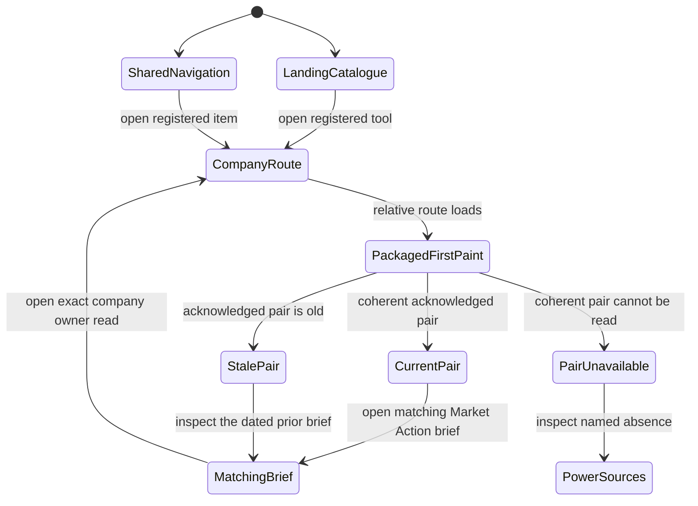
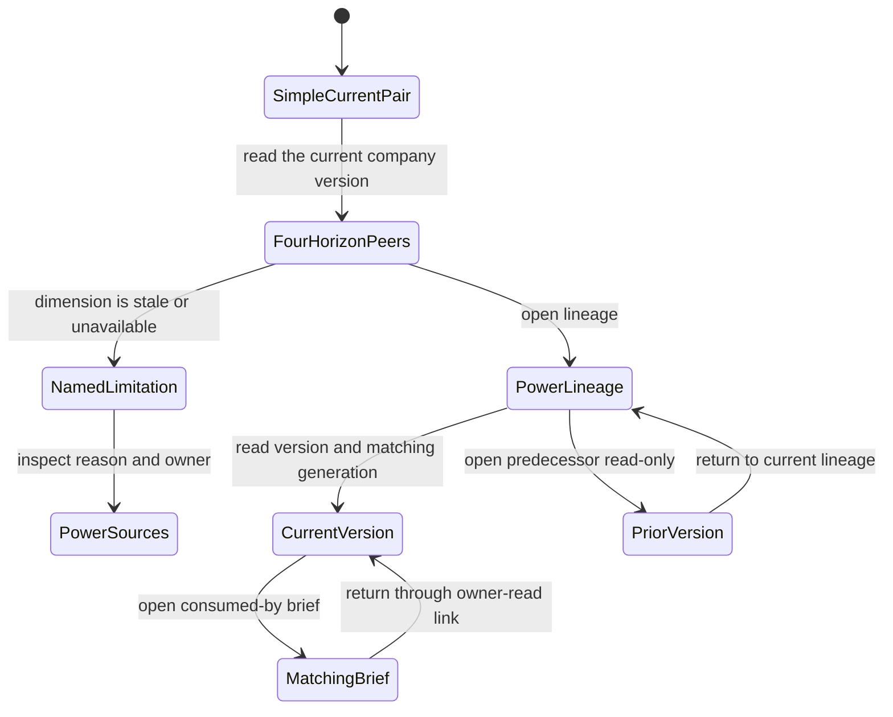
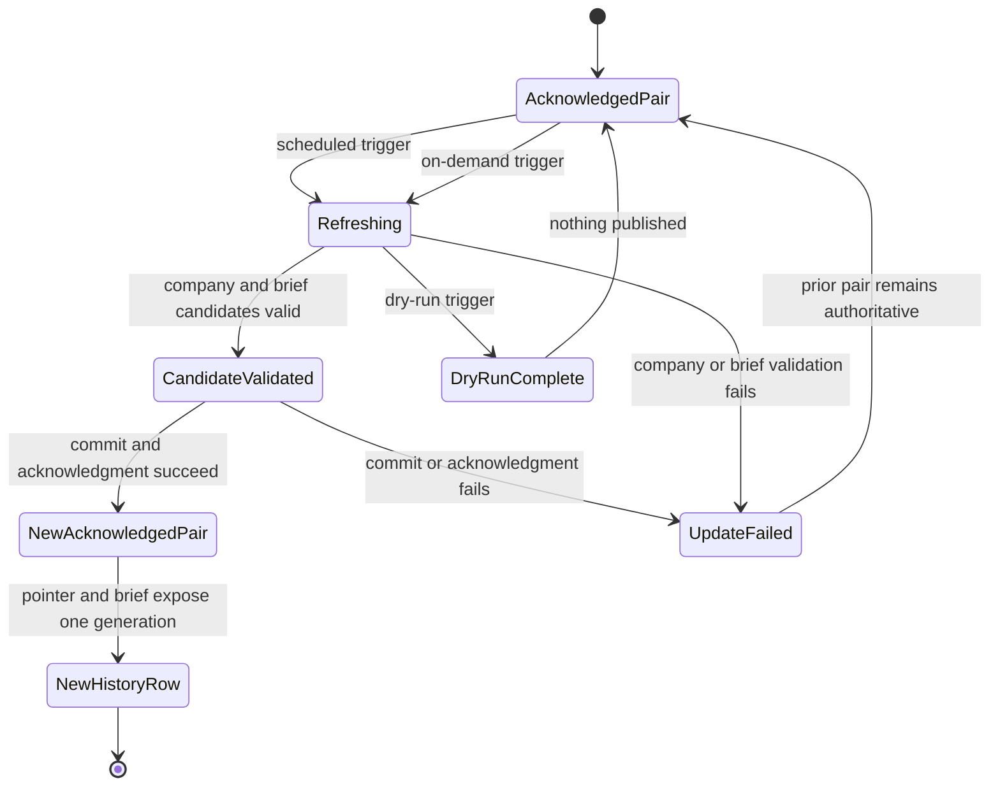
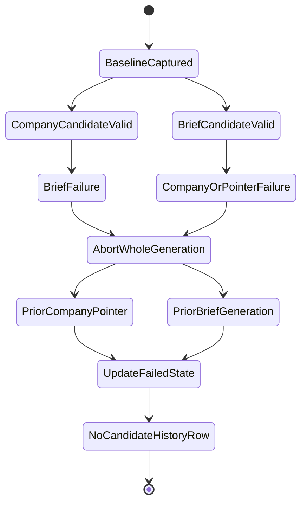
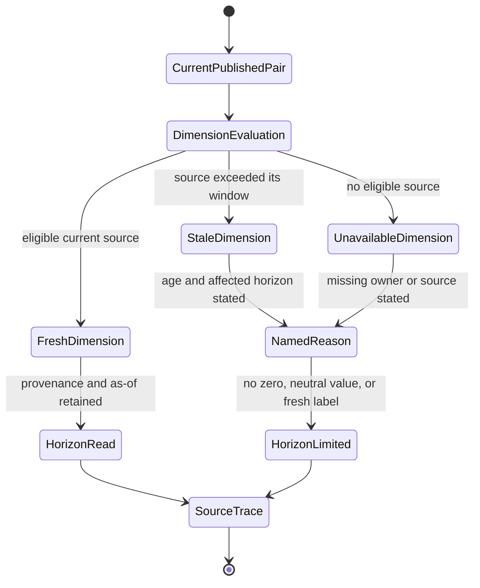
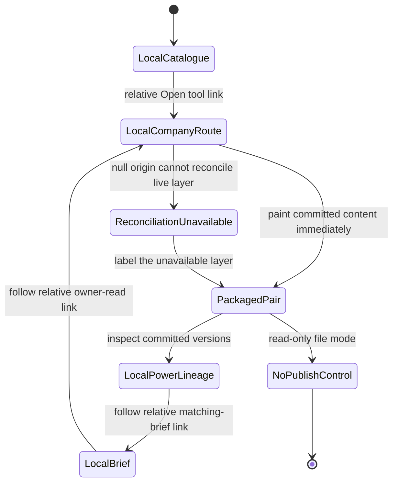

# Feature 028 — Company Intelligence Public Delivery and Atomic Brief Refresh

**Status:** SPEC ONLY. This document defines planned behavior and claims no delivery.
**Owner:** `bubbles.analyst` for business requirements and non-UX sections.
**Successor to:** [Feature 025](../025-company-multi-horizon-intelligence-lab/spec.md), which remains terminal and unchanged.
**Related delivery:** [Feature 027](../027-company-scoped-owner-deep-links/spec.md) already provides company-aware links for supported owner routes.
**Educational only — not investment advice.**

---

## Problem Statement

Feature 025 delivered a company-scoped intelligence capability. It composes fifteen coverage dimensions into four isolated horizon reads. It also validates authored research plans and plans append-only version writes.

That capability is not publicly delivered. The route, its composition module, and its configuration remain excluded from the packaged site. They are absent from the tool registry, landing catalogue, navigation, and both documentation indexes.

The current company record is also disconnected from Market Action Center publication. The committed company pointer names a read composed on 2026-08-11. The current Market Action Center snapshot was generated on 2026-08-28. Neither the current snapshot nor the current payload names a company-intelligence read or version.

The browser route composes a transient read when opened. It publishes that read only into the browser data channel. It renders a version-write plan, but it does not execute that plan.

The scheduled brief path already freezes the tool registry and creates one outcome per registered source. However, a registered tool without a current deterministic owner read receives a coverage-only outcome. Registration alone would therefore make the route visible without making its intelligence part of the brief.

The existing publication transaction also excludes company-intelligence versions and pointers. Its baseline capture, validation, staging, restoration, commit, and acknowledgment cover the brief artifacts only. The on-demand update prompt describes a separate manual write-and-commit flow.

These gaps allow three false-success states.

1. The tool can appear public while the brief carries only a placeholder for it.
2. A company pointer can advance while the matching brief fails.
3. A brief can publish while the company pointer still names an older read.

This feature closes all three states. It publicly registers the existing tool. It creates a real company owner read during each complete brief recreation. It publishes the company read and brief as one acknowledged transaction.

---

## Outcome Contract

**Intent:** Every complete scheduled or on-demand Market Action Center recreation refreshes each explicitly covered company. The resulting company read is publicly reachable and participates as a real registry-derived source read. The company version and the brief become current together or neither becomes current.

**Success Signal:** A successful recreation produces one immutable company version for each covered subject. The final brief consumes the exact validated owner read derived from that version. The current company pointer and the brief artifacts appear in one acknowledged commit. The public catalogue, navigation, documentation indexes, exclusion decision, and parity checks all agree that the tool is live.

**Hard Constraints:**

- Feature 025 remains terminal. This feature extends its delivered contracts without rewriting its artifacts.
- The initial covered-subject set contains only `company:msft`.
- Covered subjects come from one explicit committed set. No watchlist, cache, filing, or route may expand it implicitly.
- Every run accounts for all fifteen dimensions and all four isolated horizons.
- A missing or stale source stays missing or stale. A previous company version never becomes fresh through reuse.
- The company composer consumes pre-final source reads. It never consumes its own output or the final brief it helps create.
- Every authored research branch carries authorship, provenance, a subject, a horizon, and a bounded stop condition.
- A published company version is immutable. Corrections and unchanged reruns create new records.
- Candidate versions are durable before any current pointer advances.
- Current pointers advance only after the company candidates and the brief candidate all validate.
- One failed covered subject aborts the whole coupled publication.
- Scheduled and on-demand recreation use the same publication contract.
- The route works with no key, no account, and no server. Local-file operation remains available.
- Committed artifacts contain public company identifiers only. They contain no holdings, cost basis, profit, loss, or credentials.
- The capability produces educational research. It has no order, sizing, approval, or alert-routing authority.

**Failure Condition:** The feature fails if any successful brief publication lacks a new covered-company version. It also fails if the brief and company pointer identify different publication generations. A coverage-only placeholder presented as a company owner read is failure. A stale company version presented as current is failure. Any one-sided rollback, implicit subject expansion, rewritten history, hidden missing dimension, or private portfolio value is failure.

---

## Goals

1. Make the existing company-intelligence route publicly reachable through every required catalogue and navigation surface.
2. Register the tool as a real Market Action Center source rather than a coverage-only participant.
3. Refresh only explicitly covered company subjects during every complete brief recreation.
4. Preserve the fifteen-dimension coverage floor and four isolated horizons.
5. Validate authored research plans against subject, generation, source, horizon, and branch-budget rules.
6. Publish immutable company versions before advancing their current pointers.
7. Couple company publication and brief publication into one all-or-nothing transaction.
8. Give scheduled and on-demand recreation identical success and failure semantics.
9. Keep every prior company version readable and every stale or missing state honest.
10. Preserve no-key, no-account, no-server, local-file, and educational-only operation.

---

## Non-Goals

1. This feature does not reopen or revise Feature 025.
2. This feature does not add a second company-intelligence route or a second composition model.
3. This feature does not expand the covered-subject set beyond `company:msft`.
4. This feature does not make unavailable dimensions appear available.
5. This feature does not extract headless models from owner pages that still publish no reusable read.
6. This feature does not add a provider, credential, account, server, order path, or portfolio store.
7. This feature does not change the fifteen dimensions, four horizon meanings, or five-branch budget.
8. This feature does not redesign the route. The UX phase may reconcile registration and transaction states within the existing page.
9. This feature does not change Market Action Center scoring, attention, recommendation, or narrative policy.
10. This feature does not treat a raw data refresh without a recreated brief as a successful coupled publication.

---

## Current Delivered Truth and Planned Truth

| Capability | Current delivered truth | New planned truth |
| --- | --- | --- |
| Company composition | Feature 025 composes fifteen dimensions and four isolated horizons in the browser | The same capability also composes during every complete brief recreation |
| Research plan | Feature 025 validates committed and authored plans with a five-branch budget | Each publication candidate carries a generation-bound, source-qualified plan |
| Company history | One immutable MSFT version and one current pointer are committed | Every successful recreation appends a new version and advances the pointer last |
| Browser publication | The route writes a transient owner read into the browser data channel | The brief pipeline receives a durable owner read derived from the candidate version |
| Public reachability | The route, module, and configuration are deliberately excluded | The route is registered, navigable, documented, packaged, and parity-checked |
| Brief participation | The company tool is absent from the frozen registry and tool bundle | The registry discovers it and the tool bundle contains one real owner read |
| Scheduled recreation | Brief artifacts refresh without any company-version transaction | Covered company versions and brief artifacts publish in one transaction |
| On-demand recreation | The prompt describes an independent manual write and commit path | The on-demand path invokes the same coupled transaction contract |
| Failure recovery | Brief-owned paths restore from a captured baseline | Company candidates, pointers, and brief artifacts restore as one unit |

---

## Honest Findings

### F-028-001 — Public reachability is deliberately absent

`company-intelligence-lab` appears in none of `tools.json`, `index.html`, `rlnav.js`, `README.md`, or `notes/README.md`. The route, module, and configuration each appear in `site-exclusions.json`.

### F-028-002 — Feature 025 is terminal and must stay closed

Feature 025 records `status: "done"` and `certification.status: "done"`. Its current notes state that the tool ships unregistered by design. This successor changes the delivery decision without changing Feature 025's artifacts.

### F-028-003 — The committed company pointer is older than the current brief

The company pointer names `company:msft:2026-08-11`. The current Market Action Center snapshot was generated on 2026-08-28. The current payload and snapshot contain no company-intelligence version reference.

### F-028-004 — Browser composition is not durable publication

The route composes, publishes to the browser data channel, and renders a write plan. It does not create the planned version file or advance the committed pointer.

### F-028-005 — Registration alone would still permit a placeholder

The all-tool bundle builder emits a rich source outcome only when the deterministic snapshot contains that tool's read. Otherwise it emits a coverage-only outcome. A registry row without a producer would therefore satisfy visibility while failing the delivery goal.

### F-028-006 — The deterministic brief refresh has no company-intelligence producer

The Tier A refresh builds several owner reads explicitly. It builds no company-intelligence read. The company tool is absent from the current snapshot, payload, and public owner-read matrix.

### F-028-007 — The brief transaction does not own company versions or pointers

The current transaction captures, restores, stages, commits, and acknowledges brief-owned paths. Company-intelligence version and pointer paths are absent from those sets.

### F-028-008 — The on-demand path has different transaction semantics

The on-demand update prompt instructs an agent to rewrite the payload, append history, validate, and commit. It does not require the scheduled wrapper's baseline restoration or a company refresh.

### F-028-009 — Date-only version identity cannot represent four daily windows

Feature 025 builds a version identifier from the subject and calendar date. Its writer refuses an existing version path. Four successful publication windows on one date therefore need a finer logical generation identity.

### F-028-010 — Covered-subject declarations currently agree but have two homes

Both the event source and the research record declare `company:msft`. Their agreement is current fact, not a mechanism. This feature needs one publication-eligibility set that every company resource must follow.

### F-028-011 — A final-brief dependency would create a cycle

The company coverage registry links performance and sentiment to the Market Action Center. The scheduled company candidate cannot consume the final brief that will consume it. It must use pre-final owner evidence or report an unavailable state.

### F-028-012 — Existing parity checks enforce the old decision

The selftest currently requires the route to stay absent from registration surfaces. It also requires all three company root artifacts to stay excluded. Public delivery must supersede those assertions in the same change.

---

## Domain Capability Model

### Capability

**Coupled periodic publication of a company research read and its market brief.**

The capability turns one frozen publication generation into two linked products. One product is the company read. The other is the Market Action Center brief that consumes it. They share one registry, one evidence cutoff, and one authoritative publication outcome.

### Domain Primitives

| Primitive | Purpose | Lifecycle |
| --- | --- | --- |
| Covered subject | A public company explicitly admitted to periodic refresh | Declared, active, removed by an explicit configuration change |
| Publication generation | One logical scheduled or on-demand brief recreation | Opened, frozen, validated, acknowledged, or aborted |
| Frozen source set | The registry-derived source participants and their pre-final owner reads | Frozen once per generation and never changed within that generation |
| Company evidence bundle | The source-qualified inputs for one covered subject | Acquired, validated, composed, then retained through its version |
| Research plan | The bounded record of discretionary branches for one subject and generation | Empty or authored, validated, then embedded in the candidate version |
| Candidate company version | The immutable company read proposed by one generation | Created, validated, published, or rejected before publication |
| Current company pointer | The mutable reference to the latest published company version | Read as baseline, then advanced last after full validation |
| Company owner read | The registry source read derived from one or more candidate company versions | Built, frozen into the all-tool bundle, then consumed by the final brief |
| Brief candidate | The Market Action Center publication proposed by the same generation | Authored, validated, published, or rejected |
| Coupled publication | The company versions, pointers, and brief artifacts selected together | Committed and acknowledged once, or restored as one unit |
| Published pair | The acknowledged brief and company pointer set for one generation | Current until a later acknowledged generation supersedes it |

### Relationships

- One publication generation uses exactly one frozen registry.
- One frozen registry contains the company tool exactly once as a source.
- One generation creates one candidate company version per covered subject.
- One candidate company version contains one coverage account, four horizons, and one research plan.
- One company owner read references every candidate company version in that generation.
- One brief candidate consumes that exact company owner read.
- One coupled publication contains all candidate versions, all pointer advances, and all selected brief artifacts.
- A current company pointer names only a version in the same acknowledged publication lineage.
- A later generation references the previous current company version as its predecessor.

### Business Policies

1. **Admission is explicit.** A company joins periodic refresh only through the covered-subject set.
2. **Registry membership requires a real read.** A successful complete run cannot substitute coverage-only status for the company owner read.
3. **Composition is acyclic.** Company composition may use pre-final source reads, but never its own output or the final brief.
4. **Coverage remains total.** Every mandatory dimension reports one state for every covered subject.
5. **Horizons remain isolated.** Evidence admitted to one horizon never changes another horizon outside its declared reach.
6. **Research remains bounded.** Five branches are the maximum, and refused branches consume budget.
7. **History is append-only.** A published version is never rewritten or deleted.
8. **The pointer moves last.** Candidate content becomes durable and valid before a current reference changes.
9. **Publication is atomic.** A failed company side or brief side publishes neither side.
10. **Acknowledgment establishes authority.** A local candidate or unacknowledged commit does not replace the last acknowledged pair.
11. **Absence stays visible.** Missing, stale, conflicted, and unavailable inputs never become current through reuse.
12. **Private state stays absent.** Only public company identifiers and public research evidence enter committed artifacts.

---

## Actors & Personas

| Actor | Description | Goals | Boundaries |
| --- | --- | --- | --- |
| Operator | The single researcher who reads the public site and may request an on-demand recreation | Reach the company tool, inspect four horizons, and know the brief used the same company version | Read-only. Supplies no holdings or credentials to this capability |
| Scheduled publisher | The unattended actor that recreates the brief at declared market windows | Refresh every covered company and publish one coherent generation | Cannot skip a covered subject or accept a partial transaction |
| On-demand publisher | The actor invoked by an explicit Market Action Center recreation request | Produce the same outcome as a scheduled run | Cannot use a weaker publication path |
| Research author | The actor that records discretionary company research branches | Explain what was asked, what evidence answered, and what changed | Cannot exceed the branch budget or bypass source rules |
| Source-tool owner | A registered tool that owns one dimension's math | Supply one source-qualified owner read without duplication | Owns its metric and may report unavailable |
| Company composer | The system actor that builds the fifteen-dimension, four-horizon read | Compose one deterministic candidate per covered subject | Has no final-brief, order, or credential authority |
| Publication validator | The system actor that admits or refuses a coupled generation | Prevent mismatched, stale, partial, or malformed publication | Has no advisory bypass |
| Public reader | A person opening the deployed route or the Market Action Center | Confirm the current company version, evidence clocks, and limitations | Receives educational research only |

---

## Use Cases

### UC-028-001: Reach the company tool publicly

- **Actor:** Operator.
- **Preconditions:** A coupled publication has been acknowledged.
- **Main flow:**
  1. The operator opens the landing catalogue or shared navigation.
  2. The operator selects Company Intelligence.
  3. The route opens with its composition dependency and configuration available.
  4. The route presents the current company version and its evidence state.
- **Alternative flow:** A registration or exclusion surface disagrees, so publication is refused.
- **Postconditions:** The tool is reachable through public product surfaces and local-file operation.

### UC-028-002: Recreate the brief on schedule

- **Actor:** Scheduled publisher.
- **Preconditions:** A declared publication window is due.
- **Main flow:**
  1. The publisher freezes the registry and evidence cutoff.
  2. The publisher refreshes every covered subject.
  3. The publisher validates each candidate company version.
  4. The publisher builds one company owner read from those candidates.
  5. The final brief consumes that exact frozen owner read.
  6. The publisher validates and acknowledges one coupled publication.
- **Alternative flow:** Any company or brief boundary fails, so the prior pair remains current.
- **Postconditions:** The brief and all current company pointers identify the same generation.

### UC-028-003: Recreate the brief on demand

- **Actor:** On-demand publisher.
- **Preconditions:** The operator requests one declared brief window.
- **Main flow:** The actor performs the same six steps as UC-028-002.
- **Alternative flow:** The actor cannot enter the coupled path, so the request refuses before publication.
- **Postconditions:** Trigger type does not change publication semantics.

### UC-028-004: Compose a covered company

- **Actor:** Company composer.
- **Preconditions:** The subject appears in the covered-subject set.
- **Main flow:**
  1. The composer resolves the subject.
  2. The composer consumes eligible pre-final owner reads.
  3. Every mandatory dimension receives one evidence state.
  4. Four isolated horizons are composed.
  5. Contradictions and unavailable dimensions remain explicit.
- **Alternative flow:** A source is missing or stale, so its dimension reports that state.
- **Postconditions:** One candidate version exists with a complete coverage account.

### UC-028-005: Author a bounded research plan

- **Actor:** Research author.
- **Preconditions:** A covered subject and publication generation are frozen.
- **Main flow:**
  1. The author records each discretionary question.
  2. Each branch names its horizon, sources, result, disposition, and stop condition.
  3. The author records identity and authorship metadata.
  4. The plan validates against the five-branch budget and evidence cutoff.
- **Alternative flows:** The floor is sufficient, so the plan records an empty reason. Every attempted branch is refused, so each refusal remains recorded.
- **Postconditions:** The validated plan belongs to one subject and one generation.

### UC-028-006: Publish a version without rewriting history

- **Actor:** Publication validator.
- **Preconditions:** The candidate version and baseline pointer are readable.
- **Main flow:**
  1. The candidate receives a generation identity and predecessor.
  2. The immutable version becomes durable.
  3. The candidate owner read and brief candidate validate.
  4. The current pointer advances to the candidate.
  5. The whole generation enters one acknowledged commit.
- **Alternative flow:** A version identity already exists with different content, so the generation refuses.
- **Postconditions:** Every earlier version remains byte-unchanged and readable.

### UC-028-007: Recover when the brief side fails

- **Actor:** Scheduled publisher or on-demand publisher.
- **Preconditions:** Company candidates validate, but the brief candidate fails.
- **Main flow:**
  1. The publisher rejects the brief candidate.
  2. The publisher restores every prior company pointer.
  3. The publisher removes every unpublished company candidate from the working transaction.
  4. The publisher restores brief-owned publication artifacts.
- **Postconditions:** The prior acknowledged pair remains authoritative.

### UC-028-008: Recover when the company side fails

- **Actor:** Scheduled publisher or on-demand publisher.
- **Preconditions:** The brief candidate exists, but one company candidate or pointer validation fails.
- **Main flow:**
  1. The publisher rejects the company candidate set.
  2. The publisher restores the brief baseline.
  3. No company pointer advances.
  4. No final brief from this generation becomes authoritative.
- **Postconditions:** No one-sided publication survives.

### UC-028-009: Inspect the publication lineage

- **Actor:** Public reader.
- **Preconditions:** At least two acknowledged generations exist.
- **Main flow:**
  1. The reader opens the company history.
  2. The reader sees the current version and predecessor link.
  3. The reader sees whether the conclusion changed or stayed unchanged.
  4. The reader follows the matching brief-generation reference.
- **Postconditions:** The reader can prove which company read the brief consumed.

---

## Functional Requirements

Thirty-eight functional requirements are grouped into four planning concerns. The count stays below the P25 ceiling.

### A. Public reachability and registration

- **FR-028-001** The company-intelligence route MUST be registered as one live source tool with complete source-read and experience metadata.
- **FR-028-002** The tool registry, landing catalogue, shared navigation, root documentation index, and tool-note index MUST identify the same route, title, order, and notes target.
- **FR-028-003** Public delivery MUST retire the route, composition dependency, and configuration exclusions. It MUST supersede the old no-registration assertions in the same change.
- **FR-028-004** The packaged public site MUST contain the route and every production dependency it needs. The route MUST remain usable with no key, account, or server.
- **FR-028-005** Publication MUST refuse any registration, navigation, documentation, packaging, or exclusion mismatch. The refusal MUST name the mismatched surface.

### B. Registry-derived company owner read

- **FR-028-006** Each publication generation MUST derive its complete source-participant set from one frozen tool registry. Every source MUST appear exactly once.
- **FR-028-007** The registered company tool MUST contribute exactly one validated tool-level owner read to each complete generation.
- **FR-028-008** A coverage-only, not-run, or not-applicable placeholder MUST NOT satisfy FR-028-007 in a successful complete recreation.
- **FR-028-009** The company owner read MUST identify its publication generation, covered subjects, candidate versions, content fingerprints, and evidence clocks. It MUST also carry coverage totals, horizon summaries, limitations, and company deep links.
- **FR-028-010** A registry, source order, source count, or source fingerprint change after the generation freezes MUST refuse publication.
- **FR-028-011** Each covered-subject candidate MUST report exactly one state for all fifteen mandatory dimensions.
- **FR-028-012** Each candidate MUST contain exactly four isolated horizon reads. No combined direction, score, or verdict may replace them.
- **FR-028-013** Every numeric claim MUST carry source identity, as-of time, and provenance class. Evidence newer than the frozen cutoff MUST be refused.
- **FR-028-014** The company composer MUST consume only pre-final owner reads. It MUST NOT consume its own output or the final brief. A dimension with an owner MUST consume that owner's read without recomputing its math. Missing, stale, conflicted, or ineligible reads MUST keep an explicit state and reason.
- **FR-028-015** Publication eligibility MUST come from one explicit covered-subject set. Its initial and only member MUST be `company:msft`.

### C. Research-plan and immutable-version contract

- **FR-028-016** Every candidate company version MUST contain a research plan, including an explicit reason when no branch was opened.
- **FR-028-017** An authored plan MUST identify its subject, publication generation, author, and authored time. Each identity MUST match the candidate version.
- **FR-028-018** Every research branch MUST record its question, horizon relevance, consulted sources, result, disposition, and stop condition.
- **FR-028-019** Every consulted source MUST carry provenance and an as-of time at or before the frozen cutoff.
- **FR-028-020** A plan MUST permit at most five branches. Refused branches MUST count against the budget, and a missing budget MUST refuse the plan.
- **FR-028-021** A branch MUST affect only its named horizon and targets. A malformed, late-evidence, cross-subject, over-budget, or unsigned plan MUST refuse the candidate.
- **FR-028-022** Each successful logical recreation MUST create one distinct immutable version per covered subject. Retries of the same logical generation MUST resolve to the same candidate identity.
- **FR-028-023** Different publication windows on the same calendar date MUST receive different version identities.
- **FR-028-024** Each candidate MUST name the current baseline version as its predecessor. A first version MUST name no predecessor.
- **FR-028-025** A published version MUST never be modified or deleted. A correction or unchanged conclusion MUST create a new version.
- **FR-028-026** The current pointer MUST advance only after the immutable candidate, its owner read, and the complete brief candidate validate.
- **FR-028-027** A pointer MUST identify a readable version with the same subject, generation, predecessor, and content fingerprint. Any mismatch MUST refuse publication.

### D. Coupled publication, rollback, and trigger parity

- **FR-028-028** Every complete recreation MUST select all covered-company versions, all pointer advances, and all selected brief artifacts as one publication transaction.
- **FR-028-029** The final brief MUST consume the exact frozen company owner read derived from that transaction's candidate versions.
- **FR-028-030** If company candidates succeed and the brief fails, no pointer may advance. The working transaction MUST restore both company and brief publication baselines.
- **FR-028-031** If the brief candidate succeeds and any company candidate or pointer fails, the brief MUST NOT publish. Both sides MUST restore their baselines.
- **FR-028-032** If any one covered subject fails, no covered subject and no brief artifact from that generation may become current.
- **FR-028-033** A commit or acknowledgment failure MUST leave the last acknowledged pair authoritative. A retry MUST not create a divergent duplicate generation.
- **FR-028-034** A dry run, aborted run, or refused run MUST leave all current pointers and acknowledged brief artifacts byte-unchanged.
- **FR-028-035** Scheduled and on-demand brief recreation MUST execute the same covered-subject, owner-read, validation, rollback, commit, and acknowledgment contract.
- **FR-028-036** A complete recreation MUST NOT silently retain the prior company version. If no new valid candidate exists, the recreation MUST refuse and keep the prior version visibly dated.
- **FR-028-037** The public route and final brief MUST expose enough identity to prove that they reference the same company version and publication generation.
- **FR-028-038** No publication artifact may contain a credential, account identifier, holding, size, cost basis, profit, loss, or action authority. Every user-facing output MUST remain educational research.

---

## User Scenarios (Gherkin)

### SCN-028-001 — The public reader can reach Company Intelligence

```gherkin
Scenario: Registration and navigation agree on the live company tool
  Given a coupled publication has been acknowledged
  When a reader uses the landing catalogue or shared navigation
  Then Company Intelligence appears exactly once on each surface
  And both entries open the same registered route
  And the route's notes target is reachable
```

### SCN-028-002 — A stale exclusion blocks public delivery

```gherkin
Scenario: Registration cannot coexist with an exclusion
  Given the company route is registered as live
  And any company production artifact remains excluded
  When public packaging is evaluated
  Then publication is refused
  And the refusal names the stale exclusion
```

### SCN-028-003 — A scheduled recreation refreshes the covered company

```gherkin
Scenario: A scheduled brief and company read publish together
  Given a scheduled publication window is due
  And company:msft is the only covered subject
  When the complete recreation succeeds
  Then one new immutable MSFT company version is published
  And the final brief consumes the owner read derived from that version
  And the brief and company pointer identify one publication generation
```

### SCN-028-004 — An on-demand recreation has the same result

```gherkin
Scenario: On-demand publication cannot use a weaker path
  Given the operator requests a declared brief window on demand
  When the complete recreation succeeds
  Then it refreshes company:msft before final publication
  And it applies the same validation and rollback rules as a scheduled run
  And it acknowledges one coupled publication
```

### SCN-028-005 — The company source has a real owner read

```gherkin
Scenario: Registry membership produces evidence rather than coverage text
  Given the frozen registry includes the company tool as a source
  When the all-source bundle is built
  Then the company tool contributes exactly one validated owner read
  And that read references the candidate MSFT version and fingerprint
  And no coverage-only placeholder represents the company tool
```

### SCN-028-006 — The coverage floor and horizons remain complete

```gherkin
Scenario: Scheduled composition preserves Feature 025 semantics
  Given a covered company candidate is composed from frozen evidence
  When composition completes
  Then all fifteen mandatory dimensions report one explicit state
  And exactly four isolated horizons are present
  And no combined direction replaces the four horizons
```

### SCN-028-007 — Missing and stale evidence stays honest

```gherkin
Scenario: Missing evidence never becomes a fresh company claim
  Given one mandatory dimension has no eligible current source
  When the candidate company version is composed
  Then that dimension reports missing or stale with a named reason
  And no prior value or neutral value replaces it
  And every affected horizon states the limitation
```

### SCN-028-008 — Evidence cannot arrive after the cutoff

```gherkin
Scenario: A late source read is refused
  Given a source read is dated after the frozen publication cutoff
  When the company candidate validates its evidence
  Then the late read is refused
  And no horizon cites it
  And the refusal identifies the source and cutoff conflict
```

### SCN-028-009 — A research plan is generation-bound and bounded

```gherkin
Scenario: A valid authored plan survives publication
  Given the research author records no more than five branches for company:msft
  And every branch names its horizon, sources, result, disposition, and stop condition
  When the plan is validated for the frozen generation
  Then the plan records its author, authored time, subject, and generation
  And every source is dated at or before the generation cutoff
  And the plan is embedded in the candidate version
```

### SCN-028-010 — An invalid research plan blocks the candidate

```gherkin
Scenario: Plan validation fails closed
  Given an authored plan is unsigned, cross-subject, over budget, or supported by late evidence
  When the plan is validated
  Then the company candidate is refused
  And the prior plan is not relabelled as current
  And no brief from this generation publishes
```

### SCN-028-011 — Same-day windows create distinct history

```gherkin
Scenario: Four daily windows do not collide
  Given two successful publication windows occur on the same calendar date
  When each creates its company version
  Then the two versions have distinct generation identities
  And each preserves its own cutoff and predecessor
  And neither version overwrites the other
```

### SCN-028-012 — A retry is idempotent

```gherkin
Scenario: Retrying one logical generation does not fork history
  Given a generation failed before acknowledgment
  When the same logical generation is retried with the same frozen inputs
  Then it resolves to the same candidate identity
  And it does not create a divergent duplicate version
  And one successful acknowledgment closes the generation
```

### SCN-028-013 — A stale predecessor refuses publication

```gherkin
Scenario: Pointer drift breaks the candidate chain
  Given the candidate names one predecessor
  And the baseline pointer now names another version
  When pointer advancement is evaluated
  Then publication is refused
  And the baseline pointer remains unchanged
  And the brief candidate does not publish
```

### SCN-028-014 — The pointer moves last

```gherkin
Scenario: Current changes only after all candidates validate
  Given the immutable company version is durable
  And the company owner read and complete brief candidate are valid
  When the publication transaction reaches its final mutable step
  Then the company pointer advances to that version
  And a final coherence check proves both products name the same generation
```

### SCN-028-015 — Company success and brief failure restore both sides

```gherkin
Scenario: A valid company candidate cannot escape a failed brief
  Given all company candidates validate
  And final brief validation fails
  When the transaction aborts
  Then every current company pointer keeps its baseline value
  And unpublished company candidates are removed from the working transaction
  And all acknowledged brief artifacts keep their baseline bytes
```

### SCN-028-016 — Brief success and company failure restore both sides

```gherkin
Scenario: A valid brief candidate cannot escape a failed company publication
  Given the final brief candidate validates
  And a company candidate or pointer validation fails
  When the transaction aborts
  Then the final brief does not become authoritative
  And no company pointer advances
  And the previous acknowledged pair remains current
```

### SCN-028-017 — One covered-subject failure aborts the set

```gherkin
Scenario: Covered companies publish as one set
  Given more than one covered subject is configured
  And one subject fails composition or validation
  When the transaction evaluates the covered-subject set
  Then no covered-subject pointer advances
  And no brief artifact from that generation publishes
  And the failed subject is identified by name
```

### SCN-028-018 — The prior company read cannot masquerade as fresh

```gherkin
Scenario: A failed refresh leaves an honestly dated prior read
  Given the current company pointer names an older acknowledged version
  And the new recreation cannot produce a valid candidate
  When the recreation ends
  Then it refuses publication
  And the prior version remains visibly dated
  And no current or fresh label is assigned to that prior version
```

### SCN-028-019 — Registry drift after freeze aborts publication

```gherkin
Scenario: The source set cannot change or become cyclic during a generation
  Given the source registry and source fingerprints were frozen
  And the company candidate may consume pre-final source reads only
  And a participant, order, count, fingerprint, or dependency changes before publication
  When the final bundle validates
  Then the generation is refused
  And a company read that depends on itself or the final brief is refused
  And no company pointer or brief artifact advances
```

### SCN-028-020 — The route remains independent and safe

```gherkin
Scenario: Public delivery needs no private state or infrastructure
  Given a reader has no key, account, proxy, or server
  When the reader opens the packaged company route from a local file
  Then the route paints from committed data
  And missing live inputs remain named as unavailable
  And no committed artifact contains holdings, cost basis, profit, loss, or credentials
```

### SCN-028-021 — An unchanged conclusion still records the recreation

```gherkin
Scenario: Unchanged is an explicit new version
  Given the new evidence produces the same four horizon directions as the predecessor
  When the complete recreation succeeds
  Then a new immutable version records the new generation and cutoff
  And it identifies the predecessor
  And it states that the conclusion is unchanged
```

### SCN-028-022 — A dry run leaves no publication mutation

```gherkin
Scenario: Dry-run inspection is non-authoritative
  Given the operator requests a dry run
  When candidate composition and validation finish
  Then no current company pointer changes
  And no acknowledged brief artifact changes
  And no candidate becomes a published version
```

---

## Requirement Traceability

| Requirement | Scenarios |
| --- | --- |
| FR-028-001 | SCN-028-001 |
| FR-028-002 | SCN-028-001 |
| FR-028-003 | SCN-028-001, SCN-028-002 |
| FR-028-004 | SCN-028-001, SCN-028-020 |
| FR-028-005 | SCN-028-002 |
| FR-028-006 | SCN-028-005, SCN-028-019 |
| FR-028-007 | SCN-028-005 |
| FR-028-008 | SCN-028-005 |
| FR-028-009 | SCN-028-003, SCN-028-004, SCN-028-005 |
| FR-028-010 | SCN-028-019 |
| FR-028-011 | SCN-028-006, SCN-028-007 |
| FR-028-012 | SCN-028-006 |
| FR-028-013 | SCN-028-007, SCN-028-008 |
| FR-028-014 | SCN-028-007, SCN-028-019 |
| FR-028-015 | SCN-028-003, SCN-028-004, SCN-028-017 |
| FR-028-016 | SCN-028-009 |
| FR-028-017 | SCN-028-009, SCN-028-010 |
| FR-028-018 | SCN-028-009 |
| FR-028-019 | SCN-028-008, SCN-028-009 |
| FR-028-020 | SCN-028-009, SCN-028-010 |
| FR-028-021 | SCN-028-010 |
| FR-028-022 | SCN-028-011, SCN-028-012, SCN-028-021 |
| FR-028-023 | SCN-028-011 |
| FR-028-024 | SCN-028-013, SCN-028-014 |
| FR-028-025 | SCN-028-011, SCN-028-021 |
| FR-028-026 | SCN-028-014, SCN-028-015, SCN-028-016 |
| FR-028-027 | SCN-028-013, SCN-028-014, SCN-028-016 |
| FR-028-028 | SCN-028-003, SCN-028-004, SCN-028-015, SCN-028-016, SCN-028-017 |
| FR-028-029 | SCN-028-003, SCN-028-004, SCN-028-005, SCN-028-014 |
| FR-028-030 | SCN-028-015 |
| FR-028-031 | SCN-028-016 |
| FR-028-032 | SCN-028-017 |
| FR-028-033 | SCN-028-012, SCN-028-013 |
| FR-028-034 | SCN-028-015, SCN-028-016, SCN-028-022 |
| FR-028-035 | SCN-028-003, SCN-028-004 |
| FR-028-036 | SCN-028-018 |
| FR-028-037 | SCN-028-003, SCN-028-009, SCN-028-014 |
| FR-028-038 | SCN-028-020 |

---

## Edge Cases and Failure Behavior

| Case | Required outcome |
| --- | --- |
| Covered-subject set is missing or empty | Refuse before company composition and brief authorship |
| A subject appears in a resource list but not the covered-subject set | Ignore that resource for periodic publication and report the configuration mismatch |
| Two resources claim different subject identities | Refuse the subject candidate |
| One owner read is missing | Preserve the dimension as unavailable with a reason |
| One owner read is stale | Preserve the stale state and age. Do not carry it into a current claim |
| One owner read is dated after the cutoff | Refuse that evidence and the candidate if it supports a required claim |
| A source-tool read names the final brief as its evidence | Refuse the cycle |
| The company tool appears twice in the frozen registry | Refuse the registry |
| The company tool appears once but has only coverage text | Refuse the complete recreation |
| No research branch is needed | Publish an empty plan with a reason |
| Every research branch is refused | Record every refusal and publish no branch claim |
| A sixth branch is attempted | Refuse the over-budget branch and candidate |
| Two windows occur on one date | Create distinct immutable versions |
| A retry repeats one logical generation | Reuse the candidate identity and avoid a duplicate branch |
| A candidate version path already exists with identical content | Treat it as the same retry candidate, not a new publication |
| A candidate identity exists with different content | Refuse the collision |
| The baseline pointer target is missing or fingerprint-invalid | Refuse before pointer advancement |
| The candidate conclusion is unchanged | Publish a new version that states unchanged |
| Company candidates validate but narrative authorship fails | Restore both company and brief baselines |
| Brief validation succeeds but one company pointer fails | Restore both company and brief baselines |
| One of several covered subjects fails | Abort the whole covered-subject set |
| Commit succeeds locally but acknowledgment fails | Keep the last acknowledged pair authoritative |
| A concurrent publisher advances the baseline pointer | Refuse or reconcile before publication. Never overwrite the winner |
| On-demand invocation bypasses the coupled path | Refuse before writing authoritative artifacts |
| Local-file mode cannot refresh live evidence | Paint committed data and label unavailable inputs. Do not claim a fresh recreation |
| Registration lands while an old exclusion remains | Refuse public packaging |
| Old no-registration tests remain active | Treat the test suite as contradictory and block completion |

---

## Non-Functional Requirements

- **NFR-028-001 Determinism.** Identical frozen registry, cutoff, evidence, and authored plan MUST produce identical candidate content and identity.
- **NFR-028-002 Atomicity.** Interruption at every publication boundary MUST leave either the prior acknowledged pair or the complete new pair.
- **NFR-028-003 Concurrency.** Two publishers targeting one logical generation MUST converge on one acknowledged result without lost updates.
- **NFR-028-004 Append-only history.** Every published company version MUST remain byte-unchanged and permanently reachable through history.
- **NFR-028-005 Honest freshness.** Every owner read and company version MUST expose source, evidence, composition, and publication clocks separately.
- **NFR-028-006 No hidden defaults.** Missing subject policy, branch budget, registry metadata, pointer state, or transaction identity MUST fail explicitly.
- **NFR-028-007 No new provider.** The feature MUST use existing committed and source-qualified evidence. It MUST add no credential or external service requirement.
- **NFR-028-008 Offline access.** The public route MUST preserve meaningful local-file first paint from committed data.
- **NFR-028-009 Safe text.** Every authored narrative MUST render as text rather than executable markup.
- **NFR-028-010 Privacy.** Committed and logged values MUST contain no portfolio or credential material.
- **NFR-028-011 Bounded work.** A company run MUST remain bounded by fifteen dimensions, four horizons, the explicit subject set, and five research branches per subject.
- **NFR-028-012 Adversarial proof.** Every atomicity, pointer-order, freshness, parity, and branch-budget guard MUST have a negative case that proves it can fail.
- **NFR-028-013 Additive compatibility.** New publication identity and owner-read fields MUST extend existing readable contracts without invalidating Feature 025 history.
- **NFR-028-014 Traceability.** A reader MUST be able to trace a final brief source entry to the exact immutable company version it consumed.

---

## Measurable Success Criteria

1. A public package contains the company route, composition dependency, and configuration, with zero matching exclusion entries.
2. The tool appears exactly once in the tool registry, landing catalogue, shared navigation, root documentation index, and tool-note index.
3. Every successful complete recreation publishes one new version for every covered subject. The initial measured count is one.
4. Every candidate version contains fifteen dimension states, four horizons, one coverage account, and one research plan.
5. Every complete all-source bundle contains one real company owner read and zero company coverage-only placeholders.
6. The company owner read and final brief identify the same generation and candidate version fingerprints.
7. Four successful windows on one date produce four distinct company versions in one predecessor chain.
8. A retry of one logical generation produces no divergent duplicate version.
9. Failure injected before and after brief validation leaves zero advanced company pointers and zero new authoritative brief artifacts.
10. Failure of one covered subject advances zero covered-subject pointers.
11. Scheduled and on-demand successful runs produce the same transaction outcome fields.
12. A failed company refresh leaves the prior version visibly dated and never labels it current for the failed generation.
13. Every prior published company version remains byte-unchanged after a later success.
14. Public and local-file first paint require zero credentials, accounts, or private portfolio inputs.

---

## Explicit Scope Boundaries

### Included business concerns

- Public registration and reachability of the existing company-intelligence tool.
- One explicit covered-subject policy, initially containing only `company:msft`.
- Headless composition of Feature 025's delivered coverage and horizon contracts.
- A real registry-derived company owner read for the all-source brief bundle.
- Generation-bound research-plan validation and source provenance.
- Immutable version-first and current-pointer-last publication.
- One coupled transaction across company versions, pointers, and selected brief artifacts.
- Scheduled and on-demand trigger parity.
- Rollback, idempotency, concurrency, stale-state, and negative behavior.

### Excluded business concerns

- New dimensions, horizons, metrics, data providers, company subjects, and order authority.
- Redesign of Market Action Center recommendation, attention, scorecard, or narrative policy.
- Redesign of the Company Intelligence page.
- Repair of page-local owner models that still publish no headless read.
- Revision of Feature 025 or Feature 027 artifacts.
- Changes to unrelated tools, tax work, or framework-managed files.

### Planning seams for the plan owner

The work is feasible within four concern groups. These are seams, not authored scopes.

1. Public registration, packaging, documentation parity, and supersession of the old exclusion decision.
2. Covered-subject composition, research-plan validation, immutable version identity, and real company owner-read production.
3. Coupled publication, pointer-last promotion, rollback, acknowledgment, concurrency, and dry-run behavior.
4. Scheduled and on-demand parity with end-to-end failure and public-reachability proof.

---

## Product Principle Alignment

The admission test asks whether this change improves decision quality or its measurement. This feature does both. It makes the company read reachable and makes every brief identify the company version it actually consumed.

| Binding principle | Application |
| --- | --- |
| **P1 — Every displayed figure carries provenance** | FR-028-009, FR-028-013, and FR-028-019 preserve source and as-of identity through the final brief. |
| **P2 — Missing data renders as missing** | FR-028-011, FR-028-014, and SCN-028-007 preserve unavailable and stale states. |
| **P3 — Confidence is evidence quality, never a win probability** | This feature preserves Feature 025's horizon evidence-quality vocabulary and adds no probability. |
| **P4 — Misses are published with equal prominence to hits** | Failed and unchanged refresh outcomes remain explicit. This feature suppresses neither through pointer advancement. |
| **P5 — A rate is withheld below its minimum sample** | This feature adds no rate and changes no scorecard threshold. |
| **P6 — Say when the read is old** | FR-028-036 and SCN-028-018 forbid relabelling the prior version as fresh. |
| **P7 — No blackbox numbers** | FR-028-009 and FR-028-013 bind every owner-read number to version and evidence identity. |
| **P8 — Model-authored text is data, never markup** | NFR-028-009 preserves text-only rendering for the authored research plan and brief. |
| **P9 — Works with nothing** | FR-028-004 and SCN-028-020 preserve no-key, no-account, and no-server operation. |
| **P10 — UMD, never ESM** | Public delivery preserves local-file operation and adds no build requirement. |
| **P11 — Reuse, never refetch** | FR-028-014 consumes existing owner reads and refuses duplicate metric computation. |
| **P12 — Cache-first, automatic first paint** | NFR-028-008 keeps committed first paint independent from periodic refresh success. |
| **P13 — Tickers only, forever** | FR-028-038 excludes holdings, cost basis, profit, loss, and credentials. |
| **P14 — Simple is the default, Power is the drill-down** | The existing Feature 025 route remains the surface. UX reconciliation must preserve its current view contract. |
| **P15 — Everything is explained in place** | Every missing, stale, refused, and rollback state requires a named reason. |
| **P16 — Deep-link, never duplicate** | FR-028-014 consumes owner reads and FR-028-037 links the brief to the exact company version. |
| **P17 — Reachable or removed** | FR-028-001 through FR-028-005 make public registration and exclusion parity fail closed. |
| **P18 — Wired or not shipped** | FR-028-007 and FR-028-008 forbid a registered company source without a real owner read. |
| **P19 — One definition per concept** | Feature 025 remains the sole company composer. This feature adds publication orchestration, not duplicate company math. |
| **P20 — Every claim is scoreable** | Existing horizon invalidations remain intact. This feature adds no claim without its source and version identity. |
| **P21 — Additive contracts, append-only history** | FR-028-022 through FR-028-027 require additive identity and immutable version history. |
| **P22 — Budgets are assertions** | FR-028-020 preserves the five-branch budget, and NFR-028-012 requires an adversarial boundary case. |
| **P23 — A guard that cannot fail is not a guard** | NFR-028-012 requires negative controls for atomicity, pointer order, freshness, parity, and budget checks. |
| **P24 — Superseding closes the superseded** | FR-028-003 requires the new public decision to replace the old no-registration assertions in the same change. |
| **P25 — Specs are capped, and never block on status** | This spec has 38 functional requirements and four planning seams. It depends on delivered capabilities, not another spec status. |

No product-principle exception is requested.

---

## Competitive Analysis

No new competitor research was performed. The approved goal closes an internal delivery and integrity gap. External feature comparison cannot decide whether two repository publications are atomic or mutually traceable.

Feature 025 already recorded the relevant market distinction. Competitors advertise breadth. Research Lab differentiates by exposing provenance, unavailable states, and the record of what changed. This successor makes that existing differentiation publicly reachable and transactionally honest.

---

## Improvement Proposals

### IP-028-001 — Real company owner read instead of registry-only coverage

- **Impact:** High.
- **Effort:** Medium.
- **Advantage:** Public registration becomes evidence-bearing rather than cosmetic.
- **Actors affected:** Operator, scheduled publisher, on-demand publisher, public reader.
- **Business scenarios:** SCN-028-003, SCN-028-004, SCN-028-005.

### IP-028-002 — One atomic brief and company publication ⭐ Competitive edge

- **Impact:** High.
- **Effort:** Large.
- **Advantage:** The brief can prove which immutable company read it consumed. One-sided success becomes impossible.
- **Actors affected:** Operator, publication validator, public reader.
- **Business scenarios:** SCN-028-014, SCN-028-015, SCN-028-016, SCN-028-017.

### IP-028-003 — One explicit covered-subject policy

- **Impact:** High.
- **Effort:** Small.
- **Advantage:** Event, research, version, and publication coverage cannot drift into separate company sets.
- **Actors affected:** Company composer, research author, maintainer.
- **Business scenarios:** SCN-028-003, SCN-028-017.

### IP-028-004 — One publication contract for scheduled and on-demand triggers

- **Impact:** High.
- **Effort:** Medium.
- **Advantage:** Manual invocation cannot bypass rollback, freshness, or owner-read requirements.
- **Actors affected:** Scheduled publisher, on-demand publisher, operator.
- **Business scenarios:** SCN-028-003, SCN-028-004, SCN-028-022.

---

## Change Magnitude Decision

**Decision: sizable. A new successor feature is required.**

The work changes public reachability, registry participation, scheduled behavior, on-demand behavior, immutable version identity, and publication rollback. It spans more than one existing feature boundary. It also changes the meaning of a successful Market Action Center recreation.

Amending Feature 025 would violate its terminal boundary. Amending Feature 026 would mix company publication with that feature's brevity and cross-asset concerns. Feature 028 is the smallest coherent owner of the approved outcome.

The feature remains planning-feasible in four concern groups and 38 functional requirements. No split is required at analysis time.

---

## Exposure Contract

| Capability | Surface class | Surface id | Status | Plan |
| --- | --- | --- | --- | --- |
| Company Intelligence public route | uiRoute | `company-intelligence-lab.html` | planned | Feature 028 registers and packages the existing route |
| Company Intelligence catalogue entry | uiRoute | `index.html` | planned | Feature 028 adds one landing entry in registry order |
| Company Intelligence shared navigation | uiRoute | `rlnav.js` | planned | Feature 028 adds the same route and order |
| Company Intelligence registry source | internal | `tools.json` source entry | planned | Feature 028 adds complete source-read and experience metadata |
| Company owner read | internal | registry-derived Company Intelligence source read | planned | Feature 028 derives it from the candidate covered-subject versions |
| Covered-subject policy | internal | company-intelligence publication eligibility | planned | Feature 028 declares one source of truth with `company:msft` only |
| Immutable company history | internal | `data/company-intelligence/<subject>/versions/` | delivered | Feature 025 delivered one MSFT version. Feature 028 appends one per successful generation |
| Current company publication | internal | `data/company-intelligence/<subject>/current.json` | delivered | Feature 025 delivered the pointer. Feature 028 advances it last within the coupled transaction |
| Scheduled coupled recreation | cliCommand | `bash scripts/brief-refresh-scheduled.sh` | planned | Feature 028 extends the existing scheduled entry point with the coupled contract |
| Publication transaction | cliCommand | `bash scripts/brief-refresh-and-push.sh` | planned | Feature 028 adds company candidates, pointers, rollback, staging, commit, and acknowledgment |
| On-demand coupled recreation | cliCommand | `/market-brief-update window=<id>` | planned | Feature 028 routes the existing prompt through the same publication contract |
| Registry-wide all-source bundle | internal | validated pre-final tool bundle | delivered | Feature 028 requires the existing bundle to contain one real company owner read |
| Public packaging parity | cliCommand | `node scripts/build-pages-site.mjs` | delivered | Feature 028 changes the company artifacts from excluded to registered dependencies |
| Repository parity protection | cliCommand | `node scripts/selftest.mjs` | delivered | Feature 028 supersedes the old exclusion assertions with positive registration and transaction guards |

No capability is intentionally internal without a named production caller. No planned row points outside Feature 028.

---

## UI Wireframes

This UX contract reconciles public delivery with the existing Company Intelligence
page. It does not redesign the four-horizon model or the Market Action Center. The
[Feature 025 wireframes](../025-company-multi-horizon-intelligence-lab/spec.md#ui-wireframes)
remain authoritative for the unchanged Simple and Power workspaces. This section
defines the public discovery, coupled-publication identity, refresh-attempt states,
and brief-to-company trace added by Feature 028.

The repository enables no optional design language and contains no project-local UI
design instruction. The contract uses the dark analytical canvas and stacked bands
in the [Company Intelligence route](../../company-intelligence-lab.html). It reuses
the registry card in the [landing catalogue](../../index.html), the collapsible
[shared navigation](../../rlnav.js), and the disclosure-first evidence layer in the
[Market Action Center](../../market-brief.html).

Brackets in the wireframes identify dynamic fields. They are not sample measurements.
The state words illustrate mutually exclusive branches and do not claim a current
runtime result.

### Reconciliation Boundary

| Existing interaction truth | Feature 028 UX treatment |
| --- | --- |
| Simple opens first with four peer horizon cards | Preserve it. No combined direction or score is added. |
| Power holds coverage, sources, research plan, and outcome history | Preserve it. Reconcile the outcome area around the acknowledged current pair and immutable lineage. |
| The browser currently composes a transient read and calls its shared-channel write “published” | Separate local composition from authoritative publication. Only an acknowledged coupled pair may carry `Current · fresh` or `Stale`. |
| The current outcome area renders a proposed version-write plan | Replace proposal wording with read-only publication identity, predecessor, matching brief generation, and published history. An unacknowledged candidate never appears as current history. |
| The Market Action Center already deep-links owner reads in its Power evidence drawer | Add the company owner read through that existing row pattern. Do not add company math to the brief. |
| The landing catalogue and shared navigation already render registry entries | Add one entry through each existing pattern. Do not create a second discovery mechanism. |
| The Market Action Center `Refresh live` control updates only its browser cache | Keep that meaning and label. It is not the scheduled or on-demand coupled publication trigger. |

### Screen Inventory

| Screen or touchpoint | Actor | Status | Feature 028 change | Scenarios served |
| --- | --- | --- | --- | --- |
| Landing catalogue | Public reader | Existing touchpoint | One registry-derived card using the existing card geometry, filter, Live badge, Open tool link, and Notes link | SCN-028-001, SCN-028-020 |
| Shared navigation | Public reader | Existing touchpoint | One registry-ordered item using the existing drawer and active-page treatment | SCN-028-001, SCN-028-020 |
| Company Intelligence | Operator, public reader | Existing screen — modify | Add acknowledged-pair identity, refresh-attempt state, first-paint lineage, reverse brief link, and honest failure/dry-run states | SCN-028-003 through SCN-028-016, SCN-028-018 through SCN-028-022 |
| Market Action Center | Operator, public reader | Existing touchpoint | Add one company owner-read row and deep link inside the existing Power evidence drawer; retain the prior brief on failed or dry runs | SCN-028-003 through SCN-028-005, SCN-028-014 through SCN-028-016, SCN-028-018, SCN-028-019, SCN-028-022 |
| Publication diagnostic status | Scheduled publisher, on-demand publisher, publication validator | Non-visual system status | Name the refused boundary and prove that no public pair changed. It creates no partial public card, navigation item, pointer, or brief | SCN-028-002, SCN-028-008, SCN-028-010, SCN-028-012 through SCN-028-017, SCN-028-019, SCN-028-022 |

### Scenario-to-Surface Matrix

Every scenario maps to a visible screen state or to the non-visual publication-status
flow. System refusal never invents a public success screen.

| Scenario | Screen or non-visual flow | Observable contract |
| --- | --- | --- |
| SCN-028-001 | Landing catalogue → shared navigation → Company Intelligence | One registered title opens one route and one reachable notes target. |
| SCN-028-002 | Publication diagnostic status | Packaging refuses before public discovery changes. The stale exclusion is named. |
| SCN-028-003 | Publication status strip and Market Action owner-read row | A scheduled success shows one new company version and one matching brief generation. |
| SCN-028-004 | Publication status strip and Market Action owner-read row | An on-demand success uses the same identity and acknowledgment presentation as a scheduled success. |
| SCN-028-005 | Market Action Power evidence drawer → Company Intelligence | The company row is a real owner read with version, fingerprint, evidence clock, and owner link. Coverage-only text is not rendered as a read. |
| SCN-028-006 | Company Simple horizon grid and Power coverage table | Fifteen dimensions and four peer horizons remain visible without a combined verdict. |
| SCN-028-007 | Company evidence states | Missing or stale is a glyph, word, reason, clock, and affected-horizon limitation. No zero or neutral substitute appears. |
| SCN-028-008 | Publication diagnostic status plus Update failed state | The late source and cutoff conflict are named. The late read appears in no published horizon. |
| SCN-028-009 | Company Power research-plan workspace | Subject, generation, author, authored time, branches, sources, stop conditions, and branch budget remain inspectable. |
| SCN-028-010 | Update failed state and publication diagnostic status | The invalid plan is not labelled current, and the prior acknowledged pair stays visible. |
| SCN-028-011 | Company Power lineage | Same-day windows have distinct generation identities, cutoffs, and predecessor rows. |
| SCN-028-012 | Publication diagnostic status and Company Power lineage | A retry resolves to one candidate identity and produces one acknowledged history row. |
| SCN-028-013 | Update failed state and Company Power lineage | Pointer drift names the baseline conflict. The existing current row and matching brief remain unchanged. |
| SCN-028-014 | Publication status strip and Company Power lineage | The pointer moves only when the pair is acknowledged, then both surfaces show the same generation. |
| SCN-028-015 | Update failed state | Company success plus brief failure shows the prior pair as authoritative and no candidate history row. |
| SCN-028-016 | Update failed state | Brief success plus company failure shows the prior pair as authoritative and no new public brief. |
| SCN-028-017 | Publication diagnostic status | The failed covered subject is named and the whole set remains unpublished. |
| SCN-028-018 | Stale publication state | The prior version retains its date and reads `Stale`, never `Current · fresh`. |
| SCN-028-019 | Publication diagnostic status plus Update failed state | Registry or dependency drift names the conflict and advances neither side. |
| SCN-028-020 | Landing/shared-nav relative link → Company file-mode first paint | Committed company data paints without a key, account, proxy, or server. Live reconciliation is labelled unavailable. |
| SCN-028-021 | Company Power lineage | A new version records `Unchanged conclusion`, its new cutoff, and its predecessor. |
| SCN-028-022 | Dry-run state and publication diagnostic status | Candidate inspection is labelled non-authoritative. The current pair and history remain unchanged. |

### UI Primitives

These primitives already have at least two current consumers or a current shared-shell
consumer. Feature 028 composes them without creating private variants.

| Existing primitive | Current proof of reuse | Feature 028 composition rule | Accessibility and responsive rule |
| --- | --- | --- | --- |
| Registry tool card | The landing catalogue renders every entry with one card builder | Use the registered title, group, order, Live state, description, tags, Open tool link, and Notes link. Search must match the new title and tags | Card reading order stays title, description, tags, metadata, actions. Actions remain distinct links and wrap on narrow screens |
| Shared navigation item | `rlnav.js` renders every tool through one grouped item builder | Use one registry-ordered item. The current route carries `aria-current="page"`. The visible and accessible names identify the same registered tool | Existing launcher, Escape close, focus return, 86-viewport-width mobile drawer, and reduced-motion rule remain unchanged |
| Glyph-and-word state token | Company dimension states and Market Action owner-read states already render words independent of colour | Every publication and attempt state uses a glyph plus its full word. Colour may reinforce but never define state | Glyph is decorative. The word, reason, and clock form the accessible name. Contrast and meaning survive greyscale and 200% zoom |
| Source-qualified value and clock | Company values already carry provenance, source, and as-of chips; Market Action figures carry source and as-of text | Every displayed figure retains provenance class, source identity, and evidence clock. Missing identity withholds the figure | Critical provenance is inline, not hover-only. Long identities wrap and never force body-level horizontal scrolling |
| Owner-read deep link | Company dimension rows and Market Action attention/owner rows already link to owning routes | Market Action links to the exact Company Intelligence subject/version. Company Intelligence links back to the matching brief generation. Neither surface recomputes the other’s math | Link text names destination, subject, and version purpose. Keyboard focus is visible. A missing owner or target renders a reason instead of a dead link |
| Native disclosure row | Company horizon cards and Market Action Power evidence both use `details` and `summary` | Lineage details, fingerprints, coverage, research branches, and source traces stay behind native disclosures. Current pair identity and adverse state stay outside a collapsed disclosure | Enter and Space toggle the summary. State and count remain in the summary. Focus stays on the summary when it closes |
| Simple and Power segment | The Company route and registered Research Lab tools already separate decision-first and detail views | Simple keeps the pair identity and four horizon peers. Power reveals lineage, fingerprints, coverage, plan, and sources without recomposition or publication | Both buttons remain tabbable and expose `aria-pressed`. Enter or Space switches view. No state depends on pointer hover |

### Single-Screen Justification

Company Intelligence is the only screen whose information hierarchy changes. The
landing catalogue receives one existing card. Shared navigation receives one existing
item. The Market Action Center receives one existing owner-read row inside its current
Power evidence drawer. Those touchpoints add destinations and data, not new layouts or
interaction models. One full screen wireframe is therefore the proportional contract.
The two compact touchpoint wireframes below define transition parity without pretending
that Feature 028 redesigns either existing screen.

### Reader Status Vocabulary

Publication state and refresh-attempt state are separate facts. A failed attempt never
changes the state word of the last acknowledged pair.

#### Authoritative Pair State

| Token | Meaning |
| --- | --- |
| `● Current · fresh` | The company version and brief generation are one acknowledged pair inside the declared publication-freshness window |
| `◐ Stale` | The last acknowledged pair remains authoritative but has missed its declared refresh window. The elapsed age and last published time are stated |
| `○ Unavailable` | No coherent acknowledged pair can be read. No company count, horizon direction, brief generation, or freshness claim is inferred |

#### Refresh-Attempt State

| Token | Meaning |
| --- | --- |
| `↻ Refreshing · Scheduled` | A scheduled candidate is being prepared. The current pair remains authoritative until acknowledgment |
| `↻ Refreshing · On demand` | An explicitly requested candidate is being prepared under the same contract. The current pair remains authoritative until acknowledgment |
| `! Update failed` | The candidate aborted or acknowledgment failed. The attempted generation, trigger, time, named reason, and unchanged current pair are visible |
| `◇ Dry run complete · not published` | Candidate composition and validation completed without publication authority. No pointer, brief, or published-history row changed |
| `No refresh in progress` | No candidate attempt is active. This sentence is not a freshness claim |

#### Version Comparison State

| Token | Meaning |
| --- | --- |
| `Δ Changed conclusion` | The new acknowledged version changed at least one horizon. The changed horizon and evidence trace are named |
| `= Unchanged conclusion` | A new acknowledged version reached the same horizon directions with a new generation, cutoff, and predecessor. It is not omitted |

The existing horizon evidence-quality words remain `Broad`, `Narrow`, `Thin`, and
`Absent`. They describe evidence quality only. They never become a likelihood or win
probability.

### Screen: Company Intelligence Public Route

**Actors:** Operator and public reader. **Route:** `company-intelligence-lab.html`.
**Status:** Existing — modify. **Default view:** Simple.

#### First paint and acknowledged current pair

```text
┌──────────────────────────────────────────────────────────────────────────────┐
│ [☰ Research Lab tools]                                                       │
│ COMPANY INTELLIGENCE                                                         │
│ Four isolated horizon reads for one public company.                          │
│ Educational research only — not investment advice.                           │
├──────────────────────────────────────────────────────────────────────────────┤
│ AUTHORITATIVE PUBLICATION                                                    │
│ ● Current · fresh     [published time and explicit timezone]                 │
│ Company version  [version id]                                                │
│ Matching brief   [publication generation id]                                 │
│ Evidence cutoff  [cutoff]   Composed [company clock]   Brief [brief clock]   │
│ Trigger          [Scheduled | On demand]                                     │
│ [Open matching Market Action brief]  [Open lineage in Power]                 │
├──────────────────────────────────────────────────────────────────────────────┤
│ LATEST REFRESH ATTEMPT                                                       │
│ [No refresh in progress | attempt token, trigger, time, and named reason]    │
│ The current pair changes only after acknowledgment.                          │
├──────────────────────────────────────────────────────────────────────────────┤
│ Company [MSFT____________] [Open company]     Tickers only; nothing stored   │
│ View    [● Simple] [Power]                                              │
├──────────────────────────────────────────────────────────────────────────────┤
│ FOUR PEER HORIZONS — no combined direction                                   │
│ ┌──────────────────────────────┐  ┌──────────────────────────────┐           │
│ │ [Immediate question]         │  │ [Event question]             │           │
│ │ [direction | not established]│  │ [direction | not established]│           │
│ │ Evidence [Broad|Narrow|Thin|  │  │ Evidence [Broad|Narrow|Thin| │           │
│ │ Absent]                      │  │ Absent]                      │           │
│ │ [summary or named limitation]│  │ [summary or named limitation]│           │
│ │ [Deep dive]                  │  │ [Deep dive]                  │           │
│ └──────────────────────────────┘  └──────────────────────────────┘           │
│ ┌──────────────────────────────┐  ┌──────────────────────────────┐           │
│ │ [Swing question]             │  │ [Structural question]        │           │
│ │ [direction | not established]│  │ [direction | not established]│           │
│ │ Evidence [quality word]      │  │ Evidence [quality word]      │           │
│ │ [summary or named limitation]│  │ [summary or named limitation]│           │
│ │ [Deep dive]                  │  │ [Deep dive]                  │           │
│ └──────────────────────────────┘  └──────────────────────────────┘           │
├──────────────────────────────────────────────────────────────────────────────┤
│ COVERAGE [state counts only after the committed corpus has answered]         │
│ [named stale, conflicted, or unavailable dimensions and reasons]             │
│ [Open full coverage in Power]                                                │
└──────────────────────────────────────────────────────────────────────────────┘
```

#### Power lineage region on the same route

```text
┌──────────────────────────────────────────────────────────────────────────────┐
│ OUTCOME RECORD — ACKNOWLEDGED PUBLICATION LINEAGE                            │
│ Current pair                                                                 │
│   Company version       [version id]                                         │
│   Brief generation      [generation id]                                      │
│   Content fingerprint   [company fingerprint]                                │
│   Evidence cutoff       [cutoff]                                             │
│   Predecessor           [prior version id | First published version]         │
│   Comparison            [Δ Changed conclusion | = Unchanged conclusion]      │
│   [Open matching Market Action brief] [Verify source trace]                  │
├──────────────────────────────────────────────────────────────────────────────┤
│ PUBLISHED HISTORY                                                            │
│ [Current]  [version] · [generation] · [cutoff] · [comparison]  [Open]        │
│ [Prior]    [version] · [generation] · [cutoff] · [comparison]  [Open]        │
│ [Prior]    [version] · [generation] · [cutoff] · [comparison]  [Open]        │
│ Only acknowledged immutable versions appear. A failed or dry-run candidate  │
│ creates no row.                                                              │
└──────────────────────────────────────────────────────────────────────────────┘
```

**Interactions:**

- Open company → changes the viewed public identifier. It does not publish, move a
  pointer, or make a refresh attempt authoritative.
- Simple or Power → changes disclosure only. It triggers no request, recomposition,
  refresh, or publication.
- Open matching Market Action brief → opens the brief generation that consumed the
  displayed company version. The link does not open an undated latest alias when a
  generation-specific target exists.
- Open lineage in Power → selects Power and moves focus to the outcome-record heading.
- Open a version → presents that immutable version read-only and keeps a route back to
  the current version.
- Open source trace → moves to the existing Sources and contradictions workspace. It
  never duplicates owner math in the lineage row.
- The existing Market Action `Refresh live` control remains a browser-cache action. No
  Company Intelligence control is labelled as the coupled on-demand publisher.

**States:**

- First paint → the packaged acknowledged pair, publication clocks, four horizon
  summaries, and coverage readiness appear before any live reconciliation. A loading
  check may update its own status but must not blank or replace the packaged pair.
- Current · fresh → version and brief generation match and both clocks are visible.
  Freshness of the pair does not convert a stale or unavailable dimension into current.
- Stale → the prior acknowledged pair stays readable with its age and last publication
  time. The page says to read it as history and never assigns a fresh token.
- Unavailable → the pair identity or committed record cannot be read. The page states
  which part is unavailable and withholds counts, directions, and freshness rather than
  rendering zero, neutral, or a dash.
- Refreshing · Scheduled or Refreshing · On demand → the current pair remains in the
  first band. The candidate is labelled non-authoritative and receives no Current token.
- Update failed → the failed generation, trigger, attempted time, and concise reason
  appear above the unchanged current pair. No candidate appears in published history.
- Dry run complete · not published → candidate inspection is visible as an attempt
  outcome. The current pair, pointer, brief identity, and history remain unchanged.
- Unchanged conclusion → a successful new version appears as a new history row with its
  new cutoff and predecessor. It is not collapsed into the preceding version.
- Dimension missing or stale → the dimension carries its own state word, reason, source,
  as-of clock, age, and affected-horizon limitation. Publication freshness is not reused
  as dimension freshness.
- Model-authored narrative → renders as text. Markup characters remain visible data and
  cannot create links, controls, or layout.

**Responsive:**

- At 900 CSS px and below, the pair identity and attempt state become two stacked bands.
- At 700 CSS px and below, the four horizon cards become one column. Publication clocks
  render as labelled rows instead of one compressed sentence.
- Below 600 CSS px, coverage and lineage tables become stacked definition rows. The
  adjacent accessible table replaces each canvas, matching the existing Company route.
- At 360 CSS px, links and buttons occupy their own wrapped rows. The document body never
  scrolls sideways. Wide source tables scroll only inside their labelled containers.

**Accessibility:**

- The document order is publication identity, attempt state, company control, view
  control, four peer horizons, then supporting detail. CSS must not reorder it.
- Pair state is a glyph plus a word, reason, and clock. The glyph is hidden from assistive
  technology. Colour never carries the state alone.
- One polite status region announces refresh-attempt transitions without moving focus.
  Repeated renders do not repeat the unchanged current pair announcement.
- Tab and Shift+Tab reach the navigation launcher, company input, Open company, both view
  buttons, pair links, horizon disclosures, and Power disclosures in document order.
  Enter or Space activates buttons and native summaries.
- Each view button exposes `aria-pressed`. Each disclosure summary names its subject,
  state, and purpose before it opens.
- The four horizon cards remain four heading level 3 regions. A screen reader never hears
  one combined direction.
- Critical reasons, clocks, and provenance are inline. Tooltips may add context, but no
  freshness, failure, or missing-data meaning exists only on hover.
- Focus moves to the lineage heading only when the user invokes Open lineage. Closing a
  disclosure returns focus to its summary.
- With `prefers-reduced-motion: reduce`, navigation and status transitions are immediate.
  Refreshing uses a static glyph and text rather than motion as its only signal.

**File-mode behavior:**

- Relative landing, navigation, notes, Company Intelligence, and Market Action links work
  from `file://`.
- The page paints the packaged acknowledged pair and committed horizon content without a
  key, account, proxy, or server.
- Any same-origin reconciliation that the null origin cannot perform reads `Local file ·
  live reconciliation unavailable`. It does not relabel packaged committed content as
  absent.
- File mode offers no coupled publication action. It remains a read-only public artifact.

### Existing Touchpoint: Landing Catalogue and Shared Navigation

```text
LANDING CATALOGUE — existing card pattern
┌──────────────────────────────────────────────────────────────────────┐
│ [icon] [canonical registered Company Intelligence title]     [LIVE] │
│ [one evidence-first description; no unsupported freshness claim]    │
│ [four horizons] [provenance] [immutable history] [brief trace]       │
│ updated [registered date]                    [Open tool] [Notes]     │
└──────────────────────────────────────────────────────────────────────┘

SHARED NAVIGATION — existing grouped item pattern
┌────────────────────────────────────┐
│ [registry group]                   │
│ [icon] [registered title]          │
│        aria-current=page on route  │
└────────────────────────────────────┘
```

**Interactions:**

- Filter by title, description, or tag → the Company Intelligence card remains in the
  registry-derived result count when it matches.
- Open tool or the navigation item → opens the same relative route.
- Notes → opens the one registered notes target.
- Escape from the open shared navigation → closes it and returns focus to the launcher,
  preserving the current shared-navigation behavior.

**States:**

- Registered → one card and one navigation item render in registry order.
- Registration mismatch → public packaging refuses. The user never sees a card that opens
  an excluded or incomplete route.
- Local file → the embedded catalogue and navigation entries remain usable as relative
  links. No network is required for discovery.

**Responsive:**

- Existing catalogue cards stack at narrow widths. Actions wrap without overlap.
- Existing navigation remains at most 86% of the viewport and scrolls internally.

**Accessibility:**

- Card title is a heading. Open tool and Notes have distinct accessible names.
- The navigation item receives `aria-current="page"` only on Company Intelligence.
- Filter result count remains a textual count. A hidden group is removed from the reading
  order with its cards.

### Existing Touchpoint: Market Action Owner-Read Trace

```text
┌──────────────────────────────────────────────────────────────────────────────┐
│ Latest owning-tool reads — evidence layer (Power view)                [open] │
├──────────────────────────────────────────────────────────────────────────────┤
│ Company Intelligence · [subject]                    [Current|Stale|Unavailable]│
│ Version [company version id] · generation [publication generation id]       │
│ Evidence cutoff [cutoff] · provenance [class] · [one-line owner read]       │
│ [Open exact Company Intelligence read]                                     │
└──────────────────────────────────────────────────────────────────────────────┘
```

**Interactions:**

- Open the Power evidence drawer → reveals the company owner-read row through the existing
  disclosure. Opening the drawer performs no company recomputation.
- Open exact Company Intelligence read → opens the covered subject and exposes the same
  version and generation in the Company publication band.
- Return to Market Action → the brief as-of and generation remain visible in its current
  header. The Company page does not alter the brief.

**States:**

- Current → row names the exact company version consumed by the final brief.
- Stale → row keeps its old clock and says stale. The brief cannot relabel it fresh.
- Unavailable → row states why no real owner read exists. It renders no coverage-only text
  as if it were a company conclusion.
- Failed or dry-run generation → no candidate row appears. The prior acknowledged brief
  continues to reference the prior acknowledged company version.

**Responsive:**

- Below 600 CSS px, identity, clock, provenance, read, and link become labelled stacked
  rows. Long version identities wrap.

**Accessibility:**

- The native summary announces that this is the Power evidence layer and whether it is
  open.
- State is a word, not colour. The owner link names Company Intelligence, the subject, and
  that it opens the consumed version.
- The one-line read is escaped text. Its provenance and cutoff are adjacent in reading
  order.

### Product-Principle UX Guardrails

| Exact binding principle | UX consequence |
| --- | --- |
| **P1 — Every displayed figure carries provenance** | Figure, source, provenance class, and as-of clock stay together on Company and Market Action. |
| **P2 — Missing data renders as missing** | Missing pair, dimension, count, date, or figure reads Unavailable or Not established. It never reads zero, neutral, or fresh. |
| **P3 — Confidence is evidence quality, never a win probability** | Broad, Narrow, Thin, and Absent remain evidence-quality words. No percent confidence is added. |
| **P4 — Misses are published with equal prominence to hits** | Update failed and unchanged conclusion occupy the same publication-status and lineage geometry as success. |
| **P6 — Say when the read is old** | Stale includes age, last publication time, and the instruction to read the pair as history. |
| **P7 — No blackbox numbers** | Source trace and content identity remain reachable from every published claim. |
| **P8 — Model-authored text is data, never markup** | Authored plan, owner read, failure reason, and brief text render through text-only sinks. |
| **P9 — Works with nothing**, **P10 — UMD, never ESM**, and **P12 — Cache-first, automatic first paint** | Relative discovery and packaged first paint work with no key, account, proxy, server, or build. |
| **P11 — Reuse, never refetch** | Company and brief link to each other’s owned read. Opening trace does not recompute either model. |
| **P13 — Tickers only, forever** | The only accepted public subject field is a company identifier. No holding, size, cost basis, profit, loss, or credential field appears. |
| **P14 — Simple is the default, Power is the drill-down** | Current pair and four horizons are Simple. Fingerprints, source tables, research plan, and full lineage are Power. |
| **P15 — Everything is explained in place** | Every state includes a reason and clock in the region it qualifies. Critical meaning is never tooltip-only. |
| **P16 — Deep-link, never duplicate** | Market Action shows one owner-read summary and opens Company Intelligence for the owned detail. |
| **P17 — Reachable or removed** | Registry, catalogue, navigation, notes, package, and route move together or packaging refuses. |
| **P18 — Wired or not shipped** and **P19 — One definition per concept** | A coverage-only company row is not a shipped read. Feature 025 remains the one company composer. |
| **P20 — Every claim is scoreable** | Each horizon claim retains horizon, invalidation, source trace, and publication identity. A non-evaluable claim remains explicitly non-evaluable. |
| **P21 — Additive contracts, append-only history** | Every success creates a new lineage row. Correction and unchanged conclusions never rewrite a prior row. |
| **P22 — Budgets are assertions** | The research-plan branch count comes from the validated plan. A missing budget refuses the plan instead of supplying a UI default. |
| **P23 — A guard that cannot fail is not a guard** | Packaging, freshness, pointer, plan, and transaction refusals have distinct visible or diagnostic outcomes that negative tests can reach. |
| **P24 — Superseding closes the superseded** | Public discovery cannot coexist with the old exclusion presentation or its no-registration assertions. |

### Accessibility, Motion, Localization, and Resilience

- Keyboard: all functions are available by Tab, Shift+Tab, Enter, Space, and Escape.
  Pointer-edge navigation preview remains optional and is never the only way to open nav.
- Screen reader: publication state, attempt state, current version, matching generation,
  cutoff, predecessor, and failure reason are text in DOM order. No accessible name is
  synthesized from colour, position, or an arrow alone.
- Reduced motion: status changes use text replacement without pulsing, spinning, auto-scroll,
  or forced focus. Existing navigation transition is disabled under the user preference.
- Zoom and small screen: at 200% zoom and 320 CSS px, no body-level horizontal scroll appears.
  Tables and long identities wrap or scroll inside their named regions.
- Localization: no repository localization framework is configured, so no translation gate is
  claimed. Copy remains complete sentences. Human-readable dates use the reader locale and an
  explicit timezone. Immutable version and generation identities remain exact machine text.
- Resilience: first paint never depends on live status. A failed served reconciliation leaves
  the packaged pair visible and names the failed layer instead of replacing the page with an
  empty state.

### Design Handoff Constraints

1. The current Company page renders a transient browser composition as “Published on the
   shared channel” and renders a future write plan in its outcome area. The technical design
   must define the authoritative pair source and keep transient composition visibly
   non-authoritative.
2. The current shared-navigation protocol guard says that data cannot load over `file://` for
  every tool. This route already paints from an embedded registry, and Feature 028 requires
  meaningful committed file-mode reading. The technical design must reconcile that message
  without weakening the warning for tools that truly require HTTP.
3. The scheduled worker and the on-demand prompt currently have different publication paths.
   The technical design must expose one attempt-state contract to the existing read-only UI.
   No new page-local publication button is authorized by this UX contract.

---

## User Flows

The ASCII wireframes above are the primary interaction contract. These diagrams show
navigation and state transitions only.

### User Flow: Discover and Open Company Intelligence



### User Flow: Read the Current Version and Its Lineage



### User Flow: Scheduled and On-Demand Refresh Use One Status Contract



### User Flow: Failed Transaction Preserves the Prior Pair



### User Flow: Keep Missing and Stale Evidence Honest



### User Flow: Read from a Local File Without Publication Authority



---

## Acceptance Criteria

1. The specification distinguishes Feature 025's delivered behavior from every planned Feature 028 behavior.
2. All 38 functional requirements map to one or more stable Gherkin scenarios.
3. All 22 scenarios describe observable outcomes and include negative behavior where applicable.
4. The covered-subject policy names only `company:msft` and forbids implicit expansion.
5. Public reachability covers registry, landing, navigation, documentation, exclusion, packaging, and parity surfaces.
6. The all-source bundle requires a real company owner read rather than coverage-only status.
7. The research plan binds authorship, sources, subject, generation, horizon, cutoff, and branch budget.
8. Same-day windows and same-generation retries have distinct, non-conflicting semantics.
9. Immutable version-first and current-pointer-last publication are explicit requirements.
10. Company-success and brief-failure rollback is specified.
11. Brief-success and company-failure rollback is specified.
12. Multi-subject failure, concurrent pointer drift, commit failure, acknowledgment failure, and dry-run behavior are specified.
13. Scheduled and on-demand recreation have one success and failure contract.
14. Missing and stale data can never be labelled current through reuse.
15. Product Principle Alignment names all binding principles by exact identifier and title.
16. The requirement count stays below forty and the planning seams stay below five.
17. UX wireframes, user flows, and a version-3 non-terminal `state.json` now form the planning handoff. Technical design, scope planning, test planning, report, and user-validation artifacts remain pending. Certification remains not started.

---

## Evidence Sources

Every current-state claim above was read from the isolated repository during this analysis.

| Claim | Source read |
| --- | --- |
| Feature 025 is terminal and intentionally unregistered | [Feature 025 state](../025-company-multi-horizon-intelligence-lab/state.json), [Feature 025 spec](../025-company-multi-horizon-intelligence-lab/spec.md), and [company note](../../notes/company-intelligence-lab.md) |
| Fifteen dimensions and four horizons are delivered | [company configuration](../../company-intelligence.config.json) and [company composer](../../rlcompanyintel.js) |
| `company:msft` is the only event and research-record subject | [company configuration](../../company-intelligence.config.json) |
| The current company pointer names the 2026-08-11 version | [current pointer](../../data/company-intelligence/company-msft/current.json) and [version record](../../data/company-intelligence/company-msft/versions/company-msft-2026-08-11.json) |
| The browser composes, publishes transiently, and renders a write plan | [company route](../../company-intelligence-lab.html) and [company composer](../../rlcompanyintel.js) |
| The route, module, and configuration remain excluded | [site exclusions](../../site-exclusions.json) |
| Registration surfaces contain no company-intelligence entry | [tool registry](../../tools.json), [landing catalogue](../../index.html), [shared navigation](../../rlnav.js), [root documentation](../../README.md), and [tool-note index](../../notes/README.md) |
| Current selftests enforce no registration and continued exclusion | [repository selftest](../../scripts/selftest.mjs) |
| Tier A builds explicit owner reads and no company-intelligence read | [deterministic brief refresh](../../scripts/brief-refresh.mjs) |
| A missing deterministic tool read becomes coverage-only | [all-source bundle publisher](../../scripts/brief-distributed-publish.mjs) |
| The narrative consumes a frozen all-source bundle | [parallel narrative collector](../../scripts/brief-narrative-parallel.mjs) |
| The current transaction omits company versions and pointers | [brief publication wrapper](../../scripts/brief-refresh-and-push.sh) |
| Scheduled publication invokes the wrapper from an isolated checkout | [scheduled publisher](../../scripts/brief-refresh-scheduled.sh) |
| On-demand recreation describes a separate manual commit flow | [on-demand update prompt](../../.github/prompts/market-brief-update.prompt.md) |
| The current brief is dated 2026-08-28 and names no company-intelligence read | [current snapshot](../../market-brief.snapshot.json) and [current payload](../../market-brief.payload.json) |
| The open-work command derives spec rows from state and exposes no mutation mode | [open-work reporter](../../.github/bubbles/scripts/open-work-report.sh) and [open-work register](../../.specify/memory/open-work.md) |
| Product principles P1 through P25 are binding | [Product Principles](../../docs/Product-Principles.md) |

**Educational research only. Not investment advice.**
