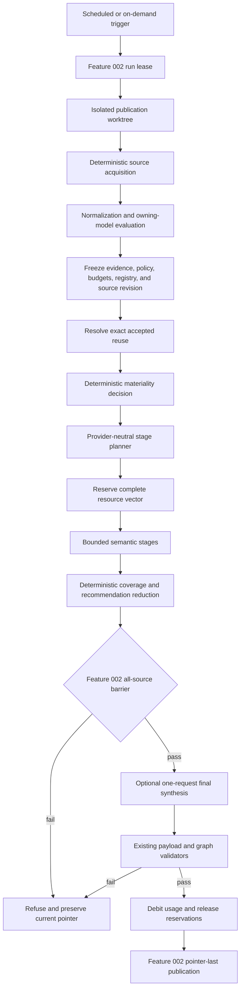
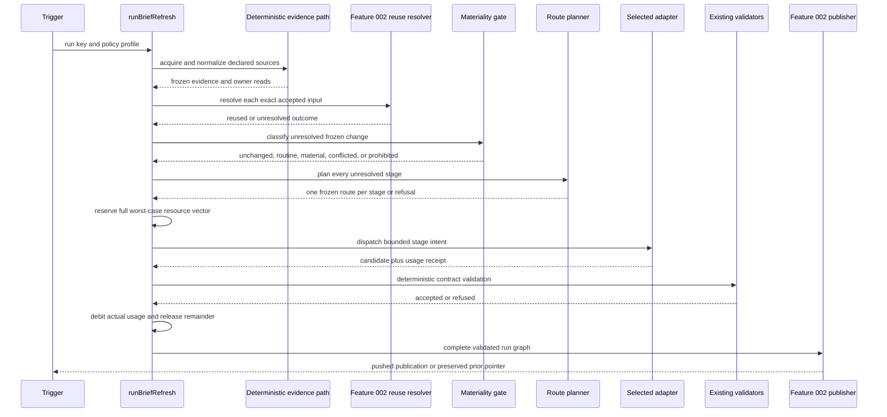
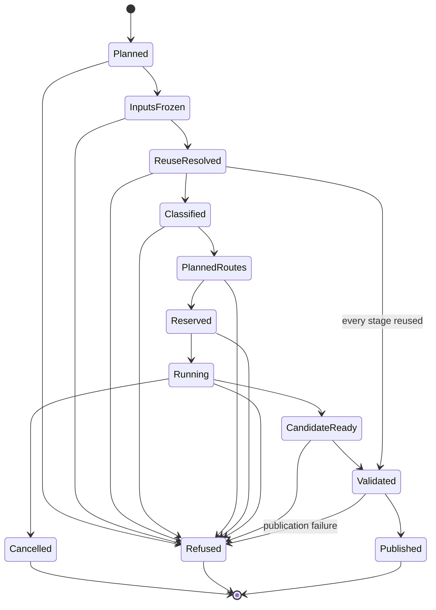
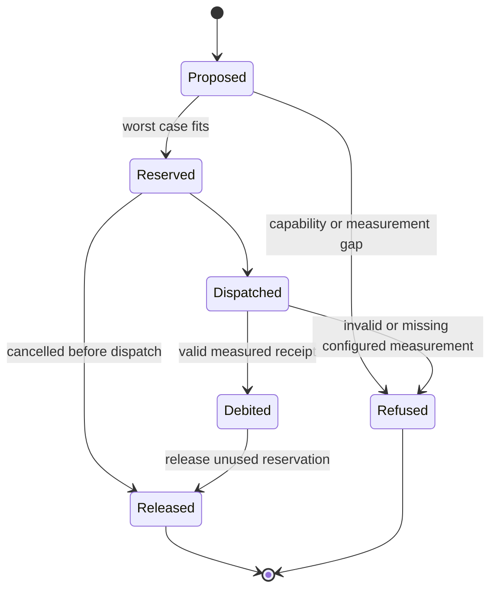
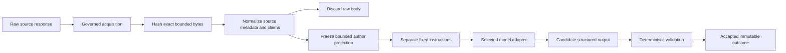

# Feature 030 - Budget-Aware Hybrid Brief Generation - Design

**Owner:** `bubbles.design`

**Artifact status:** Planning only. This document claims no implementation,
release, certification, model-quality result, or cost-reduction percentage.
It declares no release train and introduces no feature flag.

## Design Brief

### Current State

Research Lab has two publication paths at different maturity levels.
[brief-refresh.mjs](../../scripts/brief-refresh.mjs) exports the evidence-first
`runBriefRefresh` state machine, but its `--distributed-run` CLI branch exits
without running it. The live worker in
[brief-refresh-and-push.sh](../../scripts/brief-refresh-and-push.sh) still calls
[brief-narrative-parallel.mjs](../../scripts/brief-narrative-parallel.mjs).

The live narrative process reads one `BRIEF_MODEL` value for every lane. Its
`core`, `signals`, `groups`, and `coverage` lanes share that model identity.
The research side path also uses the same process launcher. Some legacy lanes
receive web authority even though deterministic evidence acquisition already
has a governed boundary in
[web-evidence-acquire.mjs](../../scripts/web-evidence-acquire.mjs).

The evidence-first path already contains the right integration points.
`runFinalAuthor` checks the complete source-read and source-brief sets before
final authorship. [brief-author.mjs](../../scripts/brief-author.mjs) already
separates instructions from frozen data and invokes child processes with
`shell: false`. Its v2 author capability ledger grants no web, shell,
repository-write, model-recompute, provider-key, or private-portfolio authority.

One gap is decisive. `resolveBriefReuse` exists, but the listed production
sources contain no caller. `runBriefRefresh` advances through a reuse phase and
then sends every frozen source read to `runToolAuthorPool`.

### Target State

Extend `runBriefRefresh` with one provider-neutral route planner. Run it after
the complete input freeze and exact reuse resolution. Run it before every
semantic dispatch.

The planner assigns one declared stage intent to exactly one route or refuses.
It keeps acquisition, normalization, owning-model evaluation, exact reuse,
materiality, coverage, validation, and publication deterministic. It bounds
source authorship, critique, agenda interpretation, and final synthesis as
separate semantic stages.

An unchanged and fully reusable run makes no model request. Routine semantic
work uses an eligible local or low-cost hosted route. A material or permitted
conflicted run may use one frontier request for final synthesis. No other stage
may use frontier capacity.

### Patterns To Follow

- Preserve Feature 002 identities, source completeness, exact reuse, history,
  and pointer-last publication.
- Preserve Feature 019 topic selection, evidence roles, dossiers, and required
  review semantics.
- Preserve Feature 026 output budgets, dark states, delta-only publication, and
  reader brevity.
- Extend `runBriefRefresh` instead of adding another scheduler.
- Extend `brief-author.mjs` as the powerless process boundary.
- Keep [validate-brief-payload.mjs](../../scripts/validate-brief-payload.mjs)
  authoritative for the current public payload.
- Reuse the injected acquisition boundary and frozen author projection in
  `web-evidence-acquire.mjs`.
- Read every numeric policy from
  [market-brief.config.json](../../market-brief.config.json).

### Patterns To Avoid

- Do not route from source text, model output, prose quality, or provider advice.
- Do not let a model browse, acquire sources, choose tools, select a provider,
  change a budget, or publish.
- Do not treat a missing usage field as zero.
- Do not switch providers after a selected route fails.
- Do not retry an accepted principal stage during an outer run retry.
- Do not compare local quality with a named frontier model without measured
  evidence from the frozen evaluation corpus.
- Do not create another run ledger, history index, current pointer, or payload
  validator.

### Resolved Decisions

- Exact reuse runs before route planning.
- Materiality is a pure closed classifier over frozen structured inputs.
- Route selection is provider-neutral and freezes before dispatch.
- Provider and model identities live in adapter configuration and receipts.
- Frontier capacity is one request for the whole run, not one per stage.
- Every budget dimension has an explicit policy state and receipt state.
- The live cutover replaces the global-model lane path atomically.
- Rollback selects validated prior artifacts and policy. It performs no paid
  replay.

### Open Owner Decisions

- Approve the initial adapter inventory and its non-secret configuration.
- Approve the frozen shadow corpus and comparative quality rubric.
- Approve which policy profiles may select local versus low-cost hosted routes.
- Approve the provider-specific credit scale and monetary currency for each
  hosted adapter.

### Explicit Non-Goals

- This design changes no owning financial model or recommendation formula.
- It changes no Feature 019 topic question, cadence, dossier, or evidence role.
- It changes no Feature 026 output cap or reader layout.
- It adds no public route, server, account, bundler, package dependency, paid
  data source, trade execution, or private portfolio input.

## 1. Purpose And Ownership Boundary

Feature 030 owns stage-specific route selection, deterministic materiality
escalation, resource admission, execution receipts, and legacy-path cutover.
It does not absorb the contracts of Features 002, 019, or 026.

| Capability | Owning feature | Feature 030 relationship |
| --- | --- | --- |
| Registry-derived reads and source briefs | Feature 002 | Consume frozen reads and preserve its complete source set |
| Exact brief reuse | Feature 002 | Invoke its existing reuse predicate before any route decision |
| All-source barrier | Feature 002 | Preserve it as a hard precondition for final synthesis |
| Immutable history and atomic publication | Feature 002 | Add references to its run manifest and history rows |
| Recurring agenda selection and dossiers | Feature 019 | Treat selected topic work as owner-declared stage intents |
| Every-generation review policy | Feature 019 | Preserve its reuse restrictions and current-generation accounting |
| Output budgets and dark states | Feature 026 | Validate routed output through the existing payload contract |
| Delta-only reader publication | Feature 026 | Leave its selection and rendering behavior unchanged |
| Route, materiality, and usage policy | Feature 030 | Define once and consume from `runBriefRefresh` |

The design hypothesis is supported by the listed source set. Every observed
semantic dispatch uses either `runLane` or `invokeAuthor`. The all-source gate
already precedes `runFinalAuthor`. The unsupported part is exact reuse wiring,
because `resolveBriefReuse` has no current caller.

This design treats that gap as an ordering defect. It does not create another
reuse implementation.

## 2. Architecture Overview



The route planner never receives raw source bodies. It receives frozen hashes,
typed evidence states, owner interpretations, policy references, and budget
state. It cannot mutate any of those inputs.

### 2.1 Run Sequence



### 2.2 Run State



`Validated` means every required stage outcome and usage receipt passed. It
does not mean published. A commit or push failure retains the validated graph
for exact resume.

## 3. Grounded Source Observations

| Source | Observation that controls this design |
| --- | --- |
| [brief-refresh.mjs](../../scripts/brief-refresh.mjs) | `runBriefRefresh` already owns the evidence-first state machine and all-source final barrier |
| [brief-refresh.mjs](../../scripts/brief-refresh.mjs) | `resolveBriefReuse` exists but is not called before `runToolAuthorPool` |
| [brief-author.mjs](../../scripts/brief-author.mjs) | Author requests use frozen JSON, separate instructions, bounded stdout, hard timeouts, and `shell: false` |
| [brief-author.mjs](../../scripts/brief-author.mjs) | The v2 capability ledger grants no author web, shell, write, model-recompute, provider-key, or private-portfolio authority |
| [brief-narrative-parallel.mjs](../../scripts/brief-narrative-parallel.mjs) | One environment-derived model identity controls all four critical lanes and the research launcher |
| [brief-narrative-parallel.mjs](../../scripts/brief-narrative-parallel.mjs) | The legacy `core` and `signals` lanes may receive web access |
| [brief-refresh-and-push.sh](../../scripts/brief-refresh-and-push.sh) | The live worker invokes the legacy lane process and retries the complete narrative attempt |
| [brief-refresh-scheduled.sh](../../scripts/brief-refresh-scheduled.sh) | The scheduler locks one occurrence and runs the worker in a disposable clone |
| [validate-brief-payload.mjs](../../scripts/validate-brief-payload.mjs) | The current public payload is rejected through one accumulating deterministic error list |
| [web-evidence-acquire.mjs](../../scripts/web-evidence-acquire.mjs) | Acquisition validates an injected boundary, discards raw bodies, and freezes a bounded evidence bundle |
| [market-brief.config.json](../../market-brief.config.json) | Existing artifact, output, acquisition, tool-brief, concurrency, and timeout policies are committed inputs |
| [Product Principles](../../docs/Product-Principles.md) | P1 through P8 and P20 through P23 require provenance, missing-state honesty, scoreability, budgets, and adversarial guards |

## Shared Framework Consumption Boundary

A product-neutral framework proposal exists in a separate repository. Its design
is at `execution-ledger/docs/DESIGN.md`. That framework belongs to no
consumer. This feature is one of three prospective consumers, and none is bound
today. On approval this design would consume its shared contracts rather than
define them here.

| Boundary | Items |
| --- | --- |
| Consumed from the framework | `ExecutionRun`, `StageIntent`, `StagePlan`, `RouteCapability`, `RouteDecision`, `ResourceBudget`, `Reservation`, `BudgetEvent`, `UsageAdapter`, `UsageReceipt`, `MaterialityDecision`, `OccurrenceIdentity`, `EvidenceProjection`, `FrozenCorpus`, `ShadowEvaluation` |
| Retained as this feature's domain policy | The closed brief stage graph and its legacy lane assignment, the brief output and artifact layout, the domain material rules and the single frontier permit value, the static build-free boundary and the reader continuity rules |
| Replaced by references on approval | The twelve-row table in `### 9.1 Complete Resource Vector`, the generic measurement states in `### 9.2 Dimension Policy State`, the generic transitions in `### 9.3 Reserve, Debit, And Release`, the generic parts of `### 10.1 Canonical Identity` and `### 10.2 Logical Occurrence Rule`, the generic inert-content rule in `### 11.2 Inert Content Rule` |

This binding is not active today and requires the owner's approval and a
separate framework approval. Until both approvals land the existing sections of
this design stay authoritative and independently implementable. This section
changes no requirement, no scenario, no gate, and no acceptance criterion of
Feature 030.

## Capability Foundation

The proportionality triggers apply. The capability has five route classes,
several semantic stages, multiple adapters, and shared contracts across source
briefs, agenda work, and final synthesis.

### 4.1 Contract Registry

| Contract | Responsibility | Primary consumers |
| --- | --- | --- |
| `brief-generation-policy/v1` | Closed stage graph, route eligibility, materiality rules, retry policy, and budget vectors | `runBriefRefresh`, planner, validator |
| `model-route-capability/v1` | Provider-neutral capability statement for one adapter class | planner and adapter preflight |
| `route-adapter-config/v1` | Non-secret provider, model, endpoint mode, process binding, and usage mapping | adapter runtime only |
| `stage-intent/v1` | Frozen semantic or deterministic operation without provider identity | reuse resolver, planner, receipts |
| `stage-plan/v1` | One selected route, adapter-config hash, reservation, and occurrence identity | runtime and resume logic |
| `materiality-decision/v1` | Closed change classification with rule evidence | planner, final eligibility, audit |
| `budget-reservation/v1` | Worst-permitted resource hold before work starts | run budget ledger |
| `stage-execution-receipt/v1` | One attempt result, usage state, output hash, and validation result | run manifest and diagnosis |
| `generation-usage-receipt/v1` | Run-level reserved, debited, released, and peak resource totals | payload validator and auditor |
| `shadow-evaluation/v1` | Frozen baseline-versus-candidate quality and cost comparison | promotion gate |

All contracts use exact closed version strings. Unknown versions or fields
refuse. An additive version may preserve a compatibility projection, but no
reader guesses an unknown field's meaning.

### 4.2 `brief-generation-policy/v1`

The policy is a committed non-secret object in `market-brief.config.json`.
It contains these required groups:

| Group | Required content |
| --- | --- |
| `stageGraph` | Ordered stage kinds, dependencies, semantic class, owner contract, and output contract |
| `routeClasses` | Closed route vocabulary and unique selection priority |
| `materialityRules` | Ordered deterministic rule IDs and frontier eligibility |
| `budgetProfiles` | Complete dimension vectors for the run and each consuming stage class |
| `retryProfiles` | Retryable failure classes, attempt ceilings, and no-reroute rule |
| `adapterRefs` | Named adapter-config objects with exact fingerprints |
| `shadowPolicy` | Corpus manifest, rubric version, sample floor, and promotion checks |
| `retentionPolicy` | Artifact caps and Feature 002 history references |

Every policy member is required. Code provides no behavioral fallback. A policy
change creates a new policy fingerprint and cannot alter an active run.

### 4.3 `model-route-capability/v1`

This contract describes capability, not a named provider.

| Field | Rule |
| --- | --- |
| `contractVersion` | Exactly `model-route-capability/v1` |
| `capabilityId` | Stable policy-safe identifier |
| `routeClass` | `deterministic`, `local`, `low-cost-hosted`, `frontier`, or `human-review` |
| `supportedStageKinds` | Closed non-empty stage-kind set |
| `supportedInputClasses` | Public, source-qualified, or restricted-local classes the route accepts |
| `supportedOutputContracts` | Exact contract versions the adapter can return |
| `maxContextBytes` | Hard accepted request bytes |
| `maxOutputBytes` | Hard accepted response bytes |
| `measurableDimensions` | Exact budget dimensions the adapter can measure |
| `cancellationMode` | `pre-dispatch`, `cooperative`, or `process-group` |
| `usageReceiptVersion` | Adapter receipt contract version |

Provider names, model names, URLs, credentials, machines, and hosts are absent.
The selected adapter configuration supplies those facts after planning.

### 4.4 `stage-intent/v1`

| Field | Rule |
| --- | --- |
| `stageId` | Stable within the run's closed stage graph |
| `stageKind` | One declared graph member |
| `ownerContractRef` | Feature 002, Feature 019, Feature 026, or Feature 030 authority |
| `semanticClass` | `deterministic` or `semantic` |
| `requiredCapability` | Provider-neutral capability ID |
| `inputRefs` | Ordered immutable refs with byte hash and semantic fingerprint |
| `outputContract` | Exact accepted output version |
| `reusePolicy` | `required`, `permitted`, or `prohibited` as declared by the owner |
| `privacyClass` | `public`, `source-qualified`, or `restricted-local` |
| `allowedRouteClasses` | Closed set supplied by policy |
| `budgetProfileRef` | Exact stage budget profile |
| `retryProfileRef` | Exact retry profile |
| `consequenceBoundary` | Always `candidate-data-only` for semantic stages |

No field can grant web, shell, file-write, publication, budget, or provider
selection authority to a model.

### 4.5 `stage-plan/v1`

The planner emits one plan for every unresolved intent.

| Field | Rule |
| --- | --- |
| `stageIntentFingerprint` | Re-derived from the exact intent |
| `materialityDecisionRef` | Exact decision hash |
| `routeClass` | One allowed route class |
| `routeCapabilityId` | One eligible capability |
| `adapterConfigFingerprint` | Exact non-secret adapter configuration |
| `logicalOccurrenceId` | Stable across transport attempts and resume |
| `reservationRef` | Full worst-case reservation |
| `selectionRuleId` | Deterministic rule that selected this route |
| `selectedAtInputFreeze` | Boolean that must be true |

The plan does not carry raw adapter secrets. A selected adapter cannot be
replaced after the plan freezes.

### 4.6 Extension Points

1. A new route adapter declares one capability and one non-secret config.
2. A new semantic stage declares an intent and output validator.
3. A new measurement maps one provider field into a normalized usage dimension.
4. A new materiality rule adds one ordered deterministic predicate.
5. A new owner may prohibit reuse for its stage without changing the planner.

Each extension needs a production consumer and an adversarial test. Adding an
adapter alone does not make it eligible.

### 4.7 Foundation-Owned Invariants

1. Deterministic stages never invoke a model.
2. Exact reuse resolves before route planning.
3. Every unresolved semantic stage resolves one route or refuses.
4. Route selection uses frozen structured facts only.
5. One run can reserve and dispatch at most one frontier request.
6. A routine decision cannot select frontier.
7. A selected route failure cannot trigger another provider.
8. A configured unmeasurable dimension refuses before dispatch.
9. An absent measurement becomes `unmeasured`, never numeric zero.
10. A model output remains candidate data until deterministic validation passes.
11. An accepted stage outcome is immutable and never reruns on outer retry.
12. Feature 002's all-source barrier remains mandatory.
13. Feature 026's payload validator remains authoritative.
14. Current publication changes only through Feature 002 pointer-last promotion.

## Concrete Implementations

### 5.1 Deterministic Route

This route executes pure or bounded repository-owned code. It covers registry
freeze, source plan rendering, acquisition control, normalization, owner-model
evaluation, reuse, materiality, grouping, validation, and publication.

Its usage receipt still records wall time, source calls, cache operations,
retained bytes, retries, and peak concurrency. Model requests and token use are
`not-applicable`, not zero-valued measurements.

### 5.2 Local Model Route

The local route is optional. One operator-configured adapter may use an
OpenAI-compatible endpoint and an approximately 27B-class reasoning model.
Neither detail is a product dependency or quality claim.

The repository commits only an adapter ID, protocol mode, capability statement,
and usage mapping. It commits no host, machine name, endpoint URL, credential,
or model installation path. Runtime configuration supplies the endpoint.

If policy selects the local route and its frozen preflight is unavailable, the
stage refuses. It does not switch to hosted execution.

### 5.3 Low-Cost Hosted Route

This route uses a configured external process adapter. The process owns its
authentication outside request JSON. The existing `invokeAuthor` process
boundary remains the inner transport.

The adapter must measure every configured token, credit, and monetary dimension.
It must report a closed normalized receipt. An invalid receipt blocks
publication even when its authored output validates.

### 5.4 Frontier Route

The frontier route is eligible only for `final-synthesis`. The materiality
decision must be `material` or an owner-permitted `conflicted` state.

The run reserves its single frontier permit before dispatch. Every dispatch
attempt consumes that permit. A timeout, malformed response, or contract failure
cannot trigger another frontier request in the same run.

The route may describe a conflict. It may not resolve an owner-blocking source
dispute, invent a winner, or weaken Feature 002 conflict rules.

### 5.5 Human Review Or Refusal Route

This route makes no model call. It records why automation cannot proceed and
preserves the current publication. It applies to prohibited input, unresolved
policy conflict, non-measurable configured cost, or an owner-required decision.

Human review does not mutate the frozen run. An approved change creates a new
policy version or descendant run.

### Variation Axes

| Axis | Variants | Foundation-owned behavior |
| --- | --- | --- |
| Execution class | deterministic, local, hosted, frontier, human review | one frozen selection or refusal |
| Stage purpose | source author, critic, agenda interpretation, final synthesis | closed inputs, outputs, and consequences |
| Privacy class | public, source-qualified, restricted-local | eligibility and projection filtering |
| Usage support | tokens, credits, money, cache, source, bytes, time | normalized measured or unmeasured states |
| Retry policy | none, transport-only, contract-repair | same input, same route, one accepted outcome |
| Reuse policy | required, permitted, prohibited | owner policy wins over route economics |
| Materiality | unchanged, routine, material, conflicted, prohibited | deterministic precedence and frontier eligibility |
| Adapter protocol | child process, optional local compatible endpoint | provider details remain outside domain contracts |

## 6. Closed Stage Graph

The stage graph is versioned and closed. A run with an unknown, duplicated, or
out-of-order stage refuses before external work.

| Order | Stage kind | Class | Owner | Required output |
| ---: | --- | --- | --- | --- |
| 1 | `occurrence-admission` | deterministic | Feature 002 | run lease and duplicate verdict |
| 2 | `registry-policy-freeze` | deterministic | Features 002 and 029 | frozen registry, policy, budget, source revision |
| 3 | `source-acquisition` | deterministic | Features 002 and 019 | bounded source and cache receipts |
| 4 | `normalization` | deterministic | Feature 002 | normalized evidence refs |
| 5 | `owning-model-evaluation` | deterministic | owning tools and Feature 019 | complete owner reads and model outputs |
| 6 | `exact-reuse-resolution` | deterministic | Feature 002 | reused refs and unresolved intents |
| 7 | `materiality-classification` | deterministic | Feature 030 | one closed materiality decision |
| 8 | `route-planning` | deterministic | Feature 030 | one plan per unresolved intent |
| 9 | `source-brief-author` | semantic | Feature 002 | bounded source brief candidates |
| 10 | `source-brief-critique` | semantic | Feature 030 | bounded critique or accepted-as-is verdict |
| 11 | `agenda-situation-author` | semantic | Feature 019 | bounded situation candidates for selected topics |
| 12 | `coverage-rollup` | deterministic | Features 002 and 026 | complete coverage, groups, deltas, and dark states |
| 13 | `all-source-barrier` | deterministic | Feature 002 | exact complete source-set verdict |
| 14 | `final-synthesis` | semantic | Features 002 and 029 | one final candidate |
| 15 | `payload-validation` | deterministic | Features 002 and 026 | existing payload and graph verdicts |
| 16 | `usage-settlement` | deterministic | Feature 030 | complete generation usage receipt |
| 17 | `publication` | deterministic | Feature 002 | pointer-last commit and push result |

Every semantic stage is optional only when its owner contract permits reuse or
deterministic output. Optional does not mean silently omitted. The run manifest
records `reused`, `not-applicable`, `accepted`, or `refused` for every intent.

### 6.1 Legacy Lane Assignment

The target graph accounts for every current legacy author surface.

| Legacy surface | Target intent | Cutover behavior |
| --- | --- | --- |
| `core` lane | `final-synthesis` | Consume complete deterministic context after the all-source barrier |
| `signals` lane | source briefs plus `final-synthesis` | Owner briefs supply claims, then deterministic reducers supply groups |
| `groups` lane | `coverage-rollup` | Replace model grouping and watchlist restatement with deterministic projections |
| `coverage` lane | `coverage-rollup` | Derive complete registry coverage without a model |
| `research-acquisition` lane | `source-acquisition` | Remove model browsing and use the governed acquisition boundary |
| per-topic `research-*` lanes | `agenda-situation-author` | Preserve Feature 019 selection, evidence roles, and output contracts |
| complete outer narrative retry | stage-level resume | Reuse every accepted principal outcome and run only unresolved stages |

The source-brief critic may examine only a validated author candidate and its
frozen projection. It cannot acquire evidence or change owner model output.
Policy may omit critique for an exact accepted source brief.

### 6.2 Feature 019 Reuse Rule

Feature 019 requires a complete current-generation pass for active
`every-generation` topics. Feature 030 cannot redefine that policy.

Each agenda stage therefore carries the owner-declared reuse mode. A mandatory
current-generation semantic pass uses `reusePolicy: prohibited` unless Feature
019 changes its contract through its owner. Such a stage makes the run at least
`routine`, even when market evidence fingerprints match a prior run.

The global `unchanged` outcome applies only when every semantic intent is
exactly reusable under its owner policy. This preserves both ownership and the
zero-call invariant for genuinely reusable runs.

## 7. Deterministic Route Planner

### 7.1 Planner Inputs

The planner accepts only these frozen inputs:

- stage intent and fingerprint.
- materiality decision and fingerprint.
- remaining run and stage budget vectors.
- adapter capability snapshots and config fingerprints.
- privacy class and allowed route classes.
- owner reuse and consequence policy.
- prior accepted outcome refs.
- frontier permit state.
- run cutoff, source revision, and policy fingerprint.

Source text, model prose, provider suggestions, and raw response bodies are not
planner inputs.

### 7.2 Eligibility Order

The planner applies filters in this order:

1. Reject a route class outside the stage intent's allowed set.
2. Reject a capability that does not support the stage kind and output contract.
3. Reject a privacy-incompatible route.
4. Reject a route that cannot measure a configured budget dimension.
5. Reject a route whose declared capacity cannot cover the worst-permitted call.
6. Reject frontier unless the materiality and stage rules permit it.
7. Reject an unavailable capability snapshot before selection.
8. Select the one eligible route with the policy's unique ordinal.

Duplicate ordinals are invalid policy. Zero eligible routes produce a refusal.
The planner never tries a second route after dispatch.

### 7.3 Default Route Matrix

| Materiality | Source author and critique | Agenda situation | Final synthesis |
| --- | --- | --- | --- |
| `unchanged` | exact reuse | exact reuse only when owner permits | exact reuse |
| `routine` | local or low-cost hosted | local or low-cost hosted | local or low-cost hosted |
| `material` | local or low-cost hosted | local or low-cost hosted | frontier eligible once, otherwise declared economical route |
| `conflicted` | local or low-cost hosted | local or low-cost hosted | frontier eligible once only when Feature 002 permits synthesis |
| `prohibited` | no dispatch | no dispatch | human review or refusal |

The route policy chooses between local and low-cost hosted execution before
dispatch. Availability may participate only through the frozen capability
snapshot. A later failure cannot trigger a switch.

## 8. Materiality And Conflict Gate

### 8.1 Exact Inputs

`materiality-decision/v1` hashes these normalized inputs:

- frozen registry and source revision fingerprints.
- current and prior accepted owner-read fingerprints.
- current and prior recommendation observation fingerprints.
- source status and freshness transitions.
- required-leg and dark-state transitions.
- owner-declared action eligibility and change assessment.
- visible conflict groups from Feature 002.
- Feature 019 mandatory review obligations.
- policy, output-contract, and validation versions.
- private-data, injection, and contract-admission results.

No narrative text or lexical similarity enters the classifier.

### 8.2 Closed Outputs And Precedence

The classifier returns exactly one of these states. Higher rows win.

| Priority | State | Deterministic predicate |
| ---: | --- | --- |
| 1 | `prohibited` | Safety, privacy, contract, owner-boundary, or configured-measurement admission fails |
| 2 | `conflicted` | Valid owner or source outcomes retain an unresolved permitted conflict |
| 3 | `material` | A declared material rule fires on structured owner or recommendation change |
| 4 | `routine` | At least one accepted semantic input changed without a higher-priority state |
| 5 | `unchanged` | Every semantic intent resolves exact reuse and no owner requires a new pass |

### 8.3 Material Rules

The committed policy contains ordered rule IDs. The initial rule families are:

| Rule family | Fires when |
| --- | --- |
| Recommendation identity | action family, subject set, horizon, trigger, or invalidation changes |
| Evidence availability | a required leg enters or leaves a dark state |
| Owner reversal | an owner emits a validated reversal or opposite direction class |
| High-consequence claim | an owner marks a source-qualified claim with its declared high-consequence token |
| Structural break | an owning model emits its existing material structural-change state |
| New permitted conflict | Feature 002 preserves a direction, horizon, invalidation, or source disagreement |

Feature 030 does not invent numeric financial thresholds. Owning models and
their committed policies decide whether a structured change is material.

### 8.4 Frontier Eligibility

Frontier is eligible only when all conditions hold:

1. The state is `material` or permitted `conflicted`.
2. The stage kind is `final-synthesis`.
3. Feature 002's source and conflict policies permit final wording.
4. The all-source barrier passed.
5. The complete frontier budget is measurable and reserved.
6. No frontier request has been dispatched for this run.
7. The adapter capability and config fingerprints match the frozen plan.

An existing publish-blocking provider dispute remains prohibited for synthesis.
Frontier may explain a visible permitted conflict. It cannot choose a winner.

## 9. Budget Admission And Settlement

### 9.1 Complete Resource Vector

Every run and consuming stage carries one entry for every dimension below.
Omitting a dimension is invalid policy.

| Dimension | Unit | Reservation basis | Debit source |
| --- | --- | --- | --- |
| `modelRequests` | integer requests | maximum dispatch attempts | adapter dispatch ledger |
| `inputTokens` | integer tokens | adapter maximum accepted input | normalized provider usage |
| `outputTokens` | integer tokens | requested output ceiling | normalized provider usage |
| `cacheReads` | integer operations | maximum planned reads | cache adapter receipt |
| `cacheWrites` | integer operations | maximum planned writes | cache adapter receipt |
| `providerCredits` | integer adapter minor units | worst provider charge | adapter usage mapping |
| `monetaryMinor` | integer currency minor units | worst declared cost | adapter usage mapping |
| `sourceCalls` | integer calls | acquisition plan maximum | acquisition receipt |
| `retainedBytes` | integer bytes | maximum artifact bytes | final byte inventory |
| `wallTimeMs` | integer milliseconds | stage deadline | monotonic runtime clock |
| `retries` | integer retries | retry profile maximum | attempt ledger |
| `concurrency` | integer peak workers | route worker cap | scheduler peak measurement |

Provider credit scale and currency code live in adapter configuration. Floating
values never enter budget arithmetic.

### 9.2 Dimension Policy State

Each dimension has one explicit policy state:

- `capped`: a non-negative integer maximum and exact unit are required.
- `not-limited`: the owner records why no hard cap applies.
- `not-applicable`: the route cannot consume the dimension.

Each receipt has one explicit measurement state:

- `measured`: an integer value and measurement source are required.
- `unmeasured`: a closed reason is required and no numeric value is allowed.
- `not-applicable`: no value is allowed.

A `capped` dimension must be measurable before dispatch. A capability that
cannot measure it is ineligible. A post-dispatch missing value makes the receipt
invalid and blocks publication.

An uncapped provider metric may remain `unmeasured`. It never becomes zero.
The receipt still names the adapter and missing measurement reason.

### 9.3 Reserve, Debit, And Release



The run ledger applies reservations atomically in stage order. Concurrent
workers cannot oversubscribe a shared remaining budget.

Before dispatch, the ledger subtracts the worst-permitted vector. After the
attempt, it debits actual measured use and releases the difference. Usage above
the reservation remains charged, records an overrun, and blocks publication.

Failed and cancelled attempts still debit any measured provider consumption.
No receipt is discarded because its output failed validation.

### 9.4 Frontier Permit

The frontier permit is a run-level `modelRequests` sub-budget with maximum one.
Reservation and dispatch are separate events. Dispatch consumes the permit.

A preflight refusal releases an undispatched permit. Any request handed to the
adapter consumes it, regardless of response quality or transport outcome.

## 10. Identity, Retry, Cancellation, And Resume

### 10.1 Canonical Identity

Let `C(v)` be Feature 002 canonical JSON and `H(k, v)` be SHA-256 over a kind
tag, a zero byte, and `C(v)`.

$$
F_{stage}=\{\text{kind, owner, inputs, output, reuse, privacy, policy}\}.
$$

$$
I_{stage}=H(\texttt{stage-intent/v1},F_{stage})
$$

$$
I_{plan}=H(\texttt{stage-plan/v1},\{I_{stage},I_{materiality},\text{routeCapability},I_{adapterConfig},I_{budget}\})
$$

$$
I_{occurrence}=H(\texttt{stage-occurrence/v1},\{I_{run},I_{plan},\text{stageOrdinal}\})
$$

$$
I_{attempt}=H(\texttt{transport-attempt/v1},\{I_{occurrence},\text{attemptOrdinal}\})
$$

$$
I_{outcome}=H(\texttt{accepted-stage-outcome/v1},\{I_{stage},\text{outputContract},I_{validatedOutput}\})
$$

Provider and model names are not stage-intent inputs. The adapter-config
fingerprint changes whenever their configured identity changes.

### 10.2 Logical Occurrence Rule

One logical occurrence may have several bounded transport attempts. It may
have at most one authoritative accepted outcome. Later valid responses for the
same occurrence are duplicate diagnostics and cannot replace the first accepted
outcome.

The attempt ledger records request acceptance, timeout, cancellation,
transport status, output hash, receipt hash, and validation result. It stores no
prompt, source body, hidden reasoning, or rejected private value.

### 10.3 Retry Policy

Only these failure classes may retry when the stage policy permits them:

- connection failure before a valid response.
- bounded timeout.
- explicitly retryable provider response.
- contract-repair response against the same frozen request.

Retries keep the same occurrence, input refs, route capability, adapter config,
materiality decision, and budgets. A retry never reacquires evidence.

Frontier has one dispatch attempt. A frontier response that fails validation
ends the run.

### 10.4 Outer Retry Rule

An outer retry reloads the run manifest and validates every accepted outcome.
It starts at the first unresolved stage. It never reruns an accepted principal
source lane, agenda lane, critique, or final synthesis.

A changed input, policy, adapter config, or output contract creates a descendant
run. It cannot resume under the old occurrence identity.

### 10.5 Cancellation

Cancellation stops new reservations, asks the active adapter to cancel under
its declared mode, records measured consumption, and releases unused capacity.
Accepted outcomes remain immutable. The current publication pointer stays
unchanged.

### 10.6 Idempotent Reuse

`runBriefRefresh` calls Feature 002 `resolveBriefReuse` for every reusable
semantic intent. A valid match records a new occurrence reference to the prior
accepted content. It performs no model request and creates no duplicate body.

The run-level unchanged outcome requires all semantic intents to resolve this
way. Deterministic validation and publication reference work may still run.

## 11. Evidence Projection And Prompt-Injection Boundary

### 11.1 Data Flow



`web-evidence-acquire.mjs` remains the source-text trust boundary. It validates
URLs, robots state, response size, freshness, metadata, and instruction-shaped
content. It discards raw bodies after normalization.

The author projection contains normalized claims and safe source metadata. Raw
excerpt bodies do not enter model requests. Feature 030 adds route and budget
refs beside that projection. It does not widen the projection.

### 11.2 Inert Content Rule

Source and model text can affect only candidate text fields allowed by the
stage output contract. They cannot alter:

- stage graph or route class.
- adapter or provider selection.
- tools, URL policy, or source plan.
- budget, retry, concurrency, or timeout policy.
- validation rules or output contract.
- publication path, target, pointer, or Git inventory.
- consequence, account, order, or communication boundaries.

Instruction-shaped source text is rejected before authoring. Instruction-shaped
model output is rejected before acceptance. Neither value is echoed to logs.

### 11.3 Committed Content Boundary

Committed artifacts may contain normalized claims, citations, route refs,
usage counts, costs, timestamps, states, and hashes. They exclude:

- raw source bodies.
- complete prompts.
- hidden reasoning or chain-of-thought.
- credentials or authentication headers.
- browser-private state.
- position size, cost basis, profit and loss, or account identity.
- rejected unsafe content.

## 12. Data Model And Immutable Artifact Layout

### 12.1 Additive Layout

Feature 030 extends the Feature 002 graph. It creates no new pointer or history
authority.

```text
briefs/
  current.json
  history-current.json
  objects/
    generation-policies/<policy-fingerprint>.json
    materiality/<materiality-fingerprint>.json
    stage-plans/<stage-plan-fingerprint>.json
    stage-outcomes/<outcome-fingerprint>.json
    usage/<stage-receipt-fingerprint>.json
    usage/<generation-receipt-fingerprint>.json
    shadow-evaluations/<evaluation-fingerprint>.json
  runs/<YYYY-MM>/<run-id>/manifest.json
  history/runs/<YYYY-MM>.jsonl
```

`manifest.json` gains refs to policy, materiality, plans, accepted outcomes, and
usage receipts. The existing run-history row gains those refs and compact
totals. It does not embed model output or raw usage payloads.

### 12.2 Cardinality And Size Budgets

| Artifact or operation | Hard admission rule |
| --- | --- |
| Source brief intents | At most the configured `maxToolBriefsPerGeneration`, currently declared as 40 |
| Frontier requests | At most one dispatched request per run |
| Accepted outcomes | At most one per logical stage occurrence |
| Stage attempts | At most the sum of frozen retry-profile attempt ceilings |
| Stage intents | At most twice the source-brief ceiling, plus fixed graph stages and the Feature 019 selected-topic ceiling |
| One author stdout | At most the configured tool-brief bound, currently 98,304 bytes |
| One new route, receipt, or evaluation object | At most `artifact-budget/v1.maxNormalizedObservationBytes`, currently 262,144 bytes |
| Complete retained bytes | Must fit the frozen run-level `retainedBytes` cap before dispatch |
| Source calls and concurrency | Must fit both the existing acquisition policy and the Feature 030 run vector |

The stage-intent bound is derived from frozen policy values. It is not a copied
registry count. A value over the bound refuses before authoring.

### 12.3 Retention

Accepted route and usage objects follow Feature 002 run retention. Open-month
history appends refs. Sealed history remains immutable. Corrections append a
new record that references the original receipt.

Provider-native usage responses are normalized and discarded. The exact raw
response hash may remain when the adapter can compute it without retaining
sensitive content.

Shadow evaluations retain only frozen input refs, baseline and candidate output
refs, normalized quality findings, usage totals, and reviewer decisions. They
retain no duplicate narratives.

## 13. Module And Configuration Map

### 13.1 Existing Modules To Extend

| File | Planned responsibility |
| --- | --- |
| [brief-refresh.mjs](../../scripts/brief-refresh.mjs) | Call reuse, materiality, planner, budget ledger, stage runtime, settlement, and existing publisher in the closed order |
| [brief-author.mjs](../../scripts/brief-author.mjs) | Accept a frozen stage plan and return normalized adapter plus usage receipts while retaining the powerless process boundary |
| [brief-refresh-and-push.sh](../../scripts/brief-refresh-and-push.sh) | Become a thin invocation of the live `runBriefRefresh` path and existing final validators |
| [brief-refresh-scheduled.sh](../../scripts/brief-refresh-scheduled.sh) | Keep clone, lock, due-window, acknowledgment, and immutable-launcher behavior while removing global lane-model knobs |
| [validate-brief-payload.mjs](../../scripts/validate-brief-payload.mjs) | Validate the generation receipt ref, no-paid-reuse rule, frontier count, and configured measurement completeness |
| [web-evidence-acquire.mjs](../../scripts/web-evidence-acquire.mjs) | Preserve the injected acquisition boundary and add source-call, cache, byte, time, and concurrency receipts |
| [market-brief.config.json](../../market-brief.config.json) | Add generation policy, route capabilities, adapter refs, budget profiles, and shadow policy |

### 13.2 Planned New Modules

| File | Responsibility |
| --- | --- |
| `rlbriefroute.js` | Pure UMD policy validation, materiality, route selection, budget reduction, identities, and receipt validation |
| `scripts/brief-route-runtime.mjs` | Node adapter registry, capability preflight, dispatch, cancellation, and normalized usage mapping |
| `scripts/brief-shadow-evaluate.mjs` | Frozen-corpus baseline and candidate comparison with no publication authority |

`rlbriefroute.js` uses the repository's UMD pattern. Node and any static audit
consumer receive the same frozen API. It imports no network, filesystem, model,
or publication authority.

### 13.3 Legacy Path Closure

Feature 030 owns the production cutover from
`brief-narrative-parallel.mjs`. The cutover change must:

1. Wire the live worker to `runBriefRefresh`.
2. Move every retained semantic obligation into a declared stage intent.
3. Preserve Feature 019 agenda contracts through its existing owner runtime.
4. Remove the live call to `brief-narrative-parallel.mjs`.
5. Remove the one-global-model policy and related lane retry settings.
6. Remove `BRIEF_MODEL` from the scheduler and worker contract.
7. Delete `brief-narrative-parallel.mjs` after the consumer trace proves no
   production caller remains.
8. Keep the existing payload validator and Feature 002 graph validator active.

The same change closes the superseded global-model policy. A dormant second
path would violate P18, P19, and P24.

## 14. Static And Build-Free Boundary

The public product remains static. Published briefs remain readable with no
provider credential, account, proxy, model endpoint, server, or successful
latest generation.

Generation remains a Node operator workflow. New production code uses built-in
Node capabilities and existing repository modules. It adds no required package
dependency or bundler.

The pure shared module uses UMD and ordinary script loading. Existing browser
consumers retain `file://` operation. No browser performs model dispatch,
provider usage queries, or source acquisition for Feature 030.

A local endpoint is an optional operator adapter. Its absence cannot break the
last validated public brief. A policy that selects it must refuse before
dispatch when it is unavailable.

## 15. Production Migration And Rollback

### 15.1 Baseline Freeze

Before shadow execution, create one immutable corpus manifest. It records at
least 30 representative accepted historical runs. Each row carries the run ID,
source revision, window, evidence refs, policy refs, payload hash, validator
result, and baseline usage state.

The manifest also records strata. It covers the four scheduled windows,
available and unavailable evidence, source conflicts where present, quiet and
changed runs, agenda work, and output-budget edges. A missing required stratum
blocks promotion rather than being synthesized.

### 15.2 Shadow Mode

Shadow mode runs candidate planning and generation against the same frozen
inputs as the baseline. It cannot move any current pointer, append public
history, write the production payload, commit, or push.

The shadow budget is independent from the production budget. Every shadow call
still produces real usage receipts. Cost comparison uses absolute measured
values and identical units. It states no percentage unless computed from the
accepted receipts.

### 15.3 Comparison

For each corpus run, compare:

- source and registry coverage.
- material claim set and citation set.
- missing, stale, conflict, and unavailable states.
- recommendation scoreability fields.
- action, miss, and invalidation visibility.
- Feature 026 output-budget result.
- existing payload-validator result.
- route class, model request count, tokens, credits, money, time, and bytes.
- omitted or newly introduced claim differences.
- human usefulness under the approved blinded rubric.

A quality comparison may conclude non-inferiority only through the approved
rubric and complete corpus. This design makes no model-quality claim.

### 15.4 Advisory And Canary Phases

1. **Plan-only advisory:** Compute route and reservations beside the legacy run.
   Make no candidate model call.
2. **Shadow generation:** Execute candidate routes against frozen inputs. Keep
   every output non-authoritative.
3. **Non-authoritative canary:** Exercise complete scheduled and on-demand
   entry paths against a private publication target. Keep the public pointer
   unchanged.
4. **Cutover readiness:** Require every promotion gate in section 16.
5. **Atomic live cutover:** Replace the legacy invocation and global model
   policy in one reviewed change.

No live phase mixes legacy lanes with routed source or final outcomes.

### 15.5 Rollback

Runtime rollback selects a prior validated Feature 002 manifest and prior
generation policy. It verifies every object and moves pointers through the
existing publication mechanism. It does not reacquire evidence or rerun a
model.

If the cutover code itself must roll back, revert the cutover change after the
active lease ends. Keep all accepted routed receipts and history immutable.
The previous public pointer remains available throughout.

No rollback reactivates a partially removed global-model path. A code rollback
must restore one complete reviewed path or preserve the current publication.

## 16. Acceptance And Promotion Gates

Promotion requires all checks below on one exact candidate revision.

| Gate | Required result |
| --- | --- |
| Historical corpus | At least 30 frozen representative runs with complete identities |
| Critical honesty | Zero provenance loss, invented evidence, hidden conflict, hidden miss, or missing-state substitution |
| Source completeness | Every required Feature 002 source outcome preserved exactly once |
| Existing validators | Current payload and distributed graph validators pass unchanged authority checks |
| Exact reuse | Zero model requests and zero paid usage on every fully reusable run |
| Routine routing | Zero frontier requests |
| Material routing | No more than one frontier request for the whole run |
| Usage truth | Every configured dimension measured with valid normalized receipts |
| Budget settlement | Reservations, debits, releases, overruns, and peaks reconcile exactly |
| Feature 019 | Mandatory review and dossier rules remain unchanged |
| Feature 026 | Output budget, dark states, deltas, and reader order remain unchanged |
| Failure preservation | Every injected required-stage failure leaves the current pointer byte-identical |
| Retry integrity | Outer retries rerun no accepted principal outcome |
| Security | Source/model instructions cannot change control state or reach logs/artifacts |
| Promotion review | Product auditor and owner approve the frozen comparison record |

Any critical honesty regression rejects promotion regardless of cost. A lower
cost does not compensate for weaker evidence or reader truth.

## 17. Failure Taxonomy And Remediation

Errors carry a closed code, phase, stage ID, safe observation, required state,
and operator action. They carry no prompt, source body, secret, or hidden model
content.

| Code | Condition | Safe operator action |
| --- | --- | --- |
| `B030-POLICY` | Missing, unknown, or inconsistent generation policy | Correct and review the committed policy |
| `B030-STAGE-GRAPH` | Unknown, duplicated, cyclic, or out-of-order stage | Restore the declared graph and rerun planning checks |
| `B030-ROUTE-NONE` | No eligible route exists | Add or enable one reviewed capability in a new policy version |
| `B030-ROUTE-AMBIGUOUS` | More than one route has the same selection ordinal | Make policy priority unique |
| `B030-ROUTE-UNAVAILABLE` | Frozen selected adapter is unavailable | Repair that adapter or start a new run with a reviewed policy |
| `B030-MATERIALITY` | Classifier input or rule output is invalid | Repair the deterministic input or rule |
| `B030-FRONTIER-LIMIT` | A second frontier dispatch is attempted | Preserve the first attempt and refuse the run |
| `B030-BUDGET-UNMEASURABLE` | A capped dimension lacks measurement support | Select a measurable adapter in a reviewed policy |
| `B030-BUDGET-EXHAUSTED` | Worst-case reservation exceeds remaining capacity | Reduce planned work or approve a separate policy revision |
| `B030-USAGE-INVALID` | Receipt is missing, malformed, or inconsistent | Repair adapter usage mapping and retain the failed receipt hash |
| `B030-USAGE-OVERRUN` | Actual use exceeds reservation or cap | Block publication and inspect the adapter contract |
| `B030-INPUT-DRIFT` | Frozen refs or config hashes changed | Create a descendant run with new identities |
| `B030-RETRY` | Retry class or attempt exceeds policy | Stop the occurrence and preserve accepted outcomes |
| `B030-CANCELLED` | Operator or deadline cancellation | Resume only from the immutable run state |
| `B030-INJECTION` | Source or model content attempts control influence | Reject the content and inspect only safe field paths |
| `B030-VALIDATION` | Candidate fails an existing deterministic validator | Preserve prior publication and repair the same frozen stage |
| `B030-SHADOW` | Corpus, comparison, or rubric is incomplete | Complete the frozen evaluation before promotion |
| `B030-CUTOVER` | Legacy and routed production paths are both reachable | Restore one complete authoritative path |

There are no bypass flags. A failure never enables another provider or a weaker
validator.

## 18. Observability Without Sensitive Content

The runtime emits structured events to the existing run journal and committed
run history.

| Event | Safe fields |
| --- | --- |
| `generation.inputs-frozen` | run, policy, registry, source revision, and budget fingerprints |
| `stage.reused` | stage and accepted outcome refs |
| `materiality.classified` | state, ordered rule IDs, and decision fingerprint |
| `route.selected` | route class, capability ID, config fingerprint, and selection rule |
| `budget.reserved` | stage, dimension states, and reserved integers |
| `stage.dispatched` | occurrence, attempt, route class, and deadline |
| `stage.completed` | output hash, receipt hash, validation state, and duration |
| `budget.settled` | measured, unmeasured, debited, released, and overrun states |
| `generation.validated` | source count, stage counts, frontier count, and validator refs |
| `generation.refused` | safe code, phase, stage, and operator action class |
| `generation.published` | manifest, pointer generation, commit, and push refs |

Logs exclude prompts, excerpts, authored bodies, credentials, headers, endpoint
URLs, hidden reasoning, and private data. An adapter may expose only its ID and
configuration fingerprint in generic events.

Operational summaries answer these questions without loading narrative bodies:

- Which stages reused accepted work?
- Which route class handled each unresolved stage?
- Which materiality rule permitted or denied frontier?
- Which dimensions were measured or unmeasured?
- Which reservation, debit, release, or overrun stopped the run?
- Which accepted outcomes will a resume reuse?
- Which prior publication remains current?

## 19. Security And Privacy Threat Model

| Threat | Boundary | Mitigation |
| --- | --- | --- |
| Prompt injection in source text | acquisition to projection | reject instruction-shaped text and omit raw excerpts from author input |
| Model attempts route or budget changes | author output | closed output schema contains no control fields |
| Secret leakage through adapter config | config freeze | commit only non-secret IDs and hashes, reject secret-shaped keys |
| Provider under-reports usage | settlement | require declared measurable dimensions and block invalid receipts |
| Duplicate billing after retry | occurrence ledger | one logical occurrence, bounded attempts, first accepted outcome only |
| Outer retry repeats accepted work | resume | validate accepted refs and start at first unresolved stage |
| Frontier request multiplication | run permit | one dispatch permit consumed before adapter call |
| Provider response tampers with evidence | candidate validation | models cite only frozen claim and owner refs |
| Path traversal in artifact refs | publication | validated relative paths and Feature 002 closed inventory |
| Hidden reasoning enters Git | artifact builder | retain structured output and hashes only |
| Private portfolio data enters a prompt | projection validation | recursive private-field rejection before dispatch |
| Local endpoint becomes mandatory | route policy | optional capability, explicit availability, no automatic substitute |
| Human review becomes a bypass | refusal route | new policy or descendant run required after review |

The design introduces no consequential action. A model cannot trade, notify,
write an account, mutate a publication pointer, or select a Git target.

## 20. Accessibility And Reader Continuity

Feature 030 adds no new reader control or route. The public brief keeps the
Feature 026 Simple and Power behavior. It keeps every negative, conflict, miss,
invalidation, freshness state, and dark state in its existing position.

A failed generation leaves the last validated brief readable with its original
freshness. It never displays a failed candidate or a newer usage timestamp as a
new market read.

If route or usage metadata becomes reader-visible under a separately approved
surface, it must use text labels. Color cannot carry route, measurement, or
failure state. Every value must expose its unit, provenance, and measurement
state. `unmeasured` must read as unavailable measurement, not zero.

The cutover must preserve keyboard order, local-file loading, safe authored
text, and current brief rendering. A route implementation cannot require a
browser network call.

## 21. Testing And Validation Strategy

All tests remain build-free. They use the repository's Node command surface and
the existing payload validator. No test starts a server unless an existing
static-browser contract requires it.

### 21.1 Test Layers

| Layer | Production behavior | Required proof |
| --- | --- | --- |
| Unit | policy parsing, materiality, route eligibility, identities, budget arithmetic | exact closed outputs and boundary values |
| Deterministic fixture | frozen historical runs and adapter capability snapshots | identical plan and identities for equal inputs |
| Integration | `runBriefRefresh` with injected acquisition and route adapters | reuse before routing, complete barrier, settlement, pointer preservation |
| Process boundary | `brief-author.mjs` child process and optional local adapter | timeout, cancellation, stdout cap, receipt mapping, no shell |
| Failure injection | every stage and publication boundary | no partial publish and exact resume |
| Shadow parity | at least 30 frozen representative runs | quality findings and measured cost without public mutation |
| Security | hostile source, model, config, and receipt shapes | no control influence and no sensitive output |
| Static consumer | existing payload validation and reader continuity | accepted candidate remains consumable without provider access |

### 21.2 Scenario Mapping

| Business scenario | Primary test | Required assertion |
| --- | --- | --- |
| BS-030-001 | integration | every semantic stage reuses, model requests equal zero, and refs remain auditable |
| BS-030-002 | route matrix | routine stages select local or low-cost routes and frontier count is zero |
| BS-030-003 | materiality integration | one permitted material final synthesis consumes exactly one frontier permit |
| BS-030-004 | budget admission | capped unmeasurable dimension refuses before adapter invocation |
| BS-030-005 | reservation boundary | cap-plus-one reservation refuses and current pointer hash stays equal |
| BS-030-006 | adapter failure | selected route fails and no second adapter receives a call |
| BS-030-007 | security | hostile source text changes no route, tool, budget, or consequence field |
| BS-030-008 | contract integration | malformed required outcome cannot pass the all-source or payload validators |
| BS-030-009 | resume integration | accepted occurrences remain untouched and only unresolved stages dispatch |
| BS-030-010 | honesty fixture | missing evidence remains distinct and unsupported material claims fail |
| BS-030-011 | shadow evaluation | every omission, citation break, conflict, and miss appears in comparison |
| BS-030-012 | failure preservation | latest refusal leaves the last public brief readable and freshness unchanged |

### 21.3 Budget Adversarial Matrix

Each guard needs a mutation that fails when the guard is removed.

| Dimension or guard | Adversarial case |
| --- | --- |
| Model requests | reserve and attempt one request above the run cap |
| Input tokens | adapter reports exactly cap plus one |
| Output tokens | provider returns exactly cap plus one |
| Cache reads | plan one read above the stage maximum |
| Cache writes | produce one write above the stage maximum |
| Provider credits | report one minor credit unit above the cap |
| Monetary cost | report one currency minor unit above the cap |
| Source calls | request one URL above the acquisition plan |
| Retained bytes | serialize one byte above the retained cap |
| Wall time | advance the monotonic clock one millisecond past the deadline |
| Retries | issue one attempt above the retry profile |
| Concurrency | hold one worker above the configured peak |
| Measurement truth | omit a configured provider usage field and require pre-dispatch refusal from capability mismatch |
| Unmeasured truth | omit an uncapped metric and require `unmeasured` with no numeric value |
| Exact reuse | make the paid adapter throw if called and require a successful reused outcome |
| Routine frontier ban | mutate planner output to frontier and require policy refusal |
| Frontier permit | attempt a second frontier dispatch and require refusal before adapter entry |
| No fallback | fail the selected adapter and assert every other adapter call count remains zero |
| Injection | embed route and budget instructions in source and model text |
| Accepted-lane preservation | fail the final stage, resume, and assert prior principal call counts do not change |
| Receipt overrun | return valid output with usage above reservation and require publication refusal |

### 21.4 Shadow Quality Matrix

The shadow evaluator compares structured results before prose preference.

| Quality class | Critical regression condition |
| --- | --- |
| Coverage | required source outcome missing or duplicated |
| Provenance | material claim loses an admissible evidence ref |
| Missing-state honesty | unavailable, stale, or conflicted becomes a positive claim |
| Scoreability | action loses instrument, level, invalidation, or horizon |
| Conflict | incompatible views are merged or one is hidden |
| Miss visibility | contradicted or not-evaluable outcome is suppressed |
| Reader brevity | existing Feature 026 output budget fails |
| Safety | private or instruction-shaped content enters output |
| Publication | existing payload or graph validator rejects candidate |

Human review follows only after these checks pass. Reviewers receive baseline
and candidate labels in randomized order. They judge decision usefulness,
clarity, and evidence fidelity under the approved rubric.

### 21.5 Repository-Native Commands

Focused implementation validation will use exact committed command surfaces:

```bash
node scripts/selftest.mjs
node scripts/validate-brief-payload.mjs
```

New test modules run with Node's built-in test runner. The plan owner will name
their exact files before implementation. The feature adds no build command,
package-install command, or alternate project CLI.

## 22. Production Cutover Proof

The final cutover test runs scheduled and on-demand entry points against one
isolated Git remote and immutable fixture corpus. It proves:

1. Both entry points invoke `runBriefRefresh`.
2. No production caller invokes `brief-narrative-parallel.mjs`.
3. No production config reads `BRIEF_MODEL`.
4. Exact reuse reaches validation with zero adapter calls.
5. Routine work reaches publication with zero frontier calls.
6. Material work can consume only one frontier call.
7. Every configured usage dimension settles.
8. The current payload passes the existing validator.
9. The distributed graph passes Feature 002 validation.
10. A failure at every stage leaves the prior current pointer unchanged.
11. A push-only resume reuses the exact committed candidate.
12. The public brief remains readable without model access.

The same test mutates the legacy call back into the worker. The cutover guard
must fail. This proves P24 closure mechanically.

## 23. Alternatives And Tradeoffs

### Keep One Global Model

Rejected. It makes cost and capability properties of the whole process rather
than individual stage intents. It also prevents deterministic frontier limits.

### Add Routing Inside Every Author Call

Rejected. Per-call routing would duplicate policy and permit different stages
to interpret the same budget differently. One planner must freeze the run.

### Route Before Exact Reuse

Rejected. It would perform availability checks and reservations for work that
already has an accepted outcome. It also risks a paid call on unchanged input.

### Let The Model Classify Materiality

Rejected. That would let prose select its own provider and spending tier. The
classifier must consume owner-produced structured facts.

### Always Use Frontier For Final Synthesis

Rejected. Routine runs do not justify frontier use. Quality parity with cheaper
routes has not been measured.

### Retry Frontier Output Until It Validates

Rejected. The run-wide one-request contract would become a per-attempt fiction.
A malformed frontier response must fail loud.

### Switch Providers After Failure

Rejected. The new output would have a different route identity and budget risk.
An operator may start a descendant run under a reviewed policy.

### Store Raw Provider Usage Responses

Rejected. They may contain sensitive request metadata and create adapter-shaped
history. Normalize required dimensions and retain the raw hash only when safe.

### Add A Routing Service Or Database

Rejected. The state graph is bounded, Git-backed, and already published through
static artifacts. A service would break the build-free operating boundary.

### Keep The Legacy Lane Process As A Backup

Rejected. Two live policies would violate one-definition and supersession rules.
Rollback uses prior validated routed artifacts, not a hidden global-model path.

## 24. Risks And Tradeoffs

| Risk | Consequence | Mitigation |
| --- | --- | --- |
| Provider usage APIs omit a configured dimension | Cost cap cannot be enforced | Capability preflight refuses the adapter before dispatch |
| Local endpoint usage differs across implementations | Token and cache receipts drift | Adapter-specific normalized mapping plus qualification fixtures |
| Materiality rules over-escalate | Frontier use rises without quality benefit | Frozen rule IDs, shadow distribution, one-request hard cap |
| Materiality rules under-escalate | Economical route may miss synthesis quality | Zero critical-regression gate and blinded corpus review |
| Feature 019 every-generation work prevents global reuse | Some quiet runs still require semantic work | Preserve owner policy and classify those runs as routine |
| Route plan grows with registry size | Static receipt and context budgets may fail | Derived cardinality cap and retained-byte reservation |
| Frontier response fails validation | Material run does not publish | Preserve prior brief and record the single consumed request |
| Cutover removes legacy recovery behavior | Operator loses an implicit alternate path | Prove pointer/config rollback and exact resume before deletion |
| Receipt metadata leaks provider details | Public artifacts expose operator topology | Store adapter ID and config fingerprint, not endpoint or credential |
| Shadow corpus misses a rare state | Promotion evidence is incomplete | Required strata manifest and explicit incomplete comparison result |

## 25. Complexity Tracking

| Decision | Simpler alternative | Why rejected |
| --- | --- | --- |
| Provider-neutral planner plus adapters | one model environment variable | stage capability, budget, privacy, and materiality differ |
| Complete resource vector | request count and token count only | credits, money, sources, bytes, time, retry, cache, and concurrency can each breach independently |
| Reservation plus settlement | check totals after the run | post-run detection cannot prevent overspend or concurrency oversubscription |
| Separate materiality decision | route directly from changed fields | one auditable closed decision is needed for frontier eligibility |
| Stage occurrence and transport attempt identities | one call ID | resume and retry need one accepted outcome across several attempts |
| One frontier permit | per-stage frontier caps | the requirement limits the entire run, not each stage |
| Shadow corpus and atomic cutover | replace the model on one live run | quality and cost must be compared on identical frozen inputs |
| Additive immutable route objects | embed all data in run history rows | bounded point reads and corrections need content-addressed refs |
| Legacy path deletion | retain an emergency global-model branch | two live policies would drift and weaken cutover proof |

## 26. Files To Touch After Approval

This inventory is planning guidance. It is not an implementation claim.

| Path | Planned action |
| --- | --- |
| `rlbriefroute.js` | Create the pure UMD foundation |
| `scripts/brief-route-runtime.mjs` | Create adapter runtime and usage normalization |
| `scripts/brief-shadow-evaluate.mjs` | Create frozen-corpus evaluator |
| [brief-refresh.mjs](../../scripts/brief-refresh.mjs) | Wire reuse, materiality, planning, admission, execution, settlement, and publication |
| [brief-author.mjs](../../scripts/brief-author.mjs) | Bind stage plans and normalized usage to the existing process boundary |
| [brief-refresh-and-push.sh](../../scripts/brief-refresh-and-push.sh) | Replace legacy lane orchestration with the routed run |
| [brief-refresh-scheduled.sh](../../scripts/brief-refresh-scheduled.sh) | Remove global model and lane policy exports while preserving scheduling |
| [validate-brief-payload.mjs](../../scripts/validate-brief-payload.mjs) | Add receipt, reuse, frontier, and configured-measurement checks |
| [web-evidence-acquire.mjs](../../scripts/web-evidence-acquire.mjs) | Emit normalized acquisition resource receipts |
| [market-brief.config.json](../../market-brief.config.json) | Add versioned route, materiality, budget, adapter, and shadow policies |
| [brief-narrative-parallel.mjs](../../scripts/brief-narrative-parallel.mjs) | Delete after the production consumer trace is clean |
| `tests/` | Add unit, integration, failure, security, shadow, and cutover coverage |

No approved implementation scope needs to change browser pages or owning model
formulas. It also needs no Feature 019 topic, Feature 026 cap, package,
deployment, or sibling feature change.

## 27. Remaining Open Decisions

These decisions are real and bounded. None changes the architecture.

| Decision | Owner | Required record before implementation |
| --- | --- | --- |
| Initial local adapter protocol and model metadata | Product owner | reviewed non-secret adapter config |
| Initial hosted and frontier adapter inventory | Product owner | capability and usage-mapping qualification |
| Provider credit minor-unit scale | Product owner | adapter-specific integer scale |
| Monetary currency per hosted adapter | Product owner | ISO currency and integer minor unit |
| Local versus low-cost route priority by stage | Route policy owner | unique route ordinal table |
| Shadow corpus membership and strata | Product auditor | immutable corpus manifest with at least 30 runs |
| Blinded quality rubric | Product auditor and owner | versioned rubric and approval record |
| Feature 019 future reuse permission | Feature 019 owner | explicit owner-contract revision if policy changes |

Until these records exist, the corresponding adapter or promotion path remains
ineligible. No code-supplied value fills the gap.

## 28. Requirement-To-Design Traceability

### 28.1 Functional Requirements

| Requirement | Design authority | Primary validation |
| --- | --- | --- |
| FR-030-001 | Sections 2, 6, and 10 freeze every run input before semantic dispatch | input-drift integration |
| FR-030-002 | Sections 4.4 and 6 require capability and route class per stage | stage-intent contract tests |
| FR-030-003 | Sections 4.7 and 6 mark deterministic stages as model-free | adapter call-count mutation |
| FR-030-004 | Sections 5 and 7 replace one global model with stage plans | cutover consumer proof |
| FR-030-005 | Section 4.3 requires measurement, context, privacy, cancellation, and output capabilities | capability-shape tests |
| FR-030-006 | Sections 7 and 8 use evidence class, materiality, capability, and budget | route matrix tests |
| FR-030-007 | Section 7.2 resolves one route or refuses | no-route and duplicate-priority tests |
| FR-030-008 | Sections 5 and 17 prohibit provider switching | selected-adapter failure test |
| FR-030-009 | Section 8 defines the five-state deterministic classifier | materiality fixture matrix |
| FR-030-010 | Sections 6.2 and 10.6 require exact reuse and zero model calls | exact-reuse integration |
| FR-030-011 | Sections 7.3 and 8.4 ban frontier for routine runs | routine frontier mutation |
| FR-030-012 | Sections 5.4, 8.4, and 9.4 enforce one frontier request | second-dispatch adversarial test |
| FR-030-013 | Section 11 bounds frontier input to claims, refs, conflicts, limits, and output contract | projection contract test |
| FR-030-014 | Sections 6 and 6.1 keep coverage and roll-up deterministic | legacy-lane assignment tests |
| FR-030-015 | Sections 6 and 11 deny source and tool authority to narrative models | capability and injection tests |
| FR-030-016 | Section 10 defines deterministic stage input and output identities | canonical identity vectors |
| FR-030-017 | Sections 6.2 and 10.6 reuse exact accepted outcomes by reference | object and call-count checks |
| FR-030-018 | Sections 10.2 and 10.3 preserve input and occurrence across retries | attempt identity tests |
| FR-030-019 | Section 10.3 closes retryable failure classes | retry-class matrix |
| FR-030-020 | Section 10.4 resumes at the first unresolved stage | failure-after-each-stage matrix |
| FR-030-021 | Section 9 requires explicit run and stage budget vectors | policy completeness tests |
| FR-030-022 | Section 9.1 accounts for all twelve required resource dimensions | dimension contract tests |
| FR-030-023 | Sections 7.2 and 9.2 refuse capped unmeasurable dimensions | pre-dispatch refusal test |
| FR-030-024 | Section 9.2 defines `unmeasured` without a numeric value | missing uncapped metric test |
| FR-030-025 | Section 9.3 reserves worst-permitted use | cap and atomic reservation tests |
| FR-030-026 | Sections 4.1 and 9 require a receipt for every dispatch | missing-receipt test |
| FR-030-027 | Sections 9.3 and 17 block overruns and invalid receipts | valid-output overrun test |
| FR-030-028 | Sections 4.7 and 11 keep every model output as candidate data | pre-validation publish mutation |
| FR-030-029 | Sections 8 and 11 preserve missing, stale, conflict, unsupported, and unavailable states | honesty-state matrix |
| FR-030-030 | Sections 11 and 16 require immutable admissible evidence for material claims | citation and lineage tests |
| FR-030-031 | Sections 2, 6, and 16 preserve the Feature 002 all-source barrier | missing-source adversarial test |
| FR-030-032 | Sections 2, 15, and 17 preserve the current pointer on required failure | pointer-byte equality matrix |
| FR-030-033 | Section 12 uses Feature 002 append-only history and immutable objects | prefix and correction tests |
| FR-030-034 | Sections 16 and 21 preserve scoreability fields | recommendation contract tests |
| FR-030-035 | Section 11 makes source and model content inert at every control boundary | injection corpus |
| FR-030-036 | Sections 11.3 and 19 exclude credentials and private financial state | recursive private-field tests |
| FR-030-037 | Sections 15 and 16 require at least 30 representative shadow runs | corpus manifest gate |
| FR-030-038 | Sections 15.3 and 16 require zero critical regressions and measured configured cost | promotion matrix |
| FR-030-039 | Sections 14 and 20 preserve static public access and prior brief continuity | no-provider consumer test |
| FR-030-040 | Sections 11, 14, and 19 deny every consequential action | authority scan and output-shape tests |

### 28.2 Non-Functional Requirements

| Requirement | Design authority | Primary validation |
| --- | --- | --- |
| NFR-030-001 | Sections 6.2 and 10.6 make reuse model-free and deterministic | no-adapter exact-reuse test |
| NFR-030-002 | Sections 9 and 21.3 define cap-plus-one cases for every budget | adversarial budget matrix |
| NFR-030-003 | Sections 10 and 12 retain immutable state after every stage | interruption and resume matrix |
| NFR-030-004 | Sections 7, 8, 11, and 19 isolate untrusted content from control | route, budget, tool, and publication injection tests |
| NFR-030-005 | Sections 11.3 and 18 bound telemetry to identifiers, counts, states, costs, and digests | telemetry field scan |
| NFR-030-006 | Sections 14 and 20 preserve build-free browser and local-file operation | static consumer continuity |
| NFR-030-007 | Sections 10, 12, and 18 link every claim to evidence, route, policy, and validation | graph traversal test |
| NFR-030-008 | Sections 7, 8, and 10 produce equal plans and identities for equal frozen inputs | repeated canonical fixture test |

## 29. Product Principle Enforcement

| Principle | Design enforcement |
| --- | --- |
| P1 | Every cost and usage figure carries a measured, unmeasured, or not-applicable provenance state |
| P2 | Missing evidence and usage remain named absence, never zero |
| P3 | Materiality and route class do not redefine confidence as win probability |
| P4 | Shadow comparison preserves misses and regressions with equal prominence |
| P5 | Promotion rates are withheld below the approved sample requirement |
| P6 | A failed run preserves the prior brief and original freshness |
| P7 | Deterministic owner models and route rules remain inspectable and reproducible |
| P8 | Authored text stays inert data and never becomes markup or control input |
| P11 | Exact accepted outcomes are reused before any model or source repetition |
| P16 | Routed synthesis consumes owning outputs and never duplicates owning math |
| P18 | The cutover must wire `runBriefRefresh` before the capability can ship |
| P19 | One route module owns policy, materiality, budget, and receipt semantics |
| P20 | Existing scoreability fields remain mandatory under every route |
| P21 | Contracts extend additively and accepted history remains append-only |
| P22 | Every resource cap has a cap-plus-one failure test |
| P23 | Every route, budget, reuse, frontier, and injection guard has a negative control |
| P25 | The feature stays inside its capped requirement set and depends on named capabilities |

## 30. Final Planning Declaration

This design is planning-only. It declares no implementation delivery, release
train, feature flag, model-quality equivalence, provider capability result, or
cost-reduction percentage.

The implementation may claim reduced cost only after the frozen shadow corpus
produces complete measured receipts in identical units. It may claim production
cutover only after the legacy global-model path has no live consumer and every
promotion gate passes on the exact candidate revision.
