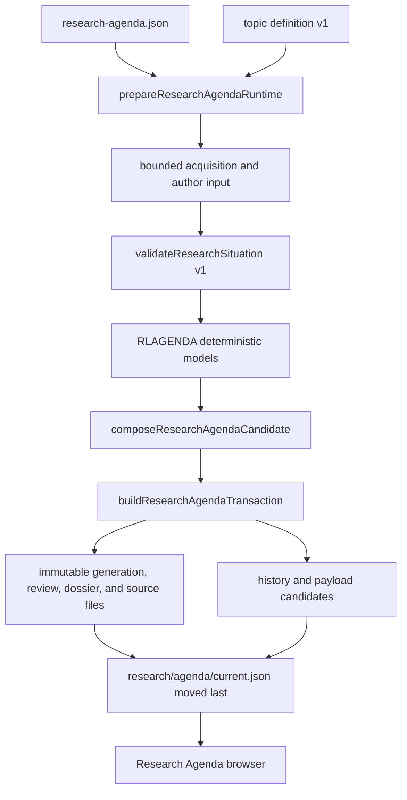
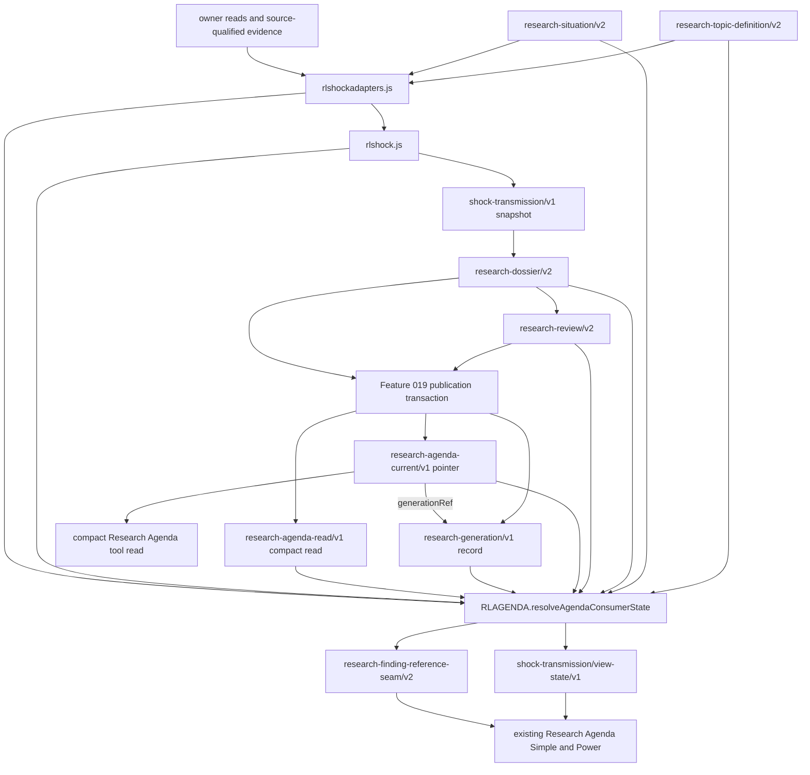
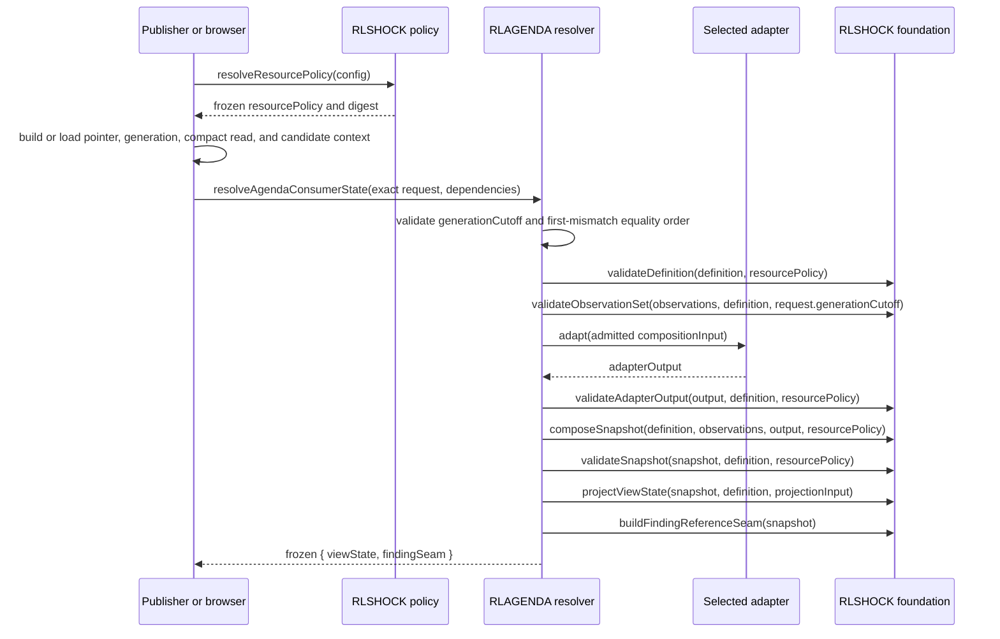
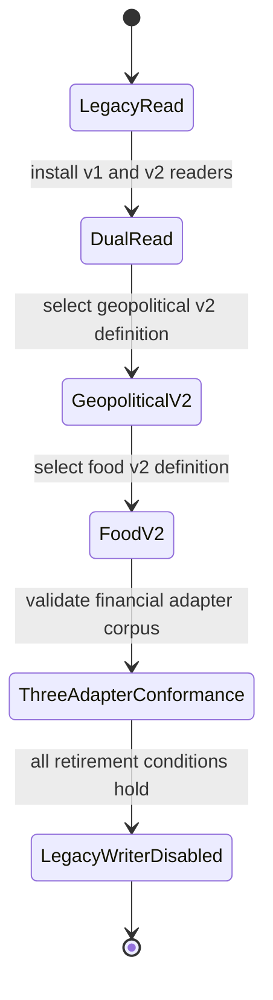

# Feature 031 — Shock Transmission Foundation — Design

Owner: `bubbles.design`.

This document defines the planned technical architecture and validation contract.
It makes no implementation, test-pass, delivery, release, or certification claim.
The active product surface remains the existing Research Agenda route.

## Design Brief

**Current State.** [rlagenda.js](../../rlagenda.js) owns the delivered Research Agenda contracts, immutable identities, models, findings, and view state.
Its model input fixes five geopolitical levers.
Its finding validator fixes three horizon tokens.
The current Feature 020 seam omits `causalPath`, `refutedBy`, and `limitations`.
The existing Research Agenda route does not call that seam.
[rlshock.js](../../rlshock.js) now implements the Scope 1 UMD foundation, exact validation, resource-policy admission, and pure claim and edge projections.
The registered Research Agenda route does not load or call that module.
The Pages shipping check therefore sees a shipped shared module with no production reference.

The current publisher validates `research-situation/v1`, computes deterministic outputs, builds immutable records, and advances the current pointer last.
Its candidate and generated `research-generation/v1` record carry `generationCutoff`.
Generated reviews use that value as `attemptedAt`.
Generated active dossiers use it as `observedThrough`.
`buildResearchAgendaRead(candidate)` uses it as the compact read `asOf`.
The current pointer references the generation artifact and does not copy `generationCutoff`.
Its `updatedAt` member is not a cutoff authority.
The current geopolitical review is unavailable with `situation-shape-invalid`.
That legacy validator returns no field path for its aggregate shape refusal.

**Target State.** Complete and bind a pure UMD foundation named `shock-transmission/v1`.
Three domain adapters map geopolitical supply, food inputs, and financial intermediation into the same neutral graph.
The foundation validates and composes their shared semantics.
Domain adapters retain domain-specific source mapping and calculations.

Scope 1 binds the foundation to the existing registered Research Agenda route.
The route loads `rlshock.js` before `rlagenda.js` and resolves the required Feature 031 resource policy before its first topic selection.
This permanent binding becomes the policy input for the later parent resolver.
It creates no snapshot, topic adapter, finding projection, route, registry row, or visible Lab surface.

Research Agenda readers accept legacy and foundation-backed records.
Each migrated topic writes one version only per generation.
The existing Simple and Power projections render one shared view state.
No route, registry row, navigation item, or standalone Lab is added.

**Patterns To Follow.** Reuse canonical serialization, content identities, immutable files, append-only history, and pointer-last publication from [rlagenda.js](../../rlagenda.js).
Reuse the publisher transaction in [scripts/research-agenda-generation.mjs](../../scripts/research-agenda-generation.mjs).
Reuse owner boundaries from [rlcausal.js](../../rlcausal.js), [rlregime.js](../../rlregime.js), [rlmarketaction.js](../../rlmarketaction.js), and [rlcompanyintel.js](../../rlcompanyintel.js).
Reuse the existing Simple and Power route in [research-agenda-lab.html](../../research-agenda-lab.html).

**Patterns To Avoid.** Do not expand the current five-lever object with more geopolitical fields.
Do not force new horizons into `structural`, `swing`, or `tactical`.
Do not repair the legacy `situation-shape-invalid` defect here.
Do not copy owner math into the foundation.
Do not smooth current results with predecessor values.
Do not persist a local hypothetical.
Do not absorb Horizon Ladder.
Do not present a Node contract test as proof that a browser route consumed a seam.
Do not treat a comment, filename token, or unused script tag as production consumption.

**Resolved Decisions.**

- `rlshock.js` is the pure UMD foundation.
- `rlshockadapters.js` is the planned pure UMD domain-adapter module.
- The existing Research Agenda route owns the first production binding to `rlshock.js` during Scope 1.
- That binding validates only module identity and the required resource policy until a complete v2 tuple exists.
- `RLAGENDA.resolveAgendaConsumerState(request, dependencies)` is the only parent resolver for scheduled publication and browser reads.
- Its exact request carries one authoritative `generationCutoff` member.
- Its `currentRecord` loads the pointer, generation artifact, compact read, and publish candidate as one closed resolution context.
- Publish and read reject the first cutoff mismatch through one deterministic code and JSONPath order.
- New parent records use versioned successors instead of widening exact v1 shapes.
- Readers use explicit version dispatch.
- Writers select one contract from the selected topic definition.
- Canonical snapshots use unfolded directed acyclic graphs.
- Feedback appears as later time-indexed nodes, never as a directed cycle.
- Topic definitions own horizons, levers, units, calibration policies, and adapter selection.
- A Feature 031 resource policy owns the 48-horizon and 200-node limits.
- Publisher and browser callers resolve that policy once and pass the same frozen value through every v2 validation and composition step.
- Existing acquisition, artifact, and authoring policies retain their current limits.
- The foundation owns structural validation, canonicalization, identities, lifecycle rules, and lossless projection.
- Research Agenda Power becomes the first production consumer of the lossless finding projection.
- Pure projection helpers and the live route have separate proof boundaries.
- Legacy no-path rendering uses a parent compatibility contract, not a v2 error contract.
- SCN-031-024 keeps same-topic hypothetical comparison in page memory. Exact reset, reload, or route exit discards it.
- SCN-031-026 exclusively owns topic switching. It clears prior controls and hypothetical state before selected-definition controls render.
- Horizon Ladder and its twelve `0/20` measured-rate cells remain unchanged.

**Open Questions.** None block design handoff.
The risks section records decisions that implementation and tests must verify.

## 1. Purpose And Scope

The capability explains how a sourced disturbance moves through offsets, actors, policies, states, and outcomes.
It separates gross disruption from net transmission.
It also keeps observations separate from inferences and hypotheticals.

The planned implementation includes:

- One topic-neutral contract family.
- Three unrelated adapter implementations.
- Explicit version negotiation with Feature 019 records.
- Immutable snapshot and finding identities.
- Exact-path validation and closed refusals.
- Dynamic horizon, lever, unit, and calibration registries.
- One shared Simple and Power view state.
- Lossless causal qualifier projection.
- Source-backed conformance and migration tests.

The following surfaces remain excluded:

- A Shock Transmission Lab.
- An Iran-only page.
- New tool registration or navigation.
- Horizon Ladder changes.
- Trade, allocation, sizing, or execution behavior.
- A repair to legacy `validateResearchSituation()` aggregate diagnostics.
- Destination eligibility or alert scoring.
- Changes to owner calculations.

## 2. Grounded Current Architecture

### 2.1 Current Publication Call Path

The current call path is:



[scripts/research-agenda-refresh.mjs](../../scripts/research-agenda-refresh.mjs) reads the registry, definitions, current pointer, history, and committed evidence.
It passes selected topic material into [scripts/research-agenda-generation.mjs](../../scripts/research-agenda-generation.mjs).
The generation module validates authored situations before model composition.
The transaction creates immutable records before replacing mutable projections.

### 2.2 Current Reader Call Path

[research-agenda-lab.html](../../research-agenda-lab.html) loads the registry, current pointer, history, definition, review, and dossier.
It calls `RLAGENDA.computeAgendaViewState()` once for the selected baseline.
Simple and Power render the same `state.view` object.
A lever edit recomputes that object without a fetch or history mutation.

The page and [rlexperience-adapters/research-agenda.js](../../rlexperience-adapters/research-agenda.js) both encode the same five geopolitical lever identities.
That duplication is the current extension barrier.

### 2.3 Current Consumer And Owner Map

| Surface | Current call or ownership path | Feature 031 disposition |
| --- | --- | --- |
| Research Agenda page | Reads current review and dossier, then calls `computeAgendaViewState()` | Becomes the first production consumer of `shock-transmission/v1` |
| Research Agenda Simple adapter | Builds the same five lever values and delegates to `RLAGENDA` | Read dynamic lever definitions and delegate to `RLSHOCK` for v1 snapshots |
| Feature 020 seam | `buildFeature020ResearchSeam()` is exported and called by `scripts/selftest.mjs` only | Add a lossless v2 projection and use it in the Agenda Power view |
| Causal Rotation | [rlcausal.js](../../rlcausal.js) owns evidence timing, independence, lifecycle, and falsification | No direct Feature 031 consumer is declared |
| Trend Dynamics | [trend-dynamics-cycle-lab.html](../../trend-dynamics-cycle-lab.html) owns page-local statistical trend and cycle detection | May supply an owner read only, never causal attribution |
| Bond Regime | [bond-regime-lab.html](../../bond-regime-lab.html) owns curve, credit, inflation, duration, and sleeve math | Financial adapter consumes owner states without copying formulas |
| Market Action Center | [rlmarketaction.js](../../rlmarketaction.js) owns public aggregation, anomaly qualification, and alert gates | Receives no new action, seed, candidate, score, or view |
| Company Intelligence | `geopoliticsAdapter()` in [rlcompanyintel.js](../../rlcompanyintel.js) reads the compact Agenda tool read | Remains a compact market-context consumer, not a full finding consumer |
| Horizon Ladder | Registered live in [tools.json](../../tools.json) and described by [notes/horizon-ladder-lab.md](../../notes/horizon-ladder-lab.md) | Unchanged and outside this contract |

### 2.4 Current Shape Constraints

The current `research-topic-definition/v1` permits optional geopolitical model fields.
Food-input and defense definitions omit those fields.
The current `research-situation/v1.modelInputs` requires exactly `chokepointState`, `inventoryGapByChannel`, and `levers`.
The current `research-model-input/v1.levers` requires five fixed members.

`validatePublishedFinding()` requires `causalPath`, `refutedBy`, and `limitations`.
`buildFeature020ResearchSeam()` does not copy those members.
`FINDING_HORIZONS` accepts only `structural`, `swing`, and `tactical`.

## 3. Architecture Overview

### 3.1 Planned Module Topology



The publisher injects one selected domain adapter into the foundation.
The adapter returns a typed neutral candidate.
The foundation validates, normalizes, composes, identifies, and freezes it.

The browser loads the same two UMD modules.
It reads the published neutral snapshot.
It does not reconstruct domain evidence from page text.
Both environments pass the same exact request shape to the parent resolver.

### 3.2 Dependency Direction

`rlshock.js` depends on no DOM, clock, fetch, storage, Node API, or owner module.
`rlshockadapters.js` depends only on injected owner reads and `RLSHOCK` validation helpers.
`rlagenda.js` remains the agenda lifecycle and publication owner.
The generation module coordinates these modules without moving policy into itself.

No owner module imports `rlshock.js` during this feature.
This prevents a circular ownership graph.

## Capability Foundation

### 4.1 Foundation Contract

The planned root UMD module `rlshock.js` owns the following contracts.

| Contract | Responsibility | Planned consumers |
| --- | --- | --- |
| `shock-transmission/resource-policy/v1` | Required Feature 031 horizon and graph cardinality limits | publisher, foundation, tests |
| `shock-transmission/definition/v1` | Declared units, horizons, levers, actors, policy layers, scenarios, and adapter identity | publisher, adapters, browser |
| `shock-transmission/observation-set/v1` | Current source-qualified observations and declared unavailable states | adapters, validator |
| `shock-transmission/composition-input/v1` | Frozen observation set, public owner reads, and exact lever values | publisher, browser, adapters |
| `shock-transmission/adapter-output/v1` | Neutral candidate primitives before final composition | foundation only |
| `shock-transmission/projection-input/v1` | Internal validated adapter result for one local hypothetical | parent resolver, view projector |
| `shock-transmission/v1` | Immutable canonical snapshot | dossier, view projection, finding projection |
| `shock-transmission/view-state/v1` | One baseline or local-hypothetical reader state | Simple, Power, Simple adapter |
| `shock-transmission/finding/v1` | Bounded claim with all causal qualifiers | Power, lossless seam |
| `research-finding-reference-seam/v2` | Lossless destination-free finding projection | Power now, admitted consumers later |
| `shock-transmission/error/v1` | Closed refusal with exact field path | publisher, browser, tests |

### 4.2 Planned UMD Exports

| Export | Input | Output |
| --- | --- | --- |
| `canonicalize(value)` | supported JSON value | canonical UTF-8 JSON text |
| `digest(value)` | normalized supported value | `sha256:<64 lowercase hex>` |
| `resolveResourcePolicy(config)` | parsed repository config | frozen `{ ok, value, digest }` result or exact-path refusal |
| `validateDefinition(value, resourcePolicy)` | definition candidate and resolved policy | frozen result or exact-path refusal |
| `validateObservationSet(value, definition, cutoff)` | observations, definition, validated `request.generationCutoff` | frozen admitted observations or refusal |
| `validateAdapterOutput(value, definition, resourcePolicy)` | neutral adapter candidate and resolved policy | frozen admitted candidate or refusal |
| `composeSnapshot(definition, observationSet, adapterOutput, resourcePolicy)` | current inputs and resolved policy | immutable `shock-transmission/v1` |
| `validateSnapshot(value, definition, resourcePolicy)` | snapshot, exact definition, and resolved policy | frozen snapshot or refusal |
| `compareSnapshots(current, predecessor)` | two validated snapshots | additive comparison record |
| `projectViewState(snapshot, definition, projectionInput)` | current snapshot and null or validated `shock-transmission/projection-input/v1` | one `shock-transmission/view-state/v1` |
| `buildFindingReferenceSeam(snapshot)` | validated snapshot | lossless `research-finding-reference-seam/v2` |
| `projectClaimRows(viewState)` | validated view state | frozen reader claim rows |
| `projectEdgeRows(viewState)` | validated view state | frozen graph and semantic-table edge rows |
| `projectFindingRows(seam)` | validated lossless seam | frozen Power finding rows |
| `resolveDefinitionRegistries(definition)` | validated selected definition | distinct frozen horizon and lever registries |
| `readerSentence(error)` | closed refusal | plain reader text plus retained machine path |

The module exports frozen closed vocabularies.
No caller restates them.

### 4.2.1 Parent Resolver Export

The parent UMD module [rlagenda.js](../../rlagenda.js) adds exactly one exported resolver:

```text
RLAGENDA.resolveAgendaConsumerState(request, dependencies)
```

`request` is an exact `research-agenda/consumer-resolution-request/v1` object.
It has exactly thirteen own keys, including one authoritative `generationCutoff`.
Its `currentRecord` is an exact five-key `research-agenda/current-resolution-record/v1` context.
`dependencies` has exactly `shock` and `adapterRegistry`.
Section 6.5 defines both arguments and the frozen result contract.

### 4.2.2 Parent Compatibility Export

`RLAGENDA.projectLegacyUnavailableView(review, currentRef, datedHistoryRefs)` owns legacy no-path rendering.
It accepts only a validated legacy review tuple with a named unavailable reason.
It never creates or validates a `shock-transmission/error/v1` value.
Section 6.7 defines its exact output.

### 4.3 Adapter Extension Point

The planned `rlshockadapters.js` module exports a frozen adapter registry.
Each entry implements this exact interface:

```text
adapterId: non-empty stable id
contractVersion: shock-transmission/topic-adapter/v1
supportedDefinitionVersion: shock-transmission/definition/v1
adapt({ definition, observationSet, ownerReads, leverValues })
  -> shock-transmission/adapter-output/v1 | shock-transmission/error/v1
```

Those four values come from one validated `shock-transmission/composition-input/v1`.
The parent resolver selects the adapter by the definition's exact `adapterId`.
Callers cannot inject an adapter output or choose a second adapter path.

The foundation validates every adapter result.
An adapter cannot add a foundation field or waive an invariant.
An unknown adapter fails before any domain calculation.

### 4.4 Foundation-Owned Behavior

The foundation owns:

- Exact-shape validation.
- Contract negotiation.
- Canonical normalization and hashing.
- Immutable record identity.
- Graph endpoint and acyclicity checks.
- Path continuity and conflict preservation.
- Range, unit, and sign checks.
- Scenario-curve accounting.
- Lifecycle transition validation.
- Current and predecessor isolation.
- Baseline and hypothetical separation.
- Lossless finding projection.
- Public-scope and private-field rejection.
- Reader-safe refusal projection.

### 4.5 Product-Domain SST Extension

[config/domain-model.yaml](../../config/domain-model.yaml) currently declares `Tool` and `ToolRead` only.
The first foundation implementation must add these planned product-wide entities:

| Planned entity | States | Reason for product-wide placement |
| --- | --- | --- |
| `ShockTransmissionDefinition` | `active`, `supported`, `retired` | Definitions are shared across topics and consumers |
| `ShockTransmissionSnapshot` | `current`, `stale`, `unavailable`, `conflicted`, `superseded` | Current truth and immutable predecessors are product-wide facts |
| `ShockFinding` | `current`, `stale`, `invalidated`, `superseded` | Findings cross the Agenda view and destination-free seams |

The same change must add these planned invariants:

| Planned invariant | Rule |
| --- | --- |
| `INV-RL-SHOCK-NET-AFTER-OFFSETS` | A net range is published only after every required offset is accounted for or explicitly unavailable |
| `INV-RL-SHOCK-QUALIFIERS-LOSSLESS` | Every finding projection preserves causal paths, refuters, limitations, triggers, and invalidations |
| `INV-RL-SHOCK-HYPOTHETICAL-NONPERSISTENT` | A local hypothetical cannot enter a dossier, history event, current pointer, or tool read |
| `INV-RL-SHOCK-ACTOR-AUTHORITY` | A policy action remains attached to its declared owner and policy layer |

These identifiers are planned design targets.
They do not exist in the current domain SST.
[docs/DomainModel.md](../../docs/DomainModel.md) must mirror them during the documentation phase.

## Concrete Implementations

### Variation Axes

| Axis | Geopolitical supply | Food-input transmission | Financial intermediation | Foundation ownership |
| --- | --- | --- | --- | --- |
| Initiating state | Physical route impairment | Fertilizer or feedstock repricing | Return disappointment or higher rates | Shock shape and identity |
| Domain adapter | `shock-adapter/geopolitical-supply/v1` | `shock-adapter/food-input/v1` | `shock-adapter/financial-intermediation/v1` | Adapter interface only |
| Offset mechanisms | Inventory, reroute, insurance, demand, policy release | Substitution, acreage, inventory, weather adaptation, working capital | Equity absorption, liquidity, refinancing, capital, policy facilities | Offset structure and net accounting |
| Horizon semantics | `current`, `1-4w`, `3-12m` | definition-owned crop-cycle bands | definition-owned repricing and funding bands | Horizon validation and ordering |
| Owner reads | Research Agenda physical-flow model | Public crop and input observations | Bond, trend, and public financing observations | Owner-reference integrity only |
| Policy layers | Physical capacity, liquidity, credibility | Physical capacity, income-demand, inflation | Liquidity, intermediation, solvency, income-demand | Closed layer semantics |
| Graph shape | Routes, stocks, prices, policy effects | Inputs, planting choices, harvest, food prices | Repricing, capex, cash flow, credit, funding, forced sales | DAG and path rules |
| User levers | Route pass, reroute, inventory, demand | Substitution, acreage, inventory, working capital | Capex response, refinancing access, funding withdrawal | Lever registry and local-state isolation |
| Calibration | Scenario evidence and event outcomes | Crop-cycle outcomes | Funding and restoration outcomes | Withholding and sample accounting |

### 5.1 Geopolitical Supply Adapter

This adapter migrates the current geopolitical definition without making its fields universal.
Its source model remains the current flow and transmission logic in [rlagenda.js](../../rlagenda.js).
The adapter receives those owner outputs and source-qualified inputs.
It maps them into neutral shocks, offsets, nodes, edges, paths, and findings.

The adapter must declare these independent U.S. actor ids:

- `us-executive-national-security`
- `us-treasury`
- `us-energy-department`
- `federal-reserve`
- `us-congress`

The legacy `united-states` actor remains readable only in v1 definitions.
No v2 policy action may use that aggregate id.
Coordination may create an evidenced relation.
It never transfers action ownership.

The adapter uses the current topic horizon declarations `current`, `1-4w`, and `3-12m`.
It maps route impairment to a gross shock.
Inventory, rerouting, insurance, demand response, and policy release remain separate offsets.

### 5.2 Food-Input Adapter

This adapter extends the existing food-input definition.
It does not copy the geopolitical scenario tree or route model.

Its initiating shock is a sourced fertilizer or feedstock cost change.
Its graph may include input costs, substitution, acreage, inventory, weather, crop lag, working capital, and food prices.
Each mechanism needs its own evidence and refuter.

The definition owns its horizon ids and calendar semantics.
The first planned conformance definition uses `food-3m`, `food-6m`, and `food-12m`.
These ids map to non-overlapping declared calendar-month intervals.
They do not map through Horizon Ladder or the legacy finding tokens.

### 5.3 Financial-Intermediation Adapter

This adapter implements the eleven-step transmission ladder in the [systemic-risk audit](../../notes/global-systemic-risk-policy-reaction-audit-2026-08-22.md).
It remains a conformance implementation without a new registered topic or page.

Its graph separates:

1. Return disappointment or higher rates.
2. Technology equity repricing.
3. Capex reduction.
4. Supplier cash-flow loss.
5. Contract and circular-financing repricing.
6. Private-credit deterioration.
7. Bank-line draws and dealer tightening.
8. Leveraged deleveraging.
9. Wider corporate spreads.
10. Lower investment, hiring, and consumption.
11. Policy restoration or further contraction.

The adapter consumes owner observations where they exist.
Bond Regime owns curve and credit calculations.
Trend Dynamics owns statistical regime-change detection.
Causal Rotation owns evidence independence and causal-stage classification.
Company Intelligence owns company-scoped composition and owner links.
Market Action Center owns alert qualification.

The adapter copies no formula from those owners.
An absent owner read remains unavailable.
The adapter cannot turn a missing owner read into a neutral state.

### 5.4 Conformance Rule

All three adapters must produce the same `shock-transmission/adapter-output/v1` shape.
The foundation test runs identical structural validators against each output.
A domain-specific foundation field fails conformance.
A domain-specific adapter configuration remains valid.

## 6. Contract Family And Version Negotiation

### 6.1 Parent Contract Matrix

| Concern | Legacy readable form | Foundation-backed write form |
| --- | --- | --- |
| Topic definition | `research-topic-definition/v1` | `research-topic-definition/v2` |
| Authored situation | `research-situation/v1` | `research-situation/v2` |
| Review | `research-review/v1` | `research-review/v2` |
| Dossier | `research-dossier/v1` | `research-dossier/v2` |
| View state | `research-agenda-view-state/v1` | `shock-transmission/view-state/v1` |
| Finding seam | `research-finding-reference-seam/v1` | `research-finding-reference-seam/v2` |
| Current pointer | `research-agenda-current/v1` | unchanged, with explicit artifact contract versions |
| Compact agenda read | `research-agenda-read/v1` | unchanged |

Existing v1 records remain readable.
No existing record gains a field.
Every widened exact shape receives a new contract version.

### 6.2 Topic Definition v2

`research-topic-definition/v2` retains the current common definition fields.
It adds exactly one `capabilities` object.
For a migrated topic, that object has exactly one member named `shockTransmission`.

`shockTransmission` is a `shock-transmission/definition/v1` object.
Legacy geopolitical fields move into its adapter-owned configuration.
They do not remain parallel top-level model fields.

The object carries distinct `horizonRegistry` and `leverRegistry` arrays.
It also carries the required `resourcePolicyId` and `resourcePolicyDigest`.
The publisher resolves the policy from repository configuration before validation.
Missing or mismatched policy identity fails loud.

A v2 definition must reference its predecessor definition digest.
The selected definition file is content-addressed under a versioned definition directory.
The existing v1 files remain unchanged for historical reconstruction.

### 6.3 Situation v2

`research-situation/v2` retains these current common fields:

```text
contractVersion, generationId, topicId, authoredAt, completePass,
evidenceRecords, sectionInterpretations, findings, sourceLedger, newEvidenceIds
```

It replaces the geopolitical `modelInputs` object with exactly:

```text
capabilityInputs.shockTransmission
```

That member is a `shock-transmission/composition-input/v1`.
It contains exactly `contractVersion`, `observationSet`, `ownerReads`, and `leverValues`.
`observationSet` is a `shock-transmission/observation-set/v1`.
`ownerReads` is an ordered array of exact public owner-read records.
Each owner-read record contains `ownerReadId`, `contractVersion`, `sourceRef`, `valueDigest`, and `value`.
The selected adapter definition declares each accepted owner-read id and contract version.
`leverValues` has exact key equality with the selected definition's lever registry.

A v2 situation cannot carry `modelInputs`, model outputs, scenario probabilities, net results, or chart points.
Those are unknown-member refusals.

### 6.4 Review And Dossier v2

`research-dossier/v2` retains common publication, section, evidence, source, trigger, invalidation, and lineage fields.
It replaces `modelInputs` and `modelOutputs` with exactly two capability members.
`capabilityInputs.shockTransmission` is the frozen composition input admitted from the v2 situation.
`capabilitySnapshots.shockTransmission` is the complete `shock-transmission/v1` snapshot.
The publisher requires byte equality between the situation and dossier composition inputs.
The browser loads the dossier copy instead of reconstructing owner reads.

`research-review/v2` replaces `modelSnapshotRef` with `capabilitySnapshotRefs.shockTransmission`.
That ref carries the dossier ref, snapshot id, snapshot digest, definition digest, composition-input digest, and observation-set digest.

A v2 review cannot point to a v1 dossier.
A v1 review cannot point to a v2 dossier.
A migration review may name a v1 predecessor through a separate `migrationPredecessorRef`.
That ref never becomes the current computation input.

### 6.5 Shared Parent Resolver Contract

[rlagenda.js](../../rlagenda.js) exports this exact callable:

```text
RLAGENDA.resolveAgendaConsumerState(request, dependencies)
```

No publisher or browser wrapper may implement a second version resolver.
Both environments call this export before using a current view or finding seam.

#### 6.5.1 Exact Request And Dependency Tuple

`request` is an exact `research-agenda/consumer-resolution-request/v1` object.
Every key is required, including keys whose allowed value is null.
The request has exactly thirteen own keys.
The validator traverses them in the table order below.

| Key | Exact contract |
| --- | --- |
| `contractVersion` | `research-agenda/consumer-resolution-request/v1` |
| `operation` | `publish` or `read` |
| `topic` | selected topic row from the validated `research-agenda/v1` registry |
| `definition` | selected `research-topic-definition/v1` or `research-topic-definition/v2` object |
| `situation` | matching situation for an available `publish`, null for `read`, or null for an explicitly unavailable publish |
| `review` | matching `research-review/v1` or `research-review/v2` object |
| `dossier` | matching current dossier, or null only for an explicitly unavailable review |
| `currentRecord` | exact `research-agenda/current-resolution-record/v1` context defined below |
| `generationCutoff` | sole authoritative cutoff, using the current Agenda canonical-instant contract |
| `compositionInput` | null for v1, one `shock-transmission/composition-input/v1` for available v2, or null only for explicit v2 unavailability |
| `resourcePolicy` | null for v1, or the frozen value from `RLSHOCK.resolveResourcePolicy(config)` for v2 |
| `predecessorInput` | null or exact `research-agenda/predecessor-resolution-input/v1` |
| `hypotheticalInput` | null or exact `research-agenda/hypothetical-resolution-input/v1` |

`currentRecord` has exactly five required own keys:

| Key | Publish value | Read value |
| --- | --- | --- |
| `contractVersion` | `research-agenda/current-resolution-record/v1` | same |
| `pointer` | in-memory `research-agenda-current/v1` candidate | validated loaded current pointer |
| `generation` | in-memory `research-generation/v1` candidate | artifact loaded from `pointer.generationRef.path` |
| `agendaRead` | successful `buildResearchAgendaRead(candidate).value` | loaded `market-brief.payload.json.researchAgenda` |
| `candidate` | exact `research-agenda-candidate/v1` | null |

The resolver validates the pointer's `generationRef` before reading cutoff data.
The ref path, digest, contract version, generation id, and `historicalOnly` value must match `currentRecord.generation`.
The read caller must load that referenced artifact before invoking the resolver.
The resolver never substitutes `currentRecord.pointer.updatedAt` for a missing cutoff.
The publisher materializes all five context members in memory before canonical publication admission.

`predecessorInput` contains exactly `contractVersion`, `dossier`, and `snapshot`.
The v1 branch requires a v1 dossier and null snapshot.
The v2 branch requires a v2 dossier and its validated `shock-transmission/v1` snapshot.
The resolver uses this input only after current-state validation.

`hypotheticalInput` contains exactly `contractVersion`, `legacyLeverState`, and `shockHypothetical`.
The v1 branch allows an exact legacy lever map and requires null `shockHypothetical`.
The v2 branch requires null `legacyLeverState` and one `shock-transmission/hypothetical/v1`.
The `publish` operation requires null `hypotheticalInput` in both branches.

`dependencies` has exactly these members:

```text
shock: RLSHOCK
adapterRegistry: RLSHOCKADAPTERS.registry
```

The resolver checks both members before entering the v2 branch.
The registry must be frozen and keyed by exact adapter id.

An available v2 `publish` request requires canonical equality across three values.
They are `request.compositionInput`, `situation.capabilityInputs.shockTransmission`, and `dossier.capabilityInputs.shockTransmission`.
An available v2 `read` request requires equality between the request and dossier values.
The pointer must reference the same review and dossier identities before either operation continues.

#### 6.5.2 Generation Cutoff Authority And Equality

`request.generationCutoff` is the only cutoff argument inside the resolver.
It must satisfy the current Agenda canonical-instant predicate.
The accepted form matches `YYYY-MM-DDTHH:mm:ssZ` or `YYYY-MM-DDTHH:mm:ss.sssZ` and must parse to a finite instant.
Offsets, blank strings, invalid dates, and non-string values fail.
After validation, every equality check uses exact string equality.
Two text forms that parse to the same instant do not compare equal.

A missing member returns `RLSHOCK-MISSING-MEMBER` at `$.generationCutoff`.
A malformed member returns `RLSHOCK-TIME` at `$.generationCutoff`.
A broken generation ref returns `RLSHOCK-REFERENCE` at its first mismatched `$.currentRecord.pointer.generationRef` member.
Every later cutoff inequality returns `RLSHOCK-VINTAGE` at the first mismatched path below.
The resolver evaluates no later equality after that refusal.

The fixed publish equality order is:

1. `$.currentRecord.candidate.generationCutoff` equals `$.generationCutoff`.
2. `$.currentRecord.generation.generationCutoff` equals `$.generationCutoff`.
3. `$.currentRecord.agendaRead.asOf` equals `$.generationCutoff`.
4. A present `$.situation.authoredAt` equals `$.generationCutoff`.
5. `$.review.attemptedAt` equals `$.generationCutoff`.
6. A same-generation `$.dossier.observedThrough` equals `$.generationCutoff`.

The fixed read equality order is:

1. `$.currentRecord.generation.generationCutoff` equals `$.generationCutoff`.
2. `$.currentRecord.agendaRead.asOf` equals `$.generationCutoff`.
3. `$.review.attemptedAt` equals `$.generationCutoff`.
4. A same-generation `$.dossier.observedThrough` equals `$.generationCutoff`.

`currentRecord.agendaRead.generationId` must equal `currentRecord.generation.generationId`.
The candidate, review, same-generation dossier, pointer refs, and generation record must use that generation id.
These identity failures use `RLSHOCK-REFERENCE` at the first mismatched id or ref path.

A dossier from an earlier generation may carry an earlier `observedThrough` value.
This applies to `request.dossier` for unchanged or stale state and to `predecessorInput.dossier` for comparison.
Each immutable ref must match its review or predecessor ref.
Each `observedThrough` must be canonical and no later than `request.generationCutoff`.
A later request dossier returns `RLSHOCK-VINTAGE` at `$.dossier.observedThrough`.
A later comparison dossier returns it at `$.predecessorInput.dossier.observedThrough`.
The resolver never recomposes the current snapshot from predecessor observations.

The branch contract is closed:

| Branch | Required values | Cutoff behavior | Observation validation |
| --- | --- | --- | --- |
| available v1 publish | candidate, situation, v1 review, v1 dossier | compare candidate, generation, read, situation, review, and same-generation dossier | never called |
| unavailable v1 publish | candidate and unavailable v1 review, with null situation and dossier | compare candidate, generation, read, and review | never called |
| available v1 read | null candidate and situation, with v1 review and dossier | compare generation, read, review, and applicable dossier time or predecessor ref | never called |
| unavailable v1 read | null candidate, situation, and dossier, with unavailable v1 review | compare generation, read, and review | never called |
| available v2 publish | candidate, situation, v2 review, v2 dossier, composition input, and policy | apply all publish comparisons before adapter selection | called once with `request.generationCutoff` |
| unavailable v2 publish | candidate, unavailable v2 review, policy, and null situation, dossier, and composition input | compare candidate, generation, read, and review | never called |
| available v2 read | null candidate and situation, with v2 review, dossier, composition input, and policy | apply all read comparisons before adapter selection | called once with `request.generationCutoff` |
| unavailable v2 read | null candidate, situation, dossier, and composition input, with unavailable v2 review and policy | compare generation, read, and review | never called |

An unchanged or stale tuple with a predecessor dossier is not an unavailable tuple.
It must satisfy the predecessor rule above.
Its admitted observations remain current or stale exactly as published.
An unavailable observation retains null quantitative content and its named reason.
A stale observation remains stale and cannot become current during resolution.

For an available v2 tuple, the resolver passes only `request.generationCutoff` as the third argument:

```text
RLSHOCK.validateObservationSet(
  request.compositionInput.observationSet,
  shockDefinition,
  request.generationCutoff
)
```

An active observation with `availableAt` later than the cutoff returns `RLSHOCK-VINTAGE`.
The resolver prefixes its path as `$.compositionInput.observationSet.observations[i].availableAt`.
The publisher may retain later evidence in the parent evidence and source ledgers.
It must not place that evidence in the admitted composition input or pass it to an adapter.

A hypothetical request reuses the validated baseline cutoff.
It cannot declare or derive another cutoff.
Its adapter pass receives the already admitted baseline observation set.

#### 6.5.3 Deterministic Version Dispatch

The resolver validates the request contract first.
It reads `definition.contractVersion` before inspecting any nested capability member.
It then applies this closed matrix:

| Selected definition | Required matching tuple | Resolution |
| --- | --- | --- |
| `research-topic-definition/v1` | v1 situation for `publish`, v1 review, v1 dossier when available, and v1 current refs | legacy resolution |
| `research-topic-definition/v2` | v2 situation for `publish`, v2 review, v2 dossier when available, and explicit v2 artifact refs | foundation resolution |
| v1 | any v2 parent or capability contract | `RLSHOCK-VERSION-MIXED` at the first mixed field |
| v2 | any v1 parent contract or legacy model member | `RLSHOCK-VERSION-MIXED` at the first mixed field |
| v2 | a missing required capability member | `RLSHOCK-MISSING-MEMBER` at that exact field |
| unknown parent version | any | `RLSHOCK-VERSION-UNSUPPORTED` at its `contractVersion` field |
| any | review, dossier, topic, or current-ref identity mismatch | `RLSHOCK-VERSION-MIXED` at the first mismatched ref |

The resolver never dispatches from `modelInputs`, `capabilities`, or another guessed field.
It never repairs one parent tuple with data from another version.

#### 6.5.4 V2 Resource And Composition Dataflow

The publisher and browser each parse [market-brief.config.json](../../market-brief.config.json).
Each caller invokes `RLSHOCK.resolveResourcePolicy(config)` once per selected resolution.
A failed policy resolution returns its refusal unchanged before adapter selection.

The successful `value` is deep-frozen.
Its `digest` must match the selected definition and the published snapshot.
The caller passes that exact `value` as `request.resourcePolicy`.
The caller constructs the complete `currentRecord` context before resolver entry.
The resolver validates `request.generationCutoff` and the section 6.5.2 equality order before version dispatch.

The resolver executes the following v2 order:

1. Validate the pointer, generation artifact, compact read, and cutoff equality graph.
2. Call `RLSHOCK.validateDefinition(definition.capabilities.shockTransmission, resourcePolicy)`.
3. Call `RLSHOCK.validateObservationSet(compositionInput.observationSet, shockDefinition, request.generationCutoff)` exactly once.
4. Resolve one adapter from `adapterRegistry` by the validated definition's exact `adapterId`.
5. Call the adapter with the admitted observation set, owner reads, and lever values.
6. Call `RLSHOCK.validateAdapterOutput(adapterOutput, shockDefinition, resourcePolicy)`.
7. Call `RLSHOCK.composeSnapshot(shockDefinition, observationSet, adapterOutput, resourcePolicy)` for the baseline only.
8. Call `RLSHOCK.validateSnapshot(snapshot, shockDefinition, resourcePolicy)`.
9. Require exact identity equality with `dossier.capabilitySnapshots.shockTransmission`.
10. Match the snapshot observation-set digest to the admitted set and published refs.
11. Build the baseline view and lossless finding seam from that validated snapshot.
12. Compare a predecessor only after step 11.

A local hypothetical repeats steps 3 through 5 with its exact lever map.
The resolver then creates an internal `shock-transmission/projection-input/v1`.
That object contains exactly `contractVersion`, `hypothetical`, and `adapterOutput`.
`projectViewState(snapshot, shockDefinition, projectionInput)` returns the non-persistable view.
The resolver never calls `composeSnapshot()` for a hypothetical.



#### 6.5.5 Frozen Return And Refusal Contract

Success returns exactly:

```text
Object.freeze({
  ok: true,
  value: Object.freeze({ viewState, findingSeam })
})
```

The resolver deep-freezes both pair members before return.
It returns no dossier, adapter output, owner read, or mutable collection.

For a valid available v1 tuple, `viewState` is `research-agenda-view-state/v1`.
Its `findingSeam` is the existing frozen `research-finding-reference-seam/v1`.
The resolver builds that seam through `buildFeature020ResearchSeam()`.
A valid unavailable v1 review returns the legacy unavailable view and null seam.
The v1 Power renderer keeps its legacy contract and never calls `projectFindingRows()`.

For a valid available v2 tuple, `viewState` is `shock-transmission/view-state/v1`.
Its `findingSeam` is `research-finding-reference-seam/v2` from the validated baseline snapshot.
A valid unavailable v2 review returns an unavailable v2 view and null seam.
Any present v2 dossier must produce the v2 seam or fail the whole resolution.

Failure returns exactly:

```text
Object.freeze({
  ok: false,
  error: Object.freeze({
    contractVersion, code, fieldPath, reason, topicId, recordId, valueEchoed
  })
})
```

`error` is one `shock-transmission/error/v1` from section 16.
The resolver returns no partial `value` on failure.
Cutoff, ref, and identity failures occur before version dispatch or adapter selection.
The publisher refuses the candidate before any canonical mutation.
The browser clears any prior pair and renders the refusal through `readerSentence(error)`.
The browser never reads raw v2 dossier findings after a resolver failure.
It never uses a v1 seam, predecessor, history row, or compact read as a v2 fallback.

#### 6.5.6 Identical Publisher And Browser Call Shape

The scheduled publisher calls the resolver after constructing the candidate, generation record, compact read, review, dossier, and pointer candidate.
It passes `candidate.generationCutoff` as the request cutoff.
It passes the situation composition input and null hypothetical input.

```text
RLAGENDA.resolveAgendaConsumerState({
  contractVersion, operation: "publish", topic, definition, situation,
  review, dossier,
  currentRecord: {
    contractVersion: "research-agenda/current-resolution-record/v1",
    pointer: currentPointerCandidate,
    generation: generationRecord,
    agendaRead: buildResearchAgendaRead(candidate).value,
    candidate
  },
  generationCutoff: candidate.generationCutoff,
  compositionInput, resourcePolicy, predecessorInput, hypotheticalInput: null
}, { shock: RLSHOCK, adapterRegistry: RLSHOCKADAPTERS.registry })
```

The browser validates the current pointer and loads its referenced generation artifact.
It also loads `market-brief.payload.json.researchAgenda` and the dossier's frozen composition input.
It sets the request cutoff from `generationRecord.generationCutoff`.
It never derives the cutoff from `currentPointer.updatedAt`.
It uses the same resolver for baseline, local comparison, and reset.

```text
RLAGENDA.resolveAgendaConsumerState({
  contractVersion, operation: "read", topic, definition, situation: null,
  review, dossier,
  currentRecord: {
    contractVersion: "research-agenda/current-resolution-record/v1",
    pointer: currentPointer,
    generation: generationRecord,
    agendaRead,
    candidate: null
  },
  generationCutoff: generationRecord.generationCutoff,
  compositionInput, resourcePolicy, predecessorInput, hypotheticalInput
}, { shock: RLSHOCK, adapterRegistry: RLSHOCKADAPTERS.registry })
```

Only the operation-owned values differ between those calls.
The top-level key set, cutoff validation, current-record shape, dependency tuple, and equality order remain shared.
The version matrix, adapter selection, policy checks, snapshot validation, projections, and return pair remain shared.

The compact `research-agenda-read/v1` contract gains no required field.
`buildAgendaToolRead()` still reads the validated review and current classification.
Company Intelligence and Market Brief therefore keep their compact reader shape.
The experience adapter may consume the resolved `viewState` and discard `findingSeam`.
It must not copy owner formulas or implement another version branch.

### 6.6 Dual-Read And Version-Bound Single-Write

Readers support both complete tuples.
A selected topic definition chooses the writer version.
The publisher writes one tuple for that topic and generation.
It never emits v1 and v2 dossiers in parallel for one topic.

Different topics may migrate in separate generations.
The current pointer may therefore reference explicit v1 and v2 artifact contracts across different topic rows.
That state is not ambiguous because every ref declares its version.

A single topic lineage may cross versions only through `migrationPredecessorRef`.
The new v2 snapshot computes from current v2 inputs only.

### 6.7 Legacy No-Path Compatibility Contract

The legacy reader projects unavailable v1 reviews through `research-agenda/legacy-unavailable-view/v1`.
That object contains exactly:

```text
contractVersion, topicId, reviewId, currentState, reasonCode, readerReason,
fieldPathState, fieldPath, currentValuesAvailable, datedHistoryRefs
```

`currentState` must equal `unavailable`.
`reasonCode` must be the named reason already published by the legacy review.
`fieldPathState` must equal `not-published`, and `fieldPath` must be null.
`currentValuesAvailable` must be false.
`datedHistoryRefs` remain historical references and never fill current values.

The renderer states that the legacy review published no field path.
It does not infer, synthesize, or display a v2 path.
The compatibility projector never invokes the new v2 validator.
It never changes `validateResearchSituation()` or repairs its aggregate refusal.

The new v2 path remains stricter.
Every `shock-transmission/error/v1` has a non-empty JSONPath.
A null path is invalid for that contract.
Legacy compatibility therefore cannot satisfy or weaken SCN-031-002.

### 6.8 Retirement Conditions

The legacy writer may retire only when all conditions hold:

- Every active shock-capable topic selects a v2 definition.
- No current topic ref points to a legacy shock dossier.
- The browser and publisher still pass immutable v1 read fixtures.
- No migrated topic can select the v1 writer.
- The lossless v2 seam has a production caller.
- The version resolver rejects every ambiguous mixed tuple.

Retirement disables new legacy writes.
It does not delete the legacy reader.
It does not rewrite definitions, reviews, dossiers, history, or current-pointer history.

## 7. Canonical Serialization And Immutable Identity

### 7.1 Canonical Value Rules

The foundation follows the current Agenda canonicalizer.

- Object keys sort by Unicode code-point order.
- Arrays preserve contract-defined order.
- Set-like id arrays normalize to unique lexical order before serialization.
- Graph nodes sort by `rank`, then `nodeId`.
- Graph edges sort by `fromNodeId`, `toNodeId`, then `edgeId`.
- Paths sort by `pathId`.
- Horizons sort by `order`, then `horizonId`.
- Scenario states sort by `scenarioId`.
- Findings sort by `findingId`, then `versionId`.
- Human limitation order remains significant.
- Numbers must be finite.
- Computed decimals normalize to twelve decimal places before serialization.
- `undefined`, sparse arrays, functions, symbols, and non-plain objects are refused.

The canonical text is UTF-8 JSON with no insignificant whitespace.
The digest is SHA-256 over those exact bytes.

### 7.2 Snapshot Identity

A snapshot contains both `snapshotId` and `snapshotDigest`.
The digest body excludes those two fields.

```text
snapshotDigest = sha256(canonical(normalized snapshot body))
snapshotId = shock-snapshot-<snapshotDigest hex>
```

Validation recomputes both values.
A mismatch returns `RLSHOCK-DIGEST` at `$.snapshotDigest` or `$.snapshotId`.

### 7.3 Nested Version Identity

Every versioned Shock, Edge, Path, Scenario Curve, Finding, Policy Action, and Restoration Condition uses the same rule.
Its stable series id remains definition-owned.
Its `versionId` hashes the normalized body without `versionId`.
Its `predecessorVersionId` is null or names the prior immutable version.

A stable id reused with different bytes and no new version id is refused.
A predecessor must resolve before publication.

### 7.4 Artifact References

A snapshot ref contains exactly:

```text
path, sha256, contractVersion, snapshotId, topicId, historicalOnly
```

The path stays under the Research Agenda immutable artifact tree.
The hash must match the referenced bytes.
A current ref cannot set `historicalOnly: true`.

## Data Model And Exact Foundation Contracts

### 8.1 Snapshot Root

`shock-transmission/v1` contains exactly these fields:

| Field | Type | Validation |
| --- | --- | --- |
| `contractVersion` | string | exactly `shock-transmission/v1` |
| `snapshotId` | string | derived content identity |
| `snapshotDigest` | string | canonical SHA-256 |
| `topicId` | id | matches parent dossier |
| `adapterId` | id | declared by definition |
| `adapterVersion` | semantic version | supported by selected adapter |
| `resourcePolicyId` | string | exactly `shock-transmission/resource-policy/v1` |
| `resourcePolicyDigest` | digest | matches the resolved required policy |
| `definitionDigest` | digest | matches exact v2 definition |
| `observationSetDigest` | digest | matches exact admitted observation set |
| `asOf` | canonical instant | not later than the validated request `generationCutoff` |
| `availableAt` | canonical instant | not earlier than `asOf` |
| `vintageId` | string | derived from admitted source vintages |
| `state` | enum | `current`, `stale`, `unavailable`, or `conflicted` |
| `predecessorSnapshotRef` | ref or null | comparison only |
| `shocks` | Shock array | non-empty for `current` or `conflicted` |
| `offsets` | Offset array | complete declared offset accounting |
| `actors` | Actor array | unique ids |
| `actorReactions` | Actor Reaction array | exact actor refs |
| `policyActions` | Policy Action array | exact actor and layer refs |
| `restorationConditions` | Restoration Condition array | exact owner refs |
| `graph` | Transmission Graph | valid DAG |
| `scenarioCurves` | Scenario Curve array | one complete curve per declared horizon when available |
| `findings` | Finding array | lossless qualifier contract |
| `horizonRegistry` | Horizon Definition array | exact copy of the selected definition registry |
| `leverRegistry` | Lever Definition array | exact copy of selected definition registry |
| `baselineLeverValues` | id-to-value map | exact key equality with registry |
| `calibration` | Calibration array | one declared policy result per curve |
| `limitations` | string array | non-empty for model estimates |

### 8.2 Quantitative State

Every displayed or composed quantity uses one `shock-quantity/v1` object.

| Field | Type | Rule |
| --- | --- | --- |
| `state` | enum | `current`, `stale`, `unavailable`, `conflicted`, or `insufficient-sample` |
| `range` | range or null | required only for `current` and supported `conflicted` values |
| `unitId` | id | resolves through the definition registry |
| `provenanceClass` | enum | `observed-fact`, `user-assumption`, `model-estimate`, or `unavailable` |
| `sourceRefs` | id array | non-empty except explicit unavailable state |
| `evidenceRefs` | id array | exact dossier evidence refs |
| `asOf` | instant or null | required for any numeric range |
| `availableAt` | instant or null | required for any numeric range |
| `vintageId` | id or null | required for observed and derived values |
| `limitations` | string array | non-empty for model estimates and conflicts |
| `unavailableReason` | string or null | required when range is null |

A zero range is valid only when source-qualified evidence supports zero.
An unavailable value always has `range: null`.

### 8.3 Range, Unit, And Sign

A range is exactly `{ low, base, high }`.
All members are finite normalized numbers.
Validation requires `low <= base <= high`.

A unit definition contains `unitId`, `label`, `dimension`, and `symbol`.
The closed dimensions are:

```text
fraction, percentage-point, basis-point, currency, physical-quantity,
index-point, calendar-day, trading-session, count
```

The foundation performs arithmetic only across identical `unitId` values.
A cross-unit edge must name a definition-owned model transform and owner.
The foundation never performs an implicit conversion.

An edge sign is exactly `positive`, `negative`, `mixed`, or `zero`.
A positive edge requires `low >= 0`.
A negative edge requires `high <= 0`.
A mixed edge requires `low < 0` and `high > 0`.
A zero edge requires all three values to equal zero.

### 8.4 Shock

A Shock contains exactly:

```text
shockId, versionId, predecessorVersionId, label, lifecycleState, startAt,
affectedCapacity, observedLoss, uncertainty, repairConditionIds,
sourceRefs, evidenceRefs, provenanceClass, asOf, limitations
```

`lifecycleState` is `observed`, `revised`, `resolved`, or `superseded`.
`affectedCapacity`, `observedLoss`, and `uncertainty` are quantitative states.
`repairConditionIds` must resolve inside the same snapshot.

### 8.5 Offset

An Offset contains exactly:

```text
offsetId, versionId, predecessorVersionId, shockId, kindId, lifecycleState,
capacity, accessibleCapacity, lag, expiryAt, requiredForNet,
unknownCapacityUpperBound, sourceRefs, evidenceRefs, asOf, limitations
```

Foundation kinds are `inventory`, `reroute`, `substitution`, `recycling`, `allocation`, and `demand-response`.
A definition may add a kind through `offsetKinds`.
The extension contains exactly `kindId`, `label`, `compositionOperatorId`, `unitId`, and `requiredFieldIds`.
`compositionOperatorId` must resolve through a foundation-owned closed operator registry.
Configuration cannot carry executable composition logic.
An unknown operator fails at the exact extension path.

An unavailable required offset uses a source-qualified upper bound when one exists.
The foundation widens the net range from zero to that bound.
Without that bound, the net range is unavailable.
It never inserts zero capacity.

### 8.6 Actor And Actor Reaction

An Actor contains `actorId`, `label`, `actorClass`, `state`, `sourceRefs`, and `asOf`.
The actor class vocabulary is:

```text
executive, finance-ministry, resource-agency, central-bank, legislature,
corporate, intermediary, household, multilateral, other-public
```

An Actor Reaction contains exactly:

```text
reactionId, versionId, predecessorVersionId, actorId, lifecycleState,
observedBehavior, statedIntent, inferredNextAction, constraints, falsifiers,
evidenceRefs, sourceRefs, asOf, limitations
```

Each claim collection contains typed claim records.
An inferred claim requires a limitation and observable refuter.
An empty collection means no admitted claim of that type.
It does not imply neutral behavior.

A typed reaction claim contains exactly:

```text
claimId, claimClass, statement, evidenceGrade, evidenceRefs, sourceRefs,
asOf, limitations, refuterConditionIds
```

`observedBehavior` accepts only `observed-fact` claims.
`statedIntent` accepts only `stated-intent` claims.
`inferredNextAction` accepts only `model-inference` or `analyst-analogy` claims.
Every inferred claim requires non-empty limitations and refuters.
Constraints and falsifiers remain separate typed collections.

### 8.7 Policy Action And Restoration

A Policy Action contains exactly:

```text
policyActionId, versionId, predecessorVersionId, ownerActorId, lifecycleState,
triggerConditionIds, instrumentId, amountOrState, lag, reversible,
policyLayer, effects, restorationConditionIds, evidenceRefs, sourceRefs,
asOf, limitations
```

`policyLayer` is one of:

```text
market-plumbing, liquidity, intermediation, solvency, income-demand,
physical-capacity
```

Each effect uses one dimension from:

```text
growth, inflation, liquidity, credibility, physical-capacity
```

One layer cannot inherit another layer's state.
An effective liquidity action does not restore solvency or physical capacity.

A Restoration Condition contains exactly:

```text
conditionId, versionId, predecessorVersionId, ownerRef, layer, state,
observationRule, evidenceRefs, sourceRefs, observedAt, limitations
```

Its state is `unmet`, `partially-met`, `met`, or `invalidated`.
The action itself cannot set the condition to `met`.
Only an admitted observation can do so.

### 8.8 Graph Node, Edge, And Path

A node contains:

```text
nodeId, kind, label, rank, horizonId, layer, stateRef, ownerRef
```

`kind` is one of `shock`, `offset`, `state`, `actor-reaction`, `policy-action`, `restoration`, or `outcome`.
`rank` is a non-negative integer.
`horizonId` resolves through the selected definition.

An edge contains:

```text
edgeId, versionId, predecessorVersionId, fromNodeId, toNodeId, lifecycleState,
sign, range, unitId, lag, persistence, horizonIds, evidenceRefs,
sourceRefs, limitationRefs, refuterConditionIds, modelOwnerRef
```

A path contains:

```text
pathId, versionId, predecessorVersionId, label, lifecycleState,
edgeIds, outcomeNodeId, conflictGroupId, limitations
```

Every adjacent edge must connect.
The first edge must start at a shock or declared upstream state.
The final edge must reach `outcomeNodeId`.
No edge or node repeats inside one path.

### 8.9 Horizon Definition

A horizon contains exactly:

```text
horizonId, label, order, durationBasis, startExclusive, endInclusive,
scenarioSetId, calibrationPolicyId
```

`durationBasis` is `calendar-day`, `calendar-month`, or `trading-session`.
Bounds are non-negative integers with `startExclusive < endInclusive`.
Orders are unique and contiguous within one definition.
Intervals cannot overlap inside one scenario set.

Historical `structural`, `swing`, and `tactical` strings remain legacy values.
A v2 horizon never needs a legacy alias.
An explicit compatibility projection may carry one.
It cannot replace the canonical `horizonId`.

The horizon registry has one to 48 rows.
This cardinality bound does not constrain horizon identities or labels.
Section 19 defines its policy owner and exact boundary behavior.

### 8.10 Lever Definition And Values

A lever definition contains exactly:

```text
leverId, label, description, unitId, minimum, maximum, step,
baselinePath, targetIds, ownerAdapterId
```

The bounds and step are finite.
`minimum < maximum` and `step > 0`.
`baselinePath` resolves inside the admitted current observation set.
Every target id resolves in the adapter definition.

`baselineLeverValues` and every local lever map have exactly the registry ids.
Missing, extra, duplicated, non-finite, or out-of-range values are refused.
The UI derives controls from this registry.
It contains no private lever list.

The horizon and lever registries have independent digests.
Neither registry can supply missing members to the other.
Selecting a topic validates both registries as one definition operation.
SCN-031-014 owns selected-horizon behavior.
SCN-031-026 exclusively owns prior lever-control and hypothetical clearing before selected-definition lever controls render.
Neither registry is unioned with a previous topic.

### 8.11 Scenario Curve And Calibration

A Scenario Curve contains exactly:

```text
curveId, versionId, predecessorVersionId, horizonId, state,
scenarioStates, sumTolerance, evidenceRefs, sourceRefs, asOf, limitations
```

Every `scenarioStates` row contains exactly:

```text
scenarioId, label, probability, provenanceClass, evidenceRefs, sourceRefs,
asOf, limitations
```

The states are mutually exclusive by definition.
Every probability is finite and within `[0, 1]`.
The total differs from one by no more than the declared positive tolerance.
Each row proves its own provenance and evidence boundary.
Curve-level evidence cannot substitute for missing row evidence.

An unsupported curve has `state: unavailable` and an empty state array.
No default probability is inserted.
A prior curve may remain the current immutable curve only through an unchanged review.
It is never copied into a new current curve without evidence.

A calibration policy contains `calibrationPolicyId`, `outcomeRuleId`, and `minimumResolvedSample`.
The minimum is definition-owned and positive.
It is not borrowed from Horizon Ladder.

A calibration result contains:

```text
calibrationPolicyId, state, resolvedCount, minimumResolvedSample,
successCount, realizedRate, asOf, limitations
```

Below the minimum, `state` is `insufficient-sample` and `realizedRate` is null.
At or above the minimum, the rate equals `successCount / resolvedCount`.
Model probability and realized rate remain separate fields.
Evidence confidence remains a separate grade and basis.

### 8.12 Finding

A `shock-transmission/finding/v1` contains exactly:

```text
findingId, versionId, predecessorVersionId, lifecycleState, claim,
publicSubjects, horizonId, sourceRefs, provenanceClass, evidenceRole,
evidenceGrade, evidenceRefs, pathIds, causalPath, refutedBy, limitations,
triggerConditionIds, invalidationConditionIds, state, asOf
```

`causalPath`, `refutedBy`, and `limitations` are required arrays.
An inferred finding requires non-empty values in all three.
Every path, trigger, invalidation, source, and evidence ref must resolve.

`state` is one of `current`, `stale`, `missing`, `conflicted`, `unsupported`, or `invalidated`.
The contract contains no directional action field.
Every non-current state remains explicit through the view and seam projections.
No projection may replace it with a directional conclusion.

The v2 seam copies every field needed to preserve meaning.
It adds parent `topicId`, `dossierId`, `snapshotId`, and `definitionDigest`.
It adds no destination, eligibility, action, attention, alert, or score field.

### 8.13 Definition-Owned State Dimensions

A definition may declare neutral state dimensions through `stateDimensionRegistry`.
Each row uses these exact fields.

```text
dimensionId, label, allowedStates, unitId, ownerRef, requiredWhen
```

An admitted state observation uses these exact fields.

```text
stateObservationId, dimensionId, state, quantity, evidenceRefs, sourceRefs,
asOf, limitations
```

The financial conformance definition declares cycle phase, intermediation state, funding state, credit availability, debt-deflation risk, policy capacity, and restoration condition.
The foundation validates registry membership and evidence.
It does not own financial formulas or silently fill an absent state.

## 9. Graph, Composition, And Cycle Rules

### 9.1 Directed Acyclic Snapshot

Every canonical snapshot graph is a DAG.
The validator checks the resolved graph-node limit before endpoint, edge, path, or topological traversal.
Exactly 200 nodes remain eligible for structural validation.
The 201st node refuses at `$.graph.nodes[200]`.
Every edge requires `from.rank < to.rank`.
Topological validation also runs independently.
A directed cycle returns `RLSHOCK-GRAPH-CYCLE` at the closing edge path.

Economic and policy feedback remains expressible.
The adapter unfolds it into a later node with a higher rank.
That node may reference the earlier semantic state through `stateRef` lineage.

This decision makes causal order reconstructible.
It also avoids an unbounded fixed-point solver in the browser.

### 9.2 Gross, Offset, And Net Composition

For one compatible unit, gross and offsets compose as intervals.

```text
offsetLow  = sum(accessibleOffset.low)
offsetBase = sum(accessibleOffset.base)
offsetHigh = sum(accessibleOffset.high)
net.low    = max(0, gross.low  - offsetHigh)
net.base   = max(0, gross.base - offsetBase)
net.high   = max(0, gross.high - offsetLow)
```

The result must remain monotonic.
Each displayed net range cites the gross range and every offset version id.
No proportional shortcut copies gross loss into net loss.

An offset outside its effective lag window contributes no numeric value.
It remains visible as not yet available.
An expired offset remains visible and contributes no current capacity.

### 9.3 Conflicts

Opposing supported paths receive one shared `conflictGroupId`.
The view state carries both paths.
The foundation does not average them.
A conflict can produce a wider range or an unavailable net result.
The definition selects that policy explicitly.

### 9.4 Physical And Financial Separation

A physical node and a financial node remain in separate paths.
They join only through an evidenced edge.
The edge names its model owner, evidence, unit, lag, limitations, and refuter.
A physical shortage alone cannot create a financial-break state.

## 10. Evidence Timing, Vintage, And Claim Classes

Every current observation records `observedAt`, `publishedAt`, `availableAt`, and `asOf` when those facts differ.
`availableAt` must not precede publication or verification.
Only evidence available at or before the validated request `generationCutoff` may affect the snapshot.
An available observation must use canonical timestamps and satisfy `availableAt <= generationCutoff`.
An unavailable observation keeps null quantitative content and a non-empty reason.
A stale observation remains stale when it was available by the cutoff but exceeds the definition's freshness window.
The validator never upgrades stale or unavailable observations during read resolution.
An active later-than-cutoff observation returns `RLSHOCK-VINTAGE` at its exact `availableAt` path.
Later evidence may remain visible in the parent evidence and source ledgers as excluded evidence.
It cannot enter the admitted observation set, adapter input, snapshot, or current finding.

`vintageId` hashes these fields:

```text
sourceRef, sourceContentDigest, observedAt, publishedAt, availableAt, asOf
```

A corrected source creates a new vintage.
It does not change the old vintage bytes.

The claim-class vocabulary is:

```text
observed-fact, stated-intent, model-inference, analyst-analogy,
user-hypothetical, unavailable
```

Observed behavior never establishes stated intent.
Stated intent never establishes implementation.
An inference or analogy requires limitations and refuters.

## 11. Lifecycle And History

### 11.1 Allowed State Changes

Every state change creates a new immutable version.
The predecessor remains readable.

| Primitive | Allowed next states |
| --- | --- |
| Shock `observed` | `revised`, `resolved`, `superseded` |
| Shock `revised` | `resolved`, `superseded` |
| Offset `available` | `constrained`, `exhausted`, `unavailable` |
| Offset `constrained` | `available`, `exhausted`, `unavailable` |
| Actor Reaction `observed` | `refuted`, `superseded` |
| Actor Reaction `inferred` | `observed`, `refuted`, `superseded` |
| Policy `announced` | `implemented`, `reversed` |
| Policy `implemented` | `effective`, `ineffective`, `reversed` |
| Policy `effective` | `ineffective`, `reversed` |
| Edge or Path `candidate` | `supported`, `conflicted`, `refuted`, `superseded` |
| Edge or Path `supported` | `conflicted`, `refuted`, `superseded` |
| Edge or Path `conflicted` | `supported`, `refuted`, `superseded` |
| Scenario Curve `proposed` | `published`, `superseded` |
| Scenario Curve `published` | `revised`, `superseded` |
| Finding `current` | `stale`, `invalidated`, `superseded` |
| Finding `stale` | `invalidated`, `superseded` |
| Restoration `unmet` | `partially-met`, `met`, `invalidated` |
| Restoration `partially-met` | `unmet`, `met`, `invalidated` |
| Restoration `met` | `unmet`, `invalidated` |
| Foundation `active` | `supported` |
| Foundation `supported` | `retired` |

A new version may retain the same state while changing evidence.
That event is a content revision, not a state transition.

### 11.2 Current And Predecessor Isolation

`composeSnapshot()` receives no predecessor argument.
The publisher freezes and validates the current snapshot first.
Only `compareSnapshots()` receives the predecessor.
The parent resolver enforces this order for both publish and read operations.
It validates the current cutoff graph before resolving a predecessor.
An older predecessor cutoff is valid only when its immutable ref resolves and its `observedThrough` does not exceed the current request cutoff.

The comparison may report changed paths, curves, evidence, refuters, and restoration states.
It cannot alter current probabilities, ranges, or findings.

### 11.3 History Integration

Feature 019 history remains append-only.
A v2 review event references a v2 review artifact.
A new dossier references its predecessor or migration predecessor.
The current pointer changes only after all referenced bytes validate.

A correction appends a new event.
No migration rewrites an existing JSON or JSONL record.

## 12. Policy Authority Separation

| Authority | Owns | Cannot own |
| --- | --- | --- |
| `rlshock.js` | closed structural vocabularies, validation, identity, DAG, lifecycle, projection fidelity | topic thresholds, owner formulas, source acquisition |
| Topic definition v2 | units, horizons, levers, scenarios, calibration minimums, adapter id, conflict policy | framework validation bypasses |
| `rlshockadapters.js` | domain mapping from admitted inputs to neutral primitives | foundation invariants, publication, routes |
| Owner modules | their existing calculations and owner reads | shock contract validation or another owner's math |
| `research-agenda.json` | topic lifecycle, review cadence, run capacity | domain graph or lever formulas |
| `market-brief.config.json` | existing artifact, symbol, row, acquisition, and Feature 031 cardinality policies | topic-specific meaning or runtime fallback |
| Feature 019 transaction | immutable publication and pointer movement | domain inference |
| Browser | local projection and user hypothetical | canonical writes or acquisition |

Policy actions also preserve institutional authority.
The Federal Reserve is a `central-bank` actor.
Treasury is a `finance-ministry` actor.
The Energy Department is a `resource-agency` actor.
The executive and Congress retain separate identities.

## 13. Local Hypothetical Contract

A local comparison uses `shock-transmission/hypothetical/v1`.
It contains exactly:

```text
contractVersion, topicId, baseSnapshotId, baseSnapshotDigest, definitionDigest,
baselineViewDigest, leverValues, changedLeverIds, projectionClass,
persistable, createdInMemoryAt
```

The timestamp is diagnostic only.
It does not enter the hypothetical digest or model identity.

The parent resolver validates the complete lever map.
It invokes the selected adapter with the frozen composition input.
`projectionClass` is `user-hypothetical`, and `persistable` is false.
The resulting view state has:

```text
projectionClass: user-hypothetical
persistable: false
baseSnapshotId: <published snapshot>
canonicalSnapshotId: null
```

The publisher rejects any hypothetical contract.
History, dossiers, tool reads, payloads, and current pointers reject `user-hypothetical` provenance.
The page holds one hypothetical object in ordinary JavaScript memory.
It writes no hypothetical member to local storage, session storage, IndexedDB, Cache Storage, cookies, URL state, or history state.
It sends no hypothetical member through fetch, XHR, beacon, form submission, or a publisher call.

SCN-031-026 clears the object before changing the selected topic or rendering its lever controls.
Reloading or leaving the route destroys it with the document.
SCN-031-024 reset clears the object before reprojecting the published snapshot on the same topic.
Baseline, comparison, and reset all call `RLAGENDA.resolveAgendaConsumerState()`.
The reset result must deep-equal the originally loaded baseline view.
Its digest must equal `baselineViewDigest` exactly.
Every baseline snapshot, definition, observation-set, and immutable-artifact identity remains unchanged.

## 14. Research Agenda UI Design

### 14.1 One View-State Envelope

Simple, Power, graph, semantic table, scenario table, and finding detail consume one `shock-transmission/view-state/v1`.
The page does not maintain separate model objects per projection.

The view state contains:

```text
contractVersion, topicId, snapshotId, definitionDigest, selectedHorizonId,
projectionClass, availability, reason, fieldPath, baseline, comparison,
graph, orderedPaths, policyRows, scenarioRows, calibrationRows,
findings, ownerLinks, horizonRegistry, horizonRegistryDigest, leverRegistry,
leverRegistryDigest, changedLeverIds, persistable
```

Every visual row and accessible table row derives from the same semantic row.
Graph pixels never become a second data source.

### 14.2 Pure Reader Projection Contracts

`projectClaimRows(viewState)` returns `shock-transmission/claim-row/v1` rows.
Each row contains exactly:

```text
contractVersion, claimId, claimClass, visibleLabel, evidenceGrade,
evidenceBasis, sourceRefs, asOf, limitations, refuters
```

The helper refuses an inferred row without both a limitation and a refuter.
It performs no DOM work.

`projectEdgeRows(viewState)` returns `shock-transmission/edge-row/v1` rows.
Each row contains exactly:

```text
contractVersion, edgeId, pathId, order, sign, unitId, low, base, high,
lag, persistence, evidenceRefs, limitations, refuters
```

Graph and table renderers receive the same frozen row objects.
Neither renderer may recompute, omit, or reorder their semantic members.

`projectFindingRows(seam)` returns `shock-transmission/finding-row/v1` rows.
Each row contains exactly:

```text
contractVersion, findingId, state, claim, pathIds, causalPath, refuters,
limitations, triggerConditionIds, invalidationConditionIds, sourceRefs,
ownerLink
```

The helper accepts only `research-finding-reference-seam/v2`.
It refuses a missing qualifier before rendering.

Node unit tests prove these pure projections.
They do not prove route loading, DOM wiring, visibility, focus, or accessibility.
The production route proof belongs to Playwright.

### 14.3 Component Tree

```text
ResearchAgendaApp
  CurrentTruthBanner
  TopicSelector
  ProjectionTabs
  HorizonSelector
  SimpleTransmission
    GrossOffsetNetBridge
    ScenarioRead
    PolicyLayerSummary
    CalibrationGate
    LocalCompareTray
  PowerTransmission
    TransmissionTimeline
    CausalGraph
    CausalPathTable
    SelectedPathQualifiers
    ActorPolicyLifecycleTable
    ScenarioCurveFigure
    ScenarioCurveTable
    CalibrationTable
    FindingQualifierDisclosures
    DatedHistoryBand
  OwnerDeepLink
  NoActionBoundary
```

### 14.4 Component Data And Events

| Component | Input | Local state | Event and side effect |
| --- | --- | --- | --- |
| `CurrentTruthBanner` | validated generation cutoff, current ref, view availability, as-of, provenance | none | focuses after a deep link |
| `TopicSelector` | current registry topics | selected topic id | SCN-031-026 clears prior controls and hypothetical state, then loads the selected topic artifacts |
| `ProjectionTabs` | current mode | Simple or Power | changes presentation only |
| `HorizonSelector` | definition horizons | selected horizon id | reprojects loaded state without acquisition |
| `GrossOffsetNetBridge` | one horizon summary | none | opens matching Power path |
| `CausalGraph` | graph nodes and edges | selected node or edge | synchronizes semantic table focus |
| `CausalPathTable` | ordered paths | selected path | opens qualifiers |
| `ActorPolicyLifecycleTable` | actor, action, effect, restoration rows | expanded row | preserves actor ownership |
| `ScenarioCurveFigure` | scenario semantic rows | selected scenario | synchronizes table focus |
| `CalibrationGate` | calibration rows | none | renders rate or withholding only |
| `LocalCompareTray` | lever registry and baseline values | one hypothetical map | recomputes locally or resets |
| `OwnerDeepLink` | validated owner declaration | none | opens existing owner route |

### 14.5 First Interactive Paint

The page reserves the current-truth banner before detail loads.
Controls remain disabled until current truth resolves.
The first interactive paint shows one of two states:

- A validated current baseline with the generation-backed cutoff, as-of, provenance, definition version, and selected horizon.
- Named current unavailability with a retained field path when present.

A legacy refusal with no field path says that the current review published no path.
It does not fabricate one.
Dated history remains outside the current banner.
Local compare stays disabled without a canonical baseline.

### 14.6 State Rendering

| State | Simple | Power |
| --- | --- | --- |
| Loading | reserved current banner and disabled controls | final section headings remain reserved |
| Unavailable | no magnitude, probability, or rate | semantic rows remain with named unavailable cells |
| Stale | as-of and freshness window are visible | stale nodes and curves remain separate from current |
| Conflicted | both path labels and no merged answer | graph, table, evidence, refuters, and limitations remain visible |
| Insufficient sample | `Withheld — n of m resolved` | resolved, minimum, remaining, and rule are shown |
| Refused | plain reason and exact path when present | machine path and rejected identity appear in a disclosure |
| Dated history | one Power deep link | immutable record stays inside the history band |
| Current | baseline appears before controls | complete graph, path, policy, curve, and qualifier rows |

### 14.7 No-Fetch And Reset Behavior

A projection switch performs no fetch, acquisition, publication, or canonical write.
A horizon switch reads the loaded definition and snapshot only.
A lever change calls the shared parent resolver with the loaded composition input, validated baseline cutoff, and one local hypothetical.

The page retains debug counters for fetch, render, history, snapshot identity, and hypothetical state.
SCN-031-024 tests compare those counters and canonical fingerprints before and after same-topic comparison and exact reset.
SCN-031-026 tests clear prior controls and hypothetical state before loading the selected lever registry.
Those tests also compare unrelated adapter and registry fingerprints before and after the topic switch.
SCN-031-024 reset restores the exact baseline lever map and baseline snapshot projection.
It must restore the original baseline view digest.

### 14.8 Responsive And Accessibility Contract

- At 980 CSS pixels, graph and path detail stack in semantic order.
- At 820 CSS pixels, Simple sections stack in document order.
- At 760 CSS pixels, tables gain labelled row presentation.
- At 600 CSS pixels, the ordered path table becomes primary.
- At 480 CSS pixels, curve visuals move behind a disclosure.
- At 320 CSS pixels and 200 percent text zoom, no body-level horizontal scroll appears.
- Every interactive target is at least 44 CSS pixels.
- Reduced motion removes animated path and curve transitions.
- State always uses a word, glyph, and explanatory sentence.
- The graph has an adjacent semantic table.
- Arrow keys move graph focus, Enter selects, and Escape returns to the graph heading.
- A polite live region announces topic, horizon, hypothetical, reset, conflict, and withholding changes.
- Every numeric accessible name includes unit, provenance, source, as-of, state, and limitation.
- Model-authored text enters the DOM through text nodes, never markup.

The graph and semantic table consume identical `edge-row/v1` objects.
Bidirectional selection must preserve edge id, path id, order, and every qualifier.
The semantic table remains present when responsive rules hide or collapse the graph.
Assistive technology receives every state and quantitative meaning as text.
Animation never carries unique meaning.

These requirements apply to the existing Research Agenda route only.
No new route or registered surface is needed to satisfy them.

### 14.9 Owner Deep Links

Owner links resolve only from definition declarations.
A same-origin tool link must be a root `.html` path without a scheme or traversal.
A public source link must use HTTPS and suppress referrer data.

If an owner or target is absent, the UI renders no link.
It states that no owner link is declared.
The Agenda never duplicates the owner's calculation.

### 14.10 Production Consumer Handoff And Proof Split

#### 14.10.1 Scope 1 Production Foundation Binding

Scope 1 must establish one real production reference before it can complete.
The existing registered [Research Agenda route](../../research-agenda-lab.html) is that consumer.
No new page, registry row, navigation entry, or site exclusion participates in this binding.

The route must load `rlshock.js` immediately before `rlagenda.js`.
During `boot()`, it must fetch [market-brief.config.json](../../market-brief.config.json) through the existing same-origin loader.
It must call `RLSHOCK.resolveResourcePolicy(config)` exactly once before the initial topic selection.
The route must freeze this exact internal value:

```text
{
  contractVersion: "research-agenda/shock-foundation-binding/v1",
  foundationContractVersion: "shock-transmission/v1",
  resourcePolicy: policyResult.value,
  resourcePolicyDigest: policyResult.digest
}
```

`foundationContractVersion` must equal `RLSHOCK.CONTRACT_VERSIONS.snapshot`.
The admitted policy must come only from the required repository configuration block.
The route must not restate either resource limit or supply a fallback policy.

The initial binding is a permanent prefix of the later v2 read path.
Scope 4 reuses the same route helper for each baseline, comparison, reset, and topic-selection transition.
Each transition passes its admitted `resourcePolicy` into `RLAGENDA.resolveAgendaConsumerState()`.
No transition resolves policy twice, and the resolver never resolves policy internally.

The successful Scope 1 binding does not construct a `shock-transmission/v1` snapshot.
It does not adapt legacy v1 topic data into a synthetic v2 record.
After binding succeeds, the existing legacy reader continues through `RLAGENDA.computeAgendaViewState()` unchanged.
Full snapshot, adapter, resolver, and lossless finding consumption remain Scope 4 obligations.

A missing module, missing export, mismatched snapshot contract, or rejected resource policy fails the binding explicitly.
The route records the module or policy refusal in its existing boot-failure state and renders no current view.
It never continues through an unvalidated policy or substitutes the legacy reader as a v2 fallback.
The policy refusal retains its existing code and field path without echoing a rejected value.

The existing debug surface adds a read-only `getShockFoundationBinding()` projection.
That projection exposes only the four binding members above.
It exposes no source content, topic data, snapshot, finding, or mutable policy object.

The focused production proof must open the registered route through its real static server.
It must assert the exact script order, one policy-resolution call, frozen binding shape, snapshot contract, and policy digest.
It must also assert that the current legacy route reaches its existing terminal view after successful binding.
Removing the script tag, removing the call, changing the call count, or rejecting the policy must fail this proof.
The repository shipping check remains derived from the registered page reference.
No hardcoded exception or `site-exclusions.json` change may satisfy it.

This binding satisfies the immediate production-reference requirement only.
It does not satisfy SCN-031-021 finding fidelity or any Scope 4 or Scope 5 UI claim.

#### 14.10.2 Full V2 Snapshot And Finding Consumption

`RLAGENDA.resolveAgendaConsumerState(request, dependencies)` returns one frozen pair: `{ viewState, findingSeam }`.
`findingSeam` comes only from `RLSHOCK.buildFindingReferenceSeam(snapshot)`.
The resolver has no raw-dossier fallback for a v2 finding.

The scheduled publisher calls the resolver with `operation: "publish"` before admitting its transaction candidate.
The browser calls it with `operation: "read"` before each baseline, comparison, or reset render.
Both pass the exact resource policy value resolved from repository configuration.
Both pass the same thirteen-key request shape and one validated `generationCutoff`.
The browser loads the generation artifact through the current pointer before constructing that request.
It compares the compact read `asOf` and never treats pointer `updatedAt` as cutoff authority.
Both use the definition-selected adapter from the same frozen registry.

The v2 Power path passes only that seam to `projectFindingRows()`.
The finding panel root exposes the seam contract version and digest as inert data attributes.
Visible rows and accessible names come from the projected rows.
`renderAll()` must call the Power finding renderer on the existing route.

Node contract tests prove field completeness and byte-equivalent qualifier projection.
Node integration tests invoke the exact exported resolver and prove it returns the seam beside the shared view state.
They run available and unavailable v1 and v2 publish and read requests.
They cover stale predecessor refs and exact request and dependency shapes.
They also prove that a mixed version, cutoff mismatch, later observation, changed policy, unknown adapter, adapter refusal, or missing qualifier returns no pair.
Those tests make no route, DOM, visibility, or accessibility claim.

Playwright opens `research-agenda-lab.html#power/<topicId>` through the real static server.
It uses no request interception or detached renderer.
It compares the rendered seam digest with the loaded production seam.
It then asserts every qualifier in visible content and the accessibility tree.
Removing the route call or restoring the raw-dossier path must fail this browser proof.

## 15. API And Authorization Boundary

This repository defines no application server or business HTTP API.
Feature 031 adds none.

| Surface | Public browser | Scheduled publisher | External caller |
| --- | --- | --- | --- |
| Static Agenda route | read | read for packaging | public read |
| Immutable Agenda JSON | read | create through existing transaction | public read |
| Current pointer | read | replace last through existing transaction | public read |
| `rlshock.js` UMD functions | in-memory call | in-memory call | no network contract |
| Topic definitions | read | committed configuration read | public read |
| Local hypothetical | current tab memory only | refused | unavailable |

There are no Admin, Host, Guest, or account roles.
The authorization boundary is capability-based and local.
Only the existing publisher may create canonical files.
The browser has no write path.

## 16. Exact Refusal Contract

Every refusal uses `shock-transmission/error/v1`.
It contains exactly:

```text
contractVersion, code, fieldPath, reason, topicId, recordId, valueEchoed
```

`fieldPath` uses JSONPath rooted at `$`.
Array members use bracket indexes.
Known schema fields use dot notation.
Dynamic map keys use bracket notation with a JSON-escaped key.
`valueEchoed` is always false.

Every v2 refusal carries a non-empty `fieldPath`.
A root contract failure uses `$`.
`readerSentence()` refuses a null or blank v2 path.
Legacy no-path rendering uses the separate section 6.7 contract.

Cutoff validation follows section 6.5.2 before version dispatch.
Missing cutoff, malformed cutoff, broken generation ref, and unequal cutoff identities remain distinct failures.
An equality failure returns `RLSHOCK-VINTAGE` at the first mismatched request JSONPath.
The resolver prefixes nested observation paths with `$.compositionInput.observationSet`.

`resolveAgendaConsumerState()` returns the error under its `error` member.
It never throws for data, version, identity, policy, adapter, or projection refusal.
It throws only when JavaScript cannot execute the callable itself.

Closed foundation codes are:

| Code | Condition |
| --- | --- |
| `RLSHOCK-CONTRACT` | root is absent, unreadable, or not an object |
| `RLSHOCK-VERSION-UNSUPPORTED` | contract version is unknown |
| `RLSHOCK-VERSION-MIXED` | parent and nested versions form an invalid tuple |
| `RLSHOCK-UNKNOWN-MEMBER` | exact shape contains an undeclared member |
| `RLSHOCK-MISSING-MEMBER` | exact shape lacks a required member |
| `RLSHOCK-TYPE` | member has the wrong type |
| `RLSHOCK-VOCABULARY` | token is outside a closed enum |
| `RLSHOCK-IDENTITY` | stable id or version id is malformed |
| `RLSHOCK-DIGEST` | canonical digest or content id mismatches |
| `RLSHOCK-REFERENCE` | referenced id or artifact does not resolve |
| `RLSHOCK-DUPLICATE` | an id or set member repeats |
| `RLSHOCK-GRAPH-ENDPOINT` | edge or path endpoint is missing |
| `RLSHOCK-GRAPH-CYCLE` | graph contains a directed cycle or non-increasing rank |
| `RLSHOCK-GRAPH-PATH` | ordered path is discontinuous or repeats an edge |
| `RLSHOCK-RANGE` | range is non-finite, unordered, or state-incompatible |
| `RLSHOCK-UNIT` | unit is absent, unknown, or incompatible |
| `RLSHOCK-SIGN` | sign conflicts with the numeric range |
| `RLSHOCK-TIME` | a timestamp is malformed, including `$.generationCutoff` |
| `RLSHOCK-VINTAGE` | the first cutoff equality or observation admission check fails at its exact path |
| `RLSHOCK-EVIDENCE` | evidence, source, limitation, or refuter contract fails |
| `RLSHOCK-PROBABILITY` | scenario curve is incomplete or does not sum within tolerance |
| `RLSHOCK-CALIBRATION` | sample accounting or withholding is invalid |
| `RLSHOCK-LIFECYCLE` | state change is not permitted |
| `RLSHOCK-POLICY-AUTHORITY` | actor, owner, layer, or definition authority is violated |
| `RLSHOCK-PUBLIC-PRIVATE` | a private field or subject enters a public artifact |
| `RLSHOCK-PROJECTION-LOSSY` | a projection omits or changes a required qualifier |
| `RLSHOCK-HYPOTHETICAL-PERSIST` | local hypothetical enters a canonical path |
| `RLSHOCK-RESOURCE` | a Feature 031 horizon or graph cardinality exceeds its resolved policy |

The validator returns the first field in canonical traversal order.
The same input therefore returns the same code and field path.

## 17. Failure And Recovery

| Failure | Publisher behavior | Reader behavior |
| --- | --- | --- |
| Unknown or mixed version | refuse before adapter selection | show contract refusal and path |
| Missing or malformed request cutoff | refuse before version dispatch | show `$.generationCutoff` and no prior pair |
| Generation, candidate, read, review, or dossier cutoff mismatch | refuse at the first section 6.5.2 path | clear the prior pair and show the same path |
| Later-than-cutoff active observation | refuse before adapter selection | show the exact observation `availableAt` path |
| Missing definition member | refuse before observation admission | current unavailable, history separate |
| Adapter output invalid | refuse before snapshot identity | show adapter refusal without partial graph |
| Unknown graph endpoint | refuse whole snapshot | show exact edge or path field |
| Directed cycle | refuse whole snapshot | show no graph or net result |
| Required offset unavailable without upper bound | publish unavailable net state | show gross and offset states, no net number |
| Scenario curve unsupported | publish unavailable curve state | show no probability |
| Calibration below minimum | preserve counts and null rate | show withholding statement |
| Owner read absent | preserve unavailable owner state | render no owner value or substitute |
| Snapshot digest mismatch | transaction refuses | previous current pointer remains live |
| Browser recomputation mismatch | render unavailable state | do not show mismatched numbers |
| Hypothetical persistence attempt | refuse canonical write | retain published baseline |
| Any pre-pointer publication failure | restore mutable baseline and remove transaction-created immutables | previous complete site remains readable |

Recovery always starts from source-qualified inputs.
It never repairs malformed content in place.
A corrected record receives a new version and predecessor reference.

## 18. Observability And Diagnostics

The repository has no service telemetry contract for this feature.
No trace topology applies.

Visibility comes from structured artifacts and pure diagnostics:

- Every refusal carries code, path, topic, and record identity.
- Cutoff diagnostics carry the validated request cutoff and first mismatched path without echoing source content.
- Publication records current and predecessor refs.
- The current pointer names the exact reachable graph and referenced generation artifact.
- Browser diagnostics expose the loaded generation id and validated cutoff, not pointer `updatedAt` as a cutoff.
- History records review and correction events.
- The browser exposes fetch, render, snapshot, history, and hypothetical debug state.
- Conformance tests count accepted and refused records by code.

Diagnostics never include rejected values, credentials, private subjects, or model-authored markup.
No external telemetry endpoint is added.

## 19. Performance And Resource Bounds

The design introduces no latency or throughput SLA.
Feature 031 adapters remain pure synchronous functions with no I/O or timer authority.

### 19.1 Budget Ownership Matrix

| Budget | Classification | Authority and enforcement | Exact boundary | Feature 031 proof boundary |
| --- | --- | --- | --- | --- |
| 48 horizons per definition | Feature 031 directly enforces | Required `shock-transmission/resource-policy/v1.maxHorizonsPerDefinition` in [market-brief.config.json](../../market-brief.config.json), resolved by `RLSHOCK.resolveResourcePolicy()` | 47 and 48 valid rows pass. Row index 48, the 49th row, returns `RLSHOCK-RESOURCE` at `$.horizonRegistry[48]` before row traversal | Dedicated Feature 031 unit and resource tests own below, at, and plus-one proof |
| 200 graph nodes per snapshot | Feature 031 directly enforces | Required `shock-transmission/resource-policy/v1.maxGraphNodesPerSnapshot` in [market-brief.config.json](../../market-brief.config.json), resolved by `RLSHOCK.resolveResourcePolicy()` | 199 and 200 structurally valid nodes pass when bytes fit. Node index 200, the 201st node, returns `RLSHOCK-RESOURCE` at `$.graph.nodes[200]` before edge or path traversal | Dedicated Feature 031 unit and resource tests own below, at, and plus-one proof |
| 524288 acquisition-bundle bytes | Inherited | `web-evidence-acquisition/v1.lanes.research-agenda.maxBundleBytes` in [market-brief.config.json](../../market-brief.config.json), enforced by [scripts/web-evidence-acquire.mjs](../../scripts/web-evidence-acquire.mjs) and the Agenda acquisition-usage validator | 524288 passes. 524289 returns `E012-WEB-BUDGET` for `bundleBytes` | Reuse the existing owner boundary test. Feature 031 only verifies that its acquisition stays on this lane |
| 262144 canonical artifact bytes | Inherited | `artifact-budget/v1.maxNormalizedObservationBytes` in [market-brief.config.json](../../market-brief.config.json), enforced by the Feature 019 transaction in [scripts/research-agenda-generation.mjs](../../scripts/research-agenda-generation.mjs) | 262144 canonical UTF-8 bytes pass. 262145 refuses before immutable creation | Reuse the existing Feature 019 family boundary test. Feature 031 integration proves its artifacts traverse that owner |
| 900 seconds | Inherited author limit, not an adapter limit | `research-agenda/v1.reviewPolicy.researchAuthoring.timeoutSeconds` in [research-agenda.json](../../research-agenda.json), enforced by `runResearchSidePool()` | The owner passes 900000 milliseconds to its timer. Timeout returns `author-timeout` and leaves critical-lane outputs unchanged | Reuse the existing authoring timeout tests. Do not add a timer to an adapter |

The values 48 and 200 also appear in the existing artifact policy as symbol and bar limits.
Those meanings are unrelated to horizon and graph cardinality.
Feature 031 must not reuse those field names or claim their existing tests prove its new limits.

The new resource policy block has exactly these fields:

```text
contractVersion, policyId, maxHorizonsPerDefinition, maxGraphNodesPerSnapshot
```

All fields are required.
No source fallback or module constant supplies a missing value.
The policy digest enters each definition and snapshot identity.

Every foundation artifact also traverses the inherited canonical artifact guard.
The foundation does not duplicate that byte counter or its refusal code.
Every acquisition bundle traverses its existing lane guard before adapter execution.
An adapter receives admitted evidence only.

Validation complexity must scale with declared graph size.
The required algorithmic bounds are:

| Operation | Bound |
| --- | --- |
| Exact-shape and reference validation | `O(V + E + P + F + S)` |
| DAG validation | `O(V + E)` |
| Canonical ordering | `O(V log V + E log E + P log P + F log F)` |
| One horizon net composition | `O(number of declared offsets)` |
| Local hypothetical | same order as one baseline adapter evaluation |

No algorithm may branch on topic id.
Artifact byte ceilings bound memory growth.

## 20. Security, Privacy, And Public Scope

Every Feature 031 artifact is public.
The contract accepts public research subjects only.

The recursive private-field guard rejects holdings, positions, quantities, cost basis, profit, account, mandate, credential, token, key, password, and secret fields.
A rejection never echoes the value.

Source URLs must use HTTPS.
Owner tool links must be validated same-origin paths.
Model-authored text renders as text.
No dynamic HTML is trusted.

The browser stores no shock snapshot, observation set, source excerpt, or hypothetical in durable storage.
Mode and topic preferences may continue through existing view-shell behavior.
They contain no research content or private state.

The feature remains educational research.
It produces no trade direction, order, allocation, position size, or execution authority.

## Configuration, Rollout, And Migration

### 21.1 Definition Preservation

Current definition files remain readable and unchanged as v1 artifacts.
Migrated v2 definitions use content-addressed paths under a versioned definition tree.
The registry updates one topic reference only when its v2 definition and adapter validate.

### 21.2 Migration Sequence



The financial implementation does not add a registry topic.
It remains a source-backed conformance definition.
The existing Research Agenda page provides the foundation's production reach.

### 21.3 Compatibility Reads

A legacy v1 review and dossier continue through `RLAGENDA.computeAgendaViewState()`.
A v2 review and dossier resolve through `RLSHOCK.projectViewState()`.
`RLAGENDA.resolveAgendaConsumerState()` owns both calls and the explicit version dispatch.
The page never selects either projector directly.
For both versions, the page loads the generation artifact through the validated current-pointer ref.
It uses that artifact's `generationCutoff` for the shared request and equality graph.

The compact `research-agenda-read/v1` remains readable by Market Brief and Company Intelligence.
No current consumer receives a new required field.
The resolver compares its existing `asOf` member to the generation-backed request cutoff.

### 21.4 Lossless Seam Activation

The Agenda Power finding panel first switches from raw dossier findings to `research-finding-reference-seam/v2`.
This gives the seam a production caller.
The projection must be byte-equivalent for shared finding fields.
It must add the three previously lost qualifier arrays.

The shared parent resolver returns the seam with the shared view state.
Node tests validate that non-visual handoff and its exact bytes.
The browser then passes the seam through `projectFindingRows()`.
Only Playwright against the existing Power route proves production consumption and rendering.

Feature 020 remains planned and unwired.
No routing destination is added by this migration.
Causal Rotation remains a potential consumer, not a declared current one.

### 21.5 Rollback

Rollback moves the current pointer to the prior complete graph.
It never converts a v2 artifact back to v1.
It never deletes v2 immutable records.
The legacy reader remains available for the referenced predecessor.
The restored pointer must resolve its own generation artifact before any read.
That artifact supplies the restored request cutoff.
The resolver then matches the restored compact read, review, and applicable dossier times.
Rollback never retains a newer cutoff or infers one from pointer `updatedAt`.

## 22. Exact Planned Change Boundary

This section defines the implementation boundary.
It does not authorize edits during this design run.

### 22.1 Planned Product Files

| Path | Status now | Planned responsibility |
| --- | --- | --- |
| [rlshock.js](../../rlshock.js) | present in the Scope 1 worktree, with delivery uncertified | pure foundation, identities, validators, graph, projection, lossless seam |
| `rlshockadapters.js` | planned new file | three pure domain adapters |
| [market-brief.config.json](../../market-brief.config.json) | existing | exact required `shock-transmission/resource-policy/v1` block only |
| [rlagenda.js](../../rlagenda.js) | existing | exported `resolveAgendaConsumerState(request, dependencies)`, exact cutoff and current-context validation, explicit parent-version dispatch, and legacy compatibility projection |
| [scripts/research-agenda-generation.mjs](../../scripts/research-agenda-generation.mjs) | existing | v2 situation, frozen composition input, snapshot, review, dossier, candidate and generation cutoff equality, shared resolver call, and transaction composition |
| [scripts/research-agenda-refresh.mjs](../../scripts/research-agenda-refresh.mjs) | existing | one resolved Feature 031 policy and definition-driven v2 runtime inputs |
| [research-agenda-lab.html](../../research-agenda-lab.html) | existing | Scope 1 production foundation binding, then generation-ref loading, compact-read cutoff matching, shared resolver calls, dynamic horizons and levers, shared view state, and lossless finding panel |
| [rlexperience-adapters/research-agenda.js](../../rlexperience-adapters/research-agenda.js) | existing | resolved view-state consumption with unchanged compact output and no duplicate version branch |
| [research-agenda.json](../../research-agenda.json) | existing | versioned definition refs only |
| [geopolitical definition](../../research/agenda/topics/geopolitical-supply-shock.definition.json) | existing legacy | preserved v1 source for migration |
| [food-input definition](../../research/agenda/topics/food-inputs-outlook.definition.json) | existing legacy | preserved v1 source for migration |
| `research/agenda/definitions/<topicId>/<digest>.json` | planned new family | immutable v2 topic definitions |
| `research/agenda/conformance/financial-intermediation.definition.json` | planned new file | unregistered third adapter conformance definition |
| [config/domain-model.yaml](../../config/domain-model.yaml) | existing | planned shared entities and invariants |
| [docs/DomainModel.md](../../docs/DomainModel.md) | existing | documentation mirror by its owner |

### 22.2 Planned Existing Test Files

| Existing test file | Planned coverage |
| --- | --- |
| [scripts/selftest.mjs](../../scripts/selftest.mjs) | contracts, canonicalization, identities, exact paths, ranges, graph, adapters, qualifiers, source boundaries |
| [tests/brief-refresh-atomicity.test.mjs](../../tests/brief-refresh-atomicity.test.mjs) | dual-read, version-bound write, immutable history, mixed-version refusal, pointer-last rollback |
| [tests/tool-experience.spec.mjs](../../tests/tool-experience.spec.mjs) | Simple and Power states, dynamic controls, no-fetch, reset, graph and table parity, accessibility |
| [tests/tool-discovery.spec.mjs](../../tests/tool-discovery.spec.mjs) | existing route reachability and absence of a new Lab or Iran-only route |
| [tests/company-intelligence.unit.mjs](../../tests/company-intelligence.unit.mjs) | compact Agenda consumer compatibility and no accidental full-finding claim |
| [tests/market-brief-scorecard.spec.mjs](../../tests/market-brief-scorecard.spec.mjs) | unchanged Market Brief compact Agenda read and existing deep-link behavior |
| [tests/web-evidence.security.mjs](../../tests/web-evidence.security.mjs) | unchanged owner proof for the inherited acquisition bundle limit |
| [tests/distributed-briefs.final-budget.stress.mjs](../../tests/distributed-briefs.final-budget.stress.mjs) | unchanged owner proof for inherited artifact and authoring limits |
| [tests/distributed-briefs.authorship.integration.mjs](../../tests/distributed-briefs.authorship.integration.mjs) | unchanged author-timeout isolation proof |

Planned Feature 031 tests include `tests/shock-transmission.reader.unit.mjs` and `tests/shock-transmission.e2e.spec.mjs`.
Planning must keep the reader unit tests separate from live route proof.

### 22.3 Explicitly Protected Surfaces

Implementation must not change:

- [tools.json](../../tools.json).
- [index.html](../../index.html).
- [rlnav.js](../../rlnav.js).
- [site-exclusions.json](../../site-exclusions.json).
- [horizon-ladder-lab.html](../../horizon-ladder-lab.html).
- [horizon-ladder-universe.json](../../horizon-ladder-universe.json).
- [rlcausal.js](../../rlcausal.js).
- [rlregime.js](../../rlregime.js).
- [rlmarketaction.js](../../rlmarketaction.js).
- [rlcompanyintel.js](../../rlcompanyintel.js).
- [trend-dynamics-cycle-lab.html](../../trend-dynamics-cycle-lab.html).
- [bond-regime-lab.html](../../bond-regime-lab.html).
- Feature 020 planning artifacts.
- Current legacy review and dossier bytes.

A required protected-surface change invalidates this boundary.
It must return to planning before implementation continues.

## 23. Technical Scenario Contracts

The functions below are planned interfaces.
They do not exist in the current source.

### SCN-031-001 — Complete Shock Admission

```gherkin
Given a v2 definition and observation set contain one complete sourced Shock
When `RLSHOCK.composeSnapshot(definition, observations, adapterOutput, resourcePolicy)` runs
Then the result is `shock-transmission/v1`
And its snapshot id and every numeric provenance member recompute exactly
```

### SCN-031-002 — Exact Missing Path

```gherkin
Given one required nested member is deleted from `$.shocks[0].observedLoss.range.base`
When `RLSHOCK.validateSnapshot(candidate, definition, resourcePolicy)` runs
Then it returns `RLSHOCK-MISSING-MEMBER`
And `fieldPath` equals `$.shocks[0].observedLoss.range.base`
```

### SCN-031-003 — Unknown Member

```gherkin
Given `$.graph.edges[0].countrySpecificShortcut` is present
When snapshot validation runs
Then it returns `RLSHOCK-UNKNOWN-MEMBER` at that exact path
And no public finding contains the member
```

### SCN-031-004 — Evidence And Inference

```gherkin
Given one observed claim and one model inference share a validated path
When `projectClaimRows(viewState)` runs and the reader opens that path on the existing Research Agenda route
Then the pure rows retain distinct claim classes, labels, and evidence grades
And the inferred row retains its evidence basis, limitation, and observable refuter
And Playwright finds both labels and the inferred qualifiers in the rendered route and accessibility tree
```

### SCN-031-005 — Net After Offsets

```gherkin
Given one gross range and accessible inventory and reroute offsets share a unit
When the foundation composes the horizon summary
Then the net range uses interval subtraction over every offset
And no gross percentage is copied into the net field
```

### SCN-031-006 — Unavailable Offset

```gherkin
Given a required offset has no current capacity and has a sourced upper bound
When the net range is composed
Then the foundation widens through zero and that upper bound
And it never inserts a zero observation
```

### SCN-031-007 — Bounded Edge

```gherkin
Given an edge has positive sign and an ordered range
When graph validation and `projectEdgeRows(viewState)` run and the reader opens that edge on the existing Power route
Then the pure row retains sign, unit, low, base, high, lag, persistence, evidence, limitations, and refuters
And low is not greater than base or high
And Playwright finds the complete bounded range and qualifiers in the rendered route and accessibility tree
```

### SCN-031-008 — Conflicting Paths

```gherkin
Given two supported paths share a conflict group and imply opposite outcomes
When view projection runs
Then both ordered paths remain visible
And no averaged answer is emitted
```

### SCN-031-009 — Mechanism Separation

```gherkin
Given physical and financial nodes exist without a connecting edge
When path validation runs
Then they remain separate paths
And no financial-break finding can cite the physical path alone
```

### SCN-031-010 — Independent Actors

```gherkin
Given five U.S. policy actions name five declared actor ids
When the geopolitical adapter runs
Then every action retains its own actor and layer
And no Federal Reserve action is owned by an executive actor
```

### SCN-031-011 — Announcement Boundary

```gherkin
Given a Policy Action has announcement evidence and no implementation evidence
When lifecycle validation runs
Then its state remains `announced`
And no effect or restoration state is promoted
```

### SCN-031-012 — Policy Layer Conflict

```gherkin
Given one action improves liquidity and increases inflation exposure
When policy projection runs
Then both effect rows remain separate
And solvency and physical capacity remain unchanged
```

### SCN-031-013 — Restoration Condition

```gherkin
Given an effective action references an unmet restoration condition
When snapshot validation and view projection run
Then the target layer remains unrestored
And only admitted observation evidence can produce `met`
```

### SCN-031-014 — Arbitrary Horizons

```gherkin
Given two definitions declare different ordered horizon arrays
When both definitions validate
Then both arrays remain canonical without legacy-token coercion
And each horizon selector uses only its selected definition
And no lever registry behavior is attributed to this scenario
```

### SCN-031-015 — Complete Scenario Curve

```gherkin
Given mutually exclusive scenario states have probabilities within bounds
When curve validation runs
Then their total is within the definition tolerance
And each row retains provenance, evidence, as-of time, and limitations
```

### SCN-031-016 — Withheld Probability

```gherkin
Given current evidence cannot support a scenario curve
When the adapter returns an unavailable curve
Then the curve has no probability rows
And no neutral distribution is inserted
```

### SCN-031-017 — Additive Curve Revision

```gherkin
Given a current curve differs from its validated predecessor
And the publish request cutoff matches its candidate, generation record, compact read, review, and current dossier
When the new snapshot is published through `RLAGENDA.resolveAgendaConsumerState(request, dependencies)`
Then the new curve names the predecessor version and changed evidence
And both immutable versions remain readable
And the predecessor cutoff is canonical and no later than the current generation cutoff
```

### SCN-031-018 — Geopolitical Conformance

```gherkin
Given the geopolitical adapter receives route, inventory, insurance, demand, and policy owner states
When its output passes foundation validation
Then it uses only neutral primitives
And no country-specific field enters the foundation schema
```

### SCN-031-019 — Food-Input Conformance

```gherkin
Given the food adapter receives input cost, substitution, acreage, inventory, weather, and crop-lag states
When its output passes foundation validation
Then it uses the same neutral primitives
And it does not require a route or chokepoint field
```

### SCN-031-020 — Financial Conformance

```gherkin
Given the financial adapter receives repricing, capex, cash-flow, credit, funding, forced-sale, and restoration states
When its output passes foundation validation
Then it uses the same neutral primitives
And it does not require a physical-flow field
```

### SCN-031-021 — Lossless Projection

```gherkin
Given a finding contains paths, refuters, limitations, triggers, and invalidations
And the request contains the exact `generationCutoff` and five-key current-resolution record
When `RLAGENDA.resolveAgendaConsumerState(request, dependencies)` runs for matching `publish` and `read` v2 requests
Then each qualifier is byte-equivalent in the v2 seam
And both requests return the same frozen `{ viewState, findingSeam }` value
And publish compares candidate, generation, compact read, situation, review, and current-dossier cutoff identities in canonical order
And read loads the pointer's generation artifact before comparing generation, compact read, review, and applicable dossier times
And `validateObservationSet(value, definition, cutoff)` receives only the validated request cutoff
And deleting any qualifier returns `RLSHOCK-PROJECTION-LOSSY` at its exact path
And changing the first cutoff identity returns `RLSHOCK-VINTAGE` at that exact request path with no partial pair
When a reader opens the finding on the existing Agenda Power route
Then Playwright proves that the route consumes the seam digest and renders every qualifier
And no Node test is accepted as proof of route consumption
```

### SCN-031-022 — Surface Separation

```gherkin
Given the existing Research Agenda and Horizon Ladder registrations
When Feature 031 is delivered through the existing Research Agenda route
Then the existing Research Agenda route remains the only Feature 031 product route
And Horizon Ladder bytes, six horizons, long and short directions, and twelve withheld cells remain unchanged
And no Shock Transmission or Iran-only route exists
```

### SCN-031-023 — Legacy No-Path Compatibility

```gherkin
Given a validated legacy v1 review is unavailable with a named reason and no published field path
When `RLAGENDA.projectLegacyUnavailableView(review, currentRef, datedHistoryRefs)` runs and the reader opens the existing route
Then the compatibility view retains the named reason and a null field path with state `not-published`
And the route states that the legacy review published no field path
And no `shock-transmission/v1` path or current value is inferred
And dated history remains separate from current unavailability
And SCN-031-002 still rejects every null or blank v2 error path
```

### SCN-031-024 — Session-Local Hypothetical And Exact Reset

```gherkin
Given the existing route loaded a validated baseline and its exact composite identity
When the operator changes one definition-owned lever and compares the result
Then every changed projection is labelled `User hypothetical`
And the hypothetical exists only in ordinary memory for the current document and same-topic comparison
And no storage, URL, network, acquisition, publisher, canonical artifact, pointer, payload, history, dossier, or tool read receives it
When the operator resets the comparison on the same topic
Then the hypothetical object is absent
And the browser resolves the published tuple again through `RLAGENDA.resolveAgendaConsumerState()`
And the projected view deep-equals the loaded baseline
And its digest equals the original `baselineViewDigest`
And every canonical baseline identity remains unchanged
```

### SCN-031-025 — Existing-Route Accessibility And Projection Parity

```gherkin
Given one current transmission is available through the existing Simple and Power projections
When a reader uses keyboard or touch at 320 CSS pixels, 200 percent text zoom, or reduced motion
Then every control remains operable and every touch target is at least 44 CSS pixels
And content reflows without clipping, lost meaning, or body-level horizontal scrolling
And graph and semantic-table selection preserves the same edge id, path order, and complete qualifier set
And every availability state and quantitative meaning is visible as text and exposed to assistive technology
And no unique meaning depends on animation
And no new route, registry row, or navigation item is required
```

### SCN-031-026 — Definition-Owned Lever Registries

```gherkin
Given two validated definitions declare different ordered lever registries
And the reader changed one lever on the selected topic
When the reader switches to the other topic
Then the prior controls and session-only hypothetical clear before selected-definition lever controls render
And `resolveDefinitionRegistries(definition)` retains stable ids, order, labels, units, bounds, steps, baseline paths, and target ids
And the route renders only the newly selected definition's lever controls
And neither definition inherits the legacy geopolitical lever list
And the unrelated adapter and its registry remain byte-identical
And SCN-031-014 remains limited to horizon behavior
```

## 24. Testing And Validation Strategy

### 24.1 Scenario-To-Test Mapping

| Scenario | Required proof classes | Planned locations | Primary assertion |
| --- | --- | --- | --- |
| SCN-031-001 | unit | `scripts/selftest.mjs` | complete snapshot and identity admission |
| SCN-031-002 | unit mutation and E2E UI | `tests/shock-transmission.contracts.unit.mjs`, `tests/shock-transmission.e2e.spec.mjs` | every deleted nested field returns its exact non-empty path, and the existing route presents that v2 path |
| SCN-031-003 | unit mutation | `scripts/selftest.mjs` | unknown fields fail closed and cannot project |
| SCN-031-004 | unit projection and E2E UI | `tests/shock-transmission.reader.unit.mjs`, `tests/shock-transmission.e2e.spec.mjs` | pure claim rows retain class and qualifiers, and the existing route renders them visibly and accessibly |
| SCN-031-005 | unit | `scripts/selftest.mjs` | interval net accounting uses every offset |
| SCN-031-006 | unit boundary | `scripts/selftest.mjs` | unavailable offset widens or withholds without zero |
| SCN-031-007 | unit projection and E2E UI | `tests/shock-transmission.reader.unit.mjs`, `tests/shock-transmission.e2e.spec.mjs` | pure edge rows preserve the full bounded contract, and the existing Power route renders every member |
| SCN-031-008 | unit and E2E UI | `scripts/selftest.mjs`, `tests/tool-experience.spec.mjs` | opposing paths remain visible |
| SCN-031-009 | unit mutation | `scripts/selftest.mjs` | physical and financial paths need an explicit edge |
| SCN-031-010 | unit and E2E UI | `scripts/selftest.mjs`, `tests/tool-experience.spec.mjs` | actor and authority separation |
| SCN-031-011 | unit | `scripts/selftest.mjs` | announcement cannot auto-promote |
| SCN-031-012 | unit and E2E UI | `scripts/selftest.mjs`, `tests/tool-experience.spec.mjs` | policy layers may disagree |
| SCN-031-013 | unit and E2E UI | `scripts/selftest.mjs`, `tests/tool-experience.spec.mjs` | restoration needs its named observation |
| SCN-031-014 | unit and E2E UI | `tests/shock-transmission.definitions.unit.mjs`, `tests/shock-transmission.e2e.spec.mjs` | two definitions preserve distinct horizon registries without testing lever behavior |
| SCN-031-015 | unit | `scripts/selftest.mjs` | complete curve sums within tolerance |
| SCN-031-016 | unit and E2E UI | `scripts/selftest.mjs`, `tests/tool-experience.spec.mjs` | unsupported curve remains unavailable |
| SCN-031-017 | integration | `tests/brief-refresh-atomicity.test.mjs` | matching publication cutoff identities admit the new curve, while a later predecessor refuses before pointer movement |
| SCN-031-018 | conformance | `scripts/selftest.mjs` | geopolitical adapter uses only foundation fields |
| SCN-031-019 | conformance | `scripts/selftest.mjs` | food adapter uses the same foundation |
| SCN-031-020 | conformance | `scripts/selftest.mjs` | financial adapter uses the same foundation |
| SCN-031-021 | unit, integration, and E2E UI | `tests/shock-transmission.adapters.unit.mjs`, `tests/shock-transmission.consumers.integration.mjs`, `tests/shock-transmission.e2e.spec.mjs` | exact cutoff-bearing publish and generation-backed read calls return one frozen pair, and Agenda Power consumes its lossless seam |
| SCN-031-022 | E2E production binding and boundary | `tests/shock-transmission.e2e.spec.mjs`, `tests/tool-discovery.spec.mjs`, `tests/horizon-ladder-lab.spec.mjs` | the registered Agenda route executes the foundation binding, while no new surface appears and adjacent behavior stays unchanged |
| SCN-031-023 | UI unit and E2E UI | `tests/shock-transmission.reader.unit.mjs`, `tests/shock-transmission.e2e.spec.mjs` | legacy named reason and no-path state project exactly, while the route keeps history separate and invents no v2 path |
| SCN-031-024 | UI unit, integration, and E2E UI | `tests/shock-transmission.reader.unit.mjs`, `tests/shock-transmission.hypothetical.integration.mjs`, `tests/shock-transmission.e2e.spec.mjs` | same-topic hypothetical state is memory-only, persistence sinks stay untouched, and reset restores exact baseline bytes and identity |
| SCN-031-025 | UI unit and E2E UI | `tests/shock-transmission.reader.unit.mjs`, `tests/shock-transmission.e2e.spec.mjs` | pure graph-table rows match, and the production route satisfies every responsive and accessibility condition |
| SCN-031-026 | UI unit, functional adapter non-interference, and E2E UI | `tests/shock-transmission.reader.unit.mjs`, `tests/shock-transmission.adapters.functional.mjs`, `tests/shock-transmission.e2e.spec.mjs` | topic switching clears prior state before selected lever controls render, and unrelated adapters remain byte-identical |

Node tests may prove pure value and resolver contracts only.
They cannot satisfy the E2E UI proof class.
Every row that claims route visibility, focus, accessibility, or consumption must include Playwright against the existing route.

SCN-031-024 has one integration proof category and one integration test family.
Its category is `integration` and its file is `tests/shock-transmission.hypothetical.integration.mjs`.
Its exact title is `Regression: SCN-031-024 every canonical sink refuses local hypothetical state`.
The consumer integration family remains assigned to SCN-031-021 and must not duplicate this obligation.

### 24.2 Migration Matrix

[tests/brief-refresh-atomicity.test.mjs](../../tests/brief-refresh-atomicity.test.mjs) must cover:

- Exact thirteen-key resolver requests and exact five-key current-resolution records.
- Publish equality across candidate, generation, compact read, situation, review, and same-generation dossier cutoff identities.
- Read equality after loading the generation artifact from the current pointer ref.
- First-mismatch refusal for each cutoff identity and generation-ref member.
- Legacy v1 definition, situation, review, dossier, and view.
- Available and unavailable v1 publish and read tuples.
- Complete v2 tuple.
- Available and unavailable v2 publish and read tuples.
- Explicit v1 and v2 topic refs in one generation.
- V1 definition with v2 situation.
- V2 definition with v1 situation.
- V2 review with v1 dossier.
- V1 review with v2 dossier.
- Migration predecessor ref with verified v1 digest.
- Unchanged or stale current refs with earlier canonical dossier times.
- Active observations available after the request cutoff.
- Duplicate v1 and v2 writes for one topic.
- Current pointer failure after every immutable create and mutable rename.
- Legacy record readability after v2 promotion.

Each invalid tuple must refuse before a canonical write.

### 24.3 UI Matrix

The dedicated Feature 031 Playwright suite must reuse the existing route runtime and validate:

- Scope 1 production binding through the exact title `Regression: SCN-031-022 existing Agenda binds the shock foundation without a new route`.
- The exact `rlshock.js` before `rlagenda.js` script order and one pre-selection resource-policy admission.
- The frozen `research-agenda/shock-foundation-binding/v1` debug projection and unchanged legacy terminal view.
- Current baseline first paint.
- Generation-backed cutoff loading through `current.generationRef`, with compact read `asOf` equality.
- Refusal when pointer `updatedAt` matches but the referenced generation cutoff does not.
- Legacy unavailable first paint with its named reason and explicit no-published-path state.
- Exact-path v2 refusal.
- Distinct observed-fact and model-inference labels, grades, limitations, and refuters.
- Complete selected-edge sign, unit, interval, lag, persistence, evidence, limitation, and refuter.
- Dynamic horizons from two topic definitions without lever assertions in SCN-031-014.
- Dynamic levers from two topic definitions under SCN-031-026.
- Simple and Power byte-equivalent view state.
- Graph and semantic table path equivalence.
- Conflict visibility.
- Stale and dated-history separation.
- Calibration immediately below and at the definition minimum.
- SCN-031-024 same-topic comparison with the exact visible label `User hypothetical` and zero new requests.
- SCN-031-024 reset to exact baseline value, bytes, view digest, and composite identity.
- SCN-031-026 topic switching that clears prior controls and hypothetical state before selected lever controls render.
- SCN-031-026 adapter and registry fingerprints that remain unchanged across the switch.
- No storage, URL, history-state, acquisition, dossier, pointer, payload, tool-read, or immutable-record mutation.
- Keyboard graph navigation.
- Touch targets of at least 44 CSS pixels.
- Reduced motion with no animation-only meaning.
- Reflow at 320 CSS pixels with no clipping or body-level horizontal scroll.
- Reflow at 200 percent text zoom with no lost meaning.
- Text and accessibility-tree exposure for every state and quantitative meaning.
- Owner links and absent-owner copy.
- Agenda Power seam version and digest parity against the loaded production seam.

### 24.4 Adversarial Requirements

Every new guard needs a mutation that passes when the guard is removed.
Required mutations include:

- Delete `request.generationCutoff`.
- Replace it with a non-canonical or offset instant.
- Change each publish and read cutoff identity independently.
- Point the current pointer at a different generation artifact while preserving `updatedAt`.
- Pass an observation whose `availableAt` is one millisecond after the cutoff.
- Pass any timestamp other than `request.generationCutoff` to `validateObservationSet()`.
- Remove one exact-path check.
- Permit a null or blank path in one v2 error.
- Invent a v2 path for one legacy no-path review.
- Accept one unknown member.
- Force a graph cycle.
- Reverse range ordering.
- Mismatch sign and range.
- Change one unit silently.
- Omit one required offset.
- Insert zero for an unavailable offset.
- Collapse Federal Reserve into executive ownership.
- Promote `announced` to `effective`.
- Average conflicting paths.
- Feed predecessor probability into current composition.
- Map an arbitrary horizon to a legacy token.
- Merge one lever registry into the horizon scenario.
- Retain the prior topic's controls or hypothetical after topic selection.
- Display a realized rate below its minimum.
- Persist one hypothetical through each prohibited sink class.
- Reset only lever values while retaining a changed view digest.
- Drop one causal qualifier from the seam.
- Replace the Agenda Power seam input with raw dossier findings.
- Remove the Power finding renderer call from `renderAll()`.
- Leave the `rlshock.js` script tag but remove the Scope 1 policy-resolution call.
- Replace the policy-resolution call with a filename token or comment that never executes.
- Resolve policy twice during one route transition.
- Let Scope 4 bypass the Scope 1 binding and construct an independent policy authority.
- Drop one claim-class label or one selected-edge qualifier from the existing route.
- Diverge one graph row from its semantic-table row.
- Remove keyboard focus, text meaning, or the 44 CSS pixel target from one control.
- Create a duplicate v1 and v2 write.
- Add a Shock Transmission registry row.
- Change one Horizon Ladder protected file.
- Submit 49 valid horizons under the 48-row policy.
- Submit 201 valid graph nodes under the 200-node policy.

### 24.5 Resource And Stress Classification

No new latency SLA exists.
A timing stress suite is therefore not required.

Feature 031 resource validation owns the 48-horizon and 200-node limits.
It tests 47, 48, and 49 horizons.
It also tests 199, 200, and 201 graph nodes with compact fixtures below the inherited byte cap.
Both plus-one cases must refuse before traversing the oversized collection.

The existing acquisition owner test in [tests/web-evidence.security.mjs](../../tests/web-evidence.security.mjs) proves at-capacity and plus-one usage fields.
Feature 031 reuses that proof for the 524288-byte Agenda lane.
It adds only an integration assertion that adapter input came from an admitted bundle.

The existing artifact owner test in [tests/distributed-briefs.final-budget.stress.mjs](../../tests/distributed-briefs.final-budget.stress.mjs) proves 262144 and 262145 canonical bytes.
Feature 031 adds only a transaction assertion that its new families traverse that guard.

The existing author tests in [tests/distributed-briefs.final-budget.stress.mjs](../../tests/distributed-briefs.final-budget.stress.mjs) and [tests/distributed-briefs.authorship.integration.mjs](../../tests/distributed-briefs.authorship.integration.mjs) prove the 900-second timer contract.
Feature 031 adapters receive no timeout field and add no duplicate timer test.

All new resource tests assert structural behavior, not wall-clock speed.

### 24.6 Canonical Command Authority

[.specify/memory/agents.md](../../.specify/memory/agents.md) is the sole command registry.
Planning must reference its current core selftest, direct Node regression, focused Playwright, and Pages build entries.
The direct Node regression entry remains the broad regression requirement for committed direct-test suites.
This design does not redeclare executable wildcard commands.
It does not claim that any product command ran during design.

## 25. Requirement Traceability

| Requirements | Design sections |
| --- | --- |
| FR-031-001 through FR-031-007 | §§ 4, 6, 6.5, 7, 16 |
| FR-031-008 through FR-031-013 | §§ 8.2 through 8.5, 9.2 |
| FR-031-014 through FR-031-016 | §§ 8.8, 9, 10 |
| FR-031-017 through FR-031-021 | §§ 8.6, 8.7, 12 |
| FR-031-022 | § 11 |
| FR-031-023 through FR-031-024 | §§ 6, 8.9, 21 |
| FR-031-025 through FR-031-026 | §§ 8.11, 10 |
| FR-031-027 | §§ 6.5.2, 7, 11, 21 |
| FR-031-028 | §§ 5.3, 8.6 through 8.8 |
| FR-031-029 through FR-031-033 | §§ 6.5, 8.12, 14, 21.3, 21.4 |
| FR-031-034 | § 5 and SCN-031-018 through SCN-031-020 |
| FR-031-035 through FR-031-037 | §§ 1, 2.3, 22.3, SCN-031-022 |
| NFR-031-001 | §§ 6.5.1 through 6.5.4 and 7 |
| NFR-031-002 | §§ 3.2, 13, 15 and SCN-031-024 |
| NFR-031-003 | § 20 |
| NFR-031-004 | §§ 3.2, 4.2, 6.5, 21 |
| NFR-031-005 | §§ 4.3, 5, 6.5, 8.10, 13, 14.7 and SCN-031-026 |
| NFR-031-006 | §§ 6.5.2, 6.5.5, 16 and SCN-031-002 |
| NFR-031-007 | §§ 19, 24.4, 24.5 |
| NFR-031-008 | §§ 6.5.2, 10, 16, 17, 24 |
| NFR-031-009 | §§ 7, 11, 21 |
| NFR-031-010 | §§ 9, 19, 24.5 |

### 25.1 Hardening Requirement Mechanism Closure

| Concern | Exact technical mechanism | Discriminating proof boundary |
| --- | --- | --- |
| FR-031-009 extension kinds | `offsetKinds` uses the exact five-field schema in section 8.5. Every extension resolves a foundation-owned operator id before an Offset can reference it | Admit one valid extension. Delete each field, duplicate its id, and submit an unknown operator. Each refusal names the exact path |
| FR-031-014 complete edge fields | `validateSnapshot()` validates every field in section 8.8. `projectEdgeRows()` resolves limitation and refuter references into one frozen reader row | Delete each edge field independently. Reverse bounds, change units, or drop one projected qualifier. Contract and route assertions must discriminate each change |
| FR-031-017 Actor Reaction classes | Section 8.6 defines one typed claim shape and collection-specific class rules. Inferred claims require limitations and refuters | Move a claim between observed, stated, and inferred collections. Omit each inferred qualifier and require exact refusal |
| FR-031-019 complete Policy Action fields | Section 8.7 validates owner, triggers, instrument, amount or state, lag, reversibility, layer, effects, restoration refs, evidence, sources, as-of time, and limitations | Delete each field independently. Cross-wire one owner, layer, trigger, and restoration ref. Each case must fail before projection |
| FR-031-026 probability provenance | Every scenario-state row carries its own provenance, evidence, source, as-of time, and limitations under section 8.11 | Remove each row-level member while leaving curve-level evidence present. Validation must still refuse that exact row path |
| FR-031-027 revision coverage | One generic lineage validator applies to every versioned Shock, Edge, Path, Scenario Curve, Finding, Policy Action, and Restoration Condition | Revise each primitive without a predecessor, with a missing predecessor, and with a predecessor cycle. Existing predecessor bytes must remain unchanged |
| NFR-031-001 deterministic cutoff | The exact resolver request owns one canonical `generationCutoff`. Section 6.5.2 defines publish and read equality order over generated parent records | Repeat identical requests in Node and browser callers. Mutate each cutoff identity independently and require `RLSHOCK-VINTAGE` at the first changed JSONPath |
| NFR-031-008 stale and malformed vintages | `validateObservationSet()` receives only the validated request cutoff. It preserves unavailable and stale states and refuses active later evidence | Exercise available, unavailable, stale, predecessor, malformed-instant, and one-millisecond-late cases for v1 and v2 tuples. No refusal may return a partial pair |
| FR-031-028 domain states | `stateDimensionRegistry` and `stateObservations` carry the seven financial dimensions defined in section 8.13 | Admit all seven through the financial adapter. Remove each dimension and inject one undeclared state. No physical adapter field may satisfy the gap |
| FR-031-031 non-current findings | Finding state is closed under section 8.12. The seam and reader row preserve non-current state, and the contract has no action direction field | Exercise stale, missing, conflicted, unsupported, and invalidated states. Any directional substitute or dropped state must fail |
| FR-031-032 and FR-031-033 downstream fidelity | `resolveAgendaConsumerState()` returns the validated v2 seam beside one view state. It returns no pair when any required qualifier is missing | Run matching publish and read requests. Delete every qualifier independently, restore the raw-dossier browser path, and require exact-path refusal with no rendered fallback |
| FR-031-037 Lab admission | `shock-transmission/lab-admission-review/v1` contains `contractVersion`, `interactiveNeedEvidenceRefs`, `productionConsumerRefs`, `existingViewInsufficiencyEvidenceRefs`, and `admitted` | `admitted` is true only with all three evidence sets and two unique production consumer refs. Test callers do not count. The current result stays false and route inventory stays unchanged |
| NFR-031-002 offline operation | Foundation and adapters have no fetch, storage, clock, account, key, or server dependency. Composition begins only after evidence acquisition supplies admitted inputs | Run the UMD functions with network and credential globals absent. After route load, projection, horizon, lever, and reset actions must issue no request |
| NFR-031-005 adapter non-interference | The registry is frozen. Selection invokes one adapter by exact id. SCN-031-026 clears prior controls and hypothetical state before rendering selected-definition lever controls | Run each adapter in both registry orders. Switch topics and compare unrelated adapter, definition, registry, and output fingerprints before and after selection |
| NFR-031-010 topic-count scaling | Registry and publication work iterate over declared topics with `O(T + Σ(V + E + P + F + S))` validation. No branch may inspect a topic id | Permute and expand a multi-topic registry with neutral definitions. Per-topic outputs stay identical, and source inspection finds no topic-id branch in foundation code |

`shock-transmission/lab-admission-review/v1` is an internal audit result.
It does not create a route, registry row, navigation item, or implementation permission.
The current design records all three admission predicates as unproven.

## 26. Inherited Finding Accounting

### 26.1 Analyst Findings

| Finding | Design disposition |
| --- | --- |
| F-031-001 | Preserve the current registry count as runtime data. No design logic uses the August 22 count |
| F-031-002 | Use the current pointer contract with three topic refs. Historical empty-pointer analysis is not current truth |
| F-031-003 | Treat every `shock-transmission/v1` element as planned. Add production reach through the existing Agenda page |
| F-031-004 | Place geopolitical detail inside its adapter configuration. Keep the foundation neutral |
| F-031-005 | Keep the legacy null-field defect separate. Require exact paths only from new v2 validators |
| F-031-006 | Define `research-finding-reference-seam/v2`, preserve all qualifiers, and wire Agenda Power first |
| F-031-007 | Use separate adapters over one foundation. Do not copy the geopolitical shape into food or finance |
| F-031-008 | Replace fixed shared levers and horizons with definition-owned registries in v2 |
| F-031-009 | Preserve Horizon Ladder as a separate live surface. Make no certification statement |
| F-031-010 | Preserve the twelve `0/20` measured-rate cells as intentional withholding |
| F-031-011 | Keep the new Lab threshold unmet. Add no route, registry row, navigation item, or standalone page |

### 26.2 UX Findings

| Finding | Design disposition |
| --- | --- |
| F-UX-031-001 | Keep both wireframes as modifications to the existing route |
| F-UX-031-002 | Define a topic-owned lever registry and remove private UI lever lists for v2 |
| F-UX-031-003 | Define a separate non-persistable hypothetical contract |
| F-UX-031-004 | Put the realized-rate minimum in each definition-owned calibration policy |
| F-UX-031-005 | Derive graph, table, summaries, and finding detail from one view state and lossless seam |
| F-UX-031-006 | Render legacy unavailability honestly and do not patch its missing path |
| F-UX-031-007 | Reconcile the technical design to all 26 current scenarios and separate pure projection proof from route proof |
| F-UX-031-008 | Scope planning covers all 26 scenarios. `bubbles.plan` must reconcile the remaining Round 2 synchronization findings after this design correction |
| F-UX-031-009 | The report structure exists and remains execution-owned. This design changes no evidence content |
| F-UX-031-010 | The acceptance checklist exists and remains plan and human-owned. This design changes no acceptance item |
| F-UX-031-011 | Resolved by the foundation, implementations, and variation axes in §§ 4 and 5 |

### 26.3 Named Cross-Cutting Findings

| Finding | Resolution |
| --- | --- |
| Lossy Feature 020 seam | v2 copies every causal qualifier and gains Agenda Power as a production caller |
| Fixed three-token finding horizons | v2 findings carry definition-owned `horizonId`. Legacy tokens remain readable only |
| Hard-coded five-lever shape | v2 definitions own exact lever registries. Page and Simple adapter derive from them |
| Federal Reserve and executive authority | five independent U.S. actor ids and closed owner-layer validation |
| Generic current shape diagnostic | legacy defect remains separate. New v2 errors always carry exact paths |

### 26.4 Round 1 Hardening Finding Accounting

| Finding | Design-owned resolution | Current planning disposition |
| --- | --- | --- |
| H031-H5-001 | Sections 4.2.1, 6.7, 16, and SCN-031-023 define legacy no-path compatibility without accepting a null v2 path | Current planning maps legacy proof only to SCN-031-023 and retains strict v2 proof under SCN-031-002 |
| H031-H5-002 | Sections 13, 14.7, and SCN-031-024 define same-topic `User hypothetical` lifetime, immutable baseline identity, and exact reset | Current planning uses one reader unit, the dedicated hypothetical integration family, and Playwright |
| H031-H5-003 | Sections 14.8 and SCN-031-025 cover every UX viewport, zoom, input, target-size, motion, text, assistive, and graph-table parity requirement | Current planning maps responsive browser and pure parity rows to SCN-031-025 |
| H031-H5-004 | SCN-031-014 is horizon-only. SCN-031-026 owns topic switching, pre-render clearing, selected lever controls, and adapter non-interference | Current planning separates horizon, lever, adapter, and browser rows by scenario |
| H031-H5-005 | Sections 14.2 and 14.10 separate Node seam and resolver proof from Playwright production-route consumption | Current planning separates resolver integration from the Power browser proof |
| H031-H5-006 | Sections 14.2, SCN-031-004, and SCN-031-007 define pure claim and edge rows plus direct Playwright route proof | Current planning includes both `pure-calculation` and `user-visible-ui` obligations |
| H031-REQ-001 | Section 25.1 supplies exact mechanisms and discriminating assertions for all twelve listed FR and NFR concerns | Current planning maps every requirement to a primary proof id and discriminating assertion |
| H031-REQ-002 | Section 19 classifies all five budgets, names each owner, and defines direct or inherited proof boundaries | Current planning maps direct limits to Feature 031 tests and inherited limits to owner tests |

### 26.5 Prior Plan-Owned Hardening Findings Preserved

| Finding | Preserved disposition |
| --- | --- |
| H031-H4-001 | Current planning contains six repository-native UI-unit rows and separate browser proof for user-visible behavior |
| H031-H6-001 | Current planning aligns the Round 1 category and filename findings. H031-R2-H6-001 records the remaining distinct resource-path defect |
| H031-H9-001 | Current planning replaced the Round 1 ambiguous scenario ranges with exact scenario-id lists |
| H031-H9-002 | Current planning synchronized the Round 1 mappings. H031-R2-H9-001 and H031-R2-H9-002 record the remaining distinct defects |
| H031-PROSE-001 | Current plan-owned procedural prose retains the Round 1 correction |

### 26.6 Round 2 Hardening Finding Accounting

| Finding | Status after this design run | Owner boundary |
| --- | --- | --- |
| H031-R2-H5-001 | Addressed in design | SCN-031-022 now uses delivery through the existing Research Agenda route while preserving every no-new-surface boundary |
| H031-R2-H5-002 | Addressed in design | SCN-031-024 owns same-topic comparison and exact reset only. SCN-031-026 exclusively owns topic switching and pre-render clearing |
| H031-R2-H6-001 | Unresolved | `bubbles.plan` must align the Scope 1 resource allowed path with the repository-native functional filename family |
| H031-R2-H9-001 | Unresolved | `bubbles.plan` must make the TP-03-06 file, command target, Markdown row, and structured row identical |
| H031-R2-H9-002 | Unresolved | `bubbles.plan` must derive the justified row count from distinct proof obligations and synchronize every planning artifact |

`LEGACY-031-001` remains separately routed and continues to block geopolitical v2 selection.
The three Round 2 plan-owned findings route to `bubbles.plan`.
This design does not claim the harden phase complete.

### 26.7 Round 4 Design-Owned Finding Accounting

| Finding | Status after this design run | Exact design resolution |
| --- | --- | --- |
| H031-R4-DESIGN-001 | Addressed in design | Sections 4.2.1, 6.3 through 6.5, 14.10, 21.3, 21.4, 22.1, 23, 24.1, and 25 define `RLAGENDA.resolveAgendaConsumerState(request, dependencies)`, its exact inputs, policy flow, version matrix, frozen pair, refusals, and shared caller shape |
| H031-R4-PLAN-001 | Unresolved | `bubbles.plan` must add the parent resolver and four existing projection exports to the plan signature inventory |
| H031-R4-SCOPE-001 | Unresolved | `bubbles.plan` must make Scope 4's resolver, module-loading, Power seam, and topic-switch proof boundary independently executable |
| H031-R4-META-001 | Unresolved | `bubbles.plan` must classify the unchanged Horizon Ladder source as authored and its execution as planned |
| H031-R4-ACCOUNT-001 | Unresolved | `bubbles.plan` must add one canonical `H031-UX-ROUTE` Finding Ledger row with its existing resolution anchors |
| H031-R4-ROUTE-001 | Unresolved | `bubbles.plan` must name `bubbles.test` for `XRL-PATH-GUARD-HIST-001` without changing its obligation |

`LEGACY-031-001`, `XRL-PATH-GUARD-HIST-001`, and `XRL-BUG017-DOD-001` remain route-only.
This design repair changes no plan-owned mapping artifact, product source, product test, DoD item, acceptance item, or certification field.

### 26.8 Round 5 Design-Owned Finding Accounting

| Finding | Status after this design run | Exact design resolution |
| --- | --- | --- |
| H031-R5-DESIGN-001 | Addressed in design | Sections 3.1, 4.2.1, 6.5.1 through 6.5.6, 8.1, 10, 11.2, 14.4 through 14.10, 16 through 18, 21.3 through 21.5, 22.1, 23, 24, 25, and 29 define one canonical `generationCutoff`, exact publish and read equality order, first-mismatch refusal, generation-ref loading, and observation admission behavior |
| H031-R5-H6-001 | Addressed in design | Section 24.6 now references the canonical command registry without an executable wildcard declaration. It preserves broad direct-test regression as a planning requirement |
| H031-R5-H5-001 | Unresolved | `bubbles.plan` must expand the parent resolver matrix for all available, unavailable, shape, version, adapter, cutoff, and refusal branches |
| H031-R5-H5-002 | Unresolved | `bubbles.plan` must add exact publisher and browser caller-dataflow assertions, including once-only cutoff and policy resolution |
| H031-R5-H4-001 | Unresolved | `bubbles.plan` must add exact Market Brief compact-consumer proof without widening its read contract |
| H031-R5-H8-001 | Unresolved | `bubbles.plan` must assign immutable production definition creation once. Later scopes must consume those bytes or create a named predecessor-linked successor |
| H031-R5-ROLLBACK-001 | Unresolved | `bubbles.plan` must restore the prior complete current pointer before a v1 read or keep the v2 resolver active during rollback |
| H031-R5-H6-002 | Unresolved | `bubbles.plan` must move its four wildcard declarations under recognized Test Plan authority or reference the command registry |

All earlier analyst, UX, requirement, Round 1, Round 2, and Round 4 findings remain preserved in sections 26.1 through 26.7.
`LEGACY-031-001` remains route-only for `bubbles.bug`.
`XRL-PATH-GUARD-HIST-001` remains route-only for `bubbles.test`.
`XRL-BUG017-DOD-001` remains route-only for `bubbles.validate`.
The complete unresolved set routes to `bubbles.plan` through the top-level runner.

### 26.9 Scope 1 Production Consumer Finding Accounting

| Finding | Design-owned disposition | Remaining delivery route |
| --- | --- | --- |
| `F031-S01-CONSUMER-001` | Section 14.10.1 defines the permanent existing-route binding. It fixes script order, policy admission, frozen handoff shape, failure behavior, proof boundaries, and the later resolver relationship. | The finding remains open until `bubbles.plan` adds the Scope 1 route boundary and live proof, then `bubbles.implement` executes that plan. |

No analyst-owned requirement changes are needed.
SCN-031-022 already requires delivery through the existing Research Agenda route without a new product surface.
The Product Principle Alignment already requires production wiring under P18.

`F031-BROAD-OPTIONS-FLOW-001` remains outside this design boundary.
This design does not change options-flow behavior, its tests, or its owner route.
`F031-S01-COMPLETION-001` remains open until the consumer work and every other broad-suite blocker close.

## 27. Alternatives And Tradeoffs

| Decision | Alternative | Reason rejected |
| --- | --- | --- |
| Separate `rlshock.js` foundation | continue growing `rlagenda.js` | couples reusable graph semantics to one publisher and hides the new capability |
| One adapter module with three frozen adapters | one module per domain | adds load-order and packaging complexity without independent runtime needs |
| Versioned parent successors | add optional fields to current v1 shapes | exact v1 validation and historical reconstruction would become ambiguous |
| Version-bound single-write | emit v1 and v2 for every migrated topic | creates two current truths and ambiguous retries |
| Content-addressed v2 definitions | replace current definition files in place | old definition bytes would no longer be reconstructible |
| Unfolded DAG | allow directed feedback cycles | requires a fixed-point policy and weakens causal ordering |
| Definition-owned horizons | one global horizon enum | repeats the fixed-token defect and constrains unrelated domains |
| Definition-owned levers | one expanding global lever object | makes the geopolitical implementation the hidden foundation |
| Agenda Power as first seam consumer | wait for Feature 020 | would land another test-only shared projection |
| Compact consumer compatibility | widen every current tool read | forces unrelated consumers to understand full graphs |
| One shared parent resolver | let publisher and browser call projectors directly | creates two version, policy, adapter, and fallback authorities that can drift independently |
| Request-owned `generationCutoff` | derive read cutoff from pointer `updatedAt` or nested records | the current pointer is reference-only for generation identity, and multiple nested timestamps need deterministic comparison |
| Permanent Scope 1 existing-route binding | exclude `rlshock.js` until Scope 4 | the selected delivery path requires a production consumer now, and the binding is a lasting prefix of the later resolver path |
| No new Lab | create an interactive route now | the three admission conditions remain unproven |

## Complexity Tracking

| Decision | Simpler alternative considered | Why rejected |
| --- | --- | --- |
| Foundation plus adapter split | one large geopolitical model | three unrelated domains must conform without private foundation fields |
| Dual-read migration | replace all records at once | immutable v1 history and current consumers must remain readable |
| Content-addressed identities | mutable ids with timestamps | retries and predecessor comparisons need byte-stable identity |
| Exact nested refusals | one aggregate invalid-shape reason | operators need the failing member and the current defect proves the cost |
| DAG with time unfolding | unrestricted graph cycles | deterministic browser composition needs bounded causal order |
| Separate baseline and hypothetical | mutate one view object in place | local controls must never become published evidence |
| Lossless v2 seam | keep the compact v1 seam | v1 drops three required causal qualifiers |
| Product-domain SST promotion | keep entities feature-local | snapshots and findings cross topic and consumer boundaries |
| Required Feature 031 resource policy | borrow symbol and bar limits with matching numbers | matching values have different meanings and would create false proof |
| Pure helpers plus Playwright | treat a Node integration as route proof | Node cannot establish production DOM wiring, visibility, focus, or accessibility |
| Exact parent resolver request | separate publisher and browser helpers | one exact request keeps policy, adapter, version, predecessor, and hypothetical boundaries reviewable together |
| Five-key current-resolution context | pass only the pointer or copy cutoff onto it | reference validation requires the generation artifact, while compact-read equality requires the unchanged read record |
| Early policy-only production binding | add a dormant script tag or synthesize a v2 snapshot | a dormant reference does not execute the capability, while a synthetic snapshot would invent production data before adapters and v2 records exist |

## 28. Five-Scope Planning Handoff

`bubbles.plan` must preserve exactly five scopes and reconcile all planning-owned artifacts.
Scope 1 remains the foundation dependency for every overlay.

| Scope | Required scenario ownership and cross-scope proof |
| --- | --- |
| 1. Canonical contract and exact refusals | Own SCN-031-001 through SCN-031-004 and SCN-031-007. Add direct 48-horizon and 200-node policy validation. Bind `rlshock.js` to the existing Research Agenda route through section 14.10.1. Add a focused live production-binding proof under SCN-031-022. Keep full route proof for SCN-031-004 and SCN-031-007 as a later Scope 5 obligation |
| 2. Net graph, actor, policy, and local state | Own SCN-031-005, SCN-031-006, SCN-031-008 through SCN-031-013, and the same-topic hypothetical and exact-reset contract for SCN-031-024 |
| 3. Dynamic definitions and immutable publication | Own SCN-031-014 through SCN-031-017 and the pure selected-definition lever model for SCN-031-026. Create the immutable geopolitical and food v2 definition families exactly once. Keep SCN-031-014 horizon-only |
| 4. Three adapters and lossless seam | Own SCN-031-018 through SCN-031-021 and SCN-031-026 adapter non-interference. Extend the Scope 1 route binding with complete v2 resolver and seam consumption. Consume Scope 3 production definition bytes. A new definition must be a named predecessor-linked successor. Implement and test the exact parent resolver. Node tests make no live route claim |
| 5. Existing Research Agenda route and boundaries | Own SCN-031-022, SCN-031-023, and SCN-031-025. Supply live route proof for SCN-031-004, SCN-031-007, SCN-031-021, and SCN-031-024. SCN-031-026 exclusively owns topic-switch clearing and selected lever controls |

The reconciled `scopes.md` must contain all 26 Gherkin identities exactly once.
The reconciled `scenario-manifest.json` must contain 26 unique scenario objects.
The reconciled `test-plan.json` must match every Markdown test row and DoD id.
This design does not prescribe 67 or 68 test rows.
Planning must retain every distinct proof obligation and justify the resulting synchronized count.

Planning must apply these mapping rules:

1. Map legacy no-path rendering only to SCN-031-023.
2. Keep SCN-031-002 for exact non-empty v2 paths.
3. Map same-topic hypothetical lifetime, sink isolation, and exact reset to SCN-031-024. Do not assign topic switching to it.
4. Use only `tests/shock-transmission.hypothetical.integration.mjs` for SCN-031-024 integration proof. Do not duplicate that obligation in the consumer integration family.
5. Map responsive and accessibility proof to SCN-031-025.
6. Keep SCN-031-014 horizon-only. Map topic switching, pre-render clearing, selected lever controls, and adapter non-interference exclusively to SCN-031-026.
7. Give SCN-031-004 and SCN-031-007 both pure and user-visible traits.
8. Use UI-unit rows for pure projection helpers and Playwright rows for route behavior.
9. Mark Node seam and resolver tests non-visual. Never mark them as production-route proof.
10. Use a real Playwright Power-route row for seam consumption and rendering.
11. Map 48 horizons and 200 nodes to Feature 031 boundary tests.
12. Reference existing owner tests for 524288 acquisition bytes, 262144 artifact bytes, and the 900-second author timeout.
13. Give each section 25.1 concern exact test and DoD ids with discriminating assertions.
14. Close H031-R2-H6-001 by aligning the Scope 1 resource path, row, category, command, and DoD.
15. Close H031-R2-H9-001 by giving TP-03-06 one file and matching command target across Markdown and JSON.
16. Close H031-R2-H9-002 by deriving one justified row count and synchronizing Markdown, JSON, manifest, and DoD ids.
17. Preserve every hardening finding in the reconciled finding ledger until its owning change closes it.
18. Keep `LEGACY-031-001` separately routed and keep current geopolitical selection blocked.
19. Preserve all protected product, history, owner-math, privacy, and no-new-surface boundaries.
20. Add `resolveAgendaConsumerState(request, dependencies)` and all four projection exports to the signature inventory.
21. Align TP-04-06 and its DoD with the exact publish and read request shapes in section 6.5.
22. Resolve H031-R4-PLAN-001, H031-R4-SCOPE-001, H031-R4-META-001, H031-R4-ACCOUNT-001, and H031-R4-ROUTE-001 as one plan-owned set.
23. Expand the resolver matrix across available and unavailable v1 and v2 tuples, exact shapes, unknown adapters, adapter refusals, and every cutoff mismatch.
24. Require publisher and browser tests to call the sole parent resolver once and pass one resolved policy and validated cutoff identity.
25. Add a Market Brief compact-consumer regression that preserves the unchanged `research-agenda-read/v1` shape.
26. Assign geopolitical and food v2 definition creation to Scope 3. Scope 4 must consume those exact bytes or create a named predecessor-linked successor.
27. Require rollback to restore the prior complete current pointer before v1 projection, or retain the v2 resolver until that restoration completes.
28. Remove the four plan-owned wildcard classification errors without reducing the canonical broad-regression requirement.
29. Reclassify Scope 1 as `runtime-behavior` because it now changes the registered route boot path.
30. Move only the section 14.10.1 script-load and resource-policy binding into Scope 1.
31. Add `research-agenda-lab.html` to the Scope 1 boundary only for the script order, binding helper, initial boot call, failure state, and debug projection.
32. Add one focused live production-binding row mapped to SCN-031-022. The test must use the registered route and a real static server without request interception.
33. Add unchecked scenario-specific E2E and broader E2E DoD items for the reclassified runtime scope.
34. Synchronize the new test id and DoD ids across `scopes.md`, `test-plan.json`, `scenario-manifest.json`, and the report structure.
35. Keep adapter loading, parent resolver dispatch, v2 snapshot resolution, Power finding projection, dynamic controls, and full qualifier rendering in Scope 4.
36. Preserve TP-01-01 through TP-01-10 and their evidence. Add every new item as unchecked work until current execution evidence exists.
37. Keep Scope 1 `In Progress` and do not start Scope 2 while the new consumer proof or the broad build-quality item is open.
38. Do not add `rlshock.js` to `site-exclusions.json` and do not hardcode a shipping-check exception.

## 29. Risks And Open Questions

### Risks

1. Definition migration can strand a historical digest if versioned files are not created before registry movement.
2. A domain adapter can become a shadow validator if the foundation accepts unvalidated output.
3. Legacy and v2 view paths can drift if a caller bypasses `resolveAgendaConsumerState()`.
4. Dynamic lever metadata can become executable policy if adapters interpret labels or UI order.
5. Financial conformance can overstate current owner coverage when owner reads are absent.
6. A compatibility projection can silently reintroduce fixed horizons.
7. The current geopolitical unavailable state can hide v2 UI paths without dedicated complete-record fixtures.
8. Artifact ceilings can reject a large graph after expensive authoring unless size checks run before publication.
9. Legacy no-path rendering can weaken v2 validation if both states share one error contract.
10. A Node seam test can pass while the Power route still reads raw dossier findings.
11. SCN-031-026 topic changes can leak a prior hypothetical or control registry into the next topic.
12. Matching numeric values can cause symbol or bar tests to masquerade as horizon or graph proof.
13. Publisher and browser paths can select different cutoffs if either caller omits `request.generationCutoff` or bypasses the equality order.
14. A reader can accept unrelated bytes if it treats pointer `updatedAt` as generation authority instead of loading `generationRef`.
15. Later evidence can leak into a snapshot if the adapter receives the unvalidated composition input.
16. A filename token or unused script tag can satisfy a lexical shipping check without executing the production capability.
17. An early binding can become a second policy authority if Scope 4 replaces it instead of extending it.

Every risk maps to an adversarial test in § 24.

### Open Questions

None block scope planning.
The financial adapter remains unregistered by design.
Feature 020 and Causal Rotation adoption require their own admitted consumer changes.

## Design Decision Record

- The active contract name is `shock-transmission/v1`.
- The active product route remains `research-agenda-lab.html`.
- `rlshock.js` owns neutral semantics.
- `rlshockadapters.js` owns domain mappings.
- Scope 1 binds `rlshock.js` to the existing registered Research Agenda route through one required resource-policy admission.
- The binding is policy-only and creates no synthetic v2 topic data, snapshot, finding, or user-facing surface.
- Parent exact shapes advance to v2.
- `RLAGENDA.resolveAgendaConsumerState(request, dependencies)` owns explicit v1 and v2 dispatch for publisher and browser callers.
- Its request has thirteen exact keys, including one canonical `generationCutoff`.
- Its `currentRecord` has five exact keys and loads the pointer's referenced generation artifact.
- Publish and read use one fixed first-mismatch equality order before version dispatch.
- Cutoff inequality returns `RLSHOCK-VINTAGE` at the first mismatched request path.
- `validateObservationSet()` receives only the validated request cutoff.
- Its v2 path threads one resolved resource policy through definition, adapter-output, composition, and snapshot validation.
- Its only success value is the frozen `{ viewState, findingSeam }` pair.
- Migrated topics write one version per generation.
- Canonical graphs are unfolded DAGs.
- Topic definitions own horizons, levers, units, and calibration policies.
- The required Feature 031 policy owns 48 horizons and 200 graph nodes.
- Existing owners retain acquisition, artifact, and authoring budgets.
- Current computation excludes predecessor output.
- SCN-031-024 local hypotheticals are in-memory, same-topic, and non-persistable.
- SCN-031-024 reset clears local state and restores exact baseline values, bytes, and identity.
- SCN-031-026 topic selection clears prior controls and hypothetical state before selected lever controls render.
- Legacy no-path rendering is separate from the exact v2 error contract.
- Pure claim, edge, and finding rows are distinct from Playwright route proof.
- Agenda Power must consume the v2 seam without a raw-dossier fallback.
- Findings preserve causal paths, refuters, limitations, triggers, and invalidations.
- The pointer `updatedAt` member never supplies or repairs a resolver cutoff.
- Federal Reserve authority stays separate from executive authority.
- Horizon Ladder stays unchanged.
- No new route, tool, navigation entry, Lab, or Iran-only page is designed.
