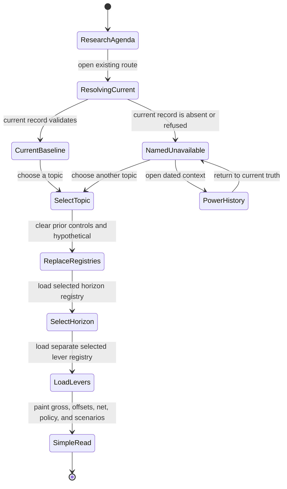
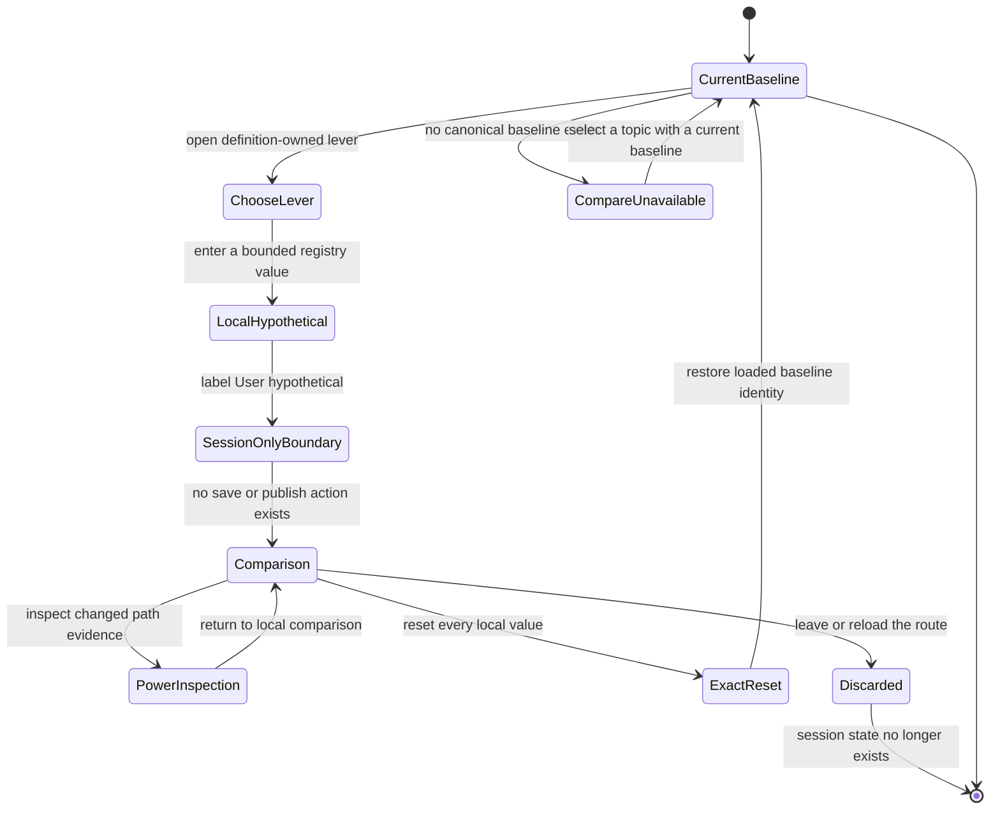
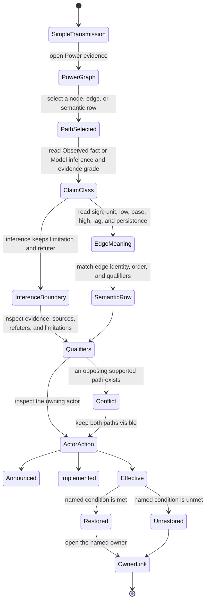
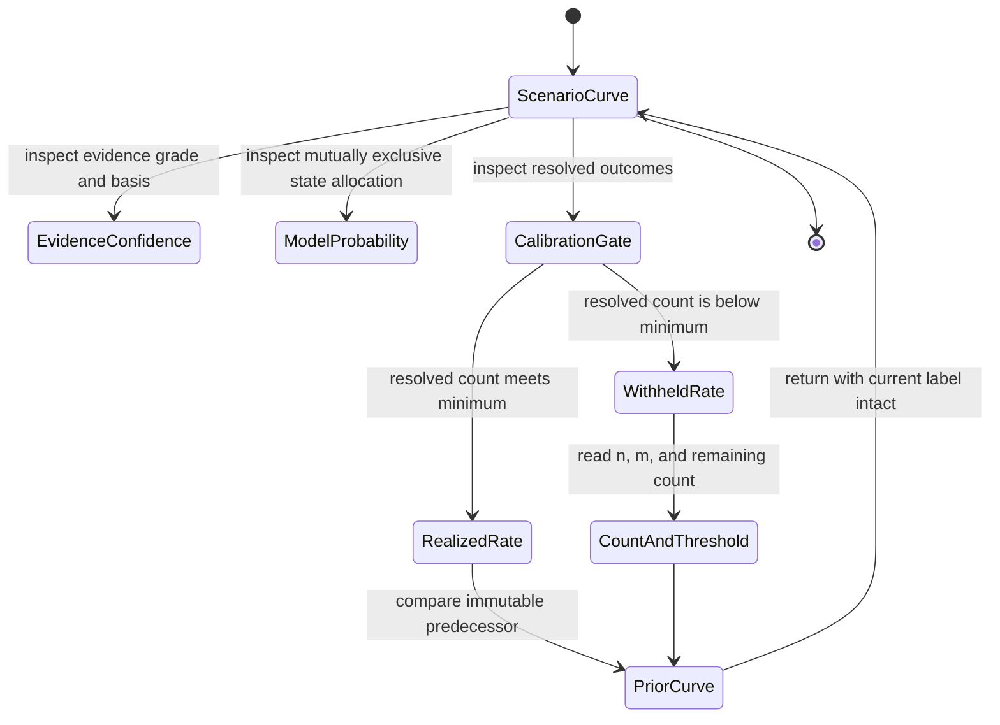
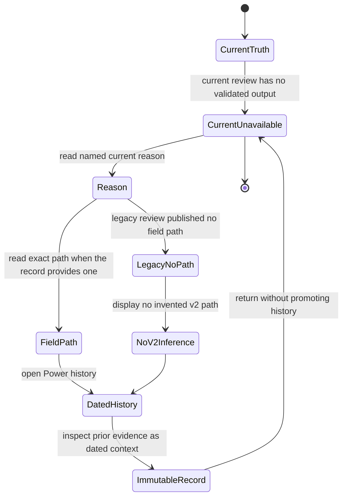
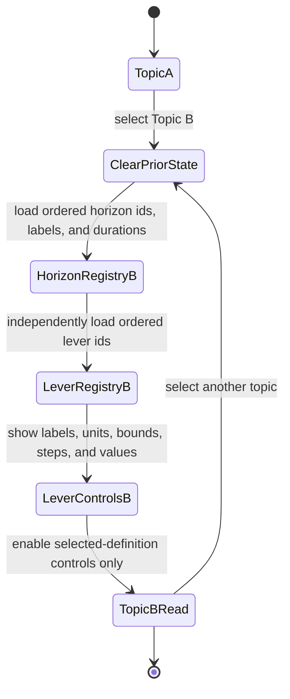
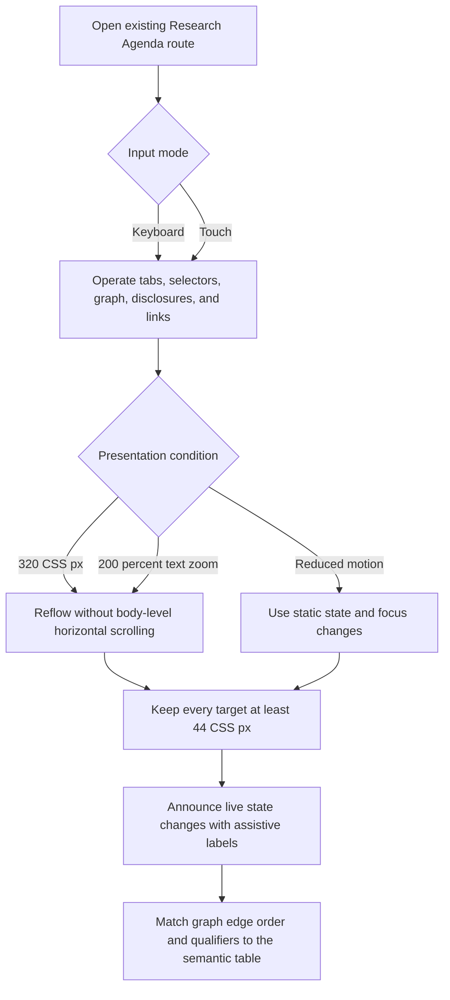

# Feature 031 — Shock Transmission Foundation

**Status:** Analyst-owned business specification. Repository status remains `not_started`.
**Workflow:** `product-to-planning`, with a `specs_hardened` ceiling.
**Product surface:** A reusable internal foundation for existing Research Agenda topics and downstream research consumers.
**Educational only:** This feature does not provide investment advice, portfolio instructions, or execution authority.

## Problem Statement

Research Lab can describe shocks, but it cannot yet describe them through one reusable contract.
The current Research Agenda declares three active topics in
[research-agenda.json](../../research-agenda.json). The geopolitical definition already carries
actors, scenarios, flows, transmission models, offsets, and policy effects. The food-input and
defense-earnings definitions use different, narrower shapes.

The richest current model is therefore topic-specific. Its reusable ideas have no common identity,
lifecycle, or cross-topic conformance rule. A new topic must either copy the geopolitical shape or
invent another one. Both choices weaken comparability. The prepared Feature 020 seam is also lossy
and currently has no production caller.

The August 22
[systemic-risk audit](../../notes/global-systemic-risk-policy-reaction-audit-2026-08-22.md)
shows the business consequence. A gross disruption is not a net shock. Inventories, rerouting,
substitution, recycling, allocation, demand response, and policy action can absorb different shares.
Financial damage also depends on leverage, funding mismatch, forced sales, and policy restoration.
The current topic model cannot express those ideas neutrally across physical, agricultural, and
financial domains.

A separate defect is visible in the current geopolitical generation. The current pointer marks the
topic `unavailable`, and its review records `situation-shape-invalid`. The validator returns that
reason with no field path for its first aggregate shape check. That defect is a separate bug candidate.
This feature must not absorb its repair. The new foundation must still require exact field-path
refusals for every foundation record it validates.

The adjacent Horizon Ladder is already a different product surface. It ranks long and short
candidates over six horizons. Its twelve direction-and-horizon cells intentionally begin with zero
resolved outcomes and a withheld measured rate. That earned-rate state is not unfinished shock
transmission and creates no requirement in this feature.

## Outcome Contract

**Intent:** Define one topic-neutral capability that explains how an observed shock propagates.
It records offsets, actor and policy responses, and the criteria that restore or refute each path.
The same vocabulary must work for physical supply, agricultural inputs, and financial
intermediation without turning any one example into the hidden foundation.

**Success Signal:** Three unrelated conformance examples can express their shocks, offsets, policy
layers, actors, transmission edges, horizons, and restoration conditions through one versioned
contract. Every finding preserves its source, provenance, causal path, refuters, limitations,
trigger, invalidation, and horizon through each declared downstream handoff. Missing or malformed
content produces an exact field-path refusal. No new route or registered tool is required.

**Hard Constraints:**

- The foundation models net transmission. It never equates gross disruption with downstream loss.
- The foundation is topic-neutral. No country, commodity, company, or policy actor owns its schema.
- Evidence and inference remain distinct. An observed action never proves private intent or future action.
- Confidence describes evidence quality. It never represents a win probability.
- Missing data remains unavailable. It never becomes zero, neutral, or an inferred observation.
- Every numeric output carries a provenance class, source, as-of time, and declared limitations.
- Scenario probabilities remain mutually exclusive within each declared scenario curve.
- Revisions append new versions. They never rewrite a prior shock, edge, finding, or scenario curve.
- The Federal Reserve remains a separate actor from executive, Treasury, and energy-policy actors.
- Policy layers remain distinct. Liquidity support never implies restored solvency or physical supply.
- Downstream projections preserve causal paths, refuters, and limitations without loss.
- New `shock-transmission/v1` refusals name exact paths. Legacy reviews with no published path remain explicitly no-path.
- A local hypothetical stays in the current route session and cannot mutate canonical research or trigger acquisition.
- A same-topic reset removes every local hypothetical value and restores the exact loaded baseline identity.
- A topic switch clears the prior topic's lever controls and session-only hypothetical state before rendering the selected topic.
- The graph and semantic table preserve one path meaning across supported input, motion, viewport, and zoom modes.
- Horizon Ladder remains a separate six-horizon long and short surface.
- The twelve `0/20` Horizon Ladder cells remain an intentional earned-rate withholding state.
- No Iran-only tool is created.
- No Shock Transmission Lab route, registry entry, wireframe, or Lab-specific exposure is created.
- The existing geopolitical shape failure remains a separate bug candidate.
- The feature accepts public research subjects only. It accepts no holdings, sizes, cost basis, or profit data.

**Failure Condition:** The feature fails if one example requires private fields or a parallel contract.
It fails if gross disruption is presented as net loss. It fails if success at one policy layer implies
success at another. It fails if inference becomes observed fact or missing data becomes zero. It also
fails if a consumer drops a causal qualifier. The feature must not create a Shock Transmission Lab
before its admission conditions are proven.

## Goals

1. Define one reusable `shock-transmission/v1` business capability.
2. Separate shocks, offsets, actors, policy actions, edges, findings, and scenario curves.
3. Represent physical, agricultural, and financial transmission with the same neutral vocabulary.
4. Preserve complete source and claim boundaries through downstream consumption.
5. Replace fixed lever and horizon assumptions with definition-owned declarations.
6. Require exact field-path refusals for every malformed foundation record.
7. Keep history additive and every correction traceable to its predecessor.
8. Prevent a new interactive surface until the audit threshold is demonstrably met.

## Non-Goals

1. Repairing the current `situation-shape-invalid` Research Agenda defect.
2. Publishing a current geopolitical dossier.
3. Creating an Iran-only page or topic-specific shared schema.
4. Creating a Shock Transmission Lab, route, registry entry, wireframe, or navigation item.
5. Changing Horizon Ladder, its six horizons, its rate gate, or its source and tests.
6. Creating a formal Horizon Ladder Bubbles packet.
7. Changing Feature 019, Feature 020, any registry, implementation, test, note, or framework file.
8. Producing forecasts, portfolio weights, trade directions, or execution actions.
9. Replacing the Research Agenda, Causal Rotation, Market Action Center, or owner tools.

## Admission Test

> Does this improve decision quality, or the measurement of decision quality?

It improves both. The audit shows that gross disruptions, offsets, policy actions, and financial
amplifiers answer different questions. A shared model prevents a dramatic headline from becoming a
proportional downstream loss without evidence. The foundation also improves measurement by keeping
every claim source, causal path, refuter, limitation, and revision intact through consumption.

The change does not seek admission through tool count. It adds no tool. It earns admission by making
existing recurring research more comparable, falsifiable, and reviewable.

## Operator Requirements

The following items are operator requirements. They are not repository observations or execution evidence.

1. Use identifier `031` for this feature, its functional requirements, scenarios, and non-functional requirements.
2. Keep the feature name and folder free of “and Lab”.
3. Keep Horizon Ladder separate and make no formal certification claim about it.
4. Treat Horizon Ladder's `0/20` measured-rate cells as intentional withholding.
5. Keep `shock-transmission/v1` planned until implementation evidence exists.
6. Create no Iran-only tool.
7. Exclude a generic Lab until all three audit conditions are proven.
8. Keep the geopolitical situation-shape defect as a separate bug candidate.
9. Modify only this feature directory during this analyst run.

## Source And Claim Boundaries

| Claim class | What this specification may say | What it must not imply | Current-session source |
| --- | --- | --- | --- |
| Observed repository fact | A file, field, route, registry row, or current record exists with the stated content | That the behavior passed tests during this run | [Evidence Sources](#evidence-sources) |
| Operator requirement | The requested planning boundary and exclusions are binding for this packet | That the repository already enforces the requirement | [Operator Requirements](#operator-requirements) |
| Planned behavior | `shock-transmission/v1` and its conformance rules are requirements | That the contract or a consumer is delivered | [Functional Requirements](#functional-requirements) |
| External competitor observation | A reviewed vendor page states a named capability | That an unmentioned capability is absent | [Competitive Analysis](#competitive-analysis) |
| Historical audit evidence | The August 22 audit motivates the model and names its limits | That every August 22 repository count remains current | [Honest Findings](#honest-findings) |
| Adjacent product evidence | Horizon Ladder is registered `live` and has source, notes, and persistent tests | That it has a formal Bubbles certification packet | [Adjacent Horizon Ladder Boundary](#adjacent-horizon-ladder-boundary) |

This specification makes no implementation, test-pass, release, deployment, or certification claim.
The Horizon Ladder browser suite was inspected but not executed during this run.

## Current Capability Map

| Capability | Current evidence | Observed state | Feature 031 disposition |
| --- | --- | --- | --- |
| Recurring topic registry | [research-agenda.json](../../research-agenda.json) declares three active topics | Delivered topic registry | Consume, do not replace |
| Topic lifecycle and publication | [rlagenda.js](../../rlagenda.js) owns agenda, generation, review, dossier, and current-pointer contracts | Delivered shared agenda capability | Extend through one neutral foundation |
| Geopolitical flow model | [geopolitical definition](../../research/agenda/topics/geopolitical-supply-shock.definition.json) carries actors, scenarios, flows, and six channel models | Rich but topic-specific | First conformance example |
| Food-input transmission | [food-input definition](../../research/agenda/topics/food-inputs-outlook.definition.json) carries fertilizer, crop, and input-cost sections | Narrow topic contract | Second conformance example |
| Financial-intermediation ladder | The [systemic-risk audit](../../notes/global-systemic-risk-policy-reaction-audit-2026-08-22.md) defines an observable credit-transmission ladder | Analytical model, not a Research Agenda topic | Third conformance example |
| Defense earnings topic | [defense definition](../../research/agenda/topics/defense-earnings-acceleration.definition.json) carries funded programs, capacity, backlog, and revisions | Separate active topic shape | Compatibility check, not hidden foundation |
| Generic shock contract | Repository search found `shock-transmission/v1` only in the August 22 audit | Planned only | Define here, do not claim delivery |
| Definition-owned levers | `rlagenda.js` fixes five view lever names while the geopolitical definition declares no lever registry | Missing extension seam | Require a definition-owned registry |
| Arbitrary finding horizons | `rlagenda.js` limits published findings to `structural`, `swing`, and `tactical` | Fixed shared vocabulary | Require additive declared horizons |
| Complete downstream finding projection | Published findings contain `causalPath`, `refutedBy`, and `limitations`; the exported Feature 020 seam omits them | Lossy and test-only seam | Preserve all three fields and require a production consumer |
| Precise top-level situation refusal | The aggregate situation-shape check returns `field: null` | Missing field precision | Require exact paths in the new foundation |
| Product-domain SST | [domain-model.yaml](../../config/domain-model.yaml) currently declares `Tool` and `ToolRead` only | No shock entities in the shared SST | Propose an additive design decision |
| Generic interactive Lab | No matching tool, root page, or site exclusion exists | Not admitted | Keep absent |

## Honest Findings

### F-031-001 — The August 22 tool count is stale

The audit records 28 tools. Current `tools.json` contains 29, and Horizon Ladder is now a live row.
This run did not reconstruct the exact registry delta from August 22. The specification uses the
current count only and keeps the audit's analysis separate from its old inventory count.

### F-031-002 — The current pointer is no longer empty

The August 22 audit describes a current pointer with no topics. The current
[current pointer](../../research/agenda/current.json) now contains three topic references. The
geopolitical topic is `unavailable`, while defense earnings and food inputs are `not-due`. The
geopolitical blocker persists, but the pointer shape changed.

### F-031-003 — The proposed foundation still does not exist

A repository-wide search found `shock-transmission/v1` only in the August 22 audit. No source,
registry, contract, or feature artifact currently defines it. Every foundation behavior in this
specification is planned.

### F-031-004 — The geopolitical topic is powerful and over-specific

Its definition contains actor ids, chokepoints, commodities, route alternatives, public proxies,
and policy offsets. That is strong domain work. It is also a poor neutral schema because its shape
assumes one geography and one class of physical flow.

### F-031-005 — The current top-level refusal loses the failing field

`validateResearchSituation()` performs one aggregate exact-shape check. On failure it emits
`situation-shape-invalid` with a null field. The current review exposes that generic reason. This is
a separate bug candidate. Feature 031 requires exact paths only for the new foundation and its
adapters.

### F-031-006 — The exported Feature 020 seam is lossy and unwired

`validatePublishedFinding()` requires `causalPath`, `refutedBy`, and `limitations`. The downstream
`buildFeature020ResearchSeam()` projection does not copy those fields. A production search found
only its definition, export, and selftest calls. Direct Research Agenda references were absent from
the current Causal Rotation source. Feature 031 must not call either path a current consumer.

### F-031-007 — Current topic definitions are structurally heterogeneous

The geopolitical definition carries a full flow network and transmission models. Food inputs and
defense earnings carry sections, sources, triggers, and invalidations without the same graph. This
is evidence for a neutral adapter boundary, not evidence that every topic should copy one shape.

### F-031-008 — The current shared model fixes both lever and finding-horizon vocabularies

`VIEW_LEVER_FIELDS` names five geopolitical controls. `FINDING_HORIZONS` names three market
horizons. The geopolitical topic already declares `lagDays`, while the audit requires policy and
cycle lags across arbitrary horizons. Topic definitions must own their declared levers and horizons.

### F-031-009 — Horizon Ladder is separate and live, but no certification claim is available

Current registry, index, navigation, source, notes, and a seven-test Playwright file all name
`horizon-ladder-lab`. A search across every `spec.md` and `state.json` found no Horizon Ladder
reference. This run therefore records no formal Bubbles certification claim.

### F-031-010 — Horizon Ladder's `0/20` state is deliberate

[horizon-ladder-universe.json](../../horizon-ladder-universe.json) declares twelve cells. Each has
zero resolved outcomes and a null measured rate. Its note and source both state that the rate remains
withheld until the minimum resolved sample reaches 20. Feature 031 must not treat this as missing
shock behavior.

### F-031-011 — The Lab threshold is not met

The audit requires interactive counterfactual need, two unrelated contract consumers, and proof that
an existing Research Agenda view cannot express the interaction. No implemented shock contract has
one consumer, much less two. Current source also contains no matching route, registry row, or site
exclusion. A Lab is not admitted.

## Domain Capability Model

### Capability

**Topic-neutral shock transmission and policy reaction.** The capability transforms sourced shock
observations into a bounded graph. The graph contains offsets, actor reactions, transmission edges,
scenarios, findings, and restoration conditions. The foundation owns composition and claim
integrity. Topic adapters own their domain vocabulary and evidence acquisition.

The repository's formal domain SST currently declares only `Tool` and `ToolRead`. This feature does
not edit that SST. Design must decide which new primitives belong in the product-wide model and which
remain feature-local.

### Domain Primitives

| Primitive | Purpose | Lifecycle |
| --- | --- | --- |
| Shock | Names the initiating disturbance and its measured capacity loss | `observed`, `revised`, `resolved`, `superseded` |
| Offset | Describes an absorbing mechanism and its capacity, lag, expiry, and evidence | `available`, `constrained`, `exhausted`, `unavailable` |
| Actor | Names one independent decision-maker or constrained participant | `active`, `inactive`, `unavailable` for one analysis version |
| Actor reaction | Separates observed behavior, stated intent, inferred action, constraints, and falsifier | `observed`, `inferred`, `refuted`, `superseded` |
| Policy action | Records one instrument, owner, trigger, effects, lag, and reversibility | `announced`, `implemented`, `effective`, `ineffective`, `reversed` |
| Transmission edge | Connects two primitives with sign, magnitude range, lag, persistence, evidence, and refuter | `candidate`, `supported`, `conflicted`, `refuted`, `superseded` |
| Transmission path | Orders edges from shock through intermediate states to an outcome | `candidate`, `active`, `restored`, `refuted`, `superseded` |
| State observation | Records a sourced state at one as-of time without rewriting prior states | Immutable after publication |
| Scenario curve | Holds mutually exclusive state probabilities for one declared horizon | `proposed`, `published`, `revised`, `superseded` |
| Finding | Publishes a bounded claim with provenance, limits, triggers, and invalidations | `current`, `stale`, `invalidated`, `superseded` |
| Restoration condition | Names the observation that proves a failed layer has recovered | `unmet`, `partially-met`, `met`, `invalidated` |
| Foundation version | Binds one schema and vocabulary set to compatible adapters | `active`, `supported`, `retired` |

### Relationships

- A shock has zero or more offsets. Each offset must name the shock share it can absorb.
- A transmission path contains ordered edges. Each edge has one source and one target.
- An actor may own policy actions. Actor identity never collapses independent institutions.
- A policy action affects one or more policy layers. Effects remain separate by layer.
- A finding cites one or more paths, source records, triggers, invalidations, and refuters.
- A scenario curve belongs to one declared horizon and one foundation version.
- A restoration condition belongs to one layer or path. Meeting it never proves unrelated layers.
- A new version references its predecessor. The predecessor remains readable.

### Business Policies

1. Calculate net shock only after offsets, capacity, lag, expiry, and uncertainty are stated.
2. Keep physical scarcity and financial amplification in separate paths until an edge connects them.
3. Keep observed actions, published estimates, model inference, analogy, and unsupported extrapolation distinct.
4. Require a source and as-of time for every observation and displayed figure.
5. Require a refuter or limitation for every inferred transmission edge.
6. Preserve conflicts. Never average incompatible states into one reassuring value.
7. Keep policy layers separate and allow their effects to conflict.
8. Treat restoration as observed only after its declared condition is met.
9. Declare horizons in each topic definition. Never infer them from labels.
10. Refuse malformed data by exact field path. Never return one generic shape error.
11. Preserve every causal qualifier through downstream projections.
12. Keep revisions additive and prior versions readable.

### Three Unrelated Conformance Examples

| Example | Initiating shock | Required offset and transmission behavior | Grounding |
| --- | --- | --- | --- |
| Geopolitical physical supply | Chokepoint impairment reduces observed oil, gas, fertilizer, or shipping capacity | Model bypass capacity, inventory, insurance, rerouting, demand response, and policy release before downstream effects | [Geopolitical definition](../../research/agenda/topics/geopolitical-supply-shock.definition.json) and [systemic-risk audit](../../notes/global-systemic-risk-policy-reaction-audit-2026-08-22.md) |
| Agricultural input cost | Fertilizer or feedstock costs change at a planting boundary | Model substitution, acreage choice, inventory, weather, working capital, crop lag, and food-price transmission | [Food-input definition](../../research/agenda/topics/food-inputs-outlook.definition.json) |
| Financial intermediation | AI return disappointment or higher rates reprice technology financing | Model equity loss, capex cuts, supplier cash flow, private-credit stress, line draws, funding withdrawal, forced sales, and policy restoration | [Systemic-risk audit](../../notes/global-systemic-risk-policy-reaction-audit-2026-08-22.md), [AI Capex notes](../../notes/ai-capex-strategy-lab.md), and [Bond Regime notes](../../notes/bond-regime-lab.md) |

The examples prove semantic breadth only. They do not authorize a new user-facing route.

## Actors And Personas

Exactly seven actors participate in the business capability.

| Actor | Description | Goals | Permissions and boundaries | Grounding |
| --- | --- | --- | --- | --- |
| Operator | The single Research Lab user who reviews recurring research | Understand what changed, how it propagates, and what would reverse it | Reads public research. Supplies no portfolio data | [Product Principles](../../docs/Product-Principles.md) and [Research Agenda](../../research-agenda.json) |
| Topic definition owner | The owner of one recurring question and its allowed subjects | Declare domain vocabulary, horizons, sources, and adapters | May define topic terms. Cannot weaken foundation invariants | [Topic definitions](../../research/agenda/topics) |
| Evidence acquirer | The bounded Research Agenda acquisition stage | Obtain source-qualified evidence inside topic requirements | May acquire public evidence. Cannot author conclusions | [generation source](../../scripts/research-agenda-generation.mjs) |
| Research author | The agent-owned authoring stage for one selected topic | Interpret acquired evidence and publish bounded findings | May infer only with provenance, limits, and refuters | [generation source](../../scripts/research-agenda-generation.mjs) and [rlagenda.js](../../rlagenda.js) |
| Foundation validator | The shared contract authority | Admit complete records and refuse malformed ones precisely | Cannot default missing fields or repair inputs silently | [rlagenda.js](../../rlagenda.js) |
| Downstream research consumer | The current Research Agenda view and any consumer admitted through this foundation | Reuse findings without dropping causal context | May project fields. Cannot change claim meaning | [Feature 020](../020-research-action-routing-and-alerts/spec.md) and [rlagenda.js](../../rlagenda.js) |
| Independent reviewer | The reviewer who challenges sources, paths, probabilities, and restoration claims | Distinguish evidence from inference and detect drift | Reads immutable versions. Cannot rewrite history | [systemic-risk audit](../../notes/global-systemic-risk-policy-reaction-audit-2026-08-22.md) |

## Use Cases

### UC-031-001: Declare a topic-neutral shock

- **Actor:** Topic definition owner.
- **Preconditions:** A topic has a sourced initiating disturbance.
- **Main flow:** The owner declares the shock, affected capacity, uncertainty, repair path, and evidence boundary.
- **Alternative flow:** A required member is absent, so the validator refuses its exact field path.
- **Postconditions:** One versioned shock is available to topic adapters.
- **Grounding:** The geopolitical definition already declares flow and capacity inputs.

### UC-031-002: Reconcile gross disruption with offsets

- **Actor:** Research author.
- **Preconditions:** A shock and candidate offsets exist.
- **Main flow:** The author records each offset's capacity, lag, expiry, and evidence. The foundation computes no proportional shortcut.
- **Alternative flow:** Offset capacity is unavailable, so the net range stays unavailable or wider.
- **Postconditions:** The record distinguishes gross disruption from net scarcity.
- **Grounding:** The August 22 audit defines the net-scarcity balance.

### UC-031-003: Compose a transmission path

- **Actor:** Research author.
- **Preconditions:** Sourced states and topic adapter terms exist.
- **Main flow:** The author connects ordered edges with signs, ranges, lags, persistence, evidence, and refuters.
- **Alternative flow:** An edge lacks evidence or a required refuter, so the validator refuses it by field path.
- **Postconditions:** A reviewer can reconstruct the path from source to outcome.
- **Grounding:** The geopolitical definition carries channel models, while the audit carries physical and financial ladders.

### UC-031-004: Record policy and actor reactions

- **Actor:** Research author.
- **Preconditions:** A public actor action or statement exists.
- **Main flow:** The author records the actor, trigger, instrument, effects, constraints, and falsifier.
- **Alternative flow:** Only private intent is alleged, so the claim remains unavailable.
- **Postconditions:** Observed behavior and inferred next action remain distinguishable.
- **Grounding:** The audit separates direct actions from its inferred reaction pattern.

### UC-031-005: Compare scenarios across declared horizons

- **Actor:** Operator.
- **Preconditions:** A topic declares horizons and mutually exclusive scenario states.
- **Main flow:** The operator compares current curves, prior curves, evidence changes, and invalidations.
- **Alternative flow:** Evidence cannot support a probability, so the curve is withheld with the reason shown.
- **Postconditions:** A probability change is attributable to a new state or a declared model revision.
- **Grounding:** The geopolitical definition has a scenario tree, and the audit records multiple horizon models.

### UC-031-006: Reuse the foundation across unrelated topics

- **Actor:** Topic definition owner.
- **Preconditions:** A topic adapter maps its terms to neutral primitives.
- **Main flow:** Geopolitical, agricultural, and financial examples validate against one foundation version.
- **Alternative flow:** One example needs a topic-specific foundation member, so the shared contract is revised before admission.
- **Postconditions:** No example becomes the hidden default.
- **Grounding:** Current topic definitions have different shapes, and the audit requires a reusable foundation.

### UC-031-007: Publish a finding without losing qualifiers

- **Actor:** Downstream research consumer.
- **Preconditions:** A validated finding exists.
- **Main flow:** The consumer receives the claim, causal path, refuters, limitations, triggers, invalidations, provenance, and horizon.
- **Alternative flow:** The consumer cannot preserve a required member, so the handoff is refused by field path.
- **Postconditions:** The downstream claim remains semantically equivalent to its source.
- **Grounding:** The exported Feature 020 seam omits three required fields and has only test callers.

### UC-031-008: Revise a path without rewriting history

- **Actor:** Independent reviewer.
- **Preconditions:** A published path or finding has new evidence.
- **Main flow:** The reviewer creates a new version that references the predecessor and explains the change.
- **Alternative flow:** The change has no evidence, so the current version remains unchanged.
- **Postconditions:** Both versions remain readable and comparable.
- **Grounding:** Research Agenda already uses immutable generation, review, dossier, and history records.

### UC-031-009: Assess whether an interactive Lab is justified

- **Actor:** Operator.
- **Preconditions:** The foundation has real consumers and stored canonical outputs.
- **Main flow:** The operator evaluates interactive need, unrelated consumer count, and existing-view sufficiency.
- **Alternative flow:** Any condition is unproven, so no route or registry proposal is admitted.
- **Postconditions:** Product surface growth follows evidence rather than naming momentum.
- **Grounding:** The August 22 audit defines the three-condition threshold.

## Business Scenarios

### SCN-031-001: A complete shock is admitted

```gherkin
Given a topic adapter submits a shock with source, start, capacity, observed loss, uncertainty, and repair path
When the foundation validates the shock
Then it admits one versioned shock record
And every numeric member retains its source, provenance, and as-of time
```

### SCN-031-002: A missing member is refused by exact field path

```gherkin
Given a foundation record omits one required nested member
When the foundation validates the record
Then validation refuses the record
And the refusal names the exact missing field path
And no generic shape reason replaces that path
```

### SCN-031-003: An unknown member fails closed

```gherkin
Given a topic adapter submits an undeclared member
When the foundation validates the record
Then validation refuses the unknown member by exact field path
And the member is not ignored or copied into a public finding
```

### SCN-031-004: Evidence and inference remain distinct

```gherkin
Given one claim is an observed fact and another is a model inference
When both claims enter one transmission path and a reader opens that path on the existing Research Agenda route
Then each keeps its own claim class and evidence grade
And the route labels the observed fact and model inference separately
And the inferred claim presents its limitation and refuter
```

### SCN-031-005: Gross disruption does not become net loss

```gherkin
Given a measured gross disruption and at least one potential offset
When the foundation composes the net transmission range
Then it accounts for accessible offset capacity, lag, expiry, and uncertainty
And it does not copy the gross disruption percentage into the downstream outcome
```

### SCN-031-006: An unavailable offset widens uncertainty

```gherkin
Given an offset is relevant but its capacity is unavailable
When the foundation composes a path
Then the offset remains unavailable
And the net range widens or remains unavailable
And no zero-capacity assumption is inserted
```

### SCN-031-007: A transmission edge carries a bounded range

```gherkin
Given a supported connection between two states
When the edge is published and a reader opens its path on the existing Research Agenda route
Then it carries sign, unit, low, base, high, lag, persistence, evidence, and refuter
And low is not greater than base
And base is not greater than high
And the route presents the complete bounded range and qualifiers without collapsing them into one value
```

### SCN-031-008: Conflicting edges remain visible

```gherkin
Given two supported paths imply opposite effects on the same outcome
When the finding is composed
Then both paths remain visible
And the output records a conflict
And no average hides the disagreement
```

### SCN-031-009: Physical and financial mechanisms stay separate

```gherkin
Given a physical shortage and a financial amplification mechanism occur together
When the foundation composes their effects
Then each remains a separate path until an evidenced edge connects them
And a physical shortage alone does not assert a credit-system break
```

### SCN-031-010: Independent policy actors remain independent

```gherkin
Given executive, Treasury, Energy Department, Federal Reserve, and congressional actions appear in one review
When the foundation records actor reactions
Then each action belongs to its actual owner
And coordination does not imply control
And Federal Reserve action is not attributed to the administration
```

### SCN-031-011: An announcement is not implementation

```gherkin
Given an actor announces a policy action
When no implementation evidence exists
Then the action remains announced rather than implemented
And no effectiveness claim is published
```

### SCN-031-012: Policy layers may conflict

```gherkin
Given one action improves market liquidity but worsens inflation exposure
When the action is evaluated
Then liquidity and inflation effects remain separate
And the liquidity benefit does not imply restored solvency or physical supply
```

### SCN-031-013: Restoration requires its named condition

```gherkin
Given a policy action targets one impaired layer
When the declared restoration condition has not been observed
Then that layer remains unrestored
And no success label is inferred from the action itself
```

### SCN-031-014: Topic definitions declare arbitrary horizons

```gherkin
Given two topics need different time horizons
When each adapter declares its horizon set
Then the foundation accepts both valid sets additively
And neither topic is forced into structural, swing, or tactical labels
```

### SCN-031-015: Scenario probabilities account for the whole curve

```gherkin
Given a topic publishes mutually exclusive scenarios for one horizon
When the scenario curve is validated
Then every scenario has a probability and provenance
And the probabilities sum to one within the declared tolerance
```

### SCN-031-016: Unsupported probability remains withheld

```gherkin
Given evidence does not support a scenario probability update
When the review is published
Then the prior curve remains unchanged or the current curve is unavailable
And no neutral or default probability is inserted
```

### SCN-031-017: A revised curve preserves its predecessor

```gherkin
Given a new observation changes one scenario curve
When the revision is published
Then a new version references the prior version
And both versions remain readable
And the change names the evidence that caused it
```

### SCN-031-018: A geopolitical supply shock uses the neutral contract

```gherkin
Given a chokepoint disruption affects several physical channels
When the geopolitical adapter uses the foundation
Then it maps routes, inventories, rerouting, insurance, demand response, and policy actions without adding country-specific foundation fields
```

### SCN-031-019: A food-input shock uses the same neutral contract

```gherkin
Given fertilizer or feedstock costs change near a planting boundary
When the food-input adapter uses the foundation
Then it maps input cost, substitution, acreage, inventory, weather, crop lag, and price effects through the same primitives
```

### SCN-031-020: A financial shock uses the same neutral contract

```gherkin
Given technology financing reprices after return disappointment or higher rates
When the financial adapter uses the foundation
Then it maps capex cuts, supplier cash flow, private credit, bank lines, funding, forced sales, and policy restoration without physical-flow assumptions
```

### SCN-031-021: Downstream projection preserves every causal qualifier

```gherkin
Given a validated finding carries a causal path, refuters, limitations, triggers, and invalidations
When a downstream consumer projects the finding
Then every member remains present and semantically unchanged
And the consumer refuses any projection that cannot preserve them
```

### SCN-031-022: Adjacent products and unadmitted surfaces stay separate

```gherkin
Given Horizon Ladder is a registered six-horizon long and short tool with unearned measured-rate cells
And the Shock Transmission Lab admission conditions are not all proven
When Feature 031 is delivered through the existing Research Agenda route
Then Horizon Ladder remains unchanged
And its zero resolved counts remain intentional withholding
And no Shock Transmission Lab route, registry row, wireframe, or Lab exposure is created
```

### SCN-031-023: Legacy unavailability does not invent a field path

```gherkin
Given a current legacy Feature 019-backed Research Agenda review is unavailable with a named reason and publishes no field path
When a reader opens the affected topic on the existing Research Agenda route
Then the route presents the named current reason
And it states that no field path was published instead of inventing one
And dated history remains separate from current unavailability
And the legacy record neither satisfies nor weakens the `shock-transmission/v1` exact-path contract
```

### SCN-031-024: A local hypothetical leaves canonical research unchanged

```gherkin
Given the existing Research Agenda route has a validated published baseline
When the operator changes a definition-owned lever, compares the result, and resets it on the same topic
Then every changed result is labelled User hypothetical and exists only in the current route session
And the comparison cannot be saved, published, or reused as canonical research
And no acquisition, dossier, history, current pointer, payload, tool read, or immutable record changes
And reset removes every hypothetical value and restores the exact loaded baseline identity
```

### SCN-031-025: The existing route remains accessible and responsive

```gherkin
Given one current transmission is available in Simple, Power, graph, and semantic-table projections
When a reader uses keyboard or touch at 320 CSS pixels, 200 percent text zoom, or reduced motion
Then every control remains operable and every touch target remains at least 44 CSS pixels
And content reflows without lost meaning, clipping, or body-level horizontal scrolling
And the graph and semantic table expose the same ordered path and qualifier set
And every state and quantitative meaning remains visible in text and available to assistive technology
And state changes remain understandable without animation
```

### SCN-031-026: Topic definitions declare independent lever registries

```gherkin
Given two topics require different adjustable inputs
And the reader has changed one lever for the selected topic
When the reader switches to the other topic
Then the prior topic's controls and session-only hypothetical state are cleared
And each registry retains stable lever identities, order, labels, units, bounds, and steps
And the existing Research Agenda route presents only the selected definition's levers
And neither topic inherits a fixed geopolitical lever list or changes an unrelated adapter
```

## Functional Requirements

Thirty-seven functional requirements stay below the product's approximate forty-requirement cap.

### Foundation identity and validation

- **FR-031-001** The foundation MUST identify itself as `shock-transmission/v1` until an additive successor is approved.
- **FR-031-002** The foundation MUST remain neutral to topic, geography, instrument, company, commodity, and policy actor.
- **FR-031-003** Every foundation record MUST declare its contract version, topic adapter, record identity, as-of time, and predecessor when one exists.
- **FR-031-004** Every required member MUST be validated at its exact nested field path.
- **FR-031-005** A missing, unknown, malformed, duplicate, or incompatible member MUST be refused by exact field path.
- **FR-031-006** Validation MUST NOT default, infer, rename, discard, or repair a refused member.
- **FR-031-007** Every accepted record MUST have a stable identity derived from its canonical content and version context.

### Shocks and offsets

- **FR-031-008** A Shock MUST carry source, start, affected capacity, observed loss, uncertainty, repair path, provenance, and as-of time.
- **FR-031-009** An Offset MUST declare its kind from inventory, reroute, substitution, recycling, allocation, demand response, or definition-owned extension.
- **FR-031-010** An Offset MUST carry capacity, lag, expiry, uncertainty, source, provenance, and as-of time.
- **FR-031-011** Net transmission MUST account for every declared Offset before publishing a downstream magnitude.
- **FR-031-012** A numeric range MUST carry low, base, and high values in monotonic order with one declared unit.
- **FR-031-013** A missing Offset value MUST remain unavailable and MUST NOT become zero, neutral, or an inferred observation.

### Transmission, actors, and policy

- **FR-031-014** A Transmission Edge MUST carry source, target, sign, low, base, high, unit, lag, persistence, evidence, limitations, and refuter.
- **FR-031-015** A Transmission Path MUST preserve the ordered edges from initiating Shock to stated outcome.
- **FR-031-016** An inferred edge MUST carry at least one limitation and one observable refuter before publication.
- **FR-031-017** Actor Reaction MUST separate observed behavior, stated intent, inferred next action, constraint, and falsifier.
- **FR-031-018** U.S. executive, Treasury, Energy Department, Federal Reserve, and congressional actors MUST remain independently addressable.
- **FR-031-019** A Policy Action MUST carry owner, trigger, instrument, amount or state, lag, reversibility, evidence, and as-of time.
- **FR-031-020** Policy Action effects MUST remain separate for growth, inflation, liquidity, credibility, and physical capacity.
- **FR-031-021** Every Policy Action MUST name its policy layer and an observable restoration condition.

### Lifecycle, scenarios, and horizons

- **FR-031-022** The foundation MUST support the primitive lifecycles declared in the Domain Capability Model.
- **FR-031-023** A topic definition MUST declare its own horizon identifiers, ordering, duration semantics, and labels.
- **FR-031-024** New horizon vocabularies MUST extend existing consumers additively and MUST NOT rewrite historical horizon values.
- **FR-031-025** A Scenario Curve MUST contain mutually exclusive states for one declared horizon and sum to one within a declared tolerance.
- **FR-031-026** Every scenario probability MUST carry provenance, as-of time, evidence basis, and limitations, or remain unavailable.
- **FR-031-027** A revised Shock, path, finding, or Scenario Curve MUST create a new version that references its predecessor.
- **FR-031-028** Topic adapters MUST be able to declare cycle phase, intermediation state, funding state, credit availability, debt-deflation risk, policy capacity, and restoration condition when applicable.

### Findings and downstream fidelity

- **FR-031-029** A Finding MUST carry claim, public subjects, source, provenance, evidence grade, causal path, refuters, limitations, trigger, invalidation, and horizon.
- **FR-031-030** A Finding's confidence MUST describe evidence quality and MUST NOT be presented as a probability of market success.
- **FR-031-031** A stale, missing, conflicted, or unsupported Finding MUST retain that state and MUST NOT become a directional conclusion.
- **FR-031-032** Every declared downstream projection MUST preserve `causalPath`, `refutedBy`, and `limitations` with the existing finding fields.
- **FR-031-033** A consumer that cannot preserve a required Finding member MUST refuse the handoff by exact field path.

### Reuse and product boundaries

- **FR-031-034** Reusability MUST be proven with geopolitical physical supply, agricultural input, and financial-intermediation conformance examples.
- **FR-031-035** Feature 031 MUST NOT modify, duplicate, or absorb Horizon Ladder's six-horizon long and short ranking or its earned-rate policy.
- **FR-031-036** The foundation MUST NOT create an Iran-only tool or encode an Iran-only foundation member.
- **FR-031-037** A Shock Transmission Lab MUST remain excluded while any admission condition is unproven. Admission requires interactive need, two unrelated consumers, and insufficient existing Research Agenda views.

## Non-Functional Requirements

- **NFR-031-001** The same canonical inputs MUST produce the same canonical output and identity.
- **NFR-031-002** Composition and validation MUST work without a key, account, server, or live network after evidence acquisition.
- **NFR-031-003** Every public artifact MUST exclude positions, sizes, cost basis, profit, credentials, and private subjects.
- **NFR-031-004** The foundation MUST remain compatible with the repository's build-free browser and Node module posture.
- **NFR-031-005** A topic adapter MUST add horizons, actors, offsets, and domain terms without changing unrelated adapters.
- **NFR-031-006** Every refusal presented to a reader MUST name the failing field in plain language and retain the machine field path.
- **NFR-031-007** Any numeric capacity, timing, or performance budget MUST have an adversarial boundary test that can fail.
- **NFR-031-008** Conformance validation MUST include malformed, missing, stale, conflicted, and incompatible records.
- **NFR-031-009** Every version comparison MUST remain reconstructible from immutable source records.
- **NFR-031-010** The foundation MUST scale by declared graph size and topic count without a topic-specific code branch.

## Product Principle Alignment

| Principle | Required behavior in Feature 031 |
| --- | --- |
| **P1 — Every displayed figure carries provenance** | FR-031-008, FR-031-010, FR-031-012, and FR-031-026 require source, provenance, and as-of context |
| **P2 — Missing data renders as missing** | FR-031-013 and FR-031-031 forbid zero, neutral, or inferred substitutions |
| **P3 — Confidence is evidence quality, never a win probability** | FR-031-030 preserves the distinction |
| **P4 — Misses are published with equal prominence to hits** | Refuted and invalidated paths remain readable through lifecycle and history rules |
| **P5 — A rate is withheld below its minimum sample** | Horizon Ladder's `0/20` state remains withheld and separate under FR-031-035 |
| **P6 — Say when the read is old** | Findings retain stale states and as-of times under FR-031-031 |
| **P7 — No blackbox numbers** | Every range and edge retains inputs, units, sources, and limitations |
| **P8 — Model-authored text is data, never markup** | Any existing consumer must render foundation text as data and preserve exact refusal paths |
| **P9 — Works with nothing** | NFR-031-002 keeps composition available after evidence acquisition without credentials |
| **P10 — UMD, never ESM** | NFR-031-004 preserves the build-free compatibility boundary |
| **P11 — Reuse, never refetch** | The foundation consumes source records and topic adapters instead of acquiring duplicate evidence |
| **P16 — Deep-link, never duplicate** | Existing owner tools keep their math. The foundation owns composition only |
| **P17 — Reachable or removed** | No root page is created. Internal consumers must be declared before the contract can ship |
| **P18 — Wired or not shipped** | FR-031-034 requires unrelated production consumers, not test-only proof |
| **P19 — One definition per concept** | FR-031-001 defines one foundation contract and forbids topic copies |
| **P20 — Every claim is scoreable** | Findings require triggers, invalidations, horizons, and causal evidence under FR-031-029 |
| **P21 — Additive contracts, append-only history** | FR-031-024 and FR-031-027 preserve prior values and versions |
| **P22 — Budgets are assertions** | NFR-031-007 requires a failing boundary test for every numeric budget |
| **P23 — A guard that cannot fail is not a guard** | NFR-031-008 requires adversarial malformed and incompatible records |
| **P25 — Specs are capped, and never block on status** | This spec has 37 FRs and names capabilities rather than depending on another spec's status |

No product-principle deviation is requested. The feature adds no roadmap-only delivery claim.

## Exposure Contract

Feature 031 creates no user-facing surface. The rows below describe planned internal reachability only.

| Capability | Surface class | Surface id | Status | Plan |
| --- | --- | --- | --- | --- |
| Topic-neutral shock composition | internal | `shock-transmission/v1` | planned | `specs/031-shock-transmission-foundation` |
| Topic adapter conformance | internal | `shock-transmission/topic-adapter/v1` | planned | `specs/031-shock-transmission-foundation` |
| Lossless finding handoff | internal | `research-finding-reference-seam/v1` additive projection | planned | `specs/031-shock-transmission-foundation` |

There is no HTTP route, UI route, CLI command, registry entry, Shock Transmission Lab row, or
Iran-only surface in this contract.

## Adjacent Horizon Ladder Boundary

| Surface fact | Current-session observation | Feature 031 rule |
| --- | --- | --- |
| Registration | `tools.json` marks `horizon-ladder-lab` as `live`; `index.html` and `rlnav.js` carry the route | Do not modify or duplicate it |
| Product shape | The source and universe declare six horizons and long and short directions | Do not absorb its horizon ladder into the foundation |
| Earned rate | All twelve cells have zero resolved outcomes and null measured rates against a minimum of 20 | Treat `0/20` as intentional withholding |
| Persistent test inventory | `tests/horizon-ladder-lab.spec.mjs` contains seven browser tests | Do not claim they passed in this run |
| Formal Bubbles packet | Search across all `spec.md` and `state.json` files returned no Horizon Ladder reference | Make no certification statement |

## Competitive Analysis

The matrix records only capabilities stated on the reviewed vendor pages. “Not established” means
the page did not support the claim. It does not assert that the vendor lacks the capability.

| Capability | Research Lab current or planned state | Everstream Analytics | AlphaSense | Koyfin | Product implication |
| --- | --- | --- | --- | --- | --- |
| Dependency graph | Geopolitical topic has a topic-specific flow network; Feature 031 plans a neutral graph | Network Mapping states that a digital twin connects companies, locations, shipments, lanes, and materials | Not established on the reviewed platform page | Not established on the reviewed macro page | A neutral graph is table stakes for credible transmission |
| Continuous monitoring | Research Agenda schedules topic reviews and publishes unavailable states | Global Monitoring states 24/7 monitoring, human validation, contextual alerts, and network-specific impact | Platform page lists monitoring within a unified research workflow | Macro page offers ready dashboards across global yields, currencies, commodities, and credit | Research Lab should preserve its smaller, source-visible recurring model |
| Scenario analysis | Topic definitions carry scenarios; no generic interactive Lab is admitted | Global Monitoring states scenario planning and mitigation testing | Not established on the reviewed platform page | Not established on the reviewed macro page | Store canonical scenario curves first. Do not infer a Lab need |
| Auditable research synthesis | Current dossiers carry sources and immutable records; the downstream seam is lossy | Human validation and action plans are stated, but field-level provenance was not established | AlphaSense states accurate, auditable outputs across qualitative, structured, and internal knowledge | Not established on the reviewed macro page | Source and qualifier preservation can differentiate Research Lab |
| Outcome calibration | Horizon Ladder and the scorecard withhold unearned rates; Feature 031 does not own them | Not established on the reviewed pages | Not established on the reviewed page | Not established on the reviewed page | Keep earned measurement separate from scenario judgment |
| No-account offline use | Research Lab requires useful no-key behavior | Reviewed page offers demo and login paths | Reviewed page offers platform access paths | Reviewed page offers free sign-up and login | Retain Research Lab's no-key, build-free advantage without claiming vendor absence |

### Competitive Gaps

1. Research Lab lacks one neutral transmission graph across topics.
2. The current top-level situation refusal does not identify a failing field.
3. The current Feature 020 finding projection loses three causal qualifiers.
4. Cross-topic reuse has no three-example conformance contract.
5. No measured evidence currently admits a generic interactive Lab.

### Competitive Edge

Research Lab can combine a transparent graph, immutable revisions, explicit unavailability, and
field-level refusals in a build-free public artifact. The reviewed vendor pages emphasize breadth,
monitoring, AI synthesis, or enterprise network mapping. None of those pages established this exact
combination. This is an opportunity, not a claim that their products lack it.

## Platform Direction And Market Trends

### Industry Trends

| Trend | Status | Relevance | Impact on Research Lab | Grounding |
| --- | --- | --- | --- | --- |
| Network and digital-twin risk mapping | Established | High | Model dependencies and single points of failure explicitly | Everstream Network Mapping page |
| Continuous contextual monitoring | Established | High | Keep recurring topic review and honest unavailable outcomes | Everstream Global Monitoring page |
| Auditable AI-assisted research | Growing | High | Preserve source and causal qualifiers through every agent handoff | AlphaSense platform page |
| Cross-asset macro dashboards | Established | Medium | Reuse owner tools, but keep the foundation below the presentation layer | Koyfin macro dashboard page and `tools.json` |
| Outcome-gated confidence | Emerging within this product | High | Keep scenario judgment separate from measured rates | Product Principles and Horizon Ladder source |

### Strategic Opportunities

| Opportunity | Type | Priority | Rationale |
| --- | --- | --- | --- |
| Canonical shock-transmission contract | Differentiator | High | Creates one falsifiable vocabulary across unrelated research domains |
| Exact field-path refusal | Table stakes | High | Makes malformed evidence actionable and prevents generic silence |
| Lossless downstream finding seam | Table stakes | High | Stops causal context from disappearing between research and action routing |
| Definition-owned horizons and levers | Differentiator | High | Prevents geopolitical defaults from constraining food or financial topics |
| Lab admission audit | Governance | Medium | Prevents another route from shipping before real interaction need exists |

### Recommendations

1. **Immediate:** Define the neutral primitives, lifecycle, validation, and exact refusal contract.
2. **Next planning increment:** Design topic adapters and lossless downstream projection.
3. **Before implementation completion:** Prove the three unrelated examples through one conformance suite.
4. **After real use exists:** Re-evaluate the three-condition Lab threshold without presuming admission.

## Improvement Proposals

Effort values are analyst estimates for planning comparison. They are not implementation commitments.

### IP-031-001: Canonical Shock Transmission Contract

- **Priority:** 1.
- **Impact:** High.
- **Effort:** L.
- **Competitive advantage:** One transparent graph can serve physical, agricultural, and financial research without a vendor-specific black box.
- **Actors affected:** Topic definition owner, research author, foundation validator, operator.
- **Business scenarios:** SCN-031-001 through SCN-031-009.
- **Grounding:** Current definitions are heterogeneous, and `shock-transmission/v1` is absent.

### IP-031-002: Exact Field-Path Refusal

- **Priority:** 2.
- **Impact:** High.
- **Effort:** M.
- **Competitive advantage:** New records remain repairable by exact path while legacy records stay honestly no-path pending their separate repair.
- **Actors affected:** Topic definition owner, foundation validator, independent reviewer.
- **Business scenarios:** SCN-031-002, SCN-031-003, and SCN-031-023.
- **Grounding:** The current aggregate situation validator returns a null field.

### IP-031-003: Definition-Owned Lever And Horizon Registries

- **Priority:** 3.
- **Impact:** High.
- **Effort:** M.
- **Competitive advantage:** New topics can declare time and control semantics without changing unrelated topics.
- **Actors affected:** Topic definition owner, research author, operator.
- **Business scenarios:** SCN-031-014 through SCN-031-017 and SCN-031-026.
- **Grounding:** Shared source currently fixes five lever names and three finding horizons.

### IP-031-004: Lossless Finding Projection

- **Priority:** 4.
- **Impact:** High.
- **Effort:** M.
- **Competitive advantage:** Action routing remains challengeable because causal paths, refuters, and limitations survive.
- **Actors affected:** Downstream research consumer, operator, independent reviewer.
- **Business scenarios:** SCN-031-021.
- **Grounding:** The current Feature 020 seam omits all three qualifiers.

### IP-031-005: Three-Example Conformance Corpus

- **Priority:** 5.
- **Impact:** High.
- **Effort:** M.
- **Competitive advantage:** The foundation proves domain neutrality instead of asserting it from one geopolitical example.
- **Actors affected:** Topic definition owner, foundation validator, independent reviewer.
- **Business scenarios:** SCN-031-018 through SCN-031-020.
- **Grounding:** The audit spans physical supply, food inputs, and financial intermediation.

### IP-031-006: Evidence-Based Lab Admission Review

- **Priority:** 6.
- **Impact:** Medium.
- **Effort:** S.
- **Competitive advantage:** Product growth follows proven interaction need rather than accumulating hidden or duplicative tools.
- **Actors affected:** Operator and product reviewer.
- **Business scenarios:** SCN-031-022.
- **Grounding:** The audit defines three conditions, and none is currently proven.

## UI Scenario Matrix

Feature 031 creates no screen. This matrix identifies existing surfaces that may consume the
foundation after implementation. It does not authorize a new route or wireframe.

| Scenario | Actor | Existing entry point | Steps | Expected outcome | Screen |
| --- | --- | --- | --- | --- | --- |
| SCN-031-004 | Operator | Registered Research Agenda route | Open a finding and inspect its claim class | Observed fact and model inference have separate labels, evidence grades, limitations, and refuters | Existing Research Agenda view |
| SCN-031-007 | Operator | Registered Research Agenda route | Open a transmission edge | Sign, unit, bounded range, lag, persistence, evidence, and refuter remain visible | Existing Research Agenda Power view |
| SCN-031-008 | Operator | Registered Research Agenda route | Open a conflicted finding | Both paths and the conflict remain visible | Existing Research Agenda Power view |
| SCN-031-013 | Operator | Registered Research Agenda route | Inspect policy restoration | The unmet restoration condition is named | Existing Research Agenda view |
| SCN-031-021 | Operator | Existing Research Agenda finding view | Follow a projected finding after consumer admission | Causal path, refuters, and limitations remain present | Existing view or admitted consumer |
| SCN-031-022 | Product reviewer | Tool registry, Horizon Ladder, and existing Research Agenda route | Inspect Feature 031 after delivery through Research Agenda | Horizon Ladder remains separate with intentional withholding, and no Lab surface appears | No new screen |
| SCN-031-023 | Operator | Registered Research Agenda route | Open the unavailable legacy topic | Named current reason and explicit no-published-path message appear above separate dated history | Existing Research Agenda view |
| SCN-031-024 | Operator | Registered Research Agenda route | Change one local lever, compare, and reset on the same topic | User-hypothetical output stays local, canonical records remain unchanged, and exact baseline identity returns | Existing Research Agenda view |
| SCN-031-025 | Operator, independent reviewer | Registered Research Agenda route | Use both projections by keyboard and touch across required viewport, zoom, and motion modes | Controls, reflow, graph-table parity, state, and meaning remain accessible | Existing Research Agenda view |
| SCN-031-026 | Operator | Registered Research Agenda route | Change one lever, then switch to a topic with a different lever registry | Prior controls and hypothetical state clear, then only the selected definition's ordered labels, units, bounds, steps, and values appear | Existing Research Agenda view |

## UI Wireframes

Feature 031 changes no route and adds no registered tool. These wireframes modify the existing
[Research Agenda reader](../../research-agenda-lab.html) and its existing Simple and Power
projections. The word “screen” below names one projection of that route. It does not authorize a
new page, navigation item, registry row, standalone Lab, or topic-specific surface.

The current reader already provides a topic strip, a current-status band, and local assumption
controls. It also provides Simple and Power projections, evidence lists, source lists, and a
dated-history band. Current unavailability stays distinct from historical context. Feature 031
extends those patterns with definition-owned horizons, levers, neutral paths, policy lifecycles,
and lossless causal inspection.

The repository project configuration declares no selectable design language. These wireframes use
the existing Research Agenda visual language and the shared Research Lab interaction patterns.

### Existing-Route Grounding

| Existing pattern | Current source | Feature 031 use |
| --- | --- | --- |
| Topic buttons with visible current state | [research-agenda-lab.html](../../research-agenda-lab.html) | Keep one topic selector and add definition-owned horizon context |
| Simple and Power hash projections | [research-agenda-lab.html](../../research-agenda-lab.html) and [rlviews.js](../../rlviews.js) | Keep the route and projection switch unchanged |
| Current status before analysis detail | [research-agenda-lab.html](../../research-agenda-lab.html) | Make the first interactive paint show a current baseline or named unavailability |
| Local recomputation without a history write | [research-agenda-lab.html](../../research-agenda-lab.html) | Generalize from five fixed levers to definition-owned levers |
| Evidence, causal path, refuter, limitation, and source rows | [research-agenda-lab.html](../../research-agenda-lab.html) | Reuse them for every inspectable transmission path |
| Dated history in a separate visual band | [research-agenda-lab.html](../../research-agenda-lab.html) | Keep historical records visibly separate from current truth |
| Six-horizon long and short ranking | [horizon-ladder-lab.html](../../horizon-ladder-lab.html) | Remain a separate product surface with no Feature 031 duplication |
| Earned-rate withholding at `0/20` | [horizon-ladder-universe.json](../../horizon-ladder-universe.json) | Remain intentional Horizon Ladder behavior, not a Feature 031 gap or threshold default |

### UX Boundary

- Both wireframes modify [research-agenda-lab.html](../../research-agenda-lab.html).
- Simple remains the default decision-first projection.
- Power remains the evidence and model drill-down projection.
- No Feature 031 control links to an Iran-only view or a new shock-transmission route.
- Horizon Ladder keeps its six horizons, long and short directions, and `0/20` withholding.
- These wireframes make no formal Bubbles certification claim about Horizon Ladder.
- The current geopolitical shape failure remains visible as current unavailability.
- Feature 031 does not repair the missing field path in that existing review.

### Screen Inventory

| Screen | Actor(s) | Route | Status | Direct scenario coverage | Supporting projection coverage |
| --- | --- | --- | --- | --- | --- |
| Research Agenda topic reader — Simple projection | Operator, independent reviewer | Existing `research-agenda-lab.html#simple/<topicId>` | Existing — modify | SCN-031-004, SCN-031-008, SCN-031-023 through SCN-031-026 | SCN-031-001, SCN-031-005, SCN-031-006, SCN-031-010 through SCN-031-016 |
| Research Agenda transmission detail — Power projection | Operator, independent reviewer | Existing `research-agenda-lab.html#power/<topicId>` | Existing — modify | SCN-031-004, SCN-031-007, SCN-031-008, SCN-031-017, SCN-031-021, SCN-031-023 through SCN-031-026 | SCN-031-002, SCN-031-005, SCN-031-006, SCN-031-009 through SCN-031-016 |

The inventory names only direct reader behavior and supporting projections. It does not claim that
a screen proves foundation validation, adapter conformance, publication, or protected-file identity.
The complete accounting below marks those scenarios explicitly non-visual where required.

### UI Primitives

The two projections use one primitive set. A projection must not create a private variant of a
listed state, label, calculation disclosure, or interaction.

| Primitive | Used by | Composition rule | Accessibility and responsive rule |
| --- | --- | --- | --- |
| Current-truth banner | Simple and Power | State, named reason, as-of time, source class, and current-pointer link render together. A legacy no-path record states that no path was published and never invents a v2 path | Uses a word and glyph, receives focus after a deep link, and appears before controls |
| Simple and Power segment | Both projections | Two tabs change presentation only. They trigger no acquisition, recomputation, or canonical write | Arrow keys, Home, and End move focus. Each target is at least 44 CSS px |
| Topic selector | Both projections | A topic switch replaces both selector registries and clears the prior topic's hypothetical state | Exposes the selected topic. Keyboard and touch produce the same selection |
| Horizon registry selector | Simple timeline and Power decomposition | Uses only the selected definition's arbitrary ordered horizon identities, labels, and duration semantics | Keeps its persistent label at 200 percent text zoom. Every option exposes identity and duration |
| Lever registry controls | Simple and Power local compare | Uses only the selected definition's ordered lever identities, labels, units, bounds, steps, and baseline values | Each range has a labelled numeric peer. Every target remains at least 44 CSS px |
| Evidence-state token | Every summary, path, actor, and curve | Uses only Current, Unavailable, Stale, Conflicted, Insufficient sample, or Dated history | A glyph and word carry meaning without colour |
| Provenance tag | Every displayed figure | Names Observed, Derived, Model estimate, or User hypothetical, plus source and as-of time | The visible tag is also the accessible description |
| Claim-boundary row | Simple claim read and Power path detail | Shows Observed fact or Model inference beside its evidence grade. Every inference keeps a visible limitation and refuter | The accessible name includes class, grade, limitation, and refuter in reading order |
| Gross-offset-net bridge | Simple summary and Power table | Gross shock, each offset, and net impact remain separate. An unavailable offset blocks false precision | Reads in equation order. It becomes a vertical list below 700 CSS px |
| Horizon step | Simple timeline and Power decomposition | Uses the horizon registry order. It never borrows Horizon Ladder horizons | Buttons use the declared label and duration. Touch targets remain at least 44 CSS px |
| Transmission-edge row | Power graph, semantic table, and selected path | Shows sign, unit, low, base, high, lag, persistence, evidence, limitation, and refuter without collapsing the interval | Reads low, base, then high. The row remains available when the graph is hidden |
| Policy actor row | Simple summary and Power lifecycle table | One row belongs to one actor. Announcement, implementation, effect, and restoration never collapse | Actor is the row header. Lifecycle words remain visible at narrow widths |
| Causal path explorer | Power | Graph and ordered semantic table use one path and qualifier set | Every node and edge is keyboard reachable. The complete semantic table is always available |
| Qualifier disclosure | Power path and finding detail | Evidence, sources, refuters, limitations, conflicts, and stale state travel together | Uses a native disclosure with an informative summary and stable focus |
| Scenario curve pair | Simple snapshot and Power history | Visual curve and semantic table use one ordered scenario set | The table remains available without the visual curve and under reduced motion |
| Calibration gate | Simple and Power scenario rows | Realized rate renders only at or above the definition-owned minimum | Below the minimum, it says `Withheld — n of m resolved` and renders no rate |
| Local compare tray | Simple controls and Power comparison | Holds one memory-only User hypothetical beside the published baseline. It offers no save or publish action. Reset restores the exact loaded baseline identity | Announces changed lever count and exact reset. It never changes canonical, current, history, or source state |
| Live-state announcer | Both projections | Announces topic, horizon, current availability, path selection, hypothetical comparison, exact reset, conflict, and withholding changes | Uses one polite live region. Meaning never depends on animation |
| Owner deep link | Sources, figures, actors, and paths | Opens the owner only when an owner and target exist. It never duplicates owner logic | A link leaves the page. A button opens inline detail. Labels state the destination |
| No-action boundary | Header, local compare, and footer | States that the reader provides research explanation, not advice, a trade, or execution | Plain text remains visible in both projections and at every viewport |

### Reader Meaning Contract

#### Evidence and availability states

| Token | Reader meaning | Forbidden implication |
| --- | --- | --- |
| `● Current` | A current record supports this value or state at the shown as-of time | Current does not mean certain or actionable |
| `○ Unavailable` | The required current value does not exist, and the reason is named | Unavailable is not zero or neutral |
| `◷ Stale` | A record exists, but it is older than its declared freshness window | Stale is not current evidence |
| `◇ Conflicted` | Supported paths disagree, and both remain visible | Conflict is not averaged into one answer |
| `◌ Insufficient sample` | A realized rate has fewer resolved outcomes than its declared minimum | The missing rate is not a probability of 0 or 50 percent |
| `▧ Dated history` | An immutable prior record is available for context | History does not fill the current baseline |

#### Quantitative meanings

| Display | Required label | Meaning |
| --- | --- | --- |
| Evidence confidence | `Evidence confidence` plus a grade and basis | Quality and coverage of supporting evidence |
| Model probability | `Model probability` plus a percentage and scenario-curve identity | Model allocation across mutually exclusive states |
| Realized rate | `Realized rate` or a withholding statement with `n` and `m` | Frequency measured from resolved outcomes only |
| Impact magnitude | Low, base, high, unit, provenance, and as-of time | Bounded effect size after the named path and offsets |

These displays never share one unlabeled percentage. Evidence confidence never becomes a model
probability. Model probability never becomes a realized rate. A realized rate never renders below
its definition-owned minimum.

#### Claim and edge meanings

| Display | Required visible content | Forbidden implication |
| --- | --- | --- |
| Observed fact | `Observed fact`, evidence grade, source, and as-of time | An observation does not prove private intent or future action |
| Model inference | `Model inference`, evidence grade and basis, limitation, and observable refuter | An inference never appears as an observed fact |
| Transmission edge | Sign, unit, ordered low, base, and high interval, lag, persistence, evidence, limitation, and refuter | One value never replaces the bounded interval or its qualifiers |
| Local comparison | Exact label `User hypothetical`, changed lever count, and loaded baseline identity | A hypothetical is not current, canonical, saved, published, or reusable research |

#### Policy action and restoration states

| Token | Required evidence | Meaning |
| --- | --- | --- |
| `Announced` | A public announcement or statement | The actor stated an action. No implementation is claimed |
| `Implemented` | Observable execution of the instrument | The action exists. No effect is claimed |
| `Effective` | Observable movement in the named target layer | The action affected that layer. Restoration is not implied |
| `Restored` | The named restoration condition is met | One named layer or path recovered. Other layers remain independent |
| `Ineffective` | The action exists without the declared target-layer effect | The lack of effect remains visible |
| `Reversed` | The actor withdrew or reversed the action | Prior action history remains readable |

An actor can occupy different states across policy layers. Liquidity can be Effective while
solvency and physical supply remain unrestored. Coordination never transfers ownership from one
actor to another.

### First Interactive Paint Contract

1. The page reserves the current-truth banner before loading detail.
2. Topic, horizon, and lever controls remain disabled while current truth is unresolved.
3. The first interactive paint shows either a current baseline or named current unavailability.
4. A current baseline includes its as-of time, provenance, definition version, and selected horizon.
5. Named unavailability includes the reason and any field path the current record provides.
6. A legacy review with no field path states that no field path was published by that legacy review.
7. The legacy state never invents or displays a `shock-transmission/v1` field path.
8. Dated history never appears inside the current-truth banner or substitutes for current truth.
9. Horizon and lever controls load from separate registries in the selected definition.
10. Local compare remains unavailable until a canonical current baseline exists.

### Shared State Contract

| State | Simple projection | Power projection |
| --- | --- | --- |
| Loading | Reserved banner says which current artifact is loading. Controls are disabled | Final section geometry remains reserved. No prior values appear |
| Empty | Names the absent topic or record and the effect on the read | Keeps each expected section and names its absence |
| Error or refusal | Shows a plain-language reason and the exact field path when available | Adds the machine path and record identity inside a disclosure |
| Stale | Shows the stale token, as-of time, and withheld current conclusion | Shows the stale record in context without painting it as current |
| Unavailable | Shows no current magnitude, probability, or rate. A legacy no-path state says no field path was published | Keeps current tables with `Unavailable` cells and named reasons. It never invents a v2 path |
| Conflict | Names the disagreeing paths and states no merged answer | Shows both paths, evidence, refuters, and limitations |
| Insufficient sample | Shows `Withheld — n of m resolved` | Shows resolved, minimum, remaining, and scoreability basis |
| Dated history | Offers a Power deep link without copying historical figures into Simple | Uses the existing dated-history band and repeats the observed-through time |

### Screen: Research Agenda Topic Reader — Simple Projection

**Actor:** Operator and independent reviewer. **Route:** Existing
`research-agenda-lab.html#simple/<topicId>`. **Status:** Existing — modify.

```text
┌────────────────────────────────────────────────────────────────────────────┐
│ RESEARCH LAB / STANDING RESEARCH          Current as of [timestamp]        │
│ Research Agenda                                                            │
│ Educational research only · no advice · no trade · no execution           │
│ View [ ● Simple ][ Power ]                                                  │
├────────────────────────────────────────────────────────────────────────────┤
│ TOPIC                                                                      │
│ [● Geopolitical supply shock] [Defense earnings] [Food inputs]             │
│ Horizon registry [definition id]                                            │
│ Horizon [ordered identity · label ▾]  Duration [definition-owned duration] │
├────────────────────────────────────────────────────────────────────────────┤
│ ● CURRENT BASELINE                                           [Open pointer]│
│ [Topic title] · observed through [as-of] · definition [version]            │
│ Current question: [declared question]                                      │
│ Source class [Observed / Derived / Model estimate]                         │
├────────────────────────────────────────────────────────────────────────────┤
│ DECISION-FIRST TRANSMISSION                                                 │
│ Gross shock           [low / base / high] [unit]     [Provenance]          │
│ Less offsets                                                               │
│   [Inventory]         [low / base / high] [lag]      [Current]             │
│   [Rerouting]         [low / base / high] [expiry]   [Current]             │
│   [Definition lever]  ○ Unavailable · [named reason]                       │
│ Net impact            ○ Unavailable                                        │
│ Why withheld: one required offset capacity is unavailable.                 │
│ Time steps  [Now]──[declared horizon 2]──[declared horizon 3]              │
├────────────────────────────────────────────────────────────────────────────┤
│ CLAIM BOUNDARIES                                                            │
│ Observed fact   [claim] · Evidence grade [grade] · [source]                │
│ Model inference [claim] · Evidence grade [grade + basis]                   │
│ Limitation [text] · Refuter [observable condition]                         │
├────────────────────────────────────────────────────────────────────────────┤
│ SCENARIO READ                                                               │
│ Model probability       [scenario] [probability] [as-of]                   │
│ Evidence confidence     [grade] · [basis] · not a probability              │
│ Realized rate           ◌ Withheld · [resolvedCount] of [minimum] resolved │
│                         [Open Power curve and calibration]                  │
├────────────────────────────────────────────────────────────────────────────┤
│ POLICY LAYERS                                                               │
│ [Federal Reserve] [Implemented] [Liquidity effective]                      │
│                   [Solvency unrestored] [Physical supply unrestored]       │
│ [Treasury]        [Announced] [Implementation not observed]                │
│ [Open actor and restoration detail]                                        │
├────────────────────────────────────────────────────────────────────────────┤
│ LOCAL COMPARE — current route session only                                 │
│ Lever registry [definition id]                                              │
│ [ordered lever id] · [label] · [unit] · [min..max] · step [step]           │
│ Published [value]  Local [value____]  [Compare locally]                     │
│ [Reset exact loaded baseline · identity [snapshot id]]                     │
│ User hypothetical · cannot save or publish                                 │
│ Canonical · current · history · source unchanged · no acquisition          │
├────────────────────────────────────────────────────────────────────────────┤
│ [Open Power evidence]  [Open source owner]                                 │
└────────────────────────────────────────────────────────────────────────────┘
```

**Current unavailable variant:**

```text
┌────────────────────────────────────────────────────────────────────────────┐
│ ○ CURRENT UNAVAILABLE · LEGACY REVIEW                      as of [timestamp]│
│ Current reason: [named legacy reason]                                      │
│ Published field path: None — this legacy review published no field path.  │
│ No `shock-transmission/v1` path is inferred or displayed.                  │
│ Current gross shock: Unavailable · offsets: Unavailable · net: Unavailable │
│ Current probability: Unavailable · realized rate: Unavailable              │
│ [Local compare unavailable — no canonical current baseline]                │
│ ▧ Dated history exists in Power and remains historical only. [Open Power] │
└────────────────────────────────────────────────────────────────────────────┘
```

**Interactions:**

- Topic button → select the existing topic → replace both registries and clear the prior hypothetical state.
- Topic selection → load only that definition's ordered horizon identities, labels, and durations.
- Topic selection → load only that definition's ordered lever identities, labels, units, bounds, steps, and values.
- Horizon control → select one horizon from the horizon registry → update the impact bridge and scenario read.
- Time step → move within the selected topic's declared order → keep the same current version.
- Claim boundary row → inspect a claim → retain class, evidence grade, limitation, and refuter together.
- Policy summary → open Power → focus the same actor and selected horizon.
- Open Power curve and calibration → switch projection → focus the selected scenario curve.
- Lever and local value → compare in memory → label every changed output `User hypothetical`.
- Local comparison → remain session-only → expose no save or publish action.
- Reset exact loaded baseline → discard every local value → restore the loaded snapshot identity exactly.
- Open source owner → follow the named owner deep link → preserve topic and horizon return context.
- Simple and Power segment → change projection only → perform no fetch or canonical write.

**States:**

- Loading: the current-truth banner names the loading artifact and disables every compare control.
- Empty: the page names the missing topic definition or current record. It renders no empty chart.
- Error: a refused foundation record shows plain-language reason and exact field path when present.
- Legacy no-path: the banner shows the named current reason and states that no field path was published.
- Stale: the stale token and as-of time replace the current label. No stale value becomes current.
- Unavailable: all affected figures say Unavailable. Dated history remains a Power-only context band.
- Conflict: both path names appear with `No merged net answer` and one Power deep link.
- Insufficient sample: the realized rate says `Withheld — n of m resolved` and shows no percentage.
- User hypothetical: every changed result uses the exact label and identifies the loaded baseline.
- Current: the baseline, definition version, horizon, provenance, and as-of time appear before controls.

**Responsive:**

- At 820 CSS px, the impact bridge, scenario read, and policy summary stack in document order.
- At 600 CSS px, topic buttons become a labelled topic selector without changing topic identity.
- At 480 CSS px, the gross-offset-net equation becomes a vertical ordered list.
- At 320 CSS px and 200 percent text zoom, content reflows without body-level horizontal scrolling.
- Touch controls remain at least 44 CSS px. Local compare actions occupy separate rows when needed.
- Reduced motion removes animated path or curve transitions. State changes use text and focus only.

**Accessibility:**

- The current-truth banner is the first named region after the page heading.
- Topic controls expose selected state and remain operable with Enter and Space.
- The projection segment follows the shared tab keyboard contract.
- Horizon and lever controls expose persistent labels, units, bounds, steps, and current values.
- The impact bridge reads Gross shock, Offsets, then Net impact in that order.
- Claim rows announce claim class and evidence grade. Inferences also announce limitation and refuter.
- Every figure exposes provenance, source, as-of time, unit, state, and limitation in its accessible name.
- A polite live region announces topic, horizon, availability, comparison, exact reset, conflict, and withholding changes.
- No state depends on colour. Every state uses a glyph, word, and explanatory sentence.

### Screen: Research Agenda Transmission Detail — Power Projection

**Actor:** Operator and independent reviewer. **Route:** Existing
`research-agenda-lab.html#power/<topicId>`. **Status:** Existing — modify.

```text
┌──────────────────────────────────────────────────────────────────────────────┐
│ Research Agenda · [Topic]                    View [Simple][● Power]           │
│ ● Current [as-of] · Horizon [definition-owned label ▾]   [Open pointer]     │
│ Educational research only · no advice · no trade · no execution             │
├──────────────────────────────────────────────────────────────────────────────┤
│ GROSS SHOCK, OFFSETS, AND NET IMPACT OVER TIME                               │
│ Step       Gross shock     Offsets by mechanism             Net impact       │
│ [Now]      [L/B/H unit]    [inventory] [reroute] [policy]   [L/B/H or state] │
│ [Horizon]  [L/B/H unit]    [substitution] [demand] [other]  [L/B/H or state] │
│ [Horizon]  [L/B/H unit]    [definition-owned set]           [L/B/H or state] │
│ Every cell: [state] [provenance] [source] [as-of] [limitation]              │
├──────────────────────────────────────┬───────────────────────────────────────┤
│ CAUSAL GRAPH                         │ SELECTED PATH                          │
│ [Shock]                              │ Path [path id] · ◇ Conflicted          │
│   │ supported · [sign] · [lag]       │ 1 [Shock] → [Physical state]           │
│   ▼                                  │ 2 [Physical] → [Price state]           │
│ [Physical state]                     │ 3 [Price] → [Financial state]          │
│   ├─ supported ──▶ [Outcome A]       │ Evidence [grade] [Open records]        │
│   └─ conflicted ─▶ [Outcome B]       │ Refuters [list]                        │
│                                      │ Limitations [list]                     │
│ [Same paths as a semantic table]     │ Conflict [opposing path and reason]    │
├──────────────────────────────────────┴───────────────────────────────────────┤
│ SELECTED EDGE                                                                │
│ Claim class [Observed fact / Model inference] · grade [grade + basis]       │
│ Sign [sign] · unit [unit] · range [low] ≤ [base] ≤ [high]                  │
│ Lag [duration] · persistence [duration or state]                            │
│ Evidence [records] · limitation [text] · refuter [observable condition]    │
│ Semantic row [same edge id, order, and qualifier set as the graph]          │
├──────────────────────────────────────────────────────────────────────────────┤
│ ACTORS, ACTIONS, EFFECTS, AND RESTORATION                                    │
│ Actor             Action state   Layer       Effect state  Restoration      │
│ [Executive]       [Announced]    [Physical]  [Unavailable] [Unmet condition]│
│ [Treasury]        [Implemented]  [Funding]   [Effective]   [Partially met]   │
│ [Energy Dept.]    [Implemented]  [Capacity]  [Ineffective] [Unmet]           │
│ [Federal Reserve] [Effective]    [Liquidity] [Current]     [Liquidity met]   │
│ [Congress]        [Announced]    [Authority] [Unavailable] [Unmet]           │
│ Federal Reserve ownership remains independent from administration actors.   │
├──────────────────────────────────────────────────────────────────────────────┤
│ SCENARIO CURVES AND CALIBRATION                                              │
│ Scenario       Model probability   Evidence confidence   Realized rate      │
│ [State A]      [probability]        [grade + basis]       Withheld n / m     │
│ [State B]      [probability]        [grade + basis]       [rate] n / m       │
│ Root probability total [100%] · tolerance [declared value]                  │
│ [Visual curve] [Same data as a semantic table] [Compare prior version]      │
├──────────────────────────────────────────────────────────────────────────────┤
│ LOCAL COMPARE · CURRENT ROUTE SESSION ONLY                                   │
│ Published baseline [identity]     User hypothetical [changed lever count]    │
│ Selected lever registry [definition id] · [ordered ids, units, bounds, steps]│
│ Net [range/state]                 Net [range/state]                           │
│ Paths [count]                     Paths [count]                               │
│ [Reset exact loaded baseline]     Cannot save or publish                     │
│ Canonical · current · history · source unchanged · no acquisition            │
├──────────────────────────────────────────────────────────────────────────────┤
│ EVIDENCE AND SOURCE QUALIFIERS                                               │
│ [▾ Evidence records · count] [▾ Sources · count] [▾ Refuters · count]       │
│ [▾ Limitations · count] [▾ Conflicts · count] [▾ Stale records · count]     │
│ Owner [Open owning tool] · Source [Open public record]                       │
├──────────────────────────────────────────────────────────────────────────────┤
│ ▧ DATED HISTORY — NEVER CURRENT                         observed through […] │
│ [Prior version summary] [Open immutable record] [Compare without promotion] │
└──────────────────────────────────────────────────────────────────────────────┘
```

**Interactions:**

- Topic selector → select a topic → replace both definition-owned registries before enabling controls.
- Horizon selector → choose one declared horizon → update every Power section from one view state.
- Causal graph node or edge → select path → focus the same edge identity in the semantic table.
- Selected edge → inspect meaning → show claim class, grade, sign, unit, interval, lag, persistence, evidence, limitation, and refuter.
- Same paths as a semantic table → open the ordered table → preserve edge order and every qualifier.
- Evidence, Sources, Refuters, Limitations, Conflicts, or Stale records → expand disclosure → keep focus on its summary after close.
- Actor row → inspect one action → show announcement, implementation, layer effect, and restoration evidence separately.
- Visual curve point → focus one scenario and horizon → announce model probability, not confidence or realized rate.
- Compare prior version → open an immutable comparison → keep current and dated labels visible together.
- Local compare → change selected definition-owned values in memory → label both projections `User hypothetical`.
- Local compare boundary → expose no save or publish action → leave canonical, current, history, and source state unchanged.
- Reset exact loaded baseline → remove the hypothetical object → restore baseline path, curve, and snapshot identities.
- Open owning tool or public record → follow an existing deep link → never reproduce the owner's calculation here.

**States:**

- Loading: each section preserves its final heading and states which current record it awaits.
- Empty: an absent graph, actor set, curve, or source ledger remains a named section with a reason.
- Error: the refusal panel shows human reason, machine field path, and rejected record identity.
- Legacy no-path: the current banner states the named reason and says the legacy review published no field path.
- Stale: the affected edge, actor action, or curve carries the stale token and observed-through time.
- Unavailable: current graph and table cells say Unavailable. Historical cells remain in the dated band.
- Conflict: both paths remain visible. The graph, table, and qualifier panel identify the disagreement.
- Insufficient sample: calibration shows resolved, minimum, remaining, and withholding reason without a rate.
- User hypothetical: changed rows retain the exact label and show their published baseline identity.
- Current: every visible figure carries provenance, source, as-of time, unit, and declared limitations.

**Responsive:**

- At 980 CSS px, graph and selected-path detail stack without changing reading order.
- At 760 CSS px, every table becomes labelled rows. The native table remains available to assistive technology.
- At 600 CSS px, the graph defaults to the ordered path list and offers the visual graph as a disclosure.
- At 480 CSS px, scenario curve visuals collapse behind `Show visual curve`. The semantic table stays visible.
- At 320 CSS px and 200 percent text zoom, content wraps without clipping or body-level horizontal scrolling.
- Touch selection never requires hover. Graph nodes, disclosures, and links remain at least 44 CSS px.
- Reduced motion replaces animated edge tracing with a static outline and live-region announcement.

**Accessibility:**

- Power sections use heading level 2 in the same order as the wireframe.
- The causal graph has an accessible name, description, and one row per edge in the semantic table.
- Arrow keys move among graph nodes. Enter selects. Escape returns focus to the graph heading.
- The selected graph edge and semantic row expose the same identity, order, and complete qualifier set.
- Tables use actor, scenario, and path row headers. Units never appear only in column decoration.
- Curve points expose scenario, horizon, model probability, source date, and limitations.
- Disclosures use native summary controls with informative names and visible counts.
- A polite live region announces selected edges, conflicts, topic changes, hypothetical changes, and exact resets.
- Source links suppress referrer data and name the publisher or owning tool.
- Print and reduced-motion presentations retain state words, source dates, and the no-action boundary.

## User Flows

### User Flow: Open a Topic with Honest Current Truth



### User Flow: Compare a Local Hypothetical and Reset



### User Flow: Inspect a Causal Path and Policy Lifecycle



### User Flow: Read Scenario Judgment and Earned Calibration Separately



### User Flow: Distinguish Current Unavailability from Dated History



### User Flow: Switch Topic-Owned Horizon and Lever Registries



### User Flow: Operate One Meaning Across Accessible Modes



### Scenario-to-Flow Coverage

| Scenario | UX class | Projection or boundary | Grounded UX accounting |
| --- | --- | --- | --- |
| SCN-031-001 | Supporting | Simple current-truth banner | The banner can show the admitted identity, source, provenance, and as-of time. Foundation admission remains non-visual. |
| SCN-031-002 | Supporting | Simple refusal and Power detail | The route can present an admitted exact-path refusal. Missing-member validation remains non-visual. |
| SCN-031-003 | Non-visual | Foundation validation boundary | Unknown-member rejection and public-finding exclusion have no user interaction. The UI must not invent one. |
| SCN-031-004 | Direct | Both projections and causal-path flow | Observed fact and Model inference use separate labels and grades. Every inference shows its limitation and refuter. |
| SCN-031-005 | Supporting | Simple impact bridge | The bridge presents gross shock, each offset, and net impact separately. Interval composition remains non-visual. |
| SCN-031-006 | Supporting | Both projections | An unavailable offset stays unavailable. The reader sees a wider or withheld net result and no inserted zero. |
| SCN-031-007 | Direct | Power selected-edge detail | The edge shows sign, unit, ordered low, base, and high values, lag, persistence, evidence, limitation, and refuter. |
| SCN-031-008 | Direct | Both projections and causal-path flow | Opposing paths stay visible with a conflict label and no merged answer. |
| SCN-031-009 | Supporting | Power graph and semantic table | Physical and financial paths remain separate. Edge admission and finding rejection remain non-visual. |
| SCN-031-010 | Supporting | Both policy projections | Actor rows retain each declared owner. Adapter mapping remains non-visual. |
| SCN-031-011 | Supporting | Both policy projections | The reader sees Announced separately from Implemented, Effective, and Restored. Lifecycle validation remains non-visual. |
| SCN-031-012 | Supporting | Power policy table | Liquidity, inflation, solvency, and physical-capacity effects occupy separate rows. Policy evaluation remains non-visual. |
| SCN-031-013 | Supporting | Both policy projections | An unmet named restoration condition remains visible. Evidence admission remains non-visual. |
| SCN-031-014 | Supporting | Separate horizon registry selector | The selector uses the chosen definition's horizon order and duration. Array validation and additive acceptance remain non-visual. |
| SCN-031-015 | Supporting | Scenario curve and semantic table | Rows show probability, provenance, and total. Curve accounting remains foundation validation. |
| SCN-031-016 | Supporting | Both scenario projections | Unsupported probability stays unavailable. No neutral distribution appears. Publication semantics remain non-visual. |
| SCN-031-017 | Direct | Power history and calibration flow | Current and predecessor curves remain readable together. The changed evidence stays named. |
| SCN-031-018 | Non-visual | Geopolitical adapter conformance | Neutral-schema conformance needs contract proof, not a new geopolitical screen. |
| SCN-031-019 | Non-visual | Food-input adapter conformance | Neutral-schema conformance needs contract proof, not copied food-input UI. |
| SCN-031-020 | Non-visual | Financial adapter conformance | Neutral-schema conformance needs contract proof. No financial topic screen is implied. |
| SCN-031-021 | Direct | Power finding disclosure and causal-path flow | Path, refuters, limitations, triggers, invalidations, sources, and owner link remain present on the existing route. |
| SCN-031-022 | Non-visual | Protected-surface boundary | Horizon Ladder byte identity and route absence require discovery and protected-file proof. They are not a user flow. |
| SCN-031-023 | Direct | Both projections and current-unavailability flow | The legacy banner shows the named reason and says no field path was published. It shows no invented v2 path or current history value. |
| SCN-031-024 | Direct | Both projections and local-compare flow | Every changed result says `User hypothetical`. It is session-only, cannot save or publish, and exact reset restores the loaded baseline. |
| SCN-031-025 | Direct | Both projections and accessible-modes flow | Keyboard and touch remain operable at 320 CSS px, 200 percent zoom, reduced motion, and 44 CSS px targets. Graph and table meaning match. |
| SCN-031-026 | Direct | Both projections and topic-registry flow | Topic switching shows only the selected definition's ordered lever identities, labels, units, bounds, steps, and values. |

### UI Verification Applicability Decision

`ui-unit` proof applies to pure reader-state and projection behavior. It does not replace browser
proof for a user-visible scenario. The planning owner must keep these proof classes separate.

| Proof class | UX responsibility | Required proof boundary |
| --- | --- | --- |
| `ui-unit` | Planned `readerSentence(error)` projection | Verify named legacy reasons, explicit no-published-path text, exact v2 paths, and no invented path text without a DOM. |
| `ui-unit` | Planned `projectViewState(snapshot, definition, hypothetical)` projection | Verify baseline versus `User hypothetical`, `persistable: false`, selected horizon, changed levers, and exact baseline reset output. |
| `ui-unit` | Pure selector models beneath `HorizonSelector` and `LocalCompareTray` | Verify horizon and lever registries remain distinct. Verify selected-definition order, labels, units, bounds, steps, and values. |
| `ui-unit` | Claim, edge, graph, and semantic-row projections from one view state | Verify claim class, grade, interval order, lag, persistence, evidence, limitation, refuter, path identity, and row order. |
| Playwright | Existing Simple and Power route projections | Verify SCN-031-004 and SCN-031-007 content is directly visible in the rendered page and accessibility tree. |
| Playwright | Topic switching and local comparison | Verify only selected-definition controls render. Verify `User hypothetical`, no save or publish action, unchanged counters and fingerprints, and exact reset. |
| Playwright | Responsive and accessible operation | Verify keyboard, touch, focus, assistive labels, live announcements, 320 CSS px, 200 percent zoom, 44 CSS px targets, reduced motion, and no body-level horizontal scroll. |
| Playwright | Graph and semantic-table interaction | Verify bidirectional focus, selected-edge identity, ordered-path parity, and the complete qualifier set in the production route. |
| Non-visual checks | Foundation admission, adapter conformance, immutable publication, route absence, and Horizon Ladder byte identity | Use contract, integration, discovery, and protected-file proof. Do not fabricate a visual interaction. |

The existing inline route functions are not substitutes for these proof classes. Current
`reasonText()`, `applyMode()`, `buildLeverControls()`, `recomputeFromLevers()`, and `renderAll()`
show where browser behavior currently converges. The planned pure exports must carry the unit
contract, while Playwright must exercise the rendered route.

### Hardening Finding Remediation

| Finding | UX-owned resolution | Remaining foreign-owned handoff |
| --- | --- | --- |
| H031-UX-ROUTE | Mapped SCN-031-023 through SCN-031-026 to both existing projections and four exact flows. | Design must add technical scenario contracts before planning regenerates mappings. |
| H031-H4-001 | Declared `ui-unit` applicable for pure reader-state, selector, row, and parity projections. | Planning must add exact `ui-unit` rows and repository-native commands. |
| H031-H5-001 | Added direct legacy named-reason, explicit no-published-path, no-v2-inference, and current-versus-history behavior. | Design and planning must map SCN-031-023 instead of SCN-031-002. |
| H031-H5-002 | Added exact `User hypothetical`, session-only, no-save, no-publish, non-mutation, and baseline-reset behavior. | Design and planning must map SCN-031-024 and its state contract. |
| H031-H5-003 | Added direct keyboard, touch, zoom, viewport, target-size, motion, live-state, and graph-table parity behavior. | Planning must map Playwright proof to SCN-031-025. |
| H031-H5-004 | Split horizon and lever registries throughout primitives, screens, flows, and coverage. | Design and planning must add SCN-031-026 and keep SCN-031-014 horizon-only. |
| H031-H5-005 | Kept live route claims browser-only and classified non-visual seam validation separately. | Design must reconcile the consumer claim. Planning must replace the Node proxy with Playwright or narrow the claim. |
| H031-H5-006 | Added the direct claim-class contract to both projections. Added the complete bounded-edge contract to Power and the causal-path flow. | Design and planning must add matching scenario traits and direct Playwright rows. |

### UX Owner Findings and Dispositions

| Finding | Observation | Disposition |
| --- | --- | --- |
| F-UX-031-001 | The analyst UI matrix says Feature 031 creates no screen, while the UX profile requires wireframes | Addressed here by defining both wireframes as modifications to existing route projections |
| F-UX-031-002 | The existing page and Simple adapter use five geopolitical lever identities | The UX now derives one separate lever registry from the selected definition. Design owns the compatibility contract. |
| F-UX-031-003 | A local hypothetical needs separate identity from the published baseline | The UX now requires a memory-only `User hypothetical`, no persistence actions, and exact baseline reset. |
| F-UX-031-004 | Feature 031 requires calibration withholding but declares no universal numeric minimum | The UX reads the selected definition's minimum. It never borrows Horizon Ladder's threshold. |
| F-UX-031-005 | Graph, table, Simple summary, and downstream finding must preserve one causal meaning | The UX now requires one view state, one ordered path identity, and one complete qualifier set. |
| F-UX-031-006 | The current geopolitical review is unavailable and lacks a field path | SCN-031-023 now owns the direct legacy no-path presentation. The separate defect remains unrepaired. |
| F-UX-031-007 | The first UX pass found no technical design | The design now exists. Its 22 technical scenarios require reconciliation to the current 26-scenario spec. |
| F-UX-031-008 | The first UX pass found no scope plan | Planning artifacts now exist. The planning owner must regenerate them after design reconciliation. |
| F-UX-031-009 | The first UX pass found no execution-report structure | The report structure now exists and remains foreign-owned. |
| F-UX-031-010 | The first UX pass found no human-acceptance checklist | The acceptance checklist now exists and remains foreign-owned. |
| F-UX-031-011 | The first UX pass could not verify a technical foundation | The design now defines the foundation, concrete adapters, variation axes, and shared view state. |

### Design and Plan Handoff

#### Required next-owner sequence

1. `bubbles.design` must reconcile its technical scenario contracts from 22 to all 26 stable scenarios.
2. Design must revise SCN-031-004 and SCN-031-007 for direct reader-visible proof.
3. Design must add technical contracts for SCN-031-023 through SCN-031-026.
4. Design must preserve the distinct horizon and lever registry contracts.
5. `bubbles.plan` must regenerate scenario mappings, traits, Test Plan rows, and DoD only after design reconciles.

#### Required design decisions

1. Define one view-state envelope consumed by Simple, Power, graph, table, and downstream finding projections.
2. Keep the arbitrary horizon registry independent from the lever registry.
3. Preserve each registry's stable identities, order, labels, and definition-owned semantics.
4. Keep published baseline state separate from local hypothetical state at every function boundary.
5. Make a hypothetical memory-only, non-persistable, and unavailable to save or publish paths.
6. Define exact reset as restoration of the loaded baseline identity and every baseline value.
7. Preserve legacy named unavailability without creating a `shock-transmission/v1` path.
8. Keep dated history outside current truth for legacy and v2 records.
9. Project Observed fact and Model inference with separate labels and evidence grades.
10. Keep every inferred claim's limitation and observable refuter visible.
11. Project every edge's sign, unit, ordered interval, lag, persistence, evidence, limitation, and refuter.
12. Define gross shock, each offset, and net impact as separate time-indexed values with availability states.
13. Map policy action lifecycle and restoration-condition lifecycle without automatic state promotion.
14. Define graph and semantic-table projections from one ordered path representation.
15. Define evidence confidence, model probability, and realized-rate calibration as separate value classes.
16. Place the calibration minimum in the selected topic or foundation definition, not in the UI.
17. Resolve owner links through declared ownership. Render no link when ownership is absent.
18. Keep the existing route, topic identities, and Simple and Power hashes.
19. Preserve the no-advice, no-trade, and no-execution boundary in every projection.

#### Required plan coverage

| Plan obligation | Verification expectation |
| --- | --- |
| Honest first interactive paint | Prove controls remain disabled until current baseline or named unavailability is visible |
| Dynamic definitions | Prove two topics with different horizons and levers render without a topic-specific UI branch |
| Gross-offset-net decomposition | Prove missing offset capacity never becomes zero and blocks false net precision |
| Actor independence | Prove Federal Reserve and administration actions retain separate owners and layers |
| Policy lifecycle | Prove Announced, Implemented, Effective, and Restored require separate evidence |
| Causal inspectability | Prove graph and semantic table expose identical paths, evidence, refuters, and limitations |
| Conflict and stale behavior | Prove both conflicting paths remain visible and stale values never paint as current |
| Scenario semantics | Prove confidence, probability, and realized rate cannot substitute for one another |
| Calibration boundary | Test immediately below and at each definition-owned minimum |
| Local compare and reset | Prove the exact `User hypothetical` label, session-only lifetime, no save or publish action, unchanged canonical state, and exact loaded identity restoration |
| Responsive and accessible use | Test keyboard, touch, 44 CSS px targets, reduced motion, 320 CSS px, 200 percent text zoom, no body-level horizontal scroll, assistive labels, and live announcements |
| Registry separation | Prove arbitrary horizons remain distinct from levers and topic switching exposes only the selected definition's complete ordered registries |
| Direct claim meaning | Prove Observed fact and Model inference labels, evidence grades, inferred limitation, and refuter on the existing route |
| Direct edge meaning | Prove sign, unit, ordered low, base, and high interval, lag, persistence, evidence, limitation, and refuter on the existing route |
| Legacy no-path state | Prove the named reason, explicit no-published-path text, absent v2 path, and separate dated history |
| Existing-surface boundary | Prove no new route, registry row, navigation item, Iran-only view, or Shock Transmission Lab appears |
| Adjacent-surface boundary | Prove Horizon Ladder source, six horizons, long and short directions, and `0/20` withholding remain unchanged |

## Capability Dependencies

This feature depends on capabilities, not on another feature's status.

| Capability | Current evidence | Required use |
| --- | --- | --- |
| Immutable Research Agenda records | Generation, review, dossier, history, and current contracts exist in `rlagenda.js` | Reuse their additive history behavior |
| Topic-owned evidence requirements | Three current definitions declare sources, triggers, and invalidations | Adapt them without copying one topic's graph |
| Public finding validation | `validatePublishedFinding()` validates source and causal fields | Extend rather than bypass it |
| Downstream consumer seam | Research Agenda renders current findings. Feature 020's exported seam has only test callers, and direct Causal Rotation consumption was not found | Admit a real consumer only after lossless conformance |
| Product-domain SST | Current model declares `Tool` and `ToolRead` | Design must decide additive shared entities without editing the SST here |

Horizon Ladder is not a dependency. The current geopolitical generation defect is not a dependency.
Both remain separate boundaries with explicit behavior.

## Acceptance Criteria

1. SCN-031-001 through SCN-031-003 prove complete, exact, fail-closed validation.
2. SCN-031-004 and SCN-031-007 prove claim classes and bounded edge meaning remain distinct and reader-visible.
3. SCN-031-005, SCN-031-006, SCN-031-008, and SCN-031-009 prove net-shock and mechanism separation.
4. SCN-031-010 through SCN-031-013 prove actor independence and layered policy restoration.
5. SCN-031-014 through SCN-031-017 prove definition-owned horizons and additive scenario history.
6. SCN-031-018 through SCN-031-020 prove three unrelated domains use one foundation.
7. SCN-031-021 proves downstream semantic fidelity.
8. SCN-031-022 proves Horizon Ladder remains unchanged and no Lab surface appears.
9. SCN-031-023 keeps legacy no-path unavailability separate from exact new-contract refusal.
10. SCN-031-024 proves same-topic local comparison is non-persistent and reset restores exact baseline identity.
11. SCN-031-025 proves accessible, responsive, and meaning-preserving use on the existing route.
12. SCN-031-026 proves topic switching clears prior local state, selects one lever registry, and leaves unrelated adapters unchanged.
13. Every numeric budget receives an adversarial boundary test under NFR-031-007.
14. Every new guard has a mutation or negative control that demonstrates failure.
15. No implementation or delivery claim may rely on this specification alone.

## Risks And Open Questions

1. **Shared-domain placement:** Design must decide which primitives extend `config/domain-model.yaml` and which remain under the feature contract.
2. **Adapter boundary:** Design must prevent topic adapters from becoming parallel validators.
3. **Version migration:** Design must preserve current Research Agenda records while adding the new contract.
4. **Horizon coexistence:** Design must keep topic-declared horizons additive to historical `structural`, `swing`, and `tactical` values.
5. **Graph cycles:** Design must decide whether a valid feedback loop uses explicit bounded cycles or an unfolded time-indexed path.
6. **Current shape defect:** The existing null-field `situation-shape-invalid` behavior needs a separate complete bug packet owned by `bubbles.bug`.
7. **Existing-surface UX:** UX must show field-path refusals and restoration states on existing views without proposing a Shock Transmission Lab.
8. **Lab admission:** No answer is needed now. The threshold remains unmet and the surface remains absent.

## Evidence Sources

### Repository Sources Read In This Run

- [Research Agenda registry](../../research-agenda.json).
- [Research Agenda shared model](../../rlagenda.js).
- [Research Agenda generation source](../../scripts/research-agenda-generation.mjs).
- [Current Research Agenda pointer](../../research/agenda/current.json).
- [Current geopolitical generation](../../research/agenda/generations/generation-65ada6921f173e430130e81e36b9c2f6c338235e2addb0c248b266526e968fe8.json).
- [Current geopolitical review](../../research/agenda/reviews/geopolitical-supply-shock/generation-65ada6921f173e430130e81e36b9c2f6c338235e2addb0c248b266526e968fe8.json).
- [Geopolitical topic definition](../../research/agenda/topics/geopolitical-supply-shock.definition.json).
- [Geopolitical calibration](../../research/agenda/topics/geopolitical-supply-shock.calibration.json).
- [Food-input topic definition](../../research/agenda/topics/food-inputs-outlook.definition.json).
- [Defense-earnings topic definition](../../research/agenda/topics/defense-earnings-acceleration.definition.json).
- [August 22 systemic-risk audit](../../notes/global-systemic-risk-policy-reaction-audit-2026-08-22.md).
- [Feature 020 business specification](../020-research-action-routing-and-alerts/spec.md).
- [Product Principles](../../docs/Product-Principles.md).
- [Product domain model](../../docs/DomainModel.md).
- [Formal domain model](../../config/domain-model.yaml).
- [Tool registry](../../tools.json).
- [Horizon Ladder source](../../horizon-ladder-lab.html).
- [Horizon Ladder universe](../../horizon-ladder-universe.json).
- [Horizon Ladder notes](../../notes/horizon-ladder-lab.md).
- [Horizon Ladder browser tests](../../tests/horizon-ladder-lab.spec.mjs).
- [AI Capex notes](../../notes/ai-capex-strategy-lab.md).
- [Bond Regime notes](../../notes/bond-regime-lab.md).

### External Sources Retrieved In This Run

- [Everstream Network Mapping](https://www.everstream.ai/platform/network-mapping/) — digital-twin dependency mapping and predictive risk statements.
- [Everstream Global Monitoring](https://www.everstream.ai/platform/global-monitoring/) — 24/7 monitoring, human validation, contextual alerts, scenario planning, and action plans.
- [AlphaSense Platform](https://www.alpha-sense.com/platform/) — unified research, monitoring, and stated auditable AI outputs.
- [Koyfin Macro Dashboards](https://www.koyfin.com/features/macro-dashboards/) — ready dashboards across yields, economic data, currencies, commodities, and credit.

External pages were retrieved on 2026-08-31 UTC. Their statements support only the competitor cells
that name them. Silence on a reviewed page is recorded as “not established,” never as product absence.
