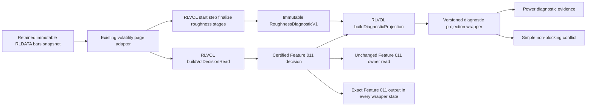

# Design: 028 Volatility Roughness and Model-Assumption Diagnostic

## Design Brief

### Current State

Feature 011 owns the volatility forecast, regime, persistence, sizing, conflicts, decision identity, and compact owner read. Its certified artifacts remain unchanged.

`rlvol.js` is the frozen UMD formula owner for browser and Node consumers. `volatility-sizing-lab.html` renders one decision through the existing Simple and Power experience.

`rldata.js` already supplies cached daily bars and freshness metadata. The volatility page already hydrates that cache and publishes the owner read.

### Target State

Add one optional roughness diagnostic to the existing RLVOL capability. The diagnostic tests empirical scaling in an observed log-volatility proxy.

The Power view enables and explains the diagnostic. Simple retains the Feature 011 verdict and may show one non-blocking evidence conflict.

The diagnostic never selects a model or changes a forecast, sizing value, direction, signal, or execution field.

### Patterns To Follow

- Extend the pure UMD boundary in `rlvol.js` with frozen functions and results.
- Reuse `canonicalize()` and deterministic identity patterns already owned by RLVOL.
- Reuse `readCachedBars()`, `buildInput()`, `recompute()`, and `renderPower()` in `volatility-sizing-lab.html` while keeping diagnostic enablement outside `hydrate()`.
- Reuse the retained immutable bars and source metadata already read from RLDATA. The enable action must not call `RLDATA.ensureBars()` or any provider path.
- Preserve the closed `rlvol-decision-read/v1` object and place new evidence in a separately versioned projection wrapper.
- Keep the model-assumption conflict in that wrapper. Legacy consumers continue to receive the unchanged Feature 011 decision or its unchanged compact owner-read projection.
- Extend the existing Feature 011 Playwright suite for route, cache, accessibility, and invariance coverage.
- Use Node 20 and the same CommonJS export for deterministic formula tests.

### Patterns To Avoid

- Do not create a second formula owner in the HTML page or a test helper.
- Do not add a page, route, registry row, provider, package, backend, or build step.
- Do not fetch bars when the diagnostic is enabled.
- Do not use an ambient clock or ambient randomness.
- Do not use a Web Worker. The current page content-security policy does not authorize worker execution.
- Do not use `requestAnimationFrame` as the compute scheduler. Hidden tabs may suspend it.
- Do not replace the Feature 011 decision identity with the diagnostic identity.
- Do not call the proxy latent variance or claim validation of a pricing model.

### Resolved Decisions

- Embed the immutable diagnostic in `rlvol-decision-diagnostic-projection/v1`, a new wrapper with `diagnosticId` and `parentDecisionId`.
- Keep the wrapped Feature 011 `rlvol-decision-read/v1` canonical bytes, key set, contract version, and `decisionId` unchanged across all diagnostic states.
- Represent incompatibility in the wrapper through `blocking: false`, `kind: "model-assumption"`, `diagnosticId`, and `deepLink`. Do not add a severity field.
- Keep browser scheduling cancellation separate from scientific diagnostic state.
- Measure the 750 ms formula budget on Node 20 in the `ubuntu-latest` CI environment.
- Run separate browser smoke assertions under the existing `system-chrome` project with two workers.
- Keep the q and lag grids fixed for Feature 028.
- Run computation after first paint through formula-owned incremental bootstrap stages and page-owned cooperative scheduling.
- Use a deterministic non-circular moving-block bootstrap with block length 10.
- Treat Feature 011 as the sole technical dependency. A04, A06, A09, and A11 do not gate this architecture or Feature 028 pickup.
- Treat A09 and A11 as unrelated release work. Their delivery does not invalidate this design or require a special revalidation cycle.
- Apply ordinary compatibility review before changing shared RLVOL or volatility-workspace files.

### Open Questions

- None block planning. Hosted runner hardware varies, so performance evidence must record the runner and Node version.

## Purpose And Scope

This design adds an empirical roughness diagnostic to the existing volatility workspace. It consumes the daily close history already available to Feature 011.

The diagnostic answers one question. It asks whether multi-scale increments of the observed log-volatility proxy support one common scaling exponent.

The design covers formula ownership, schema extension, browser composition, conflict projection, performance, accessibility, and validation. It introduces no implementation work in Feature 011 artifacts.

Advanced pricing, latent-process estimation, calibration, simulation, portfolio construction, and execution remain outside Research Lab. Those capabilities belong to QuantitativeFinance.

## Architecture Overview



### Runtime Ownership

| Owner | Owns | Does not own |
| --- | --- | --- |
| `rldata.js` | Existing bars, freshness, cache hydration, and owner-read storage | Proxy construction, scaling fits, bootstrap, or diagnostic state |
| `rlvol.js` | Proxy construction, structure functions, fits, admission, incremental bootstrap state, diagnostic identity, wrapper construction, and conflict derivation | Fetch, DOM, storage, timers, cancellation tokens, scheduling, or prose rendering |
| `volatility-sizing-lab.html` | Enablement, cooperative scheduling, progress state, rendering, accessibility, and existing publication | Diagnostic formulas or a second bar request |
| Existing Simple view | Feature 011 decision and at most one derived compact conflict | Detailed diagnostic evidence |
| Existing Power view | Full diagnostic controls, evidence, thresholds, charts, tables, and explanations | Forecast or sizing mutation |
| Node tests | Direct use of the same CommonJS RLVOL export | Copied browser formulas |

### Data Flow

1. The page completes its existing cache-first Feature 011 first paint.
2. The diagnostic remains absent while its Power control is off.
3. The researcher enables the diagnostic.
4. The page snapshots the already-hydrated ordered daily bars and source metadata.
5. The page yields once through a zero-delay task before starting diagnostic work.
6. The scheduler executes proxy, fit, and bootstrap stages in bounded chunks.
7. RLVOL returns one deeply frozen diagnostic or a machine-readable limitation.
8. RLVOL wraps the frozen Feature 011 decision in `rlvol-decision-diagnostic-projection/v1`; it never extends or rewrites the v1 base object.
9. Power renders detailed evidence from the wrapper.
10. Simple reads only the wrapper-owned non-blocking conflict when one exists.
11. `projectVolToolRead()` continues to receive the unchanged base decision and emits the existing compact Feature 011 owner read unchanged.
12. Disabling the control selects a wrapper with `projectionState: "disabled"`, no diagnostic, and no wrapper conflicts. The wrapped base decision remains byte-identical.

## Capability Foundation

### Foundation Contract

| Export | Responsibility | Consumers |
| --- | --- | --- |
| `buildObservedLogVolPath(input)` | Validate ordered closes, derive finite log returns, build complete ten-return realized-volatility windows, annualize, log positive values, and count exclusions | Diagnostic builder and unit tests |
| `buildStructureFunctions(path, settings)` | Compute every fixed q and lag point with pair counts and validity reasons | Diagnostic builder and evidence tables |
| `fitScalingExponent(points, q)` | Fit `log S_q` on `log lag` with OLS and return complete fit evidence | Per-order diagnostic and unit tests |
| `fitCommonH(fits)` | Fit `zeta(q) = qH` through the origin and return residual evidence | Admission and benchmark classification |
| `movingBlockResample(path, settings, random)` | Produce one length-preserving resampled path from overlapping blocks | Bootstrap engine |
| `startRoughnessBootstrap(path, settings, seedIdentity)` | Create immutable deterministic bootstrap state with PRNG state, next resample index, and no completed values | Browser and Node orchestration |
| `stepRoughnessBootstrap(state, maximumResamples)` | Consume the next contiguous resample-index range and return immutable next state; order never depends on batch size | Browser cooperative scheduler and Node composition |
| `finalizeRoughnessBootstrap(state)` | Require all 500 requested resamples to have been attempted, then derive completion counts and interval evidence | Diagnostic builder and replay tests |
| `buildRoughnessDiagnostic(input, bootstrap)` | Build one immutable canonical diagnostic from validated input and finalized bootstrap evidence | Browser, Node, and integration tests |
| `buildDiagnosticProjection(decision, projectionState, diagnostic)` | Wrap an unchanged Feature 011 decision with separately versioned diagnostic state and conflicts | Volatility page and new projection-aware consumers |
| `projectModelAssumptionConflict(diagnostic)` | Produce zero or one non-blocking conflict from supported benchmark evidence | Simple, Power, and compact owner read |
| Existing `canonicalize()` and `decisionId()` | Canonical bytes and deterministic identity | Diagnostic identity and parity tests |

### Extension Points

- **Source adapter:** The caller supplies ordered daily closes and existing RLDATA metadata.
- **Progress adapter:** The page receives stage and completed-resample counts from cooperative execution.
- **Cancellation adapter:** The page owns an evaluation token that prevents adoption of stale returned state. The token is not formula input or bootstrap state.
- **Consumer projection:** Simple and Power consume the new wrapper. The existing owner read consumes only `baseDecision` and remains unchanged.
- **Runtime adapter:** Browser and Node invoke the same RLVOL exports.

The formula policy has no provider adapter. Feature 028 permits only the fixed proxy, q grid, lag grid, and bootstrap settings.

### Foundation-Owned Behavior

- Validate every number with `Number.isFinite()`.
- Reject non-positive closes before log-return construction.
- Build proxy values only from complete ten-return windows.
- Preserve exclusion counts by closed reason.
- Keep every fixed grid point, including invalid points.
- Admit per-order and cross-order fits only at declared thresholds.
- Seed bootstrap replay from canonical input and settings.
- Withhold conclusions when bootstrap completion or interval width fails.
- Deep-freeze every returned array, object, and nested record.
- Preserve the input arrays and base decision without mutation.
- Preserve the Feature 011 canonical bytes, exact key set, contract version, `decisionId`, and every existing field value.
- Emit at most one non-blocking model-assumption conflict.

## Concrete Implementations

### RLVOL Roughness Formula Implementation

The first implementation extends `rlvol.js`. It remains a plain browser and CommonJS UMD file.

The implementation contains no DOM, storage, network, timer, worker, or ambient-clock call. It takes all data and settings explicitly.

### Volatility Workspace Implementation

The existing page adds one Power panel with a native enable control. The runtime holds a separate evaluation record.

```ts
type RoughnessRuntimeV1 = {
  enabled: boolean;
  pageState: "disabled" | "computing" | "cancelled" | "stale-result";
  stage: "idle" | "proxy" | "fits" | "bootstrap" | "finalize";
  evaluationToken: number;
  sourceKey: string | null;
  bootstrapState: RoughnessBootstrapStateV1 | null;
  diagnostic: RoughnessDiagnosticV1 | null;
  projection: VolDecisionDiagnosticProjectionV1;
};
```

`recompute()` continues to build the base Feature 011 decision first. Diagnostic work begins only when `enabled` is true.

A source or setting change increments `evaluationToken`. Each stage may return a value, but the page adopts it only when the captured token and source key still match. A token mismatch sets the page evaluation outcome to `stale-result`; explicit disablement during computation sets it to `cancelled`. Neither value is a diagnostic state.

Turning the control off increments the token, clears the diagnostic, and renders the base decision. It does not mutate cached bars.

### Existing Consumer Projections

Simple renders no diagnostic content for disabled, pending, unavailable, inconclusive, or benchmark-indistinguishable states. It renders one compact notice for supported intervals that exclude 0.5.

Power renders all intermediate evidence for enabled states. The result remains inspectable when the final H conclusion is withheld.

`projectVolToolRead()` keeps its current compact contract and is invoked with `projection.baseDecision`. It does not receive the wrapper conflict because changing its conflict array would alter Feature 011 output. Any future owner-read exposure requires a separately versioned consumer contract and ordinary compatibility review.

### Variation Axes

| Axis | Variants | Foundation ownership |
| --- | --- | --- |
| Runtime | Browser global and Node CommonJS | Yes, identical functions and canonical result |
| Page evaluation state | Disabled, computing, cancelled, stale-result | Page-owned; never serialized as scientific evidence |
| Wrapper projection state | Disabled, pending, available | Foundation-owned composition state |
| Canonical diagnostic state | Unavailable, inconclusive, supported | Foundation-owned scientific result and reason policy |
| Evidence status | Fresh or stale cached source | Yes, metadata preservation and honest labels |
| Benchmark relation | Below, indistinguishable, or above 0.5 | Yes, interval-based classification |
| Consumer | Power detail, Simple notice, compact owner read | Yes, one immutable source decision |
| Presentation | Canvas, fallback table, textual implication | No, page composition only |
| Scheduling | Synchronous Node composition and cooperative browser composition | Page owns timing; RLVOL owns identical start/step/finalize semantics |

## Mathematical Design

### Ordered Close Validation

The input bars remain in ascending observation order. Each usable close must be finite and strictly positive.

For adjacent usable closes, define the log return as

$$
r_t = \log\left(\frac{C_t}{C_{t-1}}\right).
$$

A gap or invalid close breaks window continuity. The implementation does not bridge an invalid row.

### Observed Volatility Proxy

For each complete sequence of ten finite adjacent returns, define

$$
\widehat{\sigma}_t = \sqrt{252\left(\frac{1}{10}\sum_{i=0}^{9}r_{t-i}^2\right)}.
$$

The divisor is 10 because this is realized quadratic variation over a fixed window. The formula does not demean returns.

Only finite and strictly positive proxy values enter the transformed path.

$$
x_t = \log\left(\widehat{\sigma}_t\right).
$$

The UI names this series the **observed log-volatility proxy**. It never calls it latent variance or instantaneous volatility.

### Exclusion Accounting

The proxy builder counts these closed reasons:

```ts
type ProxyExclusionReason =
  | "CLOSE_NONFINITE"
  | "CLOSE_NONPOSITIVE"
  | "RETURN_NONFINITE"
  | "WINDOW_INCOMPLETE"
  | "PROXY_NONFINITE"
  | "PROXY_NONPOSITIVE";
```

`WINDOW_INCOMPLETE` counts candidate window endpoints that lack ten contiguous finite returns. Each endpoint contributes to one primary reason.

### Structure Functions

Feature 028 fixes these grids:

$$
q \in \{0.5, 1.0, 1.5, 2.0\}
$$

$$
\Delta \in \{1, 2, 4, 8, 16, 32\}.
$$

For each pair, define

$$
S_q(\Delta)=\frac{1}{N_\Delta}\sum_{t=1}^{N_\Delta}|x_{t+\Delta}-x_t|^q.
$$

The point is valid only when `pairCount >= 400` and the mean is finite and positive. Zero increments remain valid pairs and contribute zero.

A point uses one closed validity reason:

```ts
type StructurePointReason =
  | "VALID"
  | "PAIR_COUNT_BELOW_400"
  | "MEAN_NONFINITE"
  | "MEAN_NONPOSITIVE";
```

### Per-Order OLS Fit

For admitted lags, set `u = log(lag)` and `v = log(Sq)`. Fit the intercept and slope with ordinary least squares.

$$
\zeta(q)=\frac{\sum_i(u_i-\bar{u})(v_i-\bar{v})}{\sum_i(u_i-\bar{u})^2}.
$$

The intercept is $\bar{v}-\zeta(q)\bar{u}$. Residuals remain ordered by the fixed lag grid.

The centered coefficient of determination is

$$
R^2=1-\frac{\sum_i e_i^2}{\sum_i(v_i-\bar{v})^2}.
$$

The slope standard error is

$$
SE_{\zeta}=\sqrt{\frac{\sum_i e_i^2/(n-2)}{\sum_i(u_i-\bar{u})^2}}.
$$

A fit is admissible with at least five valid lags, a finite positive slope, and `R2 >= 0.90`.

### Common H Fit

After all four per-order fits pass, fit through the origin:

$$
\widehat{H}=\frac{\sum_q q\zeta(q)}{\sum_q q^2}.
$$

For this through-origin fit, use uncentered $R^2$:

$$
R^2_0=1-\frac{\sum_q(\zeta(q)-q\widehat{H})^2}{\sum_q\zeta(q)^2}.
$$

The fit passes when `R2 >= 0.95` and `maxAbsResidual <= 0.10`. The denominator must be finite and positive.

The result exposes every residual. It never hides a failed moment order behind the common fit.

### Deterministic Moving-Block Bootstrap

The bootstrap uses overlapping, non-circular blocks of ten consecutive `x` observations. Valid start indexes range from zero through `n - 10`.

One resample draws `ceil(n / 10)` starts with replacement. It concatenates the selected blocks and truncates the result to length `n`.

Each resample reruns structure functions, all four per-order fits, and the common fit. A complete bootstrap fit must pass all fit admissions.

The bootstrap runs 500 resamples. It requires at least 450 complete fits.

The seed basis includes the contract version, source metadata, ordered retained path, fixed settings, and explicit `decisionTime`. It excludes derived results.

`decisionId()` hashes the canonical seed basis. A local deterministic 32-bit generator expands that seed into the start-index sequence.

The generator must map a zero seed to a fixed nonzero state. It uses unsigned 32-bit operations with identical browser and Node semantics.

Bootstrap progress is an explicit formula contract rather than closure state:

```ts
type RoughnessBootstrapStateV1 = {
  contractVersion: "rlvol-roughness-bootstrap-state/v1";
  seedIdentity: string;
  prngState: number;
  nextResampleIndex: number;
  requestedResamples: 500;
  completeHValues: readonly number[];
  rejectedResamples: number;
};
```

`startRoughnessBootstrap()` derives `prngState` once. `stepRoughnessBootstrap()` advances resamples strictly by `nextResampleIndex`, appending only complete H values in that order. A call with 25, ten calls with 2 plus one with 5, and one call with 500 therefore consume the same random draws and produce canonically identical finalized evidence. `maximumResamples` controls work per call but is excluded from identity and statistical settings.

The Node convenience path composes `startRoughnessBootstrap()`, repeated `stepRoughnessBootstrap()` calls, `finalizeRoughnessBootstrap()`, and `buildRoughnessDiagnostic()`. It must not contain a separate synchronous bootstrap algorithm. The browser uses the same stages and merely yields between step calls.

The 95 percent interval uses sorted complete H values and linear Type 7 quantiles at 0.025 and 0.975.

$$
h=(m-1)p,\quad Q(p)=y_{\lfloor h\rfloor}+(h-\lfloor h\rfloor)(y_{\lceil h\rceil}-y_{\lfloor h\rfloor}).
$$

A supported result requires interval width at most 0.25. Wider uncertainty preserves the candidate fit but withholds the conclusion H.

### Numerical Stability

- Reject every non-finite intermediate value.
- Use direct differences of log proxy values rather than ratios of proxy values.
- Reject zero or negative structure-function means before logarithms.
- Reject OLS when the predictor denominator is zero.
- Reject centered or uncentered R-squared when its denominator is non-positive.
- Retain full JavaScript double precision in the canonical result.
- Round only at the rendering boundary.
- Canonical identity uses full numeric results from the input path and settings, not formatted strings.

## Contracts And Schemas

### Fixed Settings

```ts
type RoughnessSettingsV1 = {
  contractVersion: "rlvol-roughness-settings/v1";
  proxyWindowReturns: 10;
  annualization: 252;
  momentOrders: readonly [0.5, 1.0, 1.5, 2.0];
  lags: readonly [1, 2, 4, 8, 16, 32];
  minimumProxyObservations: 500;
  minimumPairsPerPoint: 400;
  minimumValidLagsPerOrder: 5;
  minimumOrderR2: 0.90;
  minimumCommonR2: 0.95;
  maximumCommonResidual: 0.10;
  bootstrapBlockLength: 10;
  bootstrapResamples: 500;
  minimumCompleteResamples: 450;
  maximumIntervalWidth: 0.25;
  benchmarkH: 0.5;
};
```

These values are contract constants in RLVOL. They are not UI controls or fallback values.

### Diagnostic Input

```ts
type RoughnessDiagnosticInputV1 = {
  contractVersion: "rlvol-roughness-input/v1";
  parentDecisionId: string;
  decisionTime: ISODateTime;
  source: {
    id: string;
    url: string | null;
    symbol: string;
    interval: "1d";
    observedAsOf: ISODate | null;
    retrievedAt: ISODateTime | null;
    freshness: "fresh" | "stale" | "unavailable";
    sourceObservationCount: number;
  };
  bars: readonly {
    t: number;
    c: number;
  }[];
  settings: RoughnessSettingsV1;
};
```

Unknown keys, wrong versions, an empty parent identity, unordered timestamps, duplicate timestamps, and invalid settings are contract errors. `parentDecisionId` must equal the unchanged Feature 011 decision supplied to `buildDiagnosticProjection()`. Domain data limitations become diagnostic states.

### Structure Point And Fit

```ts
type StructureFunctionPointV1 = {
  q: 0.5 | 1.0 | 1.5 | 2.0;
  lagDays: 1 | 2 | 4 | 8 | 16 | 32;
  value: number | null;
  pairCount: number;
  valid: boolean;
  reason: StructurePointReason;
};

type ScalingFitV1 = {
  q: 0.5 | 1.0 | 1.5 | 2.0;
  state: "admitted" | "rejected";
  zeta: number | null;
  intercept: number | null;
  r2: number | null;
  slopeStandardError: number | null;
  admittedLagCount: number;
  lagRange: { minimum: number; maximum: number } | null;
  residuals: readonly { lagDays: number; value: number }[];
  reasons: readonly RoughnessReasonCode[];
};
```

### Common Fit And Bootstrap

```ts
type CommonHFitV1 = {
  state: "admitted" | "rejected" | "not-run";
  candidateH: number | null;
  r2: number | null;
  residuals: readonly { q: number; value: number }[];
  maximumAbsoluteResidual: number | null;
  reasons: readonly RoughnessReasonCode[];
};

type RoughnessBootstrapV1 = {
  state: "admitted" | "rejected" | "not-run";
  method: "moving-block-noncircular";
  blockLength: 10;
  requestedResamples: 500;
  completeResamples: number;
  seedIdentity: string;
  lower95: number | null;
  upper95: number | null;
  intervalWidth: number | null;
  reasons: readonly RoughnessReasonCode[];
};
```

Bootstrap samples are not retained in the public result. Counts, method, seed identity, and interval provide replay evidence without a large payload.

### Diagnostic Result

```ts
type RoughnessDiagnosticV1 = {
  contractVersion: "rlvol-roughness-diagnostic/v1";
  diagnosticId: string;
  parentDecisionId: string;
  computedAt: ISODateTime;
  state: "unavailable" | "inconclusive" | "supported";
  reasons: readonly RoughnessReasonCode[];
  source: RoughnessDiagnosticInputV1["source"];
  proxy: {
    label: "observed-log-volatility-proxy";
    windowReturns: 10;
    annualization: 252;
    sourceObservationCount: number;
    candidateWindowCount: number;
    retainedObservationCount: number;
    firstDate: ISODate | null;
    lastDate: ISODate | null;
    exclusions: Readonly<Record<ProxyExclusionReason, number>>;
  };
  settings: RoughnessSettingsV1;
  structureFunctions: readonly StructureFunctionPointV1[];
  scalingFits: readonly ScalingFitV1[];
  commonFit: CommonHFitV1;
  bootstrap: RoughnessBootstrapV1;
  conclusion: {
    h: number | null;
    lower95: number | null;
    upper95: number | null;
    classification: "below-0.5" | "indistinguishable-from-0.5" | "above-0.5" | null;
    benchmark: 0.5;
  };
  limitations: readonly string[];
  educationalOnly: true;
};
```

`disabled` is a page and decision-projection state. RLVOL performs no calculation and creates no diagnostic object while disabled.

### Versioned Decision Diagnostic Projection

```ts
type VolDecisionDiagnosticProjectionV1 = {
  contractVersion: "rlvol-decision-diagnostic-projection/v1";
  parentDecisionId: string;
  baseDecision: VolDecisionReadV1;
  projectionState: "disabled" | "pending" | "available";
  diagnosticId: string | null;
  modelAssumptionDiagnostic: RoughnessDiagnosticV1 | null;
  conflicts: readonly ModelAssumptionConflictV1[];
};
```

`buildDiagnosticProjection()` accepts a deeply frozen `rlvol-decision-read/v1` object. `baseDecision` is that exact object reference. Its canonical bytes and `Object.keys()` result before wrapping must equal those after wrapping. The wrapper's `parentDecisionId` equals `baseDecision.decisionId`. An available diagnostic repeats that same value in `diagnostic.parentDecisionId`; `diagnosticId` equals `diagnostic.diagnosticId`.

The wrapper owns zero or one derived conflict. It emits one only when the diagnostic is supported and its interval excludes 0.5. The base decision's `conflicts` array is never appended, replaced, reordered, or reserialized.

`disabled` requires the base `parentDecisionId`, a null `diagnosticId`, a null diagnostic, and an empty wrapper conflict array. `pending` has the same null diagnostic evidence fields. `available` requires a diagnostic, matching parent and diagnostic identities, and zero or one conflict. Cancellation and stale-result rejection never enter this wrapper because they are page evaluation outcomes.

### Conflict Extension

```ts
type ModelAssumptionConflictV1 = {
  code: "MODEL_ASSUMPTION_H05_CONFLICT";
  detail: string;
  observationIds: readonly [];
  blocking: false;
  kind: "model-assumption";
  diagnosticId: string;
  parentDecisionId: string;
  deepLink: "volatility-sizing-lab.html?mode=power#model-assumption-diagnostic";
};
```

The detail names the observed log-volatility proxy, interval, benchmark, as-of date, and unchanged decision consequence. It contains no signal language.

### Closed Reason Vocabulary

```ts
type RoughnessReasonCode =
  | "SOURCE_UNAVAILABLE"
  | "RETAINED_OBSERVATIONS_BELOW_500"
  | "STRUCTURE_PAIR_COUNT_BELOW_400"
  | "STRUCTURE_MEAN_NONFINITE"
  | "STRUCTURE_MEAN_NONPOSITIVE"
  | "ORDER_VALID_LAGS_BELOW_5"
  | "ORDER_SLOPE_NONPOSITIVE"
  | "ORDER_R2_BELOW_0_90"
  | "COMMON_R2_BELOW_0_95"
  | "COMMON_RESIDUAL_ABOVE_0_10"
  | "BOOTSTRAP_COMPLETE_BELOW_450"
  | "INTERVAL_WIDTH_ABOVE_0_25";
```

Reasons appear in deterministic stage order and then q and lag order. Free-text messages remain renderer-owned.

### Error Model

Contract misuse returns the existing RLVOL validation shape:

```ts
type RoughnessContractError = {
  ok: false;
  errors: readonly {
    code: "RLVOL_SCHEMA_INVALID" | "RLVOL_CONTRACT_VERSION" | "RLVOL_DECISION_TIME_INVALID";
    path: string;
    message: string;
  }[];
};
```

Data limitations do not throw. They produce `unavailable` or `inconclusive` diagnostics with closed reasons. Wrapper contract misuse, identity mismatch, or an unknown projection state is `RLVOL_SCHEMA_INVALID`.

Unexpected page faults retain the Feature 011 decision. The diagnostic panel reports unavailable through the existing `RLAPP.report()` mechanism.

## State And Admission Model

### Page Evaluation State

| State | Entry condition | Serialized diagnostic consequence |
| --- | --- | --- |
| `disabled` | Control is off and no computation is eligible | Wrapper `disabled`; no diagnostic |
| `computing` | Current token is executing formula stages | Wrapper `pending`; no diagnostic |
| `cancelled` | Researcher disables during computation | Returned stage state is ignored; wrapper becomes `disabled` |
| `stale-result` | Token or frozen source key changed before adoption | Returned result is ignored; current wrapper remains authoritative or a new `pending` evaluation begins |

### Canonical Diagnostic State

| State | Entry condition | H and classification | Wrapper conflict |
| --- | --- | --- | --- |
| `unavailable` | Frozen source is unavailable or retained proxy observations are below 500 | Withheld | Absent |
| `inconclusive` | Input exists but any fit, bootstrap completion, or interval-width rule fails | Withheld | Absent |
| `supported` | Every admission threshold passes | Present | Present only if interval excludes 0.5 |

Valid intermediate evidence remains visible in unavailable and inconclusive states. The conclusion never substitutes zero for a withheld value.

Classification uses only the admitted interval:

- `upper95 < 0.5` gives `below-0.5`.
- `lower95 > 0.5` gives `above-0.5`.
- An inclusive interval containing 0.5 gives `indistinguishable-from-0.5`.

## UI And Interaction Design

### Component Tree

```text
Existing Volatility Experience
├── Existing Simple View
│   └── ModelAssumptionNotice, conditional
└── Existing Power View
    ├── Existing Feature 011 evidence
    └── ModelAssumptionDiagnostic
        ├── DiagnosticEnableControl
        ├── DiagnosticStateBanner
        ├── DiagnosticSummary
        ├── ThresholdLedger
        ├── StructureFunctionChart
        ├── StructureFunctionTable
        ├── ScalingBenchmarkChart
        ├── ScalingBenchmarkTable
        ├── ExclusionLedger
        ├── ExistingProvenanceExtension
        ├── ReplayDisclosure
        └── QuantitativeFinanceHandoff
```

### Data And Event Flow

- `DiagnosticEnableControl` updates only `RoughnessRuntimeV1.enabled`.
- Enablement clones and deep-freezes the currently retained `runtime.bars` rows and source metadata, derives a source key, and queues local computation. It does not call `hydrate()`, `RLDATA.ensureBars()`, `fetch()`, or a provider adapter.
- Progress updates only the diagnostic status region.
- Completion calls `buildDiagnosticProjection()` and rerenders both views only after token and source-key validation.
- Disablement restores the saved base decision and invalidates pending work.
- Mode changes render existing results without recomputation.
- Bar, asset, or retained-history changes retain enablement but invalidate the diagnostic identity and begin a new evaluation over a new frozen snapshot. Estimator and sizing controls do not invalidate roughness identity because they are not diagnostic inputs.
- Only bars and source metadata affect diagnostic formulas. Estimator and sizing controls remain identity canaries and cannot affect values.

### Rendering Rules

- Simple remains the default.
- Power places the diagnostic after existing sizing evidence and before the provenance footer.
- The disabled panel states that no diagnostic has run.
- The computing panel names broad stages without rapidly announcing percentages.
- Supported output shows H, interval, classification, method, sample, and threshold results.
- Unavailable and inconclusive output show every failed threshold and valid intermediate result.
- Stale input remains calculable and carries a visible stale label.
- Every chart has a permanently available table and textual interpretation.
- Every dynamic number has adjacent implication text.
- The H benchmark never receives bullish, bearish, long, short, or trade wording.

### Accessibility

- Use a native checkbox or switch with a persistent label and description.
- Keep focus on the initiating control during computation.
- Mark only the diagnostic region as busy.
- Announce start and completion through one polite status region.
- Define q, lag, zeta, and H in text before their first table.
- Give each canvas a concise accessible name and summary.
- Keep the complete evidence in semantic tables.
- Use text and icons in addition to color.
- Preserve 320 CSS pixel and 200 percent zoom operation.
- Honor reduced motion for progress presentation.

## Cooperative Scheduling And Performance

### First-Paint Protection

The existing page computes and renders Feature 011 before diagnostic scheduling. The disabled path adds only control rendering.

Enablement queues diagnostic work with `setTimeout(stage, 0)`. The implementation does not use `requestAnimationFrame` for compute progress.

The browser asks `stepRoughnessBootstrap()` for at most 25 resamples per task. Each returned state is adopted only after token and source-key validation, then the page yields through another zero-delay task.

The batch size is a scheduling constant, not a statistical parameter. Changing it cannot change bootstrap order or values.

Node invokes the same start/step/finalize stages synchronously. Browser and Node consume the same deterministic start-index sequence. Batch sizes 1, 7, 25, and 500 must finalize to equal canonical diagnostic bytes.

### Performance Contract

The core formula test uses 1,500 ordered daily closes and all 500 resamples. It runs under Node 20 on the `ubuntu-latest` Pages workflow environment.

The measured duration begins immediately before formula-owned start/step/finalize composition and ends after the frozen diagnostic returns. Fixture creation and module loading remain outside the measurement.

The test fails above 750 ms. It records Node version, platform, architecture, duration, input count, and resample count.

The browser smoke test verifies first paint before diagnostic completion. It also verifies that the page remains interactive between bootstrap batches.

Browser smoke checks do not duplicate the 750 ms hardware-sensitive assertion. They run under the existing `system-chrome` project with two workers.

Presentation-only Simple and Power changes must retain the same `diagnosticId`. They must not increment a diagnostic invocation counter exposed for tests.

## Security, Privacy, And Compliance

- The feature adds no credential, provider, account, backend, or remote call.
- The feature writes no position size, cost basis, profit and loss, or personal data.
- The diagnostic uses only bars already authorized by the current RLDATA path.
- The diagnostic result contains source metadata and derived values only.
- The page renders generated prose as text, not HTML.
- Deep links use one fixed same-origin target and fragment.
- No worker source or relaxed content-security directive is introduced.
- The educational-only marker remains true in formula, UI, and owner-read projections.

## Configuration, Migration, And Rollout

### Configuration

Feature 028 adds no configuration file. Fixed settings live in the versioned RLVOL contract.

The UI exposes no q, lag, bootstrap, threshold, or annualization editor. A future contract version may introduce expert settings after a separate specification.

### Data Migration

No cache migration is required. The page does not persist diagnostic results or enablement state.

The existing RLDATA schema remains unchanged. The existing tool registry remains unchanged.

### Rollout

Feature 011 is the sole technical dependency. It is delivered and certified. A04 and A06 do not gate Feature 028 architecture or implementation pickup. A09 and A11 are unrelated release work. Their delivery does not invalidate this design or require a special analyst, design, or planning revalidation cycle.

Before changing shared RLVOL or volatility-workspace files, implementation must perform ordinary compatibility review against current consumers and coordinate active ownership. This review follows shared-file changes rather than action-ledger status.

Implementation order is:

1. Add pure RLVOL formula exports, incremental bootstrap stages, and deterministic tests.
2. Add the versioned projection wrapper and Feature 011 byte, key-set, identity, conflict, and rigid-parser invariance tests.
3. Add the Power panel and separated page states.
4. Add the Simple wrapper-conflict projection without changing the Feature 011 owner read.
5. Add cache-only enablement, browser parity, file-origin boundary, and performance proof.

Rollout is additive. The initial disabled state preserves the current route behavior.

### Rollback

First remove all page consumers of `rlvol-decision-diagnostic-projection/v1`, restore rendering and publication to the unchanged base decision, and run the Feature 011 invariance and rigid-parser canaries. Then remove the panel and new RLVOL exports. No stored data, registry entry, or migration requires reversal.

Feature 011 artifacts, canonical decision bytes, key set, conflicts, owner read, cache content, and tool registration remain intact throughout rollback. Rollback must not parse or rewrite a diagnostic wrapper into a base decision.

## Observability And Failure Handling

The page reports these diagnostic resources through existing `RLAPP.report()` calls:

| Resource | States | Meaning |
| --- | --- | --- |
| `vol:roughness` | `local`, `ready`, `stale`, `unavailable` | Overall diagnostic availability |
| `vol:roughness-bootstrap` | `local`, `ready`, `unavailable` | Resample completion and admission |

Reports include only closed reason codes, state, retained count, and complete-resample count. They exclude raw bars and bootstrap samples.

Unexpected errors produce an unavailable panel and preserve the base Feature 011 decision. The page never publishes a partial diagnostic as supported.

A stale evaluation token records the page state `stale-result` and discards its result from presentation. Explicit disablement records `cancelled` before settling on `disabled`. Neither condition emits an unavailable or inconclusive scientific diagnostic, and neither overwrites the current diagnostic or Feature 011 owner read.

## Testing And Validation Strategy

### Test Locations

| Test type | Planned location | Responsibility |
| --- | --- | --- |
| Unit | `tests/rlvol-roughness.unit.mjs` | Formulas, boundaries, identity, immutability, bootstrap, and numerical failures |
| Integration | `tests/volatility-roughness.integration.mjs` | Wrapper schema, base-decision invariance, conflict isolation, rigid-consumer compatibility, and Node parity |
| E2E UI | `tests/volatility-sizing-lab.spec.mjs` | Existing route, Power enablement, cache reuse, stale state, accessibility, and invariance |
| Core registry and shell | `scripts/selftest.mjs` | UMD loading, no global mutation, registry unchanged, and static canaries |
| Performance | `tests/rlvol-roughness.unit.mjs` | Node 20 reference budget with 1,500 closes and 500 resamples |

The registered commands already include every path:

- `node --test tests/*.unit.mjs`
- `node --test tests/*.integration.mjs`
- `node scripts/selftest.mjs`
- `npx --no-install playwright test --config=playwright.config.mjs --project=system-chrome --workers=2`

No new command or package script is required.

### Scenario-To-Test Mapping

| Scenario | Test type | Test location | Required assertion |
| --- | --- | --- | --- |
| SCN-028-001 | Unit, integration, E2E UI | All three planned suites | Four admitted zeta fits, admitted H interval, and complete Power evidence |
| SCN-028-002 | E2E UI, performance | Existing Playwright suite and unit suite | No diagnostic invocation or provider activity before enablement; enablement itself makes no `ensureBars` or fetch call |
| SCN-028-003 | Unit, E2E UI | Unit and Playwright suites | 499 retained values give unavailable with no H and exact counts |
| SCN-028-004 | Unit, E2E UI | Unit and Playwright suites | Invalid proxies are excluded by reason and sufficiency is recalculated |
| SCN-028-005 | Unit, E2E UI | Unit and Playwright suites | Four valid lags, zero slope, and `R2 = 0.899...` each withhold H |
| SCN-028-006 | Unit, integration | Unit and integration suites | Common `R2 = 0.949...` and residual above 0.10 each reject the common fit |
| SCN-028-007 | Unit, E2E UI | Unit and Playwright suites | Width above 0.25 withholds the conclusion and explains the threshold |
| SCN-028-008 | Unit, integration, E2E UI | All three planned suites | Upper interval below 0.5 gives one non-blocking conflict |
| SCN-028-009 | Unit, integration, E2E UI | All three planned suites | Inclusive interval containing 0.5 gives no conflict |
| SCN-028-010 | Unit, E2E UI | Unit and Playwright suites | Lower interval above 0.5 uses neutral model-assumption wording |
| SCN-028-011 | Integration, E2E UI | Integration and Playwright suites | Stale cached data computes with a stale label and no second fetch |
| SCN-028-012 | Unit, integration | Unit and integration suites | Browser-global and CommonJS values, reasons, identity, and incremental results match across batch sizes |
| SCN-028-013 | Integration, E2E UI | Integration and Playwright suites | Feature 011 canonical bytes, exact key set, conflict order, contract version, and `decisionId` remain invariant inside and outside the wrapper |
| SCN-028-014 | E2E UI | Existing Playwright suite | Keyboard operation, live status, tables, equations, and non-color meaning |

### Boundary Matrix

Every declared threshold receives immediately below, exact, and above tests:

| Threshold | Below | Exact | Above |
| --- | --- | --- | --- |
| Retained observations | 499 | 500 | 501 |
| Pairs per structure point | 399 | 400 | 401 |
| Valid lags per order | 4 | 5 | 6 |
| Per-order R2 | next representable below 0.90 | 0.90 | next representable above 0.90 |
| Common R2 | next representable below 0.95 | 0.95 | next representable above 0.95 |
| Maximum residual | next representable below 0.10 | 0.10 | next representable above 0.10 |
| Complete resamples | 449 | 450 | 451 |
| Interval width | next representable below 0.25 | 0.25 | next representable above 0.25 |
| Benchmark | interval wholly below | endpoint equals 0.5 | interval wholly above |

Fixtures must construct data that causes each behavior through production formulas. Tests must not inject a finished diagnostic into the page.

### Feature 011 Invariance Canaries

For one fixed Feature 011 input, retain the frozen base decision before wrapping. Compare canonical bytes, exact sorted key set, object identity, and these fields after every wrapper and diagnostic state:

- `contractVersion`
- `decisionId`
- `configVersion`
- `computedAt`
- `controls`
- `state`
- `forecast`
- `realized`
- `term`
- `regime`
- `persistence`
- `sizing`
- `diagnostics`
- complete pre-existing conflicts with exact legacy key sets and original order
- `coverage`
- `asOf`
- `freshUntil`
- `limitations`
- `educationalOnly`

There are no permitted differences in the base object. The diagnostic and model-assumption conflict exist only as wrapper-owned fields.

The disabled, pending, and available wrappers must all retain the same base object. A rigid parser that accepts exactly the Feature 011 v1 key set must accept `wrapper.baseDecision`, and must reject the wrapper itself as a different contract rather than misparse it as v1.

### Adversarial Tests

- Permuting one retained observation must change `diagnosticId`.
- Changing presentation mode must not change `diagnosticId`.
- Changing Feature 011 estimator or target volatility must not change roughness values for unchanged bars.
- Reversing bar order must fail schema validation.
- A fake second provider request must fail the route test.
- Calling `hydrate()`, `RLDATA.ensureBars()`, or `fetch()` from the diagnostic enable handler must fail a cache-only enablement canary.
- A copied formula in HTML must fail a static ownership canary.
- A mutable nested result must fail deep-freeze assertions.
- A bootstrap implementation using `Math.random()` or `Date.now()` must fail static and replay canaries.
- A conflict emitted for an interval containing 0.5 must fail integration tests.
- A model-assumption conflict inserted into `baseDecision.conflicts` or projected by the legacy owner read must fail conflict-isolation tests.
- Any changed Feature 011 byte, key, field, conflict order, contract version, or identity must fail canonical invariance tests.
- Different bootstrap batch sizes, cancellation timing, or stale-token rejection changing finalized formula bytes must fail incremental-equivalence tests.
- A cancelled or stale page evaluation serialized as `unavailable` or `inconclusive` must fail state-separation tests.

### File-Origin Compatibility

The current volatility route requires HTTP for its configuration fetch. Existing file-origin tests record that honest outcome.

Feature 028 must introduce no additional file-origin failure. Query and fragment variants must reach the same existing configuration-unavailable state.

The enable control is not operational when the existing route is configuration-unavailable. No diagnostic, projection, provider request, or performance claim is produced under `file://`. This design does not claim to repair or execute through the existing Feature 011 file-origin boundary; that requires a separate versioned contract and owner decision.

## Alternatives And Tradeoffs

### Separate Top-Level Tool

Rejected. It would duplicate hydration, navigation, provenance, and decision context.

### Separate Roughness Module

Rejected for Feature 028. A second UMD owner would split volatility semantics and complicate decision composition.

### Diagnostic Identity Reference Only

Rejected. A reference without embedded evidence would require another store and could drift from the displayed decision.

The design embeds the immutable diagnostic and carries `diagnosticId` for replay and deduplication.

### Recompute Feature 011 Decision Identity

Rejected. It would violate certified identity and make optional evidence appear to change the established decision.

### Web Worker

Rejected. The current page policy does not authorize workers, and a worker would add a second loading boundary.

Cooperative main-thread chunks protect first paint without changing the security surface.

### Adjustable q And Lag Grids

Rejected for this contract. Fixed grids preserve comparison, deterministic thresholds, and a bounded test matrix.

### Independent-Observation Uncertainty

Rejected. Overlapping proxy windows create local dependence.

Moving-block resampling preserves local sequence structure and satisfies the stated evidence limitation.

### Circular Moving Blocks

Rejected. Wrapping the last observation to the first invents adjacency absent from the observed path.

### Persisted Diagnostic Cache

Rejected. It would add migration, invalidation, and privacy complexity without a proven need.

## Complexity Tracking

| Deviation from the simplest approach | Simpler alternative | Reason rejected |
| --- | --- | --- |
| Deterministic moving-block bootstrap | Independent analytical standard error | Overlapping rolling windows violate the independent-observation premise |
| Cooperative staged browser execution | One synchronous browser call | Five hundred resamples could delay interaction after enablement |
| Versioned wrapper with embedded diagnostic and separate identity | Inline page-local values without identity | Reviewers need deterministic replay and conflict traceability without mutating the closed Feature 011 v1 object |
| Formula-owned incremental bootstrap state | Page closure owns bootstrap progress | Browser batch size and cancellation must not alter statistical order or Node parity |

No backend, worker, persisted cache, package, route, or configurable expert framework is introduced.

## Open Questions And Risks

### Resolved A14 Questions

1. **Schema placement:** Embed the immutable diagnostic in an additive decision projection. Carry `diagnosticId` as its replay identity.
2. **Conflict severity:** Use the existing `blocking: false` vocabulary. Add `kind: "model-assumption"` as optional detail.
3. **Performance environment:** Enforce 750 ms in Node 20 on `ubuntu-latest`. Use separate `system-chrome` browser smoke assertions.
4. **Expert grids:** Keep q and lag grids fixed in Feature 028. Require a later contract version for adjustment.

### Residual Risks

| Risk | Effect | Mitigation |
| --- | --- | --- |
| Hosted runner speed varies | A marginal performance test may fluctuate | Record environment facts and use deterministic fixed-size fixtures |
| Bootstrap batches still occupy the main thread | Enablement may briefly reduce responsiveness | Limit batches to 25 and yield between batches |
| Rolling proxy dependence exceeds one block length | Interval may understate uncertainty | Label block length and method, and avoid model-validation claims |
| Short or quiet samples lose positive proxy points | The result becomes unavailable | Show exclusions and retained counts without substitution |
| Consumers assume every Feature 011 conflict has only legacy keys | New detail could break rigid parsing if inserted into the base object | Keep the model-assumption conflict wrapper-owned and test the untouched legacy projection |
| Shared RLVOL or volatility-workspace consumers change | The additive wrapper or integration assumptions may require compatibility adjustments | Perform ordinary compatibility review before shared-file edits while preserving the base contract |

No risk authorizes a forecast, sizing, direction, signal, or execution change.
