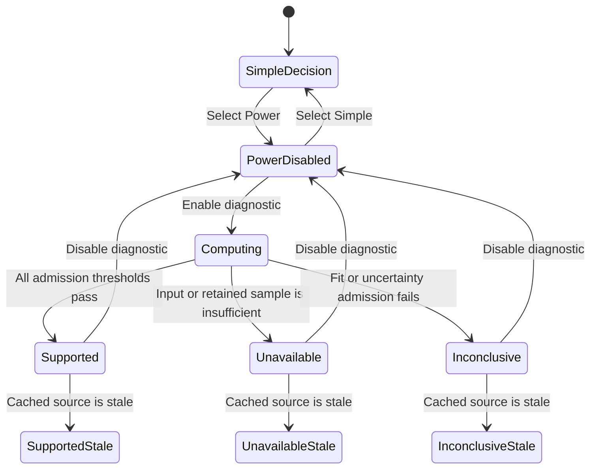
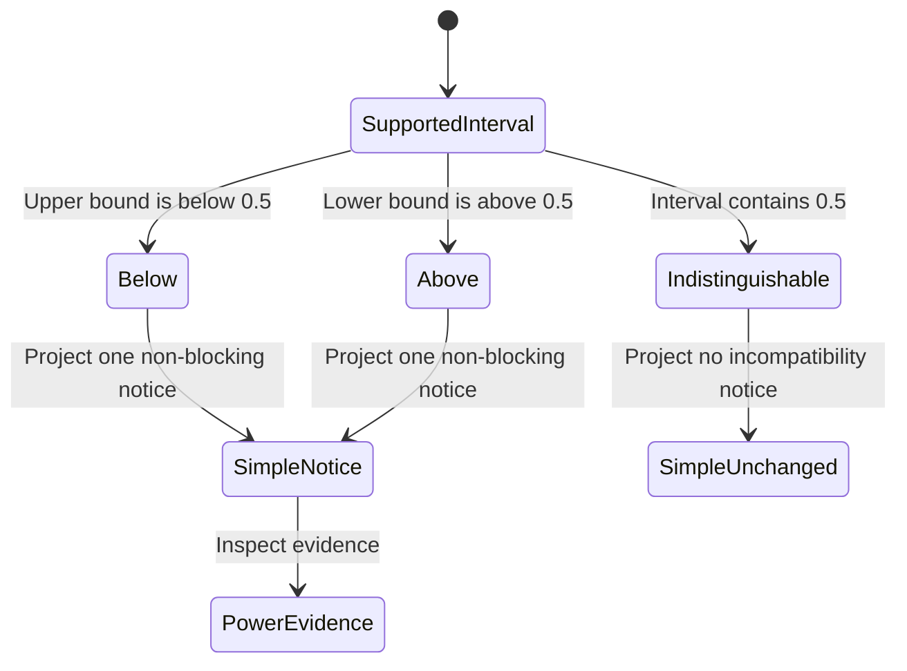
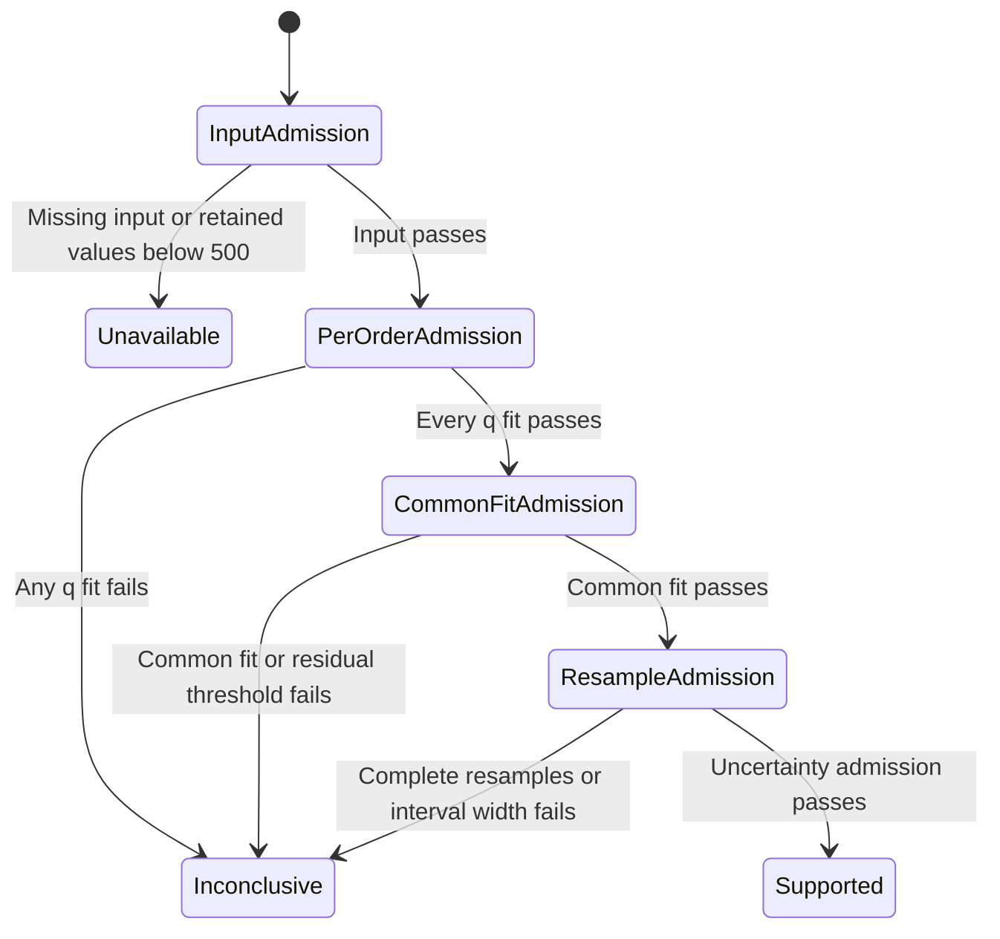
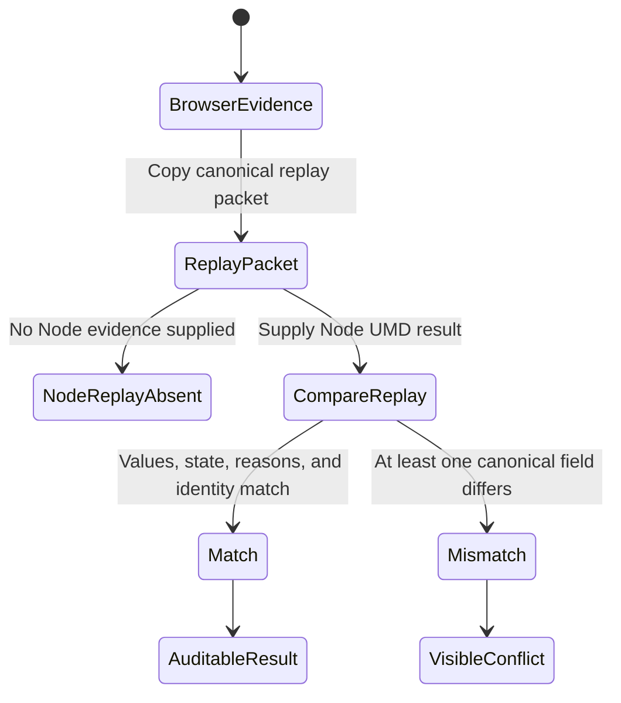

# Feature 028: Volatility Roughness and Model-Assumption Diagnostic

**Status:** Requirements defined. Not implemented or certified.
**Owner of this document:** `bubbles.analyst`.
**Extends:** Feature 011, Volatility Regime and Sizing Lab.
**Delivery posture:** Operator-prioritized A14 work may proceed. Feature 028 remains optional, non-gating, and outside the improvement-plan exit criteria.

---

## Problem Statement

Feature 011 gives the researcher realized-volatility estimates, forecasts, persistence, regime, conflicts, and volatility-scaled sizing. It does not test whether the observed volatility path is consistent with the smoothness assumption commonly represented by a Hurst exponent $H$.

The missing evidence matters because a forecast can be numerically well formed while its model assumptions fit the observed path poorly. The product needs a diagnostic that asks a narrow question: how do increments of observed log volatility scale across time lags and moment orders? The answer must help a researcher challenge assumptions. It must not become an automatic model selector or trading control.

This feature adds that evidence to the existing Power view. It adds no top-level tool, route, provider, or data source. It does not reopen or modify the certified artifacts of Feature 011.

## Relationship to Feature 011

Feature 011 is the sole technical dependency. It remains the owner of volatility forecasts, regimes, persistence, half-life, sizing, conflicts, decision identity, and published tool reads. Feature 028 builds additively on that delivered foundation. Feature 028 owns the new structure functions, scaling exponents, Hurst evidence, admission policy, and diagnostic projection.

The certified files under `specs/011-volatility-regime-and-sizing-lab/` remain unchanged. A later implementation may change the existing runtime surfaces owned by Feature 011. It must preserve every Feature 011 output when the diagnostic is disabled. It must not reinterpret Feature 011 certification.

Feature 028 embeds one immutable diagnostic in an additive Feature 011 decision projection. The diagnostic has its own deterministic `diagnosticId`. The projection retains the unchanged Feature 011 `decisionId` as its base identity. The canonical diagnostic records that same value as `parentDecisionId`. Feature 028 does not create another formula or storage owner.

## Outcome Contract

**Intent:** A researcher can inspect whether cached realized-volatility history exhibits stable multi-scale roughness evidence before relying on a smooth-volatility assumption. The diagnostic reports what the sample supports, what it does not support, and why.

**Success Signal:** In Power mode, an enabled diagnostic presents the declared volatility proxy, retained sample, lag and moment grids, structure-function observations, estimated $\zeta(q)$ values, per-fit diagnostics, inferred $H$ with uncertainty when admissible, and an explicit relationship to $H=0.5$. The same input and settings always produce the same diagnostic identity and values. Insufficient or weak evidence withholds $H$ and names the failed admission conditions.

**Hard Constraints:**

1. The diagnostic is optional and disabled until the researcher enables it.
2. It reuses the daily close history already available to the volatility workspace. It never triggers a second fetch.
3. It is evidence about a model assumption. It never changes forecasts, sizing, direction, signals, or execution.
4. Detailed evidence belongs in Power mode. Simple remains decision-first and retains the Feature 011 verdict.
5. Any compact conflict shown outside the detailed panel is derived from the same diagnostic decision.
6. Missing, stale, invalid, or insufficient data remains visibly distinct from a supported conclusion.
7. Every displayed value carries source, as-of, freshness, sample, method, and uncertainty context appropriate to the claim.
8. Browser and Node consumers receive the same formula result from the existing UMD owner.
9. Feature 028 adds no direct-file-origin incompatibility. Under `file://`, it preserves Feature 011's exact configuration-unavailable outcome instead of claiming restored operation.
10. Advanced rough-volatility pricing, calibration, simulation, and trading application remain outside Research Lab and belong to QuantitativeFinance.

**Failure Condition:** The feature fails if it emits a confident roughness label from an inadmissible fit, hides uncertainty or excluded observations, fetches data already present in the shared cache, creates a second formula owner, changes a Feature 011 forecast or sizing output, presents $H$ as a trading signal, or implies that an empirical scaling estimate validates a particular pricing model.

## Exposure Contract

| Capability | Surface class | Surface id | Status | Plan |
| --- | --- | --- | --- | --- |
| Enable or disable the diagnostic | uiRoute | `volatility-sizing-lab.html` Power mode | planned | Feature 028 implementation |
| Inspect structure functions and scaling fits | uiRoute | `volatility-sizing-lab.html` Power mode | planned | Feature 028 implementation |
| Consume the deterministic diagnostic result | internal | `RLVOL` UMD API | planned | Feature 028 implementation; additive child of the Feature 011 decision and consumed by the volatility workspace |
| Reuse cached daily close history | internal | `RLDATA.ensureBars()` and existing volatility hydration | delivered | Existing in-repo volatility workspace caller |
| Publish a compact model-assumption conflict | internal | Existing Feature 011 conflict projection | planned | Feature 028 implementation; consumed by Simple and Power rendering |

No new root page or tool-registry row is permitted.

## Current Capability Map

| Capability | Current owner | Current state | Feature 028 consequence |
| --- | --- | --- | --- |
| Daily close hydration and cache reuse | `rldata.js` and the volatility workspace | Delivered | Reuse only. No new provider call. |
| Realized volatility and forecast models | `rlvol.js` | Delivered | Use the existing path as input. Do not replace it. |
| Forecast, regime, persistence, and sizing decision | `RLVOL.buildVolDecisionRead()` | Delivered | Preserve all outputs. Add diagnostic evidence only. |
| Simple and Power views | `volatility-sizing-lab.html` | Delivered | Detailed diagnostic is Power-only. Both views share one decision. |
| Conflict rendering | `volatility-sizing-lab.html` | Delivered | Add at most one non-blocking model-assumption conflict derived from the diagnostic. |
| Tool registration | `tools.json` | Delivered | Keep the existing tool entry. Add no tool. |
| Roughness, structure functions, $\zeta(q)$, or inferred $H$ | None found in Research Lab | Missing | Feature 028 defines this capability. |

## Honest Findings

1. Research Lab has sufficient cached daily close history and an existing Power diagnostic surface. A new provider or top-level tool would duplicate existing capability.
2. No Research Lab implementation currently computes roughness, structure functions, $\zeta(q)$, or a Hurst estimate. Any delivered claim must therefore remain `planned` until implementation and test evidence exist.
3. A rolling realized-volatility proxy is not latent instantaneous variance. The UI must use the term **observed log-volatility proxy** and must not claim direct observation of a stochastic-volatility process.
4. A scaling fit can support or challenge a smoothness assumption. It cannot, by itself, validate rough Heston, rough Bergomi, or any other pricing model.
5. Overlapping rolling windows create dependence between observations. Uncertainty must use a block-aware method rather than an independent-observation formula.
6. Feature 011 is certified. This feature must extend its runtime without changing its certified artifacts or its established decision outputs.
7. A04, A06, A09, and A11 remain unresolved improvement-plan work. They do not gate Feature 028 pickup or invalidate its planning. Feature 013 does not own structure functions, scaling exponents, or Hurst evidence. Feature 020 does not own Feature 028's additive `RLVOL` diagnostic projection.
8. Feature 011 promises operational `file://` support, but its current route reaches configuration-unavailable under direct file origin. Feature 028 inherits that conflict. This specification does not waive P10 or claim to repair Feature 011. Restoring operational file-origin behavior requires a separate owner decision and versioned feature contract.

## Product Principle Alignment

| Principle | Application |
| --- | --- |
| P1, Every displayed figure carries provenance | Every estimate and fit names the source series, as-of date, freshness, proxy construction, sample count, and settings. |
| P2, Missing data renders as missing | Invalid or insufficient evidence yields `unavailable` or `inconclusive`, never zero or a plausible estimate. |
| P3, Confidence is evidence quality, never a win probability | Confidence describes fit stability and uncertainty only. |
| P5, A rate is withheld below its minimum sample | $H$ is withheld unless every admission threshold passes. |
| P6, Say when the read is old | The diagnostic inherits and displays the source freshness state. |
| P7, No blackbox numbers | Structure functions, grids, fit statistics, uncertainty, and exclusions are inspectable. |
| P9, Works with nothing | Cached and committed data remain useful without provider access. |
| P10, UMD, never ESM | The formula owner remains browser and Node compatible. Feature 028 adds no file-origin regression, but inherits Feature 011's configuration-unavailable direct-file outcome. P10 remains binding. Restoring operational `file://` behavior requires a separate owner decision and feature. |
| P11, Reuse, never refetch | The diagnostic consumes the existing hydrated bars. |
| P12, Cache-first, automatic first paint | Existing content paints first. Enabling the diagnostic computes locally from the cached path. |
| P14, Simple is the default, Power is the drill-down | Detailed roughness evidence is Power-only. Simple retains the existing decision-first view. |
| P15, Everything is explained in place | Every term and current value explains both meaning and implication. |
| P18, Wired or not shipped | The formula result must have the existing workspace as a production consumer. |
| P19, One definition per concept | Roughness computation and admission policy have one owner in `RLVOL`. |
| P20, Every claim is scoreable | The result exposes thresholds and diagnostics that can be tested exactly. |
| P22, Budgets are assertions | Sample, fit, and runtime budgets require failing boundary tests. |
| P25, Specs are capped, and never block on status | This specification uses 40 functional requirements and four proposed work packages. Sequencing names capabilities, not status gates. |

This feature describes planned behavior. It does not claim that the diagnostic is currently delivered.

## Domain Capability Model

The capability-first doctrine applies because one diagnostic result must serve formula, decision, conflict, UI, and Node consumers without separate definitions.

### Domain Primitives

| Primitive | Definition |
| --- | --- |
| Source close series | Ordered daily close observations with source, as-of, and freshness metadata. |
| Volatility proxy observation | Annualized rolling realized volatility computed from a complete ten-return window. |
| Observed log-volatility path | Natural logarithm of finite, strictly positive proxy observations. |
| Lag | Separation in trading days between two log-volatility observations. |
| Moment order $q$ | Positive exponent applied to the absolute log-volatility increment. |
| Structure function $S_q(\Delta)$ | Mean of $|x_{t+\Delta}-x_t|^q$ over admissible pairs at lag $\Delta$. |
| Scaling exponent $\zeta(q)$ | Slope of $\log S_q(\Delta)$ against $\log \Delta$ across admitted lags. |
| Roughness estimate $H$ | Admitted common slope in the relationship $\zeta(q)=qH$. |
| Fit evidence | Counts, coefficients, residuals, $R^2$, standard errors, and uncertainty intervals used to admit or withhold a conclusion. |
| Page evaluation state | UI projection state before or around canonical evaluation: `disabled`, `computing`, or a projection of a canonical result. |
| RoughnessDiagnostic | Immutable canonical result whose state is exactly one of `unavailable`, `inconclusive`, or `supported`. |
| Model-assumption conflict | Non-blocking notice that admitted evidence is inconsistent with $H=0.5$. |

### Lifecycle

`disabled` is a page evaluation and projection state. It means no canonical diagnostic has been requested. After enablement, the page may enter `computing`. A canonical `RoughnessDiagnostic` exists only as `unavailable`, `inconclusive`, or `supported`. A supported result may be `below-0.5`, `indistinguishable-from-0.5`, or `above-0.5` according to its uncertainty interval. Any input or setting change invalidates the prior `diagnosticId` and recomputes the whole diagnostic.

### Relationships and Policies

- One source series produces one proxy path for one declared rolling window.
- Every admitted moment order uses the same retained proxy path and lag grid.
- Every $\zeta(q)$ estimate retains its own fit evidence.
- One $H$ estimate may exist only when all per-order fits and the cross-order fit pass admission.
- A conflict may exist only for a supported result whose uncertainty interval excludes $0.5$.
- Each canonical diagnostic carries its own `diagnosticId` and the unchanged Feature 011 `decisionId` as `parentDecisionId`.
- A projected model-assumption conflict uses `blocking: false` and `kind: "model-assumption"`. It may carry `diagnosticId` and `deepLink`. It has no severity field.
- A diagnostic never mutates its input, the Feature 011 decision, or historical records.

## Actors and Personas

| Actor | Description | Key goals | Permissions | Evidence basis |
| --- | --- | --- | --- | --- |
| Researcher | Uses the volatility workspace to assess uncertainty and position risk. | Challenge model assumptions and understand whether evidence is sufficient. | May enable and inspect the fixed diagnostic contract. Cannot cause trades. | Existing Simple/Power volatility workflow in `volatility-sizing-lab.html` and Feature 011 researcher scenarios. |
| Reviewer | Audits a published research read or reproduces it in Node. | Recompute the same result and inspect every admission decision. | Read-only formula and evidence access. | Existing browser/Node UMD ownership in `rlvol.js` and Feature 011 reproducibility contract. |
| Brief consumer | Sees the compact Feature 011 read rather than the full Power panel. | Know when a material model-assumption conflict exists without receiving a false signal. | Read-only. | Existing conflict and tool-read projection in `volatility-sizing-lab.html`. |

## Use Cases

### UC-028-001: Inspect supported roughness evidence

- **Actor:** Researcher.
- **Preconditions:** Power mode is active, the diagnostic is enabled, and cached daily closes satisfy admission thresholds.
- **Main flow:**
  1. The researcher opens the diagnostic.
  2. The workspace shows proxy construction, retained sample, moment orders, and lag grid.
  3. The researcher inspects each structure-function fit and $\zeta(q)$ estimate.
  4. The workspace shows an admitted $H$ interval and its relationship to $0.5$.
- **Postconditions:** The researcher can state what the sample supports and reproduce the read.

### UC-028-002: Understand why an estimate is withheld

- **Actor:** Researcher.
- **Preconditions:** The diagnostic is enabled but one or more admission conditions fail.
- **Main flow:**
  1. The workspace retains all valid intermediate evidence.
  2. It identifies each failed threshold.
  3. It withholds the point estimate and classification.
  4. It distinguishes unavailable input from inconclusive fit evidence.
- **Postconditions:** No unsupported $H$ enters the research read.

### UC-028-003: Reproduce the result

- **Actor:** Reviewer.
- **Preconditions:** The reviewer has the same ordered closes, metadata, and settings.
- **Main flow:**
  1. The reviewer invokes the UMD formula owner.
  2. The result exposes canonical settings and deterministic identity.
  3. The reviewer compares values and admission reasons with the browser result.
- **Postconditions:** Browser and Node results match.

### UC-028-004: Preserve the established volatility decision

- **Actor:** Brief consumer.
- **Preconditions:** Feature 011 already produces a forecast, regime, and sizing decision.
- **Main flow:**
  1. The diagnostic is toggled off and on against unchanged inputs.
  2. Existing forecast, regime, persistence, sizing, and direction fields remain identical.
  3. If supported evidence excludes $0.5$, a separate non-blocking conflict may appear.
- **Postconditions:** New evidence is visible without changing the established decision.

## Business Scenarios

### SCN-028-001: Supported multi-q scaling

**Given** at least 500 valid log-volatility proxy observations and admissible fits for every declared moment order
**When** the researcher enables the diagnostic
**Then** the workspace presents $\zeta(q)$ for each order, an admitted $H$ interval, fit evidence, and the relationship to $0.5$.

### SCN-028-002: Diagnostic remains opt-in

**Given** the researcher has not enabled the diagnostic
**When** the volatility workspace loads
**Then** the existing Feature 011 view and decision appear without roughness computation or new provider activity.

### SCN-028-003: Insufficient retained observations

**Given** fewer than 500 valid log-volatility observations remain after exclusions
**When** the diagnostic evaluates the sample
**Then** it reports `unavailable`, displays the retained and required counts, and emits no $H$.

### SCN-028-004: Invalid volatility proxy values

**Given** one or more rolling windows produce zero, negative, or non-finite volatility
**When** the log-volatility path is constructed
**Then** those observations are excluded, exclusion counts and reasons are shown, and sufficiency is reassessed on the retained sample.

### SCN-028-005: Per-order fit is weak

**Given** one declared moment order has fewer than five admitted lags, non-positive slope, or $R^2<0.90$
**When** fit admission runs
**Then** the diagnostic is `inconclusive`, preserves intermediate results, and withholds $H$.

### SCN-028-006: Cross-order scaling is weak

**Given** every per-order fit passes but the relationship $\zeta(q)=qH$ has $R^2<0.95$ or excessive residual deviation
**When** cross-order admission runs
**Then** the diagnostic is `inconclusive` and does not describe the path with one common $H$.

### SCN-028-007: Uncertainty is too wide

**Given** fit admission passes but the 95% interval width for $H$ exceeds $0.25$
**When** conclusion admission runs
**Then** the point estimate is withheld and the interval-width failure is explained.

### SCN-028-008: Evidence lies below the smooth benchmark

**Given** a supported 95% interval for $H$ has an upper bound below $0.5$
**When** the result is classified
**Then** it is labelled `below-0.5` and may emit one non-blocking model-assumption conflict.

### SCN-028-009: Evidence does not distinguish the benchmark

**Given** a supported 95% interval for $H$ contains $0.5$
**When** the result is classified
**Then** it is labelled `indistinguishable-from-0.5` and emits no incompatibility conflict.

### SCN-028-010: Evidence lies above the benchmark

**Given** a supported 95% interval for $H$ has a lower bound above $0.5$
**When** the result is classified
**Then** it is labelled `above-0.5` without being interpreted as a bullish, bearish, long, or short signal.

### SCN-028-011: Stale cached source

**Given** cached closes are usable but stale under the shared-data contract
**When** the diagnostic renders
**Then** it computes from the cached path, labels the result stale, and does not call a second provider.

### SCN-028-012: Browser and Node parity

**Given** identical ordered observations and settings
**When** the diagnostic runs in the browser and Node UMD consumers
**Then** canonical values, state, reasons, `diagnosticId`, and Feature 011 parent identity are identical.

### SCN-028-013: Existing decision invariance

**Given** unchanged Feature 011 inputs
**When** the diagnostic changes between disabled, unavailable, inconclusive, and supported states
**Then** forecast, regime, persistence, half-life, sizing, direction, signal, execution outputs, and base `decisionId` do not change.

### SCN-028-014: Accessible evidence

**Given** a keyboard-only or screen-reader user opens Power mode
**When** the diagnostic is inspected
**Then** controls, classifications, charts, equations, and current-value implications are available without relying on color or pointer hover.

## UI Scenario Matrix

| Scenario | Actor | Entry point | Steps | Expected outcome | Screen |
| --- | --- | --- | --- | --- | --- |
| Enable supported diagnostic | Researcher | Existing volatility workspace | Select Power, enable diagnostic, inspect summary and fits | Supported result with complete provenance and uncertainty | Power diagnostic panel |
| Inspect withheld result | Researcher | Existing volatility workspace | Enable against insufficient or weak evidence | Named `unavailable` or `inconclusive` state with failed thresholds | Power diagnostic panel |
| Compare with $0.5$ | Researcher | Supported result | Read interval and benchmark classification | Below, indistinguishable, or above stated without signal language | Power diagnostic panel |
| Review detailed fit without a chart | Reviewer | Power diagnostic panel | Navigate table and explanatory text by keyboard | Same values and implications available without canvas | Power fallback table and text |
| See compact conflict | Brief consumer | Existing volatility summary | Read a supported incompatibility notice | Non-blocking conflict names evidence and deep-links to detail | Existing conflict surface |
| Preserve default experience | Researcher | Existing volatility workspace | Do not enable diagnostic | Feature 011 first paint and decision remain unchanged | Simple and Power |

## Functional Requirements

### Input and Proxy Contract

- **FR-028-001:** The diagnostic MUST be disabled by default and MUST require explicit researcher enablement.
- **FR-028-002:** The diagnostic MUST consume the ordered daily close series already hydrated for the active volatility asset.
- **FR-028-003:** Enabling the diagnostic MUST NOT initiate an additional provider request for data already held by the shared cache.
- **FR-028-004:** The diagnostic MUST preserve source, as-of date, freshness state, symbol, interval, and observation count from the input series.
- **FR-028-005:** The observed volatility proxy MUST be ten-return rolling realized volatility, computed only from complete windows of finite log returns.
- **FR-028-006:** The proxy MUST be annualized with the declared 252-trading-day convention and labelled as a rolling realized-volatility proxy rather than latent variance.
- **FR-028-007:** Only finite, strictly positive proxy observations MAY enter the natural-log transformation.
- **FR-028-008:** Excluded observations MUST be counted by reason and MUST remain visible in the diagnostic evidence.

### Structure-Function Contract

- **FR-028-009:** The declared moment-order grid MUST be $q\in\{0.5,1.0,1.5,2.0\}$.
- **FR-028-010:** The declared lag grid MUST be $\Delta\in\{1,2,4,8,16,32\}$ trading days.
- **FR-028-011:** For each admitted pair $(q,\Delta)$, the diagnostic MUST compute $S_q(\Delta)=\operatorname{mean}(|x_{t+\Delta}-x_t|^q)$ over all finite admissible pairs.
- **FR-028-012:** A structure-function point MUST be invalid when its pair count is below 400 or its mean is non-finite or non-positive.
- **FR-028-013:** Each structure-function point MUST expose $q$, lag, value, pair count, and validity reason.
- **FR-028-014:** The diagnostic MUST estimate $\zeta(q)$ as the ordinary least-squares slope of $\log S_q(\Delta)$ on $\log\Delta$ over admitted lags.
- **FR-028-015:** Every per-order fit MUST expose slope, intercept, $R^2$, slope standard error, admitted lag count, residuals, and lag range.
- **FR-028-016:** A per-order fit MUST be admissible only with at least five valid lags, a positive finite slope, and $R^2\ge0.90$.

### Roughness and Uncertainty Contract

- **FR-028-017:** The diagnostic MUST require at least 500 retained observed log-volatility values before any $H$ conclusion is eligible.
- **FR-028-018:** The diagnostic MUST fit $\zeta(q)=qH$ through the origin across all four declared moment orders only after every per-order fit is admissible.
- **FR-028-019:** The common-$H$ fit MUST expose $H$, $R^2$, each cross-order residual, and the maximum absolute residual.
- **FR-028-020:** The common-$H$ fit MUST be admissible only when $R^2\ge0.95$ and the maximum absolute residual is at most $0.10$.
- **FR-028-021:** Uncertainty MUST use a deterministic moving-block resampling method that preserves local dependence in the observed log-volatility path.
- **FR-028-022:** The declared uncertainty policy MUST use block length 10, 500 resamples, and the 2.5th and 97.5th percentiles as the 95% interval.
- **FR-028-023:** The resampling sequence MUST be derived deterministically from the canonical input and settings identity, not from ambient randomness or wall-clock time.
- **FR-028-024:** An $H$ conclusion MUST be withheld when fewer than 450 resamples produce admissible complete fits.
- **FR-028-025:** An $H$ conclusion MUST be withheld when the 95% interval width exceeds $0.25$.
- **FR-028-026:** A supported result MUST be classified as `below-0.5` only when the interval upper bound is below $0.5$.
- **FR-028-027:** A supported result MUST be classified as `above-0.5` only when the interval lower bound is above $0.5$.
- **FR-028-028:** A supported result MUST be classified as `indistinguishable-from-0.5` when the interval contains $0.5$.

### Decision, Honesty, and Presentation Contract

- **FR-028-029:** `disabled` MUST be a page evaluation and projection state with no canonical `RoughnessDiagnostic`; every canonical diagnostic state MUST be exactly one of `unavailable`, `inconclusive`, or `supported`, with machine-readable reasons.
- **FR-028-030:** `unavailable` MUST mean required input or minimum retained sample is absent; `inconclusive` MUST mean input exists but fit or uncertainty admission fails.
- **FR-028-031:** The Power view MUST show proxy construction, q grid, lag grid, structure-function values, per-order fits, common-$H$ fit, interval, classification, exclusions, and failed thresholds.
- **FR-028-032:** Every dynamic value MUST explain what it is and what its current value implies without presenting confidence as a probability of profit.
- **FR-028-033:** Any chart MUST have a keyboard-readable fallback table and textual interpretation containing the same evidence.
- **FR-028-034:** A supported classification whose interval excludes $0.5$ MAY add one conflict with `blocking: false` and `kind: "model-assumption"` to the existing conflict collection; it MUST NOT add a severity field.
- **FR-028-035:** The model-assumption conflict MUST name the observed proxy, $H$ interval, benchmark, as-of date, `diagnosticId`, and `deepLink` to the detailed Power evidence.
- **FR-028-036:** The diagnostic and conflict MUST NOT modify forecast, regime, persistence, half-life, sizing, direction, signal, or execution fields.
- **FR-028-037:** The diagnostic MUST NOT claim validation of a rough-volatility pricing model or recommend model replacement.
- **FR-028-038:** The immutable canonical diagnostic MUST have one formula owner in `RLVOL` and identical browser and Node UMD behavior.
- **FR-028-039:** The additive diagnostic projection MUST carry a deterministic `diagnosticId` derived from canonical input metadata, retained observations, and fixed settings, plus the unchanged Feature 011 `decisionId` as its base and parent identity.
- **FR-028-040:** Feature delivery MUST add no top-level HTML tool, `tools.json` entry, provider, backend, build step, account requirement, network-only dependency, or direct-file-origin incompatibility; under `file://`, it MUST preserve Feature 011's exact configuration-unavailable outcome without claiming operational support.

## Non-Functional Requirements

- **NFR-028-001, Determinism:** Identical ordered inputs and settings produce byte-equivalent canonical diagnostic values and identity in browser and Node.
- **NFR-028-002, Performance:** With 1,500 daily closes, initial diagnostic evaluation including 500 resamples completes within 750 ms on Node 20 under `ubuntu-latest`. Evidence records runner, Node version, platform, and architecture. A separate `system-chrome` run with two workers covers browser smoke and first paint. Neither planned check is current execution evidence.
- **NFR-028-003, Responsiveness:** Computation must not prevent the existing Feature 011 first paint. The disabled state adds no measurable provider or computation delay.
- **NFR-028-004, Accessibility:** Controls are keyboard operable, status changes are announced, color is never the sole carrier, and every visual has equivalent text or tabular evidence.
- **NFR-028-005, Compatibility:** Browser and Node retain the UMD contract. Feature 028 adds no incompatibility under direct file origin. It preserves Feature 011's exact configuration-unavailable `file://` outcome and does not claim restored operation. No ES module or bundler is introduced.
- **NFR-028-006, Data discipline:** No position size, cost basis, profit and loss, credential, or new personal data is persisted.
- **NFR-028-007, Contract stability:** New decision fields are additive. Existing Feature 011 fields and semantics remain unchanged.
- **NFR-028-008, Auditability:** Every admission threshold has tests immediately below, at, and above the boundary. The resampling method has a deterministic replay test.

## Market Position and Improvement Proposals

External competitor research is not required to define this internal model-assumption diagnostic. The relevant differentiation is product honesty: many volatility displays present one forecast without showing whether the observed path supports the model's smoothness premise. Feature 028 should expose that uncertainty without turning it into an automated signal.

### IP-028-001: Evidence-first smoothness check

- **Impact:** High.
- **Effort:** Medium.
- **Advantage:** Makes model-assumption risk visible and scoreable inside the existing decision workspace.
- **Actors:** Researcher and reviewer.
- **Evidence:** `rlvol.js` owns volatility formulas, while the current capability scan found no structure-function or $H$ diagnostic in Research Lab.

### IP-028-002: Deterministic browser and Node replay

- **Impact:** Medium.
- **Effort:** Medium.
- **Advantage:** Lets a reviewer reproduce the same estimate without a server, notebook, or hidden model process.
- **Actors:** Reviewer.
- **Evidence:** `rlvol.js` already exposes the browser/Node UMD seam and deterministic decision identity used by Feature 011.

### IP-028-003: Non-blocking contradiction evidence

- **Impact:** Medium.
- **Effort:** Small.
- **Advantage:** Surfaces material disagreement with $H=0.5$ while preserving the established forecast and sizing decision.
- **Actors:** Researcher and brief consumer.
- **Evidence:** `volatility-sizing-lab.html` already renders conflicts from the shared volatility decision in Simple and Power views.

## Proposed Work Packages for Planning

These are capability boundaries for `bubbles.plan`, not approved scopes.

1. **WP-1, Formula and admission contract:** Add the immutable UMD diagnostic result, structure functions, scaling fits, uncertainty, and boundary tests to the existing formula owner.
2. **WP-2, Power evidence surface:** Add opt-in controls, detailed fit evidence, explanations, chart fallback, and accessible states to the existing volatility workspace.
3. **WP-3, Decision and conflict projection:** Add additive diagnostic fields and the non-blocking model-assumption conflict while proving Feature 011 output invariance.
4. **WP-4, Integration and compatibility proof:** Prove cache reuse, stale and unavailable behavior, browser/Node parity, exact direct-file configuration-unavailable parity, the Node reference budget, separate system-Chrome smoke, and unchanged tool registration.

No work package may include rough-volatility option pricing, parameter calibration, scenario simulation, portfolio construction, or execution logic.

## Sequencing and Dependencies

Feature 011 is Feature 028's sole technical dependency. Feature 028 owns the new scaling evidence and adds it to Feature 011's existing volatility decision without changing established outputs.

The operator prioritized A14 ahead of A04, A06, A09, and A11. Those actions remain unresolved release-order work, but none gates Feature 028 pickup. Their delivery does not invalidate Feature 028 planning or require a special revalidation cycle.

Feature 013 does not supply structure functions, $\zeta(q)$, or Hurst evidence. Feature 020 does not supply the additive `RLVOL` diagnostic projection. Shared-file changes still require ordinary compatibility review against current consumers. Feature 028 remains optional and is not an improvement-plan exit criterion.

## QuantitativeFinance Boundary

Research Lab owns an educational, empirical diagnostic over cached observed data. QuantitativeFinance owns any production-grade rough-volatility capability, including latent-process estimation, rough Heston or rough Bergomi pricing, Markovian lifts, joint SPX/VIX calibration, derivatives risk, simulation, portfolio sizing, trading signals, and execution.

A later cross-product handoff may carry provenance-rich empirical evidence. Feature 028 does not define, call, or certify a QuantitativeFinance API.

## Evidence Sources

- `specs/011-volatility-regime-and-sizing-lab/spec.md`: Feature 011 outcome, actors, decision, and volatility-workspace contract.
- `specs/011-volatility-regime-and-sizing-lab/design.md`: Existing formula ownership and runtime boundary.
- `specs/011-volatility-regime-and-sizing-lab/state.json`: Certified Feature 011 status.
- `rlvol.js`: Existing UMD formula and decision owner.
- `volatility-sizing-lab.html`: Existing Simple/Power, conflict, provenance, hydration, and publication surfaces.
- `rldata.js`: Shared cache-first bars and tool-read ownership.
- `tools.json`: Existing registered volatility tool.
- `docs/Product-Principles.md`: Binding product principles and spec-size cap.
- `docs/releases/improvement-plan/actions.md`: A14 priority, dependency ownership, and optional non-gating release posture.

## Resolved Decision Record

A14 decision 7 in the improvement-plan action ledger resolves the four former open questions and the file-origin boundary:

1. Embed one immutable diagnostic in the additive Feature 011 decision projection. Give it a deterministic `diagnosticId`. Retain the unchanged Feature 011 `decisionId` as the projection's base identity. Record that value as the diagnostic's `parentDecisionId`. The design owner retains responsibility for the final versioned representation.
2. Project any admitted incompatibility through the existing conflict collection with `blocking: false` and `kind: "model-assumption"`. The conflict may carry `diagnosticId` and `deepLink`. Do not invent a severity field.
3. Measure the binding 750 ms formula budget on Node 20 under `ubuntu-latest`. Record runner, Node, platform, and architecture facts. Run `system-chrome` with two workers as separate browser smoke and first-paint coverage.
4. Fix v1 grids at $q\in\{0.5,1.0,1.5,2.0\}$ and $\Delta\in\{1,2,4,8,16,32\}$. Grid configurability requires a later versioned contract and owner decision.
5. Promise no additional direct-file-origin regression. Preserve Feature 011's exact configuration-unavailable outcome under `file://`. Do not claim Feature 028 restores operational file-origin support.

The fifth decision exposes a known inherited conflict with binding Product Principle P10. This specification does not waive P10. Restoring operational direct-file behavior requires a separate owner decision and versioned feature contract.

## UI Wireframes

### UX Boundary

- Feature 028 extends the existing `volatility-sizing-lab.html` route. It adds no top-level tool, route, navigation item, or provider control.
- Simple remains the default decision-first view. Its Feature 011 forecast, regime, persistence, half-life, sizing, direction, signal, execution fields, provenance chips, and decision identity retain their established values and positions.
- Simple may show one concise, non-blocking model-assumption notice only when an admitted interval excludes $H=0.5$. It shows no roughness chart, grid, fit statistic, or second notice.
- Power owns the opt-in control and complete diagnostic evidence. The control is off on first paint and does not initiate provider activity.
- The q and lag grids are fixed evidence settings, not editable controls: $q\in\{0.5,1.0,1.5,2.0\}$ and $\Delta\in\{1,2,4,8,16,32\}$ trading days.
- A QuantitativeFinance link is an educational handoff to advanced research. It does not call, promise, or imply a QuantitativeFinance API.

### Screen Inventory

| Screen or state | Actor(s) | Status | Scenarios served |
| --- | --- | --- | --- |
| Existing Simple storm gauge, diagnostic disabled | Researcher, brief consumer | Existing, preserve | SCN-028-002, SCN-028-013 |
| Existing Simple storm gauge, one model-assumption notice | Researcher, brief consumer | Existing, additive notice | SCN-028-008, SCN-028-010, SCN-028-013 |
| Power model-assumption diagnostic, disabled | Researcher | Existing route, new panel state | SCN-028-002, SCN-028-013 |
| Power model-assumption diagnostic, computing | Researcher | Existing route, new panel state | SCN-028-001, SCN-028-014 |
| Power supported evidence | Researcher, reviewer | Existing route, new panel state | SCN-028-001, SCN-028-008, SCN-028-009, SCN-028-010, SCN-028-014 |
| Power unavailable evidence | Researcher, reviewer | Existing route, new panel state | SCN-028-003, SCN-028-004, SCN-028-013, SCN-028-014 |
| Power inconclusive evidence | Researcher, reviewer | Existing route, new panel state | SCN-028-005, SCN-028-006, SCN-028-007, SCN-028-013, SCN-028-014 |
| Power stale evidence | Researcher, reviewer | Existing route, new panel state | SCN-028-011, SCN-028-014 |
| Power browser and Node replay evidence | Reviewer | Existing route, new disclosure | SCN-028-012, SCN-028-013, SCN-028-014 |

### UI Primitives

| Primitive | Used by screens | Composition rule | Accessibility and responsive contract |
| --- | --- | --- | --- |
| Simple/Power view tabs | Existing Simple and Power views | Preserve the existing tab order and keyboard model. The diagnostic never creates a third mode. | Arrow keys switch tabs. Home selects Simple. End selects Power. Focus remains visible and moves only after a user action. |
| Diagnostic enable control | Power disabled, computing, and result states | One labelled switch or checkbox controls local diagnostic evaluation. Turning it off restores the disabled panel without changing Feature 011 output. | Use a native control with a persistent text label and description. Announce the new state without moving focus. On narrow screens, label and control stack. |
| Diagnostic state banner | Disabled, computing, supported, unavailable, inconclusive, stale | Reserve one stable banner region. Show one state term, one plain-language implication, and the evidence freshness. Never encode state by color alone. | Apply `role="status"` for non-urgent changes. Use text, icon, and border or pattern in addition to color. Do not repeatedly announce progress updates. |
| Model-assumption notice | Simple and existing Power conflict surface | Project at most one notice from the same admitted decision. It is non-blocking and cannot replace or reorder the Feature 011 verdict. | Prefix with “Model assumption”. Provide a keyboard-focusable “Inspect evidence” link to the Power panel. Do not use warning color as the only meaning. |
| Evidence key-value row | Power summary, thresholds, provenance, replay | Use one label/value/implication pattern for sample counts, fit quality, interval, identity, source, as-of, and freshness. | Labels remain programmatically associated with values. On mobile, values wrap beneath labels rather than truncating. |
| Threshold ledger | Power supported, unavailable, and inconclusive states | Show observed value, admission rule, and pass/fail/withheld text for every applicable threshold. A failed row never disappears. | Use real table headers and text statuses. Provide a linear card rendition below 480 px without changing reading order. |
| Evidence chart with fallback table | Structure-function and $\zeta(q)$ evidence | Each plot and its table share the same title, values, units, and interpretation. The table is always available and is not hidden behind hover. | Canvas has a concise accessible name and textual summary. Keyboard users reach the table directly. Pointer hover may add detail but never owns unique information. |
| Provenance ledger | Existing Power provenance and diagnostic evidence | Extend the existing provenance vocabulary with proxy construction, source, as-of, freshness, sample, grids, method, exclusions, and diagnostic identity. Do not create a second provenance dialog. | Rows use explicit headings. Long identities wrap and can be selected. Screen readers announce stale and unavailable qualifiers with the value. |
| Replay parity disclosure | Power replay evidence | Present canonical identity and settings first. Show browser and Node comparison only from supplied replay evidence. Absence reads “Node replay evidence not supplied”, never “matching”. | Disclosure is a native details pattern or button-controlled region with `aria-expanded`. Comparison tables have row and column headers. |
| Advanced-research handoff link | Power evidence footer | Link text names QuantitativeFinance advanced rough-volatility research and states that no pricing, calibration, or trading operation occurs here. | Link is reachable after the evidence and before the next card. External destination is announced in accessible text when applicable. |

### Shared Layout and Interaction Rules

1. Diagnostic content appears after the existing Power sizing evidence and before or within the existing provenance area. It does not interrupt the current Feature 011 reading order.
2. The panel reserves its heading, enable control, state banner, and summary footprint in every state. Disabled, computing, unavailable, inconclusive, supported, and stale transitions do not shift the Feature 011 cards.
3. Enabling, disabling, or changing presentation mode never changes the selected asset, estimator, forecast horizon, target volatility, notional, or history range.
4. A source or settings change invalidates the visible diagnostic identity. The panel enters computing before it publishes the replacement evidence.
5. Supported, unavailable, and inconclusive results retain valid intermediate evidence. A withheld $H$ renders as “Withheld”, never `0`, `--` without explanation, or a neutral classification.
6. Every current value has adjacent implication text. Confidence language describes fit and sample quality, never profit, direction, or forecast skill.
7. Desktop uses a two-column evidence region where space permits. Mobile uses one source-order column: state, $H$ summary, thresholds, structure functions, $\zeta(q)$ benchmark, exclusions, provenance, replay, handoff.
8. At 200% zoom and at 320 CSS px width, tables may scroll inside labelled containers. The page itself does not require horizontal scrolling.
9. Focus stays on the control that triggered recomputation. When evaluation completes, the polite status region announces the state and first failed threshold or admitted interval. Focus does not jump to the result.
10. Equations include a spoken text equivalent. Symbols such as $q$, $\Delta$, $\zeta(q)$, and $H$ are defined before their first evidence table.

### Screen: Existing Simple — Diagnostic Disabled or Non-Conflicting

**Actor:** Researcher, brief consumer | **Route:** `volatility-sizing-lab.html` Simple | **Status:** Existing, unchanged

```text
┌──────────────────────────────────────────────────────────────────────┐
│ Volatility Regime & Vol-Targeting Sizing Lab                         │
│ [Simple selected] [Power]  [Asset] [Estimator] [Term] [Target] ...  │
├──────────────────────────────────────────────────────────────────────┤
│ Storm gauge — [asset]                                                │
│                                                                      │
│ [Feature 011 forecast % ann.]       [Feature 011 regime percentile]  │
│ [forecast kind / estimator]         [Feature 011 regime label]       │
│                                                                      │
│ Sizing throttle: [Feature 011 multiplier or withheld reason]         │
│ Apply only if a separate signal fires.                               │
│ [existing provenance chips]                                         │
│ [existing Strategy Validation Lab link]                              │
│ decision [unchanged Feature 011 identity]                            │
│                                                                      │
│ No diagnostic notice when disabled, unavailable, inconclusive,      │
│ or supported but indistinguishable from H=0.5.                       │
└──────────────────────────────────────────────────────────────────────┘
```

**Interactions:**
- Power tab → opens the existing Power view → exposes the disabled diagnostic panel without computing it.
- Existing controls → retain their Feature 011 behavior → no diagnostic work occurs while disabled.

**States:**
- Empty or disabled: no roughness placeholder, notice, chart, or loading affordance appears in Simple.
- Loading: existing Feature 011 loading behavior remains authoritative; diagnostic computing is not surfaced here.
- Error: unavailable and inconclusive diagnostic states do not replace the Feature 011 verdict.

**Responsive:**
- Mobile: retain the existing single-column storm gauge and control order.
- Tablet and desktop: retain the existing headline and gauge placement.

**Accessibility:**
- Existing heading order, tab semantics, labels, live regions, and skip link remain intact.
- The absence of a notice conveys no claim that $H=0.5$ is supported.

### Screen: Existing Simple — One Non-Blocking Model-Assumption Notice

**Actor:** Researcher, brief consumer | **Route:** `volatility-sizing-lab.html` Simple | **Status:** Existing, additive notice only

```text
┌──────────────────────────────────────────────────────────────────────┐
│ Storm gauge — [asset]                                                │
│ [unchanged forecast]  [unchanged regime]  [unchanged sizing]         │
│ [existing provenance chips]  decision [unchanged identity]          │
├──────────────────────────────────────────────────────────────────────┤
│ ⓘ Model assumption — observed log-volatility proxy evidence places  │
│ H [below / above] 0.5; interval [lower, upper], as of [date].        │
│ This does not change the forecast or sizing. [Inspect evidence →]    │
└──────────────────────────────────────────────────────────────────────┘
```

**Interactions:**
- Inspect evidence → selects Power → moves focus to the diagnostic panel heading after the user-triggered navigation.
- Dismissal is not offered because hiding a current evidence conflict would make Simple and Power disagree.

**States:**
- Supported below or above: show exactly one notice derived from the admitted interval.
- Indistinguishable, disabled, unavailable, or inconclusive: remove the notice and retain the reserved card boundary only if needed to avoid layout movement.
- Stale supported evidence: append “stale cached evidence” to the same notice; do not create a second notice.

**Responsive:**
- Mobile: the implication and link wrap below the notice title in source order.
- Tablet and desktop: notice remains one compact row or card beneath the unchanged decision content.

**Accessibility:**
- Use text “below” or “above” and the numeric interval. An icon or color is supplementary.
- The notice is part of the reading order and is not an interruptive alert. The link has visible focus.

### Screen: Power Diagnostic — Disabled

**Actor:** Researcher | **Route:** `volatility-sizing-lab.html` Power, `#model-assumption-diagnostic` | **Status:** New panel state

```text
┌──────────────────────────────────────────────────────────────────────┐
│ Existing Feature 011 Power cards: identity, term structure,          │
│ persistence, estimator comparison, sizing                            │
├──────────────────────────────────────────────────────────────────────┤
│ Model-assumption diagnostic                         [Enable: off]     │
│ DISABLED — No roughness computation has run.                         │
│ Uses the already-hydrated daily close history; no second fetch.      │
│                                                                      │
│ What it checks: scaling of an observed log-volatility proxy across   │
│ fixed moment orders and trading-day lags.                            │
│ What it does not do: select a model, price an option, or change      │
│ forecast, sizing, direction, signal, or execution.                   │
│                                                                      │
│ Fixed evidence settings                                             │
│ q: 0.5, 1.0, 1.5, 2.0  │  lag Δ: 1, 2, 4, 8, 16, 32 days           │
└──────────────────────────────────────────────────────────────────────┘
```

**Interactions:**
- Enable control → starts local evaluation from the current cached history → retains focus on the control.
- Simple tab → returns to the unchanged decision-first view → leaves no diagnostic detail in Simple.

**States:**
- Empty: disabled is an explicit state, not missing content.
- Loading: begins only after explicit enablement.
- Error: none is implied while the control remains off.

**Responsive:**
- Mobile: fixed settings wrap into two labelled rows beneath the control.
- Tablet and desktop: title and control share a row; explanatory copy spans the card.

**Accessibility:**
- Native control exposes checked state, name, and descriptive help.
- “Disabled” and “no computation” are visible text and are announced once.

### Screen: Power Diagnostic — Computing

**Actor:** Researcher | **Route:** `volatility-sizing-lab.html` Power, `#model-assumption-diagnostic` | **Status:** New panel state

```text
┌──────────────────────────────────────────────────────────────────────┐
│ Model-assumption diagnostic                          [Enable: on]     │
│ COMPUTING — evaluating cached observed log-volatility proxy          │
│ [progress indicator] Current stage: [proxy / fits / resampling]      │
│                                                                      │
│ Source: [source id]  Symbol: [symbol]  As of: [date]  [fresh/stale]  │
│ Retained sample: [pending] of [source observations]                  │
│                                                                      │
│ ┌──────────────────────── reserved summary footprint ──────────────┐ │
│ │ H interval: Computing                                            │ │
│ │ Relationship to 0.5: Not classified                             │ │
│ └──────────────────────────────────────────────────────────────────┘ │
│ Existing Feature 011 cards remain visible and unchanged.            │
└──────────────────────────────────────────────────────────────────────┘
```

**Interactions:**
- Enable control off → cancels or discards presentation of the pending result → restores disabled state without changing Feature 011 output.
- Simple/Power tabs → change presentation only → do not trigger a second evaluation.

**States:**
- Loading: one stable progress region identifies the current broad stage without rapidly changing percentages.
- Empty: summary values read “Computing”, not zero.
- Error: evaluation failure transitions to unavailable or inconclusive with a named reason.

**Responsive:**
- Mobile: source facts and pending summary stack without changing card width.
- Tablet and desktop: source facts may form one wrapping row; the summary footprint stays fixed.

**Accessibility:**
- `aria-busy` applies to the diagnostic region only. Feature 011 remains readable.
- A polite announcement occurs at start and completion. The animation honors reduced-motion preferences.

### Screen: Power Diagnostic — Supported Below $H=0.5$

**Actor:** Researcher, reviewer | **Route:** `volatility-sizing-lab.html` Power, `#model-assumption-diagnostic` | **Status:** New panel state

```text
┌──────────────────────────────────────────────────────────────────────────┐
│ Model-assumption diagnostic                              [Enable: on]     │
│ SUPPORTED — evidence lies below H=0.5  [not a trading signal]            │
│ H [0.xxx]  95% interval [lower, upper]  width [value]  as of [date]      │
│ “The admitted interval is wholly below the smooth benchmark.”            │
├────────────────────────────────┬─────────────────────────────────────────┤
│ Structure functions            │ ζ(q) versus q and H benchmark          │
│ [log S_q(Δ) vs log Δ plot]      │ [ζ(q) points + line qH]                │
│ [text interpretation]          │ [text interpretation]                  │
│                                │                                         │
│ Table:                         │ Table:                                  │
│ q │ Δ │ S_q │ pairs │ status  │ q │ ζ(q) │ qH │ residual │ fit status │
│ .5│ 1 │ [...]│ [...] │ valid  │.5 │ [...] │[..]│ [...]    │ admitted   │
│ .. fixed q/lag grid ...        │.. all four q orders ...                │
├────────────────────────────────┴─────────────────────────────────────────┤
│ Admission thresholds                                                     │
│ Retained sample [n] / ≥500 [PASS] │ valid lags per q [n] / ≥5 [PASS]    │
│ Per-q slope >0 [PASS] │ per-q R² [value] / ≥0.90 [PASS]                 │
│ Common-H R² [value] / ≥0.95 [PASS] │ max residual [v] / ≤0.10 [PASS]    │
│ Admissible resamples [n] / ≥450 [PASS] │ interval width [v] / ≤0.25     │
├──────────────────────────────────────────────────────────────────────────┤
│ Exclusions: [count by zero / negative / non-finite / incomplete window]  │
│ Provenance: [source] [symbol] [daily] [as-of] [freshness] [252 convention]│
│ Proxy: ten-return rolling realized volatility; observed proxy, not       │
│ latent variance.  Diagnostic identity: [deterministic id]                │
│ [Replay and browser/Node parity ▸]                                       │
│ [Open QuantitativeFinance advanced rough-volatility research →]          │
│ Informational handoff only; no Research Lab API call or trading action.   │
└──────────────────────────────────────────────────────────────────────────┘
```

**Interactions:**
- Chart point or row focus → exposes q, lag, value, pair count, and implication → table remains the canonical non-pointer path.
- Threshold row → reveals the rule explanation → does not alter the calculation.
- Replay disclosure → opens canonical settings, identity, and parity evidence.
- QuantitativeFinance handoff → opens the configured advanced-research destination → performs no calculation or API operation in Research Lab.

**States:**
- Supported below: interval upper bound is below $0.5$; one non-blocking model-assumption notice may project to Simple.
- Loading: prior evidence is marked invalid before the computing state appears.
- Error: no supported label remains if an admission row fails.

**Responsive:**
- Mobile: plots and tables stack in source order; each table scrolls within its labelled container.
- Tablet: evidence columns stack when either chart would fall below a legible width. Desktop uses two columns.

**Accessibility:**
- “Below”, numeric bounds, and implication text carry the meaning without color.
- Plot summaries and complete fallback tables expose identical values. Focus order follows visual and source order.

### Screen: Power Diagnostic — Supported, Indistinguishable from $H=0.5$

**Actor:** Researcher, reviewer | **Route:** `volatility-sizing-lab.html` Power, `#model-assumption-diagnostic` | **Status:** New panel state

```text
┌──────────────────────────────────────────────────────────────────────┐
│ Model-assumption diagnostic                          [Enable: on]     │
│ SUPPORTED — evidence does not distinguish H from 0.5                 │
│ H [0.xxx]  95% interval [lower ≤ 0.5 ≤ upper]  width [value]         │
│ “The interval contains 0.5. This is not proof that H equals 0.5.”    │
├──────────────────────────────────────────────────────────────────────┤
│ [same complete structure-function plot and fallback table]           │
│ [same ζ(q)-versus-q benchmark plot and fallback table]               │
│ [same thresholds, exclusions, provenance, replay, and handoff]       │
│ Simple: no model-assumption incompatibility notice.                  │
└──────────────────────────────────────────────────────────────────────┘
```

**Interactions:**
- Evidence, threshold, replay, and handoff interactions match the supported-below state.
- Inspect Simple → shows unchanged Feature 011 output and no incompatibility notice.

**States:**
- Supported indistinguishable: interval contains $0.5$ and all admission rows pass.
- Empty or error: never replace “indistinguishable” with “equal”, “validated”, or “smooth”.
- Stale: retain classification with a stale qualifier when cached input remains usable.

**Responsive:**
- Mobile: summary precedes stacked evidence and tables.
- Tablet and desktop: preserve the shared supported-result layout footprint.

**Accessibility:**
- The phrase “does not distinguish” and the bounds are announced together.
- Benchmark position is represented in the table and text, not only by a line or color.

### Screen: Power Diagnostic — Supported Above $H=0.5$

**Actor:** Researcher, reviewer | **Route:** `volatility-sizing-lab.html` Power, `#model-assumption-diagnostic` | **Status:** New panel state

```text
┌──────────────────────────────────────────────────────────────────────┐
│ Model-assumption diagnostic                          [Enable: on]     │
│ SUPPORTED — evidence lies above H=0.5  [not bullish or bearish]      │
│ H [0.xxx]  95% interval [lower, upper]  width [value]                │
│ “The admitted interval is wholly above the benchmark. This does     │
│ not imply long, short, buy, sell, or model-selection action.”        │
├──────────────────────────────────────────────────────────────────────┤
│ [same complete structure functions, ζ(q) benchmark, thresholds,     │
│ exclusions, provenance, replay evidence, and advanced-research link]│
│ Simple: at most one non-blocking model-assumption notice.            │
└──────────────────────────────────────────────────────────────────────┘
```

**Interactions:**
- Evidence, threshold, replay, and handoff interactions match the supported-below state.
- Inspect evidence from Simple → returns to this panel and its heading.

**States:**
- Supported above: interval lower bound is above $0.5$ and all admission rows pass.
- Loading: no prior above classification remains attached to a new identity.
- Error: a failed threshold withholds the classification.

**Responsive:**
- Mobile: caution text wraps directly below the interval.
- Tablet and desktop: preserve the shared supported-result layout footprint.

**Accessibility:**
- “Above” and “not bullish or bearish” are explicit text.
- No upward arrow, green treatment, or other visual convention may imply a directional recommendation.

### Screen: Power Diagnostic — Unavailable

**Actor:** Researcher, reviewer | **Route:** `volatility-sizing-lab.html` Power, `#model-assumption-diagnostic` | **Status:** New panel state

```text
┌──────────────────────────────────────────────────────────────────────┐
│ Model-assumption diagnostic                          [Enable: on]     │
│ UNAVAILABLE — retained sample does not meet the input requirement    │
│ H: Withheld  │  Relationship to 0.5: Not classified                 │
├──────────────────────────────────────────────────────────────────────┤
│ Retained observed log-volatility values: [n]                         │
│ Required: 500                                      [FAIL: n < 500]   │
│ Source observations: [n]  Complete proxy windows: [n]                │
│                                                                      │
│ Exclusions                                                           │
│ [count] incomplete ten-return windows                                │
│ [count] zero volatility  [count] negative  [count] non-finite        │
│                                                                      │
│ Valid intermediate evidence                                         │
│ q │ Δ │ S_q │ pairs │ valid / excluded reason                       │
│ [rows that can be computed; no invented zero values]                 │
│                                                                      │
│ Provenance: [source] [symbol] [as-of] [freshness] [settings id]      │
│ Existing Feature 011 forecast and sizing: UNCHANGED                  │
└──────────────────────────────────────────────────────────────────────┘
```

**Interactions:**
- Exclusion reason → expands plain-language definition → preserves counts and thresholds.
- Enable control off → returns to disabled → does not clear or alter Feature 011 output.

**States:**
- Insufficient retained sample or missing required input: unavailable.
- Invalid proxy observations: show each exclusion reason and reassess against 500 retained values.
- Empty: $H$ reads “Withheld” with the failed admission rule.

**Responsive:**
- Mobile: counts become labelled rows; the evidence table scrolls inside its region.
- Tablet and desktop: sample and exclusion facts may use two columns without reordering headings.

**Accessibility:**
- “Unavailable”, retained count, required count, and reason are announced together.
- Failure text and table statuses do not rely on red, icons, or chart absence.

### Screen: Power Diagnostic — Inconclusive

**Actor:** Researcher, reviewer | **Route:** `volatility-sizing-lab.html` Power, `#model-assumption-diagnostic` | **Status:** New panel state

```text
┌────────────────────────────────────────────────────────────────────────┐
│ Model-assumption diagnostic                            [Enable: on]     │
│ INCONCLUSIVE — input exists, but evidence admission failed             │
│ H: Withheld  │  Relationship to 0.5: Not classified                   │
├────────────────────────────────────────────────────────────────────────┤
│ Failed thresholds                                                       │
│ [q=...] valid lags [n] / ≥5                 [FAIL, if applicable]       │
│ [q=...] slope [value] / >0                   [FAIL, if applicable]       │
│ [q=...] R² [value] / ≥0.90                   [FAIL, if applicable]       │
│ Common-H R² [value] / ≥0.95                  [FAIL, if applicable]       │
│ Max cross-order residual [value] / ≤0.10     [FAIL, if applicable]       │
│ Admissible resamples [n] / ≥450              [FAIL, if applicable]       │
│ 95% interval width [value] / ≤0.25           [FAIL, if applicable]       │
├────────────────────────────────────────────────────────────────────────┤
│ Preserved intermediate evidence                                        │
│ [structure-function plot + complete fallback table]                     │
│ [ζ(q)-versus-q plot + complete fallback table where available]          │
│ Per-q: q │ slope │ intercept │ R² │ SE │ lags │ range │ residuals       │
│ Common fit: H candidate │ R² │ residuals │ max residual │ withheld       │
│ Resampling: complete fits [n] of 500 │ interval [if defined]             │
│ [provenance, exclusions, deterministic identity, replay disclosure]     │
└────────────────────────────────────────────────────────────────────────┘
```

**Interactions:**
- Failed threshold row → reveals its implication and affected q or fit → does not hide passing rows.
- Plot/table navigation → exposes all valid intermediate values even though $H$ is withheld.

**States:**
- Weak per-order fit, weak cross-order fit, too few complete resamples, or interval wider than $0.25$: inconclusive.
- Multiple failures: show every failed row in one ledger, ordered from input through conclusion.
- Error: never collapse fit failure into unavailable when required input exists.

**Responsive:**
- Mobile: failed thresholds precede evidence; fit tables use labelled scroll containers.
- Tablet and desktop: failed thresholds and preserved evidence use the shared stable card grid.

**Accessibility:**
- The first failed threshold is included in the polite completion announcement.
- Each failure includes text, observed value, operator, threshold, and affected fit. Color is supplementary.

### Screen: Power Diagnostic — Stale Cached Evidence

**Actor:** Researcher, reviewer | **Route:** `volatility-sizing-lab.html` Power, `#model-assumption-diagnostic` | **Status:** New state qualifier

```text
┌──────────────────────────────────────────────────────────────────────┐
│ Model-assumption diagnostic                          [Enable: on]     │
│ STALE CACHED EVIDENCE — computed locally; no second provider call    │
│ Source as of [date/time]  │  Freshness rule [threshold]              │
│                                                                      │
│ [supported / unavailable / inconclusive state and its full evidence] │
│ Every summary, plot, table, notice, and replay row carries STALE.    │
│ Existing Feature 011 stale policy and outputs remain unchanged.      │
└──────────────────────────────────────────────────────────────────────┘
```

**Interactions:**
- Existing Refresh control → retains Feature 011 shared-data behavior → diagnostic consumes the resulting shared cache and never adds a provider request.
- Provenance disclosure → shows source as-of and freshness rule with the diagnostic identity.

**States:**
- Stale is a qualifier on the result state, not a fourth conclusion about $H$.
- Loading: existing cached content remains labelled stale until a new diagnostic identity is admitted.
- Error: failed refresh does not relabel cached evidence fresh.

**Responsive:**
- Mobile: stale banner remains above the result summary and wraps without overlaying controls.
- Tablet and desktop: stale facts share one row when space permits.

**Accessibility:**
- Every stale value has an adjacent or programmatically associated stale label.
- The stale announcement occurs once per identity and does not depend on amber color.

### Screen: Power Diagnostic — Browser and Node Replay Evidence

**Actor:** Reviewer | **Route:** `volatility-sizing-lab.html` Power, diagnostic replay disclosure | **Status:** New disclosure

```text
┌────────────────────────────────────────────────────────────────────────┐
│ Replay and browser/Node parity                              [Collapse]  │
│ Diagnostic identity: [deterministic id]                                 │
│ Input: [symbol] [source] [interval] [as-of] [retained count]            │
│ Settings: window 10 returns │ annualization 252 │ q [fixed grid]       │
│           lags [fixed grid] │ block 10 │ resamples 500 │ 95% interval │
├────────────────────────────────────────────────────────────────────────┤
│ Runtime comparison                                                      │
│ Field              Browser result       Node replay       Parity        │
│ state              [value]              [value / absent]  [match / —]   │
│ H interval         [value / withheld]   [value / absent]  [match / —]   │
│ classification     [value]              [value / absent]  [match / —]   │
│ reasons            [ordered reasons]    [value / absent]  [match / —]   │
│ identity           [id]                 [id / absent]     [match / —]   │
│                                                                          │
│ [Copy canonical replay packet]                                           │
│ Node replay evidence not supplied. Run the documented UMD replay and     │
│ compare its canonical result; this page does not claim parity until      │
│ matching evidence is present.                                            │
└────────────────────────────────────────────────────────────────────────┘
```

**Interactions:**
- Expand or collapse → reveals or hides replay detail → preserves the result and focus.
- Copy canonical replay packet → copies ordered input metadata, retained observations, settings, and identity → does not send data over a network.
- Compare supplied Node replay → shows match or mismatch per canonical field → a mismatch is visible evidence, not silently normalized.

**States:**
- No Node evidence: display “not supplied” and em dashes in the parity column.
- Matching evidence: display “Match” for values, state, ordered reasons, and identity.
- Mismatch: display “Mismatch” and the differing fields; do not claim browser/Node parity.

**Responsive:**
- Mobile: comparison rows become labelled field cards in the same order; long identities wrap.
- Tablet and desktop: use the comparison table with a sticky field column only when it does not obscure content.

**Accessibility:**
- Disclosure exposes expanded state. Copy success uses a polite status message and leaves focus on the button.
- Match and mismatch use explicit text and symbols in addition to color. The table has complete headers and a caption.

## User Flows

### Flow F-028-A: Opt In and Reach a Diagnostic State



**Visible assertions:** Simple first paint is unchanged. Disabled states show no computation. Computing has a stable status region. Every terminal diagnostic state names its evidence basis and leaves Feature 011 output unchanged.

### Flow F-028-B: Classify Admitted Evidence Against $H=0.5$



**Visible assertions:** Every branch shows the numeric interval and words “below”, “does not distinguish”, or “above”. No branch uses directional trading language. Simple contains no more than one notice.

### Flow F-028-C: Audit Withheld Evidence



**Visible assertions:** Unavailable and inconclusive remain distinct. Every failed threshold shows observed and required values. Valid intermediate structure functions, fits, residuals, exclusions, and provenance remain visible. $H$ reads “Withheld” until all gates pass.

### Flow F-028-D: Reviewer Replay and Parity



**Visible assertions:** The browser always shows canonical settings and identity. “Parity” appears only with matching Node evidence. Missing evidence reads “not supplied”. A mismatch lists differing fields and cannot be presented as success.

### Scenario-to-Flow and Visible-Assertion Map

| Scenario | Flow and state | Required visible assertions |
| --- | --- | --- |
| SCN-028-001 | F-028-A → Supported; F-028-B | All four $\zeta(q)$ values, admitted $H$ interval, structure-function evidence, per-order fits, common fit, uncertainty, thresholds, exclusions, and relationship to $0.5$. |
| SCN-028-002 | F-028-A → SimpleDecision or PowerDisabled | Simple forecast, regime, and sizing render first and unchanged. Power says “Disabled”. No roughness computation, loading state, or provider activity is implied. |
| SCN-028-003 | F-028-C → Unavailable | Retained count, required count of 500, “Unavailable”, and “H: Withheld” are visible together. |
| SCN-028-004 | F-028-C → InputAdmission | Zero, negative, non-finite, and incomplete-window exclusions are counted by reason. Retained sufficiency is recalculated and shown. |
| SCN-028-005 | F-028-C → Inconclusive at PerOrderAdmission | Affected q, valid-lag count, slope, $R^2$, thresholds of five lags, positive slope, and $R^2\ge0.90$ appear with preserved intermediate rows. |
| SCN-028-006 | F-028-C → Inconclusive at CommonFitAdmission | Common-fit $R^2$, threshold $0.95$, each cross-order residual, maximum residual, threshold $0.10$, and the reason one $H$ is withheld are visible. |
| SCN-028-007 | F-028-C → Inconclusive at ResampleAdmission | Candidate interval, width, maximum width $0.25$, admissible-resample count, required count 450, and “H: Withheld” are visible. |
| SCN-028-008 | F-028-B → Below → SimpleNotice | Interval upper bound below $0.5$, “below”, “not a trading signal”, and one Simple notice with an Inspect evidence link are visible. |
| SCN-028-009 | F-028-B → Indistinguishable → SimpleUnchanged | Interval contains $0.5$, wording says “does not distinguish” rather than “equals” or “validates”, and Simple shows no incompatibility notice. |
| SCN-028-010 | F-028-B → Above → SimpleNotice | Interval lower bound above $0.5$, “above”, explicit non-directional text, and at most one Simple notice are visible. |
| SCN-028-011 | F-028-A → any stale-qualified result | “Stale cached evidence”, source as-of, freshness rule, and “no second provider call” appear with the result. Fresh styling is absent. |
| SCN-028-012 | F-028-D → Match or Mismatch | Canonical settings, browser values, Node values when supplied, state, ordered reasons, identity, and field-level Match or Mismatch text are visible. Missing evidence is never labelled parity. |
| SCN-028-013 | F-028-A across every diagnostic state | The same Feature 011 forecast, regime, persistence, half-life, sizing, direction, signal, execution values, and decision identity remain visible or are restated as unchanged. Only the additive diagnostic and optional notice vary. |
| SCN-028-014 | F-028-A through F-028-D | Keyboard-operable tabs and control, visible focus, polite state announcements, equations with spoken text, plot summaries, complete fallback tables, textual classification, and no color-only status are available. |

### Focus, Announcement, and Stable-Layout Flow

1. The keyboard user reaches Simple and Power through the existing tab list.
2. Power places the diagnostic enable control after the existing Feature 011 evidence and before diagnostic details.
3. Activation leaves focus on the enable control while the diagnostic region becomes busy.
4. Completion announces one sentence: result state, interval or first failed rule, freshness, and that forecast and sizing are unchanged.
5. Tab moves through summary help, threshold rows, plot summaries, fallback tables, provenance, replay disclosure, and the QuantitativeFinance handoff in visual order.
6. Returning to Simple leaves focus on the Simple tab unless the user followed Inspect evidence, in which case Power focuses the diagnostic heading once.
7. State changes reuse the same reserved regions. They do not move the tab rail, Feature 011 cards, enable control, or current focus target.

### QuantitativeFinance Handoff Contract

- **Visible label:** “Open QuantitativeFinance advanced rough-volatility research”.
- **Adjacent explanation:** “Pricing, calibration, simulation, portfolio, and execution research belongs in QuantitativeFinance. This link is an informational handoff; Research Lab performs no API call or trading action.”
- **Unavailable destination:** render explanatory text without a false or empty link. Do not invent an endpoint, API status, or connected workflow.
- **Transferred context:** the UI may identify the Research Lab diagnostic identity and provenance for human reference. It must not claim the destination consumed them.
