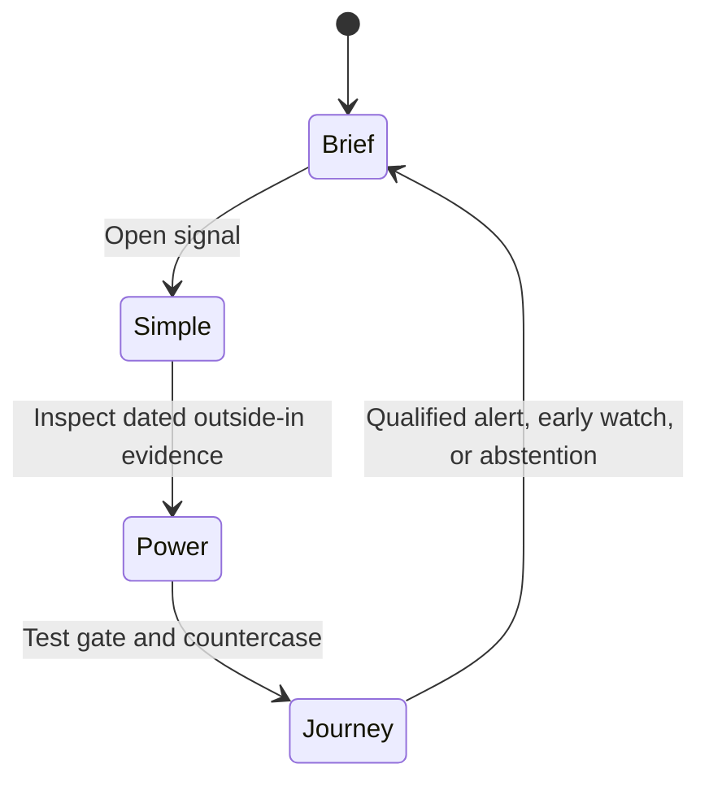
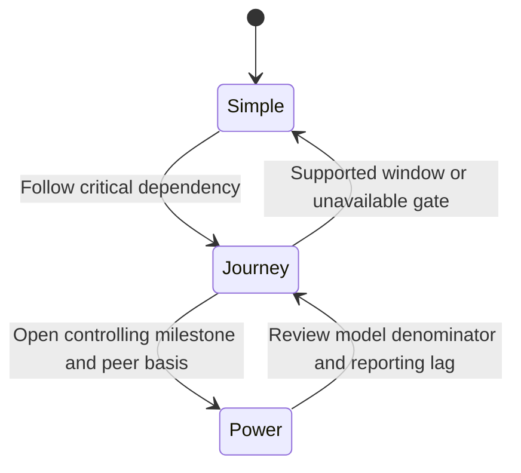
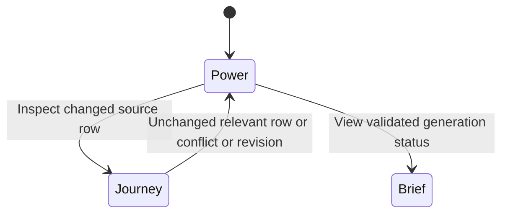
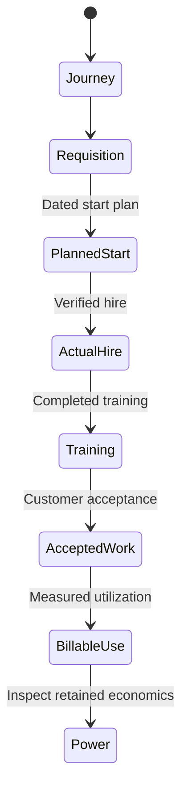
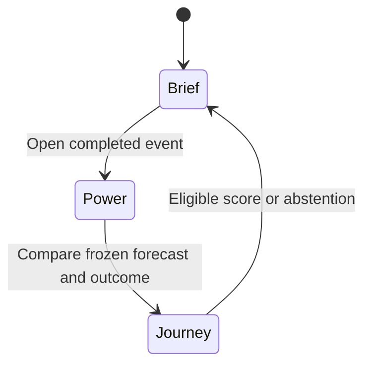

# Feature 034 — AI Opportunity Intelligence Lab

**Status:** Analyst-owned business specification. No implementation, test, release, or notification-delivery claim is made.
**Workflow:** `product-to-planning`, with a `specs_hardened` ceiling.
**Product surface:** A separate research tool for recurring AI adoption, productivity, dependency, earnings-realization, and competitive analysis.
**Educational only:** The feature does not provide investment advice, portfolio instructions, or execution authority.

## Problem Statement

The operator has a large AI opportunity research corpus, but it is still a collection of dated reports and structured snapshots.
The corpus records 23 industries, 230 company-sector memberships, and 196 original companies.
Its additive assessment file records 197 company or business assessments.
The difference preserves historical Udemy coverage while adding Skillsoft after a sector-list change.

The corpus now includes detailed earnings investigations and outside-in evidence.
It also includes options observations, event outcomes, milestone records, and source-discovery records.
Those artifacts expose important research controls, but they do not form a sustained tool.

The reports cannot refresh themselves when evidence changes.
The acquisition scripts have frozen event calendars and require manual review.
The structural validator checks coverage and preservation, but it does not certify source truth or causal attribution.
The September 13 revision states that no automated alert delivery is running.

The current Research Lab already provides useful foundations.
Its four-view shell defines Simple, Power, Brief, and Journey views.
The Research Agenda Lab provides immutable dossiers and explicit unavailable states.
The Company Intelligence capability provides multi-horizon composition and source-qualified dimensions for one covered company.
The company publication path provides immutable versions and atomic publication primitives.

Those capabilities do not own this research question.
The Research Agenda Lab is topic-centered rather than company-sector centered.
Company Intelligence currently covers only `company:msft` through its committed policy.
The public Company Intelligence route also remains excluded while Feature 032 has one unstarted registration scope.
The Research Action Routing feature is planned, and live Red Alert publication remains gated.

Feature 034 must therefore own one new domain capability.
It must convert outside-in operating evidence into dated, falsifiable company and industry research.
It must identify when AI gains or erosion could reach reported economics.
It must preserve abstentions when the evidence cannot support a forecast.

## Outcome Contract

**Intent:** The operator can inspect and refresh a durable AI opportunity map across industries and companies.
Each company assessment connects outside-in evidence to operational milestones, dependencies, productivity, financial realization, expectations, and event outcomes.
The tool warns about possible winners and losers before earnings when public evidence supports that conclusion.

**Success Signal:** A validated generation preserves the complete imported universe and publishes a keyed refresh overlay.
The generation exposes 23 industries and ten current company or business candidates per industry.
It reports refreshed, carried, failed, unreviewed, and completed-event counts.
Each reviewed company receives separate competitive, earnings-realization, and expectations conclusions.
The next-earnings lane appears before six-month and twelve-month lanes.
Every material statement links to admissible evidence, a calculation, or a labeled assumption.
Unsupported numerical forecasts remain unavailable and count as abstentions.

**Hard Constraints:**

- Historical reports, forecasts, source records, and research snapshots remain byte-preserved imports.
- A refresh appends a generation and advances a current pointer only after validation.
- A partial refresh overlays the full universe by stable identity.
- A partial refresh never becomes a smaller replacement universe.
- Every industry retains ten current candidates or publishes an exact coverage failure.
- Company, business-unit, subsidiary, site, customer cohort, and security identities remain distinct.
- Private companies and non-security exposures never receive fabricated public price projections.
- Evidence, calculations, deductions, user assumptions, model outputs, market observations, and narrative remain separate claim classes.
- An issuer result can establish a financial baseline or outcome.
- An issuer result alone cannot establish a leading outside-in signal.
- Every evidence record preserves publication, observation, retrieval, and first-detected clocks.
- A source date never substitutes for the source's measurement period.
- Correlated reposts and syndicated releases count as one evidence cluster.
- Unknown, unavailable, stale, conflicted, zero, and not-reviewed remain distinct states.
- A permit, allocation, contract, job listing, layoff, installed asset, or purchased seat never proves realized economic benefit by itself.
- Workflow productivity never becomes company-wide productivity without a supported coverage bridge.
- Customer savings never become vendor revenue without contract and capture evidence.
- Installed capacity never becomes accepted or billable capacity without acceptance evidence.
- A directional watch never becomes a numerical return forecast by implication.
- An options-implied magnitude never supplies the predicted direction.
- A conditional sensitivity never receives an unconditional forecast score.
- A completed event leaves the approaching queue and retains its frozen pre-event record.
- Event scoring uses the return window declared before the event.
- Opening gaps and regular close-to-close returns remain separate observations.
- Probability outputs remain unavailable until frozen forecasts support out-of-sample calibration.
- Every alert carries counterevidence, a falsifier, and the next evidence needed.
- External notification routing never bypasses the destination owner's gates.
- The tool uses public or appropriately licensed information only.
- The tool never solicits private employee, customer, supplier, or company information automatically.
- The tool stores no holdings, position sizes, cost basis, profit, loss, credentials, or order instructions.
- The tool operates as educational research and cannot place or route trades.

**Failure Condition:** The feature fails if a refreshed subset replaces prior coverage.
It fails if prose becomes the primary source of truth.
It fails if a result-led narrative is presented as pre-event evidence.
It fails if an unsupported productivity multiplier, revenue effect, or stock move appears as a forecast.
It also fails if a current alert cannot be reconstructed from its frozen evidence and assumptions.

## Goals

1. Import the complete AI opportunity corpus without changing historical content.
2. Establish stable industry, entity, business exposure, and security identities.
3. Make evidence, milestones, dependencies, models, signals, and outcomes first-class records.
4. Refresh selected records without shrinking or silently carrying the universe.
5. Detect positive realization, erosion, implementation dips, and unresolved cases before earnings.
6. Connect operational change to revenue, margin, cash, EPS, and valuation only when evidence supports each bridge.
7. Publish Simple, Power, Brief, and Journey experiences from one generation.
8. Preserve every forecast and score only eligible claims after their event.
9. Export validated research signals without assuming external alert delivery.
10. Measure coverage, abstentions, lead time, false positives, and forecast errors separately.

## Non-Goals

1. The feature does not repurpose the Research Agenda Lab as the owner.
2. The feature does not replace Company Intelligence, Company Fundamentals, AI Capex Strategy, Sector Rotation, or Market Action Center.
3. The feature does not change the historical-row correction decision owned by Feature 028.
4. The feature does not weaken the Research Action Routing or Red Alert gates.
5. The feature does not promise forensic coverage for every company on its first imported generation.
6. The feature does not infer private information or contact companies, employees, customers, or suppliers.
7. The feature does not purchase or require a licensed provider to make the base tool usable.
8. The feature does not publish investment recommendations, order instructions, position sizes, or guaranteed outcomes.
9. The feature does not force a stock direction or percentage when the evidence bridge is incomplete.
10. The feature does not rewrite Feature 019, Feature 020, Feature 025, Feature 028, or Feature 032 artifacts.

## Operator Requirements

The following requirements come from the operator's requests and the accepted proposal.
They are not claims about delivered repository behavior.

1. Preserve the existing industry and company research instead of replacing it.
2. Maintain ten companies or business exposures per industry.
3. Estimate inflection timing from actual evidence rather than generic one-year bands.
4. Investigate contracts, hiring, staffing, supply chains, utilities, permits, physical capacity, deployments, and customer behavior.
5. Separate productivity, revenue capture, earnings realization, and stock effects.
6. Identify likely winners and losers with clear evidence and reasons.
7. Prioritize the next earnings event, then six-month and twelve-month horizons.
8. Include event dates, implied volatility, and an independent stock-event view when supportable.
9. Treat unavailable forecasts as unavailable rather than zero.
10. Refresh the research whenever the tool regenerates.
11. Provide Simple and Power models, a Brief, and domain journeys.
12. Preserve historical forecasts so later outcomes cannot rewrite them.

## Source And Claim Boundaries

| Claim class | Permitted use | Required disclosure | Prohibited implication |
| --- | --- | --- | --- |
| Observed fact | Establish a dated event, measurement, filing, contract, record, or market observation | Source identity, clocks, period, unit, denominator, entity linkage, and limitations | That correlation proves AI causation |
| Management or counterparty claim | Record a stated deployment, benefit, plan, or schedule | Speaker role, original source, claim class, and corroboration state | That the claim is independently verified |
| Independent estimate | Support a bounded deduction | Method, coverage, as-of time, and uncertainty | That the estimate is a measured fact |
| Calculation | Transform compatible sourced inputs | Formula, inputs, units, period, and rounding | That the result is a forecast without forecast status |
| Analyst deduction | Connect evidence through an explicit causal chain | Premises, competing explanation, confidence state, and falsifier | That the deduction came from a source |
| User assumption | Explore a scenario | Owner, value, unit, affected outputs, and reset behavior | That the value is evidence-derived |
| Model output | Produce a sensitivity or eligible forecast | Model identity, input snapshot, limitations, and output class | That all model outputs are predictions |
| Narrative | Explain validated records | Generation identity and record references | That prose can add an unsupported claim |

## Current Capability Map

| Capability | Current evidence | Observed state | Feature 034 disposition |
| --- | --- | --- | --- |
| Four-view experience | [`rlexperience.js`](../../rlexperience.js) declares Simple, Power, Brief, and Journey for ordinary tools | Delivered shared shell contract | Reuse for the new tool |
| Shared view renderer | [`rlviews.js`](../../rlviews.js) renders registry-driven view controls | Delivered browser shell | Reuse after UX planning |
| Recurring research lifecycle | [`rlagenda.js`](../../rlagenda.js) validates immutable dossier lineage and current records | Delivered topic-centered capability | Reuse lifecycle principles, not topic ownership |
| Research Agenda route | [`tools.json`](../../tools.json) registers `research-agenda-lab` as live | Delivered public tool | Keep separate and link when relevant |
| AI infrastructure lens | [`tools.json`](../../tools.json) registers `ai-capex-strategy-lab` as live | Delivered specialized tool | Consume supplier and bottleneck context without copying its model |
| Shared owner reads | [`rldata.js`](../../rldata.js) validates `tool-model-read/v1` and explicit unavailable states | Delivered owner-read channel | Publish one source-qualified tool read |
| Bounded Brief authoring | [`scripts/brief-author.mjs`](../../scripts/brief-author.mjs) validates frozen owner-read and evidence identities | Delivered publication boundary | Reuse for concise Brief output |
| Company multi-horizon composition | [Feature 025](../025-company-multi-horizon-intelligence-lab/spec.md) defines four horizons and explicit dimension states | Delivered for one committed company | Reuse composition vocabulary, not its one-company policy |
| Company publication transaction | [`scripts/company-intelligence-publication.mjs`](../../scripts/company-intelligence-publication.mjs) defines immutable company versions and coupled publication records | Delivered foundation with one public-registration scope still unstarted | Reuse transaction principles after design review |
| Company public registration | [Feature 032 state](../032-company-intelligence-publication-and-brief-transaction/state.json) records Scope 05 as `not_started` | Not complete | Do not claim Company Intelligence is a live registry source |
| Research action routing | [Feature 020 state](../020-research-action-routing-and-alerts/state.json) remains `not_started` | Planned destination routing | Export qualified signals without bypassing it |
| Live Red Alert publication | [`rlmarketaction.js`](../../rlmarketaction.js) rejects a published Red Alert while its dependency gate remains active | Unavailable | Show in-tool alerts and explicit routing status |
| Historical-row correction policy | [Feature 028](../028-published-row-provenance-policy/spec.md) records an undecided overwrite policy | Decision unresolved | Preserve imported rows and avoid settling that policy here |
| Source provenance contracts | [`rlcontracts.js`](../../rlcontracts.js) validates source provenance and evidence references | Delivered shared contracts | Extend through compatible evidence records |
| AI opportunity corpus | [AIOpportunities README](../../../AIOpportunities/research/ai-industry/README.md) names the preserved universe and research limitations | Manual, structured seed corpus | Import once, then preserve its source identity |
| Sustained AI opportunity tool | Repository search found no `ai-opportunity-intelligence-lab` registration, route, or source module | Missing | Create as the Feature 034 product surface |

## Honest Findings

### F-034-001 — The proposal is more complete than the running system

The proposal defines canonical records, models, refreshes, signals, and acceptance fixtures.
It also states that no running tool or notification service exists.
This specification must not convert proposal language into a delivery claim.

### F-034-002 — The seed corpus has breadth without uniform forensic depth

The corpus covers the requested industry structure and company counts.
Its README explicitly says the 197 assessments are not 197 completed forensic audits.
The first tool generation must preserve both breadth and visible evidence gaps.

### F-034-003 — Existing recurring research is topic-centered

Feature 019 and `rlagenda.js` provide strong recurring research primitives.
Their active identity is a research topic, not a multi-sector company and security graph.
Reusing them unchanged would hide company, subsidiary, site, customer, and security relationships.

### F-034-004 — Existing company intelligence is too narrow

The committed Company Intelligence policy identifies only `company:msft`.
Feature 034 needs 196 original entities and 230 sector memberships on import.
A hard-coded single-subject policy cannot become the new tool's universe.

### F-034-005 — Public company publication is not fully closed

Feature 032 records its first four scopes as done and public registration as unstarted.
The current registry search returns no Company Intelligence tool row.
Feature 034 may reuse transaction primitives, but it cannot cite that route as a current live source.

### F-034-006 — External notification delivery has no available shortcut

Feature 020 remains unstarted.
The current Red Alert composer rejects live publication.
Feature 034 can own signal qualification and reader-visible notices.
It must expose external routing as unavailable until the destination capability admits the signal.

### F-034-007 — The corpus contains frozen acquisition hazards

The AIOpportunities README warns that its options fetcher has a frozen calendar.
It also warns against reusing completed events and expired contracts.
The refresh design must source event calendars independently for each generation.

### F-034-008 — Coverage preservation and evidence refresh are different obligations

A company may remain in the universe while its evidence refresh fails.
The generation must keep its identity and history while marking current research unavailable.
Removing that company would turn acquisition failure into false portfolio selection.

### F-034-009 — Options data cannot rescue an incomplete causal thesis

The September 13 options records preserve raw zero IV30 as unusable and normalize it to null.
Wide and unsynchronized quotes also block clean event isolation.
The product needs market-quality gates before options outputs enter a forecast.

### F-034-010 — Outcome scoring can reverse with the chosen window

The September 13 event audit records opposite opening and closing signs for Oracle and Adobe.
Neither had an eligible numerical prediction.
The tool must freeze the return window and count both cases as forecast abstentions.

### F-034-011 — Source products cover parts of the workflow, not this causal contract

AlphaSense exposes cited document review, cross-company grids, monitoring, and source filters.
Quartr exposes structured first-party investor-relations data and live event records.
PolicyNote exposes regulatory monitoring, alerts, forecasts, and data integration.
Their reviewed public pages did not establish this feature's full outside-in operating-to-earnings ledger.

### F-034-012 — One proposal conflict needs a design decision

The proposal requests atomic publication and honest partial refresh.
Those rules can coexist only if atomicity applies to one validated generation, not universal acquisition success.
A generation may publish validated keyed overlays while preserving failed identities with explicit failure states.

## Domain Capability Model

### Capability

**Recurring AI opportunity intelligence across industries, companies, dependencies, and reporting events.**

The capability converts public outside-in evidence into dated research records.
It preserves the path from operational change to economic realization and later outcome scoring.

### Domain Primitives

| Primitive | Purpose | Lifecycle |
| --- | --- | --- |
| Industry | Defines one AI opportunity category and its comparison basis | Declared, revised through a dated successor, never silently renumbered |
| Entity | Identifies a company, parent, subsidiary, or private operator | Declared, mapped, merged, spun, retired, or superseded |
| Business exposure | Identifies a product, unit, site, or operating activity | Declared, linked to entities, revised with effective dates |
| Security | Maps a public claim to a traded instrument | Verified, changed by corporate action, inactive, or unavailable |
| Sector membership | Links one business exposure to one industry | Effective-dated, active, superseded, or historical |
| Evidence item | Stores one sourced observation or claim | Retrieved, validated, conflicted, refuted, superseded, stale, or unavailable |
| Evidence cluster | Groups records with one underlying origin or measurement process | Open, corroborated, contradicted, or superseded |
| Milestone | Defines an operational gate and its expected recognition window | Planned, observed, achieved, delayed, invalidated, or unknown |
| Dependency edge | Links a company to a supplier, customer, utility, permit, asset, or workflow | Supporting, constraining, broken, resolved, or expired |
| Economic bridge | Maps operational evidence to a financial line | Incomplete, conditional, supported, contradicted, or expired |
| Assessment | Holds the three company conclusions for one generation | Early watch, realization alert, erosion alert, resolved, withdrawn, or abstained |
| Event record | Defines a company report and its eligible evidence cutoff | Estimated, confirmed, completed, canceled, or superseded |
| Forecast record | Freezes one eligible or abstained pre-event statement | Draft, frozen, scored, withdrawn before cutoff, or ineligible |
| Market observation | Stores a price, option, consensus, or guidance observation | Current, stale, conflicted, unavailable, or superseded |
| Refresh generation | Groups one immutable input, output, and validation set | Opened, frozen, validated, published, refused, or superseded |
| Research signal | Exposes a qualified watch, alert, erosion, abstention, or withdrawal | Detected, strengthened, weakened, realized, expired, or withdrawn |

### Relationships

- An industry has ten active company or business candidates in a valid current generation.
- One entity may hold several sector memberships and several securities.
- A business exposure belongs to one or more entities through effective-dated relationships.
- An evidence item belongs to one evidence cluster and may support several linked claims.
- A milestone cites evidence items, dependency edges, preconditions, and a falsifier.
- An economic bridge cites milestones and maps them to named financial periods and lines.
- An assessment contains separate competitive, realization, and expectations conclusions.
- A forecast record belongs to one event record and one frozen generation.
- An outcome record never mutates the forecast record it evaluates.
- A research signal projects an assessment without becoming its source of truth.
- A refresh generation overlays the prior universe by stable identity.

### Business Policies

1. Preserve identity before refreshing evidence.
2. Preserve the full universe when only selected companies refresh.
3. Record source failure as a result for the affected identity.
4. Deduplicate evidence by underlying origin and measurement cluster.
5. Keep supporting and contradicting evidence visible together.
6. Require compatible periods, units, and denominators before calculation.
7. Keep stocks, flows, capacities, allowances, and realized use distinct.
8. Separate customer value, supplier receipts, company capture, and shareholder capture.
9. Freeze event inputs before the declared cutoff.
10. Score only outputs that declared an eligible forecast type before the event.
11. Let abstention protect truth when a required bridge is missing.
12. Advance the current generation only after full contract validation.

## Actors And Personas

| Actor | Goals | Permissions and boundaries |
| --- | --- | --- |
| Research operator | Find evidence-supported AI winners, losers, inflection points, and missing inputs | Reads all public research, changes explicit scenario assumptions, and triggers an authorized refresh |
| Scheduled refresher | Keep selected evidence, calendars, and market observations current | Acquires only declared public or licensed sources and cannot invent missing results |
| Research analyst | Review candidate evidence and reconcile conflicting claims | Classifies facts, deductions, assumptions, and falsifiers without changing source records |
| Model reviewer | Inspect productivity, economic, and valuation bridges | May approve a model state or keep it conditional, but cannot relabel assumptions as facts |
| Publication gate | Protect the universe, lineage, claim boundaries, and current pointer | Publishes one validated generation or retains the prior current pointer |
| Brief reader | See what changed and what needs attention | Receives concise research with links to the owner tool and no execution authority |
| Outcome reviewer | Compare frozen forecasts with completed events | Records actuals and errors without changing the pre-event record |
| Downstream research consumer | Reuse validated signals and dependencies | Consumes read-only records and must preserve qualifiers and limitations |

## Use Cases

### UC-034-001: Import the preserved corpus

- **Actor:** Publication gate.
- **Preconditions:** The source archive and its preservation manifest are readable.
- **Main Flow:** Validate the archive, map stable identities, preserve every historical artifact, and create an initial generation.
- **Alternative Flows:** Refuse the import when any required historical artifact changes or cannot be accounted for.
- **Postconditions:** The imported universe retains 23 industries, 230 memberships, 196 original companies, and 197 assessments.

### UC-034-002: Refresh selected companies without shrinking coverage

- **Actor:** Scheduled refresher.
- **Preconditions:** A current generation and a declared refresh selection exist.
- **Main Flow:** Acquire selected sources, classify each result, build keyed overlays, validate counts, and publish the generation.
- **Alternative Flows:** Mark individual acquisition failures while preserving their prior identity and dated record.
- **Postconditions:** Every prior industry and company remains accounted for.

### UC-034-003: Investigate a company from outside-in evidence

- **Actor:** Research analyst.
- **Preconditions:** A company identity, peer group, business exposure, and evidence cutoff exist.
- **Main Flow:** Review customer, supplier, workforce, physical, product, regulatory, and observed-usage evidence.
- **Alternative Flows:** Publish an unresolved assessment when entity linkage, denominator, period, or corroboration is missing.
- **Postconditions:** The dossier shows the causal chain, counterevidence, falsifier, and largest missing input.

### UC-034-004: Locate an evidence-supported inflection window

- **Actor:** Research analyst.
- **Preconditions:** At least one operational milestone has dated evidence.
- **Main Flow:** Map preconditions, dependencies, effective live period, recognition lag, and reporting events.
- **Alternative Flows:** Keep the window unknown when a necessary operational or accounting gate is unavailable.
- **Postconditions:** The milestone carries earliest and latest supported dates rather than a generic year band.

### UC-034-005: Estimate productivity without extrapolation

- **Actor:** Model reviewer.
- **Preconditions:** A workflow denominator, coverage share, adoption state, quality measure, and incremental cost basis exist.
- **Main Flow:** Calculate local productivity and a bounded economic sensitivity.
- **Alternative Flows:** Withhold the company-wide multiplier when coverage weights do not exist.
- **Postconditions:** The result names its scope, period, denominator, assumptions, and limitations.

### UC-034-006: Qualify a pre-earnings signal

- **Actor:** Research analyst.
- **Preconditions:** A company event, fiscal cutoff, operating evidence, and economic mechanism exist.
- **Main Flow:** Classify competitive progress, earnings realization, and the expectations gap separately.
- **Alternative Flows:** Publish an early watch or abstention when realization or expectations evidence remains incomplete.
- **Postconditions:** The next-earnings lane shows a qualified alert, research warning, erosion case, or abstention.

### UC-034-007: Review six-month and twelve-month milestones

- **Actor:** Research operator.
- **Preconditions:** A current company assessment exists.
- **Main Flow:** Review cumulative milestones, dependencies, affected periods, and reporting opportunities through each horizon.
- **Alternative Flows:** Show no qualified milestone with a reason when the evidence window is empty.
- **Postconditions:** The longer horizons remain separate from the next-earnings assessment.

### UC-034-008: Compare competitors on a common basis

- **Actor:** Research operator.
- **Preconditions:** Two or more entities share a declared business, geography, period, denominator, and outcome.
- **Main Flow:** Normalize material differences and compare adoption, economics, evidence quality, and timing.
- **Alternative Flows:** Refuse the ranking when the comparison basis cannot be reconciled.
- **Postconditions:** A winner or loser label names its basis and contradictory evidence.

### UC-034-009: Inspect market expectations and options

- **Actor:** Model reviewer.
- **Preconditions:** Security mapping, event timing, consensus basis, and market observations exist.
- **Main Flow:** Validate quote clocks, units, liquidity, expiries, strikes, and expectation comparability.
- **Alternative Flows:** Suppress the event magnitude when isolation or quote quality is inadequate.
- **Postconditions:** Market context remains separate from the analyst's direction and economic bridge.

### UC-034-010: Score a completed event

- **Actor:** Outcome reviewer.
- **Preconditions:** The event completed and a frozen pre-event record exists.
- **Main Flow:** Record actuals, compute the declared return window, and score each eligible forecast dimension separately.
- **Alternative Flows:** Count an ineligible numerical prediction as an abstention, not a zero-error forecast.
- **Postconditions:** The forecast and outcome remain separately readable.

### UC-034-011: Review a changed or contradicted source

- **Actor:** Research analyst.
- **Preconditions:** A retrieved source, dataset row, or evidence claim differs from its predecessor.
- **Main Flow:** Compare relevant records, classify the change, and append a correction or contradiction.
- **Alternative Flows:** Record a changed response hash without a claim change when relevant rows remain identical.
- **Postconditions:** The current conclusion cites the new record and preserves the old one.

### UC-034-012: Publish a concise Brief

- **Actor:** Brief reader.
- **Preconditions:** A validated current generation exists.
- **Main Flow:** Read approaching events, six-month milestones, twelve-month milestones, completed events, and coverage.
- **Alternative Flows:** See explicit empty and unavailable sections instead of omitted content.
- **Postconditions:** Every Brief statement links back to the exact generation and owner record.

### UC-034-013: Route a qualified research signal

- **Actor:** Downstream research consumer.
- **Preconditions:** A validated signal and destination capability state exist.
- **Main Flow:** Consume the signal with its evidence, limitations, and owner link.
- **Alternative Flows:** Retain the signal in-tool with a named routing refusal when the destination rejects it.
- **Postconditions:** No destination gate changes and no signal disappears silently.

### UC-034-014: Explore an explicit user scenario

- **Actor:** Research operator.
- **Preconditions:** A supported model exposes named user-adjustable assumptions.
- **Main Flow:** Change an assumption, review affected outputs, and compare with the evidence-derived baseline.
- **Alternative Flows:** Refuse values outside declared units or domains.
- **Postconditions:** The scenario remains local until explicitly saved as a new user-authored record.

## Requirements

### A. Corpus import and preservation

- **FR-034-001** The initial import MUST retain all 23 industry identities.
- **FR-034-002** The initial import MUST retain all 230 company-sector memberships.
- **FR-034-003** The initial import MUST retain all 196 original company identities.
- **FR-034-004** The initial import MUST retain all 197 additive assessments and their historical distinctions.
- **FR-034-005** Each industry MUST expose ten active company or business candidates.
- **FR-034-006** A missing candidate MUST create a blocking coverage result for that industry.
- **FR-034-007** Every imported historical artifact MUST retain a source fingerprint and archive identity.
- **FR-034-008** The import MUST refuse any unexplained modification to a preserved historical artifact.
- **FR-034-009** The runtime MUST consume research-lab-owned imports rather than a sibling absolute path.
- **FR-034-010** Corporate actions MUST preserve predecessor entities, securities, and effective dates.

### B. Identity and universe

- **FR-034-011** Every entity, exposure, security, industry, and membership MUST have a stable identity.
- **FR-034-012** One entity MAY belong to several industries without duplicating its evidence records.
- **FR-034-013** Security mappings MUST include currency, exchange, rights class, and effective dates.
- **FR-034-014** Private entities MUST remain researchable without a public security projection.
- **FR-034-015** Subsidiary, site, customer cohort, and business-unit evidence MUST not become parent-company evidence without an explicit linkage.
- **FR-034-016** Each current generation MUST account for every prior active identity.

### C. Evidence ledger

- **FR-034-017** Every evidence item MUST identify its publisher and original record or URL.
- **FR-034-018** Every evidence item MUST retain publication, observation, retrieval, and first-detected clocks.
- **FR-034-019** Every numerical evidence item MUST retain unit, denominator, period, baseline, and measurement class.
- **FR-034-020** Every evidence item MUST identify observed fact, party claim, independent estimate, calculation, deduction, or assumption.
- **FR-034-021** Evidence from one underlying origin MUST share one cluster identity.
- **FR-034-022** Supporting, conflicting, refuting, and superseding evidence MUST remain simultaneously inspectable.
- **FR-034-023** Retrieval failure MUST produce an unavailable evidence record with a reason.
- **FR-034-024** A source-content change MUST trigger relevant-record comparison before any conclusion changes.
- **FR-034-025** Source use MUST comply with public or licensed access terms.
- **FR-034-026** The system MUST not send external information requests without separate operator authority.

### D. Milestones and dependencies

- **FR-034-027** Every inflection window MUST derive from one or more dated operational milestones.
- **FR-034-028** A milestone MUST name its preconditions, earliest date, latest date, state, evidence, and falsifier.
- **FR-034-029** A dependency edge MUST name direction, criticality, expected lag, exposure effect, and bottleneck state.
- **FR-034-030** One evidence item MAY update several dependency-linked dossiers without duplication.
- **FR-034-031** Installed capacity, accepted capacity, utilized capacity, and billable output MUST remain distinct states.
- **FR-034-032** Requisition, planned start, hire, training completion, accepted work, and billable utilization MUST remain distinct events.
- **FR-034-033** Allowance, allocation, contracted capacity, consumption, and realized output MUST remain distinct measures.
- **FR-034-034** The tool MUST expose the next evidence needed to promote or refute each milestone.

### E. Company conclusions and horizons

- **FR-034-035** Every reviewed company MUST receive a competitive progress conclusion.
- **FR-034-036** Competitive progress MUST use `gaining`, `losing`, `mixed`, or `unresolved`.
- **FR-034-037** Every reviewed company MUST receive an earnings-realization conclusion.
- **FR-034-038** Earnings realization MUST use `emerging`, `approaching-realization`, `already-realizing`, `delayed`, `eroding`, or `unresolved`.
- **FR-034-039** Every reviewed company MUST receive an expectations-gap conclusion.
- **FR-034-040** Expectations gap MUST use `positive-gap`, `negative-gap`, `already-in-baseline`, or `unresolved`.
- **FR-034-041** The three conclusions MUST remain independent.
- **FR-034-042** Every company MUST expose next-earnings, six-month, and twelve-month assessments.
- **FR-034-043** The next-earnings assessment MUST appear first.
- **FR-034-044** Each horizon MUST identify its reporting opportunities and evidence cutoff.
- **FR-034-045** A company without current evidence MUST remain visible with an unresolved or unavailable state.

### F. Productivity and economic models

- **FR-034-046** The productivity bridge MUST separate affected cost share, deployed share, measured local saving, incremental cost, and retained benefit.
- **FR-034-047** A cost-productivity multiplier MUST use compatible cost denominators and periods.
- **FR-034-048** Redeployed time MUST not count as cash savings without spending reduction or hiring-avoidance evidence.
- **FR-034-049** Output growth, price, volume, mix, and cost effects MUST remain separate.
- **FR-034-050** Quarterly models MUST account for cohort live days, ramp, recognition, and implementation timing.
- **FR-034-051** Economic capture MUST separate retained savings, AI revenue, contribution margin, run costs, rework, cannibalization, and depreciation.
- **FR-034-052** Volume-priced, fixed-fee, and outcome-priced customer contracts MUST use separate economic bridges.
- **FR-034-053** Equity models MUST expose interest, tax, debt, cash, share count, dilution, persistence, and multiple assumptions when material.
- **FR-034-054** A negative or unstable earnings basis MUST block a positive P/E valuation model.
- **FR-034-055** Every model output MUST identify fact, calculation, assumption, sensitivity, or forecast status.
- **FR-034-056** A missing material input MUST remain visible and MUST block the affected output class.
- **FR-034-057** Unsupported evidence weights MUST not become probability percentages.

### G. Earnings signals and notifications

- **FR-034-058** Every signal MUST distinguish operational change, earnings realization, and stock surprise.
- **FR-034-059** An early watch MUST require dated change evidence and a plausible economic mechanism.
- **FR-034-060** A realization alert MUST require live adoption or erosion, defined scope, named period, financial materiality, and counterevidence review.
- **FR-034-061** An earnings-surprise alert MUST also require a dated comparable expectation baseline.
- **FR-034-062** The system MUST classify directional watches, conditional scenarios, unconditional forecasts, and abstentions separately.
- **FR-034-063** A stock-event percentage MUST remain unavailable when the economic and priced-in bridges are incomplete.
- **FR-034-064** Every signal MUST carry first-detected, last-reviewed, event, period, financial-line, evidence, countercase, falsifier, and missing-input fields.
- **FR-034-065** Qualified signals MUST appear in a reader-visible notification lane within the tool and Brief.
- **FR-034-066** A downstream routing refusal MUST preserve the signal and expose the destination's reason.
- **FR-034-067** A losing classification MUST identify observed deterioration or a quantified disadvantage on a common basis.
- **FR-034-068** Canceled, delayed, deteriorating, and contradicted projects MUST receive the same review priority as positive deployments.

### H. Event calendar, consensus, options, and returns

- **FR-034-069** Every event MUST identify fiscal period, release type, date, time, timezone, and certainty.
- **FR-034-070** Earnings releases and revenue-only updates MUST remain distinct.
- **FR-034-071** An estimated event date MUST retain its provider and uncertainty.
- **FR-034-072** A completed event MUST leave the approaching queue before the next generation publishes.
- **FR-034-073** The system MUST not select options against a completed event.
- **FR-034-074** Consensus observations MUST retain provider, period, accounting basis, currency, dilution basis, contributor data, and observation time when available.
- **FR-034-075** Incompatible consensus observations MUST remain separate.
- **FR-034-076** Options records MUST retain raw and normalized volatility values with explicit units.
- **FR-034-077** A vendor zero volatility MUST normalize to unavailable with a reason when zero is not a valid observation.
- **FR-034-078** Options records MUST retain security, deliverable, exchange, currency, expiration, strike, multiplier, quote clocks, bids, asks, trades, volume, and open interest.
- **FR-034-079** Event-only implied magnitude MUST remain unavailable when quote quality or variance isolation is inadequate.
- **FR-034-080** Total-expiration straddle premium MUST not be labeled an earnings-only move.
- **FR-034-081** Opening gap, regular close-to-close return, and intraday last trade MUST remain separate observations.
- **FR-034-082** A forecast MUST freeze its return window before the event.

### I. Refresh, publication, and evaluation

- **FR-034-083** Every refresh MUST create an immutable generation identity.
- **FR-034-084** Every generation MUST freeze its research cutoff separately from its finalization time.
- **FR-034-085** A weekend retrieval MUST retain the last trading-session identity.
- **FR-034-086** Each generation MUST publish refreshed, carried, failed, unreviewed, and completed-event counts.
- **FR-034-087** Carried records MUST retain their prior review dates and cannot appear refreshed.
- **FR-034-088** Valid keyed overlays MAY publish when some acquisitions fail.
- **FR-034-089** Failed acquisitions MUST retain the affected identities and explicit failure states.
- **FR-034-090** The current pointer MUST advance only after the generation and its Brief validate together.
- **FR-034-091** A refused generation MUST leave the current pointer and historical records unchanged.
- **FR-034-092** Pre-event evidence, assumptions, expectations, and forecast publication times MUST freeze before results.
- **FR-034-093** Operating direction, monetary bridge, timing, surprise, and stock-return errors MUST score separately.
- **FR-034-094** Abstentions and coverage MUST publish beside forecast accuracy.
- **FR-034-095** A conditional sensitivity MUST not enter unconditional forecast-error statistics.
- **FR-034-096** Outcome actuals MUST append beside the frozen forecast rather than modify it.

### J. Product views and downstream consumption

- **FR-034-097** Simple MUST show what changed, why it matters, the next gate, the critical dependency, evidence strength, and falsifier.
- **FR-034-098** Simple MUST expose the largest missing input for each unresolved conclusion.
- **FR-034-099** Power MUST expose the universe, evidence ledger, milestones, dependency paths, peer comparisons, models, assumptions, and generation diffs.
- **FR-034-100** Brief MUST expose approaching earnings, six-month milestones, twelve-month milestones, completed events, changes, and coverage.
- **FR-034-101** Journeys MUST cover evidence sufficiency, catalyst critical path, company underwriting, refresh conflicts, recruitment-to-utilization, and event accountability.
- **FR-034-102** Every view MUST resolve to one current generation identity.
- **FR-034-103** Every narrative statement MUST resolve to source records or labeled analytical records.
- **FR-034-104** Downstream consumers MUST receive qualifiers, limitations, evidence clocks, and owner deep links.
- **FR-034-105** The tool MUST publish one validated owner read for Brief consumption.
- **FR-034-106** The tool MUST remain usable with no account, key, server, or private portfolio data.

## User Scenarios (Gherkin)

### SCN-034-001 — The complete corpus imports without historical mutation

```gherkin
Scenario: Preserve the complete seed corpus
  Given the source archive contains its preservation manifest and historical artifacts
  When the initial AI opportunity generation is created
  Then all 23 industries, 230 memberships, 196 original companies, and 197 assessments are accounted for
  And every preserved artifact retains its source fingerprint
```

### SCN-034-002 — A changed archive refuses import

```gherkin
Scenario: Reject unexplained historical mutation
  Given a preserved historical artifact differs from its recorded fingerprint
  When the import is validated
  Then the import is refused with the exact artifact identity
  And no current generation pointer advances
```

### SCN-034-003 — A partial refresh preserves the full universe

```gherkin
Scenario: Overlay selected refreshes by stable identity
  Given a current full-universe generation exists
  And three companies are selected for refresh
  When the next generation publishes
  Then refreshed records replace only those three current assessments
  And every other company remains present with its prior review date
```

### SCN-034-004 — One source failure does not become no change

```gherkin
Scenario: Preserve identity through acquisition failure
  Given a selected company source cannot be retrieved
  When the refresh generation is composed
  Then the company remains in its industries
  And its acquisition state is failed with a named reason
  And its prior assessment is not labeled current
```

### SCN-034-005 — Duplicate reporting counts once

```gherkin
Scenario: Correlated sources form one evidence cluster
  Given several articles repeat one original company release
  When corroboration is assessed
  Then the records share one origin cluster
  And they do not satisfy independent corroboration by repetition
```

### SCN-034-006 — Conflicting evidence stays visible

```gherkin
Scenario: A contradiction blocks promotion
  Given operating evidence supports realization
  And another compatible source contradicts the measured benefit
  When the signal is reviewed
  Then both evidence records remain visible
  And realization alert promotion is refused until the conflict resolves
```

### SCN-034-007 — A proxy does not become realized use

```gherkin
Scenario: Water allocation remains an allowance
  Given a public record increases a site's water allocation
  When the infrastructure milestone is assessed
  Then the allocation ratio may be calculated
  But water consumption, IT load, billable capacity, revenue, and productivity remain unresolved
```

### SCN-034-008 — A job listing does not become headcount

```gherkin
Scenario: Recruitment stages remain distinct
  Given a company posts one requisition with several training dates
  When workforce evidence is added
  Then the system records one requisition and its planned dates
  And actual hires, training completions, accepted work, and billable utilization remain unknown
```

### SCN-034-009 — An operational milestone creates a bounded window

```gherkin
Scenario: Inflection timing follows dated gates
  Given commissioning, customer acceptance, and recognition lag have supported date ranges
  When the critical path is composed
  Then the assessment publishes earliest and latest realization dates
  And it names the gate that controls each boundary
```

### SCN-034-010 — Missing acceptance blocks revenue timing

```gherkin
Scenario: Installed capacity is not billable capacity
  Given an asset is installed but customer acceptance is unavailable
  When the earnings period is assessed
  Then installed capacity remains observed
  And billable output and revenue timing remain unresolved
```

### SCN-034-011 — Workflow productivity stays scoped

```gherkin
Scenario: Local productivity does not become company productivity
  Given one workflow has measured adoption and efficiency evidence
  And company-wide coverage weights are unavailable
  When the productivity bridge runs
  Then the workflow result is published with its denominator
  And the company-wide productivity multiplier is unavailable
```

### SCN-034-012 — Redeployed time is not cash savings

```gherkin
Scenario: Capacity benefit remains separate from cost savings
  Given AI reduces task time but spending and hiring remain unchanged
  When the economic bridge runs
  Then the result records added capacity
  And retained cash savings remain zero or unavailable according to the sourced spending evidence
```

### SCN-034-013 — Customer demand and automation reconcile

```gherkin
Scenario: Contact deflection uses matched cohorts
  Given customer order volume and contacts per order share a matched period and cohort
  When the outsourcing contribution bridge runs
  Then billed contacts reconcile from both inputs
  And customer savings remain separate from outsourcing-provider contribution
```

### SCN-034-014 — Mismatched demand data produces sensitivity only

```gherkin
Scenario: Revenue growth cannot substitute for order growth
  Given customer revenue grew but order growth and average selling price are unavailable
  When contact volume is assessed
  Then a demand threshold may be shown as a conditional sensitivity
  And no contact-volume prediction is published
```

### SCN-034-015 — Three conclusions remain independent

```gherkin
Scenario: Operational gains do not imply a stock surprise
  Given live deployment supports approaching earnings realization
  And comparable market expectations are unavailable
  When the company assessment publishes
  Then earnings realization may be approaching-realization
  And the expectations gap remains unresolved
  And no stock-surprise alert is emitted
```

### SCN-034-016 — A losing company needs common-basis evidence

```gherkin
Scenario: Refuse an unsupported loser label
  Given one peer reports a benefit on a different geography and denominator
  When the peer comparison runs
  Then no winner or loser ranking is published
  And the missing common comparison basis is named
```

### SCN-034-017 — The next event receives priority

```gherkin
Scenario: Brief orders its horizons correctly
  Given a company has next-event, six-month, and twelve-month records
  When the Brief renders
  Then the next-earnings assessment appears first
  And the longer horizons remain separately labeled
```

### SCN-034-018 — A qualified realization alert reaches the reader

```gherkin
Scenario: Publish a supported pre-earnings realization alert
  Given live adoption, scope, quality, recognition lag, retained economics, and counterevidence are reviewed
  And the effect belongs to a named reporting period
  When the signal gate evaluates the assessment
  Then a realization alert appears in the in-tool notification lane and Brief
  And it carries its falsifier and next evidence check
```

### SCN-034-019 — An early watch preserves missing economics

```gherkin
Scenario: Warn early without claiming imminent earnings
  Given a dated deployment has a plausible economic mechanism
  And retained benefit or recognition timing is incomplete
  When the signal gate evaluates the assessment
  Then an early watch appears with the missing bridge inputs
  And no realization or surprise alert is implied
```

### SCN-034-020 — A destination refusal is visible

```gherkin
Scenario: External routing cannot swallow a qualified signal
  Given a valid research signal exists
  And the destination capability rejects publication
  When routing is attempted
  Then the signal remains visible in its owner tool
  And the destination refusal code and reason are recorded
```

### SCN-034-021 — A completed event leaves the approaching queue

```gherkin
Scenario: Retire a completed earnings event
  Given a previously approaching event has completed
  When the next generation publishes
  Then the event appears in completed-event accountability
  And it no longer appears as the company's next earnings event
  And no new option contract is selected against it
```

### SCN-034-022 — An unverified next date stays unknown

```gherkin
Scenario: Do not retain an expired event date
  Given the last event completed
  And the following report date is unverified
  When the company calendar publishes
  Then the next date is unavailable with a reason
  And the completed date remains only in event history
```

### SCN-034-023 — Vendor zero IV becomes unavailable

```gherkin
Scenario: Normalize an invalid zero volatility observation
  Given a provider returns raw IV30 equal to zero
  And the observation fails the usable-volatility check
  When the options record is normalized
  Then raw IV30 remains zero
  And normalized IV30 is unavailable with the failure reason
```

### SCN-034-024 — Wide unsynchronized quotes block event isolation

```gherkin
Scenario: Suppress an unsupported event-only move
  Given option quotes have wide spreads or incompatible observation times
  When the event magnitude is assessed
  Then total-expiration premium may appear with its exact label
  And the earnings-only implied move remains unavailable
```

### SCN-034-025 — The declared event window controls scoring

```gherkin
Scenario: Opening and closing reactions cannot be selected after the fact
  Given a frozen forecast declares regular close-to-close return
  And the completed event has opposite opening-gap and closing-return signs
  When forecast error is scored
  Then the close-to-close observation controls the score
  And the opening gap remains a separate outcome observation
```

### SCN-034-026 — Abstention is not a forecast hit

```gherkin
Scenario: Ineligible numerical predictions remain abstentions
  Given a pre-event record contains no eligible numerical return forecast
  When the event completes
  Then forecast error remains unavailable
  And the record increments abstention coverage
  And it receives no hit credit
```

### SCN-034-027 — A dataset hash change needs a row change

```gherkin
Scenario: Response changes do not invent operational progress
  Given a dataset response hash changes
  And the relevant company rows remain identical
  When the evidence diff runs
  Then the retrieval change is recorded
  And no company milestone is promoted
```

### SCN-034-028 — A user assumption stays distinct

```gherkin
Scenario: Explore a conditional valuation case
  Given a model exposes a declared unpriced-fraction assumption
  When the operator changes that value
  Then affected outputs identify the user assumption
  And the result is labeled a conditional scenario
  And the evidence-derived baseline remains unchanged
```

### SCN-034-029 — Simple explains one causal chain

```gherkin
Scenario: Simple remains concise and falsifiable
  Given a current company assessment exists
  When the operator opens Simple
  Then the view shows what changed, why it matters, the next gate, the critical dependency, and the falsifier
  And it names the largest missing input
```

### SCN-034-030 — Power exposes the complete derivation

```gherkin
Scenario: Power reconstructs the assessment
  Given a signal appears in Simple or Brief
  When the operator follows it into Power
  Then the evidence, milestones, dependencies, models, assumptions, conflicts, and generation diff are visible
  And every displayed conclusion resolves to its source records
```

### SCN-034-031 — Every Brief section has an honest empty state

```gherkin
Scenario: Missing qualified signals remain visible
  Given no company qualifies for a realization alert in one horizon
  When the Brief publishes
  Then that section states that no signal qualified
  And coverage failures and abstentions remain visible
```

### SCN-034-032 — One generation binds every view

```gherkin
Scenario: Views cannot mix research generations
  Given Simple, Power, Brief, and Journey are open for one company
  When their generation identities are compared
  Then all four identify the same current generation
  And a stale view refuses to present itself as current
```

## Acceptance Criteria

| Criterion | Scenarios |
| --- | --- |
| The import preserves every declared corpus count and source fingerprint | SCN-034-001, SCN-034-002 |
| A selected refresh preserves full-universe identity and honest failure states | SCN-034-003, SCN-034-004 |
| Evidence clustering and contradictions prevent false corroboration | SCN-034-005, SCN-034-006 |
| Operational proxies remain bounded to their measured classes | SCN-034-007, SCN-034-008, SCN-034-010 |
| Milestone timing follows dated dependencies | SCN-034-009 |
| Productivity and economics preserve scope and denominator | SCN-034-011, SCN-034-012, SCN-034-013, SCN-034-014 |
| Competitive, realization, and expectations conclusions remain independent | SCN-034-015, SCN-034-016 |
| Brief priority and signal qualification match the operator requirement | SCN-034-017, SCN-034-018, SCN-034-019, SCN-034-020 |
| Completed events, unknown calendars, and options remain honest | SCN-034-021, SCN-034-022, SCN-034-023, SCN-034-024 |
| Forecast scoring cannot use hindsight or reward abstention | SCN-034-025, SCN-034-026 |
| Dataset diffs and user scenarios preserve claim boundaries | SCN-034-027, SCN-034-028 |
| Simple, Power, Brief, and Journey remain coherent and reconstructable | SCN-034-029, SCN-034-030, SCN-034-031, SCN-034-032 |

## UI Scenario Matrix

This matrix defines business journeys only.
The UX owner will define screens, wireframes, responsive behavior, and accessibility details.

| Scenario | Actor | Entry point | Business steps | Expected outcome | Planned surface |
| --- | --- | --- | --- | --- | --- |
| SCN-034-003 | Research operator | Industry matrix | Select a generation, inspect refreshed and carried counts, open a company | The full universe remains visible | Power |
| SCN-034-006 | Research analyst | Company evidence | Compare supporting and conflicting clusters, inspect the blocked signal | Contradictions remain visible | Power |
| SCN-034-009 | Research operator | Company timeline | Follow milestone preconditions and dependencies into reporting periods | The inflection window is explainable | Power and Journey |
| SCN-034-015 | Brief reader | Next-earnings lane | Compare operating, realization, and expectations conclusions | A gain does not imply a surprise | Brief |
| SCN-034-018 | Brief reader | Notification lane | Open a realization alert, then follow its evidence link | The alert is concise and reconstructable | Simple and Brief |
| SCN-034-020 | Research operator | Signal routing status | Inspect a rejected destination and return to the owner record | The signal remains visible | Power |
| SCN-034-021 | Outcome reviewer | Completed events | Compare frozen forecast, actuals, and score eligibility | Hindsight cannot change the forecast | Brief and Journey |
| SCN-034-028 | Model reviewer | Model assumptions | Change one user assumption and compare with baseline | Conditional output remains labeled | Power |
| SCN-034-029 | Research operator | Company or industry selection | Read the concise causal chain and largest gap | The next research action is clear | Simple |
| SCN-034-030 | Research analyst | Signal deep link | Trace source, milestone, dependency, model, and conclusion | The complete derivation is reviewable | Power |

## Non-Functional Requirements

- **NFR-034-001** Every current conclusion MUST be reproducible from its immutable generation inputs.
- **NFR-034-002** Validation MUST fail closed on unknown identities, fields, units, states, or claim classes.
- **NFR-034-003** The browser surface MUST paint a committed current generation without an account, key, proxy, or server.
- **NFR-034-004** A refresh failure MUST preserve the last validated current generation.
- **NFR-034-005** The tool MUST expose source rights, access terms, and retrieval failures without leaking credentials.
- **NFR-034-006** The tool MUST escape all external and model-authored text at every reader-visible sink.
- **NFR-034-007** Keyboard, pointer, touch, zoom, reduced-motion, and semantic-table access MUST preserve the same research meaning.
- **NFR-034-008** Long-running acquisition MUST expose progress by source class and selected company.
- **NFR-034-009** One failed company acquisition MUST not erase validated results for other selected companies.
- **NFR-034-010** Generation publication MUST remain all-or-nothing after candidate validation begins.
- **NFR-034-011** History and current-pointer reads MUST remain deterministic across retries of one logical generation.
- **NFR-034-012** Exports MUST preserve identity, units, clocks, evidence status, assumptions, and limitations.
- **NFR-034-013** The feature MUST support at least 23 industries, 230 memberships, and 197 assessment records without dropping records.
- **NFR-034-014** Research and market clocks MUST display explicit timezones.
- **NFR-034-015** The feature MUST retain a complete audit trail for signal creation, revision, withdrawal, and scoring.

## Competitive Analysis

The comparison uses public product descriptions reviewed on 14 September 2026.
It describes advertised capabilities only.
It does not claim that an unmentioned competitor capability is absent.

| Capability | AlphaSense | Quartr | PolicyNote | Feature 034 requirement |
| --- | --- | --- | --- | --- |
| Source discovery and review | Cited document review, source filters, company research, and cross-company grids | Structured first-party investor-relations records | Sourced legislative and regulatory intelligence | Link every claim to source and claim-class records |
| Monitoring | Dashboards and alerts across selected sources | Live and historical company-event data | Policy alerts and issue tracking | Refresh evidence by source cadence and publish keyed diffs |
| Structured comparison | Generative Grid compares companies and documents | Linked companies, events, people, products, and KPIs | Organization-specific impact analysis | Compare peers only on a declared common basis |
| Financial workflow | Financial data and research workflows | Earnings calls, filings, presentations, and event summaries | Regulatory impact rather than company earnings | Bridge outside-in operations to earnings with explicit gaps |
| Auditability | Answers link back to reviewed documents | First-party content retains structured identity | Analysis is grounded in legislative data | Freeze forecasts, assumptions, event windows, and later outcomes separately |
| Dependency reasoning | Public page emphasizes broad document synthesis | Public page emphasizes IR data integration | Public page emphasizes policy monitoring and organizational impact | Propagate sourced supplier, customer, utility, permit, asset, and workflow dependencies |

### Competitive Gaps

1. General research platforms emphasize source search and synthesis.
2. Investor-relations platforms emphasize first-party event content and structured data.
3. Policy platforms emphasize regulatory tracking and alerts.
4. Feature 034 must combine those strengths with an explicit operating-to-earnings causal ledger.
5. Feature 034 must also preserve forecast abstentions and score only pre-declared eligible outputs.

### Improvement Proposals

#### IP-034-001: Evidence-cluster independence

- **Impact:** High.
- **Effort:** Medium.
- **Competitive advantage:** Correlated reposts cannot create false corroboration.
- **Actors affected:** Research analyst, model reviewer, and Brief reader.
- **Business scenarios:** SCN-034-005 and SCN-034-006.

#### IP-034-002: Dependency-to-recognition critical path

- **Impact:** High.
- **Effort:** Large.
- **Competitive advantage:** The tool explains when operational gates can reach a named reporting period.
- **Actors affected:** Research operator, analyst, and outcome reviewer.
- **Business scenarios:** SCN-034-009 and SCN-034-010.

#### IP-034-003: Honest forecast accountability

- **Impact:** High.
- **Effort:** Medium.
- **Competitive advantage:** Frozen forecasts, withdrawals, abstentions, and event windows prevent hindsight scoring.
- **Actors affected:** Model reviewer, Brief reader, and outcome reviewer.
- **Business scenarios:** SCN-034-021, SCN-034-025, and SCN-034-026.

#### IP-034-004: Full-universe keyed refresh overlays

- **Impact:** High.
- **Effort:** Medium.
- **Competitive advantage:** Deep work on selected companies never destroys broad sector coverage.
- **Actors affected:** Scheduled refresher, publication gate, and research operator.
- **Business scenarios:** SCN-034-003 and SCN-034-004.

#### IP-034-005: Evidence-gated signal ladder

- **Impact:** High.
- **Effort:** Medium.
- **Competitive advantage:** Early warnings remain useful without being mislabeled as imminent earnings forecasts.
- **Actors affected:** Research analyst, Brief reader, and downstream consumer.
- **Business scenarios:** SCN-034-018, SCN-034-019, and SCN-034-020.

## Platform Direction And Market Trends

| Direction | Classification | Feature response |
| --- | --- | --- |
| Cited AI research over large document sets | Established | Preserve source-level traceability and claim boundaries |
| Structured first-party event data for AI workflows | Growing | Normalize event, company, period, and document identities |
| Continuous monitoring and alerting | Established | Publish evidence-gated signals and explicit routing outcomes |
| Agent-driven multi-step research | Growing | Bound every branch by source rights, cutoff, and validation |
| Organization-specific impact analysis | Growing | Build explicit dependency and economic-capture bridges |
| Forecast calibration and abstention measurement | Emerging | Freeze eligible forecasts and score dimensions separately |

### Strategic Priorities

1. Preserve and import the full corpus before adding new conclusions.
2. Establish evidence, identity, milestone, dependency, and generation foundations.
3. Deliver the owner views and Brief from the same validated generation.
4. Add source acquisition and evidence-gated earnings signals.
5. Add calibrated probability outputs only after enough frozen outcomes exist.

## Capability Dependencies And Boundaries

| Existing feature | Reused capability | Boundary |
| --- | --- | --- |
| [Feature 019](../019-custom-recurring-research-agenda/spec.md) | Immutable recurring research lifecycle and honest unavailable states | Feature 034 owns its company-sector registry and evidence graph |
| [Feature 020](../020-research-action-routing-and-alerts/spec.md) | Destination routing rules when that capability becomes available | Feature 034 owns signal qualification and in-tool visibility |
| [Feature 025](../025-company-multi-horizon-intelligence-lab/spec.md) | Multi-horizon composition and explicit dimension states | Feature 034 owns broad AI-specific coverage and models |
| [Feature 028](../028-published-row-provenance-policy/spec.md) | No capability dependency | Feature 034 does not settle mutable historical market-row policy |
| [Feature 032](../032-company-intelligence-publication-and-brief-transaction/spec.md) | Immutable candidate and atomic publication principles | Feature 034 requires its own scalable subject and generation contract |

## Exposure Contract

All Feature 034 rows are planned.
No delivered route, command, or internal caller exists today.

| Capability | Surface class | Surface id | Status | Plan |
| --- | --- | --- | --- | --- |
| AI opportunity research | uiRoute | `ai-opportunity-intelligence-lab.html` | planned | Feature 034 |
| Current and historical research read | internal | `ai-opportunity-intelligence owner read` | planned | Feature 034 publication and Brief composition |
| Validated generation refresh | cliCommand | `AI opportunity refresh command` | planned | Feature 034 scheduled and on-demand acquisition |
| Brief projection | internal | `AI opportunity Brief source read` | planned | Feature 034 owner read consumed by Market Action Center |
| Qualified signal export | internal | `AI opportunity research signal projection` | planned | Feature 034 consumed by the Feature 020 routing boundary |

## Evidence Sources

### Repository evidence

1. [`AI_Opportunity_Intelligence_Lab_Proposal.md`](../../AI_Opportunity_Intelligence_Lab_Proposal.md) defines the accepted product intent and research controls.
2. [`rlexperience.js`](../../rlexperience.js) lines 399–410 define the current ordinary four-view set.
3. [`rldata.js`](../../rldata.js) lines 497–570 validate and store shared owner reads with explicit states.
4. [`rlagenda.js`](../../rlagenda.js) contains immutable dossier paths, predecessor checks, current records, and change assessments.
5. [`scripts/brief-author.mjs`](../../scripts/brief-author.mjs) validates frozen owner-read and evidence identities for Brief authoring.
6. [`scripts/company-intelligence-publication.mjs`](../../scripts/company-intelligence-publication.mjs) defines immutable company publication and coupled transaction primitives.
7. [`rlmarketaction.js`](../../rlmarketaction.js) lines 719–730 reject live Red Alert publication while its gate remains active.
8. [`tools.json`](../../tools.json) registers Research Agenda and AI Capex Strategy as live sources.
9. [Feature 019](../019-custom-recurring-research-agenda/spec.md) defines recurring research ownership and action-routing exclusion.
10. [Feature 020 state](../020-research-action-routing-and-alerts/state.json) records research routing as `not_started`.
11. [Feature 025 state](../025-company-multi-horizon-intelligence-lab/state.json) records the company composition feature as certified `done`.
12. [Feature 028](../028-published-row-provenance-policy/spec.md) records the unresolved historical-row overwrite decision.
13. [Feature 032 state](../032-company-intelligence-publication-and-brief-transaction/state.json) records four complete scopes and one unstarted public-registration scope.
14. [AIOpportunities README](../../../AIOpportunities/research/ai-industry/README.md) records corpus counts, preservation rules, acquisition hazards, and research limitations.
15. [September 13 structured revision](../../../AIOpportunities/research/ai-industry/earnings_watch_update_2026-09-13.json) records the latest keyed overlay and coverage states.
16. [September 13 event outcomes](../../../AIOpportunities/research/ai-industry/market_event_outcomes_2026-09-13.json) separates opening and closing return observations.
17. [September 13 options review](../../../AIOpportunities/research/ai-industry/options_reviewed_2026-09-13.json) preserves raw and normalized volatility observations.

### External competitive evidence

18. [AlphaSense document review](https://help.alpha-sense.com/hc/en-us/articles/52886436185363-Reviewing-Documents-in-AlphaSense) describes source-linked review and cross-company grids.
19. [AlphaSense platform](https://www.alpha-sense.com/platform/generative-search/) describes monitoring, financial data, cited search, and research workflows.
20. [Quartr API](https://quartr.com/products/quartr-api) describes structured first-party investor-relations data and live events.
21. [PolicyNote](https://fiscalnote.com/products/policynote) describes legislative monitoring, alerts, forecasts, and organizational impact analysis.

## Assumptions Requiring Design Resolution

> **Assumption**
> **Assumed:** Feature 034 can reuse current publication primitives without inheriting Company Intelligence's one-subject policy.
> **Why unverified:** The technical extension contract has not been designed.
> **Blast radius:** A false premise changes generation, subject, and transaction design.
> **Would confirm or refute:** Feature 034 design must trace the reusable publication contracts and variation axes.

> **Assumption**
> **Assumed:** Reader-visible in-tool and Brief notices satisfy the first notification delivery increment.
> **Why unverified:** The operator did not name an external delivery channel, and Feature 020 remains unstarted.
> **Blast radius:** A required external channel would add destination, authorization, and delivery-state requirements.
> **Would confirm or refute:** UX and design must define the notification surfaces and preserve Feature 020 ownership.

> **Assumption**
> **Assumed:** The base tool can use public and already available sources while optional licensed providers remain replaceable.
> **Why unverified:** The final source-provider set and access rights have not been selected.
> **Blast radius:** Provider choices affect acquisition coverage, cadence, storage rights, and reproducibility.
> **Would confirm or refute:** Design must inventory source classes, access terms, storage rights, and provider fallbacks as explicit unavailable states.

## Change Magnitude Decision

**Sizable.** The feature adds a new actor flow, a new registered tool, several shared research primitives, and a broad entity universe.
It also adds generation, evidence, milestone, dependency, signal, forecast, and outcome contracts.
The feature requires its own specification folder and a full design and planning chain.

## UI Wireframes

These are UX contracts for the planned browser route, not delivered screens. The four views read one validated generation. The headless refresher owns acquisition; the browser only reads published status and local scenarios.

### Screen Inventory

| Screen | Actor | Planned surface | Scenarios served |
| --- | --- | --- | --- |
| Opportunity triage | Research operator, Brief reader | Simple | SCN-034-007–010, 015, 018–019, 029, 032 |
| Evidence and model workspace | Research analyst, Model reviewer, Outcome reviewer | Power | SCN-034-001–016, 020–028, 030, 032 |
| Dated intelligence Brief | Brief reader, Outcome reviewer | Brief | SCN-034-017–026, 031–032 |
| Guided investigation | Research operator, Research analyst, Outcome reviewer | Journey | SCN-034-005–016, 021, 025–028, 032 |

All screens use the planned `ai-opportunity-intelligence-lab.html` route. The view labels come from the ordinary four-view shell in `rlexperience.js` and `rlviews.js`. The owner page must not add a second competing mode control. No Feature 034 route is registered yet.

### UI Primitives

| Primitive | Used by screens | Composition rule |
| --- | --- | --- |
| Generation and coverage bar | All | Show generation ID, research cutoff with timezone, and refreshed, carried, failed, unreviewed, and completed-event counts. Carried records retain their prior review clock. |
| Three-conclusion card | Simple, Power, Brief | Always separate competitive progress, earnings realization, and expectations gap. An operating gain does not imply a stock surprise. |
| Evidence-state label | All | Use text and reason, not color alone. Distinguish unknown, unavailable, stale, conflicted, measured zero, not reviewed, carried, failed, and withdrawn. |
| Source-clock disclosure | Power, Brief deep link, Journey | Keep publication, observed period, first detection, retrieval, and trading-session clocks distinct. |
| Signal card | Simple, Power, Brief | Show level, mechanism, period, financial line, first detection, countercase, falsifier, missing input, and routing state. A refusal cannot remove the card. |
| Assumption banner | Power, Journey | Mark a local user scenario against the evidence-derived baseline. Reset restores the baseline without editing the current generation. |
| Empty or refusal panel | All | Name the missing gate and next evidence. Never render unavailable IV, effect, return, or probability as zero. |

### Screen: Opportunity triage

**Actor:** Research operator and Brief reader | **Route:** planned owner HTML, Simple view | **Status:** New

```text
┌─────────────────────────────────────────────────────────────┐
│ Research Lab       [Simple] [Power] [Brief] [Journey]        │
├─────────────────────────────────────────────────────────────┤
│ AI opportunities   [industry selector] [company selector]   │
│ Generation [id] · cutoff [time UTC] · coverage [counts]      │
│ [Reader-visible signal, period, and routing status]         │
│ Next earnings [date or unknown] [fiscal period]             │
│ Competition [state]  Realization [state]  Gap [state]        │
│ What changed [dated outside-in fact and measured scope]     │
│ Why it matters [bounded mechanism and denominator]          │
│ Critical dependency → next gate → earliest affected report │
│ Largest missing input [reason] · Falsifier [test]            │
│ [Open evidence in Power] [Start critical-path Journey]      │
└─────────────────────────────────────────────────────────────┘
```

**Interactions:** Selecting an industry or company changes the read-only subject, not the generation. Opening evidence focuses the exact Power record. Starting a Journey preserves subject and generation context. The signal card opens its countercase and routing reason.

**States:** An unreviewed candidate remains selectable with its reason. The screen waits for selector and digest validation before painting conclusions. A missing selector or digest mismatch shows a refusal, never a blend of generations.

**Responsive:** Cards stack on narrow screens. The shared mobile view control remains reachable without covering evidence or actions.

**Accessibility:** Selectors and buttons have distinct names. State text accompanies color. Focus moves to the opened record and returns when its detail closes. Routine background status changes do not flood a live region.

### Screen: Evidence and model workspace

**Actor:** Research analyst, Model reviewer, Outcome reviewer | **Route:** planned owner HTML, Power view | **Status:** New

```text
┌─────────────────────────────────────────────────────────────┐
│ [four-view shell] Generation [id] · cutoff [UTC] [diff]      │
├─────────────────────────────────────────────────────────────┤
│ Industry matrix [23] [10 candidates each] [coverage state]  │
│ [company selector] [peer selector] [comparison basis]       │
│ Evidence: source | period | unit | cluster | stance          │
│ [support] [conflict] [refute] [prior revision]               │
│ Milestones → dependencies → gate dates → reporting period   │
│ Three conclusions | economics bridge | output class        │
│ [baseline] [user assumption input] [Reset] [formula detail] │
│ Calendar/consensus/options: raw IV | usable IV | quote clocks │
│ Signals: countercase | falsifier | routing | withdrawal     │
│ [Open source] [Open frozen event] [Export qualified record]  │
└─────────────────────────────────────────────────────────────┘
```

**Interactions:** Company and peer selection retain the generation. Cluster details open source chronology and counterevidence. Assumption edits recompute a local sensitivity only; Reset discards the override. The completed-event action opens frozen pre-event records beside appended actuals. Export retains identity, units, clocks, and limitations. The generation diff is read-only; it does not start browser-side acquisition.

**States:** An incompatible peer basis blocks ranking and names the mismatched fields. A missing denominator blocks the company-wide multiplier. A vendor zero IV shows raw `0` beside usable `Unavailable: invalid vendor zero`. Wide or unsynchronized quotes suppress event-only magnitude. A rejected destination keeps the owner signal visible with its refusal. Headless refresh progress and failures appear as dated results, not current browser activity.

**Responsive:** Sections stack on mobile. Wide data tables scroll horizontally with semantic headings and units; counterevidence is never hidden in a mobile summary.

**Accessibility:** Evidence and model tables use header cells. Row details expand by keyboard. Formula inputs expose labels, units, limits, and error text. Focus returns to the triggering row after a detail closes.

### Screen: Dated intelligence Brief

**Actor:** Brief reader and Outcome reviewer | **Route:** planned owner HTML, Brief view | **Status:** New

```text
┌─────────────────────────────────────────────────────────────┐
│ [four-view shell] Generation [id] · cutoff [UTC] [coverage]  │
├─────────────────────────────────────────────────────────────┤
│ 1 Approaching earnings [date/certainty/release type]         │
│   [outside-in signal] [three conclusions] [owner deep link]  │
│ 2 Six-month milestones [gate/reporting opportunity]         │
│ 3 Twelve-month milestones [gate/reporting opportunity]      │
│ 4 Completed events [frozen call] [actual] [score/abstain]    │
│ 5 Changed, weakened, and withdrawn signals [reason]         │
│ 6 Coverage and abstentions [refreshed/carried/failed/etc.]   │
└─────────────────────────────────────────────────────────────┘
```

**Interactions:** Each row opens the exact owner generation and evidence record. Completed events cannot appear in the approaching queue. A withdrawn signal opens its preserved earlier revision. A revenue-only event keeps its release-type label.

**States:** Each section displays `No qualified signal`, `Unavailable`, or `Not reviewed` with a reason instead of disappearing. An unverified next earnings date stays unknown. An abstention carries no zero-error or forecast-hit badge.

**Responsive:** The six sections form one vertical sequence on mobile. Approaching earnings stays first.

**Accessibility:** Section headings follow priority order. Link names identify entity, event, and destination. Dates and timezones are spoken explicitly, without relying on a visual abbreviation alone.

### Screen: Guided investigation

**Actor:** Research operator, Research analyst, Outcome reviewer | **Route:** planned owner HTML, Journey view | **Status:** New

```text
┌─────────────────────────────────────────────────────────────┐
│ [four-view shell] [goal selector] Generation [id]            │
├─────────────────────────────────────────────────────────────┤
│ Goal [evidence/path/company/conflict/hiring/event]           │
│ Step [n] of [m] · prior checks [current/stale/blocked]       │
│ Evidence question [mechanism, period, denominator]          │
│ [Open owner record] [Record explicit choice]               │
│ Missing gate [reason] · Competing explanation [evidence]    │
│ [Back] [Next when evidence current] [Exit]                  │
└─────────────────────────────────────────────────────────────┘
```

**Interactions:** The six goals cover evidence sufficiency, catalyst critical path, company underwriting, refresh conflicts, recruitment-to-utilization, and event accountability. A contradicted source invalidates dependent steps and returns the reader to the earliest affected step. Recruitment follows requisition, planned start, actual hire, training, accepted work, and billable utilization as separate gates. The event Journey compares the frozen return window to actuals and counts abstentions separately.

**States:** A blocked step retains its evidence gap and next required record. A user choice cannot masquerade as observed evidence or mark a missing gate complete. Stale evidence reopens the affected step.

**Responsive:** Mobile shows one step at a time with visible progress and Back action.

**Accessibility:** Progress is available as text. Back and Next work by keyboard. Focus moves to the new step heading. Reduced-motion mode has no animated transition requirement.

### UX Scope And Platform Notes

The shared `rlviews.js` shell already supplies an accessible four-view control and mobile placement. Existing `research-agenda-lab.html` supplies a selector, generation/status band, and Power disclosure pattern. Its scenario-probability fan is not reused here: FR-034-057 withholds probability percentages without calibration. No design language is selected in `.github/bubbles-project.yaml`; the feature uses repository-local UI conventions only. The browser must not claim live external notification delivery or offer trade execution.

## User Flows

### User Flow: Early watch to an evidence-qualified alert



The reader can return to Power from any blocked Journey step. A stock-surprise alert requires the separate expectations bridge; operational progress alone cannot promote it.

### User Flow: Catalyst and company underwriting



The peer comparison refuses a winner/loser ranking when subject, period, geography, denominator, or outcome cannot be aligned.

### User Flow: Refresh conflict and correction



A changed response hash alone does not change a conclusion. The browser shows headless refresh results only after generation validation and pointer publication.

### User Flow: Recruitment to billable utilization



Any missing gate keeps the earliest affected reporting period unavailable. A listing or planned start does not prove filled roles.

### User Flow: Completed-event accountability



The event leaves the approaching queue before publication. Opening gap and regular close-to-close return remain separate observations. The declared frozen return window controls scoring.
