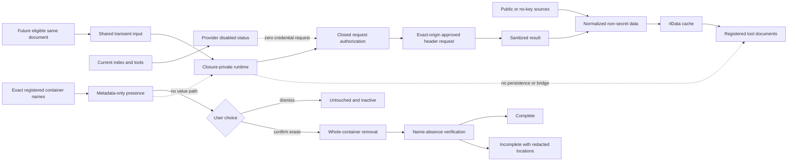
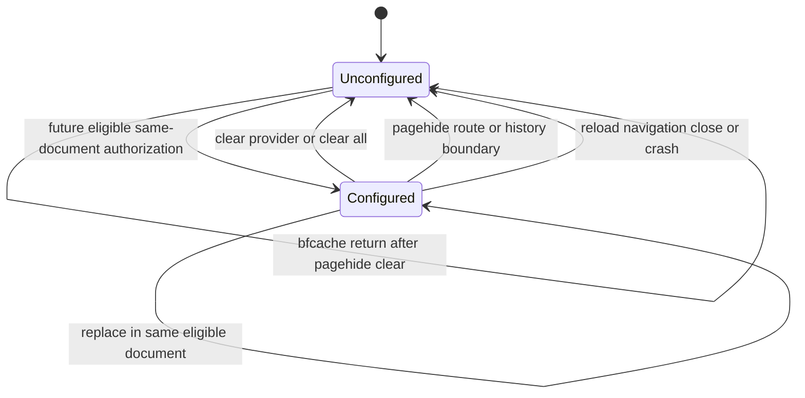
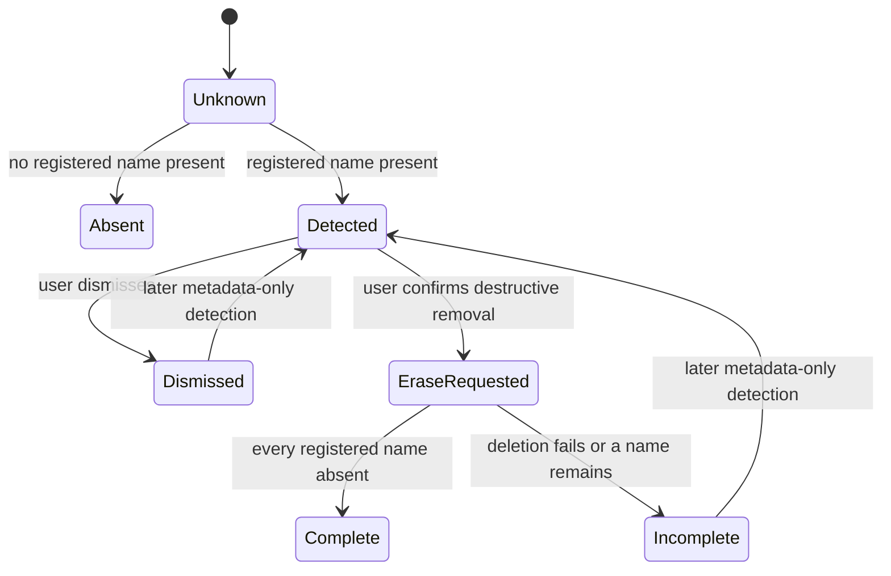
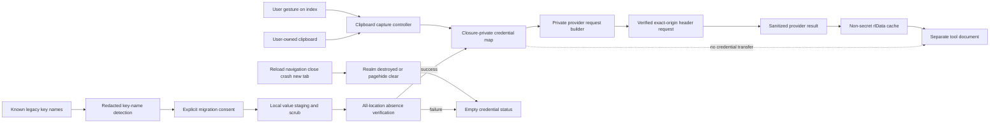
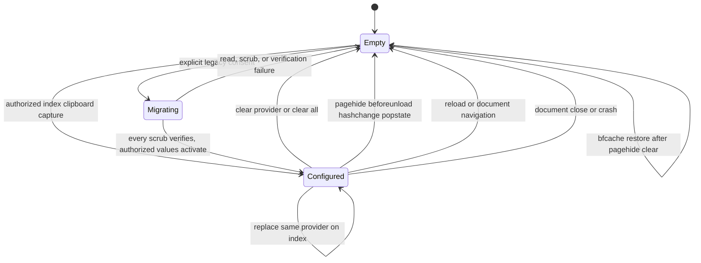
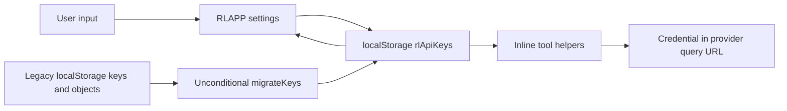
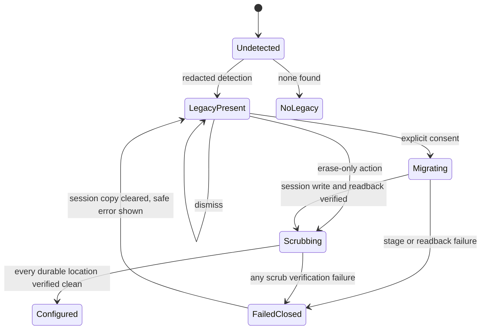

# Bug Fix Design: BUG-001 Central Provider Credential Security

Links: [bug.md](bug.md) | [spec.md](spec.md) | [scopes.md](scopes.md) | [report.md](report.md)

**Authoritative owner:** `bubbles.design`

**Active design status (2026-07-15):** Reconciled to the analyst-owned current-document-memory and erase-only contract. The active design ends immediately before `## Superseded Design Decisions`. Nothing below that boundary is an implementation, test, rollout, or certification contract.

## Design Brief

### Current State

`rldata.js` currently persists provider credentials in `sessionStorage`, exposes raw values through shared APIs, reads durable legacy values, and supports requests from those values. `rlapp.js`, `index.html`, direct tool consumers, `scripts/selftest.mjs`, and the provider suites encode reload or navigation continuity and value-preserving legacy handling.

Feature 004 classifies the session envelope and raw legacy handling as genuine High findings. It separately protects non-secret schema-1 `localStorage.rlData` behavior and records `F004-COLLISION-001` for the distinct `scripts/selftest.mjs` hunk hash `ab27e89cd0dd8c6dd640254615a10d15a2be008596ec72834ca4512766c646fc`.

### Target State

All current production providers are disabled for browser credential use. `index.html` owns no approved same-document provider operation, so it exposes no current credential-entry or credential-backed refresh path. Existing public/no-key acquisition and non-secret `rlData` behavior remain available.

The shared foundation retains only a future current-loaded-document memory capability. One loaded document may use it only when that document owns both the shared transient input and one independently approved provider operation. A credential has no serialized form, public raw getter, DOM persistence, client persistence, or cross-document bridge. Every document and route lifecycle boundary leaves the affected document unconfigured.

Known legacy material is handled by exact registered name only. The product can report provider/location classes and counts, disclose that whole-container removal can destroy nested non-secret preferences, let the user dismiss, remove selected registered containers as whole units, and verify those names are absent. No legacy value enters application memory for inspection or reuse. Partial removal is explicitly incomplete, and clear all empties current-document memory before cleanup starts.

### Patterns To Follow

- Keep `rldata.js` as the single shared capability owner and `rlapp.js` as the renderer of non-secret status and cleanup outcomes.
- Keep a frozen own-property-only provider registry with exact provider, document, operation, origin, authorization-evidence, transport, and CSP fields.
- Preserve schema-1 `localStorage.rlData`, `_mem`, `barSeries`, `putBarSeries`, `ensureBarSeries`, versioned `putToolRead`, and all public/no-key consumers.
- Derive complete page coverage from `tools.json`; include `index.html`, `rlnav.js`, `scripts/selftest.mjs`, and all provider suites in the consumer inventory.
- Capture a just-in-time dirty-tree baseline and change only proved BUG-001 hunks.

### Patterns To Avoid

- No browser storage, cookie, URL, history, form, opener, message, worker, cache, file, or DOM handoff for credential material.
- No public raw credential getter, bulk map, header exporter, arbitrary request builder, tool-local credential helper, or compatibility alias.
- No legacy value access, secret-derived signal, copying, reuse, mixed-container transformation, or path into current-document state.
- No current index credential control while index owns no approved same-document operation.
- No inferred provider authorization, query authentication, alternate origin, proxy, provider, retry transport, or default operation.
- No deletion or relabeling of valid `rlData`, identifier obfuscation, downstream framework patch, stash, reset, clean, checkout overwrite, staging, broad formatting, or whole-file source replacement.

### Resolved Decisions

- Closure-private memory in one current loaded document is the only credential lifetime.
- Reload, route/history transition, cross-document navigation, bfcache traversal, close/reopen, crash/reopen, tab, window, iframe document, browser context, and explicit clear all end or begin unconfigured.
- Twelve Data, Finnhub, Alpha Vantage, FRED, and every other current provider remain disabled. Failure occurs before credential collection or network use.
- Index is a non-secret status and legacy-cleanup surface only while it owns no approved same-document request.
- Legacy presence comes only from exact registered names and registry metadata. Cleanup removes whole containers and verifies name absence.
- Dismissal performs no read and no mutation. Confirmation authorizes deletion only.
- Clear all removes current-document references first. Cleanup failure never restores memory and never reports success.
- `DEP-BUG013-SEMANTIC-CLASSIFIER` remains the upstream dependency for classifying valid `rlData`, name enumeration, whole-container deletion, and name-absence verification without weakening G028.
- `F004-COLLISION-001` remains open under its existing owner and exact hash. Ambiguous hunk ownership stops delivery or rollback with provider transport disabled.

### Open Questions

None in the active technical design. Provider enablement is a future policy decision requiring exact evidence; no current entry is eligible by assumption.

## Purpose And Scope

This design removes credential persistence and legacy-value call graphs without changing Research Lab's static, build-free, multi-page architecture. It defines one provider-neutral current-document runtime, a closed provider/document/operation policy, truthful current disabled behavior, metadata-only legacy presence, destructive whole-container cleanup, status-only result contracts, exact-origin future transport, complete consumer coverage, BUG-013/G028 routing, and dirty-hunk-safe rollback.

It does not authorize source, test, plan, report-evidence, user-validation, framework-managed, or certification changes by `bubbles.design`.

## Root Cause Analysis

### Controlling Paths

| Path | Current behavior | Security consequence | Active target |
| --- | --- | --- | --- |
| `rldata.js::storageSurface/readCredentialEnvelope/writeCredentialEnvelope` | Serializes credentials in `sessionStorage` | Secrets survive required lifecycle boundaries | Remove the envelope and every credential storage adapter |
| `rldata.js::getKey/hasKey/setKey` | Returns raw values and serializes mutation | Consumers can recover or spread credentials | Replace with status, authorize/use, and clear contracts that never return a value |
| `rldata.js::collectLegacyCredentials` | Reads durable values during boot | Legacy material enters reachable application memory | Replace with exact container-name enumeration only |
| `rldata.js::_legacyDetection.credentials` | Retains recovered values | Redacted UI hides secret retention | Remove; retain provider/location/count metadata only |
| Legacy reuse entry point | Reuses durable values | Old secrets can become active again | Remove with no replacement API |
| Tool-state cleanup | Opens mixed containers to preserve preferences | Cleanup requires secret access and transformation | Remove the entire registered container after destructive disclosure |
| `rlapp.js::mountSettings` | Renders credential controls and continuity claims | Index appears able to configure separate tool documents | Render current disabled status and erase-only cleanup; no current credential control |
| Registered `hasKey/providerFetch` consumers | Depend on raw shared credentials | Tool documents bypass current-document isolation | Consume public/no-key paths and non-secret cache/status only |
| Provider tests and `scripts/selftest.mjs` | Treat persistence and old value handling as success | Regression coverage preserves the vulnerability | Invert to lifecycle clearing, zero value access, whole-container removal, and disabled providers |

### Root Cause

The prior design optimized convenience instead of honoring the trust boundary. Any reload or index-to-tool continuity in a static multi-page application requires persistence or a bridge, both prohibited. A shorter-lived store does not change that category.

The prior cleanup path also valued preservation of nested non-secret preferences over avoiding secret access. Once a credential-bearing container is treated as mixed structured data, opening and transforming it becomes unavoidable. The active spec resolves that conflict deliberately: registered legacy containers are opaque erase-only material. The user is warned about collateral preference loss, and the product removes the entire container without opening it.

## Capability Foundation



### Foundation Contract

| Contract | Responsibility | Consumers |
| --- | --- | --- |
| `DocumentCredentialRuntime` | Hold credentials in closure-private memory for one loaded document and clear on every required boundary | Future eligible same-document input and operation only |
| `ProviderPolicy` | Decide eligibility from explicit provider, document, operation, origin, transport, evidence, and CSP fields | Status, authorization, and request use |
| `LegacyLocationRegistry` | Map exact opaque container names to provider/location metadata and storage class | Presence detection, erase, and clear all only |
| Result records | Return frozen non-secret states, IDs, counts, projections, and closed codes | `rlapp.js` and approved data consumers |
| `rlData` cache contract | Persist normalized non-secret market data and tool reads | Index and every registered tool |

### Extension Points

- A provider policy supplies every mandatory field and independently verified authorization evidence. Missing data disables it.
- A provider operation binds one method, exact origin/path, non-secret parameters, approved header, response validator, and non-secret projection.
- An eligible document is listed only when that same loaded document owns shared input and the approved operation.
- A legacy-location entry supplies an exact container name, storage class, provider ID, redacted location class, and disclosure text ID. It supplies no field path, decoder, or transformation hook.

### Runtime State Machines





The legacy-presence state machine has no edge to `DocumentCredentialRuntime`.

## Data Model And Storage

There is no credential persistence model, schema version, compatibility envelope, serialized status, or data conversion. The only credential state is a closure-private null-prototype map created with the loaded document and discarded with that document or an explicit clear.

```text
DocumentCredentialRuntime {
  credentials: null-prototype private map<ProviderId, string>
  documentId: closed registered document ID
}
```

The map is not reachable through `window`, `RLDATA`, DOM nodes, events, history, workers, storage, cache objects, request results, or diagnostics. JavaScript cannot promise deterministic heap zeroization; the contract is removal of every application-reachable reference and creation of no application copy.

```text
ProviderPolicy {
  id: closed ProviderId
  browserOriginAuthorization: "unverified" | "verified"
  authorizationEvidence: readonly non-empty references
  authTransport: "unavailable" | "header"
  authHeaderName: string | null
  requestOrigins: readonly exact origins
  operations: readonly exact operation IDs
  eligibleDocuments: readonly exact document IDs
  cspProfile: "not-eligible" | "credential-capable-v1"
}

LegacyLocationPolicy {
  providerId: closed ProviderId
  storageClass: "localStorage" | "sessionStorage"
  containerName: exact string
  locationClass: closed redacted class
  destructiveEffect: closed disclosure text ID
}
```

`LegacyLocationPolicy` intentionally has no nested field path, decoder, serializer, preservation callback, value validator, equality rule, or destination. Existing schema-1 `localStorage.rlData` remains outside this registry.

## Concrete Implementations

### Current Index Status And Cleanup Surface

`index.html#data-settings` renders public provider metadata, a disabled reason for every current provider, legacy-presence metadata, destructive-effect disclosure, dismissal, erase-only cleanup, clear all, and complete/incomplete outcomes. It renders no current credential input, authorization action, or credential-backed refresh action because index owns no approved same-document operation.

### Registered Tool Documents

Registered tools expose no credential input, getter, setter, writer, store, request broker, or bridge. They retain existing public/no-key behavior and consume normalized non-secret `rlData`. Missing public data remains the existing unavailable or cached-status behavior; tools do not request a browser credential as fallback.

### Future Eligible Same-Document Capability

A future document may expose the shared transient control only after one exact policy authorizes that document and one operation. The control mounts blank, has no value-bearing attribute or submission name, passes a non-empty value directly to `authorizeCredential`, is blanked immediately, and receives only status. The same document may then call `useCredential` for the approved operation. No other document can retrieve or observe the credential.

This does not make index eligible automatically. Adding eligibility requires provider-policy, design, security, scenario, and test review. Until then every current provider remains disabled and no production credential collection occurs.

### Provider Dispositions

| Provider | Active disposition | Reason |
| --- | --- | --- |
| Twelve Data | Disabled | No verified browser-origin and approved non-URL header contract |
| Finnhub | Disabled | No complete browser-origin, exact-operation, same-document, and CSP evidence record |
| Alpha Vantage | Disabled | No complete browser-origin, exact-operation, same-document, and CSP evidence record |
| FRED | Disabled | No complete browser-origin, exact-operation, same-document, and CSP evidence record |
| Every other current entry | Disabled | Registry membership alone is not approval |

### Variation Axes

| Axis | Variants | Foundation ownership |
| --- | --- | --- |
| Provider eligibility | disabled, fully verified | Enforce full conjunction; policy owner supplies evidence |
| Authentication transport | unavailable, exact approved header | Reject query and alternate transport |
| Document authorization | ineligible, exact same-document owner | Reject cross-document use |
| Operation projection | bars, quotes, options, macro, another registered non-secret schema | Validate and normalize without raw response exposure |
| Legacy cleanup outcome | absent, detected, dismissed, complete, incomplete, unavailable | Own metadata, ordering, and vocabulary |

## Provider Registry And Request Construction

There is no default provider, origin, operation, transport, header, evidence record, document, or CSP profile. Unknown, empty, inherited, `constructor`, and `__proto__` identifiers fail before lookup or mutation. The current committed registry records every production provider disabled. A controlled test policy may exercise the generic eligible path without implying production approval.

For a future eligible policy, `useCredential(providerId, operationId, params)` resolves frozen own properties, verifies the exact document and CSP, requires private current-document state, builds one exact-origin URL from allowlisted non-secret parameters, rejects credential-shaped parameter names, places the credential only in the approved header, sets explicit method/no-referrer/no-store behavior, sends one request, validates the response internally, and returns only a non-secret projection or sanitized failure.

There is no credential-bearing redirect, query, proxy, alternate origin/provider/transport, or authentication retry. Raw `Request`, `Headers`, `Response`, provider body, URL, exception, stack, or cause never crosses the capability boundary.

## Public API And Typed Results

The capability exposes no raw getter, bulk map, storage handle, legacy value API, header exporter, arbitrary URL builder, or compatibility alias.

```text
RLDATA.providerPolicies() -> readonly ProviderPublicPolicy[]
RLDATA.credentialStatus(providerId) -> CredentialStatusResult
RLDATA.authorizeCredential(providerId, credential) -> CredentialMutationResult
RLDATA.useCredential(providerId, operationId, params) -> Promise<ProviderResult>
RLDATA.clearCredential(providerId) -> CredentialMutationResult
RLDATA.clearAllCredentials() -> Promise<ClearAllResult>
RLDATA.detectLegacyCredentialLocations() -> LegacyPresenceSummary
RLDATA.eraseLegacyCredentialLocations() -> Promise<LegacyEraseResult>
```

`authorizeCredential` validates provider and current-document eligibility before retaining a non-empty value. Blank input returns unchanged state and cannot clear or replace. The method never returns the input. With the current registry it returns `PROVIDER_DISABLED` before accepting a value.

```text
CredentialStatusResult {
  ok: boolean
  providerId: ProviderId
  state: "disabled" | "unconfigured" | "configured"
  lifetime: "current-document-memory"
  reasonCode: null | ClosedReasonCode
}

LegacyPresenceSummary {
  detected: boolean
  providerIds: readonly ProviderId[]
  locationClasses: readonly LegacyLocationClass[]
  containerCount: non-negative integer
}

LegacyEraseResult {
  ok: boolean
  status: "complete" | "incomplete" | "unavailable"
  removedContainerCount: non-negative integer
  remainingLocationClasses: readonly LegacyLocationClass[]
  remainingContainerCount: non-negative integer
  code: null | ClosedReasonCode
}

ClearAllResult {
  ok: boolean
  runtimeState: "unconfigured"
  cleanupStatus: "complete" | "incomplete" | "unavailable"
  remainingLocationClasses: readonly LegacyLocationClass[]
  remainingContainerCount: non-negative integer
  code: null | ClosedReasonCode
}
```

### Closed Reason Codes

```text
UNKNOWN_PROVIDER
PROVIDER_DISABLED
DOCUMENT_NOT_ELIGIBLE
CSP_NOT_ELIGIBLE
INVALID_CREDENTIAL
CREDENTIAL_MISSING
UNKNOWN_OPERATION
INVALID_PROVIDER_PARAMETER
PROVIDER_ORIGIN_FORBIDDEN
CREDENTIAL_QUERY_FORBIDDEN
TRANSPORT_UNAVAILABLE
PROVIDER_AUTH_FAILED
PROVIDER_REQUEST_FAILED
LEGACY_ERASE_UNAVAILABLE
LEGACY_ERASE_BLOCKED
LEGACY_ERASE_INCOMPLETE
CLEAR_INCOMPLETE
```

Results expose no free-form provider message, URL, headers, value length, digest, prefix, suffix, equality signal, body, stack, or serialized cause.

## Legacy Presence And Erase-Only Cleanup

### Exact Location Registry

| Storage class | Exact registered container names | Active behavior |
| --- | --- | --- |
| `localStorage` central | `rlApiKeys` | Detect name; disclose effect; remove whole container; verify name absent |
| `localStorage` scalar | `tdKey`, `etfMomTdKey`, `msftFhKey`, `etfMomFhKey` | Detect exact name; remove whole container; verify name absent |
| `localStorage` tool state | `etfMomLab`, `sectorLab`, `rlStratVal`, `strategyValidationLab`, `aiCapexApi` | Disclose loss of nested preferences; remove whole container; verify name absent |
| `sessionStorage` historical | `rlSessionProviderCredentialsV1` plus any separately registered exact historical container | Detect exact name; remove whole container; verify name absent |

`localStorage.rlData` is deliberately absent. Unknown names are untouched. Prefix or wildcard discovery does not create authority to inspect or remove a container.

### Metadata-Only Detection

Detection uses storage `length` and `key(index)` name enumeration plus exact own-property lookup. It does not use a value-returning storage operation for a registered legacy container and does not open cookies, Cache Storage bodies, IndexedDB records, or another value-bearing surface. Provider IDs and classes come from registry metadata, not stored content.

For a registered legacy container, the implementation never calls `getItem()` or an equivalent value-returning operation and never reads, parses, hashes, compares, copies, stages, migrates, selectively rewrites, or activates its value. There is no consent nonce, value transaction, preservation callback, or destination runtime for legacy material.

### Destructive Disclosure And Dismissal

Before removal, the UI explains that each registered container is opaque and whole-container deletion can remove non-secret preferences. Confirmation identifies provider/location classes and counts only. Dismissal performs no storage mutation and no value access; a later detection repeats name enumeration only.

### Whole-Container Removal And Verification

Cleanup snapshots selected exact names and redacted metadata from the registry, calls the platform whole-container deletion operation for each name, records only success/failure by redacted class, re-enumerates names, and reports `complete` only when every selected name is absent. Otherwise it reports `incomplete` or `unavailable` with remaining classes/counts.

It never uses a raw value API, creates a replacement container, writes a transformed remainder, preserves a nested field, or configures current-document memory.

### Clear-All Ordering

`clearAllCredentials()` synchronously removes current-document references, blanks any shared transient input, and sets status unconfigured before erase-only cleanup. If deletion throws or a selected name remains, it returns `CLEAR_INCOMPLETE`; memory stays empty and no value is restored.

## UI And Interaction Contract

Current index may show public provider labels and disabled reasons, detected provider/location classes and count, destructive disclosure, `Dismiss`, `Erase legacy containers`, `Clear all`, and complete/incomplete/unavailable status. It does not show a current credential input or credential-backed command.

The future shared transient input appears only in the exact eligible consuming document. It mounts blank, has no value attribute or submission name, is blanked synchronously, and is not mirrored into hidden fields, datasets, event details, history, accessibility text, or debug state. The visible result is status and sanitized operation output only.

Every registered tool starts unconfigured and has no credential control. Index navigation never claims to transfer configuration. Tools retain public/no-key and non-secret cache behavior.

## Security, Privacy, And Failure Handling

- Memory-only handling does not protect against malicious JavaScript already executing in the same document. Script provenance, CSP, dependency integrity, and XSS prevention remain provider-eligibility gates.
- No encoding or client encryption changes the storage prohibition.
- Status and cleanup expose no credential-derived metadata.
- Legacy cleanup is delete-only and cannot become a recovery interface.
- Current public/no-key acquisition receives no credential fallback.

| Condition | Required result |
| --- | --- |
| Unknown or prototype-shaped provider | `UNKNOWN_PROVIDER`; no runtime, registry, storage, or prototype mutation |
| Current provider | `PROVIDER_DISABLED`; no value accepted and no request sent |
| Wrong document or CSP | `DOCUMENT_NOT_ELIGIBLE` or `CSP_NOT_ELIGIBLE`; no value accepted and no request sent |
| Blank future input | State unchanged; no clear or replacement |
| Invalid non-empty future input | `INVALID_CREDENTIAL`; runtime unchanged |
| Lifecycle boundary | Affected document unconfigured; no bridge payload |
| No registered legacy name | `detected=false`; no cleanup prompt |
| Registered name detected | Provider/location classes and count only; runtime empty |
| Cleanup dismissed | Containers untouched and inactive; no value access |
| Deletion unavailable | `LEGACY_ERASE_UNAVAILABLE`; redacted classes/counts only |
| Deletion throws or name remains | `LEGACY_ERASE_INCOMPLETE`; no success claim |
| Clear-all cleanup incomplete | `CLEAR_INCOMPLETE`; current memory empty |
| Forbidden request input | Typed failure; zero request |
| Provider failure | One sanitized result; no alternate attempt or raw diagnostic |

### Authorization Matrix

| Operation | Current index | Current tool | Future eligible document | Unknown/disabled provider |
| --- | --- | --- | --- | --- |
| View public metadata/status | Allow | Allow | Allow | Safe rejection/status only |
| View/dismiss/erase legacy presence | Allow | Deny | Deny unless designated cleanup owner | Cleanup remains provider-neutral |
| Clear invoking-document memory | Allow, currently empty | Allow, currently empty | Allow | Safe empty/rejected result |
| Authorize credential | Deny | Deny | Allow only after all policy/CSP checks | Deny before value acceptance |
| Use credential-backed operation | Deny | Deny | Exact approved operation only | Deny with zero requests |
| Consume normalized `rlData` | Allow | Allow | Allow | Allow when non-secret data exists |

### CSP Eligibility

A future `credential-capable-v1` document requires self-only/hash-bound scripts without unsafe or remote execution, `object-src 'none'`, `base-uri 'none'`, `form-action 'none'`, exact `connect-src`, no inspecting third-party scripts, safe rendering, no-referrer policy, and a static binding between document, provider policy, and CSP. No current document is approved.

### Output Disclosure Boundary

Credential values never appear in HTML, text, attributes, input remounts, accessibility output, events, history, logs, errors, analytics, telemetry, screenshots, traces, snapshots, assertion messages, request URLs, document URLs, referrers, resource entries, diagnostics, browser storage, cache data, worker messages, or generated test artifacts.

A controlled eligible test policy uses a unique sentinel and scans DOM/accessibility, public result objects, console/errors, URLs/redirects/referrers/performance entries, every client-storage and bridge class used by the product, and generated browser-test artifacts. Failure messages use a fixed sentinel label and never print the sentinel.

## Observability And Failure Handling

Research Lab emits no credential logs, metrics, traces, analytics, or remote status events. The only operational visibility for this static capability is current-document UI state using closed provider IDs, location classes, counts, and reason codes. Complete cleanup, incomplete cleanup, disabled provider, rejected operation, and sanitized provider failure remain distinguishable without recording a credential-derived signal.

Tests observe behavior through returned frozen records, DOM status, storage-name enumeration, request metadata, and sentinel-absence scans. They do not add a debug mode, secret-bearing diagnostic hook, or telemetry sink. A failure to inspect a raw value is not an observability gap; it is the intended security boundary.

## Compatibility And Protected Shared Behavior

### Non-Secret `rlData` And Feature 004

Schema-1 `localStorage.rlData` remains the durable non-secret cache. `load`, `save`, quota pruning, `_mem`, bars, quotes, options, macro, events, `toolReads`, freshness, and request status remain unchanged. No credential API writes into it.

BUG-001 also preserves `seriesMetaValid`, `putBarSeries`, `barSeries`, `ensureBarSeries`, optional bar-bucket `seriesMeta` and source/retrieval/rights clocks, versioned `putToolRead` for `rl-tool-read/v1`, unversioned non-secret behavior, browser/CommonJS/source-rights canaries, and `F004-COLLISION-001` with hash `ab27e89cd0dd8c6dd640254615a10d15a2be008596ec72834ca4512766c646fc`.

## Complete Consumer Inventory

| Surface | Required reconciliation | Protected behavior |
| --- | --- | --- |
| `rldata.js` | Remove envelope/raw/legacy-value paths; add private runtime, closed policy, status, exact-name detection, whole-container erase, and private use | Non-secret cache and Feature 004 additions |
| `rlapp.js` | Remove current credential controls/continuity; render disabled status, disclosure, dismissal, erase, clear, incomplete result | Shared data-status shell |
| `index.html` | Keep provider status and cleanup only | Registry, cards, links, non-secret page behavior |
| `tools.json` | Remain canonical registry and sweep input | Current records and ordering |
| `rlnav.js` | Preserve links/order and block opener transfer | Navigation behavior |

The registry-derived page sweep covers `market-brief.html`, `market-heatmap-lab.html`, `options-flow-feed-lab.html`, `intraday-tape-lab.html`, `swing-structure-lab.html`, `options-structure-lab.html`, `gamma-trading-lab.html`, `sector-research-lab.html`, `global-rotation-lab.html`, `real-assets-lab.html`, `bond-regime-lab.html`, `ai-capex-strategy-lab.html`, `msft-july-print-model.html`, `etf-momentum-lab.html`, `strategy-self-improvement-lab.html`, `strategy-validation-lab.html`, `smart-money-flow-lab.html`, and `waterfront-polo-lab.html`. A newly registered page is included automatically.

`ai-capex-strategy-lab.html`, `etf-momentum-lab.html`, and `msft-july-print-model.html` currently call credential-aware methods and must retain only public/no-key and non-secret cache/status behavior. `strategy-validation-lab.html` and any page with credential-shaped state, comments, or old helper names remain in the stale-reference scan.

| Test/harness | Required reconciliation |
| --- | --- |
| `scripts/selftest.mjs` | Prove no serialized/raw/legacy-value path, exact-name cleanup, disabled providers, preserved `rlData`, and collision baseline |
| `tests/provider-credentials.support.mjs` | Seed opaque legacy containers only in setup; expose lifecycle controls with no active store constant |
| `tests/provider-credentials.unit.mjs` | Private runtime, closed results, lifecycle clearing, own-property policy, request rules |
| `tests/provider-credentials.functional.mjs` | Name-only detection, dismissal, whole-container erase, zero value access, clear-first ordering, incomplete cleanup |
| `tests/provider-credentials.spec.mjs` | Current disabled UI, cleanup disclosure/dismiss/erase, future controlled same-document path, zero bridges/disclosure |
| `tests/provider-credentials.stress.mjs` | Repeated detect/dismiss/erase/clear/failure and controlled memory cycles with bounded metadata |
| `tests/provider-credentials.load.mjs` | Every page/context empty; no transfer, storage, raw API, or unverified request |
| `tests/feature-004-dirty-tree-collision.test.mjs` | Preserve exact collision finding and hash |

Docs owners must reconcile stale claims in `.github/copilot-instructions.md`, `.specify/memory/agents.md`, `README.md`, `notes/shared-data-layer.md`, `notes/market-brief.md`, `notes/options-structure-lab.md`, `notes/sector-research-lab.md`, and relevant tool notes. Cross-spec owners must reconcile old provider-canary assumptions in `specs/001-causal-rotation-intelligence/design.md`, Feature 004 planning, and `specs/006-trend-dynamics-cycle-lab/spec.md`. Historical report evidence remains unchanged.

## Configuration, Removal, And Rollout

No dependency, backend, service worker, environment variable, generated credential file, credential schema, compatibility configuration, data conversion, or credential destination is introduced. Provider policies remain committed closed records; missing fields disable the provider. Registered legacy containers are opaque removal targets only.

Delivery order is scenario-first failures, just-in-time dirty-hunk baseline, surgical removal of unsafe call graphs/consumers, metadata-only erase behavior and future foundation, focused provider/cache/collision checks, provider E2E/stress/load, Bond/Causal/FX canaries, then G028 one-to-one reconciliation against canonical BUG-013. No rollout step enables a current provider.

## Testing And Validation Strategy

| Scenario | Technical assertion | Categories |
| --- | --- | --- |
| SCN-BUG001-001 | One shared capability; zero tool-local input/getter/setter/writer/store/broker; index status/cleanup only | unit, integration, e2e-ui |
| SCN-BUG001-002 | Every named lifecycle boundary ends unconfigured with no bridge | functional, e2e-ui, load |
| SCN-BUG001-003 | Controlled future same-document input blanks immediately, returns status only, and is consumed by one approved operation | unit, functional, e2e-ui |
| SCN-BUG001-004 | Exact-name detection, inert dismissal, whole-container deletion, name absence, runtime empty | functional, e2e-ui, stress |
| SCN-BUG001-005 | Rogue provider IDs fail without mutation | unit, functional, e2e-ui |
| SCN-BUG001-006 | Clear all empties memory first; partial deletion explicit; no restoration | functional, e2e-ui, stress |
| SCN-BUG001-007 | Sentinel absent from every output/storage/bridge/request/artifact surface | e2e-ui, stress |
| SCN-BUG001-008 | Index-to-tool navigation empty; every registered tool has zero credential surface/bridge | integration, e2e-ui, load |
| SCN-BUG001-009 | Twelve Data and every incomplete current policy send zero credential requests | functional, e2e-ui |
| SCN-BUG001-010 | Controlled eligible policy sends exactly one exact-origin approved-header request with no fallback | unit, functional, e2e-ui |
| SCN-BUG001-011 | One-to-one G028 closure while `rlData`, dirty hunks, framework immutability, and provider/Bond/Causal/FX canaries remain intact | integration, e2e-ui |

Legacy cleanup tests seed opaque registered containers during setup, then fail if production invokes a value-returning operation for those names, writes a selected registered name, creates a transformed replacement, or configures credential memory. Production may enumerate names and call whole-container deletion only. Tests assert registry-derived metadata, zero mutation on dismissal, disclosure before confirmation, selected names absent on success, explicit incomplete state on forced deletion failure, byte-compatible `rlData`, and unconfigured runtime throughout cleanup.

Required checks include provider unit/functional/E2E/stress/load, `node scripts/selftest.mjs`, `node --test tests/feature-004-dirty-tree-collision.test.mjs`, and the complete `system-chrome` suites in `tests/bond-regime-lab.spec.mjs`, `tests/causal-rotation-lab.spec.mjs`, and `tests/fx-regime-relative-value-lab.spec.mjs`. Artifact lint, freshness, traceability, capability foundation, framework-write, and path-scoped diff checks remain required. No historical persistence, continuity, credential-control, or legacy-value result proves this contract.

## Surgical Rollback And Dirty-Tree Safety

Before shared-file edits, implementation records path status, tracked index OID, worktree SHA-256, and distinct hunk-body hashes. For `scripts/selftest.mjs`, it compares the Feature 004 baseline and exact `F004-COLLISION-001` hash. A mismatch or ambiguous owner stops the edit.

Rollback applies an inverse patch only to verified BUG-001 hunks after confirming unrelated hunk hashes still match. It never uses stash, reset, clean, checkout overwrite, broad formatting, whole-file source replacement, staging, or an earlier whole-file copy.

The fail-closed rollback state has provider entry/transport disabled, current-document runtime empty, metadata-only detection and whole-container removal retained only when ownership is unambiguous, no persistence/raw/legacy-value/bridge path restored, and `rlData`, Feature 004, collision validator, and concurrent hunks preserved. If inverse ownership cannot be proved, rollback leaves the file untouched and provider transport disabled.

## G028 And BUG-013 Reconciliation

This design requests no sensitive-client-storage exception. Product implementation removes active browser credential persistence/use and all legacy value access/reuse.

`DEP-BUG013-SEMANTIC-CLASSIFIER` must classify non-secret schema-1 `rlData`, exact storage name enumeration, whole-container deletion, and re-enumerated name-absence verification without weakening G028. It must continue rejecting credential serialization, raw value access, mixed-container transformation, secret-derived signals, and ambiguous indirect secret flow.

G028-01 through G028-09 and the central-store blind spot each require exactly one addressed or owner-routed disposition. Duplicate rows do not permit duplicate closure. Research Lab adds no exception, evasion rename, cache deletion, or downstream `.github/bubbles/**` edit.

## Alternatives And Tradeoffs

| Alternative | Decision | Rationale |
| --- | --- | --- |
| Keep `sessionStorage` | Rejected | Sensitive client persistence survives required boundaries |
| Encode/encrypt browser state | Rejected | Same-origin recovery capability and persistence remain |
| URL/opener/message/worker transfer | Rejected | Creates a cross-document credential bridge |
| Open mixed containers to preserve preferences | Rejected | Requires value access and selective transformation |
| Recover old credentials into memory | Rejected | Legacy material is erase-only |
| Derive a digest or equality signal from old values | Rejected | Secret-derived signals are prohibited and unnecessary |
| Remove whole registered containers | Selected | Enables delete-only cleanup with truthful disclosure |
| Leave containers untouched only | Rejected | Dismissal remains, but explicit erase-only remediation is required |
| Add backend vault | Rejected for this bug | Safe current result is disabled providers; backend changes architecture |
| Keep current providers disabled | Selected | No current policy clears every gate |
| Delete `rlData` or rename code for scanner | Rejected | Breaks valid behavior or evades truthful closure |

## Complexity Tracking

| Decision | Simpler alternative | Why insufficient |
| --- | --- | --- |
| Closed provider/document/operation registry | One global disabled boolean | Spec retains a testable future foundation without current eligibility |
| Closure-private runtime with internal use | Public raw getter | Getter defeats one-owner containment |
| Exact legacy-location registry | Delete every storage key | Would destroy unrelated state including `rlData` |
| Destructive disclosure | Silent deletion | User must understand collateral preference loss |
| Complete/incomplete result | Treat deletion attempt as success | Success requires name absence |
| Lifecycle hooks | Realm destruction only | Route changes and bfcache can preserve realm |
| Registry-derived consumer sweep | Patch known callers only | New or indirect pages could retain stale behavior |
| Hunk-aware inverse rollback | Restore prior file | Prior file restores unsafe paths and overwrites concurrent work |

## Risks And Finding Dispositions

| Finding | Active disposition | Owner |
| --- | --- | --- |
| `BUG001-SPEC-MIGRATION-CONFLICT` | Addressed: active design has no legacy value ingress, reuse, selective preservation, or destination; cleanup is metadata-only and whole-container erase | `bubbles.design` |
| `DEP-BUG013-SEMANTIC-CLASSIFIER` | Preserved unresolved dependency; semantics must arrive from canonical Bubbles | Canonical BUG-013 owner |
| `F004-COLLISION-001` | Preserved open with exact hash; no hunk is overwritten or rebaselined here | Feature 004 owning workflow |

Current design work changes no product code, tests, foreign planning artifacts, historical report evidence, framework-managed files, or certification state.

## Superseded Design Decisions

> **Historical, non-active, and prohibited for implementation.** Every retained heading below is explicitly history. References to persistence, raw legacy values, consented value reuse, selective cleanup, provider activation, or clipboard collection remain only to explain rejected prior designs. Historical report evidence remains unchanged.

### History: Prior Memory Design

#### History: Current State

`rldata.js` currently owns a versioned `sessionStorage.rlSessionProviderCredentialsV1` envelope, exposes raw single-provider reads through `RLDATA.key()`, and feeds the value into provider request headers. Its legacy path reads raw values from `localStorage`, retains them in `_legacyDetection.credentials`, and can copy them into the session envelope. `rlapp.js`, `index.html`, the provider tests, and `scripts/selftest.mjs` actively encode reload/navigation continuity and consented value migration.

Feature 004 security evidence classifies both raw legacy staging and the session envelope as genuine High findings. The same evidence classifies the non-secret `localStorage.rlData` cache and verified erase/readback line as scanner false positives, and preserves open collision finding `F004-COLLISION-001` for the distinct `scripts/selftest.mjs` hunk hash `ab27e89cd0dd8c6dd640254615a10d15a2be008596ec72834ca4512766c646fc`.

#### History: Target State

All current production providers are disabled for browser credential use. `index.html` owns no approved same-document provider operation, so it exposes no current credential-entry or credential-backed refresh path. Existing public/no-key paths and normalized non-secret `localStorage.rlData` behavior remain available.

The shared foundation retains only a future current-loaded-document memory capability. A provider can use it only when one loaded document owns both the shared transient input and one independently approved request operation. The credential has no serialized form, public raw getter, DOM persistence, client persistence, or cross-document bridge, and every document or route lifecycle boundary leaves the resulting document unconfigured.

Known legacy material is metadata-only and erase-only. The product may enumerate exact registered container names, disclose that whole-container removal can also destroy non-secret preferences, allow dismissal, remove selected registered containers as whole units, and verify those names are absent. It never reads, parses, hashes, compares, copies, stages, migrates, selectively rewrites, or activates a legacy value. Partial removal is an explicit incomplete outcome, and current-document memory is cleared before cleanup begins.

#### History: Patterns To Follow

- Keep the `rldata.js` IIFE as the central owner and `rlapp.js` as the shared UI/status owner; do not add a second store or tool-local helper.
- Keep the closed `PROVIDER_POLICIES` pattern, exact provider origins, header-only transport metadata, no-referrer requests, and safe reason-code results already present in `rldata.js`.
- Preserve the non-secret schema-1 `localStorage.rlData` cache, `_mem` mirror, `barSeries`/`putBarSeries`/`ensureBarSeries`, versioned `putToolRead`, and all existing market-data consumers.
- Preserve registry-derived consumer coverage through `tools.json`, `index.html`, `rlnav.js`, `scripts/selftest.mjs`, and the provider credential suites.
- Preserve Feature 004's hunk-identity validator and its recorded dirty-tree baseline; make only surgical changes after a fresh just-in-time baseline.

#### History: Patterns To Avoid

- Do not follow the current envelope methods (`storageSurface`, `readCredentialEnvelope`, `writeCredentialEnvelope`) or any `localStorage`, `sessionStorage`, IndexedDB, Cache Storage, cookie, service-worker, URL, `window.name`, opener, `postMessage`, BroadcastChannel, SharedWorker, or file persistence bridge for credentials.
- Do not follow boot-time `collectLegacyCredentials()`, `_legacyDetection.credentials`, or any other raw legacy-value path. Cleanup never opens a registered legacy container.
- Do not parse mixed tool state or preserve selected nested fields. The entire registered container is removed after destructive-effect disclosure.
- Do not expose a current credential control on index while index owns no approved same-document provider operation.
- Do not preserve the index-only editor as if it can configure a separate tool document. That is a false continuity promise in a static multi-page application.
- Do not seek a G028 exception for `sessionStorage`, rename identifiers to evade matching, delete valid `rlData` cache behavior, or patch the downstream framework installation.

#### History: Resolved Decisions

- Active credentials are closure-private, current-document memory only; there is no credential storage schema or serialized envelope.
- Every document lifecycle boundary clears app-owned references; `pagehide` also clears bfcache-preserved realms.
- Public code receives status and sanitized provider results, never a credential string, bulk map, request headers, or raw `Response`/error body.
- Index is a non-secret status and cleanup surface only under the current registry. A future eligible document may expose the shared transient input only when that same loaded document owns an approved operation.
- Legacy presence is derived from exact registered names and frozen provider/location metadata only. Confirmation authorizes whole-container deletion only; dismissal authorizes no read or mutation.
- Clear all removes current-document references first. Cleanup failure never restores memory and never reports success.
- Provider enablement is a closed conjunction: verified browser-origin authorization, header transport, exact request origin/operation, index-document configuration/consumption, and credential-capable CSP. Missing evidence means disabled.
- Current providers remain disabled for browser credential use. Existing public/no-key market-data paths continue independently.
- BUG-013 remains an upstream dependency for semantic classification of non-secret `rlData`, exact-name detection, whole-container deletion, and name-absence verification. No session-storage approval or legacy-value exception is added.
- Rollback never restores `localStorage` or `sessionStorage` credentials. Ambiguous hunk ownership stops rollback and leaves provider transport disabled.

#### History: Open Questions

None in the active technical design. Provider enablement remains a future policy decision requiring exact evidence; no current provider or document is eligible by assumption.

### History: Purpose And Scope

This design replaces the credential lifecycle and provider request boundary without changing Research Lab's static hosting model, adding a backend, or weakening cache-first market-data behavior. It owns the technical contract for:

- current-document credential lifetime and clearing;
- truthful same-document UX in a static multi-page application;
- a closed provider authorization/transport registry;
- redacted key-name-only boot detection plus explicit consented migration and verified scrub;
- narrow public APIs, closed typed errors, and non-secret status;
- provider request construction, output redaction, disclosure scanning, and CSP/XSS eligibility;
- complete first-party consumer impact, Feature 004 collision preservation, and fail-closed rollback;
- compatibility with non-secret `localStorage.rlData` caching and Feature 004 source-envelope additions; and
- conformance with the existing G028 absolute policy.

This design does not authorize product, test, plan, report, documentation, framework, or certification edits by `bubbles.design`. It defines the target those owners must consume.

### History: Root Cause Analysis

#### History: Controlling Paths

| Path | Current behavior | Security consequence | Active target |
| --- | --- | --- | --- |
| `rldata.js::storageSurface/readCredentialEnvelope/writeCredentialEnvelope` | Persists a multi-provider credential object in `sessionStorage` | Same-origin scripts can recover secrets after reload/navigation | Remove; closure-private map only |
| `rldata.js::getKey/hasKey/setKey` | Returns raw values and serializes updates | Broad consumer access and persistence | Replace with status, mutation, clear, and internal fetch APIs that never return values |
| `rldata.js::collectLegacyCredentials` | Calls `getItem()` during boot and stores raw legacy values in module state | Legacy secrets are staged without a user transaction | Replace boot behavior with key-name enumeration; permit value reads only inside explicit migration |
| `rldata.js::_legacyDetection.credentials` | Retains raw legacy values | Redacted UI masks active secret staging | Remove; retain redacted location metadata only |
| `rldata.js::migrateLegacyCredentials` | Copies legacy values into the session envelope before the durable cleanup contract is complete | Consent activates prohibited persistence and partial-success risk | Replace with one-shot local staging, complete scrub verification, then authorized memory activation |
| `rlapp.js::mountSettings` | Renders password inputs and promises tab continuity | Raw credentials enter DOM state and UX asserts an unsafe lifecycle | Replace with index-only clipboard capture, migration, refresh, clear, and status actions |
| Registered tool calls to `hasKey/providerFetch` | Depend on index-to-tool continuity | Separate documents cannot share memory | Remove credential calls; tools consume normalized cache/status and route refresh to index |
| Provider tests/selftest | Treat session persistence and migration-to-session as success | Regression suite preserves the vulnerability | Invert to memory-only, navigation-clearing, scrub-before-activation assertions |

#### History: Root Cause

The prior repair optimized credential lifetime rather than eliminating client persistence. It treated `sessionStorage` as ephemeral enough and treated consent as authority to reactivate legacy secrets before a fail-closed remediation boundary was proven. Those are category errors under the binding policy: provider API keys are sensitive trust material, every browser storage class is prohibited, and consent cannot authorize new persistence or partial activation. Consent can authorize one bounded remediation transaction only when complete durable scrub is verified before any value enters the active memory vault.

The index-only editor introduced a second architectural error. `index.html` and each registered tool are separate document realms; current-page memory cannot cross that boundary. The former design therefore required persistence to deliver its UX promise. Removing persistence requires either same-document configuration and consumption or disabled browser credential use, never an invisible handoff.

### History: Capability Foundation



#### History: Runtime Ownership

`rldata.js` owns one `DocumentCredentialRuntime` closure in `index.html`. The closure contains a null-prototype map keyed only by closed provider IDs. Tool documents instantiate no credential vault. No credential value is attached to `window`, `RLDATA`, DOM nodes, events, history state, worker messages, request URLs, or cache objects.

`rlapp.js` owns rendering. A user-gesture handler asks the Clipboard API for text and passes the returned string directly into a private capture operation without creating a DOM field, attribute, prompt, event detail, or global value. It receives only a sanitized result. Provider refresh executes through a closed index-document operation and returns only normalized non-secret data or a typed failure; tool pages cannot retrieve the string, invoke the broker, or inspect constructed auth headers.

#### History: Credential Lifetime State Machine



Application code synchronously deletes map and migration-staging entries and drops clipboard/local references. JavaScript does not provide deterministic heap zeroization; the guarantee is that Research Lab retains no reachable reference and writes no copy. Browser/OS crash dumps and the user-owned clipboard remain outside application control and are not described as application persistence mechanisms.

#### History: Navigation And Context Rules

- `pagehide` clears memory even when `event.persisted === true`, so a bfcache-restored document resumes unconfigured.
- `beforeunload` is a redundant best-effort clear, not the primary guarantee.
- `hashchange` and `popstate` clear memory because the active contract treats same-document route navigation as a lifecycle boundary.
- Reload and cross-document navigation destroy the realm after the clear hook.
- A new tab, window, iframe document, or browser context creates an independent empty runtime. No opener, `window.name`, `postMessage`, BroadcastChannel, storage event, worker, URL, or DOM handoff exists.
- First-party links that open a new context retain `rel="noopener noreferrer"` and no-referrer behavior.
- Explicit clear affects only the invoking document's memory plus origin-wide known legacy containers. It cannot and does not claim to reach memory in another already-open document.

### History: Concrete Implementations

#### History: Index Credential Controller And Static Multi-Page UX

The landing page cannot configure a tool document directly because navigation destroys its JavaScript realm. `index.html#data-settings` is therefore the only credential-capable surface and performs the complete same-document workflow: clipboard capture or consented legacy migration, provider refresh, normalization, cache write, status, clear, and verified scrub.

The index page renders no credential `<input>`, `<textarea>`, `contenteditable`, hidden field, form value, or prompt. For each verified provider it may render `Use key from clipboard`, closed refresh actions, `Clear`, and redacted status. Clipboard access is requested only from the explicit button gesture. Denial, unavailable secure-context support, or empty text returns `CLIPBOARD_UNAVAILABLE` or `INVALID_CREDENTIAL`; there is no DOM or storage fallback.

Registered tools never render a credential control and never invoke the provider broker. They consume only normalized non-secret `rlData`. If required cached data is missing or stale, a tool may link to `index.html#data-settings` with copy such as `Refresh provider data from Data settings`; it must not claim the credential will follow the navigation. After the index refresh completes, navigation clears the key while the tool reads the non-secret cache.

#### History: Provider Dispositions

| Provider | Active disposition |
| --- | --- |
| Finnhub | Disabled until official evidence proves browser-origin use, exact header authentication, allowed origin/operations, and a current review window for the index document |
| Twelve Data | Disabled because query-key browser transport is forbidden and no approved header contract exists |
| Alpha Vantage | Disabled until a complete verified header/browser-origin policy exists |
| FRED | Disabled until a complete verified header/browser-origin policy exists |

#### History: Variation Axes

- **Authorization:** verified browser-origin policy versus disabled provider.
- **Transport:** exact header authentication versus unavailable; query authentication has no implementation variant.
- **Response projection:** bars, quotes, options, macro, or another explicitly registered non-secret schema.
- **Credential source:** user-gesture clipboard capture versus explicit legacy migration; both terminate in the same private vault.
- **Consumer context:** index refresh producer versus separate tool-page cache consumer.

### History: Provider Registry And Request Construction

#### History: Closed Provider Policy

```text
ProviderPolicy {
  id: "twelvedata" | "finnhub" | "alphavantage" | "fred"
  label: string
  enrollmentUrl: https URL
  browserOriginAuthorization: "unverified" | "verified"
  authTransport: "unavailable" | "header"
  authHeaderName: string | null
  authorizationEvidence: readonly non-empty references
  requestOrigins: readonly exact origins
  operations: readonly closed operation IDs
  eligibleDocuments: readonly ["index.html"] when verified
  cspProfile: "not-eligible" | "credential-capable-v1"
}
```

There is no default provider, origin, operation, transport, header, evidence, or document. Unknown, empty, inherited, `constructor`, and `__proto__` identifiers return a typed failure before lookup or mutation. A provider is enabled only when every eligibility field is explicit and internally consistent.

#### History: Private Request Builder

The public caller supplies `{ providerId, operationId, params }`, not an arbitrary URL or headers object. The private builder:

1. resolves the provider and operation from own properties in the frozen registry;
2. requires the current top-level document to be `index.html` and a configured in-memory credential;
3. constructs the URL from the registry's exact origin/path template and allowlisted non-secret parameters;
4. normalizes parameter names and rejects `token`, `apikey`, `api_key`, `access_token`, `key`, and equivalent credential-shaped names before URL construction;
5. adds the credential only to the exact approved header;
6. sets `referrerPolicy: "no-referrer"`, `cache: "no-store"`, and an explicit request method;
7. performs exactly one request with no query-auth, proxy-auth, or provider fallback; and
8. consumes the raw response internally, returning only an operation-specific validated payload or a sanitized typed failure.

Raw `Request`, `Headers`, `Response`, provider error body, request URL containing credentials, or thrown transport exception never crosses the public boundary. A 401/403 maps to `PROVIDER_AUTH_FAILED`; no retry changes the authentication channel.

### History: Public API And Typed Results

The credential capability exposes no `key()`, `keys()`, bulk map, envelope, storage handle, public raw setter, or raw request builder.

```text
RLDATA.providerPolicies() -> readonly ProviderPublicPolicy[]
RLDATA.credentialStatus(providerId) -> CredentialStatusResult
RLDATA.captureCredentialFromClipboard(providerId) -> Promise<CredentialMutationResult>
RLDATA.clearCredential(providerId) -> CredentialMutationResult
RLDATA.clearAllCredentials() -> Promise<ClearAllResult>
RLDATA.detectLegacyCredentialLocations() -> LegacyLocationSummary
RLDATA.migrateLegacyCredentials(consentToken) -> Promise<LegacyMigrationResult>
RLDATA.eraseLegacyCredentialLocations() -> Promise<LegacyEraseResult>
RLDATA.refreshProviderData(providerId, operationId, params) -> Promise<ProviderResult>
```

`captureCredentialFromClipboard()` checks provider and index-document eligibility before requesting clipboard permission. It trims only surrounding whitespace, rejects empty input, stores the string only in the closure, drops the local reference, and returns status. It never returns the input. In the present registry it returns `PROVIDER_DISABLED` for every provider before reading the clipboard.

#### History: Closed Error Codes

```text
UNKNOWN_PROVIDER
PROVIDER_DISABLED
DOCUMENT_NOT_ELIGIBLE
CSP_NOT_ELIGIBLE
CLIPBOARD_UNAVAILABLE
INVALID_CREDENTIAL
CREDENTIAL_MISSING
UNKNOWN_OPERATION
INVALID_PROVIDER_PARAMETER
PROVIDER_ORIGIN_FORBIDDEN
CREDENTIAL_QUERY_FORBIDDEN
TRANSPORT_UNAVAILABLE
PROVIDER_AUTH_FAILED
PROVIDER_REQUEST_FAILED
CONSENT_REQUIRED
LEGACY_MIGRATION_INCOMPLETE
LEGACY_VALUE_AMBIGUOUS
LEGACY_ERASE_UNAVAILABLE
LEGACY_ERASE_BLOCKED
LEGACY_ERASE_INCOMPLETE
CLEAR_INCOMPLETE
```

Failures are frozen plain records with only `ok: false`, `code`, optional provider/operation IDs, and redacted location classes. They contain no free-form exception message, URL, headers, credential length/hash/prefix/suffix, provider response body, stack, or serialized cause. Unknown codes are not accepted; internal unknown failures map to `PROVIDER_REQUEST_FAILED` or `CLEAR_INCOMPLETE` at the owning boundary.

#### History: Non-Secret Status

```text
CredentialStatus {
  providerId
  state: "disabled" | "unconfigured" | "configured"
  lifetime: "document-memory"
  reasonCode: null | closed error code
}
```

Status may expose provider ID, configured boolean/state, eligibility, and reason code. It never exposes whether a legacy value matched a particular credential, any secret-derived hash or length, or a credential-bearing diagnostic.

### History: Legacy Detection, Consented Migration, And Scrub

#### History: Known Location Registry

The location registry contains exact storage names, closed provider mappings, known credential fields, and sanitation rules. It has no wildcard, dynamic discovery, fallback decoder, or persistent staging surface.

| Storage class | Known names | Consented remediation behavior |
| --- | --- | --- |
| `localStorage` central | `rlApiKeys` | Inside migration only, stage exact allowlisted provider fields; remove the whole key; verify absence |
| `localStorage` scalar | `tdKey`, `etfMomTdKey`, `msftFhKey`, `etfMomFhKey` | Inside migration only, map each exact key to its registered provider; remove each whole key; verify absence |
| `localStorage` tool state | `etfMomLab`, `sectorLab`, `rlStratVal`, `strategyValidationLab`, `aiCapexApi` | Inside migration only, stage exact registered fields, delete every credential field, persist the non-secret remainder, and verify those fields absent |
| `sessionStorage` historical | `rlSessionProviderCredentialsV1` and recorded historical credential-key prefixes | Inside migration only, stage exact allowlisted envelope fields when schema-valid; remove whole keys; verify absence |
| IndexedDB, Cache Storage, cookies | No current known credential location | Active credential use is prohibited; static/runtime scans prove no writer. Any exact historical name must enter this registry before cleanup can claim it. |

`localStorage.rlData` is not in this registry and must remain byte-compatible. The migration transaction may parse only the exact registered legacy containers after explicit consent; it may not scan arbitrary storage values or infer new locations. Parsing exists solely to preserve known non-secret tool preferences while removing every registered credential field.

#### History: Detection Without Secret Reads

Detection enumerates storage key names (`length` plus `key(index)`) and compares names/prefixes to the frozen registry. It does not call `getItem()`, parse an object, read a cookie string, inspect cache bodies, open an IndexedDB record, or materialize a legacy value. The result contains only location classes, container count, and conservative possible provider IDs derived from registry metadata rather than stored content.

Detection returns an opaque, one-use consent nonce held only by the current index document. Dismissal discards the nonce and leaves the vault empty. It neither reads nor mutates a legacy value.

#### History: Consented Migration Transaction

Migration begins only from the explicit `Migrate authorized keys and erase legacy copies` action using the current nonce. The implementation performs these steps in one bounded call:

1. Revalidate the nonce, top-level `index.html` document, frozen location registry, and provider policy registry.
2. Read only exact registered locations into local variables; no value enters module state, DOM, events, logs, URLs, exceptions, or storage.
3. Stage only non-empty strings mapped to closed provider IDs. Multiple identical copies may collapse internally; conflicting values for one provider mark that provider `LEGACY_VALUE_AMBIGUOUS` and prevent its activation.
4. Remove central, scalar, and historical session keys. Delete every registered credential field from tool-state objects and persist only the sanitized non-secret remainder.
5. Read back the exact known locations: central/scalar/session keys must be absent and every tool-state credential field must be absent. Verification compares state only and emits location classes, never values.
6. If every required scrub verifies, copy only unambiguous values whose provider is currently fully authorized into the private memory vault. Disabled-provider values are scrubbed but never activated.
7. Clear the staging map, nonce, temporary parsed objects, and local references before returning provider IDs, counts, and closed reason codes only.

Activation is deliberately last. If any read, parse, delete, rewrite, or verification step fails, or if a value is ambiguous, the active vault and staging map are cleared. The result is `LEGACY_MIGRATION_INCOMPLETE` or `LEGACY_VALUE_AMBIGUOUS` with redacted location/provider metadata. Already completed safe deletions are not rolled back, and no credential is restored.

#### History: Erase-Only And Clear-All

The separate `Erase legacy copies` action uses the same exact registry and sanitation/verification path but never stages or activates a value. It may parse a registered tool-state object only to delete known credential fields and preserve its non-secret remainder. Dismissal leaves legacy containers untouched and inactive.

Clear-all always clears current-document memory first, invalidates any consent nonce/staging state, then runs the erase-only path. If durable scrub fails, current memory remains empty and the result is `CLEAR_INCOMPLETE` with redacted remaining location classes; no value is restored or activated.

### History: Output Redaction And Disclosure Boundary

- No credential input, textarea, editable node, hidden field, prompt, or form exists. Clipboard text moves directly from the user-gesture promise result into the private runtime and the local reference is dropped.
- Rendering receives status records only. DOM text, attributes, datasets, custom events, history state, and accessibility labels never contain the credential.
- Credential paths never write to the clipboard and do not call `console.*`, analytics, telemetry, exception serialization, or generic object logging. The sole clipboard operation is one user-gesture `readText()` whose result is not exposed outside the private capture call.
- Provider failures map before rendering; provider bodies and thrown messages are discarded.
- Request URLs and all fallback/proxy URLs are credential-free. Enrollment links use `noopener noreferrer` and no-referrer.
- Test reporters, screenshots, traces, snapshots, and assertion messages use fixed sentinel labels and never print the sentinel value on success or failure.

The disclosure regression scans the exact sentinel across:

- `outerHTML`, visible text, all input values/attributes, status/error nodes, and accessibility snapshots;
- console messages, page errors, unhandled rejections, serialized result/error objects, and performance/resource entries;
- document URL, history state, request URLs, redirects, referrer, opener-visible state, and new-context state;
- `localStorage`, `sessionStorage`, IndexedDB database/record names used by the product, Cache Storage keys/bodies used by the product, cookies, service-worker messages, and `window.name`; and
- generated test artifacts before they are accepted as evidence.

### History: CSP And XSS Boundary

Memory-only handling does not protect a configured credential from malicious JavaScript already executing in the same document. CSP and script provenance are provider eligibility gates, not substitutes for the storage contract.

A `credential-capable-v1` document must demonstrate:

- `script-src` limited to `'self'` and exact hashes for required inline scripts, with no `'unsafe-inline'`, `'unsafe-eval'`, remote script host, or dynamic code loader;
- `object-src 'none'`, `base-uri 'none'`, `form-action 'none'`, and a `connect-src` allowlist containing only required public sources plus the exact enabled provider origins;
- no third-party analytics or script that can inspect the credential control/runtime;
- no HTML-string interpolation of user/provider error content;
- `meta name="referrer" content="no-referrer"` and per-request no-referrer behavior; and
- a static selftest that binds the CSP record to the exact document and provider registry entry.

The current index has not established that credential-capable profile, so the active registry remains disabled. Tool documents are never credential-capable under this design. Disabling credential-backed browser transport is the complete safe behavior, not a degraded success path.

### History: Compatibility And Protected Shared Behavior

#### History: Non-Secret `rlData` Cache

The root schema-1 `localStorage.rlData` object remains the durable non-secret market-data cache. `load`, `save`, quota pruning, `_mem`, bars, quotes, options, macro, events, `toolReads`, freshness, and request-status behavior remain unchanged. Credential values cannot enter this object through any API or error path.

G028 lines that match the `_mem` cache comment, key-name detection, removal, or verified sanitized rewrite remain semantic false positives after the genuine persistence paths are removed. Their precision work routes to canonical BUG-013 in the Bubbles repository; product code and downstream `.github/bubbles/**` are not altered to satisfy lexical output.

#### History: Feature 004 Additions

The BUG-001 edit must preserve these current Feature 004 surfaces in `rldata.js`:

- `seriesMetaValid`, `putBarSeries`, `barSeries`, and `ensureBarSeries`;
- optional bar-bucket `seriesMeta` and its source/retrieval/rights clocks;
- versioned `putToolRead` preservation for `rl-tool-read/v1`;
- legacy unversioned market-data and tool-read behavior; and
- Feature 004's browser/CommonJS/source-rights canaries.

Credential code removal may change line numbers and surrounding diff hunk boundaries. It must not merge, reorder, weaken, or overwrite Feature 004 additions or pre-existing user/concurrent hunks.

### History: Complete Consumer Inventory

#### History: Runtime And Registry Surfaces

| Surface | Required reconciliation | Protected behavior |
| --- | --- | --- |
| `rldata.js` | Replace storage/envelope/raw-read APIs with the private vault, clipboard capture boundary, consented migration/scrub registry, status, and private index request broker | All non-secret cache and Feature 004 additions above |
| `rlapp.js` | Remove password inputs and continuity copy; render clipboard, migration, erase, refresh, clear, disabled, and status actions on index only | Shared data-status shell and resource aggregation |
| `index.html` | Replace the misleading credential editor with no-DOM provider actions and truthful current-document copy | Tool registry, cards, links, and non-secret page behavior |
| `tools.json` | Remains the canonical registered-page inventory; provider eligibility must use exact IDs/files rather than inferred names | All 18 tool records and ordering |
| `rlnav.js` | Preserve links/order and prevent opener-based credential handoff | Navigation behavior |

#### History: All Registered Pages

Every current `tools.json` page is part of the static and live consumer sweep:

`market-brief.html`, `market-heatmap-lab.html`, `options-flow-feed-lab.html`, `intraday-tape-lab.html`, `swing-structure-lab.html`, `options-structure-lab.html`, `gamma-trading-lab.html`, `sector-research-lab.html`, `global-rotation-lab.html`, `real-assets-lab.html`, `bond-regime-lab.html`, `ai-capex-strategy-lab.html`, `msft-july-print-model.html`, `etf-momentum-lab.html`, `strategy-self-improvement-lab.html`, `strategy-validation-lab.html`, `smart-money-flow-lab.html`, and `waterfront-polo-lab.html`.

The currently direct credential-aware consumers are `ai-capex-strategy-lab.html`, `etf-momentum-lab.html`, and `msft-july-print-model.html` through `RLDATA.hasKey/providerFetch`. They must consume only non-secret cache/status and may direct the user to the index refresh surface; they cannot retrieve a key, invoke the broker, or rely on credential continuity. `strategy-validation-lab.html` and other pages with historical credential-shaped state/comments remain in the stale-reference scan even when they do not call the current API.

#### History: Tests And Canaries

| Surface | Current stale contract | Target contract |
| --- | --- | --- |
| `scripts/selftest.mjs` | Asserts migration-to-session, same-tab updates, and session envelope persistence | Assert no credential storage/raw API, no DOM holder, memory clears at lifecycle boundaries, consented scrub-before-activation, disabled providers, and preserved `rlData`; preserve the Feature 004 collision baseline |
| `tests/provider-credentials.support.mjs` | Injects `sessionStorage` and exports `SESSION_STORE_KEY` | Inject/document lifecycle controls and storage key enumeration only; no active credential store constant |
| `tests/provider-credentials.unit.mjs` | Asserts one versioned session envelope and public key read | Assert closure privacy, no serialized/DOM store, clipboard gate, typed errors/status, lifecycle clearing, closed registry/request rules |
| `tests/provider-credentials.functional.mjs` | Asserts consent migration into session storage | Assert boot is key-name-only; consent stages locally; scrub verifies before authorized memory activation; ambiguity/partial failure leaves memory empty; erase-only remains available |
| `tests/provider-credentials.spec.mjs` | Asserts reload/navigation continuity, DOM password entry, and migration-to-session | Assert clipboard-only capture, index refresh, reload/navigation/bfcache/hash/new-tab clearing, no tool broker, consented scrub-before-activation, and full disclosure scan |
| `tests/provider-credentials.stress.mjs` | Reports bounded session store and navigates with active credential | Repeated clipboard/migrate/refresh/clear cycles on index or disabled-state churn; every navigation starts empty and emits zero disclosure |
| `tests/provider-credentials.load.mjs` | Expects each primary tab configured | Every page/context starts empty; no cross-page transfer, durable store, raw API, or unverified request |
| `tests/feature-004-dirty-tree-collision.test.mjs` | Detects distinct-hunk loss | Must remain unchanged and continue reporting `F004-COLLISION-001` until its owner resolves the baseline identity |
| `tests/fx-regime-relative-value-lab.spec.mjs` and Feature 004 checks | Treat provider suites as protected shared canaries | Consume the reconciled provider canaries without weakening Feature 004 source-envelope assertions |

#### History: Documentation, Instructions, And Planning Consumers

The docs/instructions owner must reconcile active claims in `.github/copilot-instructions.md`, `.specify/memory/agents.md`, `README.md`, `notes/shared-data-layer.md`, `notes/market-brief.md`, `notes/options-structure-lab.md`, `notes/sector-research-lab.md`, and any active tool note that claims shared/durable/index-configured API keys.

Cross-spec owners must reconcile live planning assertions that depend on the old credential canary, including `specs/001-causal-rotation-intelligence/design.md`, Feature 004 `design.md`/`scopes.md`, and `specs/006-trend-dynamics-cycle-lab/spec.md`. Historical report evidence remains unchanged and is not rewritten as proof of the new contract.

Framework consumers are read-only in this repository: `.github/agents/bubbles_shared/critical-requirements.md` supplies the absolute policy, and `.github/bubbles/scripts/implementation-reality-scan.sh` supplies installed G028 mechanics. Semantic matcher changes occur only in the canonical Bubbles repository and arrive through the supported upgrade path.

### History: Security And Privacy

- Provider credentials are sensitive trust material regardless of provider scope or browser lifetime.
- No encryption/encoding scheme makes browser persistence acceptable; there is no client-side wrapping key.
- Provider enablement requires official evidence for intended browser-origin use, not merely a documented API header.
- The registry binds a provider to exact operations, origins, documents, and CSP; no caller-supplied extension point exists.
- Credential status is page-local and non-secret. Another document cannot query or synchronize it.
- Legacy boot detection and migration results report location classes, provider IDs, counts, and closed codes only. Raw values may exist only in local transaction variables after consent and are never returned, rendered, logged, hashed for output, or retained after the transaction.
- Current public/no-key data acquisition remains available only through its existing contracts and never receives a credential fallback.

#### History: Authorization Matrix

| Operation | Index document | Registered tool document | Unknown provider | Disabled provider |
| --- | --- | --- | --- | --- |
| View public provider metadata | Allow | Allow | Not applicable | Allow disabled status |
| Read a raw credential | No public operation | No public operation | Deny | Deny |
| Capture from clipboard | Allow only after full policy/CSP checks | Deny | Deny | Deny before clipboard read |
| Detect legacy locations | Allow, names/counts only | Deny | Not applicable | Not applicable |
| Migrate and scrub legacy values | Allow with current one-use consent | Deny | Never activate | Scrub but never activate |
| Erase legacy copies | Allow with explicit action | Deny | Not applicable | Allow cleanup |
| Refresh credential-backed data | Allow only for a closed verified operation | Deny | Deny | Deny with zero requests |
| Consume normalized `rlData` | Allow | Allow | Not applicable | Allow when non-secret data exists |

### History: Configuration, Migration, And Rollout

There is no active credential storage schema migration because there is no active credential persistence. The old envelope and durable keys are remediation sources only. Their values may enter the consented local transaction, but the only active target is the current index-document vault after complete scrub verification.

Provider policy remains committed code/config with complete explicit fields. A record that lacks any eligibility field fails validation and is disabled; startup does not fill defaults. No new dependency, backend, service worker, environment variable, or generated credential file is introduced.

Delivery ordering is constrained by shared-surface safety:

1. `bubbles.plan` first reconciles the executable scopes, scenario manifest, test plan, and user-validation handoff to the reopened bug policy and this design, explicitly invalidating session continuity, DOM input, and migration-to-session assertions.
2. Test owners establish scenario-first failures for session persistence, reload/navigation continuity, DOM credential entry, boot-time raw legacy staging, activation-before-scrub, and misleading cross-page UX while preserving `F004-COLLISION-001`.
3. Implementation captures a just-in-time index/worktree/hunk baseline for each shared file, then makes surgical credential-only changes.
4. Targeted provider and Feature 004 canaries run before the broader repository checks.
5. Documentation owners update active claims only after runtime behavior has executable proof.
6. Validation keeps status `in_progress` until foreign-artifact coherence, G028, collision, regression, and evidence gates are clean.

### History: Observability And Failure Handling

The static product has no credential telemetry. It may report fixed non-secret counters/statuses in the current UI, but it must not persist or transmit them as analytics.

| Condition | Required result |
| --- | --- |
| Unknown/prototype-shaped provider | `UNKNOWN_PROVIDER`; no map or prototype mutation |
| Provider lacks complete eligibility | `PROVIDER_DISABLED`; clipboard is not read and no request is sent |
| Wrong document or CSP profile | `DOCUMENT_NOT_ELIGIBLE` or `CSP_NOT_ELIGIBLE`; no request |
| Clipboard missing, denied, or empty | `CLIPBOARD_UNAVAILABLE` or `INVALID_CREDENTIAL`; vault unchanged; no DOM fallback |
| Empty credential | `INVALID_CREDENTIAL`; no state change |
| Navigation/pagehide/bfcache | Current map cleared before/while realm transitions; restored page is unconfigured |
| Missing/stale migration consent | `CONSENT_REQUIRED`; no value read |
| Legacy values conflict for one provider | `LEGACY_VALUE_AMBIGUOUS`; scrub attempted; vault empty |
| Legacy read, sanitize, or verification fails | `LEGACY_MIGRATION_INCOMPLETE`; vault/staging empty; redacted classes only |
| Legacy erase blocked/fails | Current memory remains empty; `LEGACY_ERASE_BLOCKED/INCOMPLETE` with location classes only |
| Clear-all durable cleanup incomplete | `CLEAR_INCOMPLETE`; current memory still empty; no unsafe rollback |
| Forbidden operation/origin/query name | Typed failure; zero outbound request |
| Provider auth or request failure | One sanitized failure; no query/proxy retry and no raw response/error exposure |

### History: Testing And Validation Strategy

The existing scenario IDs remain foreign-owned and currently stale. The plan owner must preserve their IDs or explicitly invalidate/replace them while mapping the technical assertions below.

| Existing scenario area | Required target assertion | Test category |
| --- | --- | --- |
| SCN-BUG001-001 / 008 | Index is the only credential action/broker surface; all 18 registered tools have no input/getter/setter/store/broker and consume only non-secret cache/status | static + e2e-ui |
| SCN-BUG001-002 | Reload, cross-document navigation, hash/popstate, bfcache return, close/reopen, new tab, and new context all begin unconfigured | unit + e2e-ui + load |
| SCN-BUG001-003 | Verified fixture captures from clipboard without a credential DOM node and exposes status only; current production providers render disabled before clipboard access | unit + e2e-ui |
| SCN-BUG001-004 | Boot observes names only; dismissal is inert; consent permits bounded staging; all known copies verify scrubbed before authorized memory activation; failure/ambiguity leaves memory empty | unit + functional + e2e-ui |
| SCN-BUG001-005 | Unknown, empty, inherited, `constructor`, and `__proto__` IDs return closed errors without mutation | unit + functional |
| SCN-BUG001-006 | Clear drops current references first and erases every registered legacy name; partial erase is explicit and leak-free | functional + e2e-ui + stress |
| SCN-BUG001-007 | Sentinel absent from every named DOM, diagnostic, URL/referrer, storage, worker, cookie/cache/IDB, and test-artifact surface | e2e-ui + stress |
| SCN-BUG001-009 | Every current provider sends zero browser credential-backed requests and exposes a safe disabled state | functional + e2e-ui + load |
| SCN-BUG001-010 | A controlled verified-policy unit path proves exact-origin header-only construction and one attempt; production registry has no query/fallback path | unit + functional + static |
| SCN-BUG001-011 | Genuine G028 paths are gone, false positives are semantically routed upstream, and `localStorage.rlData` plus Feature 004 envelopes round-trip unchanged | integration + selftest + collision canary |

Required executable checks remain repository-standard commands already present in the packet or repository:

- `node --test tests/provider-credentials.unit.mjs`
- `node --test tests/provider-credentials.functional.mjs`
- `npx --no-install playwright test tests/provider-credentials.spec.mjs --reporter=list`
- `node tests/provider-credentials.stress.mjs`
- `node tests/provider-credentials.load.mjs`
- `node scripts/selftest.mjs`
- `node --test tests/feature-004-dirty-tree-collision.test.mjs`
- `bash .github/bubbles/scripts/cli.sh scan specs/_bugs/BUG-001-central-provider-credential-security`

No historical session-continuity pass can satisfy the new contract. The new tests must produce scenario-first failing evidence before product edits and current-session passing evidence after them. Failure output must redact the sentinel rather than print an actual credential.

### History: Surgical Rollback And Dirty-Tree Safety

Before any edit to `rldata.js`, `rlapp.js`, `index.html`, registered pages, `scripts/selftest.mjs`, or provider/Feature 004 tests, implementation records a just-in-time baseline containing path status, index OID for tracked files, worktree hash, and distinct diff-hunk body hashes. It compares that baseline to Feature 004's recorded baseline and the current `F004-COLLISION-001` result. A mismatch or ambiguous hunk owner stops the edit.

Bug-owned hunks must be narrowly identifiable by the removed credential symbols or newly added memory-only symbols. Rollback applies an inverse patch only to those hunks after verifying all unrelated hunk hashes still match the just-in-time baseline. It never uses stash, reset, clean, checkout overwrite, broad formatting, wholesale file replacement, staging, or an earlier whole-file copy.

Rollback's safe terminal state is:

- provider credential entry and transport disabled;
- current-document memory empty;
- legacy migration/erase sanitation retained only when its ownership and scrub-before-activation ordering are unambiguous;
- no `localStorage`, `sessionStorage`, IndexedDB, Cache Storage, cookie, URL, or equivalent credential persistence restored; and
- non-secret `rlData`, Feature 004 additions, the collision validator, and every unrelated user/concurrent hunk preserved.

If inverse ownership cannot be proved, rollback stops without modifying the file and the runtime remains fail-closed. Provider availability is never recovered by restoring the unsafe envelope or migration path.

### History: G028 Reconciliation

This solution conforms to the existing absolute policy. It does not request a `sessionStorage` exception, a low-privilege provider approval for the dynamic envelope, a bypass flag, or a downstream matcher change.

Product implementation removes the two genuine persistence call graphs:

- boot-time raw legacy read and module-level staging or migration-to-storage; and
- active session envelope write/read/use.

Canonical BUG-013 is the upstream semantic dependency. Research Lab adds no `scans.sensitiveClientStorage.approvedSessionCredentials` entry and consumes no session exception. BUG-013 must distinguish non-secret `rlData`, key-name-only detection, removal, and sanitized rewrites from persistence, while still failing closed on any remediation flow that cannot prove explicit consent, local-only staging, complete known-location scrub, and activation only after verification. At design time its canonical packet remains `blocked` and its source worktree is dirty; this document does not claim a released or certified dependency.

If the installed scanner still reports valid cache/remediation behavior or duplicates one physical line, planning records `DEP-BUG013-SEMANTIC-CLASSIFIER` and routes the exact semantic case to the canonical Bubbles owner. Product code and downstream `.github/bubbles/**` are not altered to satisfy lexical output. Upstream regressions must cover indirect keys, consent gating, partial scrub, activation ordering, sanitized rewrites, and duplicate-row suppression without enabling client persistence.

### History: Alternatives And Tradeoffs

| Alternative | Decision | Rationale |
| --- | --- | --- |
| Keep `sessionStorage` for tab continuity | Rejected | It is prohibited client persistence and survives reload/navigation |
| Encrypt/encode a browser-stored credential | Rejected | Same-origin code must possess the decrypt capability and persistence remains |
| Consented migration directly into memory after verified scrub | Selected | It honors explicit user remediation without creating a new persisted copy or partial-success state |
| Activate migrated values before cleanup | Rejected | A later scrub failure would leave both active and durable copies |
| Erase every tool-state container wholesale | Rejected as the default | Exact consented sanitation preserves known non-secret preferences; any parse/rewrite uncertainty fails closed instead of guessing |
| Transfer memory through opener/message/worker | Rejected | It creates a cross-document credential channel and violates clearing semantics |
| Keep index-only configuration with invisible handoff | Rejected | Separate documents cannot share private memory truthfully |
| Add a backend vault | Rejected for this bug | It changes the build-free static architecture and is not required to reach the safe disabled state |
| Disable all current browser credential providers | Selected | It is complete and truthful until every closed enablement gate is satisfied |
| Delete `localStorage.rlData` to silence G028 | Rejected | It is non-secret product state and a protected cross-tool contract |
| Rename/split code to evade G028 | Rejected | It leaves the vulnerability and violates anti-fabrication policy |

### History: Complexity Tracking

| Decision | Simpler alternative | Why the simpler alternative is insufficient |
| --- | --- | --- |
| Closure-private API with internal fetch | Keep `key()` and let tools build requests | Raw values and headers would remain broadly accessible |
| Index refresh plus non-secret cache bridge | Keep index editor and clear on navigation | The key would be gone when the tool opens unless the useful result, rather than the key, crosses pages |
| Clipboard-only capture | Keep a password input and clear it | The raw value still exists in DOM state before clear |
| Consented local migration with scrub-before-activation | Erase legacy values only | The binding contract requires explicit migration while still forbidding a persistence target |
| Lifecycle hooks including bfcache/hash | Rely only on realm destruction | bfcache and same-document navigation can preserve the realm |
| CSP as provider eligibility | Treat memory-only as XSS protection | Same-document malicious script can read active memory |
| Hunk-aware rollback | Restore a known prior file | The tree contains concurrent work and the prior file restores unsafe persistence |

### History: Foreign-Artifact Coherence Block

The concurrent `bubbles.analyst` rewrite correctly removes browser storage and cross-document continuity, but its Hard Constraints, domain policy, UC-003, CRD-010, CRD-013 through CRD-017, and SCN-BUG001-003/004/006 diverge from the operator's binding request in two ways: it permits a shared DOM credential input and prohibits consented migration/value staging entirely. This design instead requires no credential DOM holder and permits one explicit, bounded migration transaction whose authorized memory activation occurs only after complete verified scrub. `bubbles.design` does not edit the analyst-owned artifact.

`scopes.md`, `scenario-manifest.json`, `test-plan.json`, and `uservalidation.md` still repeat the old session-persistence execution contract and already contain historical evidence references. `bubbles.design` cannot edit them. Per the explicit operator route, the next required owner is `bubbles.plan`, which must use the operator directive plus this design as the technical handoff, preserve scenario IDs or explicitly invalidate their former meanings, surface the remaining spec conflict without silently changing it, reconcile every plan-owned test/DoD row, preserve historical `report.md` evidence unchanged, and keep implementation dispatch prohibited until that work returns.

### History: Original Session Design

> **Historical, non-active, and prohibited for implementation.** Everything below this heading is the original session-continuity design preserved for traceability. References to `sessionStorage`, same-tab reload/navigation continuity, consented migration, index-only configuration, or a G028 exception are explicitly superseded by the active design above. Historical report evidence remains in `report.md` unchanged.

Historical record: Root Cause Analysis.

Historical record topic: Investigation Summary.

The controlling path is split across three layers:

1. `rldata.js` defines `KEY_STORE = "rlApiKeys"`, reads and writes the durable central object, silently imports known legacy values, and scrubs selected old fields.
2. `rlapp.js` duplicates durable reads and writes as a fallback, calls migration during boot, pre-populates password inputs from stored values, and reports persistence as a browser-local feature.
3. Tool pages retain inline `rlKeys` / `rlSetKey` functions and direct provider request builders, so the landing page is not the only mutation owner in practice.

The installed G028 matcher reports nine rows. Four are genuine credential operations and five are line-oriented false positives involving non-secret cache comments or delete-before-write scrub code. Additional genuine central-store operations use the `KEY_STORE` variable and are invisible to the literal matcher.

Historical record topic: Root Cause.

Credential state was modeled as another durable cache instead of as short-lived trust material. The architecture supplied no closed provider registry, no explicit migration state machine, no index-only mutation guard, no output-redaction contract, and no provider authorization/transport policy. Duplicate compatibility helpers then allowed every consumer to bypass the intended central owner. Tests and project instructions froze those implementation choices as accepted behavior.

Historical record topic: Impact Analysis.

- **Affected components:** `rldata.js`, `rlapp.js`, `index.html`, credential-consuming tool pages, `scripts/selftest.mjs`, browser regressions, shared-data notes, project credential instructions.
- **Affected data:** user-supplied Twelve Data, Finnhub, Alpha Vantage, FRED, and legacy tool-specific provider keys.
- **Affected users:** any user who configured a provider key in the current or an older browser profile.
- **Affected trust surfaces:** durable browser storage, DOM form state, console/error output, request URLs, referrers, independent tabs, and third-party provider boundaries.

Historical record: Current Data Flow.



Historical record: Fix Design.

Historical record topic: Solution Approach.

Keep the existing static-site architecture, but make credential handling a distinct central capability inside the shared data layer:

1. Replace the durable credential object with a versioned same-tab `sessionStorage` object.
2. Define one closed provider policy registry in the central owner. It supplies provider ID, display metadata, browser-use authorization status, auth transport, and evidence reference. `RLAPP` renders from this registry instead of owning a second list/storage path.
3. Expose narrow operations: `key(provider)`, `hasKey(provider)`, index-only `setKey(provider, value)`, `clearAllKeys()`, `detectLegacyCredentials()`, `migrateLegacyCredentials(consentToken)`, and `eraseLegacyCredentials()`.
4. Do not expose a bulk API that returns all credential values to rendering code. Status calls return booleans/provider IDs only.
5. Reject unknown and prototype-shaped provider IDs before any object lookup or mutation. The design owner must freeze whether rejection is a typed throw or an explicit result object; silent `false` without a reason is not acceptable.
6. Remove every `RLAPP` durable fallback and every tool-local credential helper. If the central API is missing, credential features fail closed.
7. Replace unconditional boot migration with redacted detection plus explicit index-page actions.
8. Blank inputs immediately after a successful save and never populate a `value` attribute/property from storage.
9. Centralize provider request construction. Header-capable providers use the approved header and `referrerPolicy: "no-referrer"`; query-auth fallback is absent.
10. Mark Twelve Data browser credential use disabled until an authorization evidence record is approved. Any other provider lacking verified browser authorization/transport follows the same fail-closed rule.

Historical record topic: Proposed Credential State.

```text
sessionStorage key: rlSessionProviderCredentialsV1
value shape: {
  v: 1,
  credentials: {
    <allowlisted-provider-id>: <credential-string>
  }
}
```

The key name and shape are explicit so tests can prove no alternate store exists. The serialized object contains only allowlisted own properties. Reads return a single requested value. Status returns provider IDs/booleans, never the serialized object.

Historical record topic: Provider Policy Contract.

```text
provider policy fields:
- id
- label
- note
- enrollmentUrl
- browserCredentialUse: disabled | verified
- authTransport: header | unavailable
- authHeaderName: present only for verified header transport
- authorizationEvidence: non-empty reference required when verified
```

Rules:

- Missing policy is an unknown-provider error.
- `browserCredentialUse: disabled` prevents credential retrieval for network use and emits a safe status code.
- `authTransport: unavailable` sends no request.
- No policy defaults to query transport.
- Twelve Data begins `disabled` / `unavailable` until verified provider evidence is recorded.
- Provider enrollment links contain no credential and use `rel="noopener noreferrer"` with a no-referrer policy.

Historical record topic: Index-Only Mutation Boundary.

The mutation API checks the actual settings route/surface before set, migrate, erase, or clear operations. Static source tests also prove no tool calls those methods. This is a first-party invariant, not an XSS security boundary: compromised same-origin JavaScript could still access browser storage directly, so CSP and script integrity remain defense in depth.

Historical record topic: Save And Status Flow.

1. Inputs mount with no `value` attribute and an empty value property.
2. Configured status comes from `hasKey(provider)` only.
3. Save processes non-empty fields for allowlisted providers; blank fields leave existing credentials unchanged.
4. After each successful write, the corresponding input is blanked before status rerender.
5. Errors display provider ID and safe reason code only.
6. Per-provider removal may be retained as a narrow action if design confirms it is already expected; clear-all is mandatory.

Historical record topic: Legacy Migration State Machine.



Known durable locations include the central `rlApiKeys` object, scalar legacy key names, and credential properties in known tool-state objects. Detection returns provider IDs/counts only. Migration values are held only long enough to validate, write, verify, and scrub. Clear-all invokes the scrub path even when migration was never accepted.

Historical record topic: Tab Isolation.

- Same-tab reload and navigation use the same `sessionStorage` namespace.
- No `storage` event, BroadcastChannel, SharedWorker, cookie, or localStorage bridge copies credentials.
- New-tab links from first-party pages use `rel="noopener noreferrer"` so an opener cannot seed a copied session context.
- Browser E2E uses a second page in the same browser context to prove the separate tab is empty while the original tab remains configured.

Historical record topic: Output Redaction.

- Rendering consumes status booleans only.
- Error objects contain provider ID and a closed reason code, never request headers or values.
- Console calls in credential and provider paths are either absent or receive redacted metadata.
- Request URLs, document URLs, deep links, and referrers contain no credential-shaped values.
- Tests use a unique sentinel and inspect DOM serialization, input values after save, console messages, page errors, request URLs, and referrers.

Historical record topic: Consumer Impact Sweep.

Implementation planning must inventory and reconcile:

- `rldata.js` public credential methods and every first-party caller.
- `rlapp.js` provider metadata, status rendering, settings actions, and boot order.
- `index.html#data-settings` markup and referrer policy.
- Every registered tool from `tools.json`, including inline `rlKeys`, `rlSetKey`, `migrateLegacyKeys`, key inputs, and direct provider request builders.
- `scripts/selftest.mjs` assertions that currently require silent migration and durable key round trips.
- Browser tests and any static source scans.
- `.github/copilot-instructions.md`, `.specify/memory/agents.md`, `README.md`, `notes/shared-data-layer.md`, tool notes, and active spec/design references that describe durable credentials.
- The installed G028 scanner behavior, handled upstream rather than patched in the downstream install.

Historical record topic: G028 Compatibility Dependency.

The required `sessionStorage` mechanism currently conflicts with framework critical requirements and Scan 2B. Implementation must not evade the scanner. `bubbles.design` must produce an owner-routed framework decision that either:

1. recognizes a narrow, ephemeral third-party provider-key class with the controls in this spec while preserving the block on auth/session/payment secrets; or
2. returns a blocked result explaining that the required product mechanism cannot certify under current framework policy.

The five baseline false-positive rows also require semantic matcher coverage for non-secret cache comments and verified delete-before-write scrub operations. No downstream `.github/bubbles/**` file may be edited.

Historical record: Failure Behavior.

| Condition | Required result |
| --- | --- |
| `sessionStorage` unavailable or write/readback fails | No configured status; no durable fallback; safe storage-unavailable reason |
| Unknown provider | Explicit unknown-provider failure; zero mutation |
| Tool-page mutation call | Explicit index-only failure; zero mutation |
| Legacy migration dismissed | No active credential; durable value unchanged until erase/migrate action |
| Legacy scrub incomplete | Clear staged session values; safe migration-incomplete status; no success claim |
| Provider authorization missing | No outbound request; provider-disabled status |
| Header auth fails | Surface provider auth failure; no query-auth retry |
| Clear-all scrub fails | No configured status; safe clear-incomplete status and exact redacted location class |

Historical record: Testing Strategy.

- **Unit:** provider allowlist, storage envelope validation, single-key read, unknown/prototype IDs, status-only API, request builder.
- **Functional:** consent migration transaction, erase-only, partial scrub failure, clear-all, no durable fallback.
- **Integration:** real `rldata.js` and `rlapp.js` loaded from the static server with actual browser storage and index DOM.
- **E2E UI:** index save/status/blank fields, same-tab navigation, independent tab, no tool editor, clear-all, sentinel non-disclosure.
- **Stress:** repeated save/clear/migrate cycles and tab churn with bounded state and zero leaks.
- **Load:** parallel isolated browser contexts prove no cross-context/cross-tab credential transfer.
- **Static security:** all registered pages scanned for credential inputs, setters, direct storage access, and credential-bearing URL construction.
- **G028:** rerun the canonical scanner after the upstream policy/scanner disposition is installed; preserve one-to-one row accounting.

Historical record: Rollback And Dirty-Tree Safety.

- Prefer surgical edits in existing shared files; no wholesale rewrites.
- Before each source edit, capture the existing diff for that file and preserve every pre-existing hunk.
- Never use stash, reset, clean, checkout-overwrite, broad formatter, or generated-file replacement on unrelated paths.
- A rollback reverts only bug-owned hunks and leaves the baseline dirty work intact.
- Independent shared-shell canaries run before the broader suite.

Historical record: Alternative Approaches Considered.

1. **Keep `localStorage` and hide values in the UI.** Rejected because durability and cross-tab access remain.
2. **Encode or encrypt credentials in `localStorage`.** Rejected because same-origin JavaScript must hold the decrypt capability, and durable ciphertext still violates the required lifetime.
3. **Use memory only.** Rejected because the required contract explicitly includes same-tab reload/navigation continuity through `sessionStorage`.
4. **Rename keys or wrap storage calls to pass G028.** Rejected as gate evasion and content fabrication.
5. **Move credentials to a new backend vault.** Rejected because this build-free static product has no account/backend capability and the request requires a same-tab browser contract.
6. **Leave query-only provider adapters enabled.** Rejected because credentials would remain in URLs and provider authorization is unverified.

Historical record: Complexity Tracking.

| Decision | Simpler fix considered | Why rejected |
| --- | --- | --- |
| Explicit migration state machine | Copy to sessionStorage and delete old keys on boot | Silent or partially scrubbed migration would remain possible |
| Provider policy registry | Replace `localStorage` with `sessionStorage` only | Storage lifetime alone does not prevent unknown providers or unsafe transport |
| Cross-page consumer sweep | Fix only `rldata.js` and `rlapp.js` | Tool-local setters and direct query builders would keep the vulnerability live |
| Upstream G028 route | Rename storage variables to avoid matches | Evasion would leave policy and implementation contradictory |

Historical record: Owner Decisions To Freeze.

- Exact typed rejection shape for unknown providers and index-only mutation.
- Official authorization evidence format and approved header names for each enabled provider.
- Complete known-legacy-location inventory and atomic scrub verification rules.
- Upstream G028 semantics for same-tab third-party provider credentials and scrub false positives.

None of these decisions permits product-code changes during the `bubbles.bug` phase.
