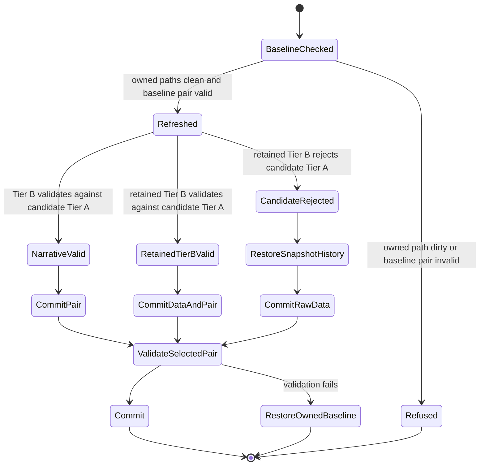

# Bug Fix Design: BUG-002 Market Brief Session-Date Drift

Links: [bug.md](bug.md) | [spec.md](spec.md) | [scopes.md](scopes.md) | [report.md](report.md)

## Root Cause Analysis

### Investigation Summary

The investigation traced the current selftest failure through the committed data pair, executable validator, browser renderer, Tier-A producer, scheduler wrapper, runbook, prompt, and Git provenance.

| Surface | Grounded observation | Consequence |
| --- | --- | --- |
| `market-brief.payload.json` | Pre-market July 15 payload; generated at 10:53 ET; action date, thesis, triggers, and events target July 15 | Relabeling only its date as July 16 would fabricate meaning |
| `market-brief.snapshot.json` | After-hours Tier A generated at 21:02Z with `nextSessionDate=2026-07-16` | Candidate deterministic context crossed the session boundary |
| `brief-history.jsonl` | Rows 39-40 target July 15; row 41 targets July 16 | The boundary crossed during the after-hours Tier-A run |
| `scripts/validate-brief-payload.mjs` | Explicit equality check between payload and snapshot target dates | Correctly rejects mixed actionable state |
| `scripts/selftest.mjs` | Runs the real validator over committed current files | Correctly blocks the repository with one failure |
| `rlbrief.js::renderNextSession` | Uses Tier-B date/thesis/actions and Tier-A `marketClosed` context in one visible block | Mixed pair is served, not merely stored |
| `scripts/brief-refresh-and-push.sh` | Always stages Tier A; failed narrative restores only payload; no retained-payload/candidate-snapshot validation | Direct producer of the incoherent pair |
| Git provenance | Payload commit `3d1bbcf...`; same-date Tier-A commit `751b85d...`; rollover data-only commit `3e5958c...` | Confirms a repeatable scheduled publication path, not a local manual typo |

### Root Cause

The wrapper defines the wrong transaction boundary. It treats deterministic Tier A as independently publishable from actionable Tier B, even though the visible next-session contract makes snapshot, payload, and the accepted history append one publication unit at a target-date boundary.

The failed-attempt rollback is also incomplete. It restores `market-brief.payload.json` but not a valid-JSON `market-brief.config.json` change from the failed attempt, and it never rolls back snapshot/history when the retained payload rejects the candidate Tier A. The wrapper then stages Tier A unconditionally and commits the invalid combination under the documented data-only path.

### Classification Decision

| Candidate classification | Decision | Reason |
| --- | --- | --- |
| (a) Invalid stale Tier-B state | **Applies to the observed state** | July 15 actions cannot accompany a July 16 target; the prior coherent pair must remain published |
| (b) Validator should accept visibly stale but internally coherent Tier B | **Applies only within one target date** | The runbook and payload timestamps make same-session staleness visible; cross-date staleness is not internally coherent |
| (c) Scheduler/wrapper atomicity defect | **Primary root cause** | The wrapper publishes candidate Tier A without validating the retained Tier B and has an incomplete rollback set |
| Another mechanism | Rejected | Git provenance rules out a one-file manual typo as the controlling cause |

### Impact Analysis

- Affected behavior: scheduled and explicitly skipped Tier-B runs at a target-date rollover.
- Affected user surface: the visible Market Brief next-session action block and context.
- Affected repository surface: complete `node scripts/selftest.mjs`, which blocks Feature 006 Scope 3 independent test entry.
- Affected data: current snapshot/history publication boundary; raw bars/options remain independently useful.
- Security/network: no credential exposure is involved, and the fix/tests require no network or secret.

### Single-Implementation Justification

One existing timer wrapper owns publication. There is no second concrete implementation or reusable variation that warrants a new capability foundation. The minimal coherent design is a transaction around the existing wrapper's owned files, exercised through isolated functional and browser regressions.

## Fix Design

### Publication State Machine



### Owned Transaction Set

The preflight and rollback set is exact:

```text
market-brief.snapshot.json
brief-history.jsonl
market-brief.payload.json
market-brief.config.json
data/**
```

Before fetch or refresh, the wrapper proves this set has no staged, unstaged, or untracked changes. Unrelated dirty paths are observed only to prove they remain untouched. The wrapper captures baseline bytes for snapshot, history, payload, and config in a private temporary directory with cleanup on exit. Raw data changes may remain eligible for a raw-data-only commit; rejected snapshot/history candidates do not.

### Candidate Selection Algorithm

1. Validate the baseline payload against the baseline snapshot. Refuse without mutation if it is already invalid.
2. Capture baseline bytes and owned-path Git status after the clean preflight.
3. Run the existing fetch steps and Tier-A producer.
4. For each Tier-B attempt, restore baseline payload and config first, run the external authoring boundary, and validate the resulting payload against candidate Tier A.
5. If an attempt fails, restore both payload and config before another attempt.
6. If one attempt succeeds, select candidate snapshot/history/payload/config.
7. If no attempt succeeds, restore baseline payload/config and validate them against candidate Tier A.
8. If retained Tier B validates, select candidate snapshot/history plus retained payload/config. This preserves truthful same-target data-only publication.
9. If retained Tier B rejects candidate Tier A, restore baseline snapshot/history. Select only independently refreshed raw `data/` changes for commit.
10. Validate the selected worktree pair again immediately before commit.
11. Stage only the selected owned files and commit only when the scoped index contains a change.
12. On a post-staging failure, unstage only the owned set and restore only bytes captured after clean preflight.

### Current Pair Repair

The current baseline is already invalid, so the wrapper's new baseline gate cannot repair it implicitly. Delivery performs one explicit, reviewable data correction:

- Keep `market-brief.payload.json` byte-identical to commit `3d1bbcf6b713bdc685f2d45bc2b65c72338a2275` and the current worktree.
- Read the prior coherent Tier-A source from commit `751b85d72dea16e790cd4e1281f3ed155bd06e60`.
- Restore only `market-brief.snapshot.json` and `brief-history.jsonl` to that commit's bytes with IDE editing, after verifying both paths remain clean and owned.
- Do not edit the July 15 narrative or claim that its actions target July 16.
- Run the exact validator and complete selftest after the repair.

The rejected after-hours history row does not represent a published coherent brief run. Raw fetched data under `data/` remains available for the next scheduled transaction.

### Dirty-Worktree Boundary

The implementation entry gate records:

- `git status --short --untracked-files=all` for every authorized and protected path;
- tracked index object IDs for the wrapper, payload, snapshot, history, config, and protected dirty files;
- worktree SHA-256 for the same set;
- exact status/index/worktree identity of unrelated dirty canaries.

Any dirty authorized existing path stops implementation before mutation. Existing modified `notes/market-brief.md`, `.github/prompts/market-brief-update.prompt.md`, `scripts/selftest.mjs`, and untracked `scripts/validate-brief-payload.mjs` remain read-only. No stash, reset, clean, broad checkout, stage-all, or broad formatter is used.

## Regression Design

### Functional Adversarial Regression

- **Title:** `Regression BUG-002: target-date rollover retains the last coherent pair when Tier B fails`
- **Path:** `tests/brief-refresh-atomicity.test.mjs`
- **Command:** `node --test tests/brief-refresh-atomicity.test.mjs`
- **RED:** Copy the real wrapper into an isolated temporary Git repository containing a valid July 15 pair. Use local stubs for external fetch/Copilot boundaries so Tier A writes a July 16 candidate and Tier B fails. The original wrapper leaves or commits the July 16 snapshot beside the July 15 payload, so direct date equality, byte-rollback, commit-tree, and validator assertions fail.
- **GREEN:** The repaired wrapper retains byte-identical July 15 snapshot/payload/history, commits only allowed raw data when present, and the validator passes.
- **Adversarial discriminator:** Tier A must advance from July 15 to July 16 while Tier B remains July 15. A fixture where both already target July 16 is tautological and does not count.

### Additional Functional Cases

The same test file also proves:

1. Candidate Tier A and retained Tier B both target July 15: the data-only commit is accepted and payload timestamps remain visibly stale.
2. Candidate Tier A and valid generated Tier B both target July 16: snapshot/payload/history advance together.
3. Attempt one changes valid JSON config and fails: attempt two starts from baseline config, preventing cross-attempt leakage.
4. An owned file is dirty: zero fetch, refresh, staging, commit, or restore action occurs.
5. An unrelated file is dirty: the isolated run completes and that file's bytes/index/status remain identical.
6. A forced pre-commit validation failure restores the owned baseline and leaves no staged paths.

### Browser Regression

- **Title:** `Regression BUG-002: a failed rollover never serves prior-session actions beside an advanced Tier-A snapshot`
- **Path:** `tests/market-brief-session-date-drift.spec.mjs`
- **Command:** `npx --no-install playwright test tests/market-brief-session-date-drift.spec.mjs --config=playwright.config.mjs --project=system-chrome --grep "Regression BUG-002: a failed rollover never serves prior-session actions beside an advanced Tier-A snapshot" --reporter=list`
- **Boundary:** Execute the real copied wrapper in an isolated temporary Git repository, serve the real production page and renderer from an ephemeral HTTP server, and assert that the visible date, thesis, and action content all remain July 15 after a failed July 16 rollover candidate.
- **No interception:** The page reads fixture files over real HTTP. The only stubs replace true external fetch and Copilot boundaries before page serving.

### Red-Green And Broad Verification

The implementation owner records the new functional regression failing before the wrapper edit and passing after it. The test owner then runs the exact validator, complete selftest, focused browser regression, complete new browser file, and broader existing Playwright suite. No silent-return bailout, skipped test, or assertion derived from the test's own injected output is allowed.

## Test Isolation And Portability

- Temporary fixture roots are created under the OS temporary directory and removed on success or failure.
- Each fixture initializes its own Git repository and local bare remote only when push behavior is under test.
- Fixtures use synthetic dates and non-secret narrative strings.
- No production repository path, credential, Copilot login, network endpoint, monitoring plane, backup path, release-train file, or knb path is mutated.
- Shell behavior must work on macOS Bash 3.2 and Linux Bash; no raw GNU-only timeout, `sed -i`, `date -d`, `readlink -f`, or `stat -c` is introduced.

## Alternatives Considered

| Alternative | Decision | Reason |
| --- | --- | --- |
| Change only payload date to July 16 | Rejected | Fabricates the date of July 15 actions, events, and evidence |
| Remove or weaken validator equality | Rejected | Permits user-visible mixed actionable state |
| Teach renderer to hide mismatch | Rejected | Masks an invalid publication and leaves repository truth split |
| Reject every data-only run | Rejected | Same-target stale Tier B is visibly timestamped and explicitly supported |
| Publish cross-date stale Tier B with warning | Rejected | Prior-session actions remain actionable content, not a harmless archived label |
| Roll back raw fetched data too | Rejected | Raw data is independently useful and can be committed without publishing the rejected brief candidate |
| New publication service or framework | Rejected | One wrapper owns one local transaction; another abstraction adds no required variant |

## Complexity Tracking

| Decision | Simpler fix considered | Why rejected |
| --- | --- | --- |
| Validate retained Tier B against candidate Tier A and choose a scoped commit set | Always stage Tier A | Reproduces the observed mixed-date bug |
| Restore payload and config before each retry | Restore payload only | A failed attempt can leak valid-JSON config into a later commit |
| Owned-path clean preflight plus captured-byte restore | Unconditional `git checkout --` | Can overwrite user/concurrent work in a dirty repository |
| Isolated Git/browser regressions | Static source grep | Cannot prove staging, commit selection, rollback, or served behavior |

## Finding Dispositions

| Finding | Status in this design | Owner |
| --- | --- | --- |
| `F006-EXT-SELFTEST-MARKET-BRIEF-001` | Root cause confirmed; delivery remains open | `bubbles.implement` then test/validate owners |
| `BUG002-WRAPPER-ATOMICITY` | Exact controlling path and repair algorithm defined | `bubbles.implement` |
| `BUG002-REGRESSION-GAP` | Exact adversarial functional and browser contracts defined | `bubbles.implement` and `bubbles.test` |
| `BUG002-DIRTY-BOUNDARY` | Exact owned/protected sets and refusal behavior defined | `bubbles.implement` |

No planning uncertainty remains that requires UX, analyst, design, or plan ownership before implementation. Delivery evidence, independent test evidence, and certification remain absent by design at this phase.
