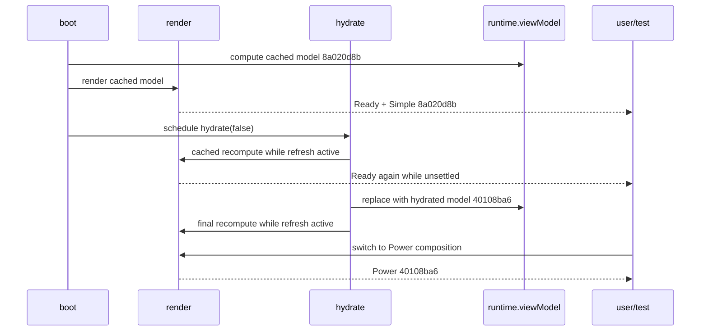

# Bug Fix Design: BUG-003 Bond Regime Simple/Power Model-Digest Divergence

Links: [bug.md](bug.md) | [spec.md](spec.md) | [scopes.md](scopes.md) | [report.md](report.md)

## Root Cause Analysis

### Investigation Summary

The investigation traced the protected assertion from the test's two DOM reads through both render assignments, the mode switch, the shared view model, the automatic hydration promise, and boot scheduling. A twelve-page real-browser mutation timeline used the current production page, the same shared bar cache shape, and the same true-external-boundary Treasury fixtures without changing source or test bytes.

| Surface | Grounded observation | Consequence |
| --- | --- | --- |
| `tests/bond-regime-lab.spec.mjs::openFromSharedCache` | Waits for `#appStatus` to contain Ready, not for `runtime.refresh.active` to become false | The helper trusts the product readiness contract |
| Protected BS-011 | Reads Simple, clicks Power, reads Power, asserts equality, assumptions, and zero new requests | Correct consumer-level contract; must stay unchanged |
| `stableDecisionDigest` | One deterministic normalization/FNV-style hash helper | No per-mode hash implementation exists |
| `computeBondLabViewModel` | Assigns one full decision digest to `creditView.decisionDigest` | Both modes have one model source |
| `render` | Assigns `runtime.viewModel.decisionDigest` to `decisionGrid` and unconditionally writes Ready | Simple accurately reflects the model at render time, but Ready is premature |
| `renderPower` | Assigns `view.decisionDigest` to `powerParity` | Power accurately reflects the current shared model |
| `setMode` | Changes UI mode/visibility, persists state, and calls `renderPower`; no recompute/fetch | Mode switching is composition-only |
| `hydrate` | Performs cached recompute and final recompute while `refresh.active=true` | The same compute path legitimately replaces the model over time |
| `boot` | Renders Ready, then schedules `hydrate(false)` with `setTimeout(..., 0)` | An observable pre-hydration Ready window exists |
| Mutation timeline | `decisionGrid` and runtime both move `8a020d8b -> 40108ba6`; status is Ready during active refresh | Exact independent mismatch is a cross-time comparison |

### Candidate Classification

| Candidate | Decision | Evidence |
| --- | --- | --- |
| Stale DOM projection | Rejected as controlling cause | At every observed mutation, `decisionGrid` equals the current runtime digest and advances to `40108ba6` |
| Asynchronous rerender | **Primary root cause** | Automatic hydration replaces the shared model after Ready has already been exposed |
| Duplicate digest assignment | Rejected | Exactly two DOM assignments exist and both read the same shared `decisionDigest` field |
| View-model mutation by mode switch | Rejected | `setMode` never calls `recompute`, replaces observations, or changes assumptions |
| Actual Simple/Power second compute path | Rejected | Both modes share `computeBondLabViewModel`; the second temporal compute is hydration, not Power |

### Root Cause

The production status lifecycle has no single settlement boundary. `render()` owns both model projection and an unconditional Ready write. Boot exposes Ready before scheduled hydration starts, and every recompute during active hydration exposes Ready again. A consumer can therefore capture one valid cached digest, yield while the same compute path publishes a hydrated model, and then project the later digest in Power.

The test's captured Simple string becomes stale, but the Simple DOM node itself is not stale. This distinction matters: copying the current digest to both nodes again or changing hash assignment would not repair the lifecycle and could hide later races.

### Impact Analysis

- Affected behavior: initial page load and any no-refresh mode switch that overlaps automatic hydration.
- Affected contract: Feature 003 SCN-003-011, FR-041, and FR-042.
- Affected acceptance: BUG-002 SCOPE-01 independent system-Chrome inventory and parent Feature 006 Scope 3.
- Affected users: users who switch to Power during the brief interval in which cached state is presented as settled.
- Affected data: no persisted market or assumption data corruption; the defect is lifecycle coherence and status truthfulness.
- Security/network: no secret, credential, production network, monitoring, backup, or deployment surface is involved.

### Single-Implementation Justification

The repair is inside one existing self-contained HTML tool and one feature-specific test file. `computeBondLabViewModel` is already the shared foundation for both page-local compositions; the bug adds no second implementation, provider, adapter, screen, service, or reusable contract. Introducing a foundation/overlay split would increase the protected surface and contradict the required surgical change boundary.

## Runtime Sequence

## Fix Design

### Solution Approach

Keep cache-first rendering and the one compute path, but make Ready a terminal refresh signal:

1. In `render()`, write the existing Ready text only when `runtime.refresh.active` is false. Active refresh renders must preserve the Refreshing status set by `hydrate()`.
2. In the terminal success/degraded completion of `hydrate()`, set `runtime.refresh.active=false`, re-enable Refresh, and publish the existing Ready text after the final recompute has completed.
3. In `boot()`, start `hydrate(false)` in the same JavaScript turn after cached render rather than scheduling it with `setTimeout(..., 0)`. The call remains asynchronous and non-blocking, but no external task can observe the initial Ready gap before hydration becomes active.
4. Leave `stableDecisionDigest`, `computeBondLabViewModel`, `renderPower`, `setMode`, assumptions, persistence, source adapters, and registry wiring unchanged.

This is a local status/ordering repair. It does not serialize user interaction, disable tabs, or delay cache-first paint. Cached content remains visible while the status truthfully says Refreshing.

### Required Invariants

- There is one model assembly function and one `runtime.viewModel` reference per render.
- `render()` may project data during refresh but may not claim settlement.
- The terminal hydration step publishes Ready exactly after the active flag clears.
- Direct recomputes caused by scenario levers outside refresh retain current synchronous Ready behavior.
- Explicit Refresh uses the same lifecycle and therefore gains the same truthful status semantics.
- Errors remain represented by source-state rows; settlement can still become Ready with explicit stale/unavailable evidence after the catch path's final recompute.

### Adversarial Regression Design

Add one test in `tests/bond-regime-lab.spec.mjs` with exact title `Regression BUG-003: Ready waits for auto-hydration before Simple and Power comparison`.

The test uses the existing real static server and shared cache setup. Its external Treasury route is controlled by a promise gate rather than a timer:

1. Seed the normal shared bar cache.
2. Hold the true external Treasury response unresolved.
3. Navigate to the real production page and assert cached decision content is present.
4. Assert `appStatus` remains Refreshing and `runtime.refresh.active` is true while the route is held. Current production must RED here because an intermediate render writes Ready.
5. Release nominal and real Treasury fixture responses.
6. Await Ready, capture Simple digest and assumptions, click Power, and capture Power digest.
7. Assert digest equality, unchanged assumptions, and zero requests added by the mode switch.

The test must not inject either expected digest. Both values come from production code. Request control is limited to the true external Treasury boundary and does not intercept internal application behavior.

### Existing Protected Regression

Do not edit the title or behavior assertions in `BS-011 Simple and Power share one model digest`. In particular, do not add an explicit refresh-settlement wait inside the protected test. The product's Ready state is the consumer contract being repaired; test-only waiting would mask that defect.

### Alternatives Considered

| Alternative | Decision | Reason |
| --- | --- | --- |
| Wait for `refresh.active=false` only in BS-011 | Rejected | Makes the test aware of an internal flag and leaves the product's false Ready state intact |
| Retry digest reads until equal | Rejected | Converts a real race into a silent pass and weakens SCN-003-011 |
| Assign both DOM nodes in every render | Rejected | Both assignments already consume the same model; cross-time capture remains possible |
| Freeze hydration while switching modes | Rejected | Adds interaction coupling and can leave source refresh behavior surprising |
| Remove automatic hydration | Rejected | Violates cache-first delta-refresh product rules |
| Compute separate Simple and Power models | Rejected | Directly violates Feature 003's one-model architecture |
| Add a shared readiness framework | Rejected | One local page lifecycle has one implementation; shared JavaScript is explicitly protected |

## Change Containment

### Allowed Existing Files

- `bond-regime-lab.html`
- `tests/bond-regime-lab.spec.mjs`

### Allowed Bug Artifacts

- `specs/_bugs/BUG-003-bond-regime-simple-power-model-digest-divergence/**`

### Excluded Families

- Feature 003 planning/state artifacts
- Feature 006 artifacts
- BUG-002 production, data, tests, and artifacts
- Market Brief and shared JavaScript
- Tool/navigation registries
- Package, lock, source, and Playwright configuration
- Feature 005
- Framework-managed and unrelated dirty paths

No shared fixture, harness, bootstrap, auth, session, storage, or service infrastructure is changed. The only test fixture control remains inside the feature-specific test at a true external boundary.

## Rollback

The implementation consists of surgical hunks in two allowed files. Before editing, record their current SHA-256 and scoped status. If focused RED/GREEN cannot be achieved or an excluded path changes, stop and restore only implementation-owned hunks through a precise IDE edit based on the captured pre-edit bytes. Never reset, checkout, clean, stash, stage, or overwrite the shared worktree.

## Complexity Tracking

| Decision | Simpler fix considered | Why rejected |
| --- | --- | --- |
| Guard Ready during active refresh and publish it at terminal hydration | Add a wait to the protected test | Test-only synchronization leaves false product status |
| Start auto-hydration in the boot turn | Keep zero-delay scheduling | The pre-hydration Ready task remains externally observable |
| Add one deterministic external-boundary regression | Rely on a flaky BS-011 RED | Scenario-first delivery requires repeatable discrimination |

## Finding Dispositions

| Finding | Status in this design | Owner |
| --- | --- | --- |
| `BUG003-RCA-001` | Addressed: exact timing path and rejected alternatives are evidence-grounded | None |
| `BUG003-PLANNING-001` | Addressed: minimal production/test repair, RED/GREEN, containment, and resume chain are fully specified | None |
| `BUG003-ASYNC-READY-RACE` | Open: production still exposes Ready before hydration settlement | `bubbles.implement` |
| `BUG003-DETERMINISTIC-RED-GAP` | Open: adversarial readiness regression is specified but absent | `bubbles.implement`, then `bubbles.test` |
| `BUG003-INDEPENDENT-VERIFICATION` | Open: exact, complete Bond, and complete inventory GREEN are not independently established after repair | `bubbles.test` |
| `BUG002-ACCEPTANCE-BLOCK` | Open: BUG-002 remains blocked until the complete inventory is green | `bubbles.test` after BUG-003 verification |

No planning choice remains that requires Feature 003 mutation or another planning phase before implementation.
