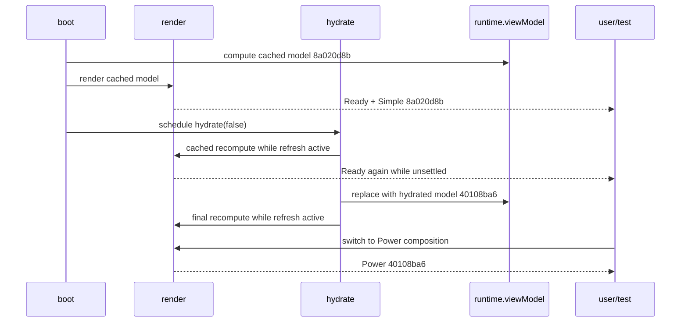

# Bug Fix Design: BUG-003 Bond Regime Simple/Power Model-Digest Divergence

Links: [bug.md](bug.md) | [spec.md](spec.md) | [scopes.md](scopes.md) | [report.md](report.md)

## Design Brief

### Current State

`bond-regime-lab.html` now guards public Ready while automatic hydration is active and publishes Ready after the final recompute settles. `tests/bond-regime-lab.spec.mjs::openFromSharedCache` waits for the feature-local runtime to reach a stable rendered snapshot and then separately asserts public Ready.

The dedicated `Regression BUG-003: Ready waits for auto-hydration before Simple and Power comparison` test does not use that helper for its held-boundary proof. It holds the true Treasury boundary, observes cached content under public Refreshing, releases hydration, then verifies Ready and Simple/Power parity. No runtime, test, delivery-completion, or certification claim is made by this design reconciliation.

### Target State

Retain a two-test contract: the adversarial BUG-003 regression owns the public Ready lifecycle, while protected BS-011 owns Feature 003's one-settled-model parity, assumptions, and zero-request behavior. The common helper may use internal settlement state only as a deterministic setup precondition for tests whose scenarios begin from a stable model.

### Patterns to Follow

- Preserve Feature 003 `SCN-003-011`, `FR-041`, and `FR-042`: one computed `BondLabViewModel`, composition-only mode switching, unchanged assumptions, and zero mode-switch requests.
- Use a promise-held true external Treasury boundary for the lifecycle discriminator in `tests/bond-regime-lab.spec.mjs`.
- Keep `openFromSharedCache` as a feature-local stable-fixture helper: settlement first, public Ready assertion second.
- Keep public lifecycle evidence in a test that observes public Refreshing and Ready directly without depending on the shared helper to establish the transition.

### Patterns to Avoid

- Treating an internal helper predicate as proof that public Ready implies settlement.
- Making protected BS-011 own both boot lifecycle publication and settled-model parity when its Feature 003 precondition is already one computed view model.
- Restoring a Ready-only shared helper and reintroducing scheduler-sensitive setup across every Bond Regime consumer test.
- Weakening, renaming, skipping, retrying, or repointing either exact regression title or assertion set.

### Resolved Decisions

- The current two-test decomposition is contract-faithful and accepted.
- Internal settlement awareness in `openFromSharedCache` is a harness-stability precondition, not lifecycle evidence.
- The adversarial BUG-003 test is the sole direct owner of the public Ready/Refreshing implication.
- Protected BS-011 remains the direct owner of SCN-003-011 parity, assumption preservation, and zero-request assertions.
- No public-Ready-only helper repair is required.

### Open Questions

None found - the protected scenario precondition, lifecycle regression, and helper responsibilities are explicit and non-overlapping.

## Pre-Fix Root Cause Analysis

### Investigation Summary

The investigation traced the protected assertion from the test's two DOM reads through both render assignments, the mode switch, the shared view model, the automatic hydration promise, and boot scheduling. A twelve-page real-browser mutation timeline used the current production page, the same shared bar cache shape, and the same true-external-boundary Treasury fixtures without changing source or test bytes.

| Surface | Grounded observation | Consequence |
| --- | --- | --- |
| Pre-fix `tests/bond-regime-lab.spec.mjs::openFromSharedCache` | Waited for `#appStatus` to contain Ready without independently establishing refresh settlement | The helper could return inside the false Ready window |
| Current `tests/bond-regime-lab.spec.mjs::openFromSharedCache` | Waits for a refresh promise, inactive refresh, a current view model, and rendered/runtime observed-digest agreement; then separately asserts Ready | Internal state establishes deterministic fixture settlement; the later Ready assertion confirms terminal presentation but is not lifecycle proof |
| Current BUG-003 adversarial regression | Holds the true Treasury boundary, checks cached content and public Refreshing before release, then awaits public Ready and verifies parity | Independently proves the public lifecycle without using the shared helper as a shortcut |
| Protected BS-011 | Reads Simple, clicks Power, reads Power, asserts equality, assumptions, and zero new requests | Correct consumer-level contract; must stay unchanged |
| `stableDecisionDigest` | One deterministic normalization/FNV-style hash helper | No per-mode hash implementation exists |
| `computeBondLabViewModel` | Assigns one full decision digest to `creditView.decisionDigest` | Both modes have one model source |
| `render` | Assigns `runtime.viewModel.decisionDigest` to `decisionGrid` and unconditionally writes Ready | Simple accurately reflects the model at render time, but Ready is premature |
| `renderPower` | Assigns `view.decisionDigest` to `powerParity` | Power accurately reflects the current shared model |
| `setMode` | Changes UI mode/visibility, persists state, and calls `renderPower`; no recompute/fetch | Mode switching is composition-only |
| `hydrate` | Performs cached recompute and final recompute while `refresh.active=true` | The same compute path legitimately replaces the model over time |
| `boot` | Renders Ready, then schedules `hydrate(false)` with `setTimeout(..., 0)` | An observable pre-hydration Ready window exists |
| Mutation timeline | `decisionGrid` and runtime both move `8a020d8b -> 40108ba6`; status is Ready during active refresh | Exact independent mismatch is a cross-time comparison |

### Candidate Classification

| Candidate | Decision | Evidence |
| --- | --- | --- |
| Stale DOM projection | Rejected as controlling cause | At every observed mutation, `decisionGrid` equals the current runtime digest and advances to `40108ba6` |
| Asynchronous rerender | **Primary root cause** | Automatic hydration replaces the shared model after Ready has already been exposed |
| Duplicate digest assignment | Rejected | Exactly two DOM assignments exist and both read the same shared `decisionDigest` field |
| View-model mutation by mode switch | Rejected | `setMode` never calls `recompute`, replaces observations, or changes assumptions |
| Actual Simple/Power second compute path | Rejected | Both modes share `computeBondLabViewModel`; the second temporal compute is hydration, not Power |

### Root Cause

The pre-fix production status lifecycle had no single settlement boundary. `render()` owned both model projection and an unconditional Ready write. Boot exposed Ready before scheduled hydration started, and every recompute during active hydration exposed Ready again. A consumer could therefore capture one valid cached digest, yield while the same compute path published a hydrated model, and then project the later digest in Power.

The test's captured Simple string becomes stale, but the Simple DOM node itself is not stale. This distinction matters: copying the current digest to both nodes again or changing hash assignment would not repair the lifecycle and could hide later races.

The accepted design separates the repaired lifecycle contract from stable-model parity. Runtime Ready remains a public settlement boundary, but its causal proof belongs to the held-boundary adversarial regression. Other Bond scenarios may begin from a deterministically settled feature-local fixture because their contracts do not restate boot lifecycle semantics.

### Impact Analysis

- Pre-fix affected behavior: initial page load and any no-refresh mode switch that overlapped automatic hydration.
- Affected contract: Feature 003 SCN-003-011, FR-041, and FR-042.
- Affected acceptance: BUG-002 SCOPE-01 independent system-Chrome inventory and parent Feature 006 Scope 3.
- Affected users: users who switch to Power during the brief interval in which cached state is presented as settled.
- Affected data: no persisted market or assumption data corruption; the defect is lifecycle coherence and status truthfulness.
- Security/network: no secret, credential, production network, monitoring, backup, or deployment surface is involved.

### Single-Implementation Justification

The repair is inside one existing self-contained HTML tool and one feature-specific test file. `computeBondLabViewModel` is already the shared foundation for both page-local compositions; the bug adds no second implementation, provider, adapter, screen, service, or reusable contract. Introducing a foundation/overlay split would increase the protected surface and contradict the required surgical change boundary.

## Pre-Fix Runtime Sequence

## Fix Design

### Solution Approach

Keep cache-first rendering and the one compute path, but make Ready a terminal refresh signal:

1. In `render()`, write the existing Ready text only when `runtime.refresh.active` is false. Active refresh renders must preserve the Refreshing status set by `hydrate()`.
2. In the terminal success/degraded completion of `hydrate()`, set `runtime.refresh.active=false`, re-enable Refresh, and publish the existing Ready text after the final recompute has completed.
3. In `boot()`, start `hydrate(false)` in the same JavaScript turn after cached render rather than scheduling it with `setTimeout(..., 0)`. The call remains asynchronous and non-blocking, but no external task can observe the initial Ready gap before hydration becomes active.
4. Leave `stableDecisionDigest`, `computeBondLabViewModel`, `renderPower`, `setMode`, assumptions, persistence, source adapters, and registry wiring unchanged.

This is a local status/ordering repair. It does not serialize user interaction, disable tabs, or delay cache-first paint. Cached content remains visible while the status truthfully says Refreshing.

### Required Invariants

- There is one model assembly function and one `runtime.viewModel` reference per render.
- `render()` may project data during refresh but may not claim settlement.
- The terminal hydration step publishes Ready exactly after the active flag clears.
- Direct recomputes caused by scenario levers outside refresh retain current synchronous Ready behavior.
- Explicit Refresh uses the same lifecycle and therefore gains the same truthful status semantics.
- Errors remain represented by source-state rows; settlement can still become Ready with explicit stale/unavailable evidence after the catch path's final recompute.

### Adversarial Regression Design

The dedicated lifecycle test in `tests/bond-regime-lab.spec.mjs` retains the exact title `Regression BUG-003: Ready waits for auto-hydration before Simple and Power comparison`.

The test uses the existing real static server and shared cache setup. Its external Treasury route is controlled by a promise gate rather than a timer:

1. Seed the normal shared bar cache.
2. Hold the true external Treasury response unresolved.
3. Navigate to the real production page and assert cached decision content is present.
4. Assert `appStatus` remains Refreshing and `runtime.refresh.active` is true while the route is held. Current production must RED here because an intermediate render writes Ready.
5. Release nominal and real Treasury fixture responses.
6. Await Ready, capture Simple digest and assumptions, click Power, and capture Power digest.
7. Assert digest equality, unchanged assumptions, and zero requests added by the mode switch.

The test must not inject either expected digest. Both values come from production code. Request control is limited to the true external Treasury boundary and does not intercept internal application behavior. Reading `runtime.refresh.active` anchors the deliberately held precondition; the public assertion remains that cached content is visible while `appStatus` says Refreshing rather than Ready.

### Test Contract Ownership

Do not edit the title or behavior assertions in `BS-011 Simple and Power share one model digest`. Its upstream scenario begins with one observed snapshot and assumption set producing one view model; `FR-041` and `FR-042` require cross-mode parity, assumption preservation, and no mode-switch fetch. They do not require this test to prove the boot lifecycle that creates the settled precondition.

| Contract | Direct owner | Permitted internal awareness | Required external proof |
| --- | --- | --- | --- |
| Public Ready implies automatic hydration settlement | `Regression BUG-003: Ready waits for auto-hydration before Simple and Power comparison` | May inspect `refresh.active` only to prove the held request is genuinely in flight; must not use `openFromSharedCache` before the held-state assertions | Cached decision content is visible while public status is Refreshing and not Ready; after release, public Ready appears before parity/assumption/no-request checks |
| SCN-003-011 one-model Simple/Power coherence | `BS-011 Simple and Power share one model digest` | May inherit the stable-fixture precondition from `openFromSharedCache` | Existing Simple digest, Power digest, equality, assumption, and zero-request assertions remain unchanged |
| Stable setup for other Bond tests | `openFromSharedCache` | May wait for refresh promise existence, inactive refresh, current view model, and rendered/runtime observed-digest equality | Must separately assert public Ready after internal settlement; callers cannot cite this helper alone as Ready-lifecycle evidence |

The earlier blanket rejection of any internal settlement wait is replaced by this ownership split. A wait would mask the defect only if it were the sole basis for claiming Ready lifecycle correctness. Here the adversarial test independently crosses the unresolved external boundary and proves the public transition, so the helper's internal predicate serves only deterministic setup. Restoring a Ready-only helper would conflate these contracts and reintroduce timing sensitivity across every Bond test that shares the helper.

This acceptance is conditional on the separation remaining real: removing or weakening the held-boundary assertions, calling `openFromSharedCache` before them, or using helper settlement as the only Ready proof would invalidate the decomposition and require a test-owner repair.

### Alternatives Considered

| Alternative | Decision | Reason |
| --- | --- | --- |
| Use internal settlement as the only Ready proof | Rejected | An internal predicate cannot establish the public Ready contract and would hide a recurrence |
| Restore `openFromSharedCache` to Ready-only and make BS-011 own settlement | Rejected | SCN-003-011 begins from one computed view model; this conflates lifecycle with parity and reintroduces scheduler-sensitive setup across high-fan-out callers |
| Keep internal helper settlement plus an independent held-boundary lifecycle regression | **Accepted** | The helper supplies deterministic setup while the adversarial test directly proves public Refreshing-to-Ready behavior without weakening BS-011 |
| Retry digest reads until equal | Rejected | Converts a real race into a silent pass and weakens SCN-003-011 |
| Assign both DOM nodes in every render | Rejected | Both assignments already consume the same model; cross-time capture remains possible |
| Freeze hydration while switching modes | Rejected | Adds interaction coupling and can leave source refresh behavior surprising |
| Remove automatic hydration | Rejected | Violates cache-first delta-refresh product rules |
| Compute separate Simple and Power models | Rejected | Directly violates Feature 003's one-model architecture |
| Add a shared readiness framework | Rejected | One local page lifecycle has one implementation; shared JavaScript is explicitly protected |

## Change Containment

### Allowed Existing Files

- `bond-regime-lab.html`
- `tests/bond-regime-lab.spec.mjs`

### Allowed Bug Artifacts

- `specs/_bugs/BUG-003-bond-regime-simple-power-model-digest-divergence/**`

### Excluded Families

- Feature 003 planning/state artifacts
- Feature 006 artifacts
- BUG-002 production, data, tests, and artifacts
- Market Brief and shared JavaScript
- Tool/navigation registries
- Package, lock, source, and Playwright configuration
- Feature 005
- Framework-managed and unrelated dirty paths

### Feature-Local Harness Impact

`openFromSharedCache` is a high-fan-out helper inside the feature-specific Bond test file. Its internal settlement predicate therefore has a narrow but real harness contract:

- Consumers: every `tests/bond-regime-lab.spec.mjs` caller of `openFromSharedCache`.
- Setup invariant: return only after the initial refresh promise exists, refresh is inactive, a current view model exists, and rendered/runtime observed digests agree.
- Presentation invariant: assert public Ready only after the setup invariant holds.
- Independent lifecycle canary: the exact BUG-003 adversarial regression, which does not consume the helper for its held-boundary proof.
- Independent parity canary: protected exact-title BS-011.
- Blast-radius check owned by delivery/test phases: the complete Bond Regime file, followed by the required broader system-Chrome inventory.

No shared production JavaScript, global bootstrap, auth, session, storage, registry, or service infrastructure enters the change boundary. This design invocation changes neither the helper nor any caller.

## Rollback

The production and feature-test repair remains confined to the two allowed files. This design reconciliation changes neither file and does not authorize reset, checkout, clean, stash, staging, or broad restoration. Any later runtime or test correction must be routed to the owning agent and limited to an explicitly identified hunk after a fresh path-scoped baseline.

## Complexity Tracking

| Decision | Simpler fix considered | Why rejected |
| --- | --- | --- |
| Split public lifecycle proof from settled-model parity | Use a Ready-only shared helper as both setup and proof | One high-fan-out timing predicate cannot deterministically prove the held lifecycle and every unrelated Bond scenario would inherit the race |
| Start auto-hydration in the boot turn | Keep zero-delay scheduling | The pre-hydration Ready task remains externally observable |
| Add one deterministic external-boundary regression | Rely on a flaky BS-011 RED | Scenario-first delivery requires repeatable discrimination |

## Finding Dispositions

| Finding | Status in this design | Owner |
| --- | --- | --- |
| `BUG003-RCA-001` | Addressed: exact timing path and rejected alternatives are evidence-grounded | None |
| `BUG003-PLANNING-001` | Addressed: minimal production/test repair, RED/GREEN, containment, and resume chain are fully specified | None |
| `BUG003-DESIGN-READY-HARNESS-001` | Addressed: accepted the two-test decomposition, distinguished setup internals from public evidence, and assigned non-overlapping test ownership | None |
| `BUG003-ASYNC-READY-RACE` | Preserved unresolved in delivery accounting: current source shape reflects the designed Ready guard, but this design-only invocation records no implementation evidence or completion claim | `bubbles.implement` |
| `BUG003-DETERMINISTIC-RED-GAP` | Preserved unresolved in delivery accounting: the adversarial regression exists, but this design-only invocation records no RED/GREEN or test-completion evidence | `bubbles.implement`, then `bubbles.test` |
| `BUG003-INDEPENDENT-VERIFICATION` | Open: exact, complete Bond, and complete inventory GREEN are not independently established after repair | `bubbles.test` |
| `BUG002-ACCEPTANCE-BLOCK` | Open: BUG-002 remains blocked until the complete inventory is green | `bubbles.test` after BUG-003 verification |

No Feature 003 contract mutation or public-Ready-only helper repair is required. Delivery evidence, independent verification, BUG-002 continuation, Feature 006 continuation, validation, audit, and certification remain outside this design invocation.
