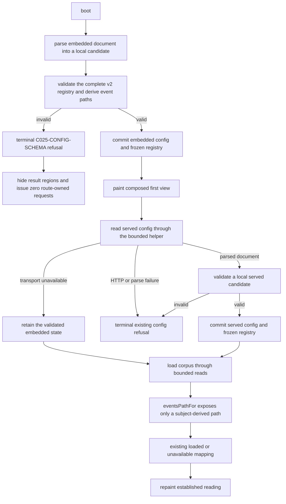

# Design: BUG-025 — Bound Reads And Canonical Company Event Documents

## Design Brief

### Current State

The committed and embedded registries declare `company-intelligence-config/v2` with `readBoundMs: 10000`.
The route paints from the embedded registry before it requests any document.
One route-local helper now bounds every route-owned fetch through full body consumption.

`INTEL.readCoverageRegistry()` returns a deeply frozen normalized registry.
Its event-source validator accepts only the canonical company-subject grammar.
It derives the event path, checks exact equality, rejects duplicates, and rebuilds each normalized row.

`boot()` validates each embedded or served candidate before authoritative assignment.
Route-terminal refusal hides identity and result surfaces, fixes readiness, and exposes one static atomic alert.
The production route does not move focus during refusal.

The embedded-refusal carrier currently proves only that the alert lacks focus.
Its alert recorder deduplicates identical snapshots instead of counting content-update events.
The `SCN-BUG-025-006` controlled break disables path lookup rather than canonical subject acceptance.
Planning admits a BUG-025 break map, and this design now names it explicitly.

### Target State

Each covered subject uses exact `company:<suffix>` syntax.
The validator derives one event path from that suffix and compares the declaration byte-for-byte.
The normalized registry receives the derived path, never an untrusted path copy.

Embedded and served documents remain local candidates until full validation succeeds.
No route consumer can observe a candidate path before the normalized registry returns.
A served schema failure cannot replace or fall back to the validated embedded registry.

Route-level configuration refusal becomes terminal for that route load.
It suppresses prior result regions, sets readiness to `not-established`, and announces one atomic alert.
An initial embedded refusal leaves `document.body` as the exact active element.
The alert carrier counts each non-empty content mutation without deduplicating identical states.
Bounded route mutations prove focus theft and duplicate announcements fail their exact assertions.
The canonical control mutation rejects `company:msft` through the subject-acceptance predicate itself.
Ordinary unavailable evidence, input refusal, transport-only embedded fallback, bounded reads, and cache behavior remain unchanged.
No production byte changes during this audit rework.

### Patterns to Follow

- Preserve the validated embedded-first sequence in `paintFromEmbedded()` and `boot()`.
- Keep `readCoverageRegistry()` as the only path from raw configuration to a route-visible registry.
- Keep `eventsPathFor()` as the route's only event-path lookup.
- Preserve the sole bounded fetch helper and ordinary unavailable outcomes.
- Keep `C025-CONFIG-SCHEMA`, `data-reading-readiness`, and the existing coverage account vocabulary.

### Patterns to Avoid

- Do not validate `eventsPath` as a generic relative URL.
- Do not parse, resolve, decode, trim, normalize, sanitize, or repair a configured path.
- Do not rely on CSP, browser URL resolution, or same-origin failure for validation.
- Do not assign candidate served configuration before full validation.
- Do not let a route-level refusal leave a settled-looking result visible.
- Do not add a shared URL framework, a second capability, retry, or a new error code.

### Resolved Decisions

- The shipped `company:msft` pair remains unchanged and is the accepted control.
- Subject suffix syntax is `[a-z0-9]+(?:-[a-z0-9]+)*` with no normalization.
- The only event path is `data/company-intelligence/company-<suffix>/events.json`.
- The declaration must equal that derived string exactly.
- The normalized registry reconstructs both fields from the accepted suffix.
- Duplicate event subjects fail with `C025-CONFIG-SCHEMA`.
- Embedded validation precedes `run()` and `readConfig()`.
- Served validation precedes authoritative assignment and `loadCorpus()`.
- Only transport unavailability may retain the validated embedded registry.
- `renderRefusal()` uses an explicit route-terminal presentation without changing standing-reading refusal.
- `readBoundMs`, per-request aborts, timer cleanup, no retry, caches, and stale-intent protection remain intact.
- `scripts/scenario-break-map-bug025.json` is the sole admitted bug-specific declarative break map.
- The generic scenario runner and every sibling break map remain protected controls.
- Initial embedded refusal keeps `document.activeElement === document.body`.
- Alert proof counts non-empty content-mutation records without state deduplication.
- One focus-theft mutant focuses `#subject-input` and must fail only the exact body-focus assertion.
- One duplicate-announcement mutant repeats the alert text update and must fail only the exact count assertion.
- The `SCN-BUG-025-006` mutant changes canonical subject rejection and never disables `eventsPathFor()`.
- These proof repairs add no business scenario, Test Plan row, or Definition of Done row.

### Open Questions

None. The owner delegated every design decision and requested the strongest long-term option.

## Purpose And Scope

This repair gives every Company Intelligence document read a finite outcome.
It also removes configured network authority from every event declaration.
It preserves the route's network-independent first paint and existing truth labels.

The design governs these route-owned request families:

1. the served `company-intelligence.config.json` read
2. committed company and benchmark bar reads
3. the optional committed event read
4. the authored-plan and current-pointer reads
5. each committed version-record read

The design does not add a provider, external origin, credential, retry policy, or corpus document.
It adds no generic path or URL capability.
It does not change the composition model or BUG-018's settled-state vocabulary.

## Root Cause Analysis

### Investigation Summary

The original defect had rejection handlers but no acquisition lifetime.
The current route now funnels each request through `readRouteDocument()` with one controller and timer.

The original security finding sat before transport.
The repaired `readEventSource()` now rejects a backslash authority, traversal, and arbitrary relative files.
The repaired route validates served state before assignment and suppresses results during terminal refusal.

The audit found four proof-fidelity defects after that production repair.
The carrier uses fuzzy initial-focus proof and deduplicated alert snapshots.
The canonical controlled break targets path lookup instead of subject acceptance.
The design boundary also omitted the existing BUG-025 break map.

### Root Cause

The original reliability root cause was a missing acquisition lifetime.
The v2 read bound and `readRouteDocument()` now provide that lifetime.

The original security root cause was an authority-model error.
The old validator treated `eventsPath` as a configurable relative URL.
Relative-path checks could not prove subject-to-path correspondence.

The original refusal-state gap was an ordering error.
The old route mutated authoritative state before validation and treated refusal as an additive banner.

The audit-rework root cause is proof-layer drift.
Final-state deduplication hides repeated announcements, and a lookup mutation does not test canonical subject admission.
The stale design boundary also disagreed with the planning-owned map admission.

### Impact Analysis

- The original authority defect could issue an off-origin request or read the wrong repository file.
- The original ordering defect could expose invalid state or stale results beneath a refusal.
- Fuzzy focus proof can miss a route that moves focus to another control.
- Snapshot deduplication can hide two identical live-region writes.
- A lookup mutation can pass without proving that canonical subject acceptance remains open.
- A stale boundary can invite changes to the generic runner or sibling maps.
- Current production behavior must remain unchanged while these proof defects are repaired.

## Architecture Overview



The embedded registry is both the first-paint source and the source of the served-config read bound.
It becomes active only after complete validation.

A parsed served document is still untrusted.
The route commits it only after `readCoverageRegistry()` returns its complete frozen result.

Transport failure retains the already validated embedded state.
HTTP, parse, version, and schema failures never take that path.

The event declaration is not a destination.
The accepted subject determines the only path that `eventsPathFor()` can expose.

## Configuration Contract

### Canonical Declaration And Mirror

`company-intelligence.config.json` remains the canonical configuration artifact.
The inert JSON block in `company-intelligence-lab.html` remains its required exact mirror for `file://` first paint.
The mirror must change atomically with the canonical file and must never become an independent policy source.

Both representations must contain this root-level contract:

```json
{
	"contractVersion": "company-intelligence-config/v2",
	"readBoundMs": 10000
}
```

The snippet shows the changed fields, not the complete document.
The existing deep-equality assertion must continue to compare the complete objects.
No generator, environment variable, source constant, or call-site literal may provide another value.

### Read-Bound Validation

`INTEL.readCoverageRegistry()` applies these checks before returning a registry:

1. `contractVersion` equals `company-intelligence-config/v2`.
2. `readBoundMs` is present.
3. `Number.isSafeInteger(readBoundMs)` is true.
4. `readBoundMs` is greater than zero.

The returned frozen registry carries the exact validated value as `registry.readBoundMs`.
Missing, zero, negative, fractional, non-finite, string, or unsafe-integer values raise `C025-CONFIG-SCHEMA`.
No invalid value is normalized, clamped, rounded, or replaced.

### Canonical Event Subject And Path

Each `eventSource.coveredSubjects[]` row is one declaration about a repository document.
It is not permission to select a URL.

The validator matches `subjectId` against this exact anchored grammar:

```text
^company:([a-z0-9]+(?:-[a-z0-9]+)*)$
```

The captured suffix contains lowercase ASCII letters, ASCII digits, and internal single hyphens.
The validator derives this exact path from that suffix:

```text
data/company-intelligence/company-<suffix>/events.json
```

The declared `eventsPath` must equal the derived string with JavaScript strict string equality.
The accepted subject and derived path use ASCII only, so this comparison also establishes byte equality in the committed UTF-8 documents.

After equality succeeds, the normalized row is rebuilt from the captured suffix and derived path.
The normalized registry never copies `entry.eventsPath` as read authority.
`eventsPathFor()` therefore returns only a string the validator constructed.

The validator rejects a repeated `subjectId`, even when both rows declare the same path.
One subject has one event document and one registry row.
Different canonical subjects derive different paths without another path-uniqueness rule.

### Validation And Commit Ordering

Raw embedded and served documents remain local candidates until this sequence completes:

1. Parse the raw document without mutating route state.
2. Validate the root object, contract version, read bound, coverage rows, and branch policy.
3. Validate event-source metadata and require `coveredSubjects` to be an array.
4. Validate each covered row as a plain object with two non-empty strings.
5. Match `subjectId` against the exact subject grammar.
6. Derive the expected event path from the captured suffix.
7. Compare the declared path to the derived path with no transformation.
8. Reject duplicate accepted subjects before sorting.
9. Build local normalized event rows from the accepted suffixes and derived paths.
10. Validate research-record and horizon contracts.
11. Deep-freeze and return the complete normalized registry.

No route callback runs during these synchronous validation steps.
No module-scope `config` or `registry` assignment occurs until step 11 succeeds.
No consumer receives a partial registry or a raw configured event path.

### Rejection Matrix

Every rejected row raises the existing `C025-CONFIG-SCHEMA` code.
The validator does not repair the candidate before refusing it.

| Class | Adversarial declaration | Required reason for rejection |
| --- | --- | --- |
| Accepted control | `company:msft` and `data/company-intelligence/company-msft/events.json` | Accepted exactly and reconstructed into the frozen registry. |
| Scheme | `https://evil.example/events.json` | It differs from the subject-derived repository path. |
| Authority-shaped path | `evil.example/company-msft/events.json` | It is not the subject-derived repository path. |
| Protocol-relative authority | `//evil.example/events.json` | It is not the subject-derived repository path. |
| Leading slash | `/data/company-intelligence/company-msft/events.json` | Exact equality forbids an absolute-path form. |
| Backslash authority | `\\127.0.0.1:9\collect.json` | Exact equality forbids every backslash. |
| Query | `data/company-intelligence/company-msft/events.json?raw=1` | Exact equality forbids query text. |
| Fragment | `data/company-intelligence/company-msft/events.json#latest` | Exact equality forbids fragment text. |
| Percent or encoded form | `%2e%2e/data.json`, `%252e%252e/data.json`, or the canonical path with `%2f` | Exact equality forbids every percent sign and every encoded representation. |
| Whitespace or control | A canonical path or subject with a space, tab, carriage return, or newline | No trim or control removal occurs. |
| Dot segment | `data/company-intelligence/company-msft/../private.json` | Exact equality forbids `.` and `..` path segments. |
| Leading subject hyphen | `company:-msft` | The suffix grammar rejects an empty first segment. |
| Trailing subject hyphen | `company:msft-` | The suffix grammar rejects an empty last segment. |
| Repeated subject hyphen | `company:msft--class-a` | The suffix grammar rejects an empty internal segment. |
| Uppercase subject | `company:MSFT` | Validation never lowercases the declaration. |
| Uppercase path | `data/company-intelligence/company-MSFT/events.json` | Exact equality preserves the lowercase accepted suffix. |
| Subject-to-path mismatch | `company:msft` with `data/company-intelligence/company-aapl/events.json` | The path does not derive from the declared subject. |
| Arbitrary same-origin file | `data/company-intelligence/private/events.json` | Same origin does not grant event-document authority. |
| Duplicate subject | Two `company:msft` rows, whether paths match or differ | A subject may appear exactly once. |

The design deliberately uses no URL parser.
It performs no decode, normalization, sanitization, path resolution, or post-resolution origin check.
Those mechanisms would preserve configurable destinations and would miss the subject-to-document invariant.

### Contract Version Decision

The input config contract remains `company-intelligence-config/v2`.
The earlier bounded-read delivery already made `readBoundMs` required under that version.
The security repair tightens validation of fields already required by v2 and adds no accepted shape.

`CONFIG_VERSION`, the committed JSON, and the embedded JSON therefore remain unchanged.
The validator continues to reject `/v1` rather than treating it as a document with a default bound.

The normalized `company-coverage-registry/v1` contract does not need a major bump.
Its existing composition fields and meanings remain unchanged.
`readBoundMs` remains additive for existing composition consumers, and no normalized registry is persisted.

### Bound Selection

The required shipped value is `10000` milliseconds.

BUG-021 recorded a valid delayed document settling at `3058` ms.
Its delivered design chose `10000` ms to preserve that valid response with substantial margin.
The ratio is $10000 / 3058 \approx 3.27$.

Feature 025's recorded ordinary browser run completed each original route case in `283` to `492` ms.
BUG-018's later complete run also records many ordinary cases below one second.
Those suite durations are context, not direct per-request latency measurements.

Ten seconds therefore protects the observed three-second success case without optimizing for the subsecond baseline.
It also ends the wait well before the earlier twenty-second abandonment window recorded by BUG-021.

A shorter three-second bound would reject the measured `3058` ms valid response.
A longer twenty-second bound would preserve the observed broken waiting interval.
The shared ten-second policy is the strongest evidence-grounded choice available in this repository.

## Bounded Acquisition Contract

### Helper Boundary

Keep the one route-local helper named `readRouteDocument(path, consumeResponse)`.
No call site passes a duration.

The helper reads `registry.readBoundMs` and snapshots it before starting the request.
Changing the active registry later cannot alter an in-flight request's deadline.

`consumeResponse` must return only after the response body has been fully consumed.
The JSON callers consume with `response.json()`.
`loadOptionalJson()` consumes with `response.text()` to preserve its session-body cache.

### Lifecycle

For every actual request, the helper must:

1. capture the validated `registry.readBoundMs`
2. create a fresh `AbortController`
3. arm one timer that calls `controller.abort()`
4. call `fetch()` once with `cache: "no-store"` and the controller signal
5. await the caller's complete response-body consumer
6. clear the timer after fulfillment or rejection
7. clear the timer after any synchronous setup or consumer failure
8. return the consumed value or rethrow the classified failure

The timer must remain armed after response headers arrive.
It stops only after `json()` or `text()` settles.
This closes both a no-response hang and a partial-body hang.

Each request receives its own controller.
A timed-out event document must not abort a parallel bar request.
No controller or timer may remain reachable after settlement.

### Failure Classification

The helper may attach internal metadata to preserve existing caller decisions:

| Field | Meaning |
| --- | --- |
| `rlDocument` | The exact same-origin path that failed |
| `boundExceeded` | `true` only when this helper's controller expired |
| `transportUnavailable` | `true` for pre-response transport rejection or bound expiry |

These fields are internal control data.
They do not create a new user-visible refusal code.

HTTP status failures and JSON syntax failures retain their current behavior.
The helper must not relabel them as transport unavailability.

### Call-Site Mapping

| Caller | Decoder | Bound failure outcome |
| --- | --- | --- |
| `readConfig()` | JSON | Retain the already validated embedded state only when `transportUnavailable` is true |
| `loadOne()` | JSON | Return `unavailable` through the existing catch |
| `loadOptionalJson()` | text | Cache `null`, assign `null`, and return `unavailable` |

`loadCorpus()` then reaches its existing final intent check and repaint.
The rendered account becomes established and names unavailable sources through the existing coverage model.

The helper issues exactly one fetch per invocation.
It adds no automatic retry after an abort or another rejection.
An explicit later subject action remains a new reading, not a helper retry.

## Cache-First First Paint

### Embedded Candidate Flow

`paintFromEmbedded()` must keep the parsed document and normalized registry in local variables.
It may assign module-scope `config` and `registry` only after `INTEL.readCoverageRegistry()` succeeds.
The assignments and first `run()` occur synchronously with no callback between them.

If parsing or validation fails, `boot()` calls the route-terminal form of `renderRefusal()`.
The failure occurs before `run()` and before `readConfig()`.
No route-owned fetch or XHR may start.
The exact security-path failure code is `C025-CONFIG-SCHEMA`.

If validation succeeds, `boot()` calls `run()` and sets `data-registry-source="embedded"` before `readConfig()` starts.

A held served-config request must not block these first-paint signals:

- `data-run-status="composed"`
- four rendered horizon regions
- readable horizon summary text
- `data-reading-readiness="not-established"` while corpus reads remain pending

### Served Candidate Flow

`readConfig()` uses the validated embedded bound to read the served document.
A completed response body remains untrusted until `INTEL.readCoverageRegistry()` returns.

`boot()` validates the served document into local candidate variables.
It performs no `config`, `registry`, or `data-registry-source` assignment before validation succeeds.
This rule applies even when the served bytes equal the embedded bytes.

A valid candidate becomes authoritative before corpus reconciliation starts.
An identical valid candidate may skip repaint, but it must not skip validation.
A changed valid candidate may repaint once before `loadCorpus()`.

If the served request has no usable response because transport rejects or the bound expires, the route retains the already validated embedded state.
This is the only embedded fallback.
It then starts the same bounded corpus reconciliation used today.

HTTP status failure, JSON parse failure, version failure, and schema failure are terminal configuration refusals.
They never continue from the embedded registry.
They never assign the candidate document or registry.
They never call `loadCorpus()`.

For an invalid served event pair, the earlier embedded first paint may already be visible.
The final state keeps `data-registry-source="embedded"` as the source of that earlier paint.
It does not describe the invalid served document as accepted.
The terminal refusal suppresses the earlier result regions before exposing the alert.

After a transport-only config expiry, reconciliation continues with the embedded registry.
After corpus expiry, the next paint sets `data-reading-readiness="established"`.
The relevant coverage rows must name their unavailable sources.

No timer drives rendering.
The timer only bounds acquisition and triggers request cancellation.

### Route-Terminal Refusal Presentation

`renderRefusal()` uses a closed presentation value:

| Presentation | Callers | Result behavior |
| --- | --- | --- |
| `standing-reading` | Input, identity, or composition refusals after valid configuration | Preserve the standing result and current readiness behavior. |
| `route-terminal` | Embedded or served configuration failure in `boot()` | Suppress every result region and force readiness to `not-established`. |

An unknown presentation fails loudly.
No call site receives an implicit presentation.

The `route-terminal` branch must perform one synchronous transition:

1. Set a route-configuration-refused latch.
2. Hide `#subject-identity`.
3. Hide both existing `[data-surface]` roots.
4. Set `data-run-status="refused"`.
5. Set `data-reading-readiness="not-established"`.
6. Set `data-coverage-unavailable="not-established"`.
7. Preserve `data-registry-source="embedded"` when an invalid served document follows first paint.
8. Write one fixed safe code-and-message string through `textContent`.
9. Reveal `#subject-refusal` after the other state changes complete.

The result roots stay in the DOM but remain hidden from visual and accessibility presentation.
The route does not present identity, horizons, coverage, publication, plan, event, or outcome content as settled.

The existing paragraph gains static `role="alert"`, `aria-live="assertive"`, and `aria-atomic="true"` attributes.
The route-terminal branch assigns its text once and does not run ticker enhancement over the alert.
It never includes a rejected subject, path, URL, parser detail, or transport detail.

The production transition never calls `focus()`.
The active element remains unchanged across an asynchronous served refusal.
An initial embedded refusal keeps `document.activeElement` exactly equal to `document.body`.
The current system-Chrome route observation recorded the `body` element with no element id.

The latch makes `applySubject()` return before composition or acquisition.
Mode buttons may still change display preference, but hidden result roots remain hidden.
No control clears the route-level refusal or authorizes a request.

Ordinary dimension unavailability never enters `renderRefusal()`.
It continues through the composed and established coverage-account path.
`C025-INPUT-REFUSED` also remains a standing-reading refusal and keeps the accepted company visible.

## Preserved Contracts

- `readBoundMs` remains exactly `10000` in both configuration copies.
- `readRouteDocument()` remains the only route-owned `fetch()` site.
- Each request keeps its own controller and timer through complete body consumption.
- Every request still clears its timer on success, rejection, abort, and synchronous setup failure.
- The helper still issues one request and never retries.
- Transport-only served-config failure still retains the validated embedded registry.
- HTTP, parse, version, and schema failures still refuse rather than masquerade as transport absence.
- The embedded first paint remains synchronous and network-independent.
- `committedBodies` still caches each optional committed document body once per session.
- A missing or malformed ordinary corpus document still becomes named unavailable evidence.
- The `readingIntent` comparison still blocks late valid work from repainting or publishing over a newer subject.
- The existing user-validation record remains unchanged and is not treated as new live-browser evidence.

## Data Model And Storage

No database, schema, cache key, or persisted record changes.
`readBoundMs` is a configuration policy value, not business data.

`committedBodies` keeps its existing session cache.
An aborted optional document stores `null`, so the same session does not retry it automatically.

## Security And Privacy

The event path is constructed from an accepted ASCII subject suffix.
The route never resolves or fetches a raw configured event path.
The external `eventSource.sourceUrl` remains provenance metadata for the out-of-band import.
It grants no runtime request authority.

The bounded helper keeps `cache: "no-store"` and receives only validated or code-constructed paths.
The security change adds no provider request, external origin, credential, or browser storage.

Avoiding retries preserves the existing request count.
Aborting the underlying request prevents callbacks from completing after the route has declared settlement.

Configuration errors render fixed safe copy.
The rejected declaration remains available only in internal error detail and test diagnostics.
It never reaches visible text, markup, an attribute, an href, or an accessibility announcement.

If `AbortController` is unavailable, the helper fails loudly through the existing caller outcome.
No polyfill or non-aborting timeout fallback is permitted.

## Observability And Failure Handling

The user-visible observability contract remains the existing DOM state:

- `data-registry-source` identifies embedded or served configuration
- `data-corpus-status` reports the route's corpus state
- `data-reading-readiness` distinguishes pending from established readings
- the coverage account names unavailable sources
- `data-refusal-code` identifies the existing route refusal

The repair adds no console-only success signal.
Browser tests must assert these states and the server-observed connection close.

| Failure mode | Required result |
| --- | --- |
| Embedded `readBoundMs` absent or invalid | Named config refusal, with zero route-owned fetches |
| Embedded event subject or path invalid | `C025-CONFIG-SCHEMA`, hidden results, not-established readiness, and zero route-owned fetches |
| Served config never sends headers | Abort at the embedded bound, then continue with embedded config |
| Served config sends headers but stalls its body | Abort at the same bound, then continue with embedded config |
| Served config returns HTTP failure or malformed JSON | Route-terminal config refusal, with no embedded continuation and no corpus request |
| Served config returns an invalid event pair | Route-terminal `C025-CONFIG-SCHEMA`, unchanged embedded authority, hidden first-paint results, and no corpus request |
| Served config returns a valid canonical pair | Commit the served registry, then request the canonical event path at most once per session cache |
| Bar or optional document never settles | Existing unavailable mapping, followed by established repaint |
| Response body completes inside the bound | Existing successful parse and loaded behavior |
| An ordinary event document is absent or malformed | Existing composed and established unavailable evidence, not a route refusal |

## Testing And Validation Strategy

### Audit Rework Order

The original delivery already established `SCN-BUG-025-001` through `SCN-BUG-025-008`.
Those scenarios protect expiry, inside-bound success, first paint, setup failure, stale intent, and event-path security.

`bubbles.plan` owns the next artifact change.
It must align the existing scope, scenario manifest, and break map with this design.
It must not alter scenario ids, titles, linked tests, evidence links, scope status, or DoD count.

`bubbles.test` then strengthens the existing persistent browser carrier and the BUG-025 break map.
The focus-theft, duplicate-announcement, and canonical-subject controls must fail only their named assertions.
The production carriers must remain green with every existing scenario unchanged.

`bubbles.implement` refreshes boundary and delta evidence after those artifact changes.
It changes no production file unless an exact new execution proves a separate production defect.

The audit rework strengthens proof for existing scenarios only.
`SCN-BUG-025-006` already owns canonical subject acceptance.
`SCN-BUG-025-007` already owns initial focus and one atomic embedded-refusal announcement.
`SCN-BUG-025-008` already owns asynchronous focus retention and one atomic served-refusal announcement.
Planning must reconcile those current contracts without adding a scenario, Test Plan row, or DoD row.

### Unit Contract Matrix

The unit carrier imports the production module and deep-clones the committed configuration.
It changes only the event pair under test.
Every rejected candidate must throw an error whose code equals `C025-CONFIG-SCHEMA`.

| Unit group | Required assertions |
| --- | --- |
| Accepted control | The exact MSFT pair returns a frozen registry. `eventsPathFor()` returns the exact canonical path. |
| Subject grammar | Reject wrong prefix, empty suffix, uppercase, whitespace, controls, dots, percent text, and leading, trailing, or repeated hyphens. |
| Destination forms | Reject scheme, authority-shaped, protocol-relative, leading-slash, and backslash paths. |
| Path decorations | Reject query, fragment, whitespace, controls, dot segments, percent, single-encoded, and double-encoded forms. |
| Correspondence | Reject another subject's canonical path and an arbitrary same-origin repository file. |
| Cardinality | Reject duplicate subject rows with equal or different paths. |
| Derived output | Prove the returned normalized row is built from the accepted suffix and does not expose a raw candidate path. |
| Existing v2 contract | Preserve read-bound, deep-freeze, embedded-mirror, and `/v1` rejection assertions. |

The unit carrier also extracts the production `readEventSource()` source region.
It must reject `new URL`, `URL.parse`, `decodeURI`, `decodeURIComponent`, path normalization, and sanitizing replacement as implementation mechanisms.
This structural check complements behavior and cannot replace the adversarial matrix.

The accepted control prevents a reject-all implementation from passing.
The mismatched canonical path prevents a relative-path regex from passing.

An in-memory mutation removes only the exact declared-versus-derived equality guard.
The test must prove exactly one source replacement occurred.
The mutant must accept at least the backslash or mismatched-path probe that production rejects.
The mutation runs through Node's built-in VM support and never changes the working tree.

### Browser Scenarios

All new browser carriers use a real ephemeral `node:http` origin.
They serve the production route, production module, and repository files through HTTP.
They must not use `page.route()`, `context.route()`, or a fulfilled business-data response.
Faulted config or module bytes may exist only in the ephemeral server response.

#### Embedded Backslash Authority

Serve a route copy whose embedded event path alone is `\\127.0.0.1:9\collect.json`.
Keep the committed served configuration and every repository file unchanged.

The carrier must assert:

1. `INTEL.readCoverageRegistry(embeddedConfig())` fails before `run()`.
2. `readConfig()` never starts.
3. The body reaches `data-run-status="refused"`.
4. Readiness and unavailable count both remain `not-established`.
5. `#subject-refusal` exposes `C025-CONFIG-SCHEMA` and the three atomic-alert attributes.
6. Neither result surface nor `#subject-identity` is presented.
7. No fetch or XHR owned by the route is issued.
8. No request targets the invalid path or another origin.
9. The alert omits the rejected payload.
10. `document.activeElement === document.body` after refusal, so no alert or control owns initial focus.

#### Served Subject-To-Path Mismatch

Serve the unmodified route and embedded config.
Hold the served config response after request entry.
Observe the composed embedded first paint before release.
Focus the existing subject input, then release a valid v2 document that pairs `company:msft` with the canonical AAPL event path.

The carrier must assert:

1. The embedded first paint contained four not-established horizon cards.
2. The served validator fails before assigning `config` or `registry`.
3. `data-registry-source` remains `embedded`.
4. The route reaches terminal `C025-CONFIG-SCHEMA` refusal.
5. Both result surfaces and `#subject-identity` are hidden.
6. No coverage, event, publication, plan, or outcome content remains presented as settled.
7. No bar, event, plan, pointer, or version request starts.
8. The rejected configured path is never requested.
9. The embedded registry does not continue into `loadCorpus()`.
10. The focused subject input remains focused.
11. An event-level recorder counts exactly one non-empty alert content mutation without state deduplication.
12. No retry or later settled repaint occurs.

#### Alert Update And Focus Carrier Contract

The alert recorder observes content changes, not deduplicated final-state snapshots.
It processes every `MutationRecord` whose target is `#subject-refusal` or one of its descendants.
Only `childList` and `characterData` records can increment the alert-update count.
Attribute mutations, body-state mutations, empty text, and initial empty markup do not increment it.

For a `childList` record, each update qualifies when its added nodes contain non-whitespace text.
For a `characterData` record, the update qualifies when the resulting text is non-whitespace.
The recorder appends one entry per qualifying record and never compares it with the prior entry.
Two identical text writes therefore count as two updates.

Both production refusal carriers require exactly one qualifying update.
They also require the existing alert code, role, live mode, atomic value, and safe text.
The embedded carrier asserts `document.activeElement === document.body` by direct element identity.
The served carrier retains its direct `#subject-input` focus assertion.

The focus-theft mutant is confined to the route-terminal branch of `renderRefusal()`.
It inserts `byId("subject-input").focus()` immediately after the alert becomes visible.
The helper must replace one exact bounded source sequence and preserve all surrounding bytes.
The mutant must fail only the exact `document.body` focus assertion and produce no runtime error.

The duplicate-announcement mutant uses the same bounded route-terminal source sequence.
It inserts `node.textContent = node.textContent` immediately after the alert becomes visible.
This replaces the alert text node with identical non-empty text without changing final visible state.
The mutant must fail only the exact one-update assertion and produce no runtime error.

Both mutants exist only in ephemeral HTTP response bytes.
They never change the working tree, production source, or the generic scenario runner.

#### Accepted Canonical Browser Control

Serve the unmodified route, module, config, and committed data through a request-logging real server.
Open MSFT and wait for the ordinary established reading.

The carrier must assert:

1. The route remains composed and not refused.
2. The event request path equals `data/company-intelligence/company-msft/events.json`.
3. That path is requested exactly once.
4. No other `events.json` path is requested.
5. No off-origin request is issued.
6. The financial-events row reflects the committed document rather than an unavailable fallback.

This control proves the validator does not reject every declaration.
It also proves the normalized derived path reaches the existing session cache once.

### Browser Mutation And Negative Controls

Run the canonical `SCN-BUG-025-006` control against one in-memory module mutation.
Bound the mutation to the `readEventSource()` source region.
Replace the exact `if (subjectMatch === null) {` predicate once with
`if (subjectMatch === null || entry.subjectId === "company:msft") {`.
The canonical route must then refuse `company:msft` before event-path lookup.
The composed state, loaded event row, and exact one-request assertions must fail without a runtime error.
Do not mutate `eventsPathFor()` or the declared-versus-derived path equality guard for this control.

Run the embedded backslash scenario once against an in-memory module mutation.
The mutation removes only the declared-versus-derived equality guard.
At least the refusal, zero-route-request, or zero-off-origin discriminator must fail.

Run the embedded backslash scenario against one bounded focus-theft route mutation.
It focuses `#subject-input` after revealing the alert.
The failed discriminator set must equal only the exact initial-body-focus assertion.

Run the embedded backslash scenario against one bounded duplicate-announcement route mutation.
It repeats the non-empty alert text update after revealing the alert.
The failed discriminator set must equal only the exact one-alert-update assertion.

Run the served mismatch scenario once against an in-memory route mutation.
That mutation removes only route-terminal result suppression.
The stale-result visibility or readiness discriminator must fail.

Each mutation helper must assert one exact replacement inside its owning function region.
It must also preserve every byte outside that replacement.
The mutation result may count only named security discriminators.
An arbitrary page error, timeout, navigation failure, or server crash does not prove that a carrier bites.

The accepted canonical control is the reject-all negative control.
The served mismatch is the relative-path-regex negative control.

### Timer Cleanup Proof

Instrument `window.setTimeout` and `window.clearTimeout` before route code executes.
Count only timers created by the bounded acquisition helper.

After successful, HTTP-failed, malformed, aborted, and `file://` paths, assert zero helper timers remain active.
This assertion proves cleanup behavior rather than searching only for `clearTimeout` text.

The new invalid embedded flow creates zero timers.
The new invalid served flow clears only the served-config timer and creates no corpus timer.

### Scenario-To-Test Mapping

| Scenario | Test type | Persistent carrier | Primary assertion |
| --- | --- | --- | --- |
| Existing `SCN-BUG-025-001` through `SCN-BUG-025-005` | `unit`, `e2e-ui`, `functional` | Existing Company Intelligence unit, browser, and selftest carriers | Preserve all bounded-read, first-paint, timer, stale-intent, cache, and no-retry behavior. |
| `BS-025-SEC-001` | `unit` and `e2e-ui` | Unit event-pair matrix and accepted canonical browser control | Exact pair validates, its event document is requested once, and a canonical-subject rejection mutant kills the control. |
| `BS-025-SEC-002` | `unit` and `e2e-ui` | Unit backslash case and embedded backslash browser carrier | Refusal precedes transport, focus remains on `document.body`, one alert update occurs, and bounded focus and duplicate mutants fail. |
| `BS-025-SEC-003` | `unit` and `e2e-ui` | Unit mismatch case and held served-config browser carrier | First paint becomes terminal refusal with retained input focus, one alert update, and no fallback or corpus continuation. |
| Security implementation mechanism | `functional` | `scripts/selftest.mjs` | Canonical derivation remains enforced and no URL parser, decoder, or second fetch authority appears. |

`bubbles.plan` assigns stable `SCN-*` identifiers to the three business scenarios.
This design does not pre-empt scenario-manifest ownership.

### Regression Commands

Planning must retain these existing commands with explicit execution bounds:

- `timeout 240 node --test tests/company-intelligence.unit.mjs`
- `timeout 840 npx --no-install playwright test tests/company-intelligence-lab.spec.mjs --config=playwright.config.mjs --project=system-chrome --grep "BUG-025" --reporter=list`
- `timeout 1200 npx --no-install playwright test tests/company-intelligence-lab.spec.mjs --config=playwright.config.mjs --project=system-chrome --reporter=list`
- `timeout 1200 node scripts/selftest.mjs`
- `timeout 240 bash .github/bubbles/scripts/regression-quality-guard.sh --bugfix tests/company-intelligence-lab.spec.mjs`

Runtime pass claims belong to later test and validation phases.
This design records required behavior only.

## Rollout And Rollback

This audit rework needs no config-version bump, migration, dependency, build step, or feature flag.
The committed MSFT pair, embedded mirror, validator, and refusal behavior remain unchanged.

Design precedes planning reconciliation.
Planning then aligns the existing scope, scenario manifest, and break map.
Test ownership repairs the browser carrier and canonical controlled break.
Implementation ownership records a current post-reconciliation boundary receipt.
Validation re-adjudicates the affected evidence, and audit independently rechecks all findings.

Any source or product-document delta exceeds this audit-rework boundary.
The packet remains `in_progress` until the full owner sequence and audit recheck complete.

## Consumer And Change-Boundary Matrix

The allowed audit-rework set is closed.
No owner may widen it without returning to design and planning ownership.

| Path | Classification | Exact allowed delta |
| --- | --- | --- |
| `rlcompanyintel.js` | Protected production control | No audit-rework delta. Mutants may alter an isolated copy only. |
| `company-intelligence-lab.html` | Protected production control | No audit-rework delta. Focus and announcement mutants may alter ephemeral response bytes only. |
| `tests/company-intelligence.unit.mjs` | Protected unit control | No audit-rework delta. The existing canonical and adversarial matrix remains unchanged. |
| `tests/company-intelligence-lab.spec.mjs` | Persistent real-browser test | Replace fuzzy initial focus with direct body identity, count every non-empty alert content mutation, and add bounded focus-theft, duplicate-announcement, and canonical-subject mutants. Preserve every existing title and behavior. |
| `scripts/selftest.mjs` | Protected functional control | No audit-rework delta. Existing canonical derivation and protected-surface checks remain unchanged. |
| `scripts/scenario-break-map-bug025.json` | Bug-specific declarative test mechanism | Preserve eight entries and linked tests. Change only `SCN-BUG-025-006` so its unique break rejects `company:msft` through `readEventSource()` subject acceptance. |
| `notes/company-intelligence-lab.md` | Protected product documentation | No audit-rework delta. Current behavior wording remains unchanged. |
| `scopes.md` | Planning artifact | Reconcile existing focus, alert-count, mutation, and map wording. Preserve Scope `Done`, every scenario, all Test Plan rows, and all fifteen checked DoD rows. |
| `scenario-manifest.json` | Planning artifact | Align existing `SCN-BUG-025-006` through `SCN-BUG-025-008` mechanism metadata. Preserve all eight ids, titles, links, evidence refs, and obligations. |
| `report.md` | Execution record | Append owner-attributed design, planning, test, boundary, validation, and audit records only. |
| `state.json` | Execution and routing record | Preserve both `in_progress` status mirrors, Scope `Done`, 15/0 progress, certification, and the open audit route. Append owner-attributed routing history only. |

These files are controls and must remain unchanged during implementation:

- `company-intelligence.config.json`
- the embedded JSON object inside `company-intelligence-lab.html`
- `data/company-intelligence/company-msft/events.json`
- `scripts/scenario-receipts.mjs`
- every `scripts/scenario-break-map-*.json` file except `scripts/scenario-break-map-bug025.json`
- `uservalidation.md`
- `spec.md`
- `bug.md`

No production file may change during this audit rework.
Ephemeral response mutations and isolated controlled-break copies do not change working-tree bytes.

Explicitly excluded surfaces include `rldata.js`, `rlcontracts.js`, CSP, service workers, site registration, `site-exclusions.json`, package manifests, provider access, sibling tools, and framework-managed files.
`scripts/scenario-break-map-bug025.json` is the only admitted bug-specific map file.
No other new file, dependency, shared URL utility, sanitizer, adapter, provider, retry path, or error code is allowed.

Historical evidence remains historical.
Do not rewrite prior report output that truthfully records its earlier execution state.

## Alternatives Considered

1. **`Promise.race()` without request abort.** Rejected because the browser request remains active after the route claims settlement.
2. **Clear the timer when headers arrive.** Rejected because `json()` or `text()` can still wait forever on a partial body.
3. **Literal durations at call sites.** Rejected because they create hidden policy copies and permit drift.
4. **A route constant as a fallback.** Rejected because missing configuration must fail loudly.
5. **One shared controller for a whole corpus load.** Rejected because one slow document would cancel unrelated parallel reads.
6. **Reuse the private `rldata.js` helper.** Rejected because this bug has one production consumer and no approved shared-capability contract.
7. **Retry after expiry.** Rejected because it changes request count and extends the unresolved window.
8. **Original input contract `/v1`.** Rejected during the bounded-read repair because the required bound made the accepted input incompatible.
9. **Bump normalized registry to `/v2`.** Rejected because its composition semantics remain compatible and the policy fields are additive.
10. **Regex-only relative-path validation.** Rejected because it still authorizes arbitrary same-origin files and cannot prove subject correspondence.
11. **Resolve with `new URL()` and compare origins.** Rejected because same-origin arbitrary files remain authorized and browser normalization changes the declaration before judgment.
12. **Decode or normalize before comparison.** Rejected because an invalid declaration would gain a valid alternate representation.
13. **Derive a path while ignoring the declared mismatch.** Rejected because silent repair hides a broken config and violates fail-loud policy.
14. **Remove `eventsPath` from the config.** Rejected because the declaration remains an auditable mirror of the committed document identity. It is an assertion, not authority.
15. **Use CSP as the primary control.** Rejected because CSP does not establish subject-to-path equality and can permit allowlisted external destinations.
16. **Fall back after an invalid served document.** Rejected because a deployment-provided invalid schema is an authoritative refusal, not transport absence.
17. **Suppress results for every refusal.** Rejected because input refusal intentionally leaves the standing accepted company readable.
18. **Create a shared URL-validation capability.** Rejected because this repair has one concrete subject-derived document contract and no second consumer.
19. **Add a security-specific error code.** Rejected because `C025-CONFIG-SCHEMA` already names malformed configuration and the user-visible vocabulary must remain stable.

### Single-Implementation Justification

This is a narrow bug fix inside one existing route and one existing configuration contract.
No second production consumer needs a shared networking or URL-validation capability.
The feature spec also excludes a repository-wide networking framework without such a consumer.

The validator derives one document identity and the route consumes it.
A plugin, adapter, sanitizer, or generalized path framework would add variation that the domain contract forbids.

## Complexity Tracking

| Decision | Simpler alternative | Why rejected |
| --- | --- | --- |
| One validated helper with an `AbortController` | Race each promise against a timer | A wrapper-only timeout leaves the underlying request active. |
| Keep the timer through body consumption | Clear it when `fetch()` returns a `Response` | Response headers do not prove the body can finish. |
| Retain the input contract at `/v2` | Bump the version again | This security change narrows invalid values and adds no accepted shape. |
| Use one controller per request | Abort the entire corpus batch together | A single slow source must not cancel healthy independent sources. |
| Derive and compare the event path | Validate a relative-path regex | Relative validity cannot prove that the path belongs to the declared company. |
| Rebuild the normalized event row | Copy the declared path after equality | Construction makes the normalized path's authority explicit and removes future accidental weakening. |
| Reject duplicate event subjects | Let `eventsPathFor()` use the first row | First-match behavior makes registry order an undeclared authority rule. |
| Stage served candidates before assignment | Assign and roll back on failure | Rollback leaves invalid state observable between mutation and failure handling. |
| Add a route-terminal refusal presentation | Reuse the additive refusal banner unchanged | The additive banner leaves earlier result content visible and can preserve settled readiness. |
| Use in-memory mutation controls | Rely on positive assertions alone | The controls prove the validator and refusal tests fail when their exact guards disappear. |
| Count alert content-mutation records | Deduplicate final alert snapshots | Deduplication hides repeated identical live-region writes and cannot prove one announcement. |
| Use bounded focus and duplicate mutants | Infer accessibility fidelity from final markup | Final attributes do not prove the route avoided focus theft or repeated announcements. |

## Open Questions

None. Canonical derivation, validation ordering, refusal presentation, test carriers, change boundaries, and all retained bounded-read contracts are resolved.
