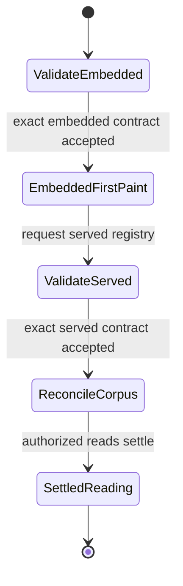
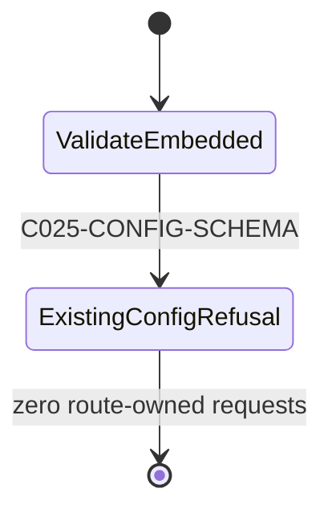
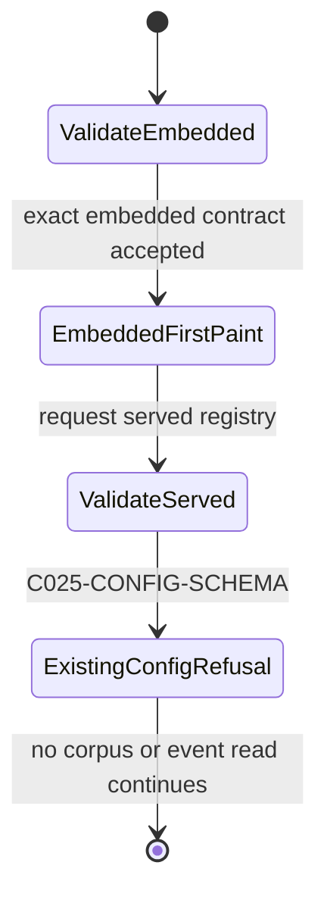

# Spec: BUG-025 — Every Company Corpus Read Reaches A Bounded Outcome

## Purpose

The Company Multi-Horizon Intelligence Lab must keep its cache-first first paint while ensuring every same-origin committed-document request eventually succeeds or becomes a named unavailable result. A server that accepts a request and never answers must not keep the reading in `not-established` forever.

## Outcome Contract

**Intent:** Every company corpus read must terminate without allowing configuration to redirect an event read away from its declared repository document.

**Success Signal:** Bounded reads settle through existing outcomes. The canonical MSFT event declaration remains valid. Every other subject-to-path shape fails with `C025-CONFIG-SCHEMA` before it can authorize a document request.

**Hard Constraints:** First paint remains cache-first. Event coverage maps one closed company subject to one exact repository path. Invalid embedded or served configuration remains a named refusal. No fallback, normalization, retry, external fetch, CSP reliance, or new error code may create another success path.

**Failure Condition:** The repair fails if a read remains pending without a product-owned bound. It also fails if any malformed, mismatched, or non-canonical event declaration reaches transport.

## Product Principle Alignment

- **P2 — Missing data renders as missing.** Once the declared bound expires, the unresolved document becomes unavailable. It never becomes zero, inferred evidence, or a settled value.
- **P9 — Works with nothing.** Event coverage remains a committed, keyless repository read. Configuration cannot turn it into an external request or proxy dependency.
- **P12 — Cache-first, automatic first paint.** The embedded-registry paint remains immediate. Bounding the later reconcile request must not turn first paint into a network gate.

This packet describes current repair work. It does not claim the bounded-read behavior is delivered.

## Requirements

### FR-025-001 — The read bound is explicit

A positive finite read bound must be declared by the company-intelligence configuration contract and validated before use. No call-site literal or hidden default may supply it.

### FR-025-002 — Every route-owned fetch uses the bound

The served configuration read, committed bar reads, and optional company document reads must all use the declared bound.

### FR-025-003 — Expiry aborts the underlying request

When the bound expires, the browser request must receive an abort signal. Rejecting only a wrapper promise while leaving the request active does not satisfy this requirement.

### FR-025-004 — Expiry reaches existing honest outcomes

A bounded configuration failure follows the existing embedded-config path. A bounded corpus-file failure follows the existing unavailable path. The current reading then reaches `data-reading-readiness="established"` with unavailable sources named in the normal account.

### FR-025-005 — First paint remains network-independent

The route still composes from its embedded registry before requesting the served configuration or corpus. A stalled request cannot block that first paint.

### FR-025-006 — A slow valid response remains valid

A response delivered before the declared bound must be processed exactly as it is today. The bound must not be tuned so low that valid local static serving becomes an outage.

### FR-025-007 — Both sides of the boundary are regression-tested

A browser test must prove a never-answering response reaches a terminal state after expiry. A paired test must prove a response released inside the bound settles normally. Both tests must drive the production route over its real ephemeral HTTP server.

### FR-025-008 — Event coverage uses a closed subject identity

Every event-source coverage entry must declare a subject in the exact form `company:<suffix>`.
The suffix grammar is `[a-z0-9]+(?:-[a-z0-9]+)*`.

The suffix contains lowercase ASCII letters, ASCII digits, and internal single hyphens only. It has no empty, leading, trailing, or repeated-hyphen segment. Validation must not lowercase, trim, decode, replace separators, or otherwise normalize a declaration into this grammar.

### FR-025-009 — The event path is derived from its subject

`eventsPath` is not an arbitrary relative URL. For subject `company:<suffix>`, its only valid value is exactly `data/company-intelligence/company-<suffix>/events.json`.

The subject suffix must appear byte-for-byte in the path. The current pair `company:msft` and `data/company-intelligence/company-msft/events.json` remains valid and unchanged.

### FR-025-010 — Every non-canonical declaration fails before registry return

The configuration reader must raise the existing `C025-CONFIG-SCHEMA` refusal before returning a registry when either field violates FR-025-008 or FR-025-009.

The refusal set includes schemes, authorities, leading slashes, backslashes, `?`, `#`, control characters, whitespace, dot segments, and every percent sign or percent-encoded form. It also includes a mismatched subject and path, plus any arbitrary same-origin file outside the exact derived path.

### FR-025-011 — Invalid configuration never authorizes a document read

An invalid embedded configuration must render the existing named `C025-CONFIG-SCHEMA` refusal before any route-owned fetch or XHR occurs.

An invalid served configuration must remain a refusal after it arrives. It must not continue from the embedded copy, request the declared event path, or start corpus reconciliation from the invalid declaration.

### FR-025-012 — Path safety has no alternate success mechanism

Validation must compare the declared pair to the canonical repository contract. It must not use URL resolution, decoding, normalization, CSP enforcement, fallback behavior, retry, or an external fetch to make an invalid pair usable.

This repair introduces no new error code. CSP remains defense in depth and cannot satisfy the subject-to-path invariant.

### FR-025-013 — Security regression coverage is discriminating

Persistent unit coverage must exercise the exact accepted MSFT pair and an adversarial rejection matrix for every class in FR-025-010. The accepted control must prove the validator does not reject every event declaration.

Persistent real-browser coverage must prove the backslash-authority payload issues zero off-origin requests and zero requests to the invalid configured path. The embedded-invalid case must also prove zero route-owned requests. The served-invalid case must prove a named refusal, no event-path request, and no embedded-config continuation.

## Acceptance Criteria

1. A held company corpus response that never answers is aborted after the declared bound.
2. The route leaves pending and renders a settled unavailable account after the abort.
3. A response released inside the bound loads normally.
4. The first composed paint still arrives before any held response is released.
5. The complete Company Intelligence browser suite and repository selftest remain green.
6. The exact `company:msft` and `data/company-intelligence/company-msft/events.json` pair is accepted without normalization.
7. Every invalid subject or path class named in FR-025-010 raises `C025-CONFIG-SCHEMA` before registry return.
8. A grammar-valid subject paired with another subject's path is refused.
9. A grammar-valid subject paired with an arbitrary same-origin file is refused.
10. Invalid embedded configuration renders the named configuration refusal and issues zero route-owned requests.
11. Invalid served configuration renders the named configuration refusal and issues no event or corpus request from that declaration.
12. A real browser issues no off-origin request and no invalid-path request for `\\127.0.0.1:9\collect.json`.
13. The accepted browser control requests the canonical same-origin MSFT event path exactly once and no other event path.

## Security Acceptance Scenarios

### BS-025-SEC-001 — The current event declaration remains valid

Given the event source declares subject `company:msft`
And it declares `data/company-intelligence/company-msft/events.json`
When the configuration is validated
Then the registry retains that exact pair
And the route may read that same-origin repository document

### BS-025-SEC-002 — An embedded origin-escape declaration is refused before transport

Given the embedded event source declares `\\127.0.0.1:9\collect.json`
When the route validates its embedded configuration
Then it renders the existing `C025-CONFIG-SCHEMA` refusal
And it issues no route-owned request
And it issues no off-origin request

### BS-025-SEC-003 — A served mismatch cannot fall back

Given the embedded configuration produced the cache-first paint
And the served configuration pairs a valid subject with a non-canonical event path
When the served configuration arrives
Then the route renders the existing `C025-CONFIG-SCHEMA` refusal
And it does not request that event path
And it does not continue corpus reconciliation from the embedded configuration

## Security Contract

The configuration remains untrusted until the complete subject-and-path pair passes validation. A relative-looking value does not gain read authority from browser URL resolution.

The accepted path is a repository identity derived from the accepted subject. It is not a configurable network destination. A malformed or mismatched pair fails before any registry consumer can observe it.

The route must expose the existing named configuration refusal for both embedded and served invalidity. It must not convert invalid served configuration into an embedded-config success.

### Single-Capability Justification

This finding tightens the existing company-intelligence configuration-validation capability. It adds no provider, adapter, route, screen, storage shape, or general URL-validation framework.

The canonical event pair is one schema invariant for one existing event-source declaration. A reusable URL sanitizer would weaken the contract by preserving arbitrary relative destinations.

## UI Wireframes

This UX reconciliation applies only to the existing Company Multi-Horizon Intelligence Lab route. It preserves the route's cache-first first paint, Company section, Simple and Power views, and inline `#subject-refusal` surface.

No new route, page, modal, toast, retry control, configuration editor, user action, or visible refusal code is introduced. The only configuration-refusal code remains `C025-CONFIG-SCHEMA`.

### Single-Screen Justification

Configuration validation changes the state of one existing route. The Company section already owns the subject controls and the inline refusal surface. The same document owns the cockpit and Power workspaces.

A second screen would add navigation or recovery behavior that FR-025-011 forbids. The route must instead move between first paint, reconciled content, and refusal in place.

### Screen Inventory

| Screen | Actor | Status | Scenarios served |
| --- | --- | --- | --- |
| Company Multi-Horizon Intelligence Lab | Operator and reader | Existing — modify state behavior only | BS-025-SEC-001, BS-025-SEC-002, BS-025-SEC-003 |

### Existing Refusal Surface Contract

The existing `#subject-refusal` paragraph remains directly below the Company help and link notice. It displays the existing code and safe configuration message as text.

The refusal is route-level. It is not an unavailable evidence row. A configuration refusal uses `data-run-status="refused"` and visible `C025-CONFIG-SCHEMA` text. Ordinary unavailable evidence keeps `data-run-status="composed"`, reaches `data-reading-readiness="established"`, and names the unavailable dimension inside the coverage account.

The red rule and text may reinforce the refusal. They are not its only signal. The visible code, message, route-level position, and alert semantics distinguish it from muted unavailable evidence.

### Screen: Company Multi-Horizon Intelligence Lab

**Actor:** Operator and reader | **Route:** `company-intelligence-lab.html` | **Status:** Existing — modify state behavior only

#### State A — Valid Embedded First Paint Then Valid Served Reconciliation

```text
FIRST PAINT — no request has gated this view
┌──────────────────────────────────────────────────────────────┐
│ Company Multi-Horizon Intelligence Lab                       │
│ [existing subtitle]                                          │
├──────────────────────────────────────────────────────────────┤
│ Company                                                      │
│ Public company identifier [ MSFT ] [ Open company ]          │
│ [subject refusal hidden]                                     │
│ [ Simple ] [ Power ]                                         │
├──────────────────────────────────────────────────────────────┤
│ Simple cockpit                                               │
│ Waiting for the committed corpus for this company.           │
│ ┌────────────┐ ┌────────────┐ ┌────────────┐ ┌────────────┐  │
│ │ Immediate  │ │ Next event │ │ Medium term│ │ Long term  │  │
│ │ [existing not-established readiness and summary]         │  │
│ └────────────┘ └────────────┘ └────────────┘ └────────────┘  │
└──────────────────────────────────────────────────────────────┘
							  │
							  │ valid served registry
							  ▼
SAME SCREEN — served registry accepted, corpus reconciled
┌──────────────────────────────────────────────────────────────┐
│ Company controls and view mode remain in place               │
│ [subject refusal hidden]                                     │
├──────────────────────────────────────────────────────────────┤
│ Simple cockpit                                               │
│ [existing settled coverage sentence]                         │
│ [four existing peer horizon cards]                           │
│ [existing contradictions and publication account]           │
└──────────────────────────────────────────────────────────────┘
```

**Interactions:**
- The embedded validation and first paint run automatically. They require no user action.
- A valid served registry reconciles automatically. An identical registry does not force a visible repaint.
- The existing company and mode controls retain their current behavior after valid reconciliation.

**State semantics:**
- First paint is `data-run-status="composed"`, `data-registry-source="embedded"`, and `data-reading-readiness="not-established"` while corpus work remains pending.
- Valid served reconciliation may start corpus reads only after the served registry passes the complete schema contract.
- A settled account is `data-run-status="composed"`, `data-registry-source="served"`, and `data-reading-readiness="established"`.

**Responsive:**
- The existing Company controls wrap without horizontal page scrolling.
- The four peer cards use the existing responsive grid and become one column on narrow screens.
- The first and reconciled paints keep the same document order at every width.

**Accessibility:**
- Reconciliation does not move focus or announce a redundant success message.
- The existing heading order and Company field label remain unchanged.
- Not-established and settled states use text, not colour alone.

#### State B — Invalid Embedded Configuration

```text
IMMEDIATE REFUSAL — before any route-owned request
┌──────────────────────────────────────────────────────────────┐
│ Company Multi-Horizon Intelligence Lab                       │
│ [existing subtitle]                                          │
├──────────────────────────────────────────────────────────────┤
│ Company                                                      │
│ Public company identifier [ MSFT ] [ Open company ]          │
│ ┃ C025-CONFIG-SCHEMA: [existing safe configuration message]  │
│ [ Simple ] [ Power ]                                         │
├──────────────────────────────────────────────────────────────┤
│ [result regions contain no settled output]                    │
└──────────────────────────────────────────────────────────────┘
```

**Interactions:**
- Embedded validation runs before every route-owned fetch or XHR.
- No control retries, repairs, normalizes, or edits the invalid configuration.
- Existing controls do not clear the route-level refusal or authorize corpus work.

**State semantics:**
- The route moves directly to `data-run-status="refused"` with `C025-CONFIG-SCHEMA`.
- `data-reading-readiness` remains `not-established`.
- No identity, horizon, coverage, or publication content is presented as a settled result.
- The route issues zero route-owned requests.

**Responsive:**
- The inline refusal wraps within the existing Company band.
- The code and message remain visible without horizontal scrolling at narrow widths.
- No result grid reserves empty horizontal space.

**Accessibility:**
- The existing refusal paragraph acts as one atomic alert.
- The alert exposes `role="alert"`, `aria-live="assertive"`, and `aria-atomic="true"` semantics.
- The code and message provide the non-colour distinction from unavailable evidence.
- Initial-load refusal does not force focus away from the document's normal reading order.

#### State C — Invalid Served Configuration After Embedded First Paint

```text
VALID EMBEDDED FIRST PAINT
┌──────────────────────────────────────────────────────────────┐
│ Company controls                                             │
│ [subject refusal hidden]                                     │
│ Waiting for the committed corpus for this company.           │
│ [four existing not-established horizon cards]                │
└──────────────────────────────────────────────────────────────┘
							  │
							  │ served registry fails validation
							  ▼
SAME SCREEN — ROUTE-LEVEL REFUSAL
┌──────────────────────────────────────────────────────────────┐
│ Company controls                                             │
│ ┃ C025-CONFIG-SCHEMA: [existing safe configuration message]  │
├──────────────────────────────────────────────────────────────┤
│ [no settled horizon or coverage-account output]              │
└──────────────────────────────────────────────────────────────┘
```

**Interactions:**
- The embedded first paint remains automatic and network-independent.
- The invalid served registry causes one in-place transition to the existing refusal.
- The route offers no retry, fallback, continuation, or configuration action.
- No event path or corpus reconciliation starts after the served refusal.

**State semantics:**
- The final state is `data-run-status="refused"` with `C025-CONFIG-SCHEMA`.
- The embedded source may remain the factual source of the earlier paint. It is not an accepted served result.
- The composed-and-established settled predicate is false after refusal.
- The route does not relabel embedded content as served, successful, or reconciled.

**Responsive:**
- The refusal replaces the result emphasis in the same Company band at every width.
- Any previously painted result content cannot create horizontal overflow or remain visually dominant.
- The code and safe message wrap as one readable block.

**Accessibility:**
- The asynchronous refusal is announced once through the existing atomic alert.
- Focus stays on the reader's current element. The route does not move focus to the alert.
- Screen readers hear the code before the message and never hear the rejected path payload.
- The route-level alert remains distinct from dimension-level unavailable rows by code, position, and status.

### Refusal Versus Ordinary Unavailable Evidence

| Outcome | Route status | Reading readiness | Visible surface | Route-owned continuation |
| --- | --- | --- | --- | --- |
| Valid first paint | `composed` | `not-established` | Existing waiting copy and four provisional horizon cards | Served configuration validation may begin |
| Valid settled reading with unavailable evidence | `composed` | `established` | Existing coverage account names each unavailable dimension and reason | Only reads authorized by valid configuration |
| Invalid embedded configuration | `refused` | `not-established` | Existing `C025-CONFIG-SCHEMA` alert and no settled account | None |
| Invalid served configuration | `refused` | `not-established` | Existing `C025-CONFIG-SCHEMA` alert, with embedded first paint not presented as success | None |

## User Flows

### User Flow: Valid Cache-First Reconciliation



The first paint precedes the served request outcome. No success state depends on normalization, retry, or an external path.

### User Flow: Invalid Embedded Configuration



The refusal is terminal for this route load. No user action can convert the invalid declaration into a request.

### User Flow: Invalid Served Configuration After First Paint



The earlier first paint does not become a fallback success. The route remains refused and does not reconcile from either invalid served data or the embedded copy.

### Acceptance Evidence Boundary

The Human Acceptance Record in `uservalidation.md` remains an `external-record`. These wireframes preserve that record without claiming a live human browser exercise.

## Non-Goals

- Retrying, backing off, or issuing a second request.
- Changing which corpus documents exist or which dimensions they answer.
- Changing BUG-018's pending copy or settled predicate.
- Creating a repository-wide networking framework without a second production consumer and an approved capability design.
- Allowing custom event directories, filenames, or arbitrary same-origin files.
- Normalizing subject case, separators, whitespace, dot segments, or percent-encoded text.
- Decoding a configured path before deciding whether it is valid.
- Treating URL resolution or CSP blocking as path validation.
- Adding an external event fetch, a fallback event source, or a new refusal code.

## Grounding

- `bug.md` — observed source path and independent classification.
- `company-intelligence-lab.html` — direct fetch sites and pending chain.
- `docs/Product-Principles.md` — P2 and P12.
- `specs/_bugs/BUG-018-corpus-pending-window-states-absence-as-settled-fact/spec.md` — pending-claim behavior already delivered.
