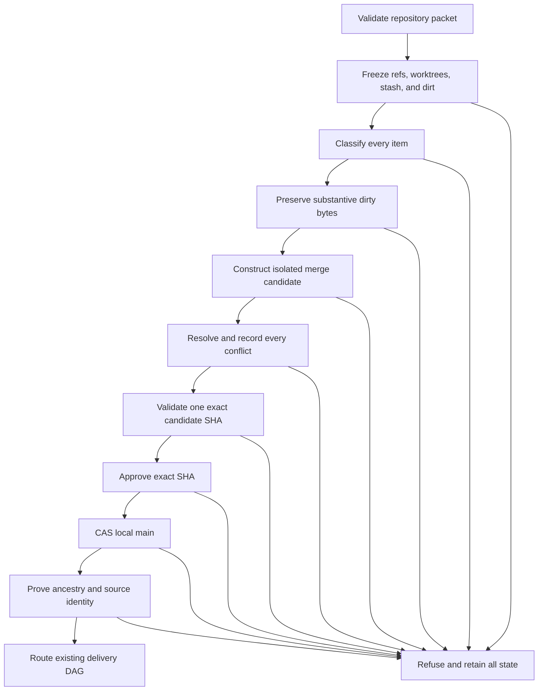

# Design: Integrate Research Lab Main

## Design Brief

### Current State

Local `main` is `fa9be9ddcd330220171c7e374071be6856adc677`.
`origin/main` is `397dc41d7c4189299d2e2ceb0486927545e39677`.
Their merge base is `c0d7f5568805af40fa77ae70e1387fbc5dbca2a5`.
The histories contain 79 local-only and 320 origin-only commits.

The live repository has 68 refs in 30 object groups.
It also has five worktree registrations and one local stash entry.
The primary and Shock worktrees contain substantive dirty paths.
Two other worktree registrations are prunable metadata with no live Git checkout.

### Target State

Build one local candidate in an isolated worktree.
The candidate preserves local `main`, `origin/main`, and every selected delivery tip as ancestors.
Every other item receives an evidence-backed inclusion or exclusion record.

Advance local `main` through one compare-and-swap operation.
The expected old value is the frozen local `main` identity.
The new value is the exact validated candidate identity.
The operation performs no push or cleanup.

### Patterns To Follow

- Use the append-only history rule in [Product Principles](../../../docs/Product-Principles.md), especially P21.
- Use exact commands from the [Research Lab command registry](../../../.specify/memory/agents.md).
- Use the packet shape from the [OPS packet recipe](../../../.github/docs/recipes/ops-packet-work.md).
- Keep lifecycle truth in each packet's own `state.json`.
- Use Git object identities, tree identities, ancestry, and path-level blob identities as proof.
- Use committed producers for generated artifacts after resolving their source inputs.

### Patterns To Avoid

- Do not merge every fetched ref.
- Do not select a tip from its timestamp, suffix, or ref name.
- Do not merge exact mirrors or represented preservation chains twice.
- Do not rebase, reset, or rewrite a source history.
- Do not resolve a conflict with whole-tree `ours` or `theirs` selection.
- Do not hand-merge generated output when a committed producer exists.
- Do not infer delivery, certification, or human acceptance from ancestry.

### Resolved Decisions

- Start the integration branch from frozen local `main`.
- Merge frozen `origin/main` first with a merge commit.
- Preserve dirty bytes in path-owned commits before candidate construction.
- Select one latest proved tip per delivery family.
- Retain all source refs, stashes, rescue refs, and worktree registrations.
- Record the operation in one packet-local append-only JSONL ledger.
- Bind every validation result and approval to one full candidate SHA.
- Update local `main` with `git update-ref <new> <expected-old>`.
- Route delivery from final integrated `main` using packet-owned state.

### Open Questions

None block this design.
Several preservation roots require execution-time owner decisions.
Those decisions are proof obligations with refusal outcomes, not unresolved architecture choices.

## Purpose And Scope

This design implements [the current specification](spec.md) as one local integration operation.
It covers inventory, byte preservation, candidate construction, conflict resolution, validation, local-main advancement, and delivery routing.

The design creates no product feature, route, service, or reusable framework.
It defines one packet-local ledger and one isolated Git candidate.
It does not authorize push, cleanup, ref deletion, stash mutation, or worktree removal.

Operator-visible boundary: `PUSH: NOT AUTHORIZED` and `CLEANUP: NOT AUTHORIZED`.

The current [execution state](state.json) remains nonterminal.
Certification and human acceptance remain owned by their existing authorities.

## Grounded Current Topology

The design run re-read Git state after validating the inherited repository packet.
No fetch or Git mutation ran during this observation.

| Fact | Revalidated value |
| --- | --- |
| Local `main` | `fa9be9ddcd330220171c7e374071be6856adc677` |
| `origin/main` | `397dc41d7c4189299d2e2ceb0486927545e39677` |
| Merge base | `c0d7f5568805af40fa77ae70e1387fbc5dbca2a5` |
| Divergence | 79 local-only, 320 origin-only |
| Primary tip | `eba665b8ee5569b2bb14c4ab6f868cb7636788c8` |
| Company checkpoint | `9f6319b8afdc74991f063f9f1310c711850d38f7` |
| Shock checkpoint | `e43c83a414ca90fb16054463aae8328e4b08a064` |
| Local stash | `156e37d149898b6f75021f0f348fe642b5fde645` |
| Refs | 68 refs in 30 object groups |
| Worktree registrations | Five, including two prunable registrations |
| Live writer scan | No matching Git writer at the observation point |
| Git operation markers | None at the observation point |

The normalized snapshot identity is
`sha256:8ab3e15d4b40fdb6984ff3f62381bf0b65ced1d81da9ab9a208f062b3c1c1eb4`.
Its canonical payload excludes only this OPS packet's owned planning paths from dirty-status hashing.
It includes every ref, stash entry, worktree registration, non-OPS dirty path, and main identity.
The executor must create a new identity from live state before mutation.

## Architecture Overview

The operation has seven state boundaries.
Each boundary appends records to `integration-ledger.jsonl` inside this packet.



The isolated candidate owns all integration mutations.
Source worktrees remain available for preservation commits only.
The primary checkout never becomes the integration worktree.

## One-Operation Ledger

The operation uses one JSONL file named `integration-ledger.jsonl`.
This is packet evidence, not a general Git integration framework.
Every line is an immutable event.
A correction appends a new event with `supersedesRecordId`.

### Common Event Contract

| Field | Type | Rule |
| --- | --- | --- |
| `schemaVersion` | string | Exactly `ops-integration-ledger/v1` |
| `recordId` | string | Unique packet-local identifier |
| `sequence` | integer | Starts at 1 and increases by one |
| `eventType` | enum | One closed event type from the table below |
| `inventoryId` | string | Full `sha256:` identity of the frozen inventory |
| `observedAt` | RFC 3339 string | Execution observation time |
| `actor` | string | Recorded operator or agent identity |
| `sourceEvidence` | array of strings | Commands or prior record identifiers |
| `supersedesRecordId` | string or null | Prior record corrected by this event |

| Event type | Additional payload |
| --- | --- |
| `inventory-frozen` | Counts, main identities, normalized status identities, quiescence proof |
| `inventory-item` | One ref, stash entry, rescue root, or worktree registration |
| `classification-resolution` | Final inclusion or exclusion proof for one item |
| `dirty-byte` | Path, owner, blob identity, decision, durable commit |
| `candidate-step` | Ordered merge or content-preservation step and resulting commit |
| `conflict-observed` | One unresolved conflict and both source intents |
| `conflict-resolved` | Owner decision, result blob, and validating check |
| `validation-check` | Command, exit code, candidate SHA, and evidence reference |
| `candidate-approved` | Exact candidate SHA and approval challenge result |
| `main-cas` | Expected old SHA, requested new SHA, result, and rollback state |
| `handoff` | Packet state identity, recorded owner, next obligation, integrated main |
| `refusal` | Code, observed condition, required condition, owner, and unchanged boundary |

The ledger must never contain absolute home paths, credentials, or secret values.
Worktrees use the aliases defined below.
Repository-relative dirty paths remain exact.

## Frozen Live Inclusion And Exclusion Matrix

This matrix covers all 68 current refs.
Exact mirrors share one object-group row and list every full ref name.
The classifications are the current design-time dispositions.
An executor may change a conditional classification only through an appended resolution event.

```json
{
  "schemaVersion": "ops-integration-matrix/v1",
  "snapshotId": "sha256:8ab3e15d4b40fdb6984ff3f62381bf0b65ced1d81da9ab9a208f062b3c1c1eb4",
  "refCount": 68,
  "objectGroupCount": 30,
  "rows": [
    {
      "id": "R01",
      "oid": "c8da51c58e88ff819b5fbc382c09ddd84f89b3bc",
      "refs": [
        "refs/heads/agent/bug017-current-evidence-db38903e",
        "refs/remotes/origin/checkpoint/research-lab-20260902-7fbaa/local/agent/bug017-current-evidence-db38903e"
      ],
      "family": "BUG-017 evidence",
      "classification": "delivery-candidate",
      "action": "prove-represented-or-include-once"
    },
    {
      "id": "R02",
      "oid": "5f5caf16ac914bae67b990cc40bd7d1e025250c3",
      "refs": [
        "refs/heads/bubbles/company-intelligence-delivery",
        "refs/remotes/origin/checkpoint/research-lab-20260902-7fbaa/local/bubbles/company-intelligence-delivery"
      ],
      "family": "Company",
      "classification": "superseded-delivery",
      "action": "retain-and-exclude",
      "representedBy": "R16"
    },
    {
      "id": "R03",
      "oid": "f19f9c34780f25935101e604dbc50a83213e9e4f",
      "refs": [
        "refs/heads/bubbles/company-intelligence-delivery-r10",
        "refs/heads/bubbles/company-intelligence-delivery-r11",
        "refs/remotes/origin/checkpoint/research-lab-20260902-7fbaa/local/bubbles/company-intelligence-delivery-r10",
        "refs/remotes/origin/checkpoint/research-lab-20260902-7fbaa/local/bubbles/company-intelligence-delivery-r11"
      ],
      "family": "Company",
      "classification": "superseded-delivery",
      "action": "retain-and-exclude",
      "representedBy": "R16"
    },
    {
      "id": "R04",
      "oid": "cfbfd60c0b360a083fbda70957213823cd834b48",
      "refs": [
        "refs/heads/bubbles/company-intelligence-delivery-r2",
        "refs/remotes/origin/checkpoint/research-lab-20260902-7fbaa/local/bubbles/company-intelligence-delivery-r2"
      ],
      "family": "Company",
      "classification": "superseded-delivery",
      "action": "retain-and-exclude",
      "representedBy": "R16"
    },
    {
      "id": "R05",
      "oid": "031d64b54ff8348bb4217ac3516c3be8d89b7ad4",
      "refs": [
        "refs/heads/bubbles/company-intelligence-delivery-r3",
        "refs/remotes/origin/checkpoint/research-lab-20260902-7fbaa/local/bubbles/company-intelligence-delivery-r3"
      ],
      "family": "Company",
      "classification": "superseded-delivery",
      "action": "retain-and-exclude",
      "representedBy": "R16"
    },
    {
      "id": "R06",
      "oid": "3e4938e2eb464cb2ac2b740055513cf462df407c",
      "refs": [
        "refs/heads/bubbles/company-intelligence-delivery-r4",
        "refs/remotes/origin/checkpoint/research-lab-20260902-7fbaa/local/bubbles/company-intelligence-delivery-r4"
      ],
      "family": "Company",
      "classification": "superseded-delivery",
      "action": "retain-and-exclude",
      "representedBy": "R16"
    },
    {
      "id": "R07",
      "oid": "6c6a27e1fd42e7c89484dfeb63e76f1d40a56c3e",
      "refs": [
        "refs/heads/bubbles/company-intelligence-delivery-r5",
        "refs/remotes/origin/checkpoint/research-lab-20260902-7fbaa/local/bubbles/company-intelligence-delivery-r5"
      ],
      "family": "Company",
      "classification": "superseded-delivery",
      "action": "retain-and-exclude",
      "representedBy": "R16"
    },
    {
      "id": "R08",
      "oid": "5168109475308905216d80cbc88f3af34c493a28",
      "refs": [
        "refs/heads/bubbles/company-intelligence-delivery-r6",
        "refs/heads/bubbles/company-intelligence-delivery-r7",
        "refs/remotes/origin/checkpoint/research-lab-20260902-7fbaa/local/bubbles/company-intelligence-delivery-r6",
        "refs/remotes/origin/checkpoint/research-lab-20260902-7fbaa/local/bubbles/company-intelligence-delivery-r7"
      ],
      "family": "Company",
      "classification": "superseded-delivery",
      "action": "retain-and-exclude",
      "representedBy": "R16"
    },
    {
      "id": "R09",
      "oid": "32289ee5b985e16c055e2cb3b22c0aed90964981",
      "refs": [
        "refs/heads/bubbles/company-intelligence-delivery-r8",
        "refs/remotes/origin/checkpoint/research-lab-20260902-7fbaa/local/bubbles/company-intelligence-delivery-r8"
      ],
      "family": "Company",
      "classification": "superseded-delivery",
      "action": "retain-and-exclude",
      "representedBy": "R16"
    },
    {
      "id": "R10",
      "oid": "f80fbec9f6066d313ca438cb644fa15e9bd0b2c2",
      "refs": [
        "refs/heads/bubbles/company-intelligence-delivery-r9",
        "refs/remotes/origin/checkpoint/research-lab-20260902-7fbaa/local/bubbles/company-intelligence-delivery-r9"
      ],
      "family": "Company",
      "classification": "superseded-delivery",
      "action": "retain-and-exclude",
      "representedBy": "R16"
    },
    {
      "id": "R11",
      "oid": "d0c09a3ec90d2bb72920caee9e44f1d5f697c619",
      "refs": [
        "refs/heads/bubbles/shock-transmission-planning-a5c53f",
        "refs/remotes/origin/checkpoint/research-lab-20260902-7fbaa/local/bubbles/shock-transmission-planning-a5c53f"
      ],
      "family": "Shock",
      "classification": "superseded-delivery",
      "action": "retain-and-exclude",
      "representedBy": "R17"
    },
    {
      "id": "R12",
      "oid": "e17040f2e9474fd71e4c6fbf416d8b6cf7bcaf57",
      "refs": [
        "refs/heads/checkpoint/research-lab-20260902-7fbaa/canonical-main",
        "refs/remotes/origin/checkpoint/research-lab-20260902-7fbaa/canonical-main",
        "refs/remotes/origin/checkpoint/research-lab-20260902-7fbaa/local/checkpoint/research-lab-20260902-7fbaa/canonical-main"
      ],
      "family": "canonical checkpoint",
      "classification": "represented-preservation",
      "action": "retain-and-exclude",
      "representedBy": "R18 then R13"
    },
    {
      "id": "R13",
      "oid": "eba665b8ee5569b2bb14c4ab6f868cb7636788c8",
      "refs": [
        "refs/heads/checkpoint/research-lab-20260902-7fbaa/late/feature-030-design",
        "refs/remotes/origin/checkpoint/research-lab-20260902-7fbaa/late/feature-030-design",
        "refs/remotes/origin/checkpoint/research-lab-20260902-7fbaa/local/checkpoint/research-lab-20260902-7fbaa/late/feature-030-design"
      ],
      "family": "primary current delivery",
      "classification": "delivery-candidate",
      "action": "preserve-owned-dirt-then-include-final-tip"
    },
    {
      "id": "R14",
      "oid": "183eb004397b30ccebf740704fc5838510597394",
      "refs": [
        "refs/heads/checkpoint/research-lab-20260902-7fbaa/worktree/bug017-bug022-gaps-r4-final-shape",
        "refs/remotes/origin/checkpoint/research-lab-20260902-7fbaa/local/checkpoint/research-lab-20260902-7fbaa/worktree/bug017-bug022-gaps-r4-final-shape",
        "refs/remotes/origin/checkpoint/research-lab-20260902-7fbaa/worktree/bug017-bug022-gaps-r4-final-shape"
      ],
      "family": "BUG-017 and BUG-022",
      "classification": "delivery-candidate",
      "action": "prove-represented-by-current-owned-commits-or-include-once"
    },
    {
      "id": "R15",
      "oid": "b52155a85e6d161d165ed364d8a7a4a298b8e995",
      "refs": [
        "refs/heads/checkpoint/research-lab-20260902-7fbaa/worktree/bug022-regression-iter4",
        "refs/remotes/origin/checkpoint/research-lab-20260902-7fbaa/local/checkpoint/research-lab-20260902-7fbaa/worktree/bug022-regression-iter4",
        "refs/remotes/origin/checkpoint/research-lab-20260902-7fbaa/worktree/bug022-regression-iter4"
      ],
      "family": "BUG-022",
      "classification": "delivery-candidate",
      "action": "prove-represented-by-current-owned-commits-or-include-once"
    },
    {
      "id": "R16",
      "oid": "9f6319b8afdc74991f063f9f1310c711850d38f7",
      "refs": [
        "refs/heads/checkpoint/research-lab-20260902-7fbaa/worktree/company-r11",
        "refs/remotes/origin/checkpoint/research-lab-20260902-7fbaa/local/checkpoint/research-lab-20260902-7fbaa/worktree/company-r11",
        "refs/remotes/origin/checkpoint/research-lab-20260902-7fbaa/worktree/company-r11"
      ],
      "family": "Company",
      "classification": "included-tip",
      "action": "merge-once"
    },
    {
      "id": "R17",
      "oid": "e43c83a414ca90fb16054463aae8328e4b08a064",
      "refs": [
        "refs/heads/checkpoint/research-lab-20260902-7fbaa/worktree/shock-transmission",
        "refs/remotes/origin/checkpoint/research-lab-20260902-7fbaa/local/checkpoint/research-lab-20260902-7fbaa/worktree/shock-transmission",
        "refs/remotes/origin/checkpoint/research-lab-20260902-7fbaa/worktree/shock-transmission"
      ],
      "family": "Shock",
      "classification": "delivery-candidate",
      "action": "preserve-hosted-dirt-then-include-final-tip"
    },
    {
      "id": "R18",
      "oid": "ff31ed2e2c329f569dfdf6adfab42c8f767236de",
      "refs": [
        "refs/heads/checkpoint/research-lab-all-changes-20260902",
        "refs/remotes/origin/checkpoint/research-lab-20260902-7fbaa/local/checkpoint/research-lab-all-changes-20260902",
        "refs/remotes/origin/checkpoint/research-lab-all-changes-20260902"
      ],
      "family": "workspace checkpoint",
      "classification": "represented-preservation",
      "action": "retain-and-exclude",
      "representedBy": "R13"
    },
    {
      "id": "R19",
      "oid": "fa9be9ddcd330220171c7e374071be6856adc677",
      "refs": [
        "refs/heads/main",
        "refs/remotes/origin/checkpoint/research-lab-20260902-7fbaa/local/main"
      ],
      "family": "local main",
      "classification": "canonical-input",
      "action": "candidate-start"
    },
    {
      "id": "R20",
      "oid": "5edd7b60a04e85c68da2da084a5d0a07d9e49f75",
      "refs": [
        "refs/heads/rescue/uncommitted-20260822",
        "refs/remotes/origin/checkpoint/research-lab-20260902-7fbaa/local/rescue/uncommitted-20260822"
      ],
      "family": "rescue",
      "classification": "rescue-root",
      "action": "owner-review-unique-content"
    },
    {
      "id": "R21",
      "oid": "ee8f872daa6bb9e0dc089e0cea1ab02a5c879ad8",
      "refs": [
        "refs/remotes/origin/checkpoint/archive-local-main-ee8f872daa6b-r3-vscode7cd676ca",
        "refs/remotes/origin/checkpoint/archive-worktree-primary-ee8f872daa6b-r3-vscode7cd676ca",
        "refs/remotes/origin/checkpoint/bug-007-fastlane-ee8f872da",
        "refs/remotes/origin/checkpoint/copilot-20260903-e70e41c4/branches/main"
      ],
      "family": "remote archive delivery",
      "classification": "delivery-candidate",
      "action": "review-through-latest-R23"
    },
    {
      "id": "R22",
      "oid": "a6c5041be066fb313c216153471d697078e761d8",
      "refs": [
        "refs/remotes/origin/checkpoint/archive-stash-0-a6c5041be066-r3-vscode7cd676ca",
        "refs/remotes/origin/checkpoint/copilot-20260903-e70e41c4/stashes/stash-0-a6c5041be066"
      ],
      "family": "remote archive stash",
      "classification": "delivery-candidate",
      "action": "compare-base-index-worktree-trees"
    },
    {
      "id": "R23",
      "oid": "5836e675058471a78fdd83eab79390148aa79a0e",
      "refs": [
        "refs/remotes/origin/checkpoint/copilot-20260903-e70e41c4/branches/checkpoint/workspace-preserve-research-lab-r3-ee8f872daa6b-vscode7cd676ca",
        "refs/remotes/origin/checkpoint/copilot-20260903-e70e41c4/worktrees/primary",
        "refs/remotes/origin/checkpoint/workspace-preserve-research-lab-r3-ee8f872daa6b-vscode7cd676ca"
      ],
      "family": "remote archive delivery",
      "classification": "delivery-candidate",
      "action": "latest-family-tip-owner-review"
    },
    {
      "id": "R24",
      "oid": "156e37d149898b6f75021f0f348fe642b5fde645",
      "refs": [
        "refs/remotes/origin/checkpoint/research-lab-20260902-7fbaa/stash/stash-0",
        "refs/stash"
      ],
      "family": "current stash",
      "classification": "delivery-candidate",
      "action": "compare-base-index-worktree-trees"
    },
    {
      "id": "R25",
      "oid": "397dc41d7c4189299d2e2ceb0486927545e39677",
      "refs": ["refs/remotes/origin/main"],
      "family": "origin main",
      "classification": "canonical-input",
      "action": "merge-first"
    },
    {
      "id": "R26",
      "oid": "d3ba5d325b3d7d4da28e42832fc5c01ee85bc895",
      "refs": ["refs/remotes/origin/preserve/20260903/research-lab/branch-main-d3ba5d325b3d"],
      "family": "origin main preservation",
      "classification": "represented-preservation",
      "action": "retain-and-exclude",
      "representedBy": "R25"
    },
    {
      "id": "R27",
      "oid": "612382ddf53603dc16b59bdee71da71a9a6d3916",
      "refs": ["refs/remotes/origin/spec-025-company-intelligence"],
      "family": "Company",
      "classification": "superseded-delivery",
      "action": "retain-and-exclude",
      "representedBy": "R16 and R19"
    },
    {
      "id": "R28",
      "oid": "b0740b933f1875ea5301665cb12e9d20f9ac2b69",
      "refs": ["refs/tags/rescue/acceptance-bulk-stamp-guard"],
      "family": "rescue",
      "classification": "rescue-root",
      "action": "owner-review-two-unique-commits"
    },
    {
      "id": "R29",
      "oid": "05bdd2bec73e3ba950b8c637cbf7e8dc9e3d8519",
      "refs": ["refs/tags/rescue/acceptance-method-correction"],
      "family": "rescue",
      "classification": "represented-preservation",
      "action": "retain-and-exclude",
      "representedBy": "R19 by patch equivalence"
    },
    {
      "id": "R30",
      "oid": "2f3aa7fa5c62a8f5c4efd89a0be89b5d8dd909f5",
      "refs": ["refs/tags/rescue/bug020-compose-probe"],
      "family": "rescue",
      "classification": "rescue-root",
      "action": "owner-review-three-unique-commits"
    }
  ],
  "worktrees": [
    {
      "id": "W01",
      "alias": "primary",
      "head": "eba665b8ee5569b2bb14c4ab6f868cb7636788c8",
      "classification": "worktree-metadata",
      "state": "live-dirty",
      "action": "preserve-path-owned-bytes"
    },
    {
      "id": "W02",
      "alias": "prunable-bug017-bug022",
      "head": "183eb004397b30ccebf740704fc5838510597394",
      "classification": "worktree-metadata",
      "state": "registration-prunable-no-live-git-checkout",
      "action": "retain-registration"
    },
    {
      "id": "W03",
      "alias": "prunable-bug022",
      "head": "b52155a85e6d161d165ed364d8a7a4a298b8e995",
      "classification": "worktree-metadata",
      "state": "registration-prunable-no-live-git-checkout",
      "action": "retain-registration"
    },
    {
      "id": "W04",
      "alias": "company-r11",
      "head": "9f6319b8afdc74991f063f9f1310c711850d38f7",
      "classification": "worktree-metadata",
      "state": "live-marker-only",
      "action": "exclude-dot-bubbles-worktree"
    },
    {
      "id": "W05",
      "alias": "shock-transmission",
      "head": "e43c83a414ca90fb16054463aae8328e4b08a064",
      "classification": "worktree-metadata",
      "state": "live-dirty-plus-marker",
      "action": "preserve-owner-confirmed-bug-bytes-and-exclude-marker"
    }
  ],
  "stashEntries": [
    {
      "id": "S01",
      "name": "stash@{0}",
      "oid": "156e37d149898b6f75021f0f348fe642b5fde645",
      "classification": "delivery-candidate",
      "action": "retain-stash-and-review-one-worktree-path"
    }
  ]
}
```

The ref rows sum to 68.
The five worktree rows cover every current registration.
`S01` is a logical alias for `refs/stash` in `R24` and does not increase the ref count.

## Latest Non-Superseded Tip Proof

Selection uses evidence in this order.
No later rule may override an earlier failed rule.

1. Group exact mirrors by full commit object identity.
2. Prove linear supersession with `git merge-base --is-ancestor`.
3. Compare left and right commit counts with `git rev-list --left-right --count`.
4. Compare full tree identities when preservation commits have different metadata.
5. Compare path sets and blob identities when whole trees differ.
6. Compare patch identity only for non-merge commits.
7. Compare stash base, index, worktree, and untracked parents separately.
8. Require an artifact owner decision for semantic differences.
9. Include both tips or refuse when representation remains ambiguous.

### Current Proved Relationships

| Family | Current proof | Design consequence |
| --- | --- | --- |
| Company | Every `bubbles/company-intelligence-delivery*` tip is an ancestor of `9f6319b8...` | Merge `R16` once and retain all older refs |
| Shock | `d0c09a3e...` is the parent and ancestor of `e43c83a4...` | Use the final `R17` lineage once |
| Workspace checkpoint | `ff31ed2e...` is an ancestor of `eba665b8...` | Exclude `R18` as a separate merge input |
| Canonical checkpoint | `e17040f2...` and `ff31ed2e...` share tree `3aabba2e...` | Retain `R12` without merging its duplicate tree |
| Origin preservation | `d3ba5d32...` is an ancestor of current `origin/main` | Exclude `R26` as represented preservation |
| Company remote branch | `612382dd...` is an ancestor of local main, origin main, and Company checkpoint | Exclude `R27` as superseded delivery |
| Acceptance correction rescue | Patch identity exists in local main and required local tips | Exclude `R29` while retaining its tag |
| Current stash | Worktree delta changes only `market-brief.payload.json` and has no index delta | Review that blob before any content inclusion |
| Archive stash | Index content is represented, while its worktree adds a `spec.md` delta | Review the worktree-only delta separately |
| Remote archive | `5836e675...` extends `ee8f872d...` by one commit | Review `R23` as the family tip and never merge `R21` separately |

`R01`, `R14`, `R15`, `R20`, `R22`, `R23`, `R24`, `R28`, and `R30` remain conditional.
Each has unique history or tree content under the current proof set.
The operation must resolve every conditional row before candidate construction closes.

### Family Selection Algorithm

For each delivery family, build a directed graph from commit parent edges.
Mark exact object mirrors as aliases of one node.
Mark a node superseded only when a selected descendant contains its commits.

When two nodes are not ancestor-related, compare their changed path sets.
For every overlapping path, compare blobs and read the owning packet contract.
Select one tip only when it represents every intended predecessor behavior.

A commit date is diagnostic only.
A branch suffix such as `r11` is diagnostic only.
Neither value can prove latest intent.

## Dirty Byte Preservation

Preservation occurs before the integration worktree is created.
Every commit stages an explicit path list.
The executor must never use repository-wide staging.

### Primary Worktree Ownership

| Owner | Current paths | Preservation rule |
| --- | --- | --- |
| Feature 030 | `scripts/brief-openai-compatible-adapter.mjs`, `scripts/selftest.mjs`, `site-exclusions.json`, five Feature 030 artifacts, and two adapter tests | Commit as one Feature 030 owner-approved change or a smaller owner-approved series |
| BUG-022 | `report.md` and `state.json` inside the BUG-022 packet | Commit separately without changing certification or acceptance meaning |
| This OPS packet | `spec.md`, `state.json`, and this `design.md` inside the OPS packet | Preserve through the planning chain, not inside a Feature 030 commit |

The five Feature 030 artifacts are `report.md`, `scenario-manifest.json`, `scopes.md`, `state.json`, and `test-plan.json`.
The two tests are `brief-openai-compatible-adapter.functional.mjs` and `brief-openai-compatible-adapter.local-canary.mjs`.

### Company Worktree Ownership

The Company worktree has only `.bubbles-worktree` as untracked content.
That marker is operational metadata.
It must not enter any commit or candidate tree.

### Shock Worktree Ownership

The Shock worktree has five modified tracked bug-artifact paths.
It also has one untracked `.bubbles-worktree` marker.

The modified paths belong to BUG-017 and BUG-024, not Feature 031.
Their location in the Shock worktree does not transfer ownership.
Each bug owner must confirm the bytes before preservation.

Preserve approved bug paths in separate commits on the current checkpoint lineage.
Name each commit's owner and source worktree in the ledger.
Exclude `.bubbles-worktree` from every commit.

### Forbidden Commit Content

Reject any staged set containing the following content.

- `.bubbles-worktree`.
- `.specify/runtime/**`.
- Session logs or repository-binding control files.
- `*.lock` Git operation files.
- `_site/**`.
- `playwright-report/**`.
- `test-results/**`.
- Transient evidence captures.
- Generated test output.
- Absolute machine paths inside committed text.

### Preservation Proof

For every substantive dirty path:

1. Record the pre-commit blob hash or working-tree hash.
2. Record the packet owner and ownership source.
3. Stage only the approved path list.
4. Compare the staged path list with the approved list.
5. Scan the staged set for forbidden content.
6. Commit with the frozen source tip as the expected parent.
7. Read the commit tree and compare every approved blob.
8. Recheck all source refs and worktree states.

If a path has ambiguous ownership, append `OWNERSHIP-AMBIGUOUS` and stop.
Do not move the path into a convenient family.

## Isolated Candidate Construction

Create a new integration branch from frozen local `main`.
Use a separate worktree whose alias contains the inventory identity prefix.
Do not reuse any source worktree.

The conceptual branch name is
`integration/OPS-integrate-research-lab-main/<inventory-prefix>`.
The actual name must be absent at freeze time.

Every required source enters through a merge commit.
Use full commit identities from the frozen ledger.
Do not merge symbolic refs after freeze.

### Deterministic Merge Order

| Order | Input | Reason |
| --- | --- | --- |
| 0 | Frozen local `main` | Makes the local history an ancestor by construction |
| 1 | Frozen `origin/main` | Establishes the current published baseline before local delivery overlays |
| 2 | Final primary owned-dirty tip | Applies current Feature 030, BUG-022, and OPS planning history against the remote baseline |
| 3 | Final Company tip | Adds the largest divergent delivery family after the shared baseline is stable |
| 4 | Final Shock tip | Adds the narrow Shock lineage and its owner-separated hosted bug commits |
| 5 | Latest approved archive family tip | Runs only if `R23` contains intended content not represented above |
| 6 | Approved stash or rescue content commits | Runs only for independently proved unique and intended content |

Company precedes Shock because Company adds 34 commits beyond its main-side comparison.
Shock adds one committed checkpoint beyond its source branch.
This order resolves broad shared-file overlap before the narrower bug-artifact overlay.

The current primary tip descends local `main` through five commits.
Merging it after `origin/main` preserves both parent histories.
The final primary tip will also contain path-owned preservation commits created before construction.

### Conditional Preservation Inputs

Do not merge a stash merge commit into the candidate.
Its extra parent can import duplicate index history.
Copy only owner-approved unique blobs into a dedicated preservation commit.
Keep the stash unchanged.

Do not merge a rescue chain when part of that chain is already patch-equivalent.
Apply only owner-approved unique commits or path content to a dedicated preservation branch.
Keep the original rescue refs unchanged as provenance.

For `R23`, merge the full tip only when its complete lineage is intended.
If only selected paths remain unique, create owner-specific content commits instead.
Record the original object, path blobs, and result commit in the ledger.

## Conflict Ledger And Resolution Policy

Every unmerged path from `git ls-files -u` receives one `conflict-observed` record.
The candidate cannot commit while a conflict lacks a matching resolution record.

### Conflict Record Schema

```json
{
  "schemaVersion": "ops-integration-ledger/v1",
  "recordId": "conflict-<sequence>",
  "sequence": 0,
  "eventType": "conflict-observed",
  "inventoryId": "sha256:<inventory>",
  "candidateAttemptId": "candidate-<inventory-prefix>-<attempt>",
  "mergeStep": 0,
  "path": "repo/relative/path",
  "conflictKind": "text|structural|generated|delete-modify",
  "base": {"commit": "<sha>", "blob": "<oid-or-null>"},
  "left": {"commit": "<sha>", "blob": "<oid-or-null>", "intentRef": "<source>"},
  "right": {"commit": "<sha>", "blob": "<oid-or-null>", "intentRef": "<source>"},
  "owner": "<artifact-owner>",
  "ownershipSource": "<state-or-policy-path>",
  "resolutionState": "UNRESOLVED",
  "selectedBehavior": null,
  "resultBlob": null,
  "validationChecks": [],
  "certificationHandling": "UNINTERPRETED",
  "humanAcceptanceHandling": "UNINTERPRETED",
  "sourceEvidence": [],
  "supersedesRecordId": null
}
```

The resolving event repeats `path`, `candidateAttemptId`, and `mergeStep`.
It sets `resolutionState` to `RESOLVED`.
It records the exact result blob and at least one validating check.

### Exact Resolution Policy

1. Read the base and both source blobs.
2. Read each path's owning requirement and state authority.
3. State both competing behaviors before selecting a result.
4. Compose the result at the smallest meaningful unit.
5. Record every retained and rejected behavior.
6. Run the path's focused validation before the merge commit.
7. Reopen the record when later merges change the result blob.

Whole-file `ours` and `theirs` selection is forbidden.
The executor may use those views for inspection only.

### Source And Test Conflicts

Resolve source by required behavior and consumer ownership.
Preserve independent behavior from both sides when the contracts do not conflict.
Use focused tests that fail when either retained behavior disappears.

Do not weaken a test to match the merged source.
If two requirements conflict, route to their artifact owners and stop.

### Specification And State Conflicts

Preserve owner-authored requirements, evidence, and execution history.
Do not normalize packet status because another branch has a different value.
Do not infer completion from a later timestamp or merge ancestry.

Any conflict in `certification.*` stays unresolved until `bubbles.validate` decides it.
Any conflict in human acceptance stays unresolved until the human owner decides it.
The integration executor may preserve bytes but may not interpret their meaning.

### Generated Artifact Conflicts

First identify the committed producer.
Resolve producer source and configuration inputs before output.
Run the producer in the isolated candidate.
Record the producer command and input identities.

Do not hand-merge generated output.
If the producer is unavailable or nondeterministic, refuse the candidate.
Data refresh commands require explicit ownership of their tracked outputs.

### Delete-Modify Conflicts

Treat deletion as an asserted behavior change.
Require consumer evidence and the owning artifact's supersession record.
Retain the path when deletion authority is absent, but keep the conflict open.
Do not convert absence into approval.

## Operational Text Components

The design implements the UX contract through packet records and runbook rendering.
It adds no new project CLI or graphical interface.

| Component | Inputs | Output | State owner |
| --- | --- | --- | --- |
| `InventoryView` | `inventory-frozen` and `inventory-item` events | Counts, full identities, classifications, and freeze status | Integration executor |
| `DirtyReviewView` | Worktree status and `dirty-byte` events | Path owner, preserve or exclude decision, durable commit | Delivery owner |
| `ConflictView` | Conflict events | Both intents, result, owner, and validation | Delivery owner |
| `CandidateApprovalView` | Validation events | Exact candidate SHA and challenge result | Independent validator and operator |
| `MainAdvanceView` | Approval and CAS events | Before, after, ancestry, no-push boundary | Integration executor |
| `DeliveryHandoffView` | Packet state blobs and handoff events | Recorded next owner and obligation | Packet owner |

Every view reads the ledger by `sequence`.
A stale inventory or candidate marks later records `STALE` through appended events.
No renderer edits prior lines.

## Authorization Matrix

This operation has no HTTP endpoint.
Authorization applies to Git and packet actions.

| Action | Operator | Integration executor | Delivery owner | Independent validator | Human acceptance owner |
| --- | --- | --- | --- | --- | --- |
| Read refs, trees, and packet state | Allow | Allow | Allow | Allow | Allow |
| Classify an item | Approve disputed intent | Record | Confirm owned content | Review | No role |
| Commit owned dirty bytes | Authorize operation | Execute approved path list | Confirm owned bytes | Review proof | No role |
| Merge selected tips | Authorize operation | Execute | Review owned conflicts | Review candidate | No role |
| Resolve source or spec behavior | Decide cross-owner conflict | Record decision | Decide owned behavior | Validate | No role |
| Interpret `certification.*` | No direct write | Deny | Deny | Deny | Deny |
| Change human acceptance | Human only | Deny | Deny | Deny | Allow |
| Approve exact candidate SHA | Allow | Deny | Review | Supply validation receipt | No role |
| CAS local `main` | Authorize operation | Execute | Deny | Deny | Deny |
| Push or cleanup | Separate authorization required | Deny in this packet | Deny | Deny | Deny |

## Compare-And-Swap Local Main Update

Candidate approval binds to one full commit identity.
Any candidate commit after validation invalidates every validation event and approval.

Before the update, recheck every required identity.

- Local `main` equals the frozen old SHA.
- `origin/main` equals the frozen remote SHA.
- Every selected source ref equals its frozen SHA.
- The candidate branch equals the approved SHA.
- No Git lock or operation marker exists.
- No matching Git writer exists.
- The candidate worktree is clean.
- Every conflict record is resolved and current.
- Every required validation event is satisfied for the approved SHA.

The only local-main mutation is conceptually:

```bash
git update-ref refs/heads/main "$approved_candidate_sha" "$frozen_local_main_sha"
```

Git refuses the update when the old value changed.
The executor must not retry against a new old value.
A new inventory and approval are required.

After the update, prove local `main` equals the approved SHA.
Then prove `origin/main` and every included tip are ancestors.
Also prove every source ref still equals its frozen or preservation-commit identity.

If a post-update invariant fails, attempt one reverse CAS only:

```bash
git update-ref refs/heads/main "$frozen_local_main_sha" "$approved_candidate_sha"
```

Record the failure and reverse-CAS result.
Do not reset a worktree or alter any other ref.

## Configuration And Migration

The operation adds no runtime configuration, dependency, database, or migration.
It uses Git, Node, and installed repository scripts already present in the checkout.

The ledger schema starts at `ops-integration-ledger/v1`.
This packet needs no generic migration engine.
A schema correction appends a superseding record and updates the packet design through its owner.

The integration branch and worktree path derive from the frozen inventory identity.
No implicit branch, remote, or source tip is permitted.

## Security, Privacy, And Compliance

The repository is public.
Committed records must not expose machine-local worktree paths.
Use the aliases `primary`, `company-r11`, `shock-transmission`, `prunable-bug017-bug022`, and `prunable-bug022`.

Run `node scripts/pii-scan.mjs` against the exact candidate.
The scanner checks tracked files and commit messages.
It withholds matched text from output.

Never print credentials or environment values.
Set `GIT_TERMINAL_PROMPT=0` for read-only validation.
No command in this operation needs authentication or network access.

Do not import rescue history wholesale when its commit messages fail the PII scan.
Preserve approved content in a new owner-specific commit and retain the rescue ref.

P13 remains binding.
No position size, cost basis, profit, loss, credential, or private note may enter the candidate.

## Observability And Failure Visibility

This operation has no service, span, metric, or runtime SLO.
The append-only ledger is its audit surface.

Every phase prints its inventory identity and candidate identity when available.
Every refusal prints the unchanged local-main identity.
Every validation event records command, exit code, and exact candidate SHA.

The operation emits these closed stage states:

- `PENDING`
- `IN-REVIEW`
- `FROZEN`
- `INVALIDATED`
- `REFUSED`
- `APPROVED`
- `ADVANCED-LOCAL`
- `HANDOFF-READY`

No stage uses `done` or `delivered` as an integration status.

## Candidate Validation Contract

Run every command from the isolated candidate worktree.
Record the candidate SHA before and after each command.
Reject a receipt when those values differ.

### Registry-Exact Product Commands

The [command registry](../../../.specify/memory/agents.md) defines this build-free set.
Run every applicable command with a finite supervisor.

```bash
node scripts/validate-node-source-lock.mjs
npx --no-install playwright --version
node scripts/build-pages-site.mjs
node scripts/selftest.mjs
node --test tests/*.integration.mjs
node --test tests/*.functional.mjs
node --test tests/*.test.mjs
node --test tests/*.unit.mjs
node scripts/validate-brief-payload.mjs
node scripts/validate-causal-rotation.mjs
node scripts/session-review.mjs --selftest
npx --no-install playwright test tests/palm-springs-rental-market-lab.spec.mjs --config=playwright.config.mjs --project=system-chrome --reporter=list
npx --no-install playwright test tests/causal-rotation-lab.spec.mjs --config=playwright.config.mjs --project=system-chrome --reporter=list
npx --no-install playwright test tests/bond-regime-lab.spec.mjs --config=playwright.config.mjs --project=system-chrome --reporter=list
npx --no-install playwright test tests/fx-regime-relative-value-lab.spec.mjs --config=playwright.config.mjs --project=system-chrome --reporter=list
npx --no-install playwright test tests/horizon-ladder-lab.spec.mjs --config=playwright.config.mjs --project=system-chrome --reporter=list
npx --no-install playwright test tests/provider-credentials.spec.mjs --config=playwright.config.mjs --project=system-chrome --reporter=list
bash .github/bubbles/scripts/cli.sh doctor
bash .github/bubbles/scripts/cli.sh framework-write-guard
bash .github/bubbles/scripts/cli.sh repo-readiness .
```

The Playwright version output must equal `Version 1.61.1`.
Do not add a `--workers` override.

### Packet-Focused Product Commands

Run these after their files exist in the candidate:

```bash
node --test tests/brief-openai-compatible-adapter.functional.mjs
node --test tests/playwright-runtime.foundation.functional.mjs
node --test tests/company-intelligence.unit.mjs
npx --no-install playwright test tests/company-intelligence-lab.spec.mjs --config=playwright.config.mjs --project=system-chrome --reporter=list
npx --no-install playwright test tests/portfolio-survival-*.spec.mjs --config=playwright.config.mjs --project=system-chrome --reporter=list
npx --no-install playwright test tests/shock-transmission.e2e.spec.mjs --config=playwright.config.mjs --project=system-chrome --reporter=list
```

The wildcard Node category commands provide the complete Shock unit, functional, integration, and direct-test coverage.
The focused Shock browser command validates the existing Research Agenda projection.

Run `node scripts/pii-scan.mjs` separately even though the core selftest imports its production helper.
The separate run gives a candidate-bound compliance receipt.

### Bubbles Artifact And State Guards

Run these against the final packet state:

```bash
bash .github/bubbles/scripts/artifact-lint.sh specs/_ops/OPS-integrate-research-lab-main 'SCN-OPS-[0-9]{3}'
bash .github/bubbles/scripts/artifact-freshness-guard.sh specs/_ops/OPS-integrate-research-lab-main
bash .github/bubbles/scripts/capability-foundation-guard.sh specs/_ops/OPS-integrate-research-lab-main
bash .github/bubbles/scripts/requirement-mechanism-guard.sh specs/_ops/OPS-integrate-research-lab-main
bash .github/bubbles/scripts/scenario-obligation-lint.sh specs/_ops/OPS-integrate-research-lab-main
bash .github/bubbles/scripts/traceability-guard.sh specs/_ops/OPS-integrate-research-lab-main
bash .github/bubbles/scripts/execution-substate-guard.sh specs/_ops/OPS-integrate-research-lab-main
bash .github/bubbles/scripts/yaml-schema-validate.sh
```

Do not use candidate integration as a terminal state transition.
Run `state-transition-guard.sh` only when an owning workflow requests a real lifecycle transition.
A main merge cannot satisfy certification or acceptance gates.

### Git Safety Proofs

Capture these checks without output filtering.

```bash
git rev-parse refs/heads/main
git rev-parse refs/remotes/origin/main
git merge-base refs/heads/main refs/remotes/origin/main
git rev-list --left-right --count refs/heads/main...refs/remotes/origin/main
git for-each-ref --sort=refname --format='%(refname)%09%(objectname)%09%(objecttype)' refs
git worktree list --porcelain
git stash list --format='%gd%09%H%09%P%09%T%09%gs'
git status --porcelain=v2 --branch --untracked-files=all
git ls-files -u
git diff --check
```

For every included tip, run:

```bash
git merge-base --is-ancestor "$included_tip_sha" "$candidate_sha"
```

The command must exit zero for frozen `origin/main`, frozen local `main`, and every included delivery tip.

### Forbidden Path Proof

Read the changed path set from Git's structured output.
Reject any path matching the forbidden commit classes.
Do not use a shell text filter as the proof oracle.

The proof must compare the full changed path array with a closed deny list.
It must print the total path count and every rejected path.
An empty rejected array and exit zero satisfy the check.

### Clean Tree Proof

`git status --porcelain=v2 --branch --untracked-files=all` must contain only branch headers.
The candidate worktree must contain no untracked ledger copy or generated output.
Commit the packet ledger only through its planned owner before final validation.

### Source Tree Identity Proof

Recreate the frozen ref array with `git for-each-ref`.
Compare each source ref to its inventory or approved preservation identity.
Permit changes only to the integration branch and the single local-main CAS.

Compare candidate source blobs against the conflict ledger result blobs.
Compare generated artifacts against a fresh producer run when their inputs changed.

## Scenario-To-Test Mapping

| Scenario | Primary proof | Test type | Required assertion |
| --- | --- | --- | --- |
| SCN-OPS-001 | Inventory ledger | contract | Fetched refs and selected inputs are separate fields |
| SCN-OPS-002 | Matrix cardinality check | functional | 68 refs and five worktrees each occur once |
| SCN-OPS-003 | Ancestry, tree, and patch proof | functional | Represented preservation remains excluded and retained |
| SCN-OPS-004 | Unique-root adversarial case | functional | Unique content keeps the item conditional or refuses |
| SCN-OPS-005 | Dirty-byte ledger and commit-tree check | integration | Every intended blob reaches its owner-approved commit |
| SCN-OPS-006 | Family graph test | functional | One latest represented tip is selected per family |
| SCN-OPS-007 | Worktree and source-ref comparison | integration | Candidate mutations stay isolated |
| SCN-OPS-008 | Conflict cardinality and behavior checks | integration | Observed and resolved conflict counts match |
| SCN-OPS-009 | Changed-ref negative control | functional | Drift invalidates approval and blocks mutation |
| SCN-OPS-010 | Failing validation negative control | integration | Local `main` keeps its frozen identity |
| SCN-OPS-011 | Exact-SHA CAS and ancestry proof | integration | Local `main` equals the approved candidate only |
| SCN-OPS-012 | Ref identity comparison | functional | No remote-tracking input changes from a push action |
| SCN-OPS-013 | Residue inventory comparison | functional | Refs, stash, and worktree registrations remain |
| SCN-OPS-014 | State blob comparison | contract | Certification and acceptance fields retain their meanings |
| SCN-OPS-015 | Handoff ledger | contract | Each packet routes from integrated main to its recorded owner |

## Technical BDD Scenarios

### SCN-OPS-001: Fetch Does Not Select Inputs

```gherkin
Given the inventory contains all 68 frozen refs
And each ref has an object identity and classification record
When the executor creates the selected input array
Then no checkpoint, preserve, stash, or rescue item enters from discovery alone
And every selected item names its classification-resolution record
```

### SCN-OPS-002: Every Item Is Classified

```gherkin
Given the normalized inventory has 68 refs, five worktrees, and one stash alias
When the matrix validator counts item names
Then every ref name occurs exactly once in an object group
And every worktree alias occurs exactly once
And every row uses the closed classification vocabulary
```

### SCN-OPS-003: Mirrors Stay Out Of The Merge

```gherkin
Given two or more refs resolve to one commit object
When one object group is selected or excluded
Then the candidate plan references the object once
And every alias remains recorded and retained
```

### SCN-OPS-004: Unique Content Blocks Exclusion

```gherkin
Given a rescue or preservation root has a unique commit or blob
And no selected history proves representation
When the executor tries to classify it as represented-preservation
Then the ledger appends UNIQUE-CONTENT-UNRESOLVED
And candidate construction remains REFUSED
```

### SCN-OPS-005: Dirty Bytes Become Durable

```gherkin
Given an owner-approved dirty path has a recorded pre-commit blob identity
When the executor commits the explicit approved path list
Then the resulting commit tree contains that blob
And the commit contains no forbidden path
And the source parent equals the frozen owning tip
```

### SCN-OPS-006: Latest Family Tips Are Selected

```gherkin
Given every Company predecessor is an ancestor of 9f6319b8afdc74991f063f9f1310c711850d38f7
And d0c09a3ec90d2bb72920caee9e44f1d5f697c619 is an ancestor of e43c83a414ca90fb16054463aae8328e4b08a064
When the family selector closes
Then Company contributes one final tip
And Shock contributes one final tip after owned dirty preservation
```

### SCN-OPS-007: Candidate Construction Is Isolated

```gherkin
Given the integration branch starts at fa9be9ddcd330220171c7e374071be6856adc677
When required inputs are merged in the declared order
Then every source ref retains its frozen or approved preservation identity
And only the isolated candidate worktree records merge state
```

### SCN-OPS-008: Every Conflict Is Accounted For

```gherkin
Given Git reports an unmerged path during a merge step
When the executor resolves that path
Then one conflict-observed event precedes one current conflict-resolved event
And the resolved event names both intents, the owner, the result blob, and a check
```

### SCN-OPS-009: Drift Invalidates The Inventory

```gherkin
Given an inventory and candidate approval are current
When any source ref, stash, worktree status, lock, or writer state changes
Then the ledger appends INVENTORY-DRIFT
And the approval becomes STALE
And no next mutation runs
```

### SCN-OPS-010: Validation Failure Leaves Main Unchanged

```gherkin
Given local main still equals fa9be9ddcd330220171c7e374071be6856adc677
And one exact candidate SHA exists
When any required command exits nonzero or lacks a current receipt
Then no update-ref command runs
And local main remains fa9be9ddcd330220171c7e374071be6856adc677
```

### SCN-OPS-011: Exact Candidate Advances Main

```gherkin
Given every required receipt names one unchanged candidate SHA
And the operator enters that full SHA exactly
When update-ref compares against fa9be9ddcd330220171c7e374071be6856adc677
Then local main becomes the approved candidate SHA
And frozen origin main plus every included tip are ancestors
```

### SCN-OPS-012: Integration Does Not Publish

```gherkin
Given local main advanced through the authorized compare-and-swap
When the integration operation closes
Then no push command has an event or authorization
And all remote publication remains outside this packet
```

### SCN-OPS-013: Cleanup Remains Separate

```gherkin
Given represented refs, stashes, and worktree registrations remain inventoried
When the integration operation closes
Then no deletion, drop, prune, clean, or removal event exists
And every residue item remains addressable
```

### SCN-OPS-014: Lifecycle Meaning Is Preserved

```gherkin
Given each delivery packet has a pre-integration state blob identity
When its history becomes an ancestor of integrated main
Then certification and human acceptance content is not interpreted by integration
And any byte conflict in those fields routes to its owner
```

### SCN-OPS-015: Delivery Continues From Integrated Main

```gherkin
Given final local main satisfies ancestry and candidate validation
When the executor reads each packet state from final local main
Then the handoff records its exact state blob and recorded next owner
And no handoff changes packet status, certification, or acceptance
```

## Refusal And Rollback Contract

Every refusal leaves source refs, local `main`, stashes, and worktree registrations unchanged.
The isolated candidate remains available for inspection unless separate cleanup is authorized.

| Code | Trigger | Required response |
| --- | --- | --- |
| `PACKET-STALE` | Repository-binding packet no longer validates | Stop before repository work and obtain current authority |
| `ORIGIN-MAIN-DRIFT` | `origin/main` differs from the frozen SHA | Invalidate inventory and rebuild from live refs |
| `SOURCE-TIP-DRIFT` | Any selected or conditional source ref changes | Invalidate inventory and repeat classification |
| `STASH-DRIFT` | Stash count, identity, parent, or tree changes | Stop and rebuild stash proof |
| `WORKTREE-DRIFT` | Registration or normalized status changes | Stop and reclassify every affected worktree |
| `ACTIVE-WRITER` | A Git writer or operation marker exists | Stop before mutation and wait for owner resolution |
| `OWNERSHIP-AMBIGUOUS` | A dirty path or conflict has no authoritative owner | Route to the packet owner and keep the candidate blocked |
| `UNIQUE-CONTENT-UNRESOLVED` | Exclusion lacks commit, tree, blob, or owner proof | Include safely or retain the refusal |
| `CONFLICT-INCOMPLETE` | Conflict and current resolution counts differ | Keep the merge uncommitted and candidate refused |
| `GENERATED-PRODUCER-FAILED` | A committed producer cannot recreate owned output | Reject hand-merging and stop |
| `VALIDATION-FAILED` | Any required check fails | Keep local `main` unchanged |
| `CANDIDATE-DRIFT` | Candidate SHA changes during validation | Mark all receipts stale and restart validation |
| `CANDIDATE-SHA-MISMATCH` | Approval input differs from receipt SHA | Refuse local-main advancement |
| `MAIN-CAS-FAILED` | Local `main` no longer equals expected old SHA | Do not retry and rebuild inventory |
| `POST-CAS-INVARIANT` | Identity or ancestry fails after CAS | Attempt one reverse CAS and stop |

No refusal authorizes cleanup.
No rollback alters remote refs or source histories.

## Delivery Continuation Handoff

After post-CAS proof, read packet state from final integrated `main` with a structured JSON parser.
Record the packet path, state blob identity, status, next owner, target, reason, and integrated main SHA.

The current state observations define these starting routes:

| Packet | Current state | Current recorded route | Integration behavior |
| --- | --- | --- | --- |
| Feature 030 | `not_started`, certification `not_started` | `bubbles.bug` for `F030-SEC-01` and `F030-SEC-02` | Preserve and resume that route |
| BUG-022 | `in_progress`, certification `in_progress` | `bubbles.goal` for the existing closure DAG | Return to that runner without terminal inference |
| Company Feature 025 | `done`, certification `done` | Recorded `bubbles.finalize` route and existing accepted state | Preserve bytes and meaning without recertifying |
| Shock Feature 031 | `in_progress`, certification `in_progress` | `bubbles.plan` for `F031-S01-PLAN-COMMAND-001` | Resume plan-owned command reconciliation |

These observations are volatile.
The executor must use the state blobs in final integrated `main` as the handoff source.
If a packet route changed during integration, record the new artifact-owned route.

The OPS planning chain continues to `bubbles.plan` after this design.
That owner creates `scopes.md`, `report.md`, `uservalidation.md`, and structured test handoffs.
OPS `objective.md` and `runbook.md` remain `bubbles.devops` owned under the recipe.

## Alternatives And Tradeoffs

### Rebase Local Work Onto Origin Main

Rejected because it rewrites source history and obscures parentage.
Merge commits preserve both main histories and reviewable conflict boundaries.

### Merge Every Preservation Ref

Rejected because exact mirrors and patch-equivalent histories would enter twice.
The matrix selects object groups, not ref names.

### Start From Origin Main

Rejected because local `main` would require a later merge to prove ancestry.
Starting from local `main` makes one required ancestor structural.

### Advance Main Before Full Validation

Rejected because a failed candidate would contaminate the primary ref.
The isolated branch keeps local `main` unchanged until approval.

### Use Separate Inventory, Conflict, And Validation Files

Rejected because one operation does not need a reusable ledger system.
One append-only JSONL ledger carries every event type.

### Merge Stash And Rescue Commits Directly

Rejected because their parent histories can duplicate represented content.
Owner-approved content commits preserve unique bytes while retaining the original refs.

## Capability Proportionality

### Single-Implementation Justification

This design performs one repository integration operation.
It introduces no second provider, product adapter, reusable service, or shared product contract.
The packet-local JSONL ledger exists only to make this operation reviewable and reversible.
A reusable integration framework would add policy and maintenance surface without reducing current risk.

## Complexity Tracking

| Decision | Simpler alternative considered | Why rejected |
| --- | --- | --- |
| Isolated branch and worktree | Merge directly into local `main` | Direct mutation violates the validate-before-move requirement |
| Append-only event ledger | Narrative-only report | Narrative cannot prove complete item and conflict cardinality |
| Owner-specific rescue content commits | Merge each rescue tip | Whole rescue histories contain represented and unique content together |
| Exact-SHA approval challenge | Approve a branch name | A branch may move after validation |
| Reverse CAS on postcondition failure | Leave a failed main movement in place | One bounded reverse CAS restores the frozen local ref without rewriting sources |

## Risks And Open Questions

### Execution Risks

- The live archive family contains Feature 008 bug work not represented by the required baseline tips.
- The two BUG checkpoints contain unique commits whose intent may overlap later primary bytes.
- The current stash payload differs at `market-brief.payload.json` and requires producer-aware review.
- The rescue roots include acceptance, guard, open-work, and BUG-020 changes with mixed representation.
- `scripts/selftest.mjs` and shared registries are high-overlap conflict paths.
- The Shock worktree hosts dirty bytes owned by other bug packets.
- A writer can invalidate the inventory between any two checks.

Each risk has a fail-closed record and owner path above.
None permits automatic exclusion or whole-tree conflict selection.

### Open Architecture Questions

None found.
Execution-time content decisions remain conditional until their owners provide the required evidence.

## Design Decision Record

This design uses the specification and UX contract current on 2026-09-03.
It uses the current command registry, product principles, OPS recipe, and live Git topology.
It does not claim that integration, validation, local-main movement, publication, cleanup, certification, or acceptance occurred.

The next artifact owner is `bubbles.plan`.
