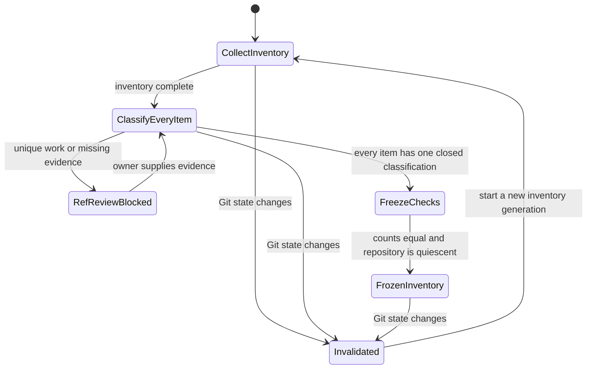
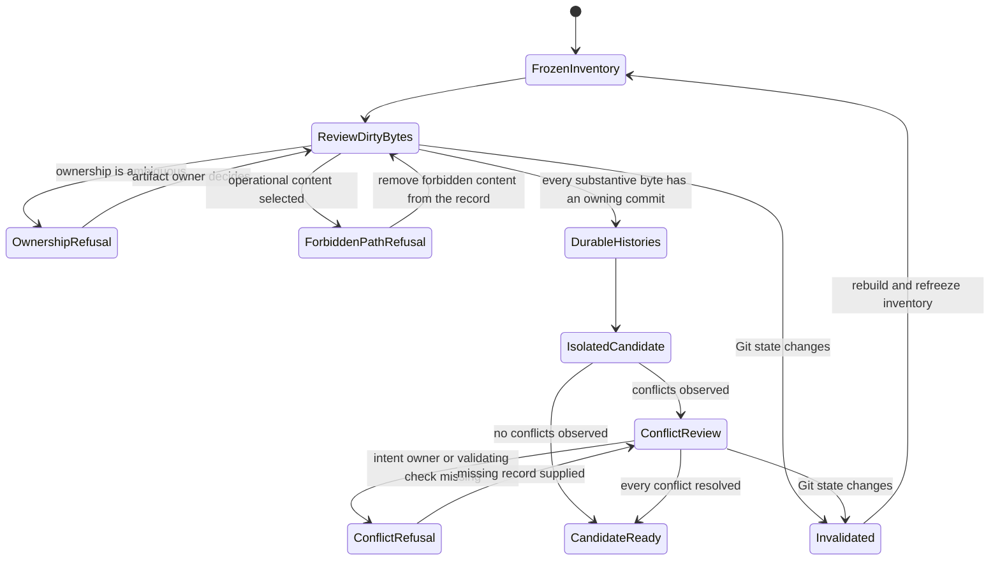
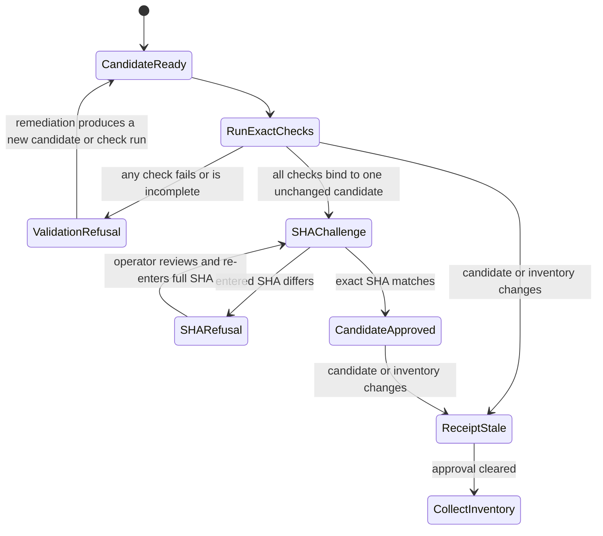
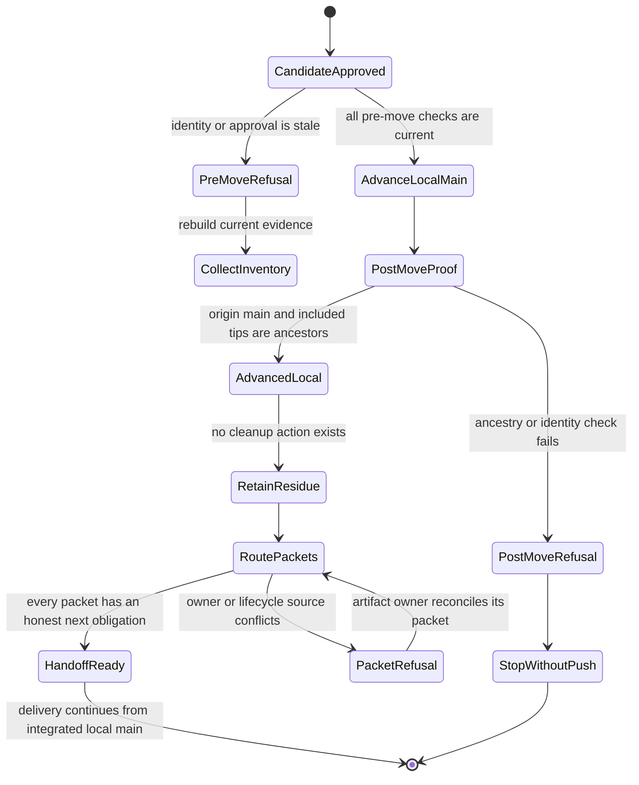

# OPS Specification: Integrate Research Lab Main

**Status:** Analyst specification ready for the canonical planning chain. No Git integration has run.
**Packet:** `specs/_ops/OPS-integrate-research-lab-main`
**Business owner:** The Research Lab operator
**Specification owner:** `bubbles.analyst`

This artifact defines required operational behavior. It does not claim implementation, validation, publication, certification, or human acceptance.

## Problem Statement

Research Lab has concurrent delivery work across local `main`, remote `main`, checkpoint branches, preservation refs, stashes, and registered worktrees. The histories cannot be combined safely by treating every fetched ref as a merge input.

The current local `main` and `origin/main` have diverged. The primary checkout also contains uncommitted Feature 030 and BUG-022 work. Company and Shock work live on separate checkpoint tips. Preservation refs retain additional trees that need classification before exclusion.

A direct update to `main` could lose uncommitted bytes, include obsolete preservation commits, or erase conflict decisions. It could also turn a successful merge into an unsupported delivery claim. The integration needs a separate, evidence-bearing operation that preserves history before moving `main`.

## Outcome Contract

**Intent:** Produce one locally integrated Research Lab history without losing intended local, remote, checkpoint, stash, Company, Shock, Feature 030, or BUG-022 work. Resume the existing delivery goal from that integrated history without changing any packet's status or human acceptance by inference.

**Success Signal:** `origin/main` and every selected delivery tip are ancestors of the final local `main`. Every ref has a recorded classification. Every conflict has a recorded resolution. The exact integrated revision passes the applicable repository validation contract before `main` moves. The operation performs no push or destructive cleanup without separate authorization.

**Hard Constraints:**

- Fetch and merge are distinct actions. Fetching all refs never means merging all refs.
- Preserve every unique intended tree before excluding any branch, ref, stash, or worktree.
- Commit substantive dirty bytes on their owning histories before integration.
- Never commit `.bubbles-worktree` or session-scoped runtime ledgers.
- Integrate through a separate branch and worktree. Keep source histories intact during construction and validation.
- Record every conflict, competing intent, resolution, and validation consequence.
- Validate the integrated revision before updating local `main`.
- Keep push and destructive cleanup outside the authorized integration action.
- Preserve active Feature 030, BUG-022, Company, and Shock records without inferring terminal status.
- Preserve every human acceptance record without modification or inference.
- Resume the existing delivery goal only after the integrated local `main` satisfies this contract.

**Failure Condition:** The operation fails if intended work disappears, a preservation ref is merged without classification, or `main` moves before validation. It also fails if a push or destructive cleanup occurs without separate authorization. Any inferred completion, certification, or acceptance is failure.

## Goals

1. Inventory every local branch, remote-tracking ref, checkpoint, preserve ref, stash, rescue root, and worktree registration.
2. Select only the latest non-superseded delivery tips that preserve all intended work.
3. Convert substantive dirty work into durable commits on its owning histories before integration.
4. Integrate local and remote history without rewriting or discarding source histories.
5. Preserve a complete conflict and resolution record.
6. Validate the exact integrated candidate before local `main` changes.
7. Prove ancestry for `origin/main` and every included tip after local `main` changes.
8. Resume the existing delivery goal from the integrated revision.

## Non-Goals

1. This packet does not push any ref.
2. This packet does not publish GitHub Pages.
3. This packet does not delete branches, refs, stashes, or files.
4. This packet does not remove or prune worktrees.
5. This packet does not rewrite source history.
6. This packet does not normalize feature, bug, scope, certification, or acceptance status.
7. This packet does not decide that a preservation ref is obsolete from its name alone.
8. This analyst phase does not author `objective.md`, `design.md`, `scopes.md`, `runbook.md`, `report.md`, or `uservalidation.md`.

## Authorization And Action Boundaries

The operator currently authorizes fetching all Research Lab remote branches and integrating intended histories into local `main`. The operator reports that fetch has already completed in the current session.

The authorization covers a history-preserving merge operation and prerequisite commits of substantive dirty work. This analyst invocation must not perform those actions. It creates planning artifacts only.

Push remains a separate external action. Deleting refs, dropping stashes, cleaning files, and removing worktrees remain separate destructive actions. Neither class is authorized by this invocation.

An executor must revalidate authorization and live repository state before mutation. A prior fetch or inventory cannot authorize a later push or destructive cleanup.

## Product Principle Alignment

| Principle | Application to this packet |
| --- | --- |
| Admission test | The operation protects delivery work that improves decision quality or its measurement. It adds no tool for its own sake. |
| P4, Misses are published | Integration must preserve BUG-022 and other adverse evidence. It must not curate history toward a cleaner result. |
| P13, Tickers only | Session markers and runtime ledgers stay outside committed product history. Existing public-data rules remain unchanged. |
| P21, Additive contracts | Source histories remain intact. Corrections and integration decisions add records instead of rewriting prior events. |
| P23, Guards must fail | Validation must include negative ancestry, exclusion, dirty-path, and conflict-accounting checks. |
| P24, Superseding closes | A ref may be classified as superseded only when its unique commits and tree are represented by a selected tip. |
| P25, Never block on status | Integration depends on represented histories and validated trees. It never depends on a packet being labeled terminal. |

The source of these principles is [Research Lab Product Principles](../../../docs/Product-Principles.md). This operation does not alter product behavior or claim that any delivery packet is complete.

## Current Capability Map

| Capability | Current evidence | Observed state | Packet disposition |
| --- | --- | --- | --- |
| Read-only workspace classification | [Command registry](../../../.specify/memory/agents.md) declares `scripts/session-review.mjs` as read-only | Available for audit, not an integration command | Reuse for evidence where applicable |
| Build-free validation | [Command registry](../../../.specify/memory/agents.md) lists exact Node, contract, browser, and Bubbles checks | Available, with no generic lint or format command | Plan the applicable exact checks |
| OPS packet governance | [OPS recipe](../../../.github/docs/recipes/ops-packet-work.md) defines the cross-cutting packet | Requires operational planning and owner-separated artifacts | Continue through the canonical planning chain |
| Main history integration | Current Git topology contains divergent local and remote histories | Not yet executed | Define and validate before moving `main` |
| Ref classification ledger | Current refs span delivery and preservation roles | No packet-owned ledger exists yet | Require one complete ledger |
| Conflict decision record | No integration has run in this packet | No conflict record exists yet | Require one record per conflict |
| Delivery continuation | Existing Feature 030, BUG-022, Company, and Shock packets carry their own state | Active records exist with different lifecycle states | Preserve and resume without relabeling |

## Honest Findings

### OPS-FINDING-001: The supplied empty-stash premise is no longer current

The live stash list contains `stash@{0}` at `156e37d149898b6f75021f0f348fe642b5fde645`. Its tracked payload is `market-brief.payload.json`. The remote stash mirror resolves to the same object. Equality proves a mirror exists, not that either ref is disposable.

### OPS-FINDING-002: The preservation-ref count changed after the earlier classification

The live inventory contains 39 `origin/checkpoint/**` refs, one `origin/preserve/**` ref, and one checkpoint stash ref. The earlier operator context named 36 checkpoint refs. Execution must always rebuild the ledger from live refs.

### OPS-FINDING-003: Feature 030 has conflicting lifecycle signals

[Feature 030 state](../../030-budget-aware-hybrid-brief-generation/state.json) records top-level `status: not_started`. Its execution block records implementation and test claims. The primary checkout also has twelve modified tracked paths associated with Feature 030 and BUG-022. Integration must preserve this record without resolving the contradiction by inference.

### OPS-FINDING-004: The latest Company checkpoint is not the r11 branch tip

The Company r11 branch resolves to `f19f9c34780f25935101e604dbc50a83213e9e4f`. Its checkpoint resolves to `9f6319b8afdc74991f063f9f1310c711850d38f7`. The checkpoint adds one commit and has 34 commits absent from current local `main`.

### OPS-FINDING-005: The latest Shock checkpoint is not the original branch tip

The Shock branch resolves to `d0c09a3ec90d2bb72920caee9e44f1d5f697c619`. Its checkpoint resolves to `e43c83a414ca90fb16054463aae8328e4b08a064`. The checkpoint adds one commit and remains one commit divergent from current local `main`.

The Shock worktree also contains five modified tracked bug-artifact paths. Their location does not prove that they belong to Shock delivery. The executor must classify their ownership and preserve their bytes before integration.

### OPS-FINDING-006: Two registered worktrees are prunable

Two registrations point to missing worktree locations. Prunability is metadata state only. It does not prove that the associated branch tips or remote mirrors are represented elsewhere.

### OPS-FINDING-007: OPS and generic artifact inventories form a union

The [OPS recipe](../../../.github/docs/recipes/ops-packet-work.md) requires `objective.md`, `design.md`, `scopes.md`, `runbook.md`, `report.md`, and `state.json`. The installed generic artifact lint also requires `spec.md` and `uservalidation.md`. Each owner must create its artifact through the registered chain.

### OPS-FINDING-008: Git was quiescent only at the observation point

The current scan found no lockfiles, operation markers, or matching Git writer processes. This fact is volatile. The executor must repeat the check immediately before each mutation boundary.

## Current Evidence Baseline

The following values came from bounded, read-only commands executed on 2026-09-03. They are starting evidence, not immutable requirements.

| Fact | Current observation |
| --- | --- |
| Primary checkout branch | `checkpoint/research-lab-20260902-7fbaa/late/feature-030-design` |
| Primary checkout tip | `eba665b8ee5569b2bb14c4ab6f868cb7636788c8` |
| Local `main` | `fa9be9ddcd330220171c7e374071be6856adc677` |
| `origin/main` | `397dc41d7c4189299d2e2ceb0486927545e39677` |
| Merge base | `c0d7f5568805af40fa77ae70e1387fbc5dbca2a5` |
| Main divergence | 79 commits local-only and 320 commits origin-only |
| Company checkpoint | `9f6319b8afdc74991f063f9f1310c711850d38f7`, with main divergence 4 left and 34 right |
| Shock checkpoint | `e43c83a414ca90fb16054463aae8328e4b08a064`, with main divergence 1 left and 1 right |
| Company worktree dirt | Only untracked `.bubbles-worktree` |
| Shock worktree dirt | Five modified tracked bug artifacts plus untracked `.bubbles-worktree` |
| Local stash | One entry at `156e37d149898b6f75021f0f348fe642b5fde645` |
| Remote stash mirror | Same object as the local stash |
| Rescue root | `5edd7b60a04e85c68da2da084a5d0a07d9e49f75`, with 567 main-only commits and one rescue-only commit |
| Remote Feature 025 branch | `origin/spec-025-company-intelligence` is already an ancestor of local `main` |
| Worktree registrations | Five total, including two prunable registrations |
| Git activity scan | No lockfile, operation marker, or matching writer process found |

The primary checkout's twelve tracked modifications are:

- `scripts/selftest.mjs`
- `site-exclusions.json`
- `specs/030-budget-aware-hybrid-brief-generation/report.md`
- `specs/030-budget-aware-hybrid-brief-generation/scenario-manifest.json`
- `specs/030-budget-aware-hybrid-brief-generation/scopes.md`
- `specs/030-budget-aware-hybrid-brief-generation/state.json`
- `specs/030-budget-aware-hybrid-brief-generation/test-plan.json`
- `specs/_bugs/BUG-022-historical-report-declaration-leak/report.md`
- `specs/_bugs/BUG-022-historical-report-declaration-leak/state.json`
- The OpenAI-compatible brief-author source and its two focused tests.

The Shock worktree's five tracked modifications are:

- `specs/_bugs/BUG-017-system-chrome-worker-teardown-force-kill-on-macos/report.md`
- `specs/_bugs/BUG-017-system-chrome-worker-teardown-force-kill-on-macos/state.json`
- `specs/_bugs/BUG-024-spec-path-historical-report-leak/design.md`
- `specs/_bugs/BUG-024-spec-path-historical-report-leak/spec.md`
- `specs/_bugs/BUG-024-spec-path-historical-report-leak/state.json`

## Source And Claim Boundaries

| Claim class | Permitted statement | Prohibited implication | Source |
| --- | --- | --- | --- |
| Executed repository fact | A bounded read-only command returned the listed hash, count, status, or path | That the fact remains unchanged after the observation | Current Evidence Baseline |
| Operator authorization | Merge and prerequisite preservation commits are authorized for the later integration action | That push or destructive cleanup is authorized | Authorization And Action Boundaries |
| Planned behavior | The requirements define what the integration must prove | That any merge, validation, or continuation already ran | Requirements |
| Existing packet state | A state artifact contains a recorded field | That the field is correct, terminal, certified, or accepted | Linked state artifact |
| Preservation mirror | Two refs resolve to the same object | That either ref may be removed | Ref-classification evidence |

## Capability Proportionality

### Single-Capability Justification

This packet defines one repository integration operation. It adds no shared product contract, screen, or reusable service. A foundation would add maintenance cost without reducing integration risk.

The operation uses stable terms for source history, delivery tips, preservation refs, and represented trees. It also defines integration candidates, conflict records, validation receipts, and final local `main`.

## Actors & Personas

| Actor | Description | Key goals | Permission boundary |
| --- | --- | --- | --- |
| Research Lab operator | Owns repository publication and destructive-action authority | Preserve all intended work and resume delivery from one coherent history | Push and cleanup require explicit, separate authorization |
| Integration executor | Performs the later bounded integration operation | Classify refs, preserve bytes, integrate histories, and record decisions | Cannot infer inclusion from ref names or change acceptance state |
| Delivery owner | Owns Feature 030, BUG-022, Company, or Shock work | Keep owned commits, dirty bytes, evidence, and lifecycle records intact | Cannot use integration to claim terminal delivery |
| Independent validator | Evaluates the exact integration candidate | Reject missing ancestry, dirty-path leakage, conflicts, or test failures | Cannot move `main` or certify human acceptance |
| Pages publisher | Performs a separately authorized external publication | Publish only a validated final revision | Has no authority in this integration packet |

## Use Cases

### UC-OPS-001: Build The Complete Ref Ledger

- **Actor:** Integration executor
- **Preconditions:** Repository packet and merge authorization are current.
- **Main Flow:** Inventory every ref and worktree. Record identity, ancestry, tree uniqueness, ownership, category, and proposed disposition.
- **Alternative Flows:** If state changes during inventory, discard the candidate ledger and rebuild it.
- **Postconditions:** Every ref has one evidence-backed classification. No ref has been merged or removed.

### UC-OPS-002: Preserve Dirty Delivery Work

- **Actor:** Delivery owner
- **Preconditions:** Dirty tracked and untracked paths have been inventoried by owning history.
- **Main Flow:** Exclude operational markers. Review substantive bytes. Commit those bytes on the owning history before integration.
- **Alternative Flows:** If ownership is ambiguous, stop before commit and resolve ownership through the packet owner.
- **Postconditions:** Every intended dirty byte is durable. No `.bubbles-worktree` or runtime ledger enters a commit.

### UC-OPS-003: Construct The Integration Candidate

- **Actor:** Integration executor
- **Preconditions:** Selected tips are durable and the repository is quiescent.
- **Main Flow:** Create a separate integration branch and worktree. Integrate `origin/main` and each selected tip. Record every conflict decision.
- **Alternative Flows:** If a conflict lacks an evidence-backed resolution, keep the candidate isolated and stop the integration.
- **Postconditions:** Source refs remain intact. The candidate contains every selected history.

### UC-OPS-004: Validate And Advance Local Main

- **Actor:** Independent validator
- **Preconditions:** The integration candidate is complete and has no unresolved conflict.
- **Main Flow:** Recreate required generated artifacts. Run applicable exact checks. Verify ancestry and excluded paths. Approve the exact candidate revision.
- **Alternative Flows:** If any check fails, local `main` remains unchanged.
- **Postconditions:** Local `main` moves only to the validated candidate. No push occurs.

### UC-OPS-005: Resume Delivery

- **Actor:** Delivery owner
- **Preconditions:** Final local `main` satisfies ancestry and validation requirements.
- **Main Flow:** Reopen each active delivery context from the integrated revision. Continue from its recorded owner and lifecycle state.
- **Alternative Flows:** If packet state conflicts with integrated content, route reconciliation to the artifact owner.
- **Postconditions:** Delivery continues without inferred completion, certification, or acceptance.

## Requirements

### Inventory And Classification

- **OPS-FR-001:** The executor must refresh local and remote-tracking ref inventories at execution time.
- **OPS-FR-002:** The executor must record fetch as a separate completed action from branch selection and merge.
- **OPS-FR-003:** The executor must classify every local branch, remote-tracking ref, checkpoint ref, preserve ref, stash ref, rescue ref, and worktree registration.
- **OPS-FR-004:** Each classification must record the full ref name, object identity, family, ownership, ancestry, unique commits, unique tree paths, selected action, and evidence.
- **OPS-FR-005:** The closed classification vocabulary is `canonical-input`, `delivery-candidate`, `included-tip`, `represented-preservation`, `superseded-delivery`, `rescue-root`, and `worktree-metadata`.
- **OPS-FR-006:** A checkpoint, preserve, stash, or rescue ref must remain excluded from merge unless it contains intended unique work.
- **OPS-FR-007:** A preservation ref must never become an automatic merge input because fetch discovered it.
- **OPS-FR-008:** A delivery family may contribute only its latest non-superseded tip after that tip proves representation of all intended predecessor work.
- **OPS-FR-009:** An older tip may be excluded only after commit and tree evidence proves its intended content represented elsewhere.

### Dirty Work Preservation

- **OPS-FR-010:** The executor must inventory dirty tracked, untracked, staged, and ignored paths in every registered live worktree before integration.
- **OPS-FR-011:** The executor must preserve substantive dirty bytes in commits on their owning histories before merging those histories.
- **OPS-FR-012:** The executor must resolve ambiguous ownership before committing a dirty path.
- **OPS-FR-013:** No commit may contain `.bubbles-worktree`, `.specify/runtime/tool-calls.jsonl`, session logs, transient worktree metadata, or generated test output.
- **OPS-FR-014:** A stash may be excluded only after its base, index, and worktree trees are compared against selected histories.
- **OPS-FR-015:** The executor must preserve all packet state and evidence bytes while leaving certification and human acceptance semantics unchanged.

### Candidate Construction

- **OPS-FR-016:** The executor must construct the candidate on a new integration branch in a separate worktree.
- **OPS-FR-017:** Candidate construction must not rewrite, reset, delete, or repoint any source branch or preservation ref.
- **OPS-FR-018:** The candidate must preserve both local `main` and `origin/main` history.
- **OPS-FR-019:** The candidate must include the latest non-superseded Feature 030, BUG-022, Company, and Shock delivery tips.
- **OPS-FR-020:** Every textual, structural, generated-artifact, and delete-versus-modify conflict must receive a conflict record.
- **OPS-FR-021:** Each conflict record must name the path, competing histories, intended behavior, chosen resolution, owner, and validating check.
- **OPS-FR-022:** A changed ref, worktree, stash, lock, or writer state invalidates the candidate inventory and requires reclassification before mutation continues.

### Validation And Main Update

- **OPS-FR-023:** The executor must recreate each affected registered Pages artifact and owned brief or publication artifact with its committed producer.
- **OPS-FR-024:** The validator must run every applicable exact command from the [Research Lab command registry](../../../.specify/memory/agents.md) against one unchanged candidate revision.
- **OPS-FR-025:** Validation must prove ref-ledger completeness, conflict-ledger completeness, forbidden-path exclusion, clean candidate state, and required product behavior.
- **OPS-FR-026:** Any failed or incomplete check must leave local `main` unchanged.
- **OPS-FR-027:** Local `main` may move only after the validator records the exact approved candidate identity.
- **OPS-FR-028:** After local `main` moves, `origin/main` and every included delivery tip must be ancestors of final local `main`.
- **OPS-FR-029:** The operation must not push local `main` or any integration ref.
- **OPS-FR-030:** Branch deletion, ref deletion, stash dropping, file cleaning, worktree pruning, and worktree removal require separate destructive authorization.
- **OPS-FR-031:** Cleanup eligibility requires proof that each targeted unique commit and tree is represented by final local `main` or another retained ref.

### Delivery Continuation

- **OPS-FR-032:** After final local validation, the workflow must resume the existing delivery goal from the integrated revision.
- **OPS-FR-033:** Resume routing must use each packet's recorded owner and current non-inferred lifecycle state.
- **OPS-FR-034:** Integration success must not mark Feature 030, BUG-022, Company, Shock, any scope, or any acceptance item complete.
- **OPS-FR-035:** Push eligibility remains outside this packet until a separate publication action receives explicit authorization.

## User Scenarios (Gherkin)

### BS-OPS-001 / SCN-OPS-001: Fetch Does Not Select Merge Inputs

```gherkin
Scenario: Fetch remains separate from merge selection
  Given all available remote refs have been fetched
  When the executor begins integration planning
  Then every ref is classified before any merge input is selected
  And preservation refs are not selected merely because they were fetched
```

### BS-OPS-002 / SCN-OPS-002: Every Ref Receives One Classification

```gherkin
Scenario: Complete ref classification
  Given local, remote, checkpoint, preserve, stash, rescue, and worktree refs exist
  When the executor freezes the integration inventory
  Then every discovered item has exactly one closed-vocabulary classification
  And every classification includes identity, ancestry, tree, ownership, action, and evidence
```

### BS-OPS-003 / SCN-OPS-003: Preservation Mirrors Stay Out Of The Merge

```gherkin
Scenario: Preservation refs are excluded after representation proof
  Given a checkpoint, preserve, or stash ref mirrors a selected history
  When object and tree evidence proves all intended content represented
  Then the ref remains available as preservation evidence
  And the integration excludes it as a separate merge input
```

### BS-OPS-004 / SCN-OPS-004: Unique Preservation Work Blocks Exclusion

```gherkin
Scenario: Unique preservation work cannot be discarded
  Given a preservation or rescue ref contains intended unique content
  When the executor evaluates its disposition
  Then the ref cannot be classified as represented or superseded
  And integration stops until the content receives an owned durable history
```

### BS-OPS-005 / SCN-OPS-005: Dirty Substantive Work Becomes Durable

```gherkin
Scenario: Dirty work is committed on its owning history
  Given a live worktree contains substantive tracked or untracked changes
  When that history becomes an integration candidate
  Then the intended bytes are reviewed and committed on their owning history first
  And the commit excludes operational markers and runtime ledgers
```

### BS-OPS-006 / SCN-OPS-006: Latest Non-Superseded Tips Are Included

```gherkin
Scenario: Delivery families contribute their latest complete tips
  Given Company and Shock checkpoints each extend their original branch tips
  When the executor selects delivery inputs
  Then the latest non-superseded checkpoint from each family is selected
  And an older family tip is excluded only after representation proof
```

### BS-OPS-007 / SCN-OPS-007: Candidate Construction Is Isolated

```gherkin
Scenario: Integration uses an isolated branch and worktree
  Given all selected tips are durable and the repository is quiescent
  When candidate construction begins
  Then it occurs on a new integration branch in a separate worktree
  And every source branch, stash, and preservation ref remains unchanged
```

### BS-OPS-008 / SCN-OPS-008: Every Conflict Is Accounted For

```gherkin
Scenario: Conflict resolutions remain reviewable
  Given selected histories disagree on a path or artifact meaning
  When the executor resolves the conflict
  Then the conflict record names both intents and the chosen behavior
  And a specific validation check proves the resolution
```

### BS-OPS-009 / SCN-OPS-009: Repository Drift Invalidates The Inventory

```gherkin
Scenario: Concurrent Git state change stops mutation
  Given an approved inventory and candidate plan exist
  When a ref, worktree, stash, lock, or writer state changes
  Then the executor stops before the next mutation
  And rebuilds the classification ledger from live state
```

### BS-OPS-010 / SCN-OPS-010: Validation Failure Leaves Main Unchanged

```gherkin
Scenario: Failed validation cannot update main
  Given an integration candidate exists
  When any required generation, ancestry, safety, or product check fails
  Then local main remains at its pre-operation identity
  And the isolated candidate retains the failure evidence
```

### BS-OPS-011 / SCN-OPS-011: Validated Candidate Advances Local Main

```gherkin
Scenario: Main advances only to the validated revision
  Given one unchanged candidate revision satisfies every required check
  When the authorized local main update occurs
  Then local main identifies that exact candidate
  And origin main plus every included tip are its ancestors
```

### BS-OPS-012 / SCN-OPS-012: Integration Does Not Publish

```gherkin
Scenario: Local integration ends without push
  Given local main has advanced to the validated candidate
  When the integration action finishes
  Then no local or remote ref is pushed
  And publication remains a separately authorized action
```

### BS-OPS-013 / SCN-OPS-013: Cleanup Requires Separate Authorization

```gherkin
Scenario: Represented residue remains until cleanup approval
  Given a branch, stash, or worktree is proven represented by retained history
  When the integration action completes
  Then the residue remains present
  And removal requires separate destructive authorization
```

### BS-OPS-014 / SCN-OPS-014: Lifecycle And Acceptance Stay Honest

```gherkin
Scenario: Merge success does not imply delivery completion
  Given Feature 030, BUG-022, Company, and Shock carry independent state records
  When their histories become ancestors of final local main
  Then every lifecycle and certification field keeps its artifact-owned meaning
  And no human acceptance item changes by inference
```

### BS-OPS-015 / SCN-OPS-015: Delivery Resumes From Integrated Main

```gherkin
Scenario: Existing delivery continues after integration
  Given final local main satisfies validation and ancestry requirements
  When the workflow resumes the existing delivery goal
  Then each active packet returns to its recorded owner and next obligation
  And no packet receives a terminal status from integration alone
```

## Acceptance Criteria

| Criterion | Scenario coverage | Required proof |
| --- | --- | --- |
| Fetch and merge remain distinct | SCN-OPS-001 | Ref ledger shows fetched refs and selected inputs separately |
| Every ref is classified | SCN-OPS-002 | Inventory cardinality equals classified-item cardinality |
| Preservation refs are neither blindly merged nor discarded | SCN-OPS-003, SCN-OPS-004 | Object, ancestry, and tree evidence for every exclusion |
| Dirty work is durable and cleanly bounded | SCN-OPS-005 | Owning commits plus forbidden-path scan |
| Latest delivery tips are selected | SCN-OPS-006 | Family lineage and supersession evidence |
| Source histories remain unchanged during candidate construction | SCN-OPS-007 | Before-and-after source ref identities |
| Every conflict is recorded | SCN-OPS-008 | Conflict inventory equals resolution inventory |
| Concurrent state changes fail closed | SCN-OPS-009 | Adversarial drift check leaves mutation unapplied |
| Main changes only after validation | SCN-OPS-010, SCN-OPS-011 | Candidate receipt and exact main identity |
| Final main contains every required history | SCN-OPS-011 | Ancestor proof for `origin/main` and every included tip |
| Integration neither pushes nor cleans | SCN-OPS-012, SCN-OPS-013 | Remote-ref and residue evidence after completion |
| Packet truth remains independent | SCN-OPS-014 | State and acceptance diff shows no inferred transition |
| Delivery resumes from integrated history | SCN-OPS-015 | Owner routing records point at final local main |

## UI Scenario Matrix

No product screen is planned. The mandatory UX phase must define operator-visible status, refusal, conflict, and evidence language for this non-UI workflow.

| Scenario | Actor | Entry point | Expected outcome | Surface |
| --- | --- | --- | --- | --- |
| Ref classification | Integration executor | OPS execution handoff | Every ref receives one visible disposition | Classification record |
| Conflict resolution | Delivery owner | Conflict review | Both intents and the selected resolution remain readable | Conflict record |
| Validation refusal | Independent validator | Candidate validation | The failed check and unchanged `main` are explicit | Validation record |
| Integration completion | Research Lab operator | Final local report | Ancestry, no-push, and next-owner facts are explicit | OPS report |

## Competitive Analysis

None found. Competitor research would not change this repository's history-preservation, ownership, authorization, or validation constraints.

## Improvement Proposals

None proposed outside this packet. The current need is a bounded integration operation, not a reusable product or framework capability.

## Exposure Contract

| Capability | Surface class | Surface id | Status | Plan |
| --- | --- | --- | --- | --- |
| ref classification | internal | OPS classification record | planned | `specs/_ops/OPS-integrate-research-lab-main` |
| history integration | internal | isolated integration candidate | planned | `specs/_ops/OPS-integrate-research-lab-main` |
| conflict accounting | internal | OPS conflict record | planned | `specs/_ops/OPS-integrate-research-lab-main` |
| candidate validation | internal | exact-revision validation receipt | planned | `specs/_ops/OPS-integrate-research-lab-main` |
| delivery continuation | internal | existing delivery workflow | planned | `specs/_ops/OPS-integrate-research-lab-main` |

This packet exposes no HTTP route, UI route, or project CLI command.

## Non-Functional Requirements

- **Safety:** No operation may make intended content unreachable from all retained refs.
- **Traceability:** Every included and excluded ref must have reviewable evidence.
- **Atomicity:** Local `main` must remain unchanged unless the full candidate validates.
- **Concurrency:** Any live Git state drift must stop mutation and invalidate the inventory.
- **Repeatability:** A second classification of unchanged refs must produce the same dispositions.
- **Bounded execution:** Every command and poll must have a finite limit under repository policy.
- **Operator clarity:** Status and refusal output must remain understandable without color or hidden context.
- **Privacy:** No secret, credential, private portfolio value, or machine-local path may enter committed artifacts.

## Evidence Sources

### Executed In This Analyst Run

- The inherited repository packet was validated unchanged against session control revision 58.
- Bounded read-only Git commands captured current branch, hashes, divergence, status, refs, worktrees, stash, ancestry, lockfiles, operation markers, and writer-process matches.
- Company and Shock checkpoint relationships were measured against their original branches and local `main`.
- The Research Lab product principles, command registry, OPS recipe, artifact lifecycle, workflow registry, and current packet states were read from this checkout.

### Repository Authorities

- [Research Lab Product Principles](../../../docs/Product-Principles.md) define product admission and honesty constraints.
- [Research Lab command registry](../../../.specify/memory/agents.md) defines the exact available checks.
- [OPS packet recipe](../../../.github/docs/recipes/ops-packet-work.md) defines the packet class and artifact set.
- [Artifact lifecycle](../../../.github/agents/bubbles_shared/artifact-lifecycle.md) defines OPS lifecycle requirements.
- [Artifact ownership](../../../.github/agents/bubbles_shared/artifact-ownership.md) defines writer boundaries.
- [Feature 030 state](../../030-budget-aware-hybrid-brief-generation/state.json) records the current Feature 030 lifecycle signals.
- [BUG-022 state](../../_bugs/BUG-022-historical-report-declaration-leak/state.json) records the current BUG-022 lifecycle signals.

### Not Executed Or Claimed

No fetch, merge, checkout, commit, reset, stash mutation, clean, push, ref deletion, or worktree removal ran in this invocation. No product test, deployment, publication, certification, or human acceptance action ran either.

## UI Wireframes

This workflow uses an operational text interface. It defines review order, visible records, decision prompts, and refusal language. It does not define a graphical product screen or a new project command.

Every view keeps the local-only boundary visible. No view offers push, branch deletion, ref deletion, stash dropping, file cleaning, worktree pruning, or worktree removal.

### Screen Inventory

| Screen | Actor(s) | Status | Scenarios Served |
| --- | --- | --- | --- |
| Inventory Freeze And Ref Classification | Integration executor, Research Lab operator | New | SCN-OPS-001, SCN-OPS-002, SCN-OPS-003, SCN-OPS-004, SCN-OPS-006, SCN-OPS-009 |
| Dirty-Byte Ownership Review | Delivery owner, Integration executor | New | SCN-OPS-004, SCN-OPS-005, SCN-OPS-007, SCN-OPS-009, SCN-OPS-014 |
| Conflict Review | Delivery owner, Integration executor, Independent validator | New | SCN-OPS-007, SCN-OPS-008, SCN-OPS-009 |
| Candidate Validation And Exact-SHA Approval | Independent validator, Research Lab operator | New | SCN-OPS-009, SCN-OPS-010, SCN-OPS-011 |
| Local Main Advancement Boundary | Integration executor, Research Lab operator | New | SCN-OPS-010, SCN-OPS-011, SCN-OPS-012, SCN-OPS-013 |
| Delivery Continuation Handoff | Delivery owner, Research Lab operator | New | SCN-OPS-012, SCN-OPS-013, SCN-OPS-014, SCN-OPS-015 |

### UI Primitives

| Primitive | Used By Screens | Composition Rule | Accessibility And Narrow-Terminal Rule |
| --- | --- | --- | --- |
| Operation Boundary Banner | All screens | Show repository alias, inventory identity, candidate identity when available, and the local-only action boundary first. | Repeat boundary words in text. Never encode authority through color. Wrap fields without truncating identities. |
| Phase Status Line | All screens | Use one closed workflow state and one plain-language reason. Never imply delivery completion. | Prefix the state before its explanation. Announce state changes before refreshed details. |
| Immutable Identity Block | Inventory, Candidate Approval, Main Advancement, Continuation | Show full object identities for frozen inputs, approved candidate, and local `main`. Never abbreviate an identity used for approval or movement. | Place each label and value on its own line below 80 columns. Allow character-by-character review. |
| Evidence-Linked Ledger Row | Inventory, Dirty-Byte Review, Conflict Review, Candidate Approval | Give every item a stable row identifier, evidence reference, owner, decision, and state. | Preserve row identifiers when rows stack. Put evidence links after the decision text. |
| Refusal And Remediation Block | All screens | Show refusal code, observed condition, required condition, owner, remediation, and unchanged boundary state. Never run remediation automatically. | Focus the refusal heading first. Keep observed and required facts on separate lines. |
| Exact-SHA Approval Challenge | Candidate Approval, Main Advancement | Require the operator to re-enter the full validated candidate SHA. Compare it exactly with the receipt-bound SHA. | Do not mask input. Read the full mismatch position and keep approval disabled on mismatch. |
| No-Push Boundary Footer | Candidate Approval, Main Advancement, Continuation | End the view with `PUSH: NOT AUTHORIZED` and `CLEANUP: NOT AUTHORIZED`. Provide no adjacent action that performs either operation. | Keep both boundaries in the normal reading order and visible at every terminal width. |

#### Closed Workflow States

| State | Operator-visible meaning |
| --- | --- |
| `PENDING` | The stage has not started and authorizes no mutation. |
| `IN-REVIEW` | The stage has open records that require evidence or an owner decision. |
| `FROZEN` | The inventory has one complete, quiescent, reviewable identity. |
| `INVALIDATED` | Live ref, worktree, stash, lock, or writer state changed after freeze. The workflow returns to inventory. |
| `REFUSED` | A stated requirement is unsatisfied. The named mutation remains disabled. |
| `APPROVED` | The operator approved one exact candidate SHA backed by current validation evidence. |
| `ADVANCED-LOCAL` | Local `main` identifies the approved candidate. This state does not authorize push. |
| `HANDOFF-READY` | Local ancestry and routing records support delivery continuation without changing packet state. |

Validation rows use the closed check states `NOT-RUN`, `RUNNING`, `SATISFIED`, `FAILED`, and `STALE`. A `FAILED` or `STALE` row makes the containing stage `REFUSED`.

#### Closed Ref Classifications

| Classification | Visible meaning | Merge selection behavior |
| --- | --- | --- |
| `canonical-input` | A required baseline history for the integration. | Eligible only through the frozen candidate plan. |
| `delivery-candidate` | A delivery-family tip still under ownership and representation review. | Not selected until its review closes. |
| `included-tip` | The selected latest non-superseded tip for one intended history. | Included once in the candidate plan. |
| `represented-preservation` | A retained preservation ref whose intended commits and tree are represented by a selected tip. | Excluded as a separate merge input and retained. |
| `superseded-delivery` | An older delivery tip represented by a later selected tip. | Excluded only with commit and tree evidence. |
| `rescue-root` | A rescue history requiring explicit unique-work review. | Never selected or excluded by its name alone. |
| `worktree-metadata` | A worktree registration record rather than a delivery history. | Never treated as a merge input. |

### Screen: Inventory Freeze And Ref Classification

**Actor:** Integration executor, Research Lab operator | **Surface:** OPS text view `inventory` | **Status:** New

```text
┌─ OPS INTEGRATION / INVENTORY ───────────────────────────────────────┐
│ Repository       [repository alias]                                │
│ Workflow state   [PENDING | IN-REVIEW | FROZEN | INVALIDATED]      │
│ Inventory        [inventory identity or not frozen]                │
│ Boundary         LOCAL ONLY                                        │
│ PUSH             NOT AUTHORIZED                                    │
│ CLEANUP          NOT AUTHORIZED                                    │
├─ BASELINE IDENTITIES ───────────────────────────────────────────────┤
│ local main       [full SHA]                                        │
│ origin/main      [full SHA]                                        │
│ observed at      [bounded observation time]                        │
├─ CLASSIFICATION LEDGER ─────────────────────────────────────────────┤
│ [row] [full ref]        [object]  [closed classification]          │
│       family=[family]   owner=[owner]   action=[selected action]   │
│       ancestry=[facts]  unique=[commits and paths]                 │
│       evidence=[evidence reference]                                │
│ ...                                                              │
├─ FREEZE CHECK ──────────────────────────────────────────────────────┤
│ Coverage         [classified count] / [inventory count]            │
│ Quiescence       [check state] [evidence reference]                │
│ [Review row]  [Record classification]  [Freeze inventory]         │
└─ Next: Dirty-byte review [disabled until FROZEN] ──────────────────┘
```

**Interactions:**

- `Review row` opens the row's identity, ancestry, tree, owner, and evidence fields.
- `Record classification` accepts only the seven closed ref classifications.
- Choosing `represented-preservation` or `superseded-delivery` requires representation evidence before the record can close.
- `Freeze inventory` requires equal inventory and classification counts plus a current quiescence check.
- Any observed Git-state change sets the view to `INVALIDATED` and disables later mutation stages.

**States:**

- Empty: show `REFUSED` with `observed: no complete inventory` and keep freeze disabled.
- Loading: show `IN-REVIEW` and append numbered records without changing prior row identifiers.
- Error: show the refusal block with the failed observation, required evidence, owner, and inventory rebuild action.
- Frozen: show one inventory identity and make it visible on every later screen.
- Invalidated: retain the old identity as stale evidence and start a distinct inventory generation.

**Responsive:**

- Below 100 columns, render each ledger row as a labeled vertical record.
- Never truncate full ref names, full object identities, classification labels, or boundary text.

**Accessibility:**

- Use row numbers and explicit labels so screen readers do not depend on column alignment.
- Keep all actions keyboard reachable in ledger order.
- Announce `INVALIDATED` before displaying the changed item.

### Screen: Dirty-Byte Ownership Review

**Actor:** Delivery owner, Integration executor | **Surface:** OPS text view `dirty-review` | **Status:** New

```text
┌─ OPS INTEGRATION / DIRTY-BYTE REVIEW ───────────────────────────────┐
│ Inventory        [frozen inventory identity]                       │
│ Workflow state   [PENDING | IN-REVIEW | REFUSED | FROZEN]          │
│ Boundary         LOCAL ONLY | PUSH NOT AUTHORIZED                  │
├─ WORKTREE SUMMARY ──────────────────────────────────────────────────┤
│ [worktree id] [owning history] [tracked/staged/untracked counts]   │
│ [worktree id] [owning history] [tracked/staged/untracked counts]   │
├─ BYTE REVIEW ───────────────────────────────────────────────────────┤
│ [item id] path=[path]                                              │
│   owner=[owner or unresolved]                                      │
│   decision=[PRESERVE | EXCLUDE-OPERATIONAL | OWNERSHIP-UNRESOLVED] │
│   evidence=[byte review reference]                                 │
│   durable history=[full commit SHA or not durable]                 │
├─ FORBIDDEN COMMIT CONTENT ──────────────────────────────────────────┤
│ [.bubbles-worktree] [runtime ledger] [session log] [test output]   │
│ [Inspect bytes]  [Confirm owner]  [Record preservation evidence]  │
└─ Candidate construction [disabled until every item closes] ───────┘
```

**Interactions:**

- `Inspect bytes` opens a read-only, path-scoped byte review linked to the item record.
- `Confirm owner` records the delivery owner responsible for a substantive path.
- `Record preservation evidence` accepts a full durable commit identity from the owning history.
- `OWNERSHIP-UNRESOLVED` sets the stage to `REFUSED` and identifies the required owner decision.
- A forbidden path match blocks the preservation record and names the path that must remain outside committed history.

**States:**

- Empty: show `FROZEN` with `No substantive dirty bytes found` only after every live worktree was checked.
- Loading: show `IN-REVIEW` with the current worktree and item count.
- Error: show `REFUSED`, preserve reviewed rows, and keep candidate construction disabled.
- Complete: every substantive item shows an owner, byte evidence, and full durable commit identity.
- Invalidated: return to the inventory screen when worktree or ref state changes.

**Responsive:**

- Stack one dirty item per block below 100 columns.
- Keep the path, owner decision, and full durable identity on separate untruncated lines.

**Accessibility:**

- Label operational exclusions and substantive preservation decisions with words, not symbols alone.
- Move focus to the first unresolved item after each recorded decision.
- Announce forbidden-path refusals with the path before remediation text.

### Screen: Conflict Review

**Actor:** Delivery owner, Integration executor, Independent validator | **Surface:** OPS text view `conflicts` | **Status:** New

```text
┌─ OPS INTEGRATION / CONFLICT REVIEW ─────────────────────────────────┐
│ Inventory        [frozen inventory identity]                       │
│ Candidate        [full candidate SHA or construction identity]     │
│ Workflow state   [PENDING | IN-REVIEW | REFUSED | FROZEN]          │
├─ CONFLICT LEDGER ───────────────────────────────────────────────────┤
│ [conflict id] path=[path] type=[text|structure|generated|delete]   │
│   histories=[history A] <> [history B]                             │
│   state=[UNRESOLVED | RESOLVED | STALE] owner=[owner]              │
├─ SELECTED CONFLICT ─────────────────────────────────────────────────┤
│ Intent A         [behavior and evidence]                           │
│ Intent B         [behavior and evidence]                           │
│ Chosen behavior  [one explicit resolution]                         │
│ Validation check [specific check and evidence destination]         │
│ [Review intents]  [Record resolution]  [Mark stale]                │
└─ Candidate validation [disabled while unresolved or stale] ───────┘
```

**Interactions:**

- `Review intents` presents both competing histories before the chosen behavior.
- `Record resolution` requires path, histories, intended behavior, owner, and one specific validating check.
- `Mark stale` preserves the prior decision and returns the conflict to review.
- A missing owner, missing intent, or missing validation check sets the stage to `REFUSED`.
- Any inventory invalidation makes all candidate-bound conflict decisions `STALE`.

**States:**

- Empty: show `No conflicts observed` with the candidate identity and construction evidence.
- Loading: show `IN-REVIEW` and the conflict inventory count.
- Error: show `REFUSED`, the incomplete field, its required value, and the responsible owner.
- Resolved: show equal conflict and resolution counts before enabling validation.
- Stale: retain the prior resolution as history and require review against the new candidate.

**Responsive:**

- Render the two intents sequentially on narrow terminals, followed by the chosen behavior.
- Keep conflict identifiers, paths, and candidate identity visible without horizontal scrolling.

**Accessibility:**

- Label the competing histories as `Intent A` and `Intent B` in the reading order.
- Place focus on the first missing resolution field when a record is refused.
- Announce count changes and stale decisions without relying on color.

### Screen: Candidate Validation And Exact-SHA Approval

**Actor:** Independent validator and Research Lab operator.

**Surface:** OPS text view `candidate-approval`. **Status:** New.

```text
┌─ OPS INTEGRATION / CANDIDATE APPROVAL ──────────────────────────────┐
│ Inventory        [frozen inventory identity]                       │
│ Candidate SHA    [full candidate SHA]                              │
│ Candidate state  [PENDING | IN-REVIEW | REFUSED | APPROVED]        │
│ local main       [unchanged full pre-operation SHA]                │
├─ VALIDATION RECEIPT ────────────────────────────────────────────────┤
│ Receipt binds to [full candidate SHA]                              │
│ [check id] [NOT-RUN|RUNNING|SATISFIED|FAILED|STALE] [evidence]    │
│ ...                                                              │
│ Candidate clean  [check state]                                     │
│ Conflicts closed [resolved count] / [conflict count]               │
│ Refs classified  [classified count] / [inventory count]            │
├─ EXACT-SHA APPROVAL CHALLENGE ──────────────────────────────────────┤
│ Re-enter the full validated candidate SHA:                         │
│ > [operator-entered full SHA]                                      │
│ Match             [EXACT | MISMATCH | NOT ENTERED]                 │
│ [Approve exact SHA]  [Return to failed check]                      │
├─ ACTION BOUNDARY ───────────────────────────────────────────────────┤
│ Local main advance: DISABLED until APPROVED                        │
│ PUSH: NOT AUTHORIZED | CLEANUP: NOT AUTHORIZED                     │
└─────────────────────────────────────────────────────────────────────┘
```

**Interactions:**

- Selecting a validation row opens its complete evidence reference without changing the candidate.
- `Return to failed check` shows observed, required, remediation, owner, and `local main: unchanged`.
- `Approve exact SHA` compares the full entered value with the receipt-bound candidate SHA.
- A mismatch produces `REFUSED` with code `CANDIDATE-SHA-MISMATCH` and preserves local `main`.
- Candidate, inventory, or repository drift marks the receipt `STALE` and clears approval.

**States:**

- Empty: show `PENDING` until a candidate has one full identity.
- Loading: show each check as `RUNNING` while keeping approval disabled.
- Error: show `REFUSED` for any `FAILED`, `STALE`, incomplete, or mismatched check.
- Approved: show the full candidate SHA, receipt identity, approver, and approval time together.
- Invalidated: clear the approval state and route to inventory or candidate construction as named by the stale record.

**Responsive:**

- Put the candidate SHA, entered SHA, and match result on separate lines below 100 columns.
- Never abbreviate or ellipsize either SHA in the approval challenge.

**Accessibility:**

- Describe the exact mismatch in text and move focus to the first differing position.
- Announce every check-state change with its check identifier.
- Keep the action boundary after the approval control in reading order.

### Screen: Local Main Advancement Boundary

**Actor:** Integration executor, Research Lab operator | **Surface:** OPS text view `advance-local-main` | **Status:** New

```text
┌─ OPS INTEGRATION / LOCAL MAIN ADVANCEMENT ──────────────────────────┐
│ Approved candidate [full SHA]                                      │
│ Approval receipt   [receipt identity]                              │
│ local main before  [full SHA]                                      │
│ Workflow state     [APPROVED | REFUSED | ADVANCED-LOCAL]           │
├─ PRE-MOVE BOUNDARY ─────────────────────────────────────────────────┤
│ Inventory current  [SATISFIED | STALE]                             │
│ Candidate unchanged[SATISFIED | STALE]                             │
│ Exact approval     [SATISFIED | STALE]                             │
│ [Advance local main to approved SHA]                               │
├─ POST-MOVE PROOF ───────────────────────────────────────────────────┤
│ local main after   [full SHA or unchanged]                         │
│ origin/main        [ANCESTOR | NOT ANCESTOR | NOT CHECKED]         │
│ [included tip]     [ANCESTOR | NOT ANCESTOR | NOT CHECKED]         │
│ ...                                                              │
├─ EXPLICIT EXCLUSIONS ───────────────────────────────────────────────┤
│ Remote refs        UNCHANGED                                      │
│ Residue            RETAINED                                       │
│ PUSH               NOT AUTHORIZED                                 │
│ CLEANUP            NOT AUTHORIZED                                 │
└─ Continue delivery [disabled until ancestry is satisfied] ────────┘
```

**Interactions:**

- `Advance local main to approved SHA` is the only local-main action on this screen.
- The action remains disabled unless the frozen inventory, candidate, and exact approval are current.
- After advancement, the screen compares local `main` with the approved full SHA and displays every required ancestor result.
- Any failed post-move proof produces `REFUSED`, preserves the no-push boundary, and names the design-owned recovery decision.
- This screen never displays a push or destructive cleanup action.

**States:**

- Pending: show `APPROVED` while the final pre-move checks remain current.
- Error before movement: show `REFUSED` and `local main after: unchanged`.
- Advanced: show `ADVANCED-LOCAL` only when local `main` equals the approved candidate.
- Post-check refusal: show the failed ancestor row and keep delivery continuation disabled.
- Complete for this stage: show every included tip and `origin/main` as ancestors without changing any packet status.

**Responsive:**

- Stack ancestor results as one labeled record per ref below 100 columns.
- Keep full local-main and candidate identities untruncated.

**Accessibility:**

- Announce the before and after identities before the ancestry table.
- Use `ANCESTOR`, `NOT ANCESTOR`, and `NOT CHECKED` text instead of icons alone.
- Keep excluded actions visible as text so their absence cannot be mistaken for hidden controls.

### Screen: Delivery Continuation Handoff

**Actor:** Delivery owner, Research Lab operator | **Surface:** OPS text view `delivery-handoff` | **Status:** New

```text
┌─ OPS INTEGRATION / DELIVERY CONTINUATION ───────────────────────────┐
│ Workflow state    [ADVANCED-LOCAL | REFUSED | HANDOFF-READY]       │
│ Integrated main   [full local main SHA]                            │
│ PUSH              NOT AUTHORIZED                                  │
│ CLEANUP           NOT AUTHORIZED                                  │
├─ PACKET ROUTING ────────────────────────────────────────────────────┤
│ [packet id] owner=[recorded owner]                                 │
│   lifecycle=[recorded non-inferred state]                          │
│   next obligation=[artifact-owned next obligation]                 │
│   starts from=[full integrated main SHA]                           │
│ ...                                                              │
├─ HONESTY BOUNDARY ──────────────────────────────────────────────────┤
│ Integration completion: recorded                                  │
│ Delivery completion: NOT INFERRED                                 │
│ Certification: UNCHANGED                                          │
│ Human acceptance: UNCHANGED                                       │
│ [Review packet source]  [Acknowledge handoff]                      │
└─ Delivery resumes only through each recorded owner ───────────────┘
```

**Interactions:**

- `Review packet source` opens the packet-owned state used for owner and lifecycle routing.
- `Acknowledge handoff` records receipt without changing lifecycle, certification, or acceptance fields.
- A conflict between integrated content and packet state produces `REFUSED` and routes reconciliation to that artifact owner.
- The view reaches `HANDOFF-READY` only when every active packet has an owner, lifecycle source, next obligation, and integrated-main identity.
- No action on this screen publishes or removes repository state.

**States:**

- Empty: show `REFUSED` when an active delivery context has no recorded owner or next obligation.
- Loading: show packet rows as `IN-REVIEW` while preserving the no-push and no-cleanup boundaries.
- Error: show the conflicting packet field, its source, required owner, and remediation.
- Ready: show `HANDOFF-READY` without using `done`, `delivered`, or another terminal packet label.
- Continued: preserve the handoff record as routing evidence while each packet remains independently owned.

**Responsive:**

- Render each packet as a vertical block below 100 columns.
- Keep the integrated-main identity and honesty boundary above packet details.

**Accessibility:**

- Read owner, lifecycle, next obligation, and starting identity in that order.
- Announce conflicts before offering the source review action.
- Keep state meanings textual and independent of terminal styling.

## User Flows

### User Flow: Freeze Or Invalidate The Inventory



### User Flow: Preserve Dirty Bytes And Resolve Conflicts



### User Flow: Validate And Approve One Exact Candidate



### User Flow: Advance Local Main Without Publishing And Resume Delivery



### Scenario-To-Flow Coverage

| Scenario | Primary Screen | User Flow | Observable UX Contract |
| --- | --- | --- | --- |
| SCN-OPS-001 | Inventory Freeze And Ref Classification | Freeze Or Invalidate The Inventory | Fetched refs remain unselected until classification. |
| SCN-OPS-002 | Inventory Freeze And Ref Classification | Freeze Or Invalidate The Inventory | Inventory and classification counts must match before freeze. |
| SCN-OPS-003 | Inventory Freeze And Ref Classification | Freeze Or Invalidate The Inventory | Represented preservation refs remain visible, retained, and excluded. |
| SCN-OPS-004 | Inventory Freeze And Ref Classification | Preserve Dirty Bytes And Resolve Conflicts | Unique work produces a refusal until it receives an owning durable history. |
| SCN-OPS-005 | Dirty-Byte Ownership Review | Preserve Dirty Bytes And Resolve Conflicts | Every substantive item shows its owner, byte evidence, and durable commit identity. |
| SCN-OPS-006 | Inventory Freeze And Ref Classification | Freeze Or Invalidate The Inventory | Each delivery family exposes its selected latest tip and predecessor representation proof. |
| SCN-OPS-007 | Dirty-Byte Ownership Review | Preserve Dirty Bytes And Resolve Conflicts | Candidate construction remains isolated and source histories remain visible as unchanged. |
| SCN-OPS-008 | Conflict Review | Preserve Dirty Bytes And Resolve Conflicts | Every conflict shows both intents, one resolution, one owner, and one validating check. |
| SCN-OPS-009 | Inventory Freeze And Ref Classification | Freeze Or Invalidate The Inventory | Drift invalidates the current identity and returns the workflow to inventory. |
| SCN-OPS-010 | Candidate Validation And Exact-SHA Approval | Validate And Approve One Exact Candidate | Any failed or stale check shows `local main: unchanged`. |
| SCN-OPS-011 | Local Main Advancement Boundary | Advance Local Main Without Publishing And Resume Delivery | Local `main` can identify only the full receipt-bound and operator-approved candidate SHA. |
| SCN-OPS-012 | Local Main Advancement Boundary | Advance Local Main Without Publishing And Resume Delivery | The final stage shows `PUSH: NOT AUTHORIZED` and offers no push action. |
| SCN-OPS-013 | Local Main Advancement Boundary | Advance Local Main Without Publishing And Resume Delivery | Represented residue remains visible and no cleanup action exists. |
| SCN-OPS-014 | Delivery Continuation Handoff | Advance Local Main Without Publishing And Resume Delivery | Packet lifecycle, certification, and acceptance meanings remain unchanged. |
| SCN-OPS-015 | Delivery Continuation Handoff | Advance Local Main Without Publishing And Resume Delivery | Each packet resumes through its recorded owner and next obligation. |
